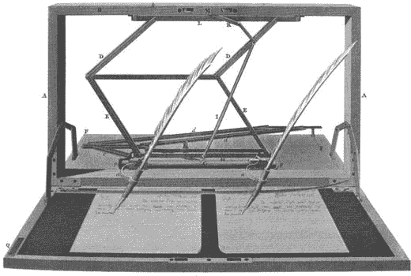
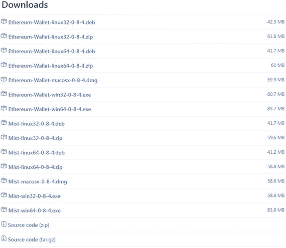
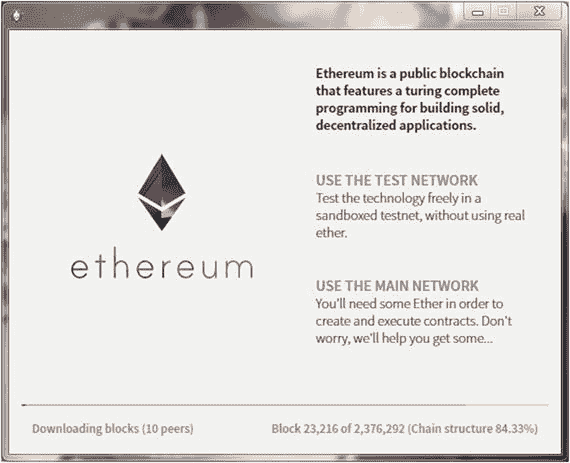
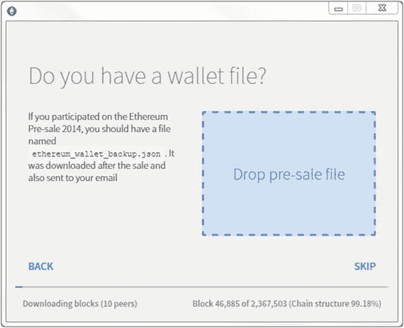
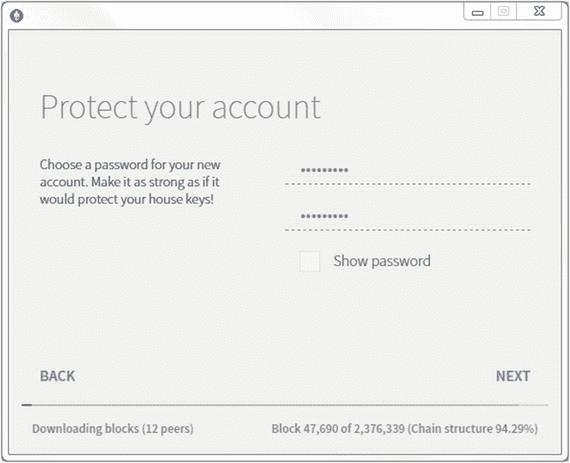
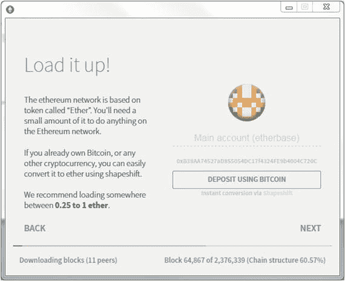
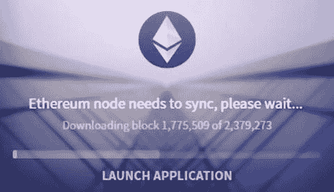
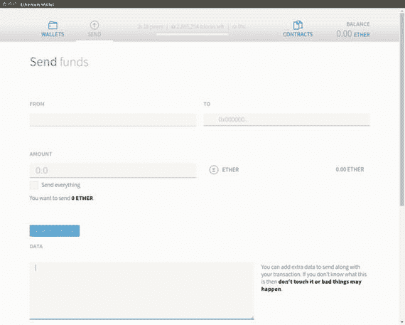
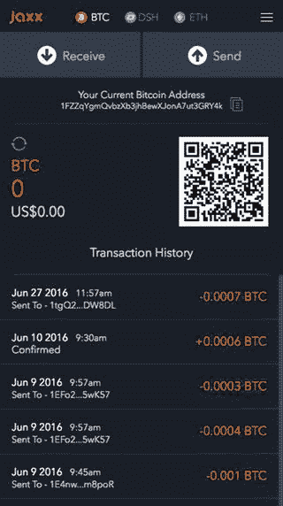
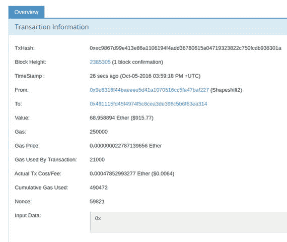

© Chris Dannen 2017Chris Dannen 介绍以太坊和 Solidity10.1007/978-1-4842-2535-6_2

# 2. The Mist 浏览器

在加密货币软件领域，通常有两种基本类型的客户端应用程序：钱包和完整节点 Chris Dannen^(1 )(1)美国纽约布鲁克林注钱包通常指的是连接到区块链以执行基本功能（如发送和接收加密货币）的轻量级节点。完整节点是可以执行网络允许的所有操作的命令行界面。正如我们在上一章中所讨论的，以太坊可以指的是以太坊协议和使用该协议的计算机创建的以太坊网络。在网络上运行节点允许您上传智能合约。对于发送和接收加密货币（在我们的情况下是以太币），您只需要计算机或智能手机上的钱包应用程序。以太坊有几个在本书中讨论的客户端应用程序。对于大多数读者来说，最有用的是 Mist 浏览器，这是一个用户友好的钱包，可以执行完整节点的某些职责，即执行智能合约。最终，整个类似 Web 应用程序的程序将通过 Mist 访问，并且它们的后端构建在以太坊上；这就是为什么它被称为浏览器。不要被 Mist 的简单性所愚弄。今天，它对于发送和接收以太币加密货币是有用的。但是明天，它也可能成为消费者和企业软件应用程序的分发点，几乎就像一个应用商店。注货币一词，如加密货币，指的是系统中可互换的价值单位，就像令牌或票据一样。这些小令牌到底代表什么将在本章后面变得清楚。应用于货币的可互换一词意味着“可以相互替换”。在法定货币方面，可以说一个美元可以互换另一个美元。在本章中，您将学习如何通过使用 Mist 和其他应用程序来访问网络，以便了解在账户之间发送和接收以太代币的基础知识。随后的章节将分解系统的工作原理以及如何为其编写智能合约。

## 钱包作为一种计算隐喻

钱包是桌面或移动设备上的软件应用程序，用于保存您对 EVM 的密钥。 这些密钥对应于一个帐户，该帐户由长帐户地址引用。 在以太坊中，帐户不存储您的姓名或任何其他个人信息。 它们是匿名的。 任何人都可以通过连接到任何以太坊客户端（例如 Mist）与网络连接来生成以太坊帐户。 您可以生成任意数量的帐户。如果您已经在计算机或手机上下载了以太坊钱包或完整节点，则可能会提示您创建帐户。 钱包应用程序可能还要求您创建一个密码，以加密方式保护您的密钥。 正如您可以了解的那样，这些密钥是发送和接收 ether 的重要部分。让我们从查看您的帐户地址开始，也称为公钥。 您的公钥具有一个相匹配的私钥，允许访问您的帐户。 此私钥应保密，并且不应在任何地方发布。比特币和以太坊中的帐户由长十六进制地址表示。 以太坊地址看起来像这样：0xB38AA74527aD855054DC17f4324FE9b4004C720C 在比特币协议中，原始十六进制地址使用内置版本号和校验和以 base 58 编码，但在底层看起来就像以太坊地址。 这是比特币地址的一个示例：1GDCKfdTo4yNDd9tEM4JsL8DnTVDw552Sy 要接收 ether 或 bitcoins，您必须向发送者提供您的地址，这就是为什么它被称为公钥。 当然，这些字符串是不可记忆的。 如果您是编程新手，您可能想知道这里发生了什么； 为什么这些难以驾驭的字母数字混乱？ 有经验的程序员可能已经知道，这些公钥和私钥是非对称密钥密码学的一部分。

### 您的地址是什么？

为什么账户地址 —— 那些本应是公开的，并且有些人甚至在他们的网站上列出的 —— 由如此长、神秘的字符串组成？为什么我们不能只有用户名？答案是，很快你可能会能够生成简单的英文用户名，但它们将更像今天的顶级域名。你将从去中心化网络注册处租用一个名字，并且它将重定向到你的真实账户地址，就像今天顶级域名重定向到 IP 地址一样。以太坊网络的许多计划正在进行中，最终将复制今天我们所知的 HTTP Web 的精妙之处。要了解更多关于以太坊路线图的信息，请跳转到第十一章节。

### **注意**：账户是一个数据对象：区块链分类账中的一条目录，由其地址索引，包含关于该账户状态的数据，如其余额。地址是属于特定用户的公钥；这是用户访问其账户的方式。实际上，地址在技术上是公钥的哈希值，而不是公钥本身，但为简单起见，最好忽略此区别。在以太虚拟机（EVM）中，网络使用非对称加密来生成和识别有效的以太坊地址，还用于“数字签名”交易。在安全通信中，非对称加密用于加密私人通信，以便即使被敌人拦截，它们也保持不可读状态。在区块链中，原理是相同的；这是一种确保消息（以 EVM 交易请求的形式）来自实际地址持有者的方法，而不是来自试图劫持其资金的闯入者。

需要注意的是，以太币不存储在任何特定的机器或应用程序中。您的以太币余额可以通过运行以太坊节点或钱包的任何计算机查询，并发送或接收以太币。即使您的 Mist 钱包所在的计算机被摧毁了，也不要担心：您只需要您的私钥，然后，您可以从另一个节点访问您的以太币。然而，如果您把私钥交给了别人，那么这个人可以访问 EVM 并在您不知情的情况下提取您的钱。就网络而言，拥有您的私钥的任何人都是您。因为 EVM 是一个全球性的机器，它无法知道您将从哪个节点创建交易。与今天的 Web 应用程序不同，以太坊不会寻找“可信赖”的计算机；它不知道您的手机与其他任何手机有何不同。如果这看起来不寻常，请将其视为银行 ATM 系统，该系统为持有您的借记卡号和您的四位 PIN 码的任何人提供帐户访问。如第一章所述，如果以下条件成立，即使您的手机或计算机被盗或被毁，也不意味着您会失去您的钱：

+   您已经备份了您的私钥。

+   您没有把您的私钥交给任何其他人。

备份私钥就像把它复制粘贴到一个文本文件中，并保存在一个 USB 存储设备上那么简单。或者写在纸上。您将在本章后面找到更多关于备份私钥的方法。

## 银行出纳员的隐喻

以某种方式，使用钱包或完整节点就像站在银行出纳员的桌子后面，掌控自己的钱一样。不是指你可以得到纸币，而是指银行出纳员控制着银行计算机系统中的一个节点，该节点可以在全球交易数据库中执行交易。出纳员控制着银行的数据库，该数据库连接到其他银行数据库。在传统银行业中，通过延伸，支票是一份书面指示，要求银行出纳员使用银行的计算机系统进行交易。支票上有你的账号和一个路由号码。（我们将在下一章更多地讨论传统银行系统。）目前，只有指出一点很重要，那就是需要大量的人员（加上庞大的计算资源）来接收你的支票，将其转换为电子交易，将交易发送给另一方，然后更新双方的余额。在加密货币中，这种遗留的银行系统——由人类和计算机流程混合而成的大杂烩——完全被运行在点对点计算机网络上的算法共识引擎所取代。交易的结算和清算发生在网络内部，即在节点数字签名和广播交易后的几秒钟（或者在比特币中几分钟）内。因此，在加密货币交易中可以说“结算即交易”。

### 在加密货币中，你拥有自己的资产。

加密货币不同于传统银行使用的中心化法定货币。您的代币是虚拟的，您的余额（以及持有以太币的其他所有人的余额）由区块链网络进行记录。虽然一些第三方创建了预加载加密货币的“可收藏”硬币，但没有实体的以太币或比特币货币。对于任何提供持有、存储或担任以太币、比特币或任何其他加密货币的监护人角色的在线服务或组织，要极度谨慎。分布式公共系统的优势在于消除交易中的交易对手，并允许实体之间进行点对点交易。重点是，您可以安全地持有这些资产，而无需监护人。话虽如此，我们生活在法定货币的世界中。即使加密货币确实是未来（正如您将在本书中看到的，有大量证据表明它们确实是），也许还需要几年或更长的时间作为过渡期，人们既有加密货币钱包又有传统银行账户。总之：不要使用任何为您保存私钥的钱包或在线服务。只使用将私钥存储在您设备上的应用程序。在本章的后面，您将找到桌面和移动钱包的推荐。让我们回到解释 Mist 作为您接入 EVM 的第一个入口的目的。

### 可视化以太坊交易

对于新的以太坊程序员来说，最好的方式是想象一个可以与世界各地的其他纸质交易账本同步的纸质交易账本，以可视化区块链的概念。当钱包应用程序试图对数据库进行更改时，最近的以太坊节点会检测到变化，然后将变化传播到网络中。最终，所有交易都记录在每个账本上。抽象来看，这与约翰·艾萨克·霍金斯在 1803 年申请专利的测谎仪类似。这是第一个“复印机”，尽管今天它的名称用于指代所谓的测谎设备。这台复制机被托马斯·杰斐逊誉为当时最好的发明，如图 2-1 所示。就像测谎仪一样，区块链是一个允许许多“机器”以几乎相同的方式同时更改账本状态的装置。图 2-1.测谎仪与区块链在原理上相似：许多机器协同工作，将相似的数据写入相似的本地数据库。在比特币和以太坊中，技术创新在于这些状态更改可以无序发生，这归因于网络延迟，而网络可以将它们调和为单个账本。如前所述，你的地址有时被称为你的公钥，但更好的隐喻是带有唯一序列号的锁箱。私钥是这个整个系统中唯一以合理方式命名的东西：它可以解锁你的账户并允许你移出以太。那么以太到底是什么？它只是你账户中的余额。当你发送和接收以太时，实际上并没有发送或接收任何东西。在以太虚拟机（EVM）中，当一个账户增加时，系统确保这是因为另一个账户发送了付款，因此减少了相同数量。这是一个封闭的系统。几乎不可能给自己免费的以太，或者至少不值得你为了伪造账本而产生的成本。以太坊使用金融激励和抑制措施来保障安全，你将在第七章中看到。

## 脱离银行历史

以太坊协议最有趣的方面之一是其发行方案，稍后将进行讨论。现在，重要的是指出（与比特币一样），没有个人有权创建更多的以太币。这一特点与过去 400 年的金融市场和中央银行家形成了鲜明对比，这些年的历史读起来就像是一部大规模诈骗艺术家的历史。自 17 世纪末伦敦交易所巷的股票交易以来，企业家和骗子（当时被称为股票投机者）一直在出售正当和不正当的企业股权。通常情况下，当价格上涨时，他们会偷偷地给自己和他们的同谋发行新股份——19 世纪美国人所称为“为股票加水”。随着时间的推移，对股票的投机成为了大西洋两岸各年龄段和背景的人们都喜爱的消遣活动，现代股票市场因此诞生了，其过程和交易对手充当着中间人的角色，以确保交易的可信度。但即使在大萧条之后通过的银行监管法规中，不诚实的企业家仍然找到了秘密形成股票池的方法，或者在公众不知情的情况下卸载他们拥有的股份——只是在拿到他们的钱后让企业崩溃。在现代历史上很少有像 1929 年美国的股市崩盘一样的投机泡沫毁掉了如此多的财富和人类进步。然而，美国和欧洲（包括 1873 年至 1879 年的恐慌）发生的类似萧条事件是由某些人——无论是中央银行还是投资者本身——干预大型市场中的货币、股票或债券的基础数量所导致的。

## 加密如何引领信任

章节 1 轻描淡写地提及了加密学的任何真正讨论，并将焦点转移到了加密网络的影响上。但是，一个由一群陌生人的个人电脑共同工作组成的安全网络确实有些奇怪。为什么一个坏苹果不能入侵网络并窃取每个人的以太币？要回答这个问题，首先要记住区块链使用以下方法：

+   非对称加密

+   密码哈希

+   点对点分布式计算

让我们花一些时间简要谈谈列表中的第一项：非对称加密，有时也被广泛称为公钥加密。这里简单地讲一下会帮助我们更好地理解公共网络如何保持安全。我们将在第六章中讨论其他两个元素。非对称加密是一种在网络上安全地发送消息的方法，发送方和接收方不信任通信渠道。在 EVM 的情况下，这些消息是交易，被签名并发送到网络以更改其一些账户的状态。之所以称为“非对称”，是因为每个方都有一对两个不同但数学相关的密钥。公钥加密是为战时通信而开发的，当正确使用时可以非常安全。与对称密钥加密不同，公钥加密通信不需要各方之间的安全渠道。这在比特币和以太坊中是至关重要的，因为任何运行该协议的计算机都可以加入网络，无需任何审核。然而，加密数据所涉及的计算复杂性使其仅适用于小型数据对象，例如成为您私钥的字母数字字符串。这就是为什么必须谨慎使用加密的原因。在高层次上，可以说以太坊使用加密来验证和验证 EVM 中对账户余额所做的任何和所有更改都是合法的，并且没有错误地增加（或减少）任何账户。如果您对计算机科学还不熟悉，加密机制可能会有些模糊。暂时，在此处提供一些定义，这将有助于我们继续前进：

+   对称加密：一种过程，即将通常保存在文档中的一小段明文与称为密钥的较短数据字符串结合在一起，产生一个密文输出。只要他们也拥有相同的密钥，接收到密文的一方就可以反转或解密它。试图在没有密钥的情况下解码消息在计算上来说将是极其耗时和昂贵的——以至于有些加密方式即使使用大量的计算资源也被认为几乎不可能被破解。

+   非对称加密：这种加密信息的方式要求程序同时生成两个密钥，一个是公钥，一个是你保留的私钥。公钥在你的网站或社交资料上可以公开，比如电子邮件地址。（在通信时，各方可以使用彼此的公钥加密信息，如下所述。）

+   安全消息：在我们的第一个示例中，爱丽丝使用鲍勃的公钥加密消息。当他收到密文时，他可以使用相匹配的私钥解密，确保只有鲍勃能够阅读消息。这被称为安全消息。但它留下了一个危险的可能性：任何人都可以发送给鲍勃一条声称是爱丽丝发送的消息。他怎么知道爱丽丝是消息的真实发送者呢？

+   安全签名消息：如果爱丽丝想向鲍勃确保她是真正的发送者，她会采取不同的做法。首先，她会拿着她的明文消息，使用她的私钥对其进行加密。然后，她会再次使用鲍勃的公钥对其进行加密。当鲍勃收到消息时，他首先使用自己的私钥解密，但他仍然得到的是密文。他必须再次使用爱丽丝的公钥解密。这第二层加密向他保证了爱丽丝确实是发送者，因为据推测，除了爱丽丝之外没有人有爱丽丝的私钥。这被称为“安全签名”消息。

+   如果 Alice 只使用自己的私钥加密她的明文，那么任何拥有她的公钥的人都可以解密它。这被称为“开放式消息格式”，因为虽然它证明了发送者的身份，但任何人都可以解密它。

+   数字签名：为了最大限度地保证安全性，Alice 会采取另一步骤：她会对消息的明文进行哈希，并将其与消息一起附加。然后她会用自己的私钥和 Bob 的公钥再次加密这个捆绑包。当 Bob 接收并解密密文时，他可以通过与 Alice 使用的相同哈希算法运行 Alice 的明文消息。如果由于某种原因消息的指纹变得不同，那么意味着消息文本在传输途中被损坏或更改。

正如你在第六章中更加欣赏到的那样，这一章涵盖了挖矿，个体交易被广播到 EVM 的方法与上文对数字签名的描述相似，其中交易内容在广播给对等体之前被哈希和加密。现在你能够欣赏到以太坊网络的安全性，让我们来谈谈 Mist 的安装要点。

## 系统需求

大多数用户将选择 Mist 浏览器，但本节列出了其他开发人员可能同样感兴趣的工具。Mist 使得发送和接收以太币变得容易。它还包含一个用于快速轻松执行智能合约的接口。我们将在第四章中更详细地讨论如何在 Mist 中运行合约。Mist 在具有至少 2 GB RAM 和 30 GB 可用硬盘空间的现代计算机上运行良好。对于性能较低的机器，请尝试 MetaMask Chrome 扩展。它稍后在本节中描述。你可以在以太坊项目 GitHub 网站上找到最新版本的 Mist（[`github.com/ethereum/`](https://github.com/ethereum/)）。

### 关于[Eth.​guide](http://Eth.guide)和本书更多信息

由于以太坊是一个新的、发展迅速的项目，一些项目和文档链接可能在本书出版后发生变化。因此，本书常用的链接和参考资料也列在 [`eth.guide`](http://eth.guide) 上，并定期更新新的内容。同样，所有脚注链接都按章节索引在本页上，并在更改时进行更新。为了使网站更加实用作为参考，为热门主题创建了子域名。你会在文本中看到这些快捷方式的提及。Eth.guide 网站链接到书本本身的 GitHub 项目，因此你也会在同一网址找到本书的示例代码项目。本书的 GitHub 项目的完整 URL 是 [`github.com/chrisdannen/Introducing-Ethereum-and-Solidity`](https://github.com/chrisdannen/Introducing-Ethereum-and-Solidity) 。如果你是一个非技术读者，只是想从基础开始，可以跳到标题为“最后，进入 Mist！”的部分。开发人员，请继续阅读，了解在你的以太坊之旅的这个阶段需要查看的其他工具。

### 开发人员工具

开发人员除了 Mist 外，还会想要查看这三个工具：

+   MetaMask Chrome 扩展（适用于所有人）

+   Geth（适用于中级开发人员）

+   Parity（适用于高级开发人员）

Chrome 扩展程序 MetaMask 是开始并运行以太坊的最简单方法。它允许您在浏览器中执行智能合约和交易，而无需完整的以太坊节点。MetaMask 有创建账户、发送和接收以太币的功能。您可以从 Google Chrome 附加组件菜单下载 MetaMask，或者通过访问项目 URL [`metamask.io/`](https://metamask.io/) 进行下载。尽管 MetaMask 非常方便，但它并不会将整个区块链下载到您的计算机上；也不能挖掘交易并赚取以太币。然而，对于那些只想快速开始并运行以太坊的用户来说，这些都是较小的缺点。MetaMask 由 ConsenSys 的 Aaron Davis（又名 Kumavis）开发，这是一家以太坊开发和咨询公司，您将经常在这个新兴的以太坊区块链领域中遇到他们的免费工具。ConsenSys 是一家位于纽约布鲁克林的 60 人以太坊风险投资工作室和咨询公司，由以太坊项目联合创始人 Joseph Lubin 所运营。MetaMask 部分资助来自以太坊基金会的开发补助（DEVgrants）。这些补助对于任何致力于以太坊项目的人都是开放的，而且不需要项目创始人放弃任何股权。要了解有关 DEVgrants 的更多信息，请访问该项目的 Gitter 频道 [`gitter.im/devgrants/public`](https://gitter.im/devgrants/public) 或关注其 Twitter 帐号 @devgrants。

### CLI 节点

如果你已经确定要用 Solidity 开始开发，可以下载一个完整的命令行节点。以太坊网络中最受欢迎的命令行界面（CLI）节点是用 Go 和 C++ 编写的，它们分别叫做 Geth 和 Eth（或称为 go-ethereum 和 cpp-ethereum）。注意由于有许多适用于不同操作系统的以太坊客户端，本书使用最简单的开发环境：在运行 Geth 的 Ubuntu 14.04 上。Mac 或 Windows 用户可能想尝试安装一个可以运行 Ubuntu 实例的虚拟机，比如 VirtualBox。高级开发者可能还想将 Geth 与 Parity 搭配使用，Parity 是用 Rust 编程语言编写的一个超快的以太坊客户端。在第六章中，我们将介绍基本的 Geth 命令。

## 推荐：使用 Parity 与 Geth

Ethcore.io 是一个由一些以太坊项目的前贡献者组成的私人以太坊开发公司，包括以太坊项目的另一位联合创始人 Gavin Wood，他创建了 Solidity 语言并编写了以太坊黄皮书。¹他和他的团队已经创建了一个用 Rust 编程语言编写的强大节点。Parity 可以在 macOS、Windows、Ubuntu 和 Docker 实例上运行。你可以通过检查 GitHub 项目了解更多信息：[`github.com/ethcore/parity`](https://github.com/ethcore/parity) 。注意如果你打算通过你的 Parity 节点使用 Mist 钱包，你需要在打开 Mist 之前手动启动 Parity。否则，Mist 将通过其自己的节点连接。在底层，Mist 浏览器运行着一个 Geth 节点。有关使用 Parity 在后端运行的 Mist 钱包的详细逐步说明，请查看 Ethcore 团队在 YouTube 上的视频（[www.youtube.com/watch?v=sta-p5d1blQ](http://www.youtube.com/watch?v=sta-p5d1blQ)）。

## 最后，进入 Mist！

现在您对以太坊客户端的功能有了更好的了解，让我们在您的计算机上安装一个。Mist 浏览器兼容具有 32 位和 64 位架构的 Linux、macOS 和 Windows 计算机。如果您不知道您的计算机是 32 位还是 64 位，请查看您系统的硬件配置文件。大多数新系统都是 64 位。

### 下载并安装 Mist

首先，从[`github.com/ethereum/mist/releases`](https://github.com/ethereum/mist/releases)下载 Mist，如图 2-2 所示。图 2-2.从 GitHub 上的 Ethereum 项目中，点击下载适用于您操作系统的可执行文件，或者下载源代码自行编译。您可以在以下网址的其他客户端下载中找到此下载链接：http://clients.eth.guide 在 Windows 上，双击下载的可执行文件。在 macOS 上，打开下载的磁盘映像，并将以太坊钱包拖到您的应用程序文件夹中。在 Ubuntu 上，下载 Debian 包或解压缩 zip 文件并打开以进行安装。注意不可能或不建议同时运行多个节点。例如，如果您尝试在 Mist 已经运行时打开 Geth，则会收到一个错误，告诉您该节点已在您的计算机上运行。

### 配置 Mist

下载并打开安装程序后，您会看到一个欢迎屏幕，类似于图 2-3 中的一个。（其中包含了第一章中的一些大胆承诺！）图 2-3. 主网络也被称为主链。测试网络是一个用于使用虚假以太和调试合约的沙盒环境。在这里，您将被询问要连接到哪个链或网络。在这个阶段，选择哪个都无所谓；您可以稍后切换网络。但是为了我们的目的，让我们创建一个真实的钱包地址：点击使用主网络。请注意窗口底部显示的下载区块。这个应用程序在以太坊网络上运行一个完整的节点；这意味着它保留了自己的区块链副本，必须在任何真正的操作发生之前先下载。这将需要很长时间，因为区块链包含了以太坊链上的每一笔交易的记录。接下来，您将看到图 2-4 中显示的屏幕，您可以跳过——除非您在 2014 年参与了以太坊众筹。在这种情况下，请按照这些说明赎回您的以太币。图 2-4. 以太坊众筹，参与者有权获得代表以太币的文件，于 2014 年举行。如果您没有参与，请点击跳过。选择密码后，如图 2-5 所示（并将其记下或记住），您将看到一个需要解释的提示。图 2-5. 接下来，选择密码。注意以太坊网络中没有忘记密码功能。那是因为您的密码仅用于 Mist 钱包的本地实例；它不会保存在以太坊区块链上。事实上，您只需私钥就可以在运行 Mist 的任何其他计算机上重新创建此帐户。您创建的密码仅仅是为了防止某个人在您的计算机前坐下并通过 Mist 界面花费您的钱。如果您的计算机文件系统没有受到保护，这并不会阻止任何人从您的计算机文件系统窃取您的私钥。请采取预防措施，比如在您的 Mac、Linux 或 Windows PC 上关闭启动时的自动登录功能。在接下来的屏幕中，如图 2-6 所示，您将首次看到您的以太坊基地址，这就像是这台机器的 Ur 地址，只要这个节点及其数据完好无损。如果您从系统库中删除 Mist 应用程序及其数据，这个公共-私人密钥对——您的以太坊基地址——将被删除。这就是为什么需要备份您的账户，我们将在本章末讨论。图 2-6. 在这里您可以看到新地址。您也可以存入比特币，通过 Shapeshift.io API 将其转换为以太币。最后，当区块链同步到您的计算机时，您将看到图 2-7 中显示的屏幕。如果您点击启动应用程序，Mist 界面将加载。如果您的新帐户还没有显示出来，不要担心。当节点完全同步时，它将出现。图 2-7. 这将需要一段时间。您的新帐户将在完成时显示出来。

### 查找你的新地址

你可以创建更多地址，但它们都将存在于这个 etherbase 地址的保护下，这样备份就更容易了。如果你点击以下屏幕，你会注意到这些只是为了让你在区块链下载时学到更多关于以太坊的知识的时间杀手。如果你感兴趣，可以点击这些屏幕中的任何示例来查看合约代码。

### 发送和接收 ether

发送 ether 需要先持有一些 ether。在主网络上，代币要么需要花钱购买，要么可以挖矿获得。然而，这对大多数以太坊初学者来说是一个笨拙的开始方式。我们已经在主网络上创建了一个账户，以防你有兴趣持有真正的 ether 用于投机价值，或者你已经有了使用它进行支付的朋友和同事。对于大多数读者来说，在测试网络（命名为 Ropsten）上免费生成的测试 ether 比在主网络上支付真正 ether 更好。连接到 Ropsten 的说明在第五章中介绍。现在，值得描述一下如何发送和接收 ether，而不需要实际操作，因为这将有助于澄清底层系统的工作方式。Ether 通过发送对话框发送，如图 2-8 所示。图 2-8. Mist 中的发送对话框使发送、接收和检查 ether 余额变得容易，而不需要使用命令行界面。要发送 ether，你需要按照以下步骤操作：

1.  1.在现实生活中，询问接收者他们的以太坊地址。

1.  2.打开 Mist。点击 Mist 钱包顶部的发送。发送对话框会打开。

1.  3.选择你想要发送的钱包，

1.  4.粘贴接收者的地址。

1.  5.输入金额。

1.  6.点击发送。

你会注意到另外两个可以切换的选项：一个用于输入额外文本（例如，订单号码或感谢信）的数据字段，以及一个用于选择交易费的滑块条。交易费的目的将在第六章中变得更清晰。现在，将滑块保持在默认位置，你的交易将会正常处理。注意：出于实际目的，当发送以太币时，你的 Mist 钱包必须完全同步。这意味着你可能需要等待一段时间，让 Mist 下载区块链，然后你才能确保你的交易会在没有错误的情况下处理。正如你稍后会看到的，这并不是技术上必需的；最近离线的节点确实能够发起交易，但前提是用户在命令行中创建交易，并且使用的账户信息是最新的。接收以太币时，你的节点不需要同步。如果你想检查你的余额，你可以安全地点击“启动应用程序”，并在 Mist 启动时跳过同步过程。  

### 理解以太坊账户类型

用户通过账户与以太坊区块链进行交互。在以太坊术语中，人类创建和使用的账户称为**外部拥有账户**，这与**合约账户**形成对比，即由智能合约占用的地址。注意，外部账户并不总是由人类控制，有时它们是由其他地方的可信节点控制。重点是，它们对于 EVM 来说是外部的。如果这个区分让人困惑，记住合约可以代替人在以太坊网络中采取行动。你可以向人或智能合约发送价值（以太币），后者将采取一些自动化操作。例如，一个汇款合约可以接受发送者的存款，将其分成三部分，并将金额发送到三个不同的亲属。这样，合约可以代替人类在去中心化组织内自动化任务或调解个人之间本来需要交易对手的交易。注意，合约账户和外部账户都是状态对象。合约账户既有账户余额状态，又有合约存储；外部账户只有余额状态。然而，重要的是目前以太坊开发社区正在审查更多抽象概念的开发提案，以实现 EVM 的更抽象化。它的目的是通过将所有账户变成智能合约自身来抽象出今天我们所拥有的二元性。这样一来，用户可以自由定义他们自己的安全模型。再来回顾一些基础知识：

+   注册新账户时会发放一个密钥对。

+   你可以注册任意多个账户。

+   创建账户（密钥对）可以由任何以太坊节点（即使它处于离线状态）完成。

+   地球上没有任何与密钥对或账户相关的主列表。

+   账号数字与你、你的身份或你的计算机无关联。

+   你可以使用私钥从运行以太坊节点的任何计算机访问以太坊网络。

### 备份和恢复您的密钥

在 Mist 浏览器中，并在 Mist 完成与区块链的同步后，转到操作系统的文件菜单，选择帐户菜单，然后选择备份帐户。 这将打开一个文件夹。 在此文件夹内是以创建日期开头的长名称的文本文件，例如 UTC--2016-09-01 (...) 这些纯文本文件中的每一个代表一个帐户。通过将其压缩并放在安全的地方（如 USB 密钥或加密硬盘）来备份此 keystore 文件夹。如果打开其中一个文本文件，您将找到以某种特定符号格式化的私钥和公钥对。要在与其创建时不同的节点上恢复帐户，只需按照先前描述的相同方法找到 keystore 文件夹。 与复制已有文件不同，Mist 中恢复以太坊帐户只需复制包含私钥的文本文件到 keystore 文件夹中，然后重新启动 Mist。 有关完整的教程，请访问 [`backup.eth.guide`](http://backup.eth.guide) 和 [`restore.eth.guide`](http://restore.eth.guide) 。如果您想通过终端在硬盘上找到 keystore 文件夹，则通常位于以下目录中：

+   Mac: ∼/Library/Ethereum/keystore

+   Linux: ∼/.ethereum/keystore

+   Windows: %APPDATA%/Ethereum/keystore

前面的过程将仅备份您的常规帐户。 钱包合同存储在数据文件夹中，因此（一旦您完成后续章节中的练习），也要将其备份：

+   Mac: ∼/Library/Application Support/Mist/

+   Linux: ∼/.config/Mist 或，在较早的版本中，∼/.config/Chromium/Mist（文件夹是隐藏的）

+   Windows: C:\Users\< Your Username >\AppData\Roaming 或 ∼\AppData\Roaming\Ethereum\keystore

每次在 Mist 中创建新帐户时，请务必获取密钥文件并备份！

### 使用纸钱包

你可能已经在前面的部分中注意到，以太坊节点不需要在线即可创建账户。这与以太坊网络生成地址的方式有关；它可以创建一个新的有效密钥对，几乎不可能存在相同的密钥对。系统的这一特点允许了大多数网络应用无法提供的功能：一个“纸质”账户。像 MyEtherWallet（[www.myetherwallet.com](https://www.myetherwallet.com)）这样的网站允许用户在浏览器中直接创建密钥对，并在本地存储在计算机上。该网站还可以轻松地将您的密钥对打印到纸上，以备份。这被称为纸钱包，因为它包含一个快速响应（QR）码，使人们可以通过扫描纸张上的 QR 码向您的以太坊账户存款。理论上，您可以通过这种方式收集以太坊付款，但您需要将私钥放入 Mist（或其他客户端）的实例中，以访问该以太和将其发送到其他地方。

### 使用移动钱包

对于 iOS 和 Android，有越来越多的移动钱包应用程序，它们将私钥存储在移动设备上。迄今为止最受欢迎和值得信赖的是 Jaxx，如图 2-9 所示，它是由一个名为 Decentral 的加拿大软件公司制作的。他们的软件在 Mac、Linux、Windows 甚至包括 Firefox 和 Chrome 在内的一些其他平台上运行。Decentral 由以太坊项目联合创始人 Anthony Di Iorio 运营。图 2-9.Jaxx 可能是在 iOS 和 Android 上运行的钱包应用程序中最好的选择。它支持比特币、以太币和一系列其他加密货币。你在图 2-9 中看到的基本界面布局已经成为钱包应用程序中相当标准的用户界面。用户被呈现出他们的钱包地址，并且可以将这些地址视为 QR 码。QR 码使得当面发送以太币或比特币变得更加容易，就像 Snapchat 使用 QR 码允许用户通过简单地拍摄对方的代码来关注对方一样。在这里，你将找到一系列值得信赖的钱包应用程序：[`wallets.eth.guide`](http://wallets.eth.guide)。在进一步之前，值得一提的是，只需了解 QR 码即可参与加密经济。要使用移动钱包向某人发送以太币或比特币，你点击发送，扫描对方的 QR 码（或粘贴他们的公钥），然后输入金额。他们将在几秒钟内收到他们的以太币。

### 处理消息和交易

在以太坊中，交易用于指代分布式数据库（即区块链）中的状态更改。交易在 EVM 中改变帐户余额。消息是在智能合约之间在网络上来回传递的数据对象，并不一定会导致链上的任何更改。例如，如果一个合约检查另一个合约的余额。

#### 交易改变状态

以太坊中的交易是指带有加密签名的数据片段，该数据片段存入区块链，并因此记录在网络中的每个节点上。每笔交易触发一个消息来完成这个状态改变，但消息也可以由以太坊虚拟机（EVM）代码发送。这些消息是各方私有的，不在区块链中表示。

#### 编辑全球数据库

区块链网络如以太坊被吹捧为不可变的一个原因是，一旦交易被写入全球共享数据库，就无法被任何其他交易撤销。在现代支付术语中，这被称为无追索权系统。北美支付渠道中的追索权被定义为由发行机构发起的资金强制退回给账户持有人。因为以太坊没有中央发行机构，所以如果您输错了交易，就没有人可以求助。目前，回滚交易的唯一方法是状态分叉，这需要网络上的所有节点同意手动撤销一笔交易。这是一种极其困难且不太可能发生的情况，只适用于某种形式的网络攻击。这种交易模型的原因是安全性。将加密货币从一个账户发送到另一个账户与撰写传统纸质支票的过程进行比较。在后者的例子中，您的银行会收到您账户的出款交易通知。银行首先检查您的余额，看看您是否有足够的资金支付您在支票上签署的金额；如果没有，存款人的银行不会增加存款账户。相反，您将因为写一张空头支票而被收取费用。以太坊网络中的交易工作方式类似。该系统确保了从一个账户出款的金额始终添加到目标账户。如果因为某种原因无法访问目标账户——比如因为加密签名无效——那么源账户不会减少其余额，因此不会丢失资金。在以太坊中，外部生成的交易始终使用发送者和接收者的密钥进行加密签名，从而可以轻松确保恶意行为者无法创建交易，也不会因为输错地址而丢失资金。

## 所以，什么是区块链？

到目前为止，我们已经小心避免了解区块的概念，并且专注于交易是如何发起的。接下来，我们将讨论网络如何清理和结算这些交易。一个区块是一个时间单位，它包含一定数量的交易，就像心跳是一段时间，在这段时间内一定量的血液被输送到动物的身体中一样。在这段时间内，交易数据被记录；当时间单位结束时，下一个区块开始。区块链代表了 EVM 网络数据库中状态变化的历史。引用以太坊文档的话：

> 区块链上的区块代表时间单位；区块链本身是一个时间维度，代表了通过链上的区块指定的离散时间点的状态的整个历史。 ³

智能合约可以在给定的区块中上传到网络，但直到更晚的区块才可能发送任何消息或交易。

### 交易支付

当人类发送交易时，EVM 需要一笔微小的费用来处理交易。这对于上传智能合约也是类似的：用户必须为 EVM 运行每个合约所需的计算工作付费。通过强制用户为 EVM 上的交易付费，理论上减少了执行浪费的永无止境的程序的可能性。这些成本以一种称为 gas 的单位计价。你可以把 gas 想象成一种度量，指示 EVM 完成交易中指令所需的步骤数量。如果这只是一个人向另一个人汇款的简单实例，交易费用会很便宜，因为这只需要少量的计算步骤。然而，在复杂智能合约的情况下，费用会更高，因为 EVM 必须使用其全局资源来执行合约中的 Solidity 代码，并确定要执行哪些交易。交易发送者必须包含一个 gas 限制，说明他们愿意为了让他们的交易执行而支付多少费用。在网络上进行挖矿或保护网络以获取报酬的全节点提供了这些许多交易的硬件，这些交易被整理、验证、清算、结算和存储到区块链中，因此当用户向朋友发送以太币或执行智能合约时，他们支付的交易费用将由这些节点收取。执行交易的矿工收取费用，因此一个隐含的市场过程正在发挥作用。一个交易是否执行取决于发送者愿意支付的 gas 数量。如果总步骤数超过了交易预算的 gas，所有步骤都将被回滚，交易的任何部分都不会被执行。如果用户发送的交易的交易费用太低，那么它将在一段时间后或根本不会被处理。为了更好地理解，每个操作确实都会消耗一定数量的 gas；大多数操作的成本为 1 个 gas 单位。一个复杂的交易可能需要几百个 gas 单位。然而，从美元角度来看，这些成本非常低。

### 了解单位

与法定货币类似，以太币的余额和价值具有标准化的小单位。所有以太币余额通常以以太币为单位，并以 wei 为单位表示余额。例如，10.234 以太币 = 10,234,000,000,000,000,000 wei。如果你把以太币比作美元，那么 wei 就像是角、四分之一、一分和五分硬币。表 2-1 详细说明了 wei 的单位。表 2-1.以太币的单位。左侧的单位列提供了相应的比特币单位括号内。 

| 单位 | Wei 值 | Wei 数量 |
| --- | --- | --- |
| Wei | 1 wei | 1 |
| 千 wei（babbage） | 1³ wei | 1,000 |
| 兆 wei（lovelace） | 1⁶ wei | 1,000,000 |
| Gwei（shannon） | 1⁹ wei | 1,000,000,000 |
| 微以太币（szabo） | 1¹² wei | 1,000,000,000,000 |
| 毫以太币（finney） | 1¹⁵ wei | 1,000,000,000,000,000 |
| 以太币 | 1¹⁸ wei | 1,000,000,000,000,000,000 |

你可以在 [`ether.fund/tool/converter`](http://ether.fund/tool/converter) 找到一个以太币换算工具。

### 获取以太币

在本章前文所述，获得以太币的最简单方法是在 Mist 钱包内转换比特币。你可以通过挖矿赚取以太币，但正如前面提到的，这需要进行初始设置；你无法在 Mist 内挖矿，除非是在测试网上。（这与智能合约在网络上的测试和执行方式有关，正如你将在第五章中看到的。）如果你想用美元等法定货币购买以太币，你需要在交易所或有执照的货币转换商处进行交易。要查看在线售卖以太币的平台列表，请参阅[`vendors.eth.guide`](http://vendors.eth.guide) 。在本章前文已经提到，测试网的以太币是免费的。有关从“水龙头”获取测试以太币的说明，请参阅第五章，其中还有关于创建交易的更多详细信息。

## 加密货币的匿名性

比特币和以太币并不是匿名的支付工具。任何知道你的公钥的人都可以查看区块链，看到你账户中进出的交易的日期和金额。根据这些数据，他们可能能够组合出一种交易模式，从中推断出你的活动。联邦当局已经在使用机器学习交易来解码诸如 AlphaBay 等暗网站上的支出模式。新手通常将加密货币中的匿名性、秘密性和隐私混为一谈，有时会导致灾难性的结果。比特币和以太坊地址本质上是伪匿名的；它们不与你的真实姓名或信息相关联。但是你发送的每笔交易都是公开的，任何人都可以在区块链上看到交易。这就是为什么公开区块链被吹捧为透明的原因；如果你知道某人的公钥，你可以查看他们的所有交易。智能合约内部的数据是编码的但不是加密的。加密仅用于对大型数据集进行哈希处理，并验证交易的发送方和接收方。然而，如果你希望在以太坊智能合约中私密地使用公共以太坊链，你可以在将数据放入智能合约之前自行加密数据。正如你将在后面看到的，每笔以太坊交易都留有一个额外的负载空间，标记为输入数据。除非你打算加密，否则不要试图在这里存储秘密内容以备不时之需。即使这样，将字符串（如密码或账户 PIN 码）存储在以太坊区块链上通常是一个坏主意，因为它是公开的，永远无法移除。任何人都可以使用一个名为区块链浏览器的网络应用程序来探索诸如以太坊之类的区块链。

### 区块链浏览器

和比特币一样，以太坊虚拟机（EVM）的每一笔进出交易都被公开记录。图 2-10 中显示的交易是以太坊区块链的典型交易。点击发送者或接收者地址可以查看自创建以来该地址的交易。此屏幕截图来自 Etherscan（[`etherscan.io`](https://etherscan.io) ），但任何人都可以为公共以太坊链制作区块链浏览器。图 2-10.所有以太币和比特币交易都是公开的。一些用户通过为每笔交易创建新帐户来避免将其公钥与其身份关联起来。其他人使用同一公钥多年，将其宣传为捐赠或其他方式的贡献的通道。区块链浏览器向您显示网络中所有交易的历史记录，并允许您串联交易历史记录。没有必要手动记录您的交易细节！正如您在图 2-10 中所见，交易具有相当多的属性。我们将在第三章中更详细地讨论这些字段的含义，但现在重点是：发送和接收以太币对参与者和他们告知的任何人来说是私密的，因为公钥本质上是匿名的——但这些交易并不严格保密，因为所有交易都可以在区块链上公开查看。很容易追踪资金从一个帐户跳转到另一个帐户。

## 总结

到目前为止，我们进展迅速。在本章中，您更多地了解了钱包和以太坊客户端。如果您在阅读本章的过程中开始同步您的 Mist 实例，那么它可能还没有完成！与此同时，让我们为部署智能合约做好准备。虽然在下一章中您不需要访问 Ubuntu 机器，但值得为第 4、5、8 和 9 章做好准备。与此同时，继续下一章，在那里您将了解以太坊虚拟机的工作原理。脚注 1Gavin Wood，GitHub，“以太坊黄皮书”，[`github.com/ethereum/yellowpaper`](https://github.com/ethereum/yellowpaper)，2014。2StackExchange，“在转移以太坊时，谁需要与区块链同步”，[`ethereum.stackexchange.com/questions/2273/when-transferring-ether-who-needs-to-be-in-sync-with-the-blockchain`](https://ethereum.stackexchange.com/questions/2273/when-transferring-ether-who-needs-to-be-in-sync-with-the-blockchain)，2016。3Ethdocs.org，“账户类型、Gas 和交易”，[`ethdocs.org/en/latest/contracts-and-transactions/account-types-gas-and-transactions.html`](http://ethdocs.org/en/latest/contracts-and-transactions/account-types-gas-and-transactions.html)，2016。4Science Magazine，“为什么罪犯不能藏在比特币背后”，[www.sciencemag.org/news/2016/03/why-criminals-cant-hide-behind-bitcoin](http://www.sciencemag.org/news/2016/03/why-criminals-cant-hide-behind-bitcoin)，2016。
