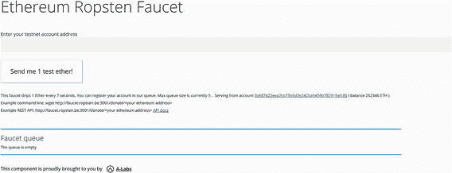
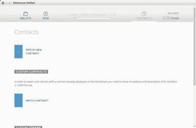
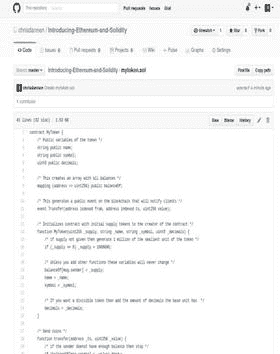
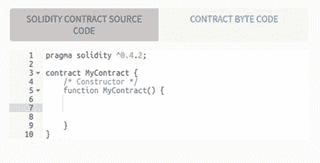
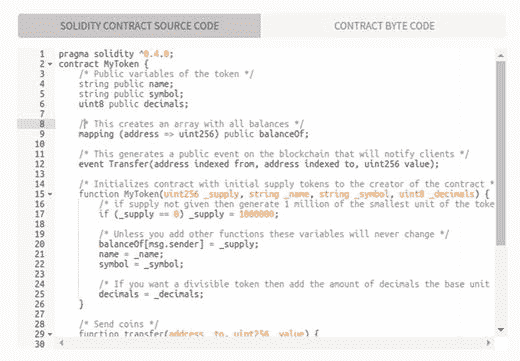
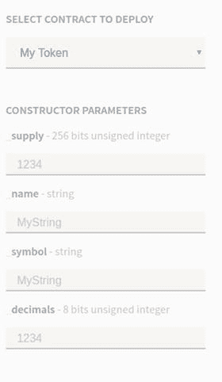
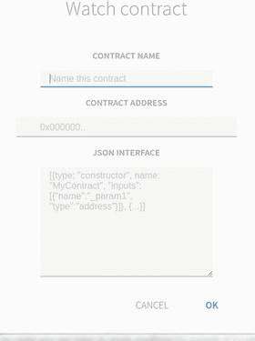
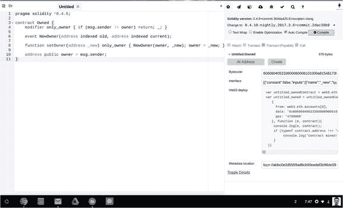

© Chris Dannen 2017Chris DannenIntroducing Ethereum and Solidity10.1007/978-1-4842-2535-6_5

# 5. 智能合约与代币

在 Solidity 中编写的小型可重用代码模板（在编程术语中称为类）被称为智能合约，这是对金融合约的一种致敬。你可以将智能合约视为适用于创建金融衍生品的网络服务——带有一些变化。Chris Dannen^(1 )(1)美国纽约布鲁克林在前一章中，你学会了如何使用 Solidity 为以太坊虚拟机创建指令。但是，你没有将程序上传到 EVM，这个过程通常在计算机应用程序开发中被称为部署。本章介绍了您可以将 Solidity 脚本部署到 EVM 的过程，使它们作为真实产品或服务可用。

## 以太坊虚拟机作为后端

软件应用程序，如它们目前存在于 Web、iOS、macOS、Windows、Android、Linux 等平台上，通常被分为两个部分：前端和后端。后端通常指的是数据库以及与之交互的逻辑，这是程序存储信息的地方，正如你在第三章中学到的。前端通常指的是应用程序的用户界面部分：具有各种标签和控件的界面。在软件界面设计中，控件是指小按钮、滑块、旋钮、心形、星星、点赞图标以及其他任何可以点击的小物件，用来触发某些操作。正如我们之前讨论过的那样，现代 Web 应用程序使用一系列计算机和服务器，其中大多数运行某个 Linux 版本，它们在有时脆弱的计算机协作中发挥着至关重要的作用，以向您的智能手机或计算机提供“无缝”体验（通常希望您为此付费）。目前，无论是以太坊虚拟机还是比特币虚拟机都不够强大。随着核心开发人员不断迭代朝向更快的区块时间，以太坊虚拟机将继续变得更快；关于它的运作方式将在第六章变得更加清晰。目前的要点是，以太坊虚拟机有点像传统 Web 或移动应用程序的后端的替代品。尽管以太坊虚拟机本身是一台功能完备的计算机，但它还不是能够托管 HTML/CSS 界面的完整端到端平台；它最有用的角色是作为分布式应用程序的后端。

### 智能合约到 Dapps

智能合约只是您上传到 EVM 的功能单元。术语分布式应用程序，或称 dapp，通常描述了一个可通过网络或智能手机访问的前端，该前端使用 EVM 作为其后端的 GUI 应用程序。除非它是一个非常简单的 dapp，否则其后端功能将依赖于多个智能合约。

## 由任何东西支持的资产

在金融术语中，资产是您预计将来会产生收益或价值的有价资源。资产可以包括物理自然资源或抽象的金融工具，但根据定义，资产的价格应随着时间的推移而上升。（如果价格下降，它被称为贬值资产。）可以说，加密货币是由任何东西支持的资产。这究竟意味着什么将在本章末尾变得清楚。接下来让我们看一个例子。

### 用法定货币进行交换

假设你是爱丽丝，你生活在日本。在这个例子中，假设你的薪水以日元支付，并且租金、食品和基本服务的价格都以日元计价。现在假设你想支付纽约的某人做一些翻译工作。他叫鲍勃。翻译家鲍勃使用美元；他把它们作为储蓄；他也用美元缴税。这造成了一个问题。对于大多数人来说，外币用处不大，而且兑换它会产生高额费用和价格滑点的风险。滑点是指价格在你有机会出售你的货物之前下跌。鲍勃不想要日元，而且爱丽丝也没有美元。虽然这个例子使用了法定货币，但爱丽丝和鲍勃也可以拿白菜和玻璃珠来交换。尽管他们中的一个可以简单地驱车去最近的兑换处，可能在一个国际机场，但那并不是一种简约的解决方案。有了加密货币，他们只需要确定本地货币和加密货币之间的转换率或乘数，然后使用该乘数将货物的本地价格转换为加密货币。无论他们使用纸币还是玻璃珠都不重要。为了进行交易，他们只需要就价格达成一致。

### 以太作为玻璃珠

此示例展示了以太和比特币的基本属性之一：它们是标准的价值计量单位，同时也是交易媒介本身。货币也具有这些功能，但实际上，交易媒介（纸币）只是某个银行账簿中存在的价值的表示。在这里，它们是同一样东西。正如你将在第六章中了解到的，这些标准账户单位本质上是自我计算的，在任何支付从一个地方转移到另一个地方时，它们都会平衡整个账簿。这是与当今货币的另一个优势相比较，当今货币是惰性的，没有对系统中其他货币的“意识”。正如你可能已经想象的那样，这使得智能合约非常适合编写自动执行的金融协议。衍生品合同是两个或更多方就基础资产价值所做的金融“赌注”。衍生品基本上是在特定条件下，爱丽丝同意向鲍勃支付一定金额。目前地球上的金融衍生品数量已超过 1 千万亿美元。它们是非常受欢迎的工具！是什么赋予了加密货币以这种使用方式的能力？对于这个问题的答案将在第六章和第七章中变得越来越清晰，但为了方便起见，让我们进行一些思维实验，以缩短学习曲线。

## 加密货币是时间的度量。

由于加密资产和加密货币无法伪造，这使它们作为时间的度量具有有趣的属性。第七章涵盖了以太的发行方案，但这里的重点是这些代币几乎就像树的年轮一样——它们的制造过程是通过一个无法“加快”的复杂过程来完成的。因此，当与来自遥远经济体的人进行交易时，很容易相信以加密货币计价的价格，因为无论你正在与之交易的群体有多么富有或强大，都不可能伪造货币。截至撰写本文时，加密货币是不可通过任何中央机构兑换成黄金或法定货币的。然而，在少数几个国家，它们被归类为财产或货币。尽管如此，可以说加密货币的价格来自市场：它们价值取决于市场上有人愿意支付的价格。这与以金为后盾的货币或者可从地方财政部门兑换的国库券截然不同，并且政府保证将在未来几十年内兑换为自己的法定货币。由于其作为去中心化数字交换媒介的地位，可以将加密货币概念化为“以任何物品为后盾的资产”。无论你是在交易牛、香蕉、大豆期货还是私人股权，交易都可以使用加密货币完成。唯一的挑战是就一个价格达成一致。如今，即使买方和卖方同意以加密货币完成交易，他们很可能会迅速将加密货币换成当地的法定货币，以避免价格滑动。随着全球交易量的增加和加密货币交易市场变得更深、更流动，这种情况将越来越少见。价格在全球范围内的交易量增加和加密货币交易市场变得更深、更流动时变得更加稳定。以太在这方面与比特币等其他加密货币类似，但它确实从其在以太虚拟机上支付燃料成本方面获得了一些内在价值。正如我们在第三章中讨论的那样，这使以太更像燃料或食物等商品，后者的内在价值来自于它们分别作为燃料和食物的用途。

### 资产所有权与文明

几乎可以毫不夸张地说，货币作为社会构造的发明是文明的基石。在伟大人类思想的神殿中，它可能与动物驯化、几何学和石器等创新并列。由于货币极易受到网络效应的影响，它的演变速度似乎比其他技术要慢。因为人们更喜欢可以长时间储存、长期保值的货币，人类社会并不急于转向新的交换媒介，以免他们的储蓄变得一文不值！网络效应的概念描述了技术在个体基础上随着其流行度在地理空间上扩大而变得更加有用的方式。能够使用比特币在世界各地购买零售商品就是其积极的网络效应的一个例子。它使贸易无处不在，正如第四章中的海滩摊贩的例子所示。储蓄或剩余价值使人们能够投资未来。无论是 50000 年前还是今天，拥有额外的食物、燃料或人力资源让您可以提前计划并采取行动，利用这些剩余价值为未来的后代带来更大的剩余价值。一个例子是一个在丰收后，扩大了其人口，并集体建造了一座灌溉水坝的社区，进一步提高了农业产量。那么，这古老的历史与加密货币有什么关系呢？

#### 你的存款堆 = 声誉

人们将储蓄积累在某种形式的货币中，无论是黄金、贝壳货币还是美元，都会为他们的未来进行再投资。通常，人们会投资于他们和家人居住的地理区域。这在经济学中被称为本地偏好。这是人类在社区中获得地位的一种方式：通过捐赠公共事业、领导建设性社会运动或提供大规模就业。正如第一章中讨论的，并且在前面的部分中提到的，比特币和以太币没有任何机构的保证，不能在将来的任何时间兑换成任何东西。因此，寻求保护其遗产的家庭可能认为比特币或以太币是长期储蓄的不良选择。对于其他有远见的机构，如慈善机构、养老金基金、信托基金和基金会，也是如此。谁知道在 50 年后还会有人使用这些网络呢！相比之下，国家通常会存在几个世纪。当他们发行法定货币时，他们也会组建军队保护他们的经济体系；没有类似的中央权力强制使用比特币或以太币。更让情况变得更不确定的是，与政府相比，计算机网络的存在时间还不够长，无法真正了解其效用的寿命，政府已经存在了几千年，可以持续数千年。加密货币将如何变得比我们已经拥有的货币更持久？

#### 钱，代币，声誉...那又怎样？

长寿是资产的杀手特性：资产越长久增值，越难以伪造，就越令人向往。这就是为什么有那么多人长期将他们的财富存放在债券和房地产中的原因。强调这个现实的重点是将比特币和以太坊视为数字收藏品。正如你将看到的，这是考虑智能合约的许多用途时最有用的方法。毕竟，学习如何为 EVM 编写程序与弄清楚要构建什么一样具有挑战性。货币的悠久历史为我们提供了许多线索，可以揭示这个新资产类别可能产生的新型业务交易或社会结构的性质。已经有很多关于以太坊发挥互联网真正潜力的潜力的文章写在了网上，尤其是物联网方面。从已经在网络上的以太坊文献中，很容易想象出工业或零售场景中的小型计算机可以执行微交易。但是这种观点将我们限制在了今天已经进行的交易上。以太坊和比特币协议的承诺是引入新型交易和工具。在这个物联网中，日常消费品的世界呢？它们也是“物品”吗？假设你在一个物理物品上印刷了一个以太坊地址（一个公钥），它属于一个智能合约。或者更实际一点，考虑一个二维码，如图 5-1，它是一种嵌套方形图案的机器可读码。这个二维码指向这本书的链接，[`eth.guide`](http://eth.guide)。如果你打开你的移动设备上的 iOS App Store 或 Google Play 应用商店，你应该会找到许多免费的二维码阅读器应用程序。只需搜索二维码阅读器。你可以想象一下，这些二维码印在日常贵重物品上，如服装、珠宝、艺术品或其他实物上，它们可以结合衍生合同、每日可重装的借记卡和收藏品的概念。图 5-1.二维码为机器读取加密货币地址和 URL 提供了一种简单的方法。这个二维码指向[`eth.guide`](http://eth.guide)。

### 硬币是收藏品

在继续深入这个问题之前，让我们来看看 Nick Szabo 提供的一些人类学历史，他是一位加密货币先驱，他的丰富的网络文章影响了今天许多加密货币爱好者和密码朋克。2002 年，Szabo 写了关于在人类历史进程中代表抽象价值的物理商品的交叉点。他解释说，这些收藏品使我们能够参与更大、更复杂的金融交易。³

> 收藏品在首次使这类交易成为可能方面起到了至关重要的作用。收藏品作为解决困扰几乎所有动物通过延迟回报与非亲属合作的囚徒困境的解决方案，增强了我们的大脑和语言。

如果没有一个可信的收藏品来回交易，你可能不愿意与你的延伸家庭网络之外的任何人交易资源。这对于更大的国家的和平共存并不是一个好兆头。

## 人类系统中收藏品的功能

随着时间的推移跟踪好处是货币的主要功能：作为一个封闭的会计系统，为一个社区跟踪所欠和所给的好处。随着越来越大的团体尝试互动和合作，这变得越来越有用。使用收藏品来计数好处是原始会计的本质。最终，这些好处的价值变得抽象化，导致了黄金等价值一般化工具的出现。这解释了现代财富与尊重之间的关联。以太坊和比特币触及了一个数万年历史的问题的核心，即声誉会计是一种自然的人类行为，但也是一种不完美的行为。Szabo 继续说：

> 声誉信念可能会受到两种主要错误的影响——关于哪个人做了什么的错误，以及对该行为所造成的价值或损害的评估错误。在智人尼安德特人和智人中，由于同样具有较大的大脑体积，很可能每个当地氏族成员都会追踪其他每个当地氏族成员的恩惠…… 在部落之间，既使用了恩惠追踪，也使用了可收藏品。

部落内两个氏族在一个封闭系统中交换可收藏品，有点像是一个私人银行数据库。或者是一个私人区块链。Szabo 写道：

> 在部落之间，可收藏品完全取代了声誉作为回报的执行者，尽管暴力仍然在执行权利方面起着主要作用，并且是一种高交易成本，阻止了大多数贸易的发生。

就像今天的银行一样，昔日的人类群体在他们的会计系统之外进行交易也遇到了困难。你使用谁的货币系统？谁来追踪部落间的恩惠？难怪会有这么多流血事件：作弊的机会实在是太多了。

### 早期的伪造行为

部落间贸易的解决方案是使用稀有艺术品：不仅是稀有的地球元素，而且是任何不容易找到或从零开始创建的物品。它们不能只是一组美丽的物品。它们必须难以获得，或者是经过技艺精湛的工艺品，这确保了每个可收藏品代表一定数量的人类工作时间。由工匠制作的结果可被视为“工作证明”。因此，我们回到了先前的概念：比特币和以太作为时间的存储。正如 Szabo 所说：

> 它必须具有某些功能属性，例如可佩戴在身上的安全性、隐蔽性以及不易伪造的昂贵性。接收转移的人必须能够验证这种昂贵性——使用与当今收藏家用来评估可收藏品相同的技能。

### 珠宝和艺术作为货币

对于人类经济进步来说，没有什么比一套可靠的可收藏物更重要，它可以被用作货币。这是因为货币促进了合作。Szabo 甚至认为，合作是我们在群体层面上的定义性适应特征：

> 如今，地球上大多数大型动物都害怕投射物——这是对只有一种捕食者的一种适应。

是的，那就是我们，像狼一样狩猎并像白蚁一样生活在社会群体中的工具制造猿类！从某种意义上说，现代加密货币是我们复杂的人类合作系统的超级润滑剂，因为它们引入了一个不可变的账户系统的基本构件，可以跨越整个世界的地理范围。

### 走向纸币的一步

金钱、声誉和地位一直紧密相连。原始的有价值物品往往是你可以佩戴的东西；想想黄金首饰或镶有钻石的王冠。毕竟，为什么不展示你的辛勤工作（或运气！）赐予你的地位呢？然而，随着一个社会变得更加富裕，每个人都有机会拥有一点黄金；然后是更多一点，再多一点。水涨船高创造了市场，让最富有的人以展示自己社会地位的方式享受自己。在某一点上，佩戴和携带太多，人们开始以商品品牌或他们孩子所就读的特定学校等抽象概念进行竞争。在一个发展中的社会，个人账户开始交易纸币的时候，银行已经积累了足够的财富。经济研究员马丁·阿姆斯特朗最好地解释了这是如何运作的。⁴ 他说：

> 黄金匠发行的银行票据和存款收据之间的区别很简单。如果收据是付给“持有人”而不是账户的，那么存款收据就会转化为银行票据。因此，英格兰的帕特森银行聪明地创造了流通票据，因为它的收据是付给“持有人”的，从而在没有此类工具的情况下创建了流通的“银行票据”。

比特币通过创建持有人账户只稍微修改了这种关系；拥有账户的密码和私钥的人默认就是所有者。比特币地址，就像以太坊地址一样，不是注册给个人的。它们是匿名创建的。以太就像是银行票据的发行，同时也可以用于在 EVM 上兑换计算时间。

## 高价值数字收藏品平台

在数字环境中，可靠的时间存储作为数字收藏品的平台具有令人难以置信的潜力：这些有价值的物品可以在个人空间中展示、佩戴或挂起，无论是在线还是现实生活中，都不可能被仿制，也不容易被盗取。当大多数人想到物联网时，他们会想到传感器节点、自我诊断的工业设备和无人驾驶车辆。价值互联网是指区块链技术，它是用来代表以太坊和比特币概念的许多隐喻之一。但与其抽象地思考，也许更有用的是从有价值的艺术品、珠宝、时尚或高端商品的潜力角度来思考，这些商品看起来很像今天的商品，但在区块链上存储着可验证的出处和所有权。在未来，物理事物的所有权、价值和出处可能永远不会“被遗忘”，只要它所在的区块链仍然在运行。100 年后电视上不会出现《古董路演》。（我们甚至可以写一个智能合约来打这个赌！）

## 代币是智能合约的一种类别。

一般来说，以太坊协议自称为无特色，这也是代币（作为概念）与智能合约（作为概念）有如此重叠的一个原因。代币只是 EVM 上智能合约功能的一个应用而已。请注意，在本章中，你将部署自己的代币。代币是智能合约的一个具体（且受欢迎的）应用。因此，Mist 钱包特别容易创建代币。目前，在 Mist 中没有其他类别的智能合约像这样被容纳。话虽如此，以太坊确实为智能合约的一种常见用例提供了规定，即次货币，即代币。希望让使用变得简单的以太坊开发人员已经在 Mist 钱包中放置了一个易于使用的模板，以便快速启动自己的代币。可以推测，将来可能会推出其他常见智能合约的模板。但目前，我们默认提供的是能够在 EVM 内与以太一起传递的自定义价值单位的能力。如果你要把用户友好的代币制作过程形容为对用户的价值主张的电梯演讲，那么它会是这样的：“作为服务提供的超安全数字货币系统，具备自动分类账平衡。”现在你已经尝到了以太坊和比特币创造新时代的加密收藏品和智能设备的历史潜力，请让我们回到在野外部署代币的基本原理上。请注意：本章包含使用你在第二章安装的 Mist 钱包的练习。在你的计算机上安装后，它可能标记为以太坊钱包。本书将其称为 Mist，以区别于今天桌面和移动计算机上提供的许多其他以太坊钱包。 

### 代币作为社会契约。

代币有时被称为硬币，就像你在第三章学到的那样。 你还学到了代币本身就是智能合约。（通过足够的重复，这些术语有望在本书结束时进入你的日常词汇！）但是代币本身（就像所有形式的货币一样）也可以被视为社会契约，或者是用户群体之间的协议。用简单的英语说，一个使用代币的群体的隐含协议将如下： “我们都同意这个代币是我们社区的货币。” 这也是一个默认的协议，不要伪造，破坏系统！我们今天在软件形式中最接近社会契约的东西可能是最终用户许可协议，或者是当用户在诸如 Facebook、Twitter、iTunes 或 Gmail 等服务上创建账户时签署的 EULA。该协议通常包括禁止诸如向其他用户发送垃圾邮件之类的活动的语言，这会降低用户体验。以这种方式思考使我们能够想象我们今天的数字媒体和数字商品如何成为未来社交网络内讨论、营销、销售和展示的数字收藏品，在这些网络中，像自拍照和播客这样的在线工具可以以任意大小的费用出售、许可或租赁。

### **代币是一个很棒的第一个应用**

制作代币时，请考虑它的价值仅取决于社区对其的认可程度。因此，将代币推向已经使用某种货币或票据进行交易的现有社区要容易得多。然而，制作子货币并不是加密资产的唯一用途。资产的概念是高度概括的。资产以金融合同或智能合同的形式存在，可以用来代表股权份额，或彩票，或仅在本地经济中使用的票据。价格可以由市场决定，也可以与另一种资产挂钩。规则大部分由你决定。注意，票据是一个来源于订阅一词的术语。它有各种定义，可以追溯到历史上的不同阶段，但主要是指一种借据。它也可以指私人货币，如空中里程或奖励积分。在本书中，它用来表示一个通用的账户单位：EVM 的巨型去中心化记账员所使用的“豆子”！在以太坊中，代币存在于并依赖于公共区块链：你可以创建以太的子货币，但以太将始终是支付矿工和燃气费用的特权代币。如果你想要一个纯粹独立的区块链网络，你可以创建自己的私有区块链，并完全与主以太坊链断开连接。制作子货币更容易，并且将满足大多数好奇开发者的使用案例。如果你在一个有兴趣使用自己区块链的机构工作，不要担心：你将在第八章中学习如何创建自己的私有链和与以太坊公共链分离的加密经济体。

## 创建测试网络上的代币

在你部署合约之前，你需要连接到 Ropsten 测试网并熟悉发送以太币的操作。注：Ropsten 测试网以前称为 Morden，因此在旧文档中可能仍然看到这个名称。在桌面电脑上启动 Mist 钱包。导航到 Mist 钱包的开发菜单，你应该会找到一个允许你选择测试网的网络菜单，如图 5-2 所示。图 5-2.连接到测试网一旦你使用测试网，你应该会在 Mist 浏览器中看到一个突出显示为红色的警报，如图 5-3 所示。图 5-3.连接到测试网后，在 Mist UI 中会看到一个指示器

### 从水龙头获取测试以太币

在以太坊中，设置一个喷出虚假以太币的水龙头以在 Ropsten 测试网上使用是微不足道的。在本节中，你不会设置自己的水龙头，而是使用图 5-4 中显示的第三方水龙头，网址为 [`faucet.ropsten.be:3001/`](http://faucet.ropsten.be:3001/) 。图 5-4.以太坊测试网配备了分发测试以太币的设施，可在编写或调试合约时使用你还可以在 [`faucet.eth.guide`](http://faucet.eth.guide) 找到这个水龙头的最新短链接。按照以下步骤从水龙头接收测试网以太币：

1.  1.确保你的 Mist 钱包已经在测试网上，如果还没有，请按照上述步骤创建一个地址。将这个长长的十六进制地址（以 0x... 开头）复制到系统剪贴板，然后粘贴到地址栏中：

1.  2.点击“发送 1 个测试以太币”按钮获取以太币。

如果你想测试以太坊的转账功能，你可以通过在你的 Mist 钱包中从一个地址转账测试以太坊到另一个地址来进行测试。操作方法如下：返回到 Mist 并在主界面创建一个新的钱包地址。你可以使用发送对话框从一个钱包地址向另一个地址发送以太坊。无论是向自己发送以太坊还是向世界另一端的某人发送，速度几乎是相同的；这就是分布式系统的美妙之处。测试网络还有一个区块链浏览器，在那里你可以看到所有你的测试网络交易。只需在以下测试网络区块链浏览器的搜索框中输入一个你的测试网络 Mist 地址，你就会看到它的所有交易列表：[`testnet.etherscan.io/`](https://testnet.etherscan.io/)现在我们已经在 Ropsten 链上测试了测试以太坊，让我们迈出下一步，向自己的以太坊子货币（也称为令牌）的制作迈进，而且零编码。注意什么区别测试网络和主网络？它们是不同的链。就像一台有多个硬盘的计算机一样，你的以太坊节点可以连接到多条链。在下一节中，你将通过复制和粘贴的方式迈向货币作为网络服务的未来。换句话说，你将使用样板代码创建自己的自定义会计和价值转移系统——你自己的由公共以太坊链保护的资产数据库！练习：创建无代码自定义令牌在约 5 分钟内即可创建自己的令牌。你所需要的只是 Mist 浏览器，你在第二章中下载的，和一个文本编辑器。如果你使用的是 macOS、Windows 或 Ubuntu，你的电脑自带一个文本编辑器应用程序，但你也可以选择第三方应用程序，比如 Sublime Text。回顾一下，所有以太坊客户端应用程序的下载链接，包括 Mist，在[`clients.eth.guide`](http://clients.eth.guide)中可以找到。注意在这个练习中，你暂时将在测试网络上创建你的令牌。回想一下，所有智能合约，包括令牌，在以太虚拟机上部署都需要花费（以太）代币。在主网络上创建令牌并不特别危险，但你需要支付一小笔真正的以太来部署它，而且浪费真实的金钱是没有意义的——不管金额多少！如果你以前有编程经验，你会知道大多数开发环境都会强制你在一套集成的应用程序中工作以创建你的应用程序。在以太坊协议中，只使用你电脑的文本编辑器和 Mist 钱包就可以编写和部署一个应用程序。相当惊人！在准备好之后，打开以太坊 Mist 钱包。点击右上角的“合约”标签，如图 5-5 所示。

1.  点击部署新合约选项，如图 5-6 所示。图 5-6.点击“部署新合约”选项以输入合约代码。

1.  转到本书的 GitHub 项目（[`github.com/chrisdannen/Introducing-Ethereum-and-Solidity/`](https://github.com/chrisdannen/Introducing-Ethereum-and-Solidity/)）并找到名为 mytoken.sol 的文档。复制此文件中的代码。它看起来像是图 5-7 中的代码。图 5-7.在 GitHub 中查看此示例项目的代码

1.  复制此代码。然后返回到 Mist 钱包，并将代码粘贴到“部署”视图中，在标有 Solidity 合约源代码的框中，如图 5-8 所示。在粘贴时确保替换所有内容；此处显示的内容是占位文本。图 5-8.在粘贴合约源代码时，请替换所有占位文本

1.  现在代码应该看起来像图 5-9 中的视图。图 5-9.在粘贴了合约代码后，您应该看到屏幕右侧出现一个新的下拉菜单

1.  现在您将在右侧菜单中看到合约名称自动加载。它应该叫做“我的代币”。选择它。应该会出现图 5-10 中显示的字段。图 5-10.在粘贴合约代码后，您需要输入您的代币参数。注意 请注意每个标签后面的浅灰色文本，并回想一下我们在第四章中对类型的讨论。您会发现供应量和小数位字段需要是 uint 类型，或者是正数；其余可以是任意文本或数字的字符串。

1.  接下来让我们填写这些字段：

    +   提供：您想创建多少个代币？

    +   名称：这个代币应该叫什么？

    +   符号：使用键盘上的任何符号作为您的“美元符号”。

    +   小数点：您希望每个代币有 100 个子单位，就像美元和美分一样吗？或者 1,000 个？还是 10,000 个？

1.  7.设置完参数后，滚动到底部并点击“部署”按钮。您可以将费用滑块保留在默认值；您的令牌部署未使用的任何金额将会退还。

1.  8.在“钱包”选项卡中，向下滚动到最新的交易记录，您应该看到您刚刚部署的合同的地址。

要查看您的 Token 余额，您需要“观察”此 Token。这是下一个练习的主题。创建了 Token 后，您可以将其发送给 Mist 钱包中的任何其他人，前提是他们已经给了您他们的钱包地址。为了让他们看到它，您必须告诉他们“观察”它。关于这些特殊情况的更多细节将在后面介绍。练习：观察 Token 无论是您自己创建的 Token，还是某个大型组织创建的 Token，在以太坊系统中所有 Token 都是平等的。您的 Mist 钱包会忽略它们，除非另有说明。就像您的 iPhone 不会下载 App Store 中的每个应用程序一样，Mist 允许您寻找并下载您想要的应用程序。如您从图 5-11 中的观察合约对话框中所见，您不需要太多来跟踪一个 Token。让我们深入了解。图 5-11.了解 Token 的基础信息使 Mist 能够追踪您在该 Token 中的余额将智能合约上传到 EVM 后，世界上就可以访问它了。在 Mist 钱包范式中不需要下载应用程序，尽管合同的代码确实会被放入每个区块中，因此会被动地下载到任何正在挖掘的机器上。因为所有智能合约都同时作为服务交付并在本地执行，所以这几乎就像您的机器上已经有了整个 App Store，您只需要调用一个应用程序。在您当前探索的 Token 类别应用中，调用特定应用程序或合约是最常见的。在 Token 术语中，我们将这称为观察 Token。由于 Token 是智能合约的一种常见且有用的应用程序，您会在 Mist 钱包中找到一个现成的 Token 观察界面。它的工作原理如下：

1.  1.返回 Mist 中的合约选项卡。

1.  2.点击“观察 Token”。

1.  3.粘贴令牌地址。如果有的话，写上这个令牌的名称。

1.  4.你无需在 JSON 框中输入任何内容，因为 Mist 自带了一个令牌的前端界面。当你在本章后面部署一个定制的合约时，你会在这里输入一些数据。

1.  5.点击观察按钮。你现在应该在你的 Mist 钱包主界面看到这个令牌的余额显示出来了。

观察其他合约需要在区块链浏览器中搜索合约地址。以太坊链有许多区块链浏览器可用，你可以在[`explorer.eth.guide`](http://explorer.eth.guide)找到。在本章的练习中，你将在测试网上部署合约，因此它们不会在前述的区块链浏览器中可见。浏览器类似于数据库阅读器，测试网是一个不同的数据库（或链），与主网络不同，实际以太币在其中交易，绝大多数区块链浏览器为其提供了界面。

### 注册你的令牌

令牌是公开可发现的，只要你将你的令牌注册到诸如 Etherscan 等区块链浏览器，并遵守 ERC 令牌标准。ERC 代表以太坊请求评论，是互联网主要技术开发和标准制定机构使用的一种称为 RFC（请求评论）的常见约定。除了 ERC 文件，以太坊社区的发展还由以太坊改进提案（EIPs）引领。你可以在[`github.com/ethereum/EIPs/issues/20`](https://github.com/ethereum/EIPs/issues/20)看到一个标准令牌可访问的所有预定义标准化函数的列表。以太坊风险投资工作室 ConsenSys 也发布了免费和开源的标准智能合约代码，网址为[`github.com/ConsenSys/Tokens`](https://github.com/ConsenSys/Tokens)。这两个 URL 也链接在[`tokens.eth.guide`](http://tokens.eth.guide)上。 

## 部署你的第一个合约

以太坊协议的推出确实包含了几个标准合约，但这些合约大多已被废弃。截至本文撰写，只有代币是标准化的，正如你刚刚在 Mist 浏览器中使用的代币向导所证明的那样。然而，由于 Gavin Wood 的贡献，你可以使用一组简单的合约，这些合约是根据 Apache 2 许可证发布的，你可以用来进行实验。下面，我们将部署其中一个合约，但你也可以在[`github.com/ethcore/contracts`](https://github.com/ethcore/contracts) 找到其他合约。尽管不再被认为是“标准”的，但下面的合约是一个有用的学习工具，因为它有效地演示了智能合约所展示的一些自主性，正如你在第四章中看到的——特别是，它们如何保管你的以太币，并且只有在你事先指示它们时才归还。注意在以太坊中有两种类型的账户：第一种是智能合约账户，第二种是由密钥对控制的外部拥有账户，通常由人类或外部服务器持有。如果缺乏标准合约库看起来有些奇怪，不要担心。许多第三方团体正在创建标准智能合约库，其中一些甚至专门针对某些行业。许多资源，包括 Solidity 示例合约、最佳实践、指南、教程和合约库都列在[`solidity.eth.guide`](http://solidity.eth.guide) 上。在首次部署合约之前，请仔细检查您是否确实在测试网上！无论您是在 macOS、Windows 还是 Ubuntu 上，您都会看到顶部菜单栏中的“开发”菜单，如 Ubuntu 14.04 环境中的图 5-12 所示。还请注意，Mist 可以在测试网上进行挖矿。这使您可以在本地测试合约。在接下来的部分中将提供更多详细信息。图 5-12.确认您在测试网上练习一下：在 5 分钟内部署一个简单的合约拥有的合约可能是最受欢迎的智能合约学习工具。这是因为它建立了 EVM 中可能的基本关系之一：外部拥有账户与合约账户之间的关系。不要弄错：这些账户是独立的实体，但合约账户与外部账户之间的关系可以被编程。请记住，如果合约账户编程不正确，它可能会锁定发送到它的资金——而不提供任何返还资金的途径。即使是创建它们的人也无法为合约设置后门。EVM 在这方面相当严格！这也是为什么我们在测试网上使用虚拟以太币的原因，当在此沙盒环境中创建合约时，我们可以从水龙头获取它。您将在[`github.com/chrisdannen/Introducing-Ethereum-and-Solidity/`](https://github.com/chrisdannen/Introducing-Ethereum-and-Solidity/) 找到合约代码。由于合约的风险性，重要的是要练习编写您作为程序员可以控制的合约。因此，对于拥有的合约，我们为之命名：它教会了如何编写一个由其他 Solidity 代码控制的小以太类。在部署智能合约之前，请不要忘记在您的智能合约之前添加 Solidity 版本声明。这并不是严格必要的，但它有助于防止编译器错误。稍后您将部署拥有的合约，届时 EVM 将为您返回一个合约地址。一旦上传到测试网，您可以将此合约地址粘贴到 Mist 钱包的收件人字段中，并发送一定数量的以太币以激活它。这将使您的外部账户成为 msg.sender，并因此成为此合约的所有者。这意味着什么？这个合约将永远托管在 EVM 上，并且它有一个功能：它属于调用它的任何人或合约，位于给定地址。请记住，如果其他人复制此合约并自行部署它，它将在同一 EVM 上，但位于不同的地址上。它将是同一个合约的不同实例。

### 同一栋房子，不同的地址

在计算机领域，我们可能会说，在同一个 EVM 上部署完全相同的合同的两个人，必然会有不同的地址，这大致相当于从同一份蓝图上建造两栋房子。它们不能占据同一物理空间，而只是同一类别或蓝图的实例，在现实生活中得以实现。Owned.sol 是智能合约的黄金猎犬：调用它，它就会立刻运行并将所有权分配给你自己——不管你是一个操作外部账户的人类，还是一个以编程方式调用 owned.sol 的另一个智能合约。如果 Alice 从印度上传 owned.sol 到 EVM，它可以被当作一个本地脚本访问，并且可以通过从纽约上传到 EVM 的合约进行扩展。很酷，对吧？在最后一个部署中——代币——你只需粘贴 Solidity 代码，然后让 Mist 来完成工作。这很酷，但有点太简单了。要更多地了解底层发生了什么，让我们手动将 Solidity 代码编译为 EVM 字节码，使用在线编译器。提醒一下，你可以在[`compiler.eth.guide`](http://compiler.eth.guide)找到在线编译器。当你在浏览器中打开编译器后，返回到本书的 GitHub 页面（[`github.com/chrisdannen/Introducing-Ethereum-and-Solidity/`](https://github.com/chrisdannen/Introducing-Ethereum-and-Solidity/)）。让我们编译和测试 Owned 合约。在 GitHub 存储库中找到名为 owned.sol 的 Solidity 脚本，并打开它以完成以下步骤：注意复制文件中的所有文本。这包括顶部的版本 pragma 标头。这告诉编译器这个合约是用 Solidity 语言的哪个版本编写的。

1.  1.复制这个合约的文本到你电脑的剪贴板上。（在 Windows 或 Linux 上按 Ctrl+C，在 Mac 上按 Command+C。）

1.  2.将您的代码（Ctrl+V 或 Command+V）粘贴到浏览器编译器的主文本框中。如果那里有一些示例代码，请先清空所有内容。您不希望在您的干净合约中留下任何垃圾。它应该看起来像图 5-13。图 5-13.将合约代码粘贴到浏览器窗口中的编译器

1.  3.点击 Compile 按钮，您的合约将被编译。选择出现在字节码字段中的字节码，并将其复制到剪贴板上。

1.  4.返回到 Mist 浏览器。

1.  5.从 Token 合约重新执行合约部署过程：在 Mist 钱包中，转到右上角的 Contracts 选项卡，然后点击 Deploy New Contract。将新的字节码粘贴到 Contract Bytecode 框中。

1.  6.滚动到底部，然后点击 Deploy 按钮。

1.  7.在钱包选项卡中，向下滚动到最新的交易，您应该看到您刚刚部署的合约的地址。

1.  8.像您在令牌中所做的那样，通过相同的 Watch Contract 流程。粘贴您从交易记录中获得的合约地址，并将合同命名为 Owned。这次，您将在框中添加一些 JSON 代码。

1.  9.接下来，返回到 Browser-Solidity 编译器，并复制页面中 JSON Interface 部分的内容。这将为您的合约提供一个基本的前端，根据编译器从您的 Solidity 代码中获取的信息。

## 与合约玩耍

现在，您的合同已在 Mist 中部署并带有接口，您可以激活它。要在 EVM 中调用合同，您不一定需要发送任何以太币；您只需向合同地址发送零以太币即可调用它。砰，现在您是所有者了！如果这行不通，请确保合同已上传到测试网，并且您用于发送零以太币交易的 Mist 也在测试网上。对于 Owned 合同，激活是一个是或否的问题。您可以用零以太币或 `100` 调用它。在更复杂的合同中，您发送的金额对于合同被调用后随后的行为至关重要。Owned 只是一个参考合同，可能会存在于 EVM 上，这是一个关键的公共资源合同，有着许多年来的大量引用。通过与一个小型智能合约一起工作，您可以看到智能合约是如何逐步被拼凑在一起形成整个分布式应用程序的，主要使用样板代码或公共使用实例，使最终的程序员只需编写最定制的功能，减少错误的空间。

## 摘要

在本章中，您已经能够部署两个独立的智能合约。在此过程中，您了解了您可以为 EVM 编写的最基本的应用程序之一，即令牌合约。您还通过与 owned.sol 玩耍，考虑了一些分布式程序的独特属性。到目前为止，您应该开始看到以太坊协议可以多么强大，以及部署利用网络力量的合约是多么简单和容易。接下来，值得更多地了解 EVM 网络数据库是如何实现共识的：一个称为工作量证明挖矿的过程。这是下一章的主题。1 维基百科，“各国比特币的合法性”，[`en.wikipedia.org/wiki/Legality_of_bitcoin_by_country`](https://en.wikipedia.org/wiki/Legality_of_bitcoin_by_country) ，2017 年。2ConsenSys 媒体，“上下文中的可编程区块链：以太坊的未来”，[`medium.com/consensys-media/programmable-blockchains-in-context-ethereum-s-future-cd8451eb421e#.rwdqmpvu0`](https://medium.com/consensys-media/programmable-blockchains-in-context-ethereum-s-future-cd8451eb421e#.rwdqmpvu0) ，2015 年。3 尼克·萨博，“挖掘：货币的起源”，[`nakamotoinstitute.org/shelling-out/`](http://nakamotoinstitute.org/shelling-out/) ，2002 年。4 阿姆斯特朗经济学，“货币与银行业的演变”，[www.armstrongeconomics.com/research/monetary-history-of-the-world/historical-outline-origins-of-money/money-and-the-evolution-of-banking/](https://www.armstrongeconomics.com/research/monetary-history-of-the-world/historical-outline-origins-of-money/money-and-the-evolution-of-banking/) ，2016 年。
