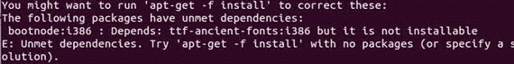
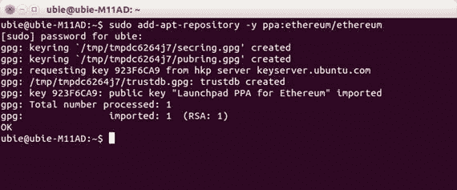
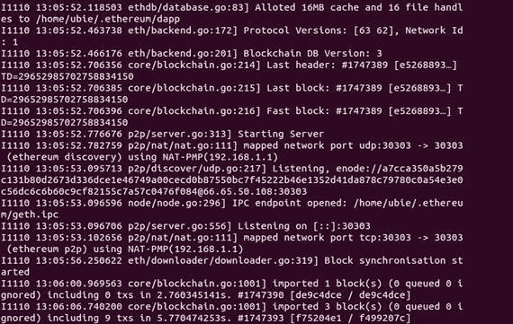
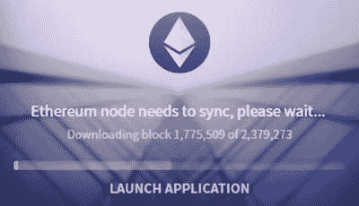
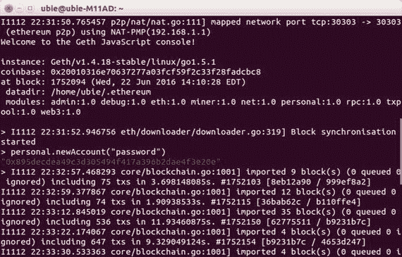
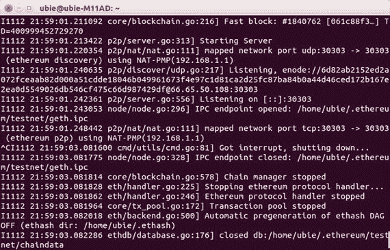
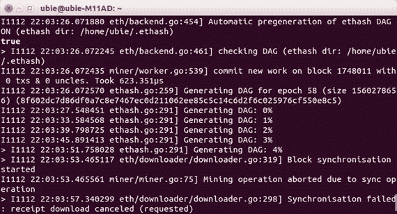
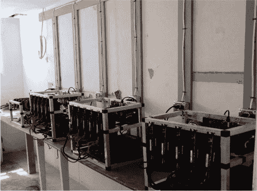

© Chris Dannen 2017Chris Dannen 介绍以太坊与 Solidity10.1007/978-1-4842-2535-6_6

# 6. 挖掘以太币

挖掘是以太坊网络在一定时间内就交易顺序达成共识的过程，这反过来使得以太虚拟机能够进行有效的状态转换。Chris Dannen^(1 )(1)美国纽约布鲁克林我们在第三章学到了关于以太虚拟机如何工作的许多知识，但其功能之一——挖掘——需要单独的一章来介绍。挖掘很重要，因为它是系统中达成共识的过程，也是以太币产生的过程。比特币也使用挖掘来达成共识，但以太坊的工作方式略有不同，因为它能够执行智能合约。

## 目的何在？

在追求像以太虚拟机这样理想化的东西时，重要的是要实事求是地评估其优点和缺点。在这一点上，您可能会想知道一个如此复杂的网络是否能够成功。接下来的章节描述了一个对一些读者来说可能看起来难以理解和压倒性的系统。然而，像我们许多现代系统一样，理解正在解决的问题是很重要的。解决方案可能会改变，实际上以太坊协议（就像比特币协议一样）会随着时间的推移而适应和改变。但是在人类社会中信任的问题是持久存在的。还要记住，去中心化网络的创建者们本质上是密码学家，他们的一个目标是创造一个可访问、无需信任的世界计算机，这比创造它要难得多。引用 Vitalik Buterin 的话：

> 密码学在 21 世纪真的很特别，因为密码学是极少数几个领域之一，在这些领域中，对抗性冲突继续严重偏向防御方。 Cypherpunk 哲学基本上是利用这种珍贵的不对称性，创造一个更好地保护个体自治的世界，而 cryptoeconomics 在某种程度上是这个思想的延伸，只不过这一次是保护复杂的协调和合作系统的安全性和活力，而不仅仅是私人消息的完整性和保密性。认为自己是 cypherpunk 精神的意识形态继承者的系统应该保持这种基本属性，并且相比使用和维护来说，破坏或干扰的代价要高得多。 “cypherpunk 精神” 不仅仅是关于理想主义；制造比攻击更容易的系统也是简单而合理的工程学。¹

考虑到这一点，让我们从以太币的发行开始讨论挖矿。

## 以太币的来源

以太币被认为是以太坊的本地代币，因为它是在挖矿过程中凭空创造的，作为计算机执行挖矿工作的支付。由于挖矿需要大量计算，这可能会为您的家庭或办公室产生大额电费。矿工认真对待他们的奖励。挖矿奖励通过编程到 EVM 的状态转换函数中的账户余额增加来完成。它们支付给任何找到一个区块的随机矿工。（为了挖矿，您需要向挖矿方法传递一个以太坊地址以支付，这样它就知道要增加谁的余额。）让我们通过开始一些词汇定义来仔细观察一下。

## 定义挖矿

在以太坊中，矿工指的是一个庞大的全球计算机网络，大多数由热衷者在家和办公室中运行的以太坊节点组成，他们通过执行智能合约和验证全球交易的规范顺序来获取以太币。每个个体节点都参与挖矿的过程，但这个术语也涵盖了整个网络的协作：单个节点进行挖矿，整个网络也可以说是由挖矿来保护。矿工会将交易处理成为所谓的区块。我们之前在抽象中定义了区块，即在一定时间内发生的交易的集合。然而，区块也可以指包含这些交易数据对象，存储在以太坊节点上。每次节点启动时，它必须下载其脱机时错过的区块。每个区块都包含来自上一个区块的一些元数据，以证明其是真实的，并建立在现有区块链上。网络很难确定交易的“真实”顺序。世界各地的挖矿节点可能会接收到新的交易不按顺序的。事实上，存在比正确顺序的区块更多的不正确排序的区块。一些恶意节点运营商可能会修改其机器以提交欺诈性区块，希望将免费以太币发送到其账户。因此，挖矿可以正确地定义为致力于加强作为正确历史版本的给定版本的计算努力。挖矿过程对节点来说是计算密集型的，因为它涉及执行内存密集型的散列算法，称为工作证明算法。以太坊协议的工作证明算法（或 PoW 算法）是 Ethash，这是核心开发人员为解决比特币中的挖矿集中化问题而创建的一种新函数。有时你会听到这种算法被称为以太坊的共识算法或共识引擎。被选为规范的区块是其背后具有最大工作证明量的区块。这意味着什么将在本章末尾变得清楚；现在让我们继续定义一些关键术语。矿工能够应用到网络的计算量称为哈希能力。哈希能力反映了个人计算机的部件和规格，特别是图形处理卡的速度、功率和数量，计算机系统的总电源供应，以及墙壁插座和断路器面板的充足电压的可用性。挖矿的密码学证明可以在应用更多哈希能力时更快地完成。因此，矿工经常组成挖矿池以增加他们赢得奖励的机会，然后在群体中分配这些奖励。既然我们已经定义了一些词汇，让我们谈谈为什么挖矿首先是必要的，以及在以太坊中它是如何工作的。

## 真相的版本

要理解为什么会有这么多版本的交易历史，让我们看看加文·伍德在以太坊黄皮书中的表述：

> 由于系统是去中心化的，所有参与方都有机会在一些旧的先前存在的区块上创建一个新的区块，所以结果结构必然是一个区块树。为了就根（创世区块）到叶（包含最新交易的区块）之间的路径形成共识，这条穿过这个区块树结构的路径，即所谓的区块链，必须有一个约定好的方案。²

我们稍后会在后面的章节中更多地讨论这个树状结构。现在，只需注意当节点们对真正的区块链的根到叶路径发生分歧时，就会发生状态分叉，而这通常是灾难性的——相当于 EVM 分裂成两个 EVM。我们稍后在本章中也会更多地讨论分叉。

### 难度、自我调节和利润竞争

挖矿旨在为参与其中的人赚取利润；他们因提供网络安全而获得报酬。是什么吸引成千上万的 IT 爱好者和专业人士自掏腰包建造和运行这些机器呢？首先要知道的是时间是一个因素！当一个新的加密货币推出时，矿工们急于启动他们的机器。在早期，由于费用竞争较少，他们可以赚更多。更好的是，属于有用的加密网络的代币通常会在其寿命内通胀，因此较早地赚取它们给矿工提供了更多从升值中获利的机会。

#### 难度

以太坊和比特币是自我调节的网络。随着网络变得更加流行，越来越多的挖矿算力加入以寻求利润，可能会发现区块太快。为了保持其理想的 15 秒区块时间范围内，一个动态自调节的值称为难度将增加。如果区块被发现太快或太慢，系统会改变难度以使其在理想区块时间范围内。一般来说，随着时间的推移，网络难度会增加。然而，实际的难度值是使用包含多个变量的公式计算的。如果矿工开始从网络中退出或总算力减少，网络难度可能会降低或保持不变。³在 2016 年 10 月和 11 月，以太坊网络遭受攻击后，以太币的市场价格下跌，并且由于无法盈利的矿工关闭了他们的机器，哈希率降低。几个月后，随着以太币价格的恢复，它升至攻击前的高位。您可以将这个难度变量视为激励结构的一部分，以尽快将矿工引入网络并使其留在网络中。然而，在以太虚拟机中，难度在另一个方面也有用处，作为用于确定区块得分的几个因素之一，有时被称为其重量。交易数据结构中最重的或得分最高的路径可以说是最长的，是历史上大多数矿工认为是真实的根到叶路径。注意在以太坊和比特币中，最长或最重的链被认为是规范的链。每当网络发现一个区块时，它会选择具有最高得分的最重的区块，并支付提名它的矿工。这个高得分是由最多工作量证明支持的区块的结果。

#### 区块验证所需的因素

每个矿工构建和尝试验证的候选区块都包含四个数据部分：

+   此区块的交易分类帐哈希（根据这台机器听到的信息）

+   整个区块链的根哈希

+   自链启动以来的区块编号

+   这个区块的难度

如果所有这些事情都核实了，这个区块就是获胜区块的候选。然而，即使这些信息是正确的，矿工仍然必须解决工作证明算法。正如你将看到的那样，该算法本质上是一个猜测游戏，旨在花费一定的时间，服务于理想的 15 秒区块时间。当猜测正确时，这个正确的值，或者说 nonce，是使一个区块成为真实、规范和有效的最终条件。nonce 被称为解决工作证明算法的证据。回顾第三章，有效但不是获胜的规范区块被称为叔区块。

### 工作证明如何调节区块时间

任何能够优化工作量证明算法的人都可以更快地找到有效的区块，导致叔块越来越落后。在比特币网络中，一小群硬件公司通过创建专门用于运行比特币工作量证明算法的硬件，获得了网络的不成比例的巨大权力。挖矿力量的集中在比特币中非常有利可图，因为它允许这些大型矿工更快地找到区块，从而获得所有的区块奖励。较慢的机器永远没有机会解决一个区块，最终，即使是他们的叔块也会落后于获胜的区块。在以太坊中，叔块被要求支撑获胜的区块。随着叔块越来越落后，网络更难以找到真正的区块，因为有效的叔块是一个要求。进入 Ethash 算法：以太坊协议对抗挖矿硬件优化的防御。Ethash 是 Dagger-Hashimoto 的一个衍生物，这是一个无法通过定制的应用特定集成电路（ASIC）来暴力破解的内存硬算法，就像比特币挖矿企业中流行的那种类型一样。这个算法的关键是内存硬性，它依赖于一个有向无环图（DAG）文件，这个文件基本上是每 125 小时或 30,000 个区块创建一次的一个 1 GB 数据集。这个 30,000 个区块的周期也被称为一个纪元。有向无环图是一个技术术语，用来表示每个节点允许具有多个父节点的树，包括根节点在内的十个级别，总共最多包含 225 个值。

## DAG 和 Nonce 发生了什么？

实际上，每个节点都在与自己玩一个猜谜游戏，试图猜出一个能验证当前区块的随机数；如果它猜对了随机数，它就赢得了区块奖励。如果没有，它会继续猜，直到得知网络上的另一个节点已经找到了获胜者。然后，它会丢弃它正在挖掘的区块，下载新的区块，并开始在其上挖掘一个新的区块。但是，每个潜在的区块都会给该节点提供猜谜游戏的两个参数，以及一对新的“骰子”（可以这样说）。猜谜游戏的规则设计成这样是为了防止聪明的个别节点在追求更多的挖矿奖励时愚弄系统。因此，你可以把 DAG 文件看作是标准化工作量证明算法的解决时间的一种方式。它使矿工竞争的机会均等化，但更重要的是，通过确保即使拥有大量计算能力，你也不能比你的竞争对手更快地猜到正确的随机数，有助于将区块时间集中在大约 15 秒的标记上。节点参与猜谜游戏所需的所有数据都来自区块链本身。在密码学中，加密种子可以用来帮助生成伪随机数，从而增加 Ethash 算法产生的任何加密输出的随机性。在以太坊和比特币中，每个节点都通过查看上一个已知获胜区块的哈希来获取种子。通过这种方式，节点必须在正确的、规范的链上进行挖掘，才能正确地玩游戏。在错误的区块上进行工作量证明（比如说，一个叔叔）不可能产生一个获胜的区块。如果你试图减少工作量证明方案中的不公平优势，这是有帮助的，因为一个大型矿工池可能会利用这个优势，将网络劫持到一个所有以太币都转移到劫持者账户的版本中去。以下是一个节点设置自己进行 PoW 猜谜游戏的过程：

1.  1.从块头派生的加密种子，挖矿节点创建一个 16 MB 的伪随机缓存。

1.  2.依次，缓存用于生成一个更大的 1 GB 数据集，这个数据集应该在节点之间保持一致；这就是 DAG。这个数据集会随着时间的推移以线性方式增长，并由所有全节点存储。

1.  3.猜测随机数需要机器抓取 DAG 数据集的随机片段并将它们一起哈希。这与使用哈希函数的盐类似。

在密码学中，你抛入单向哈希函数的随机数据块被称为盐。盐就像随机数：它们使事情更随机，因此更安全。

## 为了更快的区块？

相信与否，所有这些修改原始比特币范例的措施都是为了更快的区块时间。区块时间低至 3-5 秒在数学上是可行的。⁴在比特币和以太坊中，我们说区块时间是收集交易的理想时间段。为什么这样？系统工作以保持区块尽可能接近理想，就像人体试图保持稳态一样。比特币协议的目标是 10 分钟的区块时间，以太坊则是 15 秒。一旦发现真正的区块，其他节点需要一小段时间才能了解到它。直到它们放弃孤儿区块并开始在新的区块上进行挖掘，它们实际上是在与新区块竞争，而不是在其上进行构建。因此，在孤儿区块上消耗的努力是浪费的。可以这样想：如果延迟导致矿工平均晚了一分钟才听说新区块，而新区块每 10 分钟出现一次，那么整个网络大约浪费了 10%的算力。增加区块之间的时间可以减少这种浪费。一些区块链理论家认为，中本聪选择这个比例是因为它似乎是一个可以接受的浪费水平。以太坊更快的区块时间很受欢迎，因为它可以更快地确认交易，但是以太坊协议在设计中必须为更快的区块时间带来的相应安全性降低作出相应的规定，您将在本章后面看到。区块时间可以与证券交易的结算时间相比较，在美国，结算时间是交易日期后的三天，也称为 T+3。美国证券交易委员会正在考虑一个建议，将结算时间缩短至 T+2。在比特币中，没有智能合约执行，理论上区块平均需要 10 分钟，但实际上，交易只有大约 63%的时间可以这么快处理。大约 13%的时间，交易的确认需要超过 20 分钟。在此期间，有可能逆转交易达到 20%的可能性。⁵对于比特币爱好者和企业来说，这些条件仅令人恼火，但对于旨在为分布式软件应用提供动力的智能合约平台而言，这是不可接受的，因此以太坊对挖矿采取了略有不同的方法，以实现更快的区块时间。

### 让快速区块发挥作用

我们已经讨论过，从用户体验的角度来看，更快的区块时间更加可取。然而，它们也可能产生不良影响。因为节点分布在全球各地，它们很难保持完全同步。这是因为信息需要时间在互联网上从节点到节点传播，也就是所谓的延迟。虽然对人类来说这可能不像多长时间，但足以在交易记录中产生碰撞，导致账簿不平衡。平均而言，一笔交易在以太坊或比特币网络中传播大约需要 12 秒；实际上，这段时间大部分被用于将交易下载到节点上。在它获知新区块被找到之前的这段时间里，矿工可能会继续在旧区块上工作一小段时间，然后将其放弃给新的获胜者。正如上文所述，在网络中的其他地方找到有效区块后，接收到挖矿工作的叔块也被称为陈旧块或者已灭绝块。更快的区块时间增加了陈旧块的可能性，而陈旧块减少了网络对攻击的绝对强度。更糟糕的是，更高比率的陈旧块使得矿池更容易获胜，从而在挖矿奖励方面持续击败独立矿工，提高效率优势。最好的情况下，这是不公平的，最糟糕的情况下，它使得网络更容易受到攻击。注意：在比特币中，陈旧块有时被称为孤立块，尽管这种说法有些令人困惑。这些陈旧块没有任何子块被构建在它们之上，但它们可能有一个完全有效的块头。因此，孤块实际上有“父”块。  

## 以太坊如何使用陈旧块

在以太坊中，就像我们已经说过的那样，孤块或者过时的块有另外一个名字：它们被称为叔叔，并且它们计入区块的分数或者权重。以太坊协议中这样做的方式类似于 GHOST 协议中提出的区块链评分系统，该系统在 2013 年 12 月由 Aviv Zhoar 和 Yonatan Sompolinsky 在一篇论文中概述。Vitalik Buterin 描述了他是如何为以太坊改编了 GHOST 的思想，以及它与比特币的比较：

> 其思想是，即使过时的块当前并不计入链的总权重，它们也可以；因此他们提出了一个区块链评分系统，即使这些过时的块不是主链的一部分也会计入考虑。因此，即使主链只有 50%的效率甚至只有 5%的效率，试图进行 51%攻击的攻击者仍然需要克服整个网络的权重。从理论上讲，这解决了效率问题，直到 1 秒区块时间。然而，存在一个问题：所描述的协议只在区块链的评分中包括过时的块；它没有给过时的块分配区块奖励。

### 叔叔规则与奖励

以下是有关叔叔的规则：

+   在以太坊对 GHOST 的实现中，与一个区块一起验证的叔叔将获得静态区块奖励的 7/8，或者 4.375 个以太币。⁸

+   每个区块最多允许两个叔叔。

+   这两个位置是先到先得的。

+   没有为叔叔块收集或支付交易费，因为用户已经在有效块中支付了这些费用，实际上执行了他们的命令。

+   关键是，为了值得奖励，叔叔块必须与真实块在最后七代之内有共同的祖先。

这个 GHOST 的实现通过将叔叔块纳入计算范围来解决安全性损失的问题，以确定哪个区块具有最大的总工作量证明支持。叔叔奖励旨在解决第二个问题，即中心化，通过向为网络安全做出贡献的矿工支付奖励，即使他们没有提名获胜的区块。

## 难度炸弹

值得一提的是，GHOST 协议（即使以太坊已经适应）受到了一些批评。尽管其缺陷是已知的，但一般认为它们是无害的。修复 GHOST 实现可能并不值得，因为当以太坊协议从工作量证明转向所谓的权益证明共识算法时，它将被弃用。⁹加密货币在市场上有价值的一个原因是它们的发行是有限的。今天，每个区块奖励 12.5 比特币（即，每 10 分钟）。此速率将持续到 2020 年中期，届时每个区块将奖励 6.25 比特币。奖励每四年减半，直到大约 2110–40 年，当时将发行 2100 万比特币。以太坊通过计划结束工作量证明期来实现其有限发行。以太坊系统在转换时将于 2017–2018 年结束有效挖掘期；权益证明（或 PoS）的一个重要卖点是它不需要挖掘（和随之而来的能源消耗）来达成共识。为了促使这一转变，并同时限制以太的发行期，核心开发人员内置了一个困难炸弹，从 2017 年下半年开始，逐渐使工作量证明挖掘变得不太可行，最终在 2021 年变得不可能。¹⁰这种新何运作是社区内研究和辩论的课题。要了解更多关于这一领域的研究，请跳转到第十一章。

### 矿工   矿工的获胜奖励结构

一个成功挖掘出获胜区块的矿工将获得固定奖励，加上交易费用，再加上所有帮助其获胜的叔叔的奖励份额。因此，可以说以太坊协议中的奖励如下确定：

1.  1.设置 5.0 以太币的固定区块奖励（对于找到获胜区块的矿工）

1.  2.支付区块内花费的燃气费用（对于找到获胜区块的矿工）

1.  3.每个叔叔的奖励为本区块的 1/32 以太币（对于找到叔叔的矿工）

### 祖先限制

协议的一部分要求叔叔必须在获胜区块的七个区块范围内才能获得部分奖励，这是为了在少量区块后使区块历史“可遗忘”。选择数字七是因为它提供了一个合理的时间给矿工去找到一个叔叔，但不至于太长以至于带来集中化风险。

### 区块处理的详细过程

为了逃脱叔叔身份并成为最重的区块，一个真实的区块（有时称为侄子）需要通过一系列长步骤的审核，这些步骤用于处理每个区块。这个过程的一个重要组成部分是区块验证算法。该算法旨在验证随区块一起提供的哈希，该哈希位于区块的标头中。区块处理的这一方面为区块作为数据对象的解剖提供了一个很好的起点。在编程中，数据结构通常有一个包含计算机必须首先读取的某些基本信息的标头。就像在人类文字处理器中一样，标头只是文本主体的顶部。在这个类比中，文本主体就是区块数据结构。在已完成的区块可以进行处理并被网络中的其他节点接受之前，以及在节点可以开始在新区块上进行挖矿之前，每个节点都必须独立地下载和验证区块。以下是区块验证算法按顺序执行的所有步骤：

1.  1.检查引用的上一个区块是否存在并且有效。

1.  2.检查区块的时间戳是否大于引用前一个区块的时间戳，并且小于未来 15 分钟。

1.  3.检查区块号、难度、交易根、叔根和燃气限制（各种与以太坊特定的底层概念）是否有效。

1.  4.检查区块的随机数是否有效，显示出工作证明的证据。

1.  5.将所有在此经过验证的区块中的交易应用于以太坊虚拟机状态。如果出现任何错误，或者总燃气超过 GASLIMIT，则返回错误并回滚状态更改。

1.  6.将区块奖励添加到最终状态更改中。

1.  7.检查 Merkle 树根最终状态是否等于区块头中的最终状态根。

只有经过这七个步骤，一个区块才被认定为有效和真实！为什么要如此关注区块头呢？要创建一个区块链，理论上可以直接在区块头中包含关于每笔交易的数据，但这将带来可扩展性挑战，并且需要运行节点的强大硬件。[¹¹]

## 评估区块和交易的祖先关系

要了解区块头中包含什么，以及区块头的内容对于确定最长、最重的链至关重要，您需要退后一步，探索计算机如何存储数据——以及它们存储的数据一旦更改后如何操作。首先，树结构的作用是帮助节点验证其在区块中收到的数据，例如交易分类账。其次，它们的作用是快速完成此操作，以便各种形状和大小的计算机可以快速读取区块链。在计算机科学中，关联数组（或字典）指的是一组（[键/​值](https://en.wikipedia.org/wiki/Attribute%E2%80%93value_pair)）对。回想一下在第一章关于数据对象的讨论中的键/值对的概念。在关联数组中，键和值之间的关联可以更改。这种关联称为绑定。与字典相关的操作包括以下内容：

+   将键/值对添加到集合

+   从集合中移除成对的项目

+   修改现有的成对项目

+   查找与给定键相关联的值

哈希表、搜索树和其他专门的树结构是解决字典问题的常见解决方案，其中字典是记录数据库的通用术语。 解决字典问题涉及查询键（单词）并调用其值（定义）的方法。

## 以太坊和比特币如何使用树

在数学中，树是一种用于存储键和值的关联数组的有序数据结构。基数树是一种压缩的变体，需要较少的内存。在普通的基数树中，键中的每个字符描述了通过数据结构的路径到达相应值的路径，就像一组方向。创建梅克尔树需要将大量的交易数据“块”哈希在一起，直到它们变成一个：根哈希。在以太坊和比特币中，梅克尔树结构用于记录每个区块中的交易分类帐。梅克尔树的根与其他元数据一起哈希，然后包含在后续区块的头中。因此，可以说每个附加交易（在每个区块内）都会不可撤销地改变梅克尔根；即使有一个错误的交易，根哈希看起来也完全不同，显然是错误的。这就是区块如何证明它们对区块验证算法的合法祖先的方式，这是整个区块处理程序的一部分。对于比特币客户端，确定单个交易的状态就像查看主链上最近区块的头一样简单。在那里，客户端应该找到梅克尔证明，显示区块的根哈希包含在其梅克尔树之一的交易中。梅克尔根是所有交易的指纹，正确排序的，直到该区块发生为止。

### 梅克尔-帕特里夏树

由于区块头，节点可以快速轻松地查找、读取或验证区块数据。在比特币中，区块头是一个包括梅克尔根以及其他五个东西的 80 字节数据块。比特币区块头包含：

+   前一个区块头的哈希值

+   时间戳

+   挖矿难度值

+   工作证明的随机数

+   该区块交易的梅克尔树的根哈希

默克尔树非常适合存储交易分类帐，但仅限于此。从以太虚拟机的角度来看，默克尔树的一个限制是，尽管它可以证明或否定事务包含在根哈希中，但它无法证明或查询网络的当前状态，例如给定用户的账户持有情况。

### 以太坊区块头的内容

为了弥补这一缺陷并允许以太虚拟机运行有状态的合约，以太坊中的每个区块头不仅包含一个默克尔（交易）树，而且包含三种对象的三棵树：

+   交易树

+   收据树（显示每笔交易结果的数据）

+   状态树

为了实现这一点，以太坊协议将默克尔树与我们上面描述的另一种树状结构，帕特里夏树结合在一起。这种树状结构是完全确定性的：具有相同（键/值）绑定的两个帕特里夏树将始终具有相同的根哈希，从而提供了对常见数据库操作（如插入、查找和删除）的增强效率。¹² 因此，以太坊客户端可以对其向网络发出的各种查询获得可验证的答案，例如以下内容：

+   交易 X 是否已包含在区块中？（由交易树处理。）

+   告诉我过去 30 天中事件 Y 的所有实例。（由收据树处理。）

+   合约账户 Z 的当前余额是多少？（由状态树处理。）

关于这些树状结构是如何运作以及为什么选择它们的更多信息，请查看[`trees.eth.guide`](http://trees.eth.guide) 。

## 分叉

正如本章前面讨论的那样，如果矿工们无法就最长、最重的链达成一致，网络中的矿工可能会分裂成两个。在加密货币社区中，对分叉有很多争论，其中似乎意味着人类社区的分裂以及机器网络中共识的丧失。实际上，初生的分叉不断发生。有时一个分支会死掉，有时两个分支都会死掉，有时一个会继续传播一个获胜的“新区块”。当两个有效的区块指向同一个父区块时就会发生分叉，但一些矿工看到一个，其他矿工看到另一个。事实上，这创建了两个“真相”版本，确保这两个群体不再被认为处于同一个网络中。注意：状态分叉比协议分叉重要得多。在协议分叉中，不会更改任何数据，但矿工可能会调整参数或更新代码，使其按照社区已经同意的修改后规范执行。因此，可以说协议分叉是自愿的，而状态分叉不一定是这样。在以太坊中，这些不断发生的分叉在四个区块内解决，作为数学上的确定性，因为一个链找到一个获胜者，变得更长，并开始“拉”其他节点向其靠拢，以不仅获得找到和执行正确区块的矿工费，还有收集叔叔区块奖励的所有额外激励。有时候，一个节点在已经收到约一到三个区块的奖励之后找到了“正确”的链。一旦节点跳转到更好、更长、更获胜的链，挖矿奖励可能会消失。然而，所有这些都发生在四个区块内，也就是一分钟内，所以这些小的错误被认为不是什么大问题。攻击者通常会部署蓄意的分叉来双倍花费资金：通过同时向多个账户发送一个余额来凭空赚钱。实际上，任何拥有超过 50%哈希功率的人都可以引发“敌对”的蓄意分叉，可以这么说。在双花攻击中，操作一群矿工并拥有大量哈希功率的攻击者向以太坊发送一笔交易以购买产品。在获得产品后，攻击者用第二笔交易组合出一个错误的区块。第二笔交易试图将相同的资金发送回攻击者。然后，攻击者在与包含原始交易的区块相同级别的区块上创建一个区块，但包含第二笔交易，并将所有可能的哈希功率都用于在分叉上进行挖矿。如果攻击者拥有 50%以上的哈希功率，则双花将最终在任何区块深度上都保证成功。低于 50%时，成功的可能性远低。但这种攻击仍然足够令人担忧，以至于实际上，大多数使用以太币的交易所和其他机构在考虑转账完成之前都会等待几个确认。

## 挖矿教程

挖矿是尝试 Geth 的一个很好的借口。因为 Geth 是一个如此好的学习工具，而且安装相对容易，所以本节提供了 macOS、Windows 和 Ubuntu 的安装说明。除了安装之外，在此之后的练习假设你处于 *nix 环境中——也就是说，在 macOS 或 Ubuntu 14.04（Trusty）中运行终端应用程序。有关 Geth 的文档和教程链接，以及所有平台上所有以太坊客户端的说明，请访问 clients.eth.guide。

### 在 macOS 上安装 Geth

首先，在 Mac 上打开终端，位于 Applications 文件夹中。然后，在命令行中输入以下内容：brew updatebrew upgrade 更新完成并且命令行返回后，输入以下内容：brew tap ethereum/ethereumbrew install ethereum

### 在 Windows 上安装 Geth

下载最新的稳定二进制文件。从 zip 中提取 geth.exe，打开一个命令终端并输入：chdir <提取的二进制文件路径>open geth.exe

### 熟悉命令行

在你在 Ubuntu 上安装 Geth 之后（下面描述），你将直接进行一些练习。这些练习假设使用 macOS 或 Ubuntu 终端应用程序。这里不会讨论 Windows Geth 命令，但可以在[`clients.eth.guide`](http://clients.eth.guide)找到。以下指南是为那些可能是第一次使用命令行的人编写的。如果你是其中之一，那么你应该立即注意到一些事情。当你首次打开你的终端应用程序时，它位于 macOS 和 Ubuntu 的 Applications 文件夹中，你会看到一个闪烁的光标。这表示计算机已准备好接收指令。注意在这个界面中，计算机只有一条思路。当你输入一个命令时，可能需要几秒钟才能完成。在这段时间里，屏幕上会出现文本。不要惊慌；这是正常的。通过尝试 Geth 或命令行，你无法损坏你的计算机。

### 在 Ubuntu 14.04 上安装 Geth

要在 Ubuntu 上安装 Geth，首先打开终端并输入以下内容，然后按回车键：sudo apt-get install software-properties-common 安装过程中的一个注意事项是，根据硬件配置，一些 Ubuntu 用户可能需要安装字体库，否则 Geth 安装将会报错。你可以在[`community.linuxmint.com/software/view/ttf-ancient-fonts`](https://community.linuxmint.com/software/view/ttf-ancient-fonts)或 clients.eth.guide 找到这个字体库。错误信息如图 6-1 所示。图 6-1.一些 Ubuntu 用户可能会遇到这个错误简单地安装这个字体包，事情应该会顺利进行。然后输入以下内容并按回车键：sudo add-apt-repository -y ppa:ethereum/ethereum 程序会要求你输入密码。可能不会显示在屏幕上，甚至看起来像是没有输入任何内容，但请忽略并按回车键。你应该会看到类似于图 6-2 的结果。图 6-2.输入你的密码以完成安装，你会看到这个结果在终端命令前面加上 sudo 可以以 root 用户或 Unix 架构中最强大的用户角色的身份执行命令，该角色具有对所有文件和命令的访问权限。接下来，在提示符后，输入以下内容并按回车键：sudo apt-get update 然后输入以下内容并按回车键：sudo apt-get install ethereum 输入计算机的管理员密码，可能是你在计算机启动后登录时使用的密码。当程序询问是否允许安装占用一些硬盘空间时，输入 Y（表示是）并按回车键。接下来，让我们运行 Geth。安装完成后，你可以在命令提示符处输入其名称来启动 Geth:geth 你会看到一些代码飞速滚动，看起来像图 6-3。图 6-3.Geth 正在同步如果让它继续下去，这将永远进行下去。按下 Ctrl+C 停止同步，你将回到同样的旧命令行提示符。你现在已经退出了 Geth。那么这里发生了什么呢？Geth 并不是在挖矿，而是通过下载过去的区块来与区块链进行同步。它这样做是为了向你显示账户的最新余额，并快速发送和接收交易，就像 Mist 一样。事实上，Mist 也做了这种同步的事情，记得吗？它看起来像图 6-4。图 6-4.当 Geth 在同步时，它执行的是你在 Mist 钱包中看到的同样的操作然而，Geth 相当愚笨；它一次只能做一件事：同步。你不能从这里运行任何 EVM 代码。要获得一些控制权，你需要利用 Geth 内置的 JavaScript 控制台，在计算机的终端上直接执行命令。这是多么酷呢？

## 通过 Geth 控制台在 EVM 中执行命令

你可以在终端中使用 Geth 命令来执行以太坊网络上的许多基本功能。Geth 命令的公式是：`geth [options] command [command options] [arguments...]`。你可以在[`github.com/ethereum/go-ethereum/wiki/Command-Line-Options`](https://github.com/ethereum/go-ethereum/wiki/Command-Line-Options)找到完整的命令、选项和参数列表。然而，由于以太坊网络的最终承诺是真正的分布式应用程序，我们将专注于通过在 Geth 中打开的控制台使用以太坊 JavaScript API。控制台实际上是一个 JSRE，或者 JavaScript 运行环境，它在 Geth 内部运行。以太坊的 JSRE 提供了完整的 Web3.js JavaScript dapp API，更多内容请参阅第八章。JSRE 可以被主动使用（在控制台中）或非交互式使用（使用编写的脚本）。除了 dapp API，Geth 还支持一整套管理 API，用于远程管理你的以太坊节点。一个例子是个人和管理 API，它们公开了访问文件系统、执行命令和远程监视节点的方法。这些 API 遵循与 dapp API 中使用的相同约定。你可以在以下链接了解更多有关管理 API 的信息：[`github.com/ethereum/go-ethereum/wiki/JavaScript-Console#management-apis`](https://github.com/ethereum/go-ethereum/wiki/JavaScript-Console#management-apis) 。注意同时运行 Geth 和 Mist 会导致错误。一个节点每台机器只能运行一个网络守护程序。要重新启动带控制台的 Geth，请输入以下命令：`geth console`。如果你已经运行并同步了 Mist，你可以告诉 Geth 使用 Mist 的节点进行连接，方法是通过以下命令启动 Geth。这样可以避免等待 Geth 再次同步区块链，如果你的机器已经在本地存储了大部分区块链：`geth attach`。你可以一个接一个地调用控制台和附加。为什么这很有用？如果你有一个完全同步的 Mist 客户端正在运行，你可以立即开始使用 Geth 中的 JavaScript 控制台。现在这并不重要，但如果你正在使用 Geth 向公共区块链发送和接收真实交易，你可能需要等待同步完成，以便正确返回你的余额查询。下面，我们将在控制台中使用一些 JavaScript API 调用。有关这些调用的完整指南在这里：[`github.com/ethereum/go-ethereum/wiki/JavaScript-Console`](https://github.com/ethereum/go-ethereum/wiki/JavaScript-Console) 。接下来，我们将通过调用一些 JavaScript 方法来学习如何处理账户和余额。要了解更多关于非交互式使用 JSRE 的信息，请访问[`github.com/ethereum/go-ethereum/wiki/JavaScript-Console#non-interactive-use-jsre-script-mode`](https://github.com/ethereum/go-ethereum/wiki/JavaScript-Console#non-interactive-use-jsre-script-mode) 。注意这些 Geth 命令连接到主网络。回想一下，测试网络具有虚假的以太，你可以用来测试，而主网络则要求你在交易所购买以太。挖矿不是现在轻松获得以太的方式，但是我们还是为了乐趣而尝试一下。你的 Geth 客户端应该在启用控制台的情况下运行，给你一个命令提示符。让我们通过使用 JavaScript API 调用来创建一个账户。在脑海中选择一个密码。在控制台中，输入以下内容，然后按回车键：`personal.newAccount("your_new_account_password_here")`。将引号之间的文本替换为你选择的密码。默认情况下，你的主账户是账户 0。你将得到一个绿色类型的公钥，如图 6-5 所示。图 6-5.在 JavaScript 控制台中创建一个新账户非常简单。你的新公钥显示为绿色。别忘了你的密码！你可以在控制台中输入以下内容来查看你的所有账户：`personal.listAccounts`。毫无疑问余额将返回零。但是，没关系：这个新账户的私钥将与你创建的其他私钥一样存储在同一个目录中，在第二章中查看的目录；你在这里添加的任何值都将在你备份其他私钥时备份。要查看执行此操作的过程，请转到以下链接：http://backup.eth.guide。回想一下本节开头对 Geth JSRE 的描述，它作为以太坊 JavaScript API 的入口。这个 API 是 Web3.js 库的一部分，你必须在你的机器上安装它，才能利用许多命令。它作为 Node Package Manager (npm) 模块、一个 Meteor.js 包和其他形式可用。你可以在[`github.com/ethereum/web3.js/`](https://github.com/ethereum/web3.js/)了解更多关于这个库的信息。要查看 JavaScript Dapp API 调用的完整列表，请查看[`js.eth.guide`](http://js.eth.guide)或查看以太坊 JavaScript API：[`github.com/ethereum/wiki/wiki/JavaScript-API`](https://github.com/ethereum/wiki/wiki/JavaScript-API)。对于

## 带有标志启动 Geth

在 Geth 命令行上完成任务的另一种流行方式是使用特定标志启动 Geth。这里有一个选项的完整列表及其相应的标志：[`github.com/ethereum/go-ethereum/wiki/Command-Line-Options`](https://github.com/ethereum/go-ethereum/wiki/Command-Line-Options)。要在测试网上启动 Geth，请键入：geth --testnet。你将看到类似于图 6-6 中屏幕的文本输出，只是这次挖矿是在测试网上进行的。按下 Control+C 停止它。图 6-6.测试网的输出。为了快速访问 CLI 选项，也可以使用这个短链接：[`cli.eth.guide`](http://cli.eth.guide)。截至目前，网络难度相当高，独立矿工可能需要很长时间才能找到一个区块。但在下一节中，我们将无论如何开始挖矿到我们的新钱包地址，以了解确保网络安全的矿工的体验。

## 点燃您的矿工！

Geth 不会自动开始挖矿；您需要给出命令来启动或停止挖矿。在这些示例中，您将使用计算机的 CPU 进行挖矿。使用 GPU 进行挖矿效果更好，但稍微复杂一些，而且更适合专用的挖矿设备。我们稍后会在本章讨论这些。要在主网络上开始挖矿，请打开一个新的终端窗口，并输入以下命令以进入 JavaScript 控制台：geth console 您将看到节点开始同步，但很快它会迅速返回一个命令行提示符，您可以在其中输入命令，就像 Geth 在后台工作一样。注意：在控制台中，如果挖矿或同步的输出文本似乎覆盖了您的命令，请不要担心；它只是看起来是这样。当您在控制台中按 Enter 键时，您的命令将像正常情况下一样执行，即使它似乎已经分成了几行。为了获得报酬，您需要告诉您的节点以太坊地址以接收您的挖矿支付。请记住，由于 EVM 是全局虚拟机，它不在乎您输入的以太坊地址或公钥是在本地计算机上创建的，还是当前与之关联的。一切都是 EVM 的本地内容。要将您的 etherbase 设置为收款地址以接收您的支付，请在控制台中键入以下命令：miner.setEtherbase(eth.accounts[your_address_here])最后要开始挖矿，请键入此命令：miner.start()砰！您的矿工将开始工作。如果您偶然找到一个区块，您的付款将发送到您设置的地址，但如果需要几天甚至几周，也不要感到惊讶。您将看到节点正在生成 DAG 文件并开始挖矿过程，如图 6-7 所示。为什么以太挖矿不是立即赚钱？这与您的硬件有很大关系，正如您将在下面看到的。图 6-7. 矿工准备开始挖矿您可以通过键入以下命令停止此过程：miner.stop()接下来，您将在您挖掘的区块上添加个人标签，只是因为好玩。练习：将您的姓名添加到区块链中使用 JavaScript 控制台，您可以添加额外的数据——总共 32 字节，足以编写一些纯文本或输入一些供其他人阅读的密文。在控制台中，您的矿工应该已经停止。现在键入以下 JavaScript 命令并在引号之间输入您的姓名或一条消息：miner.setExtra("My_message_here")然后键入此命令：miner.start()控制台将返回 true 并开始挖矿。如果您找到一个区块，它将被标记上您的签名，您可以在任何区块链浏览器上查看，比如 Etherchain（ [`etherchain.org`](https://etherchain.org) ）。练习：检查您的余额按照上一节中的描述，安装 Web3.js 库（ [`github.com/ethereum/wiki/wiki/JavaScript-API#adding-web3`](https://github.com/ethereum/wiki/wiki/JavaScript-API#adding-web3) ），以尝试一些以太坊 JavaScript API 调用。这些调用包括检查余额、发送交易、创建账户以及各种其他数学和与区块链相关的函数。例如，如果您的 etherbase 私钥存储在您的计算机上，您可以在控制台中键入以下命令来获取余额：eth.getBalance(eth.coinbase).toNumber();希望到现在为止，您对挖矿有了一个工作上的理解，并且您已经亲眼见证了它的发生。实际上，了解挖矿如何推动状态转换、执行合同的最有效方法是使用测试网络。

## 在测试网络上挖矿

关于挖矿的一个快速的最终说明。回想一下第五章中提到的，Mist 钱包可以在测试网络上进行挖矿，但不能在主网络上进行。为什么呢？实际上，Mist 没有必要在主网络上进行挖矿并占用您的计算机资源，因为您的合同将在没有您挖矿的情况下执行。这是因为当前已经有成千上万个节点在公共以太坊链上进行挖矿，并因此而获得真正的以太币。注意，如果您的合同在测试网络上没有执行，请不要变得疯狂！打开您的 Mist 或 Geth 测试网络矿工，您的合同将会执行。这是一个常见的错误。尽管在您测试合同时可能会碰巧有其他人在测试网络上进行挖矿，但也可能没有。由于在测试网络上留下一个矿工没有真正的财务激励，您可能会发现自己陷入一种停滞状态，测试网络上没有其他人。这就是为什么 Mist 允许在其图形界面合同部署界面上进行测试网络挖矿的原因。

## GPU 挖矿机

大多数以太坊挖矿都是使用专门的 GPU 矿工，就像图 6-8 中的那些一样，这些矿工是由我操作的。图中的两台机器正在运行 Claymore Dualminer，这是一个由 Bitcointalk.org 论坛成员 Claymore 编写的定制挖矿程序，可以在多 GPU 配置上同时挖掘以太坊和另一种加密货币。您可以在 [`bitcointalk.org/index.php?topic=1433925.0`](https://bitcointalk.org/index.php?topic=1433925.0) 了解更多关于 Claymore Dualminer 的信息。图 6-8. 作者地下室中运行的四台以太坊矿工这里显示的第三和第四台设备正在运行 ethOS，这是一个专门为挖掘以太坊、Zcash 或 Monero 的设备而创建的特殊 Linux 发行版。如果您是从头开始构建，这是一个更简单的解决方案。您可以在 [`ethosdistro.com`](http://ethosdistro.com) 了解更多关于 ethOS 的信息。有几个软件补丁可用于 Windows、macOS 和 Ubuntu，以实现多 GPU 挖矿。然而，这在 Ubuntu 上最容易实现。如果您正在运行 Ubuntu 并且想要使用多个 GPU 进行挖矿，那么最容易的方法是使用 AMD 硬件。一旦您的显卡被物理安装，只需要几个快速的命令即可。在 Ubuntu 14.04 中，打开您的终端并键入以下内容：sudo apt-get -y 更新 sudo apt-get -y 升级 -fsudo apt-get 安装 fglrx-updatessudo amdconfig --adapter=all --initial 然后重新启动。接下来，通过输入以下终端命令来启用 OpenCL：export GO_OPENCL=trueexport GPU_MAX_ALLOC_PERCENT=100export GPU_SINGLE_ALLOC_PERCENT=100 您可以通过再次打开终端并输入以下内容来检查配置是否正确：aticonfig --list-adapters 现在，您应该在列表中看到您的 AMD 显卡。带星号（*）标记的卡是计算机的默认视频输出。如果您看到黑屏，则可能将显示器插入了错误的显卡。

## 在多 GPU 池上挖矿

严肃对待挖矿盈利可能已经有点晚了。本章开始介绍了网络难度的概念。正如我们之前讨论过的那样，网络难度已经相当高，以太坊的有效挖矿期将在 2017 年或 2018 年结束。挖矿奖励的竞争非常激烈。你可以把你的矿工找到获胜区块的机会看作是你的矿工的哈希算力与网络难度的比值。为了谋求利润，挖矿的人利用强大的硬件来提高他们的机会。随着以太坊的流行，时间的推移以及网络上的挖矿算力增加，对大多数用户来说，挖矿变得越来越不吸引人。然而，了解以太坊挖矿的工作原理仍然有趣且有用，即使没有其他理由，未来挖掘新的加密货币也是如此。如果你有可用的硬件，没有理由不去尝试挖矿，即使在某些地方直接购买以太可能比挖矿更便宜。有几个挖矿池，如果你访问 [`mining.eth.guide`](http://mining.eth.guide)，你会看到，但为了简单起见，我们将使用一个名为 QtMiner 的程序来操作 Ubuntu 14.04，你可以从 [`ethpool.org/downloads/qtminer2.tgz`](http://ethpool.org/downloads/qtminer2.tgz) 下载。下载后，解压缩该存档并使 qt.miner 脚本可执行：tar zxvf qtminer.tgzcd ./qtminerchmod +x qtminer.sh 最后，使用以下命令启动 QTMiner，其中 address 是你希望收到挖矿奖励的以太坊地址，name 是这个特定挖矿设备的名称：./qtminer.sh -s us1.ethermine.org:4444 -u address.name -G 要在不打开 Mist 的情况下检查你的收益，因为打开 Mist 可能需要很长时间来同步，去 Ethermine.org 并在右上角的搜索框中输入你之前包含的相同的以太坊地址。

## 概要

在本章中，你已经解决了以太坊协议中最复杂的部分：挖矿过程。你了解了矿工如何获得报酬，以及有多少报酬，以及系统如何确保没有任何一家拥有先进设备的挖矿池可以主导网络。你安装了 Geth，并开始在命令行中执行 JavaScript 方法。你从测试网挖矿开始，逐渐转向了在矿池上进行多 GPU 挖矿。如果你想看到所有这些因素在实时链中运作的动态图片，请访问 [`ethstats.net`](https://ethstats.net) 。让我们将本章学到的内容与之前的章节整合起来，用一个简短的总结从头到尾：以太坊中的一个区块是在给定的 12 到 15 秒间隔内发生的交易的记录。每次节点与网络同步时，它会从附近的节点下载区块，然后将它们组装成一个数据结构，该结构允许计算和验证根哈希。因此，它可以相信自己有一个准确的区块链历史记录，并且可以安全地开始挖掘新区块或发送新交易。这就是你在安装 Mist 和 Geth 时一窥的同步过程。在下一章中，你将了解到使工作量证明挖矿如此具有抵御攻击的经济激励和非激励。这个新兴领域被称为密码经济学。
