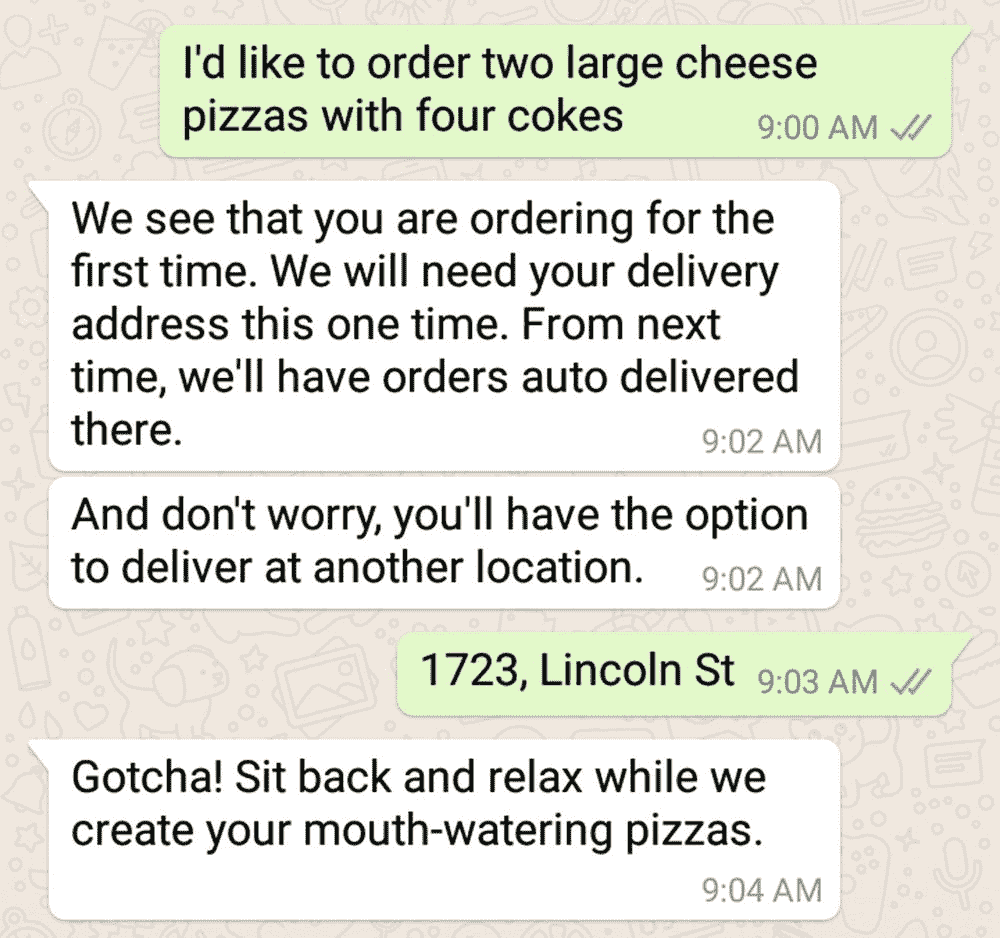
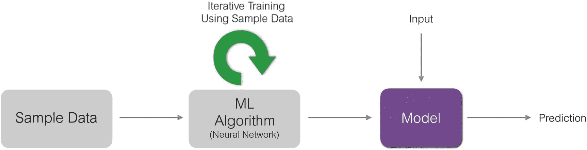
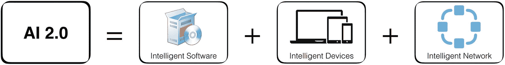
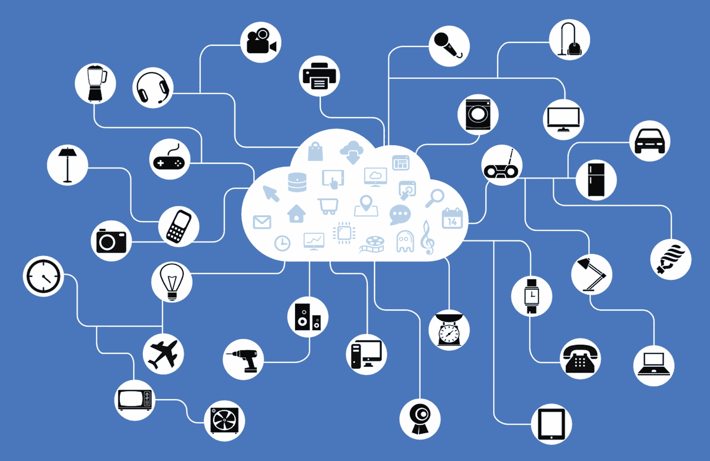
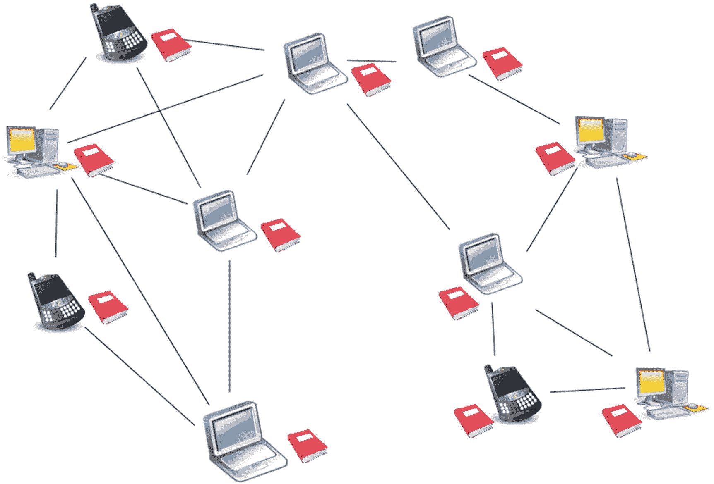

© 2018 年 Nishith Pathak 和 Anurag BhandariNishith Pathak 和 Anurag Bhandari 的 IoT、AI 和区块链.NET`doi.org/10.1007/978-1-4842-3709-0_1`

# 1. 人工智能 2.0 革命

尼希思·帕塔克¹和阿努拉格·班达里²(1)印度，Pauri Garhwal 区，科特瓦拉(2)印度旁遮普邦，贾朗达尔从前，计算机大到可以占据一间房间。它们能够进行复杂的数学计算。然而，它们并不是为像你我这样的人操作而设计的。它们也不是为了创建文件和演示文稿、玩游戏或者上网而设计的。早期的计算机是由真空管驱动的——就像当时大多数其他复杂的电子设备一样——并且被用于科学研究。然后，半导体革命发生了，晶体管诞生了。注：真空管是一种电子设备，它是旧收音机、电视机、放大器甚至计算机的常见组件。这个管子是一个玻璃封装，里面装有一个阳极和一个阴极，封装在真空（无空气或气体）中。它基于这样的原理：电流可以穿过真空而不需要固体材料。第一个真空管是一种二极管，与今天的半导体二极管不同，它又大又脆弱。晶体管孕育了微处理器，微处理器最终将计算机带入我们的家庭，并使它们能够做的事情远远不止记录科学数据、计算数字或者破解代码。第一台 IBM 个人电脑是由 Intel 8088 芯片驱动的，速度为“令人眼花缭乱”的 4.77MHz。处理器很快经历了自己的革命，这是由著名的摩尔定律所决定的。计算机的处理能力大约每 18 个月翻一番，使它们能够执行以前一代处理器无法高效完成的任务。这里的共同模式是什么？所有这些革命都不仅影响了性能或软件开发方法，而且在以前是无法想象的情况下也影响了计算。还有其他一些历史性的、与此同时和随后发生的革命，它们彻底改变了计算机的面貌。以最近的现象为例：云革命。回到 2010 年，当“云”只是报纸和杂志中的一个流行词时，人们对云的真正含义普遍感到困惑。每个人都谈论着云的颠覆性潜力和持久的好处，但只有一小部分技术精通的人真正理解它。几年后，每个人都采用了它。云不仅通过提供全新的商业模式来影响企业，而且影响了我们的个人生活。今天，我们无法想象一个没有云的世界：一个没有在线存储、无限音乐和视频流、照片共享、协作文档编辑和光速社交网络的世界。企业通过基于云服务的更好的基础设施而不是承担管理内部服务器网络的高昂成本，节省了数百万美元。云随后成为大数据革命的关键推动者。云计算赋予了我们足够的能力来更快、更廉价地分析数十亿条记录，价值几个字节的数据。让我们试着通过一个例子来理解云的作用。考虑一个电子商务网站，比如 Amazon.com。在高层次上，它存储着关于其用户的两种类型的数据——交易和非交易。非交易数据是关于顾客（姓名、电子邮件或地址）、商品（名称、价格、折扣或卖家）等信息。另一方面，交易数据是关于网站上的特定交易的信息，例如购买商品、提交产品评论、添加商品到愿望清单或购物车等等。这种类型的数据在像 Amazon 这样的网站上迅速增长。在 2016 年的 Prime Day 上，亚马逊每秒销售接近 600 件商品。那就是仅仅一个小时内的 210 万件商品！存储如此庞大的数据曾经是价格高昂的，迫使公司在一定的保留期限后（几周到几年）将交易数据归档或删除。云和大数据技术的强大组合不仅使我们能够以极其便宜的价格存储（而不是丢弃）海量历史数据，而且还使我们能够利用已归档的数据执行复杂的数据分析任务，以从几年的数据中推导出有意义的统计数据和图表，了解客户行为和购买趋势——在销售高峰期的每个类别中，哪些商品是畅销的一百种？哪些商品在用户观看方面受欢迎但在购买方面不受欢迎？几乎同时出现了物联网革命。与大数据一样，云是这一革命的关键推动者。由各种传感器驱动，物联网设备产生了如此之多的数据，以至于大

## 人工智能

人工智能（AI）的含义随着几代人的研究而发展演变。AI 的基本概念并没有改变，但其应用已经发生了变化。1950 年代人们对 AI 的看法与如今实际应用的情况截然不同。而且，它仍在不断发展。如今人工智能是一个热门话题。它已经从流行的科幻小说中走出来，成为了一种商品。而且，不，AI 与优越的机器人接管世界并奴役我们人类无关。至少目前还没有。任何足够智能的东西，从你手机的虚拟助手（Siri 和 Cortana）到你信赖的搜索引擎（Google 和 Bing）再到你喜爱的移动应用或视频游戏，都是由 AI 驱动的。图 1-1 显示了一个由 AI 驱动的智能聊天机器人。图 1-1 一个智能聊天机器人，可以通过人类理解其用户来下订单 AI 的兴趣在 2000 年代达到了顶峰，特别是在 2010 年代初。学术界和企业都在 AI 研究上进行了巨额投资，这些投资不仅影响了这些机构，还影响了它们的附属机构和用户。对软件开发人员来说，这无疑是一个福音。像微软、谷歌、Facebook 和亚马逊等公司在 AI 各个领域的进步以及随后的开源和商业化使得软件开发人员可以轻松地在他们的应用程序中创建类似人类的体验。这导致了智能应用的爆发，这些应用可以像普通人一样理解他们的用户。作为开发人员，你是否曾经想过如何使用 AI 来创建超智能的软件？你可能曾经想过，但不知道从哪里开始。像所有人类一样，开发人员对产品和技术有先入为主的看法。在我们与顶级 IT 公司的软件开发人员的经验中，我们发现开发人员和项目经理中普遍存在这样的看法，即为他们的软件添加自然语言理解、语音识别、机器学习等 AI 功能需要对神经网络、模糊逻辑和其他令人费解的计算机科学理论有深刻的理解。好吧，让我们告诉你个好消息。这种情况不再适用了。你最喜爱的应用程序，如谷歌搜索、Bing、Cortana 和 Facebook 等的智能正在慢慢地向这些公司之外的开发人员开放：有些部分是免费的，另一些则是基于 SaaS 的付费商业服务。

### AI 在过去

“人工智能”这个术语是在 1956 年夏天达特茅斯学院校园内的一次会议上首次提出的。会议的提案包括这样的断言：“学习的每个方面或智能的任何其他特征都可以被如此精确地描述，以至于可以制造出一台机器来模拟它。”正是在这次会议上确立了人工智能研究领域，参加会议的人成为了人工智能研究的先驱。在随后的几十年中，人工智能领域取得了重大突破。开发了计算机程序来解决代数问题、证明定理并讲英语。政府机构和私人组织纷纷投入资金来推动研究。但通往现代人工智能的道路并不容易。1974 年是人工智能研究的第一个挫折。从那一年开始到 1980 年被称为第一个“人工智能寒冬”的时间段。在这段时间内，研究的许多承诺结果未能实现。这是由于多种因素的结合，最主要的是科学家未能预料到人工智能所带来的问题的困难。当时的计算能力有限是另一个主要原因。因此，缺乏进展导致了早期支持研究的主要英美机构停止资助。接下来的七年，1980 年至 1987 年，人工智能研究再度引起了人们的兴趣。专家系统的发展推动了这一繁荣。专家系统是针对特定领域设计的规则引擎；它们以专家知识为基础推导出一组逻辑规则；使用这些规则，计算每个输入的决策。它们在组织中得到了开发，并且很快所有大型巨头开始投资大量资金在人工智能上。神经网络的工作为光学字符识别和语音识别技术的发展奠定了基础。接下来的几年形成了第二个人工智能寒冬，从 1987 年持续到 1993 年。与前一次寒冬一样，人工智能再次遭受了财务挫折。1993 年至 2001 年标志着人工智能的回归，部分原因是由于计算机变得更快更便宜。最终，由于获得了更快的计算能力，使得人工智能研究的旧承诺得以实现，而这正是导致第一个冬天的原因。使用先进的人工智能技术创建了专用计算机，以击败人类。谁能忘记 1997 年 IBM 的深蓝计算机与当时的国际象棋冠军加里·卡斯帕罗夫之间的标志性比赛呢？人工智能在机器人领域被广泛应用。日本人制造出了看起来像人类的机器人，甚至能理解和说人类语言。西方世界也不甘落后，很快就展开了一场竞赛，看谁能制造出最像人类助手的机械设备。本田的 ASIMO 是将机器人技术与人工智能相结合取得的杰出成果的一个典范：一个身高 4'3''的人形机器人，可以行走、跳舞、冲泡咖啡，甚至指挥乐队。

### 现状

AI 最初是一种追求，目标是构建能够理解我们、做我们的家务和消除我们孤独的类人机器人。但是今天，人工智能领域已经扩展到涵盖各种技术，帮助创建智能、功能强大和可靠的软件应用。随着一批新型科技公司的出现，21 世纪见证了人工智能的巨大进步，有时是在微软、IBM、谷歌、Facebook、苹果、亚马逊等公司的研究实验室里默默进行的。也许当代人工智能的最好例子之一是 IBM 的沃森，它最初是一款设计用来在美国流行的电视节目“危险边缘”的竞赛中与人类竞争的计算机系统。在 2011 年的一场展览赛中，沃森击败了两位前获胜者，赢得了 100 万美元的奖金。在沃森的成功推动下，IBM 很快将驱动其计算机系统的人工智能技术作为单独的商业产品发布。人工智能成为了行业的热词，其他大型科技公司也纷纷推出了自己的商业产品。今天，有创业公司提供高度专业但准确的人工智能即服务产品。人工智能并不局限于受欢迎的企业软件应用。你最喜欢的电视和移动游戏早就植入了人工智能。例如，在玩单人游戏时，你与电脑竞争，你的对手根据你的动作做出自己的决定。甚至可以改变对手的难度级别：难度级别越高，游戏的“人工智能”越复杂，对手也越像人类。

### AI 1.0 革命的筹备阶段

AI 的商品化，正如前一节所强调的，是由于关键的启用技术（如机器学习）的发展而成为可能的。这个术语最好通过一个例子来解释。微软 Bing 是微软的流行搜索引擎，它不仅可以执行基于关键字的搜索，还可以根据您搜索短语的预期含义搜索网络。因此，进行简单的关键字搜索，如“泰勒·斯威夫特”，将为您提供官方网站、维基百科页面、社交媒体账户、最新新闻故事以及这位美国著名创作歌手的一些照片。进行更复杂的搜索，比如“乌干达总统是谁？”将为您提供该人的确切姓名以及该人的相关网页搜索结果。这就像询问另一个人一个问题，他知道你并不是要得到所有包含短语“乌干达总统是谁”的网页，而只是想知道被问及的人的名字。在这两个例子（泰勒·斯威夫特和乌干达总统）中，Bing 还将在左侧显示有关该人的一些快速事实：出生日期、配偶、子女等。根据搜索的人物类型不同，Bing 还将显示其他相关细节，例如政治家的教育、时间线和引用，以及歌手的净资产、作品和浪漫故事。Bing 是如何能够向您展示一个人的这么多信息的呢？Bing 的开发人员创建了一个包含世界上所有著名人物（现在和过去）的快速事实的超级数据库吗？并非如此。虽然人类可能不可能创建这样的数据库，但是维护它的成本将是巨大的。我们广阔的世界，有这么多的国家和地区，将继续产生著名人物。因此，这个数据库存在明显的可扩展性问题。微软用来解决这个问题的技术称为机器学习。我们稍后会详细介绍机器学习。同样，使 Bing 能够理解搜索短语的含义的东西称为自然语言理解（NLU）。您可以用十几种不同的方式向 Bing 提问同一个问题，Bing 仍然会每次都得出相同的含义。NLU 使 Bing 足够聪明，能够以人类下意识的方式解释人类语言。

### 机器学习

术语机器学习是由阿瑟·塞缪尔在他 1959 年的论文《机器学习研究》中首次提出的。根据塞缪尔的说法，机器学习是指“使计算机具有学习能力而无需明确编程”。我们都知道，计算机是一种通过按照人类以程序形式提供的指令执行某些操作的机器。那么计算机如何能够自己学习呢？机器学习是人工智能的非常基本的概念。ML 探索了能够从数据中学习并基于其学习进行预测的算法的研究和构建。ML 是智能机器的动力；它是生成人工智能的原因。常规的非 ML 语言翻译算法将具有静态程序指令来检测句子是用哪种语言编写的：使用的单词、语法结构等。同样，非 ML 人脸检测算法将具有面部的硬编码定义：一些圆形的、肤色的，顶部有两个小黑区域（眼睛）等。另一方面，ML 算法没有这样的硬编码；它通过示例学习。如果你用大量用法语写的句子和一些不是法语的句子来训练它，它将学会在看到它们时识别法语句子。图 1-2 显示了 ML 算法如何迭代地使用示例数据创建一个可以根据新输入进行预测的训练模型。图 1-2 大量的训练数据被提供给 ML 算法，比如神经网络，以创建所谓的“训练模型”。然后可以使用训练模型来快速针对指定的输入数据进行预测。许多现实世界的问题是非线性的，比如语言翻译、天气预测、电子邮件垃圾邮件过滤、预测下一任美国总统、分类问题（比如通过图像区分鸟类物种）等等。ML 是这种非线性问题的理想解决方案，其中设计和编程使用静态程序指令的明确算法根本不可行。

### 创建 AI-Enabled 应用程序

我们现在知道机器学习在解决非线性问题时有多么珍贵。从技术上讲，人工智能被视为一个广泛的研究领域，其目标是探索计算机科学领域，并创造出赋予机器类似人类智能的技术。人工智能的一个主要领域——也是最常用的领域——是自然语言处理或 NLP。它是一个代表了与处理人类所说自然语言相关的各种任务的大伞术语。理解人类的基本交流媒介不就是我们世界中智能的基础吗？在各种 NLP 任务中，包括语言理解（NLU）、机器翻译（语言翻译）、语音识别（语音转文本）等等。人工智能的另一个主要领域是计算机视觉（CV），这个领域涉及使机器智能到足以像人类一样解释视觉（图像和视频）。一些常见的 CV 任务包括人脸检测和识别、物体检测和识别、光学字符识别（OCR）、图像分类等。NLP 和 CV 中的每一个任务都是可以通过机器学习解决的非线性问题。从技术上讲，我们可以使用足够大量的训练数据（通常以千兆字节计）为它们中的每一个创建机器学习模型。创建一个 ML 模型，更别说全部，都是在智力上具有挑战性和昂贵的。即使你有一支具备 ML 技能的计算机科学和数学团队，也要照顾到开发这些模型所需的极度昂贵的硬件成本。即使使用目前可用的深度学习工具包如 Microsoft CNTK、Google Tensorflow 和 Torch，在 24x7 地运行在高端机器上进行准确训练一个 ML 模型可能需要 2-3 个月的时间。虽然专门的 ML 友好微处理器正在研发中（如 iPhone 的 A11 仿生和 Google 的 TPU），硬件成本进一步下降，但使用商业可用的人工智能服务仍然成本指数级地更容易更便宜。人工智能服务——比如 Microsoft 的认知服务 API——可以被几乎任何代码使用来逐步增加智能。这个任务已经被简化为几次 REST API 调用的问题。所有以下的用例现在不再难以实现：

+   在安全系统软件中添加面部检测以检测入侵者

+   在社交应用中添加面部识别以识别朋友

+   在聊天机器人中添加语言理解，用于自动支持、订票等。

+   使用 OCR 从图像中提取文本

AI 1.0 革命正在改变软件编写的方式。AI 不再是爱好者的专属领域。当代 AI 解决方案的实用性和准确性已经迫使甚至最传统的 IT 和软件公司采用它。IT 公司正在使用 AI 创建创新的新解决方案，并为其客户重新设计现有软件。越来越多的客户要求使用 AI 功能的软件。

## 什么是 AI 2.0？

下一代 AI 技术将使软件解决方案向前迈进几步。AI 2.0 比单独的 AI 更大。这不再只是关于创造智能软件了。这得益于最近认知技术（AI）、物联网（IoT）和区块链的先进发展。图 1-3 强调了这个方程式。物联网和区块链是相对较新的发展，但已经与 AI 共存了一段时间了。图 1-3AI 2.0 是 AI（智能软件）、物联网（智能设备）和区块链（智能网络）的结合 AI 技术的改进使使用 AI、物联网和区块链开发“完整”产品方案变得越来越容易。再次强调，这不再只是关于软件，而是关于在高度安全和灵活的网络上的软件和硬件。以下各节列出了 AI 2.0 打开的三个可能性。尝试想象更多。

### 野生动物的早期预警系统

这个世界上的一些农村地区成为了人类与动物之间冲突的温床，其中最常见的是人类与大象之间的冲突。据悉，人类非法偷猎大象获取象牙。作为报复，大象经常践踏人类的农田。据世界自然基金会（WWF）称，目前的入侵阻止系统（如电子围栏）成本昂贵，难以维护，有时会对大象构成威胁。智能的实时数据预警系统，可以根据来自物联网监控设备的数据进行工作，对于这一敏感问题来说，可能是一种经济高效且高度可扩展的解决方案。

#### 智能精益制造

制造实践已经变得高度优化。但仍有改进的空间。物联网设备可以用于监控机器和环境。然后可以对收集到的监控数据进行智能分析，生成洞察，以帮助进一步优化制造流程。区块链可以帮助安全可靠地分发优化参数到一系列连接的制造工厂。供应链也可以通过区块链得到有效管理。

#### 连接的家庭

Facebook 创始人兼 CEO 马克·扎克伯格于 2016 年进行并发表了一项著名的人工智能实验。贾维斯是一个使用了几个开源和自家 AI 库构建的定制家庭自动化解决方案。人工智能 2.0 将让我们轻松创建不仅仅是一个智能家居，而是一个连接的超级安全智能家庭网络。关于他的实验，你可以在[`www.facebook.com/notes/mark-zuckerberg/building-jarvis/10154361492931634/`](https://www.facebook.com/notes/mark-zuckerberg/building-jarvis/10154361492931634/)上阅读更多。

### Azure 认知服务

认知服务是微软提供的一组与人工智能相关的软件即服务（SaaS）商业产品。 认知服务是微软多年认知计算和人工智能研究的产物，其中许多服务被微软自己的一些热门产品使用，如必应（搜索、地图）、翻译器、机器人框架等。 微软将这些服务作为易于使用的 REST API 提供，可以直接在 Web 或移动应用程序中使用。 截至撰写本书时，有 30 种可用的认知服务，广泛分为五大类别——视觉、语音、语言、搜索和知识。

## 物联网

物联网是一个经常被误解的术语。事实上，互联网本身就是一个被高度误解的概念，更不用说“物”了？那么，什么是互联网，什么是物？更重要的是，物是如何连接到互联网（以及彼此）的？互联网的发明是为了连接世界上不同地区的两台计算机。它并不是像人们普遍误解的那样是为了帮助你浏览网站。有时，互联网和 WWW（全球网络或简称 Web）这两个术语是可以互换使用的。这是一个危险的错误。它们并不相同。这就好比说 Facebook 和状态更新是一回事，但实际上它们并不相同，因为更新状态只是 Facebook 的众多功能之一，还有照片、应用程序、游戏、签到等等。用同样的类比，Web 只是互联网的一个方面。是互联网，而不是 Web，让你能够查看电子邮件、观看视频、发送即时消息、进行视频通话等等。互联网的每个“功能”都由不同的协议支持。Web 使用 HTTP，电子邮件使用 IMAP/SMTP，视频流使用 RTSP，即时消息使用 Jabber，视频通话使用 VoIP 等等。所以下次当你听到有人说，“在互联网上查看这个产品的最新价格”，请礼貌地打断他们，指出他们实际上是指 Web 而不是互联网。在互联网的早期阶段，互联网只由大型笨重的计算机组成（虽然不是像房间那么大的笨重）。那时，互联网将计算机与服务器或彼此连接起来。几乎没有其他设备可以连接到互联网。随着智能手机的推出，这种情况发生了变化。它们是可以连接到互联网的小巧口袋大小的计算机。在互联网上，它们可以做大多数常规计算机可以做的事情——浏览网站、查看电子邮件、发送即时消息等等。然后出现了平板电脑。然后是智能电视。之后是智能手表。你可能自己见证了这种趋势。我们甚至有智能恒温器、冰箱、打印机、相机、音响系统、汽车、烤面包机等等。换句话说，我们的互联网现在有数百万这些非计算机设备连接到它上面（见图 1-4）。这些非计算机设备就是物联网中的“物”。每个物都被称为物联网设备。图 1-4 这幅插图展示了连接到互联网上的许多不同的物。

### 更多技术定义

物联网（IoT）是“智能”版本的常规物理物体的全球网络。什么使一个物体变得智能？它通过嵌入式计算硬件、传感器、执行器和软件自动地以及更高效地完成其任务的能力。但使一个物体变得智能的定义特征是它能够连接到互联网，这开启了一系列可能性。例如，家中安装的常规恒温器必须手动设置所需温度以控制空调。智能恒温器可以通过手机应用远程控制（因为它连接到互联网），当开始下雪时使房子变暖，这样你从办公室回家后就能感受到温暖。我们将在第二章中更详细地探讨物联网设备，包括帮助将常规电气和电子物品转换为物联网设备的技术。

### 物联网的用途是什么？

智能恒温器示例说明了物联网设备的远程控制用例。相同的用例可以扩展到智能灯泡、智能风扇、智能闭路电视摄像机、智能洗衣机等，共同构建智能家居。构建智能家居的设备也称为家庭自动化系统/解决方案。然而，物联网设备的最常见用例是数据收集。大多数物联网设备具有一个或多个传感器用于测量某些参数。智能手表配备了心率传感器、计步器（用于测量步数）、气压计（用于测量压力）等。传感器持续记录并存储设备中的数据。然后在设备上进行分析或保存在云中以供后续分析。分析的结果是许多有意义的信息——一天中的平均生命体征、最大活动时段、总步行步数、总消耗卡路里（由步行/跑步导致）、等等。有时会使用专门的可穿戴设备来跟踪患者的健康状况。因此，物联网的另一个有用应用是健康监护和远程患者监测系统。智能手表通常是复杂、昂贵的物联网设备。我们可能会有更简单的物联网设备，只有一个目的，因此只有一个传感器。在典型的制造工厂中，这些可能是用于监控室内温度的设备、用于监控湿度的另一个设备、用于记录视频的另一个设备，以及用于记录运行机器的旋转的另一个设备。结果是一个连接的工厂，其中收集的数据可以进行分析，以提取结果以优化机器和流程的效率。您将在第九章中了解有关捕获实时数据的更多信息。在第十章中，将涵盖分析捕获的数据以生成见解。尝试想象物联网在农业、交通运输、环境和公共基础设施领域的更多应用。

### Azure IoT Suite

IoT 套件是微软提供的一系列服务，用于管理小型到大型物联网设备网络。这些服务在大规模设置中特别有用，手动管理数百、数千甚至数百万物联网设备简直不可能。一个典型的设置，即物联网解决方案，由两个主要组件组成：物联网设备和解决方案后端。基于云的解决方案后端是设备收集的数据存储和分析的地方。Azure IoT 套件为预配置或自定义的物联网解决方案提供端到端实现，例如远程监控（监控设备状态）、预测性维护（预测设备维护需求以避免停机）和连接工厂（管理工业设备）。该套件通常与以下五个 Azure 服务配套使用：

+   IoT Hub —— 实现物联网设备与解决方案后端之间的安全、双向通信。Azure IoT 设备 SDK 适用于各种语言和平台，以便设备能够可靠地连接到其解决方案后端。IoT Hub 提供了解决方案，用于解决设备身份管理、设备双生对象、按设备身份验证、将设备到云消息路由到 Azure 服务等问题。

+   机器学习 —— 一种完全托管的云服务，使您能够轻松构建、部署和共享预测性分析解决方案。机器学习工作室是一个基于浏览器的、拖放式的创作环境，允许您为您的分析需求创建 ML 模型。它支持 R 和 Python，这些语言通常用于创建统计、预测性解决方案。ML 工作室还提供了一个完全托管的服务，您可以使用该服务将您的预测模型部署为可供使用的 Web 服务。

+   流式分析 — 开发和运行对物联网设备捕获的数据流进行实时分析。分析程序使用类似于 SQL 的声明性语言编写，支持 JavaScript 用户定义的函数用于时间逻辑。支持对多个物联网流进行并行实时分析。还可以调用 Azure 机器学习模型对流数据进行预测评分。

+   通知中心 — 用于大规模发送关于各种物联网事件的通知的移动推送通知引擎。在移动设备上接收有关作业完成、定期监视更新、即将设备故障等的通知是一个常见需求。通知中心可以一次向数百万部移动设备发送通知。所有流行的移动平台都受支持，包括 Android、iOS 和 Windows。

+   Power BI — 一套业务分析和智能工具，用于使用物联网设备收集的数据执行分析，创建仪表板和图表。与流式分析集成良好，以创建具有实时洞察力的仪表板。

您将在第二章中更多地了解 IoT 套件及其服务。在第三章中，您将使用 Azure IoT Hub 和其他服务与您自己的设备一起创建真实世界的连接网络。

## 区块链

假设你买了一辆新车。如果像我一样，你住在印度，那么在开新车上路之前购买汽车保险是强制性的。这不仅是为了保护你的车免受损坏，还要为可能因为你的驾驶而在事故中受伤的人提供医疗费用。无论如何，假设你是一个小心的司机，即使开了一年新车，也没有伤害到任何人。然后有一天，当你像往常一样小心驾驶时，另一辆车从无处加速而来，撞上了你的车侧面。你感到心烦意乱。你曾经把你的车保持得像新的一样长时间。现在，因为不是你的过错，你珍贵的车有了一个像黑洞一样深的凹痕。更糟糕的是，当你提交索赔时，却陷入了繁琐的索赔过程，并最终被不公平地支付。保险公司表示，他们无法确定损害是另一个人的过错还是你自己的过错。这样的情况每天在世界各地发生成千上万次。区块链是可以永远改变这种情况的革命。不仅客户受益，保险公司也受益。在了解区块链如何做到这一点之前，让我们先了解一下什么是区块链。

### 什么是区块链？

简单来说，区块链是一个充满条目的文档，这些条目与一群人和组织共享。这些条目可以是与共享组内的人/组织相关的任何内容：拥有的物品，发送/接收的货币，出售/购买的物品等。为了安全起见，共享文档被加密并验证，以确保其存储的数据始终正确（对所有人都是真实的）。由于组内的每个人都可以访问完全相同的条目，因此不需要中央机构——银行，警察，法官或任何其他仲裁者——来验证组内两个人之间的交易。每个人都知道发生在这两个人之间的所说的交易。此外，这些条目是不可变的：一旦创建，它们就无法更新或删除。它们是不可篡改的！稍微更加技术化地说，区块链是一个分散的网络——如图 1-5 所示——在该网络上涉及两个或更多成员的每个交易都记录在一个巨大的只写一次的分类账中的一个块上。将块视为分类账中的一页。从这个意义上讲，分类账可以被视为一串块。网络中的每个人都有分类账的相同副本。每次发生交易时，它都会被添加到涉及的成员的分类账中。然后，迅速而安全地，网络上的所有其他分类账副本都会更新，以确保所有副本保持同步。没有“主”分类账。有多少网络成员就有多少分类账。图 1-5 计算机和移动设备（统称为“节点”）的分散网络。每个节点都有一个分类账的副本。为了强调，让我们回顾一下我们迄今为止关于区块链所学到的内容：

+   区块链是去中心化的。没有中央权威来为网络上发生的交易提供保证或验证。这与银行的作用恰恰相反，银行充当两个或多个实体之间所有金融交易的中间人。

+   区块链网络上没有任何人拥有总账。由于其去中心化的性质，网络上的每个人都拥有总账的副本。

+   总账中的记录是不可变的。这是为了防止欺诈篡改。

+   所有的总账副本始终保持同步。如果每个人对彼此都有相同的信息，欺诈风险就会被抵消。

+   区块链通过强加密为每一笔交易提供验证机制。

### 区块链如何帮助？

你可能在流行的加密货币比特币的背景下听说过区块链。区块链的前身最早由斯图尔特·哈伯和 W. Scott Stornetta 在 1991 年的论文《如何给数字文档时间戳》中描述，在加密学杂志上发表。直到 2008 年，现代区块链的概念——或者最初称为块链——是在由中本聪在[metzdowd.com](http://metzdowd.com) 上发表的著名论文《比特币：一个点对点的电子现金系统》中提出的。区块链被描述为比特币将要运作的后端基础设施。需要注意的是，没有人真正知道谁发明了比特币并撰写了相关论文。中本聪是一个由一个未知人或一组人发明比特币、实现第一个区块链并发布开源比特币软件的化名。已经有多次尝试找出中本聪的真实身份，包括美国国土安全部和 NSA 的介入。虽然一些消息来源声称已经找到了神秘化名背后的真实人物，但并没有共识。直到今天，中本聪仍然是一个价值数十亿美元的隐秘人物，因为他/她拥有的比特币最初价值数十亿美元。比特币是一种虚拟的、电子的货币。它不是由银行发行的，也没有任何一个世界上的政府或权威机构认可它。没有官方的比特币货币票据和实体硬币。那么，它是如何工作的呢？它为什么有可信度呢？我们在区块链的简单定义中了解到，它可以被认为是一个大型的交易共享数据库。在比特币的情况下，它的区块链网络从少量的硬币（货币）开始。这些硬币然后分配给网络的成员。新的硬币可以通过一个耗时和资源密集型的过程，即比特币挖掘，引入到链中。每当重新分配或添加硬币时，交易都会被安全地记录在区块链的分类帐中。所以，如果 A 给 B 一定数量的钱，这个交易就会在每一个分类账本上被复制。实际上，网络上的每个人都知道 A 已经给了 B x 数量的货币。因为每个人都知道这笔交易，所以没有争议。B 不能谎称得到的钱少于 x，A 也不能谎称给的钱多于 x。需求和供应的经济学决定了比特币在现实世界中的价值。截至本书撰写时，1 比特币（BTC）的价值超过了 4000 美元！现在让我们将相同的逻辑应用于我们之前看到的汽车保险情况。如果有一个由客户、保险公司、修理店和医院组成的区块链网络，那么网络上的每个人都会知道你与保险公司的保险合同。在你伤害的人的医疗索赔情况下，医院可以立即检查你的保险合同以便快速处理索赔。在汽车损坏索赔的情况下，因为复杂的流程而被保险公司不公平欺骗的机会将会减少。通过在你的车上安装一个物联网设备，保险公司可以在事故发生时了解各种参数，如速度、位置、照片等。这将有助于客户获得公平的索赔。对于保险公司来说，这意味着没有夸大的索赔。根据德勤的一份报告（[`www2.deloitte.com/content/dam/Deloitte/ch/Documents/innovation/ch-en-innovation-deloitte-blockchain-app-in-insurance.pdf`](https://www2.deloitte.com/content/dam/Deloitte/ch/Documents/innovation/ch-en-innovation-deloitte-blockchain-app-in-insurance.pdf)），一些客户被称为“为现金而碰撞”的做法所熟知，即故意制造事故以进行索赔。带有准确传感器的物联网设备将防止这种情况发生。保险公司受到保护的另一件事是多次索赔欺诈。欺诈者以虚构的身份从多家保险公司购买保险单。通过一个假意的撞车，他们对同一起事故进行多次索赔。目前很难检测到这种欺诈行为，因为数据没有被不同的保险公司共享。一个区块链网络，多家保险公司在其中，以及强制执行欺诈身份管理，将使检测多次索赔欺诈变得容易。区块链在第七章中有进一步的解释。

### Azure 区块链解决方案

部署区块链网络并不容易。微软 Azure 通过一种称为“区块链即服务（BaaS）”的东西，使开发、测试和部署区块链应用变得简单。区块链是一个开放的概念，有几种开源和商业实现。有些实现是运行数字货币的现有部署，而其他一些作为可以安装在自己的基础架构上的平台提供。Azure 提供后者实现——区块链平台——作为 BaaS 的一部分。为了使你的区块链网络生效，每个区块链平台或解决方案必须安装在一个或多个 Linux 或 Windows 虚拟机（VM）上。BaaS 提供预配置的 VM 模板，以自动执行安装和部署任务。为这些区块链解决方案开发应用所需的工具和库也与网络一起安装。作为 BaaS 的一部分提供的一些区块链解决方案包括：

+   以太坊联盟

+   STRATO 区块链 LTS

+   Chain Core 开发者版

+   以太坊工作室

+   Emercoin 区块链

在第八章中，你将了解如何实施这些 BaaS 解决方案中的一种。

## 一切都关乎数据

在我们讨论的革命中，真正的英雄不是云，也不是人工智能或物联网或区块链。这些只是推动者。它们推动了什么？这很容易——数据，数据将永远是所有重要革命中的真正英雄。想想看。数据是被收集的（物联网）。数据是被分析的（人工智能）。数据（结果）是被存储和传播的（区块链）。

### 数据为何如此重要？

最初的计算机程序是专门用来收集和分析数据的 — 从记录天气数据到做预测，再到截取加密消息并利用它们识别出的模式进行破译，你可能还能想到许多其他类似的例子。今天我们大多数创建的软件也依赖于某种形式的数据。虽然有些应用程序预先加载了它们的数据，但其中相当数量的应用程序依赖于从用户那里收集的数据。通常情况下，收集的数据的最终目标是达到某个目标或获取见解，这些数据的大小可能从几千字节到几吉字节不等。每次革命，我们的意图始终是尽可能智能地利用数据。比如，看看一个简单的 TODO 应用程序。它存在的整个目的是提供一种存储用户笔记（数据）的方式，以帮助他们记住事情。一个简单的静态 TODO 应用程序只会做到这一点。一个更复杂的 TODO 应用程序会不断分析您的笔记（可能还包括您的电子邮件、短信、日历等），以便为您提供关于可能需要提醒的内容的建议。一个社交网络完全依赖于用户数据。您的状态更新、评论、喜欢、照片等，使得 Facebook 成为一个生机勃勃的地方。为什么 Facebook — 对一些人来说是地球上最好的东西 — 完全免费提供？因为数据：它从我、你和数百万其他人那里收集的数据。根据您在社交网络上的活动（喜欢、位置、朋友和应用程序），它巧妙地展示您的促销活动和广告，这些实际上是 Facebook 从发布者和公司那里得到报酬的事情。Twitter、Instagram、YouTube、Gmail 等等都是如此。搜索引擎可以利用搜索趋势提供定制广告。旅行应用程序可能会（以成本）与航空公司和酒店共享用户的预订和搜索数据，以便根据供需为您提供更好的价格。地图应用程序可能会收集用户的位置数据以提供实时交通预测。你能想到数据在其他领域（如学术界、研究、健康、股票市场、银行业、教育和娱乐业）中的重要性吗？

### 数据收集的演变

数据收集有两个方面——如何收集和存储在哪里。这两个方面在革命中都发生了巨大变化。

#### 数据是如何收集的

早期的计算机程序并不面向用户。它们是由学者和研究人员用来解决科学问题的。当软件变得可供商业和非商业组织使用时，数据收集主要是基于纸笔的过程。数以千计的由客户填写的纸质申请和表格必须通过手工、劳动密集的过程手动输入系统。互联网革命带来了用户面向应用的爆炸。通过网站和桌面软件，用户和客户可以自己提交数据。智能手机革命将这一点推向了一个无法想象的新水平。这些智能口袋设备不仅允许用户随时随地明确地提交数据，还允许收集隐式用户数据——无需用户干预即可收集的数据：位置、音频、图像等。我们目前正处于物联网革命的中间，这使得隐式用户数据收集更进一步。智能手表自动收集各种健康参数数据，智能恒温器自动收集温度数据，以及定制的物联网设备可以通过传感器从用户周围收集所需的数据。

#### 数据存储在哪里

我们从文件开始，这种你在记事本中创建的文本文件。日志、配置数据，甚至用户数据都存储在文本文件中。写入文本文件是快速且简单的。大量数据可以方便地分成几个文件存储。但是，从文件中读取数据是一个挑战。正如我们所知，存储在非结构化或部分结构化格式中的数据很难搜索和用于分析。这导致了电子表格和关系数据库的出现，其中数据可以存储在由行和列组成的有序格式中。存储和查找大量数据变得容易。它们还使生成报告和见解变得容易。主要的关系数据库管理系统（RDBMS），如 SQL Server，提供了报告和智能功能，如 SSRS 和 SSIS。 RDBMS 的问题在于它们无法处理数十亿条记录。这就是 NoSQL 出现的地方。NoSQL 数据库是非关系型的，不强制执行一组模式。流行的选项，如 MongoDB 和 Cassandra，可以以指数级更快的速度存储和检索大量数据（数十亿条记录）。它们特别适用于存储半结构化或非结构化数据，并且在性能和速度至关重要的环境中使用。非结构化数据是以快速的速度增长的数据，与结构化（关系）数据相反，分析以获取有用的见解。然后还有 Hadoop，这是大数据革命的关键驱动力。Hadoop 能够存储大量的非结构化和结构化数据。此外，它提供了对存储的大量数据执行数据分析以生成报告和仪表板的手段。现在我们有了区块链，这是一种机制，可以公开和安全地存储大量数据，供网络上的每个成员使用。区块链不应被视为替代这里讨论的其他数据存储机制。它仅用于事务数据，并且通常与 NoSQL 和关系数据库一起使用。

## 智能医院

在本书中，您将学习和使用构成 AI 2.0 的技术。您将看到 AI 2.0 如何用于构建现实世界的解决方案。针对本书的目的，我们将专注于智能医院用例。Asclepius（发音为 ess-clip-ee-us）联盟是我们虚构的全球 3+ 星级医院网络，他们希望通过数据共享合作，挽救更多的生命并简化患者的生活。我们将为 Asclepius 联盟构建一个 AI 2.0 解决方案，其工作方式如下。所有成员医院和一些保险公司将成为专用区块链网络的一部分。横跨医院的患者医疗记录将被发布在区块链上，包括通过物联网设备记录的实时患者监测数据。这将促进跨医院和保险公司之间的透明共享患者数据。人工智能将促进对患者监测数据的实时分析，从而实现更好的诊断。横跨医院收集的患者数据也可以进行中央分析，以生成后续可用于对其他患者进行生命救助预测的结果。这样的医院网络可以跟踪横跨医院的所有医疗库存（设备、机器、药品等）。在医疗用品短缺的情况下，这将是有帮助的。同样，可以创建高度可访问的器官库，包括血库和眼库。在这一网络上，顾客从其中一家保险公司购买医疗或人身保险的交易也将被记录。医院对保险记录的可用性将自动化理赔流程，使其更简单和节省时间。患者的健康记录对保险公司的可用性将防止潜在的欺诈。

## 复盘

这一章向您介绍了您将用于创建下一代软件解决方案的概念和技术。您学到了：

+   软件开发中即将到来的 AI 2.0 革命

+   涉及 AI 2.0 的各种用例

+   人工智能（AI）的基础和演变

+   物联网（IoT）概述

+   对区块链的简单理解

+   数据在当前和即将到来的革命中的重要性

在下一章中，您将详细了解物联网的一般情况以及 Azure 的企业物联网产品。
