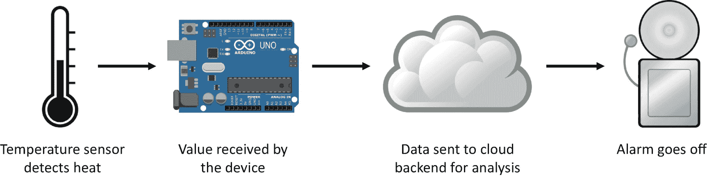
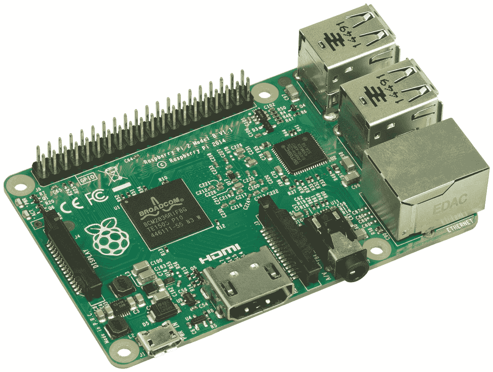
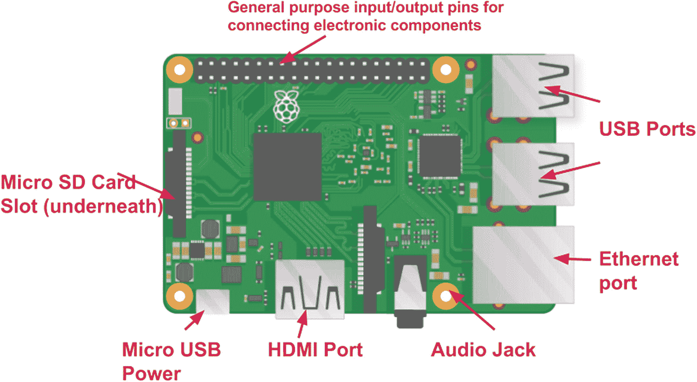
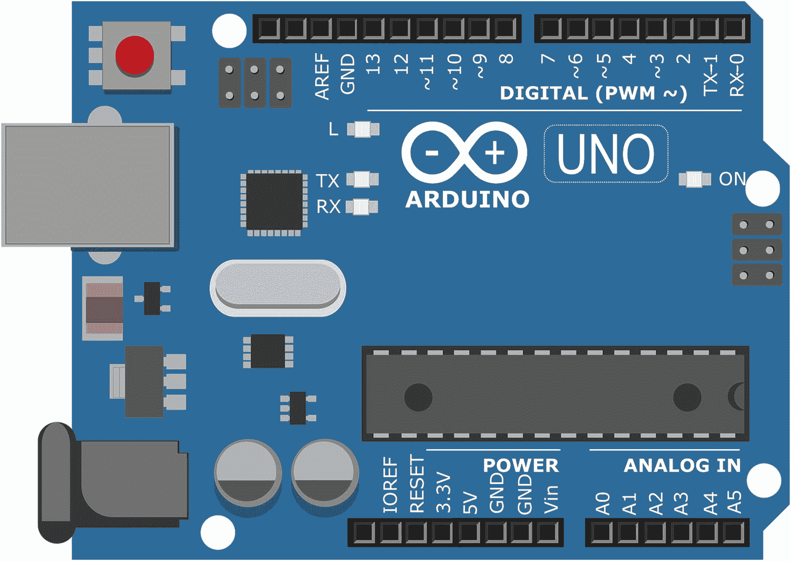
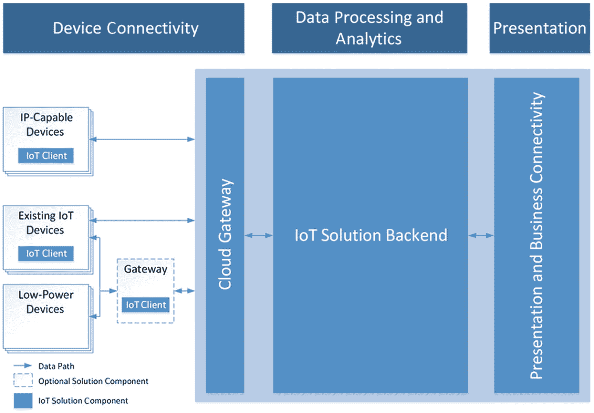
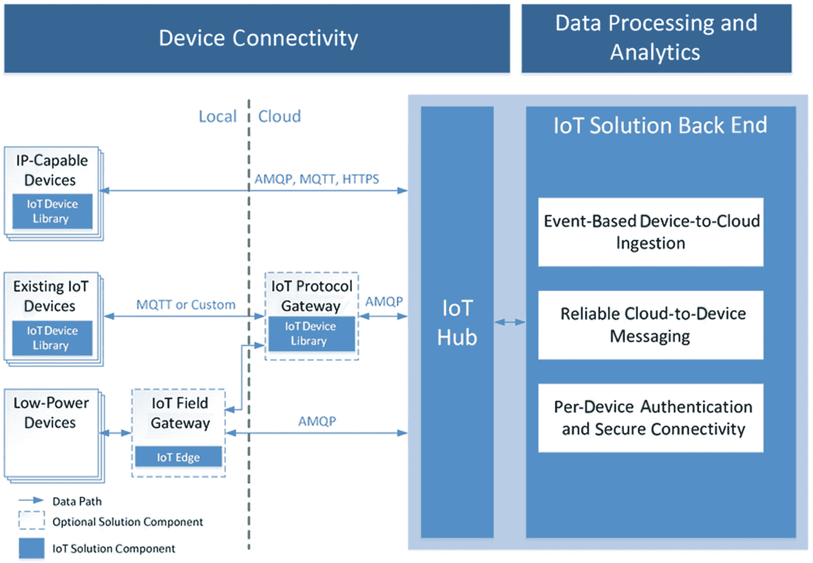

© 2018 年 Nishith Pathak 和 Anurag Bhandari。Nishith Pathak 和 Anurag Bhandari 著。《.NET 上的物联网、人工智能和区块链》。

# 2. 理解物联网和 Azure IoT 套件。

Nishith Pathak¹ 和 Anurag Bhandari²(1) 印度，帕里·加尔瓦尔县，科特瓦拉 (1) 印度旁遮普邦，贾兰达尔 (2) 几年前，物联网 (IoT) 是一个新兴趋势。 今天，它是现代 IT 解决方案的一部分。 在消费者领域，物联网通常被认为是智能手表、冰箱、电视等——老旧物品，现在连接到互联网。 它更多地被视为一种便利功能，而不是解决现有问题的方案（智能恒温器和远程宠物食品分配器，有人需要吗？）在企业级别，物联网一直是一个福音，特别是在自动化方面。 以一个装有数百台机器的汽车工厂为例，这些机器正在努力制造汽车。 每台机器可能有许多活动部件，这些部件容易磨损。 必须定期检查几个参数，以确保始终保持 100% 安全和可操作的工作环境。 在典型工厂中，这种监测很大程度上是一个手动过程，由人类完成。 数据以数字或纸质记录，稍后进行分析，以确定需要维修或更换的机器（或特定部件）。 这是一个缓慢而昂贵的过程。 通过在这些机器上改装廉价的物联网设备，可以自动监控制造设备。 物联网设备可以定制为具有专用传感器，用于监控不同机器的特定参数。 在一个云存储和大数据分析便宜的世界中，物联网设备可以全天候运行，记录和存储监控数据。 然后可以稍后自动分析此大量数据或实时分析以检测潜在问题。 然后可以通过短信和通知消息自动通知工厂监督员。直到几年前，这是电气和电子工程师的领地，现在已成为每个主要 IT 公司解决方案提供的一部分，使得物联网成为计算机和软件工程师必备的技能。 简单地说，几年前是硬件和嵌入式软件的事情，现在是为微型计算机（物联网设备）编写普通软件程序。在本章中，您将学习以下内容：

+   物联网的历史

+   IoT 设备，包括树莓派等支持设备

+   网络连接性，包括消息传递和协议

+   实际应用案例

+   配置和部署单个 IoT 设备

+   Azure IoT Suite 及其组件

+   Azure IoT Hub 架构

+   使用 Azure IoT Hub 在规模上配置和部署多个 IoT 设备

## 物联网的历史

像人工智能一样，物联网背后的核心理念并不新。1999 年，凯文·阿什顿（Kevin Ashton）创造了“物联网”一词，但这一概念的起源可以追溯到 80 年代初。1982 年，在卡内基梅隆大学计算机科学系，一台重新设计的可口可乐瓶装机成为首台连接到互联网（当时称为 ARPANET）的电器设备。借助微型开关和传感器，这台可口可乐机能够持续报告其库存状态（剩余瓶数、温瓶与冷瓶数等）。因此，学生们不必再亲自前往机器并失望地发现没有冷藏瓶，而是可以登录网站检查其状态。这台著名的可口可乐机仍然连接到互联网，并在卡内基梅隆大学的网站上有自己的页面来讲述它的故事。约翰·罗姆基（John Romkey），为 IBM PC 开发了 TCP/IP 协议栈，于 1990 年创造了一台可以通过互联网开关的烤面包机。1993 年，昆汀·斯塔福德-弗雷泽（Quentin Stafford-Fraser）将一台咖啡壶连接到互联网以监控其水位。马克·韦瑟（Mark Weiser）在他关于泛在计算的知名文章《21 世纪的计算机》中详细探讨了这一概念。所以，你看，这个想法确实存在，但由于互联网本身还处于萌芽阶段，并没有引起广泛关注。据说，当凯文·阿什顿向宝洁（P&G）的管理层展示了关于射频识别（RFID）的革新性新想法时，他将其称为“物联网”，以吸引立即的兴趣，因为当时互联网是一个炙手可热的话题。RFID 革命确实为当今我们所知的物联网革命提供了推动力。使用指尖大小的电路来数字化识别现实世界中的物体是一个强大的概念，它使得这些物体的数字化表示能够在互联网上实现。在 21 世纪初，物联网作为一个术语开始引起关注。它在科学期刊、会议和杂志中被提及。直到 2009 年，根据思科的说法，连接到互联网的设备数量超过了世界上的人口数量，物联网正式诞生。2012 年树莓派的发布及随后涌现的小型系统芯片（SoC）计算机浪潮是物联网现象的主要推动因素。物联网自 2014 年开始受到广泛的行业采纳；自那时以来，趋势一直在向前发展。图 2-1 总结了物联网的时间线。Figure 2-1 物联网里程碑时间线图

## 物联网设备

“物”，设备和物联网设备在物联网网络中都是相同的这一事实不应引起混淆。正如我们在本章开头看到的那样，物联网设备可以被认为是两种类型——消费者和企业。实际上，有一种正式的方式来对物联网本身进行分类：

+   消费者物联网：包括供最终用户直接使用的现成设备。示例包括智能手表、智能电视和智能音箱。设备通常通过蓝牙或 WiFi 彼此连接，或者连接到本地网络。

+   工业物联网：包括为特定企业和工业场景定制的设备。我们之前讨论过的汽车工厂示例属于这一类别。需要注意的是，定制并不意味着设备的所有电子组件都是制造或者甚至是组装的。正如稍后您将看到的那样，有一些“样板”启用设备可以定制或者扩展以创建大型解决方案。设备通常通过以太网或 WiFi 直接连接到互联网。

在与 IIoT 一起使用的热门术语是工业 4.0（或第四次工业革命，4IR）。历史上的每一次工业革命都是关于自动化的——第一次革命是关于纺织品生产机械化，第二次革命围绕着钢铁和大规模制造（包括装配线），第三次革命是通过使用分析和云来数字化制造。诸如精益制造和六西格玛之类的技术被开发出来以提高效率。最初的生产率增长是巨大的，但近年来大幅下降。迫切需要寻找其他方法来提高效率。工业 4.0 是通过使用领先的当代数字技术——IIoT、大数据、云计算、增强现实、机器人技术等——实现完全数字化转型来提高效率的。最初是从制造业开始，现在覆盖了其他行业，如医疗保健、农业、物流等。其好处包括减少计划外停机时间、降低维护成本、减少能源消耗和提高性能。很容易将第三次工业革命与第四次混淆。关键的区别因素无疑是机器学习和深度学习的进步，这促成了我们今天所知道的人工智能、机器人流程自动化和认知服务。

### 传感器和执行器

在讨论物联网设备时，没有不谈论它们的核心构建模块——传感器和执行器的。传感器是一种小型电子元件，专门设计用于感知（检测）特定的参数——声音、光线、温度、湿度、压力、GPS 坐标、加速度等。我们的手机装载了半打传感器。执行器是一种执行动作或运动（推、拉或旋转）的电气或机械设备。LED、电机、扬声器和振动器是其中的一些例子。执行器是传感器的逻辑相反。为什么？因为传感器和执行器都是将一种形式的能量转换成另一种形式的传感器。传感器将物理现象转换成电信号——麦克风将声音振动转换成信号，温度传感器将热量转换成其代表的模拟或数字值。相反，执行器将电信号转换成物理动作（旋转、光、声音等）。物联网设备的定义取决于其所配备的传感器和执行器。它们可能内置在设备中，也可能作为独立的可插拔组件。它们可以由物联网设备的操作系统控制。因此，传感器和执行器可能独立工作，也可能协同工作。图 2-2 显示了在同一物联网设备上，执行器如何与传感器相辅相成。图 2-2 从传感器接收到高温信号时报警的工作流

### 启用器

正如前面所指出的，多年来，物联网一直是电气、电子和嵌入式工程师的领域。在物联网革命的早期，网络连接硬件是由制造商内置到工业机器和电子产品中的。或者，定制或现有的可编程微控制器被用作嵌入式设备。这些系统的软件要么用汇编语言编写，要么使用专门的编程语言，通常是针对特定的微控制器而独有的。2012 年发布的树莓派彻底改变了现状，几乎引发了现代物联网革命。

#### 树莓派

树莓派（Raspberry Pi 或 RPi 或简称 Pi）是一种系统芯片（SoC）设备，具有基于 ARM 的微处理器、内存、图形处理器以及各种 I/O 和网络连接选项，全部构建在一个信用卡大小的印刷电路板上。换句话说，它是一台微型通用计算机。Pi 作为一种廉价、实惠的自学工具包，是由总部位于英国的非营利组织为学校学生和电子爱好者推出的。它配有一个文档完备的网站，其中包含各种项目的教程——从简单的 LED 闪烁器到完整的防盗系统。图 2-3 展示了一个树莓派。 图 2-3 树莓派 2 Model B 作为一款廉价（仅售 35 美元）且功能足够复杂的 SoC，树莓派提供了无限的可能性。在这个价格点上，人们终于可以负担得起一台通用计算机，而不是一块单板微控制器。微控制器与 SoC 类似，它们都有一个 CPU、少量内存和一些 I/O。但它们比 SoC 不那么复杂。虽然微控制器是为了嵌入式应用而设计的，使用专门的编程技术/语言，但 SoC 具有微处理器和足够多的 RAM，可以运行诸如 Linux 和 Windows 等完整的操作系统，在其上可以运行用所有主要高级编程语言编写的通用计算应用程序（Java、Python、C#、Perl、Ruby……）。由于 Pi 配备了以太网适配器和四个 USB 端口，可以添加更多网络适配器，例如蓝牙和 WiFi，开发者很快就利用它作为 IoT 设备。这时你可能会想到一个问题——IoT 设备有传感器和/或执行器，那树莓派呢？要回答这个问题，请看图 2-4，它展示了一个 Pi 的原理图。 图 2-4 树莓派的原理图树莓派本身不带有传感器和执行器。但它确实带有一种称为通用输入输出（GPIO）引脚的东西。这些引脚是外部世界和 Pi 内部之间的桥梁。通过它的 GPIO 引脚，你可以连接电子元件（传感器、执行器等）——如 LED、电机、按钮或其他板子和微控制器——到一个 Pi。连接的电子元件然后可以通过安装在该 Pi 上的操作系统上运行的软件程序来控制。许多流行的编程语言提供了与 GPIO 引脚交互的简单 API。Python 是最受欢迎的选择，在 RPi 官方文档提供的代码示例中也有所使用。可以很容易地为树莓派配备传感器，并编写程序来将从传感器收集的数据发送到云后端并运行。具有这种硬件配置，树莓派还可以用于边缘计算用例。稍后在网络连接部分你将了解更多关于边缘计算的内容。由于 Pi 是一台微型通用计算机，因此它也可以在没有传感器或执行器的情况下使用，例如作为 Web 服务器或媒体流平台。RPi 有两种主要变体——树莓派和树莓派 Zero，前者有四种进一步的变体，后者有两种（带 WiFi 和不带 WiFi）。价格从 5 美元起，最高达 35 美元。

#### Arduino

Arduino 是最受欢迎的单板微控制器之一。与树莓派不同，Arduino 不是 SoC，也没有微处理器。它拥有性能较低的 CPU 和几 KB 的 RAM。因此，它的价格甚至比树莓派 Zero 还要便宜。但即使是较低的硬件配置也大多足以使其用作仅需捕获传感器数据并将其发送到云后端进行存储和处理的物联网设备。与 RPi 一样，Arduino 有数字输入输出引脚，可以连接电子元件以将其扩展为物联网设备。它还配有一个 USB 端口，可用于为板子供电或编程。它不运行操作系统，因此程序必须通过 USB 线从常规计算机（PC、笔记本电脑等）上传。Arduino 突出之处在于其无需单独硬件（编程器）即可编程的能力。Arduino 提供了一个 IDE 软件来编写代码并将其上传到板子上。图 2-5 展示了 Arduino UNO 板的示意图。图 2-5 Arduino UNOArduino 是开源的，这意味着其蓝图和架构已经在网上公开供任何人参考，甚至用于构建他们自己的 Arduino 板。这是 Arduino 受欢迎的另一个原因，因为现在全球有数百家小到中型的板卡制造商生产 Arduino。Arduino 有数十种官方变体，最受欢迎的是 Arduino UNO，非常适合想要了解该板的初学者。

#### BLE Beacons

低功耗蓝牙信标，或简称信标，是一类非常不同的物联网启用器。信标是一个简单、电池供电、拇指大小的设备，其唯一目的是发送包含其通用唯一标识符（UUID）的蓝牙信号。可以在大厅或建筑物中部署多个信标。然后可以设计一个移动应用程序来检测所有范围内信标发出的蓝牙信号，并根据最近的信标执行特定操作。也许通过其零售店使用案例最好理解信标。想象一家零售店或超市配备了信标——一个在入口处，一个在结账处，每个过道都有一个。每个信标定期发送其 UUID。你带着商店官方应用程序安装在手机上进入商店。该应用程序旨在与商店的信标交互。当你进入时，你的应用程序会检测到入口处的信标。应用程序的开发人员已经将其编程为在接近每个信标时触发通知消息。当接近入口信标时，你立即收到一条通知消息，内容如“欢迎来到 ABC 商店。现在是一个很好的时间登记，因为我们有很多折扣。查看 7 到 13 号过道以获取最大折扣。”信标没有发送这条消息，是你的应用程序发送的（对于每个信标的 UUID 可能有一个 if-else 逻辑）。类似地，当你经过一个过道时，你会收到一个特定于过道的通知，“嘿，你知道你最喜欢的燕麦有 15%的折扣吗？”通过这种方式，零售店业主可以使购物更具吸引力，从而增加其收入。除了能够检索信标的 UUID 外，应用程序还可以使用其蓝牙信号强度值来粗略计算其与移动设备的距离（以米为单位）。iOS 和 Android 都提供了与信标交互的本机 API。苹果称其 API 集为 iBeacon，而谷歌称其为 EddyStone。AltBeacon 是一个由 Radius Networks 创建的受欢迎的开放式替代方案。

#### 其他值得一提的产品

英特尔的物联网设备系列—Edison、Joule、Arduino 101、Curie 和 Galileo，都基于英特尔处理器。Edison 和 Joule 是功能强大但昂贵的 Raspberry Pi 替代品。BeagleBone—另一个值得一提的 RPi 替代品—具有大量模拟和数字 I/O 引脚。

### 产品

到目前为止，你已经了解了物联网设备的构建基块——传感器、执行器和物联网启用设备。你已经看到了在家里构建物联网设备的各种选项。现在让我们花一两分钟时间快速了解另一种类型的物联网设备：那些由制造商预装到电子产品和家用电器中的设备。这些是那些硬件无法定制或扩展，但可以通过配套的移动应用进行软件定制的物联网设备。一种热门的物联网产品类别是可穿戴设备。这些是可以佩戴的设备，例如：

+   智能手表—监测心率、跑步距离、海拔变化、睡眠模式等等。例如：Apple Watch、Moto 360、Samsung Galaxy Gear、Fossil SmartWatch。

+   健身手环—类似于智能手表，但不具备时钟功能。例如：Fitbit、Pebble 和 Mi Band。

+   智能眼镜—配备了摄像头和运动传感器，通常与计算机视觉和增强现实应用程序一起使用。例如：Google Glass、PivotHead、Vuzix 和 Microsoft HoloLens。

+   鞋子—配备了各种健康追踪传感器。例如：Nike+ 和 Under Armor Speedform。

除了可穿戴设备，其他电子设备甚至简单的家用设备也可能具有物联网功能，如电视、扬声器、洗衣机、恒温器、门锁、开关、插座、摄像头和灯泡。亚马逊的 Dash 按钮也算是物联网设备。

## 网络连接

与普通电子设备相比，物联网设备之所以与众不同，是因为它们能够连接到网络共享数据。然而，与“物联网”这个名字相反，设备并不必须始终连接到互联网才能算作物联网设备。它们可能大部分时间以离线模式运行，并偶尔与互联网连接以同步数据到其云后端。在不需要实时更新的工厂设置中监控设备可能以这种模式运行。另外，物联网设备也可以在没有主动互联网连接的情况下局域网内互相连接。例如，考虑一个连接到电视和各种流媒体源（手机、笔记本电脑、个人电脑等）的本地 WiFi 网络的媒体流设备。根据设备可用的连接选项，它可能通过蓝牙或以太网与其他设备或互联网连接。ZigBee 是另一种流行的低功耗设备选项。由于物联网主要涉及数据的传输（来自传感器或其他方式）从一个设备到另一个设备或云后端，让我们快速了解一下与物联网设备一起使用的一些流行的消息传递协议。

### 通讯

假设你的是一个仅有一个传感器——温度传感器的物联网设备。你的设备唯一的工作是连续检测房间内的温度，并在每分钟后将读数发送到云后端。为了从设备发送数据到云端，你可能编写了一个可以从设备调用的 RESTful API。这个 API 只接受一个参数——温度——并将其存储在某种数据库中。也许，这是一个对于物联网设备来说可以想象的最简单的用例。然而，在现实世界中，事情变得更加复杂。在典型的物联网设置中，成百上千的物联网设备必须同时每秒或几秒钟发送他们记录的数据到云端。其中许多设备可能有多个传感器，因此有许多数据流需要发送。在室温设备的例子中，可靠地发送数据并不困难。只需要在相当长的时间后（一分钟在 API 调用之间是舒适的长时间）通过互联网发送了极小量的数据。几乎没有数据拥塞和传递失败的可能性。但是当需要发送大量数据时，情况就不同了。我们必须准备好以下问题：

+   我们如何确保所有数据按照每个设备设置的及时方式发送？

+   我们如何确保所有数据都由设备发送，并可靠地在途中被云端后端接收（也就是说，没有数据消息被丢弃）？

+   我们如何确保大量数据不会拥塞网络连接？

如果你曾经从事过大规模软件开发，你就会知道一种高效的排队技术可以解决这些问题。在物联网中，选择合适的消息传递、数据排队和路由技术尤为重要，以应对需要在互联网上迅速传输的大量数据。这就是消息协议派上用场的地方。往往情况下，这些协议会与现有的或自定义的消息中间件（代理）一起工作，以达到预期的结果。图 2-6 显示了如何使用适当的消息传递使数据从设备流向云端。图 2-6 示例消息流使用协议和代理下面讨论的所有协议都不是新的，也不是专门为物联网而创建的。它们都是用于面向消息的通信的应用层协议。它们的低功耗和可靠的消息传递使它们成为物联网设备数据传输的合适选择。

#### AMQP

高级消息队列协议（Advanced Message Queuing Protocol，AMQP）可能是撰写企业物联网应用程序的最流行选择。AMQP 广泛使用排队来可靠地路由消息从源到目的地。路由基于发布-订阅模型，排队使用存储-转发技术完成。发布者（源）生成消息并将其发送到交换机。交换机将消息重定向到多个消息队列之一。消息存储在其队列中，直到订阅者（目的地）准备好接收它。在适当的时间，队列将消息转发给订阅者，从而完成了消息的可靠传递。AMQP 以其丰富的功能而闻名，包括限制对队列和其他组件的访问以及对其组件的其他细粒度控制。消息可以具有属性和头部。它提供了三种消息传递保证：至多一次（发送并忘记模式：消息被发送一次或永远不会被送达）、至少一次（消息被保证被送达，但可能被发送多次）和恰好一次（消息肯定且仅被送达一次）。由于这些特性，AMQP 是开发高度可扩展的企业应用程序的理想选择，可靠性和安全性至关重要。AMQP 是一种二进制协议。数据以机器可读的二进制格式传输，而不是人类可读的文本格式（如 HTTP、FTP、SMTP 等的情况）。二进制数据比纯文本数据小的好处。它是在 2003 年至 2006 年间由世界顶级投资银行之一的摩根大通银行（JPMorgan Chase）开发的。它的创作者约翰·奥哈拉（John O’Hara）因为每次开发新解决方案时前端和后端处理系统集成时他和他的团队面临的挫折而提出了这个想法。那个时候可用的面向消息的中间件的专有性质使得连接两个处理系统变得困难。AMQP 被开发为专有中间件的开放替代品，因此互操作性是一个主要动机。由于在银行业中，每个延迟或失败的消息都可能具有经济影响，该协议还解决了可靠传递的问题。摩根大通银行仍然使用 AMQP 每天处理十亿条消息，像 NASA 和谷歌等公司也是如此。世界上最大的生物特征和身份数据库——印度的 UIDAI 或 Aadhaar 项目——也使用该协议为 12 亿人服务。总之，AMQP 的定义特征是排队、可靠性和安全性。

#### MQTT

消息队列遥测传输协议比 AMQP 更简单，更专注。像 AMQP 一样，它使用发布-订阅模型进行消息传递，但与 AMQP 不同的是，它不使用消息队列（你没看错——没有消息队列，尽管名字上有）。MQTT 被有意设计为具有低占用空间。它特别适用于在低带宽、高延迟网络上运行的低功耗、资源受限的设备。MQTT 也是一种二进制协议，消息较小，因为头部被压缩，并且缺少消息属性。它非常适用于发送简单数据消息的物联网设备，例如温度和湿度值、股票价格、移动通知等。其定义特征是简单性和较低的占用空间。

#### STOMP

简单文本定向消息协议是一个以简单性和互操作性为主要设计目标的文本协议。与 AMQL 和 MQTT 不同，消息以人类可读的纯文本格式传输。这使得服务器与各种客户端（包括 telnet）之间的通信成为可能。STOMP 不使用消息队列，但消息支持类似 AMQP 的属性和头部。该协议设计简单，易于实现，因为它的设计紧密遵循 HTTP 的工作原理。STOMP 的创建者声称开发人员能够在几小时内编写一个 STOMP 客户端程序。其定义特征是简单性和互操作性。

#### XMPP

可扩展消息与状态协议（Extensible Messaging and Presence Protocol，XMPP）是另一种适用于需要实时交换结构化信息的应用程序的基于文本的协议。 消息以 XML 格式传输，这样可以实现广泛的互操作性，因为 XML 被广泛的系统和编程语言所理解。 XMPP 是一个安全的协议，允许进行身份验证机制和端到端的通信加密。 也被称为 Jabber（在最初开发它的开源社区之后），XMPP 在包括 Google Talk 在内的即时通讯应用程序中被广泛使用。 它还促进了基于联系人的即时通讯应用程序之间的在线、离线、忙碌、离开等状态信息的交换。 其主要特点是结构化消息（通过 XML）和实时通信。

### 边缘计算

在物联网网络中，组成网络的设备通常是配置相当低的设备，其唯一目的是捕获数据并将其发送到功能强大的云后端进行存储、处理和分析。这些设备没有计算能力或内存来进行自己的分析。随着物联网使能设备的爆发，事物正在迅速变化。新一代物联网设备以低成本提供了相当不错的计算能力。售价 5 美元的树莓派 Zero 配备了 1GHz 单核处理器（与 Model B+相同）和 512MB RAM。将其与原始的树莓派（Model B 第 1 代）相比较——2012 年以 35 美元推出，配备了 700MHz 单核处理器和相同数量的 RAM！通过利用增加的计算能力和内存，再加上现代机器学习技术，可以在设备上执行捕获数据的基本分析。在物联网网络中，设备通过网关、路由器和服务器连接到云后端。虽然云后端位于中心位置，但设备构成网络的“边缘”。因此，将数据存储和分析推向网络的逻辑极限称为边缘计算。边缘设备可以连接到数据源（电机、涡轮、泵或另一个机器部件），也可以是数据源本身。从边缘计算获得的结果可能会稍后与云后端同步，进行永久存储和进一步分析。正如你可能立即想象的那样，在数据源或附近执行计算具有多个好处：

+   瞬时行动：由于设备可以自行进行基本分析，无需等待数据上传和云后端响应，因此可以根据计算出的决策立即采取行动。例如，当检测到特定温度预测趋势时主动关闭警报。在网络连接速度较慢的情况下，执行即时操作的能力是一种及时雨。

+   减少网络使用量：与正常情况下相比，云后端不必频繁更新。通过边缘计算获得的结果可以存储在设备上，并每隔几个小时或几分钟与云进行同步，而不是每秒钟。通过这种方式，可以节省大量的网络带宽（因此也节省成本），特别是在涉及数百或数千个设备的设置中。

+   离线工作能力：在某些情况下，边缘计算可以使设备完全离线工作，无需连接到云后端。这可能不需要足够强大的物联网设备，这取决于使用情况。自动驾驶车辆，例如自动驾驶汽车，是一个很好的用例。

+   安全性和合规性：有时，组织的安全约束，如银行和政府机构，要求数据仅存储在内部网络上，不得跨越到互联网云服务器。这是为了使黑客更难渗透他们的数据。边缘计算可以弥补云后端的缺失。

注意：雾计算是一个在概念上类似的术语，有时（不正确地）与边缘计算交替使用。在这两种情况下，数据处理发生在数据源附近。不同之处在于边缘计算的具体位置。在边缘计算的情况下，处理发生在设备本身上。另一方面，在雾计算中，处理发生在物联网网关上。网关是一种功能强大的、类似服务器的路由和计算设备，将多个物联网设备连接到互联网或网络的其余部分。因此，在边缘计算的情况下，数据处理更接近数据源。

## 实际用例

到目前为止，您可能已经对物联网在何处以及如何有用有了一个很好的理解。我们仍然希望向您介绍四个非常不同的用例，希望它们能引起您的思考，并激发您建立自己东西的动力。

### 用例 1：家庭自动化

家中有许多方面可以实现自动化。无论是身体残障导致无法手动进入家中的某些部分，还是纯粹出于便利考虑，自动化在关键时刻都非常有用。当有访客按门铃时，门口的摄像头会被触发，记录访客的照片/视频。与互联网连接的摄像头会将录制的媒体发送到云后端进行人脸识别。如果识别出的脸在“朋友和家人”数据库中有匹配项，门就会自动解锁。同时，房主的手机会收到有关访客的通知。访客识别系统可以被编程为在没有人在家时不解锁门。这个想法可以扩展到只有那些按照在线日历与房主有约的人在那个时间段内才能自动进入。类似的方法也可以建立家庭入侵系统。如果有陌生人试图入侵，可以向业主和当地警方发送高优先级通知。天气非常炎热。房主从办公室回家的路上。在预计到达时间前十五分钟（可能根据汽车或手机上的导航系统），会向卧室的空调发送消息，让房间温度在房主回家后变得舒适。我们相信你可以想到更多方便的用例。家庭自动化的想法也可以扩展到创建一个联网的家，一个所有设备都彼此交流的地方，所有连接的设备都可以通过手机应用程序访问：智能手表在佩戴者入睡时要求房间灯光关闭，房主使用手机应用程序远程激活宠物喂食器，等等。对于患有严重身体残疾的人，比如 ALS 或四肢瘫痪，控制家庭是一种必需，而不仅仅是一种便利。想象一下这样一个人，戴着智能眼镜，只需眨眼和双眨眼就能控制灯光的开关。由于这样的人大部分时间都会呆在家里，向正在上班的照顾者发出通知是非常合理的。如果患者的生命体征，由健身手环监测，达到了危急水平，照顾者会自动收到一条预先录制的紧急电话，以打断他们的工作。

### 用例 2：室内导航

GPS 是一项很酷的技术，可以将我们从一个地方导航到另一个地方。虽然在室外表现出色，但由于其信号难以穿透混凝土和其他建筑材料，GPS 在室内使用时会失效。为了在建筑物内部从一个地方到另一个地方，我们需要另一种技术。我们之前了解到，从信标接收到的信号不仅可以告诉它们的 UUID，还可以告诉它们与接收这些信号的手机的大致距离。当这些信息与步行航位推算（PDS）算法相结合时，可以用于准确估算一个人在建筑物内行走时的位置。信标充当检查点，而 PDS 提供路由信息以从一个检查点导航到另一个检查点。室内导航对于视力受损的人尤其有用。

### 用例 3：宠物监控

附在宠物身上的物联网设备（微控制器、RFID 标签或信标）可以检查宠物的各种健康参数。它还可以不断监测宠物的位置，并在它们越过房屋边界时立即发出警报。这种用例可以扩展到农场动物，因为它们很容易迷失，而农场主手动跟踪所有牲畜则很困难。一个简单的位置监测设备可以防止动物被车辆碾压或被较大的野生动物吃掉。

### 用例 4：流程优化

你有没有去过一个大厨房，那种生产大量食物以供大众食用的厨房？如果你去过，你就会知道每次都会浪费大量食物。这样的厨房使用大型容器来大量烹饪食物。由于厨师的错误估算，容器中的食物过熟并不罕见。食物浪费是一个很大的问题，特别是对于致力于为成千上万有需要的人提供免费午餐的非政府组织来说。浪费食物的成本很容易累积到每个月数千美元。物联网设备可以安装在这些食物容器内，以感知温度和其他参数。一旦感知到食物过熟，就会发出警报。通过这种方法，可以减少浪费，提高食物质量的一致性。

## 配置和部署单个物联网设备

在之前的“物联网设备”部分，你了解了一些流行的启用设备。我们讨论过的三个重要设备是树莓派、Arduino 和信标。部署代码的过程因设备而异。

### 树莓派

Rpi 作为一款 SoC，提供了类似 PC 的硬件配置。它可以轻松运行常规操作系统，如 Windows 或 Linux。因此，在 Pi 上运行代码和程序类似于在普通计算机上进行操作。人们可以将他们的 Pi 连接到电视或显示器上，插入键盘到其中一个 USB 端口，并开始编码。传感器和执行器可以通过 RPi 的 GPIO 接口安装，其引脚可以通过代码直接控制。Pi 的操作系统可以在无头模式下运行，即没有 OS 的图形界面。无头模式很有用，因为有两个原因——GUI 消耗宝贵的内存和计算资源，否则可以用于加快设备上的数据分析，以及部署 IoT 设备的环境通常不需要电视/监视器屏幕。即使没有 GUI，开发人员也可以通过 SSH 或类似技术登录到他们的 Pi。这也是标准的行业做法。通过 SSH 登录，可以轻松编写和更新代码，校准传感器，以及配置和优化设备。

### Arduino

Arduino 通过 USB 电缆连接到普通计算机，在那里开发者使用 Arduino IDE 编写代码并将其上传到设备并运行。电子组件可以连接到其数字 I/O 引脚上。由于 Arduino 无法运行操作系统，因此不可能通过“登录”来编写代码。

### Beacon

Beacon 是最简单的 IoT 设备。它们既没有处理器也没有内存。与它们互动的代码安装在移动设备上。应用程序如何使用一个或多个 Beacon 发出的蓝牙信号完全取决于应用程序。

### 如何一次部署代码到多个 IoT 设备？

处理物联网设备只有在您只处理一个或两个设备时才会简单而有趣。但当您不得不处理成百上千甚至不同的设备时（想想树莓派和 Arduino），事情开始变得令人沮丧和费力。在企业场景中，必须解决以下问题：

+   管理所有设备的网络连接

+   对所有设备进行持续监控

+   在所有设备上部署代码更新

+   添加新设备到网络

+   安全和身份管理

## Azure 物联网套件

我们之前已经说过至少半打次了，现在我们再说一遍，“物联网的核心是数据。数据是物联网网络的燃料，也是其最宝贵的资产。” 通过其 Azure 云服务，微软一直在瞄准数据。其数据存储、处理和分析服务稳定而成熟。因此，随着工业物联网革命的来临，微软成为首批提供经过充分测试的服务以管理大规模企业物联网解决方案的公司之一是自然而然的。Azure 物联网套件是一套新的和现有的云服务，全面涵盖所有工业物联网需求。虽然机器学习、PowerBI 和通知中心是该套件中重复使用的老牌服务，但物联网中心和流分析是专门为企业物联网而新增的服务。需要注意的是，Azure 物联网套件涉及大规模管理物联网设备：不是一个或两个或十几个设备，而是成百上千甚至数百万个设备。当然，您可以使用较少数量的设备使用这些服务，但真正的成本效益是在大量设备中得到体现。

### 物联网解决方案架构

在深入了解每个服务的细节之前，让我们先来看一下典型物联网解决方案的架构。图 2-7 展示了物联网解决方案架构的关键组件。图 2-7 物联网解决方案架构图 2-7 展示了解决方案中的数据流动方式。数据源自物联网设备，经由云网关路由到云后端（物联网解决方案后端），在后端处理数据后，以图表和图形的形式呈现给人类可读的格式。在此工作流的各个阶段，都有一些东西在促进数据流动，如图中顶部所示。设备连接由 IoT Hub 全面管理。它负责连接、验证、配置、更新和部署数百万个物联网设备。数据处理和分析使用机器学习和流分析服务完成。它有助于提取有意义的见解，并做出与优化或扩展业务相关的预测。演示由 PowerBI 完成，它可以利用 ML 和流分析服务产生的原始数据见解生成优雅且易于理解的仪表板。组织中的决策者可以参考这些仪表板，而不是被 Excel 表格所困扰，以便快速做出决策。在工作流的每个阶段，可能需要通知相关利益相关者和用户重要事件，如设备故障、安全漏洞、分析完成等。通知中心是一个多平台推送通知引擎，可以向移动设备发送大规模的通知消息，包括 iOS、Android 和 Windows 设备。

### 预配置解决方案

Azure IoT Suite 提供了一套三种预配置的端到端解决方案，涵盖了最常见的真实用例。因此，可以直接使用预配置的解决方案（如果符合业务要求）或作为基础模板进行定制，而不是从头开始。部署预配置的解决方案只需几分钟，由 Azure 的资源管理器部署模型支持。

#### 远程监控

此预配置解决方案针对场景，即车间、工厂、办公室或其他类似设施的各种资产产生必须被持续监测以跟踪关键事件的遥测数据。为了简单起见，举个例子，这样一个车间有一个炉子、一个发动机和一个车床机。所有三个设备都产生各种遥测参数的数据：炉子（温度、湿度、压力）、发动机（油量、振动）和车床机（每分钟转数、温度）。使用远程监控解决方案，可以轻松设置针对事件的警报，比如：

+   炉内压力大于 220 psi

+   发动机油量少于五升

+   车床机温度超过 50 摄氏度

#### 预测性维护

该解决方案有助于提前预测机器的维护需求，避免即将发生的故障。想象一下一个拥有数百台有运动部件的机器的工厂。每台机器都可能因磨损而在某个时刻出现故障。每次机器故障，生产都会中断一部分，直到修复或更换。由于未经计划的停机造成的延误导致工厂经济损失。预测性维护解决方案可以定期找出即将故障的机器，因此可以减少计划维护次数而不是进行多次未经计划的维护，从而帮助节省成本。

#### 连接工厂

此解决方案与远程监视解决方案类似，但除了引发报警外，还可以采取自动化行动。该解决方案可以帮助：

+   监控资产并生成关键绩效指标（KPI）值

+   使用 Azure 时间序列洞察服务来分析遥测数据

+   根据报警采取行动来修复问题，通过向设备发送命令

对于每个解决方案，会激活一组预定义的 Azure 服务。在远程监视的情况下：

+   IoT Hub（设备连接和维护）

+   容器服务（托管和管理微服务）

+   Web 应用程序（托管自定义应用程序代码）

+   Cosmos DB（数据存储）

对于这个连接的工厂，除了远程监视的情况下的服务外，还会激活以下两项服务：

+   时间序列洞察（分析和显示遥测数据）

+   Azure 表格（存储 NoSQL 数据）

### Azure IoT Hub

IoT Hub 是一项完全托管的服务，可实现大量物联网设备与解决方案后端之间可靠安全的双向通信。这是我们之前关于如何将代码连接并部署到多个物联网设备的问题的答案。图 2-8 展示了 IoT Hub 的架构图。它是我们之前看到的物联网解决方案架构的一个关注重点和更详细的版本。图 2-8 Azure IoT Hub 架构在图 2-8 中，IoT Hub 是设备与后端之间的接口。我们之前看到了连接选项如何因设备而异。为了标准化与解决方案后端的连接，IoT Hub 提供了 C、Python、Node.js、Java 和 .NET 的设备 SDK。IoT Hub 本地只理解三种协议 —— MQTT、AMQP 和 HTTPS。对于使用不同消息传递协议的设备，IoT Hub 提供了协议网关来将其协议的消息转换为其理解的消息。

## 配置和部署多个 IoT 设备以适应规模

IoT Hub 设计用于同时管理数百万台设备。它为设备和解决方案后端提供安全的双向通信。设备可以将其遥测数据发送到后端。反之，后端可以发送命令来停止 / 重新启动设备，打开或关闭执行器等。安全性是 IoT Hub 设计中至关重要的，首要考虑的因素。Hub 确保解决方案中的所有通信都是安全的。它维护一个身份注册表，记录每个受信任设备的身份。未经授权的设备无法加入网络。IoT Hub 为每个设备维护一个设备镜像。设备镜像是一个存储设备状态信息的 JSON 文档，例如元数据、配置和条件。当后端需要向设备发送指令时，它设置设备镜像的所需属性（请求）。相应的设备执行所请求的操作，并更新其镜像的报告属性（响应）。IoT Hub 提供设备到云和云到设备的通信选项。设备到云数据包括：

+   传感器遥测数据

+   设备镜像的报告属性

+   文件上传

云到设备的数据包括：

+   直接方法，例如通过请求 - 响应机制对设备进行交互式控制（例如，关闭电机）

+   设备镜像的所需属性

+   向设备应用程序发送的单向通知

## 摘要

在本章中，您详细了解了物联网和设备（或物品）。您还初步了解了 Azure IoT 套件及其组件，并了解了它如何帮助管理庞大的物联网解决方案。本章包括：

+   物联网简介：其含义、历史和实际用例

+   物联网设备简要介绍：构建模块、类型和部署方法

+   与物联网设备的网络连接选项讨论

+   Azure IoT 套件组件和架构讨论

在下一章中，您将使用 Azure IoT 套件创建和管理自己的物联网解决方案。
