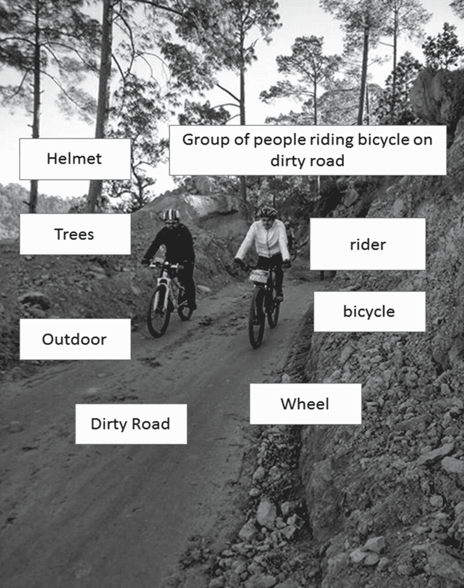

© Nishith Pathak 和 Anurag Bhandari 2018Nishith Pathak 和 Anurag Bhandari.NET 的 IoT、AI 和区块链`doi.org/10.1007/978-1-4842-3709-0_4`

# 4. 理解认知 API

Nishith Pathak^(1 ) 和 Anurag Bhandari²(1) 印度，Pauri Garhwal 市，Kotdwara(2) 印度，旁遮普邦，Jalandhar 现在，您已经熟悉物联网，并且对使用物联网创建智能应用程序有了很好的理解。 第一章开始介绍您进入人工智能世界的旅程。 正如前几章讨论的那样，我们目前处于第一次人工智能革命中，这标志着“AI 即服务”的开始。 当你听到“人工智能”这个词时，你会想到什么？ 可怕的机器人？ 复杂研究的话题？ 机器未来可以在眨眼间完成复杂任务？ 通常，开发人员认为 AI 实施是一项困难的任务，涉及编写复杂的算法和编写数百行代码。 考虑以下对话：

> 用户：我今天的日程安排如何？软件：你今天上午 9 点要和领导开会。用户：谢谢，那我 8:30 就出发好了。软件：市区交通非常拥堵；8 点就出发好吗？用户：那我应该乘地铁吗？软件：绝对，如果你搭乘 8:20 的地铁，你应该在 8:45 到达办公室。用户：谢谢。请将我的日程标记为已预订，因为我要和一个潜在客户喝茶。软件：根据你的电子邮件互动，我已经暂时做好了。不要忘记今天早点来。 你最喜欢的球队，巴塞罗那，今天与皇家马德里队决赛。”用户：哦！我不能错过！请在下午 4 点提醒我。软件：好的，会的。

想象一下创建这样的软件应用程序，它们可以进行类似人类的对话，不仅能理解人类的行话或其言外之意的变化，而且还可以适当地倾听和与人类交谈。让这更有趣的是，想象一下创建能深入理解并解释网络上或用户机器上的内容，能通过语音或文本智能地对直接用户交互做出反应，或者能为每个个体用户量身定制智能产品或服务建议的应用程序。这些能力难道不会让你的软件变得聪明和智能吗？在本章的最后，你将对以下内容有所了解：

+   认知系统和类型

+   为什么选择微软认知 API

+   各种微软认知 API 组及其 API

## 什么是认知系统？

大多数人可能来自传统编程系统，所以在我们真正深入了解微软认知 API 之前，了解认知系统是什么非常重要。图 4-1 展示了认知 API 的一般分类。微软发布的几乎所有 API 都可以归类为其中之一。图 4-1 认知 API 的各种分类认知是代表信息并利用该表示进行推理的过程。观察使机器能够模仿人类行为。例如，以人类的方式与语音、文本或视觉进行交互。积极学习是随时间自动改进的过程。积极学习的一个典型例子是微软语言理解智能服务 (LUIS)，我们稍后在本章中会介绍一下。物理动作需要使用这三种方式和设备的组合以智能地进行交互。如果你观察认知系统与传统计算程序，你会发现认知系统在三个方面有所不同：

+   认知系统像人类一样理解。我们已经看到了人工智能引导的机器战胜了一些游戏冠军的时代。由卡内基梅隆大学团队设计的 Libratus 已经击败了几位扑克冠军。您可能知道，扑克要求信息在某个时间点之前被隐藏，而且很难创建一个处理这种情况的模型。

+   认知系统具有理解思想和概念、形成主张、消除歧义、推理和生成见解的独特能力，基于这些能力，它们可以进行推理和行动。例如，您可以创建一个认知网络应用程序，通过观察人们的图像来识别人类，并用俚语与他们进行交流。

+   与传统的计算程序不同，认知系统始终根据新数据进行学习。事实上，每个认知系统都会根据学习到的新信息逐渐变得更聪明。随着时间的推移，熟练度从新手逐渐提升到专家级别。

### 为什么选择微软认知 API？

现在我们了解了认知系统的本质，你一定已经意识到创建认知系统并不容易。它涉及大量的研究、理解内部机制、理解模糊算法等等。作为一名.NET 开发者，你可能会想知道，我该如何让我的软件像微软的 Cortana、苹果的 Siri 或谷歌的助手一样聪明？你可能不知道从哪里开始。多年来，我们与顶级 IT 公司的软件开发人员和架构师花了大量时间交流。我们发现，所有这些人普遍认为，将个别的 AI 元素，如自然语言理解、语音识别、机器学习等等，添加到他们的软件中需要对神经网络、模糊逻辑和令人费解的计算机科学理论有深入的理解。微软、谷歌、IBM 等各个公司意识到了这一点，并且一致认为，AI 不仅仅是关于发明新的算法和研究。好消息是，这种认识已经不再适用。要开始，这些公司中的每一家都已经将它们多年的研究成果以 SDK 的形式展示出来，主要是以 RESTful API 的形式，帮助开发者用非常少的代码创建更智能的应用程序。总的来说，这些 API 被称为认知 API。

#### 由专家构建，社区支持

微软认知 API 是微软多年研究的成果。这包括来自各个领域和团队的专家，如微软研究、Azure 机器学习和必应等。微软确实做了一项伟大的工作，将深度神经网络的所有细微差别抽象化，这些是复杂的算法，提供易于使用的 REST API。这意味着每当你使用微软认知 API 时，你都会得到以 RESTful 方式公开的最佳功能。所有的 API 都经过了彻底的测试。我们自从认知 API 诞生以来就一直在使用，感觉到每一个 API，就像所有认知 API 一样，随着时间的推移而改进。更吸引人的是，整个功能都有类文档支持，并且在 GitHub、用户反馈、MSDN 等地方有很好的社区支持，还有示例代码。事实上，整个微软认知文档都托管在 GitHub 上，个人开发者可以贡献力量，使其更有效。

#### 使用便捷

微软认知 API 使用简单。你只需获取相应 API 的订阅密钥，然后通过传递这个订阅密钥来使用 API。功能只需几行代码即可完成。我们稍后将详细介绍订阅密钥。现在，只需要明白在开始使用认知服务之前，你需要为你想在应用程序中使用的每个服务获取一个订阅密钥。几乎所有认知 API 都有免费和付费层。你可以使用 Microsoft 账户使用免费 API 密钥。

#### 语言和平台无关

微软已经开始以更好、更无缝的方式支持开源。以前，微软的功能受到使用微软特定工具和语言（如 VB.NET、C#等）的限制。我们讨论了微软认知 API 在 RESTful 中的可用性。使微软认知 API 更具吸引力的是它的灵活性。现在你可以在任何语言或平台上集成和使用微软认知 API。这意味着你是 Windows、Android 还是 Mac 开发人员，或者你偏爱的语言范围从 Python 到 C# 再到 Node.js，你都可以只用几行代码就使用微软认知 API。令人兴奋！注意：微软的认知领域一直在稳步扩张。去年开始只有四个认知 API，而在写作本书时已经增至 29 个。微软有一套产品组合。他们还有一套基于云的能力套件。在使用这些服务时，人们可能会想知道为什么微软创建了这些服务而不是创建特定的解决方案和产品。好吧，这种方法是强调平台而不是创建单独的系统。这些平台和服务最终将被其他公司和开发人员用来解决特定于领域的问题。平台的目的是扩大规模并在认知领域创造更多的提供，并给最终用户提供沉浸式的消费体验。如果在接下来的一年左右，认知 API 列表增加到 50 个以上，也不要感到惊讶。

## Microsoft 的认知服务

认知服务是微软提供的与人工智能相关的一组软件即服务（SaaS）商业产品。认知服务是微软多年认知计算和人工智能研究的成果，其中许多服务被微软自己的热门产品所使用，比如必应（搜索，地图），翻译器，机器人框架等。微软将这些服务作为易于使用的 REST API 提供，可直接在 Web 或移动应用程序中使用。截至本书的撰写，共有 29 个可用的认知服务，大致分为五个类别，如图 4-2 所示。

### 视觉

计算机无法单独处理或理解图像。结合智能 AI 算法的图像处理技术使得机器能够看到图像，并识别和辨认对象和人物。这些服务处理视觉信息，主要以图像和视频的形式出现。一个场景或被拍摄的照片可能包含多个对象。图像处理是机器学习几十年来的核心研究领域之一。在过去几十年中，已经提出了各种算法和新的方法来处理图像，并返回有关图像的有价值信息。这肯定可以帮助解决一些挑战。例如，想象一下使用这个解决方案向盲人描述场景，或者拍摄一个物体的照片，然后用它进行验证、识别安全性，甚至获取更多关于它的信息。机器在捕捉的场景中检测到对象的能力称为对象检测，如图 4-3 所示。对象检测之后是识别。系统识别并正确标记对象的能力称为对象识别。图 4-3 一群骑行者在土路上图像识别系统的准确性，就像人工智能中的一切一样，严重依赖于训练数据。使用机器学习技术，系统通过数百张图像进行训练，以识别特定类别的对象。Microsoft 计算机视觉 API 结合了微软在图像处理领域的多年研究成果，结合了最新的算法和 API 来分析图像并提供信息。广义上讲，它有七项服务，如图 4-4 所示。图 4-4Microsoft 计算机视觉 API 的子类

#### 人脸 API

面部 API 有助于检测人类面部并比较相似的面部（面部检测）。使用相同的技术，可以在照片中检测面部及其相关的 27 个属性（年龄、性别、微笑等）。如果系统预先训练了特定人物的面部，它可以在照片中匹配和识别该人物的面部，如图 4-5 所示。面部识别可用作安全认证机制，或者使用闭路电视摄像头在公共场所检测危险犯罪分子。它还有助于根据视觉相似性将人员组织成组（面部分组），并在图像中识别之前标记过的人员（面部验证）。优步，最大的出租车服务公司之一，正在使用面部验证来验证优步司机。我们在第五章和第六章更深入地研究面部识别。图 4-5 在图像中被识别的面孔

##### 情感 API

面部 API 有助于检测和识别面部。情感 API 将其提升到下一个水平，通过分析面部来检测一系列八种情感——愤怒、快乐、悲伤、恐惧、惊讶、蔑视、厌恶、中立等。情感 API 返回这些情感，以每张面部的置信度降序排列。情感 API 还有助于识别视频中的情感。它有助于获得即时反馈。想象一个情感 API 可以应用于零售客户以即时评估其反馈的用例。

##### 计算机视觉 API

计算机视觉 API 执行许多任务。它从图像中提取关于其内容的丰富信息：图像的智能文本描述，检测到的面部（带有年龄和性别），图像中的主要颜色以及图像是否具有成人内容。它还提供了光学字符识别（OCR）功能。OCR 是一种捕捉图像中的文本并将其转换为最终可用于处理的流的方法。被捕捉的图像可以是手写笔记、白板材料，甚至是各种物体。计算机视觉不仅完成所有这些工作，还通过其名人识别模型识别脸部，该模型包含来自各个领域的大约 20 万名名人，包括娱乐、体育、政治等。它还有助于分析视频，提供有关视频的信息，并为被捕捉的图像生成缩略图。总而言之，计算机视觉是所有视觉 API 的母 API。除非您需要更详细的信息（例如某人的具体情绪），否则在大多数情况下您都会调用此 API 获取信息。章节 5 和 6 更详细地介绍了计算机视觉。

##### 内容适度

如讨论所述，数据是任何组织中的新货币。数据和内容来自各种来源。无论是社交、消息传递，甚至是对等平台，内容都呈指数增长。始终需要对内容进行适度管理，以免影响平台、人们、伦理和核心价值观，当然还有业务。内容管理有助于对内容进行管理。无论内容来源是文本、图片还是视频，内容适度 API 通过三种方法（手动、自动和混合）对内容进行适度管理，以适应各种情景。

##### 视频索引器 API

视频索引器 API 允许您使用智能视频处理进行人脸检测、运动检测（在闭路电视安全系统中很有用）、生成缩略图以及进行几乎实时的视频分析（每帧的文字描述）。它几乎实时开始获取视频的见解。这有助于使您的视频更具吸引力，帮助更多内容被发现。

##### 自定义视觉服务

到目前为止，我们已经看到了我们的微软认知 API 在场景、人脸和情绪等方面进行图像识别。有一些情况需要您需要一个定制的图像分类器，特别适用于某个领域。考虑一个银行场景，您需要一个分类器来理解各种货币及其面额。这就是微软自定义视觉服务发挥作用的地方。您必须用特定于领域的图像训练系统，然后您可以在任何平台上使用其 REST API。为了使用自定义视觉服务，您需要访问 [`www.customvision.ai/`](https://www.customvision.ai/) 。然后上传特定于领域的图像，通过标记对它们进行训练，然后公开 REST API。您可以评估自定义视觉服务。经过适当的训练，它就像魔术一样运行。与 LUIS 一样，自定义视觉服务也是基于主动机器学习的，这意味着您的自定义图像分类器会随着时间的推移而不断改进。有关自定义视觉的更多信息可以在后面的章节中找到。

##### 视频索引器

视频索引器 API 从视频中提取见解，例如面部识别（人名）、语音情感分析（积极、消极、中性）和关键字。

### 演讲

在过去的十年里，与各种设备的交互方式发生了变革。时不时地，新的交互技术被引入。在这些技术中，语音一直是一种受欢迎的、自然的、不可避免的选择。现在许多设备都内置了语音功能。想想一些个人数字助理，比如 Cortana、Siri 或 Alexa，它们改变了我们与移动应用程序交互的方式。当你向 Siri 或 Google 提问时（通过语音搜索），它使用语音识别将你的语音转换为文本。然后使用转换后的文本进行搜索。现代语音识别技术可以根据上下文处理口音变化和相似的发音单词和短语。微软已经研究语音技术超过二十年了。事实上，Speech API 的第一个版本是 Windows 95 的一部分。自那以后，微软的研究领域之一就是对语音的极大关注，并发布了各种版本的语音识别，各种操作系统都具有语音转文本和文本转语音的特性。随着认知 API 上 Speech API 的出现，微软提供了可在云中使用的最佳语音功能，并可以通过易于使用的 REST API 进行使用。Speech API 提供了增强应用程序的最简单方式，使用语音驱动的场景。Speech API 通过抽象出所有语音算法的复杂性，提供了易于使用的功能。广义上说，Speech API 的功能可以分为四个主要领域，如图 4-6 所示。图 4-6 语音 API 的子分类

#### Bing 语音 API

Bing 语音 API 将语音转换为文本，可选地，理解其意图，并将文本转换回语音。它有两个主要组件——语音识别和语音合成。语音识别，也称为语音转文本（STT），允许您使用识别引擎处理用户在应用程序中的口头话语，并将其转换为文本。这种文本转录可用于各种用途，包括无需使用手的应用程序。这些口头话语可以直接来自麦克风、扬声器，甚至来自音频文件。所有这些都可以在不输入一个字符的情况下完成。与 STT 相反，语音合成又称文本转语音（TTS），允许您通过语音合成引擎将单词或短语回馈给用户。每台 Windows 机器都有一个内置的语音合成器，可以将文本转换为语音。对于所有那些有困难或不能阅读屏幕上打印文字的人来说，这个内置合成器特别有益。这个内置合成器适用于简单的情景。对于企业情景，在这些情景中，性能、准确性和速度很重要，基于语音的模型应满足以下先决条件——易于使用，随着时间的推移而改进，持续升级，处理复杂的计算，并在所有平台上都可用。Bing 文本转语音 API 在易于消费的 REST API 中提供了这些功能。Bing 文本转语音 API 支持语音合成标记语言（SSML）。SSML 是 W3C 的一个规范，提供了一种创建基于语音的标记文本的统一方式。请查看 [`www.w3.org/TR/speech-synthesis`](https://www.w3.org/TR/speech-synthesis) 上的官方规范以获取完整的 SSML 语法。

##### 自定义语音服务

之前被称为 CRIS 的**自定义语音服务（Custom Speech Service）**允许您通过将其定制为应用程序的词汇表和用户的发言风格来构建语音识别器的自定义语言模型。要理解自定义语音服务的必要性，了解识别引擎的工作原理非常重要。在高层次上，它接受来自用户麦克风的音频输入或语音，并通过尝试将音频信号与不同数据库中的模式进行匹配来对其进行处理。然后，这些信号模式将与已知单词相关联，如果引擎在数据库中找到匹配的模式，则将关联的单词返回为文本。图 4-7 显示了整个语音识别流程。图 4-7 语音识别的整个流程如您所见图 4-7，音频信号被转换为称为音素的个别声音。例如，单词 Surabhi 由“Su”“ra”“bhi”组成。然后，这些单词被映射到语言模型，该模型是词典和语法的组合。语言和单词的目录称为词典，将这些单词组合起来的规则系统称为语法。利用语法的这一过程很重要，因为有些单词和短语听起来相同但含义不同（考虑“stuffy nose”和“stuff he knows”）。训练语音识别是成功的关键。微软语音转文本引擎也通过大量的语音训练得到了很好的训练，使其成为通用场景中最佳的之一。有时，您需要在封闭域或特定环境中使用语音识别系统。例如，在需要处理背景噪音、特定行话或不常见的多种口音的环境中需要语音识别引擎。这样的场景要求在声学和语言模型的两方面进行定制，使其适用于特定环境。自定义语音服务使您能够通过创建定制的语言模型和适用于您的域、环境和口音的声学模型来定制您的语音识别系统。一旦创建了您的自定义声学和语言模型，它还允许您创建适合您特定需求的自定义语音到文本端点。

##### 说话者识别

术语语音识别或说话者识别指的是识别说话者，而不是他们在说什么。识别说话者可以简化对已经训练过特定人声音的系统中语音的翻译任务。声音具有可以用来帮助识别个人的独特特征。事实上，每个人的声音都有一个独特的声学特征混合，这使得它独一无二。说话者识别 API 有助于在录音或现场语音音频中识别说话者。为了识别说话者，语音识别需要在验证或识别之前进行注册。说话者识别系统已经适应了高斯混合模型 (GMM)。微软的说话者识别使用了基于 i-Vector 说话者识别系统的最新和先进的因子分析。说话者识别可以可靠地用作安全场景的附加认证机制。注意语音识别和说话者识别之间存在明显的区别。语音识别是语音的“什么”部分，而说话者识别是语音的“谁”部分。简单来说，语音识别识别了说了什么。说话者识别识别了谁在说话。说话者识别有两个主要组成部分：

+   说话者验证

+   说话者身份识别

说话者验证，也称为说话者认证，是用一个模式或记录在库中验证声称的过程。在说话者验证中，输入的声音和短语与注册的声音和短语进行匹配，以确定它们是同一个人还是不同的个体。你可以假设说话者验证是一个一对一的映射关系。另一方面，说话者识别是一种与库中所有可能的记录进行验证的映射，主要用于从一系列个体中识别未知个体。说话者识别是一对多的映射关系。在使用说话者识别 API 进行验证或识别之前，它会经历一个称为注册的过程。

##### 翻译语音 API

Microsoft 翻译语音 API 可以实时将一种语言的语音翻译成另一种语言。这种翻译的关键在于实时性。想象一种情景，一个说中文的人想要与一个说西班牙语的人交流。他们两个都不知道共同的语言。更糟糕且更真实的情况是，假设他们在空间上相隔甚远。他们之间要进行沟通可能会非常困难，甚至不可能。Microsoft 翻译语音 API 可以帮助实时解决跨语言的障碍。截至本书撰写时，它支持 60 种语言。它具有用于处理各种独特情景的部分和最终转录的各种功能。翻译语音 API 内部使用 Microsoft 翻译 API，该 API 也被应用在各种微软产品中，包括 Skype、必应和翻译应用等。

### 语言

人类相互交流，现在与机器交流有三种方式之一——口头交流，使用书面语言，以及使用手势。这三种方式中的共同点是“语言”。语言是一组用于沟通的规则，对每个个体都是相同的。尽管同一种语言可以用于书面和口头交流，但通常会有微妙而明显的变化，书面语言更加正式。在人工智能研究中投入最多的精力是让机器能够像人类一样自然地理解人类。由于对于机器来说理解书面文本比语音更容易，语言类别是最重要的认知 API 之一。这些服务涉及自然语言理解、翻译、分析等，如图 4-8 所示。让我们逐一查看这些领域。图 4-8 语言 API 的子类

#### Bing 拼写检查 API

拼写错误是常见的用户行为。几乎每一次用户互动，无论是搜索、填写表格，甚至是现在谈论的对话场景，都需要处理拼写错误。举个例子，一个基于电影的网站，用户输入了这些电影名称：

+   *Momento*

+   *幸福追击者*

+   **踢屁股**

基于语法的文本编辑器的搜索结果会导致“未找到电影”错误。这些都是拼写问题的典型例子。“Momento”是“Memento”的常见拼写错误。在第二种情况中，虽然拼写正确，但实际电影标题是“The Pursuit of Happyness”。在最后一种情况中，电影名称被连字符化为“Kick-Ass”，而不是分开的单词。系统应该具有处理此类拼写错误的能力。否则，您可能会失去一些忠实的客户。一些流行的搜索引擎如必应和谷歌通过轻松处理拼写检查来处理此问题。必应拼写检查是一种在线 API，不仅帮助纠正拼写错误，还考虑了单词断裂、俚语、人物、地点甚至品牌名称。对于每个检测到的错误，它还提供按信心降序排列的建议。必应是通过多年的研究、数据和当然使用机器学习模型来优化的。事实上，包括 Bing.com 在内的大多数应用程序都使用必应拼写检查 API 来解决拼写错误。

##### 语言理解智能服务（LUIS）

LUIS 正如其名字所示，帮助理解语言中的“什么”问题。这有助于以适当的响应回复用户。LUIS 是微软的自然语言理解（NLU）。NLU 是一个深度研究领域。NLU 通过人类语言帮助机器理解人类。考虑以下问候场景：

+   “嗨”

+   “你好”

+   “你好”

+   “嘿”

所有这些词都是向用户打招呼的方式。仅在英语中就有一百多种问候人的方式。除非你意识到问题的真正意图，否则必须正确回答用户。是吧？通过将句子分解为实体和意图，LUIS 帮助应用程序理解句子的含义。简单来说，你可以将意图与动词相对应，将实体与名词相对应。一旦你的应用程序对句子的上下文有了一定的理解，你的应用程序就可以适当地回应用户。考虑另一种情况，如图 4-9 所示，其中一句话被分解以便检测意图和实体。图 4-9 NLU 分析每个句子的两个内容——意图和实体。如图 4-9 所示，NLU 分析每个句子的两个内容——意图（意思或预期行为）和实体。在例子中，最近的医院信息是检测到的意图，而心脏是实体。用户可以用一百种不同的方式问同一个问题。LUIS 总能从用户的句子中提取正确的意图和实体。软件然后可以使用这些提取的信息来查询在线 API 并向用户显示他们请求的信息。LUIS 提供预构建的实体。如果你想创建一个新的实体，你可以轻松地创建一个简单的、复合的，甚至是层次化的实体。要创建 LUIS 应用程序，你需要访问[`luis.ai`](https://luis.ai)，创建一个应用程序，添加意图和实体，对其进行训练，然后发布应用程序以获得 RESTful API，然后可以由各种应用程序使用。像任何基于机器学习的应用程序一样，训练是 LUIS 的关键。事实上，LUIS 是基于主动机器学习的，它有能力继续进行训练。我们将在接下来的章节中更多地讨论 LUIS。

##### 语言分析

语言分析 API 有助于解析文本进行精细的语言分析，如句子分隔和分词（将文本分解为句子和词元）以及词性标注。这最终有助于理解文本的含义和上下文。语言分析已被用作许多与自然语言处理相关的处理的初步步骤，包括自然语言理解（NLU）、文本到语音（TTS）和机器翻译等。

##### 文本分析

机器学习使用历史数据来识别模式。数据量越大，定义模式就越容易。物联网和新设备的兴起推动了这一进化。过去两年产生了 90% 的所有数据。其中 80% 的数据是非结构化的。文本分析帮助解决了一些非结构化数据的问题，如检测情感（积极或消极）、关键短语、主题和语言。考虑在线零售机器人的情况。作为一个全球在线零售机器人，它可以期待来自各种地理位置的用户，并在许多语言中查询。语言检测是由微软文本分析 API 解决的经典问题之一。文本分析 API 可用于其他领域，如情感分析以评估情感、自动生成会议记录、呼叫记录分析等。

##### 翻译文本 API

Microsoft Translator API 可检测给定文本的语言，并将其从一种语言翻译为另一种语言。在内部，它使用微软内部的基于机器学习的翻译引擎，经过了数以万计的训练句子。它理解模式，然后翻译文本，并确定语言的规则。微软一直在其所有需要多语言支持的应用程序中内部使用 Translator Text API。您还可以基于现有系统创建自己的定制翻译系统，适用于特定的领域和环境。

##### Web 语言模型 API

语言模型的成功完全依赖于用于训练的数据。网络中包含着大量的文本数据，其中包含数百万张图片。虽然这些数据存在一些异常，如语法错误、俚语、粗话、缺乏标点等，但它确实有助于理解模式、单词预测，甚至是在没有空格的单词中断开以更好地理解它。网络语言模型或 WebLM 就是使用这种方法创建语言模型的过程。WebLM 提供了一系列其他语言 API 未涵盖的自然语言处理任务，包括单词分割（在缺少空格的单词字符串中插入空格）、联合概率（计算特定单词序列一起出现的频率）、条件概率（计算特定单词后跟随的频率）和下一个单词的完成（获取最有可能跟随的单词列表）。

### 知识

这些服务处理搜索大型知识库以识别实体，提供搜索建议，并提供产品推荐。图 4-10 显示了知识 API 下可用的子 API。让我们简要地看一下每个子 API。图 4-10 知识服务的子类别

#### 学术知识 API

正如其名称所示，学术知识 API 允许您从微软学术图表中检索信息，这是一个专有的科学/学术研究论文及其实体的知识库。使用此 API，您可以轻松地按作者、机构、事件等查找论文。还可以查找类似的论文，检查抄袭情况，并检索引用统计信息。它允许您解释和评估知识实体结果。它还提供了计算学术实体分布直方图的选项，从而通过理解搜索查询的意图和上下文，为您提供丰富的语义体验。

##### QnA Maker

QnA Maker 从提供的数据中创建 FAQ 式的问题和答案。数据可以包括任何文件或链接。QnA Maker 提供了网站和 API 的组合。使用网站可以使用现有的 FAQ 网站、PDF、DOC 或文本文件创建知识库。QnA Maker 将自动从您的文档中提取问题和答案，并根据您的数据训练自己以回答自然语言用户查询。您可以将其视为 LUIS 的自动化版本。您不必训练系统，但可以选择进行定制的重新训练。QnA Maker 的 API 是接受用户查询并发送知识库答案的端点。可选地，QnA Maker 可以与 Microsoft 的 Bot Framework 结合，创建适用于 Facebook、Skype、Slack 等平台的开箱即用的机器人。

##### 实体链接智能服务

单词根据句子的上下文有不同的含义。考虑图 4-11 中的以下句子。图 4-11 在三种不同上下文中使用“crane”这个词在这些句子中，“crane”被用来表示鸟类、大型起重机，甚至是身体的运动。需要考虑句子的上下文来确定所使用词语的真实含义。实体链接智能服务允许您根据文本的上下文确定关键词（命名实体、事件、位置等）。

##### 知识探索服务

KES，即知识探索服务，为您的数据增加了对自然语言查询、自动完成搜索建议等支持。您可以通过快速有效的自动建议使搜索更加交互式。

##### 推荐 API

推荐系统在数字世界中随处可见。一个更强大的推荐系统意味着更好的用户吸引力，当然也意味着更大的投资回报率。推荐系统的力量已经极大地推动了许多公司的发展。考虑几个例子：

+   YouTube 使用推荐系统来推荐视频

+   Netflix 使用推荐系统来推荐有趣的视频/故事

+   亚马逊不仅仅是使用推荐来显示产品结果，还为最终用户推荐要销售的产品

+   谷歌不仅使用推荐系统来排名网页链接，还为您推荐网页和新闻链接

+   像《纽约时报》这样的新闻网站提供您应该观看的新闻推荐

许多成功的公司继续投资、研究和重新创新他们的推荐系统，以改善它们并为最终用户提供更个性化的用户体验。创建一个推荐系统并不容易。它需要对数据有深刻的专业知识，拥有出色的研究和分析团队，当然还需要大量的资金。市场上有各种类型的推荐系统。微软推荐 API 帮助您处理基于交易的推荐。这对零售商店特别有用——无论是线上还是线下——帮助他们通过向客户提供推荐来增加销售额，例如经常一起购买的物品，根据客户的交易历史为用户提供个性化的物品推荐等。与 QnA Maker 一样，您可以使用现有数据在 Recommendations UI 网站上创建产品目录和使用数据。从高层次上讲，它支持三种类型的推荐：

+   经常一起购买（FBT）

+   物品到物品的推荐

+   基于过去用户活动的推荐

FBT 推荐 API 推荐那些经常与彼此一起购买或使用的物品。例如，当您购买新的 iPhone 应用时，您可能会想要购买 iPhone 保护玻璃，如图 4-12 所示。这样的推荐被称为 FBT。另一方面，物品到物品的推荐是基于协同过滤的推荐。您经常在网站上看到“购买此产品的用户还购买了”这样的部分，这是来自物品到物品的推荐。基于用户过去活动的推荐仅基于用户的历史交易提供推荐。这种类型的推荐也被称为“用户到物品的推荐”。图 4-12 购买 iPhone 时的 FBT 使用案例

##### 自定义决策服务

自定义决策服务通过提供决策 API 来帮助您创建智能系统，该 API 使用基于反馈的强化学习来随着时间的推移不断改进。强化学习是一种机器没有明确提供训练数据的学习方式。它必须与环境交互以达到目标。由于缺乏训练数据，它必须从零开始自学，并依赖于试错技术来做出决策和发现最佳路径。对于机器采取的每个动作，都有一个结果，对于每个结果，它都会获得一个数值奖励。因此，如果一个动作产生了可取的结果，它将获得“好”的评价。如果结果是灾难性的，则会获得“非常、非常糟糕”的评价。机器努力使其总数值奖励最大化，即通过不重复犯错来获得尽可能多的“好”和“非常好”的评价。当机器必须处理非常动态的环境，无法创建和提供训练数据时，这种机器学习技术尤其有用。例如，驾驶汽车、飞行无人机（见图 4-13），玩视频游戏等。图 4-13 不需要人类操作的飞行无人机使用强化学习从动态和具有挑战性的环境中学习，以随时间改善其技能。您可以在池模式或应用程序特定模式下使用自定义决策服务。池模式为所有应用程序使用单个模型，适用于低流量应用程序。具有高流量的应用程序需要特定于应用程序的模式。

### 搜索

搜索已经变得随处可用，从桌面、移动搜索、网络搜索，甚至我们日常生活中的例行事项。在最新的报告中，预计到 2020 年底将有 50 亿台连接设备可用，并且每台设备都需要进行连接搜索。微软在将必应引入平台方面也取得了显著进展。微软搜索，基于必应，为谷歌搜索提供了另一种选择。必应搜索 API 的使命之一是抵制谷歌的垄断，并尝试提供一种搜索的替代选择。目前，必应是仅次于谷歌的第二大强大搜索引擎。必应搜索 API 允许您在几行代码中将谷歌或微软必应的功能实现到您的企业应用程序中。微软最近修改了他们的使命为“激发全球每个人和每个组织的潜能”。这个使命更加以人为中心。这个使命有很多附加条件，以在任何地方提供很多服务。将搜索必应 API 带给普通人，并通过 RESTful API 的形式使一些服务可用是实现这个新的微软使命的途径之一。微软必应搜索 API 的驱动力在于三个 P，即普遍、预测性和主动性。这使得必应搜索 API 可以随时随地、在任何设备上主动地仅通过几行代码就可用。必应搜索 API 允许您通过调用不同的 API 来利用必应的力量，如图 4-14 所示。让我们来看看每个 API。图 4-14 搜索的子类别

#### 必应自动建议 API

顾名思义，Bing 智能提示 API 在用户在搜索框中输入时，直接从 Bing 搜索中提供智能的输入提示和搜索建议。当用户在搜索文本框中输入时，您的应用程序调用 API 来显示用户选择的选项列表。根据输入的每个字符，Bing 智能提示 API 显示出不同的相关搜索结果。内部实现是通过将部分搜索查询传递给 Bing 来实现的。该结果是根据其他用户过去的搜索内容进行的上下文搜索的组合。所有的 Bing API，包括 Bing 智能提示，在使用 API 时提供了使用查询参数和头部来自定义搜索结果的功能。

##### Bing 图像搜索 API

图像比文字内容更具表现力。Bing 图像搜索 API 为开发人员提供了在其应用程序中获得类似于 Bing.com/images 的体验的机会。这里需要注意的一点是，当结果仅为图像时，应仅使用 Bing 图像搜索 API。它允许您根据关键字、颜色、国家、大小、许可证等过滤器返回图像。作为额外的奖励，Bing 图像搜索 API 将查询分成各种段落，并提供缩小搜索选项的建议。例如，如果您搜索关键字“Microsoft 搜索”，Bing 聪明地将其分成各种选项，如“Microsoft 桌面搜索”、“Microsoft Windows 搜索”和“Microsoft 搜索 4.0”。您可以选择一个查询扩展并获取搜索结果。总的来说，Bing 搜索 API 提供了一系列广泛的属性和查询参数，以获取定制的图像搜索结果。

##### Bing 新闻搜索 API

Bing 新闻搜索 API 充当新闻聚合器，从世界各地的成千上万家报纸和新闻文章中聚合、整合和分类新闻。你可以根据关键词、新鲜度、国家等过滤器缩小新闻结果。这一功能可以通过 Bing.com/news 访问。在高层次上，Bing 新闻搜索 API 允许你根据特定类别获取头条新闻文章，根据用户的搜索返回新闻文章，或者返回正在社交媒体中趋势的新闻主题。

##### Bing 视频搜索 API

Bing 视频搜索 API 允许你根据各种过滤器获取视频，比如关键词、分辨率、视频长度、国家等，提供有关特定视频的更多见解，或者显示在社交媒体中正在趋势的视频。Bing 新闻视频 API 提供沉浸式的视频搜索功能，并且只需几个 API 调用就可以轻松创建基于视频的门户体验。Bing 视频搜索 API 有免费和付费的等级，就像 Bing 图像搜索一样。

##### Bing 网络搜索 API

到现在为止，你已经对 Bing API 服务有了一个相当清晰的了解。每个 API 都提供特定的信息。例如，如果你只需要图像结果，你可以使用 Bing 图像 API。同样，如果你需要新闻结果，你将使用新闻 API。有很多情景需要多种结果的组合，比如在结果集中同时需要图像和视频。这类似于 Bing.com/search，其中你会得到包含图像、视频等多种结果的搜索结果。Bing 网络搜索 API 提供了解决这些情景的方案。

##### Bing 自定义搜索

Bing 自定义搜索允许基于自定义意图和主题进行搜索。因此，与其搜索整个网络，Bing 将基于主题搜索网站。它还可用于在单个或指定的一组网站上实施特定于站点的搜索。在内部，自定义搜索首先识别主题网站，应用 Bing 排名并返回结果。您还可以通过应用增强、固定、降低或甚至阻止该站点来调整结果。为了自定义视图并使用自定义搜索，请访问[`www.customsearch.ai/`](https://www.customsearch.ai/)。一旦您创建了实例，根据便利性进行了修改，并对结果感到满意，请使用自定义搜索 API 在任何平台上消耗它。

##### Bing Entity Search API

Bing 实体搜索 API 允许您获取包含实体（人和物体）和地点（电影院、酒店、本地企业等）的搜索结果。这为最终用户提供了极好的沉浸式体验，通过提供被搜索实体的主要详细信息。例如，如果您搜索一个著名人物，您一定会得到维基链接和该人物的简要描述。所有认知服务 API 都提供免费和按使用量付费的定价层。您可以根据应用程序的使用量选择定价层。虽然我们很想详细介绍每一个服务，但由于本书的范围限制，我们将介绍足够的语音、语言和搜索类别服务，以帮助您迅速构建智能应用程序。您可以通过访问[www.microsoft.com/cognitive-services/en-us/apis](http://www.microsoft.com/cognitive-services/en-us/apis)了解更多有关这些服务（以及可能最近添加的更多服务）的信息。

### 总结

本章作为认知服务的介绍。如你所了解，这些 API 对于解决一些以前无法解决的复杂问题是一个巨大的推动。这种 API 驱动模型的另一个原因是，它抽象了 API 背后运行的数千个处理器和虚拟机。随着物联网和传感器等技术的兴起，自动化和数据分析的机会是不可思议的。你还了解了认知服务以及它们与传统编程模型的区别。然后，本章对微软在形式上的各种商业人工智能提供了快速概述，它们是通过认知服务 REST API 提供的。在下一章中，你将学习安装构建人工智能软件的所有先决条件，并使用 Visual Studio 构建你的第一个认知应用程序。
