© Nishith Pathak 和 Anurag Bhandari 2018 Nishith Pathak 和 Anurag Bhandari 为 .NET 提供的物联网、人工智能和区块链 `doi.org/10.1007/978-1-4842-3709-0_5`

# 5. 使用微软认知 API

Nishith Pathak^(1 ) 和 Anurag Bhandari²(1) 印度 Pauri Garhwal 地区 Kotdwara (2) 印度旁遮普邦 Jalandhar 到目前为止，您已经对微软认知技术有了相当的了解，了解了它的各种服务提供以及对其概念的一瞥。微软在将人工智能和机器学习的研究抽象化方面做得非常出色，通过提供基于 REST 的易于消费的服务，在其 Azure 云解决方案上隐藏了所有复杂的处理细节。事实上，整个微软认知服务套件都公开为 REST API。由于 REST API 具有 API 终端点，您实际上不需要任何特定的平台或编程语言来使用它。REST API 的另一个优点是它可以接受 JSON 或 XML 格式的输入并以相同的格式输出。这使您可以直接在所有主要编程语言中使用 REST API，例如 C#、Java、PHP、Ruby、Python、JavaScript 等。由于本书针对 .NET 开发人员，我们将限制自己在整本书中使用 C#。但是，实际上，使用微软认知服务的基础知识对于任何语言都是相同的。与任何企业服务一样，使用微软认知服务的每个调用在使用之前都需要进行身份验证和授权。这是通过使用订阅密钥来实现的。一旦您获得了订阅密钥（我们将在稍后讨论如何做到这一点），它将作为查询字符串参数或标头传递，同时调用认知服务的 REST 终端点。在本章的最后，您将学到

+   使用认知服务的先决条件

+   获取认知服务的订阅密钥

+   调用微软认知视觉 API

+   使用 Visual Studio 消耗认知视觉 API

+   计算机视觉 API 的有趣用途

## 免费层和按使用付费模式

当人们了解到 Microsoft 认知 API 时，他们首先想到的是以下问题：

+   调用 Microsoft 认知服务的费用是多少？

+   有一些个人可用的免费服务吗？

+   如果我提供我的信用卡详细信息会发生什么？

+   我可以对 API 的使用设置限制吗？

+   认知 API 在企业场景中可用的 SLA 是什么？

在我们深入更多细节之前，让我们回答这些问题。微软认知服务提供了两种类型的模型来消耗认知服务，即免费层和付费层（部分服务仅有付费层）。免费层，顾名思义，为用户提供了在不支付任何费用给微软的情况下消耗微软认知服务的机会。免费层主要适用于最终用户尝试个人或低容量应用。如果您的需求满足其中任何一个先决条件，我们当然鼓励您使用免费层。正如您所预料的，每个服务的免费层也有一些限制。由于不支持微软提供的服务的 SLA，免费层通常被称为受限层。认知服务还有基于按使用量付费模型的付费层，这是应该用于包括企业应用在内的认知服务的非个人消费的模型。按使用量付费模型对不同的服务有不同的定价模型。例如，Emotions API 使用的按使用量付费模型与 Speech API 不同。一些认知服务的按使用量付费模型有不同的付款消费模型。图 5-1 展示了 Emotions API 的定价模型。一些认知服务还提供标准层的服务，该层至少保证认知服务 SLA 的可用性达到 99%。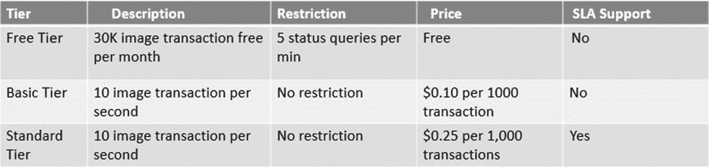图 5-1 Emotions API 的各种定价层注释在撰写本书时，如果您的免费层会话或使用过期，微软认知服务不会自动从免费层转移到付费层。相反，您的服务不会产生响应。我们鼓励您轻松使用免费层，但请务必检查微软认知服务政策，因为它可能随时间而变化。

## 理解先决条件

每个认知 API 都是独一无二的，因此其使用和适用性也是独特的。首先要了解需要使用哪个认知 API。第四章介绍了各种 API。除了知道要使用哪个认知 API 外，还需要具有其订阅密钥和所选择的编程语言。任何认知服务的每个订阅密钥都是独特且独占的，即该用户和该特定服务的订阅密钥是唯一的。您不能使用相同的订阅密钥调用两个不同的认知服务 - 情感 API 的订阅密钥不能用于调用语音 API。在前几章中，我们讨论了通过 REST API 消费认知服务是与语言和平台无关的。这意味着您可以自由选择任何您喜欢的语言来消费。由于我们在本书中针对的是 .NET 开发人员，因此我们使用 Visual Studio 作为我们的开发 IDE。正如您可能知道的那样，Visual Studio 2017 是一个完美的开发环境，也是创建 .NET 开发人员应用程序的默认行业范围代码编辑器。通过默认安装 Visual Studio，您将安装 .NET Framework、语言支持、模板和编译器。所有版本的 Visual Studio 都带有几个版本（社区、专业、企业等） - 我们使用 Visual Studio 2017 专业版。注意我们不涵盖安装 Visual Studio 2017 专业版的安装过程。如果您没有 Visual Studio，请访问[`www.visualstudio.com`](https://www.visualstudio.com)的下载部分进行安装。虽然我们使用 C# 作为创建示例的首选语言，但是即使在非 .NET 环境中消耗，使用 REST 服务的概念也不会真正改变。我们进一步扩展了我们的智能医院用例以消费一些认知服务。如果您需要回顾智能医院用例，请翻回到第一章的末尾。在本书的整个过程中，我们的示例和代码完全专注于构建智能医院。简而言之，这里是消费认知 API 所需的先决条件：

+   订阅密钥

+   Visual Studio 2017

+   你的热情和热忱

你已经拥有创建智能 AI 应用的热情和热忱，这就是你在阅读本书的原因。假设你已经安装了 Visual Studio 2017，现在你只需要获取你的认知 API 的订阅密钥，然后开始。

## 如何获取认知服务的订阅密钥

所有 Microsoft 认知服务 API 都需要传递一个订阅密钥，可以作为头部或查询参数。为了获得你的认知服务的订阅密钥，你只需要一个 Hotmail 账号。你可以通过任何 Microsoft 认知 API，点击获取 API 密钥选项，需要签署，然后完成。但等等！！你还需要更多的额度来消耗这个密钥。考虑更长期的视角，我们建议你通过免费订阅获取，这需要你拥有一个 Azure 账号。如果你已经有了 Azure 账号，你可以直接进入下一节或在此处创建账号。

### 创建 Azure 账号

前往[`azure.microsoft.com/en-in/free`](https://azure.microsoft.com/en-in/free)并单击“开始免费”按钮，如图 5-2 所示。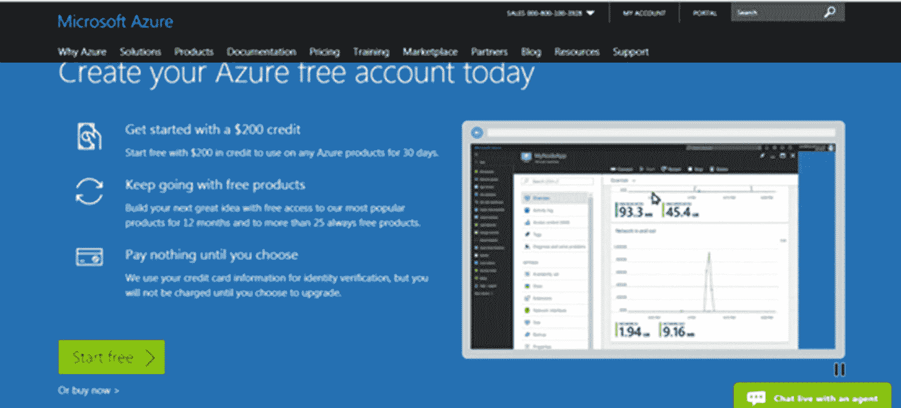图 5-2 Azure 门户免费订阅屏幕 Microsoft 希望鼓励像您这样的新开发人员和架构师使用 Azure 账户。一旦您创建了 Azure 账户，您将获得$200 的信用额度，您可以在为期 30 天的试用期内最终使用此信用额度来探索其他 Azure 产品，例如在 Azure VM 上测试和部署应用程序，获取有关您的数据的深入信息，等等。除了$200 外，您每个月还将获得$50 的专业 Visual Studio 2017 版本使用费。提示这些额外的免费赠品肯定有助于消耗其他 Azure 服务，并使您的应用程序更加有趣。在本书的过程中，我们还使用这些资金来消费其他 IOT 服务。单击“开始免费”将您重定向到图 5-3 中显示的表单。填写获取 Azure 账户的详细信息。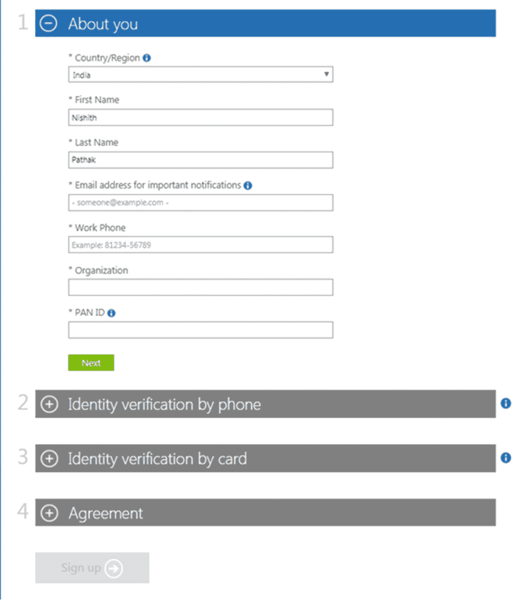图 5-3 注册免费 Azure 订阅的表单填写表格，输入个人详细信息、电话和信用卡详细信息，然后单击“注册”。重要的是要注意，电话和卡详细信息仅用于验证您的身份。不会对卡收取任何费用。同样重要的是要知道 Azure 不会默认将您的级别（从免费到付费）升级。相反，一旦试用期结束，服务就会停止，但您的账户仍然存在。您随时可以再次返回，访问您的账户并使用服务。您还可以使用创建免费账户时收到的信用额度以及专业版 VS 2017。一旦验证了您的身份，您需要接受订阅协议以完成申请。在这一点上，花几分钟快速浏览协议条款和优惠详情是个好主意，申请表格的“协议”部分提供了两者的链接。一旦您接受了协议并单击了“注册”按钮，您将被重定向到订阅者页面。在这里，单击“开始管理我的服务”按钮即可转到 Azure 门户。首次使用 Azure 门户的用户被鼓励进行一次简短的旅游，如图 5-4 所示。熟悉仪表板是个好主意。图 5-4 首次用户在 Azure 门户中进行浏览的选项。如果这是您第一次使用 Azure 门户，强烈建议您快速浏览一下门户。然后，您将被重定向到仪表板，如图 5-5 所示，该仪表板以向导式界面逐步介绍了创建新资源的过程。

### 从 Azure 门户获取订阅密钥

创建 Azure 帐户是一次性活动。如果您已经拥有 Azure 帐户，可以直接访问 Azure 门户以获取订阅密钥。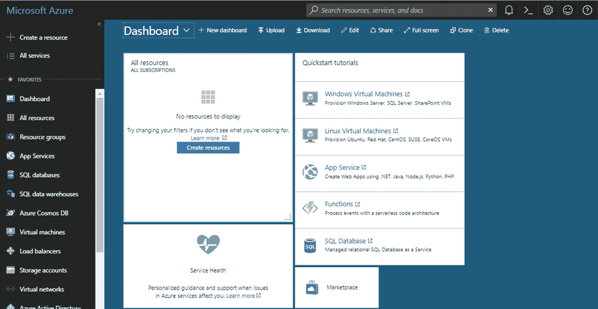图 5-5 Azure 门户仪表板在顶部搜索认知服务，您将被重定向到认知服务页面，如图 5-6 所示。如果这是您第一次访问页面，则尚未创建认知服务。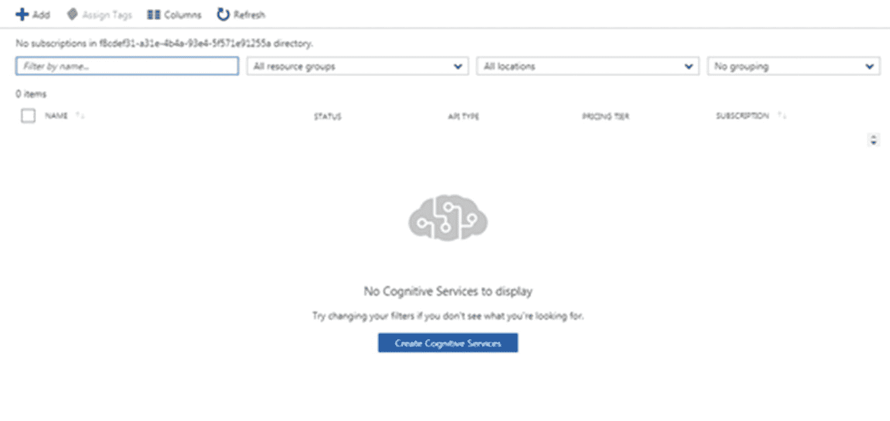图 5-6 首次用户没有关联密钥和订阅点击“添加”，然后搜索计算机视觉 API。然后填写图 5-7 中显示的详细信息。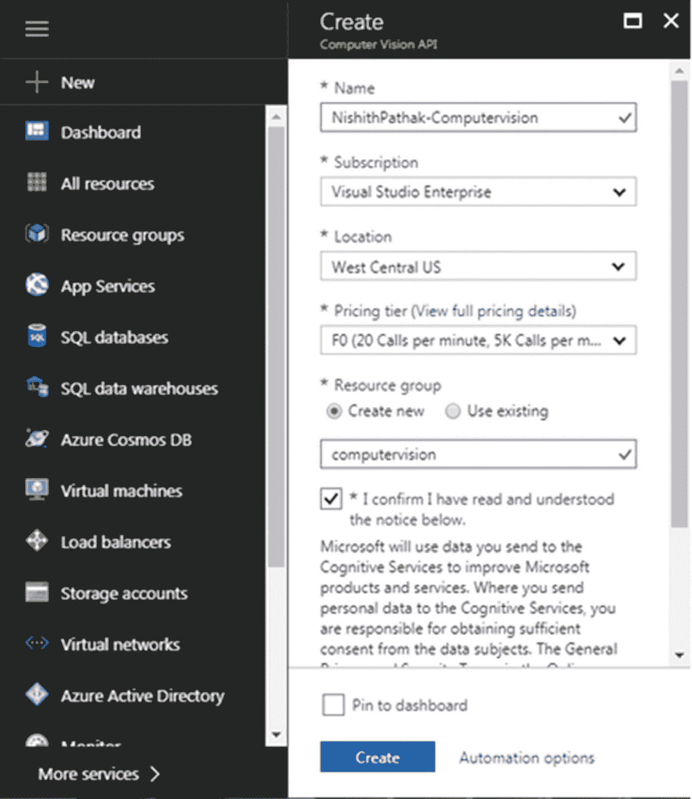图 5-7 Azure 门户的计算机视觉订阅密钥刀片填写所有字段后，点击如图 5-7 所示的“创建”按钮。新帐户的创建和部署需要几秒钟到一分钟。您可以在门户右上角的“警报”菜单中跟踪部署状态。完成后，警报菜单显示一个确认，如图 5-8 所示。图 5-8 Azure 门户中计算机视觉成功创建的通知这证实了创建密钥的一次性过程。现在您可以单击“转到资源”链接，然后选择计算机视觉以获取密钥。向下滚动一点，找到“资源管理”下的“密钥”选项。单击此选项将显示专为您创建的两个订阅密钥，如图 5-9 所示。复制其中一个密钥并使其随身携带。您很快就会需要它。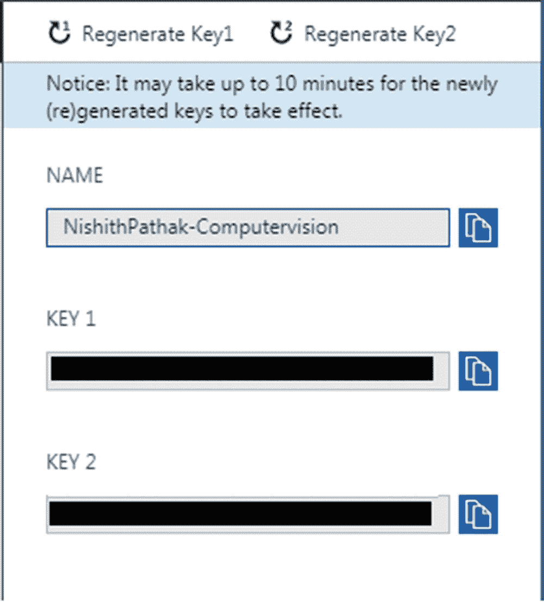图 5-9 Azure 帐户中生成的计算机视觉密钥

## 测试 API

在本章后面使用订阅密钥之前，现在重要的是测试订阅密钥是否正常工作。 最简单的方法是使用任何免费的 GUI 测试工具验证它们。 我们个人偏爱 Postman，这个工具更容易使用，也更方便。 只需调用计算机视觉提供的 HTTP API，并将其中一个订阅密钥作为请求标头的值（如 Ocp-Apim-Subscription-Key），如图 5-10 所示。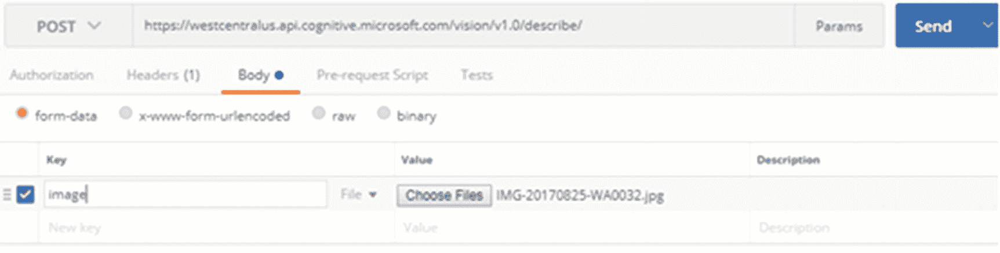图 5-10 用于测试计算机视觉 API 的 Postman 工具 Ocp-Apim-Subscription-Key 密钥已被 Microsoft Cognitive Services 使用以假定其值为订阅。 需要记住这一点，因为我们将在调用任何 Microsoft Cognitive Services 时使用此密钥。 从桌面上选择一张图片； 我选择了图 5-11 中显示的图片。 在 Postman 上单击“发送”按钮来调用 API。 如果所有请求参数都设置正确，您应该会收到一个 200 状态。图 5-11 用于测试订阅密钥的 Postman 中使用的图片此图片的 JSON 响应应为：{"description":{"tags":["person","indoor","boy","young","child","little","standing","small","man","front","holding","shirt","wearing","table","room","girl","playing","suitcase","luggage","red","video","living","remote","people"],"captions":[{"text":"a young boy standing in a room","confidence":0.74894680759015353}]},"requestId":"f1f9b0fa-d0cf-4e17-9cd2-9d87b8c1c53c","metadata":{"width":441,"height":662,"format":"Jpeg"}}正如您所见，文本标题显示“一个年轻男孩站在一个房间里”。 这真的很准确！ 想想看，这有多有用，仅仅一个调用就可以。 这些见解在许多用例中都可以带来巨大的好处，比如安全性、为盲人创建视觉障碍解决方案等。 现在，您已经准备好使用相同的认知服务来做更多有趣的工作了。 我们应该首先熟悉在 Visual Studio 中调用这些认知服务。

## 创建您的第一个智能认知应用程序

（本节假设您已经安装了 VS 2017。） 打开 Visual Studio 2017。 从“文件”菜单，指向“新建”，然后单击“项目”。 在“新建项目”对话框中，展开“Visual C#”节点下的“项目类型”树。 您会看到其中的各种模板。 由于我们想快速创建我们的第一个认知应用程序，请选择“Visual C#”下的“Windows 经典桌面”，选择“控制台应用程序（.NET Framework）”。 给您的项目命名，例如 myFirstCognitiveApp，如图 5-12 所示，并单击“确定”以在 Visual Studio 2017 中创建一个新的基于控制台的项目。 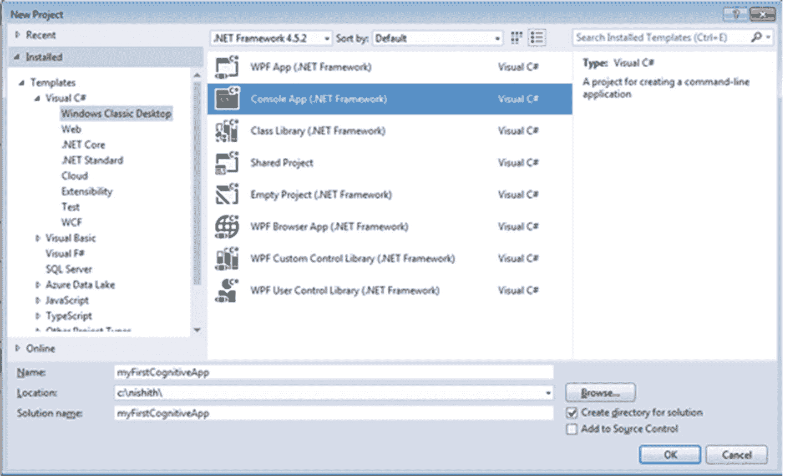图 5-12VS 2017 新项目模板注释从这里开始，我们假设您知道如何使用 Visual Studio 2017 创建新项目。 今后，我们将简单地要求您在 VS 中创建一个新项目，指定模板和任何特定项目名称（如果需要）。 打开“解决方案资源管理器”并将“Program.cs”文件重命名为“CognitiveApp.cs”。 在“项目”菜单中，单击“添加引用”。 在“添加引用”对话框中，单击“框架”选项卡，并像图 5-13 中所示添加对以下程序集的引用。

+   System.Web

+   System.Configuration

+   System.Net.Http

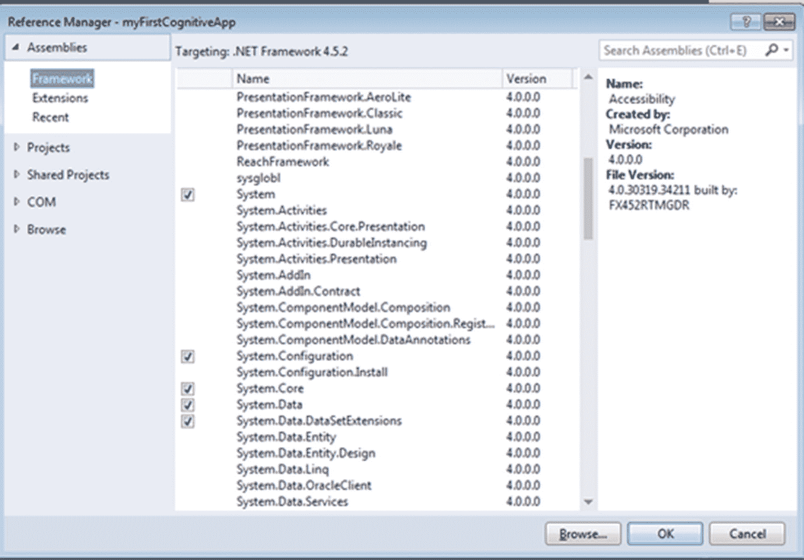图 5-13Visual Studio 2017 中的添加引用对话框框

## 消耗认知 API 的步骤

创建一个名为 DescribeImage 的新函数，该函数接受图像，调用我们的认知 API，并将 API 的结果作为字符串返回。 为了实现这一点，您的函数应该按照以下一系列步骤进行操作：

+   第 1 步。 创建 HTTP 客户端以进行 HTTP 调用。

+   第 2 步。 使用适当的参数构建 HTTP 请求对象。

+   第 3 步。 通过传递第 2 步中创建的 HTTP 请求调用计算机视觉 API，并从 API 获取响应。

你的函数签名应该像下面这样：public static async Task<string> DescribeImage(string imageFilePath)。如果你看这个签名，你会注意到这个函数已经被标记为 static 和 async。这个函数被标记为 static 是为了你可以直接从主函数调用它。在这里，我们使用 C# 的 async 编程来调用 API，以使用户体验更加流畅和响应更快。

### 构建 HttpClient 实例

从 Visual Studio 调用认知 API 的第一步也是最重要的一步是构建 httpClient 实例。HttpClient 类位于 System.Net.Http 命名空间中。它的实例用于发起、发送、修改和删除 HTTP 调用。有多种实例化 httpclient 的方法。在 using 块内创建实例会在块结束时自动释放对象。适当地释放 I/O 密集型对象非常重要，因为它们所使用的系统资源不会被保留，而是立即提供给其他程序使用。你的 httpclient 实例化应该像这样：using (HttpClient myhttpClient = new HttpClient())

### 使用适当的参数构建 Http 请求对象

现在您已经创建了 httpClient 实例，下一步是将订阅密钥传递到标头并将图像作为多部分表单数据内容。为了将订阅密钥作为标头传递，您需要一个名为 Ocp-Apim-Subscription-Key 的唯一标头键，该键在所有认知服务中都用于识别其值作为订阅密钥。您可以创建键值对或将其硬编码。但我们建议将订阅密钥存储在配置文件中，这将防止由于订阅密钥更改而导致的重新编译。您可以将其添加到之前步骤中创建的 httpclient 实例中。您的代码应如下所示：myHttpClient.DefaultRequestHeaders.Add("Ocp-Apim-Subscription-Key", ConfigurationManager.AppSettings["AzureSubscriptionKeyVision"]);下一步是将图像作为多部分表单数据内容传递给 httpclient。.NET Framework 提供了位于 System.net.http 命名空间中的容器类 MultipartFormDataContent 来执行此操作。使用 using 实例化这些对象可以更好地自动处理它们的释放。创建容器类后，您可以以字节格式读取整个图像并将其添加到 multipartFormDataContent 实例中，如下所示。File.ReadAllBytes() 方法接受文件的绝对路径并返回其字节序列。var imgContent = new ByteArrayContent(System.IO.File.ReadAllBytes(imageFilePath));reqContent.Add(imgContent);

### 调用 Microsoft Cognitive Vision API

现在你已经准备好调用认知视觉 API 了。为了使 httpclient 能够向认知视觉 API 发送 POST 请求，你需要为其提供正确的认知 API 的 HTTP 地址和 multipartFormDataContent 对象中的 API。按照此处所示的设置 maxCandidates 为 1 来指定地址，这确保只从 API 返回一个描述。var queryString = HttpUtility.ParseQueryString(string.Empty); queryString["maxCandidates"] = "1"; var uri = "https://westcentralus.api.cognitive.microsoft.com/vision/v1.0/describe/?" + queryString; 下一步是以异步方式调用 Microsoft 认知 API，传递地址和多形式数据内容，如下所示的代码所示：HttpResponseMessage respMessage = await myHttpClient.PostAsync(uri, reqContent); string finalJson = await respMessage.Content.ReadAsStringAsync(); return finalJson; 上述代码在调用 API 时使用了异步操作。始终最好以异步方式调用所有 API，以确保在从 API 听到回音之前，您的应用程序不会无响应。现在，您的控制台应用程序的整个代码应如下所示：using System; using System.Collections.Generic; using System.Configuration; using System.Linq; using System.Net.Http; using System.Text; using System.Threading.Tasks; using System.Web; namespace myFirstCognitiveApp { class CognitiveApp { static void Main(string[] args) { Task<string> result = DescribeImage(@"C:\nishith\image.jpg"); Console.WriteLine(result.Result); Console.ReadLine(); } public static async Task<string> DescribeImage(string imageFilePath) { using (HttpClient myHttpClient = new HttpClient()) { myHttpClient.DefaultRequestHeaders.Add("Ocp-Apim-Subscription-Key", ConfigurationManager.AppSettings["AzureSubscriptionKeyVision"]); using (MultipartFormDataContent reqContent = new MultipartFormDataContent()) { var queryString = HttpUtility.ParseQueryString(string.Empty); queryString["maxCandidates"] = "1"; var uri = "https://westcentralus.api.cognitive.microsoft.com/vision/v1.0/describe/?" + queryString; try { var imgContent = new ByteArrayContent(System.IO.File.ReadAllBytes(imageFilePath)); reqContent.Add(imgContent); HttpResponseMessage respMessage = await myHttpClient.PostAsync(uri, reqContent); string finalJson = await respMessage.Content.ReadAsStringAsync(); return finalJson; } catch (System.IO.FileNotFoundException ex) { return "指定的图像文件路径无效。"; } catch (ArgumentException ex) { return "HTTP 请求对象似乎没有正确形成。"; } } } } } }}

## 你的代码结果

构建项目，如果需要，纠正任何语法错误。 在 Visual Studio 中，按下 F5 或 Ctrl+F5 将运行您的程序。 由于这个程序是控制台应用程序的一部分，它将在命令提示符中打开和运行。 图 5-14 显示了与我们在 Postman 示例中使用的孩子图像相同的控制台窗口中的相同结果。图 5-14 控制台窗口中的输出恭喜！ 最后，您不仅能够调用认知应用程序，还清楚了解调用认知 API 所需的步骤。 在下一章中，需要执行类似的步骤来消费认知服务，所以最好在继续创建更智能的应用程序之旅之前再次复习这些步骤。

### 让我们做一些更有趣的事情

回到你的控制台应用程序，并将 Task<string> result = DescribeImage(@"C:\nishith\image.jpg");替换为 Task<string> result = DescribeImage(@"C:\nishith\mahatma.jpg");然后运行应用程序。 在这段代码中，我们所做的是将孩子的图像替换为民族之父，圣雄甘地，如图 5-15 所示。图 5-15 现在我们传递给控制台应用程序的圣雄甘地的图像

### 输出

如你在图 5-16 中所见，返回的标题是“戴眼镜摆姿势的圣雄甘地”。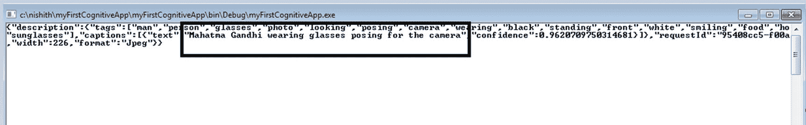图 5-16 传递圣雄甘地图像的输出。这个能够描述图像的同一个认知服务 API 能够识别史蒂夫·乔布斯。这不是令人惊讶吗？这是什么技巧？在幕后，微软拥有一个跨越工业、政治、体育和娱乐等各个领域的超过 200,000 名名人的名人识别图像分类模型。每当对微软认知视觉 API 进行调用时，都会执行一个检查，看看检测到的人是否是这个分类模型的一部分。

## 你的下一个任务

每一个 29 个认知 API 都非常强大。其中一些 API 是多任务处理程序，可以执行多项任务。例如，我们的计算机视觉 API 是视觉类别下最强大的 API 之一。正如你在之前的简单示例中所看到的那样，计算机视觉 API 不仅能够为我们描述场景，还能识别名人。试试在你所在城市/国家的一些地标上进行尝试，看看计算机视觉 API 是否能够识别事物。除了场景识别和识别名人之外，它还可以用来完成以下任务

+   提供一张图像并生成缩略图

+   从图像中提取打印或手写文本

+   实时分帧分析视频

我们建议您修改这个程序，并尝试使用各种图像，并通过稍微调整代码来测试功能。您会惊讶地发现微软认知视觉 API 如何以出色的技巧完成所有这些任务。

## 总结

在这一章中，你了解了消费认知 API 所需的先决条件。接着是一个分步获取订阅密钥的过程。然后你学习了在 Visual Studio 中通过详细代码演示调用 Microsoft 认知 API 的方法。你还对通过调用 Microsoft 认知 API 可以实现的各种任务有了一个概念。在下一章中，我们将使用其他 Microsoft 认知 API 来扩展我们的医院用例，并学习如何使用 Microsoft 认知 API 将普通医院转变为智能医院。
