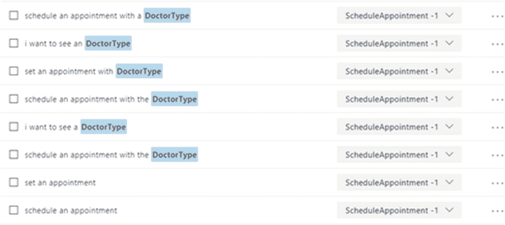

© 2018 年 Nishith Pathak 和 Anurag Bhandari Nishith Pathak 和 Anurag Bhandari IoT、AI 和区块链用于 .NET `doi.org/10.1007/978-1-4842-3709-0_6`

# 6. 使用认知 API 构建更智能的应用程序

Nishith Pathak^(1 ) 和 Anurag Bhandari² (1)印度，Pauri Garhwal 市，Kotdwara (2)印度，旁遮普邦，朱兰达拉著名的说法“罗马不是一天建成的”对于微软认知服务确实如此。每项服务都暴露为 RESTful API，通过将来自微软研究团队的数十年经验、复杂算法、深度神经网络、模糊逻辑和研究抽象化。在第四章，你被介绍了微软认知服务。你也学到了认知服务与传统编程系统的区别。稍后在第四章，你会预览到微软已经生产的所有 Microsoft 认知服务 API。第五章继续探讨认知服务的旅程，涵盖了创建认知服务和设置开发环境的先决条件。你还熟悉了在 Visual Studio 中使用你的第一个认知应用程序，并认识到了计算机视觉 API 的强大功能。欢迎来到本章。在本章中，我们通过将它们应用到我们在第一章中介绍的智能医院用例来扩展认知服务。正如你现在所知道的，微软认知服务被广泛分类为六大类别，每个类别都有 4-5 个服务，这导致写这些书时大约有 29 个服务。我们将介绍如何使用认知服务的一些最强大的方式，特别是围绕 NLU、语音以及使用 Face API，并将它们应用到 Asclepius 医院的示例中。在本章的结尾，你将:

+   了解一些应用认知服务的强大方式

+   了解自然语言理解（NLU）和 LUIS

+   为智能医院开发、测试、托管和管理 LUIS 应用程序

+   与语音 API 进行交互

+   使用语音 API 将语音转换为文本和文本转换为语音

+   在医院场景中使用人脸检测和识别

Asclepius 联盟是一家涉及几乎所有类型疾病的医院连锁机构。作为他们提供的一部分，他们有一个名为 Dr. Checkup 的移动应用程序，提供一系列应用程序中的自然语言功能。这包括一个移动应用程序，不仅用于维护历史记录和付款转账，而且通过提供症状帮助用户进行基本诊断。这不仅帮助患者迅速采取行动，还帮助他们理解疾病的复杂性，如图 6-1 所示。图 6-1 Dr. Checkup 应用提供基本诊断一旦疾病被识别出来，患者可以安排与特定专家/医生的预约，如图 6-2 所示。图 6-2 Dr. Checkup 与患者聊天后安排与医生的预约 Asclepius 联盟还在其前端柜员机中使用相同的 NLU 技术来安排预约。

## 微软的使命和自然语言理解

微软早期的使命是让每个家庭都拥有台式电脑。微软在实现这一目标方面取得了非常成功的成绩，覆盖了大部分西方世界。最近，微软修改了他们的使命为“赋能地球上的每个个人和组织，让他们取得更多成就”。与以前更加技术化相比，微软的这一新使命更加人性化。人工智能的最高目标一直是为人类服务。为了让人工智能为人类服务，它应该能够理解人类。作为第一步，人工智能应该能够理解和处理人类所说的语言。随着越来越多的智能系统的设计，这些系统理解人类语言、解释含义，然后在必要时采取适当的行动变得越来越重要。这个解释人类语言的领域被称为自然语言理解（NLU）。NLU 是机器将自然语言文本转换为计算机能够理解的形式的能力。换句话说，它是从句子中提取含义的能力。这使系统能够理解语言的“什么”问题。接下来以第四章的用例为例，其中一个人正在向智能系统提问，问题如下：

> “今天的日程安排如何？

现在，这个问题可以以多种方式提出。其中一些是：什么是我今天的日程安排？办公室有很多会议吗？我的日历今天很忙吗？对于人类来说，这些句子立即清楚地表明了一个人询问她今天日程的方式。对于机器来说，可能不太清楚。事实上，创建一个自然语言理解引擎是一个比较复杂的问题之一。有各种各样的因素，但主要问题是没有一个算法可以解决它。此外，训练机器理解语法、规则和俚语是困难的。由于深度学习的出现，我们现在可以通过用成千上万个话语训练引擎，创建一个基于这些例子的模式识别，然后不断改进它来识别语言理解的正式和非正式规则，从而达到语言理解的极高精度。基于这个自然语言理解理论，存在各种商业产品，并且基于我们在第四章中简要讨论的意图-实体架构。意图有助于理解用户在提问时的意图。如果你看这些例子，有多种方式提出相同的问题，但意图是相同的——给我那一天的日程安排。一旦我们知道了正确的意图，系统就可以直接用正确的答案来回应。为了识别正确的意图，自然语言理解系统还经过训练来识别某些关键词。这些关键词称为实体。在我们之前的例子中，要从日历中获取日程，通常需要人的姓名和日期。每个实体都可以标记出来。重要的是要理解，实体是可选的，并非所有句子都可能有实体。句子可能还有更多的实体。我们将在本章后面讨论识别意图和实体。

## 语言理解智能服务（LUIS）

语言理解智能服务，又称为 LUIS，是微软的 NLU 云服务，是第四章讨论的认知套件的一部分。重要的是要理解，LUIS 不应被视为最终用户的完整软件应用程序。LUIS 只是替换整体堆栈中的 NLU 组件。它是一个处理 NLU 实现的 NLU 引擎，通过抽象内部机器学习模型的复杂性。您的前端仍然可以是网站、聊天机器人或任何从图形到对话用户界面的应用程序。在我们的 Asclepius 用例中，前端是移动应用程序（Dr. Checkup）。在打开 LUIS 并开始工作之前，了解需要深入设计专业知识的 LUIS 的基础是很重要的。让我们看看 LUIS 的幕后方面。

### 在 LUIS 上设计

LUIS 框架就像一个干净的板，已经训练了一些内置实体。作为第一步，设计 LUIS 应用程序是非常重要的。设计 LUIS 应用程序需要对软件试图解决的问题有深刻的理解。例如，我们的智能医院用例需要使用 LUIS 与患者交流，预约医生的约会，或者与医院聊天机器人交谈，以检测是否真的需要医生的关注。在实施 LUIS 时没有严格的指导方针或规则。然而，根据我们与 LUIS 和另一个 NLU 系统互动的经验，我们提出了一些高级指导原则。

### 使用 LUIS 的设计指南

智能医疗用例中，LUIS 应具有正确的意图和实体。有许多方法可以识别正确的意图和实体。我们提出以下设计原则以实现有效的识别：

+   首先规划您的范围。规划范围并将其缩小到 LUIS 范围内非常重要。明确确定范围是成功实现 LUIS 实现交付的第一步。我们建议您将应用 LUIS 的范围限制在少数任务或目标中。

+   使用预构建的领域（如果可能）。一旦确定了范围，您现在了解了 LUIS 将要解决的用例或领域。LUIS 还附带了一些预构建领域，其中包含一组以前定义的实体和意图。这些预构建领域也经过了预训练，并且可以立即使用。如果可能的话，请尽量使用预构建领域。如果您的需求可以通过预构建的意图或实体实现，请在创建新的之前选择它们。您始终可以自定义预构建领域。即使您必须创建一些新的来满足您的需求，您也应该始终尝试挑选至少一个预构建的领域和实体。

+   确定您的应用程序将执行的任务。一旦确定了领域，列出您的应用程序将执行的任务。这些任务确定了最终用户访问您的应用程序的意图。正如你可能已经猜到的，将每个任务创建为一个意图。适当地分解任务非常重要，这样您就不会有不具体的任务。您拥有的任务越多，培训就越严格。

+   确定任务所需的额外信息。并非所有任务都是直截了当的。其中大多数任务都需要一些额外的信息。这些额外的信息称为实体。实体为识别特定任务的意图补充。您可以将实体视为应用程序的变量，这些变量需要存储并传递信息给客户端应用程序。

+   培训至关重要。在核心层面，LUIS 接受文本输入。这些输入称为话语。在 LUIS 真正理解未来话语之前，需要对这些话语进行大量训练。拥有的示例话语越多，模型就越好。为了识别各种话语，最好收集您期望用户键入的短语，并确定可以提出相同问题的不同方式。如果您的应用程序必须处理多个类似的用例，LUIS 有可能因为对每个相似用例的训练不足而感到困惑。尽管进行了培训，但不安全地假设 LUIS 会以绝对准确性做出回应是不明智的。LUIS 基于主动机器学习模型，这确保了 LUIS 模型会持续学习和增强模型的时间。事实上，LUIS 会跟踪所有无法以高置信度预测意图的话语。您将在意图页面的“建议的话语”部分找到这些话语。使用此选项适当地标记话语，并向 LUIS 确认它是否正确或错误。LUIS 培训是一个持续的过程，直到找不到建议的话语部分不再提供建议为止。

### 首先规划您的范围

此移动应用程序和前端柜员机的高级序列图如图 6-3 所示。图 6-3 各方在预约或初步诊断期间的高级互动步骤也在此处列出。

1.  1.患者通过移动应用程序或前端柜员机（通过短信或语音）请求与查康医生交谈。

1.  2.如果患者通过语音提交查询，则移动应用程序/前端柜员机将使用 Microsoft Speech API 将语音转换为文本。

1.  3.然后，应用程序将文本传递给 LUIS 应用程序，以确定所提问的意图。

1.  4.LUIS 进行其自然语言理解分析，并返回其对意图和实体的预测。结果作为 JSON 返回到应用程序。

1.  5.应用程序在返回的 JSON 中检查得分最高的意图，并决定所需的操作。操作可以是安排约会或提供基本诊断。如果操作是安排约会，则检查医生的日历并设置约会。对于基本诊断，它通过传递接收到的意图和实体组合与数据库交流。

1.  6.数据库中存储了预定义的答案，针对意图和实体的组合。答案被检索并发送回移动应用程序。

1.  7.应用程序通过文本或语音向患者显示所需的结果。

在这些场景和应用中，自然语言理解在实施中起着至关重要的作用。在我们深入探讨其他方面之前，让我们首先看看如何识别意图和实体。

### 识别意图和实体

一旦范围确定，下一步是确定意图和实体。让我们以早期诊断为例。您期望终端用户提供什么？除了姓名、年龄和性别详细信息外，您期望用户列出他的症状，以便根据一些一般性规则提供早期诊断。现在用户可以用一个简单的句子或几个句子提供这些症状。图 6-4 展示了某些用户如何提供症状的示例。图 6-4 用户提供症状的一些方式如果您看这些例子，它们都是为了早期诊断意图而请求的。大多数这些早期诊断句子与各种实体匹配，如身体部位和症状。每个身体部位和症状都可以用一些身体部位或症状来替换。对于第一个例子，您可以有以下内容：当然，这个列表不是详尽无遗的，您可能需要努力创建一个更完整的列表。让我们再来看一个与医生预约挂号有关的用例。您需要什么来安排医生预约？基本上，您需要医生的类型（妇科医生、牙科医生、心脏病专家等）、可能的日期，以及可选的特定时间范围，在将医生的时间锁定之前。图 6-5 展示了您可以安排预约的一些方式。图 6-5 安排与医生预约的一些方式这些示例是用于与医生预约的，并与实体医生类型相关联。有时用户指定了意图，但没有提供实体。然后，由应用程序逻辑来决定下一步。您可以回头询问用户，甚至假定一些默认值并继续处理。考虑这个例子：我想看医生用户想预约看医生，但没有指定医生的姓名，甚至日期和时间。在这种情况下，您可以为实体设置默认类型。在这种情况下，例如可以是医生，而约会时间可以是下一个可用的时段。

## 为 LUIS 创建数据字典

正如您现在所知，LUIS 不执行任何计算或逻辑。它只是从话语中提取意图和实体的含义。作为一个良好的设计过程，帮助您在打开 LUIS 并开始工作之前创建一个数据字典。数据字典更像是一个存储话语及其相关意图和实体的元数据的圣经。您可以将其用作您的 NLU 的设计文档。这也是有帮助的，因为通过这个字典，您可以确定要创建的意图和实体的数量。表 6-1 显示了用于 LUIS 应用程序的数据字典的三列的良好方法。表 6-1 用于 Dr. Checkup 的数据字典示例

| 话语 | 意图 | 实体 |
| :-- | :-- | :-- |
| 在明天下午 5 点之前与医生预约 | scheduleAppointment | 医生类型 = 医师, 日期时间 = 明天, 预约时间::开始时间 = 预约时间::结束时间 = 下午 5 点 |
| 腹痛 | checkCondition | 症状 = 腹痛身体部位 = 腹部 |
| 发烧伴有大声咳嗽 | checkCondition | 症状 = 发烧身体部位 = 大声咳嗽 |
| 与骨科医生预约 | scheduleAppointment | 医生类型 = 骨科医生 |

这个表只是一个示例，但将其创建为 Excel 表格并将其用作 LUIS 应用程序的设计文档是明智的。提示表 6-1 中显示的数据字典是一个基本的字典，可以帮助您入门。您可以扩展它并使其更可用。例如，添加一个答案列，提供有关将向用户返回什么答案的消息。您还可以使用此数据字典创建测试用例。识别意图和实体是最重要的任务之一。一旦识别出意图和实体，下一个任务就是在 LUIS 中创建这些实体和意图。在您在 LUIS 中创建实体之前，您需要获取 LUIS 的订阅密钥。

### 获取 LUIS 的订阅密钥

章节 5 详细描述了如何在 Azure 门户中创建帐户并获取 Vision API 的订阅密钥。您可以使用相同的帐户获取 LUIS 的订阅密钥。打开 Azure 门户，从左侧菜单中选择 New ➤ AI + Cognitive Services。点击 Language Understanding，如图 6-6 所示。图 6-6 选择新选项后的 Azure 服务门户的截图填写表格，选择适当的订阅、定价层和资源，如图 6-7 所示。您可能希望从免费层（F0）开始，正如我们在前一章中讨论的那样。点击 Create。图 6-7 填写创建 LUIS 订阅密钥的表格一旦提交，将需要一些时间来验证并创建帐户。在收到通知后，您可以返回仪表板。在仪表板中点击您的 LUIS 帐户，并获取密钥以继续，如图 6-8 所示。图 6-8 在 Azure 门户中创建 LUIS 订阅密钥

### 应用订阅

现在您已经准备好了一切，所以第一项任务是将新创建的订阅密钥添加到 LUIS 中。

1.  1.从 [`luis.ai`](https://luis.ai) 打开 LUIS 网站。

1.  2.通过在 Azure 门户中使用相同的 Microsoft 帐户登录。在编写本书时，LUIS 要求接受许可协议，并授予 LUIS 访问 Microsoft 帐户的权限。

1.  3.点击确定。您现在位于 LUIS 仪表板页面。如果这是您第一次登录，您将看到 MyApps 部分为空。

1.  点击“创建新应用”以创建一个新应用，并指定名称、文化和可选描述，如图 6-9 所示。点击“完成”。你可以根据自己的逻辑提供自己的名称和文化。

图 6-9 在 LUIS 中创建新应用恭喜，您已经快速创建了一个应用程序。现在是在创建意图和实体之前向应用程序添加您的订阅密钥的时候了。

### 在 LUIS 中应用订阅密钥

在之前点击“完成”后，您将被重定向到应用程序页面。如果没有，请从“我的应用程序”部分点击 Asclepius NLU。点击“发布”并滚动到“资源和密钥”部分。点击“添加密钥”并选择租户、Azure 订阅，然后选择 LUIS 帐户，如图 6-10 所示。租户代表客户或您组织的 Azure 活动订阅 ID。图 6-10 向应用程序分配 LUIS 密钥现在是时候添加意图和实体了。

### 添加意图和实体

添加意图和实体非常简单。要添加新意图，请从左侧边栏转到意图页面。如果这是您第一次进入此页面，则不会有任何已创建的意图。保持您的数据字典方便。现在点击“创建新意图”，将数据字典中意图的第一个条目指定为意图名称，然后点击“完成”。您的数据字典的第一列还列出了示例话语。按照先前显示的方式开始添加示例话语。在添加了初始话语后，点击“保存”按钮以保存您的更改。将鼠标悬停在刚添加的话语中的“精神科医生”一词上，以查看其被方括号括起来的情况。点击该词将为您提供将其标记为现有实体或新实体的选项。创建一个名为 Doctor 的实体类型。图 6-11 显示了一旦您提交了初始话语，scheduleAppointment 意图将会是什么样子。图 6-11 显示了带有几个话语的 ScheduleAppointment 意图屏幕截图。重复此过程，针对数据字典中创建的所有意图、实体和话语。现在，您应该训练、测试和发布 LUIS 作为终端点，以供移动应用程序使用。

### 训练和测试 LUIS

我们遵循这个流程的一个原因是确保所有意图都有一些示例话语。如果一个意图没有话语，那么就无法训练应用程序。将鼠标悬停在“训练”按钮上。你会看到消息“应用程序有未训练的更改”。点击右上角的“训练”按钮来训练应用程序。通过训练，你可以确保 LUIS 正在创建一个带有话语的泛化模型，并且能够识别意图和实体。一旦训练过程成功完成，你的“训练”按钮应该有一个绿色的通知栏来提醒这一事实。现在你可以将鼠标悬停在“训练”按钮上。你会得到消息“应用程序是最新的”。

### 发布 LUIS 应用程序

终结点实际上是一个用于访问 LUIS 应用的 Web 服务。 终结点通过查询字符串参数接收一个话语，并返回一个 JSON 输出，其中包含相应的意图-实体分解。 当您首次发布时，会根据您的应用程序 ID 和订阅密钥为您生成一个终结点 URL。 这个 URL 在您的 LUIS 应用程序的整个生命周期中保持不变。要创建一个生产终结点，请点击左上角的发布。 从“发布到”下拉菜单中选择“生产”。 如果您希望您的 JSON 终结点包含所有预测的分数，请选中“包含所有预测的意图分数”选项。 单击“发布到生产槽”如图 6-13 所示。 发布后，您将获得终结点。图 6-13 发布 LUIS 应用程序以获取终结点

### 使用 LUIS 终结点

使用 LUIS 端点很容易。您只需调用前一节中创建的 HTTP 端点，并将带有参数 q 的查询传递进去。如果端点正确，您将开始收到 JSON 格式的响应，如下面的代码所示：{  "query": "can you set appointment for dentist",  "topScoringIntent": {    "intent": "ScheduleAppointment",    "score": 0.999998569  },  "intents": [    {      "intent": "ScheduleAppointment",      "score": 0.999998569    },    {      "intent": "GetCondition",      "score": 0.0250619985    }],  "entities": []}现在您已经理解了训练的本质。训练次数越多，置信度分数就越高。我们的前端窗口和移动应用程序使用此端点，并采用第一个置信度分数与我们的数据库进行交流，然后返回实际要显示给用户的答案。除了移动设备和前端窗口 UI 外，它们还有额外的工作要维护用户的状态。LUIS 支持有限的对话管理，但是在撰写本书时，对话管理支持并不那么灵活，因此我们建议您的软件应用程序来维护它。我们的前端应用程序还支持与语音用户的交互。因此，让我们看看如何在我们的应用程序中实现语音交互。

## 语音交互

几乎每天都会有许多新设备出现。那些我们只期望设备理解一些命令并执行操作的日子已经过去了。过去十年间，与这些设备的交互也发生了巨大变化。在所有这些设备中，语音无疑是其中最强大的之一，它当然是与用户进行交互的自然方式之一。想象一下像 Cortana、Siri 或者甚至是控制汽车的智能语音助手——几乎所有这些都具有语音的自然交互。阿斯克勒庇俄斯医院集团的患者来自各个领域，他们也希望他们的前端自助服务机器，以及移动设备，具有语音交互功能。广义上讲，在阿斯克勒庇俄斯移动端和前端自助服务应用中使用的语音交互必须将语音转换为文本或反之亦然。传统上，在应用中实现语音一直都是一项困难的工作。幸运的是，微软认知必应语音 API 提供了增强应用程序与语音驱动场景集成的最简单方法。语音 API 通过抽象化所有语音算法的复杂性，并提供易于使用的 REST API，提供了易于使用的便利性。

### 开始使用必应语音 API

必应语音 API 有各种实现 Speech API 的方式，以满足客户的需求。通过使用语音识别和语音合成来实现需求。语音识别，又称语音转文本，允许您使用识别引擎处理用户在应用程序中说出的单词，并将其转换为文本。语音合成，也称为文本转语音（TTS），允许您通过语音合成引擎向用户朗读单词或短语。

### 语音转文本

Bing 文本转语音 API 在易于使用的 REST API 中提供这些功能。与所有其他 Microsoft 认知 API 一样，所有交互都通过 HTTP POST 完成。所有调用都通过托管在 Azure 云服务器上的这些 API 进行。您需要按照以下步骤使用 Bing 语音 API 进行文本转语音。

1.  1. 调用令牌服务获取 JSON Web 令牌（JWT）。

1.  2. 将 JWT 令牌放入标头并调用 Bing 语音 API。

1.  3. 解析文本。

### 获取 JWT 令牌

所有对微软认知服务 API 的调用在实际使用服务之前都需要进行身份验证。与其他认知服务不同，Bing 语音 API 还需要在调用之前传递访问令牌，也称为 JWT 令牌。access_token 是作为 base64 字符串传递到语音请求头中的 JWT 令牌。要获取 JWT 令牌，用户需要向令牌服务发送 POST 消息，并像这样传递订阅密钥：

### 代码演示

作为一名经验丰富的开发者，您可能立即注意到调用语音转文本的关键代码在于 GetTextFromAudio 方法。以下是此代码的逐步操作过程：

1.  1.创建指向语音端点的 URL，并带有必要的参数。确保每个参数仅被使用一次，否则会导致 HTTP 400 错误。

1.  2.调用 getValidToken 方法获取 JWT 令牌。为了确保最高安全性，每个 JWT 令牌仅有效 10 分钟。因此，需要在 10 分钟之前或之后刷新令牌，以确保它们始终有效。使用无效令牌调用语音 API 将导致错误。GetValidToken 显示了实现此目标的一种方法。您也可以自由使用自己的方法。在内部，GetValidToken 方法调用 getNewToken 方法以获取 JWT 令牌。

1.  3.将有效的 JWT 令牌作为授权头的前缀字符串 Bearer 传递。

1.  4.使用编解码器将传递的音频从模拟转换为数字化。

1.  5.异步调用语音 API 并获取 JSON 数据。

1.  6.将 JSON 反序列化为 .NET 对象以供进一步使用。

祝贺！现在您已经知道如何仅用几行代码将任何语音转换为文本。我们还学习如何将文本转换为语音。

### 文本转语音

文本转语音转换几乎遵循与语音转文本相同的模式。在进行代码演练之前，让我们先看一下代码：

### 代码演练

将文本转换为语音的步骤如下：

1.  调用 generateSSML 方法创建要转换为语音的文本的 SSML 标记。注意：语音合成标记语言（SSML）是一种用 XML 格式表示语音的常见标准方式。它是 W3C 规范的一部分。SSML 提供了一种创建基于语音的标记文本的统一方式。请查阅官方规范以获取完整的 SSML 语法，网址为 [`www.w3.org/TR/speech-synthesis`](https://www.w3.org/TR/speech-synthesis) 。

1.  调用 Text to Speech API。首先需要获取有效的令牌。为此，可以重用语音转文本代码中展示的 getValidToken() 方法。

1.  利用 RestSharp 这个流行的第三方 HTTP 库，向 [`speech.platform.bing.com/synthesize`](https://speech.platform.bing.com/synthesize) 发送 POST 请求，以获取由 Text to Speech API 作为响应返回的音频的字节数组。在 Visual Studio 中，可以通过 NuGet 方便地安装 RestSharp。

1.  使用内置的 .NET 类 SoundPlayer 来播放音频文件和流，将字节数组转换为语音。SoundPlayer 是一个内置的 .NET 类，用于播放音频文件和流。该音频文件的格式由 x-Microsoft-outputformat 标头的值确定。由于 SoundPlayer 仅支持 WAV 音频文件，因此将 riff-16khz-16bit-mono-pcm 用作 outputformat 标头的值。

## 识别和识别面部。

像任何智能医院一样，Asclepius 拥有非常严格的监控系统。Asclepius 联合体对访问病人的人数也非常谨慎。Asclepius 的监控系统监视库存仓库，限制只有一小部分医生和护士可以进入安全和仓库区域，甚至与病人一起。这种智能数字行动有助于通过在尝试安全漏洞时发出警报来限制不受欢迎的人员进入。Asclepius 还拥有自动考勤系统，不需要用户携带身份证或任何设备。员工进入医院后，她就会被从闭路电视摄像头中识别出来，并且她的考勤已经注册。她进出系统的时间也在监控之中。所有的房间和区域都有数字识别机制，只允许授权人员进入房间。所有这些都是通过使用各种认知技术实现的，特别是 Face API。

### 面部 API 是如何工作的？

面部 API 在高层次上帮助检测、识别、验证和识别面部。它还可以用于获取有关面部的更多见解。面部检测和识别并不是一个新概念。它在学术界、政府机构和各行各业已经有数十年的历史了。Face API 将 Microsoft 多年的面部检测和识别研究融入了一个易于使用的 API 中，从而扩展了它。

### Asclepius 如何实现强大的监控？

Asclepius 创建了各种安全组，以满足他们的安全需求。每个医院员工和个人都被添加到这些已知组中之一（访客、普通员工、患者、医生、供应商、管理员）。默认情况下，任何未知人员都被标记为访客组的一部分。所有患者都被标记为患者组的成员。所有医生都属于医生组，而一些医生和医院员工属于管理员组，可以访问所有房间。借助智能闭路电视摄像头，图像通过帧实时捕获。只有来自特定人员组的授权人员才能访问特定房间，如图 6-14 所示。同样的过程也用于识别进入办公室的员工和访客。图 6-14 Asclepius 联盟如何使用人脸识别来识别人员并为他们打开门

### 获取 Face API 的密钥

与所有认知服务一样，您必须首先通过 Azure 门户获取 Face API 的订阅密钥。

1.  1.转到 Azure 门户 ➤ AI + 认知服务刀片。

1.  2.选择 API 类型为 Face API。

1.  3.填写位置、定价层和资源组，然后单击“创建”以创建订阅。

确保 Face API 的订阅密钥随手可得。您很快会需要它。

### 创建一个人员和人员组

按照以下步骤进行面部识别和验证：

1.  1.创建一个人员组。

1.  2.创建一个人员。

1.  3.为人员添加面部特征。

1.  4.训练人员组。

一旦完成这些任务，就可以使用 Person 组来验证和授权人员。在进行任何人脸识别时，您需要设置范围。Person 组确定了人脸识别的整体范围。每个 Person 组包含一个或多个人。例如，只有 Admin Person 组才有权限访问所有安全清单。Person 组包含许多人，每个人内部包含多张面部图像以进行训练，如图 6-15 所示。图 6-15 Person 组与人员之间的相关性如图 6-15 所示，John、Marc 和 Ken 是 Admin Person 组的一部分。同样，Asclepius 有其他处理其他任务的人员组。例如，Regular Person 组适用于医院所有常规员工。Regular Person 组用于通过监控和验证所有进入医院的人员来处理自动考勤过程。创建 Person 组配置文件是一个简单而轻松的过程。您需要提供一个 HTTP PUT API，该 API 可在 https://[location].api.cognitive.microsoft.com/face/v1.0/persongroups/处获得，通过传递之前创建的 Face API 的 Person 组名称和订阅密钥。PUT https://westcentralus.api.cognitive.microsoft.com/face/v1.0/persongroups/Admin HTTP/1.1Host: westcentralus.api.cognitive.microsoft.comContent-Type: application/jsonOcp-Apim-Subscription-Key: 000000000000000000000000000000000000000000000000 如果您使用有效的订阅密钥调用 API，并且您的人名是唯一的，您将收到一个空的响应体的成功响应 200。确保所有 Face API 只支持 application/json。一旦所有组都添加完毕，下一步就是将人员添加到这些组中。添加人员也是一项简单的任务。您需要调用一个 https://[location].api.cognitive.microsoft.com/face/v1.0/persongroups/{personGroupId}/persons，其中位置需要替换为在获取 Face API 时使用的位置，并且 persongroupid 需要替换为要将此人添加到的 Person 组名称。要创建的 Person 名称需要成为 JSON body 请求的一部分。例如，以下代码显示了如何将 Nishith 添加到之前创建的 Admin 组中：POST https://westus.api.cognitive.microsoft.com/face/v1.0/persongroups/admin/persons HTTP/1.1Host: westus.api.cognitive.microsoft.comContent-Type: application/jsonOcp-Apim-Subscription-Key: 00000000000000000000000000000000{    "name":"Nishith",    "userData":"User-provided data attached to the person"}成功调用会创建一个带有以下 JSON 响应的唯一人员 ID：Pragma: no-cacheapim-request-id: 845a9a5f-9c4f-4f96-a126-04f2916a602dStrict-Transport-Security: max-age=31536000; includeSubDomains; preloadx-content-type-options: nosniffCache-Control: no-cacheDate: Sun, 31 Dec 2017 11:26:35 GMTX-AspNet-Version: 4.0.30319X-Powered-By: ASP.NETContent-Length: 51Content-Type: application/json; charset=utf-8Expires: -1{  "personId": "91ec6844-2be9-46d9-bc7f-c4d2deab166e"}每个人都通过其唯一的 person ID 来识别。因此，现在以后参考 Nishith 将被称为 person ID 91ec6844-2be9-46d9-bc7f-c4d2deab166e。为了调用成功的人员创建，您需要确保您在为该订阅创建人员和人员组的限制范围内。以下表格显示了每个订阅的限制。

| 层 | 每人每组 | 每订阅的人数 |
| :-- | :-- | :-- |
| 免费层 | 1K | 1K |
| S0 | 10K | 1M |

如果超过限制，将收到 QuotaExceeded 错误。在创建人物时，您没有提供任何脸。

### 添加人脸

为了添加人脸，通过 HTTP Post 调用 https://[location].api.cognitive.microsoft.com/face/v1.0/persongroups/{personGroupId}/persons/{personId}。请确保用正确的值替换位置、persongroupid 和 person ID。将图像作为 URL 传递到应用程序主体中。例如，使用以下代码将 Nishith 的图像添加到 Admin 组中的 Nishith 人物：POST https://westus.api.cognitive.microsoft.com/face/v1.0/persongroups/admin/persons/91ec6844-2be9-46d9-bc7f-c4d2deab166e/persistedFaces HTTP/1.1Host: westus.api.cognitive.microsoft.comContent-Type: application/jsonOcp-Apim-Subscription-Key: 00000000000000000000000000000000{    "url":" https://pbs.twimg.com/media/DReABwzW4AAv7hL.jpg"}成功调用此 URL 将返回一个持续的人脸 ID:Pragma: no-cacheapim-request-id: 7e5f7e9d-4ad1-4cd4-a1df-ec81f4f37d33Strict-Transport-Security: max-age=31536000; includeSubDomains; preloadx-content-type-options: nosniffCache-Control: no-cacheDate: Mon, 01 Jan 2018 09:55:08 GMTX-AspNet-Version: 4.0.30319X-Powered-By: ASP.NETContent-Length: 58Content-Type: application/json; charset=utf-8Expires: -1{  "persistedFaceId": "185e9d95-d52b-4bd9-b6a9-f512c4dbd5a2"}确保图像是一个 URL，并在请求体中指定；您的应用程序应该是可访问互联网的。仅支持扩展名为 JPEG、PNG、GIF 和 BMP 的文件，每个图像不应超过 4MB。每个人可以有多张脸，因此可以进行高效的训练。您可以为每个人标记最多 248 张脸。

### 训练是关键

更多的训练会带来更好的准确性。现在我们必须训练人员组。任何对面部的更改都需要在使用它来识别面部之前再次训练人员组。为了训练人员组，请向 https://[location].api.cognitive.microsoft.com/face/v1.0/persongroups/[persongroupname]/train 发送 HTTP POST 调用，并传递订阅密钥。适当地替换 persongroupname 和 location。例如，要训练 Admin 人员组，HTTP 请求将是：POST https://westus.api.cognitive.microsoft.com/face/v1.0/persongroups/admin/train HTTP/1.1Host: westus.api.cognitive.microsoft.comOcp-Apim-Subscription-Key: 00000000000000000000000000000000 对 API 的成功调用将导致空的 JSON。

### 使用面部 API 进行身份验证

一旦一个人和人群被训练，Face API 就可以用来验证或识别来自未知人员组的脸。 如前所述，Asclepius 的所有湾和房间都有由智能闭路电视摄像机支持的数字入口机制。 数字锁与一个或多个人员组相关联。 只有在系统对一个人进行身份验证和授权为人员组的一部分时，门锁才会打开。当新的人试图进入一个房间时，闭路电视摄像机首先通过将来自闭路电视摄像机的捕获图像传递给 Face Detect API 来检测图像中的人脸，该 API 还返回这些人脸的面部 ID。 然后，这些面部 ID 被传递给 Face Identify API 以测试其是否与人员组匹配。 当 Face Identify API 返回大于 0.9 的置信度分数时，门打开。 系统还跟踪在该房间内的时间。要调用 Face Detect API 来捕获图像，使用 URL [`westus.api.cognitive.microsoft.com/face/v1.0/detect?returnFaceId=true&returnFaceLandmarks=false`](https://westus.api.cognitive.microsoft.com/face/v1.0/detect%3FreturnFaceId=true%26returnFaceLandmarks=false) 。 然后，将订阅密钥作为标头和来自闭路电视摄像机捕获的图像作为 JSON 请求正文的一部分。 例如：POST https://westus.api.cognitive.microsoft.com/face/v1.0/detect?returnFaceId=true&returnFaceLandmarks=false HTTP/1.1Host: westus.api.cognitive.microsoft.comContent-Type: application/jsonOcp-Apim-Subscription-Key: 00000000000000000000000000000000{    "url":"https://asclepius.com/media/DReABwzW4AAv7hL.jpg"}响应将返回一个包含 JSON 中的面部条目数组，以及面部 ID，如此代码所示。Pragma: no-cacheapim-request-id: b6a209c3-fd26-422c-8baa-99b54e827d86Strict-Transport-Security: max-age=31536000; includeSubDomains; preloadx-content-type-options: nosniffCache-Control: no-cacheDate: Mon, 01 Jan 2018 10:35:37 GMTX-AspNet-Version: 4.0.30319X-Powered-By: ASP.NETContent-Length: 113Content-Type: application/json; charset=utf-8Expires: -1[{  "faceId": "1e685d67-43b9-470f-8c06-e9b0cd5d6584",  "faceRectangle": {    "top": 134,    "left": 525,    "width": 74,    "height": 74  }}]在此代码中，返回了一个面部以及面部 ID。 使用面部 ID 并将其传递给 Face Identify API，如下面的代码所示，以验证捕获的面部 ID 是否属于授权进入湾的 Person 组的一部分：POST https://westus.api.cognitive.microsoft.com/face/v1.0/identify HTTP/1.1Host: westus.api.cognitive.microsoft.comContent-Type: application/jsonOcp-Apim-Subscription-Key: 00000000000000000000000000000000{        "personGroupId":"admin",    "faceIds":[        "1e685d67-43b9-470f-8c06-e9b0cd5d6584"        ],    "maxNumOfCandidatesReturned":4,    "confidenceThreshold": 0.9}在此代码中，confidenceThreshold 参数设置为 .9，它充当确定人员身份的置信度分数。 ConfidenceThreshold 是一个可选参数，应该具有介于 0 和 1 之间的值。 使用适当的订阅，它将以 JSON API 的形式返回结果：Pragma: no-cacheapim-request-id: de275faf-1cdf-4476-b19f-6466ebdbcbeaStrict-Transport-Security: max-age=31536000; includeSubDomains; preloadx-content-type-options: nosniffCache-Control: no-cacheDate: Mon, 01 Jan 2018 10:45:48 GMTX-AspNet-Version: 4.0.30319X-Powered-By: ASP.NETContent-Length: 135Content-Type: application/json; charset=utf-8Expires: -1[{  "faceId": "1e685d67-43b9-470f-8c06-e9b0cd5d6584",  "candidates": [{    "personId": "91ec6844-2be9-46d9-bc7f-c4d2deab166e",    "confidence": 1.0  }]}]在此代码中，面部被 100% 准确地检测到，因此数字门打开。

## 您的作业

作为将视频处理变得更加强大的数字战略的一部分，Asclepius 计划利用监视来获得更多有用的洞察。它计划通过通过视频流获取强大的洞察来实现这一目标，而所有这些都是通过使用视频人工智能来实现的。视频内容发展速度如此之快，以至于手动处理或创建手动视频监视系统不起作用。当务之急是获得一个监视系统，监视视频，采取即时行动，并生成洞察以帮助满足需求。Asclepius 联盟计划处理以下查询：

+   昨天有多少患者和人员进入医院？

+   患者在与医生咨询后是否感到满意？

+   谁进入或试图进入安全库存仓库？

+   从库存中取出的所有产品和工具是什么？

+   我们如何在 24X7 的情况下应对危重和严重患者？

+   我们能监控人们的活动，并确保他们在任何时候和任何地方都能得到适当的支持吗？

+   约翰博士（例如）何时进入医院，目前在哪里？或者最后一次接待名叫迈克的患者是什么时候？

+   我们如何识别仪器、医生和其他库存物品？

提示我们在第四章中简要讨论了视频人工智能，但基本上视频人工智能帮助处理视频，生成诸如人脸识别和跟踪、检测语音活动、执行情感分析、检测场景等洞察。您需要一对视频人工智能的 API 来执行此操作。您需要一个 Index API 来进行索引，一个 Search API 来进行搜索，一个 Visual Insights API 来获取洞察，并且然后使用 Streaming API 来执行实际的流式处理。这是通过发现视频中的内容并生成洞察来实现的。要了解更多信息，请访问[`Vi.microsoft.com`](https://vi.microsoft.com)。在撰写本书时，Video Indexer 处于预览模式。

## 总结

在这一章中，您学习了如何利用微软认知服务的一些强大方法，并将它们应用到 Asclepius 医院的示例中。您深入了解了 LUIS，并学会了如何创建、训练、测试和发布 LUIS 应用程序。您还学会了如何通过调用语音 API 将文本转换为语音和语音转换为文本。在本章的后面，您学会了如何使用 Face API 来识别和识别人脸，并创建一个强大的监控系统。
