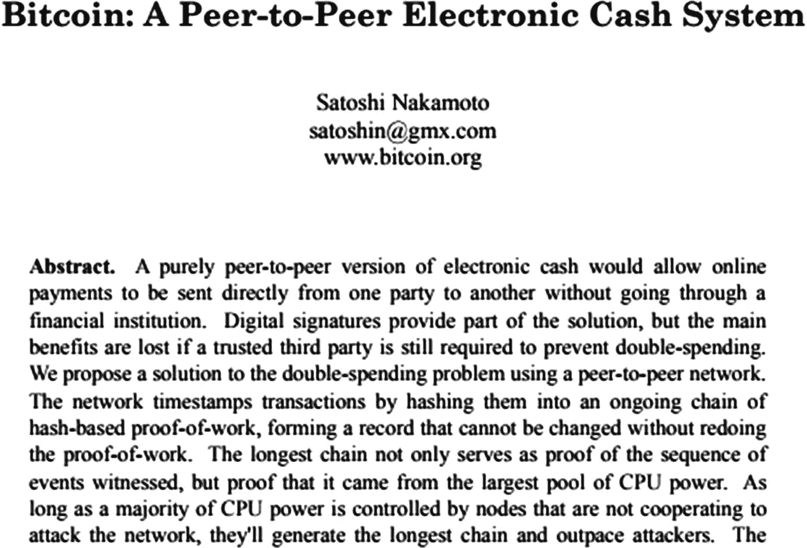
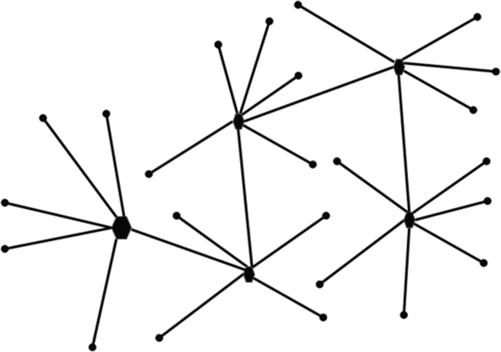
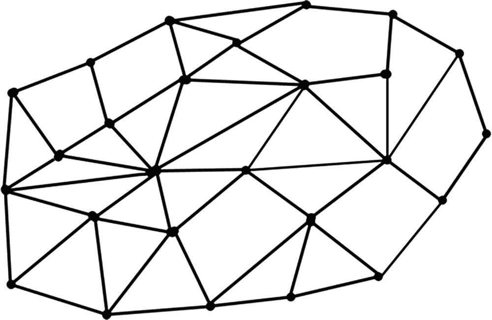
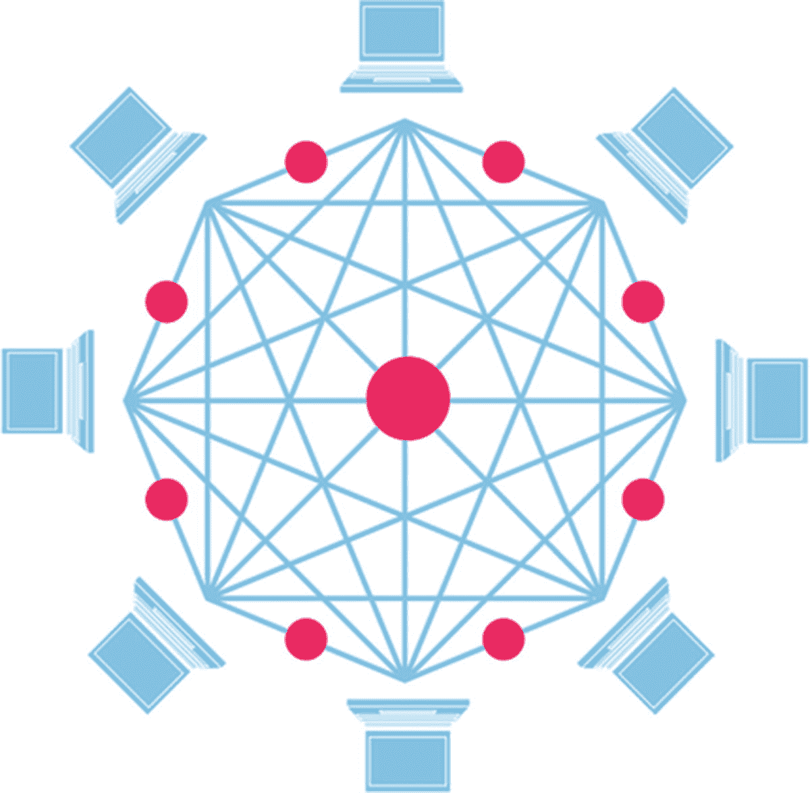
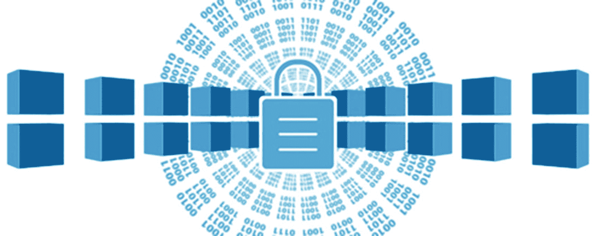

© Nishith Pathak 和 Anurag Bhandari 2018 Nishith Pathak 和 Anurag Bhandari

# 7. 理解区块链

尼希思·帕塔克（Nishith Pathak）^(1 ) 和 阿努拉格·班达里（Anurag Bhandari）²(1)印度，帕乌里·加尔瓦尔县，科特瓦拉(2)印度旁遮普邦，贾兰达尔，在过去的十年里，我们见证了各种计算机技术的出现，每一种技术都具有颠覆性和革命性。其中一些技术为新一代技术铺平了道路，使我们的生活更加便利。其中一些技术属于发明范畴，因为它们改变和颠覆了整个生态系统。有一股巨大的浪潮产生了许多新的亿万富翁。2009 年仅售 2 美分的东西现在超过 15,000 美元。是的，我们正在谈论比特币和区块链。区块链是比特币背后的技术。加密货币，特别是比特币，无疑将世界分为两个区域——支持加密货币的人和反对加密货币的人。加密货币的使用如此疯狂，以至于市场上有大约 1400 多种像比特币这样的加密货币，拥有超过 17+百万的账户。人们对比特币的未来提出了质疑。一些国家不允许在其经济中使用加密货币，但几乎所有国家都对区块链提供了巨大支持。比特币只是区块链的最佳实现之一，但区块链无疑会留存下来，并且目前正在改变我们在工作和商业中的信任方式。直到这一点，我们一直认为中间人的角色是重要的。他们是我们日常生活核心生态系统的一部分。我们所做的一切，例如购买蔬菜或购买房屋，获得保险赔偿，签订合同，甚至为即将到来的假期预订酒店目的地，都包括中间人。除了带来一些优势外，它还带来了一些缺点，如成本、缺乏透明度和佣金比例。如果有一种技术可以减少所有中间人，那不是很好吗？这对生产者和消费者都有好处吗？是的，这种技术已经出现了，它被称为区块链。比特币的崛起和加密货币是可能的，这要归功于背后的技术，我们称之为区块链。区块链和比特币是如此密切相关，以至于很多时候人们将这些术语互换使用。在我们进一步深入和详细了解之前，让我们先了解一下区块链不是比特币。在本章中，您将学到：

+   交换媒介的历史

+   比特币的需求和出现

+   区块链是什么

+   区块链与比特币的区别

+   区块链的特点

+   各种类型的区块链

区块链将改变我们信任的方式。了解创造像区块链这样的技术的核心原因对你至关重要。因此，了解加密货币背后的历史很重要，因为这将帮助你理解创造像区块链这样的技术的基础。

## 加密货币的历史

自人类进化以来，存在着各种类型的交换方式，每一种都有其利弊。早在公元前 6,000 年，一切始于以物易物的系统。以物易物系统是关于交换服务和商品的。这绝对是一个好系统——一个人需要生产或提供自己擅长的服务，然后用这些来交换他/她需要的商品。以物易物系统成功地延续了几个世纪，但存在一些根本性缺陷，包括缺乏交换的共同价值单位。这导致了不同商品交换的不同估值。例如，用几个苹果换取一升牛奶可能很好，但相同的一升牛奶可能无法换取大米。这需要一个新的估值，这个估值可能或可能不被涉及的所有方接受。除此之外，一些商品具有易腐的特性，而另一些商品又大而重，使得它们不适合运输。以物易物系统的另一个缺陷是所有权的证明。没有办法将商品与一个人联系起来。这些缺陷导致了黄金币时代的出现。

### 黄金时代

黄金币的时代始于公元前约 650 年。使用硬币解决了以物易物系统的一些基本和根本性问题。例如，黄金硬币作为一个共同的价值单位。现在一定数量的商品可以用一个黄金硬币交换。黄金还具有不易腐烂和易于运输的特性。然而，黄金硬币也有几个缺点，主要是昂贵和不安全。任何人都可以轻易偷走黄金硬币。此外，开采黄金也并非易事。所有这些问题导致了纸币，即法定货币的出现。

### FIAT Currency

纸币时代始于公元 960 年左右。在纸币初期，人们将金币存入第三方金融公司。其中一些金融方如今被称为银行。这些第三方以 IOU 票据的形式取代金币，这些票据被视为标准货币。这些 IOU 票据也被称为第一种法定货币形式。提示：法定货币是由政府法规和机构支持的标准货币。像美元、日元、卢比、欧元、英镑等都是当前的法定货币。我们将在本章后面用到法定货币术语。持有这些 IOU 票据的人可以用它们来换取商品。使用纸币有许多优点。它比金重，容易开采。最初是以有形商品如金作为支撑，后来是以发行这些票据的无形商品如银行和政府为支撑。支持各种货币的政府机构都有标准的汇率接受度。法定货币一直以某种形式在全球范围内使用，如图 7-1 所示。图 7-1 目前使用的一些法定货币尽管纸币目前仍然成功并被广泛使用，但它也有其缺陷。法定货币不安全、通货膨胀且无法追踪。你无法将纸币与某人联系起来。任何人都可以偷取你的货币并再次使用。支持货币的政府机构无法知道谁拥有货币。一旦货币进入市场，就绝对无法追踪。这可能导致市场上出现大量通货膨胀，引发经济问题，如黑钱囤积和平行经济。一些国家还通过废钞行动用新的货币替换流通中的货币，以阻止平行经济的产生。

### 使用支票

随着所有这些问题的出现，政府机构在市场上引入了另一种交易媒介，即支票。第一张支票创造于公元 1717 年。支票解决了货币方面的一些问题，并与现有的加密货币有相当多的相似之处。首先，它们解决了安全问题。支票包含了发件人和收件人的身份信息。支票还使用了一种非常基本的密码学形式（即签名）来验证实际发件人，如图 7-2 所示。每张支票的价值可以与其他任何支票不同，这意味着两张支票的金额可以不同。支票成功解决了以前媒介交换中的一些重要问题。图 7-2 支票簿中的一张样本支票，用户正在填写接收者信息然而，支票也有一些问题，尤其是交易验证时间。考虑一个正常情况，当买方需要商品时，他发出一张支票代替获得这些商品。买方获得商品，但卖方现在必须在卖方银行与买方银行交谈并获得债务清算时验证支票的真实性。目前，支票清算需要 1-4 个工作日。支票可能是伪造的，而在实际情况下，卖方现在需要追查买方。支票也有一种非常基本的密码学版本，通过签名，但这很容易被伪造。

### 电子钱包的承诺

针对 FIAT 货币和支票存在的诸多缺陷，迫切需要创建一种新的交换媒介，基于此引入了电子钱包。电子钱包几乎是一种完美的交换媒介。不再需要纸币，也不需要随身携带钱包。它快速、方便、高效，交易验证在几秒钟内完成。这解决了支票存在的最大问题。它可以轻松安装并从任何设备上访问，包括移动设备。通过使用各种移动生物识别和虹膜安全措施，验证交易可以达到最高的安全级别，相比在支票上使用签名要安全得多。由于没有涉及纸币，监管机构可以轻松跟踪交易并跟踪资金使用和供应情况。这从而减少了非法资金使用和黑钱囤积。

## 金融危机破坏了信任

-   在高层面上，电子钱包看起来非常有前途，没有任何缺陷，并且解决了所有关于中介交换的问题。电子钱包最大的问题在于它仍然与现有的金融结构相联系。现在如果你还记得 2008 年的金融危机，你会知道金融系统可能存在相当大程度的腐败。2008 年的金融危机被认为是自 1929 年以来最严重的衰退。次贷危机导致了金融市场的崩溃。2008 年的全球金融危机产生了许多后果。金融公司倒闭，一些政府濒临破产。大型投资银行破产，政府开始救助它们认为“太大而不能倒”的银行。银行当然受到了最大的影响，因为危机的根源最终就是在银行。这些金融危机使人们对现有的金融体系失去了信心。人们曾经觉得银行是保护他们辛苦赚来的钱最安全的选择。人们开始大规模地从银行提款。那时他们有两个选择。要么把所有的钱留在家里，这不是一个好主意，要么把它存在银行里，但他们不再信任银行了。需要一个替代的金融体系。此外，如果你看看当前的金融交易，其中一些要在两个不同国家的当事人之间进行转账可能需要几天的时间。另一个问题是不公平的汇率，缺乏透明度，因此缺乏信任。

### -   幸运中的祸福：比特币

当所有这些问题发生时，一群人（或一个人）以**中本聪**的名义发表了一篇题为“比特币：一种点对点的电子现金系统”的论文，如图 7-3 所示。它挑战了货币的概念以及需要中介来处理货币的观念。在这篇论文中，中本聪提出了一个由区块链组成的系统，后来被称为区块链。在这篇论文中，中本聪创造了比特币这个术语，作为一个由分布式去中心化网络支持的点对点电子现金系统。图 7-3 中本聪论文的快照，通过它，比特币和区块链出现了比特币的理念是点对点的，不需要第三方基于信任的中介。比特币系统包括以下内容：

+   通过使用点对点网络解决双重支付问题。

+   确保参与者的身份可以被隐藏，并且可以匿名。

+   不需要信任的第三方。事实上，你不需要信任任何人，只需要信任这个系统。

+   通过哈希加密工作证明可以生成加密货币的新币。

提示尽管我们尝试为您提供了对 Nakamoto 论文的良好概述，但我们仍建议您花些时间阅读 Nakamoto 撰写的实际论文。这篇论文大约有九页长，可在[`bitcoin.org/bitcoin.pdf`](https://bitcoin.org/bitcoin.pdf)获取。密码学的进步以及 Nakamoto 论文中提到的工作证明等一些巧妙解决方案的出现，为创建一种新型数字货币打开了大门。这篇论文的发布标志着加密货币时代的开始。如图 7-4 所示，比特币是最流行且最古老的加密货币之一。图 7-4 实际的比特币货币，这是比特币的另一种形式。谢谢你，中本聪！比特币等数字货币现在已成为对银行主导地位的真正替代品。在撰写本书时，市场上大约有 1400 多种加密货币，比特币是最古老的一种。

## 什么是比特币？

比特币的定义可以用一句话概括如下：这个定义中加粗的每个词都非常重要。我们将详细讨论每一个词，但现在只需要明白比特币是一种数字货币，因此没有实体形式。与其他数字货币不同，它有自己的价值，并且对应其他货币的面额。关于比特币是不可信且匿名的讨论很多。这是不正确的。事实上，信任是导致比特币等加密货币出现的主要问题。比特币和其他加密货币所做的就是确保信任从中心化转移到去中心化系统。即使比特币在本质上是一种法定货币，这意味着它不是以有形价值，而是以无形价值，即信任作为支撑。它之所以有价值，只是因为群体中的一员相信它有价值，并且比特币应该用来交换货物，就像任何货币一样。唯一的区别是正常货币的信任来自政府支持。在这里，它来自人民。比特币作为去中心化的货币，在本质上非常安全。比特币系统无法伪造。该系统可以全面透明地信任。事实上，比特币中的身份是隐藏的，并且每个身份都是通过使用哈希加密而不是名称来引用的字母数字代码。区块链是比特币背后的基础技术。比特币只是使用区块链创建的一个应用程序。在深入研究区块链之前，了解中心化、去中心化和分布式系统之间的区别非常重要。

### 中心化系统

中央集权系统，如图 7-5 所示，是具有单一权威点（POA）的系统。所有控制都集中在这个权威点，这确保了所有流程和决策都在此地执行。中央集权系统有几个优点。由于只有一个权威点，决策可以更快、更容易地实施。权威点中的每一个都负责一个任务。这可以防止任何单一任务被多个点执行，确保没有重复性，使变更管理更快。一些中央集权系统的例子包括银行、机动车管理部门、信用机构、产权公司和服务器 CPU，等等。图 7-5 中央集权系统的图示表示，一个节点控制其他节点中央集权系统引入了许多优点，因此即使在现在仍然很受欢迎。但是，中央集权系统也有很多缺点。单一 POA 带来了单一故障点的概念。这意味着如果由于任何原因这个点宕机，整个系统将崩溃。我们在 2008 年的金融危机期间目睹了这种失败。这些系统的另一个缺点是，中央集权系统缺乏透明度，容易受到欺诈和不信任的影响。中央集权系统像一个黑匣子一样运作，使用中央集权系统的人可能会受到欺诈和信任损失的影响。中央集权系统有很多优点，更适合能够接受单一信任点、需要快速增长，当然，不需要在规模上增长的系统。

### 分布式系统

去中心化系统具有多个权威点，如图 7-6 所示，确保没有单一故障点，权力任务更加多样化。与集中化系统不同，去中心化系统还确保扁平的层次结构。你可以将去中心化系统看作包含许多节点，少数节点具有额外的权力任务，并将该权力广播给其他几个节点。图 7-6 经典去中心化系统的图示去中心化系统在您想要在靠近消费者而不是在一个中央位置做出决策时是有利的。一些经典的去中心化系统示例包括云数据库和国家机构，仅举几例。去中心化系统的一个缺点是，由于存在多个权威点，重复任务的可能性较高，这可能影响规模经济。去中心化系统比集中化系统更安全，但仍不是 100%安全。

### 分布式系统

分布式系统是第三类每个人都是权威的系统。每个节点具有相等的权力。这是三种系统中最安全的系统。这并不意味着系统不能被黑客攻击或伪造，但要这样做，你必须对权威点有 50%以上的控制。伪造和黑客所需的时间将抵消任何好处，因此分布式系统被认为是最安全的系统。请参见图 7-7。图 7-7 分布式系统的图示表示，其中所有节点具有相等的权力分布式系统确保了一个平坦的层次结构，这确保了每个人都是平等的。拥有分布式系统有很多优点。由于所有节点都是平等的，它消除了中间人的需求。更改在所有节点上复制并由至少 50%的节点验证，使其非常透明。分布式系统是需要第三方信任、中介或甚至信任另一个节点的系统的完美选择。在使用分布式系统时，你不需要信任任何人，只需要信任系统本身。一些分布式系统的示例包括加密货币和当然，区块链。以去中心化和去中介为核心的比特币系统和区块链不需要人们相互信任，只需要系统。然而，分布式系统需要一些时间来设置，并且需要良好的初始投资。在所有三种系统中，分布式系统是最稳定的。使用分布式系统的另一个好处是它们具有无限的可扩展性，因此任何涉及大规模可扩展性问题的过程都可以安全地选择使用分布式系统。

## 什么是区块链？

我们所了解的比特币一切都源自其背后的区块链实现。我们还了解到区块链是比特币背后的基础技术。事实上，区块链的范围远比仅仅作为比特币技术的底层要广泛，如图 7-8 所示。事实上，区块链是许多未来技术和系统的母体。我们只是看到了区块链的一个实现，即比特币，但更多应用区块链技术的系统即将在各个垂直领域引起巨大变革。图 7-8 区块链远比比特币更大，而比特币只是区块链的一个实现要想了解区块链的威力，让我们从另一个角度来看待它。信任是不可避免的，也是我们日常生活的一部分。我们所做的每件事都涉及某种信任感。无论您是购买汽车还是房屋，进行任何财务交易，浏览网站，在线购买产品还是从市场购买产品，甚至是从大学获得学位，账簿在某种形式上都是信任的基本来源。以财务交易为例。全球每年发生数百万亿的交易。在历史上，我们维护账簿，如图 7-9 所示，来处理和存储有关交易的信息。图 7-9 一个经典账簿这些账簿要么被放在保险柜里以保证安全，要么被交给第三方，如银行、大学或其他可信赖的第三方。在过去的几十年里，我们看到一些这些账簿被移到了集中式数据库中。使用这些账簿的好处之一是它们在需要时易于访问。例如，如果您想获得 10 年前的交易报表副本，只需点击您的银行网站即可。同样，如果您丢失了学位，您也可以随时从大学获得您的学历副本，因为大学会安全地存储您的记录。这种可用性的好处也使其容易出现错误，使其变假，甚至易于修改。我们已经讨论过与集中式系统相关的问题。

+   想想你在银行里保存的交易记录。如果有人能够访问中央数据库，一个人就可以修改和黑客记录。这样的黑客事件已经发生在许多银行，客户受到了损失。

+   再来考虑一下你去购买房产的情况。你将如何对房产进行评估，并确保它属于你购买的那个人？房产信息很容易被篡改，导致你支付超出其价值的费用。

+   再来考虑一个使用情况，即辨别有机蔬菜和非有机蔬菜。仅仅信任那些标签会很困难，因为它们很容易被盖章。

+   再来考虑一下租一辆车几年的情况。您如何确保该车已投保，并符合该国的驾驶规定？

+   再来考虑一下从亚马逊等网站购买产品并依赖它们的情况，它们会按照你在网站上选择的产品交付真品。

+   在发送电子邮件时，您也在信任电子邮件交换提供商，在社交网站上执行社交任务时也是如此。

这些示例是人们拥有更高信任级别的情况。此外，由于数字技术的发展，我们在共享数据时创建了该数据的副本。例如，当你的同事要求你通过电子邮件发送重要的电子表格时，你会通过电子邮件向他发送电子表格的副本。这导致了重要表格的多个副本。我们不断地创建相同数据的多个副本，从而形成了不同的所有者。相信其中一份副本是原始的是一个巨大的挑战，因为拥有权的任何人都有机会修改任何单元格，然后声称它是原始的。信任的理念在物联网时代变得更加重要。正如我们在前面章节中所看到的，越来越多的设备连接并发出数据。确保来自这些设备的数据可信是很重要的。对于所有这些用例以及许多其他用例，您可以确定当前系统要么被困在大量的文书工作中，创建多个副本，存储在某个第三方值得信赖的中央托管源中，无论是硬拷贝还是软拷贝。这些分类帐可以很容易地被修改甚至伪造。区块链是一项革命性的颠覆性技术，如图 7-10 所示，它将改变我们在工作和业务中的信任方式。区块链正在改变我们维护分类帐的方式。图 7-10 区块链正在不断发展，改变我们的信任方式，并将其应用于各个垂直领域。区块链作为分类帐带来了许多独特的特性，解决了其前身的所有问题。考虑这些特性：

+   区块链是分布式和去中心化的。如图 7-11 所示，加入区块链网络的每台计算机立即获得了区块链的副本。然后这些计算机节点被用来验证和转发交易。图 7-11 加入区块链网络的所有计算机节点具有相等的写入权限，并在加入网络时立即获得了区块链软件的副本

+   如图 7-12 所示，区块链的性质是不可变的。这意味着区块链交易无法被编辑或删除。如果要修改或撤消交易，必须提出新的交易，这些交易经过相同的批准过程。只有在大多数节点批准时才会被接受。图 7-12 区块链网络非常安全且不可变

+   区块链在性质上是完全安全的，因为它使用哈希加密来处理身份。

+   每个添加到区块链账本的记录都有一个与之关联的唯一键。

+   每个添加的记录都是由添加该记录的一方信任和标记的。

+   当写入下一个记录时，从第一个记录开始，包括第二个记录的键和内容都放入公式中，生成第二个记录的键。

以一句话概括，区块链是一个不可变的分布式分类帐，可用于记录一切有价值的事物。这一说法为区块链的使用提供了真实的见证。到目前为止，大多数区块链的使用都与金融交易有关，但最终，区块链可以用于记录和管理任何有价值的东西。区块链技术提供了令人难以置信的自动跟踪功能，通过创建数据和交易的永久记录，这些记录得到了信任。因此，它为所有利益相关者带来了单一真相来源和没有单一故障点的优势，因为与数据和交易相关的所有内容都始终可在网络上看到。

## 什么是区块？

区块是一个包含一组确认交易的单元。如果区块链是一个分类帐，可以将一个区块视为一页或一本书。如图 7-13 所示，每个区块由包含诸如上一个区块哈希引用、生成区块的时间戳等信息的标头组成，以及正文。区块的正文包含接受的交易列表。标头被加密哈希以生成新的区块。由于这个实现，每个交易都与新区块相关联。标头还包含上一个区块的地址，因此链变得不可腐败。随着越来越多的交易发生，区块链交易仅进行附加并创建一个按时间顺序增长的事务数据的时间戳数据库，如图 7-14 所示。因此，它创建了一个链块，因此得名区块链。

## 区块链的好处

区块链通过以新颖的方式存储和组织数据带来了许多好处。各个行业垂直领域一直在研究和探索使用区块链的独特方式。正如本章前面提到的，区块链可以为任何具有价值的事物组织数据。您还可以在需要信任他人的所有场景中使用区块链。以下是使用区块链的一些好处：

+   提高系统的效率。

+   公共区块链上的所有更改都可以被所有各方公开查看，从而创建透明的系统。

+   确保交易具有不可变性，这意味着交易无法被更改或删除。为了修改现有交易，需要提出新的交易。

+   区块链交易全天候处理，并且还可以将交易时间缩短到几分钟。

+   通过使用信任保证算法，提供了一种安全的方式来避免网络安全和欺诈风险。

+   通过消除第三方中介和开销，区块链有望大幅降低交易费用。

+   提供使用中心化系统的替代信任选项。

+   提供身份识别和验证的方式。

如果你稍微想一想，你可能会同意区块链是一种无需信任机构就能存储和组织数据的好方法。

### 智能合约

智能合约是自执行的合约。它们也被称为数字合约。智能合约并不是一个新概念。事实上，二十年前，计算机科学家尼克·萨波在设计和实现基于去中心化的系统时提出并强调了智能合约的必要性。智能合约可以被视为帮助在数字化执行合约的计算机程序。与任何其他合约不同，智能合约不仅仅定义了协议和协议周围的后果，而且强制执行它们。通过使用智能合约，计算机可以在某些要求得到满足时采取行动。用简单的术语来说，智能合约是各种 if-else 语句的集合。以一个押注场景为例。如果皇家马德里赢得了西甲联赛，尼希斯将得到钱；否则，他将付出代价。在大多数情况下，您可能不信任押注的另一方。在这些情况下，自执行合约为押注方带来了很多信任。智能合约还带来了修订、执行或甚至提出合约的选择，从而确保最高级别的可追溯性和信任。以保险索赔为例。目前，所有保险公司都使用繁琐的纸张工作、复杂的执行、行政成本等手动流程。使用智能合约执行这些索赔确实会有利于确保无忧索赔流程、降低行政成本并确保最高级别的透明度。再举一个支付案例，您只有在承包商满足您的要求时才支付给他们。智能合约和区块链可以用来消除合同管理流程中存在的许多低效。

## 以太坊

2013 年，各种博主和区块链爱好者通过比特币探讨了使用案例。其中一位名叫维塔利克·布特林（Vitalik Buterin）的博主发现了比特币的一些局限性。比特币不允许你创建自己的智能合约，甚至自己的货币。在本章前面，我们讨论了智能合约的重要性和影响力。维塔利克向比特币团队提出了一些建议，比如让比特币能够建立自己的货币或智能合约，而无需建立整个区块链。此外，维塔利克坚持认为比特币系统需要一个脚本语言，以便用于应用程序开发和更广泛的用途。由于比特币实现的区块链更具公开性，基于共享分布式账本，因此比特币团队无法实现这一建议，并拒绝了。维塔利克撰写了一份解释以太坊的白皮书，并获得了大量资金，通过这些资金他建立了以太坊，如图 7-15 所示。图 7-15 以太币以太坊是一个共享计算平台，使人们能够构建智能合约和加密货币，而无需人们建立自己的区块链。此外，它还有自己的图灵完备编程语言，允许开发人员创建定制应用程序。以太坊在区块链实施方面是一个改变游戏规则的技术，因为它使每个人都能够采用区块链技术。

### 区块链的类型

最初使用区块链的概念主要是作为一种公开、透明、去中介的方式来存储加密货币。加密货币的初期成功及其使用推动了跨行业垂直领域确保并有效利用区块链。这导致了原始区块链实现的不同变体。在高层次上，跨行业的区块链实现可以分为三种不同的模型，其在访问控制和网络类型上存在差异。这意味着每个模型在谁可以成为区块链网络的一部分（公开的、按需的等等）、谁可以执行共识协议以及谁可以访问区块链记录方面都是不同的：

+   公开区块链：区块链最初被命名的原始形式。来自公众的任何人都可以加入网络，在共识协议下写入数据并阅读它。这种区块链类型的优势在于完全去中心化、透明和匿名。这些类型的公开区块链可适用于各种加密货币，包括比特币、以太坊、莱特币等。

+   私人区块链：也称为内部区块链，这种区块链实现类型是为私有网络设计的，并由一个组织管理。这个组织负责制定加入网络和读取数据的规则。一些受信任的节点获得更高的特权，以提供对交易的接受。这种区块链实现类型成本较低、速度更快、保密性更强，并且只允许经过身份验证的各方参与网络。一些例子包括卡德纳链、Iroha 以及组织内部为其流程实施的区块链。

+   Hybrid Blockchain（混合区块链）: Hybrid Blockchain is a combination of public and private Blockchain so it is a partly private, permissioned Blockchain. These types of Blockchain implementations are owned by a group of companies, forming a consortium. Such a Blockchain is efficiently used for working in a shared platform. These Blockchains only allow specific parties or nodes to be part of the Blockchain, participating in the transaction. Some of the examples include R3 Corda, Multichain, etc.

## Recap（总结）

In this chapter, you learned about the history of various exchange mediums and the need of cryptocurrency. You also got a good understanding of how Bitcoin is different from Blockchain. Later in the chapter, you learned about the various types of systems (centralized, decentralized, and distributed) and learned why distributed systems are the most secure ones. The latter part of the chapter introduced you to the need for smart contracts and Ethereum. At the end of the chapter, you learned about various types of Blockchain implementation currently available. In the next chapter, we start working on the development of Blockchain and applying it to the hospital use case.
