© 2018 年 Nishith Pathak 和 Anurag BhandariNishith Pathak 和 Anurag Bhandari 为 .NET 提供的物联网（IoT）、人工智能（AI）和区块链（Blockchain）`doi.org/10.1007/978-1-4842-3709-0_8`

# 8. 实现区块链即服务

尼希思·帕塔克^(1 )和阿努拉格·班德里²（1）印度帕里·加尔瓦尔县科特瓦拉（2）印度旁遮普邦贾兰达尔在上一章中，您了解了区块链的出现以及构建区块链的核心原因，特别是比特币。多年来，各个行业垂直领域开始使用区块链技术来建立非支付系统。正如我们在前一章中提到的，区块链改变了我们信任的方式。在撰写本书时，各个行业跨垂直领域都在利用区块链的力量改变其个别业务案例。每天都有新的用例涌现出来，说明了区块链技术如何改变特定行业。毫无疑问，区块链将以人们可以想象到的非常巨大的方式颠覆每个行业，并将成为下一次工业革命的源泉。利用诸如区块链之类的技术的核心障碍之一是具备支持其的必要基础设施。设置初始区块链需要在基础设施方面进行巨大的投资。除了设置自己的封闭虚拟私有网络外，还涉及一些服务器用于执行交易，另一些服务器用于进行挖矿，始终可用，并在需要时添加更多的交易和挖矿节点。设置此环境不仅耗时，复杂且昂贵。大多数非技术和中小型技术公司可能会发现很难创建自己的基础设施。这种基础设施问题与导致云基础设施出现的基础设施问题非常相似。这导致了新技术基础设施的爆发，通常称为基础设施即服务（IaaS）。各种区块链先驱公司也感到有必要在云中提供区块链基础设施，以便他们可以专注于开发而不必担心基础设施。这些公司设置的环境被称为区块链即服务（BaaS）。提供 BaaS 的公司称为 BaaS 提供商，使用它们的公司和人员称为 BaaS 消费者。作为 BaaS 消费者，您最好按照按使用量付费的方式支付 BaaS 基础设施费用。 BaaS 的出现为区块链技术的快速采用铺平了道路。提示在撰写本书时，每个行业领导者都创建了自己的 BaaS 产品。这引发了对仅依赖一个中心化第三方的思考。在未来，我们期望公司将就 BaaS 展开合作，并拥有更加分散的 BaaS 产品。微软提供一系列 BaaS 产品，包括 R3 corda、hyperledger fabric、以太坊等，所有这些产品都位于微软 Azure 上。根据您的业务用例，您可以选择 Azure 区块链预定义模板之一来开始使用。与所有其他微软 Azure 产品和服务一样，每个区块链实施的 BaaS 产品都有免费和付费层。在本章的结尾，您将理解

+   企业以太坊联盟

+   以太坊行话

+   学会如何在 Azure 中建立区块链领袖联盟

+   如何在区块链内转移以太币

+   如何构建、测试和部署智能合约

## 企业以太坊联盟

以太坊于 2015 年启动，逐渐在全球范围内被采用。2017 年，行业领袖和学术巨头意识到支持以太坊的合作的必要性，因此成立了企业以太坊联盟（EEA）。EEA 是一个非营利合作组织，支持全球财富 500 强公司和学术界，如图 8-1 所示。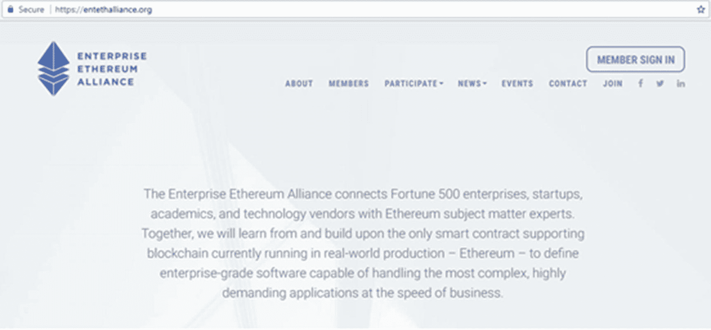图 8-1 企业以太坊联盟的主页。如果您还没有访问过 EEA，我们建议您访问该页面并查看支持以太坊的成员公司列表。

### 理解以太坊行话

在我们了解以太坊术语之前，重要的是要知道为什么以太坊如此受欢迎并在企业层面深入扎根。其中有多个原因，但主要是因为以太坊是开源的，并且更适合创建私有区块链。与比特币相比，以太坊可以更快地执行交易。在撰写本书时，以太坊社区的支持迅速增加，因此开发人员得到了大量的社区支持和帮助，这有助于加快开发。让我们快速了解一下以太坊社区中广泛使用的术语。

#### 以太坊虚拟机（EVM）

以太坊网络由各种计算机或大型分散计算机组成，统称为以太坊虚拟机（EVM）。

#### 以太坊节点

所有实施以太坊协议的节点都被称为以太坊节点。这些节点具有完整的区块链安装。节点不仅连接到其他节点，还可以访问区块链。一些节点还可以用于额外的任务，例如挖矿等。随着新交易的添加，它立即被复制到这些节点。

#### 联合体

联合体指的是以太坊中的一个组。该组包括使用相同基础设施的区块链的所有联合体成员。当您在组织内或跨组织使用区块链来建立自己的私有区块链时，您正在建立一个具有称为联合体负责人的领导者的联合体。联合体的其他节点称为联合体节点。

#### 联合体负责人

就像任何团队领导一样，在建立以太坊联合体时，首要任务是确定联合体负责人，如图 8-2 所示。联合体负责人负责以下工作：

+   设立和配置私有区块链

+   制定加入私有网络的标准

+   制定以太分配标准等

图 8-2 以太坊中负责人的层次结构及其成员。联合体负责人领导着私有区块链，所有其他联合体成员都遵循联合体负责人设定的规则和标准。一旦联合体负责人成立，其他成员可以使用自己的基础设施加入，或者使用现有的基础设施。Asclepius（我们虚构的医院）正在使用区块链来跟踪分布式分类账的许多工作。它还与其他医院和分支机构合作。Asclepius 的主要分支机构正在担任联合体负责人的角色。

#### 以太

以太币是以太坊交易中使用的货币。除了以太币之外，还有许多其他加密货币可以在以太坊中使用，如图 8-3 所示。图 8-3 以太币转换为其他以太坊使用的加密货币。图片来源 [`forum.ethereum.org/discussion/1518/ether-unit-converter-wei-finney-szabo-btc`](https://forum.ethereum.org/discussion/1518/ether-unit-converter-wei-finney-szabo-btc)以太币可以用作支付机制，甚至用于验证用户身份。

#### Gas

每个以太坊虚拟机节点都需要大量的处理能力来执行代码。在区块链上工作时，了解执行特定代码所需的计算工作量至关重要，这在区块链世界中被称为 Gas。一旦以太坊虚拟机节点具有足够的 gas 来运行代码，它随后会获得额外的以太币等奖励以证明工作的有效性。现在让我们看看如何使用 Azure 设置以太坊。

### 设置以太坊

设置以太坊网络的方法有很多种。一种方法是自己设置整个基础设施。一种更简单的方法是使用 Azure 提供的 BaaS（区块链即服务）来在几分钟内快速设置以太坊。Azure 提供了各种模板来创建区块链服务。所有这些模板都有默认模板，并提供自定义每一个的选项。默认的 Azure 模板会进行大部分的抽象化，并且应该是你首选的模板。默认模板确保交易节点和挖矿节点是 VPN 的一部分，并且彼此隔离，除了创建创世区块之外。创世区块就像是一个空的分布式账本或者一个没有数据的分布式账本。一旦创建了创世区块，就可以在其上编写交易。对于安全方面来说，挖矿节点不应该在私有网络之外可访问。幸运的是，使用默认的 Azure 模板，这一切都会自动完成。让我们快速使用一个区块链 Azure 模板来创建一个联盟领导者。同样的步骤也可以用来创建其他区块链 Azure 服务。

#### 从 Azure 门户创建区块链联盟领导者

打开并导航到 [`portal.azure.com/`](https://portal.azure.com/)。登录后，点击创建资源，然后在搜索框中输入 Ethereum 以获取所有与以太坊相关的模板，如图 8-4 所示。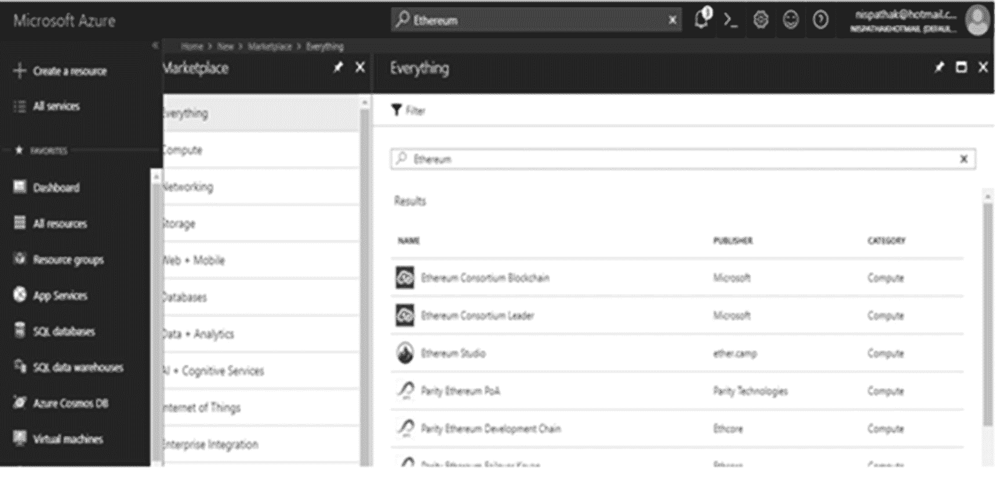图 8-4 Azure 门户中与以太坊相关的模板。Microsoft 正在开发新的模板。随着你阅读本书，会有更多与以太坊相关的模板。选择以太坊联盟领导者。使用相同的部署模型，点击创建以启动以太坊联盟领导者向导界面，如图 8-5 所示。

1.  1.指定资源前缀以与另一个模板区分。为了方便起见，我们将使用 eth。您可以使用您自己选择的前缀。

1.  2.为了登录到各个节点，需要一个用户名。为方便起见，我们使用默认用户名 gethadmin。对于密码，您可以选择使用 SSH 公钥或密码。对于演示，我们暂时使用密码，但您可以选择 SSH 公钥。密码应至少包含一个大写字母、一个小写字母、一个数字和一个特殊字符。

1.  3.选择分配的订阅。如果您还没有购买付费订阅，则可以选择免费试用选项。如果您打算在生产中使用它，最好使用付费订阅而不是免费试用。

1.  4.创建一个新的资源组，以确保未来权限和策略一致。

1.  5.将位置设置为您喜欢的位置。通常，人们更喜欢接近实际实施的位置。填写表单后，您将看到图 8-5 所示的屏幕。

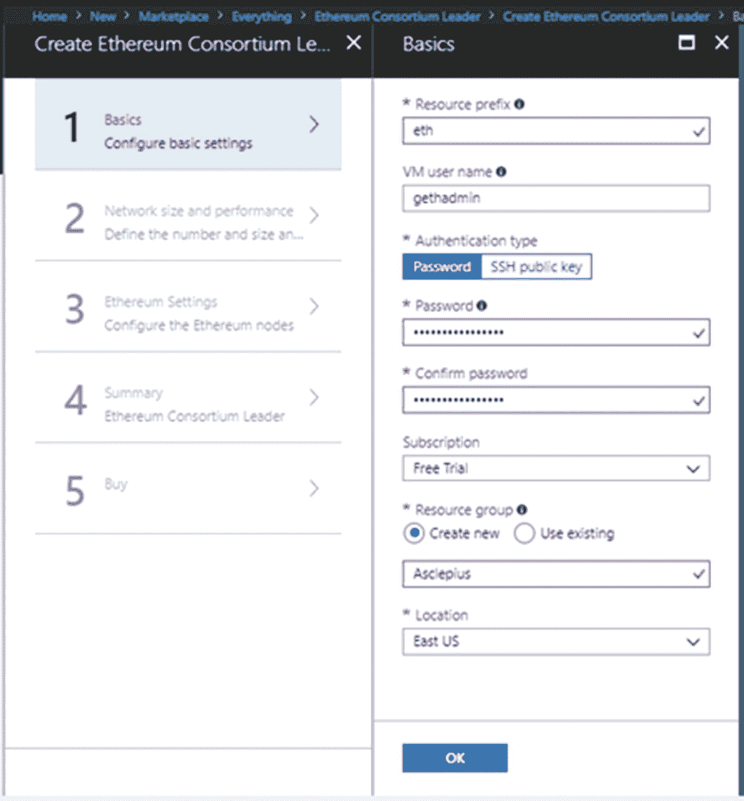图 8-5 以太坊联盟领导者向导界面的第一个屏幕。点击“确定”以导航并指定交易和挖矿节点的网络大小和性能，如图 8-6 所示。

1.  1.每个联盟成员都有一个单独的 ID。由于我们正在创建联盟领导者，所以暂时将其设置为 0。稍后还可以添加其他节点。

1.  2.指定每个成员的挖矿节点。此值应根据您的可用性要求设置。最多可设置 15 个。目前，我们使用默认值 2。稍后可以更改。

1.  3.选择标准或高级的挖矿节点存储。Azure 提供各种节点存储选项来创建挖矿节点存储。标准使用普通磁盘驱动器，而高级使用固态驱动器。如果需要更高的 IO，使用高级选项。默认情况下，设置了 2x 标准 D1 v2 的虚拟机大小。如果需要更高的大小，可以点击挖矿虚拟机大小旁边的 > 符号进行更改。

1.  4.在设置存储节点时，您可以在本地或全局设置冗余。

1.  5.应用交易节点的默认设置。

图 8-6 以太坊联盟领导向导中的网络大小和性能设置单击“确定”并导航至以太坊账户设置，如图 8-7 所示。

1.  1.网络 ID 是标识以太坊账户的唯一 ID。此 ID 最终用于配对节点。所有具有相同 ID 的节点都可以彼此配对。您可以使用默认的以太坊网络 ID，也可以指定自定义的网络 ID。

1.  2.指定是否要让门户自动创建新的创世区块，还是要自定义它。目前，让 Azure 为您创建一个创世区块。

1.  3.指定为默认账户创建的密码。

1.  4.指定密码短语，如图 8-7 所示。

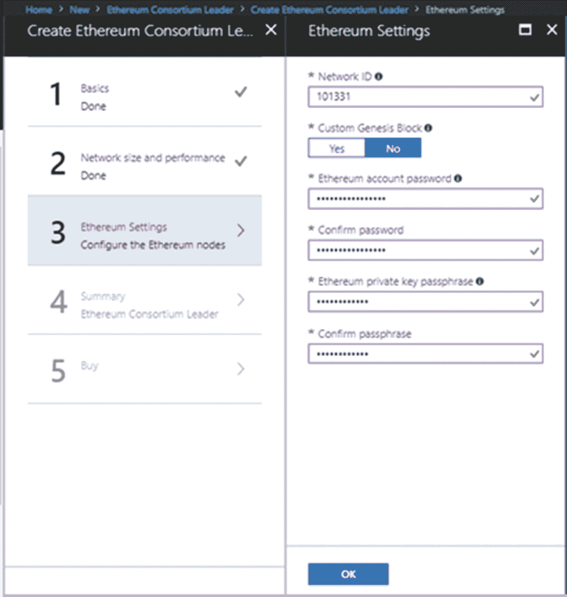图 8-7 配置与以太坊相关的设置点击“确定”并审查摘要以双重验证您的选项。如果一切看起来都很好，请点击“确定”，如图 8-8 所示。图 8-8 配置以太坊联盟网络所做的所有设置摘要阅读权限，检查使用条款，并点击“创建”，如图 8-9 所示。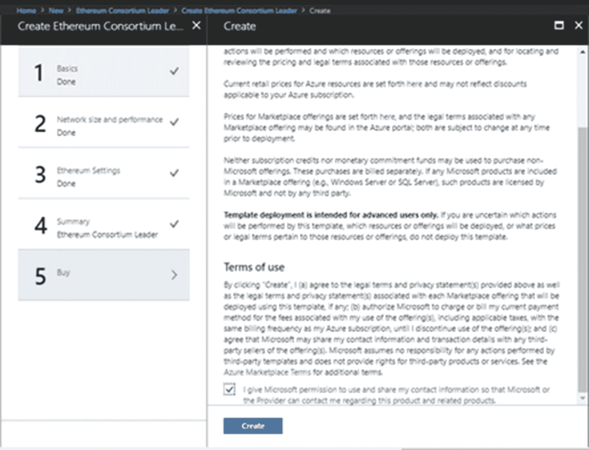图 8-9 以太坊区块链联盟领导者使用条款创建 Azure 区块链需要一些时间。Azure 的通知会不断告知您有关进展情况，如图 8-10 所示。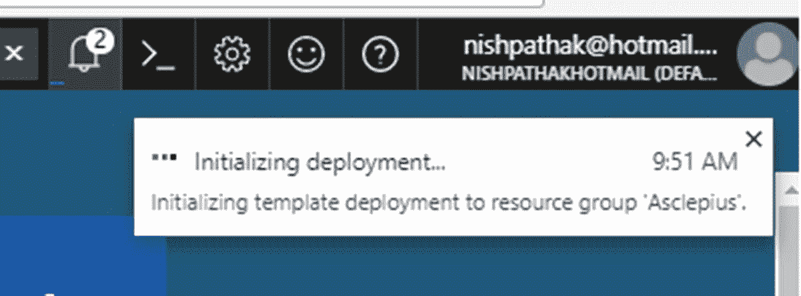图 8-10 初始化 Asclepius 组部署的通知完成初始化、采购和部署以太坊区块链账户后，您将会看到它，如图 8-11 所示。图 8-11 在 Asclepius 资源组下创建的一些资源列表微软一直在大力努力制作更多的 Azure 区块链模板，并使现有模板更加易用。当您获取副本时，如果模板的名称或流程更加顺畅，不要感到惊讶。在接下来的几个月里，我们预计将有数十个预定义的 Azure 区块链模板，以促进区块链作为服务的广泛应用。  

#### 探索新创建的以太坊账户

打开你的 Azure 门户，然后在左侧导航栏中选择所提到的资源组。选择在设置以太坊账户时先前创建的 Asclepius 资源组链接。点击 Asclepius 链接。根据你的设置方式，你的资源名称可能不同，如图 8-12 所示。你将被导航至 Asclepius 资源组，其中显示了在设置 Asclepius 账户时先前创建的所有节点和虚拟机。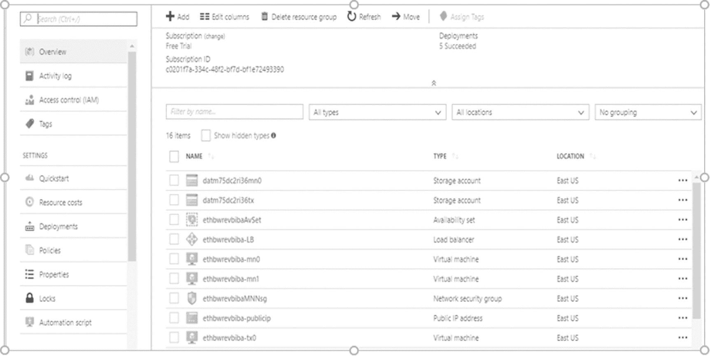图 8-12 所有创建的资源列表如图 8-12 所示，在幕后发生了许多活动，包括负载均衡器、虚拟机和安全组的创建，仅举几例。想象一下，在你的基础架构中创建这些需要多少时间。这是使用 Azure 这样的云基础设施的力量的一个典型例子。多亏了 Azure 以太坊 Leader 模板，抽象化并开发必要的基础设施只需点击几下。点击左侧导航栏上的部署以查看所有部署，如图 8-13 所示。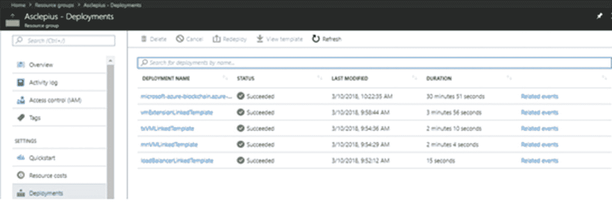图 8-13 部署列表。第一个从 Microsoft Azure 开始的是私有以太坊网络的部署。点击第一个链接 Microsoft-azure-Blockchain，以获取概述详情，然后点击输出链接以查看所有信息，如图 8-14 所示。其中包含所有信息和端点详情，例如管理员站点的 URL、用于连接的以太坊 RPC 端点和网关 ID，仅举几例。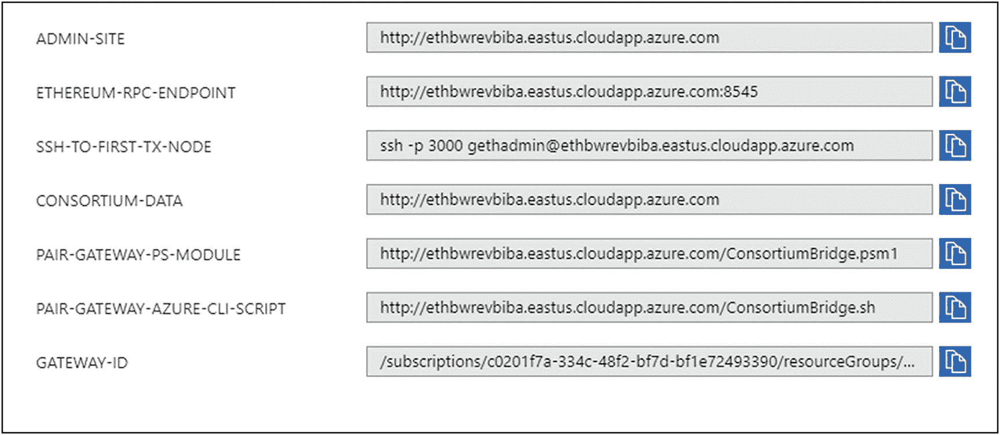图 8-14 所有与以太坊相关的链接。前两个链接——管理员站点和以太坊-RPC-端点——将被广泛使用。现在是快速打开以太坊管理员站点的时候了。

### 以太坊默认管理员网站

复制之前在图 8-14 中创建的管理员站点的地址，打开管理员站点。您将看到关于区块链以太坊账户的大量信息，如图 8-15 所示，我们刚刚创建的。图 8-15 默认以太坊管理员站点的首页您将看到 Azure 创建的默认创世账户的地址。您还将看到大量私有以太币被分配到该账户以供测试。提示重要的是要理解这些私有以太币不能被交易、转移，甚至不能在公共或其他任何区块链账户中使用。现在我们看到如何将这些以太币转移到其他账户。这需要两个节点共享相同的网络 ID。这是测试您的以太坊联盟领导者网络是否正常工作的方法之一。最好和最快的方法是通过一个名为 MetaMask 的浏览器插件进行测试。

#### 安装 MetaMask

打开[`github.com/metamask`](https://github.com/metamask)，如图 8-16 所示。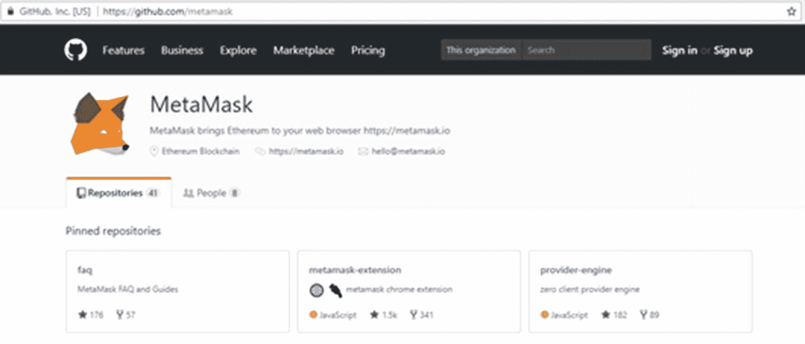图 8-16 MetaMask 的 GitHub 主页单击 metamask-extension 然后单击 Releases。下载 Chrome 扩展版本。解压缩 ZIP 文件到某个文件夹。打开 Chrome，导航到扩展，然后单击 Developer Mode，如图 8-17 所示。图 8-17 启用开发者模式的 Chrome 扩展页面单击 Load Unpacked extension，然后勾选 Developer mode。导航到解压缩 metamask.zip 文件的文件夹。单击确定。完成后，您将在 Chrome 扩展中看到狐狸图标，如图 8-18 所示。图 8-18 安装的 MetaMask 扩展 Chrome 扩展禁用开发者模式。再次单击狐狸图标并接受条款。创建一个您能记住的新密码。然后，它将给用户一组可以用来恢复所有帐户的 12 个单词。您现在将登录到 Ropsten Test.net 并拥有更少的 Ether，如图 8-19 所示。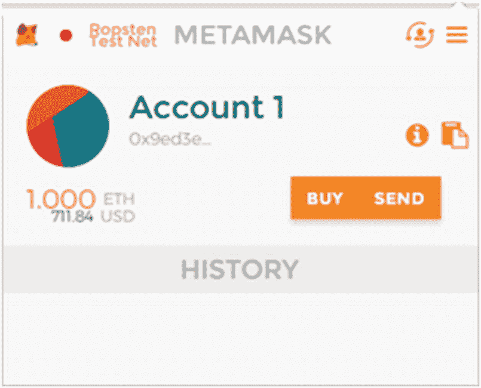图 8-19 首次打开 MetaMask 插件的默认主页为了从新创建的区块链中转移 Ether，请复制先前创建的以太坊 RPC 端点链接（参见图 8-14）。单击 MetaMask 插件右上角的 Settings。粘贴您复制的以太坊端点链接，然后单击保存。完成后，MetaMask 的 UI 将显示您现在已连接到私有网络（而不是 Ropsten Test Net），如图 8-20 所示。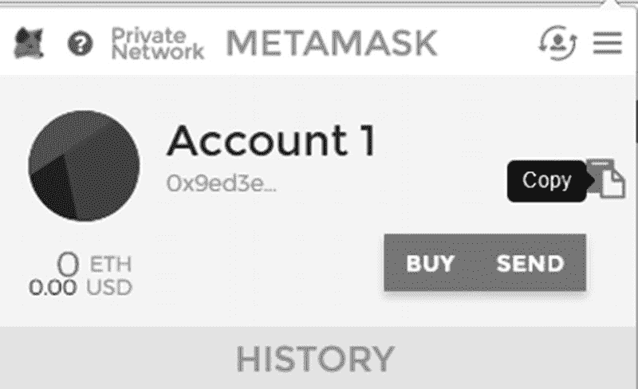图 8-20 MetaMask 插件连接到私有区块链网络而不是默认网络复制新创建帐户的地址并导航回 Admin 以太坊网站。向下滚动并粘贴地址如下所示。然后指定要转移的以太数量，然后单击提交，如图 8-21 所示。图 8-21 用于将以太转移到 MetaMask 帐户的以太坊管理员站点您将收到消息“以太已发送”。导航回 MetaMask 插件以查看是否已收到 Ether。如预期，我们在 MetaMask 插件中收到了 Ether，如图 8-22 所示。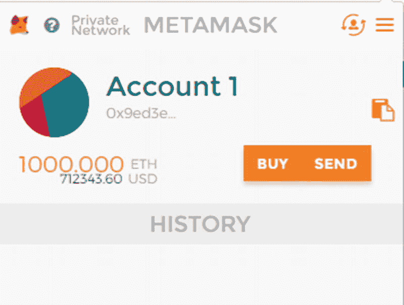图 8-22 从以太坊管理员站点收到的 Ether 祝贺！您的区块链网络正在运行，并且您可以添加更多的联合体成员，转移 Ethers，并将其用于进一步开发。通常，只有当联合体成员执行特定的计算任务时才会奖励 Ethers。其中大多数任务与智能合约的执行相辅相成。现在让我们看看如何创建智能合约。

### 阿斯克勒庇俄斯中的智能合约

在前一章中，我们讨论了智能合约的重要性。在阿斯克勒庇俄斯中，智能合约被广泛应用于各种场景，以避免繁琐的文书工作，例如维护健康记录、处方、保险理赔等任务。智能合约的另外两个用途简要讨论如下：

+   在阿斯克勒庇俄斯中，智能合约在理赔调整流程中使用。在智能合约未引入之前，患者需要处理大量文书工作，包括与健康支付方或保险提供者的协商，而大多数时候患者最终都要支付理赔。通过引入智能合约并利用区块链的力量，这一流程大大减少了。

+   患者信息和医疗记录，包括医疗处方和医生详细信息，都存储在区块链中，只有根据患者和医疗服务提供者的智能合约授权的用户才有资格访问这些数据。这不仅有助于维护患者的不可变医疗历史记录，还确保数据的完整性。患者的每次治疗都会添加到这个智能合约中。这也使得可以立即验证医疗记录，无需第三方介入。

这些只是阿斯克勒庇俄斯使用智能合约的众多用例之一。借助区块链和智能合约，阿斯克勒庇俄斯可以成为可信赖的合作伙伴，通过确保他们数字化和安全地存储所有患者记录，并在获得适当授权的情况下轻松访问相关数据。

### 开发智能合约

你可以使用记事本和智能合约编译器轻松编写智能合约。自行构建、测试和部署智能合约将非常繁琐。为了开发智能合约，需要以下软件来确保良好的开发环境。

#### 包管理器

安装 Node Packet Manager（NPM）。导航至[`nodejs.org/en/`](https://nodejs.org/en/)并下载最新版本。

##### Truffle

Truffle 为智能合约提供了一个内置的编译器，有助于编译和部署解决方案。一旦解决方案构建完成，Truffle 还提供了非常简便的智能合约开发、测试和部署功能。为了安装 Truffle 工具集，请以管理员模式打开 PowerShell，并运行此处命令：C:\> npm install -g truffleC:\Users\nishith\AppData\Roaming\npm\truffle -> C:\Users\nishith\AppData\Roaming\npm\node_modules\truffle\build\cli.bundled.js+ truffle@4.1.3updated 1 package in 13.964s 注意 Truffle 是一个很好的工具，用于编译、部署和测试智能合约解决方案。然而，市场上还有许多其他工具可用，如 Remix（[`remix.ethereum.org`](http://remix.ethereum.org)）、Mist 浏览器等，它们提供基于 GUI 的界面。使用类似 Remix 的工具的一个真正优势是您不需要在您的机器上安装任何东西。然而，我们个人更喜欢 Truffle，因为在开发企业应用程序时，您确实需要考虑不支持使用基于 Web 的解决方案来编译和部署的企业政策。一旦安装了 Truffle，您可以初始化它以获取基本项目结构并快速开始，如下所示：C:\samplecontract> truffle initDownloading...Unpacking...Settingup...Unbox successfully. Sweet !Commands :Compile:     truffle compileMigrate:     truffle migrateTest contracts:     truffle tests 它最终创建了一些文件夹，如图 8-23 所示。图 8-23 初始化 Truffle 模板后在文件夹上创建的文件夹每个文件夹都包含特定的文件。

+   Contracts 文件夹包含所有 Solidity 合约。将所有新创建的合约放入 Contracts 文件夹中。

+   迁移文件夹包含用于部署合约的脚本。一旦创建了新的合约，迁移脚本需要更新以包含新的合约。

+   测试文件夹包含用于测试应用程序和合约的文件。

为了与 Truffle 正常工作，请确保你在相应的文件夹中创建正确的文件。

##### 代码编辑器

Truffle 工具集提供了很好的开发工具。然而，你仍然需要一个代码编辑器来编写智能合约。你可以自由选择任何代码编辑器，包括记事本。如果你有 .NET 背景，我们建议你使用 Visual Studio。在撰写本书时，Solidity（用于创建以太坊智能合约的语言）仅支持到 Visual Studio 2015 的扩展（而不支持 Visual Studio 2017）。然而，Solidity 扩展在 Visual Studio code 中对 2017 年版本提供了支持。你可以选择安装任何版本的 Visual Studio 2015，或者你可以使用 Visual Studio code。我们个人更偏好后者，因为它提供了更快的开发速度。安装你偏好编辑器的最新版本。

#### Solidity

有几种语言可以创建智能合约。其中，最受欢迎和广泛使用的是 Solidity。它是创建以太坊智能合约的最流行语言。它是合约导向的。C++ 和 Python 开发者发现它与代码具有相同的语法和协同作用。就 Solidity 而言，智能合约是一组代码和数据，它们一起驻留在以太坊的特定地址中。

#### Solidity 合约的结构

下面是您的普通 Solidity 合约的外观：

### 理解这段代码

首先，创建了名为 MedicalAssestStorage 的合同。为了存储必要的资产，正在创建结构名称 AssetDetail。结构 AssetDetail {    string assetName;    string desc;    string prodOrigin;    bool isAvailable;} AssetDetail 作为一种结构被用来存储和跟踪资产。这些资产可以用于在资产之间转移时跟踪仪器和医院设备。Asclepius 是一系列医院，因此希望确保透明地维护实验室库存，并确保必要时可以将资产从一个医院转移到另一个医院。为了跟踪，首先将资产映射到一个字符串。映射（string  => AssetDetail）assetinfo;创建了各种事件来跟踪每当创建、转移或拒绝资产时发生的情况。事件 evtCreateAsset(address account, string assetId, string prodOrigin);事件 evtRejectAsset(address account, string assetId, string message);事件 evtTransferAsset(address from, address to, string assetId);事件 evtTransferReject(address from, address to, string assetId, string message);后来，创建了像 createAsset 和 transferAsset 这样的函数，以将新资产添加到 Asclepius 或将其转移到任何其他 Asclepius 链。函数 createAsset(string assetName, string assetId, string description, string prodOrigin) public {    if(assetinfo[assetId].isAvailable) {        evtRejectAsset(msg.sender, assetId, "This Asset ID already exists.");        return;      }      assetinfo[assetId].assetName = assetName;      assetinfo[assetId].desc = description;      assetinfo[assetId].prodOrigin = prodOrigin;      assetinfo[assetId].isAvailable = true;      myWallet[msg.sender][assetId] = true;      evtCreateAsset(msg.sender, assetId, prodOrigin);}函数 transferAsset(address to, string assetId) public {    if(!assetinfo[assetId].isAvailable) {        evtTransferReject(msg.sender, to, assetId, "No asset with this Asset Id exists");        return;    }    if(!myWallet[msg.sender][assetId]) {        evtTransferReject(msg.sender, to, assetId, "Sender does not own this Asset.");        return;    }    myWallet[msg.sender][assetId]= false;    myWallet[to][assetId] = true;    evtTransferAsset(msg.sender, to, assetId);}最后，为了跟踪谁拥有资产以及实际资产位于何处，创建了 getAsset 和 isOwnerof 函数。函数 getAsset(string assetId) public view returns (string, string, string) {    return (assetinfo[assetId].assetName, assetinfo[assetId].desc, assetinfo[assetId].prodOrigin);}函数 isOwnerOf(address owner, string assetId) public view returns (bool) {    if(myWallet[owner][assetId]) {        return true;    }

#### 编译合约

一旦合同创建完成，下一步就是让 Truffle 内置编译器了解新创建的合同。 修改 Migration 文件夹下的 JavaScript 文件，包括新创建的 medicalcontracts.sol，如下所示：

### 总结

在本章中，您了解了以太坊，并学会了如何使用内置的 Azure 模板快速设置以太坊。微软已投资于推广使用内置 Azure 模板的区块链。 Solidity 是用于构建智能合约的语言，并且正在发展中。每周都有新的变化被提出、接受并推动前进。 正如前面提到的，当您阅读这些章节时，一些选项会随着新选项的出现而发生变化，使得使用区块链基础设施变得更加容易。 使用区块链和使用 Solidity 创建智能合约的概念保持不变。 毫无疑问，我们在区块链领域的未来是令人兴奋的。 AI 2.0 技术的所有技术，如区块链、物联网中心和使用认知服务，有一个共同点——它们产生了大量的数据。 数据如果不能分析并获得洞察力以快速做出决策，就没有用处。 在下一章中，您将学习如何使用这些数据快速捕获、分析和可视化实时数据。
