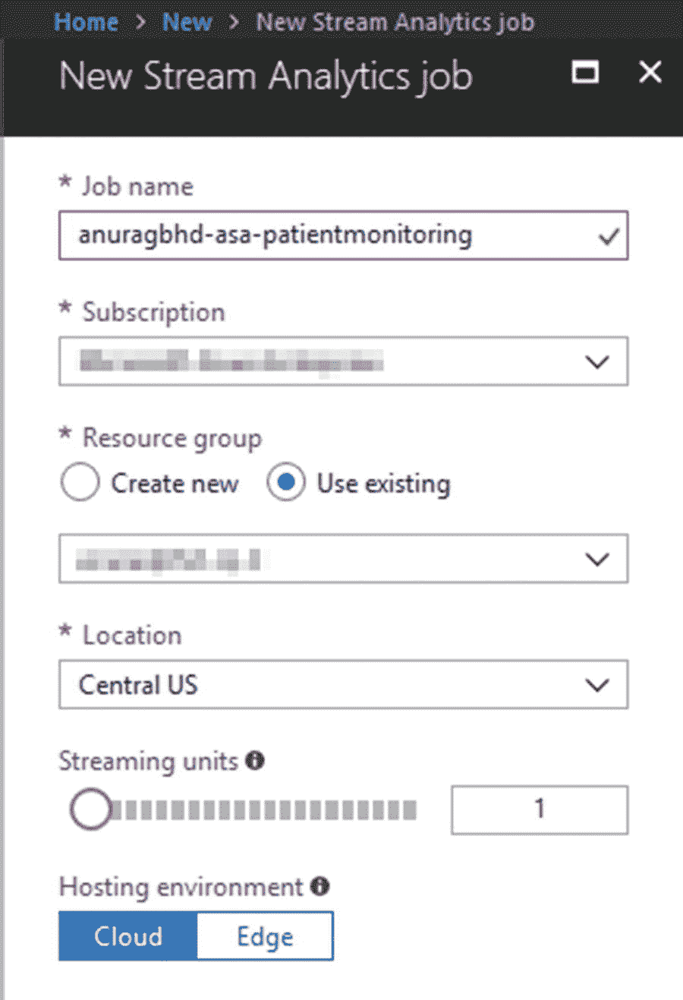
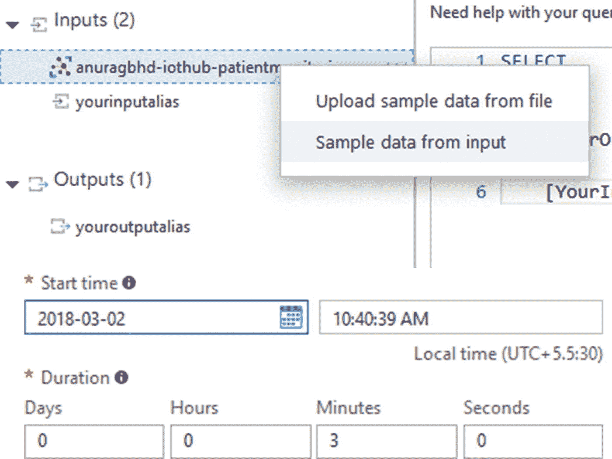
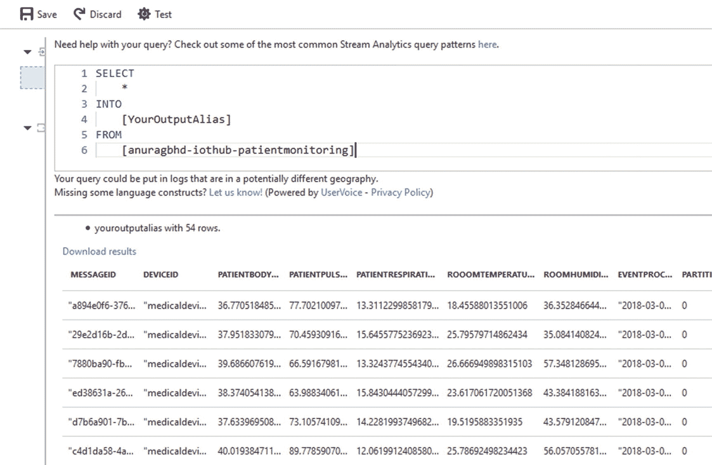
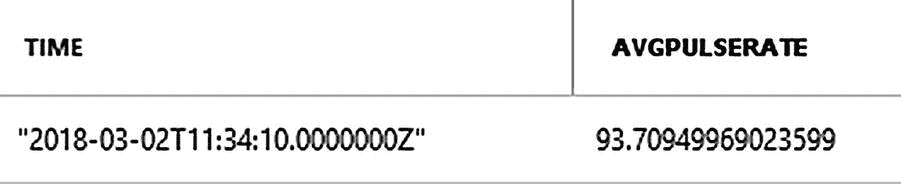
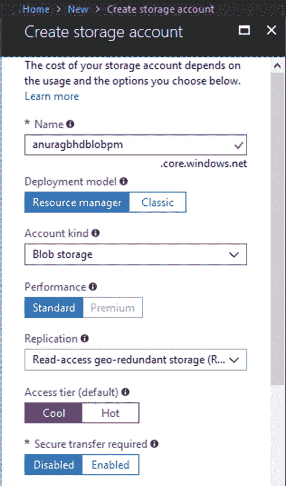
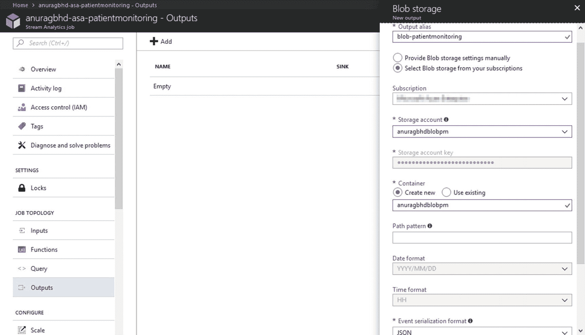
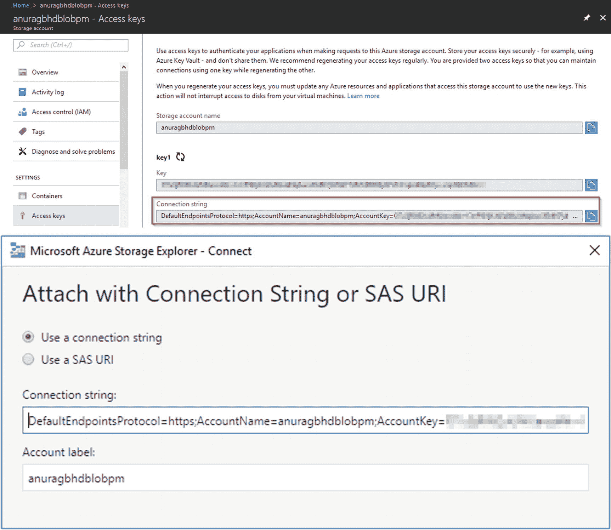
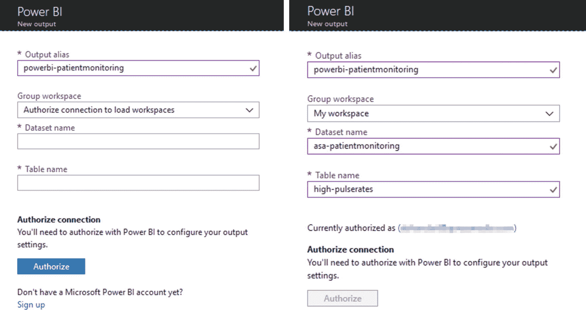
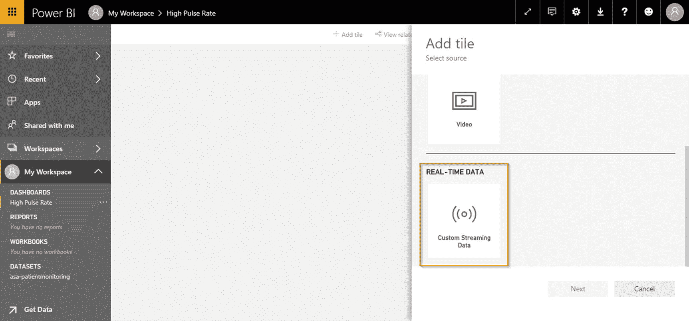
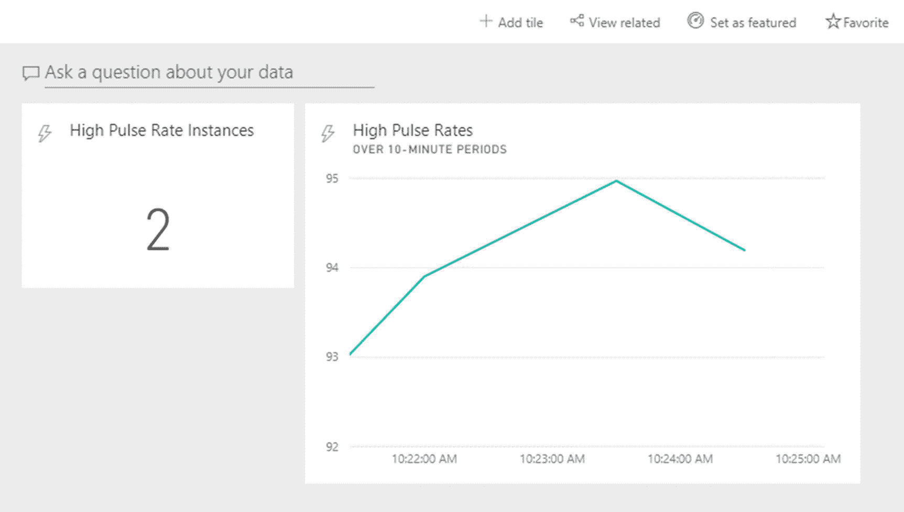

© 2018 尼希思·帕塔克和阿努拉格·班达里尼希思·帕塔克和阿努拉格·班达里 IoT, AI, and Blockchain for .NET`doi.org/10.1007/978-1-4842-3709-0_9`

# 9. 捕获、分析和可视化实时数据

尼希斯·帕塔克¹和阿努拉格·班达里²(1)印度波里加尔瓦尔县科特瓦拉(2)印度旁遮普邦贾兰达尔到了这一步，你现在掌握了如何创建下一代 AI 2.0 应用的知识。在你的工具库中，你拥有像认知服务、物联网中心和区块链这样的武器，可以帮助你为客户、顾客或你自己的组织创建真正尖端的智能解决方案。从开发者的角度来看，你已经全副武装。然而，开发解决方案只是更大图景的一部分，无论它有多么庞大。虽然解决方案解决了问题，但它们通常会在此过程中生成大量数据，其中一些被应用程序本身用来做即时决策。现在，一个应用程序生成大量数据（比如每小时几个 gigabytes）已经不再罕见，而应用程序本身并不总能够同时消耗和分析这些数据。这在涉及物联网的情况下尤其

+   创建、配置、启动和停止 Azure 流分析作业

+   使用存储后端（Azure Blob 存储）存储 ASA 分析结果

+   在 Power BI 中创建图形仪表板，实时显示 ASA 分析结果

## Azure 流分析

系统处理的数据分为两种形式——静态或流式。静态数据是不变或变化缓慢的数据，通常存储在文件和数据库中。例如，历史档案、旧日志文件、库存数据等。对于这样的数据进行彻底分析，不管数据有多大，可以使用数据分析应用程序、库和服务。Azure HDInsight、Hadoop、R 和 Python 是常用的工具。你可以使用流分析来分析静态数据，但那不是它的主要用途。另一方面，流式数据是系统以每秒数百或数千条记录的速率连续接收到的实时数据链。你可能在在线视频的上下文中听到“流”和“流式”这些术语，特别是当它们实时提供时（直接从录制摄像机到观众，在实时）。除了被最终用户使用外，视频流还可以进行分析，以产生关键统计数据，如视频中的人或物体出现次数、主导颜色、面孔和情感等。我们在第 4 和 5 章中看到了使用 AI（认知服务）进行视频分析的暗示。但是分析视频流并不像分析其他数据流那样常见。一些经常分析的数据流示例列在 9-1 表中。表 9-1 数据流示例及可对其执行的分析

| 数据流 | 示例分析用例 |
| :-- | :-- |
| 网站所有访问者访问的页面和点击的元素（按钮、文本框、链接等）。另外，有关访问者自身的数据—IP 地址（位置）、浏览器、操作系统等。总称为点击流。 | 查找最常访问的页面、最受欢迎的部分、最受欢迎的访问者位置等。 |
| 社交媒体上的热门话题的帖子。 | 查找有关该话题的整体和基于位置的情感。 |
| 股票市场价格。 | 计算价值-at-risk，自动平衡投资组合，根据整体小时内表现建议投资股票。 |
| 大量物联网设备的频繁更新（遥测数据）。 | 取决于设备收集的数据类型。 |

Azure Stream Analytics 是专为处理流数据而设计的。因此，在需要实时分析的情况下，它表现出色。与其他 Azure 服务一样，ASA 具有高度可扩展性，并且能够处理高达每秒 1GB 的数据。它提供了一种易于使用的类 SQL 声明性语言，称为流分析查询语言，用于对流数据进行简单到复杂的分析。您编写的查询与 SQL 中的编写方式完全相同——SELECT、GROUP、JOIN——一切都以相同的方式工作。这里唯一的主要区别在于，由于您正在处理永无止境的流数据，因此需要定义特定于时间的边界以选择要分析的确切数据集。换句话说，由于静态数据变化非常缓慢或根本不变，因此对整个数据进行分析。流数据是连续的，没有预定义的结束。在大多数情况下，执行分析的系统无法预测数据何时结束。因此，必须选择小的、时间范围有限的数据流片段进行分析。时间窗口越短，分析越接近实时。请注意，进行大规模大数据复杂分析需要大量时间。因此，不建议使用流分析解决方案（ASA、Apache Storm 等）进行非常复杂的分析。对于运行分析可能需要几分钟到几小时的情况，首先应将流数据存储在临时或永久存储中，然后像静态数据一样进行处理。ASA 中的典型工作流程始于定义一个或多个数据输入源。ASA 可以开箱即用地处理 IoT Hub、事件中心和 Blob 存储。ASA 可以使用来自中心的流数据以及参考静态数据来执行分析。此外，还可以在 ASA 作业中使用 Azure 机器学习中定义的函数对正在分析的数据进行实时预测。您将在第十章中了解更多关于机器学习的内容。ASA 作业的输出可以存储在永久存储（Blob、SQL 数据库、数据湖等）中，也可以直接发送到 Power BI 以生成仪表板，或者两者兼而有之。IoT Hub 解决方案后端也可以订阅 ASA 作业的输出，以根据接收到的输出发送命令给设备。图 9-1 总结了此工作流程。图 9-1 Azure Stream Analytics 工作流程

## 执行 IoT 流数据分析

让我们从一些基础知识开始。在第三章中，我们在 Azure 中创建了一个 IoT 中心，并在 C# 中创建了一个模拟设备，该设备可以每三秒发送一次病人的生命体征到中心。我们将重复使用这些内容，仅为一个患者执行实时分析。稍后，我们将创建更多模拟设备，为更多患者生成假数据，并使用该数据执行更复杂的实时分析。

### 创建 Azure 流分析作业

访问 Azure 门户（[`portal.azure.com`](https://portal.azure.com)），并单击左侧菜单顶部的“创建资源”按钮。转到“数据 + 分析” ➤ “流分析作业”。或者，如果无法找到此选项，请搜索“流分析”。填写表单，如图 9-2 所示。由于此作业将是我们测试 ASA 的方式，因此您不需要超过一个流处理单元。理想情况下，您应该从小规模开始，并在您的中心开始接收大量数据时扩展。图 9-2 创建新的 ASA 作业单击“创建”按钮，等待几秒钟，直到部署完成。

### 添加输入到 ASA 作业

默认情况下，ASA 作业以停止模式创建。在启动作业之前，我们将首先通过指定输入和输出来配置它。一旦作业开始，您将无法编辑输入和输出设置。从 Azure 门户中新创建的 ASA 作业概述页面转到作业拓扑 ➤ 输入。您将看到两个选项来添加输入——添加流输入和添加引用输入。后一种选项允许您添加参考数据，即我们可以用来补充流数据的静态数据。在许多情况下，它可能是元数据，可以与流数据连接以帮助分析。例如，参考输入可能是所有患者的列表，以及他们的姓名、年龄和其他属性。这些是不在流数据记录中的东西，以减少冗余并节省网络带宽。在运行实时流分析查询时，我们可能需要患者的年龄以更准确地确定疾病。选择添加流输入 ➤ 物联网中心。填写生成的表单，如图 9-3 所示。选择现有的物联网中心的最简单方法是从同一 Azure 订阅中选择一个。如果您的中心位于与 ASA 作业不同的订阅中，则可以选择指定中心的连接字符串的选项。输入别名可以是在作业上下文中唯一描述您的输入的任何内容。点击保存将添加输入到您的作业，并立即执行测试以检查与指定中心的连接。您应该会收到“连接测试成功”的通知。

### 测试您的输入

在进行下一步——指定 ASA 作业输出之前，最好在输入数据流上运行一些样本 SA 查询，以确保作业配置正确。我们将直接在我们的物联网中心收到的实时数据上运行查询。为此，我们将启动我们在第三章中创建的模拟设备，开始向我们的中心发送数据。在 Visual Studio 中打开 IoTCentralizedPatientMonitoring 解决方案。只需将 SimulatedDevice 项目设置为启动项目，运行解决方案。当我们的模拟设备启动并向中心发送消息时，返回到 Azure 门户。从 ASA 作业的侧边栏，转到作业拓扑 ➤ 查询。注意：为了运行测试查询，您不需要启动流分析作业。这可以通过为指定输入提供作业样本数据来完成，有两种方式——上传数据文件（.json、.csv 等）或从流输入中取样数据。查询页面有两个窗格：左侧是输入和输出，右侧是查询编辑器。右键单击物联网中心输入别名，然后选择来自输入的样本数据。将采样时长指定为三分钟。图 9-4 显示了这些选项的外观。图 9-4 从流输入（如 IoT Hub）采样数据 Azure 将开始收集由中心接收到的数据（接下来的三分钟）存储在临时存储中。采样完成后，Azure 将通知您。如果在此时关闭浏览器标签页或导航到另一页，则采样数据将丢失。

#### 使用“透传查询”进行测试

一旦数据被采样并准备好查询，你可以停止模拟设备以防止你的 IoT Hub 被进一步计量。现在，在编辑器中修改查询，将 YourInputAlias 更新为你的 Hub 输入的名称。你可以保留 YourOutputAlias 不变。SELECT    *INTO    [YourOutputAlias]FROM    [your-iothub-input-alias]你可能还记得你的 SQL 知识，SELECT * FROM <table> 会从指定的表中选择并显示所有行和列。在 Stream Analytics 的上下文中，这就是所谓的“穿越”查询。它从给定的输入选择所有数据，并将其发送到给定的输出。理想情况下，你应该指定约束和过滤器（例如，WHERE 子句）来执行分析，并仅将符合你的标准的记录发送到输出。点击测试按钮。在缺乏永久存储输出的情况下，穿越查询会在浏览器中生成结果，如图 9-5 所示。ASA 足够智能，能够从数据记录的属性自动生成列名。图 9-5 穿越查询的结果回顾一下，设备的消息看起来像这样：{"messageId":"1e7c7cf7-5d6b-4938-aac0-688cb870b70e","deviceId":"medicaldevice-patient1","patientBodyTemperature":40.471381505937956,"patientPulseRate":76.017155878253817,"patientRespirationRate":15.639444097708651,"rooomTemperature":29.475085872912352,"roomHumidity":54.724774525838335}你可以将 SA 查询结果中的列名与示例消息中的属性名进行匹配。除此之外，我们还看到了 IoT Hub 特定的列，如 EventProcessedUtcTime、PartitionId 等。

#### 使用实际查询进行测试

让我们尝试一个更复杂的查询，以适应真实场景。在第三章中，我们编写了解决方案后端来检测高体温情况。沿着类似的思路，我们将编写一个查询来检测高脉搏率条件。我们的解决方案后端在检查每条从医疗设备接收到的高温度时非常基础和天真。我们不会用同样的方式来检测高脉搏率。相反，我们将检查从每个时间间隔内平均脉搏率中得出的高值。换句话说，我们想要在 30 秒内连续高于某个阈值（比如 90）的情况下标记脉搏率为高。这种条件的查询将如下所示：SELECT    System.Timestamp AS Time,    Avg(PatientPulseRate) AS AvgPulseRateINTO    [YourOutputAlias]FROM    [your-iothub-input-alias]    TIMESTAMP BY EventEnqueuedUtcTime    GROUP BY TumblingWindow(second, 30), DeviceId    HAVING Avg(PatientPulseRate) > 90 如果你运行这个查询，可能会得到零到三个结果，这取决于样本数据。在这种情况下，我们收到了一个结果，如图 9-6 所示。图 9-6 运行约束约束 SA 查询的结果在现实世界中，ASA 作业将处理来自数百或数千台设备的数据，这使得这个查询具有真正的价值。让我们拆解一下这个查询以便更好地理解。整个查询中最不寻常的事情是关键字 TumblingWindow。Stream Analytics 处理流数据。与静态数据不同，流数据没有开始或结束；它只是一连串连续的传入数据记录，可能近期内会结束，也可能不会。一个问题就是：从何时开始以及多长时间应该连续分析流数据？在本章的前一部分，我们谈到了分析流数据的时间限定窗口。TumblingWindow 为我们提供了这些时间限定窗口，同时使用 GROUP BY 执行聚合操作。我们在 JOIN 中使用的等效关键字是 DATEDIFF。TumblingWindow 接受两个参数——时间单位和其度量——以便在该时间间隔内对数据进行分组。在我们的查询中，我们每 30 秒对传入的数据记录进行分组，并检查该时间间隔内患者的平均脉搏率。提示如果你仍然感到困惑，请不要忘记，我们在样本数据上运行了这个查询，这已经是一个快照——一个三分钟的窗口——了。因此，ASA 创建了六个 30 秒的组，并在分析它们后显示最终结果。当我们启动 ASA 作业时，它将开始处理实际的流。每 30 秒进行分析，并将结果吐出（到指定的输出）。TIMESTAMP BY 提供了一种指定在创建时间限定窗口时要考虑哪个时间的方法。默认情况下，Stream Analytics 将考虑数据记录到达的时间。在某些情况下，这可能是可以接受的，但这不是我们想要的。在医疗保健应用程序中，数据由物联网设备记录的时间比数据由 Azure（IoT Hub 或 Stream Analytics）接收的时间更重要，因为两个事件之间可能会有几毫秒到几秒的延迟。这就是为什么在我们的查询中，我们选择按 EventEnqueuedUtcTime 时间戳，这比数据接收的时间更接近。选择 System.Timestamp 为每个窗口提供了结束时间。

### 给 ASA 任务添加一个输出

在对抽样输入运行测试查询时，ASA 直接在浏览器中生成其输出。但是，在实际场景中，情况并非如此。ASA 要求您至少指定一个输出汇（容器），结果将存储或以更持久的方式显示在其中。存储的结果可以进一步分析以做出决策。虽然 ASA 支持长列表的输出选项，但我们将选择一个称为 blob 存储的热门选择。Azure 的 blob 服务为非结构化数据提供了高度可扩展的存储。它还提供了用于访问其中存储的数据的 RESTful API。在大多数情况下，您可能希望将 ASA 结果以 JSON 格式存储在 blob 中，并稍后通过其 REST API 在 Web 或移动应用程序中检索它。在我们的 ASA 作业中指定 blob 存储作为输出之前，我们需要在 Azure 中创建它。该过程与其他 Azure 服务相同。在门户中，访问创建资源 ➤ 存储 ➤ 存储帐户 - Blob、文件、表、队列。创建一个新的 blob，如图 9-7 所示。图 9-7 创建新的博客存储以存储 ASA 作业输出名称不能包含特殊字符（甚至连连字符和下划线也不行）。这就是我们在这里偏离常规命名方案的原因。您选择的访问层级将影响您的定价。Blob 存储没有免费层，但对于少量数据来说，存储数据的成本几乎可以忽略不计（几乎为零）。如果 blob 数据将经常被访问，则选择热层；如果数据将被更频繁地存储而不是访问，则选择冷层。在这种情况下，我们将使用后者。当 Azure 完成创建我们的新存储后，我们应返回到我们的 ASA 作业，并转到作业拓扑 ➤ 输出 ➤ 添加 ➤ Blob 存储。填写表单，如图 9-8 所示。图 9-8 在 ASA 作业中添加 blob 存储输出与指定 hub 作为输入的情况类似，您可以在同一订阅中或订阅外选择 Azure Blob 存储。对于外部 blob，您需要手动输入存储帐户和存储帐户密钥。确保已选择 JSON 作为序列化格式。对于 JSON，Format 字段将有两个选项 - 行分隔和数组。如果您打算通过图形工具（例如 Azure 存储资源管理器）访问 blob 数据，则行分隔效果很好。然而，如果意图是通过其 REST API 访问 blob 数据，则数组选项更好，因为这样更容易在 JavaScript 中访问 JSON 对象。将其余字段保持不变，然后单击创建。在添加新输出后，Azure 将立即执行连接测试。

### 测试您的输出

回到你的 ASA 工作的查询编辑器，并粘贴我们之前使用的相同查询，但这次在 `INTO` 之后指定你的 blob 的输出别名。点击保存以保存查询。转到概览页面并启动作业。作业启动可能需要几分钟的时间。启动时会通知您。当作业运行时，您可能无法编辑查询或添加/编辑输入和输出。从 Visual Studio 中重新启动模拟设备（如果您之前停止了它）。您可能希望将其更新频率增加到 10 或 20 秒，以反映更真实的值。在重复之前等待 10 秒。让它运行一段时间以满足我们指定的高脉搏率条件。与此同时，从 [`storageexplorer.com`](http://storageexplorer.com) 下载并安装 Azure Storage Explorer。这是一个很棒的小型桌面应用程序，用于访问 Azure 存储帐户，如 blob、数据湖、Cosmos DB 等。当您首次打开 Azure Storage Explorer 时，您将看到“连接到 Azure 存储”的向导。如果没有，请通过在左侧的资源管理器窗格中右键单击“存储帐户”，然后选择“连接到 Azure 存储”来手动打开向导。在向导中，选择“使用连接字符串或共享访问签名 URI”选项，然后单击“下一步”。从 Azure 门户中复制您的 Blob 的连接字符串 ➤ <your-blob> ➤ 设置 ➤ 访问密钥 ➤ key1 ➤ 连接字符串，并将其粘贴到向导的“连接字符串”文本框中，如图 9-9 所示。图 9-9 从 Azure 门户复制 blob 存储的连接字符串到 Azure 存储资源管理器一旦应用程序成功连接到您的 blob 存储，您将在资源管理器窗格下看到其名称。展开它并转到 Blob 容器 ➤ <your blob container name>。在右侧的详细信息窗格中，您应该看到与 .json 文件 相对应的列表。如果您在那里没有看到任何内容，则高脉搏率条件从未满足。您可以再等待几分钟，或者通过设置 Avg(PatientPulseRate) > 80 来放宽条件（您需要停止 ASA 作业，编辑查询，然后再次启动作业）。双击 .json 文件 在默认文本编辑器中将其在本地打开。您应该会看到类似以下的内容。{"time":"2018-03-03T05:55:30.0000000Z","avgpulserate":91.907351640320385}{"time":"2018-03-03T05:56:00.0000000Z","avgpulserate":94.212707023856254}{"time":"2018-03-03T06:05:00.0000000Z","avgpulserate":94.652964749677551}{"time":"2018-03-03T06:06:00.0000000Z","avgpulserate":93.091244986168064}{"time":"2018-03-03T06:14:00.0000000Z","avgpulserate":91.6573497614159}{"time":"2018-03-03T06:14:30.0000000Z","avgpulserate":90.980160983425321}{"time":"2018-03-03T06:15:00.0000000Z","avgpulserate":92.107636040126735}注：每次停止 ASA 作业并重新启动后，作业的后续输出都将写入一个新的 .json 文件（blob）中，该文件与相同的 blob 容器中。您将在 Azure 存储资源管理器中看到与 ASA 作业启动次数相同的 blob。您可以使用 blob 存储的全面 REST API 在 web 和移动应用程序中以编程方式访问这些结果。查看 [`docs.microsoft.com/en-us/rest/api/storageservices/list-blobs`](https://docs.microsoft.com/en-us/rest/api/storageservices/list-blobs) 和 [`docs.microsoft.com/en-us/rest/api/storageservices/get-blob`](https://docs.microsoft.com/en-us/rest/api/storageservices/get-blob) 获取更多详情。让您的模拟设备运行更长时间，并在 Azure 存储资源管理器中保持刷新详细信息窗格，以查看流分析如何实时处理流输入并生成输出。

## 使用 Power BI 可视化 ASA 结果

虽然 Blob 存储提供了一种便捷、可扩展的方法来存储流分析结果，但是使用 Azure 存储资源管理器或 REST API 难以可视化存储的结果。Power BI 是一套商业智能和分析工具，与数十种数据源一起工作，通过 GUI 接口提供交互式、可视化的见解。它支持的一些数据源包括 SQL 数据库（SQL Server、Oracle 和 PostgreSQL）、Blob 存储、MS Access、Excel、HDFS（Hadoop）、Teradata 和 XML。Power BI 提供网页、桌面和移动应用程序，快速创建填充有图表（线型、柱状、饼状、时间序列、雷达等）、地图、面积图、直方图、网格、云等可视化的仪表板。仪表板可以在 Power BI 中生成和查看，也可以发布到你自己的网站或博客。重要提示：为了注册或使用 Power BI，你需要一个与 Microsoft Office 365 集成的工作电子邮件地址。你不能使用个人电子邮件 ID（Gmail、Yahoo 邮箱，甚至 Hotmail）注册 Power BI。

### 在 ASA 作业中添加 Power BI 作为输出

在 Azure 门户中停止你的 ASA 作业，如果它正在运行。然后转到作业拓扑 ➤ 输出 ➤ 添加 ➤ Power BI。填写细节，如图 9-10 所示。图 9-10 在流分析作业中添加 Power BI 作为输出：在授权连接到 Power BI 之前和之后注意你填写的数据集名称和表名称的值。我们将它们分别保留为 asa-patientmonitoring 和 high-pulserates，这与我们遵循的命名方案一致。如果尚不存在，Azure 将自动在 Power BI 中创建指定的数据集和表。具有相同名称的现有数据集将被覆盖。

### 更新 SA 查询

创建输出后，让我们回到查询编辑器。我们需要更新查询以将结果重定向到我们的 Power BI 输出。有两种方法可以做到这一点——用新的输出别名（Power BI）替换当前的输出别名（blob），或者为新输出添加第二个 SELECT INTO 语句。接下来分别展示了这两种方法。替换现有输出：SELECT    System.Timestamp AS Time,    Avg(PatientPulseRate) AS AvgPulseRate,    COUNT(*) AS HighPRInstancesINTO    [powerbi-patientmonitoring]FROM    [anuragbhd-iothub-patientmonitoring]    TIMESTAMP BY EventEnqueuedUtcTime    GROUP BY TumblingWindow(second, 30), DeviceId    HAVING Avg(PatientPulseRate) > 90 添加额外输出：WITH HighPulseRates AS (    SELECT        System.Timestamp AS Time,        Avg(PatientPulseRate) AS AvgPulseRate,        COUNT(*) AS HighPRInstances    FROM        [anuragbhd-iothub-patientmonitoring]        TIMESTAMP BY EventEnqueuedUtcTime        GROUP BY TumblingWindow(second, 30), DeviceId        HAVING Avg(PatientPulseRate) > 90)SELECT * INTO [blob-patientmonitoring] FROM HighPulseRatesSELECT * INTO [powerbi-patientmonitoring] FROM HighPulseRates 请注意，我们精心选择了另一个值——每个记录的高脉率实例的计数。尽管这个值对于每个实例都是 1，但稍后我们会用它来绘制折线图。还可以将不同的结果发送到不同的输出。为此，您需要为每个输出编写一个单独的 SELECT ... INTO ... FROM 语句，一个接一个地写。更新您的查询，点击保存，然后重新开始作业。现在也是再次启动模拟设备的好时机。转到 Visual Studio 并启动该项目。

### 在 Power BI 中创建仪表板

前往[`powerbi.com`](https://powerbi.com)并使用您的工作账户登录。如果您在左侧边栏的“我的工作区”中展开并查看数据集，您应该可以看到您之前指定的数据集名称，如果 ASA 作业至少生成了一个结果。从侧边栏菜单导航到工作区➤我的工作区。我们将从创建显示我们患者所有高脉搏率实例计数的仪表板开始。选择创建➤仪表板。为您的仪表板取一个名称并点击创建。在您新创建的仪表板中，点击添加图块并选择自定义流数据，如图 9-11 所示。点击下一步。图 9-11 在 Power BI 中仪表板中添加新图块在选择流数据集屏幕中，选择您的数据集名称并点击下一步。在可视化设计屏幕中，选择卡片作为可视化类型，然后在字段中添加 highprinstances。在下一个名为图块详细信息的屏幕上，填写标题和副标题并点击应用。您的新图块将立即生效。同样，让我们添加一个新的图块以跟踪高脉搏率在 10 分钟时间段内的情况。添加图块➤自定义流数据➤<您的数据集>。在可视化设计屏幕中，选择线状图作为类型，时间作为轴，avgpulserate 作为数值，并选择最近 10 分钟作为显示时间窗口。一旦该图块生效，您应该能够看到您选择的数据的线状图。此时，您的仪表板应该看起来像图 9-12 所示。图 9-12 一个拥有两个图块的 Power BI 仪表板随意创建更多的标题，使用手头的数据，并观察它们实时更新。

## 下一步

拥有流分析和 Power BI 的强大功能，我们鼓励您尝试稍微复杂一点的场景。尝试解决以下练习中提到的问题，或者从中获取提示来解决其他问题。实时登革热爆发检测登革热是一种由蚊虫传播的病毒性疾病，在印度和新加坡等一些南亚和东南亚地区很常见。如果不及时检测和治疗，登革热可能会致命。根据在线统计，每年有数亿人感染这种疾病，其中约有 2 万人因此而死亡。该疾病开始时像普通病毒一样，并且在一些情况下逐渐加重（在 7-10 天内）。登革热爆发每年在某些地区都会再次发生，及时检测到这些爆发可能有助于及时有效的公共卫生干预。该疾病的症状包括，但不限于：

+   高烧

+   快速呼吸

+   严重腹痛

您的任务是设计一个实时登革热爆发检测系统，一个医院或多个医院（可能在区块链上）可以使用以及采取及时行动。系统设计每个 IoT 医疗设备应至少报告患者的以下遥测数据：

+   体温

+   呼吸速率

+   腹痛评分

+   位置

一个人的位置可以通过 GPS 轻易被追踪。至于确定疼痛分数，市场上有设备可以做到这一点。查看这个链接：[`gomerblog.com/2014/06/pain-detector`](http://gomerblog.com/2014/06/pain-detector)。另外，适当测量功能性磁共振成像（fMRI）脑部扫描也可以给出疼痛水平的指示，正如在这里报道的：[`www.medicalnewstoday.com/articles/234450.php`](https://www.medicalnewstoday.com/articles/234450.php)。你的任务起初不是使用这些复杂的医疗设备来进行测量，而是为这项工作创建大约十几个模拟设备，这些设备会为每个患者报告遥测数据。然后，你可以编写一个 SA 查询，对流入的数据流进行聚合操作，并计算出在相同位置遥测值高于某个阈值的情况数量。如果你在同一时间收到多个地点报告了一堆登革热病例，你就找到了暴发模式。

## 复盘

在本章中，您学会了如何对来自物联网中心的数百甚至数千台连接设备接收的流式数据进行复杂实时分析。您学会了如何：

+   在 Azure Portal 中创建一个新的流分析作业

+   将输入（中心）添加（并测试）到 ASA 作业

+   编写在流式数据的时间限制窗口上工作的查询

+   将一个 ASA 工作添加（并测试）到 blob 存储输出

+   使用 Azure Storage Explorer 访问存储在 blob 中的流分析结果

+   将 Power BI 添加为 ASA 工作的输出

+   在 Power BI 中创建一个具有多个瓷砖的仪表板，以可视化 ASA 的结果

在下一章中，您将通过使用 Azure 机器学习将数据分析提升到新的水平。
