© 2018 年 Nishith Pathak 和 Anurag Bhandari

# 10. 利用机器学习进行预测

Nishith Pathak^(1 ) 和 Anurag Bhandari²(1) 印度，Pauri Garhwal 区的 Kotdwara(2) 印度，旁遮普邦的 Jalandhar 我们在 AI 2.0 的冒险即将结束。如果你已经阅读了前面的九章，那么你几乎拥有构建下一代智能应用所需的所有技能。你几乎已经准备好进入 AI 2.0 时代。几乎。回顾一下你迄今为止的旅程，你现在对于 AI、物联网和区块链如何共同构建 AI 2.0 架构（第一章）有了清晰的大局认识，知道如何使用 Azure IoT 套件设计和构建高度可扩展的物联网解决方案（第二章和第三章），能够通过启用 AI 为你的应用程序和物联网解决方案增加智能，使用认知服务（第四章、第五章和第六章），知道如何将你的应用程序与分散的、透明的、无限可扩展的智能网络集成，使用 Azure 区块链即服务（第七章和第八章），并且能够使用 Azure Stream Analytics 和 Power BI 分析和可视化实时数据（第九章）。在几章的空间里，你学到了这么多“新”的技术。但是，没有了 AI 的主要推动技术和实时数据分析的关键伴侣，这些知识就是不完整的。正如你在第一章和第九章所见，这项技术就是机器学习。回顾第一章，机器学习是计算机在没有明确编程的情况下学习的能力。这一巨大的能力使得计算机能够像人类一样思考。机器学习使计算机通过示例而不是指令来学习识别和区分现实世界中的对象。它还赋予了它们通过试错来学习自己的错误的能力。而且，一旦它们对一个主题有了足够的了解，机器学习就赋予了计算机做出自己的决定的能力。也许 ML 最有用的方面——使它略优于人类智能的地方——是它的预测能力。当然，不是我们人类通过看水晶球做出的那种预测，而是通过查看数据模式做出的有根据、合乎逻辑的预测。有一些机器学习算法，如果提供了足够的历史数据，就能够预测未来某一时刻各种数据参数的情况。天气、地震和气旋的预测就是通过这种技术进行的，像月球或火星这样的遥远天体上是否有水的预测也是如此。机器学习是如何做到这一切的，你很快就会了解到。到本章结束时，你将会学到：

+   机器学习（ML）

+   机器学习解决的问题

+   机器学习的类型

+   Azure 机器学习工作室——是什么及如何使用

+   选择合适的算法解决问题

+   使用机器学习解决实际问题

## 什么是机器学习？

现在我们对机器学习有了一个相当高层次的功能概念，让我们来看一下更加技术化的定义。机器学习是一门计算机科学领域——起源于模式识别的研究——它使得机器能够从数据中学习，进行预测并随着时间的推移逐步改进。它通常用于无法使用显式编程设计软件应用程序的场景。这些是一些场景，计算机可能必须处理全新的、以前未见过的数据来根据这些数据进行预测，使得编写一套详尽的 if 条件来覆盖所有可能性实际上是不可能的。这些场景的一些例子包括：

+   自然语言理解：同一句话在同一种语言中可能有数百种不同的表达方式，这是由于不同的方言、俚语、语法流等等。

+   电子邮件垃圾邮件过滤：垃圾邮件发送者每天都在不断地生成新的垃圾邮件和网络钓鱼邮件。

+   游戏中的人工智能：当与非人类敌人（机器人）对战时，机器人的行为和动作必须根据你的独特风格进行调整。

+   人脸识别：一个人无法明确地训练计算机识别世界上所有的脸。

在《数据科学入门》视频系列中，微软高级数据科学家 Brandon Rohrer 解释了机器学习实际上只能回答以下五个问题：

+   这是 A 还是 B？（分类）

+   这很奇怪吗？（异常检测）

+   多少或多少？（回归）

+   这是如何组织的？（聚类）

+   现在我应该做什么？（强化学习）

这些是机器学习可以解决的问题。我们将很快详细介绍其中一些。与机器学习相关的算法有很多。其中一些包括线性回归、神经网络回归、二分类支持向量机、多分类决策森林、K 均值聚类和基于主成分分析的异常检测。根据要解决的问题，一个算法可能比其他所有算法都更有效。编写机器学习算法并不是一件简单的任务。尽管可以编写自己的实现来实现一个成熟的算法，但这样做不仅耗时，而且大多数情况下效率低下。在执行机器学习任务时，最好使用现有已知且编写良好的这些算法的实现。有免费且开源的机器学习框架——例如 Torch、Tensorflow 和 Theano——可以让你有效地构建机器学习模型，尽管前提是你至少具备基本水平的机器学习和统计知识。另外，你还可以使用 Azure 机器学习通过交互式拖放界面构建强大的 ML 模型，而无需掌握数据科学技能。稍后你会看到 Azure ML。使用现有的 ML 框架不仅极大地减少了构建实际软件应用程序的时间，而且确保你以应有的方式使用 ML。无论你使用什么 ML 算法或框架，其高层次的功能永远不会改变。图 10-1，从第一章重复，显示了 ML 在高层次上的工作原理。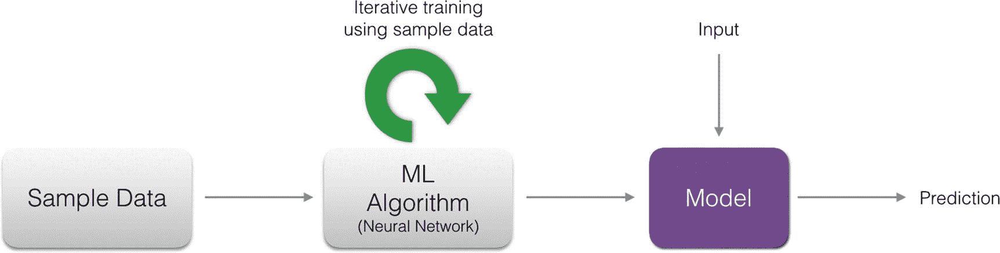图 10-1 机器学习工作的高层次图像所有 ML 算法都严重依赖数据来创建生成预测的模型。你拥有的样本数据越多，模型就越准确。在机器翻译（自动机器翻译）的情况下，样本数据是源语言中写的句子及其目标语言中的翻译的大量集合（语料库）。一个适当的 ML 算法（通常是人工神经网络）在样本数据上训练系统——这意味着它通过数据识别模式，而不是显式地告诉它语言语法和语义。然后，它会生成一个模型，可以自动将句子从源语言翻译到目标语言，甚至对它从未经过训练的句子也可以。训练后的模型可以被合并到软件应用程序中，使机器翻译成为该应用程序的一个特性。重要的是要注意，训练是一个迭代的、非常耗费资源和时间的过程。在普通计算机上，这可能需要数月时间才能完成，全天候运行。ML 算法通常需要高端计算机，配备专门的图形处理单元（GPU），以在合理的时间内完成训练。

### 机器学习与数据科学

机器学习是计算机科学和统计学的交汇处。图 10-2 阐明了这一点。为了完成它们的任务，机器学习算法大量借鉴了成熟的统计技术。它的数据驱动方法和对统计的使用有时使其看起来与数据科学等同。虽然这两个领域在技术上是相似的，但它们在应用和使用方面存在很大的差异。换句话说，机器学习不等同于数据科学。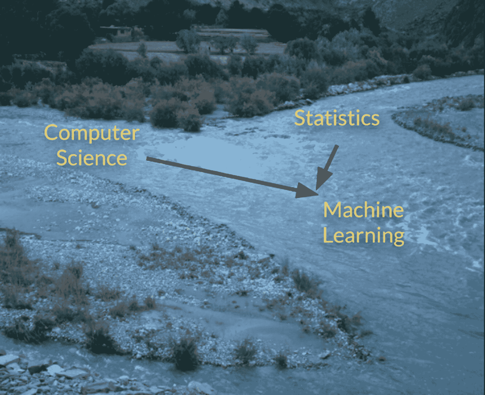图 10-2 机器学习是计算机科学和统计学领域的产物，这两个领域又源自数学，尽管这两个领域都处理大量的数据来生成模型，但它们的重点领域是不同的。数据科学侧重于数据分析，以得出能够帮助组织管理层做出有效决策的可操作见解，而机器学习侧重于创建可供其他软件组件（而不是人类）使用的预测模型，以生成准确的、数据驱动的结果。表 10-1 列出了这两个领域之间的主要差异。表 10-1 数据科学与机器学习之间的主要差异

| 数据科学 | 机器学习 |
| :-- | :-- |
| 专注于对数据进行分析以产生见解。 | 专注于使用数据进行自我学习和预测。 |
| 输出：图形，Excel 表格。 | 输出：软件，API。 |
| 受众：其他人类。 | 受众：其他软件。 |
| 有相当多的人为干预。 | 没有人为干预。 |

### 快速了解内部情况

借助 Azure 机器学习工作室等工具，不再需要了解机器学习的内部工作原理。然而，对内部技术细节的简要了解可以帮助您优化训练，从而得到更准确的模型。直到现在，我们一直在重复使用诸如模型和训练之类的术语，却没有解释它们究竟是什么。当然，您至少知道训练是 ML 算法使用样本数据使计算机学习某些内容的过程。您还知道模型是训练过程的输出。但是训练是如何进行的，模型实际上是什么样子呢？为了回答这些问题，请考虑以下示例。我们驾驶的汽车在引擎、尺寸、颜色、功能等方面各不相同。因此，它们的里程（每加仑/升的英里数）差异很大。如果汽车 A 给出 x MPG，很难说一个完全不同的汽车 B 会给出多少 MPG。B 可能会给出相同的里程 x，也可能不会，这取决于几个因素，其中马力是一个主要因素。通常，马力越高，里程越低，反之亦然。注：当然，马力不是影响汽车里程的唯一因素。其他因素包括气缸数量、重量、加速度、排量等。出于简单起见，我们在示例中没有考虑所有这些因素。假设我们有大量车型的马力和里程数据。但是，此列表并不详尽，并且不涵盖所有车型（或马力值）。因此，我们希望利用现有数据，以便在给定一个新的、以前未见的马力值时，我们的系统可以预测相应的里程。表 10-2 显示了数据的不完整快照。表 10-2 马力与 MPG 归功于 Dua, D. and Karra Taniskidou, E. (2017). UCI 机器学习资源库 [ [`archive.ics.uci.edu/ml`](http://archive.ics.uci.edu/ml) ]。尔湾，加利福尼亚州：加利福尼亚大学，信息与计算机科学学院。

| 车名 | 马力 | 油耗（MPG） |
| :-- | :-- | :-- |
| Chevrolet Chevelle Malibu | 130 | 18 |
| Buick Skylark 320 | 165 | 15 |
| Plymouth Satellite | 150 | 18 |
| AMC Rebel SST | 150 | 16 |
| Ford Torino | 140 | 17 |

#### 特征与目标

我们希望使用马力来预测油耗。在机器学习术语中，马力是一个特征，将被用来确定我们的目标（油耗）。为了设计一个能够准确预测 MPG 值的模型，仅有五行数据是不够的。我们需要尽可能多且具有不同数据的大量行数。幸运的是，我们有接近 400 行数据。如果我们使用 25 个特征对目标数据值绘制图表，它将如图 10-3 所示。图 10-3 马力作为 x 轴，MPG 作为 y 轴的散点图

#### 模型

现在，如果我们仔细地画一条线，让它尽可能地穿过尽可能多的点，我们将得到类似于图 10-4a 的样子。这条线代表我们的模型。是的，在线性回归中，这条简单的直线就是模型；图表代表了线性回归，因为我们画了一条直线。现在，对于未知的马力预测 MPG 值就很容易了。在图 10-4a 中，我们可以看到，马力 120 没有对应的 MPG。如果我们在 120 处画一条虚线——垂直于 x 轴——它与我们的模型相交的点就是预测的 MPG。如图 10-4b 所示，预测值大约为 19.5。从编程角度来看，我们可以使用著名的数学方程 y = mx + b（你还记得这个方程吗？还记得你的高中时光吗？），其中 m 是线的斜率，b 是它的 y 截距。由于我们的 y 轴表示目标（MPG），x 轴表示特征（马力），预测 MPG 就像是将 x 的值插入到方程中得到 y 的值一样简单。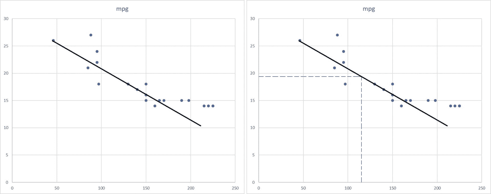图 10-4(a) 通过画线创建我们的线性回归模型（左）。(b) 使用我们的模型进行预测（右）

#### 训练和损失

我们画的线只是一个近似值。绘制线条的目标——为了创建一个模型——是确保它距离大多数点不远。用更技术性的话说，绘制模型的目标是最小化损失。但是什么是损失？点和线之间的垂直距离称为损失。也就是说，实际目标值（图表上的点）与预测目标值（线上的点）在相同特征值上的差异的绝对值。图 10-5 显示了前三个点的个别损失值。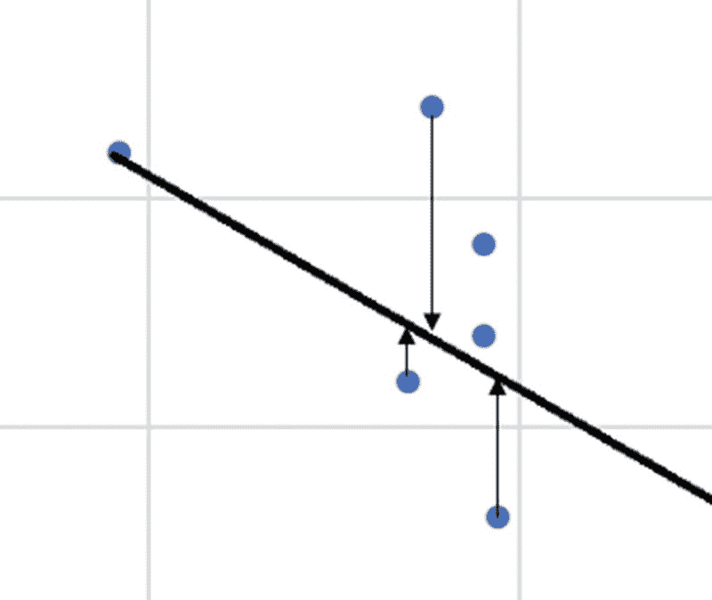图 10-5 损失是实际值和预测目标值之间的垂直距离为了计算我们模型的整体损失，我们可以使用几个已建立的损失函数之一。最流行的损失函数是均方误差（MSE），它是所有个别损失的平方和的均值。因此，我们将训练定义为最小化损失的迭代过程。也就是说，绘制和重新绘制模型，直到我们达到一个相当低的 MSE（总体损失）值。与绘制模型和计算损失一样，有几种已经建立的方法来最小化总体损失。随机梯度下降（SGD）是一种常见的数学技术，用于迭代地最小化损失，从而训练模型。

#### 我们接下来该怎么办呢？

到此为止！这就是你需要了解的有关机器学习内部的全部内容。突然间，你从第一章以来听到的无伤大雅的高层术语似乎太数学化了。但是如果你一直跟着我们并理解了大部分机器学习的内部概念，恭喜你！你已经掌握了一些开始使用机器学习框架的信心。诸如 Tensorflow 和 scikit-learn 之类的开源机器学习框架所做的就是提供给你一些现成的方法来创建模型、计算损失并训练模型。然而，你需要对数据清洗、选择特征以及评估训练模型等工作有很好的工作知识——所有这些再次需要对统计学和数学有相当的掌握。一个机器学习框架只是让处理多种算法和多特征场景变得更容易一些。Azure 机器学习工作室通过自动化上述所有过程，进一步提高了机器学习的易用性，同时仍然让专业的机器学习工程师和数据科学家对底层过程有控制权。

## 机器学习解决的问题

机器学习通过传统编程技术无法完成的事情，实际上打开了无限的可能性。如果我们开始列举机器学习可以解决的所有问题，我们很快就会用完纸。幸运的是，所有这些问题都可以归类为少数几种问题类型。让我们探讨最常见的类型。

### 分类

辨别某物是类型 X 还是 Y 是一项非常常见的机器学习任务。人类在很小的时候就具备了辨别各种对象类型的能力。我们可以用眼睛看着动物，立刻说，“那是一只狗。” 对于人类来说很容易，对于计算机来说则是一个巨大的任务。从逻辑上思考计算机如何执行这个任务，使用显式编程的方式，提出一个解决方案并不罕见，即计算机使用摄像头拍摄动物的照片（模拟人类眼睛），并将其与图像库中的一组狗的图像进行比较。以获得一个完全匹配的照片的概率极低。我们如何让计算机“学会”识别狗，无论它们的姿势或位置如何？这是一个非常好的分类问题的例子。图 10-6 展示了分类的工作。 图 10-6 多类分类来识别动物的种类。对于每个类别，使用数百张图像来训练计算机分类问题有两种变体——二类分类（是 X 还是 Y？）和多类分类（它是什么种类？）。考虑到物联网设备的年龄、平均温度和磨损程度，它会在接下来的三天内失效吗（是或否）？这是两个二类分类问题的例子。这是一个两条腿的动物还是四条腿的动物？这是两个二类分类问题的例子。多类分类的例子包括检测动物的类型和狗的品种。在这两个例子中，我们的系统需要用几种不同的动物类型和狗品种分别进行训练，每个动物类型或狗品种代表一个类别。谁告诉计算机第一张图片是狗还是猫？简短的回答——人类。每张图片都手动标记了它代表的类别的名称，并提供给计算机。这个过程称为标记，提供给训练数据的类名称为标签。

### 回归

这种有监督学习（稍后会详细介绍）用于期望输出是连续的情况。让我们看看输出连续是什么意思。我们在“快速查看内部”部分早些时候已经了解过回归。现在你知道回归是利用某物的过去数据来预测其参数之一。例如，使用汽车的马力-里程数据，我们可以预测未知马力值的里程（输出）。由于里程是一个可变的变量，随着马力、年龄、气缸等变化而变化，即使对于同一辆车，它也被称为连续的。与连续相对的是离散。诸如汽车颜色、型号年份、大小等参数都是离散特征。一辆红色汽车将永远是红色的，无论其年龄、马力或里程如何。根据你刚刚了解的输出类型，你能猜到输出类型分类处理的是什么吗？如果你回答是离散的，那么你是完全正确的。回归问题非常普遍，解决这类问题的技术经常被科学界用于研究、企业用于制定商业项目，甚至被报纸和杂志用于预测消费者和市场趋势。

### 异常检测

在数据中检测异常的能力是积极确保安全和顺畅运行的关键方面（见图 10-7）。与分类不同，人类通常难以手动执行异常检测，主要是因为正确确定正常趋势所需处理的数据量非常大。图 10-7：在一致趋势中的异常点。检测信用卡的未授权交易是最常见的异常检测用例之一。考虑这一点——数百万人每天使用信用卡，一些人每天使用多次。对于拥有数十万信用卡客户的银行来说，来自卡片使用的每日数据量是巨大的。实时搜索这些海量数据以寻找可疑模式并非易事。基于客户当前位置和过去消费趋势，基于机器学习的异常检测算法帮助实时检测（在被盗信用卡上的）虚假交易。其他异常检测用例包括检测高流量网站上的网络入侵，在实时评估患者各种健康参数的基础上作出医疗预测，发现银行中难以发现的小或大型金融欺诈等。

### 聚类

有时候通过首先组织数据来检查某些模式是非常有用的。例如，对于某个包装零食公司来说，知道哪些客户喜欢相同的口味可能非常重要。他们可以使用基于机器学习的聚类按口味组织他们的用户，如图 10-8 所示。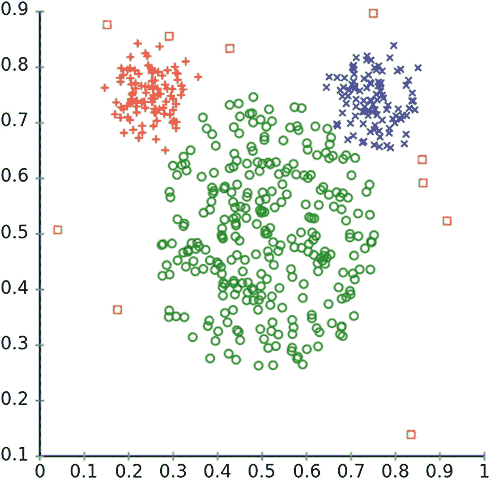图 10-8：聚类允许您根据标准将数据组织成集群，以便进行简单决策。

## 机器学习的类型

在了解了什么是机器学习——包括对其内部细节的快速探索——以及机器学习可以解决的问题之后，让我们快速看一下各种类型的机器学习。实际上，只有三种类型，这取决于训练的方式。

### 监督学习

这里，训练数据是有标签的。对于语言检测算法来说，如果我们提供给算法的句子明确标记了所用语言：写成法语的句子和非法语的句子，写成西班牙语的句子和非西班牙语的句子，以此类推，那么学习过程就是有监督的。由于先前的标记是由人类完成的，这增加了维护这类算法的工作量和成本。到目前为止，这是最常见的机器学习形式，因为它能够提供更准确的结果。分类、回归和异常检测都是监督学习的形式。

### 无监督学习

这里，训练数据没有标签。由于缺乏标签，算法当然无法神奇地学会准确识别句子的语言，但它可以区分一种语言和另一种语言。也就是说，通过无监督学习，机器学习算法可以学会辨别法语句子与西班牙语句子的不同，以及它们与印地语句子的不同等等。类似地，另一个算法可以区分喜欢汤姆·汉克斯的人和喜欢乔治·克鲁尼的人等等，并因此形成喜欢同一位演员的人的群集。聚类算法是无监督学习的一种形式。

### 强化学习

在这里，机器并没有明确提供训练数据。它必须与环境互动，以实现目标。由于缺乏训练数据，它必须从零开始自学，并依赖试错技术来做出决策并发现自己正确的路径。对于机器采取的每个动作，都有一个后果，对于每个后果，它都会获得一个数值奖励。因此，如果一个动作产生了期望的结果，它会收到“好”的评价。如果结果是灾难性的，它会收到“非常、非常糟糕”的评价。像人类一样，机器努力最大化其总数值奖励——也就是说，通过不重复自己的错误来获得尽可能多的“好”和“非常好”的评价。当机器不得不处理非常动态的环境时，这种机器学习技术尤其有用，其中创建和提供训练数据根本不可行。例如，驾驶汽车、玩视频游戏等。强化学习也可以应用于创建能够通过学习示例自己创作绘画、图像、音乐，甚至歌曲的 AI。

## Azure 机器学习工作室

创建 ML 应用程序有多种方法。我们之前在“内部快速查看”部分看到了线性回归背后的数学原理。人们可以自己编写线性回归的代码实现。这不仅费时，而且可能低效且充满错误。ML 框架，如 Tensorflow，通过提供高级 API 来创建自定义 ML 模型，简化了事情，同时假定对基础概念有很好的理解。Azure ML Studio 提供了一种新颖且更容易的方法来创建端到端的 ML 解决方案，而无需了解很多数据科学或 ML 详情，甚至无需编码技能。ML Studio 是一个图形化的、拖放式界面，用于设计和运行 ML 工作流。它允许你在浏览器中运行简单到复杂的 ML 解决方案。创建 ML 工作流不涉及任何编码，只需要将不同的可拖动组件放在一起。ML Studio 配备了大量经过测试的多种 ML 算法的实现，以解决几种不同类型的问题。图 10-9 给出了 ML Studio 中典型 ML 工作流程的概述。图 10-9Azure ML Studio 中 ML 解决方案的工作流程让我们逐步分解工作流程：

1.  导入数据。在 ML Studio 中，你首先要做的事情就是导入要进行机器学习的数据。ML Studio 支持多种文件格式，包括 Excel 表格、CSV、Hadoop Hive、Azure SQL DB、blob 存储等。

1.  预处理。导入的原始数据可能不能直接用于机器学习分析。例如，在表格格式的数据结构中，一些行可能缺少一个或多个列的值。同样，可能有一些列大部分行都没有值。删除缺失数据可能是为了使整体输入更一致和可靠。微软为数据定义了三个关键标准：

    1.  相关性—所有列（特征）彼此相关，并与目标列相关。

    1.  连通性—数据值缺失为零或极小。

    1.  准确性—大多数行具有准确（可选地是精确）的数据值。

1.  拆分数据。机器学习（一般来说）需要将数据拆分为两个（非相等的）部分——训练数据和测试数据。训练数据由 ML 算法使用来生成初始模型。测试数据用于评估生成的模型，帮助检查其正确性（预测值 vs 测试数据集中的值）。

1.  训练模型。这是一个迭代过程，使用训练数据集来创建模型。目标是最小化损失。

1.  评估模型。如前所述，初始模型创建后会使用测试数据来评估模型。

提示：可以在整个过程的每个步骤可视化数据。Azure ML Studio 提供了多种数据可视化选项，包括散点图、柱状图、直方图、Jupyter Notebook 等。

### 选择算法

在机器学习工作流中最关键的一步是在导入数据并对其进行预处理后知道要应用哪种算法。ML Studio 自带一系列内置算法实现供选择。选择合适的算法取决于解决的问题类型以及将要处理的数据类型。对于数据科学家来说，选择最合适的算法可能是一项相当容易的任务。他们可能需要尝试一些不同的选项，但至少他们会知道要尝试哪些算法是正确的。对于初学者或非技术人员来说，挑选一个算法可能是一项艰巨的任务。微软提供了一个称为机器学习算法备忘单的快速参考图表，使挑选算法变得轻松。备忘单可在 [`bit.ly/2GywUlB`](https://bit.ly/2GywUlB) 获取。算法根据问题类型分组，如表 10-3 所示。此外，根据准确度和训练时间等参数提供了提示。表 10-3 Azure ML Studio 中可用算法列表

| 问题 | 算法 |
| --- | --- |
| 回归 | 贝叶斯线性回归、提升决策树、决策森林、快速森林分位数回归、线性回归、神经网络回归、序数回归、泊松回归 |
| 二分类 | 平均感知器、贝叶斯点机器、提升决策树、决策森林、决策丛林、逻辑回归、神经网络、支持向量机（SVM） |
| 多类分类 | 决策森林、决策丛林、逻辑回归、神经网络、一对所有 |
| :-- | :-- |
| 异常检测 | 单类 SVM、基于主成分分析（PCA）的异常检测 |
| 聚类 | K-means 聚类 |

## 使用 Azure ML Studio 解决问题

是时候用机器学习解决一个真实世界的问题了！Asclepius 联盟希望利用从各种物联网设备收集的患者数据可靠地预测患者是否会患上糖尿病。及时检测糖尿病可以有效地预防控制该疾病。这个问题也可以陈述为“患者是否会患上糖尿病？”，因为输出可以是是（1）或否（0）。为了能够进行任何预测，我们当然需要大量关于真实糖尿病案例的过去数据，这些数据可以告诉我们哪些各种患者健康参数的组合导致了糖尿病，哪些没有。让我们开始吧。注意：这个问题也可以使用线性回归来解决。但是由于输出总是 0 或 1，而不是更连续的值，比如患上糖尿病的概率，所以最好使用分类算法来解决。在学习和尝试机器学习的过程中，你会遇到很多可以用多种技术解决的问题。有时选择正确的技术是轻而易举的，而其他时候则需要尝试不同的技术，并确定哪种技术产生了最佳结果。

### 注册 Azure ML Studio

使用 Azure ML Studio 不需要有效的 Azure 订阅。如果你有一个，你可以用它来解锁其完整功能集。如果没有，你可以使用你的个人微软账户 (@hotmail.com、@outlook.com 等) 登录到 ML Studio 并带有一些限制地使用它。甚至有第三个选项——一个八小时的无限制试用，甚至不需要你去登录。访问 [`studio.azureml.net/`](https://studio.azureml.net/)，点击“在这里注册”链接，并选择适当的访问权限。我们建议选择免费的工作空间访问权限，这将允许你免费获得没有时间限制的功能限制访问。这种访问权限足以让你设计、评估和部署下面将要设计的 ML 解决方案。如果你喜欢 ML Studio 并想尝试有限制的功能并增加存储空间，你随时可以升级。选择免费工作空间选项并登录到 ML Studio。可能需要几分钟时间才能准备好首次使用 Studio。

### 创建一个实验

在 Studio 中，一个 ML 解决方案称为一个实验。你可以选择从头开始创建自己的实验，也可以从数十个现有样本中选择。除了 ML Studio 提供的样本外，还有 Azure AI 画廊（[`gallery.azure.ai/`](https://gallery.azure.ai/)），其中列有社区贡献的 ML 实验列表，你可以免费保存到自己的工作空间中，并将它们用作你自己实验的起点。此时，你的工作空间将完全为空。实验选项卡应该如图 10-10 所示。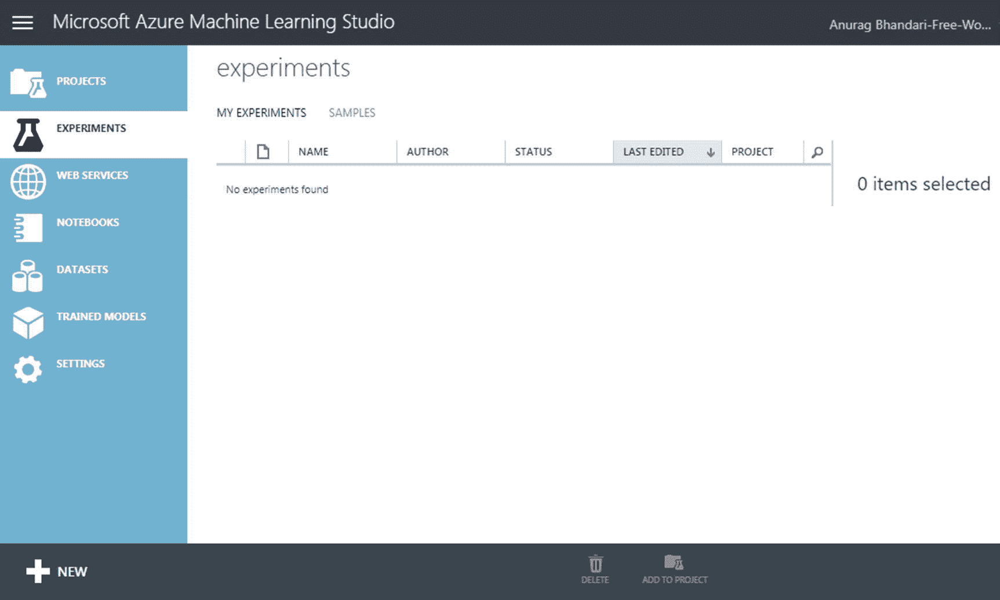图 10-10 新 Azure ML Studio 工作空间中的实验选项卡让我们从头开始创建一个新实验，以更好地理解 ML 工作流程中的各个组件，以及如何正确设置它们。点击左下角的“新建”按钮，选择实验 ➤ 空白实验。在你的新实验创建并准备就绪后，给它一个合适的名称、摘要和描述。你可以使用我们自己实验中使用的名称——糖尿病预测。

### 导入数据

数据是机器学习解决方案中最重要的部分。第一件要做的事情是导入能帮助我们训练模型的数据。为了能够预测患者的糖尿病，我们需要来自过去病例的数据。在我们拥有一个完全功能的、实时的物联网解决方案之前，该解决方案可以捕获与糖尿病相关的患者健康参数，我们需要找到另一种获取数据的方法。幸运的是，有一些在线资源库可以免费提供高质量的数据集。其中一个流行的选项是加州大学尔湾分校（UCI）机器学习库（[`archive.ics.uci.edu/ml/`](https://archive.ics.uci.edu/ml/)）。该资源库是一个由捐赠的数据集组成的策划列表，涉及到几个不同领域（生命科学、工程、商业等）和机器学习问题类型（分类、回归等）。在这些数据集中，你会找到一些关于糖尿病的选项。你可以从这里下载一个数据集，然后在 ML Studio 中导入它，该工具支持导入多种格式的数据，如 CSV、Excel、SQL 等。或者，你可以简单地重用 ML Studio 中自带的一些样本数据集，其中一些是基于 UCI 的 ML 资料库数据集的。其中之一就是用于糖尿病的数据集，我们将在这个实验中使用。从你的实验页面的左侧边栏，转到已保存的数据集 ➤ 样本 ➤ 皮马印第安人糖尿病二分类数据集。你也可以使用搜索功能搜索“糖尿病”。将数据集拖放到右侧的实验画布上，如图 10-11 所示。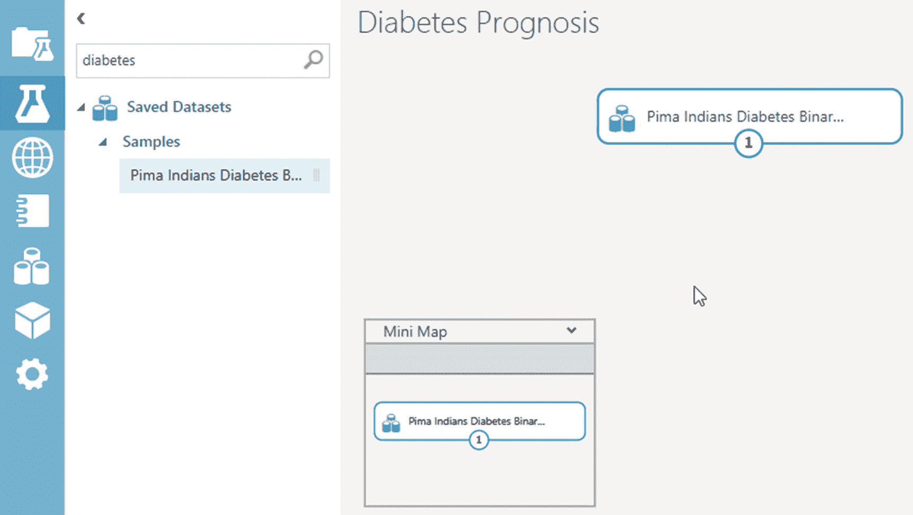图 10-11 在 ML Studio 实验中导入样本数据查看数据集内部内容是个好主意。这不仅可以让你了解 Studio 将用于训练的数据，还可以帮助你选择正确的特征进行预测。在实验画布中，右键点击数据集，然后选择数据集 ➤ 可视化。你也可以点击数据集的输出端口（底部中间的小圆圈），然后点击“可视化”。

### 预处理数据

这个糖尿病数据集有 768 行和 9 列。每一行代表一个患者的健康参数。对于我们的实验来说，最相关的列包括“口服葡萄糖耐量试验后两小时的血浆葡萄糖浓度”（代表血糖水平）、“舒张压”、“体重指数”和“年龄”。类别变量列表示患者是否被诊断为糖尿病（是或否；1 或 0）。这一列将是我们的目标（输出），其特征来自其他列。浏览几个案例，分析它们，并查看各种健康参数与诊断之间的相关性。如果你更仔细地观察，你会发现有些行在某些列上的值为零，而零在那些列中是没有意义的（例如，体重指数和 2 小时血清胰岛素）。这些可能是无法获得该患者的缺失值。为了提高该数据集的质量，我们可以用智能估计值替换所有缺失值，或者直接将它们删除。前者需要高级数据科学技能。为简单起见，让我们只删除所有具有缺失值的行。注意，2 小时血清胰岛素列似乎有大量缺失值。我们应该删除整个列，以确保在清理数据时不会丢失很多行。我们的目标是尽可能使用更多的记录来训练我们的模型，以提高准确性。

#### 删除不良列

从左侧边栏，转到数据转换 ➤ 操作，并将“选择数据集中的列”拖放到画布上，就在数据集的下方。通过将数据集的输出端口向“选择列”模块的输入端口拖动，将数据集的输出端口连接到新添加的模块的输入端口。这将绘制一个从数据集指向模块的箭头。Azure ML Studio 中的模块具有允许数据从一个组件流向另一个组件的端口。一些具有输入端口，一些具有输出端口，一些具有两者。有一些模块甚至有多个输入或输出端口，您很快就会看到。单击一次“选择列”模块会在右侧边栏中显示其属性。从那里，单击“启动列选择器”按钮，并排除“2 小时血清胰岛素”列，如图 10-12 所示。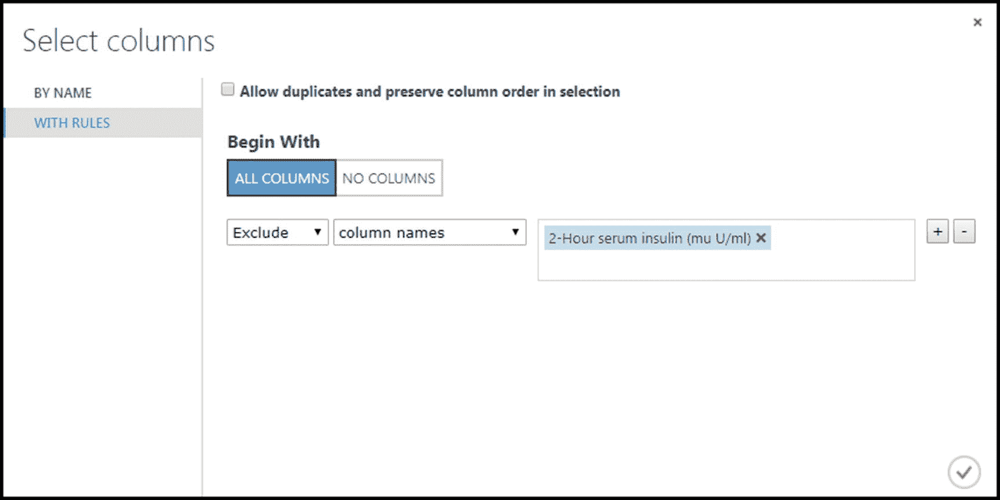图 10-12 在 Azure ML Studio 中排除一列作为提示，您可以向模块添加关于其功能的注释。双击“选择列”模块，然后输入注释“排除 2 小时血清胰岛素”。

#### 重命名列

我们数据集中的列的默认名称太长且描述性太强了。让我们简化列名称。在画布上搜索并添加编辑元数据模块，就在“选择列”下方。将其连接到上面的模块。在模块的属性窗格中，单击“启动列选择器”，然后选择除了“2 小时血清胰岛素”以外的所有列。返回到属性窗格，将以下新名称添加到“新列名称”字段中，其余字段保持不变：怀孕次数，葡萄糖水平，舒张压，三头肌皮褶厚度，BMI，糖尿病谱系功能，年龄，糖尿病者单击“运行”按钮以运行您的实验。运行完成后，所有成功运行的模块都将有一个绿色的复选标记。此时，右键单击编辑元数据模块并可视化数据。您应该看到已更名列的相同数据集。

#### 删除带有缺失值的行

这通常使用“清除缺失数据”模块完成，该模块可以删除所有或某些列具有未指定值的行。由于我们的数据没有明确的缺失值，这个模块对我们没用。我们需要能够排除某些列设置为 0 的行的东西（例如，血糖水平、BMI 等）。在画布中搜索并添加“应用 SQL 转换”模块，放在“编辑元数据”模块的正下方。将其第一个输入端口连接到上面的模块。在模块属性窗格的 SQL 查询脚本字段中输入以下查询：select * from t1 where glucose_level != 0 and diastolic_blood_pressure != 0 and triceps_skin_fold_thickness !=0 and bmi != 0;运行您的实验。完成后，通过右键单击“应用 SQL 转换”模块来可视化您的数据。现在你应该只看到原来 768 行中的 532 行。你的实验画布现在应该看起来像图 10-13 所示。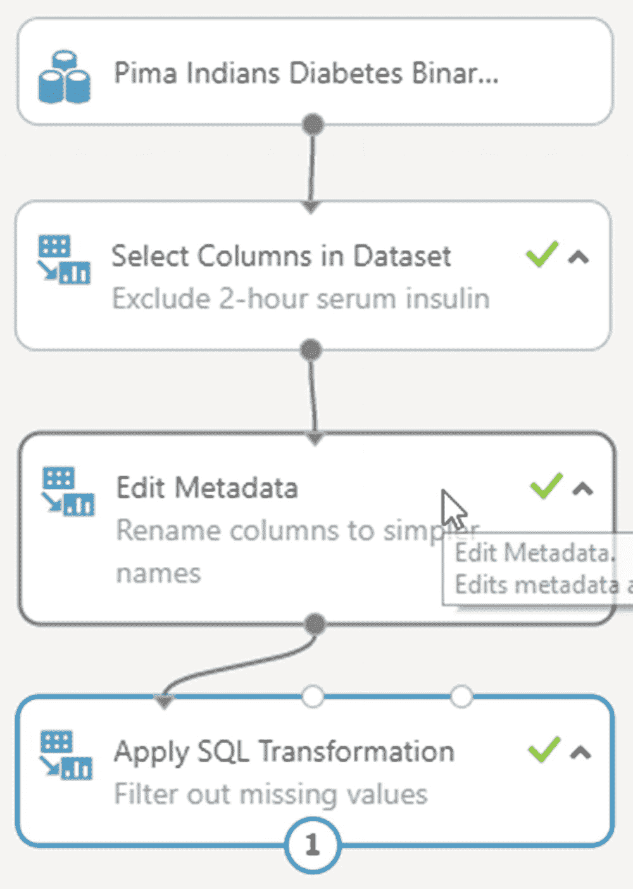图 10-13 数据预处理后的实验画布

### 定义特征

我们的数据现在可以用于训练了。但在进行训练之前，我们需要从数据集中精选出相关的列，作为特征。在画布中搜索并添加第二个“选择数据集中的列”模块，放在“应用 SQL 转换”模块的正下方。将其连接到上面的模块。从列选择器中选择血糖水平、舒张压、三头肌皮褶厚度、糖尿病谱系功能、BMI 和年龄。

### 数据拆分

正如本章前面讨论的那样，数据集应该被分成两部分——训练数据和评分数据。而训练数据用于实际训练模型，评分数据则保留用于后续测试训练好的模型以计算其损失。在画布中搜索并添加名为“拆分数据”的模块，就在第二个“选择列”模块的下方。将其连接到上方的模块。在其属性页面中，将第一个输出数据集的行分数设置为 0.75。保留所有其他字段不变。运行实验以确保没有错误。一旦完成，你可以可视化“拆分数据”模块的左输出端口以检查训练数据和右输出端口以检查评分数据。你应该会发现两者的比例为 75-25%。

### 应用机器学习算法

准备好数据和特征后，让我们从几个内置算法中挑选一个算法来训练模型。在画布中搜索并添加名为“二分类决策森林”的模块，就在“拆分数据”的左侧。这个算法以其准确性和快速训练时间而闻名。算法模块没有输入端口，所以我们暂时不会将其连接到任何其他模块。你的实验画布现在应该像图 10-14 一样。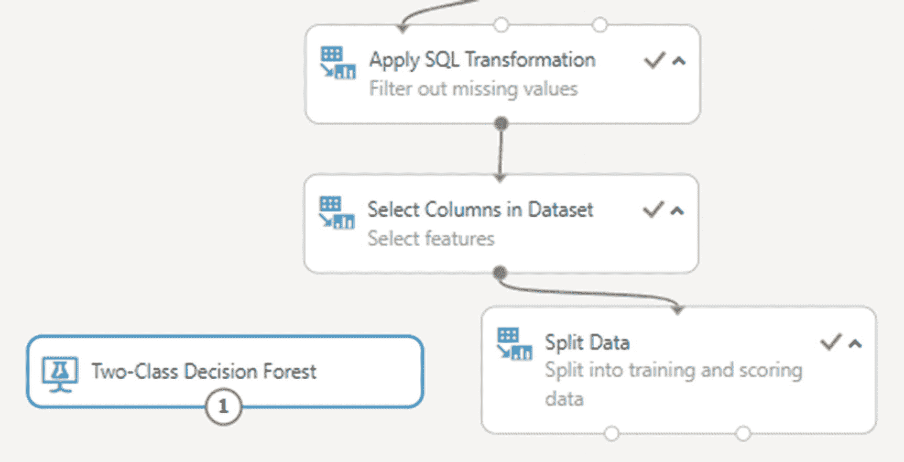图 10-14 准备好数据和算法后，我们可以执行训练操作了。

### 训练模型

在画布中搜索并添加名为“训练模型”的模块，就在算法和“拆分数据”模块的下方。将其左输入端口连接到算法模块，右端口连接到“拆分数据”的左输出端口。从其属性窗格中，选择“糖尿病”列。这样做将把它设置为我们模型的目标值。运行实验。如果一切顺利，所有模块都会有一个绿色的勾号。像数据一样，你也可以将训练好的模型可视化，这样你就会看到训练过程中构建的各种树。

### 对训练模型进行评分和评估

使用所选算法进行训练仅需几秒钟即可完成。训练时间与数据量和选择的算法成正比。尽管 Azure ML Studio 实现了先进的机器学习算法，但不能马上满意生成的模型。就像烹饪食谱一样，应尝试完成的菜肴以确定是否需要进行任何修改以使其更加美味，训练好的模型也应进行评分和评估，以检查可以帮助确定是否需要进行任何修改的特定参数，例如更改算法。在画布中搜索并添加“评分模型”模块，将其左输入端连接到“训练模型”模块，右端口连接到“拆分数据”的右输出端口。运行实验。图 10-15 显示了可视化得分数据的外观。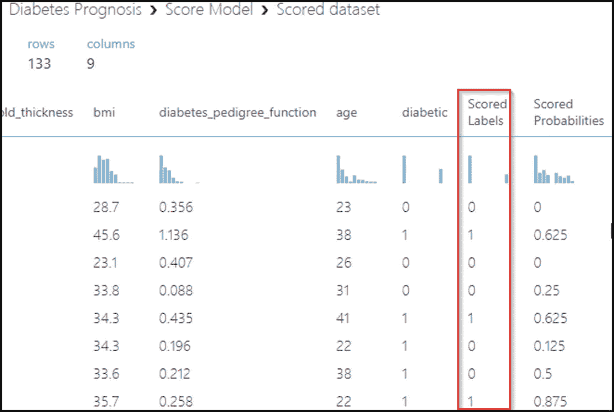图 10-15 Azure ML Studio 中得分数据的可视化正如您从图中可以确认的那样，评分是使用“拆分数据”模块的 25% 输出执行的。 “糖尿病”列中的值代表数据集中的实际值，而“预测标签”列中的值是预测值。还要注意“评分标签”和“预测值”列之间的相关性。如果大多数行的实际和预测值匹配，我们可以说我们的训练模型是准确的。如果不匹配，请尝试调整算法（或完全替换）并再次运行实验。接下来，在画布中搜索并添加“评分模型”模块，将其左输入端与上述模块连接。运行实验并可视化“评估模型”的输出。您将看到诸如准确性、精确度、f-分数等指标，可用于确定此模型的正确性。对于所有上述指标，接近 1 的值表示良好的模型。参见图 10-16。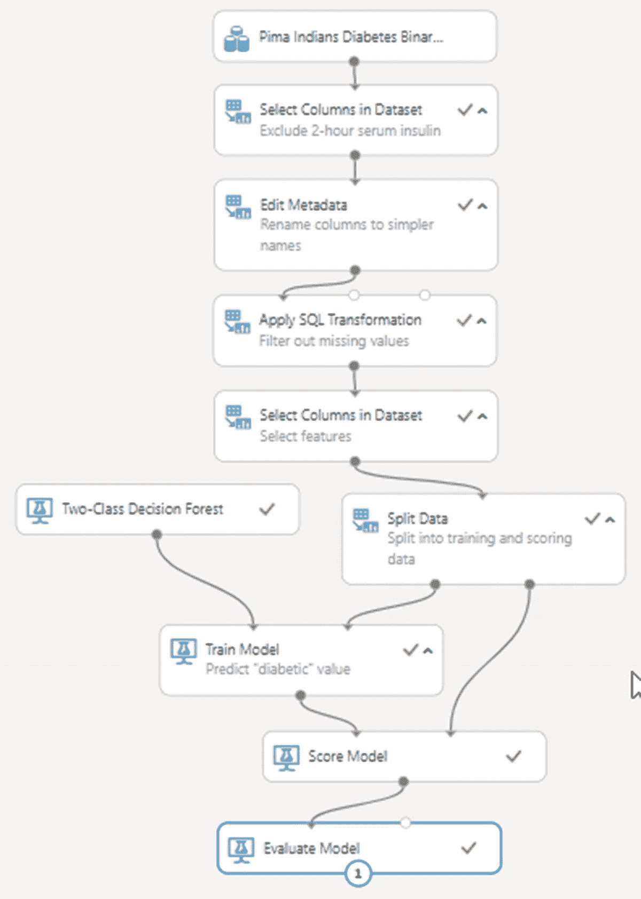图 10-16 两类分类机器学习解决方案的最终预览

### 将训练好的模型部署为 Web 服务

现在我们有了一个训练好且经过测试的模型，是时候将其投入实际使用了。通过将其部署为 Web 服务，我们将为最终用户的软件应用程序提供一种以编程方式预测值的选项。例如，我们可以在我们的 IoT 解决方案后端或者使用 Azure Stream Analytics 实时预测糖尿病中使用糖尿病预测模型的 Web 服务。选择“设置 Web 服务 ➤ 预测 Web 服务”选项。这将将我们当前的实验转换为所谓的预测实验。转换完成后，您的实验将具有两个标签页——训练实验和预测实验，前者包含您在前几节设置的实验，后者包含将用于 Web 服务的转换版本。在预测实验标签页中，单击“运行”按钮。一旦运行成功完成，单击“部署 Web 服务”。您将被重定向到一个新页面，在该页面上，您将找到有关已部署 Web 服务的详细信息。它还将提供一个选项，用于使用特定功能的指定值测试 Web 服务。有关发布、调整和使用预测 Web 服务的更多信息，请参考 ML Studio 的文档 [`bit.ly/2Eincl7`](https://bit.ly/2Eincl7)。

## 复习

在本章中，您学到了： 

+   机器学习基础知识——什么是以及为什么

+   机器学习和数据科学之间的区别

+   机器学习内部的简要概述——模型和训练

+   机器学习解决的问题——分类、回归等

+   机器学习的类型——监督、无监督和强化

+   Azure 机器学习工作室

+   创建和部署你自己的机器学习解决方案

恭喜！您现在已正式具备 AI 2.0 的能力。在本书中，您学习了许多新技术，这些技术将使您脱颖而出，并帮助您设计下一代软件应用程序。我们鼓励您更详细地了解每项新技术，并尽可能多地进行实践，以提高您的动手能力。
