第一部分

衍生品、期权和随机优势

## 第一章

背景和预备知识

金融行业对于国家、地区和世界经济至关重要。这个行业在很大程度上依赖于对基础工具的数学建模。计算技术在设计相关算法方面非常有帮助，这些算法使我们能够理解市场的运作方式，并且非常适用于高度相关的研究问题。

要理解特定计算技术在特定金融工具上的应用，必须清楚地理解基础理论。然而，由于理论文献的广泛性，需要进行一些选择。

我们选择了高度吸引人的期权定价领域，这是计算金融和风险分析的核心任务。一个期权是一种合同，它赋予持有人权利，但不是义务，在预先约定的价格上或之前买入或卖出资产，即行权价格，在到期日或到期日前。期权定价的广泛领域非常雄心勃勃，多样化到足以需要各种各样的计算工具。主要限制在期权定价方面使我们能够拥有更加连贯和全面的教科书，很大程度上避免了被从计算问题上分心。期权是衍生品的标准示例，一种金融工具，其价值依赖于一个或多个通常称为基础资产的资产。通常，它采取购买或出售资产或商品、房地产等项目的合同形式，在到期日或到期日前以行权价格进行交易。衍生品的其他示例包括债券、期货合约、远期合约和掉期合约。 （有关详细讨论，请参见 Jarrow 和 Turnbull，2000 年等。）衍生品交易的金融市场可能被指定为衍生品市场。我们假设市场完美，即不存在交易成本，没有卖空限制，并存在普通的借贷利率。卖空是一种商业策略，涉及借入资产并立即出售，再购回资产（希望以较低的价格），并将其归还给出借人以关闭流程。（本文提供了有关此类内容的进一步讨论，请参见本文的第十一章和第十五章。）

衍生品市场可以分为两个子组，一个是在有组织的交易所市场中交易衍生品的地方，提供市场价格维护和所有透明度。一个交易所交易的衍生品的例子是期权。在期货合约下，一种交易所交易的协议，买方负责在将来的某个日期以预先约定的价格购买基础资产。卖方承诺在规定的价格和日期交付资产。另一种市场交易的衍生品是债券，政府和公司部门发行的债务证券，用于筹集资金，包括扩大一个或多个部门、基础设施改善和支付现有债务等各种目的。一个金融市场，在其中进行债券交易，被称为债券市场或信用市场或债务市场。另一种市场交易是场外交易(OTC)类型。这种场外交易是直接在交易者之间进行，没有交易所监管。场外衍生品的一个例子是远期合约，根据这个合约，两个交易方约定在指定日期以约定的价格买入或卖出资产。掉期是一种场外交易的衍生品，在这种衍生品中，金融工具在预定的时间在有关各方之间交换。

衍生市场的一个极其重要的组成部分是风险。风险可以是各种类型，如资产风险、利率风险、外汇风险、信用风险、商品风险等等。资产风险由资产价格波动引起，利率风险指的是利率变动可能对投资产生负面影响的机会。同样，外汇风险源于两种不同货币之间汇率波动。另一方面，信用风险表示如果借款人未能履行承诺的付款，贷款人可能会损失本金和利息的可能性。商品风险与未来商品价格波动可能带来的损失有关。但风险也可能带来意外的好处。投资者希望通过冒险投资来获得未来的利润。考虑到风险可能有不同的概念，使用适当的工具进行风险管理就变得至关重要。衍生品的不同形式在这种情况下变得有用。更准确地说，衍生品是用于管理金融风险的金融工具。它们将不同形式的金融风险转移到衍生市场。它们是用于对冲或边界风险的金融证券，即保护或至少减少风险的意义上。资产定价的基本原理是非套利的存在。根据套利机会，交易者可以利用价格不平衡来提取快速利润而没有任何风险。因此，非套利假设意味着单一价格的规则。（有关套利的进一步讨论，请参见本专著的第十一章和第十五章。）

由于在专著的第一部分，我们主要关注期权，因此在第 3–6 章中对期权及相关现象进行了简要、严谨和权威的讨论。为了完整起见，我们在第二章中提供了现金流和固定收益证券估值的简化分析。

鉴于对于任何投资于风险资产都包含损失的可能性，投资者很可能会研究投资组合中的风险管理问题，即投资者持有的资产组合。投资者通常可能面临按照他的偏好（通过 von Neumann–Morgenstern 效用函数表示）对各种金融资产或其组合的随机收益分配进行排序的必要性。 这个问题已经在文献的几篇开创性贡献中得到了解决。 解决问题的一种相当一般的方法是随机优势规则，它使我们能够对大类效用函数的随机收益分配进行排序。 不需要对效用函数的形式具有具体的知识。 在第七章中，我们简要介绍了随机优势概念的示例性引导。

## **第二章**

**现金流和固定收益证券的估值：简化分析**

### **2.1 引言**

为了判断投资的盈利能力，比如说，一个公司对项目的投资，有必要比较现金流入（利益）和流出（成本）的现值。 用于这种类型分析的标准工具是净现值（NPV）准则，它考虑了利益和成本的现值之间的差异。 其他替代方案包括成本效益比和内部收益率（IRR），一种使 NPV 等于零的折现率。 在本章中，我们对这些标准进行了简要讨论。 还简要讨论了债券作为一种特殊类型的固定收益证券。

### 2.2 净现值

当一个公司决定启动一个项目时，这个决定将在一个或多个时期对公司的财务状况产生一些重要影响。公司必须获得一个总体指标，以判断在项目实施后是否会变得更好或更糟。

用于确定与投资相关的所有资金流入和流出的当前值的 NPV 方法是一个适当的工具。假定项目寿命内的无风险利率 *r* 保持恒定。

我们将在时期 *t* 发生的资金流入（收益）和流出（成本）表示为 *B* [*t*] 和 *C* [*t*]，其中 *t* = 0,1…,*T*。这里，*t* = 0 和 *t* = *T* 分别代表当前时期和投资影响收益和成本的最后时期。尽管 *C* [0] 表示初始投资的大小，但对于 *t* ≥ 1，*C* [*t*] 可视为维护成本。自然地假设 *C* [0] > 0 和 *C* [*t*] ≥ 0 对于 *t* ≥ 1。另一方面，*B* [0] 可能为 0，但从 *t* = 1 开始，*B* [*t*] 均为非负数。然后，资金流入的贴现现值（DPV）变为 。类似地，流出的 DPV 变为 。然后，项目的 NPV 现在可以定义为

(2.1)

项目应该根据 NPV > 0 或 NPV < 0 来实施或拒绝。如果 NPV = 0，则公司对这两个选择之间是漠不关心的。要使 NPV 成为启动新项目的适当指导方针，需要在不同时期正确估计 *B* [*t*] 和 *C* [*t*]。如果投资金额在项目之间有所不同，则无法使用 NPV 准则进行比较。此外，项目的寿命必须是相同的，以便进行比较。

公司还可以使用收益成本比作为判断是否应进行项目的标尺。它的正式定义为

(2.2)

显然，*B*/*C*大于或小于 1，当且仅当 NPV 为正或为负时。较高的 NPV 和*B*/*C*的值对投资者更有利。然而，它们可能会以不同的方向对备选项目进行排名。

我们在当前情况下使用的最终评估器是 IRR，使项目的 NPV 等于 0 的利率。由于利率可以被解释为时间价值，IRR 是投资者可以从他的投资中期望的利率。如果 IRR 高于贴现率，则应进行该项目。IRR 可以被隐式定义为

(2.3)

一般来说，这个方程有*T*个根。在这种情况下，最高的根超过贴现率的价值可能被用作 IRR。如果存在互相排斥的几个项目，则公司应选择产生最高 IRR 的项目。当贴现率随时间变化时，使用 IRR 准则作为项目选择的评估原则可能不可行。因此，尽管 NPV 关注项目剩余价值，IRR 关注的是盈亏平衡的资金流动。在这两个标准中，NPV 更受欢迎作为项目选择的标尺，因为它易于理解项目的盈利能力。（有关进一步讨论，请参见 Bierwag，1987 年和 Damodaran，2010 年。）

### 2.3 债券作为固定收益证券

有一些金融工具保证每年支付一定金额的钱，直到某些年份，比如*T*。这样的工具称为固定收益证券。一个标准的例子是每年支付*A*美元，持续*T*年的年金。这种类别工具的 DPV 是

(2.4)

其中 *r* 代表年无风险利率。年金的一个例子是借款人从借款人那里获得的固定年收益。如果年金保证每年支付 *A* 美元无限期，那么它被称为永续年金或无期限债券。永续年金的现值为 。政府和企业部门发行债券以借款，以增加流动资金。设 *Q* 是债券的面值或本金。这是债券的价格、票面值；当债券首次发行时。这是借款人在债券到期时向持有人支付的金额。作为交换，债券发行人需要支付一定金额的固定资金，比如 *A* 美元（票息），持续一定年限，比如 *T* 年。在终端或到期期间 *T*，借款人将本金和本期的票息一起归还给债券持有人。这些债券是固定收益衍生品。债券票息和面值的综合现值为

(2.5)

如果年票面值以百分比形式提供，比如说，债券面值的 *c*%，那么现值变为

(2.6)

其中 0 < *c* < 1 是一个常数。我们将这个常数称为票息率。显然，假设其他因素（到期期限、风险因素等）相同，如果当前可用债券的贴现率足够高，以产生与后者相同的现值，则购买者不会区分当前可用债券和新债券。

假设一张现有债券当前正在以价格 *H* 进行交易。鉴于 *A*、*Q*、*T* 和 *H* 已知，我们可以确定使债券的现值（由方程 (2.5) 给出）等于其价格 *H* 的利率。形式上，我们需要确定解方程的贴现率 *r*

(2.7)

解决此方程的*r*值被称为债券到期收益率，如果投资者决定持有债券直至到期。这是债券的回报指标。按照定义，这是债券投资的内部收益率。上述方程有*T*个解，其中只有一个解与债券持有人相关。方程的所有其他根要么不重要，要么是虚数。

如果年息票价值以面值的百分比给出，公式(2.7)变为

(2.8)

简化后变为

(2.9)

此公式使我们能够将息票率与到期收益率进行比较。如果两个利率相等，则面值与债券价格相等（*H* = *Q*）。这种类型的债券称为平价债券。或者，人们说债券处于平价。如果*c* > *r*，那么*Q* < *H*。在这种情况下，债券被称为溢价债券。投资者将支付更高的价格购买溢价债券以获得更高的息票率。最后，如果*c* < *r*，那么债券被称为贴现债券，以使不等式*Q* > *H*成立。在这种情况下，较低的息票率通过较低或折价的债券价格得到补偿。因此，投资者将为此类债券支付费用。（有关这些问题的进一步讨论，请参阅 Damodaran，2010 年和 Chakravarty，2013 年。）

## 第三章

期权市场的简要分析阐述

### 3.1 引言

金融衍生品采取买方和卖方之间的合同形式，为买方提供在到期日或之前以合同价格（称为行使价格或执行价格）购买或出售资产的权利但非义务，称为期权。它代表了对基础资产的索赔，其中资产的价格是索赔的主题。写作合同的价格接收者称为期权的保费。

本章的目的是提供对不同类型的交易所交易期权、它们的实用性以及与之相关的支付和利润函数的简要分析性阐述。买方没有行使权利的义务。因此，买方的一个选择是让合约到期。买方对期权的不强制执行权利使其在基本层面上与远期和期货交易不同。虽然远期合约是买方和卖方之间的场外义务合约，旨在在预先安排的未来时间以固定的交割价格购买或出售资产；而期货合约是买方和卖方之间的义务性交易所交易合约，旨在在将来的特定时间段内以预定的交割价格购买或出售资产。

在本章的第 3.2 节中，我们对一些标准期权、它们的实用性以及支付和利润函数进行了分析性阐述。我们在本节和接下来的几节中的讨论将会很简短，因为我们不希望对材料进行详细的调查；相反，我们想给出一些关于这些概念的想法。第 3.3 节简要讨论了期权作为套期保值工具的作用。第 3.4 节简要讨论了远期和期货合约的作用。

### 3.2 支付和利润函数的一些标准期权

期权的两个主要变体是认购期权和认沽期权。认购期权赋予持有人在到期日或到期日以前以执行价格购买标的资产的权利。相反，对于认沽期权，到期日以前以执行价格出售标的资产的权利可以被利用。

期权可以是欧式或美式类型，取决于行使权利的灵活性。虽然欧式期权只能在到期日行使，美式期权可以在到期日之前的任何日期行使。因此，对于欧式期权，持有人在利用该权利方面具有确切的自由度，而对于美式期权，这种自由度要高得多。一种金融衍生品，保证其持有人在给定时间段内以预先约定的价格参与交易（购买或出售）的权利，但不具有义务，称为普通香草期权。它可以是认购期权或认沽期权，没有任何特殊方面。

显然，在期权市场中可以发生以下四种类型的交易：（1）购买认购期权，（2）出售认购期权，（3）购买认沽期权和（4）出售认沽期权。如果市场参与者写入或出售期权，则他被认为在市场上持有空头仓位，而如果参与者购买期权，则被认为在市场上持有多头仓位。

让我们考虑一个欧式认购期权。让 *S* [*t*] 表示到期日 *T* 的标的资产价格。我们用 *K* 表示行权价格，即期权可以行使的价格。如果 *S* [*t*] > *K* 成立，即期权到期实现内在价值，买方将行使权利，并以价格 *K* 从期权卖方购买资产，尽管资产的当前市场价格为 *S* [*t*]。这是合约规定的。如果 *S* [*T*] = *K* 成立，则期权被称为到期平价。在这种情况下，交易员对是否行使权利不加区分。因此，对于 *S* [*T*] ≥ *K*，在欧式认购期权的多头头寸相关的回报为 (*S* [*T*] − *K*)。另一方面，当期权到期实现外在价值，即 *S* [*T*] < *K* 时，回报为零，因为权利未行使。使用更加紧凑的符号，我们可以将欧式认购期权的多头头寸的回报表示为 。

现在，让我们从卖方的角度分析这个问题。如果 *S* [*T*] ≤ *K* 成立，买方在到期日将不会行使权利。因此，买方的回报为零。相反，如果相反的不等式 *S* [*T*] > *K* 实现，权利被行使，卖方需要以当前市场价格 *S* [*T*] 购买资产，并以行权价格 *K* 出售给买方。将这两个表达式结合起来，我们可以将交易员在欧洲认购期权的空头头寸的回报函数表示为 。

在发行期权的交易中，撰写人从买方那里获得一个收入，即期权的当前价格。这被称为期权费（简称为费用）。虽然回报函数是财务类收入函数的模拟，但期权费可以被视为一种合同费用，支付该费用后，期权得到验证。买方必须向撰写人支付这个固定金额，无论权利是否被行使。因此，它被纳入了利润函数的计算中。在本章中，我们将使用术语‘费用’和‘合同费用’作为同义词。

欧式看跌期权持有人如果期权到期时处于实值状态，即若 *S* [*T*] < *K*，则行使其权利是值得的。这是因为在这种情况下，如果按照协议行使权利，持有人必须以 *S* [*T*] 的价格向期权撰写人提供资产，然后他可以在市场上以 *S* [*T*] 的价格购买资产。由于他得到 *K*，他的交易的正回报变为 (*K* − *S* [*T*])。如果看跌期权到期时处于平值状态 (*S* [*T*] = *K*)，交易者则无所谓是否行使权利。对于到期时处于虚值状态 (*S* [*T*] > *K*) 的期权，权利将不会被行使，因此结果的回报为 0。因此，欧式看跌期权的多头头寸对应的回报函数为 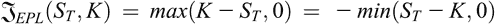。可以运用类似的论证来建立欧式看跌期权的空头头寸的回报为 。

如果我们用  表示欧式看涨期权的费用，则与该期权相关的利润函数  可以表示为

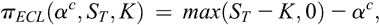(3.1)

买方所发生的固定成本和合同费用之间的超额收益。由于卖方收取合同费用，因此欧式看涨期权空头头寸的利润函数为

(3.2)

卖方的收益函数与合同费用的总和。

用表示欧式看跌期权买方支付的保险费，那么根据欧式看跌期权多头头寸和空头头寸的收益函数的定义，可得该期权的相应利润函数分别为

(3.3)

和

(3.4)

欧式看涨期权的利润函数的定义表明，如果交易者预期股票价格将上涨超过行权价格，那么他很可能会购买以在到期日行使权利的权利，从而以行权价格购买股票。如果到期日行权价*K*超过资产价格*S*[*T*]，个人将不会行使权利；合同变得毫无价值，持有者的损失仅仅是权利金。显然，如果*K*=*S*[*T*]成立，损失额也是一样的。如果成立，也就是说，如果资产价格高于行权价格但它们的差异小于合同费用，交易者应该行使权利，因为他的损失只是合同费用的一部分。如果成立，权利一定会被行使。同样，当交易者预见到股票价格可能下降时，他可能会写入一个看涨期权以进行盈利交易。这为交易者参与期权市场提供了明确的动机。第二个动机可以使用欧式看跌期权的定义来解释。我们可以推断，如果交易者预设某个资产价格可能下降，他可能愿意购买看跌期权以进行盈利交易。类似地，如果预期资产价格将上升，交易者可以写入一个看跌期权，假设可以获得有利的执行。换句话说，有意识地通过赌博未来事件来承担风险的投机者可以使用期权来期待从资产价格变化中获利。如果资产定价不一致，套利者可以利用期权进行无风险利润，因为套利是一种利用不一致定价的交易策略。最后，对冲者投资于资产市场以减少/消除风险。我们将在下一节详细讨论这个问题。

由于持有认购期权头寸和持有认沽期权头寸在资产价格上涨时变得有利，它们可能被称为乐观或多头头寸。同样，我们可以将持有认沽期权头寸和持有认购期权头寸视为悲观或空头头寸，因为它们在资产价格下跌时变得有利。

### 3.3 作为套期保值策略的选择

投资者经常需要期权来进行套期保值，这是一种减少或规避风险的策略。更准确地说，套期保值是一种通过另一种投资回报的上升来保护一种投资回报下降的工具。换句话说，套期保值是一种风险减少/消除策略。因此，套期保值涉及至少两种高度负相关的金融工具。当可以通过套期保值来保护一项投资或投资组合，即通过套期保值来抵御两项或更多项投资的损失时，我们将这种情况称为完美套期保值。因此，对于完美套期保值，必须以适当的比例组合投资清单，以消除整体风险。本节简要讨论的例子将使我们能够了解期权作为套期保值策略的作用。

考虑一个投资组合，其中包含对基础资产的一单位的多头头寸和一个欧式认沽期权，行权价接近资产的当前价格。这被称为保护性认沽，因为认沽期权可以保护资产价格的任何下跌。用购买认沽期权支付的合约费用表示为 ，当前资产价格表示为 *S* [0]。那么相应的利润函数为

(3.5)

如果权利被行使（*S* [*T*] < *K*），则最大损失是资产 *S* [0] 的购买价格与期权费  之和超过行使价格 *K* 的差额。因此，如果 *K* 接近 *S* [0]，损失将约为 。相反，如果资产价格继续上涨，以至于权利没有被行使（*S* [*T*] ≥ *K*），资产价格可以防范看跌期权回报的任何下行运动。

当交易者在欧式认购期权中持有空头头寸时，由于资产价格急剧上涨而导致利润损失，如果该空头头寸与交易者持有的基础资产一单位的多头头寸相结合，则可能会遇到。该投资组合被称为备兑认购，因为基础资产的多头头寸具有在资产价格上涨时覆盖因持有欧式认购期权的空头头寸而可能产生的损失的能力。利用已经介绍的符号，交易者在到期日的利润函数可以定义为

(3.6)

而在上述定义的两种交易策略中，解释了持有基础资产一单位的多头头寸与两种不同形式的欧式期权的结合的能力，经常会有必要设计一个组合，将相同类型的期权结合在一起，例如两个或更多的认购期权或两个或更多的认沽期权，以便仅使用期权作为套期保值工具。

为了说明仅使用期权为基础的对冲工具的实用性，假设一位持有欧式看涨期权的交易员预计在期权存续期间标的资产价格将出现大幅波动。然而，他对价格波动的方向感到不确定。在这种情况下，一个适当的对冲工具是将长期看涨期权与相同标的资产、相同执行价格和到期期限的长期看跌期权结合起来。这种中性期权策略被称为底部跨式或跨式购买。该策略的支付函数为*max*(*S* [*T*] − *K*, 0) − *min*(*S* [*T*] − *K*, 0)。该函数具有 V 形图形，其中图形的中心位于表示资产价格随时间变化的轴上的位置*K*处。该策略的利润函数由以下给出

(3.7)

如果资产到期价格接近行权价格，则该策略会导致损失。然而，在资产价格向任何方向大幅跳动时，都会产生可观的利润。显然，最初，如果交易员在欧式看跌期权中持有多头头寸，担心资产价格大幅波动，他可以将看跌期权与在相同的基础资产上具有相同行权价格和到期日的看涨期权的多头头寸相结合，以得出利润函数（3.7）。另一方面，顶部跨式或跨式写作包括在相同的基础资产上具有相同行权价格和到期日的欧式看涨期权和看跌期权的空头头寸。在这种情况下，资产价格大幅波动会导致大幅损失，但如果资产价格在到期时接近行权价格，则利润可能会显着。与顶部跨式相关联的利润函数采用以下形式：，如果 *S* [*T*] ≥ *K* 成立，则变为 。另一方面，如果 *S* [*T*] < *K* 实现，则  变为 。

第三个具体的只有一个选择的工具的例子是一种包含两个或更多相同类型的期权的利差策略，例如看涨或看跌期权，这些期权在某些方面的头寸相冲突，有些是多头头寸，而其他是空头头寸。如果该策略由具有不同头寸的期权组成，依赖于相同的基础资产，具有相同的到期日但具有不同行权价格，则称为价格利差策略。如果相反，到期日不同但行权价格相同，则该策略称为日历利差策略（或时间利差策略）。

价格价差方案根据标的资产价格的增加或减少对持有者有利而被称为牛市或熊市策略。例如，一个牛市策略可以是由一个欧式看涨期权的多头头寸和一个比它的执行价格更高的另一个欧式看涨期权的空头头寸组成的投资组合。设 *K* [1] 和 *K* [2] 分别表示两个不同的执行价格，相应的合约费用分别由  和  表示，其中 *K* [1] < *K* [2]，。由于第一个看涨期权的行权价格较低，其权利金，即卖方的发行费用，可能较高。因此，该投资组合的收益函数由  给出，可以更清晰地写成

(3.8)

如果 *S* [*T*] ≤ *K* [1]，则不行使权利。如果 *K* [1] < *S* [*T*] ≤ *K* [2]，则当长期看涨期权的权利被行使时，短期看涨期权的权利不被行使。如果 *S* [*T*] > *K* [2]，则两者的权利都被行使。如果标的资产价格上升到看涨期权的执行价格 *K* [2]，利润上升，之后对资产价格的任何进一步增加都不会改变利润。如果资产价格下跌，利润减少，并且在看涨期权的执行价格 *K* [1]（即买入价格）之下继续下跌，进一步降低资产价格对利润损失变得不敏感。因此，牛市价格价差策略限制了交易者的上行和下行风险。熊市看涨期权价格差策略是一种交易策略，涉及两个执行价格不同的欧式看涨期权，其中长期看涨期权的执行价格更高，但权利金更低于其短期对手。

我们也可以将看涨价差策略和看跌价差策略合并，构成一个套期保值工具。这种被称为蝴蝶价差策略的组合包含两个欧式看涨期权和两个欧式卖出期权，其标的资产相同，前两个期权的行权价格分别为 *K* [1] 和 *K* [3]，即 *K* [1] < *K* [3]，而后两个期权的行权价格相同为 *K* [2]，位于前两个行权价格的中间，即 。通常 *K* [2] 接近标的资产的当前价格。前两个期权的合同费用分别用  和  表示，而后两个期权的公共保费  位于前两个的中间，即 。那么该工具的利润函数可以表达为 ，其更加明确的形式为

(3.9)

作为套期保值工具，蝴蝶价差策略适用于资产价格与当前水平大幅偏离的情况较少的情形。与该策略相关的最大损失是净保费金额 。该策略能够产生的最大利润是 ，这种利润在资产价格 *S* [*T*] 与 *K* [2] 相一致时出现。

由于美式期权持有人在到期日 *T* 之前的任何时间 *t* 都有行使权的自由，并且在 *T* 本身也可以行使权利，因此美式看涨期权和看跌期权的收益函数的边界条件必须分别满足：，，对于所有 *t* ≤ *T*，其中 *t* ≤ *T* 时的标的资产价格 *S* [*t*] 是任意的。

### 3.4 前期合约和期货合约

前期合约是两个当事人之间的个人协议，用于在未来的约定日期*T*（交割日期）以预先协定的价格*K*（交割价格）购买或出售资产（基础资产）。 这种场外交易合约不涉及支付任何合同费用，尽管卖方有义务在交割日期交付资产，持有人有义务购买。 因此，合同费用的不支付以及买方和卖方的义务使得前期合约与标准期权不同。

一个人购买前期合约的一个主要目标是避免未来资产价格的任何变动风险。 农民可能会与批发商签订协议，担心他的农作物价格将来会降低。 其他例子包括电力、天然气、牛肉和石油。

在起点，合同对交易双方的价值都为零。 交易员可以在任何时间点*t* < *T*发起合同。 因此，交割价格将取决于合同期间*t*，我们可以用更具体的符号*P* *FOC* (*t*, *T*)来替代合同的交割价格*K*。 交割时买方和卖方的收益函数分别由*S* [*T*] − *P* *FOC* (*t*, *T*)和*P* *FOC* (*t*, *T*) − *S* [*T*]给出。 在市场完善且无套利的条件下，合同的价格*P* *FOC* (*t*, *T*)由公式给出，其中*S* [*t*]是时间*t*时资产的价格，*r*是无风险的共同借贷利率。

与远期合约类似，期货合约是买方和卖方对基础资产的购买和供应达成的强制性协议，以预定价格*K*，即交割价格，在预先约定的日期*T*，即交割日期。但是，与远期合约不同，期货合约是交易所交易的合约。基础资产的例子包括股票、外汇、木材、大宗商品、金属（例如金、钻石、银）、珍珠和谷物。

我们用*P* [*FUC*] (*t*, *T*)表示期货合约在合约期为*t*时的价格。期货合约的两方可以在指定的*n*个时间点*t* [1]，*t* [2]，…，*t* [*n*] = *T*观察到收益和损失，通常是连续的天数，其中*t* [1] < *t* [2] < … < *t* [*n*] = *T*。在交易期结束*t* *j*+1 时，合约持有人将收到价格变动量*P* [*FUC*] (*t* *j*+1, *T*) − *P* [*FUC*] (*t* [*j*] , *T*)，称为按市场标记价格，如果是正的，如果是负的则需要支付，其中*j* = 1,2,…,*n* − 1。卖方持有短期期货头寸的交易者也会出现相反的支付情况。下面的限制条件被规定：（1）*P* [*FUC*] (*T*, *T*) = *S* [*T*]，其中*S* [*T*]是合约到期日的资产价格，以及（2）在*n*个时间点中，合约费为零。

## 第四章

二项式模型：简化分析

### 4.1 引言

二项式期权定价模型是一种极其简单的期权定价模型。该模型以离散时间单位追踪基础资产价格的演变。基础资产的价格并非连续变化，而是在下一个时间点跃变为两个不同的新值，即上升和下降。因此，期权的估值依赖于一个迭代过程，其中每次迭代的唯一两种可能结果是上升和下降。对于每次迭代，模型都使用相同的上升和下降概率。该模型在分析上简单易懂。模型的简单结构有助于在提前行权可能性下管理期权的估值。

### 4.2 正式框架

在本节中，我们简要分析了 Cox–Ross–Rubinstein（1979）二项模型的股价演化过程，并明确陈述了假设。该过程有一个有限次数的时间 *t* [0] < *t* [1] < … < *t* [*T*]。从时间 *t* [0] 开始，终止于时间 *t* [*T*]，且任意两个连续的时间点是等距的，即 *t* [*i*] − *t* [*i*−1] 是一个正常数，记作 Δ*t*，其中 *i* = 1,2,…,*T*。因此，时间步长 *i*Δ*t*，*i* = 1,2,…,*T*，分别对应于时间 *t* [1]，*t* [2]，…，*t* [*T*]。设 *S* [*i*] 表示在时间 *t* [*i*] 的标的资产价格。假设已知初始期间 *t* [0] 的资产价格 *S* [0]。我们在一开始就做出以下假设。(1) 对于任意 *i* = 0,2,…,*T* − 1，在时间 *t* [*i*]，*S* [*i*] 要么增加到 *S* [*i*] *u*，要么在时间 *t* [*i*]+1 减少到 *S* [*i*] *d*，其中未知参数 *u* 和 *d* 满足约束 0 < *d* < 1 < *u*。此外，对于任意 *i* = 0,2,…,*T* − 1，在 *t* [*i*]，*S* [*i*] 增加到 *S* [*i*] *u* 的概率为 *p* [*u*]，0 ≤ *p* *u* ≤ 1，并且 *S* [*i*] 减少到 *S* [*i*] *d* 的概率为 *p* *d* = 1 − *p* [*u*]，其中 *p* *u*（因此 *p* *d*）是未知的。(2) 在期权的生命周期内，标的资产不支付股息。(3) 没有交易成本。(4) 利率 *r* 在期权的整个生命周期内是无风险的。(5) 适用于金融衍生品定价和套期保值的风险中性估值原则。

风险中性估值准则是一种在其中所有资产的预期收益率均为无风险利率*r*的估值过程。用于计算预期值的相关概率称为风险中性概率，而隐含的概率度量称为风险中性概率度量。因此，在风险中性的金融框架中，投资者不能要求超过无风险利率*r*的额外收益，这也是股票的自然收益率。任何现金流的现值都是以无风险利率折现的预期值。如果市场模型没有提供套利的空间，则具有风险中性概率度量。 （有关无套利和风险中性估值之间关系的严格讨论，请参见 Sundaram,1997; Bjork, 2004 和 Chakravarty, 2013。）

假设（1）的一个推论是，*S* [*i*] 的变化方向与*S* [*j*] 的变化方向无关，其中 *j* = 0,1,…,*i* − 1\. 为了更明确地理解这一点，我们考虑两期演化过程。注意，在时间步长 Δ*t*，资产价格 *S* 1 可以取值  和 ，分别对应概率 *p* *d* 和 *p* [*u*]。因此，*S* [1] 是随机的，尽管 *S* [0] 是非随机的。（更一般地，对于任何 1 ≤ *i* ≤ *T*，*S* [*i*] 是随机的。）接下来，在时间步长 2Δ*t*，*S* [2] 可以假设三种可能的值为 、 和 ，相应的二项概率分别为 、2*p* *u* *p* *d* 和 。这清楚地表明 *S* [1] 的变化方向与 *S* [0] 的变化方向无关。显然，对于所有的 *i* = 1,2,…,T − 1\. 因此，从给定的基础资产初始价格 *S* [0] 开始，可以生成所有剩余 *T* 期可能的资产价格的树，称为二项树。在一般设置中，在时间步长 *i*Δ*t*，*j* 价格序列为 ，相应的二项概率序列为 ，其中 *j* = 0,1,2,…,*i*; *i* = 1,2,…,*T*，对于任何正整数 *k*，(*k*)! 意味着 1.2.3….(*k* − 1).*k*。

鉴于假设（1），可得

(4.1)

其中Ξ代表期望运算符。现在，风险中性估值原则要求在时间*t*[*i*]时基础资产的价格等于其在时间*t*[*i*]+1 的价格的期望值，以风险无息利率*r*贴现。鉴于*t*[*i*]+1 − *t*[*i*] = Δ*t*对于所有*i* ∈ {0,1,2,…,*T* − 1}成立，这意味着形式上*S*[*i*] = exp(−*r*Δ*t*)Ξ(*S*[*i*]+1)，其中'exp'表示指数变换。因此

(4.2)

通过等式(4.1)和(4.2)等同于获得关于参数*u*、*d*和*r*的*p**u*的估计。由于(4.2)在风险中性下成立，所以在隐含假设下，概率*p**u*是风险中性概率的情况下，(4.1)和(4.2)之间的等式成立。也就是说，(4.1)中的*p**u*是与(4.2)匹配的风险中性概率。

解方程(4.1)和(4.2)的*p**u*的值为

(4.3)

限制 0 ≤ *p**u* ≤ 1 当且仅当

(4.4)

显然，在*r*和Δ*t*的正性下，exp(*r*Δ*t*) > 1。

Cox-Ross-Rubinstein 二叉树的一个特征是将离散和连续股价过程的方差等同，以确定*u*、*d*和*p**u*。在连续情况下，假设给定*S*[*i*]，*S*[*i*]+1 遵循具有参数*r*和*σ*²的对数正态分布，其中*σ*表示波动率，假定为常数（参见 Seydel，2012 年，以及本专著的第五章）。然后，根据此处使用的符号，对数正态分布的前两个矩可以表示为Ξ(*S*[*i*]+1) = *S*[*i*]exp(*r*Δ*t*)和，因此方差为

(4.5)

在离散框架下，方差变为

(4.6)

当 方程 (4.5) 与 方程 (4.6) 相等时，加上从 (4.3) 得到的 erΔt=puu+(1−pu)d，得到

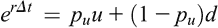

由此我们推导出

(4.7)

通过将 (4.3) 和 (4.7) 给出的 *p* *u* 的表达式相等，我们得到了 (*u* + *d*) 的以下表达式：

(4.8)

方程 (4.8) 的左边涉及两个未知数 *u* 和 *d*，而右边取决于三个已知参数 *r*、Δ*t* 和 *σ*，以及未知数量 *d*。一旦我们从 (4.8) 确定了 *u* 和 *d*，就可以从 (4.3) 或 (4.7) 得到 *p* *u* 的值。但仅凭 (4.8) 是不足以推断 *u* 和 *d* 的值的。我们还需要另一个方程。在这种情况下，一个方便的选择是

(4.9)

这个方程不与假设 0 < *d* < 1 < *u* 矛盾。

当 *d* = 1/*u* 从 (4.9) 插入到 (4.8) 中时，出现以下二次方程：

(4.10)

其中

(4.11)

解决 (4.10) 的两个解为 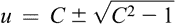。现在，通过要求 0 < *d* < 1 < *u* 和 *u*·*d* = 1，可得到  和 。显然，这些 *u* 和 *d* 的值确定了在风险中性估值下基础资产价格上涨和下跌的概率。更具体地说，将这些 *u* 和 *d* 的值代入 (4.3)，我们得到相应的风险中性概率上涨的值，当其从 1 中减去时得到风险中性概率下跌的值。应选择常量长度 Δ*t* > 0 的时间间隔 [*t* [*i*]，*t* [*i*]+1]，以确保 *p* *u* < 1。

### 4.3 Cox-Ross-Rubinstein 模型中期权的估值

在 Cox-Ross-Rubinstein 的二项期权估值模型中，期权的回报函数一如既往地假定取决于执行价格 *K* 和到期期间基础资产的价格。然后，Cox-Ross-Rubinstein 模型中的欧式看涨期权和看跌期权的价格分别为

(4.12)

(4.13)

其中 *j* = 0,1,2,…,*T*。在风险中性条件下，我们有

(4.14)

其中  是期权的价格，当股价为  时，即时间 *t* [*i*]+1 的 (*j* + 1)^(th) 可能的股价值，依此类推。由于我们知道 *j* = 0,1,2,…,*T* 时的  的值，根据回报函数，可以递归地推断出 *i* = 0,1,2,…,*h*; *h* < *T* 时的  的值，以获得期权的当前价值 。这个推理适用于看涨期权和看跌期权。

由于美式期权允许提前行权，推理会有所不同。 二项树的基本结构没有变化。 在每个时间步骤中，验证提前行权是否有利变得至关重要。 更准确地说，每个时间步骤持有者都必须决定是提前行权还是继续持有期权。 我们可以从支付函数中评估  并沿着树的分支回顾以确定期权的价值。 然后，决定行动方向 - 提前行权还是保留期权 - 就变得至关重要。

在 (4.12) 和 (4.13) 中的两个二项式方程现在将被修改如下：

(4.15)

(4.16)

如果在 , ，那么在时间步长 *i*Δ*t* 时行使权利是一个有利的决定，否则最好将期权保留到下一个时间步骤。 同样，我们可以解释 (4.16) 中的公式。（有关进一步讨论，请参见 Wilmott, Howison, & Dewynne, 1995。）

## 第五章

布朗运动、Itô引理和 Black–Scholes–Merton 模型

### 5.1 引言

衍生品定价的离散时间模型简单易懂。然而，它们也有一些缺点。资产价格波动的范围受限。这反过来限制了价格波动发生的时间点。在这样的股价演化过程中，一个交易间隔的长度被假定为某种合理的长度，交易间隔的数量是有限的。在实际情况中可能并非如此。在一个完全竞争的框架中，所有信息都是 readily accessible，交易间隔的数量很可能很大，交易间隔的长度很小，以至于交易几乎是连续的。事实上，在交易间隔的长度趋近于无穷小的极限情况下，交易过程是连续的，大部分期权理论都依赖于此。在本章中，我们提供了一份简明扼要的著名连续时间模型的注释，即 Black–Scholes（1973）–Merton（1973）模型。规范 Black–Scholes–Merton 模型的主要思想是通过对持有期权的股票比例进行连续调整来消除风险。该模型建立了这样一个事实：在组合中股票与期权的比例持续调整下，可以使组合无风险。

### 5.2 初步工作

由于布朗运动对 Black–Scholes–Merton 微分方程至关重要，我们从以下定义开始我们的介绍。

**定义 5.1：** 连续时间随机过程 ，其中下标 *t* 表示时间，在满足以下条件的情况下被称为维纳过程（标准布朗运动）：

(1) *W* 0 = 0，(2)对于每个 *t* > 0，，在区间 [0, *t*] 上的增量遵循均值为 0，方差为 *t* 的正态分布。符号化地，(3)对于任意 ，，即 {*W* [*t*] } 保持平稳增量。(4){*W* [*t*] } 具有独立增量，即对于任意 ，不重叠的增量 ， 都是独立的正态分布随机变量，其公共均值为 0，方差为 (*t* [2] − *t* [1])，(*t* [3] − *t* [2])，…，(*t* *n*−2 − *t* *n*−1) 和 (*t* [*n*] − *t* *n*−1)。

我们现在展示布朗运动与股价演变的相关性。设 *S* [*t*] 代表时间 *t* 下所考虑的股票价格。与股票价格 *S* [*t*] 相关的回报率在短时间间隔  内被定义为

(5.1)

其中  被假定为小。在极限情况下 ， 变成了自发回报率 。现在，假设股票价格 *S* [*t*] 由于金融市场中的买入和卖出而随时间连续演变。对于价格为 *S* [*t*] 且预期回报率为  的股票，在下一个微小时间段 *dt* 内 *S* [*t*] 的变化可以分解为两个组成部分：

(1) 预期的确定性成分 ，等价地，。(2) 随机且意外的成分，反映了股价在对外部影响（如意外的股价上涨和下跌）作出随机变化的响应。

考虑到股价的变动由不确定因素构成，我们可以合理地假设在微小时间段*dt*内的比例回报的变化是独立于股价的。这使我们可以认为在微小时间段*dt*内的回报率的标准偏差与回报率成正比。回报的意外部分等于 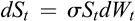，或者 ，其中  是股价回报率的标准偏差。它衡量了未来股价变动中存在的不确定性程度。维纳增量 *dW* [*t*] 是一个均值为 0，方差为 *dt* 的正态变量。

如果将随机成分  与预期的确定性成分结合起来，相对股价的总体变化为

(5.2)

我们可以将方程 (5.2) 重写为

(5.3)

如果微分方程中至少有一个项是随机过程，则称之为随机微分方程。因此，方程 (5.3) 是一种随机微分方程。如果股价过程满足方程 (5.3)，则我们说它遵循 -几何布朗运动。漂移和波动率分量  和  依赖于股价随时间的比例变化。

黑-舒尔-默顿定价公式依赖于几个假设，根据我们之前的讨论，这些假设是不言自明的。

（1）股票价格 *S* [*t*] 被假定遵循由 (5.3) 定义的几何布朗运动，其中  和  都被视为常数。(2)股票在期权的生命周期内不支付任何股息。(3)交易不涉及任何交易成本。(4)无风险利率 *r* 在期权的寿命期间保持恒定。(5)排除无风险套利的机会。(6)没有卖空交易的限制。

### 5.3 伊藤引理，股价分布和远期合约价格

我们首先观察到，由 (5.3) 给出的随机微分方程是以下更一般过程的一个特例

(5.4)

在规定条件下， 和 ，其中*h* [1]和*h* [2]是两个实值函数，而 。满足方程 （5.4） 的过程被称为伊藤过程，其中*h* 1 是漂移函数，而*h* 2 是*S* [*t*] 的增量的波动率。它也被称为伊藤随机微分方程（见 Oksendal，2003）。

我们将在本章中考虑的衍生证券的价格推导依赖于伊藤引理，为了完整起见，我们以下陈述该引理。

**伊藤引理：** 让{*S* [*t*]}遵循伊藤过程，即，*dS* [*t*] = *h* 1*dt* + *h* 2*dW* [*t*]，其中，*h* 1 和*h* 2 是两个坐标的实值函数。让*q*(*x*, *t*)是一个假设为两次连续可微的实值函数。然后*q*(*S* [*t*] , *t*)遵循伊藤过程，且

(5.5)

其中*q*的导数和系数函数*h* [1]和*h* [2]依赖于(*S* [*t*] , *t*)。进一步假设*dt*·*dt* = *dt*·*dW* [*t*] = *dW* [*t*] ·*dt* = 0，*dW* [*t*] ·*dW* [*t*] = *dt*。

假设*S* [*t*]遵循几何布朗运动，这是伊藤过程的一个特例，让我们将*x* = *S* [*t*]， 和 代入(5.5)，得到

(5.6)

方程（5.6） 在解析上描述了*q*(*S* [*t*] , *t*)所遵循的过程。*q*(*S* [*t*] , *t*)的一个标准例子是衍生证券的价格。

作为引理的第一个应用，让*q*(*S* [*t*] , *t*) = ln(*S* [*t*]), 其中*ln*代表对数。那么

将这些值代入(5.6)中，我们得到

从上述方程可以得出

简化后得到 。根据定义 5.1 中的条件（1），*W* 0 = 0\. 因此 ，其中 *S* [0] 是初始期间的股价。这表明 。换句话说，*S* [*t*] 遵循具有参数  和  的对数正态分布。股票价格 *S* [*t*] 的密度函数如下所示：

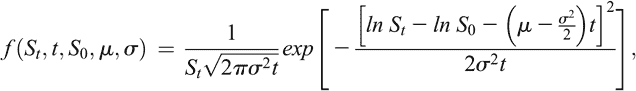(5.7)

这里缩写“exp”表示指数变换。这表明如果 {ln *S* [*t*] } 遵循几何布朗运动，则 *S* [*t*] 遵循对数正态分布。

作为第二个例子，让 ，即期初期的远期合约价格为 *t* 时。这里 *T* 表示合约的到期期限，*r* 是无风险利率。那么 ， 和 。将这些值代入 (5.6)，我们得到

由于 ，一个远期合约的价格，我们可以重写上述方程为

(5.8)

方程（5.8） 表明远期价格过程遵循几何布朗运动，其预期增长率为 。

### 5.4 黑-斯科尔斯-默顿偏微分方程

作为引理的最后一个例子，让*q*(*S* [*t*] , *t*)是一种取决于*S* [*t*]（股票当前价格）和*t*（合同开始时间）的任意衍生证券的价格。我们现在设计一个动态策略，完全复制衍生证券价格的瞬时变化。资产的复制策略是一种精确复制一个或多个随机场景的现金流的方案。如果一个交易员需要连续交易来持有这个复制方案，那么它就具有动态特性。方案的选择受到市场风险完全消除的要求的指导。它被假定满足自融资属性，即在其生命周期内不能有资金的流入或流出。在时间*t*进行的策略的任何重新排列都可以使用仅来自初始投资的资金和直到时间*t*的收益。等价地，我们说它是一个封闭策略。构建策略所涉及的两种工具是股票（基础资产）和无风险债券。（另请参阅 Baz & Chacko，2008 年。）

如果*Y* [*t*]代表时间*t*的衍生证券投资金额，那么这笔金额使得交易员能够购买单位的衍生证券。当将方程（5.6）给出的*dq*(*S* [*t*] , *t*)形式代入时，得到以下更为明确的瞬时变化形式：

(5.9)

或者，假设在可投资的总金额 *Y* [*t*] 中，交易员决定将  金额投资于股票，而将  金额投资于无风险债券。由于这两项投资的总和等于 *Y* [*t*]，如果两项中的一项变为负值，则可以将其视为对该证券的空头交易，并将生成的相应收入用于另一项证券。此投资策略包括  单位的股票和  单位的债券，其中 *B* [*t*] 表示时间 *t* 的债券价值。由于债券是无风险的，因此有  然后投资策略的动态如下

由于股价遵循  - 几何布朗运动，我们将 (5.3) 中的  代入上述方程中，并将  替换为，得到

我们将其重写为

(5.10)

在方程组 (5.9) 和 (5.10) 中，维纳过程是相同的，两项投资的波动率分量也相同。因此，两项投资所涉及的风险是相等的。现在，根据无套利原则，受到相等风险约束的投资必须表明相等的预期回报。因此，跨动态 (5.9) 和 (5.10) 的漂移分量必须相等。得到

或者，

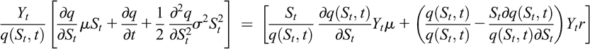

化简后，得到

(5.11)

这个抛物型偏微分方程在金融理论中被称为 Black–Scholes（1973）–Merton（1973）偏微分方程。因此，在推导这个偏微分方程时，我们注意到如何使用涉及股票和无风险债券的动态交易策略。可以设计其他交易策略来推导这个方程。例如，可以设计一个动态组合，包括 −*q* 的空头衍生品和  量的股票，使得维纳过程被消除。通过无套利假设，组合瞬间获得的收益率必须等于将资金投入组合后投资于无风险资产获得的收益率。这一论证使我们能够得出偏微分方程 （5.11）。这种讨论超出了本书的范围（详见 Hull，2014）。

### 5.5 Black–Scholes–Merton 定价公式

尽管期权的溢价是买方支付的价格，作为换取期权所确保的权利，期权的价格是当前应付费用，利用其所依赖的所有已知参数，如标的资产价格、行权价格、到期时间和波动率。后者是通过使用类似 Black–Scholes–Merton 模型的分析模型确定的期权的估值。由于这个价格是期权当前的价值，我们应用风险中性估值。

对于一般的支付函数*q*(*S* [*t*], *t*)，基本的方程（5.11）是推导出来的。现在我们希望使用(5.11)确定欧式看涨期权的价格。看涨期权具有支付函数*max*(*S* [*T*] − *K*, 0)。我们可以通过设置*q*(*S* [*t*], *t*) = *max*(*S* [*T*] − *K*, 0) 来求解偏微分方程（5.11），解将是一只非分红股票的欧式看涨期权的价格。

到期日*T*的看涨期权的期望值是 。在风险中性下，期初期权价格或价值*P* [*EC*] 是这种期望的折现现值，其中折现是以无风险利率*r*进行的。符号上， ，其中  表示风险中性下的期望值。

鉴于第 5.2 节的假设（1），我们假设*S* [*T*]遵循由 (5.3) 定义的-几何布朗运动，在此过程中， 和  都被视为常数，因此 ln(*S* [*T*]) 符合均值为 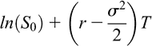、方差为  的正态分布。风险中性假设使我们能够用无风险利率*r*替换 。

可以确定，期初看涨期权的 Black–Scholes (1973)–Merton (1973) 价格*PEC*，即以无风险利率折现的期望期权价值，为

(5.12)

其中

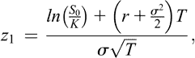(5.13)

和

(5.14)

这里的  是标准正态分布函数。更精确地说，

(5.15)

中的被积函数是标准正态随机变量的密度函数。可以运用平行论点证明欧式看跌期权的 Black–Scholes (1973)–Merton (1973)价格为

(5.16)

资产当前价格大幅增加时，无论还是都接近 1，*P* [*EC*]趋于*S* 0 − *K*e^(−*rT*)，但*P* [*EP*]趋近于 0。如果波动率趋近于 0，认购期权的价格趋近于*max*(*S* [0] − *K*e^(−*rT*), 0)。相比之下，认沽期权的价格趋近于*max*(*K*e^(−*rT* ) − *S* 0, 0)。

Black–Scholes–Merton 偏微分方程(5.11)的推导假定股票一开始是非股息支付的（假设 Section 5.2 中的假设（2））。

在其他条件不变的情况下，欧式认购期权价格与欧式认沽期权价格之间的正式关系被称为认沽-认购平价关系。在这里，我们所说的其他条件不变是指两种期权价格所依赖的参数是相同的。（有关详细讨论，请参阅本专著的第十五章。）

### 5.6 希腊字母

在金融理论中，希腊字母表示衍生品价格/价值对其所依赖的参数变化的敏感性。欧式期权价格依赖于五个参数，包括股票价格、到期时间、行权价格、无风险利率和波动率。这些希腊字母，通常被称为“希腊字母”，被交易员用于对冲期权和投资组合所带来的风险。

下面我们介绍与欧式认购和认沽期权相关的五个希腊字母的定义和值（表 5.1）。

表 5.1. 希腊字母。 

| 名称 | 定义（欧式认购期权） | 定义（欧式认沽期权） |
| --- | --- | --- |
| Delta |  |  |
| Gamma |  |  |
| Theta |  |  （任一符号） |
| Vega |  |  |
| Rho |  |  |

要理解期权价格随一个或多个参数变化的影响，假设交易者的目标是投资*X*单位的资金在*w* 1 单位的无风险债券*B*，一个多头期权和*w* 2 单位的股票，即基础资产，其中*w* 1 和*w* 2 的选择受到的指导是，对股票价格的微小变动*X*的变化应该是可以忽略不计的。现在，由考虑的金融工具组成的投资组合的价值由*X* = *w* 1 *B* + *w* 2 *S* 0 + *P* [*EP*] 给出。然后 ，其中*Delta* *P* 和 *Delta* *C* 分别表示看跌期权和看涨期权的 Delta。我们的要求现在可以通过设置  来执行。因此，如果交易者投资*w* 2 = 1 − *Delta* *C*单位的股票和 单位的债券，则投资组合总价值对股票价格的微小变动将会非常小。这就是 Delta 对冲，这是一种对冲策略，旨在使衍生品投资组合的价值对基础资产价格的微小变化不敏感。当交易者担心股票价格会小幅下跌时，这种策略就变得有用。

或者，如果交易员在无风险债券*B*中投入*X*单位的资金，*w*1 单位的股票和持有看跌期权的空头头寸，那么他的投资组合的价值变为*V* = *w*1 * B* + *w*2 * S*0 - *P* [*EC*]。在这种情况下，Delta 对冲需要，这给出了*w*2 = Delta *C*。因此，交易员在债券上投资单位。从出售看涨期权所获得的保费可以投资，以便交易员在期权到期时能够履行他的义务。如果投资组合的价值在底层资产价值的微小变化下保持不变，则称为 Delta 中性。也就是说，投资组合中各成分的 Delta 之和为 0。换句话说，投资组合的 Delta 中性指的是它对底层资产价格的微小变化具有免疫力。由一单位股票和对同一底层资产的多头和空头看涨期权和看跌期权的某种混合组成的交易策略可以使策略各组成部分的 Delta 之和等于 0。因此，交易员可以持有一笔看跌期权（看涨期权）来对冲一笔看涨期权（看跌期权），以应对资产价格的下跌（上涨）变化。

当底层资产价格变动不大时，Delta 中性在这种情况下是有用的，而 Gamma 中性则对资产价格的较大波动有帮助。随着时间的流逝，看涨期权的价值很可能会降低。这可以通过它的 Theta 来表示。Vega 与资产价格的波动性相关。对于底部跨距策略来说，这是非常重要的，因为资产价格的大幅波动可能会增加波动性。Rho 通常对期权价值影响不大。

我们现在可以使用 Black–Scholes–Merton 偏微分方程（参见 Lee, Finnerty, Lee, Lee, & Wort, 2013）来研究希腊人之间的关系。让方程（5.11）（#eq11）中的 *q* 表示依赖于基础资产的投资组合的价值。然后我们可以将方程重新表述为希腊字母的形式，如下所示：

(5.17)

现在，考虑两个 Delta 中性投资组合，其价值 *q* 相同。鉴于 Delta 中性和 *r* 的外生特性，可得

(5.18)

其中 Gamma [*i*] 和 Theta [*i*] 分别表示投资组合  的希腊字母 Gamma 和 Theta。现在，假设基础资产的价格保持不变。在其他条件下，如果 *Theta* * i * 发生变化，则 *Gamma* [*i*] 必须相应变化，以使关系 (5.18) 成立，其中  这明确建立了在某些次要条件下希腊字母 Gamma 和 Theta 之间的关系。

对抗依赖于资产价格、到期时间、波动率和无风险利率的投资组合的任何组成部分的对冲，需要了解该资产及另一个衍生工具。通过在基础资产和其他衍生工具之间保持适当的协调，对冲者可以消除与投资组合这些部分的变化相关的风险。

## 第六章

异国期权：一个说明性的演示

### 6.1 引言

异国期权是非标准金融衍生品，其特征如到期日期、支付、依赖其价值的资产、行使价或预先确定的价格等与标准的普通期权（如欧式和美式期权）不同。此类场外交易金融工具的各种复杂特征使其更适合于对冲和风险管理。由于我们的章节是说明性的，我们选择了三种常见类型的异国期权，即亚式期权、障碍期权和二元或数字期权，并分析了它们的特性。所有期权的行使方式都假定为欧式类型，以便它们的价格成为 Black–Scholes–Merton 价格的变种。

### 6.2 亚式期权

亚式期权是非凡尼拉类别中最经常交易的场外期权之一。它通常被称为平均期权，因为其价值取决于股票的平均价格而不是股票的现货价格。它是一种路径相关衍生工具，因为它取决于基础资产价格的整个历史，从其初始时刻开始。亚式期权的保费低于可比的欧式或美式期权。其原因是与基础资产平均值相关的波动性可能低于资产的波动性。该期权的这种特性使其风险较低。亚式期权通常在货币和商品市场上交易。尽管随着股票价格的上涨，欧式看涨期权的持有人可能能够赚取大量资金，但对于亚式看涨期权的持有人来说，这是不可能的，因为后者依赖于股票的平均价格。这是亚式期权的一个负面特征。

要确定亚洲期权的支付函数，需要计算平均股票价格，其中平均原则可以是算术或几何类型。我们考虑一系列有限等距的时间步长，*t* 1 < … < *t* *m*表示(*t* [*i*] − *t* [*i*]−1)对*i* = 2,…,*m*取相同值。对于一系列有限正的股票价格时间序列，几何平均定义为，其中‘exp’和‘ln’分别代表指数和对数变换。当对股价的观测在非退化区间[0, *T*]上连续采样时，上述定义的几何平均的连续模拟为。在这里，我们将采用几何平均规则，因为当价格遵循(*μ*, *σ*)-几何布朗运动时，基础资产价格呈对数正态分布，其中*μ*和*σ*分别是运动的漂移和波动率分量。考虑到风险中性成立，我们可以用风险无息利率*r*替换*μ*。（见第四章第二部分和第五章第五部分。）

**定义 6.1：** 对于与股票价格*S*[*t*]在连续非退化区间[0, *T*]内变化相关的平均价格，执行价*K*，亚洲期权在到期日*T*具有以下支付函数：

(1) 平均价格看涨期权：，

(2) 平均价格看跌期权：。

函数（1）和（2）分别是欧式看涨期权和看跌期权支付函数的亚洲对应物，其通过用平均价格代替到期期间资产价格*S*[*T*]从这两个后者的支付函数中获得。

由于在几何平均亚式看涨期权中， 的作用与欧式看涨期权中的 *S* [*T*] 相同，因此非股息支付股票的平均看涨期权价格可以直接从欧式看涨期权的 Black–Scholes–Merton 定价公式中推导出来（见 Kemna & Vorst, 1990）。现在，如第五章第 5.5 节中所述，我们用Φ表示标准正态分布函数。然后价格的显式解析形式可以写为

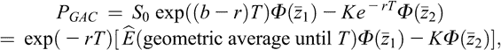(6.1)

其中  表示期望是使用风险中性概率测度进行的，‘exp’ 表示指数变换，, , , ，*S* 0 是股票的初始价格。通过类似的论证，可以证明几何平均看跌期权的价格为

对于具有恒定股息收益率 *D* [*y*] 的股票，在上述两个价格公式中，需要将  修改为 。

### 6.3 二元或数字期权

二元或数字期权概念的关键是一个二元变量，根据是否发生特定情况，它取两个特定的值。根据结算的性质，这些选项通常可以分为两类：现金无关和资产无关。现金无关看涨/看跌期权在到期时支付一次性现金*M*，如果期权到期时处于盈利状态，则以各自的定义方式定义。如果它到期时处于亏损状态，则不支付任何费用。因此，对于看涨期权的持有人而言，如果资产价格在到期日超过行使价格*K*，则现金收款*M*会实现，而对于看跌期权的持有人，则在到期日，如果相反的不等式成立，则会收到现金支付。 （见第三章第 3.2 节。）

因此，现金无关看涨期权的不连续收益函数可以定义如下：

(6.2)

相应的看跌期权的不连续收益函数如下：

(6.3)

资产无关期权的对应定义如下：

(6.4)

(6.5)

现金无关期权与其他期权的一个显著特点是，现金支付的价值在开始时确定；它与资产价格偏离行使价格的金额无关。第二个不同的特征是，在到期期间，不需要支付行使价格；它只起到边界点的作用。二元期权涉及有限风险，适用于短期交易。它们可以用作对资产价格的上涨和下跌运动的押注，作为标准香草期权的更便宜的替代品。

对于资产无价值期权（asset-or-nothing call/put options），支付金额等于到期日的资产价格。这些期权的其他特性与现金无价值期权相似。

Black–Scholes–Merton 定价公式可以调整以确定现金无价值期权的价格。对于不支付股息的股票，现金无价值看涨和看跌期权的价格公式分别为 *P* *CNC* = exp(−*rT*)*M* *Φ*(*z* 2) 和 *P* *CNP* = exp(−*rT*)*M* *Φ*(−*z* 2)，其中 。另一方面，资产无价值看涨和看跌期权的价格分别为 *P* *ANC* = *S* 0 *Φ*(*z* 1) 和 *P* *ANP* = *S* 0 *Φ*(−*z* 1)，其中 。（有关更多讨论，请参阅 Baz & Chacko，2008。）

### 6.4 障碍期权

第二个依赖路径的期权示例是障碍期权。虽然亚洲期权的价值取决于资产价格的平均值，但对于障碍期权，它取决于资产路径是否达到了第二个行权价格，即障碍或触发 *B*。这些期权分为四种类型：触界内、触界外、跌入式和跌出式。

Up-and-in（up-and-out）期权是一种在基础资产价格上涨到障碍水平时生效（失效）的衍生品。相反，Down-and-in（down-and-out）期权是一种在基础资产价格下降到障碍水平时生效（失效）的衍生品。因此，我们可以将这四种期权分为两个更广泛的子组 - Ups（资产价格从低于障碍水平的水平开始并增加到障碍水平）和 Downs（资产从高于障碍水平的水平开始并降至障碍水平）。它们也可以被归类为敲出或可熄灭的期权，即当资产价格触及障碍水平时停止生效，以及敲入或可点燃的期权，即一旦资产价格突破障碍水平即开始生效。因此，障碍水平可以在合同启动时高于或低于资产价格。障碍期权比标准期权便宜，当投资者对资产价格的运动有潜在的想法时，可以作为对冲工具。要确定障碍期权的支付结构，让*S* *M*和*S* *m*分别表示资产价格*S* [*t*]在区间（0，*T*）内可以取得的最大和最小值。

对于**向上敲入看涨期权**，如果障碍*B* > *S* 0 在期权有效期内达到，则它变为标准看涨期权，其到期支付为，其中*I*(*S* *M* ≥ *B*)是一个指示函数，如果*S* *M* ≥ *B*则等于 1，否则为 0。对于看跌期权，到期支付为。对于**向上敲出看涨期权**，关系相反：除非现货资产价格突破障碍，否则它仍然是标准看涨期权，因此到期支付变为，其中*I*(*S* *m* < *B*)是一个指示函数，如果*S* *m* < *B*则等于 1，否则为 0。对于看跌期权，此支付为。

对于**向下敲出和向下敲入期权**，障碍设置在标的资产的初始价格之下，*B* < *S* 0。如果资产价格*S* [*t*]在期权有效期内达到障碍*B*，则向下敲入看涨期权变为标准看涨期权。因此，其到期支付为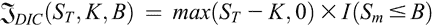，其中*I*(*S* *m* ≤ *B*)是一个指示函数，如果*S* *m* ≤ *B*则等于 1，否则为 0。对应的看跌期权的支付函数为。对于子组合 Downs 的剩余成员，向下敲出期权，则持有相反的关系，因此看涨和看跌的支付函数分别为和，其中指示函数*I*(*S* *M* > *B*)根据*SM > B*或*SM ≤ B*分别取值 1 或 0。每个向上敲出和向下敲出期权都会变为普通的香草期权，除非股价触及障碍。

为了评估一种向上敲出看涨期权，与之前一样，我们假设股票价格的风险中性估值。期权价格将取决于常规的 Black–Scholes–Merton 参数*S* 0、*K*、*r*、*T*、*σ*以及障碍水平*B*。通过观察到敲入和敲出型看涨期权的价值之和等于普通香草看涨期权的价值，假设行权价格、障碍水平和到期期限相同，我们可以计算障碍期权的价格。我们可以称这个结果为‘进出’平价。对于非分红股票的敲入看跌期权和敲出看跌期权的价格公式分别为

(6.6)

其中 。显然，*P* *DOC* (*S* [*T*] , *K*, *B*) + *P* *DIC* (*S* [*T*] , *K*, *B*) = *P* [*EC*] (*S* [*T*] , *K*)。类似的关系也存在于敲入和敲出型看涨期权之间。（更详细地分析了异国期权，参见 Clewlow 和 Strickland，1997 年；Zhang，1998 年；Baz 和 Chacko，2008 年以及 Hull，2014 年。）

## 第七章

随机优势关系的简化理论处理

### 7.1 引言

考虑一位正在探索投资两种前景或资产之一的人，比如股票*A*和*B*，它们的回报率（简称回报）是不确定的。投资者自然会选择预期回报较高的股票。风险厌恶的投资者也会倾向于选择预期回报与高风险不相关的资产。解决这个问题的一个命题是均值-方差方法（参见马尔科维茨，1959 年；托宾，1958 年），其中回报的方差被视为风险的指标。在著名的马尔科维茨投资组合管理模型中，投资者的预期效用函数采用二次效用函数，即平均回报减去方差的正常数倍。在这个模型中，风险厌恶的投资者的目标是设计一个投资组合，以在给定风险水平时最大化预期回报，或者在给定预期回报时最小化风险。但是，尽管马尔科维茨方法相当吸引人，但它依赖于特定的预期效用函数。此外，如果一项投资的预期回报较高伴随着更高的方差，则无法明确排名两项投资。文献中提出了一些替代性较弱的概念，它们有广泛的应用，并且可以排名不确定的前景。它们可以在不了解投资者回报和风险之间权衡的情况下定义，如其效用函数所代表的。这些排名标准，即随机优势关系，是本章的主题。

### 7.2 第一顺序随机优势

对于每个前景，不确定回报被假定遵循连续类型分布。考虑两个前景*A*和*B*，它们的不确定回报需要按照一级随机优势准则排序。让*F* [*A*] , *F* *B* : [*a*, *b*] → [0, 1] 分别表示与前景*A*和*B*相关的不确定回报的累积分布函数。非退化区间[*a*, *b*] 的下限和上限*a*和*b*分别代表了回报可以假定的最低和最高值。

对于每个*j* = *A*, *B*, *F* *j* (*z*) 是前景*j*的回报不超过水平*z*的累积概率，即，*F* *j* (*z*) = *Pr*(*R* *j* ≤ *z*), 这里 *Pr* 代表概率，*R* *j* 是前景*j*的不确定回报。此外，*F* *j* 是递增的，连续可微的，*F* *j* (*a*) = 0，且 *F* *j* (*b*) = 1 对于每个*j* = *A*, *B*。如果且仅如果

(7.1)

对于所有的 ，至少有一个，有 <。

图形上， 意味着前景*B*的累积分布函数的图形不在*A*的下方任何位置，并且在某些地方在*A*的上方（至少）。

要说明方程式 (7.1) 的效用等价条件，考虑定义在 [*a*, *b*] 区间上的冯·诺依曼-莫根斯特恩效用函数 *U*，即，，其中  是实数线。假设 *U* 具有两次连续可微性。 *U* 的一阶和二阶导数分别用  和  表示。在整个过程中假定 ，即 *U* 是递增的，这意味着更多被视为优于更少的观点。鉴于递增性，我们还假定 *U* 是严格凹的，即，。一个人的效用函数的严格凹性与他对风险的态度有关。如果一个人更喜欢他当前的财富而不愿意承担任何公平赌局，其中有一半的机会失去当前财富的某笔金额或赢得相同的金额，那么他被称为风险规避者。当且仅当 *U* 是严格凹时，一个人才被认为是风险规避者。这也是阿罗（1970）-普拉特（1964）绝对和相对风险规避系数的必要且充分条件；分别定义为  和  为正，其中 。一个具有严格凸性的效用函数 *U* 的持有者是风险爱好者，对他们来说，这些度量是负的。虽然风险爱好者更喜欢前景收益水平之间的高变异性，但风险规避者不喜欢这种情况。与这两种极端立场相反，如果个人的效用函数是线性的 ，那么这两个系数的值为零；并且该个人被视为风险中性。

Hadar 和 Russell（1969 年）提出的以下定理确定了与排序  兼容的效用函数类别。

**定理 7.1：** 让 *F* [*A*]，*F* *B*：[*a*, *b*] → [0, 1] 分别是不确定前景 *A* 和 *B* 的分布函数。则以下陈述是等价的：

(1) ，即，*F* *A* 首序随机支配 *F* *B*。(2)  对于所有增加的效用函数 ，即，对于所有增加的效用函数，前景 *A* 的预期效用高于 *B* 的预期效用。

该定理的含义是：对于以不确定回报特征的两个前景 *A* 和 *B*，如果前者首先随机支配后者，则所有更喜欢多于少的个体都会更喜欢前者而不是后者。反之亦然。因此，如果定理 7.1 中的随机支配条件（1）得到证明，我们就不需要了解效用函数的形式来判断前者的预期效用是否高于后者。然而，尽管排序是传递和非自反的，但它不是完全的。要理解这一点，请注意  要求 *F* *A* 的图形绝不能位于 *F* [*B*] 的图形之上，也就是说，这两个图形永远不会相交。如果这两个图形至少相交一次，我们可以得到两个不同的效用函数，它们将根据预期效用值的不同方向对前景 *A* 和 *B* 进行排序。因此， 是一个部分或准序。

变为与顺序一致的效用函数的示例包括*U* 1(*z*) = *ln*(*z*)，*z* > 0，*U* 2(*z*) = 1 − *e* ^(−*z*)，*U* 3(*z*) = *e* ^(*z*)，，其中是一个常数，以及*U* 5(*z*) = *a* + *bz*，其中*b* > 0 和*a*是常数。

下面的示例是 Chakravarty (2013)中给出的一个示例的变体，将说明准则（参见 Eichberger & Harper, 1969）。

**示例 7.1：**考虑资产*A*和*B*的以下分布函数：

(7.2)

其中*c* > 1 是一个常数。很容易看出*G* *A* (0) = *G* *B* (0) = 0，，并且*G* *A*和*G* *B*都是增加的。还要注意，对于所有有限的正回报值*z*，*G* *A* (*z*) < *G* *B* (*z*)。因此，*G* *A* 对*G* *B* 有一阶随机优势。

在上述五个效用函数的示例中，前两个是严格凹的，接下来的两个是严格凸的，第五个显示风险中立。然而，如果得到证实，那么根据预期效用标准，所有这些都优先于*B*。这是因为在一阶随机优势标准下，两个不确定前景之间唯一的区别特征是效率，即对更高期望效用的渴望。对于决策者对风险的态度的考虑完全不存在。换句话说，这种前景排名原则并不告诉我们一个人是风险爱好者、风险规避者还是风险中立者。这个问题由我们在下面分析的二阶随机优势规则解决。

### 7.3 二阶随机优势

若*F* *A*和*F* *B*分别表示风险前景*A*和*B*的分布函数，则当且仅当

(7.3)

对于所有的，至少存在一个*z*使不等式成立。换句话说，对于任意的，*F* *A*曲线下的面积不高于*F* [*B*] 曲线下的面积，并且在某些地方（至少）前者的面积更低。

显然，蕴含了，但反之不成立。为了明确这一点，我们考虑以下示例（见 Chakravarty，2013 年；Eichberger＆Harper，1969 年）。

**示例 7.2：** 假设资产*A*和*B*的分布函数分别为：

(7.4)

注意*H̄* *A* (1) = *H* *B* (0) = 0 和*H̄* *A* (2) = *H* *B* (3) = 1。*H̄* *A*和*H* *B*在各自的定义域上是增函数。由于它们的定义域不同，因此不能直接比较。为了使比较有效，我们修改*H̄* *A*如下：

，简称为，*F* *A*二阶随机优于*F* [*B*] ，

注意  也是一个分布函数，但是在 [0, 1) 和 (2, 3] 上是非递减的。在 *z* = 1.5 时，  从下方与 *H* *B* (*z*) 相交，即，对于所有  和 。同时注意对于所有 ， 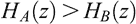。很容易检验对于所有 。此外， 成立。因此建立了  但是  不成立。因此，虽然在关系  的情况下，分布函数的图形之间的一个或多个交点是允许的，但是对于 ，交点的允许性被排除了。这是因为前者需要面积上的支配，而后者要求逐点支配。

Hadar 和 Russell（1969）的以下定理展示了排序  与期望效用支配准则之间的一致性，其中潜在的效用函数表明更多到更少的偏好，并且代表了风险规避的态度。

**定理 7.2：** 令 *F* [*A*]，*F* *B*：[*a*, *b*] → [0, 1] 为分别为前景 *A* 和 *B* 的分布函数。那么以下条件是等价的：

(1) ，即，*F* *A* 二阶随机支配 *F* *B*。（2）对于所有递增且严格凹的效用函数 ，即，*A* 的期望效用高于所有递增且严格凹的效用函数的*B* 的期望效用。

因此，如果条件（1）被证明为真，即如果确保了，那么在我们在前一节中考虑的五个效用函数示例中，只有*U* 1(*z*) = *ln*(*z*), *z* > 0, *U* 2(*z*) = 1 − e^(−*z* )将属于条件（2）被验证的效用函数类别。

为了定义更高阶的随机支配准则，让我们考虑累积分布函数* F *的重复积分：

(7.6)

对于所有的，其中* k *≥ 2 是整数且* F * ¹(* z *) = * F * (* z *)。

给定任意两个分布函数* F * * A *和* F * [* B *]，它们定义在资产* A *和* B *的收益率的共同定义域[* a *, * b *]上，如果只有* F * * A *以* k *阶随机支配规则支配* F * * B *，则* F * * A *被认为是支配* F * * B *。

(7.7)

对于所有，至少存在一个*z*，其中*k* ≥ 1 是整数。对于任意*k* ≥ 2，*k*阶随机优势准则意味着高于*k*阶的所有阶的优势。然而，反之不成立。显然，一阶和二阶随机优势准则是(7.7)的特殊情况，分别对应*k* = 1 和 2。如果*k*取值为 3，则定义了三阶随机优势原则（参见 Whitmore，1970 年）。第三阶随机优势条件的期望效用等价条件是，来自前景*A*的期望效用高于来自*B*的效用，其中正边际效用函数是递减且严格凸的（即，和，其中表示*U*的三阶导数）。符合此条件的效用函数类的成员示例包括*U* 1(*z*) = ln(*z*)，*z* > 0 和*U* 2(*z*) = 1 − e^(−*z*)。虽然对于*U* 1，*AP* *A* (*z*)是递减的，但对于*U* 2，它保持恒定。当边际效用函数严格凸时，即，*AP* *A*的递减性仅适用于*U*。在这种情况下，当个人财富增加时，对基础风险前景的需求增加，这意味着前景是正常的商品。有关更详细的分析，请参阅 Levy（2006 年），Shaked 和 Shanthikumar（2007 年）和 Chakravarty（2013 年）。
