第二部分

算法问题

## 第八章

使用有限差分法进行期权定价

在本章中，我们考虑了有限差分法数值解决期权定价问题。我们首先考虑欧式看涨期权。由于可能提前行权的可能性，美式期权的定价更加困难。我们随后考虑美式看跌期权，以展示如何解决这个问题。

对于欧式看涨期权*C*(*S*, *t*)的布莱克-舒尔斯方程和边界条件如下：

(8.1)

具有

这里的*σ*是波动率参数，*r*是无风险利率。在(8.1)中，前两个边界条件是关于*S*的，并指定了*S* = 0 和*S* → ∞时*C*(*S*, *t*)的值。最后一个边界条件是关于*t*的。请注意，关于*t*的边界条件是最终条件。由于这个原因，布莱克-舒尔斯方程被称为反向形式，我们需要获得时间*t* < *T*时*C*的值。

为了解决问题，更容易处理一个指定了初始值的前向形式方程。一些变量替换将布莱克-舒尔斯方程转换为所谓的扩散方程，其中指定了初始值。

第一组变量替换如下：

(8.2)

在(8.1)中，需要计算数量、和。这些是使用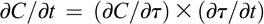、和从(8.2)计算的。简化表达式得到

(8.3)

其中，初始条件变为*v*(*x*, 0) = max(e ^(*x*) − 1, 0)。

在 Black-Scholes 方程中，需要考虑时间间隔 。从  中，对于 *t* = *T*，我们得到 ，对于 *t* = 0，我们得到 。这显示 ，时间 *t* 的初始条件成为时间 *τ* 的最终条件，时间 *t* 的最终条件成为 *τ* 的初始条件。

下一个替换如下：

(8.4)

对于一些常数 *α* 和 *β*，它们的值需要确定。在 (8.4) 中对 *t* 和 *x* 做偏导数，然后代入 (8.3)，经过简化后得到

(8.5)

设定 *α* = −(*k* − 1)/2 和 *β* = *α* ² + (*k* − 1)*α* − *k* 分别消除了  项和 *u* 项。利用这些 *α* 和 *β* 的值，*v* 变为

(8.6)

同时，(8.5) 转换成以下形式：

(8.7)

初始条件关于 *τ* 和边界条件关于 *x* 如下所示：

方程 (8.7)](#eq7) 被称为扩散方程，用于模拟时间 *τ* 时的薄无限条的温度。为了解 Black-Scholes 方程的原始 *C*，仅需解扩散方程 (8.7)](#eq7) 得到 *u*，然后反向使用变量替换得到对应的 *C* 值。因此，接下来我们将考虑扩散方程。

### 8.1 克兰克-尼科尔森方法

有限差分法是一种数值求解偏微分方程的技术。 在本节中，我们概述了用于求解扩散方程（由方程（8.7）给出）的 Crank-Nicolson 方法。 扩散方程具有关于两个变量的偏导数。 我们考虑对这些导数的离散化。

偏导数可以定义为极限差值：

这可以通过以下方式近似。

‘大 O’符号的定义如下。 对于正实值函数和，如果存在正实数*M*和*x*0，使得对于所有，都有。

对于在（8.7）中对*x*的二阶偏导数，需要考虑两次连续的近似。 使用‘先前后向’或‘后向先前’两种策略之一，可得到以下对称的中心差分近似。

#### 8.1.1 有限差分网格

考虑二维平面，其中*τ*沿水平线增加，*x*沿垂直线增加。 这个平面被分成一个网格，其中*τ*线被假定为由间隔为的线表示，*x*线被假定为由间隔为的线表示。 因此，网格的点由整数*m*和*n*确定。 在这一点上函数的值将被表示为

(8.8)

因此，

回想一下 。在 *τ* 的离散化中，假设区间  被分成 *M* 个子区间。这将使  等于 。在实践中，条件  和  通过选择大的正整数 *N* ^− 和 *N* ^+ 并考虑 *x* 在区间  内来近似。因此，边界和初始条件变为以下形式：

请注意边界条件意味着  对于 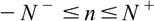 是已知的。

使用前向差分来近似 ，使用对称中心差分来近似 ，得到以下方程：

(8.9)

使用后向差分来近似 ，使用对称中心差分来近似 ，得到以下方程：

(8.10)

在 (8.10) 中将 *m* 改为 *m* + 1 得到

(8.11)

(8.9) 和 (8.11) 的平均值如下：

(8.12)

可以证明该方程中的项精确到 ，而不是精确到 。忽略误差项（即“大 O”项），我们得到以下近似：

(8.13)

对于 ，其中

(8.14)

方程式 (8.13) 定义了一个线性方程组，如果已知  对所有 *n* 都成立，则可以计算所有 *n* 的 。换句话说，在时间 ，如果已知所有  的值，那么就可以计算所有  的值。定义

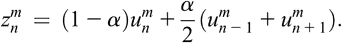(8.15)

接着，如果已知所有 *n* 的值，则可以计算 。一旦知道了 ，就可以得到所有 *n* 的 。

用矩阵表示，(8.13) 可以写成

(8.16)

其中

从 *x* 的边界条件已知  和  的值。因此，对于所有 *m*，向量 **b** ^( *m* ) 由边界条件确定。

要解 (8.16)，首先得到 **z** ^(*m*) = **Du** ^(*m*) + **b** ^(*m*) 。这可以使用 (8.15) 很容易地完成。然后使用数值线性代数技术解线性方程组 **Cu** ^(*m*+1) = **z** ^(*m*) 。因此，对于任何 ，可以找到所有 *n* 的  的值。因此，上述两维网格的所有网格点处也可以得到看涨期权的值 *C*。

请注意，有限精度计算机算术的使用会在数值解中引入舍入误差。如果这些舍入误差在每次迭代中不被放大，则系统被认为是稳定的。如果舍入误差在解的每次迭代中增长，则系统被认为是不稳定的。可以证明，对于 *α* > 0，Crank-Nicolson 系统是稳定的。

### 8.2 美式期权

美式期权可以在到期日当天或之前行权。直观地说，这种额外的权利使它们比欧式期权更有价值。

对于任何美式期权，在每个时间点 *t*，根据资产价值 *S*，必须决定是持有资产还是行权。这被称为自由边界值问题。对于每个时间 *t*，都有一个值 ，如果资产价格 *S* 在  的一侧，则应行权，而如果资产价格 *S* 在  的另一侧，则应持有。值  被称为最佳行权价格，相应的期权价值被称为行权价值。在时间点 *t*，可能会有几个这样的最佳行权价格。因此，针对特定值 ，关于资产价格的卖出或保留期权的决定是基于  的局部邻域内。接下来，我们将考虑只有一个最佳行权价格的情况。

假设美式看跌期权的价值为 *P*(*S*, *t*)，让  为行权边界。在时间 *t*，如果 ，则应行权和持有，否则不行权。以下是 *P*(*S*, *t*) 的 Black-Scholes 不等式：

(8.17)

对于每个时间*t*，*S*轴被分为两个区域：

(1)对于，早期行权是最优的，*P* = *E* − *S*，在等式(8.17)中严格成立。(2)对于，早期行权不是最优的，*P* > *E* − *S*，并且等式在(8.17)中成立。

请注意，在无套利条件下，*P* < *E* − *S*是不可能的，否则，投资者可以以总成本为*P* + *S*买入期权和资产，并立即行权获得金额*E*，在此过程中获得*E* − (*P* − *S*) > 0 的无风险利润。

在*S* = *S* *f* (*t*)处的边界条件是，*P* 和是连续的，并且

处理自由边界是有问题的。可以重新构造问题，使自由边界消失。问题从原始(*S*, *t*)变量转换为使用欧式期权情况中提到的变换的变量。该过程将最优行权边界*S* *f* (*t*)转换为。由于*S* *f* (*t*) < *E*，所以。此外，支付函数 max(*E* − *S*, 0)被转换为。这导致以下公式（所谓的线性互补问题）：

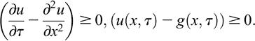

初始和边界条件如下：

上述公式中没有明确提及自由边界。解决重新表述的问题以获得的表达式，允许使用条件获得自由边界，但是对于，即它是首次遇到的点。

#### 8.2.1 有限差分公式

与之前一样，平面被分成一个有限的网格，其中是*x*轴上的步长，是*τ*轴上的步长。同样，假设*x*位于范围内。

在步长为和的常规网格上近似偏导数，与之前一样。同样，让，并写。条件近似为。

使用在第 8.1 节中给出的偏导数近似值，并使用类似于推导(8.12)的方法，可以显示不等式由近似为

(8.18)

其中，与之前一样，。边界和初始条件转化为

定义

那么(8.18)变为

在时间步骤  中，由于对所有 *n* 的值都已知，可以明确找到 。在线性互补问题的等式中使用了以下近似。

上述表述可以转化为以下类型的矩阵问题：

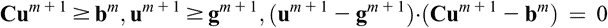

对于一个适当定义的矩阵**C**（结果证明是正定的）和向量**b**。（注意，这里的**C**与 8.1 节中出现的**C**不同）与欧式期权的情况类似，问题已经转化为一个线性代数问题，并且使用数值线性代数技术来解决问题。

**注意**

本章内容基于 Wilmott、Howison 和 Dewynne（1995）的处理。这里给出的描述很简短。有关更多详细信息，请参阅 Wilmott 等人（1995）。

## 第九章

使用蒙特卡洛方法进行期权定价

蒙特卡洛模拟是一种非常通用的技术，具有广泛的应用。在本章中，我们简要回顾了该技术在期权定价的背景下的应用。

### 9.1 Wiener 过程的模拟

回顾 Wiener 过程是一个家族（*W* [*t*]），其中 *t*≥0，其中 *W* 0 = 0，对于所有 *t* ≥ 0，*W* [*t*] ∼ *N*(0, *t*)，在不重叠的时间间隔上 Δ*W* [*t*] = *W* [*t*]+Δ*t* − *W* [*t*] 是独立的，并且 *W* [*t*] 连续地依赖于 *t*。这里 *N*(*μ*, *σ*²) 表示均值为 *μ*，方差为 *σ*² 的正态分布。根据定义的结果，*W* [*t*] − *W* *s* ∼ *N*(0, *t* − *s*)，因此 *E*[*W* [*t*] − *W* *s* ] = 0，Var(*W* [*t*] − *W* *s* ) = *t* − *s*，意味着 *E*[(Δ*W* [*t*] )²] = Δ*t*。因此，Δ*W* 是均值为 0，方差为 Δ*t* 的独立正态分布。

可以通过以下方式获得维纳过程的离散时间版本。将 Δ*t* 固定为一个常数时间增量。对于 *i* ≥ 0，令 *t* [*i*] = *i*Δ*t*。定义 Δ*W* *k* = *W* *k*Δ*t* − *W* (*k*−1)Δ*t*。然后，我们有 。由于 Δ*W* 符合 *N*(0, Δ*t*)，我们有 ，其中 *Z* 是标准正态变量。此外，Δ*W* 在不重叠的区间上是独立的。因此，Δ*W* 1,…,Δ*W* [*i*] 是独立的，并且每个都符合 *N*(0, Δ*t*)。

从上述描述中，我们得到了模拟离散维纳过程的以下简单方法。

固定 Δ*t* 的值

设置 *W* 0 = 0

对于 *k* := 1 到 *i*，执行以下操作

独立地从 *N*(0, 1) 中抽样 *Z*

设置 

结束。

此方法提供了在点 *t* *k* = *k*Δ*t*，*k* = 0, 1, 2,… 的值 。这个过程是随机的。因此，重复该过程将（很可能）提供一组不同的值。然而，该过程相当简单，并且可以多次使用来模拟许多不同的路径。这些路径可以用于进一步处理，如下所述。

上述模拟中的关键计算步骤是从标准正态分布中抽样。由于标准正态分布是连续的，而计算机只能处理有限精度，因此抽样过程不可能完美。Ziggurat 方法用于这种抽样。这是拒绝抽样的一个特殊示例。我们省略了对抽样过程的讨论，因为这将使我们远离我们讨论的范围。

### 9.2 模拟伊藤随机微分方程

伊藤随机微分方程（SDE）的形式为

(9.1)

其中(*X* [*t*] ) [*t*]≥0 是一个随机过程，(*W* [*t*] ) [*t*]≥0 是一个维纳过程。系数*a*(*X* [*t*] , *t*)称为漂移项，系数*b*(*X* [*t*] , *t*)称为波动率或扩散系数。

(9.1)的离散化如下：

(9.2)

假设我们考虑离散时间步长 0 = *t* 0，*t* 1，*t* 2，...，其中*t* *k*+1 − *t* *k* = Δ*t*对于*k* ≥ 1 是常数。然后*t* *k* = *k*Δ*t*，所以以及。迭代地，获得和允许获得。

假设*S* [*t*]是时间*t*的股票价格。收益率 d*S* [*t*] /*S* [*t*]用几何布朗运动进行建模，即 d*S* [*t*] /*S* [*t*] = *μ*d*t* + *σ*d*W* [*t*]。因此，d*S* [*t*] = *S* [*t*] *μ*d*t* + *S* [*t*] *σ*d*W* [*t*]。设置*a*(*S* [*t*] , *t*) = *S* [*t*] *μ*和*b*(*S* [*t*] , *t*) = *S* [*t*] *σ*，我们看到(*S* [*t*] ) [*t*]≥0 满足一个 Itô SDE。因此，可以应用解决(9.1)中的*X* [*t*]的方法来找到股票价格。

我们已经看到了模拟维纳过程的方法。这可以扩展到模拟 Itô SDE 并解决*X* [*t*]。下面给出的策略称为欧拉离散化。在此算法中，*y* *k*是*X* *k*Δ*t*的获得估计。

设置Δ*t*的值

设置*y* 0 = *X* 0 和*W* 0 = 0

对于*k* := 0 到*N*的循环

[*t*] *k*+1 = *t* *k* + Δ*t*

独立地从*N*(0, 1)中抽取 Z 的样本

设置

设置*y* *k*+1 = *y* *k* + *a*(*y* [*k*] , *t* *k* )Δ*t* + *b*(*y* [*k*] , *t* *k* )Δ*W*

结束循环

模拟提供了*y* 0，*y* 1，...，*y* [*n*]的值，这些值是*X* 0，*X* Δ*t*，...，*X* *N*Δ*t*的估计。

上述离散化过程引入了一个近似误差。这可以通过使用更好的近似方法（如米尔斯坦和龙格-库塔方法）来改善。

### 9.3 估算欧式期权价值

使用一种模拟股价的策略使得估算欧式期权价值的背后思想变得相当简单。

设 *S* [*t*] 对于 *t* ≥ 0 是时间 *t* 的股票价格。假设欧式期权的行权日期是 *T*，且收益函数为 Γ(·)，即如果股票价格为 *S*，则收益为 Γ(*S*)。收益函数的实际形式取决于期权的性质。

假设有一种模拟股价的方法。例如，我们可以考虑股票收益率 Δ*S*/*S* 遵循几何布朗运动，以便上述对 Itô随机微分方程的欧拉离散化可用于模拟时间点 *t* *k* = *k*Δ*t*，*k* = 0,…,*N* 处的 *S* 的值。假设我们选择 Δ*t* = *T*/*N* 以便 *t* [*n*] = *T*。然后上述模拟提供了值 *y* [*n*]，其是 *S* [*T*] 的一个估计。给定 *y* [*N*]，我们可以得到对应于股价 *S* [*T*] 估计 *y* [*n*] 的收益 Γ(*y* [*n*])。

上述策略提供了在时间 *T* 的收益的一个可能估计。由于股价形成一个随机过程，单个估计是没有用的。解决这个问题的方法是进行 *M* 次模拟，其中 *M* 是一个足够大的整数，并取相应收益的平均值。更详细地说，设  是第 *j* 次模拟中获得的 *S* [*T*] 的估计，*j* = 1,…,*M*。设

那么  是在 *M* 次模拟中计算的所有收益的平均值。我们可以考虑  是在时间 *T* 实际发生的收益的一个估计。

我们关心的是在某一时间点*t* < *T*获取期权的价值。一旦我们获得时间*T*的支付的估算值 ，我们可以使用无风险利率将其贴现回时间*t*。因此，在时间点*t* < *T*的期权价值的估算值为 ，其中*D* *r* (*t*, *T*)是这样一个因子，使得在时间*t*时的金额*x*在无风险利率*r*下增长到时间*T*时的金额*xD* *r* (*t*, *T*)。

计算欧式期权价值的上述策略需要为股票价格模拟*M*条路径。每条路径有*N*个时间步。每个时间步需要从标准正态分布中抽样。因此，总共需要*MN*次抽样。这构成整个过程的主要计算成本。

这一过程可能会非常耗时。对于基本的欧式看涨和看跌期权而言，它可能不比有限差分或其他方法更快。另一方面，该模拟方法的主要优势在于适用于漂移和扩散参数的一般形式，以及对期权支付函数的任意（尽管计算可行）形式。

### 9.4 估算美式期权价值

欧式期权和美式期权的关键区别在于美式期权具有提前行权功能。正如我们已经看到的，这使得美式期权定价问题更加复杂。这也适用于使用股价模拟的期权定价问题。

假设需要在时间点*t* = 0 获取某种美式期权的价值。与以往一样，设*S* [*t*]为时间*t* ≥ 0 时的股票价格，其中*S* 0 已知，并且Γ(*S* [*t*] )是为股票价格*S* [*t*]获得的支付。设*V*(*S*, *t*)为股票价格*S*和时间*t*时期权的价值。因此，*V*(*S* [*T*] , *T*) = Γ(*S* [*T*] )。需求是获取*V*(*S* 0, 0)。

原则上，美式期权可以在到期时间*T*之前的任何时间行使。在离散版本中，期权可以行使的时间点被限制在区间[0，*T*]中的一组有限值上。与以前一样，设Δ*t* = *T*/*N*，并考虑时间点*t* *k* = *k*Δ*t*。期权可以在时间点*t* 0，*t* 1，...，*t* [*n*]处行使。美式期权的这种离散化将其转化为百慕大期权。通过选择足够大的*N*，我们希望能够使用离散时间来模拟连续时间。

设为时间点*t* *k*处的股票价值。如果在时间*t* [*k*]行使期权，则支付为。然而，这并不是时间点*t* *k*处期权的价值。持有期权可能更好，因为在下一个时间点它可能具有更高的价值。出现了两个问题：

(1)在下一个时间点*t* *k*+1，值是一个随机变量，它取决于时间点*t* *k*的股票价格。如果我们将固定为一个值*x*，那么我们可以考虑的期望值。换句话说，我们考虑函数。(2)在时间点*t* [*k*]，我们有期权的支付，必须考虑与值有关。然而，我们不能直接比较和值，因为后者是下一个时间点*t* *k*+1 的期望值。为了使比较有意义，我们需要将值贴现到时间点*t* *k*。这通过除以*D* *r* (*t* [*k*]，*t* *k*+1)来实现，这是无风险利率的增长因子。为此，我们定义

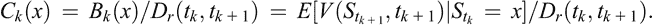(9.3)

上述两点的净效果是是和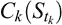的最大值，即

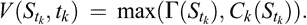(9.5)

在宏观层面上，该方法与用于欧式期权的方法相同，即模拟* M *条股价演变路径，其中每条路径在时间点* t * 0、* t * 1、...、* t * [* n *]评估。对于第*j*条路径，*j*=1，...，*M*，让表示在时间点*t* [*k*]，*k*=0，...，*N*使用第*j*次模拟获得的股票价格的估计值。对于欧式期权的定价，仅需要值，*j*=1，...，*M*。在当前情况下，需要所有*y*值。

让表示第*j*次模拟中时间点*t* [*k*]的期权价值，*k*=1，...，*N*，*j*=1，...，*M*。目标是确定，即在第*j*次模拟中时间点*t* 1 = Δ*t*的期权价值，*j*=1，...，*M*。一旦获得所有的，我们将这些的平均值作为时间点*t* 1 的期权价值的估计值，然后乘以相应的一段时间间隔因子*D**r*(0，*t* 1)来获得时间点*t* = 0 的期权价值的估计值。换句话说，时间点*t* = 0 的期权价值的估计值如下获得：

(9.6)

因此，问题简化为获得*j*=1，...，*M*的的值。首先确定*j*=1，...，*M*的的值，然后倒推时间，即从一组值，*j*=1，...，*M*，获得的值。我们将在下面解释如何完成这一过程。

在时间点 *t* [*n*] = *T*（即到期日），期权的价值由支付函数 Γ 和股价  决定。所以，对于 *j* = 1,…,*M*，有 。获得这些值后，下一步是获得 *j* = 1,…,*M* 的  的值。我们描述一般步骤，其中 *j* = 1,…,*M* 的值由 *j* = 1,…,*M* 的值获得。

对于 *j* = 1,…,*M*，考虑对  进行最小二乘回归技术。用这 *M* 对来获取 *C* *k* (*x*) 的函数形式。对于 *j* = 1,…,*M*，设置 。这提供了值 ，*j* = 1,…,*M*。迭代继续直到获得值 ，*j* = 1,…,*M*，然后使用 (9.6) 来获得时间点 *t* = 0 处期权的所需估计值 。

与欧式期权的情况类似，上述程序几乎不需要假设，即对漂移和扩散参数，或者对支付函数形式没有条件。像所有基于模拟的结果一样，缺点是相对较大的计算需求和由于各种近似导致的潜在误差。

### 9.5 蒙特卡罗积分

我们简要考虑使用蒙特卡罗技术评估定积分的一般问题。

让 *f*(*x*) 是一个实值函数，并且需要估计在区间 [*a*, *b*] 上 *f*(*x*) 的积分。让 *u* *a*,*b* (*x*) 是区间 [*a*, *b*] 上的均匀密度函数。然后，期望 *f*(*x*) 在区间 [*a*, *b*] 上的期望值被定义为

所以，我们有。获得*E*(*f*)的估计值可以得到所需的定积分的估计值。通过选择独立的*x* 1,…,*x* [*n*] 并遵循*u* *a*,*b* (*x*)然后计算来获得*E*(*f*)的估计值。使用大数定律，样本均值当*N* → ∞时趋于*E*[*f*]。因此，对于足够大的*N*，我们有所以：

这个想法扩展到更高的维度。让*f*是一个*n*个变量函数，并且想要在一个域上对*f*进行积分，域的积分。让是的体积。假设*x* 1,…,*x* [*n*] 是从独立均匀抽样的。那么的近似值由给出。在各种金融应用中，需要对特定域内的高维函数进行积分的要求经常出现。

**注意**

本章的材料基于 Seydel (2012)。这里提供了基本的概念级描述。我们参考 Seydel (2012)以获取更多详细信息。

## 第十章

确定随机支配关系

让是一组非空的实数，其中*x*1< ⋯ < *x* [*n*]。让是在上的一组累积概率分布函数，即，如果随机变量*X*遵循，那么。对于，让是与累积分布函数对应的概率质量函数；让是*F* [*i*]的均值，即。

对于，定义

我们考虑以下关于随机优势（SD）关系的著名特征，这些特征等同于基于效用函数的 SD 定义。

*一阶 SD (FSD)*：如果对于所有的都有*F* [*i*] (*x*) ≤ *F* *j* (*x*)，并且至少一个都有*F* [*i*] (*x*) < *F* *j* (*x*)，那么*F* [*i*] >1 *F* *j*。

*二阶 SD (SSD)*：如果对于所有的和至少一个，都有，那么*F* [*i*] >2 *F* *j*。

*三阶 SD (TSD)*：如果对于所有的都有，并且至少一个都有，那么*F* [*i*] >3 *F* *j*。

上述 SD 关系的描述是针对离散分布的。原因是为了计算 SD 关系，人们必须直接使用离散分布或者使用连续分布的离散化版本之一。

要求确定  中不被  中的任何其他分布所支配的分布子集。对于 *m* = 1, 2, 3，定义

目标是能够确定 SD [*m*]，对于 *m* = 1, 2, 3。

让我们考虑确定  的直接方法。对于不同的 *F* 和  在  中，需要确定  或 *F′* >1 *F*，或者这两个关系都不成立。确定这一点需要逐点比较 *F* 和 ，即比较 *i* = 1,…,*n* 的  和 ，总共最多 *n* 次比较。注意可能可以通过确定 *F* 或  中没有一个支配另一个来提前终止。正因为这个原因，所需的比较次数最多为 *n* 而不是等于 *n*。

鉴于上述情况，确定  需要比较  分布，总成本最多为  次比较。问题是能否减少比较次数？这个问题很重要，因为在实际情况中，*N* 很大，使得  对分布的比较耗时严重。

SD 关系的几个属性使得可以减少比较的数量。这些属性是必要条件。使用这些必要条件，可以在不实际进行直接比较的情况下排除某些可能性。下面我们列举一些这些必要条件并解释如何利用它们来减少比较的数量。

**传递性：** 对于 *m* = 1, 2, 3，已知当 > *m* 是传递的，即如果 *F* > *m* *G* 且 *G* > *m* *H*，则 *F* > *m* *H*。这有助于计算方式如下。假设已确定 *F* > *m* *G*。然后我们丢弃 *G*，即 *G* 不再与任何其他分布进行比较。原因如下。由于 *F* 支配 *G*，显然 *G* 本身不属于。另一方面，通过保留 *G*，可以排除其他分布 *H* 在中的可能性，如果 *G* > *m* *H* 成立的话。通过丢弃 *G*，不再进行比较 *G* > *m* *H*？（即 *G* 是否在 > *m* 下支配 *H*）了。由于 *F* 没有被丢弃，比较 *F* > *m* *H*？然而，将会进行。由于 *F* > *m* *G* 和 *G* > *m* *H*，根据传递性，*F* > *m* *H* 成立，结果 *H* 被丢弃。因此，如果比较结果是一个失败的分布，那么通过丢弃失败的分布，程序的正确性不会受到影响。请注意，两个分布之间的比较不一定会导致一个分布失败。在这种情况下，传递性无法帮助减少工作量。尽管如此，如果的大小明显小于 *N*（的大小），那么许多比较确实会导致一个失败的分布。丢弃这样的分布将提供显著的速度改进。

**均值条件：** 当*m* = 1, 2, 3 时，已知如果*F* [*i*] > *m* *F* *j* 成立，其中，那么。注意，这只是一个必要条件，即并不意味着*F* [*i*] > *m* *F* *j*。这个均值的必要条件在以下情况下被使用。首先计算*i* = 1,…,*N*时的，并按照它们的均值降序排列分布。为了简化说明，假设均值都是不同的。该过程试图扩展一个列表，最终将成为。算法从考虑具有最高均值的分布开始。这个分布显然不能被任何其他分布所支配。因此，我们可以将这个分布放入，并从中删除它。接下来，算法按照它们的均值递减的顺序考虑分布。在一个中间点，假设正在考虑一个分布*F*。在中仍然存在的所有分布的均值都低于*F*的均值，因此这些分布不能支配*F*。因此，要确定*F*是否在中，只需检查*F*是否被中的任何分布所支配即可。如果确实有一些在中的分布支配*F*，那么*F*将从中被丢弃，但不放入中；因为*F*是一个失败的分布，丢弃它不会影响任何事情。另一方面，如果*F*没有被中的任何分布支配，那么它将被添加到中。这种策略减少了所需的分布之间的比较次数。

**最小结果：** 对于 *i* = 1,…,*N*，让 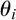 是  中的最小值，使得 。对于 ，如果 ，那么 。换句话说，如果在一阶随机优势关系下  主导 ，那么使得  为正的最小值至少不小于使得  为正的最小值。与均值条件类似，这也是一个必要条件。可以如下利用。假设 。那么可以推断出  不能主导 。仍然需要检查  是否主导  的可能性。

两个必要条件，一个是关于均值，一个是关于最小结果，可以结合起来。假设我们有  和 。均值条件表明  不能主导 ，而最小结果条件表明  不能主导 。因此，可以得出结论，没有  和  中的任何一个能主导另一个，而不实际进行两个分布的逐点比较。

两个必要条件和传递性可以结合起来得到一个用于确定支配关系的算法。已知。因此，要确定，最好首先确定，然后在中的分布中确定在 >2 关系下的最大元素。类似地，要确定，最好首先确定，然后在中的分布中确定在 >3 关系下的最大元素。

**注意**

本章的材料基于 Levy (2016)的第五章和 Bawa, Lindenberg, and Rafsky (1979)。有关更多细节，包括最新技术发展，请参阅 Levy (2016)。

## 第十一章

交易：背景概念和市场微观结构

通过交易，我们将理解为对某种金融工具的购买或销售。付款以交易所在国家的货币进行。可以交易的金融工具种类繁多。这些包括股票（或股份）、债券、商品、货币、衍生品，以及可能的其他工具。有时，术语证券用于涵盖任何可以交易的金融工具。

一个交易需要几个步骤才能完成。第一步包括卖方提供以特定价格出售和买方愿意以该价格购买。这样的买方和卖方被匹配，他们之间的交易变得可能。金融工具和货币的实际交换并不立即发生。这个过程被称为结算和交割。它可能需要几天并涉及第三方。我们的讨论不包括清算和交割功能。我们只限于销售/购买订单的启动和买方与卖方的匹配。

出售和购买以原子单位规定。例如，公司的股份被出售为一定数量的股份，其中一股是一个原子单位。进行交易的商品应具有*可替代性*的特性，这基本上意味着两个不同的单位是可以互换的，并且具有相同的金融价值。现金是可替代资产的一个例子，因为同一面额的任意两张钞票是可以互换的，并且从金融角度来看是等价的。

*股票交易所*（或简称交易所）是买方和卖方可以进行协商和交易的地方。通常，买方和卖方不直接协商。他们通过称为*经纪人*的中介进行交易。经纪人是交易所的成员。买方和卖方都成为经纪人的客户。经纪人代表他们的客户进行交易协商。作为服务的交换，经纪人赚取佣金。

直到几十年前，交易通常由经纪人通过在交易所面对面会议来进行。沟通包括面对面的谈判（通常使用手势）和电话交流。随着时间的推移，计算机开始在整个过程中扮演越来越主导的角色。这导致了交易的几个方面的自动化。

### 11.1 交易系统

*电子证券交易所*本质上是一款软件。它有两个基本任务：将订单录入订单簿和匹配买单和卖单。经纪人可以访问该软件。在某些情况下，买家和卖家也可以直接访问证券交易所的订单簿。这被称为*直接市场接入*。

通过与电子证券交易所通信的计算机电子方式下订单。通信本身是电子的。通信速度在价格变动非常迅速的交易中可能是一个因素。

证券交易所维护着各种工具在交易所上交易的当前价格。这些价格以电子格式作为实时信息发布。这些信息对于买家和卖家来说是重要的，用于决定要下达的订单。

下订单可能涉及人为因素。一个人可能坐在桌子旁研究不同工具的价格。基于一些直觉和/或预设规则，这个人将下达相关订单。然而，越来越多的大型交易者正在依赖计算机来决定何时下订单以及下什么订单。

下订单的程序也可以由一款软件完成。这个软件从交易所接收价格信息。此外，它还可能从其他来源接收新闻信息和相关信息。基于这些信息，软件决定订单的下达。这个决策过程是一种算法。软件实施这个算法。基于算法做交易决策的方法称为*算法交易*。

一个工具要在股票交易所交易，必须首先在交易所上市。例如，一家公司的股票可以在股票交易所上市，从而允许在该交易所上进行股票的买卖。一家公司的全部股票不必全部在一个股票交易所上市。可以有几个股票交易所可以交易一家公司的股票。在股票交易所上进行的任何交易都会产生*交易费*。为了确定交易的盈利能力，交易员需要考虑相关的交易费用。

股票交易所不是唯一允许交易的系统。还有替代交易系统。

*场外交易*（OTC）是买方和卖方直接进行的交易，而不经过股票交易所。场外市场由参与者组成。两个参与者可以在其他参与者不知情的情况下以某个价格进行交易。因此，场外市场通常比股票交易所透明度低。

*交叉网络*直接电子匹配买单和卖单，而不经过交易所。这样的网络可以处理场外和交易所上市的证券。匹配可以在一天的各个时间进行，甚至可以在交易所的营业时间之后进行。这种交易系统的主要优点是可以在匿名和远离公众视线的情况下进行大宗交易。这避免了一笔本来可能对价格产生影响的大宗交易。

*电子通讯网络（ECN）*是一个自动化的交易论坛，用于在传统股票交易所之外进行交易。与交叉网络相比，ECN 公布由大型交易员输入的订单。主要在 ECN 上交易股票和货币。ECN 的优点在于交易成本较低，并且提供了在传统交易所关闭期间进行订单匹配的功能。

*黑池*是一个用于交易各种金融工具的私人论坛。黑池可以通过交叉网络或直接通过专有系统访问。黑池的成员通常是大型交易者，这种池不向公众开放。通常在黑池进行大宗交易。这种交易可以匿名进行，不需要一般投资大众的知晓。在黑池上进行的交易是不透明的。因此，在黑池参与交易的交易者具有比外部人士更多的交易相关信息。黑池可以由独立公司建立以提供不同的交易平台。经纪人也可以建立黑池，其中经纪人的客户相互交易。公开交易所也可以设立黑池，以允许大型交易者以匿名方式进行交易。

### 11.2 一些相关概念

在本节中，我们简要介绍几个广泛使用的概念。

*流动性*：金融资产的市场流动性指的是该资产可以在不显著改变价格的情况下快速出售或购买的属性。在资产市场流动性较高的市场中，该资产可以快速出售而不降低价格。另一方面，如果市场对该资产的流动性不高，则快速出售将需要降低价格。资产的流动性可能取决于市场。同一资产在一个市场可能很流动，在另一个市场可能不太流动。通过回购股份可以增加流动性。

清算是将资产变换成另一个高流动性资产的任务。现金是最流动的资产，因为它可以用来购买商品和服务而不会有任何价值损失。通常，清算简单地意味着将资产卖出获得现金。在一个稍微不同的语境中，如果一个组织拥有足够量的高流动性资产，可以用来支付任何未决支付，那么该组织被称为“流动”。

*市场做市商*：市场做市商是一个报价买入和卖出金融工具的实体。该实体愿意以所报的价格定期和持续地买卖证券。为了让市场做市商获得正收益，卖出价格必须高于买入价格，即市场做市商应以高于其愿意购买价格的价格出售。卖出价格和买入价格的差异是市场做市商的买卖价差。指定做市商（或指定主要做市商）是一家已经提供了保证，将扮演某项指定证券的市场做市商角色。这样的市场做市商为证券提供流动性。

另外，市场做市商是一个下无法立即执行的限价订单的实体，即它以低于当前卖出价格的价格和/或以高于当前买入价格的价格下达购买订单。这些订单进入订单簿，并可能在将来的某个时间点被执行。因此，这些订单为市场引入了流动性。因此，市场做市商也被称为流动性提供者。

*市场接受者*：市场接受者是立即执行订单的实体。这意味着该实体以高于或等于当前卖出价格的价格下达买单，和/或以低于或等于当前买入价格的价格下达卖单。这些订单会从市场中移除流动性，因此这些实体也被称为流动性接受者。

*市场制造者、接受者费用*：交易所可以通过制造者-接受者费用结构区分制造者和接受者。当市场制造者的订单执行时，该实体会获得一笔回扣，而与市场制造者订单对手方的市场接受者必须向市场支付费用。回扣和费用的金额可以根据交易所希望激励制造者-接受者行为的方式而变化。

*买卖价差*：广义上，这是证券卖出和买入价格之间的差异。买卖价差可能来自市场制造者报价的卖出/购买价格。它还指的是交易所中证券的卖出和买入价格之间的差异。资产的一个流动性度量是买卖价差的大小。如果这个价差很小，那么资产就非常流动。特别地，如果价差为零，那么资产被称为无摩擦。

*市场影响*：这指的是当实体买入或卖出资产时对价格的影响。市场影响通过价格朝相反方向移动的金额来量化。换句话说，如果正在购买资产，则市场影响是价格上涨的金额，而如果正在出售资产，则市场影响是价格下跌的金额。资产的市场影响概念与资产的流动性密切相关。

*卖空*：资产的卖空（或做空）是指卖方出售其不拥有的资产的行为。因此，出售必须通过向另一个实体借用该资产来完成。在以后的某个时间点，卖方从市场上回购资产并偿还给出借人。这称为平仓空头。如果价格在卖出和从市场购买以偿还给出借人的时间之间下跌，卖方就会获利。相反，在此期间价格上涨时，卖方会亏损。为了计算卖空者的利润，需要考虑借款可能产生的费用，以及在借出期间出借人可能收到的现金回报。

卖空的一个基本要求是该工具必须是可互换的，否则卖空者将无法用借来的实际资产偿还出借人。卖空可以针对公共证券或货币市场进行。

从宏观角度来看，做空意味着在资产价格下跌时获利。例如，某个实体可能卖出其拥有的一定数量的股票，当价格下跌时，该实体再购买相同数量的股票，从而通过价格差获利。这与看涨相对立，看涨是指当资产价格上涨时获利。传统上，实体通过“低价买入，高价卖出”的原则获利。相反，卖空者通过“高价卖出，低价买入”的原则获利。

卖空可以由认为某个工具目前被高估并且预期价格会下跌的投机者进行。投资组合经理也会利用空头仓位来对冲多头仓位。

在期权交易的背景下，卖出认购期权或认沽期权的实体持有空头头寸。认购期权的持有人有权在未来某个日期以执行价格购买基础资产。假设一个实体在不持有基础资产的情况下卖出认购期权。如果资产的市场价格低于执行价格，则该期权到期时变成无价值，并且认购期权的持有人不行使该期权。因此，卖出认购期权的实体获得了期权的保费，而不需要持有基础资产。相反，认沽期权的持有人有权在未来某个日期以执行价格出售基础资产。假设一个实体卖出认沽期权。如果资产的市场价格保持在执行价格之上，则认沽期权到期时变成无价值，并且该期权变得毫无意义。在这种情况下，卖出认沽期权的实体获得了期权的保费，而实际上不需要购买该资产。对于这两种情况，持有期权空头头寸的实体有可能在实际上不持有基础资产的情况下获利。

在货币市场上进行空头交易与证券市场上的空头交易看起来可能有所不同。货币是成对交易的。以美元和欧元为例。在某一天，一个空头卖家借入*x*欧元并将其兑换成*y*美元。假设第二天，欧元的价格相对于美元贬值。然后使用*y*美元，空头卖家可以购买*z*欧元，其中*z* > *x*。他归还借入的*x*欧元，并获得(*z* − *x*)欧元的利润，减去借款成本。

*多头持仓*：持有资产的实体拥有正数金额的资产。如果资产价格上涨，则会获利。这是传统的投资概念。实体购买一定数量的资产。如果资产价格上涨，则实体有可能获利，而如果价格下跌，则实体有可能亏损。

对于期权，一个实体通过购买资产的认购期权或认沽期权来做多头持仓。对于认购期权，实体获得以行使价格购买资产的权利。如果资产的市场价格上涨到高于行使价格，那么实体可以行使期权以行使价格购买资产，并在市场上出售，从而获利（扣除购买期权的溢价后）。对于认沽期权，实体获得以行使价格出售资产的权利。如果资产的市场价格下跌到低于行使价格，那么实体可以通过从市场购买并以行使价格出售来行使期权。这同样会在购买期权的溢价扣除后带来利润。在这两种情况下，为了获利，持有期权多头的实体需要在某个时间点拥有基础资产。

### 11.3 订单簿

在任何交易系统中，交易者提供两类订单，即买单和卖单。交易系统如交易所维护一个订单簿。这样的订单簿本质上是交易者在各种金融工具上做出的订单列表。订单簿中的信息对交易者可见，使他们能够做出更明智的交易。

每个独立的订单至少包含以下信息：订单所涉及的特定证券，订单是买入还是卖出，数量，可能还包括交易者愿意买入或卖出的价格。此外，应该有一些方式，即使交易者的实际身份被隐藏，系统也能与下单者相关联，如在黑暗池中一样。下达的订单也可以根据一些限制取消。

两个报价之间允许的最小差异称为*tick*。因此，两个不同价格的订单肯定相差一个*tick*。*tick*的实际值可能由交易场所决定。*价格水平*指的是以相同价格报价的几个订单。例如，可能会有多个以相同价格水平报价的卖单。如果有一个出价（或买单）在该水平，那么潜在地所有卖单都可能被执行。两个价格水平必然至少相差一个*tick*。

一种证券的*市场深度*指的是该证券的各种价格水平。它以价格水平列表和每个价格水平上要交易的总数量的形式提供。直观地说，市场深度指的是需要多大的订单才能将市场价格移动指定的金额。深度市场保持价格稳定。在这个意义上，市场深度与流动性概念相关。

由于订单是输入到订单簿中的，订单簿深度指的是一种证券的价格水平数量。交易场所可以选择将订单簿维持到预先指定的水平，并且超出该水平的所有订单都将被忽略。或者，也可以允许无限的订单簿深度。

对于任何证券，交易者愿意买入的最高价格（最高买价）和愿意卖出的最低价格（最低卖价）称为订单簿的顶部。最高买价和最低卖价之间的差异称为订单簿的买卖价差。这是该证券市场的一个重要指标。

### 11.4 订单

在非常广泛的层面上，一个订单要么是买单要么是卖单。现代交易系统允许多种订单类型。在本节中，我们简要提及几种此类类型。

在继续之前，我们提到几个术语问题。在可能的情况下，交易所会执行订单。执行订单的任务也可以被称为填写订单或满足订单。

最简单的订单是*市价订单*。这种订单指定了数量，但没有指定价格。每当有愿意的交易对手时，它都会立即以最佳市场价格执行。例如，买入市价订单将以最低的卖出价格执行，而卖出市价订单将以最高的买入价格执行。需要注意的是，在现代市场上，价格可能变化非常快。由于市价订单不指定价格，因此可能以与输入订单之前可用价格相当不同的价格执行。交易员的市价订单可能被分割到多个交易对手中，导致不同数量的资产的不同价格。由于市价订单是所有订单类型中最简单的，因此经纪人对其收取的佣金最少。

*限价订单*比市价订单复杂一步。限价订单指定了数量和价格，表示该数量的交易将以指定或更好的价格进行。因此，买入限价订单可以以指定或更低的价格购买，而卖出限价订单可以以指定或更高的价格出售。如果订单簿中存在与指定或更好价格匹配的订单，则限价订单可以立即满足。否则，限价订单将被输入到订单簿队列中，并且必须等待匹配订单。允许部分成交限价订单，剩余数量的订单将被输入到订单簿中。

市价和限价订单是两种基本类型的订单。这些可以通过其他条件进一步限定，从而产生各种类型的订单。以下简要提及其中一些。

*全部成交或取消（FOK）：* 订单要么全部成交，要么取消。

*立即成交或取消（IOC）：* 订单要么立即成交，要么取消。与 FOK 不同，允许部分成交。

*全部或无（AON）：* 要么订单完全成交，要么完全不成交。不允许部分成交。未成交的 AON 订单不会被取消。

*开盘市价（MOO），收盘市价（MOC），开盘限价（LOO），收盘限价（LOC）：* 一些交易所在开盘和收盘时进行竞价。 MOO 订单是保证以竞价的开盘价格获得的市价订单，而 MOC 订单是保证以竞价的收盘价格获得的市价订单。 LOO 和 LOC 是类似于 MOO 和 MOC 的限价订单，区别在于这些订单指定了价格，仅当开盘和收盘价格与指定价格匹配时才会成交。

*止损单：* 这是一个在市场价格达到特定价格时进行交易的订单。一旦达到指定价格，止损单就变成了市价单。因此，即使价格相对于止损单价格不利变化，交易也一定会发生（取决于是否有交易对手方可用）。

*中价挂单：* 这样的订单指定了一个限价，该限价是最佳买入价和最佳卖出价的平均值。

*市价触发：* 如果市场价格达到指定的“触发”水平，则交易将以最佳可用价格进行。一旦触发价格达到，订单就被视为市价订单。

*一对对立订单：* 这是为两种工具设置的一对订单。如果其中一个订单执行，那么另一个订单就被取消了。

*一发其他：* 这指定了一系列订单。如果第一个订单执行，则触发下一个订单。订单按顺序执行。

*套单：* 将几个订单组合在一起。例如，一个分级卖出订单包括三个订单：一个指定价格的卖出限价订单，在卖出订单的入场价格上方的买入止损订单和在入场价格下方的买入限价订单。

可以指定显示说明。例如，全量或全无买入限价订单可以指示在另一个交易者以指定价格出售订单的全部数量时进行买入，但在其他情况下不显示订单。冰山订单只显示订单的一小部分，将大部分订单保持不显示。

正如上文所示，存在各种各样的订单。根据市场状况，不是所有输入的订单都能立即成交。因此，出现了优先处理订单的问题。通常，最简单的订单优先级最高。因此，市价单首先被填充，然后是限价单。更复杂的订单优先级较低。此外，冰山和暗池订单的优先级较低。

### 11.5 订单匹配算法

交易员输入订单并将其存储在交易所的订单簿中。匹配的买单和卖单必须被识别，并且相应的交易被执行。这些是使用订单匹配算法来完成的。在本节中，我们提供了基本订单匹配算法的概述。这个讨论是基于 Janeček 和 Kabrhel（2007）的。

交易所以连续和拍卖两种形式匹配订单。拍卖在交易所开放和关闭时进行，而连续匹配则在交易所开放的其余时间内进行。

交易所在实际开放之前相当长的时间就开始接受开放订单。这些订单可以是买单也可以是卖单，并且公开展示。根据展示的订单，交易员可以取消先前的订单并输入新的订单。在开放之前的短时间内，不再允许取消订单。一旦交易所开放，就会进行多卖家和多买家拍卖以满足开放订单。这确定了交易所交易的各种证券的开盘价格。在交易所关闭时，进行类似的拍卖，以确定证券的收盘价格。这些收盘价格成为第二天开盘拍卖的基础价格。

在交易日内，交易所进行持续匹配。市价订单在有相应交易对手方可用情况下立即执行。接下来优先考虑限价订单。假设在某个时间点，有 *n* 个限价订单的数量为 *T* 1,…,*T* [*n*]，价格水平相同，并且有一笔交易对手方价格匹配的交易量为 *W*。令 *T* = *T* 1 + ⋯ + *T* [*n*]。如果 *W* ≥ *T*，那么所有 *n* 个限价订单都可以满足，没有问题。所以，假设 *W* < *T*。那么所有 *n* 个订单无法完全满足。对于处理这种情况，有两种方法，我们将在下面描述。

*比例匹配*：对于 *i* = 1,…,*n*，让 *s* [*i*] = *T* [*i*] /*T*。从 *W* 个数量的交易中，分配给第 *i* 个订单的数量是 ，其中  是向下取整函数（即  是不大于 *x* 的最大整数）。因此，在 *W* 个数量中，共使用了总量 *S* = *S* 1 + ⋯ + *S* [*n*] ≤ *W*。剩余的 *W* − *S* 个数量仍需要分配。一种选择是使用先到先得（即队列）原则来分配这些数量。根据 *s* [*i*] 和 *W* 的值，可能会出现 *S* [*i*] = 0。那么第 *i* 个订单在第一轮中就不会获得任何分配。如果 *W* − *S* 小于第一轮中未填充订单的数量，则剩余的 *W* − *S* 个数量可以用于按照先到先得的原则分配给这样的订单。这种策略有助于较小的交易者。

总的来说，比例算法促使下达更大的订单，因为这增加了订单被填满的机会。它并不直接促使减少买卖价差。

*价格/时间算法*：此算法找到最小的*j*，使得*T*1 + ⋯ + *T* *j* ≤ *W*，并且*T*1 + ⋯ + *T* *j*+1 > *W*。前*j*个订单都得到了满足。如果*j* + 1 ≤ *n*，则可能剩余的*W* − (*T*1 + ⋯ + *T* *j* )数量全部分配给第(*j* + 1)个订单。

价格/时间算法鼓励交易者尽早下单。这有助于缩小买卖价差。一旦形成了队列，交易者不太可能加入队列，因为他们的订单很难被填充。

### 11.6 算法交易

交易需要做出决策。这些决策是多方面的，涉及到是否买入或卖出，要交易哪种证券以及以什么价格，何时交易，应该放置什么类型的订单等多个问题。如果交易者可以访问多个交易所（或平台），那么另一个维度将是选择交易平台。

传统上，所有这些决策都是由人类做出的。一个人或一组人会分析所有相关信息，然后做出适当的决策。这些决策可能以电子形式通信，也可能使用专用服务器实施。

在过去的几十年里，计算机越来越多地开始自行进行交易决策。自动化交易软件将处理电子形式的可用信息，并根据这些信息做出适当的交易决策。交易决策将以电子形式通信到交易平台并进行数字化执行。在操作的任何阶段都不需要人类干预。广义上说，这种进行交易的方式称为算法交易。当然，算法交易并不完全摆脱人类参与。人类的角色仅限于开发和测试交易软件，以及定期调整其参数。

算法交易被两个不同的交易者群体使用。机构投资者，如投资银行、养老基金、共同基金和对冲基金，使用算法交易有一个特定的目标。这些投资者通常下达无法一次性满足的大额订单。此外，下达大额订单可能会使价格朝相反方向移动。因此，大额订单被拆分成小订单并发送到市场。关于订单大小以及何时下单的决定由基于多种策略之一的软件做出。在这种算法交易应用中，目标并不一定是获得大额交易利润。相反，这是一种减少市场影响、降低成本和风险的方式。

投机交易者也利用算法交易。在这种情况下，目标确实是尽可能多地获利。广义上讲，这涉及利用市场不平衡和缺陷进行盈利交易。这类交易的一个基本特征是速度。由于市场缺陷只发生在非常短的时间内，任何利用这种缺陷的方法都必须快速。以此类目的进行的算法交易称为*高频交易*。

要实现高速，首要要求是非常快地获取市场信息。在交易平台生成数据和这些数据对交易者可用之间的时间称为延迟。因此，一个目标是降低这种延迟。为此，采用了超低延迟直接市场访问（ULLDMA）技术。此外，交易者还希望将其交易软件放置在离市场非常近的位置，以便信息传输的距离更短。这种特性称为共同定位。

除了高速通信外，还需要快速计算机来做出适当的决策。这些决策本身可能很简单，也可能非常复杂，涉及市场模型和随机控制理论。交易决策是某种算法的输出。在高频交易的背景下，决策算法本身必须非常快速。如果一个算法提出了一个最优的交易决策，但花费的时间超过了可用的盈利交易时间窗口，那么这样的算法对于高频交易将没有用处。

一个算法交易软件（无论是给机构交易者还是给高频交易者）经过了几个测试周期。第一种测试称为回测。这涉及在历史数据上运行软件，以发现可能的错误、低效性，以及确定它在增加回报方面的功效。另一种测试称为前向测试。这涉及使用实时市场数据进行模拟交易。最后的测试涉及实时测试，其中软件的实际性能与回测和前向测试结果进行比较。有各种指标来评估算法交易软件。只有在这些指标上表现良好的软件才会被部署用于实际交易。高频交易涉及在大量资金上做出非常快速的交易决策。一个小错误或错误很快就会清空大量资金。因此，在实际使用软件进行交易之前，交易者会采用非常严格的评估条件。

### 11.7 有效市场假说

投资中的一个基本问题是是否可能“战胜市场”，即购买和出售金融工具以获得比市场平均水平更多的收益？为了战胜市场，一个人可以进行各种类型的分析。这种分析可能是分析过去的股票市场价格，并对未来做出预测。这通常被称为技术分析。另一种类型的分析，称为基本分析，是分析企业的财务报表（资产、负债和收益）、其健康状况和竞争对手，以及各种其他公开可获得的信息，如利率或一个国家的 GDP。

有效市场假说（EMH）认为价格完全反映了所有可获得的信息。如果 EMH 成立，那么没有办法持续战胜市场。确保更高回报的唯一途径是投资于更高风险的工具。这样的投资可以提供更高的回报，但同时也有可能造成重大损失。假设 EMH 成立，与其试图战胜市场，不如投资于指数基金更为合适，因为指数基金旨在与整个市场一样返回相同的回报。

EMH 有三种形式，分别是弱式、半强式和强式。弱式 EMH 假设现行价格完全反映了所有历史股票价格。半强式 EMH 假设现行价格完全反映了所有公开可获得的信息。强式 EMH 假设现行价格完全反映了所有公开*和*私人信息。已经进行了实证研究以确定 EMH 是否成立。这些研究表明支持弱式 EMH，并且对半强式 EMH 也有一些小的无法解释的异常。关于强式 EMH，并没有明显的实证支持这个假设。

EMH 的一个重要含义是，市场价格仅对新信息作出反应，并在新信息变得可用时立即变化。如果 EMH 成立，则不可能获得无风险利润。另一方面，套利的目标是获得无风险（或极低风险）的利润。因此，如果 EMH 成立，则套利是不可能的。然而，套利机会确实出现，并被称为套利者的金融专家所利用。对于这种明显矛盾的观点的解释是，套利机会表明市场的效率低下。这些机会存在于市场自我纠正的非常短的时间间隔内。套利者的目标是识别并利用这些市场效率低下的小窗口来获得无风险利润。

**注意**

有许多关于基本交易概念和市场微结构的参考资料。此外，还有大量的在线资料可供参考。本章提供了相关信息的简明总结。在制作摘要时，我们从 Johnson（2009）和 Kissell（2013）的讨论中受益。

## 第十二章

算法交易策略

考虑一个交易员希望在特定时间范围内购买或出售大量特定股票的情况。这样的决定可能有各种各样的原因，例如清算持仓或重新平衡投资组合。虽然交易决策的基础确实很重要，但在本章中，我们不关心实际原因。我们将假设交易员已经做出了决定，并考虑如何*执行*交易的问题。

如果股票非常流动（相对于交易规模），那么就没有问题。整个购买或出售可以作为单一订单进行。然而，当交易规模很大时，这种情况很少见。大量交易通常会将价格朝不利的方向推动。换句话说，如果要购买大量股票，这会推高股票价格；相反，如果要出售大量股票，这会使股票价格下跌。因此，对于购买订单，交易员最终会支付更多，而对于出售订单，交易员最终会获得更少。因此，将整个交易作为单一订单进行将会产生不利的市场影响，导致交易员获得次优的回报。

上述讨论表明，交易员将通过将单笔订单拆分为多个子订单而获益更多。这引出了如何获得子订单的大小以及何时交易它们的问题。一个相关的重要问题是评估特定交易策略的有效性。

已经设计了各种算法交易策略来解决上述问题。请注意，这种策略的目标不一定是最大化利润，而是尽量减少市场影响。在本章中，我们将介绍一些已提出的基本算法交易策略。

### 12.1 时间加权平均价格

假设一个交易员决定在指定的时间内购买（或出售）*S*股。如上所述，当*S*很大时，为*S*股下单会将价格朝不利的方向推动。交易员的最简单策略如下。将指定时间段分成*n*个子区间，并在每个子区间下单*S*/*n*股。

一个简单的性能基准是时间加权平均价格（TWAP）。对于每个间隔，平均价格被确定为该间隔内的开盘、收盘、最高和最低价格的平均值。这些平均值在*n*个子间隔上的平均值是交易持续时间的 TWAP。通过将价格与 TWAP 进行比较来评估实际交易的表现。事实上，将相等大小的子订单放置在相等的间隔中的一个目标是实现 TWAP。

在相等的时间间隔内放置相等大小的订单的简单策略对于密切关注市场的交易者来说是完全可预测的。事实上，这样的交易策略也可以被算法发现。另一个交易者可以利用这种策略。假设一个子限价订单被放置以每股$10 的价格买入 1,000 股。另一个一直在跟踪这些较小订单的交易者以每股$10.01 的价格放置了购买限价订单，数量为 500 股。如果市场价格达到$10.01 然后上涨，那么这个交易者就会赚取利润；如果市场价格跌破$10.01，那么这个交易者会以$10.01 的价格卖出所购买的股票，以每股 1 分的损失。因此，存在以非常低的风险获利的可能性。这种策略有时被称为跳跃一分钱。

简单的时间分割策略容易受到上述问题的影响。因此，对这种交易策略进行了修改。这些修改包括在随机看似的时间点而不是定期间隔放置子订单，而且所有子订单的大小不一定相等。目标仍然是实现接近 TWAP 的价格。

### 12.2 成交量加权平均价格

体积加权平均价格（VWAP）是另一个绩效基准。这里的体积指的是订单的大小。假设* n *个大小为* S * 1,…，* S * [* n *]的子订单被下达，其中* S * = * S * 1 + ⋯ + * S * [* n *]是所有子订单的总大小。假设订单* S * * k *以价格* p * * k *交易。那么订单的 VWAP 定义如下：

(12.1)

对于 VWAP，不需要将子订单定期下达。即使子订单是在不均匀的间隔下达，上述定义仍然有效。

请注意，与 TWAP 一样，VWAP 是一个绩效基准，可以在整个交易完成后计算。因此，基准本身并不建议如何获取子订单的大小* S * 1,…，* S * [* n *]。在实践中，VWAP 算法使用历史交易数据来获取在交易期间*k*可能进行的交易量的估计*u* * k *。然后第*k*个子订单的体积*S* * k *设置为*S* * k *=* u * * k * * S *。

该方法的有效性取决于估计* u * 1,…，* u * [* n *]的准确性。或许更重要的是，交易的执行需要遵循历史模式。因此，一个盲目使用历史数据的 VWAP 算法可能会造成亏损。对于这样的算法来说，也很重要跟踪价格和正在交易的股票总量的波动。根据这样的信息，它可能会动态调整子订单的数量，超过历史数据所指示的数量。

### 12.3 体积百分比

百分比成交量（PoV）策略的目标是尽量确保子订单的大小等于总交易量的某个预先指定的百分比（比如 *γ*）。假设已交易的股份的总量（所有交易员的）直到第 *k* 个时间间隔为 *X* *k*。 *X* *k* 的值是根据交易所提供的交易数据得知的。设 *S* *k* 为在第 *k* 个时间间隔内要放置的子订单的大小。要实现 *γ* 的 PoV，我们必须满足

(12.2)

与 VWAP 一样，PoV 的子订单不需要以固定的时间间隔放置。唯一的问题是，每当需要放置一个子订单时，就会使用上述公式计算子订单的大小。放置子订单的时间点可以基于额外的信息。

### 12.4 加权价格的参与度

PWP 是 PoV 和 VWAP 的结合。假设期望的 PoV 是 *γ*。交易员放置一系列子订单 *S* 1,…,*S* [*n*]，总大小为 *S* = *S* 1 + ⋯ + *S* [*n*]。考虑从放置第一个子订单开始到在交易所交易了 *S*/*γ* 股份的时间段。参与度加权价格（PWP）是自放置第一个子订单以来市场上已交易的前 *S*/*γ* 股份的 VWAP。

PWP 也是后期交易分析中使用的基准。这个基准的理由是，如果交易员以 PoV *γ* 进行了 *S* 股的交易，那么当市场上交易了前 *S*/*γ* 股份时，交易就会结束。因此，看看从交易的前 *S*/*γ* 股份中产生的 VWAP 是有意义的。

### 12.5 Bertsimas–Lo 动态规划策略

假设要购买总共的*S*股份。与以往一样，放置了*n*个子订单，其中第*k*个订单的大小为*S* *k*。在本节中，我们假设，即*S*股份的整个交易在*n*个子订单中完成。我们要解决的问题是如何确定*S* 1,…,*S* [*n*]的值，使交易在某种意义上是最优的。Bertsimas 和 Lo（1998）使用动态规划给出了这个问题的答案。在他们之后，我们已经将问题提出，以*S*股份为购买对象。该描述可以很容易地修改以处理要出售的*S*股份的情况。

一股的价格是一个随机变量。假设第*k*股以每股*P* *k*的价格购买，*k* = 1,…,*n*。那么交易的总支出是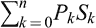。由于*P* *k*是随机变量，总支出也是一个随机变量。因此，最优性目标将是最小化总支出的期望值。这个问题的表述如下：

(12.3)

受制于约束条件：

(12.4)

对于*i* = *k*,…,*n* + 1，我们定义*W* *k*为在第*k*个子订单开始时剩余要购买的股票数。所以，

(12.5)

从定义可以得出，*W* [*n*] = *S* [*n*]，因为在最后一个子订单开始时剩余要购买的股票数等于在最后一个子订单中购买的股票数（根据前面提到的假设，即通过*n*个子订单完成所有*S*股份的购买）。

需要对价格动态进行建模。价格 *P* *k* 被认为是一个随机变量，它依赖于前一价格 *P* *k*−1，第 *k* 个子订单的大小 *S* *k*（这捕捉了第 *k* 个子订单的市场影响），一个随机噪声 *ε* *k* 和一个状态向量 **X** *k* 。状态向量 **X** *k* 捕捉了可能影响价格的多个外部因素。向量 **X** *k* 本身也被认为是前一状态向量 **X** *k*−1 和一个随机噪声 *η* *k* 的函数。这种情况可以形式化描述如下。对于 *k* = 1,…,*n*，

(12.6)

对于 *k* = 1,…,*n*，*ε* *k* 和 *η* *k* 是具有零均值的独立白噪声过程。价格 *P* 0 被视为某个到达价格，而状态向量 **X** 0 被视为某些初始信息。请注意，决定价格 *P* *k* 和状态向量 **X** *k* 的演变的函数 *f* *k* 和 *g* *k* 可能会随 *k* 变化。因此，这些函数模拟了价格和状态演变的时变性质。

在 (12.3) 给定的约束条件下，根据 (12.4) 的约束，以 (12.6) 给定的价格动态，可以使用随机动态规划技术来解决问题。基本观察是，一个最优解  对于每个中间点 *k* 的剩余交易也必须是最优的。换句话说，如果  是在 *n* 个时间段内整个交易的最佳交易策略，则对于每个满足 1 < *k* < *n* 的 *k*，  仍然必须是最优的，即  必须最小化 。

动态规划的形式化基于这一观察。贝尔曼方程如下所示。对于 *k* = 1,…,*n* − 1，设

(12.7)

和 。

回顾一下从定义 *W* [*k*]，我们有 。考虑第 *n* − 1 个贝尔曼方程，即

(12.8)

最小化(12.8)的最优值  是 *P* *n*−2, **X** *n*−1 和 *W* *n*−1 的函数 *h* *n*−1。因此，

(12.9)

从反向方向进行，

(12.10)

因此，最优值  是 *P* *n*−*k*−1, **X** *n*−*k* 和 *W* *n*−*k* 的函数，即

(12.11)

将 *k* = *n* − 1，我们有

(12.12)

注意 *W* 1 = *S*。利用这一点，可以向前工作以获得最优值的表达式。

虽然这种方法在理论上是合理的，但问题出在解(12.10)以获得解 上。一般来说，*V* *n*−*k* (·) 可能没有一个封闭的表达式，即使有，也可能没有解析方法来解决它对于 。因此，采用数值方法来获得最优值。

一个特别感兴趣的特殊情况是当价格动态遵循一个特别简单的模型时。函数 *f* 1,…,*f* [*n*] 都取相同的值，并且进一步，这个公共函数具有以下形式：

对于某些 *θ* > 0。换句话说，价格 *P* *k* 线性依赖于先前价格和第 *k* 个子订单的大小。参数 *θ* 捕获订单的市场影响。对于这个简单的价格模型，根据上述概述的一般论点，可以显示最优解是 ，即最优策略是在每个时间段购买相等数量的股票。

### 12.6 实现不足

假设共有 *S* 股要进行交易。交易计划导致执行 *n* 个子订单，其中第 *k* 个订单由 *S* *k* 股组成。一般来说，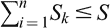。如果，那么所有 *S* 股都已交易，而如果，则 股无法交易。

假设，股票的到达价格是 *p* 0，即这是交易计划执行时的价格。子订单 *S* *k* 以价格 *p* [*k*] 进行交易，其中 *k* = 1,…,*n*。请注意，第一个子订单以价格 *p* 1 进行交易，这可能与到达价格 *p* 0 不同。最后一个子订单所获得的最终价格是 *p* [*n*]。

执行交易策略会产生成本。实现不足（IS）试图捕捉执行交易策略的成本。在其基本形式中，IS 是纸面收益和实际收益之间的差异，即

(12.13)

纸面收益是 *S* 股整个批次在到达价格 *p* 0 和最终价格 *p* [*n*] 之间价值的差异，即

(12.14)

实际回报基于实际交易的股份数量，即。以最终价格，*S′*股份的价值为*S′p* [*n*]。实际支付的价格为。此外，还有一个费用*C*，用于 covering 进行交易所产生的各种费用。实际回报计算如下：

(12.15)

使用(12.14)和(12.15)在(12.13)中，我们有

(12.16)

(12.16)的第一个组成部分是实际交易的*S′*股份的执行成本，而(12.16)的第二个组成部分是交易未能完成的*S* − *S′*股份的机会成本。如果所有*S*股份都能交易，那么*S′* = *S*，在这种情况下，机会成本为 0，实现差额仅由执行成本和费用组成。

### 12.7 Almgren–Chriss 高效交易前沿

设计交易策略的目标是确保某种最优性。Bertsimas-Lo 动态规划策略将交易的预期成本最小化。设计交易策略的另一种方法是使用实现差额。由于价格是随机变量，实现差额也是随机变量。Almgren–Chriss 方法考虑实现差额的期望和方差。该方法是为实现差额的方差设定一个水平，并在所有实现该方差的策略中，获得一个最小化实现差额预期值的策略。由于方差衡量交易策略的风险，该方法可以被视为一种风险规避的交易策略。

我们在*S*单位证券在时间*T*内出售的情况下提供 Almgren–Chriss 方法的描述。时间*T*被分为*n*个相等大小的时间间隔，每个间隔的长度为*τ* = *T*/*n*。让*t* *k* = *kτ*，*k* = 0,…,*n*为离散时间点。对于*k* = 1,…,*n*，第*k*个间隔以开始时间点*t* *k*−1 和结束时间点*t* *k*标记。第*k*个间隔中出售的单位数为*S* *k*。我们假设，即*S*单位的全部持有在时间*T*内完全清算。

对于*k* = 0,…,*n*，让*X* *k*表示时间点*t* *k*时剩余待出售单位数。因此，*X* 0 = *S*，而*X* [*n*] = 0。由于第*k*个时间段销售的单位数是*S* [*k*]，我们有*S* *k* = *X* *k*−1 − *X* *k*。因此，对于*k* = 0,…,*n*，

(12.17)

要计算执行不足，需要对价格动态建模。证券价格由两种广泛的影响因素决定，即与交易无关的因素和与交易相关的因素。前者使用波动率和漂移建模，而后者使用市场影响建模。市场影响进一步分为两种类型，一种是跨*S*单位整个交易期间持久存在的，另一种是暂时性的，只在第*k*个间隔中产生影响。Almgren 和 Chriss 考虑的价格模型如下：

对于*k* = 0,…,*n*，假设*k*时刻的价格为*P* *k*。那么对于*k* = 1,…,*n*，*P* *k* 被假设遵循离散的算术随机游走，如下所示

(12.18)

在 (12.18) 中，*τ* 是时间间隔的长度，*σ* 是证券波动性的度量，且没有漂移项。 *ξ* *k* 是具有零均值和单位方差的独立随机变量。 交易的永久市场影响由函数 *g*(*v*) 建模，其中 *v* = *S* *k* /*τ* 是第 *k* 个间隔中的平均交易速率。

让

从 (12.18) 得出，对于 *k* ≥ 1，

(12.19)

由 (12.18) 给出的价格 *P* *k* 没有得到。 实际获得的价格是 ，它是从 *P* *k*−1 中折现获得的，考虑了临时市场影响。 所以，

(12.20)

在 (12.20) 中，临时市场影响由 *h*(·) 捕捉。 *h*(*S* *k* /*τ*) 的值影响第 *k* 个间隔的价格，但不影响其他间隔的价格。 在这些间隔中的临时价格影响是通过在这些间隔中的平均交易速率上评估 *h*(·) 来捕捉的。 请注意，临时影响函数 *h*(·) 的形式被假定对所有间隔都是相同的。 但是，这并不是一个限制，可以适当放宽。

函数 *g* 和 *h* 的适当形式由市场微观结构的模型确定。 给定这些形式，可能需要使用数值而不是分析方法来执行各种计算。

交易成本为 。 使用 (12.17)，(12.18)，(12.19) 和 (12.20)， 可以简化如下：

替换 *δ* [*k*] 的表达式，我们有

(12.21)

Almgren 和 Chriss 考虑的交易有效成本是初始纸面价值和实际回报之间的差异，即

(12.22)

(12.23)

(12.22)给出的表达式与(12.16)给出的实施损失有关，在这里忽略了费用，也没有机会成本，因为整个持有都被清算了。在这些条件下，(12.23)给出的表达式就是(12.16)给出的实施损失。形式上，(12.22)给出的表达式是(12.16)给出的表达式的负值，但这是由于交易性质的差异，即买卖股份。IS 的价值由交易策略**X**=(*X* 0,…,*X* [*n*] )（或等价地 (*S* 1,…,*S* [*n*] )）决定。我们写成 IS(**X**)来表示这种依赖性。

(12.23)中的随机性源于*ξ* *k*，它们与均值为 0 和单位方差的独立。所有其他数量都是非随机的。根据这些观察结果，并利用期望的线性性质以及独立变量和的方差是它们方差的和的事实，我们得到

(12.24)

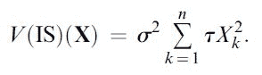(12.25)

风险厌恶的交易者将努力确保方差*V*(IS(**X**))保持在某个上限*V* *以下。一旦*V* *确定，可能会有各种实现这种风险厌恶水平的策略。在这些策略中，理性的交易者将选择一个最小化*E*(IS(**X**))的策略。这些考虑导致了以下受限最优化问题。

找到一种高效的交易策略 (*S* 1,…,*S* [*n*] )，使得*E*(IS(**X**))最小化，同时满足 IS(**X**) ≤ *V*，即

(12.26)

通过引入拉格朗日乘子*λ*，(12.26)中的约束优化问题转化为以下无约束优化问题：

(12.27)

参数*λ*是风险厌恶的度量。它量化了方差相对期望的惩罚量。如果*λ* > 0，那么*E* + *λV*是严格凸的，且(12.27)有唯一解**S** ^*(*λ*)。因此，对于每个风险厌恶的值*λ*，都可以确定一个最优解。随着*λ*的变化，**S** ^*(*λ*)确定了一个单参数族，从而确定了有效的交易边界。

#### 12.7.1 线性冲击函数

假设永久市场冲击函数*g*(·)和临时市场冲击函数*h*(·)都被建模为线性函数。函数*g*(*v*)取如下形式：

(12.28)

参数*γ*捕获整个交易的市场冲击。

对于第*k*个间隔，交易了*S* *k*单位。我们已经考虑了证券清算的问题。更一般地，第*k*个间隔的交易可以是买入或卖出。令 sgn(*S* *k* )为*S* *k*的符号。然后临时冲击函数的线性模型如下：

(12.29)

参数ε代表固定成本，参数*η*捕获临时市场冲击。（注意(12.29)中的*η*与(12.6)中使用的*η* *k*无关。）

我们将(12.28)和(12.29)应用于由(12.24)给出的*E*(IS(**X**))的表达式。注意到、，以及使用*X* *k* = *S* *k*+1 + ⋯ + *S* [*n*]，我们有。利用这些，(12.24)简化为以下形式：

(12.30)

其中

(12.31)

考虑两种简单的交易策略，即以恒定速率卖出和在第一个时间步骤即全部卖出股票。这两种情况下的期望值和方差如下：

*以恒定速率清算：* 在这种情况下，*S* *k* = *S*/*n*，因此 *X* *k* = (*n* − *k*)*S*/*n*。这些值产生

这种交易策略能最小化预期成本，但如果期间 *T* 很大，方差可能很大。

*在第一步清算：* 在这种情况下，*S* 1 = *S*，*S* 2 = ⋯ = *S* [*n*] = 0，因此 *X* 1 = ⋯ = *X* [*n*] = 0\. 这些值产生

这种交易策略具有最小的方差。另一方面，如果*η*较大且*τ*较小，则预期成本可能很高。

我们回到线性市场影响模型中提出的优化问题 (12.27)。在 (12.27) 中，*E* 的表达式取自 (12.30)，*V* 的表达式取自 (12.25)。我们考虑清算问题，使得在 (12.30) 中 |*S* *k* | = *S* *k*，并且 (12.30) 的第二项变为 。回想一下 *X* 0 = *S* 和 *X* [*n*] = 0\. 因此，对于 **X** = (*X* 0,…,*X* [*n*] ) 的最小化实际上是对控制变量 *X* 1,…,*X* *n*−1 的最小化。设

(12.32)

对于*λ* ≥ 0，*U*(**X**) 是严格凸的。因此，通过将偏导数设为零，可以确定唯一的全局最小值。计算偏导数时，请注意*S*是一个常数，因此(12.30)的第一项和第二项的偏导数为 0。在计算偏导数时，注意到*S*是一个常数，因此(12.30)的第一项和第二项的偏导数为 0。在变量*S*1,…,*S*[*n*]中，只有*S* *k*和*S* *k*+1 取决于*X* *k*，而其他变量不取决于*X* *k*。进一步地，*S* *k* = *X* *k*−1 − *X* *k*和*S* *k*+1 = *X* *k* − *X* *k*+1。利用这些表达式，我们有对于*k* = 1,…,*n* − 1，

条件∂*U*/∂*X* *k* = 0 提供

(12.33)

其中

(12.34)

具有*X* 0 = *S*和*X*[*n*] = 0 的特定解给出了*X* *k*的值，对于*k* = 0,…,*n*，如下：

(12.35)

其中*κ*满足关系。

从(12.35)中给定的*X* *k*的值，可以如下确定*k* = 1,…,*n*的*S* *k*的值：

(12.36)

其中*t* *k*−1/2 = (*k* − 1/2)*τ*。

请注意，参数*κ*是由风险厌恶参数*λ*确定的。因此，考虑到线性市场冲击模型，对于固定的风险厌恶值，可以确定最小化预期实施差额的交易策略，并由(12.35)给出。在*k*间隔中要交易的实际单位数由(12.36)给出。

**注意**

第 12.5 节中的描述来自 Bertsimas 和 Lo（1998），第 12.7 节中的描述来自 Almgren 和 Chriss（2000）。我们参考 Kissell（2013）以获取本章描述的一些概念的更详细阐述。

## 第十三章

投资组合优化

投资组合这个术语指的是一系列金融资产，如股票、债券和期权。一个实体可以将其投资分散到投资组合中的各种资产中。投资组合中的每个资产都可能获得收益，也有可能出现亏损的风险。投资组合中所有资产的收益确定了投资组合的整体收益，资产的各个风险也确定了投资组合的整体风险。因此，投资组合有可能获得收益，同时也有亏损的风险。

风险分散是构建投资组合的基本动机。通过将投资分散到多种金融资产上，实体试图确保任何一种资产的损失都可以通过其他一些资产的利润来抵消。广义上讲，投资组合优化的目标主要是最大化预期收益并最小化风险。同时实现这两者可能会很困难。

投资组合可以包含各种类型的资产，这些资产可以分为资产子类。两种资产子类将具有根本上不同的金融特性，以及不同的系统性或不可分散风险。例如，股票和固定收益证券（如债券）将属于不同的资产子类。建立投资组合的实体将不得不决定两件事情。首先，要投资于各种资产子类的比例，其次，要在特定子类中的资产之间投资的比例。这些比例通常称为权重。给定要包含在投资组合中的资产，分配给资产的权重确定了投资组合的收益以及投资组合的整体风险。

投资组合权重是在某一时间点确定的。然而，它们可能会不时地更改。这样的变化通常涉及购买或出售投资组合中的资产。这涉及交易成本。权重保持不变的时间段称为一个期间。投资组合优化问题可以同时考虑单期优化和多期优化。

在优化问题之前，人们必须考虑要包含在投资组合中的资产。从理论上讲，一个人可以从考虑市场上所有可用的资产开始，然后对其中一些资产分配零权重。从实际的角度来看，投资者通常会根据许多因素选择相关资产，其中并非所有因素都可以进行数学建模。

在本章中，我们将考虑两种类型的优化问题。第一个问题是股票的单期优化问题。任务是确定权重，以满足一些合理的目标。第二个问题是股票的多期优化问题。我们不会考虑投资者如何选择要包含在投资组合中的资产，或者确定在各种资产子类中投资的比例的问题。

### 13.1 马科维茨投资组合优化

假设投资组合中有*n*个资产*A* 1,…,*A* [*n*]。资产*A* [*i*]的回报率为随机变量*R* [*i*]。如果投资了*X* [*i*]金额在*A* [*i*]，那么得到的金额*Y* [*i*]为*Y* [*i*] = *X* [*i*] (1 + *R* [*i*])。*R* [*i*]的均值和标准差分别用 和表示。这里 是*A* [*i*]的预期回报率，而表示投资*A* [*i*]的风险。暂时假设对于所有的*i* = 1,…,*n*都有。由于表示资产*A* [*i*]的风险，的正值表明投资任何一种资产都存在一定的风险。

让*X*表示分布在*n*个资产*A* 1,…,*A* [*n*]中的投资额，其中*X* [*i*]表示投资于*A* [*i*]的金额，以便*X* = *X* 1 + ⋯ + *X* [*n*]。让*Y* [*i*]表示资产*A* [*i*]的回报。那么组合投资的总回报率*R*为 ，其中*α* [*i*] = *X* [*i*] /*X*。因此，要考虑投资组合的回报率，*X* 1,…,*X* [*n*]的值并不重要。重要的是这些比例  决定了投资组合的回报率。这些比例代表了投资组合中各种资产所分配的权重。

当资产 *A* 1,…,*A* [*n*] 固定时，一个投资组合 *p* 就是一个向量 ，使得 。我们允许  为负值。负值的  表示投资组合中的资产 *A* [*i*] 已被做空。投资组合的回报率 *R* 为 。然后投资组合的预期回报率 *μ* 和方差  如下所示：

(13.1)

其中 。

示例：

(1)假设 *n* ≥ 2，有 *n* 个不相关的资产（即协方差都等于零）。进一步假设 *R* 1 = … = *R* [*n*] 并且 。那么投资于任何一个资产的预期收益率都是 *R* 1，并伴随着风险 。考虑投资组合 *p* = (1/*n*,…,1/*n*)，即 。那么投资组合的预期收益率为 *R* = *R* 1，伴随着风险 。因此，通过投资 *n* 个资产，收益率不变，但随着 *n* 的增加，风险降低。这是一个分散投资的例子。(2)假设 *n* = 2，*A* 1 和 *A* 2 是两个具有回报率 *R* 1 和 *R* 2 的资产，其平均值分别为  和 。进一步假设 *R* 1 + *R* 2 = 1，即如果 *R* 1 增加，则 *R* 2 减少，反之亦然。考虑投资组合 *p* = (1/2, 1/2)，即将两个资产分配相同的权重。那么投资组合的预期收益率 *μ* 为 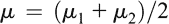，投资组合的方差 *σ* 为 。因此，在这种情况下，投资组合的风险已降低至零。这是因为两个资产的回报率满足 *R* 1 + *R* 2 = 1 的关系。

一般来说，资产是相关的，并且很少满足像上述第二个例子中那样的简单关系。如前所述，投资组合优化的问题是确定权重 ，使得 *μ* 最大化并且 *σ* 最小化。同时实现这两者是不可能的。

在描述一般情况之前，首先让我们简要考虑*n*= 2 的情况。让两个资产*A* 1 和*A* 2 的预期收益率和方差分别为和。进一步，让为两个资产之间的协方差，并定义 Pearson 相关系数*ρ*为。假设投资组合*p*为。则预期收益率。投资组合*p*的方差是*α*的函数，并且给出为。 如果和，那么，即方差不依赖于*α*。所以，假设既不满足也不满足。另外，要注意我们认为所有资产都具有正风险，即。然后使用基本微积分，可以得到一个唯一的*α*值（比如）使得取得可能的最小值。的值和相应的的值如下：

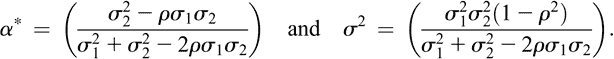

给定上述的值，投资组合*p*的预期收益率为。

当*n* ≥ 2 时，出现了更一般的情况。在这种情况下，我们考虑马科维茨开创的方法。在这种方法中，投资组合的预期回报率被固定为某个值，选择权重使方差达到最小。使用(13.1)，优化问题是得到一个投资组合，使得以下成立：

(13.2)

(13.3)

(13.4)

在(13.2)中，被定义为等于，而表达式本身等于½Var(*R*)。1/2 的缩放因子被引入以简化后续的计算。

上述是带有线性约束条件的二次优化问题的一个例子。可以使用拉格朗日乘子法来解决这个问题。让*λ*和*γ*成为两个新的变量。考虑以下表达式：

(13.5)

对*L*关于和*γ*的偏导数设为零，得到以下* n * + 2 个变量和*γ*的* n * + 2 个线性非齐次方程组。

(13.6)

解(13.6)的是在(13.2)到(13.4)中列出的二次规划问题的解。

给定 ，可行组合的集合由这样的投资组合  构成，其中满足 。如果可行组合的集合非空，则可以证明系统（13.6）有解，优化问题  也有解，该问题由 (13.2) 到 (13.4) 给出。

考虑所有的  集合，使得问题  是可行的，并令  是相应的最小方差值。这意味着如果预期收益固定为 ，那么最小风险为 。考虑平面上的所有这样的点 ，其中风险  沿 *x* 轴绘制，回报  沿 *y* 轴绘制。这条曲线称为有效边界。任何风险和回报对应于有效边界上的点的投资组合都称为有效投资组合。术语“效率”指的是对于给定的风险和预期回报值，没有其他投资组合具有更低的风险和更高的回报。

我们将（13.6）给出的方程以矩阵形式表示。令 ，，**1** = (1,…,1) ^([*T*])，令  为方差/协方差矩阵。我们假设  是可逆的。同时，我们假设并非所有的  都相等。

(13.6) 的第一个方程可以写为 ，从而得到

(13.7)

用向量符号表示，两个约束可以写成  和 。从 (13.7) 中注意到 ，我们将约束重写为：

(13.8)

让 ， 和 。注意到  和  的值被固定并假设为先验已知。因此，*a*，*b* 和 *c* 是常数。解 (13.8) 关于 *λ* 和 *γ* 给出

(13.9)

其中 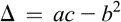。

固定一个值  为 。投资组合的方差可以用  表示如下。给定一个权重向量 ，相应投资组合的方差  可以用  表示为 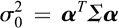。利用 ， 和 ，我们有

(13.10)

给定预期收益率向量  和方差/协方差矩阵 ，存在一个最小化所有可能投资组合方差的投资组合。要获得这个投资组合，我们对  关于  求导并将导数设为 0，即

导致  和 。从 (13.9)，相应的拉格朗日乘子 *λ* 和 *γ* 的值为  和 。用  表示相应组合的权重向量，我们有从 (13.7)

(13.11)

通过设置  的权重向量获得另一个组合，即在 (13.9) 中设置 ，或者等效地， ，从而得到 。从 (13.7)，我们有

(13.12)

***两基金定理***: 假设 *p* ^((1)) 和 *p* ^((2)) 是对应于收益率分别为  和  的两个有效组合。那么 *p* ^((1))（分别是 *p* ^((2))）是方程 (13.6) 的解，其中 （分别是 ）。使用线性很容易得出，对于任何 ， 是一种带有预期收益率为  的投资组合。同样使用线性，可以证明 *p* 是方程 (13.6) 的解，其中 。因此，*p* 的风险-收益对是有效前沿线上的一点。这表明，从两个有效组合开始，通过在 [0, 1] 上变化 *α*，可以得到有效前沿线上的一系列点。

反之，假设是某个有效投资组合的权重向量。根据(13.7)，我们有适当的拉格朗日乘子*λ*和*γ*的值，使得。利用(13.11)和(13.12)，我们有和。所以，

根据(13.9)，我们有。因此，令，我们有，我们可以写成

(13.13)

换句话说，任何有效的投资组合都可以被写成和的凸组合。现在考虑任意两个权重向量分别为和的不同有效投资组合。那么必然存在使得

所以，我们可以用*u*1、*u*2、和表示和。将这些代入(13.13)，我们得到

(13.14)

这表明，给定任意两个具有权重向量和的不同有效投资组合，可以将具有权重向量的任何有效投资组合表示为和的凸组合。早先我们已经看到，任意两个有效投资组合的凸组合也是一个有效投资组合。因此，给定任意两个有效投资组合，所有有效投资组合的集合可以表示为这两个投资组合的凸组合。这个结果被称为两基金定理。

备注：

(1)如果（13.4），即约束条件从中删除，则我们正在寻找一个最小化方差的投资组合。这个问题也可以使用拉格朗日乘数法来解决。(2)如果（13.4）改为（即将等式替换为不等式），那么就不能再应用拉格朗日乘数法了。修改后的优化问题可以使用 Karush–Kuhn–Tucker 条件来解决，并且可以证明类似的两基金定理。(3)在上述马科维茨问题的表述中，权重允许为负值（即允许卖空）。如果不允许卖空，则必须为*i* = 1,…,*n*包括非负约束条件。可以使用线性规划技术来处理相应的问题。

#### 13.1.1 包含无风险资产

该分析假设对于 *i* = 1,…,*n*，都有 ，即所有资产都有正风险。然而，在实践中，通常存在具有固定回报率的无风险资产。例如银行存款/贷款和政府债券。人们可能希望考虑由一个这样的无风险资产和其他风险资产组成的投资组合。无风险资产的方差为零，因此，如果试图简单地最小化组合的方差，那么解决方案是将整个金额投资于无风险资产。然而，相应的回报率将低于在投资组合中包含风险资产所能实现的回报率。

让 *A* 0 表示无风险资产，其回报率为 。与以往一样，让 *A* 1,…,*A* [*n*] 分别表示具有回报率 *R* 1,…,*R* [*n*] 的风险资产，其中 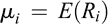, , *i* = 1,…,*n*，以及 ，1 ≤*i* < *j* ≤ *n*。由于 *A* 0 是无风险的，其回报率是恒定的；因此，其方差为零，并且与其他任何资产都不相关。无风险资产对应于标准差-平均平面上的点 。

让  表示组合投资组合，其中在资产 *A* [*i*] 上的投资比例为 ，其中 *i* = 0,…,*n*。 对于 *i* = 1,…,*n*，定义 ，因此 。 通过 ，我们将表示由 *A* 1,…,*A* [*n*] 组成的投资组合 ，其中  是对 *A* [*i*] 的比例投资。  的预期收益率为 ，而  的方差为 。 我们可以假设 *ν* > *r* [*f*]，因为如果风险投资组合的预期收益率不高于无风险资产的收益率，则投资于此类投资组合是没有意义的。 标准差-均值平面上的点  对应于 。

对于投资组合 *p* 的均值-方差分析，我们可以等效地将其视为由两个资产组成的投资组合 ，即 *A* 0 和 ，其中投资于 *A* 0 的比例为 ，而投资于  的比例为 。 此两资产投资组合的均值和方差如下：

这对应于标准差-均值平面上的点 。

假设 。那么有效前沿就是  的轨迹。通过从 *σ* 和 *μ* 的表达式中消除 ，可以证明这个轨迹是直线。

正如我们之前所论述的，，因此这条线的斜率为正。对于给定的 ，通过最小化 *τ* 来使斜率  最大化。这对应于投资组合  是一个有效的投资组合，并且点  在早期有效前沿上。因此，具有最大斜率的线  是旧的有效前沿的切线。因此，新的有效前沿是一个切线，连接点  到旧的有效前沿上的点 。

案例不成问题。在此案例中，的轨迹是具有负斜率的线 。这对应于短路  来投资 *A* 0\. 这是一件不明智的事情，因为它增加了风险并降低了回报率。

由于新的有效前沿是与旧的有效前沿相切的，因此找到对应于新的有效前沿触及旧的有效前沿的点的投资组合  是有启发性的。这对应于最大化斜率 。注意  和 *τ* 是  的函数。使这一点明确，斜率可以写成

对于 *i* = 1,…,*n*，得到  并置零导致以下数量 *v* 1,…,*v* [*n*] 的线性方程组。

(13.15)

这里有  和 。由于 ，所以 *v* 1 + ⋯ + *v* [*n*] = *c*，并且 。因此，解 (13.15) 得到 *v* 1,…,*v* [*n*] 的值。这提供了投资组合 ，使得与无风险资产的有效前沿是连接点  到点  的线对应的点 。这个结果被称为一基金定理。

#### 13.1.2 资本资产定价模型

考虑市场中所有资产的集合。假设这些资产的所有信息都是公开已知的，包括均值、方差和协方差。所有市场参与者基于公开信息进行相同的市场分析。这意味着所有参与者发现了同一有效边界，这是一条直线，对应于将无风险资产与相同有效  结合的投资组合。这  被称为市场组合。

让我们用 *M* 表示市场组合。*M* 对所有市场参与者来说是相同的事实意味着市场已经达到了均衡状态。这种均衡的结果是，*M* 中任何资产的权重都等于该资产的资本价值与总市场资本化的比值。如果市场包含 *n* 个（有风险的）资产 *A*₁,…,*A*[n]，其资本价值分别为 *V*₁,…,*V*[n]，那么 *M* 中 *A*[i] 的权重为 *w*[i] = *V*[i] / *V*，其中 *V* = *V*₁ + ⋯ + *V*[n]。换句话说，*M* = (*w*₁,…,*w*[n])。值得注意的是，市场组合 *M* 中的所有权重都是正数。这带来两个结果。首先，*M* 中不存在做空，其次，所有风险资产都包含在 *M* 中，尽管某些资产的权重可能非常小。上述分析被称为资本资产定价模型（CAPM）。

令  为 *M* 的标准差和均值。则有效前沿是连接点  和  的线。这条线称为资本市场线，由方程  给出。量  是组合超额收益率与无风险收益率  之差。斜率  表示标准差变化每单位预期收益率的增加。这个斜率称为风险价格。

考虑一个风险资产 *A* [*i*]，其均值为 ，方差为 ，使得  不在有效前沿上。令  为 *A* [*i*] 与市场组合 *M* 的协方差。*A* [*i*] 相对于无风险资产所获得的超额收益率为 。CAPM 公式陈述如下：

(13.16)

其中

(13.17)

我们展示如何推导上述公式。考虑由 *A* [*i*] 和市场组合 *M* 构成的组合 *p*，给 *A* [*i*] 分配权重 *α*，给 *M* 分配权重 ，使得 。组合 *p* 的预期收益率和方差如下所示：

(13.18)

当*α*在 [0, 1] 范围内变化时， 的轨迹在标准差-均值平面上形成一条平滑曲线 。由于*A* [*i*] 不是有效的， 保持在资本市场线（即有效边界）下方，仅在与之相交的点  处相遇，该点对应于 。这意味着资本市场线在点  处与  相切。因此，（即 ）在点  处的导数等于资本市场线的斜率。这给出了关系：

(13.19)

从 (13.18)，可以得到  和 ，这两个量的比值提供了  的表达式。使用此表达式代入 (13.19) 并进行简化，得到了 (13.16) 中给出的  的表达式。

如果，那么根据（13.17）中给出的的表达式为零，因此根据（13.16）得到，即*A*[*i*]的收益率等于无风险收益率。即使资产*A*[*i*]本身是有风险的，也是如此，即。与市场不相关的资产不会有高于无风险收益率的收益率。量表达了*A*[*i*]与市场组合*M*的相关程度，因此反映了市场风险。

假设考虑的不是单一的风险资产，而是一组风险资产，记为*A*1,...,*A**k*，其中。设表示投资组合*p*的预期收益率。那么，且

其中。

可以使用 CAPM 公式获取资产的价格。设*P*为资产的价格，并将资产在一期后的支付表示为*Q*。注意*Q*是一个随机变量，而*P*不是。设表示*Q*的期望值。收益率为，因此资产的预期收益率为。我们在 CAPM 公式（13.16）中使用*A*[*i*]来表示*A*，其中，其中。用这个公式替换*μ*，并解出*P*得到

(13.20)

市场组合是一个理论概念。如果试图将其应用于实践，将需要构建一个包含市场上存在的庞大数量资产的投资组合。这显然是不可行的。为了解决这个问题，创建了指数基金，试图近似市场组合。实质上，指数基金考虑市场上主导资产的一个小子集。一个著名的例子是标准普尔（S&P）500 股票指数，其中包含 500 只股票。在将 CAPM 公式（13.20）应用于资产*A*时，然后用 S&P 替换市场组合*M*。然而，这需要知道资产*A*和 S&P 的回报率，S&P 的方差以及*A*与 S&P 的协方差。这些数量的估算值是从历史数据中获得的。假设，对于*N*个时间点，知道了和的值，其中（响应地）是时间点*k*处资产*A*（响应地 S&P）的回报率。设，是*A*和 S&P 的回报率的估计值。类似地，设和是 S&P 的方差和*A*与 S&P 的协方差的估计值。这些估计值是从可用数据中获得的，方法如下：

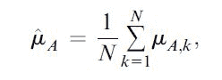

最后，资产*A*的*β*的估算得到如下：。

#### 13.1.3 进一步问题

在本节中，我们简要提及了另外两个问题，即因子模型和鲁棒组合优化。详细讨论这些问题超出了本书的范围。

**因子模型：** 应用马科维茨均值-方差分析需要获取所有资产的预期收益率和方差以及它们的两两协方差的值。这些信息需要从现有数据中估计出来。如果考虑了*n*个资产，则还必须估计*n*个均值和方差以及*n*(*n* − 1)/2 个协方差。由于协方差的数量随*n*的增加而呈二次增长，因此很难获得这些数量的可靠估计。

线性因子模型旨在降低方差/协方差矩阵的维度。其思想是考虑一组称为因子的随机变量，并将资产的收益率表示为因子的线性组合加上一个误差项。假设因子为*F* 1,…,*F* *ℓ*。进一步假设有*n*个资产*A* 1,…,*A* [*n*]。资产*A* [*i*]的收益率*R* [*i*]建模如下。

(13.21)

在这里，*a* [*i*]、*b* [*i*] 和 *j* 是常数，而  是误差，是一个均值为 0 且假定与因子不相关的随机变量。此外，对于*i* ≠ *j*，假定  和  不相关。

假设  是*n*个资产的投资组合。则投资组合*p*的收益率*R*如下所示：

(13.22)

(13.23)

, 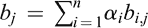 和  的地方。

执行马科维茨分析需要估计因素的均值和方差以及它们的成对协方差。假设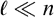，方差/协方差矩阵的维度显著减少。

**鲁棒性:** 马科维茨投资组合优化问题的输入包括均值、方差和协方差的估计值。这些估计值的准确性会影响最终的解决方案。鲁棒投资组合优化的目标是尽量确保最终解决方案的准确性不会受到估计不确定性的显著影响。

### 13.2 凯利准则

考虑一个由无风险资产*A* 0 和风险资产*A* 1 组成的投资组合。设为无风险利率，*R*为*A* 1 的收益率。假设要在这两种资产中投资总金额*V* 0。在*A* 1 中投资一部分*f*，在*A* 0 中投资部分(1 − *f*)。在*A* 0 上投资(1 − *f*)*V* 0 的回报为，在*A* 1 上投资*fV* 0 的回报为*RfV* 0。因此，一期后的总价值为*V* 1，给出为。作为*f*的函数的投资增长为。一个最优性目标将是确定*f*，使得*G*的期望值最大化。凯利方法是确定*f*，使得 ln *G*的期望值最大化。

更一般地，可以考虑在多个间隔上的投资，每个间隔中投资 *A* 1 的比例都相同。假设有 *T* 个间隔，回报率为 *R* 1,…,*R* [*T*]。对于 *t* = 1,…,*T*，设 *V* [*t*] 为 *t* 个间隔后的财富，*G* [*t*] = *V* [*t*] /*V* 0\. 则 ，平均增长率为 ，这是所有间隔增长的几何平均值。凯利方法是确定 *f*，使得

被最大化。

更一般地，最大化增长函数对数期望值的准则称为凯利准则。使得达到最大值的 *f* 被称为凯利值。

假设 *R* 是一个连续随机变量，其和。希望确定凯利值。可以使用近似方法来解决这个问题。将时间间隔划分为 *T* 个相等的独立步骤，其中第 *t* 个时间间隔上 *A* 1 的回报为 *R* [*t*]，定义为一个随机变量，满足

使得  和 。每个时间间隔内的无风险利率也被缩小到 。 *T* 个时间间隔的增长为

对于大 *T*，上述获得的  被认为是等于  的时间间隔增长的近似值。设 。因此，

下一个任务是将在 0 附近展开为泰勒级数。对于*i* ≥ 1，设为的*i*次导数。可以证明，，，和对于成立。因此，

如, ，其中

(13.24)

这对应于投资于具有由连续随机变量*R*决定回报的资产*A*1 的投资组合的增长对数的期望。使得式(13.24)最大化的*f*的值是。该值通常被称为凯利投资比例。分析不要求*f*为非负。如果，那么最优值的结果是负的。这对应于对资产*A*1 的卖空。此外，如果，那么这对应于以无风险利率借贷并投资于风险资产。此外，条件意味着全部金额都投资于风险资产。

上述分析可以扩展到包含一个无风险资产 *A* 0 和一个或多个风险资产 *A* 1,…,*A* [*n*] 的投资组合。设 *A* [*i*] 的回报率为 *R* [*i*]，均值为 ，方差为 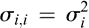。此外，设 *R* [*i*] 和 *R* *j* 的协方差为 。我们用  表示方差/协方差矩阵。

假设投资 *A* 0 的比例为 ，投资 *A* 1,…,*A* [*n*] 的比例分别为 ，其中 。设投资组合的回报率为 *R*，均值为 *μ*，方差为 。那么

(13.25)

请注意，*μ* 和  都是用  表示的，不涉及 。我们考虑了之前对一个风险资产和一个无风险资产的分析，其中 ，即全部投资用于风险资产的情况。在当前情况下，风险资产是由 *A* 0，*A* 1,…,*A* [*n*] 构建的投资组合，其回报率为 *R*，均值为 *μ*，方差为 。

使用 (13.24) 中的 ，我们得到增长函数为 。由于 *μ* 和  是  的函数，增长函数取决于 。我们写成  以明确表示这一点。因此，需要最大化以下函数。

(13.26)

其中*μ*和由(13.25)给出。这是一个标准的二次优化问题。通过解决同时线性方程组，*i* = 1,…,*n*来获得解。假设是可逆的，则解(*f*1,…,*f*[*n*])得到如下：。

### 13.3 通用投资组合

在这一节中，我们从不同的角度考虑投资组合优化问题。投资组合是在多个资产之间分配财富。交易发生在多个时间段内。对于资产*A*，假设一个时间段开始时的价格为*P*0，结束时的价格为*P*1。假设在时间段开始时投资了金额*X*在资产*A*上。这允许在时间段开始时购买*X*/*P*0 的数量的*A*，其价值在时间段结束时变为*P*1*X*/*P*0。让*R* = *P*1/*P*0，使得金额*X*在时间段内增长到*RX*。量*R*被称为该时间段内资产*A*的价格相对值。（注意，价格相对值不应与前几节中也用*R*表示的收益率相混淆。）对于考虑财富增长，实际价格并不重要。决定这种增长的是价格相对值。

假设存在*n*个资产*A*1,…,*A*[*n*]。让时间段*t*的资产价格相对值表示为。让为一个投资组合，其中比例投资于资产*A*[*i*]。假设*X*0 是交易开始时总投资金额，即*X*0 根据投资组合*p*分配给*n*个资产。一个时间段后，资产*A*1,…,*A*[*n*]的投资分别为。总财富已从*X*0 变为*X*1=*RX*0，其中。因此，各种资产的投资比例已经改变。由于该时间段的交易，投资组合*p*已更改为。此时，投资者可以选择在下一个时间段开始交易之前重新分配*RX*0 的总财富到*n*个资产中。假设投资者不执行此类重新分配。然后，下一个时间段的交易将基于根据投资组合分配的*X*1 的总投资。按照这种方式进行，可以确定在任何*T*≥1 的时间段结束时的财富（即所有资产的总投资）。

产生的问题是投资者是否应该在每个时间段结束时重新分配财富，如果是的话，应该如何进行这种重新分配？当然，目标是在一定数量的时间段*T*之后最大化总财富。这个问题的答案当然取决于价格相对值的数值。然而，这些数值在未来是可知的。因此，任何重新平衡投资组合的决定都不能基于未来价格相对值的数值。尽管如此，*T*个时间段结束时的总财富确实取决于价格相对值，或许事后可以确定在每个时间段结束后重新平衡投资组合的最佳策略是什么。虽然这种事后的信息很有用，但不能用于确定投资策略。

Cover（1991 年）提出了一种在每个时间段结束时重新平衡投资组合的方法。这种方法不对价格相对值或它们的分布做任何假设。然而，他能够证明，使用他的方法构建的投资组合与大类自然投资组合中的最佳投资组合相比表现良好。接下来，我们描述 Cover 的算法及其算法最优的意义。

常数再平衡投资组合（CRP）是一种策略，它在每个周期结束时重新分配财富，以使各种资产的投资比例保持不变。回到前面的例子，以投资组合开始的财富*X*0 导致根据投资组合分配的财富*X*1=*RX*0。遵循 CRP 策略的投资者将根据*p*重新分配总权重*X*1，即*A*1 中持有的金额从*X*1*R*1*α*1/*R*更改为，持有的金额*A*2 从*X*1*R*2*α*2/*R*更改为，依此类推。这个过程可能涉及买卖各种资产以实现投资组合*p*中的比例。

我们考虑一个小的理论例子，说明 CRP 策略何时有用。假设有两种资产*A* 1 和*A* 2。*A* 1 的价格不变，而*A* 2 的价格在连续的时间段内轮流翻倍和减半。如果总投资放在其中任何一个资产上，则财富不会改变。假设使用*p* = (1/2, 1/2)的 CRP 策略。让初始投资为*X* 0，根据*p*在两种资产之间分配为(*X* 0/2, *X* 0/2)。假设在第一个时间段中，*A* 2 的价格减半。那么在第一个时间段结束时，财富的分配是(*X* 0/2, *X* 0/4)，总财富为*X* 0/2 + *X* 0/4 = 3*X* 0/4。这个财富被重新分配为(3*X* 0/8, 3*X* 0/8)遵循*p*。在第二个时间段中，*A* 2 的价格翻倍，因此财富的分配变为(3*X* 0/8, 3*X* 0/4)，总财富为 9*X* 0/8。因此，在两个时间段内，财富*X* 0 增长了 9/8 倍到 9*X* 0/8。很容易看出，在 2*t*时间段内，财富将增长到(9/8) ^([*t*]) *X* 0。因此，CRP 策略导致了财富的指数增长。分析可以扩展到*A* 1 的财富在交替时间间隔内以*r* 1 和 1/*r* 1 的因子改变，而*A* 2 的财富在交替时间间隔内以*r* 2 和 1/*r* 2 的因子改变，其中*r* 1，*r* 2 > 1。

上述示例强调了一些 CRP 可能会导致财富显著增加。Cover 认为所有 CRP 的集合。最佳 CRP 是在所有 CRP 中提供最大财富增长的 CRP。最佳 CRP 取决于事先不知道的价格相对值。Cover 显示他的投资组合选择算法确保财富增长不会比最佳 CRP 少太多。

让

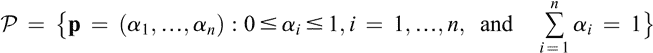

对于*n*个资产*A*1,...,*A*[*n*]的所有可能投资组合，设为集合 A。注意，在这个表述中，我们不考虑负权重。我们考虑*T*个时间段。第*t*个时间段中*A*[*i*]的价格相对于参考价格将被表示为*r*[*t*],*i*，其中*t*=1,...,*T*，*i*=1,...,*n*。在第*t*个时间段中所有资产的价格相对于参考价格将被表示为**r**[*t*]=(*r*[*t*],1,...,*r*[*t*],*n*)。价格相对序列**r**1,...,**r**[*t*]将被表示为**r**^((*t*))。

给定一个投资组合**p**，通过 CRP **p**我们将指代使用投资组合**p**执行的 CRP 策略，即每个时间段后，财富根据投资组合**p**重新分配给各资产。固定一个投资组合。给定初始财富为*X*0，在第一个时间段后，财富变为，其中(**p**·**r**1)表示**p**和**r**1 的点积，等于。通过类似推理，第二个时间段结束时的财富为*X*2=*X*1(**p**·**r**2)=*X*0(**p**·**r**1)(**p**·**r**2)。扩展开来，我们有第*t*个时间段结束时的财富为*X*[*t*]=*X*0(**p**·**r**1)⋯(**p**·**r**[*t*])。财富的增长率为*X*[*t*]/*X*0，我们定义

设*D*是所有投资组合集合上的概率分布。假设根据*D*选择了投资组合**p**。在(*t* − 1)个时间段结束时，由**r** ^((*t*−1))给出的价格相对数列是已知的。考虑随机变量*G* [*t*]−1(**p**, **r** ^((*t*−1)))，它确定了使用 CRP **p** 在(*t* − 1)个时间段内的财富增长。请注意，在(*t* − 1)个时间段结束时，**r** ^((*t*−1))中没有随机性，*G* [*t*]−1(**p**, **r** ^((*t*−1)))中的唯一随机性来自于**p**的选择。(*t* − 1)个时间段内的财富增长的期望值为，其中该期望值定义如下积分：

(13.27)

接下来考虑随机向量

该向量的期望值为，并定义为以下积分：

(13.28)

Cover 的算法构建了一系列投资组合**u** 1,…,**u** [*T*]，其中**u** [*t*]是在时间段*t*中要使用的投资组合。初始投资组合**u** 1 被选为在所有*n*资产上的均匀分布，即**u** 1 = (1/*n*,…,1/*n*)。对于，**u** [*t*] 定义如下：

(13.29)

用这种方法得到的序列 u1,…,**u** [*T*] 被称为一种**通用组合序列**，而获得该序列的方法被称为**通用投资组合选择算法**。由于投资组合在每个时间段之后都会改变，通用组合序列不是 CRP。

给定初始投资*X* 0，使用 CRP **p**，经过*T*时间周期，CRP **p**的财富为*X* 0 *G* [*T*] (**p**, **r** ^((*T*)))。给定一系列通用投资组合**u** 1,…,**u** [*T*]，*T*时间周期后的财富被简洁地表示为‘通用财富’，如下所示：。

让*U*是在上的均匀分布。Cover 表明

(13.30)

让‘最佳 CRP 的财富’表示*T*时间周期内任何 CRP 实现的最大财富。Cover 和 Ordentlich（1996）证明的最优性结果将‘通用财富’与‘最佳 CRP 的财富’进行比较，如下所示：

(13.31)

比率的下界是*T*时间周期。每期平均比率为，随着*T*趋于无穷大而增加到 1。因此，渐近地，(13.31)显示，通用投资组合选择算法可以实现的财富与最佳 CRP 可以实现的财富一样好。这个结果的显著特点是，通用投资组合选择算法在没有未来价格相对性知识的情况下实现了这个最优性条件。从这个意义上说，该算法被称为通用。

给出的通用投资组合选择算法的实际实现需要确定期望值，因此给出了由(13.27)和(13.28)给出的积分。一个方法是使用离散化近似积分。我们讨论这个问题，因为它也为通用投资组合选择算法的定义提供了一些见解。

假设我们希望确定**u**[*t*]，即在时间段*t*中使用的通用组合。此时，价格相对数列**r**^((*t*−1))已经可用。确定**u**[*t*]所需的积分是通过对一些适当选择的组合求和来近似的。假设从符合分布*D*的**P**中独立采样了*N*个组合**p**1,...,**p**[*n*]。使用的财富增长是*G*[*t*]−1(**p**[*k*], **r**^((*t*−1)))。因此，可以得到式(13.27)的近似如下：

让，即该组合将权重分配给资产*A*[*i*]。可以得到式(13.28)的近似如下：

将**u**[*t*] = (*u*[*t*],1,...,*u*[*t*],*n*)，从(13.29)得到

(13.32)

(13.33)

其中。换句话说，**u** [*t*]的第*i*个分量是从采样组合**p**1,...,**p**[*n*]的第*i*个分量（即）的加权和中获得的。分配给组合**p***k*的权重*w*[*t*]−1,*k*是使用归一化后的这个组合可以获得的财富，除以所有*N*个组合共同获得的总财富。

对于固定的*t*，计算权重*w* [*t*]−1,*k*对*k* = 1,…,*N*需要*O*(*Ntn*)的时间和*O*(*Nt*)的空间。样本数*N*必须足够大，以便该过程产生可接受精度的结果。这一要求推高了算法的时间和空间需求。一个相关问题是从分布*D*中采样。在*D*是均匀分布的情况下，有算法可以执行这种采样。更一般的狄利克雷分布被提议用于*D*。这使得采样问题更加复杂，尽管已经提出了一些算法来解决这个任务。

**注**

马科维茨的投资组合优化方法是数学金融中的基石。我们对这个主题的涵盖是基础性的。有很多书籍和在线课程提供了更深入的讨论。我们受益于 Sigman（2005）的一些笔记。Cover 的算法是在 Cover（1991）中提出的。后来有一些工作建立在 Cover 的原始想法上。Kelly（1956）最初是在信息理论的背景下提出了他的想法。我们对 Kelly 准则的描述基于 Thorp（2006）和 Hung（2010）。

## 第十四章

风险度量

投资的目标是获取回报。像政府债券和银行存款这样的投资能够获得固定利率的回报。这些投资被认为是没有任何风险的。而投资于股票和期权等其他金融工具可能提供更高的回报率。这种可能性被可能在投资中亏损资金的可能性所抵消。因此产生了投资的风险。关于对风险进行建模和将其作为决定投资的工具进行使用的工作已经有很多。在本章中，我们简要讨论了文献中考虑的一些重要风险度量。

实际上，在前一章中我们已经考虑了风险的方面。考虑到回报是一个随机变量（至少有两个时刻），标准差捕捉了回报的变异性。这是一种风险度量。我们遇到的另一种风险度量是 CAPM 中的*β*，它是一种不可分散风险的度量。在本章中，我们将研究另外两种风险度量，即风险价值（VaR）和条件风险价值（CVaR）。此外，我们还将考虑夏普比率，这本质上是一种风险收益比。最后，我们简要介绍 Copulas 理论及其在风险评估中的应用。

### 14.1 VaR 和 CVaR

衡量投资风险的一种方法是了解投资可能造成的损失。让 *X* 表示投资可能带来的损失。一般来说，*X* 将是一个随机变量。因此，人们可以有意义地询问损失 *X* 超过特定值的机会。人们可以反过来提出问题，使其对投资者更有意义。投资者确定一个概率 *α*，并想知道使损失小于或等于 *x* 的概率至少为 *α* 的最小数 *x*。换句话说，投资者希望了解损失 *X* 的下 *α* 分位数。数字 *x* 取决于 *α*。随着 *α* 的增加，*x* 的值也会增加。在水平 *α* 处的风险价值  是数字 *x*。更正式地说，

(14.1)

让 *F* *X* (*x*) 是随机变量 *X* 的（累积）分布函数。然后可以得出 。

我们考虑*X*为投资损失。然而，(14.1)中的定义适用于任何随机变量*X*，无论其被解释为投资损失与否。这使得 VaR 成为各种工程领域中广泛使用的概念。

回到*X*被解释为投资损失的观点，我们考虑一些例子来说明在(14.1)中的定义。假设和。这告诉投资者，至少有 95%的机会损失将不超过*x*0，或者说，损失超过*x*0 的可能性不超过 5%。接下来，假设投资者希望获得关于的类似陈述。让 VaR0.95(*X*)=*x*1。因此，至少有 99%的机会损失不会超过*x*1，或者说，损失为*x*1 或更多的可能性不超过 1%。注意*x*1 通常会大于*x*0。因此，通过设置更高的损失阈值，投资者能够降低损失的概率。

随机变量*X*可以模拟各种类型的损失。如果投资者对单日可能的损失感兴趣，则*X*将表示当日的损失函数。更一般地，*X*可以表示在固定天数内发生的损失。在任何这种情况下，将捕捉使用*X*模拟的损失模型在水平*α*处的阈值。

假设*X*服从均值  和方差  的正态分布。那么  服从以  表示的标准正态分布。假设 。那么 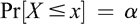。所以，，即  ，因此 。对于固定的*μ*和水平*α*，这表明  随着*σ*的增加而增加。这与先前使用的标准差是风险的度量的直觉相对应。

VaR（价值风险，Value at Risk）为投资者提供了阈值信息。对于水平*α*，它指定了阈值*x*，使得损失至少有*α*的概率保持在*x*以下。这个阈值  本质上定义了损失分布的尾部 。这个阈值并不说明尾部本身会发生什么。投资者可能对这些信息感兴趣。推理可能如下：好吧，如果*α*很小，损失超过  的机会很小，但是，尽管如此，这样的事件可能发生；在事件发生的情况下，是否可能量化会发生的损失的*数量*呢？

这改变了问题的性质，有两个根本性的方面。首先，投资者不再忽视阈值之外的分布尾部，而是对尾部发生的情况感兴趣。其次，投资者不再只关注阈值，而是要求损失的估计。条件风险价值，  在水平*α*下，是解决这两个问题的一种方式。

在正式定义之前，让我们尝试以一种直观的方式理解问题。一旦固定了*α*，值就确定了。设*S*为*X*可能取的大于*x*的值的集合。*S*中的值是大于*x*的损失的可能值。对这些损失取平均值就是如果损失超过阈值*x*的情况下的损失的估计值。为了计算平均值，*X*的原始分布必须被归一化，这是*X*属于*S*的概率。因此，粗略地说，可以把大于*x*的损失的平均值视为条件风险值。尽管这种直觉有所帮助，但它忽略了一些微妙之处。在提供的正式定义后，我们会解释其中一些微妙之处。

设*X*是一个具有分布函数的随机变量。固定一个水平*α*，让。我们定义分布函数如下：

的整个概率质量都落在集合*S* = {*z* : *z* ≥ *x* 0}中，而在这个集合中，基本上是的一个平移和归一化版本。设*Z*是一个按照分布的随机变量。那么被定义为*Z*的期望，即

(14.2)

这似乎证实了确实是大于*x* 0 的损失的平均值，但是，一般来说，这是不正确的。如果*X*遵循离散分布（或连续和离散分布的混合，具有概率原子），则有时需要略微修改基本直觉的情况。

对于固定水平，满足，的确可能会发现*F* *X* (*x* 0) = 1，正如我们稍后将看到的那样。如果*F* *X* (*x* 0) = 1，则*x* 0 是可能发生的最大损失，在这种情况下，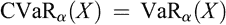。现在，假设*F* *X* (*x* 0) < 1。因此，存在大于*x* 0 的值*X*可以取。在这种情况下，将“上限条件预期损失率”定义为*X*在*X* > *x* 0 的条件下的条件期望，即

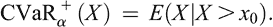

设。然后，可以证明

(14.3)

的等价定义由(14.3)给出，这使得在某些情况下计算其值变得容易。我们考虑一些例子。

设*X*是一个离散随机变量，取五个可能的值，每个值的概率为。这样的损失分布可以来自场景分析。我们考虑三个*α*的值，并在每种情况下计算和。这些计算显示了与计算相关的微妙之处，并突显了为什么一般情况下这不能被认为是大于的值的平均值。

情况 ：使得  为  的最小值 *x* 0。因此，。我们有 ，因此  可以定义。*X* 分配给  和  的总概率为 。在  的条件下，*X* 取值为  和  的概率都相等，均为 。因此，。由于 ，所以  的值，因此从(14.3)，。在这种情况下，我们确实有  是大于  的损失的平均值。

情况 ：使得  为 *x* 0 = *ℓ* 3 的最小值 *x* 0。因此，我们再次有 ， 和 。然而， 的值发生了变化。我们有 ，因此从(14.3)，。请注意，在这种情况下， 的值并不等于大于  的损失的平均值。原因是 *α* 的值将概率原子分割为 。

情况：最小值*x* 0，使得为。所以，和。在这种情况下，。

对 VaR 和 CVaR 有效性的比较分析相当长。我们提供一个简要讨论。显然，VaR 是理解风险管理问题的一个相当简单的方法。它提供了一些关于风险的基本信息，如果投资者对风险不是过分关注，这些信息可能足够。另一方面，如果投资者希望获得更保守的风险观念，那么 CVaR 就比 VaR 更可取。CVaR 的一个问题是，它需要关于损失分布尾部的详细信息。一般来说，这样的信息可能不可用。如果从历史数据中估计尾部信息，则有可能估计 CVaR 时的估计误差会影响。总之，VaR 和 CVaR 都有各自的用途和适用领域，在金融界广泛使用这两个指标。

### 14.2 夏普比率

夏普（Sharpe）（1966）引入了一个奖励与变异性测量，后来被称为夏普比率。这个比率已经被广泛用于做投资决策。在本节中，我们简要描述了夏普比率的一些方面。

设 *F* 为基金或投资组合，*R* *F* 表示基金 *F* 的收益率。这个收益率需要与基准投资组合 *B* 的收益率 *R* *B* 进行比较。 *R* *F* 和 *R* *B* 都是随机变量。差异收益率 *D* 是基金 *F* 和基准 *B* 的收益率之间的差异，定义为 *D* = *R* *F* − *R* *B*。设  和  表示 *D* 的均值和标准差。基金 *F* 相对于基准 *B* 的夏普比率 *S* 定义为

(14.4)

在理论分析中，可以使用(14.4)来分析投资策略。 *S* 的估计值  可以通过历史数据获得。为此，首先要得到  的估计值，以及  和  的估计值，然后设置 。

在（14.4）中定义的夏普比率是指单个期间。这可以扩展到多个期间。假设多个期间的回报率是通过将单个期间的回报率相加获得的。还假设这些单独期间的回报率是不相关的。让*D* 1 和*S* 1 分别表示单期差异回报率和夏普比率。同样，让*D* [*T*]和*S* [*T*]分别表示*T*个时间段的差异回报率和夏普比率。那么*D* [*T*] = *TD* 1 意味着  和 （因为单个期间的回报率不相关）。从中我们得到 。因此，多个期间的夏普比率是时间的函数。一般来说，关于单个期间回报率不相关的假设将不成立，并且在这种情况下计算夏普比率将会更加复杂。

**备注：**

(1) 在夏普比率的原始定义中，基准投资组合*B*被认为是无风险投资。在这种情况下，回报率*R* *B*是无风险回报率，因此是一个固定值，没有任何随机性。(2) 一些作者更一般地定义夏普比率为随机变量的均值与方差的比率。在投资领域，这可能会引起困惑，因为然后可以将一项投资的夏普比率定义为其回报率的均值与标准差的比率。这失去了上下文，因为夏普比率的目标是衡量与基准相比投资的差异回报率的回报与可变性之比。

零投资策略是指不需要投入任何资金作为投资，但在未来某个时候会产生回报。这种回报取决于市场，可能为正、零或负。给定一个基金*F*和一个基准投资组合*B*，零投资策略将是在*B*上建立空头仓位并在*F*上建立多头仓位。换句话说，从*B*借来的资金将被投资于*F*，即利用*B*来提升*F*。这种零投资策略的回报显然是*D* = *R* *F* − *R* [*B*]，这是夏普比率定义中使用的差异回报。正是这种联系使得夏普比率成为分析零投资策略的有用工具。

考虑以下投资场景。一位投资者在资产（或投资组合）*A*上投资了一笔金额*X*，其回报率为*R* *A*。此外，投资者正在考虑进行零投资策略的可能性，即投资者希望在某个基准投资组合（或无风险资产）*B*上建立空头仓位，并使用资金在基金*F*上建立多头仓位。假设这种零投资策略的回报率为*D*。为了实际执行这种策略，投资者将从*B*中提取一笔金额*V*并投资于*F*。这种零投资策略的夏普比率为。

金额*V*是投资者的名义价值。投资者的相对位置是名义值*V*与已投资于*A*的金额*X*之比。设表示这个相对位置。在一定程度上，相对位置反映了投资者的风险。风险位置的更好的度量是，它是相对位置与差额回报的变异性的乘积。实际上，投资者更倾向于确定*P*的值，然后确定*p*（假设的估计可用）。*P*的这个值以及金额*X*将确定要从*B*中融资并用于*F*中的零投资策略的名义值*V*。  

考虑在*A*中进行的原始投资*X*和零投资策略，期间结束时的总金额为*X*(1 + *R* *A* ) + *VD* = *X*(1 + *R* *A* ) + *XpD*，因此总回报率*R*为*R* = *R* *A* + *pD*。设*ρ*表示在*A*投资和零投资策略上的回报率之间的协方差。*R*的期望值及其方差可以写成如下形式：

(14.5)

(14.6)

假设存在几种可能的零投资策略，其夏普比率不同。投资者应该选择哪种策略？从(14.5)，我们看到，对于固定的值，选择夏普比率最高的零投资策略可以使整体回报率的期望最大化。当然，还存在捕捉风险的问题。可能会出现几种情况：

(1)假设资产*A*是无风险的，即金额*X*被投资于无风险资产。那么，因此总体风险是。在这种情况下，投资者选择具有最高夏普比率的零投资策略是合理的。(2)假设资产*A*是有风险的，即。进一步假设投资者正在考虑的零相关策略与*A*具有相同（或相似）的相关性。换句话说，*A*与考虑中的各种零投资策略的相关系数*ρ*的值相同。因此，所有零投资策略的总体风险保持不变。在这种情况下，投资者选择具有最大夏普比率的零投资策略也是合理的。(3)在更一般的情况下（不属于上述两种情况的任何一种），各种零相关策略与*A*的相关性可能存在显著差异。在这种情况下，选择具有最大夏普比率的零相关策略不一定是最佳的投资策略，因为风险也可能定量更高。选择一个夏普比率较低并且与*A*相关性较低（从而风险较低）的零投资策略可能更好。

上述考虑的情景是在现有投资资产（或组合）*A*上投资于单个零投资策略。这种情况可以扩展到投资者希望在投资于资产*A*的同时，投资于多个零投资策略的情况，其中*A*的回报率为*R*。假设有*s*个零投资策略，第*i*个零投资策略的名义价值和差分回报率分别为*V*[*i*]和*D*[*i*]，*i*=1,…,*s*。我们假设*R*，*D*1,…,*D**s*两两不相关。

让表示相对位置，表示风险位置，表示第*i*个零投资策略的夏普比率。那么总体回报为，因此和。

假设投资者希望最大化风险调整后的预期收益。让 *τ* 表示风险容忍水平，考虑确定 *k* 1,…,*k* *s* 的问题，使得  最大化。使用  和  的表达式，这相当于最大化 。由于  和  是常数值，问题简化为确定 ，使得  最大化。将此数量对  的偏导数设为零并解出可得  的最优值为 。这表明，对于固定的 *τ* 值，零投资策略的风险水平应与它们的夏普比例成比例。

### 14.3 Copula

*Copula* 的概念是数学统计中的基本工具。它已被用于建模某些类型的金融风险。在本节中，我们对 *copula* 进行简要描述，并提及一些在金融领域的应用。

形式上，*copula* 是随机变量 *U* 1,…,*U* [*n*] 的联合分布，使得 *U* [*i*] 的边际分布，*i* = 1,…,*n*，在 (0, 1) 上均匀分布。术语 *copula* 也用于表示 *U* 1,…,*U* [*n*] 的联合累积分布函数。

请注意，由于 *U* [*i*] 在 (0, 1) 上均匀分布，所以 Pr[*U* [*i*] ≤ *u* [*i*]] = *u* [*i*]，如果 *U* 1,…,*U* [*n*] 是独立的，则 。另外，如果 *U* 1 = ⋯ = *U* [*n*]，那么 。

Copula 是拉丁词，意思是连接或联系。 上述概念被命名为 copula 的原因来自 Sklar 定理，该定理陈述如下。 让*X*1,…,*X*[*n*]是具有联合累积分布*F*(*x*1,…,*x*[*n*])=Pr[*X*1≤*x*1,…,*X*[*n*]≤*x*[*n*]]和边缘*F**i*=Pr[*X*[*i*]≤*x*]; 那么存在一个 copula*C*，使得

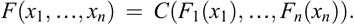(14.7)

此外，如果每个是连续的，则*C*是唯一的。

因此，copula 允许将边缘分布链接到联合分布。 在所有都连续的情况下的证明是简单而具有说明性的。 由于是连续的，因此存在一个逆函数，使得对于所有。 定义*U*[*i*]=*F**i*。 然后*U*[*i*]在(0, 1)上取值且

换句话说，*U*[*i*]在(0, 1)上是均匀的。 因此，我们有一组随机变量*U*1,…,*U*[*n*]，使得*U*[*i*]的边际分布都是(0, 1)上的均匀分布。 因此，*U*1,…,*U*[*n*]的联合分布因此是一个 copula。 让*C*表示*U*1,…,*U*[*n*]的联合分布。 然后

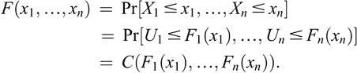

从(14.7)的推论是，对随机变量*X*1,…,*X*[*n*]进行翻译或缩放不会改变核密度估计。 让，*i*=1,…,*n*。 那么将边缘连接到*Y*1,…,*Y*[*n*]的联合分布的核密度估计与将边缘连接到*X*1,…,*X*[*n*]的联合分布的核密度估计相同。 为了看到这一点，让*G*(*y*1,…,*y*[*n*])是*Y*1,…,*Y*[*n*]的联合分布，*G**i*是*Y*[*i*]的边缘分布。 那么

让 *f* 是 *X* 1,…,*X* [*n*] 的联合密度函数，*f* [*i*]，*i* = 1,…,*n*，是边际分布的密度函数。根据(14.7)，胡椒 *C* 的联合密度函数 *c* 如下：

换句话说，胡椒的联合密度函数是原始联合密度函数与边际密度函数的乘积的比值。

假设边际函数的反函数存在。那么，根据(14.7)，我们有

(14.8)

因此，(14.8)表明，对于任何边际具有反函数的联合分布 *F*，都可以提取出一个胡椒。这提供了一种从著名的联合分布获取胡椒的方法。以下是获得的两个重要胡椒：

*高斯胡椒:* 这样的胡椒通过在(14.8)中使用多变量正态来获得 *F*。

*t-胡椒:* 这样的胡椒通过在(14.8)中使用多元 *t*-分布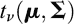来获得 *F*。

由于平移和缩放不会改变胡椒，所以在上述两种情况中，我们可以设置  和 ，其中  是一个相关矩阵。

现在让我们简要地考虑胡椒对金融的应用。

#### 14.3.1 投资组合风险

假设有一个由*n*个债券组成的投资组合。债券会收到评级，而债券的价值取决于其评级。债券可能收到的评级是一个有限非空集合。考虑第*i*个债券。在任何时间*t*，其评级由一个函数确定。因此，第*i*个债券的价值是一个函数。因此，时间*t*时投资组合的价值为。

投资组合的价值随个别债券评级的变化而变化。要确定投资组合价值的变化，需要建模债券评级的变化方式。假设个别债券评级的变化是独立的是不恰当的。因此，我们需要考虑个别债券评级从时间*t*到时间的变化的联合分布。Copula 用于建模这种联合分布。

假设和是两种可能的评级。考虑边际转移概率

(14.9)

先前可用的关于第*i*个债券的数据可用于估计这一转移概率。作为应用 copula 的第一步，我们引入一个随机变量*U*[*i*]，对应于第*i*个债券，它在(0, 1)上均匀分布。随着在可能评级的集合上变化，(14.9)中对应的概率之和为一。因此，我们可以将区间(0, 1)分成子区间，其中子区间的长度是由(14.9)给出的概率。对于每个这样的子区间，我们将相应的值与相关联。因此，函数可以被认为是随机变量*U*[*i*]的函数。因此，对联合转移概率建模的问题归结为对*U* 1,…,*U*[*n*]的联合分布建模的问题，其中每个*U*[*i*]在(0, 1)上均匀分布。需要一个 copula 来模拟联合分布。

让。那么*Z*[*i*]遵循。那么问题归结为当边际分布为时*Z* 1,…,*Z*[*n*]的联合分布应该是什么。自然的选择是多元正态分布*N*(0, ***R*** )。等价地，可以考虑由定义的高斯 copula。相关矩阵***R*** 的特定选择很重要，并且取决于许多因素。这些考虑相当详细，我们跳过***R***的选择问题。

#### 14.3.2 尾依赖性和尾相关性

风险管理中的一个基本问题是损失分布的尾部。有可能投资组合中的大额损失是由几个成分同时大幅波动引起的。因此，有兴趣能够模拟两个或更多变量同时极端事件的概率。

为简单起见，我们考虑两个随机变量 *X* 1 和 *X* 2，其联合概率分布由 copula *C* 与其边缘相关。假设边缘具有反函数。*X* 1 和 *X* 2 的下尾依赖定义为

能够计算下尾依赖是很有意义的。这可以用 copula *C* 如下表达：

所以，。这个计算还表明尾部依赖是对称的，即 *X* 1, *X* 2 的尾部依赖与 *X* 2, *X* 1 相同。能够用 copula 表达尾部依赖，并允许其计算。高斯 copula 具有其尾部依赖为 0 的属性，无论相关矩阵如何。另一方面，*t*-copula 即使 *X* 1 和 *X* 2 不相关，也具有正的尾部依赖。

让 *I* [*i*] 成为事件  的指示变量，其中 *i* = 1, 2。例如，*I* [*i*] 可以是投资组合中第 *i* 个债券违约的指示器。那么 *E*[*I* [*i*] ] = *u*，而 *I* [*i*] 的标准差是 。*I* 1 *I* 2 的期望值计算如下 。因此，*I* 1 和 *I* 2 的相关性计算如下：

(14.10)

*X* 1 和 *X* 2 的下尾相关性定义为

从（14.10）中可以看出，它等于 。因此，下尾相关性与下尾相关性相同。

**备注：** 与下尾相关性类似，可以定义上尾相关性，然后可以用生存联合分布表示，这是与联合分布概念类似的概念。上尾相关性的性质与下尾相关性类似。上尾相关性也是如此。我们省略了这些细节。

**注释**

我们对 VaR 和 CVaR 的描述基于 Sarykalin、Serraino 和 Uryasev（2008）。对 Sharpe 比率的阐述来自 Sharpe（1994）。有相当多的文献涉及联合分布理论，无论是在统计学上还是在其应用于金融领域。我们对联合分布的描述基于北卡罗来纳州立大学课程《统计与金融风险》中的材料，该课程可在[`www.stat.ncsu.edu/people/bloomfield/courses/st810j/`](https://www.stat.ncsu.edu/people/bloomfield/courses/st810j/) 上找到（于 2019 年 11 月 27 日访问）。

## 第十五章

高频交易

高频交易（HFT）是一种算法交易形式。虽然对于 HFT 没有明确的定义，但有一些 HFT 活动的特征。首先，所有交易都由计算机完成。交易员设计并实现了一个在非常快的计算机上运行的 HFT 算法。计算机从可用来源接收与交易相关的信息。这些来源包括来自一个或多个股票市场的可用公共信息（如股票报价和其他订单簿信息），以及可用的新闻提要。根据这些信息，HFT 算法决定进行交易。这个决定包括要交易的资产、交易的价格和交易的数量。一旦做出这样的决定，相关订单将被发送到适当的股票市场。除了算法的初始设计和其顶层参数的后续调整之外，在整个交易活动中没有人为因素参与其中。

对于任何交易员来说，订单-交易比是交易员在市场上下的订单数除以实际成交的订单数（即执行）。并非所有订单都会成交。订单未成交的一种方式是在成交之前到期。或者，交易员可能会在订单成交之前发送修改或取消订单的请求。高订单-交易比通常表明交易员已经下了许多订单，但在它们执行之前对其进行了修改或取消。通常，HFT 会导致较高的订单-交易比。另一个交易参数是周转率。这指的是在一个时间单位内交易的股票的总价值。HFT 通常具有较高的周转率。

交易速度在 HFT 策略中至关重要。这个速度由信息到达交易员计算机的时间、做出交易决策的时间和在股票交易所下订单的时间决定。做出交易决策的时间取决于制定决策的算法的复杂性以及执行该算法的计算机的速度。通信时间（即信息到达交易计算机的时间和订单到达股票交易所的时间）取决于网络延迟。可以通过减少股票交易所和交易计算机之间的距离以及使用非常快速的网络来缩短这段时间。同址交易是交易所提供的一个付费设施，用于将交易计算机放置在容纳交易所计算机服务器的相同数据中心中。这确保了信息来源与交易计算机之间的地理距离被缩短到最小。此外，交易公司使用超低延迟直接市场接入（ULLDMA）来确保网络延迟最小化。

在许多情况下，高频交易（HFT）策略实质上是利用市场的不有效率来进行套利。由于市场的不有效率持续时间非常短，因此检测和利用这些机会的速度至关重要。这就解释了上面提到的需要高速交易的动机。

HFT 公司通常不持有长期头寸，不利用大量资本，也不长时间持有投资组合。相反，这种交易以高交易量和高速度进出短期头寸。每笔交易的利润通常非常微小。高频交易通常会通过高交易量来弥补小幅利润。

如上所述，高频交易公司采用专有的交易算法。因此，这些算法的确切细节不可得知。然而，对于高频交易，存在一些广泛的方法。在以下部分，我们简要描述其中一些方法。

### 15.1 做市

传统上，做市商是一家在订单簿的两侧下单的公司。换句话说，做市商同时下买单和卖单。其目标是从买卖价差中获利。交易所已指定一些公司，为在各种股票中定期扮演做市商角色而获得折扣。这些做市商提供流动性，并承诺不退出市场。

高频交易公司也可以采用做市策略。他们同时发布买入和卖出报价，以从买卖价差中获利。这些报价可以是接近最佳买卖价差的薄报价，更容易被成交，也可以是远离最佳买卖价差的厚报价，成交频率较低。这是高频交易算法需要考虑的几个交易决策之一。建立盈利的做市策略需要精确建模目标市场微观结构，并使用随机控制技术。

尽管高频交易公司可能扮演做市商的角色，但这些公司通常并没有长期承诺这样做。他们可能会随意退出市场。

### 15.2 利用限价订单簿

交易所的限价订单簿包含公开信息。订单簿提供了交易所上所有股票的限价订单列表（买入和卖出）。利用这些信息的一个简单策略是基于基本的需求-供给 intution。如果某资产的订单更多，那么对该资产的需求增加，资产的价格也有望上涨。因此，在价格上涨时购买该资产，然后在价格上涨到足够高时将其出售，就可以获利。

如果一个单一资产受到关注，那么可能有可能人为评估上述情况并实施上述策略。另一方面，交易所的限价订单簿将保存大量信息。在这些信息中搜索，以找到可以应用上述简单策略的多个资产，对于人类来说是非常困难的。可以设计计算机算法来处理信息，以发现这样的情景并以高速利用它们。因此，高频交易公司的介入就出现了。

从限价订单簿中获取资产需求上升的基本信息是可以得到的。高频交易策略可能更普遍地试图从限价订单簿中获得有关市场微观结构的更多见解。

### 15.3 均值回归与配对交易

均值回归是一个通用原理，即资产具有一个稳定的（或平均的）价格，在可能由外部冲击引起的波动期后，它将返回到这个价格。更正式地说，可以使用 Ornstein-Uhlenbeck 过程对资产价格进行建模，并显示其具有均值回归属性。均值回归属性的一个应用是使用称为配对交易的交易策略。

假设两种资产类型相似，并且历史数据显示这两种资产的价格存在相关性。由于某种原因，这种相关性可能暂时减弱。因此，两种资产的价格可能比历史数据预测的要更大幅度地分歧。假设资产*A*的价格上涨，而资产*B*的价格下跌。这暗示了以下交易策略。卖空资产*A*并做多资产*B*。这意味着借入资产*A*并将其出售，同时购买资产*B*。均值回归假设意味着在一段时间后，资产*A*和资产*B*的价格将会收敛，即资产*A*的价格将下降，而资产*B*的价格将上涨。在这一点上，资产*A*可以购买并替换为卖空借出的实体。此外，资产*B*可以出售以获利。

上述策略称为配对交易。这是一种市场中性策略，允许交易者从几乎任何市场变动中获利。成功进行配对交易的关键在于早期发现价格分歧和买卖决策的及时性。历史相关资产价格的分歧是市场的非效率性。这种机会并不经常出现。即使出现这样的机会，也只会持续很短的时间窗口。因此，检测的精确性和执行的速度至关重要。

### 15.4 套利

广义上讲，套利指的是通过交易实践可以获利而几乎没有（或很少）风险的情况。从事套利交易的交易者称为套利商。套利机会主要由市场的非效率性产生，并且持续时间非常短暂。套利商必须能够发现这样的机会并且以最快的速度行动。因此，利用套利机会需要高频交易。

注意到套利的概念是相当古老的。一个简单的例子如下。假设同一资产在两个不同的市场上交易。在正常情况下，资产在两个市场上的价格应该是相同的。如果价格有所变化，那么一个敏锐的交易者就可以在价格较低的市场购买该资产，然后在价格较高的市场出售。这使得交易者可以在几乎没有风险的情况下从价格差异中获利。唯一的风险是如果在交易者能够出售之前，资产在第二个市场的价格下跌。即使在这种情况下，风险也很低，因为价格不太可能低于交易者购买资产的价格。两个市场中相同产品的价格差异是市场效率低下的一个例子。套利者将介入利用这种差异。结果，资产价格将受到相反方向的推动，并很快导致两个市场的价格变得相同。上述分析有点简化，并忽略了交易成本以及将资产移动到市场甚至边界的可能成本。一个谨慎的套利者将不得不考虑这些因素（以高速）来决定是否利用价格差异。尽管如此，这个例子突显了套利的基本思想。

在上面的例子中，我们考虑了一种套利机会，即同一资产在所有市场上的价格并不相同。前面部分提到的成对交易的概念也是一种套利。更一般地，人们可以期望两种不同但相似的资产，由类似的现金流支持，以类似的价格交易。任何偏差都可能产生套利机会。

考虑以下天真的情景。假设未来时间*T*的资产价格为*P*，而在时间*t* < *T*时的折现价格为*P*/*D*，其中*D*是由无风险利率引起的折现因子。让资产的当前价格为*S*。假设投资者借入金额*S*在时间*t*购买资产。到时间*T*，投资者将不得不向贷方偿还金额*SD*。由于时间*T*时的资产价格将为*P*，他可以出售资产并偿还贷方。投资者在时间*T*的利润（或损失）为*P* − *SD*（忽略交易成本）。如果*P* > *SD*，那么投资者就会获利，如果*P* = *SD*，那么他就不赚不亏，如果*P* < *SD*，那么投资者就会亏损。在时间*t*，投资者不知道*P*的价值，这被建模为一个随机量。他希望*P*最终大于*SD*，这就是他进行投资的原因。他的风险在于，实际上*P*小于*SD*。

在上述情景中，假设投资者有某种方式*知道*未来价格*P*并且*进一步* *P* > *SD*成立。那么上述情景允许投资者在时间*T*进行无风险获利而无需投资。请注意，投资者实际上并不需要知道实际未来价格；知道这个未来价格将大于*SD*就足够了。这种考虑引发了套利的一般思想。在实践中，几乎不可能以合理的确信度预测单个资产的未来价格（除了内幕交易这种非法行为）。

让我们考虑两个投资组合而不是一个单一的资产。让*V*1(*t*)和*V*2(*t*)分别表示时间点*t*时两个投资组合的价值。考虑两个时间点*T*和*t*，其中*T* > *t*，使得*V*1(*T*) = *V*2(*T*)。假设在时间点*t*，*V*1(*t*) < *V*2(*t*)。这就产生了套利机会。在时间*t*，套利者买入第一个投资组合并借入卖出第二个投资组合。到达时间*T*时，两个投资组合的价值相同，因此可以采取以下策略：卖出第一个投资组合，利用收益买入第二个投资组合并偿还由于卖空而产生的债务。总体而言，套利者获得了无风险利润。

#### 15.4.1 **看涨-看跌平价**

考虑一个投资组合，，它是长期持有（即已购买）一份欧式看涨期权并做空（即已卖出）一份欧式看跌期权。对于这两种期权，行权价为*E*，到期日为*T*。在时间*t* ≤ *T*，让*S*(*t*)为标的资产的价格；*C*(*t*)和*P*(*t*)分别为看涨期权和看跌期权的价格。如果事实证明*S*(*T*) > *E*，那么投资组合经理将行使看涨期权，获得*S*(*T*) − *E*的利润，看跌期权不会被行使（投资组合已经出售了看跌期权，而其他人持有它）；因此，投资组合的净利润为*S*(*T*) − *E*。另一方面，如果事实证明*S*(*T*) < *E*，那么投资组合经理将不行使看涨期权，但看跌期权的持有人将行使它，导致投资组合损失*E* − *S*(*T*)。这可以总结为，在时间*T*时，投资组合的价值等于*S*(*T*) − *E*。请注意，这涵盖了可能性*S*(*T*) = *E*，因为那时既不会行使看涨期权也不会行使看跌期权，从而导致投资组合的价值为 0。这个分析表明，由长期持有看涨期权和做空看跌期权构成的投资组合在概念上等同于标的资产的到期日为*T*，价格为*E*的远期合约。

现在考虑第二个投资组合，，它是长期持有（即已购买）一单位资产并有一笔贷款，使得在时间*T*时，以无风险利率偿还的金额为*E*。考虑时间*T*的情景。资产被出售以获得金额*S*(*T*)，贷款被偿还。如果*S*(*T*) ≥ *E*，则盈利为*S*(*T*) − *E*（或者如果*S*(*T*) = *E*，则达到收支平衡）。如果*S*(*T*) < *E*，则造成损失*E* − *S*(*T*)。因此，该第二个投资组合在时间*T*的价值也为*S*(*T*) − *E*。

在上述情况下，我们有两个在时刻 *T* 时具有相同价值的投资组合。在时刻 *t*， 的价值为 *V* 1(*t*) = *C*(*t*) − *P*(*t*)，而 的价值为 *V* 2(*t*) = *S*(*t*) – *E*/*D*(*t*, *T*)，其中 *D*(*t*, *T*) 是由无风险利率产生的折现因子。根据之前对两个投资组合套利的描述，如果 *V* 1(*t*) < *V* 2(*t*)，那么套利者可以获得无风险利润。对于一个有效市场，无套利条件应该成立，从而导致 *C*(*t*) – *P*(*t*) = *S*(*t*) – *E*/*D*(*t*, *T*)，这就是所谓的认沽期权-认购期权平价关系。

让我们更详细地考虑一下，如果看涨期权和看跌期权之间的平价关系不成立时会出现的套利机会。假设在时间*t*，看涨期权的价格为*C′*，看跌期权的价格为*P′*，标的物的价格为*S′*，使得*C′* − *P′* < *S′* − *E*/*D*(*t*, *T*)。构建一个头寸，即多头持有看涨期权，空头持有看跌期权和标的物。换句话说，购买看涨期权需要支付*C′*，卖出看跌期权收入*P′*，借出标的物并卖出得到*S′*。此外，作为组合的一部分，以无风险利率投资*E*/*D*(*t*, *T*)。构建该组合的利润为*X* = *P′* + *S′* − *C′* − *E*/*D*(*t*, *T*) > 0。让我们考虑在时间*T*发生的情况。首先注意，以无风险利率投资*E*/*D*(*t*, *T*)到期后会变为*E*。如果*S*(*T*) ≥ *E*，那么套利者会行使看涨期权，使用从无风险投资获得的金额*E*支付执行价格并获得标的物，用于偿还标的物的空头头寸；看跌期权将不会被行使。如果*E* < *S*(*T*)，那么看涨期权将不会被行使，持有看跌期权的人将行使该期权；套利者使用从无风险投资获得的金额*E*支付持有看跌期权的人，获得标的物用于偿还标的物的空头头寸。在这两种情况下，套利者在时间*T*都不会有损失或盈利。通过构建该组合，套利者在时间*t*就获得了*X*的无风险确保利润。

当*C′* − *P′* > *S′* − *E*/*D*(*t*, *T*)时，出现套利机会，类似的推理说明了这一点。

#### 15.4.2 覆盖利率平价

这涉及到两个不同国家的利率。为了简单起见，我们假设资金可以在零成本情况下跨国界流动，并且买入和卖出的汇率是相同的。让 *i* *d* 表示国内利率，*i* *f* 表示同一时间间隔内外国的利率，例如从时间 *t* 到时间 *T*。让 *S* 表示时间 *t* 的即期汇率，从国内货币转换为外币，即在时间 *t*，国内货币中的 *X* 单位被转换为相当于 *X*/*S* 单位的外币。在时间 *T*，在国内市场中， *X* 单位将增长到 *X*(1 + *i* *d* )，而在外国市场中， *X*/*S* 将增长到 (1 + *i* *f* )*X*/*S*。现在假设有一个远期合约，规定时间 *T* 的汇率为 *F*，即在时间 *T*，外币的数量 *Y* 将变为 *YF* 单位的国内货币。因此，在时间 *T*，外币中的数量 (1 + *i* *f* )*X*/*S* 将被转换为国内货币中的数量 *F*(1 + *i* *f* )*X*/*S*。如果 *S*、*F*、*i* *d* 和 *i* *f* 的值使得 *F*(1 + *i* *f* )/*S* 大于 (1 + *i* *d* )，那么套利者可以利用以下套利机会。在国内货币中借入数量 *X*，转换为外币并投资于外币；在时间 *T*，执行远期合约将资金转换回国内货币，并以国内货币偿还借款人。因此，在时间 *T*，套利者必须偿还数量为 (1 + *i* *d* )*X* 的国内货币，并从他的投资中获得数量为 *F*(1 + *i* *f* )*X*/*S* 的国内货币，从而获得了无风险、零投资的利润，其金额为 *X*(*F*(1 + *i* *f* )/*S* – (1 + *i* *d* )) > 0。这种可能性很少出现，持续时间很短。一个高效的市场通过调整 *i* [*d*] 、*i* [*f*] 、*S* 和 *F* 中的一个的价格来纠正自身。因此，对于高效市场的无套利条件意味着 *S*(1 + *i* *d* ) = *F*(1 + *i* *f* )，这就是所谓的带头寸利率平价关系，由此确定了远期汇率 *F* = *S*(1 + *i* *d* )/(1 + *i* *f* )。

在以下内容中，我们简要讨论了几种其他类型的套利。

*Tick 交易：* 交易所提供的公共数据通常包含重要信息。例如，这些数据涉及到目前为止的行情和交易。机构投资者的大额订单被分割成小包并发送到市场上。假设机构投资者有兴趣购买某只股票的大量股票。这将最终推高股票价格。购买将在全天进行，小额购买订单将在确定的间隔时间内下达。这些报价和随之而来的交易构成了交易所的公共数据。利用算法过滤这些数据的高频交易公司可能能够及早发现购买订单正在被下达。因此，该公司随后可以购买该股票的股份，并在当天稍后价格上涨时将其卖给机构投资者。这种交易称为 Tick 交易。

*指数基金套利：* 股票市场指数由一组股票决定。它们通常是价格加权或市值加权的数量。指数基金是一个旨在获得某个特定股票市场指数回报概况的投资组合。该投资组合将包含用于计算指数的股票，其比例与指数中的比例相同。投资组合经理将定期重新平衡投资组合以跟踪其正在跟踪的指数。指数基金向公众提供作为共同基金。对于普通人来说，优势在于能够跟踪股票市场指数，而实际上并不拥有构成指数的股票。指数基金通常被认为是安全的投资，并用于退休基金。

由于指数基金跟踪股票市场指数，因此，指数基金的投资组合不时需要重新平衡。这将涉及大量某些资产的买卖。如果一个高频交易公司能够预测指数基金的再平衡，那么它就可以提前购买相关股票，然后以利润将它们卖给指数基金。

*统计套利：* 金融市场包括各种金融工具，包括债券、股票、大宗商品、货币以及衍生品。各种金融工具的现价和未来价之间存在着理论关系。任何偏离这种理论关系的情况都构成市场的低效，提供套利机会。虽然统计套利没有一个普遍接受的定义，但广义上讲，统计套利包括使用统计（和机器学习）技术处理历史和当前的金融数据，以便检测微小的市场低效。检测必须非常迅速，以便在其他套利者采取类似行动之前利用低效作为套利机会（导致低效消失）。要正确利用统计套利，需要构建适当的市场数学模型。这通常需要复杂的数学工具。基于这种模型的计算在预测方面既必须快速又准确。

### 15.5 市场操纵

通过欺诈手段操纵市场价格是一种古老的策略。一个例子是所谓的‘泵和倾销’计划。在这个计划中，欺诈者首先收购一笔大量的证券。然后，他通过各种手段散布关于证券的误导信息，目的是制造一个虚假印象，即证券的价格将上涨。这是泵阶段。当价格实际上上涨时，欺诈者抛售他的持有，从而引发倾销阶段。高频交易者也可能尝试实施泵和倾销计划。他使用算法来下单，暂时推高证券价格，然后抛售他持有的证券。

以下我们讨论另外三种市场操纵策略。

高频交易者可以放置许多限价买单，然后在执行之前取消它们。这可能给其他交易者留下印象，即证券价格正在上涨。这将对应于泵和倾销计划的泵阶段。同样，放置（但在填充之前取消）的大量卖出限价单可能会导致对资产价格下跌的印象，从而在证券上创建卖压。这使得交易者可以以比其实际价值更低的价格购买证券。这样的交易行为称为欺诈。

层级是这种交易的更精致形式，其中订单放置在市场一侧的不同价格水平上。这导致买卖价差的中点远离其通常的值。然后，同一交易者在市场的另一侧执行交易。这使得交易者可以获得比他可能获得的更有利的价格。

报价塞单是迅速发送和取消订单的做法，目的是减缓交易速度。这些所谓的幻影订单会积累在交易所的缓冲区中。因此，交易所发布的常规信息反馈的延迟会增加。另一方面，交易所会以溢价出售更高容量的信息反馈。因此，购买这些高容量信息反馈的高频交易者可以利用报价塞单来延迟向公众发布信息反馈。这可能为交易者在公众之前利用获得的信息创造机会。

值得注意的是，市场操纵方法是非法的。各种公司因涉足此类行为而受到处罚。上述对一些市场操纵方法的简要描述仅为完整起见。我们不主张采用这种做法。

**注**

有大量关于高频交易的在线资料可供查阅。也有一些涉及一些理论思想背后复杂数学的书籍。在本章中，我们试图以直观的方式概述高频交易，实质上是在执行各种套利活动。
