第三部分

区块链和加密货币

## 第十六章

区块链的背景概念

理解区块链需要一些计算机科学和数学的背景知识，即密码学和分布式计算。在本章中，我们对这两个领域进行了最基本的介绍。

### 16.1 密码术

#### 16.1.1 密码哈希函数

数字信息以各种形式出现，例如社交网络上的消息、金融交易和图像。无论形式如何，在非常基本的层面上，任何特定的数字信息都可以被视为一系列位。序列的长度不是固定的，它可以有很大的变化，从一个短消息的几百位到一个大图像的十亿（甚至更多）位。

在许多加密应用中，一个基本要求是能够将唯一标识符与任何数字信息关联起来。这样的标识符通常是一个短的固定长度的二进制字符串。在许多情况下，与数字信息的唯一标识符一起工作会更方便，而不是直接使用数字信息本身。通常，数字信息被称为*消息*，而关联的唯一标识符被称为*摘要*。

哈希函数是计算与任何给定消息对应的摘要的方法。不同的哈希函数导致不同的计算摘要的方法。然而，任何这样的哈希函数都应满足下面讨论的某些特性。

*域*：哈希函数的域是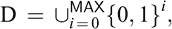，其中是一个常数。这意味着哈希函数可以用于计算具有长度从 0（对应空字符串）到的消息的摘要。通常情况下，被取为一个非常大的值，如 2⁶⁴。

*值域*：哈希函数的值域为 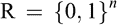，其中 *n* 是一个常数。这意味着哈希函数对任何消息产生的摘要都是一个 *n* 位的字符串。选择 *n* 受到一定的安全考虑的影响。通常情况下，*n* = 256 或更高。

*效率*：在许多应用中，通常需要计算数百万条消息的摘要。因此，基本要求是计算哈希函数应用于消息的过程应该非常快速。

形式上，哈希函数是一个映射

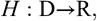(16.1)

其中  和  是有限非空集合，满足 。这里， 表示有限集合 *S* 的基数，即 *S* 中的元素数量。

哈希函数的定义域大于其值域。这意味着哈希函数的定义域中不可能有唯一的摘要与每个消息对应。回想我们之前为哈希函数提出的要求是确保唯一摘要。显然，定义域大于值域的条件和唯一摘要的要求是矛盾的。这种矛盾以以下方式解决。

让*M*和成为的两个不同元素，使得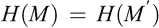。消息对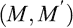被称为*H*的一次碰撞。确实，如果在其定义域上对*H*进行评估，碰撞肯定会发生。但是，由于定义域非常大，在实践中将无法对*H*进行整个定义域的评估。与定义域的大小相比，哈希函数只会在定义域的微不足道的一小部分上进行评估。为了确保摘要的唯一性，哈希函数只需在实际评估的输入上表现得像一个单射函数即可。特别是，这意味着在实践中不应该发生碰撞。这导致哈希函数的以下所需特性。

**抗碰撞哈希函数（CRHF）：** 如果哈希函数*H*很难找到一个碰撞，那么称为抗碰撞的哈希函数。在当前的语境中，计算困难意味着在合理的计算资源下，不应该能够在合理的时间内找到*H*的碰撞。

我们已经提到过，应该能够非常快速地评估一个哈希函数，即，给定一个消息*M*，应该能够在（非常小的）一秒内计算出摘要*H*(*M*)。考虑相反的问题。假设我们给定了一个*n*比特字符串的摘要*y*。找到一个消息*M*，使得*H*(*M*) = *y*，有多难呢？更一般地说，找到任何给定摘要的原像有多难呢？一种找到原像的方法是反复将*H*应用于不同的消息，直到找到一个消息，该消息在*H*下映射到*y*。由于存在 2 ^([*n*])个可能的摘要，这个过程可能需要将*H*应用于 2 ^([*n*])个消息。对哈希函数的一个要求是基本上没有更好的方法来找到原像。

**单向哈希函数（OWHF）：** 如果一个哈希函数 *H* 被认为是单向的，那么在 *H* 的值域中找到任何元素的原像是*计算难度*的。

假设已知 *M* 和 *y*，使得 *H*(*M*) = *y*。一个可能希望找到一个消息 ，使得 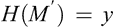。换句话说，已知*H*下的*y*的一个原像是*M*，问题是找到另一个*y*的原像。这不同于请求*y*的原像。也不同于要求*H*的冲突，因为在冲突中，只需请求一对不同的消息*M*和，使得；这与首先指定*y*和*M*然后请求是不同的。事实上，有证据表明找到第二个原像的难度与找到一个原像的难度相同，实际上比找到一个冲突要困难得多。

**二次预像抗碰撞哈希函数：** 哈希函数 *H* 被称为二次预像抗碰撞的，如果对于执行以下任务来说是计算难度较大的。对于 *H* 的任何一个值域中的元素，在给定其中一个原像的情况下，找到第二个（或者报告没有第二个原像）是困难的。

后来，在区块链的上下文中，我们证明了哈希函数的抗碰撞、单向和二次预像抗碰撞的性质。

#### 16.1.2 哈希函数作为随机预言机

密码学哈希函数通常被建模为随机预言机。在这里，随机预言机是一个从  到  的均匀随机函数。请记住， 和  是有限非空集合。因此，从  到  的所有函数的集合是一个有限集合。假设  是从  均匀随机选择的函数。这样的 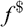 被称为随机预言机。函数  的视图如下。它在  的元素上查询并返回  的元素。随机预言机的一个关键属性如下。假设 *M* 1,…,*M* *k* 是  的不同元素。那么 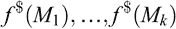 是  中的*独立和均匀随机*元素。请注意， 是一个函数，因此如果它在相同的输入上评估两次，它将返回相同的答案。

尽管是一个随机预言机，但定义域仍然大于值域。因此，仍然会发生碰撞。让我们考虑找到碰撞的难度。评估的唯一方法是在（不同的）消息*M*1,…,*M*k 上查询它。假设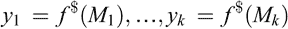是相应的输出。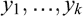都是不同的概率是

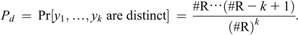(16.2)

对于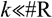，可以证明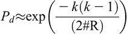。获得碰撞的概率是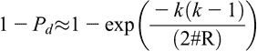。对于大约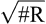的*k*，获得碰撞的概率大于。值被称为生日界限（遵循所谓的生日悖论）。因此，如果在上查询不同的消息，那么找到碰撞就变得可能。

具体的哈希函数*H*不是一个随机预言机。然而，通常假设*H*的行为类似于随机预言机。特别是，人们期望在获得碰撞之前需要对*H*进行次评估。对*H*的随机预言机假设也经常用于（启发式地）论证*H*的输出分布。

#### 16.1.3 数字签名方案

签名是任何合同的关键组成部分。它确认了签署者对合同的承诺，这种承诺在未来无法否认。在数字世界中，数字签名履行了类似于物理世界中手写签名的角色。然而，数字签名并不是物理手写签名的确切类比。我们不深入讨论数字和物理签名之间的细微差别。相反，我们在下面提供了数字签名的高级概述。

电子合同（e-合同）是一种数字文档。像物理合同一样，e-合同需要合同参与方的不可否认的承诺。这通过在合同上附上各方的数字签名来实现。假设爱丽丝签署了数字文档*M*以产生签名*s*。任何这样的数字签名都有两个基本要求。首先，必须保证只有爱丽丝才能在消息*M*上产生*s*。其次，给定*M*和*s*，任何其他方（比如鲍勃）都必须能够验证*s*确实是爱丽丝在*M*上的签名。第一个条件要求爱丽丝拥有一些仅她知道的信息。这称为爱丽丝的签名（或秘密）密钥 。为了使鲍勃能够进行公开验证的第二个条件，爱丽丝必须公开一些与她的秘密密钥对应的信息。这称为爱丽丝的验证（或公开）密钥 。

更正式地说，数字签名方案由三个过程（或算法）组成：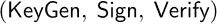。爱丽丝运行算法以生成一对匹配的签名-验证密钥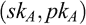。她保持保密，并发布作为她的验证密钥。为了签署一条消息*M*，爱丽丝对*M*使用算法和以生成签名*s*。然后，她提供(*M*, *s*)作为消息-签名对。为了验证，鲍勃对(*M*, *s*)使用算法和; 如果的答案是‘是’，鲍勃接受*s*作为爱丽丝对*M*的签名，而如果答案是‘否’，鲍勃拒绝消息-签名对。

注意，算法并不特定于爱丽丝。任何其他实体，比如查尔斯，也可以使用生成他的签名和验证密钥和，并使用与来签署一条消息。此外，还可以被鲍勃用来验证查尔斯生成的签名。

数字签名方案的一个关键要求是不可否认性。如果爱丽丝声称*s*是她在消息*M*上的签名，那么她以后不能撤回她的声明并否认她签署了*M*。这通过确保当且仅当*s*是通过在*M*和的输入上应用得到的时，对(*M*, *s*)的输入返回“是”，并且。由于仅为爱丽丝所知，因此可以得出结论她必须已经签署了消息。

对于任何签名方案（数字或物理），主要威胁是伪造签名的可能性。请注意，消息-签名对是公开的。因此，对于伪造者（比如夏娃），可以获得由爱丽丝使用她的签名密钥生成的几个有效的消息-签名对(*M* 1, *s* 1),…,(*M* [*k*], *s* *k* )。夏娃无法访问。假设在研究由爱丽丝生成的获得的有效消息-签名对之后，夏娃产生了一个对*inline-image*不等于任何*i*的对。此外，假设在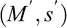和上运行的结果是“是”。因此，是一个消息-签名对，它没有由爱丽丝生成，但在她的验证密钥下验证。这意味着夏娃成功地伪造了爱丽丝的签名。安全的数字签名方案应该阻止这样的伪造。

### 16.2 分布式计算

分布式计算是一个非常广泛的概念。分布式计算系统的一个基本特征是由网络连接的计算机集合。更一般地，可以将计算机视为系统的组成部分。这些组件通过使用网络相互交互，通过向彼此发送消息来实现交互。

网络的拓扑结构可以是多样的。很少情况下所有节点都直接连接在一起，因为这样的连接结构将会非常昂贵。拓扑结构可以是结构化的，其中描述相互连接网络的图具有某种规则结构。然而，基于互联网的分布式计算系统具有非结构化的拓扑结构。每个组件只能与少数邻居直接通信。

这些组件以异步方式运行，即没有全局时钟确定每个时间步骤中哪个组件执行什么操作。此外，这些组件可以并行运行，并在需要时向其他组件传递消息。一个重要的特点是组件可能会发生故障。故障会独立发生，并且异步发生。故障并不一定意味着操作停止。一个失败的组件可能会产生‘垃圾’消息。在对抗性场景中，一个组件可能会受到对手控制，然后从被损坏的组件发送消息，以误导正在运行的组件。

分布式计算系统的目标是完成一些工作。工作的性质可能是执行某些计算任务的联合计算。每个组件执行工作的一部分，并将其发送给一个特殊的组件。该组件将来自各个组件的输入汇集在一起，计算出最终结果。或者，任务可能是让组件就一个共同的值达成一致。由于组件是分布式的，并且仅使用网络进行通信，因此这个任务本身就非常复杂。此外，还需要在可能的组件故障或可能的恶意控制下执行任务。

有几种类型的分布式计算网络。两个典型的例子是客户端-服务器网络和点对点（P2P）网络。在客户端-服务器网络中，有一组客户端，每个客户端都可以在需要时连接到一个后台服务器。通常，客户端可能使用服务器对用户进行身份验证或完成一些繁重的计算。客户端-服务器模型对区块链不太相关，因此我们不再进一步讨论。

#### 16.2.1 点对点网络

P2P 网络是一个相互连接的组件（有时称为节点）网络。没有中央管理系统。所有对等体，即节点，具有相等的权利（因此称为对等体）。请注意，相等的权利并不一定意味着相等的计算资源。两个节点可能具有不同数量的计算能力，但就访问网络的共享资源而言，这两个节点将具有相同的权利。

P2P 网络中的一个节点可以向其他节点提供其计算资源。或者，它也可以利用其他节点的资源来完成自己的目的。因此，一个节点既是资源的提供者，也是资源的消费者。点对点网络的著名例子是文件共享系统。

P2P 网络通常没有任何结构。一个节点将消息转发给（一部分）邻居。任何此类消息然后进一步转发给邻居的邻居，依此类推，最终可能到达系统的所有节点。节点使用网络进行通信的方式由协议确定。

#### 16.2.2 八卦协议

一个八卦协议是 P2P 通信的模板。它基于流行病传播的原理。点对点八卦用于确保数据被路由到网络的所有成员。有两种可能的目的。第一种是数据的传播，第二种是数据的聚合。在区块链的背景下，数据的传播更为相关。

八卦协议并不是唯一的，尽管任何八卦协议都具有一些相关特征。一个节点以周期性的方式与其一些相邻节点交互，即在一定时间间隔之后，一个节点向其邻居发送其数据并接收它们的数据。每次这样的交互仅交换有限量的信息。通常，一个节点在选择与其通信的节点时会使用一些随机性。由于一个节点向多个节点发送数据，系统中存在隐含的冗余。相同的数据可能通过两条不同的路径到达特定的节点。

节点之间的通信并不假定是可靠的。链接可能失败，节点可能失败。此外，如上所述，一个或多个节点可能受到对手的控制。在这种情况下，即使在这种情况下，实现某种可靠通信的概念也是一项挑战。

#### 16.2.3 拜占庭协议

在上述讨论中，我们已经提到了参与节点可能存在恶意行为的可能性。让我们更详细地考虑一下这个问题。假设每个节点都有一些输入（比如一个位），目标是让所有节点决定一个共同的值。这个共同的值必须在某种程度上依赖于一个或多个输入，否则问题就变得太简单了；所有节点都会同意某个常量值（比如 1）。首先，为简单起见，假设任意两个节点可以直接通信。通常情况下，节点会通过对节点的疏散协议向网络中的所有其他节点发送消息来连接。 

不能假设节点是可靠的。一部分节点将执行正确的行为，而其余节点的行为无法预测。这些其他节点称为拜占庭节点。节点的拜占庭行为指的是任意和/或不可预测的行为。它可能停止中继值，它可能中继一个随机值，或者甚至可能中继一个恶意值（即旨在使正确或非拜占庭节点混淆的值）。正确的节点异步地且彼此独立地运行。另一方面，拜占庭节点可以协调他们的活动，因为他们所有人都可能受到某个对手的控制。正确的节点不会知道节点是拜占庭的还是正确的。然而，我们可以假设一个节点不能伪造发送者地址，即一个单独的节点不能冒充网络中的所有节点。

拜占庭协议的目标是使正确的节点在上述情况下达成共识。协议的相关特性包括必须终止，即协议必须在有限时间内终止。终止时，所有正确的节点应该有一个共同的值。这个共同的值必须有效。有几种有效性概念。任何输入有效性是指共同值是至少一个（不一定是正确的）节点的输入。正确输入的有效性是指共同值是至少一个正确节点的输入。全相同的有效性是指如果所有正确的节点从相同的值开始，那么共同值必须是这个值。

一个基本问题是拜占庭协议是否可能。已经证明，对于一个包含 *n* 个节点的网络，如果至少有 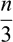 的节点是拜占庭节点，则拜占庭协议是不可能的。另一方面，在这个领域数十年的研究已经取得了一系列积极的结果，在不同的情况下获得了各种拜占庭协议。

#### 16.2.4 共识协议

共识协议是在存在拜占庭节点的情况下，多个节点就单个数据值达成一致的方法。上述终止和一致性的属性是任何共识协议的必要属性。至于有效性（有时也称为完整性），通常使用全相同的有效性概念，即如果所有正确的节点提议了相同的值，那么在协议结束时，任何正确的节点都必须决定采用此值。

**注意**

加密学导论可以在密码学教材中找到，例如 Stinson 和 Paterson（2018）的教材。数字签名方案有大量文献，并有许多变种。有关各种数字签名方案的概述，请参见 Sarkar（2015）。目前，有几种标准化的数字签名方案。我们提到了由美国 NIST 标准化的椭圆曲线数字签名方案（ECDSA）（请参见 NIST，2016）。ECDSA 在加密货币比特币中使用。

拜占庭问题最早出现在 Lamport，Shostak 和 Pease（1982）中。此后，该领域进行了大量工作。我们的涉及尚属基础。更多讨论可以在许多教科书中找到。

## 第十七章

区块链介绍

本章概述了基本的区块链技术。在下一章中，我们将看到如何使用区块链来实现加密货币。

### 17.1 交易

简单地说，交易是两个或更多方之间某种交换的记录。例如，一方提供服务，而第二方为服务支付费用。要进行支付，一方必须拥有一定金额的资金，然后必须提供签名的声明，将资金转移给另一方。

更一般地，人们可以考虑各方之间的合同。合同比交易灵活得多。它可以包括退出和惩罚条款，也可能涉及未来的未知情况。因此，撰写合同的语言必须足够表达，以涵盖各种任务。当我们讨论有趣的智能合同概念时，我们将再次回到这个问题上。

无论我们考虑的是一笔交易还是一份合同，只有涉及方签署的这种工具才被认为是有效的。例如，如果有人希望进行支付，该人必须签署将款项转移到另一个人的声明。在物理世界中，这是通过签署支票实现的。因此，付款人的签名是关键问题。转移到数字世界后，交易需要签名。为此，使用数字签名方案。假设 Alice 希望向 Bob 支付 100 美元。她使用自己的签名密钥 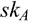 对声明“我将 100 美元转移到 Bob”的数字签名。该声明被视为消息*M*，并且签名算法在*M*和  上被调用以生成签名*s*。使用验证算法和 Alice 的验证密钥 ，任何人都可以验证*s*确实是 Alice 对消息*M*的签名。目前，让我们将交易视为这种类型的签署声明。稍后，我们将考虑更多细节。

### 17.2 交易区块

一个活跃的系统将产生数百万笔交易。此外，未来的交易可能基于当前的交易。例如，支付系统将包括各方向其他方支付款项的交易。一方可以从另一方收到款项，然后根据收到的款项向第三方支付款项。在高层次上，我们可以将整个系统视为迄今为止在系统内发生的交易集合。

为了记录目的，交易需要被分组并存储。一个区块本质上是一组交易。区块中的交易存储顺序并无特定要求。

交易的大小可能会有所不同，取决于它们的复杂性。在支付系统的上下文中，一个交易可能记录一个简单的支付，从一个方的一个帐户到另一个方。这样的交易将有一个小的大小。另一方面，一个交易也可能记录了从一个方的多个帐户到多个方的支付。这将有一个更大的大小。一个区块通常有一个固定的大小。所以，取决于交易的大小，它可能存储不同数量的交易。然而，这对于概念理解并不重要。将一个区块视为存储一些交易就足够了。

### 17.3 公开分类账作为区块链

系统的交易被输入和记录在一个分类账中。在一个物理系统中，分类账将是一本物理书，在书的每一页上都会输入一堆交易。在数字系统中，交易块被链接在一起形成一个称为区块链的结构。一个加密哈希函数 *H* 被用来将交易块链接在一起。整个链是公开的。所以，区块链实现了一个公开分类账。

我们提到过一个区块包含一组交易。虽然这确实是一个对区块的粗略概念视图，但区块中实际包含的信息不仅仅是其中的交易。下面我们提供一个更正式的描述。

让 *B* 0, *B* 1, …, *B* *r* 成为一个区块序列。第一个区块 *B* 0 是特殊的，因为它没有前一个区块。有时候它被称为*创世区块*。正式来说，区块 *B* [*i*]，*i* ≥ 1，可以被看作是一个三元组 。（一个区块还存储一些被称为元数据的附加信息，我们暂时忽略它。）区块中的交易构成了区块 *B* [*i*] 的组件 *R* [*i*]，*h* [*i*] 是链接信息。暂时来说，让我们忽略 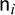的作用。

哈希函数*H*被应用于块*B*[*i*]−1，以获得块*B*[*i*]的组成部分*h*[*i*]，即*h*[*i*] = *H*(*B*[*i*]−1)。因此，一个可以考虑在当前块中的组成部分*h*[*i*]指向前一块*B*[*i*]−1。换句话说，哈希函数*H*用于创建量*h*1、*h*2、……、*h**r*，它们是区块链中的链接。请注意，创世区块*B*0 没有组成部分*h*0，因为它没有早期的块可以指向。在图形上，这可能被描述如下：

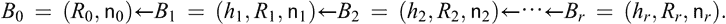

区块链中的箭头指向后向方向，表明块*B*[*i*]的摘要是块*B*[*i*]+1 的一部分。然而，链只在正向方向计算。一旦链达到块*B**r*，一组交易被视为*R**r*+1，计算摘要*h**r*+1 = *H*(*B**r* )（对于适当的值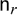），并且块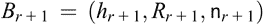被附加到链的头部。

任何账本的基本要求是不可变性。基本上意味着一旦交易记录进入账本，就不应该有任何方式可以撤销或更改它。在上述公共账本的情况下，这种属性也应该成立。确保公共账本的不可变性相当于确保一旦一个区块（因此是区块中的交易）被插入到区块链中后，就不能再进行更改。让我们更详细地考虑一下这一点。

假设有两个块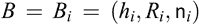和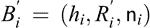，满足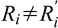，使得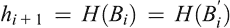。块*B* [*i*]的组件*R* [*i*]包含了已经包含在块中的所有交易。*R* [*i*]和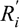之间的差异可能是由于修改了某些交易*T*来获得包含在中的交易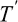。由于哈希函数*H*下的*B* [*i*]和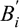的摘要相等，并且两个块都包含相同的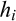的值，以下两个区块链都是有效的：

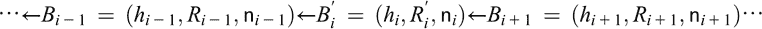

对手可能进行交易*T*，该交易进入第一个区块链，然后用包含交易而不是*T*的第二个区块链替换第一个区块链。这显然违反了区块链的不可变性。

上述情景是由于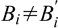的发生而产生，使得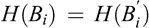。对于哈希函数*H*，成对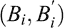是其碰撞。*H*的要求之一是它应该是碰撞性抗的，即对于*H*找到碰撞应该是计算上困难的。对于碰撞性抗的*H*，在合理的时间内不可能找到*B* [*i*]和这样的。因此，修改公共账本的描述策略将无法奏效。

我们提到过区块链是向前计算的。让我们考虑向后计算的可能性。假设区块链有*r*个块，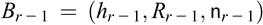是区块链的头。在向后方向计算链条需要获取一个块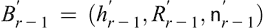，使得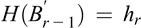。首先假设这确实是可能的。这将影响区块链的不可变性，因为然后*B* *r*−1 可以被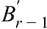覆盖以获得有效的区块链。只有在给定*h* [*r*]的情况下，向后计算才可能找到，使得。实际上，这意味着可以在*H*下计算*h* *r*的前像。回想一下，哈希函数*H*所需的一个属性是它是单向的，这确保了在*H*下找到前像是计算难度很大的。因此，哈希函数*H*的单向属性确保了不能向后计算区块链。

### 17.4 分布式公共分类帐

我们已经描述了如何使用区块链建立一个公共分类帐。理论上，可以使用不使用区块链的公共分类帐的实现。然而，目前实现公共分类帐的最重要方法是基于区块链。因此，我们对公共分类帐的讨论将完全基于区块链技术。

在本章的前几节中，我们提供了区块链的基本概述。已经解释了哈希函数的加密属性与区块链的不可变性的相关性。接下来的问题是如何维护区块链。对此的简短答案是，区块链是以分布式方式维护的。在本节中，我们进一步阐述了这一点。

我们考虑的环境包括许多地理分布在全球各地的参与方。各方的复杂性可能会有所不同。目前，我们忽略这些差异，将每个参与方视为系统的一个节点。同样，为了简单起见，我们假设一个节点就是一台计算机。这些节点通过互联网（或者可能是其一部分）相互连接。因此，一个特定的节点只能直接与其邻近的少数节点进行通信。这就是 P2P 网络的设置，如第 16.2.1 节所述。

节点本身会生成需要包含在公共分类账中的交易。那么，谁来维护公共分类账呢？答案是所有节点都维护公共分类账，即每个节点都维护公共分类账的一份拷贝。由于我们考虑的公共分类账是以区块链实现的，因此每个节点都维护区块链的一份拷贝。由于区块链分布在整个网络中，因此产生的公共分类账通常称为分布式公共分类账。在这一点上，一个关键的问题出现了。如何确保由不同节点维护的区块链拷贝是一致的呢？下面我们来解决这个问题。

让我们考虑一个特定的节点*v*。交易发生在节点*v*上，即负责节点*v*的实体可能会启动交易。这些交易需要记录在区块链中。因此，节点*v*使用 P2P 网络的八卦协议将交易发送到其邻近节点的子集。这些邻近节点进一步传播交易，直到交易达到整个网络。通常，八卦网络非常高效，交易在几秒钟内（甚至更短的时间内）就能传播到整个网络。同样，节点*v*接收到网络中其他节点发生的交易。

我们已经提到网络中的每个节点都维护着区块链的一个副本。区块链由一组交易组成，每个区块都是一组交易。每个节点还会接收网络中发生的交易。除了区块链的副本外，每个节点还维护着一份迄今尚未进入区块链的交易列表。这就是所谓的‘未阻塞’交易集合。需要注意的是，在特定时间点上，不同节点维护的未阻塞交易列表可能并不相同；事实上，它们通常是不同的。这是因为在特定节点生成的交易需要一定时间才能传播到整个网络。在它到达所有节点之前，一部分节点将把它记录为‘未阻塞’，而其他节点甚至可能不知道它的存在。

再次，让我们回到节点*v*。这个节点维护着区块链的一个副本和一个未被阻塞的交易列表。让我们用来表示节点*v*的区块链副本，用表示其未被阻塞的交易列表。除了生成和传播交易外，每个节点还尝试创建并传播一个区块。

假设的头部是一个区块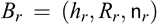，其中 *h* *r* = *H*(*B* *r*−1) 是前一个区块 *B* *r*−1 在下哈希函数 *H* 的摘要，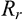是区块 *B* 中的交易集，而是一个发挥特殊作用的量。节点 *v* 从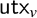中取一组交易并检查每笔交易的有效性。有效性检查包括检查正确的格式和交易中各方数字签名的验证。如果检查失败，那么 *v* 将拒绝相应的交易并将其从中移除。一旦所有检查都成功，*v* 将这组交易视为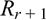。然后，节点 *v* 计算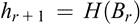。接下来，它尝试获得适当的值以便能够形成一个区块。我们将在后面解释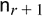是如何获得的。一旦节点 *v* 能够形成区块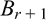，它就从中移除中的交易，将插入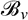作为新的头部，并使用八卦协议将该区块传播到网络中。因此，除了交易外，网络中的节点还会传播它们创建的区块。

当节点*v*接收到一个块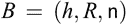时，让我们考虑接下来会发生什么。 它会检查是否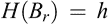，如果是，则将*B*插入中并从中删除*R*中的交易。 这会导致节点*v*可用的区块链副本扩展了一个块。 八卦协议确保块*B*到达所有节点。 假设所有节点都具有相同的区块链副本，每个节点都将其区块链副本扩展了一个块*B*，然后网络中的所有节点再次具有相同的区块链副本。 请记住，区块链的起始点是所有节点肯定拥有的创世块。 因此，忽略冲突，每个节点都维护相同的区块链副本。

然而，冲突是不可避免的。节点并行且独立地创建区块。每当创建一个区块，它就会被传输到八卦网络中。此外，节点维护的未被阻塞的交易列表是不同的。因此，由不同节点创建的区块不一定具有相同的交易集。很有可能节点*v*几乎同时接收到两个不同的区块和，使得。换句话说，区块*B*和都与*v*维护的区块链的副本兼容。请注意，区块*B*和中的一个可能是由*v*自己创建的。在这一点上，需要一种冲突解决机制来确定两个区块*B*和中的哪一个将被插入为的新标题。区块链的整体协议将指定这种冲突解决机制。稍后我们将考虑比特币协议的特殊情况。目前，只需注意区块*B*和中的一个被*v*输入为新标题，而另一个区块被拒绝。假设区块*B*被接受而被拒绝。因此，在某种意义上，区块链协议必须定义区块*B*何时优先于区块。请注意，此偏好关系由区块链协议指定，并由网络中的所有节点遵循。因此，所有节点都将优先选择*B*而不是并使用*B*扩展其区块链的副本而不是。这是节点之间的一种共识，而区块链协议的偏好关系基本上指定了共识算法。

实际情况比上述更复杂。进入区块链的竞争不仅仅局限于几乎同时被一个节点接收的两个区块。再次考虑节点*v*及其区块链的副本。假设节点*v*接收到一个区块，并且发现*H*(*B* [*i*]−1) = *h*。这意味着区块链(*B* 0,…,*B* [*i*]−1, *B*)是有效的。节点*v*现在可以选择拒绝区块*B*，或者修改其区块链副本为(*B* 0,…,*B* [*i*]−1, *B*)并拒绝区块。节点*v*应该选择哪个选项的实际决定也由区块链协议的冲突解决机制确定。

假设按照区块链协议，节点*v*选择了区块链(*B* 0,…,*B* [*i*]−1, *B*)并拒绝了区块*B* [*i*]，…,*B* *r*−1, *B* *r*。由于网络中的所有节点都遵循共识协议，任何其他本地区块链副本为且接收到区块*B*的节点也会选择区块链(*B* 0,…,*B* [*i*]−1, *B*)并拒绝区块*B* [*i*]，…,*B* *r*−1, *B* *r*。这些后来的区块被称为陈旧区块（有时也称为孤立区块，尽管在技术上孤立区块是不同的对象）。创建这些陈旧区块的成本被浪费了。

还有可能会出现另一种情况。假设所有节点的区块链的本地副本为 ，它们都收到了区块 *B*。进一步假设区块链协议规定区块链必须修改为 。此时，网络中的一些节点决定遵循协议并更新他们的区块链本地副本，而其余节点则丢弃区块 *B* 并继续使用区块链 。这样就产生了两条不同的区块链，它们在区块 *B* [*i*]−1 之前相同，然后分叉成两条不同的链。在这两个不同的区块链上工作的两个不相交的节点子集将不再接受彼此的区块和交易。实际上，这导致网络分为两个不同的部分。这个过程称为区块链和网络的分叉。分叉可能因多种原因而发生。导致分叉发生的一个重要原因是区块链协议的变化，该变化被一部分节点接受，而其他节点不接受。在加密货币的背景下，分叉可能导致一种加密货币分裂为两种加密货币。稍后我们将进一步解释这种情况可能发生的方式。

### 17.5 允许性与许可性区块链

基于区块链的分布式公共账本由比特币及其后续加密货币推广开来。其中值得注意的是以太坊，除了提供加密货币外，还提供了一个实现智能合约的平台。所有这些区块链都可以被视为公共区块链。在这种区块链中，没有限制谁可以成为网络中的节点。任何人都可以在计算机上下载区块链协议的软件，并创建一个区块链网络的节点。这样的系统被认为是无需许可的，因为不需要从任何权威处获得加入网络的许可。由于网络中的所有节点都具有相同的特权，即它们是对等的，它也被称为分散式系统。

在加密货币流行之后，人们对实现各种任务的分布式公共账本的底层区块链技术产生了极大兴趣。例如，一个组织可以使用区块链来维护内部记录的公共账本。这将非常方便，因为公共账本将对组织内所有成员可访问。这样的公共账本实际上并不是公开的，因为组织可能不希望将其内部文件透露给组织外的实体。此外，它可能还希望仅将账本访问权限提供给一组特权组织成员。因此，需要从某个中央机构获得许可才能加入区块链。这样的系统称为许可区块链。

## 第十八章

加密货币：基础知识

在本章中，我们将考虑加密货币。比特币加密货币于 2009 年提出，并且至今仍然是所有加密货币中最成功的。在比特币之后，提出了 1500 多种加密货币。所有这些加密货币都基于区块链技术，其中大多数在概念上与比特币非常相似，主要区别在于选择实现各种组件的工具。我们关于如何使用区块链技术实现加密货币的讨论将以比特币为基础。稍后我们将讨论一些概念上的变化。

### 18.1 所有者

当考虑加密货币时，首先想到的问题是货币是如何创建的。然而，我们将推迟这一点。让我们假设存在一单位加密货币。加密货币的存在意味着不同的所有者持有不同数量的加密货币。在任何时间点，加密货币的总量是由不同所有者持有的加密货币数量之和。因此，在所有权之外不存在加密货币的存在。

在现实世界中，某个物理实体是某种货币的所有者。这样的物理实体可以是一个人或一个组织。拥有物理货币可以意味着各种各样的事情。所有权的一个重要后果是，它为所有者提供了花费所持有的货币数量的特权。花费是通过将所有者持有的金额的（一部分）转移给另一个实体来实现的。然后，该后续实体成为该货币数量的新所有者。

加密货币系统模拟了物理货币的花费方面。通过这样做，它抽象出了对物理实体的要求。所有权的概念通过花费能力来捕捉，即一定数量的加密货币的所有者可以花费这个数量。

修复数字签名方案。使用方案的算法，可以创建一对签名（或秘密）和验证（或公共）密钥。每次调用算法时，它都会返回一对新的秘密/公共密钥。在概念上，在加密货币系统中，公共密钥是各种金额加密货币的所有者。（我们稍后会修改这个声明。）假设，一个公钥拥有 *x* 金额的加密货币。然后可以向相应的公钥支付 *x* 1,…,*x* [*t*] 金额的加密货币，使得 *x* = *x* 1 + ⋯ + *x* [*t*] 。为了进行这种支付，需要与对应的签名密钥。拥有此签名密钥的人可以进行此类支付。

物理实体是拥有相应公钥的签名密钥的所有者，这使得它们能够支付相应公钥持有的加密货币。一个物理实体可以创建多个签名和公钥。此物理实体对加密货币的总拥有权是该物理实体持有相应签名密钥的公钥持有的各种加密货币金额之和。如果签名密钥丢失，则无法花费由相应公钥拥有的加密货币金额。这笔加密货币实质上退出系统并且丢失。

加密货币系统为参与的物理实体提供一定程度的匿名性。参与系统的物理实体的身份不是系统的一部分。系统只识别公钥。支付是从一个公钥到一个或多个公钥进行的。为了进行这样的支付，不需要物理实体的身份。只要物理实体拥有适当的签名密钥，它就可以进行所需的支付。

### 18.2 交易

在第十七章中，我们以抽象的方式考虑了交易。在加密货币的背景下，一笔交易是指将由一个公钥  拥有的加密货币金额支付给一个或多个公钥  的记录。因此，存在一个支付者公钥  和一组接收者公钥 。转账声明被视为一条消息 *M*。该消息使用与  相对应的签名密钥  进行数字签名以生成签名 *s*。签名的任务代表支付者对交易的承诺。由于签名密钥不是公开的，因此只有拥有签名密钥  的物理实体才能签署资金的转移。转账声明 *M* 与签名 *s* 组成了一笔交易。

交易 (*M*, *s*) 的验证包括几项检查。其中之一是签名的验证。支付者的公钥  是公开的。因此，任何人都可以使用验证算法和  来验证 (*M*, *s*) 是否是一个有效的消息-签名对。

对交易的另一个重要检查是验证确实拥有所声明的加密货币数量。我们考虑了这个问题。正如第十七章所讨论的，交易被组合成块，并且这些块被组织成区块链。区块链是公开的，并构成公共账本。因此，任何属于区块链的交易都是公开可见的。在上文中，我们已经讨论了如何从一个公钥转移到另一个公钥。还有一种方法可以创建特定数量的加密货币并将其分配给一个公钥，这些信息也可以在区块链上找到。（我们将稍后讨论创建加密货币的程序。）因此，一定数量的加密货币被创建并分配给一个公钥；一笔交易将这个数量分配给一组公钥；随后的交易依次将金额分配给其他公钥，依此类推。所有这些信息都可以在区块链上找到。因此，在任何时候，使用区块链，都可以确定一个特定的公钥是否确实拥有所声明的加密货币数量。因此，可以验证交易中的花费者公钥是否确实是在交易中花费的金额的所有者。

第十七章讨论了如何使用 P2P 网络来实现区块链。在这种网络中，节点的一个活动是将交易分组到区块中。在将交易包含到一个区块之前，节点会验证交易。除了基本验证，如转移到收款者公钥的金额之和至多等于花费者公钥拥有的金额之外，这种验证包括两个关键任务。第一个是确定花费者公钥是否确实拥有要转移的加密货币金额，第二个是验证交易中的签名。如果这些检查中的任何一个失败，交易将被丢弃。否则，节点会将其包含在交易列表中，并尝试创建一个区块。

到目前为止，我们已经提到一个交易由一个花费者公钥和可能多个收款者公钥组成。一个交易也可能有多个花费者公钥。在这种情况下，交易必须由与每个花费者公钥对应的签名密钥签名。此外，转移到所有收款者公钥的加密货币金额之和必须至多等于所有花费者公钥拥有的加密货币金额之和。

假设存在 *s* 个花费者公钥拥有 *x* 1,…,*x* *s* 数量的加密货币，并且存在 *t* 个接收者公钥接收 *y* 1,…,*y* [*t*] 数量的加密货币。那么有效交易的一个必要条件是 。如果 ，那么整个输入金额将被转移到输出中。另一方面，如果 ，那么差额  将被转移到成功创建包含交易的区块的 P2P 网络中的节点。这个差额 *δ* 被称为交易费，是网络中的节点将交易包含在区块中的激励。

请注意，花费者公钥拥有的整个金额要么用于转移到接收者公钥，要么作为交易费用。花费者公钥无法保留其所持金额的一部分。假设一个实体*A*拥有与持有*x*金额的公钥对应的秘钥。此外，假设*A*希望向公钥支付小于*x*的金额*y*。如果*A*创建一个以作为花费者密钥，并向转移*y*的交易，那么金额*x* − *y*将成为交易费用，对*A*来说是损失。实现这种部分支付的方法如下。实体*A*创建一个新的公共/签名密钥对和，并保持的机密。然后，它创建一个以作为花费者公钥，向转移金额*y*和向转移金额*z*的交易，使得*y* + *z* ≤ *x*。由于*A*拥有分配给的金额*z*的签名密钥，因此它稍后可以花费这笔金额*z*。请注意，如果*y* + *z* = *x*，则不存在交易费用。实体*A*可以设置*z*的值，以便有少量的交易费用，以激励节点将交易包含到一个区块中。

### 18.3 加密货币地址

我们已经提到公钥是加密货币的所有者。这种说法并不准确。更准确地说，加密货币的所有者是地址。这些地址是通过将哈希函数应用于公钥而形成的。用于生成地址的哈希函数可能与用于链式区块的哈希函数不同。假设*H*1 是用于生成地址的哈希函数。给定一个公钥，地址计算为。

假设*H*1 是碰撞抵抗的，加密货币地址是公钥的唯一编码。假设(*sk*, *pk*)是一对签名和验证密钥，并且。与地址关联的加密货币金额可以由持有签名密钥的人花费。如果可能生成另一对签名和验证密钥，使得，那么使用就可以花费与地址*a*关联的金额。给定和，获得使得的任务是在*H*1 的范围内找到元素*a*的第二个前像。在*H*1 是第二个前像抵抗的假设下，这个任务是计算上不可行的。

我们提到过，一笔交易将资金从花费者的公钥转移到收款者的公钥。更准确地说，一笔交易将资金从花费者的地址转移到收款者的地址，这些地址是通过应用哈希函数 *H* 对相关公钥的摘要计算得出的。为了概念上的理解，不需要区分公钥和它们的地址。因此，我们将继续谈论加密货币被分配给公钥，而不是地址。

### 18.4 回顾

让我们简要回顾一下讨论的内容。各种数量的加密货币的所有者是公钥。交易记录了从一个或多个公钥到一个或多个其他公钥的支付细节。

使用区块链实现加密货币。交易组织成块，并且这些块被顺序排列到区块链中。区块链通过点对点网络以分布式方式维护。关于哪个公钥拥有多少加密货币的完整信息可从区块链获取。网络中的每个节点维护自己的区块链副本和尚未插入到区块链的交易列表。节点生成交易并使用点对点网络的八卦协议传播它们。节点还创建块并使用八卦协议传播它们。

一个区块的形式如 ，其中 *h* 是前一个区块在哈希函数 *H* 下的摘要，*R* 是交易列表，而  则是一个特殊值。到目前为止，我们还没有解释  的角色。这个参数在创建区块中起着至关重要的作用。接下来我们将解释区块如何创建以及  在其中的作用。

### 18.5 通过工作证明创建区块

考虑一个节点 *v*，其区块链的本地副本为 ，其中的一个区块  为头部。节点 *v* 可用的未封锁交易列表为 。要创建一个区块，*v* 从  中选择一个交易列表 *R* 并验证每个交易。交易验证检查已在上文中解释过。节点 *v* 计算 。然后尝试创建一个区块 。正是在这一步中， 起到作用。

要创建一个区块，节点 *v* 预期需要做一些工作。此外，*v* 还需要提供一个证明，证明所需工作确实已完成。系统范围内有一个参数 *d*，它确定了生成工作证明的*难度*。难度 *d* 是一个正整数，控制着创建新区块所需的工作量。参数 *d* 并非实际难度；相反，难度与 *d* 成反比，我们将在下文看到。

正如前面解释的，哈希函数 *H* 的摘要（或输出）是一个 *n* 位二进制字符串，可以被视为集合 {0,…,2 ^(*n*) −1} 中整数的二进制表示。用这种方式解释，*H* 的输出可以被视为一个整数。假设在某些输入上，*H* 的输出是 *y*。如果 *y* 的最高有效位为 0，则 *y* 小于 2 ^(*n*−1)；如果 *y* 的两个最高有效位为 0，则 *y* 小于 2 ^(*n*−2)；依此类推。

要使节点 *v* 创建一个区块 ，它必须找到一个值 *x*，使得 。让我们考虑一下这个计算任务的难度。

*v*确定的一种方法是首先选择一个小于*d*的值*y*，然后找到一个，使得。这意味着给定一个特定的输出*y*，需要找到函数*H*下的一个预像，即反转函数*H*。回想一下*H*的基本属性之一是它是单向的，这意味着计算上不可行地反转*H*。所以，我们可以假设*v*无法通过在摘要*y*上反转*H*来确定。*H*的输入是，其中被获得为，*R*是要包含在区块*B*中的交易集合。数量和*R*是固定的，只有在选择方面有灵活性。因此，在当前情况下反转*H*的任务不仅是获得*y*的任何特定的预像，而且是具有和*R*作为前两个组成部分的预像。这比简单地反转*H*更困难。当然，由于*H*本来就是单向的，这种区别并不重要。

另一种*v*尝试寻找的方法是反复尝试不同的值，并计算。通过尝试许多值，*v*可以希望最终找到一个值，使得。在这一点上，*v*已经能够创建区块。节点*v*将使用八卦协议传播*B*。

需要在找到一个理想的之前计算*H*多少次？为了回答这个问题，假设*H*是一个随机预言，即假设散列函数*H*的行为类似于一个均匀随机函数，对不同的输入返回独立且均匀分布的*n*位字符串（等价地，从集合{0,…,2 ^([*n*]) −1}中返回独立且均匀分布的整数）。对于任何正整数*d*，有*d*个非负整数小于*d*。因此，在*H*的随机预言假设下，单次调用*H*返回一个*y*，使得*y* < *d*的概率为*d*/2 ^([*n*])。考虑*y* < *d*为成功，重复调用*H*产生独立的伯努利试验，成功概率为*d*/2 ^([*n*])。在这样的*N*次试验中成功的预期次数是。我们希望获得一次成功，因此设置*Nd*/2 ^([*n*]) = 1 得到*N* = 2 ^([*n*]) /*d*，即在大约 2 ^([*n*]) /*d*次试验中，可以期望获得一个，使得。因此，例如，如果*d* = 2 ^(*n*−32)，则成功创建一个区块需要大约 2³²次调用*H*。

一个节点*v*创建一个区块需要重复调用散列函数*H*。这是节点*v*需要做的工作来创建区块。使得的值使得成立，这是节点*v*确实投入了所需的工作量的*证明*。请注意，给定值，检查条件只需要一次*H*的调用，并且非常高效。因此，生成工作证明是耗时的，而验证给定证明是容易的。

任何一个节点创建的新区块都会使用八卦协议在 P2P 网络上传播。接收到新区块的节点会将其插入到自己的区块链副本中。在执行此操作之前，节点会验证工作证明。如果验证失败，则会拒绝该区块。

实际困难与*d*成反比。创建新区块的难度作为区块的元数据的一部分存储。区块链的难度是区块链中各区块的难度之和。

### 18.6 区块奖励和加密货币的创建

创建新区块需要节点投入一定量的工作。这项工作包括使用节点的计算资源，并带有成本。为了激励节点创建区块，系统提供了区块奖励。区块奖励以一定数量的加密货币形式提供。

区块奖励有两个组成部分。第一个组成部分来自于铸造新货币，该部分归区块创建者所有。第二个组成部分由交易费组成，这些交易已经被组合到区块中。交易费问题已经解释过了。为了激励节点将交易包含在区块中，转账给接收方公钥的加密货币总金额被保持小于由花费方公钥持有的加密货币总金额。差额是交易的费用，并由成功创建包含此交易的区块的节点所要求。

当成功创建一个块时，新货币就会被创建。成功创建一个块也称为挖掘一个块。加密货币系统的规则指定了成功挖掘一个块时应创建的加密货币数量。这些加密货币数量在系统中之前并不存在。因此，随着新块的挖掘，加密货币的数量会增加。实际上，加密货币系统的规则实际上指定了加密货币数量增长的速率。加密货币的创建速率随时间减少，直到最终不再创建新货币。

假设节点*v*成功挖掘了一个块。这里需要注意的是，*R*中除了第一个交易之外的所有交易都存在于中。*R*中的第一笔交易是特殊的，称为*coinbase 交易*。该交易没有任何花费者公钥。它只有一个或多个收款人公钥。分配给收款人公钥的加密货币金额是块奖励，它等于*R*中所有交易的交易费之和以及挖掘该块时创建的新货币金额。当不再创建新货币时，块奖励将完全由交易费组成。

### 18.7 哈希率

我们已经看到，在大约 2 ^([*n*]) /*d*次调用*H*后，有可能获得一个小于*d*的摘要。这些调用是独立的，可以并行执行。

加密货币系统的 P2P 网络中的节点彼此竞争以挖掘区块。挖掘区块本质上是反复应用哈希函数*H*。反复应用*H*需要计算能力。由于计算消耗能量，挖掘一个区块也消耗大量电力。尽管节点在网络上拥有相同的特权，但它们的计算能力却不相同。具有更多计算资源的节点更有可能挖掘一个区块。

在任何时刻，P2P 网络中的节点都在应用*H*来挖掘一个区块。因此，人们可以认为网络的总计算能力是网络中所有节点一秒钟内调用*H*的次数。本质上，这是整个网络应用哈希函数*H*的速率。节点*v*的哈希率*ν* *v*是*v*一秒钟内能够应用*H*的次数。那么网络的总哈希率是，其中求和是对网络中的所有节点进行的。*v*控制的整个网络哈希率的比例是。

*p* *v* 的数量是*v*能够挖掘下一个区块的概率。假设网络中已经挖出足够多的区块*N*。那么*v*挖掘的预期区块数量是*p* *v* *N*。

一个节点 *v* 必须投资一定金额的资金 μ 才能获得哈希率 *ν* *v*。在挖掘了 *N* 个区块之后，它对这笔投资的预期回报是从 *p* *v* *N* 个区块中获得的总区块奖励。仅当 *p* *v* *N* 个区块的总区块奖励大于μ时，节点 *v* 的商业冒险才是有利可图的。在确定盈利能力时，节点 *v* 不仅必须考虑增加自己的哈希率的成本，还必须考虑其他节点正在进行的投资。这是因为 *p* *v* 是 *ν* *v* 与网络中所有节点的哈希率之和 *ν* 的比率。如果 *v* 增加了 *ν* [*v*]，但其他节点也增加了它们的哈希率，甚至可能超过了 *ν* [*v*]，那么，尽管 *ν* [*v*] 增加，但比率 *p* *v* = *ν* *v* /*ν* 可能实际下降。在这种情况下，即使通过新投资增加了哈希率，节点 *v* 也将无法获利。

一个有趣的例子是中国的比特大陆与日本的 GMO。GMO 曾大量投资以提高其哈希率。然而，比特大陆超越了 GMO，最终，即使 GMO 提高了其哈希率，其挖矿概率也没有提高。总的来说，增加计算能力的投资并没有得到增加的回报。这导致 GMO 在 2018 年底退出比特币挖矿，蒙受了大约 3 亿美元的损失。

### 18.8 更新难度参数

假设网络哈希率为每秒 ν 次哈希。在固定值 *d* 的情况下，获得新区块所需的哈希次数大约是 2 ^([*n*]) / *d*。因此，考虑整个网络的话，大约每 2 ^([*n*]) / (*dν*) 秒就会挖到一个新区块。请记住，挖掘新区块会导致新加密货币的创造。因此，每 2 ^([*n*]) / (*dν*) 秒都会创建新的加密货币数量。

网络的哈希率 *ν* 取决于 P2P 网络中所有节点的总计算能力。随着网络中的节点增加其计算资源，哈希率 *ν* 也会增加。如果 *d* 保持不变，那么新加密货币将被更快地创建出来。如果系统中的总货币数量增长得非常快，这将导致通货膨胀的情况。

可以通过两种方式防止这种通货膨胀的情况发生。首先，减小参数 *d* 的值，以使 2 ^([*n*]) /(*dν*) 的值保持不变。其次，每个区块创建的加密货币数量以稳定的速度减少。我们将具体讨论这两点，特别涉及比特币。

比特币的目标是确保每个新区块的挖掘时间约为 10 分钟，即 。当 *ν* 增加时，*d* 的值会减小，以使比例 2 ^([*n*]) /(*dν*) 保持约为 360。由于我们考虑的是一个 P2P 网络，没有中心节点知道系统的总哈希率 *ν*。因此，无法根据 *ν* 的知识直接调整参数 *d*。网络哈希率 *ν* 的增加将导致新区块被更快地发现。区块发现时间是每个区块的元数据的一部分，并可从区块链获取。因此，网络中的节点能够获取发现每个区块所需的时间。

在每个区块的创建速率为 10 分钟的情况下，2 周内可以挖掘总共 2,016 个区块。比特币协议将这些挖掘出的区块分为 2,016 个区块的窗口。在每个这样的窗口中，*d* 的值是恒定的，即每个窗口都是一个恒定的难度周期。在一个 2,016 个区块的窗口结束时，计算这些区块的时间被考虑在内。如果这个时间少于 2 周，那么说明网络的哈希率 *ν* 上升了，而如果时间超过 2 周，那么哈希率下降了。*d* 的值会相应地进行调整。我们不提供此过程的详细细节，因为这对于理解这个概念并不需要。重要的是要注意，如果需要少于 2 周的时间，那么 *d* 的值会减少，而如果需要超过 2 周的时间，*d* 的值会增加。在接下来的 2,016 个区块的窗口中，*d* 的值保持恒定。到目前为止，比特币的难度更新算法已经很好地确保了大约 10 分钟挖掘一个新区块。

### 18.9 控制货币创建速率

控制通货膨胀的另一种方式是减少每个挖掘区块所创建的新货币数量。这是有计划地进行的。为此，将区块链中的区块视为大小为 210,000 个区块的窗口进行划分。以每 10 分钟挖掘一个区块的速度计算，挖掘 210,000 个区块的时间约为 4 年。在每个 210,000 个区块的窗口中，通过挖掘新区块所创建的比特币数量保持恒定。在 210,000 个区块结束时，此数量减半。在首个 210,000 个区块窗口中，每个新区块的挖掘都会创建 50 个比特币。在接下来的 210,000 个区块窗口中，每个新区块的挖掘都会创建 25 个比特币。比特币协议的设计是在此过程中有 64 次减半事件。之后，挖掘新区块将不再创建任何新的比特币。以每个区块 10 分钟的速度计算，此事件预计将在 2140 年的某个时候发生。可以创建的比特币总量为 21 百万枚。当无法再创建新的比特币时，挖矿的全部成本将由要包含在一个区块中的交易的交易费用承担。

### 18.10 在竞争区块之间选择

在第十七章中，我们已经解释了 P2P 网络中的每个节点都维护着区块链的私有副本。新创建的区块通过八卦协议在网络中传播。重要的是要注意，一个区块在整个网络中传播所需的时间与创建新区块的时间相比微不足道。

假设一个节点 *v* 获取了一个区块。如前所述，*v* 几乎可以同时获取两个或更多个区块。加密货币系统的规则必须指定节点 *v* 如何更新其私有区块链副本。我们以比特币为例来解释这一点。

冲突解决机制基于难度。一个简单的规则是，如果两个块具有相同的难度，那么 *v* 会保留它更早获取的块。现在假设 *v* 获取了两个或更多块，从而出现了两个块链的可能性，这两个块链在某一点上相同然后分叉。这两个可能的区块链具有两个不同的难度值。比特币的更新规则规定节点 *v* 将保留更难的区块链并且丢弃难度较低的区块链。

假设块具有相同的难度，节点 *v* 将保留更长的链。然而，如果更短的链更难，节点 *v* 也可能保留更短的链。区块链的难度捕获了创建区块链所需的工作量。因此，规则规定保留需要更多工作来创建的链。

### 18.11 交易确认

交易由用户发出。一个交易 *T* 通过某个节点进入网络，并传播到所有节点。在某一时刻，某个节点选择将交易包含在一个块 *B* 中。假设该节点成功挖出了该块。块 *B* 然后传播到整个网络。最初传播交易 *T* 的节点也会获得 *B* 并将其附加到其区块链的头部。此时，发出交易 *T* 的用户可能认为该交易已被网络确认。然而，如上所述，可能会收到或创建另一个区块  导致从区块链中删除块 *B*。如果发生这种情况，则交易 *T* 不再在区块链中，确认变得无效。

鉴于这个问题，通常建议用户等待包含交易*T*的区块*B*在区块链中被充分深埋。区块链被修改到这种程度的可能性极小。例如，比特币建议等待区块*B*在区块链中深入六个区块。考虑到每 10 分钟生成一个区块，生成六个区块大约需要一个小时。因此，用户必须等待大约一个小时，然后才能确认交易已在区块链上确认。这段时间不考虑交易进入区块的等待时间。

### 18.12 不允许双重支付

货币的一个基本要求是不应该有可能两次花费相同的货币。双重支付是指货币所有者能够两次花费相同货币的情况。让我们考虑一下在加密货币中可能出现这种情况的原因以及为什么这种情况不应该发生。

假设用户*U*作为交易*T*的一部分支付了一定数量的加密货币。该用户控制 P2P 网络的一个节点，并通过该节点将*T*引入网络。在某个时间点，交易*T*被包含在一个已挖掘的区块*B*中，并成为区块链的一部分。进一步假设*B*被嵌入到区块链中足够深，以至于交易*T*被认为已确认。此时，用户*U*收到了*通过*T*进行的支付所得到的商品或服务。

*U* 在交易 *T* 中所做的支付来自一个花费者的公钥 ，其对应的签名密钥  为 *U* 所知。假设  最初拥有 *x* 个单位的加密货币。在交易 *T* 之后， 将不再与任何加密货币相关联。一旦 *T* 得到确认，公共账本记录了与  不再相关联任何货币。

现在考虑 *U* 希望再次花费与  相关的货币。公共账本记录了与  相关的整个金额已作为交易 *T* 的一部分花费。因此，通过检查公共账本，任何人都可以验证在交易 *T* 之后，与  不再相关联任何金额。因此，当交易 *T* 在公共账本上时，*U* 不可能再次花费与  相关联的金额。因此，*U* 可能会试图修改公共账本以删除其中的 *T*。交易 *T* 是区块 *B* 的一部分。因此，只能通过删除区块 *B* 来删除交易 *T*。假设 *U* 执行了一笔新交易 ，其中花费了与  相关联的金额，但接收方的公钥与 *T* 中的不同。然后，*U* 将 *B* 中的 *T* 替换为  以创建可能的区块 。创建区块  将需要 *U* 进行挖矿，即 *U* 必须获得合适的  的值。

当*U*在交易*T*中收到原始支付的好处时，区块*B*已经足够深地嵌入到区块链中。因此，如果*U*试图通过用替换*B*来修改区块链，*U*不仅需要挖掘出来这个区块，还需要挖掘出区块链中*B*之后的区块。假设*B*在区块链中嵌入的深度为*t*个区块。那么*U*需要挖掘*t*个区块并将新的区块传播到网络中。此外，*U*还必须确保其修改后的区块链传播被网络接受。为此，*U*需要在某个其他节点为原始区块链挖掘新的头块*之前*挖掘这*t*个区块。否则，*U*修改后的区块链传播将被网络中的节点拒绝。

因此，要进行双花（即将与相关的货币花费两次），*U*需要拥有远远超过网络中所有其他节点的综合计算能力。只要不出现这种情况，就不可能进行双花。

### 18.13 51%攻击

如果加密货币系统变得可以花费相同金额的货币两次，那么可以说该加密货币系统已经被打败。这可以看作是对加密货币系统的攻击，称为双重支付攻击。

节点 *v* 的计算能力由其哈希率 *ν* *v* 衡量。假设节点 *v* 获得了计算能力，使得 *ν* *v* > *ν*/2，其中  是网络的总哈希率。换句话说，节点 *v* 的哈希率超过了网络哈希率的一半。因此，*v* 有超过 50% 的概率挖掘每个新区块。这使得 *v* 对挖掘的区块具有高度控制权，并增加了发动网络双花攻击的机会。这种情况被称为 51% 攻击。

对网络的双花攻击可能导致加密货币的信誉严重受损，并降低其价值。加密货币价值的降低也会影响投资大量获取计算能力以确保网络哈希率超过一半的对手的收益。有人认为这为对手发动双花攻击提供了自然的打击因素。然而，确实有报道称多种加密货币遭受了双花攻击。

## 第十九章

加密货币：进一步的问题

在上一章中，我们看到了一些加密货币的基本概念。本章将探讨当加密货币在现实世界中被采用时会出现的一些问题。

### 19.1 挖矿池

P2P 网络中的节点彼此竞争挖掘新区块。这种竞争本质上是非合作的，即节点之间不协作进行区块挖掘任务。

区块的挖掘是一个计算密集型任务。对于比特币来说，需要大量的计算能力才能确保在挖掘一个区块时有很大的成功概率。具有有限计算能力的个体实体可能无法在合理的时间内成功挖掘一个区块。这就是一群实体共同汇集他们的计算资源朝着挖掘区块的目标努力的动机。整个矿池获得了足够的计算能力，以确保在合理的时间内挖掘一个区块。当一个区块被挖掘时，根据每个实体所做工作的份额，区块奖励按照某个公式分配给了矿池成员。对一个实体来说，加入一个矿池确保了稳定的收入流而不是等待几年才能自己成功挖掘一个区块。

矿池代表了一种合作过程。在矿池成员之间分配区块奖励的方法提供了激励机制。实践中有几种这样的激励机制。

尽管整个区块挖掘任务是非合作的，但是计算能力较低的实体可以相互合作以创建矿池。因此，区块挖掘活动同时展现了非合作和合作的特性。

### 19.2 变更规则

提到了多次，加密货币系统（或协议）是根据某些规则运作的。这些规则由 P2P 网络中的节点运行的软件实现。加密货币系统运作的基础是共识。规范加密货币运作的规则被所有节点接受。一组规则最初被写入并在加密货币系统的软件中实现。希望加入系统的实体下载该软件并在计算机上运行，从而成为网络中的节点。实体还可以拥有自己的软件版本，可能会提高效率。任何此类软件都必须实现相同的一组规则。

随着越来越多的节点加入系统并进行交易，系统可能需要更改一些规则。这样的规则更改也需要共识。加密货币系统通常会有某种机制来提出和接受规则的更改。我们将更详细地解释这个问题，参考比特币。

对比特币规则的更改提出的建议称为比特币改进提案（BIP）。BIP 最初由少数开发人员提出。在定义了 BIP 一个月后，它进入了一个称为*启动*阶段的阶段。在此阶段，网络中的参与者必须表示对 BIP 的支持。所有区块的元数据都包含了表示对拟议 BIP 的支持的条款。这是以位的形式表示的。挖掘区块的矿工，如果支持相关的 BIP，则将位设置为 1，否则将设置为 0。可以同时考虑多个 BIP。对于每个这样的 BIP，矿工通过在新挖掘的区块的元数据中设置相关位来表示其支持或缺乏支持。

恒定难度周期是一个窗口，其中包含 2,016 个区块，在此期间区块挖掘的难度保持不变。由于挖掘一个区块大约需要 10 分钟，一个恒定难度周期大约持续 2 周。一年中大约有 26 个这样的恒定难度周期。如果在任何这样的恒定难度周期中，某个 BIP 获得了超过一定阈值数量的区块的支持，那么在下一个难度周期中，所有希望采纳新规则的实体都可以这样做。所需的阈值为 1,916 个区块（大约为 2016 的 95%，即 2 周内挖掘的区块数）。一旦某个 BIP 获得了期望的支持水平，它就会被激活。之后，网络中的节点将接受遵循新规则的交易和区块。

如果某个 BIP 在启动后的 1 年内没有被激活，则被认为是超时或失败。在那时，它不再被新挖掘的区块中的位设置为投票考虑。

### 19.3 分叉

我们已经提到，当节点接收到需要修改其区块链副本的新区块时，分叉可能会发生。这种分叉在节点本身是局部化的。为了处理这样的分叉，节点会丢弃其区块链中的区块，并采用新区块，以便与其他节点保持一致。因此，这种分叉是暂时的，系统中的个体节点很快就会与共识公共区块链同步。

区块链的分叉可能更为严重。交易和区块必须遵循共识规则。如果规则发生变化，一些节点选择遵循新规则，而其他节点坚持旧规则，那么就会发生分叉。这样的分叉导致两个不同的区块链。这两个区块链有一个共同的历史，即它们在某一点之前有相同的区块，之后就会有一个分叉。

有两种类型的分叉，即软分叉和硬分叉。假设规则更改使得遵循新规则的区块与旧规则兼容，那么选择遵循旧规则的节点将继续将这些区块纳入其区块链中。另一方面，遵循旧规则的节点可能不接受使用新规则生成的区块。这导致了一次分叉。这样的分叉称为软分叉。硬分叉发生在遵循新规则的区块与旧规则不兼容且被遵循旧规则的节点拒绝的情况下。基于此，软分叉被称为向后兼容，而硬分叉则不是。

考虑软分叉和硬分叉的常见例子，假设最初没有限制可以包含在一个区块中的交易数量。后来的规则更改设置了一个区块的大小限制。那么遵循新规则的区块与旧规则兼容，并将被遵循旧规则的节点接受。另一方面，使用旧规则生成的区块可能大于新的大小限制。这样的区块将被遵循新规则的节点拒绝。这导致了一次软分叉。现在假设发生了进一步的规则更改，增加了一个区块的大小限制。那么遵循新规则的区块可能大于旧规则规定的大小。这样的区块将被遵循旧规则的节点拒绝。这导致了一次硬分叉。

虽然上面的例子在几个地方提到，但是这些例子中考虑的两种情况实际上并没有那么不同。在软分叉的情况下，遵循旧规则或新规则的生成的区块将被遵循旧规则的节点接受，而遵循新规则的生成的区块只会被遵循新规则的节点接受。另一方面，在硬分叉的情况下，遵循旧规则或新规则的生成的区块将被遵循新规则的节点接受，而遵循旧规则的生成的区块只会被遵循旧规则的节点接受。因此，这两种分叉类型之间没有实质性的区别。一组节点接受遵循两种规则之一的区块，而另一组节点只接受遵循一组规则的区块。遵循两种规则之一的节点的区块链将比只遵循一组规则的节点的区块链增长得更快。

在硬分叉中，遵循新规则的区块与旧规则不兼容。这并不意味着遵循旧规则的区块是否与新规则兼容。就像上面描述的硬分叉示例一样，它们可能是兼容的。另一方面，遵循旧规则的区块也可能与新规则不兼容。后一种情况意味着由一组规则生成的区块与另一组规则不兼容。这样的分叉是不可调和的。

所有节点采用新的规则可以解决软分叉或硬分叉。这种情况发生得越早，对加密货币越好。然而，如果一组节点继续遵循旧规则，而其他节点遵循新规则，那么这将导致网络和区块链的分裂。这种情况可能会造成重大破坏，并导致加密货币本身被分裂为两种不同的货币。

如果一次分叉导致创建了两种不同的加密货币，可能会出现一种奇特的情况。这两种加密货币将由两个区块链支持。然而，两个区块链在某一点上是相同的，并在此之后分叉。假设加密货币的一笔交易*T*将一定金额转移到一个公钥*pk* *U*，该交易*T*存在于两个区块链的公共部分。交易*T*将被视为在所有后续区块中有效。特别是，*T*将被两个区块链视为有效。因此，拥有相应签名密钥*sk* *U*的实体现在可以在分叉发生后在两个部分上花费该金额。这本质上是在两个区块链上花费相同的金额。

### 19.4 加密货币的价值

与法定货币不同，加密货币不受任何主权力量支持。当一个实现该系统的软件向公众提供时，加密货币系统才变得可用。但仅凭这一点并不足以保证加密货币会被采用。随着越来越多的计算机通过下载和运行软件成为 P2P 网络上的节点，加密货币的接受度增加。相反，如果存在加入 P2P 网络的价值，节点将加入该网络，而这个价值来自于加密货币的广泛可接受性。

一种货币用于支付获取某些商品或服务。基本上，为了使用加密货币，必须有一组信任系统并愿意接受该货币支付提供商品和服务的实体。随着这样一组实体的规模增长，加密货币的可接受性也会增加。在加密货币系统中，任何特定商品和服务的价格由市场决定，就像其他任何货币一样。通过控制创建新加密货币数量的速率（通过区块挖掘），可以控制市场上的通货膨胀压力。

在加密货币系统的范围内，不同商品和服务的相对价值取决于它们的可用性以及持有者之间对它们的需求。因此，一个单位加密货币没有内在价值。

### 19.5 加密货币交换

假设某个实体以加密货币的形式收到支付，以换取提供某些商品和服务。这笔加密货币的数量可以用于进一步支付其他商品和服务。可能某个持有一定数量加密货币的实体希望购买某些无法从愿意接受加密货币支付的实体处获得的商品或服务。

举个例子，我们提到挖掘过程需要投资以增加计算能力。这种投资通常以某种法定货币来衡量。成功挖掘一个区块的区块奖励以加密货币的形式提供。矿工需要确定其净利润（或者说，亏损），即区块奖励与投资回报之间的差额。除非这两个量可以用相同的基准来表达，否则无法计算出差额。

上述情景促使了加密货币交易所如 Coinbase 或 Kraken 的出现。特定交易所可能接受几种加密货币。在这样的交易所上，可以出售被接受的加密货币，并获得法定货币作为回报。这些交易所还提供购买加密货币的功能。因此，可以出售法定货币并以加密货币作为回报。

假设某个实体持有一定数量的加密货币，对应公钥为*pk*，并拥有相应的签名密钥*sk*。出售加密货币相当于发出一笔交易，其中支出者的公钥是*pk*，接收者的公钥是*pk*′，接收实体拥有相应的签名密钥*sk*′。一旦这笔交易在区块链上确认，接收实体就会将约定的金额的法定货币转给加密货币的卖家。以法定货币换取一定数量的加密货币类似。世界各地许多主要城市都设有比特币自动取款机，可以用现金兑换比特币。其中一些自动取款机还接受其他加密货币，如莱特币和以太坊。此外，还有像 Monaco、Bitpay、CoinJar 和 BCCPay 等加密货币借记卡。

加密货币交易所最初的目的之一是促进加密货币与法定货币之间的兑换。然而，目前，加密货币交易所已经超越了这一最初的目标。它们正在逐渐发展出类似于常规股票交易所的功能。在股票交易所，交易员买卖资产或其衍生品，从交易的物品价格波动中获利。一些加密货币交易所提供了交易对的机会。这样的交易对可能由加密货币和法定货币组成，也可能由两种不同的加密货币组成。交易员的利润或亏损取决于交易对中两种货币的价格相对变化。

### 19.6 加密货币社区

加密货币社区包括参与与加密货币运作相关活动的所有实体。在最底层的是使用加密货币进行支付的用户，他们也使用加密货币自己进行支付。矿工是参与挖掘区块任务的实体，从而创造出新的加密货币数量。正如前面讨论的，实体可以组成矿池，以结合挖掘区块所需的计算资源。最后，还有加密货币交易所。

加密货币社区中的所有实体都受到规则的约束。这些规则不是由任何中央机构强制执行的。相反，规则的力量来自于所有系统实体的接受。

### 19.7 稳定币

加密货币的汇率可能会有很大变化。这可能是由于投机压力造成的。汇率的大幅变化可能会阻止人们采用和使用加密货币。已经提出了几种想法和项目来解决这个问题。

在基本水平上，稳定加密货币价格的想法是将其与另一种资产挂钩。这种后续资产可以是法定货币或某种交易所交易的商品，甚至可以是另一种加密货币。一种被设计成能够承受高价格波动的加密货币被称为稳定币。稳定币可以是中心化的，也可以是去中心化的。

在中心化稳定币中，一个受信任的第三方通过执行挂钩来支持加密货币。挂钩本身可以是对某种法定货币，该货币保留在某些银行或某种受监管的金融机构中，后者可以充当用于挂钩稳定币的法定货币的存款人。另外，挂钩也可以是对一些交易所交易的商品，比如贵金属。用于挂钩的备份货币或商品的数量必须反映出流通中的稳定币的实际数量。由于挂钩的价值在稳定币的空间之外变动，因此它可以保护稳定币免受狂野的价格波动影响。然而，基础资产价格的变动将影响稳定币的价格。尽管如此，由于套利的存在，稳定币的价格不太可能低于用于挂钩的资产的价格。对中心化稳定币的主要批评是使用了违反加密货币基本精神的可信方。

去中心化稳定币是与另一种加密货币挂钩的。这种机制是通过区块链上的智能合约强制执行的。由于它是去中心化的，所以没有单一的中心化可信方。首先，去中心化稳定币的实施更加复杂。此外，不同加密货币价格的变动通常是相关的，因此与另一种加密货币挂钩的稳定币可能不足以免受广泛价格波动的影响。

此处不包括本简要描述中的其他更复杂的稳定币变体。

### 19.8 加密货币的批评

加密货币是一项新的、潜在具有颠覆性的技术。比特币和其他加密货币的快速增长也引来了相当多的批评。以下是针对加密货币的主要批评观点。

**用于非法交易：** 加密货币绕过了国家边界和法规。这使它们成为进行超出国家法律框架范围的支付的工具。其中一种应用是支付非法物质。有报道称，确实已经有人利用比特币进行了此类用途。

**高耗电量：** 在一种工作量证明类型的加密货币中，挖矿过程需要大量能源。此外，由于矿工们竞争，只有一个获胜者，其他矿工的能源消耗基本上是浪费的。这导致矿工们搬迁到能源更便宜的地方。然而，考虑到能源本身是一种稀缺资源，能源的浪费是不可取的。

**技术缺陷：** 曾有报道称，黑客入侵了一些交易所，并夺走了相当可观的金额。即使没有黑客攻击，加密货币的分叉也会造成混乱，并导致价值下降。此类事件的损失负担已落在加密货币的个人所有者身上。这些技术问题损害了用户的信心。

**中心化倾向：** 加密货币的基本属性之一是去中心化，因此无需信任任何单一实体。另一方面，近年来出现了向中心化的趋势。拥有大规模计算设备的矿工的涌入以及矿池的形成实际上使个人无法参与挖矿过程。这导致挖矿算力集中在少数人手中。此外，代码维护和软件更新实际上也由少数人控制着。

**不适用于零售支付：** 由于加密货币交易的确认时间相对较长，因此将其用于进行小额购买变得不切实际。

**不是货币：** 在经济学中，货币应具有三个属性：价值储存、交换媒介和计价单位。有人声称加密货币没有这些属性，尽管有人表示它们至少可以作为交换媒介。

**价格波动：** 加密货币对法定货币的汇率过去曾有相当大的波动。这鼓励了对加密货币的投机性购买，有时会导致投资者损失。一些国家的监管机构已发布了关于加密货币的投资者警告。

**经济泡沫/庞氏骗局：** 几位知名人士提到比特币是一个经济泡沫，它迟早会破灭。还有人批评比特币是一个庞氏骗局。

### 19.9 政府监管

世界各国都注意到了比特币和加密货币的增长。尽管敌意程度有所不同，但反应大多是负面的。

美国金融犯罪执法网络（FinCEN）已经制定了控制与加密货币相关活动的法规。出售其生成的货币的矿工被视为货币服务企业，并要求其在 FinCEN 规定的法律框架内注册并运营。各种美国机构在此过程中已经正式扣押了比特币，从而赋予它们某种法律认可。

中国是一些最大比特币矿工的家园。然而，使用任何虚拟货币购买任何实物商品都是违法的。中国人民银行禁止中国金融机构使用比特币。此外，中国还禁止比特币交易。

由于加密货币的去中心化特性，很难制定监管框架。然而，可以将使用加密货币定罪并关闭交易所。这将构成对加密货币的事实上的全面禁令。各国对加密货币的法律地位不同。截至本文撰写日期，阿尔及利亚、玻利维亚、埃及、伊拉克、摩洛哥、尼泊尔、巴基斯坦和阿联酋绝对禁止使用加密货币。巴林、孟加拉国、中国、哥伦比亚、多米尼加共和国、印度尼西亚、伊朗、科威特、莱索托、立陶宛、澳门、阿曼、卡塔尔、沙特阿拉伯和台湾则实施某种形式的隐性禁令。

一些国家允许加密货币相关活动合法进行。这些国家包括欧盟、美国、墨西哥、日本、韩国等。还有其他国家，如加拿大和印度，加密货币不是非法的，但存在银行禁令。

### 19.10 央行数字货币

不同国家的央行已经开始探讨发行数字货币的想法。这样的货币可以与国家货币挂钩，形成稳定币。央行发行的数字货币的基础仍然是区块链。这个区块链将以分布式形式维护。然而，只有央行才有权添加新的区块并创建新的数字货币数量。这将导致中央集权的货币。数字货币的持有者必须信任央行。这与比特币等加密货币的无需信任系统相对立。迄今为止，任何央行都没有具体实施数字货币。

央行发行的数字货币可以更容易地进行跨境支付。例如，沙特阿拉伯和阿联酋已经推出了一个试点加密货币，以便更轻松地进行跨境支付。新加坡的中央银行推出了改善银行间支付和促进银行用户互相交换货币的项目。以色列银行正在积极考虑发行数字货币的可能性。

2017 年，剑桥替代金融中心进行了一项名为“全球区块链基准研究”的研究。研究发现，各国央行对在未来两年内采用区块链技术非常积极。此外，许多央行对发行自己的数字货币充满热情。这种热情的主要原因是潜在的交易成本、结算成本和对账成本的降低。

从国家角度来看，用数字货币取代现金具有优势。现金交易是匿名的，无法追踪。另一方面，数字货币的交易记录在区块链上，并且可审计。这将导致税基扩大和可能防止未纳税交易。另一方面，这也会导致隐私丧失。

### 19.11 闪电网络

一种工作证明加密货币的主要问题是可扩展性。每秒可处理的交易数量非常有限。例如，比特币每秒可以处理约七笔交易。像 Visa 这样的支付系统每秒可以处理约两千笔交易。因此，如果比特币要与 Visa 竞争，就必须有一种加速交易结算的方式。此外，对于小额支付，例如一杯咖啡，等待几分钟确认相关交易是相当不切实际的。

对此问题提出的一种解决方案被称为闪电网络。其想法*不是*使用区块链来确认每一笔交易。假设两个实体之间经常转移资金。为此，它们创建了一个支付通道。这样的通道是由它们两个都向一个 2 对 2 多签名地址存入一定数量的加密货币而创建的。这样的地址源自一种特殊类型的签名方案，它需要双方的同意才能花费金额。这样的支付通道是一笔交易，但不会立即广播到网络。一旦支付通道创建完成，两个实体就可以向对方发出交易，从而在它们之间重新分配支付通道中的总金额。这些交易被脚本化，以使之前的交易无效。这些交易都不会广播到网络。在某个时候，双方或其中一方可能希望完成交易。然后，最新的交易被广播到网络并在区块链上确认。因此，与在支付通道上发生的所有微支付相比，只有一笔交易在区块链上得到确认。

不是每对实体都能够在它们之间建立支付通道。相反，预计将会有一个这样的小型微支付通道网络。希望进行交易的两个实体将通过适当的支付通道路径相连。

这项技术有望将交易处理加速到每秒数百万次。最初它是为比特币提出的。随后的工作导致了闪电网络用于其他加密货币的发展。请注意，在支付通道上进行的交易不会在区块链上得到确认。因此，使用闪电网络进行大额支付的可能性很小。相反，人们预计小额支付，比如一杯咖啡的支付，将从闪电网络的速度中受益。

### 19.12 侧链

侧链的概念被引入以提供对基于区块链的加密货币的灵活性。它还为不同加密货币之间的互操作性提供了可能。侧链也被称为子链。

要理解这个概念，可以考虑两个独立的加密货币 - 每个都在其独立的区块链上运行。其中一个链被标识为主链，另一个链被称为侧链。假设需要将一定数量的资金从主链转移到侧链。为此，一个实体在主链上发出一个交易，在指定的地址进行支付。这将在主链上锁定金额，实体将无法在主链上再使用这笔金额。经过一段等待时间后，相当数量的加密货币将在侧链上释放给该实体。这个实体现在可以在侧链上进行支付。这基本上将侧链上的金额与主链上锁定的金额挂钩。从侧链向主链转移资金采用类似的程序。双向挂钩是由联合体实现的，它是一组充当主链和侧链之间中介的服务器。

每个侧链都有自己的安全性，侧链的崩溃不会影响主链。这使得侧链成为尝试新想法的好方法。此外，侧链可以针对特定目的启动，比如处理仅特定类型的交易。侧链还可以用于增强区块链的功能。例如，比特币区块链没有智能合约支持。已经有了一个主比特币区块链的侧链，允许实现智能合约。

### 19.13 权益证明

挖掘区块的过程消耗大量能源。矿工同时竞争创建新区块。只有一个矿工成功，而其他矿工的努力则被浪费。此外，随着创建新区块的难度提高，矿工必须不断加大工作量来创建工作证明。因此，基于工作证明的加密货币存在能源效率低的问题。

提出了解决创建新区块问题的替代方法。在基于工作证明的加密货币中，P2P 网络中的所有节点都可以参与区块创建过程。首先提出所需工作证明的节点可以将新区块添加到区块链中。另一种替代策略是只允许节点子集参与挖矿过程。例如，持有一定数量加密货币的实体只能参与下一个区块的生成。实体持有的加密货币数量可以从区块链中验证。该实体被视为加密货币的有效持有者，其持有的加密货币是其持股的证明。

仅仅使用加密货币的数量来确定新区块的创建会导致不良的集中化，因为只有最富有的实体才能添加区块到区块链上。为了缓解这个问题，提出了一种结合了年龄和财富的方法来选择添加新区块的实体。这里的年龄指的是持币天数。

Ouroboros 是一种加密货币机制，它使用股权证明来选举一个实体添加一个新的区块。在这个过程中，所有持有一定数量的加密货币的实体都有被选中的机会。一个实体被选中的概率与其持有的加密货币数量成正比。时间被划分为时隙，在每个时隙中，一个被选中的实体可以向区块链添加一个新的区块。同时，所有的利益相关者参与选举下一个时隙将要添加区块的实体。这个选举过程相当复杂，需要对随机比特进行安全的多方计算。

Algorand 是一种加密货币，其遵循类似股权证明协议的区块选择方法。特别地，投票权与持有的资金数量成正比。在每一轮中，会选择一个随机委员会来决定下一个要添加到区块链中的区块。委员会的选择是通过每个实体进行私人计算并根据结果确定自己是否是委员会的一部分来完成的。在这一步骤中不需要互动。委员会成员交换消息来确定下一个区块。该方案引入了一种称为“玩家可替代性”的概念，其中委员会在所有消息中不需要保持不变。该方案的理论基础来自于拜占庭容错的安全共识协议。

## 第二十章

加密货币示例

比特币是首次提出的加密货币。此后，许多其他加密货币被提出。有时将这些称为替代加密货币的替代品。我们简要讨论了几种重要的加密货币。

我们对加密货币系统如何运作的描述是基于比特币的。对于其他加密货币，我们简要提及它们的技术与比特币的不同之处。

### 20.1 比特币

比特币于 2009 年由一个名为中本聪的未知人士（或一群人）提出（见中本聪，2009 年）。第一个实现也由中本聪以开源软件的形式发布。2009 年 1 月 3 日，中本聪挖掘了创世区块。Hal Finney 在发布日期下载了比特币软件。2009 年 1 月 12 日，第一笔比特币交易发生在 Hal Finney 收到来自中本聪的 10 比特币时。在早期，中本聪据估计已挖掘了一百万比特币。他在 2010 年消失了。在消失之前，他将代码库的密码交给了 Gavin Andresen。后来，Andresen 决定分散控制权。

自发布以来，在过去的十年中，比特币已从一种鲜为人知的加密货币发展成为一个可能的突破性技术。截至 2018 年 1 月，完整的比特币区块链大小约为 150 GB。目前有数百万用户使用比特币。比特币系统的单位是比特币。比特币是可分割的。最小的数量是 10^(−8)比特币，称为一聪。

如果比特币地址的私钥丢失，则无法花费与该地址关联的比特币金额。2013 年，一名个人声称当他意外丢弃了包含私钥的硬盘时，他丢失了 7500 比特币。据信，大约有 20%的比特币已经丢失。

比特币的货币政策早已被描述。成功挖掘一个区块会创造一定数量的比特币。最初，这是 50 个比特币。每过 210,000 个区块（大约 4 年），每个区块创建的比特币数量减半。将被创建的比特币总量为 2100 万，在约 2140 年达到。比特币供应速度确保了比特币的价值。

操作比特币的客户端软件被称为钱包。这些钱包可以通过几种方式运行。完整客户端存储了整个区块链的完整副本，并可以执行完整的验证检查。由于区块链的大小很大，因此在内存有限的计算设备上存储整个区块链是不可行的。轻量级客户端是不存储完整区块链的钱包，而是与完整客户端交互以发送和接收交易。因此，轻量级钱包更容易设置和在低功率、低带宽设备上运行，如智能手机。折衷之处在于这样的钱包必须信任服务器。第三方也可以在线提供钱包。凭证存储在在线提供商而不是用户设备上。这需要对在线提供商完全的信任。比特币核心是客户端软件的最著名实现。

比特币已经多次分叉。2017 年 8 月 1 日的硬分叉创建了一种新的加密货币，名为比特币现金。比特币现金的目标是允许更大的区块大小，以便增加交易处理速度。另一次硬分叉在 2017 年 10 月 24 日创建了比特币黄金。

比特币的分权化是一个珍视的目标。然而，有一种向中心化的趋势。其中之一就是挖矿池的创建。挖矿池共同贡献了网络的大部分计算能力。2013 年，约有 75%的网络算力由六个挖矿池控制。更令人担忧的是，2014 年，挖矿池 Ghash.io 获得了 51%的算力，使他们有能力发起 51%攻击（见第 18.13 节）。自那时起，该矿池自愿将其算力限制在 39.99%以造福整个网络。比特币生态系统的其他部分，如软件的维护，也受到少数实体的控制。

据称，比特币提供了一定程度的匿名性。这是因为资金与地址关联，地址的所有者无需被识别。然而，对区块链上可用交易的分析表明了持有模式。此外，加密货币交易所可能会被法律要求收集个人信息。从技术上讲，所有比特币都是等价的。另一方面，区块链记录了每个比特币的历史。一些用户可能拒绝接受来自有争议交易的比特币。

比特币中的交易是从输入地址到输出地址的硬币转移的描述，使用输入地址的签名密钥进行签名。虽然这是一个非常基本的功能，比特币也允许交易描述相对复杂的条件。例如，可以创建一个多重签名交易，即由多个实体签名的交易。

### 20.2 以太坊和智能合约

以太坊为区块链技术带来了一项新的创新。在最基本的层面上，区块链是一个链接的区块链，每个区块包含一个交易列表。交易基本上是将加密货币从一组输入地址转移到一组输出地址。交易使用发送方的签名密钥进行签名。虽然比特币交易描述了更一般的条件，但没有走到底。

提出的相关问题是，能处理多么复杂的场景？例如，一个人可能希望描述两方之间的合同。这样的合同可能是一个简单的事情，比如小额贷款，或者甚至是汽车的销售。此外，合同的执行可能取决于将来某个事件，例如股票交易所的某些股票的价格。以太坊的主要创新是能够处理所有这些场景以及更多。

要理解以太坊的能力，我们需要稍作停顿，思考一下计算的含义。这是二十世纪早期几十年间的一个重要问题。艾伦·图灵提出了一个非常简单的计算模型，现在称为图灵机。图灵还引入了普适性的概念，并提出了一种通用图灵机的构造，它能够模拟任何图灵机。计算的直觉概念本身很难定义，因此不能正式证明图灵机确实可以计算一切可能被直观认为是可计算的东西。丘奇-图灵论题是这样的假设，即我们对计算的直觉概念确实被通用图灵机所捕捉。

图灵机并不是计算的唯一可能模型。其他系统，如λ演算和递归函数，也被提出。所有这些系统都被证明是等价的。特别是，这意味着，例如，λ演算规则系统可以用来模拟通用图灵机。更一般地，如果一种语言由操作数据的规则组成，并且可以用来模拟通用图灵机，进而模拟任意图灵机，那么这种语言被称为图灵完备的。

鉴于上述观点，设计一种可以描述复杂场景的语言的理论目标是确保该语言是图灵完备的。以太坊提供了这样一种语言（在一些实际限制下）。这使得以太坊能够描述合约，更一般地说，描述几乎任意复杂性的自治代理。

在描述以太坊之前，让我们再次考虑比特币区块链。一个有用的观点是把它看作是一个状态转换系统。在任何时刻，区块链提供了迄今为止生成的所有比特币的记录。这些信息可以总结为一个状态，其中状态是一个地址列表，以及每个地址持有的比特币数量。一个区块包含了一系列交易，这些交易基本上是将比特币从一个地址集合转移到另一个地址集合。在创建新区块之后，我们得到一个新的状态。因此，通过创建新区块处理一系列交易可以被认为是从一个状态到另一个状态的转换。

以太坊从区块链的这种状态转换观点开始。然而，以太坊的状态比比特币的状态更复杂。

以太坊中的基本对象是一个‘账户’，它包括四个项目：一个 nonce；账户的当前以太币余额（以太币是以太坊中的货币单位）；描述合约的程序（可选）；和账户的存储。每个账户都有一个地址。账户有两种类型，即用户（或外部拥有）账户和合约账户。用户账户没有任何程序，而合约账户有关联的程序。每个账户都有一个地址，该地址是通过对账户创建者的地址应用哈希函数以及创建者账户的相关 nonce 来计算得出的。

账户之间的交互是通过将消息从一个账户传递到另一个账户来实现的。消息可以由用户账户和合约账户创建，并且可以包含数据。此外，如果消息的接收者是一个合约账户，那么有一个选项可以返回响应。在以太坊中，术语“交易”用来表示从用户账户发送的签名消息。从任何账户发送消息会增加账户的 nonce。对于合约账户，每次接收到消息时，代码都会被激活。这允许合约账户读取和写入其内部存储，并发送其他消息，甚至创建新的合约。

以太坊状态是账户集合的快照。状态转换通过处理一系列消息而发生。每个消息都会改变一个或多个账户的内部变量的值。这种变化可能是由于在合约账户内部执行代码而导致的。处理消息也可能导致新账户的创建。因此，在处理消息后账户集合的快照即为系统的新状态。

现在让我们看看这种状态转换视图是如何映射到区块链的。以太坊区块链中的一个区块包含已经处理的消息/交易的副本以及最近的状态。除此之外，它还存储了另外两个值，即区块编号和难度。区块通过哈希函数使用工作量证明机制链在一起。这部分与基本的区块链技术相同。验证一个区块包括多个动作，比如验证时间戳、对上一个区块的引用、难度和其他检查。一个重要的检查是确保将当前区块中的消息应用于前一个区块中记录的状态会导致当前区块中记录的状态。请注意，这个验证步骤需要将消息应用于各个账户，对于合约账户来说，这意味着运行这些账户中嵌入的程序。

以太坊中合约的执行也可以由外部信息启动。例如，一个人可以描述一个合约账户，如果股票交易所中某股的价格达到某个值，就会转移一定金额的资金。一旦这样的合约发布到网络上，挖矿节点将检查相关的股票行情，并在将来的适当时间执行代码。原始账户的创建者不需要进一步采取任何行动。这样的规定可以极大地促进金融衍生品的生成和执行。

以太坊以类似于其他分布式无权限加密货币的方式在 P2P 网络中运作。节点向网络中引入消息和交易。矿工们收集这些消息/交易的集合，并相互竞争以创建下一个要插入区块链的区块。新创建的区块通过 P2P 网络传播。节点维护他们的区块链的私有副本，并遵循以太坊的共识算法来更新此副本。在将新区块添加到他们的私有副本之前，节点必须验证该区块。在其他方面，这包括运行与相关合约账户有关的程序。因此，网络的所有节点上都执行合约账户的程序。虽然这可能被认为是对计算能力的浪费，但节点对合约程序的独立执行实际上确保了整个设置不需要信任的第三方。

以太坊是由 Vitalik Buterin 于 2013 年底提出的，系统于 2015 年 7 月 30 日启动。以太坊的货币记为 Ether。系统起初预挖了 7200 万个币。以太坊为 Ether 的生成提供了货币政策，并为执行合约提供了复杂的激励政策，以补偿运行合约代码的矿工的成本。多年来，以太坊也遭受了自己的问题，例如利用合约中的软件缺陷窃取大约 5000 万美元的 Ether 的事件。还发生了导致区块链硬分叉的争议。

### 20.3 波动币和支付系统

在当前的设置中，跨银行和跨国界转移资金是一个困难且耗时的程序。将资金转移可能需要数天的时间，并涉及到参与过程的中间人的大量佣金。Ripple 的一个重大创新是利用分布式系统技术来提供一个高效且低成本的解决方案。

Ripple 是一个支付系统。使用 Ripple，几乎可以转移任何类型的金融代币。这些代币可以是法定货币、加密货币、常旅客里程等。Ripple 还提供了一个内置的加密货币称为 XRP。在创立 Ripple 的 Ripple Lab 公司最初创建了总共 1000 亿 XRP。没有任何关于创造更多 XRP 的规定。Ripple Lab 公司已经逐渐释放了 XRP 到系统中。

Ripple 技术*不*基于区块链。因此，没有挖掘新货币的概念。Ripple 提供了一种半许可和半分散的系统。尽管 XRP 是由 Ripple Lab 公司创建的，目前仍有 55%的 XRP 由他们持有，但可以说，即使 Ripple Lab 公司关闭，Ripple 网络也有可能继续运行。

Ripple 系统的用户拥有账户。交易包括从一组账户向另一组账户的支付。用户可以直接向他们信任的用户付款。另外，Ripple 网络试图在两个用户之间建立信任线，其中信任线上的两个连续方彼此信任。XRP 的一个主要作用是作为网络中的主要流动性持有。一个实体可以将其首选代币转换为 XRP，支付是以 XRP 进行的，而在接收端，XRP 会被转换为收件人的首选代币。XRP 的另一个作用是防范某些类型的过载攻击对网络的影响。每笔交易都需要燃烧一小部分 XRP。这个数量本身很小，对于一笔交易来说是微不足道的成本。然而，如果一个实体试图用大量的交易来过载系统，那么对这样一个实体而言，以 XRP 计算的成本也将是巨大的，这起到了威慑作用。

Ripple 中的账本是记录每个用户账户中货币数量的记录。Ripple 采用分布式系统。网络中的节点是运行 Ripple 服务器软件的服务器。银行和金融机构通过成为网络中的节点来加入 Ripple 网络。每个服务器都维护着账本的一份副本。账本使用共识机制每隔几秒钟更新一次。最后关闭的账本是已经由共识机制批准的最近状态的账本。开放账本是当前正在确认的账本。一旦确认，这个账本就成为了最后关闭的账本。所有支付的历史记录都可以在已确认的账本状态列表中找到。为了批准支付，不需要保留整个账本历史记录，尽管大多数节点仍然这样做。

账本更新由遵循共识机制的节点完成。每个节点维护一个唯一节点列表（UNL），并咨询该列表。UNL 的集合不是网络中所有节点的集合。节点只需相信 UNL 中的节点整体即可。为此，并不需要对 UNL 中每个节点的个体信任。例如，如果节点的 UNL 包括美国的一家银行和中国的一家银行，则该节点可以假设即使它可能不信任这两家银行，这两家银行也不太可能串通。

任何服务器都可以广播要包含在下一次账本更新中的交易。当新的共识轮开始时，所有服务器都尝试包含每笔有效交易。共识协议分几个轮次进行。为了启动协议，每个服务器在共识协议开始之前接收到的尚未应用的所有有效交易。服务器将这些交易公开为候选交易列表。然后，每个服务器将其 UNL 中所有节点的候选交易集合的并集取出并对交易进行投票。如果交易获得了一定最低比例的赞成票，服务器决定在下一轮继续进行该交易。对于最后一轮共识，如果交易获得了服务器 UNL 至少 80%的批准，则服务器决定接受该交易。最后，服务器将被接受的交易应用于其打开账本的副本，更新后的账本成为最后一个封闭的账本。

共识协议的三个关键属性是正确性、一致性和终止性。通过论证，可以表明如果网络中的拜占庭节点数量低于某个水平，则共识协议不会确认任何无效交易。一致性指的是如果节点以相同的账本状态开始，那么在执行共识协议后，所有节点再次具有相同的账本状态。最后，可以论证共识协议终止，并且每个有效交易在有限时间内被应用到账本上。实际上，据报道，瑞波网络能够处理约每秒 1,500 笔交易，使其比基于区块链的技术（如比特币或以太坊）快得多。

¹由于中本聪的身份不明，使用代词“他”可能不准确。我们仅出于方便之用而使用它。

## 第二十一章

区块链应用

比特币和大多数其他加密货币背后的基础技术是区块链。在这种情况下，区块链是无需许可的、无需信任的、分布式的。然而，区块链的基本技术也适用于其他场景，包括经过许可和值得信赖的场景。在本章中，我们简要描述了几种这样的应用。

由于区块链本质上实现了账本，任何利用账本的应用都有可能从区块链的使用中受益。根据账本的访问控制机制，可以实现一个合适的区块链。通过将账本实现为区块链的基本理念，为区块链技术开辟了巨大的潜力。

### 21.1 金融科技应用

我们已经讨论过瑞波币（Ripple），它提供了一种高效且低成本的国际支付解决方案。然而，瑞波币并不使用区块链。我们提到了一些其他已经提出的金融科技解决方案。这些解决方案具有也可用于国际支付的功能特性。

领先的投资银行之一，摩根大通公司（JPMorgan Chase & Co.）推出了一款名为 Quorum 的产品，这是一个许可的区块链。 Quorum 的设计基于以太坊，并有一些不同之处。当然，基本区别在于 Quorum 是一个许可的区块链，意味着不是每个人都可以加入网络。网络的节点是经过验证和认证的人员，由网络授权机构进行。银行的一个重要考虑因素是交易的隐私性。Quorum 支持公共和私人交易。创新之处在于支持私人交易而不会破坏区块链。另一个更技术上的区别是，与以太坊不同，Quorum 中的共识机制使用投票。

最近成立的一家名为 R3 的公司领导着一个行业联盟。 R3 推出了一款名为 Corda 的产品，这是一个专门面向金融界的分布式分类账解决方案。 Corda 不使用区块链。在这方面，它类似于瑞波币（Ripple），尽管两个系统的背景技术不同。Corda 的目标是提供一个具有一些基本服务的平台，以便其他服务可以在平台上进行构建，并且网络参与者之间的兼容性。

IBM Blockchain 是面向金融行业的基于区块链的解决方案。这包括银行业，特别是跨境支付。万事达卡（MasterCard）区块链是支付行业的另一个解决方案。

作为对各种分布式账本技术（区块链或其他技术）的响应，之前全球跨境支付的领导者 SWIFT 推出了一款名为全球支付倡议（GPI）的新产品。这款产品并不使用分布式账本技术，而是基于现有的 SWIFT 技术构建的。在未来几年，国际支付这一巨大利润的市场将如何发展，仍有待观察。

### 21.2 物流管理

传统上，物流需要中间商来验证、维护和转发记录。这些中间商的存在会增加成本，延迟文档处理时间。一个典型的例子是航运业。国际集装箱航运的文档处理可能需要数天时间，导致重大延误。基于区块链的分布式账本技术有可能突破繁琐的手续，显著加快整个物流处理过程。IBM 和马士基已经联手为航运业开发了区块链解决方案。作为竞争，五家海洋航运公司和四家码头操作公司已经组成了全球航运业务网络（GSBN），将为航运业的物流管理问题提供基于区块链的解决方案。

### 21.3 供应链管理

今天，领先的公司使用供应链管理和企业资源计划（ERP）软件来管理他们的供应链。这些软件允许从产品的起源追踪到最终形态。然而，有时公司可能对产品的可见性有所限制。这种情况是由于公司内部和公司之间不同系统之间存在差距导致的。现有技术提供了弥合这些差距的机制，但是由于缺乏完全的同步，可能导致同一产品在同一时间出现在两个地方。这违反了库存管理的基本要求。

多年来，全球供应链已成为庞大生态系统的一部分，而不再是垂直一体化公司的一部分。此外，供应链由于产品生命周期缩短而变得更加动态。这些问题突显了现有供应链管理软件中存在的差距。

区块链技术在这一背景下具有提供实质性好处的潜力。区块链被用作记录产品流动的交易账本。首先，这将防止物品同时出现在两个地方。所有零部件和整个产品的可见性将从区块链清晰可见。与供应链生态系统的所有实体共享同一区块链将消除公司间的差距。此外，区块链将立即提供关于各种商品获取方式以及它们是否符合必要法规的证据。

世界上最大的矿业公司 BHP 宣布将使用区块链记录油井岩石和流体样品的流动，并更好地保护在交付过程中生成的实时数据。IBM 也宣布了一种基于区块链的供应链解决方案。

### 21.4 治理

政府有责任向公民提供某些服务。这些服务应该以透明和负责任的方式提供，并同时确保对可能的服务交付保证的执行。政府服务的例子包括访问财产记录、出生/死亡/婚姻登记、补贴发放和信息获取。所有这些都需要各种政府机构维护某种记录。典型的官僚程序经常会延迟公民可能需要的处理和信息获取。正是在这个方面，基于区块链的数字技术提供了非常有前景的解决方案。在非常广泛的层面上，将文档上传到区块链确保了它们的完整性、持久性和可用性。

尽管基于区块链的电子治理的想法具有巨大的潜力，但至今还没有重大的实施。一个可能的原因是，转向基于区块链的解决方案对政府机构和公民来说将是一个巨大的技术进步。在这样的举措发生之前，社会上必须进行重要的准备工作。另一个原因是政府本身对此类举措可能缺乏兴趣。尽管世界各地的政府都有兴趣削减成本，但除非被迫，否则他们不愿采取使治理具有问责性和透明度的举措。区块链技术的确会降低成本，但同时也会引入问责性和透明度。
