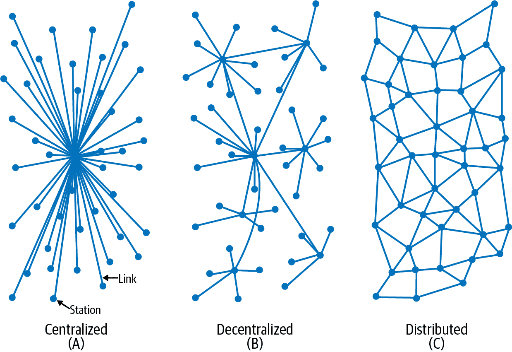
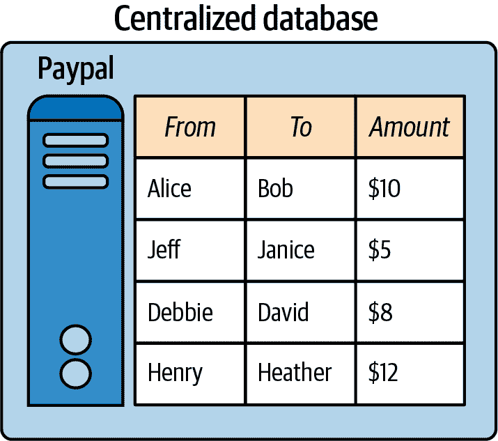
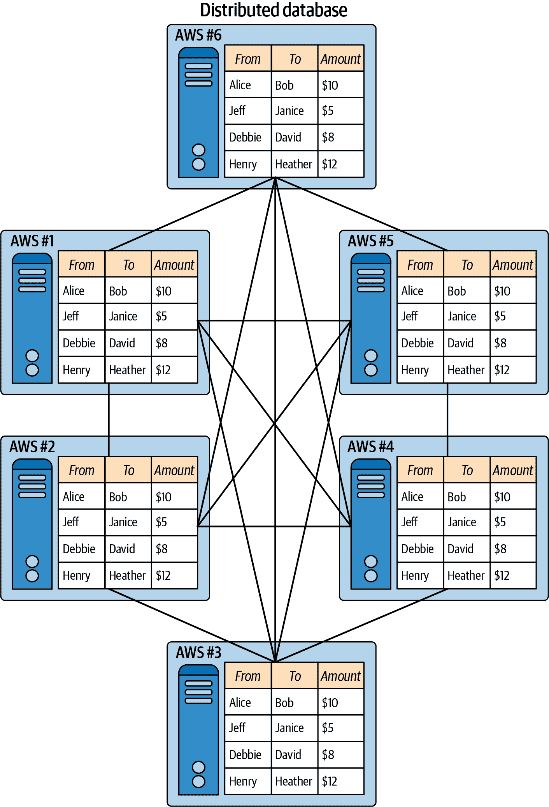
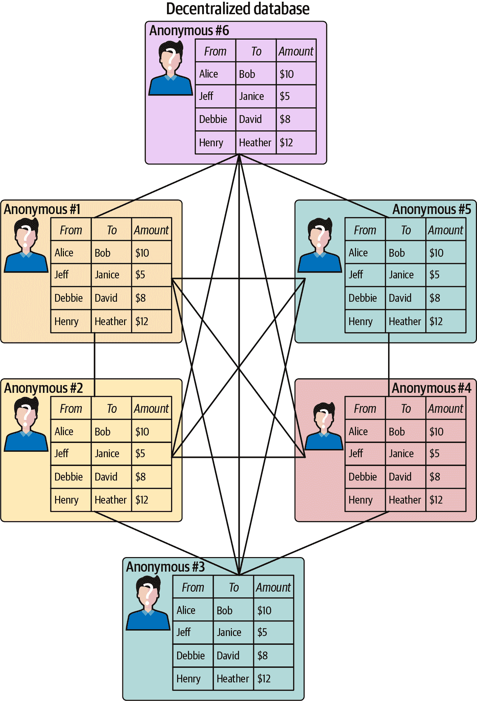
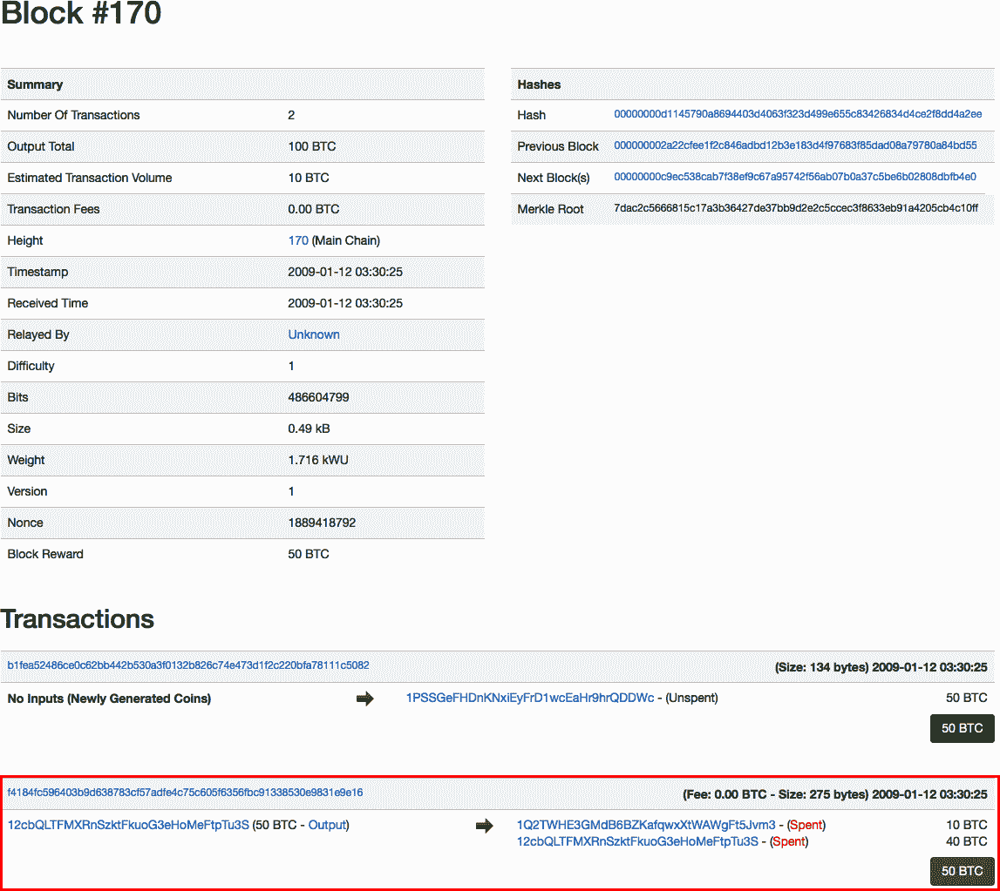
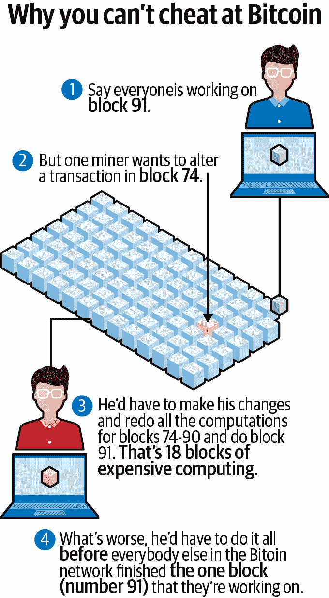
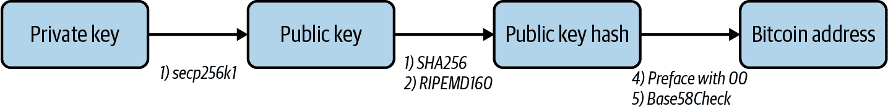

# 第一章。区块链技术的起源

对于未经过培训的人来说，*区块链*这个词听起来可能很神秘，甚至很可怕。其字面意思——*一系列信息块的链——*可能是解释区块链最简单的方式。但它是用来做什么的？为什么任何人都需要一个叫做区块链的东西？

要找到答案，我们需要回顾一下更早的时期，更接近网络开始的时候。互联网是关于向大量人员存储和分发信息。区块链有着类似的目标，并且它建立在先前寻求改进该分发方式的实验基础之上。

# 电子系统和信任

在区块链、加密货币或使用它们的系统成为现实之前，互联网需要以可靠和分布式的方式存在，并且需要被很多人使用。在 20 世纪 60 年代的初期，互联网是一个简单的、相对较小的网络，主要用作大学研究人员和美国政府共享信息的工具。

随着时间的推移，早期的互联网先驱者使系统更加易用。最大的影响来自 TCP/IP 的发展，它建立了一种通信标准，HTTP 使网络浏览成为可能，SMTP 传递了电子邮件。这些*协议*使互联网不仅对研究人员而且对每个人都可以访问，并且在越来越多的设备上，包括计算机以及后来的平板电脑和智能手机上。

互联网的发展已经彻底改变了生活——令人难以置信的大量信息和服务现在都可以在任何人手中轻松获得，其中大部分是免费的。然而，使用大多数在线产品或服务需要一个人或实体，被称为第三方，充当可信的门卫。这些系统需要两种类型的信任：

中间信任

依赖第三方进行理性和公平决策。

发行信任

依赖第三方来确保任何价值的安全性。

金融交易是一个主要领域，信任在这里被依赖，因为大部分货币已经成为了数字化。由于各种原因，使用*法定纸币*或政府发行的实体现金正在下降——人们今天比以往任何时候更多地利用借记卡和信用卡等电子金融工具。在一些国家，比如瑞典，支付系统几乎完全是电子化的，大多数客户[在销售点使用智能手机和卡](https://oreil.ly/sGW0S)。但对于消费者来说，支付界面从实体到数字的转变是一个相对较新的趋势，支持这种账务的系统却早已是电子化的。尽管现金仍然对大多数人来说很方便获取，货币大部分已经从纸币和硬币变成了计算机系统中的数字，很多人甚至都没有注意到。

当价值从物理物品转移到数据库时，参与的多方之间必须有一定程度的信任。世界各地的大型支付公司是基于这样一种理念而成立的，即以数字形式存储价值的人可以信任这些品牌。然而，信任并非一直是金融业的可靠因素。事实上，2008 年的金融危机让人们停下来思考，许多人开始认为，也许对金融机构的盲目信任和信念并不像宣传的那样可靠。

###### 小贴士

区块链是一种重新建立失去信任的努力。它利用技术—具体来说是密码学—来自动化和强制实施对第三方的信任。

比特币是第一个使用区块链的工作系统。但在比特币出现之前，有几个前身试图——但失败了——创建类似的概念。它们失败的一个主要原因是无法在互联网上建立一个真正*分布式*的系统。

# 分布式与集中式与去中心化

如今的互联网是集中化和分布式应用的混合体，尽管它最初是作为一种分布式技术设计的。早期互联网的设计者并不想建立一个具有单一故障点的集中化结构，而是希望创建一个更具弹性的系统。分布式互联网的构想来自于（受军方启发的）目标，即确保如果系统的某一部分受到攻击，只要适当地分布，它仍然能够运作。

在自行车轮上（见图 1-1），许多辐条连接到一个中心轴（轮轴）。这种设计有利于采用分布式方法——如果一些辐条断裂，[轮子仍然可以工作](https://oreil.ly/awSTC)。*分布式*意味着没有单一故障点会导致整个系统崩溃，例如早期互联网的计算机网络。


###### 图 1-1\. 自行车轮具有分布式设计

几十年前设计的早期互联网是分布式的，旨在保护网络免受任何类型的干扰，这个系统至今仍然证明了自己的价值。在更近的时代，像谷歌、Facebook、苹果和亚马逊这样的中心化公司已经在很大程度上[主导了互联网](https://oreil.ly/qrTjl)。有些人希望区块链技术的分布式特性能够帮助减轻这几个强大公司对网络的主导地位，从而给个人用户更多的控制权——这个话题将在本书的后面探讨。

在计算领域，分布式系统是指处理不仅仅在一台计算机上完成的系统。相反，计算是在许多计算资源之间共享的。这些系统使用某种形式的消息进行相互通信。图 1-2 展示了几种不同的[网络设计](https://oreil.ly/l_7Xr)。分布式系统具有去中心化的特征，即单个实体（或*节点*）的失败并不意味着整个网络的失败。共同目标是通过在许多计算机之间分配责任来集体利用处理能力来完成任务。然而，去中心化改变了共同目标和消息传递的概念。在完全去中心化的系统中，给定节点不一定与每个其他节点合作以实现其目标，决策是通过某种形式的共识而不是由单个实体负责。



###### 图 1-2\. 集中式、去中心化和分布式网络设计

图 1-3 到 1-5 以数据库形式展示了集中式、分布式和去中心化系统之间的差异。



###### 图 1-3\. 在像 PayPal 这样的集中式数据库中，所有节点连接到一个由一个实体控制的单个中心节点



###### 图 1-4\. 在分布式数据库中，像托管在 Amazon Web Services (AWS) 上的多个数据库一样，每个节点都可以维护相同数据的复制副本，每个节点都知道其他节点的身份，并且所有节点都由一个实体控制



###### 图 1-5\. 在去中心化数据库中，比如比特币的区块链，每个节点都可以维护相同数据的复制副本，每个节点可能不知道其他节点的身份，并且所有节点都受到许多可能是匿名的实体的控制。

# 比特币前身

互联网的普及性已经具有破坏性，并改变了许多行业。仅举几个例子，过去几十年来，[维基百科](https://www.wikipedia.org)或多或少地取代了百科全书，[Craigslist](https://www.craigslist.org)取代了报纸的分类广告，而[Google 地图](https://www.google.com/maps)则基本上使印刷地图变得过时。

然而，金融行业能够在相当长的时间内抵制互联网的动荡变化。在 2009 年比特币推出之前，对于金钱的控制在用户之间的转变不大，除了从模拟（实物货币和支票簿）转变为数字（电子银行）。由于这种转变，数字货币的概念是一个熟悉的概念，但控制仍然是集中的。

在最终失败之前，尝试了许多比特币之前的概念，但最终目标始终相同：增加财务主权，或者说为用户提供更好的对他们的资金进行控制。回顾一些早期的失败案例可以更清楚地了解比特币日益增长的原因。

## DigiCash

由大卫·沙姆于 1989 年创立，[DigiCash](https://www.chaum.com/ecash)是一家促进在线匿名数字支付的公司。沙姆是[盲签名技术](https://oreil.ly/dNrAn)的发明者，该技术提出使用密码学来保护在线支付的隐私。密码学使用基于加密的数学来隐藏敏感信息，长期以来一直被世界各国政府用作通信工具。第二章稍微详细地介绍了密码学和加密。

DigiCash 平台有自己的货币，称为[*cyberbucks*](https://oreil.ly/Y-qfL)。注册该服务的用户会获得 100 美元的 cyberbucks，通常被称为*代币*或*硬币*。该公司率先使用了安全的微芯片智能卡技术，类似于今天大多数信用卡所采用的系统。它还在[数字钱包存储价值](https://oreil.ly/AWHhW)的概念方面进行了早期创新——在这种情况下，是 cyberbucks。

数家银行，包括德意志银行，试行了 DigiCash 系统。一些商家也注册接受了 cyberbucks，其中包括图书出版商《大英百科全书》。在 1990 年代，互联网上的商业活动非常新颖，由于对欺诈的担忧，大多数人甚至不愿在网上使用信用卡，更别提采用全新类型的支付系统了。然而，许多注重隐私的用户开始使用 cyberbucks，甚至开发了一段时间的邮件列表市场。由于缺乏商家支持，它从未能够获得足够的发展势头，最终在 1998 年[申请破产](https://oreil.ly/JKDS-)。

## 电子黄金

1996 年建立的一种数字价值存储，电子黄金由实际贵金属单位支持。由一家名为 Gold & Silver Reserve 的公司运营，电子黄金在互联网上实现了用户之间的即时转账。平台上的一切都以黄金或其他贵金属单位计价。到 2006 年，电子黄金账户数量已超过 350 万。当时，该公司的日处理量达到了[$5.9 million](https://oreil.ly/5eTLs)。

平台的面值甚至可以小到一万分之一克的黄金，它是第一个在互联网上引入 *微支付* 概念的平台，即在互联网上转移微小价值的概念。当时创新性的 E-gold 还为开发者提供了一个 API，使其他人能够在该平台之上 [创建额外的服务](https://oreil.ly/Bum1H)。商家除了信用卡之外，也接受 E-gold 作为在线购物车中的支付方式。对 [移动支付的支持](https://oreil.ly/X7DeN) 是在 1999 年引入的。

E-gold 在 1990 年代和 2000 年代初期的功能方面技术上是很有创意的。然而，从一开始，该系统就饱受问题困扰，最终导致了它的消亡。作为一个中心化系统，它没有任何机制将账户与任何人的身份联系起来。因此，这个平台被用于不良目的，促进了洗钱、网络诈骗和其他非法活动。美国政府在 2008 年 [关闭了 E-gold](https://oreil.ly/-MBZz)，并没收了它的资产，并为账户持有人建立了一个赎回系统。

## Hashcash

Hashcash 是由 Adam Back 在 1997 年发明的，它引入了使用工作证明来验证数字资金的有效性的概念，包括仅存在于互联网上的货币概念。*工作证明* 意味着计算机需要产生某种可验证的、计算密集型的输出，以使电子货币具有任何价值（第二章 对此进行了更详细的解释）。Hashcash 使用了密码学来实现工作证明，Back 提出 [使用一个叫做 SHA1 的算法](https://oreil.ly/Tdpui) 来实现这一点。

在他对 Hashcash 的最初提议中，巴克参考了 DigiCash，并提出了一个想法，即在数字化货币的电子邮件上添加费用或“邮资”可以减少垃圾邮件。通过利用*哈希*或需要计算机处理的函数，Hashcash 将施加经济成本，从而限制电子邮件系统中的垃圾邮件。对于数字货币，使用哈希的概念将解决所谓的*双重支付问题*，这使得数字单位可以像文件一样被复制，从而被花费多次。毕竟，计算机使得复制文件变得容易；任何人都可以复制图像文件并反复复制。使用哈希的目的是通过工作证明或计算能力来限制数字货币的可能性。

尽管 Hashcash 曾在微软和开源软件提供商 Apache 的电子邮件系统中进行了测试，[但它从未真正起飞](https://oreil.ly/F-8P3)。从概念上讲，Hashcash 是引入互联网货币所需的数字稀缺性的一个很好的例子，但是这种技术本身并不是一个好的数字货币形式。

## B-Money

1998 年，魏戴提出了 B-Money，引入了利用计算机科学来[促进货币创造，摆脱政府系统的束缚](http://www.weidai.com/bmoney.txt)的概念。与 Hashcash 类似，B-Money 建议通过计算或工作证明来生产数字货币。与亚当·巴克相似，魏提出，创造数字货币的成本可以根据用于创建它的计算机功率来计算。这种数字货币将以黄金和其他大宗商品等一篮子实物资产为基础定价，并限制其供应，以保护免受通货膨胀或随时间贬值的影响。

B-Money 推进了将交易广播到网络的想法。例如，如果一方想要支付另一方，就会向网络发送一条消息，内容是：“个人 1 将向个人 2 支付 X 美元。” 这个系统将通过数字合同的方式执行。理论上，这些合同将用于解决任何争议，类似于信用卡公司处理诸如欺诈等问题的方式。该系统将使用加密而不是集中式系统来进行支付和合同问题的执行，使网络用户可以匿名使用；不需要身份验证。

B-Money 的概念将数字现金的多个组成部分整合在一起。它应用了合同的概念，以在匿名和分布式系统中提供秩序。它还引入了使用工作证明来创造货币的概念。然而，B-Money 大部分只是魏的一种理论性探讨。它的目的是探索一种不受控制的货币概念，这种货币概念不能通过控制货币供应来受到通货膨胀的影响。

## 比特黄金

2005 年，计算机科学家尼克·萨博提出的[比特黄金](https://nakamotoinstitute.org/bit-gold)的想法是将珍贵金属的稀缺性引入数字领域。萨博指出，诸如黄金之类的材料虽然具有价值，但由于其稀有性和采矿、运输等固定成本，很难伪造或者非常难以伪造。他想将黄金的价值数字化。

萨博的想法是在 E-gold 问世之后提出的，E-gold 利用黄金支持数字价值。然而，他的设计利用了一种“客户难题函数”类型的工作证明。该系统建议使用在用户计算机上生成的“挑战字符串”，然后“以分布式方式安全地时间戳”。然后，这将提交给“分布式产权登记处”以数字方式提供所有权证明。

和 Szabo 的大部分想法一样，比特黄金主要是一种智力锻炼。Szabo 显然正在构思一种无需信任的 E-gold 版本，名为比特黄金。

# 比特币实验

到了 2008 年，世界已经开始依赖互联网作为大量服务的分布式实体。通过电子地图和 GPS 应用程序，人们寻求互联网帮助他们从 A 点到 B 点。电子邮件、短信、Skype、WhatsApp 和其他通讯应用程序允许几乎即时地与朋友和家人在远近之间建立联系。

此外，人们开始越来越多地在线购买商品和服务，而不是在店内购买。信用卡和借记卡已成为流行的支付方式，同时还有 PayPal 和其他服务。然而，正如前一节中提到的，许多人仍然希望通过互联网以防篡改、分布式的方式传输价值，令人惊讶的是，这种方法仍然没有被设计出来。

## 2008 年金融危机

在 2006 年初，世界经济正在蓬勃发展。这是一个经济增长的时期，但那一年金融系统开始显露裂痕。美国房地产市场首次出现价值下降，因为放贷规则变得如此宽松，许多借款人无法支付他们的义务。

这导致银行陷入困境，因为它们将抵押贷款和其他类型的不稳定贷款切割成私人证券，这些证券在金融机构之间像股票或债券一样进行交易和持有。当许多这些资产被证明是一文不值时，这导致金融系统崩溃，迫使世界各国政府注入资金以拯救全球经济。

在美国，现代房地产泡沫曾通过[联邦储备局提高利率](https://oreil.ly/EV4AF)来控制，正如图 1-6 所示。然而，2008 年的危机无法控制，这可能是因为金融体系缺乏透明度。


###### 图 1-6。联邦储备局提高利率以控制房地产泡沫。

为什么这段金融历史对比特币的讨论有关？因为尽管许多支持比特币的概念和技术在 2008 年已经存在，但在此之前没有人曾将早期电子货币概念的所有要素结合在一起，以创建一个能够实现数字信任和透明度的系统。

## 白皮书

2008 年 8 月 18 日，>域名*bitcoin.org*被注册。随后，由某人或一个使用化名 Satoshi Nakamoto 的团队编写的[白皮书](https://bitcoin.org/bitcoin.pdf)于 2008 年 10 月 31 日发布，并在许多软件开发者邮件列表中共享。题为“比特币：一个点对点的电子现金系统”的文件提供了一个详细的建议，即创建一个仅存在于互联网上的价值系统。目的是创建一种无需与银行或中央政府任何连接就能运行的数字货币，并建立一个更透明的金融系统，可以防止金融危机的灾难性事件再次发生。

比特币提案中包含了许多之前系统中提取的想法。这些包括：

+   安全的数字交易，就像 Nick Szabo 所概述的智能合约。

+   使用密码学来保障交易安全，就像 DigiCash 中所做的那样。

+   理论上能够发送小额安全价值，就像 E-gold 能够做到的那样。

+   在政府系统之外创造货币，就像 B-Money 所提出的那样。

+   使用工作证明来验证数字资金的有效性，就像 Hashcash 设计的那样。

白皮书还向许多人介绍了几个新概念，包括：

双重支付

通过伪   通过伪造的复制使货币单位被花费多次的风险。

工作证明

必须使用计算能力来解决的数学问题。

哈希

生成固定长度的输出，以便可以组织不同大小和顺序的数据。

随机数

随机数被用来确保一个特定的通信只能被使用一次。

## 引入时间戳服务器

除了使用工作证明来保护比特币网络外，中本聪还建议使用时间戳系统来验证交易，类似于文件系统和数据库。将交易期间生成的信息通过哈希算法运行，生成一个固定的数字和字母字符串，称为哈希。对于比特码学中流行的 SHA-256 算法。

这里有一个例子：

```
keccak256("hello") =
1c8aff950685c2ed4bc3174f3472287b56d9517b9c948127319a09a7a36deac8
```

这里再次给出，只有一个小小的改变：

```
keccak256("hello1") =
57c65f1718e8297f4048beff2419e134656b7a856872b27ad77846e395f13ffe
```

当保存大量信息时，使用哈希来存储信息也是关键的。正如在这个例子中所看到的，不同的输入[在进行哈希时输出一个唯一的固定长度字符串](https://oreil.ly/ESWf0)。这使得更容易引用一些通过哈希检索的存储数据片段。

## 在一个区块链中存储数据

在基于铸币的模型中，政府或中央机构使用标准的会计实践来跟踪交易。比特币白皮书引入了使用*签名链*或哈希来跟踪交易的概念。这些按照时间顺序组织成区块。

本方案实质上创建了一种无需任何单一实体跟踪交易的计量单位。相反，区块链使用加密数学信任来跟踪数字系统中的交易。网络不需要复杂的结构，因为它使用点对点系统来验证和发布这些区块链。基本上，它需要一个分布式数据结构来进行*存储*，以及一个构成互联网上*公共网络*的消息系统*协议*。正如 第二章 进一步解释的那样，区块链由多个交易块组成，并且这些块通过哈希相互连接。尽管互联网上有许多区块链可供免费使用，但一些区块链不是公共的——特别是一些商业环境中使用的区块链，如 第九章 中进一步详细描述的那样。

比特币试图解决的挑战在于：如何让不相互认识、不信任彼此的多个参与方合作？维护一个全局账本，让他们都同意哪些交易是有效的并应该处理，这是比特币对这一挑战的解决方案。比特币区块链是所有比特币网络参与方都同意是有效和准确的全局账本。意见不一致可能导致链的分叉和新根的创建，这是 第三章 中详细讨论的主题。

###### 注意

在支付网络中，*账本* 是一个不断变化的文件。每当有人想要发送交易时，就会向账本添加一行新的数据。在比特币中，大约每 10 分钟会向所定义的账本中添加一个新的交易块。

每个比特币块的重要属性如下：

块哈希

区块的唯一标识符。区块哈希是由提供区块链当前状态快照的输入数据生成的，该快照包含 256 位数据。这个快照就像整个比特币区块链的技术版本的资产负债表。比特币区块不包含自己的区块哈希，但它包含正在构建的上一个区块的哈希，这就是使区块*链式*的原因。区块哈希可以通过对区块头进行哈希运算来找到。

Coinbase 交易

这是网络上每个新挖掘的区块的第一笔交易。它向供应中添加新的比特币，这些比特币作为奖励赠送给将区块添加到链中的矿工。矿工在 第二章 中进一步讨论。

区块高度编号

这个数字标识着当前区块与链中第一个区块（也称为*创世区块*）之间有多少个区块。

Merkle 根

这是一个允许验证区块链有效性的哈希（第二章 更多地讨论了 Merkle 根）。

###### 注意

区块链系统的名称通常作为专有名词使用，而其记账单位则是常规名词。因此，*加密货币网络*大写（“爱丽丝喜欢比特币的去中心化方面”），但*加密货币记账单位*小写（“爱丽丝向鲍勃发送了两个比特币”）。

图 1-7 展示了一个比特币区块。



###### 图 1-7\. 比特币区块 #170，记录了从中本聪发送给开发者和早期区块链先驱 Hal Finney 的 10 BTC 交易

图 1-8 说明了改变过去交易将会很困难的原因。



###### 图 1-8\. 为什么回滚比特币交易很困难

# 将比特币带入生活

最初在 2008 年白皮书中概述的比特币概念集结了密码学、隐私和分布式计算技术，重新思考了金融平台。然而，仍有很多工作需要做才能将这些想法变为现实。幸运的是，一些致力于开源软件和比特币理念的计算机程序员相信它的潜力。将网络带入现实是下一项任务，这需要一些早期先驱的努力。

## 令人信服的组件

*开源*软件意味着它不是专有的—任何开发者都可以查看源代码并对其进行修改。除了开源之外，像比特币这样的加密货币网络具有[使其独特吸引人的三个主要组成部分](https://oreil.ly/h6Nsf)：

价值

一种记账单位，称为比特币（通常表示为 BTC），用于记录账本上的交易，也被称为比特币区块链。

分配

正如比特币白皮书所述，比特币网络使用分散的节点来维护交易记录。

共识

比特币网络中的矿工们利用工作证明共同维护这一分布式交易记录的安全和稳定性。

这四个组成部分共同使比特币特别吸引了一小群坚定的开发者，他们被激励着共同努力创建互联网上价值存储的坚固而安全的模型。虽然不是没有缺陷，但比特币被认为是在实现完全数字化和分布式价值存储方面迈出了一大步。

## 达成共识

在 2009 年 1 月 3 日，中本聪（Satoshi Nakamoto）通过利用处理能力创建了最初的 50 个比特币，从而挖掘了第一个比特币区块。这个被称为*创世区块*的第一个区块在比特币区块链中将金融危机作为使网络活跃起来的目的。在 coinbase（或交易内容输入）中，[创世区块包含以下信息](https://oreil.ly/msgF7)：

```
The Times 03/Jan/2009 Chancellor on brink of second bailout for banks
```

比特币是一个分布式网络，这意味着需要人们来充当系统中的矿工。所以，中本聪制作了第一个比特币客户端。运行该客户端允许用户运行节点并挖掘比特币区块。中本聪在[发布该软件的消息](https://oreil.ly/2Kquz)中写道：“如果你能保持一个接受传入连接的节点运行，你将真正地帮助到了网络。”该消息标题为“比特币 v0.1 发布 - P2P 电子现金”。

区块链是一个活生生的、不断更新的文档。随着时间的推移，越来越多的交易被添加进去。像 PayPal 这样的中心化支付网络的用户相信中央机构会随着时间的推移更新其账本以包含新的交易。但是在比特币这样的去中心化支付网络中，没有中央机构——只有成千上万的匿名矿工在推动网络。

那么用户应该信任谁来更新比特币的区块链以及新的交易块呢？获得这种信任被称为*达成共识*。这是网络中所有矿工用于以下两个目的的过程：

区块发现

就哪个矿工有权添加一个交易块达成一致。

交易验证

同意新块中包含的交易是合法的。

用于加密货币的大多数区块链都采用以下两种方法之一来达成共识（第二章详细介绍了这些）：

+   工作量证明

+   股权证明

企业区块链使用其他共识方法，这些在第九章中有所讨论。

### 公钥/私钥加密

比特币使用公钥/私钥加密来证明交易的有效性。比特币中的*私钥*用于数字签名比特币交易，这是比特币地址的所有者向网络证明他们是该地址的合法所有者的方式。私钥授权交易。它们是保密的，就像密码一样。

*比特币中的公钥*仅用于生成比特币地址。地址实际上是公钥的压缩版本，使其稍微容易阅读。比特币地址是一个可以与任何人公开共享的值，通常用于请求某人发送比特币时。这种方式，它有点像电子邮件地址。

### 生成密钥

私钥是一个随机选择的 256 位数。私钥几乎总是以十六进制格式显示。私钥是由计算机生成的 - 大多数编程语言都有一个随机生成数字的函数。

一个私钥可以与公钥配对，以在比特币网络上进行交易。没有私钥，按设计，几乎不可能这样做（有关详细信息，请参见第二章）。在密码学中，可以通过运行私钥通过椭圆曲线数字签名算法（ECDSA）secp256k1 函数来生成公钥。然后通过运行公钥通过密码 SHA256 和 RIPEMD160 函数来生成公钥哈希。比特币地址是通过首先将 00 添加到公钥哈希，然后运行该值通过 Base58Check 函数生成的。图 1-9 展示了这个过程。



###### 图 1-9\. 从私钥生成比特币地址的过程

有些人使用具有生成地址选项的比特币客户端，遵循某些[规则](https://en.bitcoin.it/wiki/Address)：

+   以 1、3 或 bc1 开头

+   字符串的其余部分长在 25-34 个字符之间

+   有效字符包括 0–9、A–Z 和 a–z。

+   大多数地址不包括 l（小写的 L）、I（大写的 i）、O（大写的 o）或 0（零），以防止视觉上的歧义。

另一种选择是使用[*https://www.bitaddress.org*](https://www.bitaddress.org)，这是一个基于用户鼠标移动生成地址随机性的网站；然而，用户必须相信该网站的所有者不会记录他们的私钥。大多数人通过像 Coinbase 这样的交易所生成新的比特币地址，它们会使用其内部软件为他们生成地址。

### 生成交易

比特币交易遵循一种称为 UTXO 的独特会计类型，代表*未花费的交易输出*。交易基本上是输入列表和输出列表。每个输入标识一个比特币地址，该地址充当资金来源，以及该地址过去接收到的未花费交易。它还包含一个数字签名，证明该地址的所有者已授权该交易。每个输出标识接收资金的比特币地址和该地址将收到的金额。

我们将在下一章讨论比特币交易的结构，并更详细地介绍所有这些概念。

## 早期的漏洞

作为一种新的协议，比特币在早期并非没有问题。它不容易使用，所以没有很多人下载比特币客户端。比特币最早的支持者之一是那些已经提出了它使用的一些概念的人。他们包括提出 B-Money 的 Wei Dai，以及提出比特币黄金概念并导致大量交易安全方面开发的 Nick Szabo。另一个早期的比特币支持者是 Hal Finney，他收到了来自中本聪的第一笔比特币交易。

比特币存在不到两年，就发现了一个重大的安全漏洞。2010 年 8 月 6 日，社区成员注意到了一个异常巨大的输出交易，并在一个热门留言板上[发帖](https://oreil.ly/qXQZ8)。开发者 Jeff Garzik 写道：“在这个区块#74638 中，‘value out’非常奇怪，”似乎有人企图凭空创造 91,979,000,000 美元。例 1-1 展示了这笔交易。

##### 例 1-1\. 一笔异常巨大的比特币交易

```
CBlock(hash=0000000000790ab3, ver=1, hashPrevBlock=0000000000606865, hashMerkleR
oot=618eba, nTime=1281891957, nBits=1c00800e, nNonce=28192719, vtx=2)
  CTransaction(hash=012cd8, ver=1, vin.size=1, vout.size=1, nLockTime=0)
    CTxIn(COutPoint(000000, -1), coinbase 040e80001c028f00)
    CTxOut(nValue=50.51000000, scriptPubKey=0x4F4BA55D1580F8C3A8A2C7)
  CTransaction(hash=1d5e51, ver=1, vin.size=1, vout.size=2, nLockTime=0)
    CTxIn(COutPoint(237fe8, 0), scriptSig=0xA87C02384E1F184B79C6AC)
    CTxOut(nValue=92233720368.54275808, scriptPubKey=OP_DUP OP_HASH160 0xB7A7)
    CTxOut(nValue=92233720368.54275808, scriptPubKey=OP_DUP OP_HASH160 0x1512)
  vMerkleTree: 012cd8 1d5e51 618eba

```

随后漏洞得到了修补，区块链被“分叉”以分离链（有关分叉的更多信息，请参见第三章）。分叉是为了确保区块链不反映错误交易。直到今天，2010 年发现的漏洞仍然是比特币历史上最大的安全漏洞，这是加密货币社区日益壮大的证明。

## 采用

比特币天使**中本聪**的消失往往被认为有助于使比特币成为一个完全去中心化的实体。这是因为创造者不再是系统的一部分，不同于以太坊和其他区块链，它们倾向于遵循其创造者和有效领导者的方向。

或许这个时候中本聪的消失是一种巧合。比特币当时正在取得一些真正的进展。社区在稳步增长。计算机科学家 Gavin Andresen，在中本聪离开后最终承担了主导角色，并创立了一个“比特币水龙头”，希望通过赠送少量的 BTC 来增加采用率。安德森向中央情报局(CIA)做了一份关于比特币的介绍，并成为现已不存在的比特币基金会的首席科学家，这是一个早期致力于加密货币的非营利组织。

2010 年 5 月 22 日，程序员 Laszlo Hanyecz 被认为是使用比特币进行商品或服务交易的第一人。他支付了 10,000 个 BTC（当时约价值 25 美元）以换取两块披萨的送货。这个日期在社区中被庆祝为比特币披萨日。

2010 年 7 月，Mt. Gox，最初是由开发者 Jed McCaleb 为交换*魔术：聚会*交易卡创建的平台，[开始提供比特币交易](https://oreil.ly/9kS54)。比特币兑换传统货币的概念开始获得动力，引发了投机行为和随后的价格上涨。

# 概要

比特币对区块链技术的诞生至关重要。然而，它所基于的技术概念和其增长并非凭空而来，也不是一夜之间发生的。大多数伟大的想法并非在真空中产生。比特币显然不是，区块链也不是。

比特币当前的成熟水平依赖于许多开发者花费数十年时间构建的技术，这种集体努力使得区块链技术得以发展到今天的地步。比特币的开源性质和围绕它发展起来的社区也支持了它的早期采用。加密货币的基本方面源自比特币——我们将在下一章中探讨这些方面。
