# 第二章. 加密货币基础知识

像许多新兴技术一样，加密货币引发了一种新的思考方式——在这种情况下，是关于金融。因此，人们正在考虑新的存储价值的方式。加密货币与法定货币、股票和债券以及黄金等贵重资产有一些相似之处。但是，获取、转移和存储加密货币（或简称为“加密货币”）的方法与其他资产大不相同。

###### 注意

在加密货币中，涉及到安全性和价值的发送/接收方面有很大的区别。在这些系统中可能会丧失资金而无法追索。

使用加密货币可能会让人感到困惑，因为它引入了许多新术语，即使是传统金融领域的人们也经常不熟悉。尽管如今有许多服务可以使加密货币的基本原理对消费者更加容易理解，但了解加密货币系统运作的基础知识至少对于理解这些新系统的不同之处是有帮助的。本章将介绍一些基本术语和流程，为您理解本书的其他内容做好准备。

###### 注意

虽然这里的例子主要使用比特币，但大多数概念也适用于其他加密货币。以太坊引入了一些新的思想，在第四章中进行了介绍。

# 加密货币系统中的公钥和私钥

密码学或加密的使用可以追溯到数千年前。其主要用途是保护信息。直到二十世纪， rudimentary cryptography 所需的一切都只是一种书写工具和一些可以书写的东西，这可以用来创建 rudimentary codes。在现代，机械和随后的计算机的使用推动了加密的应用。例如，盟军最终成功破译并解密二战中的德国密码有助于结束了那场冲突。

现代密码学在 1970 年代之前主要由政府使用。是 *公钥* 或 *不对称* 加密的发明使得它的使用变得更加普遍，同时计算机网络的日益普及也起到了作用。公钥密码学允许任何人轻松地使用接收者的 *公钥* 加密消息，该公钥对任何人都可用；然后可以使用接收者的 *私钥* 解密消息，希望只有接收者知道。

密码学已经成为支撑互联网的主要系统的关键。这包括支撑像比特币这样的加密货币的基础。例如，注册托管的比特币钱包会生成一个公钥和一个私钥，以及一个比特币地址（我们将在“Custody: Who Holds the Keys”中更多地讨论钱包）。比特币地址是公钥的翻译，也是可以接收资金并从中发送到其他地址的钱包的身份。这个地址可以与任何人分享以进行接收和发送，有点像用户名或电子邮件地址。私钥保密并用于解锁存储的加密货币，有点像您使用密码访问银行账户的方式。以下是它们的一个示例：

| 私钥 | Kyc9JCPPKNPrMUopkCc7ng9PU5Bp9SGsjVkh8Hpfx4tCr5LGXgBf |
| --- | --- |
| 公钥 | 033b368bfccf5921f8a5a42b81b0f5ecdc66583fac8dc13bcf860cf31290964c64 |
| 比特币地址 | 19PacjCFSSt9guX4zZ3GPpXpDrvDNQ7DC4 |

正如前一章所述，比特币私钥用于数字签名交易。这就是比特币地址的所有者向比特币网络证明他们是该地址的合法所有者，并授权交易的方式。在现实世界中，银行卡用户走到自动取款机旁，插入他们的卡片，输入他们的个人识别码（PIN）。这个 PIN 是私密的——只有用户知道它。对于 ATM 网络来说，有效的 PIN 表示 ATM 用户已经“签署”了一笔交易。

比特币公钥仅用于生成比特币地址。这个地址实质上是公钥的一个压缩版本，使其更容易阅读。比特币地址可以向任何人公开共享，通常在要求某人向该地址发送比特币时这样做。

比特币中的私钥是由随机生成器创建的随机 256 位数字。私钥以十六进制格式显示。一旦用户拥有了私钥，它就可以与公钥配对以解锁比特币地址。一切都从私钥开始。从这个私钥，用户可以生成一个公钥和比特币地址。作为提醒，图 2-1 说明了生成比特币地址的过程，以及在每个步骤中使用了哪些加密算法。


###### 图 2-1\. 从私钥找到比特币地址的过程

如您所见，公钥是通过将私钥运行通过[ECDSA secp256k1 函数](https://oreil.ly/UrWtL)来生成的。公钥哈希是通过将公钥运行通过 SHA256 和 RIPEMD160 函数生成的。比特币地址是通过首先向公钥哈希添加 00，然后将该值运行通过[Base58Check 函数](https://oreil.ly/bJSdN)来生成的。

# UTXO 模型

比特币交易遵循一种称为*未花费交易输出*（UTXO）的独特会计类型。比特币交易本质上是一系列输入和一系列输出。每个*输入*标识提供资金的比特币地址，以及该地址过去收到的未花费交易。同样，每个*输出*代表接收资金的比特币地址以及该地址收到的金额。输入和输出之间的差额是*交易费*，将由比特币矿工赚取。每个输入还包含数字签名，证明该比特币地址的所有者授权该交易。图 2-2 显示了比特币交易的示例。

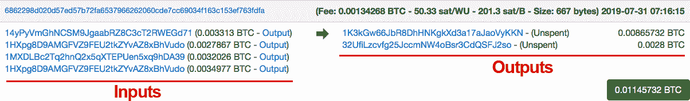

###### 图 2-2\. 一个示例交易，以及在比特币区块浏览器中的显示

在这个示例中，有四个输入。其中两个输入来自同一个地址（*1HXpg8D9AMGFVZ9FEU2tkZYvAZ8xBhVudo*）。但是，这两个输入代表该地址过去收到的两笔不同的交易，一笔为 0.0027867 BTC，另一笔为 0.0034977 BTC。其他输入代表地址*14yPyVmGhNCSM9JgaabRZ8C3cT2RWEGd71*和*1MXDLBc2Tq2hnQ2x5qXTEPUen5xq9hDA39*过去收到的交易。

在本例中，输入总额为 0.0128 BTC，输出总额为 0.01145732 BTC。两者之间的差额为 0.00134268 BTC，支付给将该交易添加到区块链中的矿工（称为“挖矿”一个区块）。交易的创建者支付此费用，以激励矿工在内存池中包含此交易，而不是其他等待确认的交易。我们将在本章后面更多地讨论所有这些概念，但首先让我们看看比特币交易的结构。这里是一个[示例](https://oreil.ly/lSJjm)原始交易：

```
01000000017967a5185e907a25225574544c31f7b059c1a191d65b53dcc1554d339c4f9efc0100000
06a47304402206a2eb16b7b92051d0fa38c133e67684ed064effada1d7f925c842da401d4f2270220
1f196b10e6e4b4a9fff948e5c5d71ec5da53e90529c8dbd122bff2b1d21dc8a90121039b7bcd0824b
9a9164f7ba098408e63e5b7e3cf90835cceb19868f54f8961a825ffffffff014baf21000000000019
76a914db4d1141d0048b1ed15839d0b7a4c488cd368b0e88ac00000000
```

这些字段在 表 2-1 中描述。

表 2-1\. 比特币交易解剖

| **字段** | **描述** |
| --- | --- |
| 版本号 | 4 字节。标识生成交易的节点所使用的协议版本（目前为 1）。 |
| 标志 | 如果标志存在，显示值为 0001，则节点正在使用隔离见证（SegWit），从交易中移除签名信息。 |
| 输入计数器 | 输入数量。 |
| 输入列表 | 输入数据列表。 |
| 输出计数器 | 输出数量。 |
| 输出列表 | 输出数据列表。 |
| 证人 | 如果使用隔离见证（SegWit），则此字段显示证人列表。 |
| 锁定时间 | 4 字节。如果此字段不为空，则表示交易可被加入区块链的最早时间，由网络确定。此字段可以表示为区块高度或类似 Unix 时间戳的形式。 |

# 交易

在加密货币中，*交易*代表了价值从一个地址到另一个地址的转移。发布在区块链上的交易被称为*已确认*。资金的控制转移需要使用私钥对交易进行签名。然后接收方使用相应的公钥来验证签名并验证交易。在大多数加密货币中，用户还必须向网络支付一小笔费用，以便交易顺利进行。这笔费用通常归属于发现包含该交易的区块的矿工，旨在激励发布区块的矿工继续维护网络安全。在线工具，如[比特币费用估算器和计算器](https://bitcoinfees.info)，可以帮助您预测应在交易中包含多大的费用，以在期望的时间内将其记录在区块链上（见图 2-3）。

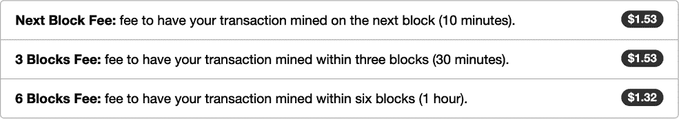

###### 图 2-3\. 估算将交易包含在区块链中所需的费用

比特币交易费用可能会根据网络容量、确认所需的速度以及其他因素而变化。由于区块中记录的交易数量有限——当前限制为 1 MB 的数据，或大约每个区块 3,500 笔交易——因此可能需要更高的费用来加速处理。实际上，这是一个竞争，目的是让矿工确认交易：更高的费用意味着更快的确认。图 2-4 说明了执行比特币交易所涉及的[事件系列](http://learnmeabitcoin.com)。

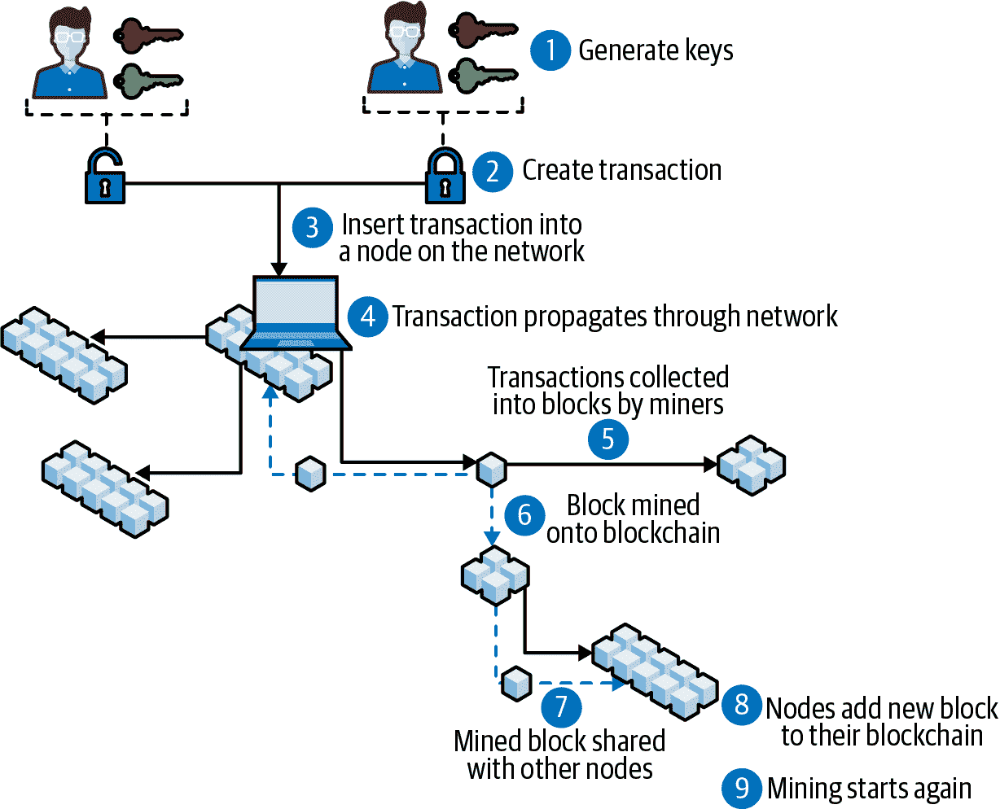

###### 图 2-4\. 执行比特币交易所涉及的事件系列——“区块挖掘到区块链上”指的是矿工将新区块添加到待网络确认的区块链

## 默克尔根

*默克尔根*用于展示当前区块中所有交易状态的快照，仅存储在 256 位中。其名称源自计算机科学家 Ralph Merkle，他提出了 *默克尔树*，这是数字签名数据结构。默克尔根除了捕获交易快照之外还有一个特殊目的。当网络中的节点想要确保它与每个其他节点具有完全相同的交易列表时，它不需要逐个比较每个交易。相反，它只需要将其默克尔根与每个其他节点的默克尔根进行比较。这允许构建轻量级软件客户端，无需存储整个区块链即可验证其自己的交易。

计算默克尔根时，首先创建一个默克尔树，其中叶子节点是当前区块中的交易。图 2-5 展示了默克尔树的结构。

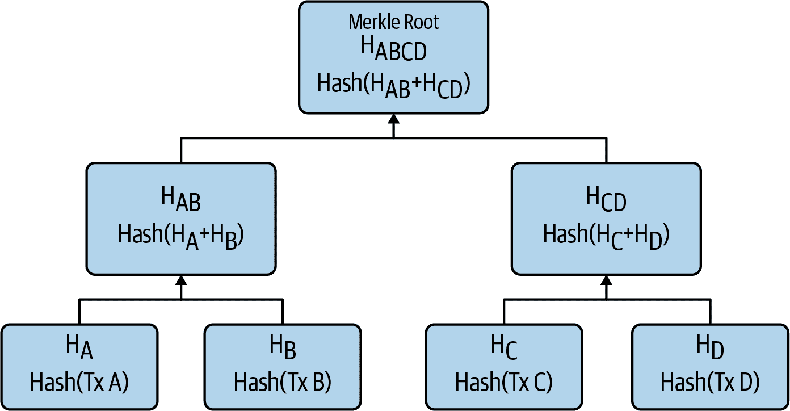

###### 图 2-5\. 示例默克尔树的流程图

H[A] 是第一笔交易的交易 (tx) 哈希，H[B] 是第二笔交易的 tx 哈希，以此类推（我们将在 “哈希” 中更多地讨论密码哈希）。H[AB] 是 H[A] + H[B] 的哈希 *=> H[A+B] = SHA256( SHA256 (H[A] + H[B]))*。

###### 注意

Bitcoin 的哈希函数是双 SHA-256。

通过向上移动 Merkle 树并生成所有叶子的哈希，最终到达 Merkle 根（是的，Merkle 树是一棵倒置的树）。如果交易数量为奇数，则最后一个交易将被复制以继续此过程。Merkle 根是一个重要的值，有助于生成区块哈希（参见 “区块哈希”）。

图 2-6 显示了样本区块生成的 Merkle 根，而 图 2-7 显示了此 Merkle 树的流程图。

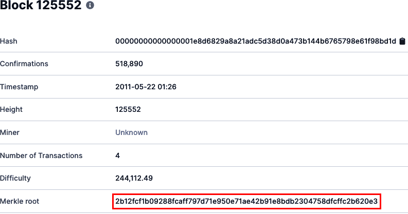

###### 图 2-6\. Bitcoin 区块 #125552 概览

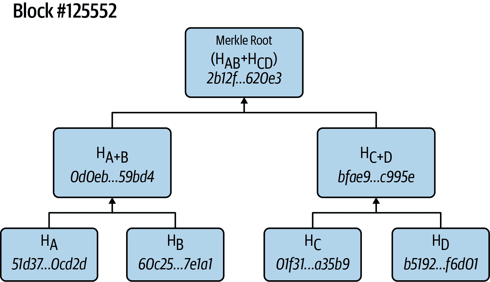

###### 图 2-7\. 示例 Merkle 树的流程图

这是我们为这个示例得到 Merkle 根的过程：

这是第一笔交易的交易哈希：

```
HA = 51d37bdd871c9e1f4d5541be67a6ab625e32028744d7d4609d0c37747b40cd2d

```

这是第二笔交易的交易哈希：

```
HB = 60c25dda8d41f8d3d7d5c6249e2ea1b05a25bf7ae2ad6d904b512b31f997e1a1

```

这是第三笔交易的交易哈希：

```
HC = 01f314cdd8566d3e5dbdd97de2d9fbfbfd6873e916a00d48758282cbb81a45b9

```

这是第四笔交易的交易哈希：

```
HD = b519286a1040da6ad83c783eb2872659eaf57b1bec088e614776ffe7dc8f6d01

```

因此：

```
HA+B = 0d0eb1b4c4b49fd27d100e9cce555d4110594661b1b8ac05a4b8879c84959bd4
HC+D = bfae954bdb9653ceba3721e85a122fba3a585c5762b5ca5abe117b30c36c995e
HA+B + HC+D = Merkle root = 
  2b12fcf1b09288fcaff797d71e950e71ae42b91e8bdb2304758dfcffc2b620e3

```

这里的重要信息是，Merkle 根可以用于快速检测区块链节点中的篡改。如果在任何给定节点的区块链上发生了任何篡改或交易损坏，其 Merkle 根哈希将不再与其他节点的相匹配。

## 签名和验证交易

每个交易输入都包含一个签名，提供了证明发送地址的所有者已经授权该交易的证据。签名是使用 ECDSA 生成和加密的，这是一个密码算法，它将私钥和交易数据作为输入，如 图 2-8 所示。

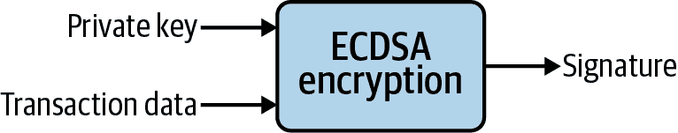

###### 图 2-8\. 生成交易签名的加密过程

当所有节点都在验证交易时，它们可以通过使用 ECDSA 验证函数轻松验证签名的有效性，如图 2-9 所示。

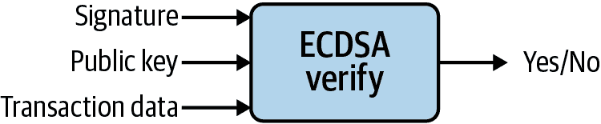

###### 图 2-9\. 验证交易上的签名

重要的是，不需要私钥来检查授权交易的数字签名是否有效。因此，所有节点都可以使用公共信息轻松验证交易，但他们无法生成签名，因为需要私钥。

## Coinbase 交易

每个区块记录的第一笔交易称为*coinbase*交易。它由两个值组成：

区块奖励

这是矿工从网络中收到的奖励，用于发现一个区块并为比特币网络提供处理能力。奖励以新比特币的形式增加到世界供应中。

交易费

这是包括在每个添加到当前区块的交易中的所有交易费的总和。通常有更多交易等待处理而无法适应一个区块，从而产生了交易费用的市场。矿工希望交易快速处理的程度越高，费用就越高。 [比特币费用](https://bitcoinfees.net) 网站显示当前平均交易费用。

Coinbase 交易仅有一个输入，称为 coinbase，它为空白。它还具有一些其他特殊属性——例如，上一笔交易是 32 字节的 0，并且脚本签名允许包含矿工可以选择的任意数据，例如 nonce 头溢出（见“挖矿过程”）。

图 2-10 显示了比特币区块浏览器中一个 coinbase 交易的示例。

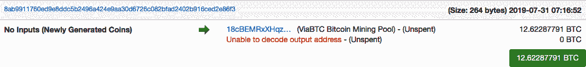

###### 图 2-10\. coinbase 交易示例

## 比特币交易安全性

比特币交易是*推送*交易，这意味着发送方——将资金从其控制的账户推出的一方——发起交易。相反，*拉取*交易是由接收方发起的。一个例子是信用卡交易：在这种情况下，接收资金的商家发起交易。

拉取交易的安全性明显较低，因为它们要求发送方与接收方共享其账户详情。为了弥补这一弱点，拉取支付网络（如 Visa）提供*返还权*，或者争议交易并要求退款*。*

作为推送交易，比特币交易更加安全。当发起交易时，发送方无需透露任何账户信息。欺诈交易唯一可能发生的方式是未经授权的人获取了某人的私钥副本。

###### 注意

未经授权的人获取私钥的最常见方式是侵入不安全的服务器或数据库。

在当今可用的技术下，被认为是不可能猜测或反向工程某人的私钥。唯一猜测私钥的方式是通过*穷举法*——尝试每一个可能的组合。

私钥是一个 256 位数字，这意味着有 2²⁵⁶ 个潜在的组合可供尝试：

+   2²⁵⁶ = 1.15⁷⁷ = 4 billion⁸

2020 年比特币网络的综合总功率超过了世界上任何一台超级计算机的总功率。目前，比特币的哈希率——估计所有尝试解决任何给定区块的矿工所生成的哈希数量——为每秒 90 艾哈希。这相当于 pow(2,128)/(90000000000000000000*3600*24*365)=119,892,034,120 每年。（使用 pow(2,128)的原因是因为 ECDSA，生成比特币私钥的加密算法，可以按比例破解密钥大小的平方根。）

因此，如果您利用比特币网络中所有矿工的处理能力，他们需要这么长时间才能穷尽每个组合：

+   4,589,678,828,851³⁷ 年

常用的暴力破解攻击是用来入侵计算机系统的，攻击者尝试大量可能的用户密码。比特币私钥对暴力破解攻击具有抵抗力，因为有很多可能的组合可供尝试。

# 哈希

一个*加密哈希*是一个将任何形式的数据加密为固定大小字符串的函数。哈希具有以下属性，使其对区块链具有吸引力：

+   无论输入是什么，生成的哈希始终是固定长度。例如，SHA-256 生成的哈希始终是 256 位长。

+   一个哈希是单向加密的，这意味着很容易加密数据。

+   相反，要将哈希解密回原始输入数据是极其困难的，如果不是不可能的话。除了通过暴力破解，也就是尝试每种可能的输入数据组合，并查看生成的哈希是否与有效哈希匹配之外，没有私钥解密哈希的唯一方法。

+   一个哈希是*deterministic*。这意味着每次输入相同的数据时，生成的哈希值都是相同的。稍后可以轻松地使用相同的输入重新创建哈希，并将其与原始哈希进行比较，以查看是否发生了任何篡改或数据损坏。

+   输入数据的任何轻微变化都会使得生成的哈希看起来非常不同。这增加了解密哈希的难度。

+   加密哈希是*抗碰撞*的。极不可能找到两个不同的输入值产生相同的哈希值。这意味着每个唯一的输入都将有一个唯一的输出。

有许多不同的加密哈希算法。最常见的两种是：

+   *SHA-256*，比特币常用

+   *Keccak-256*，以太坊常用

哈希的一个常见用例是安全网站在其数据库中存储您密码的哈希。假设您在网站*[www.store.com](http://www.store.com)*的密码是*FNj`{:;`k#F43rQ\*。

为了额外的保护，网站的数据库不会存储密码，而是密码的哈希值。如果网站使用哈希函数 SHA-256，存储在数据库中的结果字符串将是：

```
SHA-256("FNj`{:;`k#F43rQ\") =
6586BC035202DFF98A67B814ACA615E613CBBFAE8FFA8F4A475DA0FAEF079C9D
```

那么，当您登录时，网站只需通过比较您输入的字符串的哈希与其数据库中存储的哈希来验证输入的密码。这个过程使网站更加安全，因为如果黑客入侵了数据库，他们只能获得客户密码的哈希值。

## 区块哈希

*区块哈希*是整个区块链在该区块创建时的快照。在会计术语中，它就像是整个网络的资产负债表。网络中的每个节点都参考区块哈希来验证其对网络的视图是否与其他人完全相同（见图 2-11）。如果节点的账本中甚至有一点点差异，它的哈希值就会看起来非常不同。这就是使区块链具有*防篡改性*的原因；如果内容受到篡改或损坏，生成的哈希值将不再相同。

例如，在图 2-11 中，匿名者＃4 的区块哈希与其他每个节点的区块哈希都不同——这意味着该节点对网络的视图是错误的。验证区块哈希比每个节点检查每个其他节点的交易历史的过程要快得多。

比特币区块哈希是使用双 SHA-256 哈希函数对 `Block_Header` 进行生成的：

```
SHA256( SHA256( Block_Header ) )
```

`Block_Header` 由表 2-2 中显示的数据组成。

表 2-2\. 比特币区块的解剖

| **字段** | **描述** | **大小（字节）** |
| --- | --- | --- |
| 版本 | 区块版本号 | 4 |
| `hashPrevBlock` | 前一个区块头的 256 位哈希 | 32 |
| `hashMerkleRoot` | 基于当前区块中所有交易的 256 位哈希 | 32 |
| 时间 | 当前[区块时间戳](https://en.bitcoin.it/wiki/Block_timestamp)自 1970-01-01T00:00 UTC 以秒计 | 4 |
| 位 | 当前[目标](https://en.bitcoin.it/wiki/Target)的紧凑格式 | 4 |
| 随机数 | 32 位数字（从 0 开始） | 4 |

`Block_Header` 中最重要的两个字段是 `hashPrevBlock`，它提供了比特币网络在前一个区块中的快照，以及 `hashMerkleRoot`，当前区块中包含的所有交易的快照。

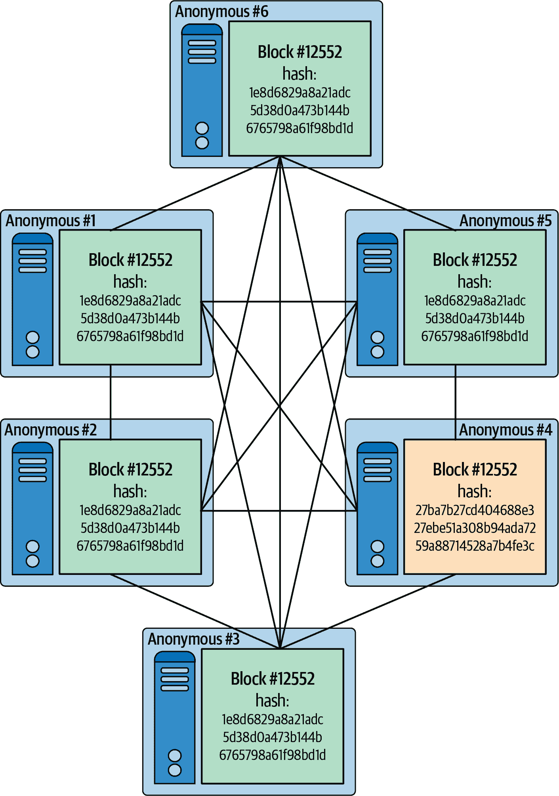

###### 图 2-11\. 网络中的所有节点通过具有相同的区块哈希来维护对网络状态的相同视图

在生成新的区块哈希时包括前一个区块哈希，确保每个区块都与前一个区块连接在一起，如图 2-12 所示——因此得名*区块链*。

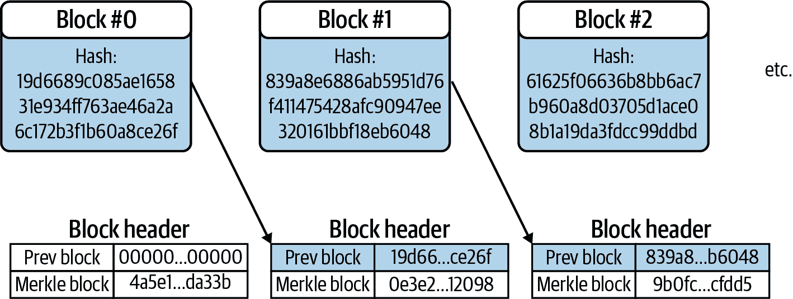

###### 图 2-12\. 区块哈希将连续的区块连接在一起形成一个大链

# 管理：谁持有密钥

在金融服务中，托管是指持有、移动和保护资产的能力。了解支持托管的概念是个好主意，因为有许多不同的方式可以存储加密资产。

## 钱包类型：托管与非托管

与人们通常将现金和信用卡存放在折叠的皮革制品中一样，加密货币存储在被称为*钱包*的东西中。然而，在这种情况下，它实际上只是一个用于存储加密密钥并保持其安全性的接口；加密货币本身并不实际存在于任何设备上，钱包仅用于存储与之关联的密钥。许多人说加密货币和区块链是“由数学保护的”，这就是他们所说的内容。

一般来说，加密货币钱包有两种类型：托管和非托管。*托管*钱包由受信任的实体控制，用户通常通过网页界面访问其内容。这些网站为用户存储私钥；这样，用户就不必担心私钥的安全问题。

交易所是托管钱包的常见例子——它们在账户中持有您的加密货币，并拥有并控制密钥。一个常见的例子是[Coinbase](https://www.coinbase.com)，该公司成立于 2012 年，是市场上最古老和最大的托管钱包提供商之一。

这种安排的明显缺点是，如果交易所破产或带着资金跑路，用户无能为力，因为他们不直接拥有或控制密钥。因此，信任是一个重要问题：用户必须信任服务来保护他们的密钥并负责任地行事。

*非托管*钱包给用户完全控制密钥。然而，这里也有一个缺点。用户完全负责其私钥的安全。如果他们丢失了私钥，那可能导致完全无法访问他们的资金。成立于 2011 年的[Blockchain.com](https://www.blockchain.com)是市场上最古老最大的非托管钱包提供商之一。

###### 注意

使用非托管钱包需要付出一些努力，不建议对计算机安全没有经验的人，但只需采取相当简单的步骤就可以做到。我们将在“安全基础知识”中更多地讨论保护非托管钱包的方法。

## 钱包类型的变化

两种主要的钱包类型可以以多种方式实现：

+   *热钱包*连接到互联网，因此密钥可用于创建交易。这意味着很容易将资金转入和转出。许多托管钱包都是热钱包，包括交易所钱包和网页钱包。

+   *冷钱包*是私钥完全离线存储的一种。这可以是在一张纸上或者是一些与互联网完全隔离的其他物理对象上。大型加密货币公司将大部分资金保存在冷钱包中以供安全保管。

+   *硬件钱包*允许个人用户将资金存放在冷藏中。这种设备是一种非托管钱包，不会持续连接到互联网，从而提供了加密货币密钥更安全的存储方式。例如[Ledger](https://www.ledger.com)和[KeepKey](https://shapeshift.com/keepkey)，它们都支持数十种加密资产。

    优点

    +   支持多种资产

    +   对于大量价值来说是一种很好的冷藏存储方法

    缺点

    +   不像其他钱包那么容易使用

    +   资金不那么容易获得

+   一种*纸钱包*是一种非托管钱包，其中私钥被打印或书写出来，并安全地存储在离线的地方。例如[Walletgenerator.net](https://walletgenerator.net)（比特币）和[MyEtherWallet](https://www.myetherwallet.com)（以太坊）。

    优点

    +   极佳的长期冷存储方法

    +   密钥处于离线状态，因此在线盗窃的风险很小

    缺点

    +   资金不像在线钱包那样容易访问

    +   如果密钥未妥善存储，可能会造成物理损坏

+   *网络钱包*是通过浏览器访问的基于网站的钱包。例如[Coinbase](http://coinbase.com)（托管）和[Blockchain.com](https://www.blockchain.com)（非托管）。

    优点

    +   从任何计算机都非常容易访问

    +   可能具有购买/出售功能

    缺点

    +   用户通常不控制密钥

    +   必须信任网站运营者的安全性

+   *桌面钱包*是在 Windows、Mac 或 Linux 计算机上运行的软件。例如[Electrum](https://electrum.org)（比特币）和[MetaMask](https://metamask.io)（以太坊）。

    优点

    +   用户控制密钥

    +   可以大部分离线使用以获得更好的安全性

    缺点

    +   没有一种桌面钱包适用于所有加密货币

    +   用户必须维护桌面安全性

+   *移动钱包*是一种基于应用程序的钱包，在 Android 或 iOS 的应用商店中可以找到。例如[Mycelium](https://wallet.mycelium.com)（比特币）和[Edge](https://edge.app)（数十种资产）。

    优点

    +   适用于从任何地方发送交易

    +   许多移动钱包提供密钥控制

    缺点

    +   如果有人能够访问用户的设备，会带来安全隐患

    +   不适合存储大量价值

# 安全基础

毋庸置疑，保持私钥的私密性非常重要。如果有人能够访问您的私钥，他们就很容易代表您签署交易并清空您的钱包。

人们失去加密资金最常见的方式之一是通过身份验证问题。这意味着泄露与加密货币钱包关联的私钥或密码。有几种方法可以帮助防止这种情况发生：

身份验证

由于今天使用了许多不同的消息传递服务，很难确定某人是否是他们所说的那个人。一定要通过个人已知信息验证您正在与谁交谈，特别是如果有人开始提出奇怪的要求，比如要求加密货币。

两步验证

除了使用密码之外，启用两步验证是一个好主意。两步验证需要另一个验证来源，例如当网站向您的手机发送包含您必须输入的代码的短信，以便访问您在该网站上的帐户时。有多种进行两步验证的方法，其中一些比其他方法更安全。使用 Authy 或 Google Authenticator 等应用进行 SMS 验证是一种方法。也可以通过像 YubiKey 这样的硬件设备来进行，该设备插入用户的计算机中。请注意，如果未正确执行，第一种选项可能容易受到转移的影响（见下文）。

要注意的攻击类型包括：

手机转移

转移是一种常见的攻击类型，其中有人接管您的手机号码，使他们能够拦截传入的消息。这通常是通过致电运营商并提供攻击者已了解的一些个人信息来实现的。由于这种攻击向量的危险性，最好不要使用短信验证进行两步验证。一个好的替代方案是设置支持文本的可携带 VoIP 电话号码，比如[Google Voice](https://voice.google.com)。

钓鱼

钓鱼是黑客控制账户（和加密货币）的一种非常有效的方法。攻击者通常声称来自一个熟悉和信任的组织，如政府机构或著名公司，并向用户发送包含鼓励他们透露个人信息的链接的消息，例如密码。这可能是一封伪装成你老板的电子邮件，要求你的社会安全号码，或者攻击者甚至可以先问一个无辜的问题来建立信任。虽然听起来可能很荒谬，但钓鱼是攻击者拥有的最有效的工具——他们只需要获取一些个人信息。最好的政策是永远不要在回复未经验证的电子邮件或短信时向任何人提供个人信息。始终尝试其他沟通方式，如电话，以验证请求是否有效。

牢记这些基本原则非常重要。甚至是苹果公司的联合创始人史蒂夫·沃兹尼亚克也曾被骗走比特币，让一个潜在的买家[通过 PayPal 使用信用卡向他发送资金](https://oreil.ly/WOGiT)。信用卡交易被撤销，但比特币已经发送。要非常小心，因为加密货币是诈骗者的主要目标！

## 恢复种子

*恢复种子* 是一系列单词，可用于检索存储在非托管钱包中的私钥。种子通常用作记忆辅助，因为很难记住私钥，私钥只是一串随机数字和字母。种子短语通常存储足够的信息，以允许用户恢复他们的钱包。例如，一个种子短语可能看起来像这样：

```
witch collapse practice feed shame open despair creek road again ice least
```

###### 注意

将非托管钱包的种子短语存放在安全的地方非常重要。事实上，对于实际目的来说，恢复种子短语 *就是* 你的“钱包”，攻击者可以轻松访问你的资金。加密货币让你完全掌控自己的余额，但是安全性由你来保障。

如果你在纸上记录你的种子，请确保将其覆膜或以其他方式确保文字不会褪色。使用类似于图 2-13 所示的蚀刻金属种子存储设备也可能很有用，但重要的是考虑腐蚀或湿度等因素。


###### 图 2-13。样本冷藏，将恢复种子嵌入金属（图片来源：[*http://www.coldti.com*](http://www.coldti.com)）

###### 提示

生成用作钱包种子的记忆助记词的最常见机制是[BIP39](https://oreil.ly/Jr2JU)，这是从地址创建短语的标准。

加密货币可能已经丢失，无论用户是否控制他们的私钥。使用安全通信工具、设置双因素身份验证、在手机运营商那里设置 PIN，并注意网络钓鱼是非常重要的。一旦加密货币离开钱包，几乎不可能取回。

# 挖矿

起初，加密货币挖矿仅仅是一个业余爱好者的追求。早期采用者想要支持比特币网络，[下载并运行比特币核心软件](https://bitcoincore.org/en/download)，他们可以通过在自己的计算机上运行软件来挖掘一些比特币。

在 2010 年，1 比特币价值 0.30 美元，因此矿工并没有赚到太多钱——这只是一种爱好。当时的区块奖励为 50 BTC，所以如果一个矿工每天发现 1 个区块，他们会赚取 15 美元。然而，随着爱好者逐渐让位于专业人士，情况发生了变化。

## 挖矿是关于激励的

随着比特币价格的增长以及对更专业的挖矿硬件的兴趣导致新设备的出现，“挖矿”的难度也随之增加。很快，仅仅使用普通计算机进行挖矿就不再足够。矿工需要使用称为*图形处理单元*（GPUs）的特殊计算机硬件来竞争。然后他们开始使用称为*应用特定集成电路*（ASICs）的特殊微处理器来提高效率。如今，大多数加密货币挖矿都是在巨大的数据中心进行的，需要大量的电力和冷却。那么我们是如何到达这里的呢？

这一切都与激励有关。起初，矿工们彼此竞争，使用个人计算机来解决基本上可以称为谜题的问题。这样做的奖励是 50 个全新的比特币——一个新的区块将被发布到链上。然而，随着时间的推移，解决这些“谜题”的加密奖励变成了可观的收入（图 2-14）。

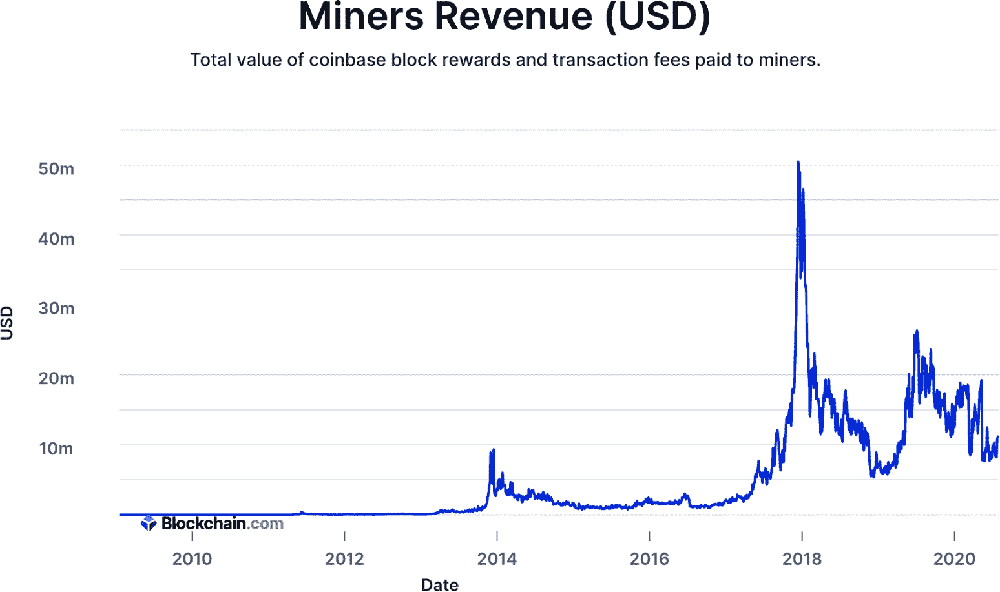

###### 图 2-14\. 比特币的挖矿收入像其价格一样波动。

大规模挖掘比特币有着巨大的好处。通过获得廉价的电力和数据中心，挖掘加密货币可以是有利可图的。因此，挖矿大多已经超出了业余爱好者的范畴。可能会出现新的加密货币欢迎业余爱好者挖矿，但比特币已经达到了大规模数据中心挖矿的企业级水平。

## 区块生成

为什么存在挖矿？许多加密货币需要挖矿，因为它们使用一种称为*工作证明*的共识算法（我们将在下一节讨论共识）。这种“工作”是通过运行计算来解决一个谜题证明的——在比特币的情况下，生成一个与特定模式匹配的哈希——完成后，会显示正在挖掘的区块的地址。只有当前的谜题解决后，才会将新区块添加到区块链中。

证明工作的过程以生成区块称为挖矿。这个想法是，挖掘区块所需的大量计算能力作为足够的威慑力，使比特币变得安全——事实上，该网络从未被攻击过。解决密码难题所需的计算能力数量正在迅速增加，正如图 2-15 所示。

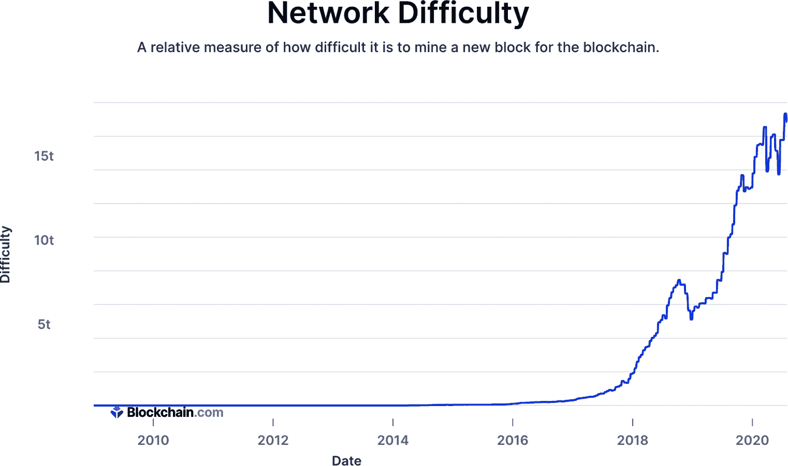

###### 图 2-15。比特币网络挖矿难度的历史

这不是偶然的。比特币设计为每 2,016 个区块调整其挖矿难度，因此随着时间的推移，难题实际上变得更难解决。这个数学设计的目的是，随着更多的矿工加入网络，生成区块之间的时间间隔保持不变——大约为 10 分钟。

# 共识

*共识*是一种达成一致的方式，涉及到拥有共同价值观和目标的各方参与者，它是区块链网络成功的重要组成部分。虽然有其他实现共识的方式，但在区块链中最流行的两种是工作量证明和权益证明。由于我们专注于加密货币和挖矿，本解释将集中讨论工作量证明以及它如何应用于比特币。请注意，使用区块链的企业应用通常不使用工作量证明共识，也不需要矿工。

## 工作量证明

工作量证明使得加密货币交易得以确认，并且区块能够发布到比特币区块链上。最初由贝尔实验室的马库斯·雅各布森和 RSA 实验室的阿里·朱尔斯在一篇[研究论文](https://oreil.ly/rLEvs)中首次描述，工作量证明最初是为了通过计算处理将经济价值绑定到否则免费的服务，如电子邮件，以阻止垃圾邮件。由于工作量证明需要计算能力，因此它减少了攻击或淹没系统的动机。工作量证明提供的经济价值与用于挖矿过程中的电力价格直接相关。

在工作量证明加密货币挖矿中，使用哈希函数来验证数据。哈希以公开证据的形式输出到区块链上，使用了*哈希算法*。进行此操作的计算机速度称为*哈希率*。对于许多加密货币来说，基于工作量证明的计算机能力是确保网络安全的关键因素，而这种能力已经相当可观。尽管哈希率会波动，但比特币过去已经超过了每秒 7000 万兆哈希（请参见图 2-16）。

在密码学中，已经设计了许多不同类型的工作量证明。对于加密货币，有一些被使用。例如，比特币使用 SHA-256 哈希算法，而莱特币则使用更加内存密集型的密码学 Scrypt 算法。

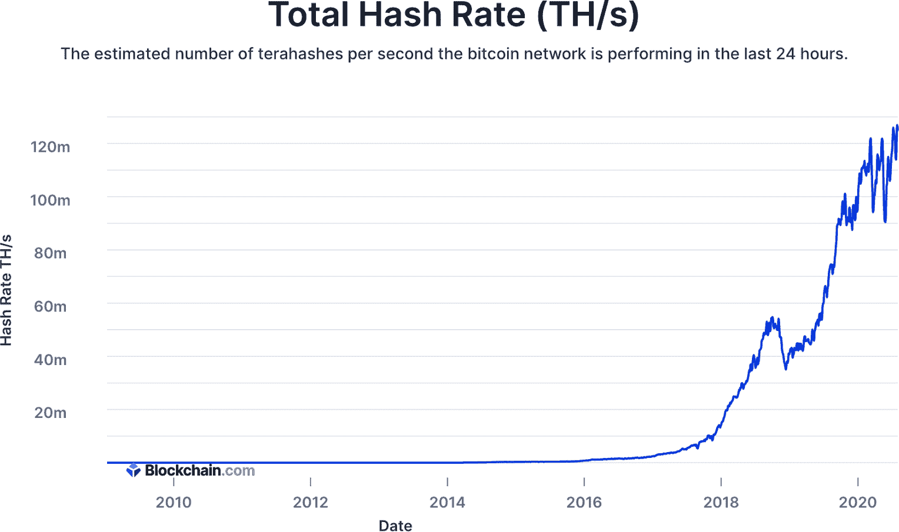

###### 图 2-16\. 比特币网络哈希率的历史

### 区块发现

每约 10 分钟，一个挖矿者确认一笔比特币交易的新区块。由于网络中有数千名挖矿者，网络需要就哪个挖矿者有权确认新区块达成共识。

挖矿者只需生成一个比特币区块哈希，该哈希被网络视为有效，即可发现一个新区块，其标准如下：

1.  它是一个有效区块头的哈希。

1.  结果产生的区块哈希是一个低于当前网络目标的数字。

*目标*是一个不断变化的数字，必须始终高于有效区块哈希值。*难度*是发现有效区块哈希所需尝试的平均次数。*网络哈希率*指的是网络中的矿工集体每秒尝试生成有效区块哈希的次数。

网络的目标，设置在比特币的初始参数中，是每约 10 分钟发现一个新的有效区块。随着时间的推移，使用计算机处理能力来发现区块的矿工数量会随着诸如电力使用和处理能力等变量的变化而变化。他们消耗的处理能力称为*哈希功率*。矿工的计算机正在消耗这种能力来尝试生成一个有效的比特币区块哈希。

当比特币网络的哈希功率*增加*——也就是说，当更多的计算机处理能力被应用于生成有效的区块哈希时，网络自然需要*更少*的时间来发现一个区块。因此，为了保持每 10 分钟发现一个区块的平均值，比特币网络会更改网络目标，使其更难或更容易让矿工网络发现有效的区块哈希。

第一个比特币区块生成时的目标值为：

```
00000000ffff0000000000000000000000000000000000000000000000000000
```

这是可能的最高目标值。当你将第一个区块的哈希与此进行比较时，你会发现它是一个低于那时目标的（十六进制）数字：

| 初始目标 | **`00000000`**`ffff0000000000000000000000000000000000000000000000000000` |
| --- | --- |
| 区块 #0 哈希 | **`0000000000`**`19d6689c085ae165831e934ff763ae46a2a6c172b3f1b60a8ce26f` |

通过计算哈希开头有多少个零来简单确定十六进制中哪个数较小。初始目标有 8 个零，而第一个区块哈希有 10 个零；因此区块 #0 哈希是一个更小的数，因此它是有效的。

当区块 #0 被发现时，比特币网络中几乎没有竞争来发现区块。因此，目标值很高。那时的难度为 1，这意味着平均需要 1 次尝试才能生成一个有效的哈希。十年后，有数千台矿工消耗着更多的哈希功率来发现一个区块。因此，十年后的目标值是一个较低的值，需要更多的尝试。

将目标与 2019 年 7 月 28 日的有效区块哈希进行比较：

| 目标 | **`000000000000000000`**`1f3a08000000015667e3e2c52a81e977a0b71f70e5af97` |
| --- | --- |
| 区块 #587409 哈希 | **`000000000000000000000`**`1f57b098911a90b164b9812304f4f7615cf9f91f66a` |
| 难度 | 预计需要尝试 **9,013,786,945,891.68** 次才能发现一个有效的区块哈希 |

比特币被设计成让网络中的所有节点每 2,016 个区块（约 14 天）重新计算一次新的目标。新目标值是根据在确切 10 分钟的间隔内生成了前 2,016 个区块的目标值计算的。这是比特币网络自我纠正矿工在之前 2,016 个区块中参与网络生成有效区块哈希所需的难度的方式。

设定这个难度过程的主要原因是为了确保比特币的供应是可预测的，并遵循特定的时间表（参见图 2-17）。每创建一个新的区块，也会创建新的比特币，尽管随着时间的推移，这种供应会减少。对于比特币，奖励的大小也被设计为随着供应的增加而减少。每隔 210,000 个区块，或大约每 4 年，区块奖励减半。从 50 比特币减少到 25，然后从 25 减少到 12.5，依此类推，直到 2140 年，大约总共将挖出 2100 万个比特币（一个硬上限）。

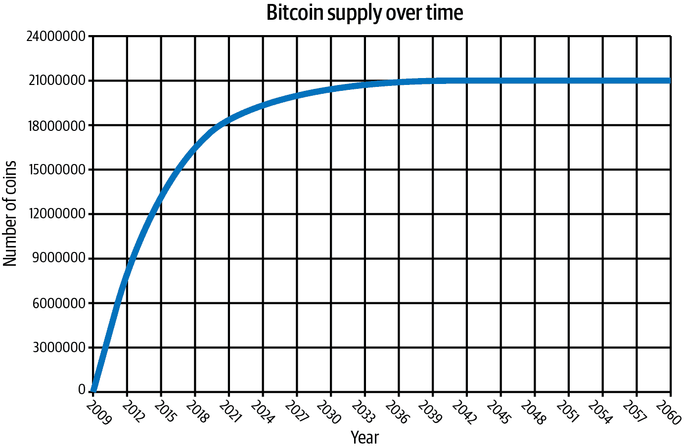

###### 图 2-17。随时间变化的比特币供应

### 挖矿过程

在每个时刻，比特币网络上的成千上万的矿工正在竞争，以发现区块链上的下一个有效区块。矿工之所以有动力这样做，是因为区块奖励和交易费用。正如前面提到的，矿工需要确保以下内容是正确的，以生成有效的区块哈希：

1.  它是一个有效区块头的哈希。

1.  得到的区块哈希是一个比当前网络目标小的数字。

要生成一个有效的区块哈希，矿工需要输入表 2-3 中显示的信息。

表 2-3。有效比特币区块的内容

| **字段** | **描述** |
| --- | --- |
| 版本 | 矿工当前使用的比特币客户端版本 |
| `hashPrevBlock` | 矿工在此时刻看到的上一个区块的哈希 |
| `hashMerkleRoot` | 矿工决定包含在当前区块中的所有交易的哈希 |
| 时间 | 区块时间戳，计算为自 1970-01-01T00:00 UTC 以来的秒数 |
| 位 | 当前比特币网络目标 |
| 随机数 | 从 0 开始；如果得到的哈希不合法，则加 1 并尝试新的哈希 |

除了随机数（nonce）以外的所有字段都来自公共信息源。当矿工开始尝试发现一个有效的区块时，他们最初将随机数（nonce）设置为 0，然后尝试生成一个与区块哈希相匹配的哈希值，这个哈希值是随机生成的。矿工反复尝试找到这个区块哈希，使用哈希算力，这意味着矿工在生成这些哈希方面越有效率，他们的哈希率就越高。

如果生成的区块哈希无效，则矿工会将 32 位随机数（nonce）加 1，并生成一个新的区块哈希，希望这个新哈希值是有效的。如果矿工用尽了随机数空间，称为*溢出*，他们将使用 coinbase 交易中的脚本签名空间。如果一个矿工找到了一个有效的区块哈希，即满足目标标准的哈希，那么他们就发现了一个有效的区块。持续尝试新的区块哈希的过程是每个矿工努力的工作量证明，如图 2-18 所示。

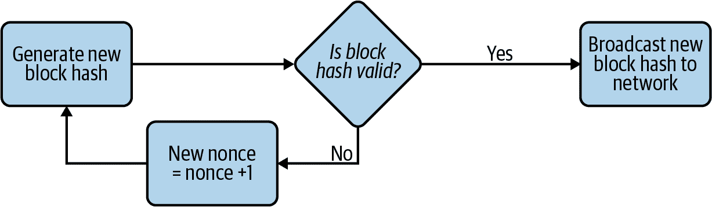

###### 图 2-18。矿工尝试发现新区块的工作量证明过程

当一个矿工发现一个有效的区块哈希后，矿工会将该新区块哈希广播给网络中的所有其他矿工。有可能两个不同的矿工会同时发现一个有效的区块并将新的区块广播到网络中。然后，网络中的所有其他矿工需要达成共识，决定将哪一个新区块添加到区块链中，就像图 2-19 所示的那样。

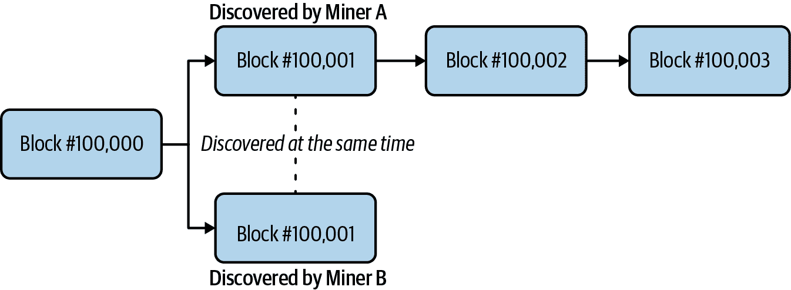

###### 图 2-19。当两个矿工同时发现一个新区块时的事件

在矿工将新的区块添加到区块链之前，矿工会验证以下内容是否属实：

1.  区块是有效的。

1.  区块中的所有交易都是有效的。这包括确认用于解锁交易输出的数据签名。

当网络中超过 50％的其他矿工将相同的新区块包含到他们的区块链副本中时，就会实现共识。矿工集体“投票”决定在那一时刻添加到区块链中的区块，以及验证所有交易是否有效。

###### 注意

*最长链规则*规定矿工遵循工作最多的链，换句话说，就是最长的链。如果两个链的版本长度相同，就像两个不同的矿工同时找到解决方案的情况一样，那么矿工会留在他们看到的第一个链上，然后在看到更长的链时立即切换到该链。最长链规则对于大多数共识形式都是至关重要的，尤其是工作量证明**。**

### 交易生命周期

在像 PayPal 这样的集中式支付系统中，交易的生命周期非常简单。您登录 PayPal 网站或应用程序，输入交易详细信息，然后按 Enter 键。如果 PayPal 响应“已完成”通知，则您的交易已经处理完毕，您就完成了。

比特币的交易生命周期非常不同，过程涉及许多不同的步骤。以下是交易经历的四个主要阶段：

1.  *广播。*第一步是生成一个有效的比特币交易，然后将交易详细信息广播到比特币网络。大多数比特币用户会使用在线钱包（如 Coinbase），在后台运行的软件是连接到比特币网络的客户端，使他们能够看到这些交易。

1.  *未确认/内存池.* 当网络中的每个矿工接收到交易时，它将该交易放入其*内存池*或*内存池*。内存池是所有比特币交易的集合，这些交易处于未确认状态且仍被视为活动状态。默认情况下，如果交易在内存池中等待超过两周，则被视为不活跃，并从内存池中删除。

1.  *由矿工确认.* 当一个矿工发现一个新的区块时，矿工决定包含在该区块中的交易，从在内存池中等待的交易中选择。矿工按交易费用顺序选择交易，从最高的开始。当某个矿工将包含该交易的区块添加到其区块链中时，该交易被认为是由该矿工确认的。然而，该矿工无法看到其他矿工的区块链副本，并且不能保证相同的交易区块已添加到它们的链中。

1.  *由网络确认.* 随着一个区块被新区块覆盖，比特币网络达成一致将该区块包含在其中的机会增加。当网络达成一致将交易的区块包含在区块链中时，该交易被整个比特币网络确认。

### 确认

比特币钱包以及行业中的大多数人认为，当交易至少达到六次确认时，交易才被网络安全确认。*确认*涉及矿工将包含交易的区块添加到链中。 图 2-20 说明了矿工确定包含区块的决策过程。

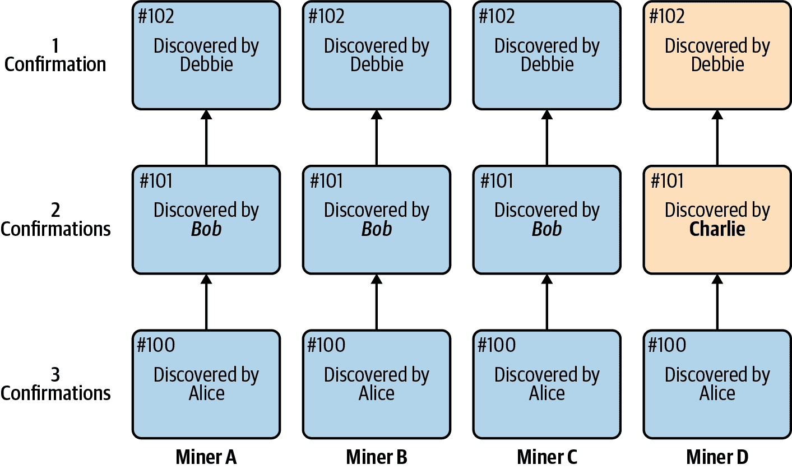

###### 图 2-20\. 工作证明矿工决定包含在区块链中的区块的示例

在 Figure 2-20 中，第 100 个区块已经获得了三次确认。网络中的四名矿工都包含了同一个区块。到了第 101 个区块时，三名矿工（75%）包含了由 Bob 发现的区块，但一名矿工（矿工 D）包含了由 Charlie 发现的区块。此时，矿工 D 尚未意识到，他们从第 101 个区块开始对区块链的看法将发生改变。如果矿工 D 的第 101 个区块中有一笔交易不在其他矿工的第 101 个区块中，那么这笔交易将不会包含在网络的区块链中。这就是为什么交易获得的确认次数越多，就越有可能被包含在比特币网络的区块链中。

###### 注意

许多服务具有不同的加密货币确认计划。例如，一些服务要求在交易被视为完成之前进行仅三次比特币网络确认，尽管通常标准是六次确认。一些服务可能根据多种因素（包括使用的加密货币类型）要求更多的确认。

## Proof-of-Stake

Proof-of-stake 是一个共识算法，旨在通过消除挖矿的需求来改进工作证明。相反，加密货币的持有者通过“抵押”他们的余额来获得投票权，并有机会被网络选中来验证交易。因此，抵押使您能够充当节点或验证者。虽然没有昂贵的硬件要求或困难的计算过程需要担心，但抵押者必须考虑到经济因素。还有激励措施：抵押者按其持有的比例提供奖励。

###### 注意

在权益证明网络中，节点不被视为矿工，因为他们不会进行发现区块的工作。相反，节点在网络中的角色是验证交易，因此在网络中创建区块的节点被称为“验证者”。

与通过工作首先发现有效块哈希的矿工不同，权益证明共识根据各种抵押标准选择节点，这些标准可能包括抵押金额（抵押金额）、年龄（哪个地址持有加密货币的时间最长）、财富（哪个地址持有加密货币的时间超过*X*数量），等等。 或者，在某些系统中，已抵押一些加密货币的地址会被随机选择。

优点

+   由于没有挖矿，创建块消耗的能量很少，因此浪费在为网络提供能量上的能量更少。

+   将更多的控制权交给那些对网络更投入的人。

缺点

+   对网络的控制与网络中的财富分布相关联。 大多数加密货币财富集中在少数一小部分人手中，因此网络的控制比工作证明网络更加集中。

+   通过将更多的控制权交给那些对网络更“投入”的人，而不是那些正在做更多“工作”的人，权益证明可能导致富人和穷人之间的差异更大。

对工作证明模型进行了很多批评。 尽管当中本聪提出时对加密货币是一个新颖的想法，但为了开发最强大的 ASIC 而进行的硬件竞赛据说使得工作证明比应该的更加资源密集。 这个论点的一方面称比特币已经成为一个环境问题，因为确认交易和生成新比特币所需的电力量已经不再经济有效。 另一方面指出，比特币消耗的大部分电力实际上来自可再生能源，比如水电，这是矿工获取廉价电力的地方。

在权益证明系统中确定谁将生成下一个区块与工作证明系统中的方法非常不同，有几种不同的方法。一些加密货币使用随机的区块选择，这是基于权益大小（越高越好）和哈希值（越低越好）的组合。另一种方法是基于币龄的选择，这是基于抵押的硬币数量和硬币持有时间的天数（可能与随机选择方法相结合）。引入随机性的最新方法是同时使用[RANDAO 随机数生成器](https://oreil.ly/WcsLC)和[可验证延迟函数（VDFs）](https://oreil.ly/kE03f)。

目前有一些加密货币使用权益证明，包括 Dash、Neo 和 Tezos，但这仍然是一个相对较新的概念，尚未像工作证明那样被广泛采用。有人批评权益证明不是一种安全的共识机制，因为理论上分叉会在两个不同的链上创建[相等的激励](https://oreil.ly/tjBAS)(分叉发生在区块链分叉时，在第三章中有更详细的介绍)。还存在“假权益”攻击的风险，即权益者几乎没有余额就可以破坏网络，因为验证要比工作证明复杂得多。

另一个理论上的安全问题是“无所不在”的问题，即矿工可以自由地创建多个区块，导致分叉和拒绝服务攻击的可能性。这通常是通过*减持算法*来解决，以减少权益以惩罚行为不端的验证者。

## 共识的其他概念

除了工作证明和权益证明之外，还有其他的想法。达成共识仍然是一个新的和不断发展的技术概念，不同的想法正在进行测试。这就是为什么共识算法经常与区块链分离的原因——换句话说，区块链技术本身并不与一种特定的共识方法捆绑在一起。这样，第三方可以构建和推广共识算法，以添加到常用的区块链中。

像瑞波币（Ripple）和恒星币（Stellar）这样的加密货币是活跃的项目，它们使用一些非常不同类型的共识协议，尽管可以争论这些系统并非完全分布式。它们都使用所谓的[*拜占庭协议*](https://oreil.ly/5R7yb)，这是分布式节点合作确认交易的一种方式。这些节点中的许多是由项目自己控制的，因此它们可能看起来是中心化的。然而，瑞波币和恒星币都通过具有基于区块链的记账单位来规避传统银行和支付系统。这允许用户[节省通常在传统金融系统中产生的成本](https://oreil.ly/SjTUT)。

### 其他替代方法

正在研究的一种方法被称为*存储证明*。作为一种可以通过计算完成并且也抵抗 ASIC 的方法，存储证明使用文件系统对存储进行验证以验证交易。诸如[永久币（Permacoin）、Tor 币（Torcoin）和奇亚币（Chia）](https://oreil.ly/66NFs)等项目正在利用存储证明的一种版本。

另一种有趣的扩展方法是*历史证明*。例如，在工作量证明中，比特币可以被想象成每 10 分钟就会滴答一次的时钟（多亏了难度调整），并且消息的排序直到 10 分钟过去并且网络达成共识之前都不会被确定。在权益证明中，每个人都在接收来自网络的消息，并且他们需要与其他节点进行通信，以在最终达成共识之前就这些消息的排序和时间达成一致，然后网络进展。

历史证明是一种创建节点内部可以依赖的客观时间戳的方式，使它们可以在达成共识之前乐观地信任消息的排序和时间。然后共识稍后出现：网络内的参与者投票表决他们认为是主要分支的内容，每次他们这样做时，他们都会承诺在一段时间内不对另一个分支进行投票。他们为特定分支投票的次数越多，他们不投票给其他分支的承诺就会呈指数级增长。他们受到鼓励要一直为他们认为是主要分支投票，因为除非他们为特定分支累积了 32 票，否则他们不会获得任何网络奖励。

###### 注意

在她的论文[“分布式系统中同步时钟的实际用途”](https://oreil.ly/kQcL1)中，麻省理工学院计算机实验室的芭芭拉·利斯科夫（Barbara Liskov）表示：“同步时钟很有意思，因为它们可以用来改善分布式算法的性能。它们使得可以用本地计算替换通信。”

*委托权益证明*共识是一种能源高效的共识形式，其中用户*委托*，将代币交给一个“候选者”，并使用投票来帮助管理网络。还有*基于投票的*共识，以及*基于抽签的*共识在更私密的区块链实现中被使用。

# 利益相关者

除了协议网络、钱包和矿工之外，加密货币生态系统中还有其他利益相关者。这些可能是中心化服务或营利性企业，并为生态系统提供所需的重要功能。在加密货币中，一个典型用户可能与以下五类利益相关者互动：经纪公司、交易所、托管服务、分析服务和信息提供者。

## 经纪公司

作为帮助促进加密货币交易的服务，*经纪公司* 充当生态系统中买卖和持有加密货币的中间人。这包括商户支付。在像手机应用[罗宾汉](https://robinhood.com)和[Square 的 Cash App](https://cash.app)这样的知名服务中，人们可以购买加密货币，经纪公司交易会发生。罗宾汉充当中间人，负责获取加密货币并为用户存储。

对于商户交易，像[比特支付](https://bitpay.com)这样的公司处理所有的处理工作。任何接受比特币或其他加密货币的商户通常都由经纪公司接管加密货币。然后，商户通过经纪人以现金支付，因为这是企业支付其他费用（如工资、租金、库存等）的主要方式。

###### 注意

[BTCPay Server](https://oreil.ly/RT9E-) 是一个用于接受比特币支付的开源、自托管解决方案。它通过结账时的发票功能启用加密货币的接受，并为流行的网络平台提供了许多插件。

## 交易所

作为通往法定货币世界的入口，交易所允许人们直接与他人交易。像[Coinbase Pro](http://pro.coinbase.com/trade)这样的美国交易所和[Bitstamp](https://www.bitstamp.net)这样的欧洲交易所拥有交易引擎，匹配买家和卖家。交易对通常是法定货币，但也可以是加密货币对加密货币。例如，交易对包括 USD/BTC、EUR/BTC 和 BTC/ETH。与经纪公司相比，交易所存在更高的风险，尽管上述交易所已经运营多年，并与政府监管机构合作。

###### 注

交易所托管用户的密钥并提供交易引擎。你必须相信一个加密货币交易所是可靠的，不会操纵市场或滥用资金，这在加密货币中是一个问题。

为了吸引用户到他们的平台，一些交易所现在也提供权益质押和部分准备金功能，这些主题将在后面的章节中介绍。

## 托管

一些企业专注于为用户提供长期的加密货币托管和保护服务。这些服务简称为加密货币托管解决方案，通常会收取持有余额或提款的小费。然而，对于那些从不想担心加密货币托管问题的人来说，这些服务是非常好的。多年来，这些企业一直致力于开发新技术，以为用户存储加密货币。

加密货币托管业务中两个最大的名字是[BitGo](https://www.bitgo.com)和[Coinbase](https://www.coinbase.com)。它们都是多加密货币资产托管提供商，不断添加新的加密货币。通常这些服务提供各种热、温或冷存储等级。对于冷存储，重要的是要注意从服务中提取加密货币可能需要一些时间。

## 分析

加密货币区块链产生了大量信息。市场上有许多产品和服务可以将这些原始数据转换成易于人们使用的格式。最常见的工具是称为*区块链浏览器*的工具。它允许用户更好地查看交易。两个流行的服务是比特币的[Blockchain.com](https://www.blockchain.com)和以太坊的[Etherscan](https://etherscan.io)，它们可以让你看到一个区块的全部内容。图 2-21 展示了区块链浏览器中的一笔交易。


###### 图 2-21\. 区块链浏览器中比特币交易的屏幕截图

还有一些公司会更深入地跟踪加密货币交易。其中最大的之一是[Chainalysis](https://www.chainalysis.com)，它帮助交易所和其他利益相关者识别交易。还有一些免费工具可以帮助人们跟踪交易模式，比如[TradingView](https://www.tradingview.com)，这是一个图表工具，几乎覆盖了全球主要资产在大多数全球交易所的加密货币图表。

## 信息

区块链行业每天都在发生变化。新公司、新想法和全新的加密货币似乎随时都会出现。成立于 2013 年的[CoinDesk](https://www.coindesk.com)是致力于提供行业新闻和其他研究的最古老和最大的组织之一。主要出版商如*纽约时报*、*华尔街日报*和彭博社也有专门报道加密货币行业的专职记者。

会议是很好的教育资源，但有时开销很大。对于注重预算的人来说，[Meetup.com](https://www.meetup.com) 是一个很好的来源，可以找到当地的加密货币活动。使用搜索词 *比特币*、*以太坊* 或 *区块链* 通常会找到一些当地的聚会，其中大多数都有讲者谈论当前事件、最佳实践或有趣的技术话题。

# 总结

加密货币的基础知识一开始可能会让人感到有些吃力。我们希望这一章没有让你感到太过压抑。对这里涵盖的材料有着良好的理解将为你在接下来的章节中提供更好的理解。加密货币的世界变化迅速，但基础知识似乎基本保持不变。接下来的章节涵盖了一系列建立在这个早期材料基础上的主题。如果你发现自己需要将这一章作为参考，那也是完全可以的！
