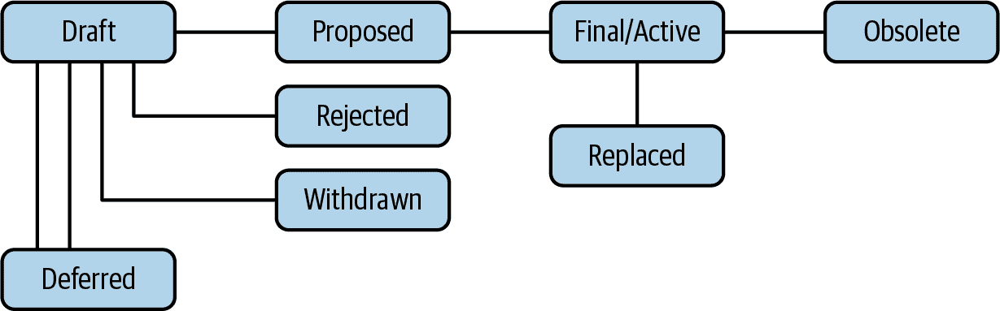
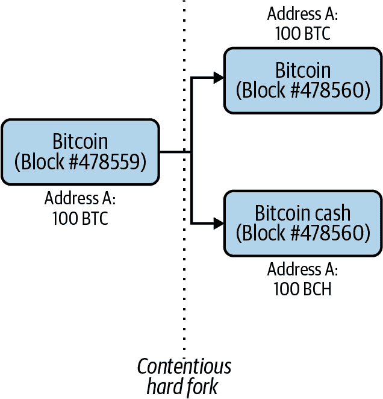
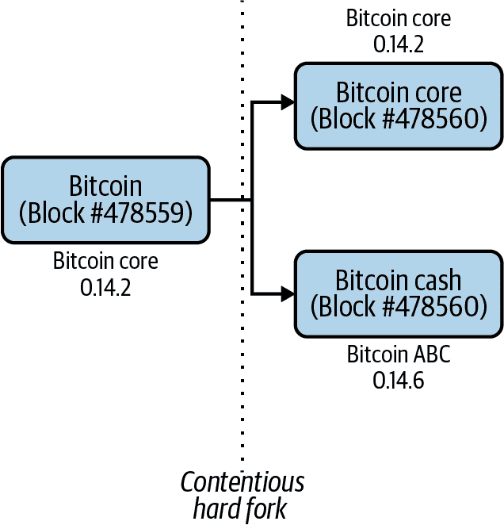
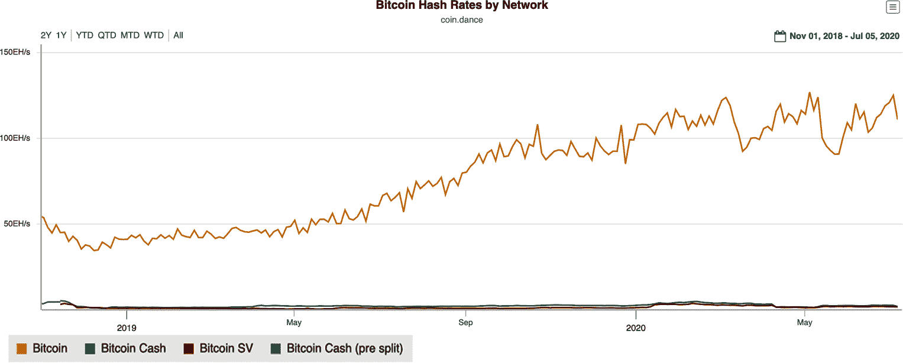
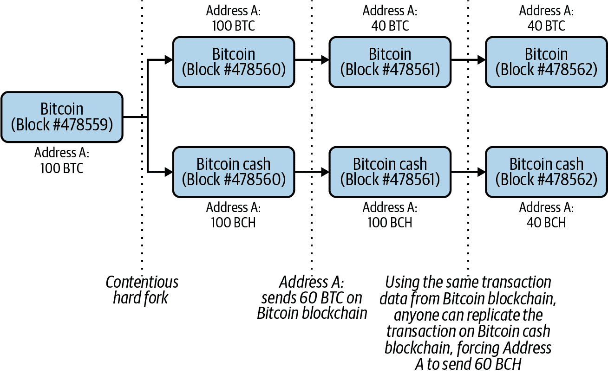
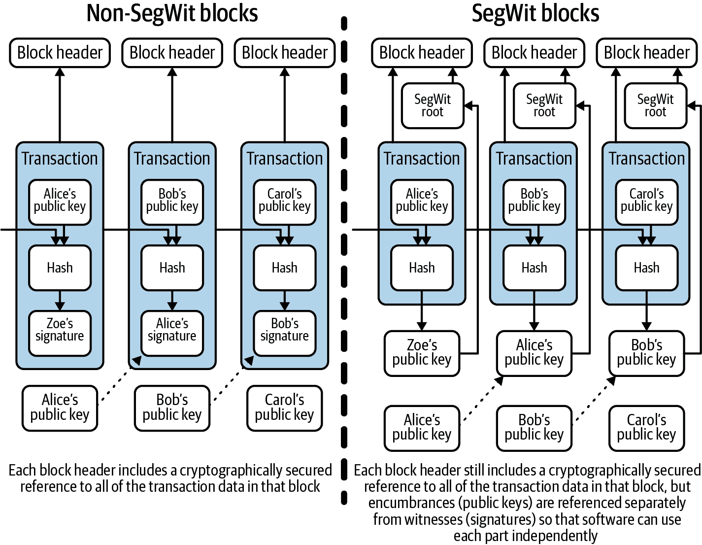
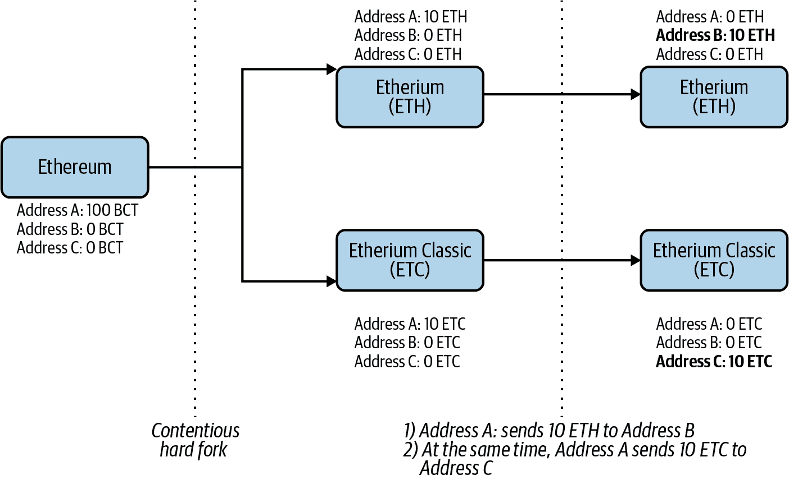

# 第三章。分叉和替代链

加密货币仍然处于研究和开发阶段，开发人员多年来一直在努力创建另一个比特币——一个拥有强大社区支持的热门加密货币网络。

无论是因为可扩展性、功能性还是投机性，都有许多关于将比特币代码*分叉*（稍后详细介绍）成具有类似特性的新加密货币的提案。其中一些想法非常新颖，而另一些只是为了创造价值。

# 比特币改进提案

为什么不直接改变比特币本身？这并不容易。必须遵循一种*治理过程*来更新比特币协议。

这是软件产品的典型特征：通常有一个内部流程来确定持续改进的机会。该流程考虑诸如谁拥有产品、谁对其开发拥有最终决定权等标准，并确定何时应添加新功能。

Bitcoin Core 是开源的——客户端软件对所有人开放，并打算由比特币社区拥有和管理。*比特币改进提案*（BIPs）是社区持续管理和更新比特币核心代码的过程。决策不是由指定的委员会或团队做出，而是由整个社区做出。

来自社区的任何人如果有改进比特币的想法，都可以提出一个新的 BIP。然后他们必须为该 BIP 辩护，以获得社区一致认同，认为他们的提案应该获得批准。

BIP 的生命周期如下：

1.  来自社区的某个人提出了一个改进的想法，并将其提交给 BIP 编辑。

1.  如果编辑们同意，他们会创建一个新的 BIP，并将其放入草案状态。

1.  如果矿工们表示支持某个 BIP，它就会进入最终状态。需要说服矿工们是否采纳新的 BIP，因为他们是需要升级他们的软件的人。

1.  一旦 BIP 达到最终状态，社区的其余部分必须升级到新软件。

为了使 BIP 被社区接受，它必须满足以下标准：

1.  它遵循了初始提案中规定的正确格式，即 BIP-0001。

1.  它包括实施更改的代码。

1.  过去 2,016 个块中至少 95%是由使用新 BIP 的矿工创建的。

考虑到这一点，比特币的民主进程如下所示：

+   任何人都可以提出新法案。

+   矿工是选民，矿工拥有的哈希功率越多，他们获得的选票就越多。

+   如果超过 95%的哈希功率采用更改，则法案将被推入法律。

图 3-1 描绘了 BIP 过程。

###### 图 3-1\. 比特币改进过程

所有 BIP 均可在[GitHub 上查看](https://github.com/bitcoin/bips)。

# 理解分叉

一旦比特币社区开始团结起来为网络的共同利益而努力，许多程序员决定*软件分叉*技术，从而使他们能够创建自己的*另类币*。 *分叉*涉及获取比特币核心软件，更改一些参数，并在邮件列表和消息板上启动它。结果是*另类币*，也被称为*另类币*。其中一些另类币与比特币有很大不同，最好称它们为*另类链*。

在加密货币世界中，分叉实际上可能意味着几种不同的事情。以下是您可能会遇到的一些术语：

软件分叉

这是技术系统和开源软件中的一个通用术语。软件分叉是指开发人员获取一部分开源软件并更改一些参数以满足其需求的情况。例如，开源操作系统 Linux 的数百个不同版本是通过软件分叉创建的。

软分叉

就区块链技术而言，*软分叉*是对挖矿软件进行的升级，它对网络进行了改变，但不要求所有矿工参与。这使得升级与旧软件兼容，并且通常用于升级交易功能。

硬分叉

就区块链技术而言，*硬分叉*是对挖矿软件进行的升级，它对网络进行了改变，需要所有矿工的参与。硬分叉通常实现关键的安全或功能性更改，这些升级与旧软件不兼容。

有争议的硬分叉

在区块链技术中，*有争议的硬分叉*是对挖矿软件进行的不兼容的升级，它对网络进行了改变，而不是所有矿工都接受。因为一些矿工不同意该分叉，因此不升级到包含提议更改的新软件版本，所以区块链实际上分裂成两个。过去的所有记录在每个分支上都是相同的，但从有争议的硬分叉开始，这两个链上记录的交易不同，它们的软件是不兼容的。

有争议的硬分叉可能会带来问题，所以让我们深入了解一下。

## 有争议的硬分叉

当有争议的硬分叉发生时，加密货币的主区块链会分裂成两个单独的区块链。这就是发生在 2017 年的*比特币现金*（Bitcoin Cash）上的情况，它与比特币分叉，如图 3-2 所示。

###### 图 3-2\. 比特币和比特币现金分叉后生成的区块

每个区块链都继承了分叉前主区块链的历史。这包括每一笔先前的交易，每个地址余额，每个区块哈希等。在分叉时刻，这两个区块链具有相同的历史记录。*分叉之后*，每个区块链都会创建自己的新区块和自己的新交易记录，并且可以由不同的矿工进行挖掘。

在图 3-2 中，地址 A 在比特币主区块链分叉之前的余额为 100 BTC。分叉后，主链上出现了两条新链：比特币（BTC）和比特币现金（BCH）。地址 A 在两个新区块链上都保持了 100 的余额，因此它在比特币区块链上有 100 BTC（在分叉时价值约为 270,000 美元），在比特币现金上有 100 BCH（在分叉时价值约为 24,000 美元）。之前的比特币链（BTC）仍然存在，就像分叉代码被提出之前一样。一旦比特币现金节点开始接受 > 1 MB（兆字节）的区块，比特币现金链就会从比特币中分叉出来，创建新链。

### 矿工们

矿工是那些为保持网络运行而贡献哈希算力的人。在发生争议性硬分叉时，矿工们会决定他们要支持哪个区块链，要么保持与分叉前区块链相同的软件，要么改用分叉后区块链的软件。图 3-3 有所说明。

###### 图 3-3\. 比特币和比特币现金分叉后的客户端版本

在比特币现金分叉的情况下，想要支持比特币现金的矿工在区块 #478560 时更改了他们的软件为比特币 ABC v0.14.6，并开始向新网络贡献他们的哈希算力。想要支持比特币的矿工继续使用相同的比特币核心客户端，0.14.2。

###### 注意

哈希算力对基于工作证明的区块链的生存至关重要。多方为网络贡献的哈希算力越多，单个实体要控制网络的成本就越高，因此网络的去中心化程度就越高。而区块链网络越去中心化，人们对其和网络安全的信任就越深。例如，假设一个区块链有九千个节点，另一个只有九百个节点。节点更多的网络更加去中心化，将激发更大的信任。

那么会发生什么呢？当发生有争议的分叉时，社区会认为在 2,016 个区块后拥有最高哈希率的区块链是“获胜”的区块链，而奖励是该区块链保留分叉前的名称。这些名称非常重要，因为它们是交易所赋予区块链的名称，并且对加密货币的价格有很大影响。

如今，比特币已经分叉成了三个明显不同的区块链，社区继续关注着它们。它们是比特币、比特币现金和比特币 SV（稍后会详细介绍 SV）。正如图 3-4 所示，[比特币的哈希率](https://oreil.ly/map8E)远远超过其他分叉。

###### 图 3-4\. 截至 2020 年 7 月各网络的哈希率——比特币的哈希率优于其分叉

### 重放攻击

当发生硬分叉时，新的两个区块链都有可能受到称为*重放攻击*的威胁。这种情况发生在攻击者从一个区块链上的合法交易中获取数据，然后在第二个区块链上“重放”或复制该交易时。

如果两个区块链具有完全相同的生成交易签名的过程，则两个区块链都容易受到重放攻击。图 3-5 展示了如果比特币和比特币现金区块链容易受到重放攻击可能会发生的情况。

###### 图 3-5\. 分叉后如何发生重放攻击

事件顺序如下：

1.  地址 A 向比特币网络广播交易指令，要求将 60 BTC 发送到地址 B。

1.  广播包括交易数据（即输入和输出）以及交易签名。交易签名是一种数字签名，确保网络上的交易是真实的，只能由地址 A 使用其私钥生成，并向网络证明它已经在比特币网络上授权了该交易。

1.  由于地址 A 已经公开广播了其交易数据和交易签名，任何人都可以将相同的信息广播到比特币现金网络，并且网络会处理它，因为这两个链是相似的。

幸运的是，当比特币现金分叉发生时，比特币现金矿工使用的新软件包含了防止在任何一个区块链上发生重放攻击的变化。具体来说，比特币现金软件在其网络发送的交易数据结构中添加了一个名为`SIGHASH_FORKID`的新字段。此字段必须存在于比特币现金交易中才能使其有效。当生成交易签名时，加密算法的输入之一是交易数据。由于两个区块链上的交易数据结构不同，因此在比特币核心区块链上生成的签名与在比特币现金区块链上生成的签名不同，并且在另一链上无效。

现在你对分叉有了一些背景了解，让我们稍微详细地看看比特币现金分叉。

# 比特币现金分叉

长期以来，加密货币社区认为比特币区块链的分裂可能是一件坏事，并且对比特币区块链在社区分裂的情况下能否生存存在不确定性。但在 2015 年左右，关于比特币未来及其作为货币的能力的辩论在开发人员之间引起了分歧。一方希望比特币被用作点对点的电子现金，就像中本聪在比特币白皮书中所描述的那样。另一方面，希望限制比特币区块中有大量交易的能力。这最终导致了比特币区块链的分裂，创建了新的比特币现金区块链。这就是 BIP 出现的地方。

尽管实施了诸如 SegWit 和闪电网络（本章后面将讨论）等解决方案，但比特币社区中仍然存在一群人对网络扩展的方式不满意，特别是区块大小的问题。比特币的区块大小为 1 MB，这限制了一个区块中的交易数量，尽管提出了解决方案，但仍然有一群人认为最简单的前进道路是增加单个区块的大小。这个群体相信比特币最初的“点对点电子现金”概念，并希望看到快速、便宜的交易，而较大的区块将促进这一点。另一方面，实施了 SegWit 和闪电网络的另一组人认为，增加区块大小将使个人难以运行比特币核心软件，因为整体区块链将变得太大，导致网络减慢。这种分歧威胁到了网络的去中心化。

当双方未能就比特币的扩展达成一致意见时，最终安排了一次有争议的硬分叉。矿机制造商比特大陆（Bitmain）制定了一个将社区分叉成两个不同区块链的计划。矿池 ViaBTC 创造了术语*比特币现金*，以反映较大的区块大小将使新加密货币更易于花费，像现金一样，具有更低的费用和更快的交易确认。

2017 年 8 月 1 日，有争议的硬分叉发生，创建了比特币现金。新的区块链采用了 8 MB 的区块大小，使每个区块的交易存储量大约是比特币提供的八倍。大多数原始比特币链的其他特性仍然保留，包括 21 百万单位的加密货币的硬性上限和 SHA-256 工作证明。此外，任何人在有争议的硬分叉时持有比特币的人都会收到[同等数量的比特币现金](https://oreil.ly/hYqrW)。比特币现金的 8 MB 区块大小在 2018 年 5 月增加到 32 MB，旨在容纳更多交易和功能。尽管争议不断，比特币现金并未获得许多支持者预期的关注，但它仍然是最成功的比特币软件分叉。

# Altcoins

术语*altcoin*通常用来指代比特币核心软件的分叉。早期的 altcoin 狂热始于 2011 年，此时比特币已经获得了一定程度的关注，经历了其漏洞攻击，并且开发者开始信任这项技术。以下是一些早期的 altcoins：

Ixcoin

这个分叉是早期的*预挖矿*替代币（有关预挖矿的更多信息，请参阅下一节）。 在事先生成了 58 万枚硬币后，创始人在消息板和邮件列表上推出了 Ixcoin，其想法是原始开发者可以为现有的预挖矿硬币创造很大的价值。 社区对预挖矿感到怀疑，这使得一些人在区块链启动前就能够获取利益，于是社区将 Ixcoin 分叉为 I0coin，即使没有预挖矿也没有获得任何动力。

Solidcoin

这个分叉加快了交易确认的速度，区块时间为 3 分钟，而比特币的确认时间大约为 10 分钟。 使用 Solidcoin 后，手续费也是固定的，而比特币的手续费是基于一个区块中的交易费用总和而变化的。 然而，在 Solidcoin 中固定的费用会造成网络垃圾邮件，因为攻击者可以简单地向交易附加费用并填满区块。 原开发者决定他们想要更多的控制，于是他们将项目重新发布为 Solidcoin v2，并要求每隔一个区块由一个中央方挖矿。 这个项目最终失去了动力。

GeistGeld

这个分叉极大地缩短了区块时间（生成区块的速度）至只有 15 秒。 然而，这变得有问题，因为对矿工来说实际上太快了。 这导致了大量的孤立区块的产生，这些区块最终没有被链条所接受，导致它们的交易被遗弃，并且永远不会被确认。 这使得网络上的交易难以完成。 GeistGeld 的开发者还推出了 Tenebrix，这是第一个使用*Scrypt 挖矿*的加密货币。 Scrypt 是一种更加消耗内存的工作量证明算法，旨在阻止 ASIC 用于挖矿。

Namecoin

Namecoin 的目的是作为域名系统（DNS）的分散版本，该系统用于引导网络流量。例如，当用户访问 *google.com* 时，DNS 将该地址转换为互联网上的数值位置。Namecoin 的开发者们努力使项目成为加密货币和分散式 DNS，并且未能获得发展势头。然而，他们创建这样一个系统并使命名系统更加冗余的想法提高了加密货币被用于不仅仅是价值转移的可能性。

Primecoin

加密货币（如比特币）的工作证明通常涉及解决随机数学问题，但 Primecoin 提倡找到素数可能会有用。素数是仅可被 1 和自身整除的数字，并且随着数字的增大，找到素数变得更加困难。素数被用于加密系统，随着计算机在计算方面变得更快，[需要发现更大的素数](https://oreil.ly/YTZsF)。Primecoin 被称为第一个具有超出仅确认交易的用途的工作证明的加密货币，其工作重点是搜索素数链。

## 莱特币

早期最知名的另类币是莱特币。2011 年，Google 的开发者 Charlie Lee 开始花时间研究比特币代码。他注意到其他项目推出了有趣的想法，但始终未能成功，原因各种各样。李所确定的一个因素是早期项目的开发者经常保持匿名，就像中本聪一样，但不像中本聪，他们没有引入突破性的新概念；他们只是调整了比特币代码。

另一个问题是*预挖*，当一个项目在实际发布为公共链之前挖掘或获得加密货币时。如果预挖项目的开发者匿名，那么很难相信这些项目长期能够生存，因为一个匿名的预挖创始人可以随时离开，带走他们的资金。此外，许多早期的替代币没有很好地打造自己的品牌形象。

李思考了很久，想要创造出更好的东西。他将比特币视为类似黄金的价值储存物，而他想要创造它的银色补充。他还想要让他的项目“轻量化”，以便区块时间更快。李最终决定给莱特币比特币四倍的硬币供应量。此外，区块时间被设置为比比特币快四倍。

李还决定不进行预挖，使用（在 2011 年）ASIC-resistant Scrypt 算法来吸引爱好者。（ASIC 在许多技术应用中使用——它们使用专门的芯片设计来执行一项任务非常出色。Scrypt 是另一种工作证明算法，类似于比特币的 SHA-256，具有一些不同的属性。）使用 Scrypt 的莱特币，人们可以在他们的计算机上同时挖掘比特币和莱特币。但最终，Scrypt 会限制想要使用 ASIC 从莱特币获利的比特币矿工，因为算法不同。开发莱特币花费李一周的规划和四小时的编码。它仍然是市值前十的加密货币之一。

## 更多替代币实验

早期以来，已经推出了更多的替代币。一些有趣的例子包括：

Dogecoin

由程序员比利·马库斯和营销人员杰克逊·帕尔默于 2013 年发明，狗狗币是一个将互联网迷因与加密货币相结合的产物。帕尔默以一个玩笑发推特（图 3-6），提议基于一种柴犬（*doge*）的互联网迷因创建一种加密货币。这个想法引起了关注，围绕着狗狗币形成了一个生态系统。狗狗币相对便宜，因为总货币数量没有上限，这保持了其价格低廉。

###### 图 3-6。狗狗币始于一条简单的推文

Unobtainium

源自工程术语对一种极为罕见元素的描述，Unobtainium 成立于 2013 年。正如其名称所示，这种加密货币的流通量非常少——设定了 250,000 个单位的上限，将在 30 年内挖掘完毕。尽管试图创造低通货膨胀的有趣实验，Unobtanium 像大多数其他加密货币一样经历着波动，其日交易量很低（数百美元）。

Coinye

Coinye 或 Coinye West 是在 Dogecoin 之后不久于 2014 年推出的，是一个计划使用饶舌歌手坎耶·韦斯特作为其迷因/吉祥物的基于 Scrypt 的加密货币。几乎在计划宣布后不久，开发者就收到了坎耶·韦斯特的商标侵权通知。尽管团队匆忙推出了该币种，但法律压力迫使他们关闭了该项目。

PotCoin

许多银行仍然认为大麻是有风险的，因此有许可证销售大麻的企业通常必须跳过许多障碍。PotCoin 于 2014 年发布，是创建用于大麻行业的加密货币的第一次尝试。最初它只是莱特币的一个副本，但该项目最终转移到*权益证明速度*，这鼓励权益投注，其中加密货币持有者仅通过持有它就可以获利，并定期*签署*，这意味着进行交易。尽管 PotCoin 尝试了许多营销举措，但市场波动和监管使采用变得困难。

# “2.0”链

除了从比特币派生出来的分支，还有一些从零开始构建的项目。事实上，许多替代链的想法需要在基础上进行建设，以实现它们打算达成的目标。本节描述了一些显著的例子。

## NXT

2013 年推出的 NXT 是一个非常早期的“比特币 2.0”或“区块链 2.0”项目。其想法是创建一个更具可编程性、灵活性的区块链。NXT 的目标不仅是拥有一种加密货币和一个公共账本，而且还旨在为人们提供在系统之上构建应用程序的平台。它是最早引入*彩色硬币*概念之一的项目，这将标记或“着色”加密货币，以代表房地产、股票/债券或商品等现实资产。NXT 项目主要由匿名人士或团体创建和开发。尽管它并没有真正起飞，但它引入的概念对随后出现的其他区块链非常重要。

## Counterparty

被标记为首批“比特币 2.0”项目之一，Counterparty 于 2014 年推出。与 Mastercoin（在第四章讨论）类似，它是建立在比特币区块链之上的，但旨在提供比其前身更多的编程功能。最引人注目的是，程序员能够在该平台上创建自己的基于加密的区块链资产。它具有智能合约功能，其中包含为区块链应用程序提供业务逻辑的代码，使开发人员能够更好地控制何时以及在什么条件下将区块写入区块链（这个概念在下一章中也有更深入的探讨）。Counterparty 还拥有自己的加密货币，称为 XCP。有趣的是，为了筹集项目资金，开发人员接受了约 160 万美元的比特币，并将其[“销毁”](https://oreil.ly/9bc71)。

# 注重隐私的加密货币

正如我们所提到的，在区块链上拥有大量数据并不总是理想的。随着加密货币开始泛滥，许多人开始担心有多少财务数据被保存在区块链上。因此，*注重隐私*的加密货币开始出现。在注重隐私领域的最早两个项目是 Dash 和 Monero。

## Dash

在 2014 年推出，Dash 是比特币的软件分叉。它经历了一段声誉不佳的时期，当时它最初被标记为一种名为 Darkcoin 的加密货币，并被接受为在线市场上出售非法商品的支付方式。Dash 协议有一种称为 PrivateSend 的交易选项，使它们与其他用户的交易“混合”起来，从而使它们无法被追踪。2018 年，Dash 实施了自己的一种新型抗 ASIC 的工作证明，称为[X11](https://oreil.ly/xegwl)。

## Monero

也是在 2014 年推出的，Monero 使用称为 CryptoNote 协议的东西来进行工作证明。CryptoNote 使用一种称为 *环签名*（ring signatures）的技术，这是一种数字签名的类型，可以通过一组拥有密钥的用户来使用，以隐藏某些信息。这个系统使得无法确定签名使用了谁的密钥，提供了匿名性。像*隐身地址*（stealth addresses）来隐藏目的地，以及*环保密交易*（ring confidential transactions）来隐藏余额，也有助于 [Monero 的隐私重点](https://oreil.ly/gRBAr)。

## Zcash

在 2016 年推出的 Zcash 是当今最知名的隐私链之一。研究已经证明，在某些情况下，使用哈希可以损害密码系统的隐私性。这些系统可能包括基于区块链的加密货币，因为它们在公开可视的账本上使用哈希。Zcash 使用一种称为 *零知识简洁非交互知识证明*（zk-SNARKs）的技术，以便为其用户提供隐私性。

zk-SNARKs 允许用户在彼此之间传输信息，而无需共享其实际数据。虽然这听起来可能令人困惑，但有时一方可能不想与另一方分享私人信息。例如，区块链交易允许发送方和接收方轻松查看他们正在交易的各种交易所、钱包和其他利益相关方。zk-SNARKs 阻止了这种情况。

Zcash 的供应量是 2100 万个单位，就像比特币一样。和比特币一样，交易可以是透明的；用户必须实现一个*z-addr*来“保护”一笔交易。在 Zcash 推出时，一枚硬币的价格超过了 $1,000 [因为围绕该技术的炒作](https://oreil.ly/nCNqh)。然而，Zcash 网络上的大多数交易都没有使用隐私功能；研究表明，只有 [3.5% 的 Zcash 币被保存在隐蔽地址中](https://oreil.ly/OMWaN)。

我们将在第七章中更详细地讨论这些问题以及其他隐私问题。

# 瑞波币和恒星币

对基于比特币的工作量证明共识机制存在相当多的批评，这些批评由于软件分叉而渗透到其他加密货币中。现有机制存在的问题之一是，加密货币网络（如比特币）出现了[越来越多的中心化](https://oreil.ly/2p2ZG)。例如，根据剑桥替代金融中心的数据，[超过 65% 的比特币挖矿在中国进行](https://oreil.ly/F-iER)。瑞波币和恒星币有一些共同的创始人和技术特征，它们是一些不使用工作量证明挖矿并取得一定成功的加密货币。

###### 注意

随着比特币挖矿需要越来越多的计算机处理能力，控制这种能力的实体数量在减少，因此挖矿的大部分由少数实体完成。

## 瑞波币

最初于 2012 年发布，瑞波币是比特币的最早和最持久的替代品之一。与那个时期的许多替代加密货币不同，瑞波币的创始人的身份是已知的：[杰德·麦卡勒布](https://oreil.ly/XXAQn)，创立了著名的 Mt. Gox 比特币交易所，是其中之一，还有亚瑟·布里托和大卫·施瓦茨。甚至有一家公司，瑞波实验室，成立来支持瑞波区块链及其本地货币 XRP。瑞波实验室是 XRP 及其区块链代码的最大贡献者，更常被称为*总账*。

虽然早期 Ripple 是比特币的开源竞争者，通过第三方“网关”作为匿名交换的一种方法，在 2014 年，该公司转向支持银行，成为一个以跨境支付为重点的更快速、更便宜的结算网络。Ripple 不再使用传统的工作证明，而是引入了一种名为[XRP 共识协议](https://oreil.ly/qf4ZR)的新型共识机制。它采用*拜占庭容错协议*，需要节点对交易达成一致意见。

Ripple 与银行和支付行业的各种公司有数百个合作伙伴关系。最知名的战略合作伙伴关系是与汇款公司 MoneyGram，Ripple 在其中进行了[$5,000 万的股权投资](https://oreil.ly/4svT4)。MoneyGram 使用 Ripple 的即时流动性产品来实现更便宜、更快速的跨境支付。

## Stellar

成立于 2014 年，Stellar 由 Jed McCaleb 和 Joyce Kim 创立，他们两人此前都在 Ripple 工作过。Stellar 协议由 501(c)(3)非营利性 Stellar Development Foundation 支持，旨在为全球未银行化个人提供低成本支付网络。

在早期，Stellar 使用了类似于 Ripple 的共识机制。然而，该基金会在 2015 年改变了协议，转而使用由斯坦福大学教授 David Mazières 设计的 SCP 系统。从 Ripple 设计的共识机制转变的原因之一是，[Stellar 区块链在 2014 年意外分叉](https://oreil.ly/d4d2O)，导致两个独立网络的出现，并导致交易问题。

乔伊斯·金离开后，基金会开始了一次漫长的转变，成立了一家名为 [Lightyear.io](https://oreil.ly/XvlKy) 的公司（在 2017 年，该公司在收购区块链公司 Chain 后改名为 [Interstellar](https://oreil.ly/T9MVK)），以推动和鼓励协议的采用。与瑞波（Ripple）类似，恒星币（Stellar）专注于跨境支付，尽管更多地关注无银行账户和未接入银行服务的人士，并试图为缺乏金融服务的人提供服务。

# 区块链扩展

从技术角度来看，*扩展* 是网络动态改变资源分配的能力，同时提高或保持效率。随着比特币的增长，扩展一直是一个挑战：随着更多交易进入区块链，网络需要继续提供一种便宜且简便的交易方式。

如今，比特币的区块链只能处理 [每秒三到七笔交易](https://oreil.ly/Erx-4)。相比之下，Visa 的支付网络可以完成 [每秒 65,000 笔交易](https://oreil.ly/ld6Vc)。此外，当 Visa 网络需要扩展时，其管理人员只需调整资源分配。Visa 拥有在其服务器上运行的数据和应用程序，并通过中央管理员控制访问。

但不同于中心化的 Visa，比特币是分布式的。它在许多计算机上运行，没有中央控制点。为了让比特币网络增长，许多行业利益相关者认为需要做一些改变 - 即，公共分类账中每笔交易的数量需要增加。这是否可以通过更大的区块、每个区块中的信息减少或更多的区块数量来实现 [一直存在争议](https://oreil.ly/STmZM)。

一些利益相关者提倡将事务 *离线* 处理，这是我们将在第十章中探讨的选项。尽管如此，对于区块链扩展的技术解决方案仍然存在着巨大的需求。我们将在这里看一些已经实施的解决方案，并在本书的最后一章回到这个主题。

## SegWit

到了 2015 年，比特币基础设施中的一个瓶颈变得明显——有许多交易正在等待处理，而每个比特币区块都无法容纳这么多交易。例如，每秒可能会有 10 笔交易请求，但其中最多只有 7 笔可以处理。当出现瓶颈时，会处理 7 笔交易，而其他 3 笔则留在 mempool 中，其中包含待处理的交易。这导致问题的是它减慢了网络上的交易时间。这也意味着比特币的手续费可能会变得非常昂贵，因为用户必须竞争让他们的交易记录在一个区块中，导致了一个“费用市场”。针对这个问题的一个建议是实施一项名为 *Segregated Witness*，或者[SegWit](https://oreil.ly/IA5qs) 的技术。

SegWit 最初由比特币核心开发者 Eric Lombrozo、Johnson Lau 和 Pieter Wuille 在 2015 年提出。 它将一些数据，称为 *见证部分*，移动到每个交易的不同部分。 然后将该数据从区块大小计算中排除在外，有效地减少了每个交易在区块中所需的总空间（见 图 3-7）。 这使得每个区块可以存储更多的交易，有效地提高了交易吞吐量。 它还解决了 *交易可塑性问题*，这是一种利用，可以允许攻击者在交易被确认到区块之前修改比特币交易的唯一标识符。 到了 2017 年 7 月，比特币网络上的矿工已经“锁定”了一个升级核心软件来实施 SegWit。 2017 年 8 月，SegWit 被 *激活*，意味着它已经在网络上投入使用。

###### 图 3-7\. SegWit 区块与非 SegWit 区块之间的技术比较

## 闪电网络

SegWit 的实施还为另一种称为闪电网络的扩容解决方案创造了技术前提，该方案由 Joseph Poon 和 Thaddeus Dryja 在 2016 年提出。 闪电网络将一些比特币交易放在单独的“通道”上，将它们从主比特币区块链上不需要信任地移除。 这使得比特币可以继续增长，而无需通过填充区块链来完成如此多的交易。 这意味着比特币有更多的用途——例如消费者支付和微支付，随着区块变满和费用增加，这些用途变得棘手——[现在可能成为可能](https://oreil.ly/kh5_y)。

那么它到底是如何工作的呢？闪电网络不需要矿工和区块来确认交易，而是使用各方之间的签名来数字验证加密货币的发送和接收（不仅仅是比特币——恒星也实现了闪电的一个版本）。这是通过使用[*双向支付通道*](https://oreil.ly/bChIR)来实现的。用户必须在网络上创建一个通道，并发布所谓的*资金金额*，这不会出现在区块链上。网络使用称为哈希时间锁定合约的多签名系统使多个方能够相互交易。

闪电网络可能存在一些安全风险。例如，闪电网络在 2018 年经历了一次分布式拒绝服务（DDoS）攻击，[使网络崩溃了 20%](https://oreil.ly/BHO7S)。攻击利用尽可能多的节点来阻止连接的发生。闪电网络的另一个问题是，节点必须保持开放以便两个方之间的交易发生。此外，人们还担心网络上诈骗的普遍存在，这可能需要包含“监察塔”节点来监视可能存在的欺诈活动的交易。

## 其他替代链解决方案

增加区块链交易处理速度的最常见解决方案被称为 *状态通道* 和 *侧链*。闪电网络是比特币中前者的一个例子。以太坊中的一个实现示例是一个名为 Raiden 的项目。状态通道不使用单独的区块链，而侧链则使用；一个例子是 [Plasma 实现](https://oreil.ly/cnei8)。最近，也有很多关于 Rollups 的讨论—特别是零知识（ZK）Rollups，其公开记录验证有效性，但为了隐私目的，验证者不知道实际信息，以及乐观 Rollups，其使用智能合约来聚合链下交易，因此在每个区块中存储更多信息。

Rollups 是一种类似于 Plasma 的扩展解决方案，但 Plasma 存在数据可用性问题。通过 Rollups，可以将数千个交易“卷起”到链下，有助于提高可扩展性。据估计，乐观 Rollups 的实际吞吐量约为每秒五百笔交易（TPS，用于定义区块链速度的度量单位），而 ZK Rollups 可以处理约两千 TPS。当然，除了 TPS 外，还有更多因素，例如不同的安全模型和可信设置，但讨论这些已超出了本书的范围。

以太坊和其他项目，如 Zilliqa 和 NEAR，一直在探索的另一种扩展解决方案是 *分片*。这涉及将整个网络分成多个网络段，称为 *分片*。每个分片包含自己独立的状态，意味着一组独特的账户余额和智能合约。

Sharding 允许系统并行处理许多交易，从而显著提高吞吐量。虽然这有助于扩展，但也存在一些问题，例如*单片攻击接管*的风险，即攻击者能够由于减少的哈希功率而接管单个片，以及*跨片通信复杂性*，即跨片发送的消息可能不同步。当网络被分片时，基本上安全性也被分片，或降低到个别部分。以太坊打算通过[在每个片上对验证者进行随机抽样](https://oreil.ly/z-8yM)来解决这个问题。

# 以太坊经典分叉

比特币现金分叉是计划的，新区块链的开发者有远见和时间将回放保护功能实施到他们的软件中。第一个以太坊分叉（更多关于以太坊的内容将在下一章讨论）创造了以太坊经典，这是另一个有争议的分叉，但软件更新不包括回放保护。

以太坊经典分叉发生在 2016 年 6 月，作为对利用一个名为 The DAO 的智能合约实施的关键漏洞的 5000 万美元黑客攻击的反应（DAO 黑客攻击也在第四章中讨论）。

以太坊社区分为两个派系：

+   一个小组希望更新以太坊代码以撤销 DAO 黑客攻击。

+   一个小组希望保持软件原样，因为撤销交易意味着单个实体可以控制网络，这将减少网络去中心化的价值。

在以太坊区块＃1,920,000 上，大多数以太坊矿工将他们的软件更新为新代码，以撤销黑客攻击，该区块链在 2020 年仍被认为是以太坊。继续使用相同 prefork 软件的以太坊矿工开始挖掘被称为以太坊经典的分叉区块链。

更新的软件发给以太坊矿工，以扭转黑客攻击，迅速开发并发布，但没有包含重放保护。两个区块链在五个月内都容易受到重放攻击的威胁。在这段时间里，钱包持有者需要采取一种变通方法来保护免受重放攻击。

钱包持有者保护自己的一种方法是将每个区块链上的资金发送到他们控制的不同地址。如在图 3-8 中所示，如果用户在地址 A 有 10 个 ETH，则他们将在新的以太坊区块链上生成地址 B，并在以太坊经典区块链上生成地址 C。在以太坊区块链上，他们将 10 个 ETH 转移到地址 B，而在以太坊经典区块链上，他们将 10 个 ETH 转移到地址 C。在将资金分配到不同地址之后，如果有人试图对他们的资金进行重放攻击，那么它将不起作用，因为每个区块链上的资金余额将是不同的。

###### 图 3-8\. 保护以太坊（ETH）和以太坊经典（ETC）免受重放攻击

有资源和专业知识来防范重放攻击的交易所没有受到影响。然而，由于漏洞的存在，一些个人确实损失了资金。以太坊区块链于 2016 年 11 月通过以太坊改进提案 155（EIP155）实施了重放保护措施，这被包含在所谓的虚假龙硬分叉中。

# 概要

替代币和替代链是对区块链和加密货币可以做什么的引人入胜的探索。尽管有许多变体提出，但本章描述的大多数项目都是基于比特币或以太坊的基础构建的。了解已经尝试过的内容很重要。许多进入生态系统的开发人员可能会认为某个概念以前从未尝试过，但通过一点历史课程可能会让他们改变看法。
