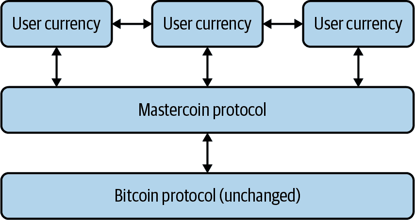
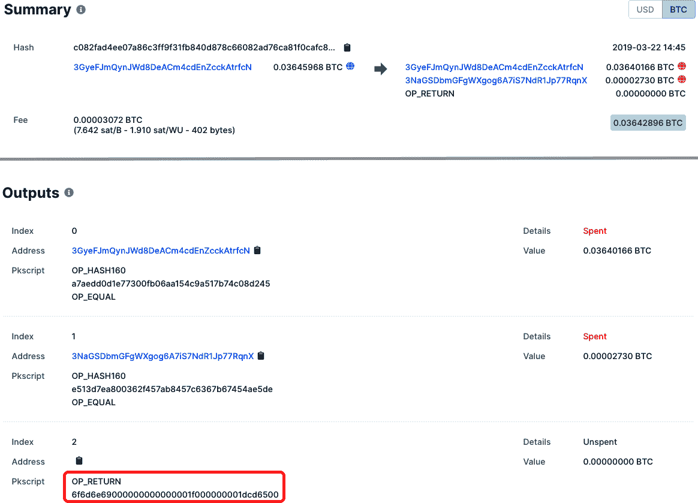
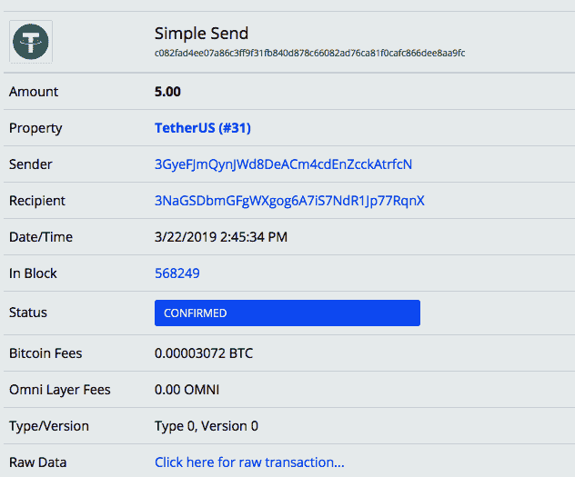
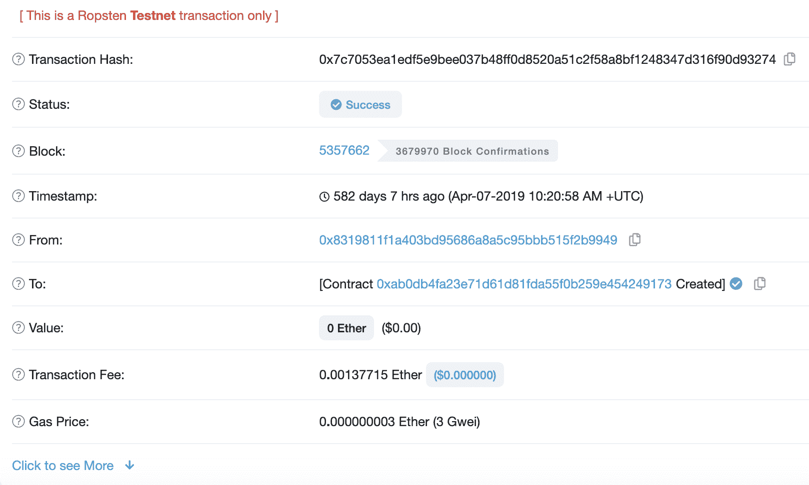
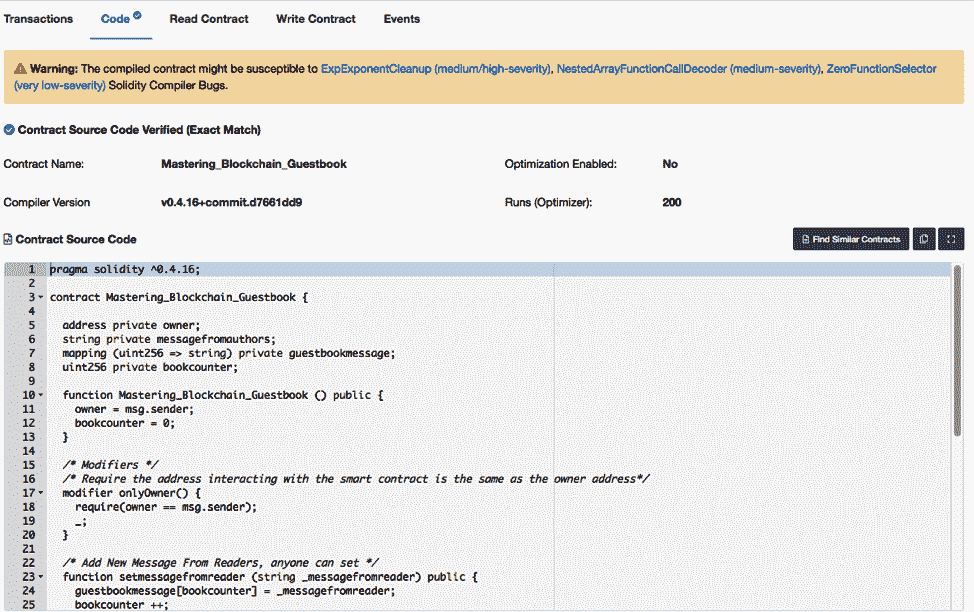
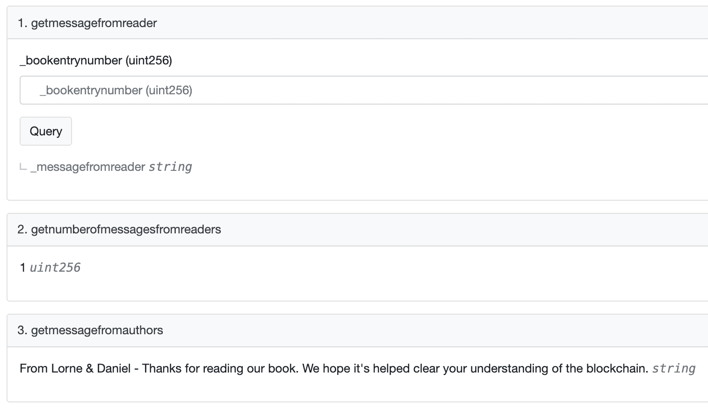
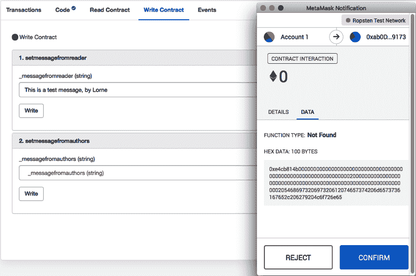
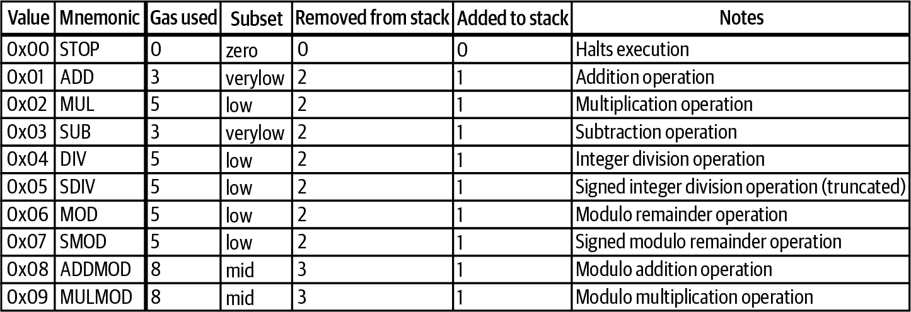

# 第四章。演变到以太坊

在早期，比特币被视为一种全方位的技术奇迹。然而，随着时间的推移，开发人员开始意识到区块链技术可以支持额外的功能。这导致了在比特币之上引入新概念，然后是一个完全新的被称为以太坊的区块链的出现。

# 提高比特币的有限功能

比特币是第一个应用*脚本货币*概念的去中心化共识协议——也就是说，加密货币交易可以根据运行有限程序的真/假状态传输资金的想法。最初，许多人将比特币视为“可编程货币”，但由于其功能有限，脚本货币更能作为一个更好的类比。同样，在早期，比特币通常被视为一种货币，但在发展过程中，它开始被看作更多的是一种*价值储存*，并引发了关于这两者之间差异的许多争论。

比特币的演变导致了开发者社区中一群有影响力且热情的追随者倡导对协议更为谨慎和有限的变更，出于安全和安全原因。诸如增加区块大小等协议更改被视为持怀疑态度。这些倡导者希望保持保持去中心化和包容性的核心目标，以至于任何人都可以在廉价硬件上以低吞吐量的互联网连接运行一个完整节点。

正如我们在前一章中提到的，一些比特币开发者促使了向扩展解决方案的运动。随着开发人员开始构想在其上构建的方式，比特币成为了将成为可编程货币的基础，随后又构建了完全新的区块链。

## 彩色币和代币

*彩色硬币*使得真实世界资产，如股票或商品（如黄金），可以在比特币区块链上进行表示和管理。比特币的脚本语言被有意设计为*图灵不完全*，这意味着可用的内置命令是有限的，以减少网络中的复杂性。因此，彩色硬币是在比特币区块链之上构建的，而不是直接在比特币区块链上构建的。

比特币的范围有限。然而，其区块链使得存储少量数据或元数据成为可能。一些其他资产的表示可以通过一个地址（例如，*17VZNX1SN5NtKa8UQFxwQbFeFc3iqRYhem*）来归因于某些比特币的价值。彩色硬币的概念引入了*代币*的想法，这是通过在现有区块链上编程一个唯一分类账来构建价值单位的。代币通常看起来和其他加密货币类似，唯一的例外是它们由另一个区块链网络提供支持。代币对以太坊生态系统的发展起到了基础作用，而比特币上的彩色硬币的出现导致了其他区块链上的代币。

## [Mastercoin 和智能合约](http://www.mastercoinfoundation.org)

2013 年，比特币扩容解决方案的演进在[Mastercoin](http://www.mastercoinfoundation.org)的发展中得到了推进。Mastercoin 是在比特币之上构建的，以添加比特币核心协议中原本不包括的功能。这使得比特币的简单功能之外可以实现更复杂的可编程货币概念。其中之一就是*智能合约*的概念，即在区块链上运行的复杂程序。

Mastercoin[引入了额外加密货币](https://oreil.ly/oEFfK)或代币的概念。在 Mastercoin 之前，创建新的加密货币并非易事，除了软件分叉。通过智能合约允许将发送到钱包的资金重新路由到另一个钱包并不是比特币的功能。实质上，Mastercoin，尽管现在被认为是原始的，成为了研究比特币功能和探索新功能的学习项目。

Mastercoin（及其发明者 J.R. Willett）还被认为是提供了第一个*初始币发行*（ICO）的人，这是一种基于区块链的募资机制，旨在为初始协议开发提供资金。

## 理解 Omni Layer

[Omni Layer](https://www.omnilayer.org)是一个建立在比特币上的开源、分散的资产基础设施。它是由 Mastercoin 基金会在 2013 年的 ICO 资金支持下产生的工作的继任者。Omni Layer 是一个持续进行的项目，其参考实现称为 Omni Core。

Omni Core 本质上增强了比特币的元素，并附加了额外的功能。它还提供了智能合约的能力，使开发者能够以分散且透明的方式自动化货币功能。智能合约允许交易和协议在区块链上执行，执行超出货币操作的功能。这些功能包括使用代币在其他区块链协议之上创建新的加密货币（在第五章中解释的其他属性中）。图 4-1 展示了 Omni 工作的基本结构。



###### 图 4-1. Omni Layer 技术栈概览

在 Omni 上创建的代币包括[MaidSafe](https://maidsafe.net)，这是由工程师 David Irvine 在 2006 年首次提出的去中心化自治数据网络。MaidSafe 后来通过使用智能合约技术实施 Omni Layer，通过 ICO 创建了 MAID 代币，该代币在网络内使用。

### Tether

Omni 上最知名的项目是[Tether](https://oreil.ly/sM9CP)。它涵盖了加密货币世界中非常重要的一个用例：如何在波动性代币的生态系统中代表稳定的资产类别。Tether 是一种数字区块链加密货币，其目标是提供与美元挂钩的稳定储备货币。根据 Tether 的白皮书，一个 Tether 代币挂钩一个美元。

在区块链上代表现实世界资产确实存在问题。也就是说，如何实际上将该资产的价值固定在代币化形式上？Tether 声称其由美元支持，但不幸的是，除了[其网站列出的余额](https://oreil.ly/4Qjjs)之外，几乎没有证据表明每一个流通中的 Tether 确实有一个美元存放在银行账户中。Tether 背后的公司承诺对其与美元的一对一挂钩进行全面审计，但在 2018 年[解除了与其会计师事务所的关系](https://oreil.ly/i3Nz1)，并没有解释原因。市场上未清算的 Tether 总量任意波动，甚至 Tether 在市场上[失去了与美元一对一挂钩](https://oreil.ly/5mYlZ)，然后又在没有太多解释的情况下恢复了。

虽然 Tether 是一种有趣的早期代币化用例，是 Mastercoin 的继任者 Omni Layer 的实施，但它仍然是非常试验性的。这表明，将数字区块链加密货币（如 Tether）以美元等实际世界资产作为支撑仍然是高度投机性的，并且仍在不断改进中。

### Omni Layer 的工作原理

Omni Layer 团队着手构建 J.R. Willett 在他的[“第二篇比特币白皮书”](https://oreil.ly/fbRRU)中承诺的所有功能。这些功能包括以下内容：

自定义货币

任何人都可以创建由 Omni Layer 网络管理账本的货币。

分散式交易所

不使用中心化交易所来促进双方之间两种货币的交换，而是 Omni Layer 代码执行此交易。

在启动基于工作证明的区块链时，建立一个强大的矿工网络来专门分配*哈希算力*（计算基础设施）来处理交易至关重要。网络越大，去中心化、可信任和安全性就越高。

Omni 希望专注于在去中心化区块链上使代币化和其他智能合约功能正常运作，而无需建立该网络效应的负担。通过在比特币之上构建一个第二层协议，Omni 受益于比特币已经拥有的庞大网络效应。

### 添加自定义逻辑

比特币执行*逻辑操作*——维护区块链的规则，证明了实现共识的基本概念的可行性。Omni 向比特币区块链添加自定义逻辑操作。

在 2014 年 3 月之后，比特币添加了 `OP_RETURN` 字段，该字段使得可以将额外数据附加到比特币交易中。一旦 `OP_RETURN` 字段被添加到比特币中，每个 Omni 交易都开始在比特币交易的 `OP_RETURN` 字段中存储一个记录。

图 4-2 显示了在比特币区块链上记录的 Tether 交易示例。这是一笔小额交易，为五个 Tether，也称为 USDT。在比特币区块链上的交易 ID 是：

```
c082fad4ee07a86c3ff9f31fb840d878c66082ad76ca81f0cafc866dee8aa9fc
```



###### 图 4-2。比特币区块链上 Omni 交易的示例

这是一个包含 Omni Layer 元数据的 [比特币交易](https://oreil.ly/svm8A)。Omni 交易唯一的区别在于 `OP_RETURN` 字段。Omni 使用 `OP_RETURN` 是因为它提供了足够的空间并且易于使用。`OP_RETURN` 字段中的元数据转换为发送了五个 USDT。图 4-3 在 [Omniexplorer](https://oreil.ly/8WEPB) 中显示了相同的交易。注意交易 ID 是相同的。



###### 图 4-3\. 图 4-2 中的 Tether 交易在 Omniexplorer 中的显示

`OP_RETURN` 字段的值，`6f6d6e69000000000000001f000000001dcd6500`，是记录 UDST 交易的 Omni Layer 元数据。该元数据以十六进制格式编码，表 4-1 将其转换为 ASCII 或十进制格式。

表 4-1\. 转换 OP_RETURN

| **存储在 OP_RETURN 中的值（十六进制）** | **作为 ASCII 或十进制** | **描述** |
| --- | --- | --- |
| `6f6d6e69` | omni | Omni 标志，用于识别 Omni 交易。 |
| `00000000` | 简单发送 | 交易类型。 |
| `0000001f` | 31 | 属性类型为 31，即 USDT。您可以在 [Omniexplorer 网站](https://www.omniexplorer.info/properties/production) 上查看所有 Omni Layer 属性。 |
| `000000001dcd6500` | 5.00000000 | 发送的金额为 5.00000000。Omni Layer 交易都包含八位小数。 |

# 以太坊：将 Mastercoin 带入下一个层次

以太坊代表了加密货币网络设计和思考的演进。它是一个更具功能性和通用计算协议，汲取了比特币和 Mastercoin 等项目的概念。

以太坊概念最初由 Vitalik Buterin 在 2013 年提出。在游说 Mastercoin 基金会对[其协议](https://oreil.ly/_Fq6p)进行更改并添加更多功能后，以及注意到他们不愿这样做时，Buterin 开始与 Gavin Wood 以及随后其他创始人合作创建以太坊协议。

以太坊的目标是将 Mastercoin 推向下一个水平——即创建一个通过共识进行安全保障的去中心化、开放式计算机系统。尽管 Buterin 想象中以太坊将拥有与比特币的工作量证明机制不同的替代机制，他认为比特币的机制是浪费的，但目前以太坊使用了类似比特币的工作量证明算法，称为*Ethash*。预计以太坊将来会转向一种名为权益证明的安全模型——这是一个改变协议内挖矿范式的雄心勃勃的项目，更多讨论见第十章。

## 以太和 Gas

以太坊的记账单位是*以太*。这种加密货币的行为方式与比特币类似，具有类似的交易地址命名规范。以太坊地址以序列`0x`开头。区块链的确认时间要快得多，除了周期性的网络拥堵外，以太坊被认为是比特币的转账机制要快得多。

如第二章所述，比特币使用未花费的交易输出（UTXO）结构来跟踪账户中的余额。以太坊跟踪账户状态中的余额。UTXO 就像是拥有实物现金——纸币和硬币。以太坊的方法就像是把所有资金都放在银行账户中。使用 UTXO，支付和计算账户余额要复杂得多。

例如，假设你在咖啡店。你口袋里有三张 1 美元的钞票，你想花 1.50 美元买一杯咖啡。你不能给收银员 1.50 美元；你必须给他们两张 1 美元的钞票，并拿回 0.50 美元的零钱。之后，如果你想知道你还有多少钱可以花，你必须计算口袋里所有钞票和硬币的价值。

比特币也是同样的情况。假设你的比特币地址接收了三笔独立的 1 BTC 交易，并且你想要给朋友发送 1.5 BTC。就像用实体现金一样，你不能发送 1.5 BTC；你必须发送 2 BTC。这是因为你过去收到的每一笔 1 BTC 交易必须作为整数金额来花费。因此，你发送两笔之前的 1 BTC 交易，然后你会得到 0.5 BTC 的零钱。这个过程在一次比特币交易中发生。

以太坊交易要简单得多，类似于在银行账户中发送和接收存款。如果你的以太坊地址接收了三笔独立的 1 ETH 交易，那么在网络上显示的余额将是 3 ETH。没有必要自己计算账户余额，通过添加不同的交易。如果你想要发送 1.5 ETH，你可以只发送 1.5 ETH；没有必要发送更多并收到零钱。

以太坊还提供了额外的功能。它借鉴了比特币和 Mastercoin 的元素，创建了基于应用的区块链交易，这意味着它提供的功能不仅仅是帐户间的发送和接收。以太坊还有另一种单位叫做 *gas*。Gas 使开发人员能够在以太坊平台上运行应用程序——这些应用程序被称为 *去中心化应用程序*，或称为 *dapps*（在本章后面详细讨论）。

Gas 还解决了在区块链上运行编程语言时的一个危险。开发者可以在以太坊上运行 dapp 而不会遇到所谓的 *停机问题*，或者无法阻止无限期运行或 *无限循环* 的代码。以太坊要求使用 gas 来计算智能合约中执行的代码的计算，以使 dapp 尽可能高效。在每个以太坊交易中，开发者都指定一个 gas 限制，所以如果存在无限循环，交易最终会用完 gas，并且矿工仍然会因运行交易而获得费用。

## 用例：ICO

有许多应用于使用智能合约的计算机化交易协议。Ian Grigg 在 1996 年提出的[里卡尔迪安合约](https://oreil.ly/OwjiK)的概念为这项技术的用例提供了见解。创新包括使用密码哈希函数进行标识，并将法律要素定义为计算机可读的。通过能够执行一组指令（通过智能合约）并将其与会计系统（通过区块链）关联起来，以太坊平台可以用于运行许多不同的 dapp。

在以太坊发布后的早期几年，开发者生态系统需要时间来成长。但开发者们意识到，其中最强大的能力之一是通过智能合约（前文提到的 ICO）以自动化和安全的方式筹集加密货币资金的可能性。例如，一个需要筹集资金来启动概念的项目可以设置一个智能合约来接收以太币。作为回报，它可以给予捐赠者一种建立在以太坊之上的可兑换加密货币。

###### 注意

ICO 的合法性存在争议，许多项目因引发法律问题而被迫提前结束。这个问题在第九章中有更详细的讨论。

筹集加密货币资金来启动项目的想法并非起源于以太坊。企业家埃里克·福尔希斯（Erik Voorhees）在 2012 年使用接受比特币换取数字“股份”的基本机制来筹集资金，以资助基于区块链的赌博网站 Satoshi Dice（[链接](https://oreil.ly/HdGAx)）。Mastercoin 也采用了这个概念，尽管方式更加有组织。

MaidSafe 的 ICO 过度售出，以至于捐赠者最终不得不使用 mastercoin 而不是 safecoin 来[兑换收到的比特币](https://oreil.ly/dXxuZ)。诸如此类的技术故障突显了对更可靠的加密货币筹款平台的需求。随着时间的推移，随着以太坊的成熟，其智能合约平台与在以太坊区块链上创建代币的能力相结合，使其成为启动各种加密货币项目的理想自动化筹款装置。

## 去中心化自治组织

为了进一步推进以太坊生态系统中去中心化的理念，提出了*去中心化自治组织*（DAO）的概念，这是利用智能合约来取代中央当局的治理的一种方式。就像 ICO 概念取代了*首次公开发行*（IPO）的中央化功能一样，DAO 利用加密货币筹款项目创建了一个分布式治理系统，ICO 投资者拥有与在 ICO 中购买的代币所有权相称的投票权。

这个概念在一个名为*The DAO*的项目中经受了最严峻的考验。The DAO 于 2016 年 4 月推出，是一个基于以太坊的智能合约 ICO 项目，旨在实现自主运行。筹集资金投资技术项目的决定将基于代币持有人的投票权。The DAO 能够通过以太坊代币从一万名投资者那里筹集超过[$154 million](https://oreil.ly/wtKJ_)。

### Ethereum 的分叉和以太经典的创建

在其推出后，The DAO 的智能合约代码中发现了一些漏洞。其中一个问题包括了一种[递归调用漏洞](https://oreil.ly/vPK-u)。程序员们已经在代码中找到了一个缺陷：当资金从钱包中提取时，在函数调用结束后才更新余额。如果在初始调用完成之前可以再次调用相同的函数，那么就有可能一遍又一遍地提取相同的资金——这是一种*无限递归*的问题。

他们立即宣布已经确定了这个漏洞，并将对其进行修复，但在他们成功推出更新之前，在 2016 年 6 月 17 日，这个漏洞就被攻击者利用，成功地从 The DAO 中窃取了超过 5000 万美元的以太币。The DAO 的开发人员无法更新部署的合约代码本身，因为它被不可变地存储在区块链上。纠正这种情况的唯一方法是部署一个新的合约并将剩余的资金转移过去——这是一个繁琐而痛苦的过程。

此事件导致以太坊基金会分叉以太坊区块链，以撤销损害。它创建了两个不同版本的以太坊：原始区块链中仍将被盗资金归功于攻击者的以太经典，和一个取消上述资金的分叉版本，继续被称为以太坊。这次硬分叉将被盗资金移至一个恢复地址，以便它们的合法所有者可以取回。

分叉意味着改变以太坊区块链，以便 The DAO 黑客实际上从未发生过，这违反了不可变性原则。这是一个备受争议的决定，遭到了社区的一些成员的抵制，他们选择继续使用未经改动的区块链版本。以太经典是一个智能合约区块链，今天仍然存在，但其开发社区规模较小，没有以太坊那样健壮。

### 其他以太坊分叉

DAO 骇客事件让加密货币社区接受了分叉的概念。 除了创建以太坊经典（Ethereum Classic）之外，以太坊区块链已经 [多次分叉](https://oreil.ly/kV0Xr) 来弥补漏洞和代码中的其他变化。 以太坊项目理解需要进行实验，当整个社区认为升级对整个社区至关重要时，分叉被视为比维持不变性概念更好的选择。 以太坊生态系统对分叉其区块链并为此类变化聚集足够的动力没有任何顾虑。 这种态度与其他链形成鲜明对比，例如比特币，那里的不变性是神圣不可侵犯的。

## 以太坊生态系统中的关键组织

在以太坊生态系统中，多个利益相关者和组织支持以太坊正在构建的愿景，并且每个组织都从自己的角度支持它。

### 以太坊基金会

作为制定路线图并进一步改变以太坊平台的领导者，[以太坊基金会](https://ethereum.org) 在社区中拥有重要的影响力。 它还资助与平台相关的可扩展性项目，包括 [Plasma](https://oreil.ly/SrG8m)，这是一个旨在增加平台上交易数量而不影响网络安全性的解决方案。

以太坊基金会的前身是一家瑞士非营利实体，发起了以太坊的 ICO。 在比特币社区筹集 [超过 1800 万美元](https://oreil.ly/3TzPj) 后，瑞士实体将这些资金转移给了以太坊基金会，后者一直是上述开发工作的主要资金提供者。

### 企业以太坊联盟

早在 2017 年初宣布的[企业以太坊联盟（EEA）](https://entethalliance.org)旨在联合对以太坊区块链解决方案部署感兴趣的企业实体。EEA 的成员包括 IBM 和微软，支持在 Azure 上运行以太坊区块链服务。

EEA 的主要目标之一是在企业业务环境中找到区块链特定用例。许多大型组织对区块链的加密货币方面持谨慎态度，因为存在合规性和其他监管方面的担忧。在企业端正在进行的与以太坊相关的工作很大一部分涉及分叉以创建*私有区块链*，将代币与公共加密货币市场分开。第九章进一步讨论了私有和许可区块链。

### Parity

[Parity](https://www.parity.io)是一家总部位于伦敦的软件解决方案公司，由以太坊的原始创始人之一加文·伍德创立，他在以太坊协议概念形成的早期就贡献了代码。Parity 已部署了几个开发工具，使以太坊更容易部署，包括参考框架。

该公司因于 2017 年成为“Parity 黑客事件”的受害者而闻名，当时价值 3000 万美元的以太被一名不知名的攻击者窃取。这是继 The DAO 之后的第二大以太坊黑客事件；它利用了 Parity 多重签名钱包中的漏洞，使攻击者能够发送两笔交易，其中一笔包括[在代码中更改钱包地址的抽象逻辑](https://oreil.ly/jeGwj)。

### ConsenSys

由以太坊联合创始人 Joseph Lubin 创立的[ConsenSys](https://consensys.net)是一个组织，致力于开发企业应用程序，投资初创公司，构建开发者工具，并为以太坊网络提供区块链教育。该组织专注于 dapp 的开发。其产品包括 Truffle Suite，这是一个使以太坊开发更容易的框架，以及 Gitcoin，一个为以太坊区块链提供灵感的 GitHub 式漏洞赏金工具。

ConsenSys 也有一个使命，即在以太坊生态系统内创建消费者友好的工具。其中最著名的之一是 MetaMask，这是一个基于浏览器的以太坊钱包，可以使使用去中心化应用程序变得更加简单。ConsenSys 还资助了创建 dapp 和其他有用应用程序的项目。

# 去中心化应用程序（Dapps）

我们已经提到过，通过智能合约在区块链上运行的应用程序被称为去中心化应用程序，或*dapps*。Dapps 通常使用在区块链上运行的智能合约作为后端，并具有一个与之交互的轻量级前端 UI。这类应用程序类似于客户端/服务器架构，其中服务器是智能合约。这些类型的应用程序使区块链更具可编程性和功能性。

一个 dapp 基本上是在智能合约平台上运行的任何计算机程序，而今天最大的平台就是以太坊。正如我们在第一章中讨论的那样，在计算机科学中，*分布式系统*是指其组件位于不同的计算资源上，并且存在用于这些资源之间进行通信的系统。分布式系统的例子包括许多电信网络和互联网。

还有其他平台提供 dapp 的能力，但以太坊是迄今为止开发者执行分布式代码的最大平台。

## 使用案例

Dapp 的一个关键特征是不可变性，这意味着在将代码发布到区块链后，没有集中的权威可以更改它。因此，Dapps 的用例通常出现在集中式系统存在瓶颈的地方。例如，许多集中式应用程序不具有抗审查性。在许多集中式应用程序中，第三方决定用户可以看到什么和不能看到什么。通常这些决定是主观的、看似武断的，并且没有用户参与。通过使用像以太坊和 web 这样的后端平台，开发人员可以部署无需许可的应用程序，这与它们的集中式对应物大不相同。

Dapps 的另一个特征是，它们通过使用区块链实现了数字资产的高效和安全转移。例如，今天许多应用程序提供了防止审查（考虑[BitTorrent](https://www.bittorrent.com)）和隐私（通过加密）的功能。然而，除了这两个特性之外，Dapps 能够实现价值的快速和程序化转移。

###### 注意

Dapp 平台相对较新。关于如何最佳地创建它们以及用于此目的的基础设施仍处于成长阶段，有很多东西需要学习。Dapps 的使用尚不广泛。实际上，对于它们的吸引力和持久力还存在一些疑问，一些当今的 Dapps 的目的似乎是不端的。许多设计是为了避免监管审查，目前有大量的赌博、游戏和去中心化交易 Dapps 在使用。

## 开发 Dapps 面临的挑战

当今创建 Dapps 存在一些[设计挑战](https://oreil.ly/7kI4n)，包括部署、用户体验、速度和可扩展性等方面的关注点。这些问题目前存在于所有 Dapp 平台上，包括以太坊。

当开发者为 dapp 部署智能合约时，他们需要确保其代码不包含关键缺陷。更新合约并不容易。大多数智能合约平台，包括以太坊，在同一地址上不允许重新部署。此外，升级通常涉及智能合约管理的状态的困难数据迁移。

开发者可以在四个以太坊测试网络中测试他们的 dapp。负责任的 dapp 开发者会花费数月时间让专业的安全审计员（Quantstamp、OpenZeppelin）审计他们的合约，然后将审计报告发布给公众。在此期间，他们还会邀请社区成员通过 GitHub 审计他们的智能合约。

与集中式应用程序不同，用户的体验是连续的，部署新的智能合约代码可能会导致用户体验中断。此外，dapp 的速度取决于区块链的速度和确认时间。这个问题在 2017 年底的以太坊上凸显出来，当时 dapp CryptoKitties 的流行导致[大量交易拥堵了以太坊网络](https://oreil.ly/h3N1u)。这使得该 dapp 在热情消退之前几乎无法使用。

现在你已经有了一些背景知识，让我们更深入地探讨一下编写、部署和使用以太坊智能合约。

# 在以太坊中部署和执行智能合约

智能合约自 1990 年代首次提出概念以来已经发展了很长一段路程。Omni Layer 证明了在区块链之上运行 dapp 是可能的，但它有许多限制，其中最大的限制是谁被授权编写和部署 dapp。如果有人想要部署 dapp，则必须说服平台的开发人员将其添加到 Omni Core 代码中。实际上，Omni Core 是所有代码都部署的 dapp。代码的开发是集中的，只有 Omni Core 开发人员才能更新它。想要自己部署 dapp 的开发人员必须探索其他选项，例如分叉 Omni Core 并制作自己的客户端，该客户端运行在比特币之上——这并不是一项容易的任务。

Omni Core 的其他限制包括以下内容：

区块链扩展和速度依赖于比特币及其核心开发人员

Omni Core 对其所运行的区块链的未来影响仍然有限。

比特币区块链并非设计用于程序执行。

它被优化为价值存储，其有限的脚本语言意味着它永远不适用于直接构建在区块链之上的复杂智能合约。例如，`OP_RETURN` 字段的存储限制为 80 字节，这限制了你可以在 Omni Layer 中运行的程序类型。

## 以太坊虚拟机

以太坊虚拟机（EVM）使开发人员能够轻松创建 dapps，并让网络执行它们。EVM 的目的有两个：

1.  允许开发人员将智能合约部署到区块链上

1.  指导矿工如何执行嵌入到其运行的软件中的 EVM 智能合约代码

### 编写智能合约

开发人员可以使用几种不同的语言编写智能合约。最常见的语言是[Solidity](https://oreil.ly/oUDzV)。

###### 提示

ConsenSys 发布了一套工具，以便开发人员使用 Solidity 编写、调试和部署智能合约，称为[Truffle Suite](https://truffleframework.com)。

要与智能合约交互，您需要一个以太坊钱包。最流行的钱包是[MetaMask](https://metamask.io)，它是一个浏览器扩展程序。该钱包在您的机器上本地存储了您的助记词和私钥的副本。

###### 注意

助记词和私钥不是集中存储的。重要的是要将助记词的物理副本（例如，纸质副本）制作一份并存放在安全的地方，以备不时之需。此外，使用硬件钱包而不是依赖于钱包软件本地保存私钥可以增加安全性。有关钱包选择的更多信息，请参阅第二章。

在将你的智能合约部署到以太坊主网之前，将其在最常见的测试网络之一上进行测试是明智的选择：

+   [Ropsten](https://ropsten.etherscan.io)

+   [Rinkeby](https://www.rinkeby.io)

+   [Kovan](https://kovan-testnet.github.io/website)

+   [Görli](https://goerli.net)

智能合约开发人员需要花费以太币作为燃气的形式来部署和更改合约的状态。所有以太坊测试网络都有*水龙头*，您可以免费获取测试网 ETH（tETH）。这些测试网络是智能合约的理想分期环境。

### 部署智能合约

开发人员编写了智能合约后，可以将其发布到*主网*或生产环境，也可以发布到任何测试网络。发布是通过将智能合约交易发送到以太坊网络来完成的。生成这笔交易的最简单方法是使用[Ethereum Remix 工具](https://remix.ethereum.org)。

Remix 是一个基于云的集成开发环境（IDE），用于智能合约开发。它支持 Solidity 和 Vyper 语言，由于它是一个网站，因此无需安装软件。它允许开发人员编写、调试、编译和分发智能合约代码到以太坊网络，包括主网和测试网环境。

图 4-4 展示了在 Remix 上部署 [*Mastering_Blockchain_Guestbook.sol*](https://github.com/Mastering-Blockchain-Book) 智能合约的样子。在这种情况下，它被部署到了 Ropsten 网络。


###### 图 4-4\. 通过 Remix 将 Mastering_Blockchain_Guestbook.sol 智能合约部署到以太坊网络的过程

要部署智能合约，您必须点击 Deploy 按钮。然后 Remix 将交易数据发送到 MetaMask，后者会请求您的授权以完成交易。

授权交易后，MetaMask 将一个智能合约创建交易推送到网络。图 4-5 展示了这个过程的样子。



###### 图 4-5\. 创建智能合约的[交易](https://oreil.ly/Y2eSZ)的详细信息

在此交易中请注意以下内容：

+   交易的价值为 0 以太币，表示未转移任何以太币。

+   该交易正在记录在区块 #5357662。

+   发现此区块的矿工将获得 0.00137715 测试网以太币（tETH）的交易费。

以太坊网络处理完交易后，将智能合约以字节码格式存储在以太坊网络上，这样可以占用更少的空间，如 图 4-6 所示。


###### 图 4-6\. 智能合约代码从开发到生产经历的不同层次

由于智能合约代码在以太坊测试网络上，它是[公开可见的](https://oreil.ly/tHshF)（参见图 4-7）。



###### 图 4-7。部署在 etherscan.io 上的智能合约代码查看

当创建智能合约时，它会被分配一个以太坊地址。这个以太坊地址可以持有以太币余额，并像普通以太坊地址一样发送/接收以太币。

### 与智能合约交互

现在，留言板智能合约已部署到以太坊测试网络，可以开始从中读取数据并向其写入数据。要从合约中读取数据，只需直接与网络通信，就像调用公共 API 一样。但是，要向合约写入数据，必须向合约地址发送交易。

与智能合约的所有读/写交互都需要合约的*应用二进制接口*（ABI）的引用。ABI 类似于智能合约的 API。ABI 是机器可读的，意味着客户端软件可以轻松解析它，以了解如何与合约代码交互。ABI 记录了所有函数及其属性。

这里是留言板智能合约的 ABI：

```
[{"constant":true,"inputs":[{"name":"_bookentrynumber","type":"uint256"}],
"name":"getmessagefromreader","outputs":[{"name":"_messagefromreader",
"type":"string"}],"payable":false,"stateMutability":"view","type":"function"},
{"constant":true,"inputs":[],"name":"getnumberofmessagesfromreaders",
"outputs":[{"name":"_numberofmessages","type":"uint256"}],"payable":false,
"stateMutability":"view","type":"function"},
{"constant":true,"inputs":[],"name":"getmessagefromauthors",
"outputs":[{"name":"_name","type":"string"}],"payable":false,
"stateMutability":"view","type":"function"},
{"constant":false,"inputs":[{"name":"_messagefromreader","type":"string"}],
"name":"setmessagefromreader","outputs":[],"payable":false,
"stateMutability":"nonpayable","type":"function"},
{"constant":false,"inputs":[{"name":"_messagefromauthors","type":"string"}],
"name":"setmessagefromauthors","outputs":[],"payable":false,
"stateMutability":"nonpayable","type":"function"},
{"inputs":[],"payable":false,"stateMutability":"nonpayable","type":"constructor"}]
```

### 读取智能合约

让我们读取[留言板智能合约](https://oreil.ly/thsoP)中的数据。你应该会看到类似图 4-8 的东西。



###### 图 4-8。查看已部署智能合约的只读函数

本图显示了留言板智能合约具有的三个读函数。第一个函数需要输入才能返回数据，而另外两个则不需要。

### 编写智能合约

现在让我们向[留言板智能合约](https://oreil.ly/VxE2M)写入一些数据。这会类似于图 4-9。



###### 图 4-9。调用已部署智能合约的仅写函数

MetaMask 浏览器扩展将为您提供连接到网站的选择。连接到网站后，您可以开始向合约编写数据。请注意，当您点击确认时，会发生两件事情：

+   Etherscan 生成一个新交易，并用正确的数据填充它，并将其推送到您的 MetaMask 钱包。

+   然后，MetaMask 请求授权发送该交易。

在您点击确认后，您的交易将被推送到以太坊网络。

### 执行智能合约

作为区块发现的一部分，以太坊矿工以与比特币矿工类似的方式将交易添加到区块中。交易可以触发两种主要操作：

付款

从地址 A 向地址 B 发送以太币价值。

执行

执行智能合约。

如果以下条件成立，则矿工将通过以太坊虚拟机（EVM）执行智能合约代码：

+   接收地址是一个智能合约。

+   数据有效负载包含数据。

早期的测试消息示例创建了一个[交易](https://oreil.ly/SEAH8)，其中接收地址是*Mastering_Blockchain_Guestbook*智能合约，数据有效负载包含以下数据：

```
Function: setmessagefromreader(string_messagefromreader)

MethodID: 0xe4cb814b
[0]: 0000000000000000000000000000000000000000000000000000000000000020
[1]: 0000000000000000000000000000000000000000000000000000000000000020
[2]: 5468697320697320612074657374206d6573736167652c206279204c6f726e65
```

## Gas 和定价

正如我们所讨论的，Gas 是以太坊生态系统中用于计算矿工处理交易的酬劳的记账单位。当矿工通过 EVM 执行智能合约交易时，矿工执行*操作码*——以智能合约编写的机器级指令。它运行的每个操作码都与一个 Gas 价格相关联。

图 4-10 展示了操作码和 Gas 价格的示例。



###### 图 4-10。操作码的 Gas 价格列表

燃气是必需的，因为它奖励矿工通过智能合约处理交易。它还保护网络免受垃圾邮件和拒绝服务攻击。燃气以以太币支付。矿工在发现区块时接收固定的区块奖励，以及从处理所有智能合约代码中接收的燃气的以太币。

在构建交易时，您需要输入两个与燃气相关的字段：

燃气价格

每单位燃气支付的以太币数量。如果用户希望其交易立即处理，他们可以支付更高的燃气价格，以激励矿工选择他们的交易而不是等待处理的其他交易。

燃气限制

您愿意支付给矿工处理您的交易的最大燃气量。此处指定的燃气量应足以运行预期执行的所有合约函数的所有操作码。

###### 注意

Wei 是以太币 (ETH) 的最小单位，即 10e-18 ETH。美元可分为两位小数。ETH 可分为 18 位小数。正如美元有它的一分钱作为最小的价值单位一样，wei 是以太坊中最小的价值单位。satoshi 是比特币的最小价值单位。

这里还有几种面额：

+   1 wei = 1 wei

+   1 kwei = 1,000 wei

+   1 mwei = 1,000,000 wei

+   1 gwei = 1,000,000,000 wei

###### 提示

[ETH Gas Station](https://ethgasstation.info) 是一个非常有用的网站，可以根据当前网络使用情况计算您应该支付的燃气价格。

在早期的留言板智能合约示例中，我们写了一条测试消息，金额如下：

+   *燃气限制：* 128,050

+   *交易使用的燃气：* 85,367 (66.67%)

+   *燃气价格：* 0.000000001 以太币 (1 gwei)

## 与代码交互

这里有几种与以太坊网络进行编程交互的流行方法：

Web3.js

开发人员使其网站与 MetaMask 和智能合约进行交互的最常见方法是通过[Web3.js](https://oreil.ly/6PAvl)，一个 Node.js 库。

Infura

另一个流行的选择是[Infura](https://infura.io)，它为以太坊网络提供了 REST API。这个 API 的结构对开发者来说是熟悉的。使用 Infura 的优势在于，部署的学习曲线要低得多，因为它处理了对以太坊的访问。缺点是开发者必须信任 Infura 来正确地保护和传递数据。

# 摘要

以公开提出的想法为起点，以今天的完整网络为目标，以太坊生态系统从 2014 年迅速发展起来。由于其智能合约属性以及在生态系统中创建的大量资源和工具，许多开发者现在选择在以太坊上构建而不是比特币上。以太坊和比特币确实共享一些技术，但它们的发展方向肯定是不同的。
