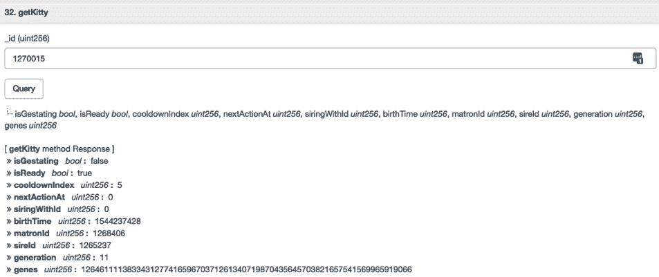
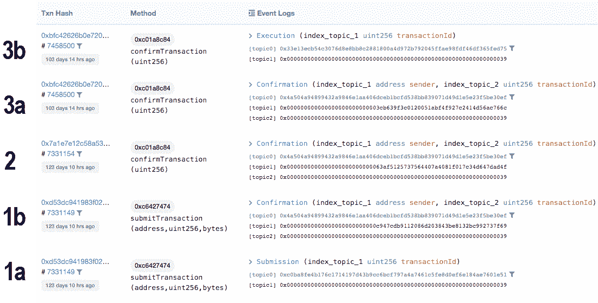
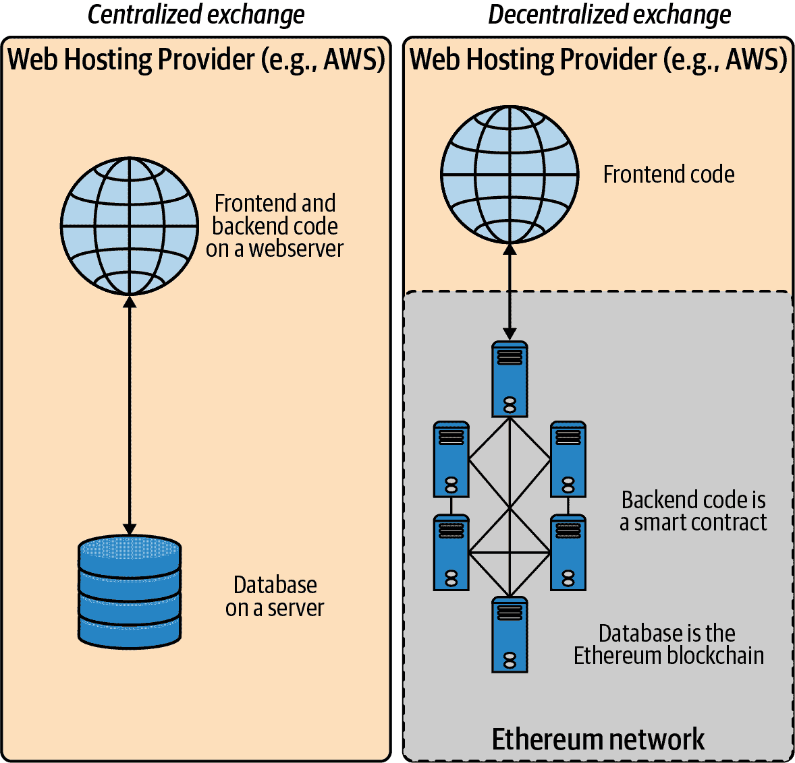

# 第五章。一切都可代币化

比特币的出现为开发者提供了探索不同类型加密货币的机会。然而，完全新的技术以太坊给了编码者在其区块链上轻松创建新加密货币（被称为*代币*）的能力。今天，多亏了以太坊，有成千上万种加密货币。以太坊网络通过初始代币发行（ICOs）引发了“一切都可代币化”的概念的蓬勃发展，这使得项目可以筹集加密货币资金，并向投资者提供代币作为交换。本章将探讨这是如何发生的。我们将首先介绍几个显著的例子：

Mastercoin

开发者 J.R. Willett 在 2011 年开始研究 Mastercoin 白皮书。他的[目标](https://oreil.ly/tVC-J)并非“像其他加密货币一样启动一个全新的区块链”，而是“在比特币本身之上创建一个全新的货币、商品和证券网络”。Willett 最终意识到，通过比特币的社区支持可能有助于促进采用。因此，他于 2013 年举行了第一次“代币发售”，或 ICO。这使得 Mastercoin 在当时筹集了[3,700 BTC，约为 230 万美元](https://oreil.ly/UXrMe)。

以太坊

正如前一章所述，以太坊的起源可以追溯到 2013 年 11 月，当时 Vitalik Buterin 开始传阅一份白皮书，提出了一个基于比特币、Mastercoin 和其他项目元素的新协议。这份文件在加密货币社区广泛传播，开发者和支持者开始聚集。Buterin 在 2014 年 2 月公开宣布了以太坊项目。

一个总部位于瑞士的非营利基金会成立了进行 ICO，从 2014 年 7 月开始，以太坊进行了为期 42 天的众筹。大约售出了 6000 万以太代币，筹集了大约 31000 BTC（当时约为 1800 万美元）。这成为了许多未来 ICO 的模板。

Gnosis

一个去中心化的预测市场平台，Gnosis 与 Augur 项目共享一些概念和一些人员，Augur 是一个早期基于以太坊的项目，于 2015 年进行了 ICO。Gnosis 的多签钱包仍然是以太坊生态系统中最广泛使用的，特别是用于代币的冷存储等应用。

Gnosis 项目 ICO 最有趣的方面是它采用的荷兰式拍卖系统。这一新颖的概念使代币在 ICO 的时间内价值下降，鼓励投资者等到最后才获得最佳定价。大多数 ICO 是以相反的方式进行的：投资者越早参与，代币越便宜。然而，这被证明是成功的，因为 Gnosis 在 15 分钟内筹集了[超过 3 亿美元](https://oreil.ly/_Cf97)，同时保留了项目及其创始人的 95% 的加密货币。

EOS

EOS.IO 是 Daniel Larimer 的创意，是一个旨在通过将计算资源平均分配给 EOS 加密货币持有者来解决区块链可扩展性问题的区块链协议。该项目在以太坊上使用了一个无上限的代币销售，在一年内筹集了[超过 40 亿美元](https://oreil.ly/79g90)，是有史以来最大的筹资之一。这次发行的是一种名为 EOS 的 ERC-20 代币，一旦他们的原生区块链准备就绪，它们就会被转换为原生代币。

# 以太坊平台上的代币

创建代币使开发人员能够在以太坊网络上创建加密货币。这使任何人都可以使用最知名的加密货币协议之一在区块链上发行资产。[以太坊上的 ERC-20 标准](https://eips.ethereum.org/EIPS/eip-20)是网络上区块链资产的参考实现，为代币拥有能够使它们在许多不同的交易所、钱包和其他区块链服务中使用的属性铺平了道路。确实，还有其他发行代币的区块链平台。但是，今天在以太坊上发行 ERC-20 资产是创建加密货币的最简单、最安全的方法之一。

在技术项目之外，如移动 dapps、分布式计算或支付机制等领域，代币有潜力颠覆现有金融服务，其中仍然存在瓶颈。只要它们能够正确地与现实世界的资产挂钩，区块链和加密货币就有能力代表现实世界中的某种价值。

例如，在复杂的房地产交易中，区块链上的代币可以使所有者更好地记录——俄亥俄州正在[考虑使用区块链来实现此目的](https://oreil.ly/GEupr)。未来，使用代币可以更快速、更轻松地完成资产转移。其他代币可能证明其真实性有用的领域包括艺术品、汽车、股票和债券。

## 可替代和不可替代代币

并非所有代币都是相同的。创建代币时最重要的区分因素之一是它们是*可替代*还是*不可替代*。可替代代币具有相同的价值，并且彼此可互换，而不可替代代币代表的是独特的东西。

可互换资产的例子包括像美元这样的货币。一美元就是一美元，无论它是以硬币或纸币的形式存在，还是以数字形式存在于银行账户或其他金融服务中。大多数加密货币，如比特币、以太币和 ERC-20 资产，也是可互换的。

车辆或房屋等物品是不可互换的——每一个都是独一无二的，不能与其他任何随机的车辆或房屋互换。[CryptoKitties](https://www.cryptokitties.co)—以太坊上以 ERC-721 代币形式表示的数字猫——是不可互换资产的另一个例子（我们稍后在本章中会详细讨论这个例子）。

###### 注意

创建代币有其影响。加密货币市场非常波动。如果一个代币被列入交易所并且仅用于投机，其价格可能会变得非常不稳定。

智能合约开发是计算机科学的一个新兴领域。强烈建议在将代币投入使用之前，让第三方审计员（例如[OpenZeppelin](https://openzeppelin.com/contracts)为本章提供了背景）审查一下您的代码。提供此类服务的其他知名公司包括[Trail of Bits](https://www.trailofbits.com)和[Chainsecurity](https://chainsecurity.com)。

以太坊提供了许多不同类型的代币可以发行。一些流行的类型包括 ERC-20、ERC-721、ERC-223、ERC-777 和 ERC-1400。这种多样性使开发人员能够在以太坊区块链上创建不同类型的功能性加密货币。

###### 注意

有关以太坊代币标准的详尽列表可在[GitHub](https://oreil.ly/zBZ5x)上找到。其中列出的一些代币目前正在使用，而另一些仅仅是提出的想法。

由于以太坊的性质，以太坊区块链上的新型加密货币可能提供现实世界的好处。[ERC-846，提供代币的共享所有权](https://oreil.ly/TbdBg)是一个现实用例的好例子。

## 是否需要代币？

在开发基于区块链的解决方案时，开发人员应该问自己的一个存在性问题是：*是否需要一个代币？* 许多代币化/ICO 项目开发了一个代币用于筹款，但除了拥有一种加密货币外，没有明确的动机。虽然 ICO 是一种利用加密货币进行筹款的好方法，但监管压力正在推动开发人员创建在项目内具有更大功能的代币。

如果一个基于区块链的项目仅用于筹款，那么代币可能对该项目没有用处。此外，任何寻求稳定资产价值的项目都不会发现代币是一个合适的解决方案，尽管像稳定币这样的资产可能是。任何具有不稳定资产的处理功能在未来可能会出现问题。这已经在区块链上以交易费用的形式经历过。例如，比特币网络上的费用可以根据网络需求的大小而变化。需求越大，区块中可用空间就越少，这可能会创建一个费用市场，最高出价者“获胜”。这种供求范式在以太坊中也存在，用于气体费用和代币价格一旦它们进入交易所。

## 空投

正如我们所说，分发代币的主要方式是通过 ICO 或类似的方式。另一个选择是进行*空投*。空投旨在利用已经存在的区块链的网络效应，它是向大量用户免费或低成本分发加密货币的一种方式。其想法是在项目初始阶段快速为项目建立用户群体，从而加速对已经存在的项目/加密货币的采用。到目前为止，最大的案例是恒星基金会通过 Blockchain.info 钱包空投其 XLM 代币的 [$125 million](https://oreil.ly/ch3IJ)。

###### 注意

空投可能看起来是解决新兴加密货币采用的一种方法，但它们并非没有缺点。特别是，用户以零成本获得基于加密货币的资产可能存在税务影响。根据司法管辖区的不同，在出售时可能会产生应税事件。几乎没有成本提供代币也可能对未来价值产生不利影响，因为空投导致底层加密货币的稀释。在经济学中没有免费午餐，因此空投可能会产生补偿或甚至额外的成本。

## 不同类型的代币

不同的以太坊代币具有不同的技术规格，也根据全球监管机构的定义不同的命名方式。开发人员理解如何定义代币的各种术语非常重要：

实用性

在代币的上下文中，*实用性*意味着基于区块链的加密货币必须在金融投机之外有一些用途。在区块链世界中有几个长期存在的项目试图做到这一点。其中一个最著名的是 [Filecoin](https://filecoin.io)，其中代币授予用户访问去中心化云存储平台的空间。

安全

根据美国证券交易委员会（SEC）的定义，*安全*是一种投资合同。设计为提供回报承诺，投资合同是世界各地用于筹款的受监管设备。因此，许多 ICO 提出的代币可能被视为证券。它们因此在发行司法管辖区受到监管。提供安全代币的项目的一个例子是 [bloXroute](https://bloxroute.com)，这是一个改变区块链网络和路由工作方式的协议。拥有 bloXroute 代币意味着有权分享未来区块链将支付给 bloXroute 以使用其路由协议的收益。

*安全代币发行*（STO）是尝试创建符合监管框架的 ICO 的一种尝试。由于 ICO 模仿了股权 IPO 的一些特点，全球各地的监管机构越来越努力了解如何保护投资者免受欺诈、过度风险和盗窃。例如，SEC 发布了[一个框架](https://oreil.ly/rQOGS)，用于基于加密货币的安全性发行。

# 理解以太坊的“请求评论”

随着 EVM 功能的不断提升，赋予开发人员编写更好智能合约的能力，以太坊社区开始创建标准，形式化为以太坊“请求评论”（ERCs）。这些标准很重要，因为它们确保希望与以太坊智能合约交互的应用程序将知道调用哪些函数和输入。所有提议的 ERC 都始于以太坊改进提案（EIP），然后经过审核流程。这与比特币改进流程类似，讨论见第三章。

## ERC-20

以太坊代币的最常见 ERC 标准是 ERC-20。符合 ERC-20 标准的每个智能合约都将实现表 5-1 中显示的方法。

表 5-1。ERC-20 方法

| **方法** | **描述** |
| --- | --- |
| `totalSupply() public view returns (uint256 totalSupply)` | 获取总代币供应量。 |
| `balanceOf(address _owner) public view returns (uint256 balance)` | 获取具有`address _owner`的另一个帐户的余额。 |
| `transfer(address _to, uint256 _value) public returns (bool success)` | 从地址`_from`向地址`_to`发送`_value`数量的代币。代币是从调用交易的地址发送的。 |
| `transferFrom(address _from, address _to, uint256 _value) public returns (bool success)` | 从地址`_from`向地址`_to`发送`_value`数量的代币。 |
| `transferFrom(address _from, address _to, uint256 _value) public returns (bool success)` | 将数量为`_value`的代币从地址`_from`发送到地址`_to`。 |
| `approve(address _spender, uint256 _value) public returns (bool success)` | 允许`_spender`多次从您的帐户提取，最多`_value`金额。如果再次调用此函数，则会用新的`_value`覆盖当前的津贴。 |
| `allowance(address _owner, address _spender) public view returns (uint256 remaining)` | 返回`_spender`仍被允许从`_owner`提取的金额。 |

符合 ERC-20 标准的每个智能合约都将实现表 5-2 中显示的两个事件。开发人员可以构建应用程序来监听这些事件的触发，例如，加密货币钱包检查其以太坊地址是否已接收到代币。

表 5-2\. ERC-20 兼容智能合约支持的事件

| **事件** | **描述** |
| --- | --- |
| `Transfer(address indexed _from, address indexed _to, uint256 _value)` | 在代币转移时触发的事件。 |
| `Approval(address indexed _owner, address indexed _spender, uint256 _value)` | 每当调用`approve(address _spender, uint256 _value)`时触发的事件。 |

以下是一个基本的 ERC-20 智能合约示例，[*Mastering_Blockchain_Token.sol*](https://github.com/Mastering-Blockchain-Book)：

```
pragma solidity ⁰.4.21;

contract EIP20Interface {  
    /// total amount of tokens
    uint256 public totalSupply;

    /// @param _owner The address from which the balance will be retrieved
    /// @return The balance
    function balanceOf(address _owner) public view returns (uint256 balance);

    /// @notice send `_value` tokens to `_to` from `msg.sender`
    /// @param _to The address of the recipient
    /// @param _value The amount of tokens to be transferred
    /// @return Whether the transfer was successful or not
    function transfer(address _to, uint256 _value) public returns (bool success);

    /// @notice send `_value` tokens to `_to` from `_from` on the condition
    ///  it is approved by `_from`
    /// @param _from The address of the sender
    /// @param _to The address of the recipient
    /// @param _value The amount of tokens to be transferred
    /// @return Whether the transfer was successful or not
    function transferFrom(address _from, address _to, uint256 _value) public 
      returns (bool success);

    /// @notice `msg.sender` approves `_spender` to spend `_value` tokens
    /// @param _spender The address of the account able to transfer the tokens
    /// @param _value The amount of tokens to be approved for transfer
    /// @return Whether the approval was successful or not
    function approve(address _spender, uint256 _value) public 
      returns (bool success);

    /// @param _owner The address of the account owning tokens
    /// @param _spender The address of the account able to transfer the tokens
    /// @return Amount of remaining tokens allowed to be spent
    function allowance(address _owner, address _spender) public view 
      returns (uint256 remaining);

    // solhint-disable-next-line no-simple-event-func-name
    event Transfer(address indexed _from, address indexed _to, uint256 _value);
    event Approval(address indexed _owner, address indexed _spender, 
                   uint256 _value);
}

contract EIP20 is EIP20Interface {

    uint256 constant private MAX_UINT256 = 2**256 - 1;
    mapping (address => uint256) public balances;
    mapping (address => mapping (address => uint256)) public allowed;
    /*
    NOTE:
    The following variables are OPTIONAL vanities. One does not have to include
    them. They allow one to customize the token contract & in no way influence
    the core functionality. Some wallets/interfaces might not even bother to look
    at this information.
    */
    string public name;       // Token name: eg Mastering Blockchain Book
    uint8 public decimals;    // How many decimals to show. Standard is 18.
    string public symbol;     // An identifier: eg MBB

    function EIP20(
        uint256 _initialAmount,
        string _tokenName,
        uint8 _decimalUnits,
        string _tokenSymbol
    ) public {
        balances[msg.sender] = _initialAmount;  // Give creator initial tokens
        totalSupply = _initialAmount;           // Update total supply
        name = _tokenName;                      // Set name for display purposes
        decimals = _decimalUnits;   // Set number of decimals for display
        symbol = _tokenSymbol;      // Set symbol for display purposes
    }

    function transfer(address _to, uint256 _value) public returns (bool success) 
    {
        require(balances[msg.sender] >= _value);
        balances[msg.sender] -= _value;
        balances[_to] += _value;
        emit Transfer(msg.sender, _to, _value); 
        return true;
    }

    function transferFrom(address _from, address _to, uint256 _value) public 
      returns (bool success) {
        uint256 allowance = allowed[_from][msg.sender];
        require(balances[_from] >= _value && allowance >= _value);
        balances[_to] += _value;
        balances[_from] -= _value;
        if (allowance < MAX_UINT256) {
            allowed[_from][msg.sender] -= _value;
        }
        emit Transfer(_from, _to, _value); 
        return true;
    }

    function balanceOf(address _owner) public view returns (uint256 balance) {
        return balances[_owner];
    }

    function approve(address _spender, uint256 _value) public 
      returns (bool success) {
        allowed[msg.sender][_spender] = _value;
        emit Approval(msg.sender, _spender, _value); 
        return true;
    }

    function allowance(address _owner, address _spender) public view 
      returns (uint256 remaining) {
        return allowed[_owner][_spender];
    }
}
```

这个代币合约已经发布在 [Ropsten 测试网](https://oreil.ly/X8y-v)，并具有以下属性：

+   *代币名称*: Mastering Blockchain Book

+   *代币符号*: MBB

+   *代币供应量*: 100 MBB

+   *代币小数位*: 18

要创建您自己的自定义代币，您只需复制并粘贴上述代码，并在`constructor`函数中更改这四个值：

`symbol`

你的代币符号。

`name`

你的代币名称。

`decimals`

你的代币可以被分成多少位小数。大多数代币的标准值为 18。

`totalSupply`

存在多少个代币。在代币之间的供应中存在很大的差异；10 亿是一个常见的容易记忆的大数。

## ERC-721

ERC-721 是非同质代币的标准。如前所述，对于可互换的代币（如 ERC-20 代币），每个代币具有完全相同的属性。对于非同质代币，每个代币可以具有不同的属性，因此是唯一的，这使得极端的数字稀缺成为可能。

在区块链出现之前，大多数虚拟物品都很容易被复制。将虚拟商品或现实世界的物品与 ERC-721 代币连接起来是创建一种数字稀缺物品的方式，这种物品无法被复制或篡改。

区块链世界中最著名的例子是[加密猫](https://oreil.ly/EoBEo)，这些虚拟猫与以太坊区块链上的 ERC-721 代币相连接。图 5-1 展示了加密猫 #1270015。


###### 图 5-1\. 具有唯一 ID 1270015 的加密猫的独特属性

不再从集中式数据库中读取有关加密猫 #1270015 的属性信息，而是从[加密猫 ERC-721 智能合约](https://oreil.ly/GFQBV)中提取信息。转到函数 #32 并输入加密猫的 ID，即`1270015`。从那里可以看到存储在以太坊区块链上的这只加密猫的唯一属性，如图 5-2 所示。



###### 图 5-2\. 从主 CryptoKitties 智能合约调用读取函数 `getKitty` 响应了存储在以太坊中有关特定猫 ID 1270015 的数据

## ERC-777

此提议的标准适用于下一代可互换的（ERC-20）代币。其中包括对 ERC-20 标准的一些改进，其中最重要的是代币的转移方式。

有两种方式可以将 ERC-20 代币从一个地址转移到另一个地址：

推送交易

调用函数 `transfer(address _to, uint256 _value)` 是一种推送交易，发送方启动代币的转移。

拉取交易

函数 `approve(address _spender, uint256 _value)` 和 `transferFrom(address _from, address _to, uint256 _value)` 的组合是一种拉取交易，发送方给予接收方权限，然后接收方从发送方的账户中拉取代币。

如果一个人使用推送交易向智能合约发送代币，那么智能合约将收到这些代币。但是，智能合约不会收到触发器告诉它已经收到了代币，并指示其运行一些代码。

这是拉取交易的原因——接收代币的智能合约启动交易，并且它可以识别何时收到代币并执行附加代码以对此事件做出反应。智能合约接收和发送代币的最常见用例是去中心化交易所，[IDEX](https://idex.market/eth/idex) 是最受欢迎的。

拉取交易适用于智能合约接收代币，但是它们的使用导致许多代币意外丢失。一个常见问题是，如果用户错误地使用推送交易而不是通过正确的拉取方法向智能合约发送代币，那么这些代币将永远丢失，因为智能合约不会认识到它已经收到了代币，因此不会知道在以后的时间将它们发送到另一个地址。

ERC-777 提出通过引入以下改进来解决这个问题：

`authorizeOperator(address operator)` 和 `revokeOperator(address operator)`

允许代币持有者授权智能合约代表他们转移代币，并分别撤销该权限。被授权的合约称为*操作者*。这是 ERC-20 中的拉取交易组合的一个变体，但与每次想要转移代币时都授权操作者不同，你只需要一次性授权操作者。然后，对于每次额外的转移，操作者都可以代表你转移代币。

`tokensReceived`和`tokensToSend`钩子

接收代币的合约可以包含一个名为`tokensReceived`的函数。在该函数中，接收合约可以识别它想要接受哪些 ERC-777 代币以及哪些代币它想要拒绝（使用`revert`）。如果接收到的 ERC-777 代币被确定为要拒绝，那么代币转移将不会完成。这就像收到一封信然后退回它一样。同样地，一个请求代币转移的合约可以接收`tokensToSend`钩子，并且当该钩子被调用时有选择地撤销交易。这种情况发生的可能性较小，因为这是发起代币转移的合约——就像去邮局寄信，但当你要交出它时改变了主意。

`send(address to, uint256 amount, bytes data)`

推送交易包括一个`data`字段，不仅允许发送者向合约发送代币，而且可以包含触发接收合约中函数的特定逻辑。这类似于以太坊交易的执行方式。

尽管 ERC-777 标准是对 ERC-20 的改进，但由于所有利益相关者转移到新标准存在巨大的转换成本，行业尚未采用。许多项目将不得不创建新的代币合约，然后说服代币持有者使用新标准交换等值的现有代币。交易所和一些 dapp 也将不得不更新其系统以支持新标准。

## ERC-1155

这个标准是为了追踪游戏中的虚拟商品而设计的。例如，射击游戏中的默认武器可能是手枪，但也可以购买到能一枪杀死一百个敌人的三管火箭发射武器。

对于这些游戏道具来说，一个理想的代币标准应该具有 ERC-20 和 ERC-721 的属性混合体：

+   ERC-20（可替代）以便你可以给虚拟商品附加一个价格，然后用户可以购买和交易该物品

+   ERC-721（非同质化）以便虚拟物品可以具有独特的属性——例如，它能装载多少火箭，或者武器有多强大。

类似于 ERC-777 代币标准，这个标准包括了一个 *操作者* 的概念，一个有权代表你移动你的代币的地址。

这个标准的另一个改进是在一次交易中转移多个代币的能力。当转移 ERC-721 代币时，你调用函数 `safeTransferFrom` 并通过其 `_tokenId` 指定要转移的代币：

```
function safeTransferFrom(address _from, address _to, **uint256 _tokenId**, bytes data) 
      external payable;
```

使用 ERC-1155 代币，你可以调用函数 `safeBatchTransferFrom` 并指定一个 `_id` 的数组：

```
function safeBatchTransferFrom(address _from, address _to, **uint256[] calldata _ids**, 
      uint256[] calldata _values, bytes calldata _data) external;
```

批量交易的能力消除了另一层摩擦，对于游戏玩家和游戏发行商都是如此。

创建此标准的公司 Enjin 现在提供了一个平台，使游戏发行商能够轻松支持区块链上的虚拟商品。获得广泛采用的最大挑战之一是以太坊网络尚不足以支持每秒数十万次交易，这在大型游戏中是常见要求。

截至目前，大约有 35 款游戏采用了这一标准，大约有 10 万人持有 ERC-1155 虚拟商品。

# 多重签名合约

在以太坊中，从外部拥有的账户（EOA）钱包中发送资金只需要一个私钥。这意味着如果该密钥被破解，就没有任何阻止资金被从账户中盗取的东西——这是一个单点故障。多重签名钱包的目的是通过需要多个私钥来发送资金来降低未经授权的资金移除风险。这与需要多个签名来授权支付的银行账户的概念类似。虽然在行业中广泛使用这种类型的合约，但并没有多重签名钱包合约的 ERC 标准。

每个多重签名合约都需要*M*中的*N*个签名来授权一笔交易，其中：

+   *N*是能够授权交易的以太坊地址的*数量*。

+   *M*是需要授权交易的*N*个唯一地址中的*最小*签名数量。

注意*M*必须小于*N*。一个例子是一个 2-of-3 的多重签名合约，这意味着有三个地址可以授权一笔交易，而完成交易只需要两个签名。

对于进行 ICO 的实体来说，将他们筹集的所有资金汇集到多重签名钱包中是一种常见做法。这些 ICO 还会公开多重签名钱包的代码，并公开哪些地址可以签署交易。这种透明度增加了投资者的信任，因为投资者随时可以审计资金。

如果您审计了一家在 ICO 中筹集了 3300 万美元的知名公司的[多重签名钱包](https://oreil.ly/mkRsK)，您可以看到所有进出的资金。您还可以审计钱包的*M*和*N*：

1.  调用函数`getOwners`会显示哪些地址可以授权交易。这些地址被称为*所有者*。在这种情况下，有五个：

    +   [0x197a3d8fea67ee3b5a8436c5d9b4a794a196006b](https://oreil.ly/woTp1)

    +   [0x0063af5125737564407a4081f017c34d647dad4f](https://oreil.ly/s5BHD)

    +   [0x00c947cdb9112086d203843be8132bc992737f69](https://oreil.ly/X3yob)

    +   [0x003cb639f3c0120051abf4f927c2414d56ac766c](https://oreil.ly/7DgeO)

    +   [0x00cb0d8171a9fa71e71fbf3f9cc17c6442755c29](https://oreil.ly/7ZSg3)

1.  读取变量`required`的当前值显示执行交易所需的签名数量。此钱包需要三个签名才能执行交易。

此处正在审计的钱包是一个 3-of-5 的多重签名钱包。

正如您在图 5-3 中所见，您还可以审计哪些地址签署了该钱包执行的所有交易。



###### 图 5-3。[发生的一系列事件的示例](https://oreil.ly/bvK_8)，用于设置和执行多重签名交易

如图所示，执行多重签名交易的过程如下：

1.  其中一个被授权执行多重签名交易的所有者地址（[0x00c9…7f69](https://oreil.ly/qATRF)）调用`submitTransaction`函数来提交交易细节。`submitTransaction`调用执行两个事件：

    1.  它存储所请求交易的细节。

    1.  它将 0x00c9…7f69 添加到确认交易的地址列表中。因此，该地址既启动交易，又确认交易。

        在区块#7331149 中发生了[`submitTransaction`调用](https://oreil.ly/OyENJ)。

1.  第二个所有者（[0x0063…ad4f](https://oreil.ly/Ofyns)）调用`confirmTransaction`函数来给出三个必需签名中的第二个。这个[`confirmTransaction`调用](https://oreil.ly/N63a8 )发生在区块#7331154。

1.  第三个所有者（[0x003c…766c](https://oreil.ly/nTVqu)）调用函数`confirmTransaction`来给出第三个签名。这个调用会导致两个事件：

    1.  第三个所有者确认交易。

    1.  该合约认识到已经获得所有必需的签名，然后使用在步骤 1 中提交的细节执行交易。

        这个[`confirmTransaction`调用](https://oreil.ly/OXyFD)发生在区块#7458500。

# 去中心化交易合约

在以太坊之前，每个加密货币交易所必须由公司——一个中心化的权威控制和管理。中心化交易所仍然存在，其中包括 Coinbase、Bitstamp 和 Gemini 等热门例子。交易所的目的是充当一个受信任的平台，两个当事方可以安全地交换加密货币。为了实现这一点，交易所必须为其客户做到以下几点：

+   提供一个安全的存款/取款加密货币的地方，并将资金托管。

+   提供一个订单簿，让两个当事方可以就加密货币的交易价格达成协议。

+   在两个当事方之间交换加密货币。

智能合约能够执行以下三个操作：

+   发送/接收和持有以太坊（ETH）和 ERC-20 代币。

+   记录来自 EOA 账户的价格请求。

+   如果两个价格请求匹配，将相应加密货币的所有权转移。

以太坊上一个很好的*去中心化*交易所的例子是[IDEX](https://idex.market/eth/idex)。尽管 IDEX 网站看起来类似于一个集中式交易所，但这两种交易所之间存在着重大差异。

所有运行集中式交易所的代码都部署到 Web 托管提供商上，例如 AWS 或 Azure。运行在去中心化交易所的前端代码也部署到 Web 托管提供商上，但后端代码编写进智能合约并部署到以太坊网络。数据库只是以太坊或其他智能合约区块链，如图 5-4 所示。



###### 图 5-4\. 集中式和去中心化交易所的基础设施差异的示意图

去中心化交易所的优势包括：

更高的透明度

由于后端代码在智能合约中，任何人在使用交易所之前都可以对其进行审计。集中式交易所的代码是私有的。这种透明度增加了对去中心化交易所的信任。

减少交易对手风险

当您在集中式交易所存入加密货币时，它会保管您的资金，客户期望随时可以取回这些资金。然而，有很多情况下交易所已经丢失了所有客户的资金。在去中心化交易所中，智能合约保管着加密货币，如果对智能合约的审计表明合约是安全可用的，那么交易所不可能丢失您的资金。

尽管去中心化交易所也有一些缺点。特别是：

非常缓慢

在中心化交易所上，用户期望如果执行交易，交易将立即完成。在去中心化交易所上，为了执行交易，用户必须等待他们的交易被包含在一个区块中，这通常需要至少 10 秒，甚至一分钟。到用户的交易执行时，机会可能已经错过了。

昂贵

去中心化交易所要求用户每次想执行操作时生成一个新的交易，包括添加订单和取消订单。交易所用户经常在短时间内进行多个订单和订单更改。在中心化交易所上，这些订单更改是免费的，但在去中心化交易所上，你必须为每个操作向网络支付 gas，这使得使用成本更高。

对非技术用户来说很困难

由于用户每次完成操作都必须签署交易，非技术用户可能会觉得使用去中心化交易所太复杂，需要付出太多努力。

另一个两者之间的重大区别是，无需征得任何人的许可即可将 ERC-20 代币添加到去中心化交易所。一旦创建了 ERC-20 代币，它就可以立即在去中心化交易所上进行交易。这取决于你和谁谈论，这可能被视为利弊。我们将在第七章中更多地讨论去中心化交易所及其使用方式。

###### 小贴士

您可以在线查看所有的[ERC 标准](http://eips.ethereum.org/erc)，而 OpenZeppelin 提供了一系列符合 ERC 标准的智能合约的[库](https://oreil.ly/LOwnY)。

# 概要

以太坊是迄今为止最大的区块链代币化平台。在短时间内，任何开发者都可以创建自己基于区块链的资产。为了让程序员能够在以太坊内运作，已经做了大量工作，不同的 ERC 标准提供了大量选项。基于以太坊的代币化已经使得许多创新的基于区块链的应用得以创建，随着这项技术的不断成熟，肯定还会有更多的应用出现。
