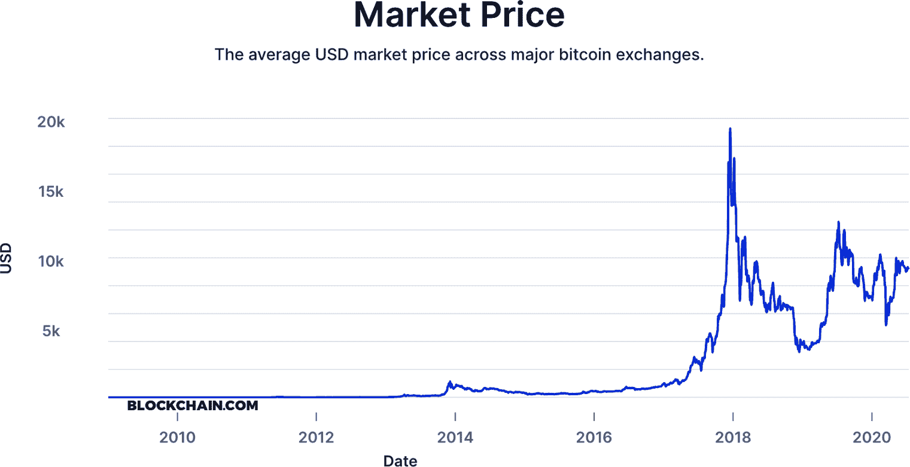

# 第六章\. 市场基础设施

比特币、以太币和许多其他加密货币在世界各地的各种市场上公开交易。据估计，投机交易占所有区块链交易的[60–80%](https://oreil.ly/JdV3i)，这使得研究区块链的这一部分变得非常重要。

在早期，基础设施的缺乏使得区块链生态系统非常波动和风险。尽管情况有所改善，但加密货币市场基础设施仍然远非完善。已经建立了许多结构支撑，但这些市场运作方式仍然存在严重问题。它们尚未完全受到监管，存在操纵行为。本章对加密货币投机行为的探讨绝不是对其的认可。简单来说，交易加密货币有可能亏损很多钱。

# 比特币价格的演变

比特币是整个加密货币经济的晴雨表。这意味着其他加密货币的价格通常会跟随 BTC 的趋势，重要的是要明白，价格的峰值和低谷对于这种世界上最流行的数字资产来说是正常的（参见图 6-1）。

比特币已经经历了许多泡沫，每一个泡沫都导致价格比上一个更高，因为越来越多的参与者因各种原因进入了这个生态系统。以下是导致 BTC 创下历史新高的一些泡沫：

+   *2010 (1):* 价格从 10 月的$0.008 上涨到 11 月的$0.08，增长了 900%。

+   *2010 (2):* 价格在 11 月底上涨到$0.50，增长了 525%。

+   *2011:* 价格在 6 月跃升至$31.91，比先前的最高价格增长了 6,282%。

+   *2013 (1):* 价格在 3 月上涨到$266.00，比先前的最高价格增长了 734%。

+   *2013 (2):* 价格在 12 月上涨到$1,154.93，比先前的最高价格增长了 334%。

+   *2017:* 价格在 12 月达到$17,900.00，比先前的最高价格增长了 1,450%。



###### 图 6-1\. 过去十年的比特币价格

在加密货币历史的过程中，有许多购买和出售它的方式：

点对点

购买和出售加密货币是通过面对面的交易完成的。

购买或出售产品/服务

一个人以加密货币换取或花费某物。

加密货币自动取款机

亭子为现金提供加密货币。它们也可以接受加密货币换取法定货币。

挖矿

通过向网络贡献计算能力，挖矿者将获得交易费用以及新铸造的加密货币。

交易所

加密货币是在专门建造的网站上交易的，这些网站的操作方式与股票交易所类似，但也有一些细微差别。

所有这些方法都有利有弊。如果两个当事人互相认识，那么点对点交易可能是一个安全选项，但如果一方试图欺骗另一方，可能会出现问题。购买或出售产品或服务曾被认为是加密货币大规模采用的途径。然而，高交易费用、确认时间慢以及网络可伸缩性问题都给加密货币成为一种流行支付机制的想法泼了冷水，至少在短期内如此。

加密货币自动取款机，其中许多列在[Coin ATM Radar 网站](https://coinatmradar.com)上，是从物理位置购买/出售的便利方式。但从交易费用的角度来看它们很昂贵，并且并不总是像传统自动取款机那样易于使用。加密货币挖掘在第二章中已经讨论过，但正如你所见，对于大多数人来说，挖掘不再是一种业余爱好，而是已经成为企业数据中心为中心的努力。

交易所已经成为交易加密货币的主要方式。

# 交易所的角色

加密货币交易所已经成为加密货币市场的主导力量。要了解市场，你必须了解这些平台。

有几种不同类型的加密货币交易所，所以让我们首先看看它们之间的区别。用户可以使用所有这些来发送和接收加密货币交易，但交易所在安全性、速度和界面方面有所不同。

这里是基本类型的交易所：

中心化交易所

这些由一家公司运营，通常以百分比的形式收取交易费。

分散式交易所

分散式交易所不是由一家公司运营，而是使用智能合约运作订单簿的站点，这些智能合约在第五章中讨论过。分散式交易所仅支持加密货币；我们将在下一章更多地谈论这些。

现货交易所

这些交易所交易加密货币。交易者拥有资产，如果是中心化交易所，则交易所通常在交易者的账户中持有资产。如果是分散式交易所，则资产由交易者自行托管。

衍生品交易所

这些实体使交易者能够使用更复杂的交易工具，如高杠杆产品、期权、互换和期货。

加密货币交易所拥有相当基础的订单类型，类似于股票交易。以下是您将遇到的一些术语：

市场

立即以当前市场价格执行的订单。这是购买或销售的最快方式。

限价

指定价格的订单。直到市场匹配买入或卖出价格后才会成交。

有效期

使用限价订单，一些交易所允许一个有效期——通常是几天、几周、几个月，或者*有效直至取消*。

做市商/接受者

几乎所有加密货币交易所都使用做市商/接受者模型来收取费用。这意味着提供流动性的交易者（称为*做市商*）不支付费用，而在订单簿上进行市场交易的交易者（*接受者*）支付交易所的费用以便这样做。

投标

买方愿意为市价订单支付的最高价格。

卖出价

卖方愿意接受的市价订单的最低价格。

本节剩余部分介绍了交易加密货币时应注意的各种概念。

## 订单簿

*订单簿*是交易所上加密货币的未处理订单的可视化表示。虽然界面可能各不相同，但所有订单簿通常都会做同样的事情：它们允许交易者看到已经放置的待填充的买盘（买入）和卖盘（卖出）。图 6-2 是订单簿的一个示例。

*市场规模*是订单中放置的加密货币数量。与传统股票不同，加密货币是分割的，许多可以精确到第八位小数点。对于比特币，Coinbase Pro 等交易所使用四位小数进行交易。寻求卖出的交易者显示为红色，而买盘显示为绿色。


###### 图 6-2\. 典型订单簿

## 滑点

*滑点*是交易的预期价格和执行价格之间的差异，是加密货币交易中的一个主要问题。由于大多数交易所的订单簿*薄弱*，即缺乏实质性订单，较大的订单以不太理想的价格“滑”过订单簿。

假设一位交易者想在加密货币交易所出售价值 $60,000 的比特币。大多数订单簿无法处理这种类型的定价，因为没有那么多的购买报价。图 6-3 显示了 Coinbase Pro 订单簿的示例视图。


###### 图 6-3\. Coinbase Pro 订单簿显示滑点

此时卖出量远高于买入量。以$40,000 的比特币为例，不存在一个买入价格能够买到全部的比特币；因此，执行的卖出订单会*溜过去*到 $7,565。

交易者确实有选择的余地——他们可以将订单分成较小的增量，或者进入*场外交易*（OTC）市场以一种价格填补卖单。然而，这种交易滑点的例子显示了加密货币订单簿通常有多小。它们的运作规模与成熟市场迥然不同；像纽约证券交易所和纳斯达克这样的大型平台可以轻松填补这种规模的订单。

###### 注意

矿工必须将他们获得的区块奖励和交易费转换为法定货币以支付开销，因此挖矿会影响市场数据。这些开销可能包括矿机设备、能源成本和数据中心运营等，产生持续的卖压。然而，大多数矿工使用场外交易（OTC）提供商出售加密货币，而场外交易对加密货币滑点的影响较小，因为没有透明的订单簿。

## 深度图

作为一种订单簿可视化工具，*深度图*允许交易者看到特定加密货币的买入和卖出有多深，如图 6-4 所示。它们显示市场上供需的实时关系。


###### 图 6-4\. 深度图

在图 6-4 中，买单（购买）以绿色显示（左侧曲线），卖单（销售）以红色显示（右侧）。图表中央曲线相交的地方是资产的市场价格，左侧是最低的买单，右侧是最高的卖单。每一侧的上升代表订单簿中的价格步进，其中卖单与价格呈反比关系（从技术上讲，它们应该趋向下降）。在图 6-4 中，市场上的卖单比买单更深。

这些深度图通常在交易所上是交互式的。这意味着交易员可以将光标放在线上的任何点上，并通过一些简单的数学确定通过订单簿所需的定价。深度图是发现市场异常的有用工具，尤其是确定哪一方具有更强的交易订单簿。它们还有助于确定，在特定价格下进行某种市场订单时，以某个特定价格出售的个人可能会推动市场价格上涨多少。

## 司法管辖区

传统金融世界中的大多数资产是在受到高度监管的中心化交易所上交易的。例如，苹果公司的股票在纳斯达克交易，苹果公司股票的价格由该市场上的交易活动决定。

相比之下，加密货币交易是在*数千*个市场上的*数百*个交易所上进行的。这些交易所在不同的司法管辖区运营，因此必须遵守不同级别的监管监督。图 6-5 说明了这一点。


###### 图 6-5\. 加密货币交易所的四种类型

加密货币交易所受其运营所在司法管辖区的法律约束。图 6-5 显示了交易所可能属于的四个类别：

1.  *受严格监管的国际交易所*。这些交易所有着严格的了解您的客户规则，以维护银行业务，这意味着它们具有客户身份信息。它们主要位于美国、加拿大、新加坡和欧洲。

1.  *受放松监管的交易所*。这些交易所有着放松的客户规则来维护银行业务，并为美国以外的国际客户提供服务，有时意味着拥有较少的客户身份信息。这些交易所大多位于亚洲和南美洲。

1.  *受严格监管的本地交易所*。这些交易所对银行有严格的了解您的客户规则，但他们只为本国客户提供服务。这些交易所主要位于日本和韩国，其他地方只有少数几家。

1.  *没有任何银行账户，因此监管放松的交易所*。这些交易所不符合保持银行账户的规定。它们为国际客户提供服务，主要位于亚洲和南美洲。

由于第一至第三类交易所提供银行账户，因此可以通过传统银行网络进行*套利*——在一个市场以一个价格购买资产，然后以更高的价格在另一个市场上出售相同的资产——。套利使得这些交易所之间的价格相对接近。非监管交易所（第四类）没有银行，而是使用稳定币（如 USDT）在交易所之间进行套利，以保持相对稳定的价格（参见“套利”）。

## 洗钱交易

*洗钱交易*是加密货币市场上普遍存在的一种市场操纵形式。这是指交易者同时买入和卖出加密货币，以产生人为的市场，这在受到高度监管的司法管辖区是非法的。加密货币市场上的洗钱交易是由不良行为者进行的，他们试图实现以下一个或多个目标：

+   通过支撑加密货币的交易量来试图提高其价格（也称为*假设*）。

+   隐藏不良活动，比如大规模卖出（或称*抛售*）特定加密货币。

+   通过夸大交易量增加交易所收取的交易费。

1936 年通过的商品交易法（CEA）使得在美国进行洗钱交易成为非法。其他国家也有类似的法律，但许多司法管辖区以及交易所对洗钱交易的政策放松。

## 鲸鱼

作为加密货币的最大持有者，*鲸鱼*对市场有着不可预测的影响。鲸鱼在加密货币世界中与机构投资者不同。与富达（Fidelity）等资产管理公司不同，鲸鱼可以随心所欲地移动资金。传统资产管理公司在高度监管的环境中运营，并且在移动资金之前需要遵循许多限制。加密货币鲸鱼只需要一个私钥、一台计算机和互联网。这些资金动向在区块链上很容易看到，并且可能导致价格变化，因为交易者试图解读它们意味着什么。

交易所、托管提供者，甚至是中本聪都可以被视为鲸鱼，因为这些实体持有的资产规模如此重要。鲸鱼资金的动向可能预示着市场变化。例如，[旧币的动向](https://oreil.ly/urBKz) 过去曾导致市场波动。

鲸鱼还有能力控制市值较低的加密货币，即资产价格乘以其未偿还供应量。拥有大量特定加密货币的鲸鱼能够控制价格。这是通过在交易所上创建买卖“墙”来实现的（见图 6-6）。


###### 图 6-6\. 加密货币深度图上的卖单墙

这些墙是由大量买单或卖单引起的，以防止某个资产朝某个方向移动。然而，当对特定加密货币有兴趣时，它们可能会被打破。这些墙是由一群参与者协调买卖而操纵价格所引起的，通常是导致一些较小加密货币发生巨大价格涨跌的原因。

## 衍生品

作为允许投资者接触加密货币基础价值的金融产品，*衍生品*正日益成为生态系统中的重要组成部分。以下是一些讨论衍生品时使用的重要术语摘要：

期权

合约赋予交易者权利，但不具有利润保障权，从资产价格上涨中获利（*认购*），或从资产价格下跌中获利（*认沽*）。在加密货币的情况下，期权允许交易者更好地管理市场风险。由于监管原因，加密货币市场的期权格局仍处于初级阶段，但预计在未来几年内将会增长。

期货

比特币期货允许以比特币收入的形式接收收入的企业锁定加密货币的价格到将来的某个时间点。这样，这些企业就不会受到可能影响其收入的价格波动的影响。期货合约的常见使用者包括比特币挖矿者，他们可能使用期货合约保护他们的收入，以及投机者。比特币期货的主要提供商包括大宗商品巨头芝加哥商品交易所（CME）和 Bakkt。

ETFs

*交易所交易基金*，或 ETF，是一种允许投资者以一定费用访问由另一方管理的资产或资产组合的产品。对于加密货币，这意味着基金为投资者管理加密货币。在美国，尚未批准此类投资工具，尽管在欧洲等地有类似的结构可用（在那里被称为*交易所交易票据*，或 ETN）。

杠杆/杠杆产品

许多交易所允许交易者进行*保证金交易*，即向投资者提供一定价值的信用，称为*抵押品*。 在受监管的交易所上，这通常是交易者余额的 5 到 10 倍。 但是，一些交易所允许高达 100 倍的保证金。 这可能是危险的，因为非常小的价格波动可能导致自动清算。 类似于保证金调用，*自动清算*将迅速清空交易者的余额。

###### 注意

在使用保证金时要*非常*小心。 它可能不会在交易中提供太多杠杆，并且可能会迅速导致在加密货币市场完全清算。

# 加密货币市场结构

总体而言，加密货币市场缺乏传统市场所见的*市场深度*，即吸收大额订单的能力。 这有几个原因。 其中一个是与其他市场相比交易者相对较少。 另一个是围绕加密货币的监管问题使得难以与法定货币进行交易。

## 套利

如前所述，*套利*是在一个市场以某一价格购买资产，然后在另一个市场以更高价格出售同一资产的行为，从而利用市场之间的价格差异。 这在加密货币交易中很常见。

*套利商*在交易社区中起着重要作用。 他们帮助消除价格差异并增加*流动性*，即活动量，使生态系统变得不那么波动。 例如，想象一下比特币价格在一百个交易所间的范围为$9,800 至$10,000。 您如何知道比特币的实际价格是多少？ 套利商有助于减少价格波动。

套利通常是一种吸引人的交易策略，因为其风险相对较低。在套利中，没有风险涉及到对未来加密货币价格的估计。交易者只根据当前价格采取行动。套利的最大缺点是准入门槛相对较低。如果存在机会，你将会发现与许多其他交易者的竞争，这可能会降低利润率。

我们将在本章稍后更详细地讨论套利交易。

## 对手方风险

套利需要将大量资本留在一个或多个交易所上。套利所获取的收入规模越大，需要的资本就越多。套利中最大的风险之一是将资本委托给保管这些资金的交易所。引用早期加密货币倡导者、《精通比特币》作者安德烈亚斯·安东诺普洛斯（Andreas Antonopoulos）广为流传的一句话：“不是你的私钥，不是你的资产。”

###### 注意

自 2010 年以来，一系列交易所遭受了黑客攻击或关闭并丢失了客户资金，使得这种风险相当高。详见第九章。

构建一个免受黑客攻击的交易所托管基础设施需要以下步骤：

+   大量的技术资源

+   多个安全团队进行审计

+   定义明确、周密考虑的企业治理流程

许多成熟的交易所，例如[Coinbase Pro](https://pro.coinbase.com)，已经有了时间和资源来建立健壮的解决方案。他们至今仍然存在，因为他们确保了客户资金的安全。遵循适当安全实践的新交易所在托管解决方案方面不应该有任何的疏漏。使用像[BitGo](https://www.bitgo.com)这样的成熟托管服务可以帮助。这些*托管提供商*可以帮助管理密钥，向交易所传授适当的安全实践，甚至为他们托管的资金提供保险。

每个交易所都有不同的托管设置。图 6-8 展示了一个标准的排列。


###### 图 6-8\. 交易所托管工作原理

让我们详细了解一下这是如何运作的，并介绍一些关键术语。

当交易所用户想要将资金存入账户时，他们将资金发送到一个*存款地址*。交易所为每个用户提供单独的存款地址。这使得交易所知道在资金到达时应该向哪个用户存款。

当资金通过用户存款地址存入交易所时，它们会自动转移到*暖钱包*，该钱包只能向白名单或预定的地址发送资金。然后，暖钱包将进入的资金分配到*热存储钱包*或*冷存储钱包*，具体取决于交易所是否需要用更多资金来充实提款钱包。

冷存储是指在与互联网未连接的位置离线存储加密货币持有和私钥。例如，私钥可能被打印在银行保险柜中的一张塑料涂层纸上。授权从一个私钥在冷存储中的地址发送资金的签名过程也是离线完成的，使用*空中隔离*计算机，即从未连接到互联网的计算机。一旦签名生成，它将手动输入到连接到互联网的机器上，后者将交易请求广播给区块链网络。可以通过两种方式完成这个过程：

+   在一个隔离的电脑上，将签名保存到一个文本文件中，然后将文本文件复制到格式化和清理过的 USB 存储器上。然后将 USB 存储器插入连接到互联网的计算机，并从该计算机广播出带有该签名的交易。将 USB 存储器擦除。

+   将签名写在一张纸上，然后手动在连接到互联网的计算机上输入。销毁纸张。

将私钥与互联网断开连接意味着一个人必须亲自在场才能访问它们。这使得私钥不可能被黑客通过互联网复制，或者通过病毒、恶意软件、键盘记录器或其他漏洞 compromized。仍然有方法可以侵入，但涉及物理窃取。

冷存储的缺点是由于需要人为干预，交易平均需要 24-48 小时。但当交易所用户从他们的账户提取加密货币资金时，他们通常希望这些资金在几分钟之内被提取。这意味着交易所需要在*热存储*钱包或*提款钱包*中存放资金，以便进行即时提取。热存储的优势在于，区块链交易可以由机器立即发起，无需人为干预。

热存储是加密货币版的银行分支将大量现金锁在后房间的等值物—足以满足日常客户对现金的需求。当然，缺点是私钥存放在连接到互联网的机器上，这使得黑客有可能 compromise 它们（就像获得进入后房间的许可）。因此，交易所必须极其小心，确保这些密钥的安全性。

这里有一些其他需要注意的概念：

小于 5% 规则

常见做法是，交易所将超过 95% 的客户资金存放在冷库中，将不到 5% 的资金存放在热存储中。这样，如果黑客攻击了交易所，他们只能窃取在热存储中的资金。失去这笔资金可能会对交易所的底线造成影响，但不太可能迫使其完全关闭。

白名单地址

重要的是，交易所要配置所有进入的钱包，只允许向热钱包发送资金。这种做法被称为*白名单*。这样，如果一个存款钱包被 compromise，黑客只能向该地址（或预先设定的一组白名单地址中的任何其他地址）发送资金，这对攻击者来说是有问题的。

流动性不足的迹象

一个警告信号可能表明一个交易所有问题，可能会关闭，这是用户持续看到提款延迟的时候。延迟可能是由技术问题引起的，但通常是一个交易所即将违约（无法按需发放资金）的症状。例如，在 Mt. Gox 运营期间，大多数用户并没有抱怨提款速度慢。但在交易所关闭的前几周，用户的提款请求开始花费更长的时间来处理，有时需要数天才能完成。延迟履行客户提款请求是交易所 *流动性不足* 并且不再具有用户资金的监管。这是一个交易所很难对用户隐藏的问题。

## 市场数据

精准的数据可能难以获得。不同的来源可能提供不同的数据，例如，加密货币市场资本和价格。两个来源甚至可能存在巨大差异，金额高达数十亿美元。这就是为什么熟悉不同的加密货币市场数据来源至关重要的原因。

今天有大量的市场信息来源。以下是一些最知名的数据来源：

+   [CoinDesk](https://coindesk.com)

+   [Skew](https://skew.com)

+   [Glassnode](https://glassnode.com)

+   [TradingView](https://www.tradingview.com)

每个都提供不同的数据集和工具。

还有一些专门的加密货币信息来源，值得知道，比如区块浏览器和交易流追踪系统。

### 区块浏览器

区块浏览器允许用户通过检查链中每个区块的内容来查看所有的区块链交易。用户可以使用交易 ID 查找任何最近或历史交易的详细信息，并查看特定地址进行的所有交易。区块浏览器还将地址链接到其他交易；通过查看一个地址，可以看到另一个地址的交易。在加密货币世界中，区块浏览器可以让您深入了解区块链交易，以了解正在发生的事情。

###### 提示

对于比特币交易，[*Blockchain.com*](http://Blockchain.com) 是最流行的区块浏览器。对于以太坊和 ERC-20 代币，[*Etherscan.io*](https://etherscan.io) 是主要的浏览器。

使用区块浏览器可以帮助识别加密货币的流动。然而，许多交易所不会记录内部钱包之间的交易，因此，资金流动通常在与外部方（外部交易所或钱包）完成交易之前是隐藏的。

### 交易流动

能够跟踪区块链上的交易流动在分析交易模式时很有帮助。跟踪加密货币的流动比跟踪法定货币要容易得多。特别是当转账发生在钱包、交易所和其他服务之间时，因为这些交易发生在链上，所以这一点尤为真实。

[GraphSense](https://graphsense.info) 是由奥地利技术研究院开发的开源工具，可以在区块链流中进行跨账本分析，支持比特币、比特币现金、莱特币、Zcash 等。[Whale Alert](https://whale-alert.io) 提供一个免费的基本 API 来跟踪许多不同的加密货币，包括前 100 位 ERC-20 代币。它还有一个 Twitter 账号，@Whale_Alert，发布大额交易的推文。

# 分析

在加密货币市场上，交易者使用几种市场分析方法来试图赚钱。用于做出决策的两种主要分析类型是*技术分析*和*基础分析*。一些交易者同时使用两种方法，而另一些人则坚定支持其中一种。

简单来说，基础分析涉及通过检查相关的经济和金融因素来衡量加密货币的价值。它吸纳了关于加密货币的所有可用信息，包括新闻、基金会报告、技术路线图以及预期的用户或网络增长等推断。

技术分析涉及一种以图表为中心的方法来衡量加密货币的价值。它基于市场数据和与加密货币交易以及其过去表现相关的特定指标。

让我们更仔细地看看这两种不同的方法。

## 基础加密货币分析

监控引导开发的加密货币基金会报告、用户采用数据以及有关监管发展的新闻有助于短期基本分析。对于长期而言，可以进行两种比较：加密货币是郁金香热还是互联网？这个论点涉及到金融市场历史上两个非常不同的时期。

### 郁金香热还是互联网？

在十七世纪，荷兰处于所谓的黄金时代，这是一个使该国在科学、贸易和艺术方面位居世界最佳的时期。在那个时候，由于某些花色的稀缺性和罕见性，郁金香球茎出现了一场投机热潮。市场上有许多品种的郁金香可供选择，有些月份它们的价格上涨了超过 1,100%。这导致市场出现了巨大的猛涨，随后是彻底的崩盘，给一些投资者造成了巨大的损失。图 6-9 展示了被称为郁金香热的期间郁金香价格的上升和下跌。


###### 图 6-9。荷兰黄金时代郁金香狂热的市场兴衰

在 1990 年代，人们将财富投资于看似任何在其名称中带有“.com”的上市公司。这种投资是由低利率推动的，它鼓励人们借贷和消费。价格一路飙升，最终导致了所谓的[* 点击率崩溃 *](https://oreil.ly/8xfAU)，市场崩溃并导致许多公司破产（见图 6-10）。尽管许多投资者遭受了巨大的损失，但其中一些互联网公司幸存并蓬勃发展 - 最值得注意的是亚马逊，它将自己从在线书店转变为零售和计算基础设施巨头。


###### 图 6-10。纳斯达克点 com 崩溃的图表

为什么我们提到这两个看似不相关的事件？加密货币市场中许多投资者的一个基本论点围绕着这两次崩溃。虽然郁金香市场再也没有像那样繁荣起来，但互联网却回来了，得益于 1990 年代不存在的新兴技术，例如动态网页，智能手机和社交媒体。

问题是：加密货币是否有长期未来？许多经济学家并不认为加密货币市场像一些人认为的那样没有限制，包括康奈尔大学的约瑟夫·斯蒂格利茨（Joseph Stiglitz），他认为[政府将会严格监管加密货币](https://oreil.ly/9tInN)。今天的现实是，加密货币的主要用途是投机，这就是为什么市场分析很重要的原因。

### 基本分析工具

基本分析需要审查新闻和分析来源。传统媒体中有许多成熟的出口，在报道加密货币方面做得很好。其他一些则更加不可信，报道的新闻往往倾向于广告商。

在加密货币行业，“付费播放”——为了出现在看似客观的新闻报道中而支付大量费用——十分猖獗。一名记者联系了加密货币新闻网站，发现其中许多愿意接受金钱换取好评报道。有时这些新闻媒体会要求数千美元来发布一篇正面报道，这显示了行业中存在的[虚假信息的阴影市场](https://oreil.ly/nU0FL)的种类。图 6-11 显示了一些新闻媒体希望收取的有利报道的价格。


###### 图 6-11\. 付费播放

社交媒体可以是收集新闻的工具，但应该持保留态度。在 Twitter 上，有整个运动旨在影响人们对比特币、[XRP](https://oreil.ly/UrwyX)以及许多其他较小的加密货币的看法。

Reddit 上的一些加密货币社区经过审查，以移除任何批评性信息。在寻找有关各种加密货币项目的准确基本信息时，牢记这一点很重要。很少有信息来源能免受此问题的影响，这需要交易员密切注意验证数据！

## 加密货币的技术分析

加密货币具有可以推断成图表的定价数据集。这些图表允许交易员分析过去的历史以确定未来的价格。如前一节所述，在加密货币世界中，要找到可靠的基本分析信息来源可能会很困难。因此，使用技术分析对于许多人来说是有帮助的，可以正确评估加密货币市场的波动，这在某些时候可能会相当大。甚至有一部分交易员可以仅凭图表就能预测资产价格的走向，避免进行任何基本分析。

### 技术分析的图表

技术分析的最佳工具是基于图表的。[TradingView](http://www.tradingview.com)，一个也被股市图表分析师使用的图表工具，已经很好地整合了各种加密货币交易数据源。它还具有许多技术分析师使用的工具，包括移动平均线、成交量指标和各种振荡器。TradingView 是免费的，并且通过电子邮件注册允许用户保存图表。

### 寻找巴特

技术分析需要观察图表，而加密货币有一些独特的模式。最著名的是巴特模式，它与巴特·辛普森头部的顶部有着惊人的相似之处，如图 6-12 所示。


###### 图 6-12。著名的巴特图案

技术分析师会说，这种分析过程更多地是一种艺术而非科学。虽然它不能预测未来，但有时能够提供指标，帮助交易者做出决策。有许多因素影响这些决策，交易者自己需要找出如何行动。

加密货币中的巴特模式提供了一个关于这个市场性质的启示性教训。加密货币仍然很新颖，并且市场参与者并没有像许多人想象的那样多。因此，市场的深度，或市场中的流动性量，是低的，也称为稀薄。因此，加密货币被认为是一个交易稀疏的市场。这种缺乏流动性导致了巴特模式；因为加密货币交易所的订单簿没有传统市场那么深，价格可以快速波动。

# 套利交易

我们在本章前面提到了套利。在这里，我们将深入探讨一下，列举一些它是如何运作的例子。

*基本套利* 是使用两个不同市场买卖资产。例如，如果 Coinbase Pro 上的比特币买价和 Gemini 上的卖价之间有 1%的套利价差，交易员可能会：

1.  在 Coinbase Pro 的 USD/BTC 市场以$10,000 美元的价格购买 1 比特币。

1.  立即在 Gemini 的 USD/BTC 市场上以$10,100 美元的价格出售 1 比特币。

这将导致收入增加$100，减去费用。

*三角套利* 涉及使用三个或更多不同市场买卖资产。例如：

1.  在 Coinbase Pro 的 USD/BTC 市场以$10,000 美元的价格购买 1 比特币。

1.  在 Coinbase Pro 上将 1 比特币交易成 70 个以太币。

1.  在 Gemini 以$10,200 美元的价格出售 70 个以太币。

这将导致收入增加$200，减去费用。

## 时间和管理浮动

为了执行套利策略，需要*浮动*，或者是准备交易的流动资金池。这个浮动位于各种交易所，并在出现套利机会时使用。

当套利机会到来时，尽快完成套利的所有步骤至关重要，原因有两个主要的：

1.  交易所上的定价可能会迅速变化。

1.  其他人可能会利用这个机会，推动价差下降。

一般来说，为套利而保留的浮动越多，执行速度越快。然而，只是让资金坐在那里等待潜在的未来机会会有成本（和风险）。重要的是要确定目标市场和套利路径，因为在任何时候手头可用的资金或浮动总量都是有限的。

下一小节将探讨设置套利浮动的几种可能配置。

## 浮动配置 1

Configuration 1 预留 $50,000 美元在 Coinbase Pro 上，并预留 5 个 BTC 在 Gemini 上。当这两个市场之间出现套利机会时，这种配置允许立即执行。这是因为流动资金意味着套利者可以立即在 Coinbase Pro 上购买比特币，并立即在 Gemini 上出售。然而，套利执行的速度完全取决于接收和执行交易 API 调用的交易所。

套利执行后，所有交易所账户的余额发生变化。如果在同一方向上持续存在套利机会（例如，在 Coinbase Pro 上买入价格较低，在 Gemini 上卖出价格较高），那么最终会出现流动资金不平衡，其中一个交易所的资金比另一个交易所的资金多。这种不平衡意味着交易者无法在 Coinbase Pro 上购买比特币，或者在 Gemini 上出售比特币。因此，必须做出一些决定以继续使用流动资金进行套利。交易者可以采取以下行动：

+   通过将 5 个 BTC 从 Coinbase Pro 转移到 Gemini，将 $50,000 美元从 Gemini 转移到 Coinbase Pro 来重新平衡流动资金。在交易所之间转移 5 个 BTC 很简单，并且大约需要一个小时完成。通过银行网络在交易所之间转移 $50,000 美元，因此需要银行账户。一些银行具有在交易所之间轻松转移资金的能力。请调查可用选项。

+   等待相反方向的套利机会。这意味着在 Gemini 上以较低的价格购买比特币，然后在 Coinbase Pro 上以较高的价格出售。

## 流动资金配置 2

配置 2 在 Coinbase Pro 上预留 $50,000 美元，不需要在 Gemini 上预留任何流动资金。由于在 Gemini 上没有流动资金，所以当这两个交易所之间出现套利机会时，需要额外的一步：必须执行从 Coinbase Pro 到 Gemini 的资金转移。

在此示例中，当出现机会时，套利者进行以下操作：

1.  在 Coinbase Pro 上购买 1 个 BTC。

1.  将 1 个 BTC 从 Coinbase Pro 转移到 Gemini。

1.  以比在 Coinbase Pro 上购买时高出 1%的价格在 Gemini 上出售 1 个 BTC。

配置 2 的最大风险在于将 BTC 转移到 Gemini 需要大约一个小时才能完成。在此期间，Gemini 上的 BTC 卖价可能会发生变化，交易者可能被迫以亏损出售那 1 个 BTC。

即使配置 2 执行资金需求较少，但在比特币情况下，缺少流动性引入了显著延迟，增加了亏损风险。减轻此风险的一种方式是通过套利其他加密货币。以下是您可能遇到的一些时间延迟示例：

+   比特币的块时间平均为 10 分钟，交易所通常需要 6 个确认才能记账资金，总计需要 60 分钟来转移资金。

+   以太坊的块时间平均为 15 秒，交易所通常需要 30 个确认才能记账资金，总计需要 7.5 分钟来转移资金。

+   瑞波块时间平均为 4 秒，交易所通常在其系统看到交易已处理后立即记账资金。根据交易所，转账时间通常为 30-60 秒。

## 浮动配置 3

减少在交易所之间移动资金所花费的时间的最有效方式是在一个交易所上完成整个套利。在具有多个市场的交易所上进行三角套利可以实现这一点，假设每一步的买入和卖出价格都是有利的。

这里的套利是仅在 Coinbase Pro 上的市场上执行的：

1.  USD/BTC 市场：以$10,000 美元购买 1 个 BTC。

1.  BTC/ETH 市场：以 1 个 BTC 交易 70 个 ETH。

1.  ETH/USD 市场：以 10,200 美元的价格出售 70 个 ETH。

这最终将带来 200 美元的收益，扣除费用，完成套利的所有步骤后。

2012 年，当行业处于起步阶段时，比特币的套利机会达到了某些交易所高达 30%的差价。到 2020 年，套利商更多了，机会背后隐藏着各种挑战（在下一节中概述）。通常，克服这些挑战的成本高于套利机会的回报，该回报可能在 0.1%至最高 10%的范围内——即使在今天，机会仍然存在。

# 监管挑战

符合法规的交易所遵循其所在国家的法律，而各国法律不同。例如，全球大多数交易所可以为居住在其他国家的客户提供服务。但是，例如韩国的交易所只能为居住在该国的客户提供服务。韩国政府已禁止交易所为外国人提供服务。此外，韩国实行资本管制，限制资金流出国家的数量。

在 2017 年比特币的牛市期间，这些因素导致了韩国交易所长期存在[“泡菜溢价”](https://oreil.ly/nHAS5)，其销售价格通常比其他国家的交易所高出 5-10%。

## 银行风险

在涉及法定货币的套利时，需要银行账户在不同交易所之间转移资金。国际上，监管机构和银行一直趋向于实施更严格的反洗钱（AML）和了解您的客户（KYC）规定，这在第九章中进一步讨论。这些规定显著增加了新的加密货币企业开立银行账户的障碍。例如，在加拿大，五大银行中只有两家会考虑为货币服务企业开立新账户。在美国，只有少数几家公司会为加密货币企业开立银行账户。

当银行审计交易时，他们考虑以下特性表明欺诈风险增加：

资金被发送到/接收自另一个国家

有国际组织（如金融行动特别工作组（FATF））为每个国家提供风险排名。例如，叙利亚受到制裁并且 ISIS 有大量存在；因此，它将被认为是高风险国家。

大额交易

银行最大的担忧之一是因为协助欺诈活动而被提及在新闻中，但如果资金移动的规模较小，则此风险较低。此外，大多数国家的银行都必须向政府提交可疑活动报告，以进行超过某一阈值的任何交易。在美国，任何超过 10,000 美元的交易必须向金融犯罪执法网络（FinCEN）报告。

与加密货币相关的任何事物

银行对加密货币的看法仍然是它经常被用于不正当目的。许多国际新闻报道有关加密货币的内容与不道德或非法活动有关。这些活动可能包括出售毒品，在加密货币中勒索赎金以及朝鲜逃避制裁。

###### 注意

跨国间在加密货币交易所之间套利法定货币，大规模操作，可能引发所有这三种风险。使用不友好于加密货币的银行涉及风险。随时，无需通知并且由于您无法控制的原因，银行可能会冻结您的资金或撤销您的交易。

## 交易所风险

对于交易所来说，需要对其进行很高的信任以进行套利。为了快速执行套利步骤，交易所 API 的可靠性和*交易引擎*（驱动买家和卖家之间交易的软件）至关重要。您可能会遇到一些问题：

+   交易所 API 中的错误

+   未受监管的交易所运行交易机器人以优先处理其交易

+   交易所部署*速率限制*，限制套利 API 调用

+   交易所服务器存在连接问题，导致 API 调用延迟

## 基本错误

基本套利错误包括：

+   忘记在套利计算中包括交易费用和税收

+   在计算套利机会时只看涨幅价格

在计算机会时，仅考虑价格差异是不够的；还应考虑*市场深度*，即查看每个价格挂单簿上资金量的差异，以确保滑点不会抵消您的利润或将其转化为亏损。

# 交易所 API 和交易机器人

大量加密货币交易是由交易机器人执行的。但是，无论交易机器人有多好，其性能都严重依赖于其集成的交易所 API。

每家交易所最初都是一家小型创业公司，尝试构建高质量的 API，尽管良好的文档通常不是首要任务。银行业务、监管、钱包托管以及获取流动性通常是**首要任务**。当交易所业务达到一定程度、资金充裕时，便可以聘请合适的技术人才，其 API 的质量将会有显著提高。

最好的交易所使用与他们为第三方开发人员提供的 API 相同的 API 来构建其网站和移动应用程序。然而，并非所有交易所都是相同的，测试实时交易之前的基本 API 功能是很重要的。

高质量 API 的特征包括以下内容：

+   在强大的服务器上运行，并具有快速的网络连接性

+   设计的 API 调用以适应许多不同的交易策略

+   支持 REST（拉）和 WebSockets（推）两种协议

+   高速率限制

+   遵循行业标准安全方案，如 Facebook 推广的 OAuth 2*，* 或使用哈希计算的 HMAC

+   文档以清晰、简洁和一致的方式呈现，并为每个 API 调用提供示例

+   提供测试/暂存环境

+   为许多不同的编程平台提供库

+   关于平台状态的实时通信以及与事务管理相关的透明度

两个具备足够资源构建高质量 API 的交易所示例是 Coinbase Pro 和 Kraken。

当开发人员评估 API 时，他们将尝试执行最少量的工作的基本调用。例如，查找当前 BTC/USD 行情价格不需要任何设置，因为这些数据是公开的。

在 Coinbase Pro 上，BTC/USD 行情 API 调用如下所示：

```
Request:
    GET - *https://api.pro.coinbase.com/products/BTC-USD*

Response:
{
    "id": "BTC-USD",
    "base_currency": "BTC",
    "quote_currency": "USD",
    "base_min_size": "0.00100000",
    "base_max_size": "280.00000000",
    "quote_increment": "0.01000000",
    "base_increment": "0.00000001",
    "display_name": "BTC/USD",
    "min_market_funds": "5",
    "max_market_funds": "1000000",
    "margin_enabled": false,
    "post_only": false,
    "limit_only": false,
    "cancel_only": false,
    "trading_disabled": false,
    "status": "online",
    "status_message": ""
}
```

在 Gemini 上，BTC/USD 行情 API 调用如下所示：

```
Request:
    GET - https://api.gemini.com/v2/ticker/btcusd

Response:
{
    "symbol": "BTCUSD",
    "open": "9179.77",
    "high": "9298",
    "low": "9050",
    "close": "9195",
    "changes": [
        "9219.54",
        "9211",
        "9211.71",
        "9243.67",
        "9243.71",
        "9250",
        "9249.03",
        "9235.41",
        "9237.69",
        "9244.22",
        "9244.68",
        "9240.38",
        "9248",
        "9263.61",
        "9289.8",
        "9291.62",
        "9269.68",
        "9222.01",
        "9210.09",
        "9160.63",
        "9165.4",
        "9152.46",
        "9164.7",
        "9173.33"
    ],
    "bid": "9195.00",
    "ask": "9195.01"
}
```

即使是简单的行情 API 调用，你也可以看到响应数据中的巨大差异。在这些差异中，Coinbase Pro 的 API 包含一个 `status` 字段，允许机器人识别市场是否不可用进行交易，并做出相应调整，而 Gemini 的 API 包含 `changes`，一个显示该交易对先前价格的数组。这可以让交易机器人识别价格的趋势。

这些是美国具有重大资源的两个交易所，正如你所见，它们的 API 差异很大。全球有数百家交易所，它们的 API 方案和质量差异更大。因此，开发一个可以集成到多个交易所的交易机器人需要大量的时间和精力。

本节的其余部分介绍了在使用交易机器人和处理 API 时需要注意的一些事项。

## 开源交易技术

开发人员使用现有库来集成交易所的 API，比自己编写的代码更快。通过这种方式，他们可以采用已经集成了所有交易所 API 调用并处理 API 安全的现有代码。如果没有这样的库，开发人员将需要自己编写和测试大量额外的代码。

有一些带有交易技术的开源项目对使用 API 进行交易很有帮助。其中最流行的项目之一是[加密货币交易库](https://github.com/ccxt/ccxt)（CCXT），它使开发人员能够与超过 125 个加密货币交易所集成。使用此库意味着开发人员不必了解每个交易所 API 的细微差别，也不必为每个交易所编写自定义代码。相反，该库提供了一个统一的调用集合，用于与许多交易所集成。

所有 *公开* 调用不需要开发人员在交易所拥有账户。公开调用使得可以读取公开信息，例如 BTC/USD 的市场价格。所有 *私有* 调用都要求开发人员提供交易所的 API 密钥，这需要账户设置。私有调用允许读取/写入私人信息。私有调用的示例包括获取交易所用户的未完成限价订单或发起市价订单。

一些重要的 API 调用以开始包括以下内容：

+   检索股票价格（公开）

+   检索订单簿数据（公开）

+   检索账户交易历史记录（私有）

+   在交易账户之间转移资金（私有）

+   创建、执行和取消订单（私有）

## 速率限制

每个交易所 API 都会限制外部服务器可以发出的请求次数。对 API 服务器的每次调用都会使用服务器资源，速率限制强制外部服务器不要滥用 API 访问。它还提供了一层防护，防止 DDoS 攻击，这在这个行业中非常普遍。

例如，Coinbase 对一些 API 端点或通信渠道的每秒请求次数设置为 3 次，对其他端点设置为 5 次。当外部服务器发出超出限制的请求时，将收到 429 错误。

## REST 与 WebSocket

速度是构建高质量交易机器人的重要因素，这样机器人就能在其他机器人之前阅读市场并执行交易。通过 REST API，交易机器人必须不断地轮询 API 以查看市场的最新状态，这通常会导致市场发生变化和交易机器人看到该变化之间存在时间差。当交易机器人受到速率限制并且必须等待片刻才能发出有效请求时，这些间隔会显著增加。

一个交易机器人更快地查看市场当前状态的方法是订阅一个 WebSocket。通过这种设置，一旦市场发生变化，交易所的服务器就会向所有 WebSocket 的订阅者推送通知。然后，所有订阅 WebSocket 的交易机器人将在同一时间收到相同的信息，它们不需要进行额外的 API 请求，以填充它们的速率限制配额。

###### 提示

对于交易者来说，找出交易所托管其 API 服务器的确切位置，并将其交易机器人托管在同一位置可能是有帮助的。例如，如果交易所的 API 服务器托管在 AWS 的北弗吉尼亚地区，交易者可以在同一地区使用 AWS 托管他们的机器人，以确保更快的通信。

## 在沙盒中进行测试

当开发人员测试交易机器人的各种功能时，理想情况下，他们应该在使用虚拟货币的 *沙盒* 环境中进行测试。如果交易所的 API 没有沙盒环境，开发人员将被迫使用真实货币测试功能，这通常会限制交易机器人的测试能力。使用可能很容易因为错误而丢失的真实美元测试新功能通常太冒险了。

## 市场聚合器

一些服务，如[CoinMarketCap](http://www.coinmarketcap.com)和[CoinGecko](http://www.coingecko.com)，汇总了来自数百家交易所的市场定价数据，并将这些数据打包成 API 提供。这样的 API 的优势在于，它使得交易机器人可以轻松地获取市场的高层视图。缺点在于，依赖第三方来汇总数据会导致聚合器的定价数据出现延迟——另外也存在聚合器的 API 可能出现错误，并发送错误数据的风险。

# 总结

加密货币市场是一个迷人的窗口，展示了监管结构赶上发展中生态系统时会发生什么。这一领域存在的机会吸引了许多新进入者进入区块链世界。由于这些市场处于萌芽阶段，投机行为吸引了许多人的兴趣，因为价格仍然是唯一的动机。

这些市场变化迅速。然而，本章涵盖的信息应该帮助开发者和交易者们有许多关于如何入门的想法。
