# 第七章。金融和网络的去中心化

加密货币、区块链和智能合约的日益流行引入了许多新的用例，提供了专业功能，从增加隐私到创建稳定支付系统再到全新类型的基于区块链的应用程序。本章探讨了在去中心化金融（DeFi）和去中心化应用程序（dapps）领域中揭示的令人兴奋的可能性。

# 信任的重新分配

尽管它们正在努力创新，[今天的银行仍然缓慢且昂贵](https://oreil.ly/G7ixe)。跨境汇款需要超过一天的时间。对于那些没有银行账户的人来说，向居住在其他国家的家人或朋友汇款是昂贵的。使用加密货币的支付层，区块链可以消除中间商。随着时间的推移，它也可能允许用户拥有自己的数据，而不是被大型技术公司拥有。

## 身份与黑客攻击的危险

用户拥有数据所有权为何如此重要？科技和金融领域的大型公司一直没有很好地管理数据。它们屡次遭受入侵、黑客攻击和其他威胁。在许多情况下，它们随后试图淡化或隐藏这些入侵，尽管它们通常会在之后被发现（并罚款）。例如：

+   Yahoo!在 2013 年披露有 30 亿个账户被入侵。直到 2017 年才公布了有关入侵的信息，并最终达成了支付 1.175 亿美元的赔偿协议。

+   Facebook 在 2018 年看到有 5 千万用户账户被入侵。美国联邦贸易委员会（FTC）对该公司进行了 50 亿美元的罚款，原因是滥用用户数据。

+   Equifax 在 2017 年披露，其 1.43 亿客户的个人信息已经被入侵。该公司与监管机构达成协议，支付了 7 亿美元的罚款和赔偿金。

+   2014 年，eBay 遭受了一次攻击，暴露了超过 1.45 亿用户的个人信息（包括密码）。

+   2016 年，Uber 的服务器遭到入侵，两名黑客能够从 GitHub 检索密码信息。然后黑客访问了 5700 万乘客和 60 万司机的个人信息。Uber 隐瞒了这次入侵一年多，并最终被罚款 1.48 亿美元。

这些仅仅是科技公司。在 Target、万豪、Home Depot 和 JPMorgan 等知名公司发生的入侵事件中，用户数据被获取并落入试图利用这些信息进行不良用途的人手中。

区块链技术有望使各个行业脱中介而出，许多行业可能很快就会发生变革。一些试验已经开始。包括科技、金融、就业和游戏在内的行业都是易受干扰的。今天正在建立技术“脚手架”，以便用户更多地控制自己的数据。

这一思想的最终实现是自主身份的概念，即个体生成自己的独特标识符并存储和控制访问自己的个人信息，使用公钥/私钥对。这种身份的主人是用户而不是大公司和政府官僚是区块链开发者热衷的事情，它可能消除未来入侵和盗窃的危险，从而使人们的身份面临风险。

一个核心问题将是如何平衡复杂性和易用性。私钥管理和交易广播可能很难教授，或者对主流用户来说过于繁琐。然而，一些早期平台正在尝试解决这个问题，您将在本节中看到。

## 钱包

为了使用一系列 DeFi 服务，用户必须熟悉钱包。幸运的是，今天有很多好的选择。[MetaMask](https://metamask.io) 是一个软件钱包，目前可在 Chrome、Firefox 和 Opera 浏览器中使用。它也适用于 Brave，这是本章后面讨论的一种新型浏览器。像 [Ledger](https://www.ledger.com) 这样的硬件钱包是另一种选择，[Coinbase](https://www.coinbase.com) 还为那些不想担心密钥存储的人提供支持。

###### 注意

记住：如果你不拥有密钥，你就不拥有资产。

## 私钥

MetaMask 和 Ledger 钱包要求用户知道并仔细存储他们的私钥。密码或*种子*的丢失——一组存储了恢复钱包所需的所有信息的单词列表——等同于私钥的丢失。因此，帮助用户在确保私钥安全的同时保持身份的新服务非常重要。Coinbase 已经为加密货币钱包做到了这一点。像 [Keybase](https://keybase.io) 和 [Blockstack](https://www.blockstack.org) 这样的身份识别服务使用户更容易为 Web 3.0 服务（本章后面介绍）维护私钥。

## 命名服务

公钥比电子邮件地址、用户名或其他标识符难以使用得多，但它们对于去中心化服务非常重要。图 7-1 展示了公钥和私钥的[示例](https://oreil.ly/A_JbA)。QR 码是密钥的表示形式。


###### 图 7-1\. 公钥和私钥

命名服务允许用户使用比复杂的公钥更容易阅读和输入的*名称*。一个例子是[Ethereum 命名服务](https://ens.domains)，它允许人们使用*<username>.eth*的命名约定，该约定可以转换为公钥。缺点是使用这些名称可能会让分析人士跟踪区块链上的交易，这会冒着[泄露身份信息的风险](https://oreil.ly/htxHK)。

# 去中心化金融

无中介的金融服务生态系统正在迅速增长。这是区块链中一个引人注目的领域，吸引了许多开发者的关注，现在许多平台都在努力提供去中心化金融服务。

DeFi 服务使用智能合约、加密货币和区块链来[替代传统银行提供的部分服务](https://oreil.ly/DrR7o)。图 7-2 说明了这一点。


###### 图 7-2。传统与去中心化金融对比

DeFi 有许多不同的部分，其中许多依赖于以太坊和 ERC-20 资产。以太坊上 ERC-20 的灵活性是 DeFi 可能的原因，因为流动性池可以根据市场条件进行扩展或缩减。

## 重要定义

智能合约是 DeFi 模型的重要组成部分。许多加密货币之所以有价值，是因为流通中有一定数量的资产。然而，许多 DeFi 代币具有*弹性*供应，使它们具有通货膨胀或通货紧缩的特性，这取决于系统的设计。这就是一些新术语需要定义的地方：

铸币

用于增加加密货币供应的 *铸币* 涉及创建新资产。这是通过创建新的区块作为 *权益证明者* 或汇集资产以获取激励的用户生成奖励来实现的。必须正确控制铸币以限制通货膨胀，通过某种治理系统。否则，加密货币的价值可能会相对于其他资产下降，降低其购买力和价值储存属性。铸币是 *算法固定* 的，或者由系统内的权威机构管理。

销毁

用于减少加密货币供应的 *销毁* 涉及资产的销毁。这一销毁由系统管理机构完成。通过减少流通和减少供应，这可能导致加密货币价格上涨。然而，通过这一过程，资产可能变得 *紧缩* —— 虽然价值上升，但其他资产的价格可能下降。销毁可能是一次性事件，也可能是由收入/利润触发的分阶段事件。销毁还是通过减少供应将利润分配给代币持有者的一种方式，希望需求和价格上涨。

封装代币

以太坊平台并未考虑 ERC-20 标准。比特币或以太坊生态系统之外的任何其他加密货币也不是。由于用户希望在智能合约中与 ERC-20 代币交易各种加密货币，*封装代币* 成为一种解决方案。原始资产被“封装”，意味着在链上作为抵押品被证明持有。智能合约促进了这些 ERC-20 代币的 *存入*（铸造）和 *取出*（销毁） 过程，代表它们的外部加密货币。需要一定程度的信任来确保外部代币保留在封装代币余额的持有者名下。通常，多签名方案在互不利益关系的托管人之间实施，他们共同签署提款请求。

DAOs

*去中心化自治组织*（DAOs）是通过代码组织的项目，主要通过以太坊智能合约进行。DAOs 不受中央机构控制，而是由代币持有者提供治理。由于 DAOs 利用基于区块链的智能合约，因此存在着交易的透明记录和管理 DAO 的规则。尽管它们的法律和监管地位尚不清楚，但 DAOs 已经被用于金融、游戏和社交媒体。

Oracles

由于区块链与诸如关系型数据库等数据源的接口不佳，*Oracles*被要求提供外部信息。中心化数据库中记录的现实世界事件仍然需要这些系统运行，并且 Oracles 服务于这一目的。Oracles 将[链下数据带到链上](https://oreil.ly/nRW1o)，如图 7-3 所示。

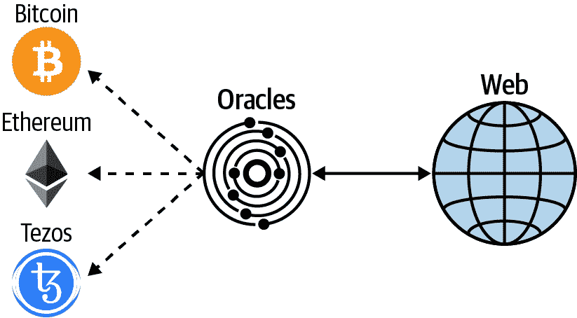

###### 图 7-3\. Oracles 与区块链的交互方式

###### 注

Oracles 在区块链生态系统中扮演着重要角色，因为它们提供了智能合约用于执行代码的数据。任何来自 Oracle 的错误或篡改的数据都可能触发智能合约执行，这可能导致资金无法挽回的损失。一个智能合约可能是完全安全和经过审计的，但如果 Oracle 被操纵，它也会成为黑客利用的弱点。这就是为什么对 Oracle 系统的信任至关重要。

## 稳定币

作为与美元和其他法定货币挂钩的基于区块链的资产，*稳定币*支撑着不需要银行中介的服务。许多稳定币确实存在一些监管风险（在第六章讨论）。此外，在不同项目之间存在各种各样的治理和中心化级别。尽管如此，人们对稳定币进行了一些有趣的实验。我们将在这里简要介绍其中一些。

### DAI

在加密货币的波动世界中，DeFi 需要稳定的资产以正确为用户提供服务。今天用于此目的的主要稳定币加密货币是[Maker 项目的 DAI](https://makerdao.com/en)。DAI 于 2018 年推出，最初是由以太坊的 ETH 支持的“单一抵押物代币”。现在，DAI 是由几种加密货币支持的*多重抵押物代币*，包括 ETH 和 BAT（Basic Attention Token，驱动 Brave 浏览器的以太坊代币）等。

但是，支持 DAI 稳定币的加密货币本质上是波动性很高的。那么 Maker 是如何从波动的市场中创造稳定资产的呢？通过锁定资产。以下是其工作原理：

1.  用户将 ETH 存入 Maker 的智能合约，称为*保险库*。

1.  Maker 然后允许用户提取 DAI。可以提取的金额必须以 150% 的抵押物抵押。这意味着存入 150 美元的 ETH 的用户最多可以提取 100 美元的 DAI。此 DAI 由用户存入的 ETH 支持。

1.  如果 ETH 开始下跌至存入价值以下，例如在 150 美元以下，在此示例中，系统将开始关闭该仓位。例如，如果用户只提取了价值 50 美元的 DAI，则系统将在 ETH 下跌至 75 美元时关闭，这是 150% 抵押的阈值。除非用户存入 ETH 或 DAI 来满足抵押要求，否则该仓位将关闭。

1.  为了取回用于抵押的 ETH 或其他加密货币，将收取*稳定费*。目前的费用为 3%，但可能会变化。当 DAI 返回到系统时，它会被*销毁*或销毁，因为它不再由抵押物支持。 Maker 使用稳定费来资助系统的发展。

Maker 是一个 DAO，它还提供一种投资代币，MKR。MKR 是决定 MakerDAO 系统内部元素的加密货币。持有 MKR 的人可以影响系统。这包括提供对抵押要求、稳定费用、稳定费用的使用方式以及在价格暴跌时的紧急关闭协议等方面的输入。

对于支付的每一美元稳定费用，相应的金额将被购买并从 MKR 市场中移除。此外，对于无法通过标准抵押品拍卖纠正的清算，将进行债务拍卖，其中也会购买相应数量的 MKR 并将其从市场中移除。

由于 Maker 系统是基于智能合约的，因此不需要用户提交个人的 KYC 信息即可参与。与之互动所需的仅是私钥和一些以太币。

### USDC

一个 ERC-20 稳定币，[美元币（USDC）](https://www.centre.io/usdc)受到加密货币领域两家最大和最知名的公司支持：Coinbase 和 [Circle](https://www.circle.com)。USDC 是一个名为 Centre 的更大联盟的一部分，其成员共同合作管理稳定币的治理和使用案例。Grant Thorton, LLP 是 USDC 的审计师。该公司每月提供证明，证明有足够的储备支持 USDC 稳定币。系统要求从发行者获取或赎回 USDC 的用户提交个人信息进行 KYC 检查。

### TrueUSD

由美国公司 TrustToken 支持，[TrueUSD（TUSD）](https://www.trusttoken.com/trueusd) 是一种使用 ERC-20 协议的以美元为基础的稳定币。TrustToken 还有以加拿大元、英镑、澳大利亚元和港元支持的稳定币。TrustToken 使用审计公司 Cohen & Cohen 提供每月的证明，证明其拥有足够的银行持有的储备来支持其加密资产。这个系统要求用户提交个人 KYC 信息以获取或兑换 TUSD。

### KYC 和匿名性

正如前面的部分所提到的，虽然 DAI 不需要用户提供 KYC 信息，但 TUSD 和 USDC 需要。由于银行关系，TUSD 和 USDC 要求用户提供个人信息以兑换他们的稳定币为法定货币。然而，在区块链生态系统内部，[稳定币可以使用匿名方式](https://oreil.ly/Cb6zm)，在留下区块链记录的同时更换所有权，就像图 7-4 所示。

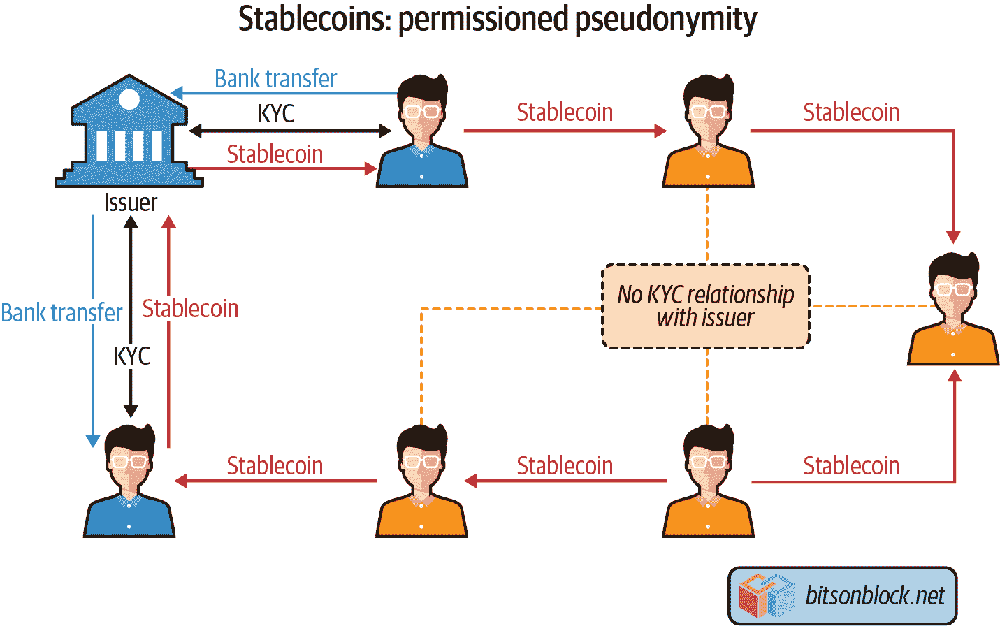

###### 图 7-4\. 稳定币如何使用匿名方式

尽管 DAI 是 DeFi 应用中最常用的稳定币，但银行支持的解决方案也是竞争对手。主要区别在于 TUSD 和 USDC 是由法定货币支持的，而 DAI 目前是由加密货币支持的。

# DeFi 服务

随着稳定币流动性的增加，金融服务正在加密货币之上构建。网站[DeFi Pulse](https://defipulse.com) 是一个衡量正在获得关注的项目的良好指标。通过查看锁定在智能合约中的 ETH 数量，从 DeFi Pulse 很容易看出哪些项目正在吸引用户。这是一个了解这个新兴市场中这些服务被用于什么的好方法，这个市场每天都在增长。

## 借贷

有一类用户希望借入法定货币并持有加密货币。DeFi 贷款通常有一个非常具体的目的。许多加密货币持有者不想出售加密货币，无论是出于投机的原因，因为他们相信加密货币的长期价值，还是因为他们不想在转换为法定货币时支付税款。他们不想放弃自己的资产，并愿意为此支付费用。

实现这一目标的一种方法是使用诸如[Compound](https://compound.finance)之类的服务，这是当今最大的去中心化借贷平台之一。Compound 允许用户根据加密货币持有情况借款。借款金额超额抵押，并以 DAI 发放。由于该 DAI 与美元挂钩，因此可以在市场上出售成法定货币，或用于投资于其他加密货币。

## 储蓄

DeFi 储蓄涉及用户将加密货币，通常是稳定币，锁定到智能合约中。然后，合约以本地加密货币提供收益。这个概念类似于质押（在第二章讨论），只是在智能合约中锁定加密货币时不会有任何交易被验证。

Maker 在所谓的*DAI 储蓄率*（DSR）合约中锁定的 DAI 上有[储蓄利率](https://oreil.ly/46dpI)。支付的利息来自存储库所有者支付的稳定费用，以借入 ETH 等加密货币的 DAI。利率是可变的，由 MKR 代币持有者确定。与借入 DAI 时不同，取出已存储的 DAI 或支付的利息没有任何处罚。Compound 也有一个 DeFi 储蓄计划。

## 衍生品

在 DeFi 中，*衍生品* 被用作 *合成资产* 的抵押品。例如，你可以使用 ETH 来获取像 BTC 或黄金这样的资产，使用的是 ERC-20 网络。出现了一些提供多种衍生资产的交易所，使得交易者可以在这些资产之间无摩擦地转移，这在过去是不可能的。以前，这需要访问几个不同的交易市场。

###### 提示

[Synthetix](https://oreil.ly/cNgm1) 目前是衍生资产领域的领先 DeFi 平台。用户必须持有 SNX 代币，并对其进行质押才能访问衍生资产。Synthetix 目前支持 ETH、BTC、USD、MKR、黄金、EUR 和 BNB（币安币）的 ERC-20 版本。SNX 的抵押率为 750%，用户可以通过销毁或铸造 SNX 代币来维持这一抵押率。

# 分散式交易所

大多数加密货币交易所是集中式的，托管钱包并针对每笔交易收取费用。通过智能合约，开发者可以构建分散式交易所，也称为 *DEXes*。DEX 允许交易者持有自己的私钥并交换加密货币（通常是包装令牌形式）。

[Uniswap](https://docs.uniswap.io) 是当今最流行的 DEXes 之一。它有许多智能合约，促进 ETH/ERC-20 交易。该平台为每笔交易收取 0.3% 的费用，这笔费用会被放入流动性储备中。这个储备被用来激励流动性提供者维持一个用于交易的资产池。与使用数据库进行交易的中心化交易所不同，DEXes（如 Uniswap）上的所有交易都发生在链上，没有中间人。

## 分散式与集中式交易所

DEX 的设计方式与集中式交易所有很大不同。DEX 的目标是，它可以在不依赖任何集中式权威来提供交易所任何部分的功能的情况下为用户提供 100% 的功能。这可能导致更透明、安全和值得信赖的服务，允许用户始终保管自己的资金。DEX 的缺点是，其速度和可扩展性受到其运行的区块链的限制。这是因为用户保管资金，这增加了整体体验的复杂性。

### 基础设施

在集中式交易所中，所有的基础设施都由一个单一实体控制，通常是一家公司，并通过一个网站提供给用户。相比之下，Uniswap DEX 的所有部分都由社区运营，如 图 7-5 所示。

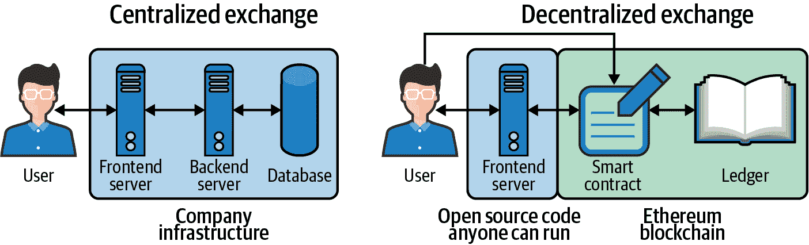

###### 图 7-5\. 集中式交易所和 DEX 之间基础设施差异的高层视图

表 7-1 比较了集中式交易所和去中心化交易所（在本例中为 Uniswap）的前端代码。

表 7-1\. 集中式交易所和 Uniswap 之间的前端差异

| **类型** | **集中式交易所** | **Uniswap** |
| --- | --- | --- |
| 分发与透明度 | 前端代码由交易所保密，并在交易所控制的基础设施上运行。 | 前端代码在 Uniswap GitHub 存储库中共享。 |
| 控制 | 前端运行在交易所及其托管提供商控制的基础设施上。 | 社区中的任何人都可以启动自己的网站，与 Uniswap DEX 进行交互。 |
| 功能性 | 前端从后端接收数据，例如获取市场 USD/ETH 的汇率。前端代码还向后端发送指令，例如执行交易。 | 前端代码仅从 DEX 智能合约接收数据。它不向后端发送指令。相反，用户使用像 MetaMask 这样的以太坊钱包直接从其客户端设备向智能合约发送指令。前端代码通过为用户设置交易使这一过程更加用户友好。 |
| 交易授权 | 交易授权是在前端代码中执行的，通常使用存储在浏览器中的 cookie 或访问令牌。 | 用户通过使用存储在 MetaMask 中的私钥生成交易签名来授权交易。然后，MetaMask 将交易推送到智能合约。 |

图 7-6 是一个用户在 Uniswap 上执行交易的截图。请注意，*交易授权发生在 MetaMask 中，而不是在前端代码中。*

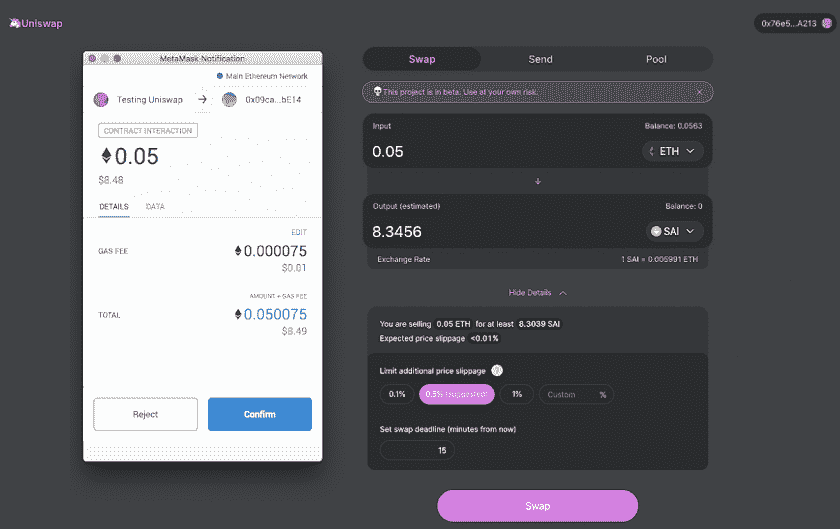

###### 图 7-6\. 用户在 Uniswap 上执行交易

表 7-2 概述了中心化交易所和 DEX 在后端和数据库方面的差异。

表 7-2\. 中心化交易所和 Uniswap 之间的后端/数据库差异

| **类型** | **中心化交易所** | **Uniswap** |
| --- | --- | --- |
| 分配与透明度 | 交易所保留后端和数据库的私密性。公众无法审计交易所的代码。 | 后端逻辑在智能合约中运行。Uniswap 智能合约中的代码是公开可见的，因此潜在用户可以在使用 DEX 之前审计代码。所有 Uniswap 交易都记录在以太坊区块链上，也是公开可见的。 |

| 控制 | 后端运行在交易所及其托管提供商控制的基础设施上。交易所可以随时更改后端服务器或数据库。

此外，交易所或托管提供商可以随时关闭后端或数据库。| Uniswap 的智能合约和交易由数千名矿工驱动和记录。智能合约和交易是不可变的，永远无法更改。

关闭智能合约或停止交易完成的唯一方法是关闭以太坊网络。

| 授权代码执行 | 在执行任何业务逻辑之前，后端使用诸如 JWT 或 OAuth 等安全标准授权 API 请求。 | 智能合约代码在以太坊虚拟机（EVM）上运行。智能合约在生产区块的矿工节点上运行，并且网络中的每个运行完整节点的人都会验证链。 |
| --- | --- | --- |

图 7-7 展示了 Uniswap V1 交易所模板智能合约的部分内容，[可在区块链上查看](https://oreil.ly/T5ruS)。

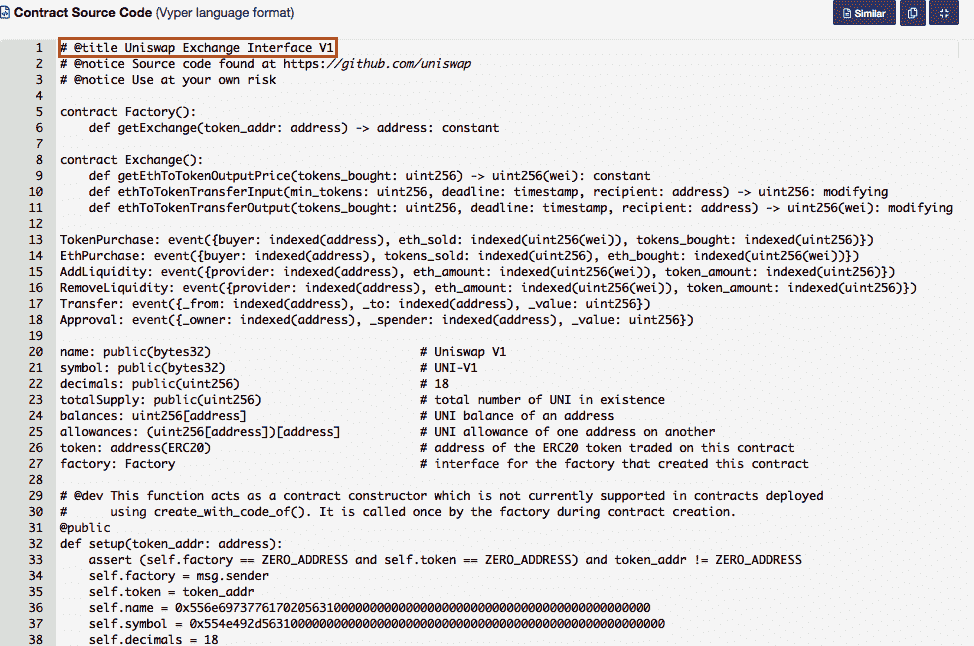

###### 图 7-7。Uniswap 的智能合约之一，可在以太坊区块链上公开查看

### 代币列表

当代币的制造者希望中心化交易所列出其代币时，通常会有很长的延迟，双方尝试协商此业务交易的条款。通常，代币公司必须支付上市费用，并提供法律文件和法律意见以减少交易所的责任。

由于 DEX 无需任何人控制，代币的制造者可以自行将其代币列入交易所——无需许可。

如果有人想要在 Uniswap 上列出一个 ERC-20 代币，他们只需在 Uniswap 代币工厂智能合约 (*0xc0a47dFe034B400B47bDaD5FecDa2621de6c4d95*) 中调用 `createExchange` 方法，如 图 7-8 所示。

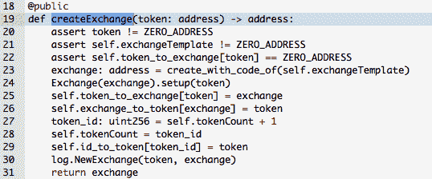

###### 图 7-8\. Uniswap 令牌工厂方法，允许任何人在 Uniswap DEX 上列出一个 ERC-20 代币

作为一个参数，他们需要传递 ERC-20 代币智能合约的地址。例如，如果你想要添加 SAI ERC-20 代币（*0x89d24A6b4CcB1B6fAA2625fE562bDD9a23260359*），你需要执行 `createExchange` 方法并传递以下参数：

| **参数名称** | **值** |
| --- | --- |
| `token` | `0x89d24A6b4CcB1B6fAA2625fE562bDD9a23260359` |

然后 Uniswap 令牌工厂会生成一个新的智能合约，允许任何人交换 ETH 与 SAI。

### 托管和交易对手风险

中心化交易所的用户必须存入加密货币才能开始交易，并且交易所托管他们的资金。由于交易所控制用户的资金，存在 *交易对手风险*。也就是说，如果交易所被黑客攻击或关闭，存在交易所用户资金可能丢失的风险。

当有人使用 DEX 时，智能合约管理存款、提款、交易，并保管用户资金。在将资金发送到 DEX 之前，用户可以审计智能合约代码，了解他们的资金将如何被使用。

下面是在智能合约中寻找的重要事项：

+   什么智能合约方法可以转移用户的资金？

+   谁可以调用这些方法来移动用户的资金？

+   这些资金可以转移至哪里？

为了澄清 Uniswap 如何管理用户资金，我们在 DEX 上执行了一笔小额交易，然后审计了交易，如图 7-9 所示。

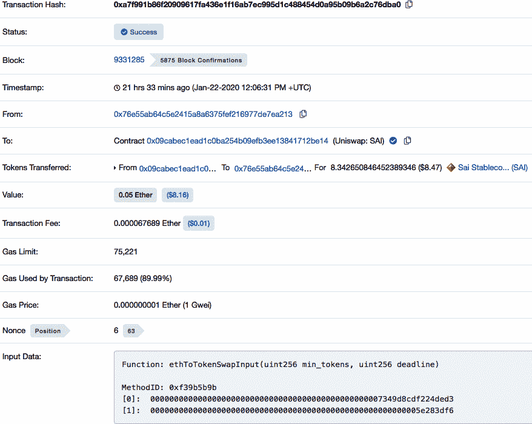

###### 图 7-9\. Uniswap 智能合约调用的公开可见记录

正如您所看到的，我们用 0.05 ETH 交易了 8.34 SAI 代币，价值约为 8 美元。

在交易记录中，输入数据字段包含此值：

```
0xf39b5b9b0000000000000000000000000000000000000000000000007349d8cdf224ded30000000
00000000000000000000000000000000000000000000000005e283df6
```

分解输入数据显示了调用的智能合约函数和传递的参数。

输入数据字段的前 10 个字符指定了被调用的函数。在这个交易中，前 10 个字符是 0xf39b5b9b。通过使用[在线目录](https://www.4byte.directory)，您可以了解到被调用的函数是 `ethToTokenSwapInput(uint256,uint256)`。输入数据字段中剩余的字符是传递给函数的参数的值：

```
0000000000000000000000000000000000000000000000007349d8cdf224ded3

000000000000000000000000000000000000000000000000000000005e283df6
```

审计此交易，我们看到以下步骤已经发生：

1.  该交易从我们的地址（*0x76e55ab64c5e2415a8a6375fef216977de7ea213*）发送了 0.05 ETH 到 Uniswap SAI 智能合约（*0x09cabec1ead1c0ba254b09efb3ee13841712be14*）。这些资金将保留在智能合约中，用于未来交易的流动性。这类似于银行账户：用户存入资金后，仍然拥有资金，并可以随时取出；然而，当资金留在那里时，银行也可以使用它们。

1.  交易调用了 Uniswap SAI 智能合约（0x09ca…be14）中的函数`ethToTokenSwapInput`，并使用了以下输入值：

| **参数名称** | **值** |
| --- | --- |
| `min_tokens` | `0000000000000000000000000000000000000000000000007349d8cdf224ded3` |
| `deadline` | `000000000000000000000000000000000000000000000000000000005e283df6` |

这些参数是十六进制格式的，因为智能合约被编译成了字节码。将它们解码为人类可读的值，我们得到了这个：

| **参数名称** | **值** | **类型** |
| --- | --- | --- |
| `min_tokens` | `8307409366703988435` | `uint256` |
| `deadline` | `1579695606` | `uint256` |

###### 注意

在调用智能合约时，用户必须以十六进制值作为参数发送。有一些在线工具，比如[Moesif 的二进制编码器/解码器](https://oreil.ly/FO2Qv)，可以帮助创建要与交易一起发送的输入数据。

让我们更仔细地看一下之前提到的[Uniswap V1 交易所模板智能合约](https://oreil.ly/EJTca)中定义的`ethToTokenSwapInput`函数（图 7-10）。

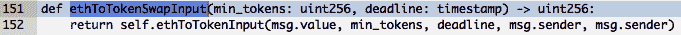

###### 图 7-10\. 来自 Uniswap 模板代码的 ethToTokenSwapInput 函数

查看方法定义，你会发现它调用另一个方法`ethToTokenInput`。正如图 7-11 所示，这个方法是此交易的实际逻辑发生的地方。

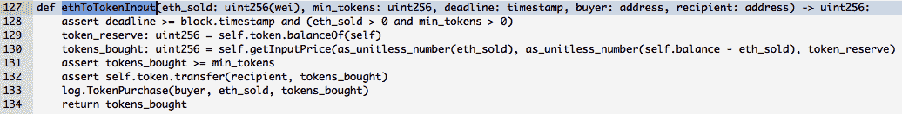

###### 图 7-11\. 交易逻辑

第 128 行在图 7-11 中检查以下内容是否为真：

+   给定的截止日期等于或晚于此交易被包含的区块的时间戳。

+   `eth_sold`的数量大于 0。

+   期望的`min_tokens`数量大于 0。

第 129 行获取智能合约当前持有的代币数量。

第 130 行获取用户在交易中应该接收的代币数量。这是一行重要的代码，因为它显示了交易的汇率是如何计算的。它调用了`getInputPrice`函数，该函数根据当前智能合约中 ETH 和 SAI 的比率确定交易的汇率。

第 131 行检查`tokens_bought`的值是否大于或等于`min_tokens`值，即用户愿意接收的最小代币数量。

如果所有先前的检查都有效，则执行第 132 行。该行将代币从智能合约转移到收件人的地址。从技术上讲，它调用了 SAI 智能合约（0x89d2…0359）中的`transfer`方法，并带有以下参数：

| **参数名称** | **值** | **类型** |
| --- | --- | --- |
| `dst` | `0x76e55ab64c5e2415a8a6375fef216977de7ea213` | `address` |
| `wad` | `8342650846452389346` | `uint` |

第 133 行向事件`TokenPurchase`的所有监听器广播，表明此交易已执行。

最后，第 134 行返回了值`token_bought`，这是用户获得的代币数量。

以下是在我们的示例交易中传递给`ethToTokenInput`方法的输入值，导致将 0.05 ETH 交换为 8.34 SAI 代币：

| **参数名称** | **值** | **类型** | **描述** |
| --- | --- | --- | --- |
| `eth_sold` | `50000000000000000` | `uit256(wei)`^(a) | 为此参数传递了`msg.value`，它指的是交易中发送的以太币数量（0.05 ETH）。类型为`uint256(wei)`，其中 1 ETH = 10¹⁸ wei，因此我们将 0.05 乘以 10¹⁸。 |
| `min_tokens` | `8307409366703988435` | `uint256` | 这个值是从原始交易中传递的。它指定了我们在执行交易之前愿意接收到的最小代币数量。 |
| `deadline` | `1579695606` | `timestamp` | 这个值是从原始交易中传递的。它表示我们愿意执行交易的最迟日期。 |
| `buyer` | `0x76e55ab64c5e2415a` `8a6375fef216977de7ea213` | `address` | 为此参数传递了`msg.sender`，它指的是执行交易的地址。那就是我们的地址。 |
| `recipient` | `0x76e55ab64c5e2415a` `8a6375fef216977de7ea213` | `address` | 与之前相同。 |
| ^(a) Wei 是以太的最小面值。1 以太 = 1,000,000,000,000,000,000 wei。与以太坊区块链交互时，数字以 wei 为单位。 |

### 汇率

在中心化交易所上，市场交易中的汇率设定为买家和卖家都同意的价格。这个逻辑被编程到交易所的后端服务器中。在 DEX 上，汇率被编程到执行交易的智能合约中，并且可以进行审计。

### 认识你的客户

每个中心化交易所都有一个注册流程，用户必须共享识别信息，如电子邮件地址、电话号码或政府颁发的身份证明。根据其司法管辖权，交易所必须在允许某人使用其服务之前收集一定量的识别信息。这是政府防止交易所等金融机构促进洗钱和恐怖主义融资的重要方式。然而，在 DEX 中，任何人都可以在不共享任何身份信息的情况下使用交易所。唯一共享的信息是加密货币地址。

优点在于任何持有加密货币的人都可以使用 DEX，无需经过许可。缺点在于 DEX 仅允许交易加密货币，不支持像美元或欧元这样的法定货币。这是因为所有法定货币都与传统银行体系相关联，该体系使用银行和金融机构等中央机构。

### 可扩展性

中心化交易所可以在成熟的技术基础上运行其基础设施，每秒轻松执行数百万次操作。因此，即使服务于数百万用户，它也可以提供快速的交易体验。

由于 DEX 完全在公共区块链上运行，DEX 的交易吞吐量受到区块链的最大交易速度限制。截至 2020 年，以太坊的最大交易速率低于每秒 20 次交易。相比之下，正如本书前面提到的，Visa 的支付网络可以处理每秒高达 [65,000 次交易](https://oreil.ly/85rhO)。

# 闪电贷款

大多数标准贷款都有一个评估过程，用于评估谁有资格获得贷款以及他们可以借多少的最大金额。一些贷款可能要求借款人提供抵押品来担保贷款。放贷人创建并遵循这些流程，以保护自己免受借款人可能不返还资金的风险，而这种风险随着借款人持有资金的时间增加而增加。

另一方面，*闪电贷款*允许以太坊智能合约在没有抵押品的情况下借入贷款方的资金，条件是智能合约在同一笔以太坊交易中归还资金加上费用。对于借款资金的智能合约来说，这是有用的，因为它可以在同一笔以太坊交易中执行多次调用其他智能合约，因此可以利用借入的资金，同时在同一瞬间归还资金。

图 7-12 说明了智能合约在一个交易内可以做到的事情。

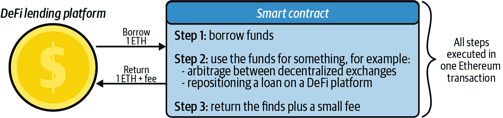

###### 图 7-12\. 示例闪电贷款

如果智能合约没有正确返回资金加上费用（步骤 3），DeFi 借贷平台可以在步骤 1 中产生错误，因为步骤 1 和步骤 3 发生在同一笔交易中。因此，借贷平台不会面临贷款违约的风险。由于贷款方没有风险，贷款方可以向智能合约贷款所有其在借贷池中可用的资金。

智能合约持有、接收和发送资金。它们还记录余额。基本上，智能合约和社区激励替代了传统金融产品中的中心化权威。

## 创建闪电贷款合约

让我们看一个执行闪电贷款的示例。在这个例子中，我们将执行以下操作：

1.  创建一个能够执行闪电贷款的智能合约。

1.  执行一个简单的闪电贷款。

闪电贷款合约将从 Aave（DeFi 服务）借贷池借入 1 个 DAI（ERC-20 代币），然后归还 1.0009 个 DAI。归还的金额更高，因为它包括了闪电贷款手续费。

闪电贷款智能合约的代码如下：

```
pragma solidity ⁰.6.6;
// Import Aave flashloan code. By importing you are saving resources from
// having to write out this code.
import "https://github.com/aave/flashloan-
  box/blob/Remix/contracts/aave/FlashLoanReceiverBase.sol";
import "https://github.com/aave/flashloan-
  box/blob/Remix/contracts/aave/ILendingPoolAddressesProvider.sol";
import "https://github.com/aave/flashloan-
  box/blob/Remix/contracts/aave/ILendingPool.sol";

contract Flashloan is FlashLoanReceiverBase {

/**
The following constructor method is run when you create this flashloan smart
contract. Make sure to specify the address of the Aave LendingPoolAddressProvider
contract. This argument is different based on the environment you are working in.
Visit the Aave docs to get this address.
*/

    constructor(address _addressProvider) FlashLoanReceiverBase(_addressProvider) 
      public {}

```

```
    /**
    The following function is called by Aave to the flashloan contract after the
    contract has received the flash-loaned amount:
     */

    function executeOperation(
        address _reserve,
        uint256 _amount,
        uint256 _fee,
        bytes calldata _params
    )
        external
        override
    {
        require(_amount <= getBalanceInternal(address(this), _reserve), 
                "Invalid balance, was the flashloan successful?");

        // Your logic goes here.
        // !! Ensure that *this contract* has enough `_reserve` funds to
        // pay back the `_fee` !!

        uint totalDebt = _amount.add(_fee);
        transferFundsBackToPoolInternal(_reserve, totalDebt);
    }

    /**
    Call the following function when you want to execute a flash loan. The
    parameter _asset is the address of the token you want to borrow in the
    flash loan. In our example the token we will borrow is DAI.
    */

    function flashloan(address _asset) public onlyOwner {
        bytes memory data = "";
        uint amount = 1 ether;

        ILendingPool lendingPool = 
          ILendingPool(addressesProvider.getLendingPool());
        lendingPool.flashLoan(address(this), _asset, amount, data);
    }
}
```

## 部署合约

您可以使用[Remix](https://remix.ethereum.org)和 MetaMask 部署此智能合约，如图 7-13 所示。


###### 图 7-13\. 部署闪电贷款合约

发布 Flashloan 智能合约到 Ropsten 网络需要以下步骤：

1.  复制智能合约代码（你可以在 [GitHub](https://github.com/Mastering-Blockchain-Book) 找到它），然后粘贴到 Remix 中。

1.  使用编译器版本 0.6.6+commit.6c089d02 编译代码（要检查编译器版本，请点击 Remix IDE 左侧第三个按钮）。

1.  将代码发布到 Ropsten 环境。确保在部署按钮旁边的字段中输入 Aave LendingPoolAddressProvider 合约的地址。这个参数在创建 Flashloan 合约时传递给构造方法；它基本上告诉 Flashloan 合约在借款资金时如何与 Aave 通信。

1.  点击 Remix 中的 Deploy，然后在 MetaMask 中确认部署。

现在 Flashloan 智能合约的地址如下：

```
0x978e5f2149024D5742476Bc2d3b5B820926537A2
```

## 执行闪电贷款

要执行闪电贷款，请执行调用函数 `flashloan(address _asset)` 的以太坊交易。

在本示例中，我们希望执行一个借出 1 DAI 的闪电贷款。Flashloan 合约位于 Ropsten 环境中，因此我们需要传递的参数是 Ropsten 上 DAI 代币合约的地址。该地址是：

```
0xf80a32a835f79d7787e8a8ee5721d0feafd78108
```

请记住 Aave 收取费用，如果 Flashloan 合约无法支付该费用，将会出现错误。为确保能支付该费用，请确保 Flashloan 合约至少持有 0.0009 DAI。你可以使用 Etherscan 上的智能合约工具铸造并转移资金到合约。

一旦确定了 DAI 代币合约地址并加载了 DAI 到 Flashloan 合约以支付费用，该合约就准备好执行闪电贷款。

设置非常高的 Gas 限制非常重要，因为闪电贷款将执行多个交易，消耗大量 Gas —— 如果 Gas 限制太低，将会出现 “Gas 不足” 错误。

在本示例中，我们将向闪电贷款合约发送以下交易：

+   *金额*: 0 ETH

+   *Gas 限制*: 300,000

+   *数据*: 0x36c40477000000000000000000000000f80a32a835f79d7787e8a8ee5721d0

    feafd78108

数据字段包含两个信息：

| **数据值** | **描述** |
| --- | --- |
| 0x36c40477 | 指令调用函数 `flashloan(address _asset)`。 |
| `000000000000000000000000f80a32a8` `35f79d7787e8a8ee5721d0feafd78108` | 被传递到函数的 `_asset` 参数。在这个例子中，它是 DAI 代币合约的地址。 |

图 7-14 展示了发送到闪电贷合约的交易，包括输入数据。

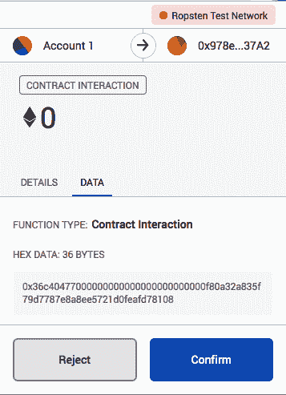

###### 图 7-14\. 在 MetaMask 钱包中的闪电贷合约交易

您可以在线查看闪电贷的成功执行交易 [online](https://oreil.ly/3Azdz)。在一个交易中 (0xc779…1f23) 发生了许多活动，包括函数调用和代币转账。

审计样本闪电贷交易中的代币转账显示，一个闪电贷中发生了三笔代币交易 (见 表 7-3)。

表 7-3\. 闪电贷交易中转账资金清单

| **交易号** | **发送方** | **接收方** | **金额** |
| --- | --- | --- | --- |
| 1 | Aave 借贷池 (0x4295…9472) | 闪电贷合约 (0x978e…37A2) | 1 DAI |
| 2 | 闪电贷合约 (0x978e…37A2) | Aave 借贷池 (0x4295…9472) | 1.0009 DAI |
| 3 | Aave 借贷池 (0x4295…9472) | Aave 费用收取人 (0xeBA2…fC9C) | 0.00027 DAI |

审计闪电贷交易中的函数调用显示，涉及到总共 24 次函数调用，涉及到 10 个不同的智能合约和一个用户账户，如 图 7-15 所示。

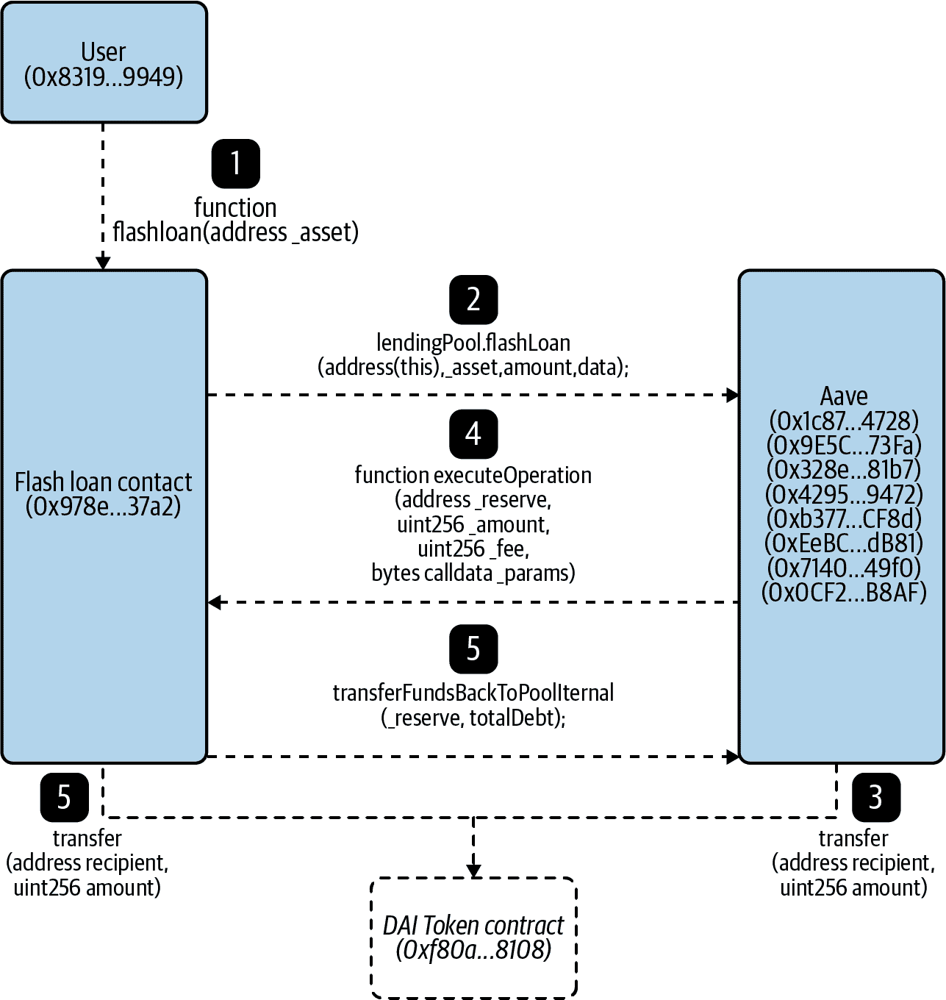

###### 图 7-15\. 显示不同智能合约之间重要函数调用顺序的流程图

闪电贷交易中的重要函数调用如下：

1.  *发起闪电贷款*：闪电贷款是使用创建闪电贷款合约的相同用户账户（0x8319…9949）发起的。此用户账户调用闪电贷款合约（0x978e…37a2）上的`flashloan(address _asset)`函数，并提供足够的 gas。

1.  *请求借款*：Flash 贷款合约（0x978e…37a2）向 Aave 合约之一发送请求，请求进行一次闪电贷款。

1.  *处理并发送资金*：Aave 合约通过一系列调用最终调用 DAI 代币合约（0xf80a…8108）将 1 个 DAI 转移到 Flashloan 合约（0x978e…37a2）。这 1 个 DAI 是借出的金额。

1.  *通知已发送资金*：在 1 个 DAI 被发送到闪电贷款合约（0x987e…37a2）之后，Aave 的合约之一调用它通知资金已发送。此时，闪电贷款合约可以将 1 个 DAI 用于任何目的。在此示例中，为简单起见，令牌未被使用。

1.  *支付带有费用的资金*：Flash 贷款合约（0x987e…37a2）然后通过调用 Aave 的合约之一来归还资金，这导致其调用 DAI 代币合约（0xf80a…8108）将 1.0009 DAI 转移到 Aave 合约。

## 闪电贷款用于套利

闪电贷款的主要用例之一是在多个 DeFi 平台之间进行套利。使用闪电贷款执行套利的最大优势是不再需要将流动性留在参与套利的交易所上。加密货币交易所之间的流动性要求引入交易对手方风险，限制可以进行套利的金额，并引入开始进行套利的巨大准入壁垒。然而，使用闪电贷款进行套利提供了对多个大型流动性池的实时访问，而无需请求许可。

出借人在资金存入智能合约时同意借出资金。他们可以随时查看合约余额，并查看已借出资金的百分比。如果交易在贷款过程中停止，则交易不会完成，因此资金从未被借出。执行闪电贷的成本仅仅是执行它所需的燃气。

## 操作杠杆漏洞

恶意行为者还利用闪电贷来利用 DeFi 平台的漏洞。一个著名的例子发生在 2020 年 2 月 15 日，当时一名攻击者利用闪电贷对[Fulcrum](https://fulcrum.trade)保证金交易平台进行了 Oracle 操纵攻击。

Oracle 为智能合约提供了对外部世界的可信视图。例如，DeFi 智能合约将使用 Oracle 来了解 BTC/USD 汇率是多少。在攻击当天，Fulcrum 平台正在监听多个交换率数据的 Oracle，包括 Kyber 和 Uniswap。Fulcrum 从这些 DEXes 收集交换率数据的一个原因是它可以访问它们的流动性池，为 Fulcrum 的用户提供保证金交易。

执行 Oracle 操纵攻击的闪电贷合约的交易 ID 为：

```
0xb5c8bd9430b6cc87a0e2fe110ece6bf527fa4f170a4bc8cd032f768fc5219838
```

交易详情可以[在线查看](https://oreil.ly/e8EMp)。总共进行了 13 次智能合约函数调用。

在这种攻击中，攻击性闪电贷合约借贷、交易和偿还封装的代币。这些是代表不同加密货币价值的 ERC-20 代币。例如，1 wBTC 是一个封装的比特币，代表 1 BTC，并在理论上价值为 1 BTC，但以 ERC-20 代币的形式存在。

###### 注意

封装的代币允许 DeFi 平台交易原本不以 ERC-20 代币形式存在的加密货币。为简单起见，每当在本讨论中看到 1 wETH，您可以假设它等于 1 ETH；wBTC 和 BTC 也是一样的。

我们可以将攻击过程分解为五个明确的步骤，如图 7-16 所示。

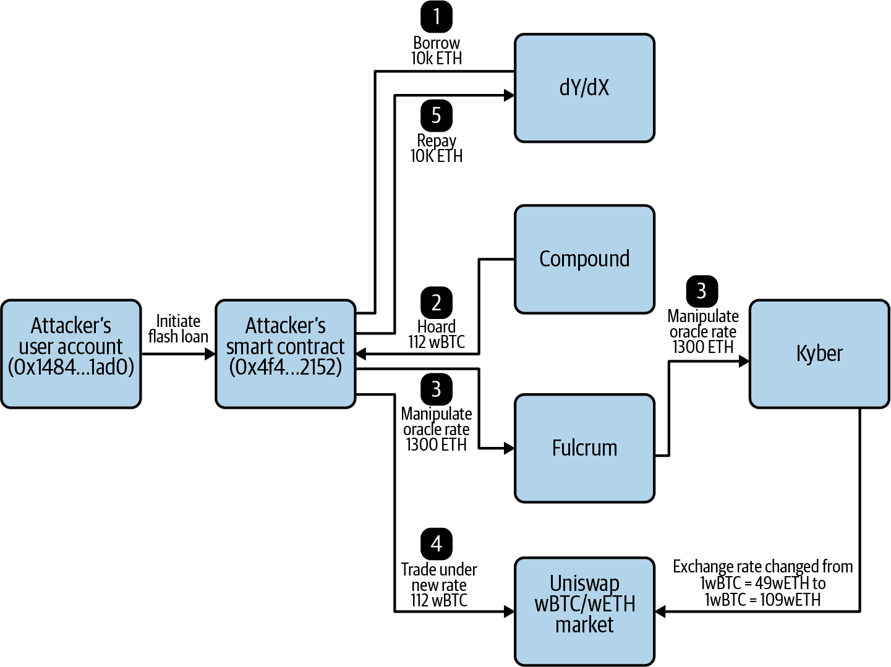

###### 图 7-16\. Fulcrum 攻击的详细步骤

步骤可以总结如下：

1.  *借贷*：攻击性闪电贷款合约从去中心化交易平台 dYdX 借入 10,000 ETH（价值 281 万美元）。只有在本次以太坊交易结束时偿还贷款及手续费才有效。

1.  *囤积*：然后从 DeFi 借贷平台 Compound 借入 112 wBTC（价值 115 万美元）。为了担保这些资金，它提供 5,500 ETH（价值 150 万美元）作为抵押。稍后，这 112 wBTC 将被转移到另一个市场上，以操纵 Oracle 汇率。

1.  *操纵 Oracle 汇率*：接下来，它将 1,300 ETH 存入 Fulcrum 保证金交易平台，并在 wETH/wBTC 市场上以 5 倍杠杆开设了一个做空交易头寸，即押注价格将下跌。这个空头头寸产生了连锁反应。为了满足 Fulcrum 的空头头寸，它从 Kyber 那里用 5,637 ETH（价值 158 万美元）兑换了 51.34 wBTC（价值 52.5 万美元）。Kyber 从 Uniswap 那里获取了这 51.34 wBTC。当 Kyber 从 Uniswap 那里提取了这么大数量的 wBTC 时，由于流动性不足导致了显著的滑点——价格发生大幅变动。这使得 Uniswap 上的 wETH/wBTC 交换率从 Compound 在囤积阶段给出的 1wBTC = 49 wETH，变为了 1wBTC = 109.8 wETH。

1.  *以新汇率交易*：现在，Uniswap 上的 wETH/wBTC 交换率已经被抬高，攻击性闪电贷款合约将其 112 wBTC 倾销到 Uniswap 市场上，在这笔交易中获得 6,871 ETH（价值 193 万美元）。在这个动作中，它获得的汇率为 1wBTC = 61.3 wETH。这比它在 Compound 上收到的原始汇率高约 25%，从而获得了 1,371 ETH（价值 38.5 万美元）的利润。

1.  *偿还贷款*：在利润已经获得之后，闪电贷款合约会偿还来自 dYdX 的原始 10,000 个以太币贷款。这是必需的，否则会引发错误，交易将无法完成。总共，攻击者花费了 0.03 个以太币（7.47 美元）来执行该交易，并获得了价值约 385,000 美元的加密货币。然后它还清了 Compound 贷款。

###### 注意

每当金融科技出现重大创新时，总会有坏人寻找新的方法来利用技术变革。例如，在 PayPal 刚开始的时候，黑客开始自动生成假的 PayPal 账户来进行大规模的信用卡诈骗。最终 PayPal 创造了 CAPTCHA 的早期版本，这是一种区分人类用户和机器的计算测试，以帮助遏制这种威胁。DeFi 也不例外。这是金融服务提供方式的根本转变，这种流动的情况导致攻击者不断搜索利用的漏洞来获利。

# 隐私

像比特币和以太坊这样的公共区块链在隐私方面并不是很出色。在考虑到去中心化金融和网络时，必须仔细考虑信息安全。为了隐藏身份，有许多解决方案可供选择。不同的实现将对这些解决方案进行不同的利用，因为隐私是区块链技术中实验性（但不断增长）的领域。

使用比特币和以太坊，所有交易信息都可以在公共区块链上看到，包括交易金额和发送方和接收方的地址。然而，有些情况下需要保持区块链交易信息私密，因此推出了一些关注隐私的区块链，如 Zcash 和 Monero。还有一些私有区块链网络，如 Corda 和 Quorum，需要邀请或自动审查才能允许组织参与。本节考虑了隐私的几个方面，我们将在第九章再次讨论这个主题。

## 零知识证明

*零知识证明* 是一种密码学方法或协议，其中甲方（证明者）向乙方（验证者）证明一个陈述为真，而不透露任何除了该陈述为真之外的信息。

假设一个证明者需要向验证者证明他们在 *哪里是沃尔多？* 图纸中找到了沃尔多。最简单的方法是让证明者指着沃尔多，但这样做会泄露沃尔多在哪里，而证明的目的仅是证明证明者 *知道* 沃尔多在哪里。一个零知识的方法可能是让证明者拿一张比 *哪里是沃尔多？* 图纸大得多的纸，然后在纸的中心剪出一个沃尔多形状的洞。在验证者的视线之外，证明者盖住图纸，以便只有通过纸上的洞能看到沃尔多。证明者已经证明了他们找到了沃尔多，而没有透露任何可能帮助验证者找到沃尔多的信息。

让我们考虑另一个例子。假设证明者想向验证者证明他们知道正确的网站登录密码。目前许多网站使用的方法是在他们的数据库中存储用户密码的哈希值。当用户想要登录时，以下序列发生：

1.  用户将密码以明文形式发送到服务器。

1.  服务器使用标准加密算法（如 MD5）加密密码。

1.  如果新生成的 MD5 哈希值与数据库中存储的哈希值匹配，则输入的密码有效。

然而，这种方法使用户的密码容易受到以下攻击的影响：

中间人攻击

如果黑客破坏了用户与服务器之间的通信，就有可能拦截明文密码。

暴力破解和字典攻击

如果网站的数据库被入侵，黑客可以通过各种方法（包括使用试错法进行暴力破解或使用单词或短语列表进行字典攻击）可能解密用户的密码。

在零知识方法中，用户可以证明他们有一个有效的密码而不需要透露是什么密码——服务器不存储密码的任何变体，甚至不存储哈希值。这可以通过实现 [Thinbus 安全远程密码协议 (SRP)](https://oreil.ly/djyVy) 来完成：

1.  服务器存储一个随机生成的 *盐*，或者用作额外输入的随机数据，并且一个无法解密为密码的 *验证者*。

1.  当用户登录网站时，他们发送一个仅用于该特定登录的一次性值。未来的消息会有很大的不同。服务器接收到这个一次性值，并通过 SRP 可以验证接收到的消息是否由具有有效密码的用户发送。 图 7-17 给出了说明。

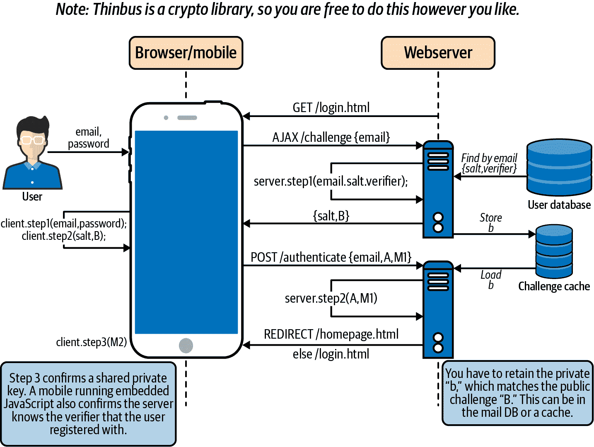

###### 图 7-17。SRP 注册动作中的操作流程

实现零知识证明显着提高了许多系统的隐私和安全性。然而，这增加了处理能力和硬盘空间的额外成本。另一个缺点是它需要两方（证明者和验证者）直接相互交互。

在网站的情况下，这些缺点并不重要，但是在区块链中实现零知识证明会产生重大影响，原因有几个：

+   区块链矿工维护整个区块链历史的副本，随着网络使用规模的扩大，这个历史记录会迅速变得庞大。增加更多数据会使这个问题变得更加严重。

+   在区块链网络中，交易的发送方希望证明交易的有效性，而每个矿工都验证了该有效性。问题在于，发送方并不直接与每个矿工通信。相反，发送方广播交易细节，而矿工验证交易——这个过程不涉及直接的一对一交互。

因此，为了让区块链采用零知识证明方法，它必须是*简洁的*，以实现更好的可扩展性，并且*非交互式的*，以便网络中的节点可以验证来自它们没有直接通信的节点的零知识陈述。通过这种方法，交易的发送方（证明者）可以广播出一条数据，而矿工（验证者）可以在不与发送方进行任何额外交互的情况下验证交易的有效性。交易发送方向网络广播的数据必须非常小，因为这些数据将存储在区块链上。

###### 注意

零知识证明被用于企业区块链应用中不使用挖矿的情况。有关此内容请参阅第九章。

### zk-SNARKs

零知识证明的一种形式是*零知识简洁非交互知识论证*（zk-SNARKs），这是一种隐私技术，已经在像 Zcash 这样的加密货币中使用。在以太坊中，它可以用于增强智能合约的隐私性。

尽管预计在某个时候会集成，但目前 zk-SNARKs 需要在像以太坊这样的网络上进行*预编译*或处理输入数据以产生输出，因为需要大量的燃气费用。目前，在 EVM 之外运行代码是预编译的最佳方式，可以使用 Rust 或 JavaScript。 [Aztec](https://www.aztecprotocol.com)是以太坊的早期主网或生产环境技术，成功地将 zk-SNARKs 集成到其中以增强隐私。

## Zcash

[Zcash](https://z.cash)是一个专注于隐私的区块链，为交易的发送者提供了将交易信息公开或保密的选项。私人的 Zcash 交易使用 zk-SNARKs。 Zcash 对 zk-SNARKs 的实现为社区提供了如何将其应用于公共区块链的证据。值得注意的是，它：

+   允许在比特币或以太坊等公共区块链上进行私人交易。

+   允许在公共区块链上私下执行智能合约代码。

## 环签名

借助环签名，预定义组中的任何人都可以签署交易，增加了确定实际签署者身份的难度。组中的任何成员都可能发送交易，隐藏发送者并增加隐私。环越大，隐藏的机会就越高。目前，门罗币加密货币正在使用这项技术，除了使用假输出来隐藏 UXTOs。

# Web 3.0

区块链和加密货币在适当的隐私级别下，可以为网络创建新平台，激励新型开发，并使用户摆脱过去十年来主导的[寡头模式](https://oreil.ly/YAge3)。

谈论互联网的演变过程中不同阶段已经成为常态。Web 1.0 由静态页面、表单字段和被动内容组成。Web 2.0 引入了动态页面、交互字段和用户生成的内容。Web 3.0 是下一个迭代版本，通过前两代产生的数据返回给用户进行货币化，并由用户控制。这将完全呈现什么样子目前尚不清楚，但一些特征正在出现，而 Web 3.0 技术的脚手架正在今天构建中。

用户经常在不知情的情况下泄露大量数据，其中很多发生在网络浏览器中。[Brave](https://brave.com)是一个以隐私为重点的基于 Chromium 的浏览器。尽管其他网络浏览器也对其隐私功能提出了各种声明，但 Brave 是第一个实施区块链技术的浏览器。它内置了广告拦截器，用加密货币替代广告。其 ERC-20 加密货币基础注意力代币（BAT）用于补偿网站所有者和内容创作者，而不是广告平台。

支付独立开发者来参与开源代码的工作可能是一个复杂的过程。加密货币和区块链正在引领软件开发领域的激动人心的变革。像[Gitcoin](https://gitcoin.co)这样的网站正在支持和拥抱这一运动：它将寻找项目的开发者与寻找人来实现漏洞修复或功能请求或在项目中进行其他工作的资助者配对，所有支付都以加密货币形式进行。

文件存储是基于网络的应用程序的重要组成部分，去中心化这一方面至关重要。存储和共享数据是许多技术提供商通过其服务条款对用户信息进行侵犯的原因。[星际文件系统（IPFS）](https://ipfs.io)是一个持久性网络，它使得文件可以分布式存储，只要单个节点保持运行；其目标是.... 其设计是模块化的，允许它用于各种用例。

构建去中心化的网络框架是一项艰巨的任务。它需要将身份、分布式系统和区块链融合到开发者可以用来创建日益去中心化的应用程序的支架中。[Blockstack](https://www.blockstack.org)，从身份出发，然后进入分布式系统，是这些早期框架之一。它使用 REST 调用来在与开发者过去所使用的类似的框架中创建 dapps。

还有赌博。由于在 Web 3.0 中是通过智能合约进行价值转移，因此更容易审计规则是否公平。在传统的赌博中，通常房子在赔率方面具有优势。在这个新框架中，正在发明新的游戏类型，例如*无损赌博*。一个例子是 DAO 池，每个人都投入稳定币，它会产生收益。池会通过随机选择过程选择赢家；赢家获得池中获得的所有利息，而输家则收回其原始金额的稳定币。

# 总结

Web 3.0 技术基于对传统中心化服务模式的颠覆。虽然这种模式曾经取得了一定的成功，但随着网络攻击数量的增加，它开始变得薄弱起来。在金融和网络领域，开发者正在探索使用区块链、加密货币和智能合约来保护用户隐私，并将个人信息的控制权重新交到用户手中。
