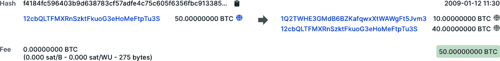
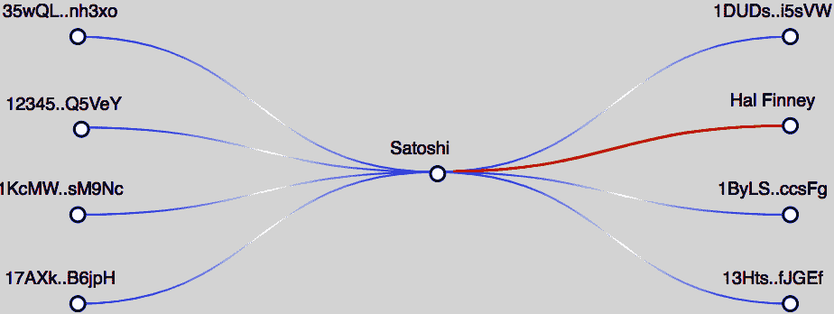
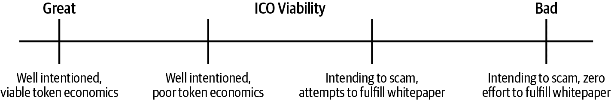
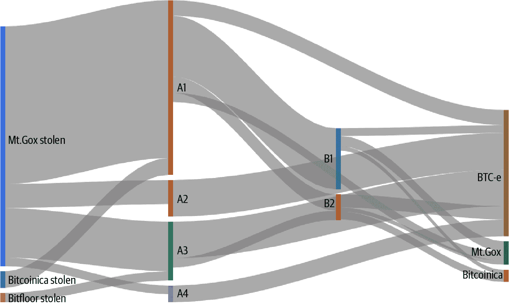
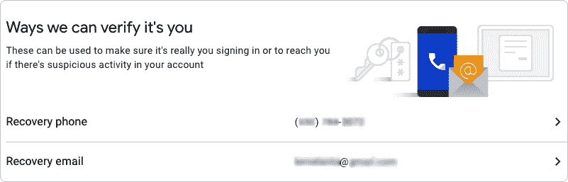

# 第八章。抓住我如果你能的机会

区块链和加密货币提供了许多希望。然而，通往成功的道路充满了坑洼和陷阱。自从它首次实施以来，比特币就发生了各种丑闻、黑客事件和盗窃事件。

了解并理解这些事件非常重要，因为如果不将历史用作指南，过去就有可能重演。虽然我们在本章描述的问题可能看起来严重，但从长远来看，它们将被视为通往机遇世界的一条小路上的小石头。

最著名的恶名昭彰的例子可能是 Silk Road，这是一个在暗网上匿名的非法市场，使用比特币作为支付机制。用户会使用[Tor](https://www.torproject.org)登录 Silk Road，这是一个匿名的虚拟专用网络（VPN）软件。Tor 使用全球计算机网络来路由互联网流量，因此几乎不可能被追踪。这使用户能够保持匿名，模糊识别信息，如 IP 地址。

2013 年 10 月，在长时间调查之后，FBI 逮捕了 Ross Ulbricht，因为他是 Silk Road 的运营者。他们能够抓住 Ulbricht，是因为当他在加利福尼亚州旧金山的一家公共图书馆工作时，他的加密笔记本电脑是开启的。当局能够访问他电脑上的所有内容，包括有关该网站运营的证据。Ulbricht 现在因经营当时是最大的非法毒品、枪支和其他违禁品市场之一而被判处双重无期徒刑。

在比特币的早期，许多用户认为区块链上的交易同样难以追踪。然而，随着时间的推移，许多加密货币研究人员和企业发现了使用交易所、钱包提供商和生态系统其他利益相关者的元数据将地址彼此关联起来的方法。

# 加密洗钱的演变

在 2014 年之前，当大多数人仍然认为比特币交易是匿名的时候，许多犯罪分子认为通过加密货币转移脏资金可以保持他们的行踪不被发现。

从 2011 年至 2013 年，丝绸之路成功地使用比特币进行支付。在这段时间内，当交易所被盗取资金时，普遍的看法是没有补救措施。在 2014 年初日本交易所 Mt. Gox 的倒闭（参见“Mt. Gox”）之后，随着调查机构最终成功追踪到失踪资金的努力，许多人开始意识到比特币交易并非完全匿名。

那时，人们对比特币交易的唯一可见性是使用区块链浏览器，如 Blockchain.info（现在[*Blockchain.com*](http://Blockchain.com)），如图 8-1 所示。

###### 图 8-1。在公共区块链浏览器中查看的两个地址之间发送的第一笔比特币交易

许多加密货币交易所并未对客户进行 KYC 检查，但当局尚未开始对这些未进行检查的交易所进行处罚，这使得犯罪分子可以轻易地利用它们将资金从加密货币转换为法定货币。

###### 提示

KYC 是监管和合规中的常见术语；它意味着*了解您的客户*，指的是验证用户身份以开立金融机构账户的过程。

大约在 2014 年，一些区块链分析公司开始帮助当局追踪与刑事调查相关的资金流动。人们开始意识到比特币实际上只是*伪*匿名的——一个身份可以与比特币地址关联起来。由于所有比特币交易都是公开的，存在着完整的交易历史，因此可以确定不同地址之间的关系。

有许多不同的方法可以将比特币地址与身份关联起来，包括以下几种：

+   人们可能公开将自己标识为比特币地址的所有者。 例如，一些慈善机构（甚至是 [维基解密](https://wikileaks.org)）会发布他们的加密货币地址供人们捐款。 另一个例子是 Hal Finney，他在一个在线论坛上 [发帖](https://oreil.ly/Mq4Dk) 讲述了自己如何参与了第一笔比特币交易，从 Satoshi Nakamoto 那里收到了 10 BTC。 研究这笔交易可以揭示有关 Satoshi 关系的更多信息，如 图 8-2 所示。

    

    ###### 图 8-2\. 区块链分析工具 [Breadcrumbs](https://www.breadcrumbs.app) 的屏幕截图显示了与 Satoshi 有关系的其他比特币地址，包括 Hal Finney

+   比特币交易的参与者通常知道对方的身份。

+   许多比特币地址由加密相关的企业拥有和管理，包括钱包和交易所。 交易所为每个用户生成一个唯一的比特币地址，并通常会拥有该用户的身份信息。

+   从刑事调查中收集的证据有时可以将比特币地址与身份联系起来。 例如，当当局没收了 Silk Road 服务器后，他们拥有了所有的比特币交易信息。 他们能够追踪到交易的发起者，但不一定能追踪到所有的参与者。

加密货币社区中的隐私倡导者很快意识到比特币的匿名性不够。 这就是为什么今天有着专注于隐私的区块链，它们隐藏了交易细节不让公众知道。 [门罗币](https://www.getmonero.org) 是最受欢迎的隐私区块链。

从犯罪分子的角度来看，持有不干净的资金并不理想。 清洗资金然后花费是目标。 洗钱有三个众所周知的阶段：放置、层叠和整合。 下面简要介绍了通过加密货币洗钱的过程：

1.  *放置*：这个阶段是将脏资金放入加密货币的时候。如果资金是现金，犯罪分子必须使用某种类型的加密货币通道将现金转换为加密货币。许多犯罪分子可以跳过这一步，因为资金已经在加密货币中。例如，一个在暗网上出售毒品的商人将会接收加密货币作为付款。

1.  *分层*：这个阶段是对资金进行清洗的时候。在加密领域，最有效的做法是通过将资金转移至*混淆/混合*服务或隐私区块链（如 Monero）来实现。

1.  *整合*：这个阶段是将资金换回法定货币并由犯罪分子支配的时候。在清洗了资金之后，犯罪分子必须使用加密货币通道将资金转换为法定货币。

分层阶段可以完全去中心化地完成，不依赖于中央机构。然而，放置和整合阶段需要加密货币通道来在加密货币和法定货币之间转换资金。这就是洗钱中真正的战斗发生的地方。

加密通道有很多不同类型，设在许多不同司法管辖区，并且它们的 KYC 规则严格程度各不相同。

精明的洗钱者将会在注册加密货币交易所时使用虚假或盗窃的 KYC 文件。根据交易所的合规流程和员工的认真程度，一些洗钱者成功地伪造了他们的身份。使用虚假 KYC 文件可以保护洗钱者在交易所发现非法资金被洗涤时不被识别。然而，这种方法的成功取决于金融机构为防止洗钱和恐怖主义融资而制定的流程。许多优秀的运营商将交叉参考文件 ID。一些人将手动检查 KYC 文档，而另一些人则使用诸如[Acuant](https://oreil.ly/Qn5Zl)之类的工具来检查其有效性。

# FinCEN 指导和监管开始

在监管和犯罪方面，2013 年对区块链网络来说是一个关键的一年。除了丝绸之路被关闭外，美国财政部监管下的美国金融犯罪执法网络（FinCEN）发布了其首个*可转换虚拟货币*（CVC）指南。它指出：“将可转换虚拟货币用于购买真实或虚拟商品或服务的用户不属于 FinCEN 监管下的 MSB（货币服务业务）。”

然而，它也指出：“接受和传输可转换虚拟货币或出于任何原因购买或出售可转换虚拟货币的管理者或交易者在 FinCEN 的监管下属于货币传输者，除非此定义适用于该人的限制或豁免。”

换句话说，那些代表他人传送资金的人需要获得 MSB 许可。FinCEN 列出了属于 MSB 的业务类型如下：

+   货币兑换商或兑换者

+   支票兑现商

+   旅行支票、汇票或储值券的发行人

+   旅行支票、汇票或储值券的销售者或兑现者

+   货币传输者

+   美国邮政服务

通过 2013 年的 CVC 指南，此列表还包括了虚拟货币运营商，可能包括为用户或客户提供虚拟货币交易的交易所、钱包和其他平台。 

在确定哪些机构需要对什么进行合规时，各种监管体制可能会让人感到困惑。许多美国机构和监管机构宣称对加密货币进行监管。以下是明确了一些游戏规则的三个主要机构：

CFTC

商品期货交易委员会负责监管商品、期货和衍生品市场。 CTFC 的委员倡导对加密货币采取[“不加干涉”](https://oreil.ly/uLauI) 的立场，指出互联网能够在轻度监管的情况下蓬勃发展。然而，从 CTFC 的声明中可以清楚地看出，它将打击市场操纵和欺诈行为。到目前为止，CFTC 已宣称对比特币和以太坊及后续衍生工具拥有管辖权。CFTC 设有一个创新单位，负责研究新技术并与企业家会面，名为 CFTCLab。

SEC

证券交易委员会对证券拥有监管权。证券被定义为一种投资合同，许多基于区块链的代币被用来筹集资金可能属于该定义之下。事实上，SEC 已就[数字资产的投资合同](https://oreil.ly/-9ES6)发布了指导意见。它还愿意为其认为适合避免豪伊测试的项目提供无异议函，豪伊测试是衡量资产是否属于证券的标准。这是一个项目或公司与立法者联系以获得保证不会追溯执行规则的信函的过程。SEC 还设有一个名为 FinHub 的创新单位，负责审查区块链和其他金融技术。

NYDFS

纽约金融服务部门（[NYDFS](https://oreil.ly/xPCui)）监管着该州的金融活动。纽约是美国的金融首都，NYDFS 负责监管该州的金融服务和产品。自 2015 年起，NYDFS 开始要求虚拟货币运营商在该州获得“BitLicense”才能开展业务。这包括交易所、钱包和其他涉及加密货币的产品/服务。获得许可牌需要提交一份 30 页的申请和支付 5000 美元的费用，收集所有必要信息可能会花费超过 10 万美元。纽约只有大约 25 家公司获得了 BitLicense。

# FATF 和旅行规则

由金融行动特别工作组（FATF）提出的新条款，*旅行规则*需要加密货币经营者之间增加更多的数据共享。FATF 是一个由美国、加拿大、法国、德国、英国、意大利和日本组成的七国集团政府间组织。

标准要求*虚拟资产服务提供商*（VASPs）在发生交易时提供用户数据，包括从交易所等服务提供商处转移资金。这些数据可能包括以下内容：

+   发送客户的姓名

+   发件人用于处理交易的加密货币地址

+   发件人的身份编号作为唯一标识符

+   接收客户的姓名

+   收件人用于处理交易的加密货币地址

对于加密货币和区块链公司来说，这些规定可能是新鲜的，但对于银行来说并不新鲜。多年来，这些规定一直适用于银行，用于打击洗钱、恐怖主义融资和其他金融犯罪。

在加密货币世界中，任何已经必须遵守货币服务业务（MSB）标准的服务提供商很可能也必须遵守旅行规则。这些标准的审查预计于 2020 年进行。

# 规避法规

加密货币和区块链技术之所以有趣，是因为它们与货币交织在一起，这种交织导致许多早期采用者与监管机构和执法部门发生冲突。这确实表明，区块链是一种新范式，并不意味着它不受法律约束。本节列举了一些被美国执法机构处罚的人或团体的例子：

特伦登·沙弗斯

创建了比特币储蓄信托（Bitcoin Savings & Trust），承诺投资者每周通过套利交易获得 7%的回报，吸引了超过 764,000 个比特币。2015 年，沙弗斯被判处一年半监禁，并被命令支付 123 万美元的赔偿金。这被广泛认为是第一个庞氏骗局定罪案件，也是加密货币领域中的第一个美国刑事证券欺诈案件。

查理·施雷姆

作为未经许可的货币传输业务促成了比特币交易。使用他的公司 BitInstant，沙雷姆帮助一名经纪人为丝绸之路的用户提供了没有 KYC/AML 的比特币。进行了 100 多万美元的比特币交易。2014 年，沙雷姆被判处两年联邦监狱，并被命令没收 95 万美元。

埃里克·沃尔希斯

在两家公司 FeedZeBirds 和 SatoshiDICE 出售未经注册的证券，以比特币交换。2014 年，美国证券交易委员会（SEC）与沃尔希斯达成和解，全额退还已筹集的 15,843.98 美元（即将资金归还给受害方），并处以 3.5 万美元的罚款。沃尔希斯还同意不再参与任何使用比特币或其他虚拟货币的未经注册证券销售。

卡尔·福斯

前美国缉毒局（DEA）特工；在丝绸之路调查期间，利用错误的 DEA 权威没收了比特币。福斯还试图通过 Bitstamp 和 Venmo 洗钱。支付服务冻结了他的账户，然后他试图利用自己的 DEA 地位来释放这些资金。2015 年，他因洗钱、妨碍司法和敲诈被判处六年半监禁。

扎克里·科本

[EtherDelta](https://wiki.example.org/etherdelta)是一个未注册的国家证券交易所。EtherDelta 是一个基于智能合约的平台，允许用户交易以太坊 ERC-20 代币。它被标记为去中心化交易所，无需 KYC/AML。 Coburn 于 2018 年向 SEC 支付了 30 万美元的违约金、13000 美元的利息和 7.5 万美元的罚款。

Reggie Middleton

领导 Veritaseum 的 ICO，SEC 调查其作为未注册证券发行的行为。Veritaseum 从投资者那里筹集了 1480 万美元，声称提供一个不需要中间人的市场平台。在调查期间，Middleton 的资产被查封。他 2019 年的和解包括了 847 万美元的违约金和利息以及 100 万美元的民事处罚。

Homero Joshua Garza

运营 GAW Miners，一个比其库存更多地销售加密货币挖矿设备的公司。这种运营方式类似于庞氏骗局。GAW Miners 还向客户出售“虚拟矿工”或“哈希图”，用于未来的挖矿利润，对 SEC 来说看起来像是证券。2018 年，Garza 因电信诈骗被判入狱 21 个月。

Mark Scott

为 OneCoin 担任律师，一个通过庞氏骗局赚取数十亿美元收入的计划。Scott 负责通过避税天堂将 4 亿美元的收入洗白。OneCoin 是一个多层次营销运营，因其私人区块链加密货币的虚假宣称而在全球范围内受到起诉。判决仍在进行中。

Block.One

通过 2017 年 6 月至 2018 年 6 月的 ICO 进行了一个未注册证券发行。在此期间，SEC 发布了其 DAO 报告，该报告涵盖了加密货币领域之前的一次未注册证券发行作为运营者的指导。公司被要求向 SEC 支付 2400 万美元的和解金。

Enigma

2017 年夏秋季节，通过 ICO 进行了未注册的证券发行。最初是麻省理工学院于 2015 年启动的项目，Enigma 通过出售 ENG 代币筹集了 4500 万美元。Enigma 与美国证券交易委员会（SEC）达成的和解涉及支付 50 万美元罚款、将其代币注册为证券以及为受害投资者建立索赔流程。

# 避免审查：监管套利

*监管套利* 是指采取措施避免在像美国这样受严格监管的司法管辖区受到合规审查。这可以通过多种方式实现，例如伪造交易性质或切换地理区域。在金融领域，这一长期以来的常见做法已经延续到了区块链行业，该行业已经转移到了包括这里讨论的各种司法管辖区。

## 马耳他

2018 年，马耳他颁布了几项旨在促进数字货币监管的法律。其中包括马耳他数字创新管理局法案（MDIA）、创新技术安排与服务法案（ITAS）和虚拟金融资产法案（VFAA）。这些规定了加密货币业务的具体运营程序。因此，许多加密货币和区块链公司在马耳他注册成立。

马耳他位于地中海中部的一个群岛，不乏争议。尽管它是欧盟的成员国，但一些丑闻曾笼罩着这个岛国。腐败、逃税和欺诈是常见问题。2020 年因前政府不当行为而安装的新政权可能有助于遏制其中一些系统性问题，并促进该国的加密货币创新。

## 新加坡

在新加坡，加密货币被视为商品，无论是用于交易、ICO 还是一般销售。从税收的角度来看，这是有利的，因为新加坡的商品和服务税类似于许多其他国家对可销售物品征收的增值税（VAT）。

新加坡一直在前瞻性地明确其有关加密货币和区块链的法律。2020 年，新加坡金融管理局颁布了规定，要求加密货币公司制定反洗钱（AML）和了解您的客户（KYC）的规定。对于此举的担忧主要围绕着洗钱、恐怖主义融资和其他犯罪活动，随着 ICO 作为一种融资方式的增长，这似乎成为一个可能的触发点。

## 香港

像新加坡一样，香港也是亚洲的金融中心。香港的吸引力之一是该地区的税收政策。香港不征收资本利得税，只有一个标准所得税率。加密货币被标记为“虚拟商品”。主要金融监管机构证券期货事务监察委员会（SFC）采取了一种放任态度，邀请一些加密货币公司参加“沙盒”计划作为一项测试。

SFC 已经为加密货币交易所颁布了需要许可的规定。然而，这些要求是针对证券和其他高级产品如期货和衍生品的。普通的加密货币交易所，如比特币等交易所，不需要申请这样的许可。这是因为注册是为专业投资者交易所，而不是零售投资者。然而，香港作为与中国分开治理的实体的地位可能存在疑问，所以这在未来可能会发生变化。

## 巴哈马

作为一个向金融公司开放的司法管辖区，巴哈马正努力制定规则，使加密货币项目能够在那里设立注册地。这包括了 2019 年初推出的数字资产和注册交易所（DARE）法案。该法案正在与加密货币和区块链公司就法案内容进行讨论，然后再通过成为法律。

此外，巴哈马已向各种加密货币项目发放了**不作为通知书**。虽然操纵、逃税和洗钱仍然被禁止，但巴哈马正在以前瞻性的态度对待加密货币，以促进创新。

# 基于加密货币的稳定币

在前一章中，我们讨论了几个稳定币的例子，它们使用区块链技术将加密货币与另一个更稳定的资产挂钩。大部分稳定币都与美元挂钩，因为美元被视为全球储备货币，但也使用其他资产，包括黄金、农产品和欧元。

许多稳定币在加密货币世界中没有受到监管，尽管有几个稳定币项目正在与监管机构和银行合作，以促进稳定币资产在生态系统中的大规模应用。尽管稳定币试图保持与其关联的现实世界资产挂钩，但值得怀疑的是它们是否都具备了必要的支持或流动性来长期保持稳定。这导致一些稳定币过去遇到困难，而其他一些则陷入了法律问题。本节讨论了几个例子。

## NuBits

NuBits 于 2014 年推出，是一种与美元挂钩的稳定币。它使用了分数比特币准备金，类似于银行只保留账户余额的一部分，来“支持”其代币的稳定性。这些准备金理论上可以让它吸收比特币价值的变化。从 2014 年到 2016 年中期，比特币价格相对稳定。然而，2016 年，随着比特币价格上涨，NuBits 连续三个多月失去了与美元挂钩的稳定性。

在 2017 年底，NuBits 的价值甚至超过了美元。这是在加密货币的牛市周期中发生的，因为热心者正在从比特币，该项目的储备资产，转移到其他资产，导致了波动。缺乏稳定性实际上导致许多人离开，其价值至今未能恢复。

## Digix

被称为“黄金代币”的 Digix 在 2014 年推出，旨在将黄金与加密货币单位挂钩。其概念是允许投资者拥有来自伦敦金银市场协会精炼厂商的黄金的零散或小额份额，其中一个 Digix 代币（DGX）价值一克黄金。Digix 注册于新加坡，一直能够保持相对稳定的与一克黄金挂钩的价格，尽管其流动性不高，表明需求不足。Digix 代币未在受监管的加密货币交易所上市。

Digix 是最早在以太坊上推出的项目之一，使用了一个称为 DigixDAO（DGD）的 DAO 智能合约结构来为项目筹集资金，主要以以太币形式。在 2020 年，经过社区投票，DAO 被关闭，将 DGD 以以太币的形式返还给投资者。Digix 的一个问题是黄金价格以美元价值波动，这是加密货币交易者喜欢的一种锚定加密货币。然而，这是将加密货币与真实资产挂钩的一个有趣例子。

## Basis

Basis 是一个在硅谷引发强烈兴趣的雄心勃勃的项目，在 2018 年从知名风险投资家那里筹集了 1.33 亿美元。它的目标是通过为交易者购买和出售所谓的*债券*和*股份*代币创造激励措施，从而创建一个去中心化的代币。这将为市场提供一个稳定的资产，可在全球范围内用于许多用途，包括在发展中国家的应用、众筹和交易所交易。

在大规模筹资后，Basis 开始面对作为一个在美国发行稳定币的公司的法律现实。这包括 SEC 认可债券和股份代币为证券。此外，KYC 规则要求 Basis 保留具有转账授权的用户白名单。在考虑了几种选项后，包括将系统集中化，该项目关闭并将资金返还给投资者。在硅谷有一种普遍的心态，认为向后问原谅总比事先征得许可好，Basis 就是一个例子。

## 泰达币

最初在建立在比特币之上的 Omni 协议上启动，讨论详见第三章，泰达币（USDT）现在跨越几个区块链，包括以太坊、TRON、EOS、Liquid 和 Algorand。泰达币名义上与美元挂钩，在 2020 年的加密货币生态系统中，是迄今为止市值最大的稳定币，市值超过 150 亿美元。由于它跨越多个区块链和交易所，因此成为将更加波动的加密货币转换成美元的最流行交易对（例如 ETH/USDT 或 BTC/USDT）。

然而，泰达币被认为是有争议的。它由离岸交易所 Bitfinex 中央控制。虽然据说有等值资产作为支持，但其储备从未进行过专业审计。泰达币也曾是法律问题的主题，包括纽约总检察长调查涉及 850 万美元无文件贷款的问题。泰达币的自家律师也在法庭文件中证实，一个泰达币并不总是等于其自身储备的一美元，这为那些交易 USDT 的人造成了交易对手风险。

# 初始货币发行

如前几章所述，ICO 是创始人为加密货币项目筹集资金的一种方式。这个过程相当简单：一个想要为基于区块链的项目筹集资金的发行人接受一种加密货币，通常是比特币或以太坊，然后提供代表项目中创建的新加密货币的代币作为交换。

###### 注意

*ICO* 是这些项目的常用术语，但也使用其他词汇。*证券代币发行*、*代币生成事件*、*代币发行* 和 *代币销售* 是其他常见名称。

2017 年 7 月 25 日，SEC [发布了一份报告](https://oreil.ly/4DN5n)，详细介绍了其对运行在以太坊区块链上的 The DAO ICO 调查结果。如 第四章 所述，The DAO 是一个基于智能合约的去中心化自治组织，旨在从加密货币投资者那里筹集资金。设立了一个投票机制，以便投资者可以决定 The DAO 投资的各种项目，主要围绕区块链或加密货币。

DAO 报告得出结论，即向投资者出售代币构成了证券发行。它还指出，美国证券法可能在许多情况下适用于区块链和加密货币。ICO 是监管套利的一个例子，因为 ICO 发行人通常领先于监管机构。尽管如此，由于 DAO 调查的结果，ICO 领域的庭外和解已经变得很常见。

自 2016 年以来已经推出了数千个 ICO，并且它们的质量差异很大。正如 图 8-3 所示，它们从意图良好且可行到完全欺诈性。

###### 图 8-3\. ICO 可行性谱

ICO 的长期可行性主要有三个考虑因素：创始人意图、代币经济学以及为实现白皮书中所作承诺而付出的努力。

## 创始人意图

项目创始人对代币旨在解决的问题越是充满激情，他们花费未来 5 到 10 年解决该问题的可能性就越大。初创公司很艰难。要度过其中的挑战，需要非常高的动力水平和一个才华横溢的团队。如果创始人的意图只是为了筹集资金，那么项目将专注于销售策略。通常一旦销售目标达到，时间和资源将不再投入到代币中，导致代币失去活力。

## 代币经济学

初创公司的投资者购买企业的股权，希望公司的价值会增长，他们可以以更高的价格出售这些股权。一般来说，如果企业能够成长，初创公司的价值会随着时间而上升。在 ICO 中，投资者购买一种 *代币*，希望代币价值会增长，他们可以以更高的价格出售这些代币；通常与业务前景无关。

一般来说，有两种类型的代币：

证券代币

类似于企业中的股权，这些代币赋予投资者对企业的部分所有权。证券代币的销售受到买卖双方所在司法管辖区的证券法的约束，并且截至 2020 年，这类代币的流行度已经下降。其中一些原因是缺乏证券代币交易所以及这些交易所的低流动性。

实用代币

实用代币提供对产品或服务的访问权限。当投资者购买实用代币时，他们希望项目提出的产品或服务的需求未来会显著增加。例如，如果项目是一个游乐场，那么代币可能是游戏玩家玩游乐场游戏所需的硬币。投资者会购买这些代币，希望游乐场游戏的需求增加，并且他们将来能够以更高的价格出售这些代币。

## 白皮书

一个*白皮书*是加密货币项目的商业计划等效物。一些项目创始人会花费一些投资者资金来建立团队，并尝试实现白皮书中的承诺。通常具有长期可行的代币经济的项目通常能够明确回答以下问题：*为什么这个产品/服务必须在区块链上？为什么不能通过中心化数据库提供相同的东西？*

大多数代币项目无法很好地回答这个问题，因此其代币经济状况不佳。一个必须部署在区块链上的产品/服务的例子是 Augur 代币（REP）。Augur 是一个需要在许多司法管辖区受到监管审查的预测市场。如果 Augur 运行在集中式服务器上，将增加关闭服务的能力，通过查封服务器的方式。

###### 注意

运行 ICO 的动机通常与运行或投资风险投资支持的初创公司的动机不同。对于初创公司来说，投资者越早投入公司，他们获得的股权就越多。只有当公司变得如此有价值以至于其他人希望通过合并、收购或股票发行购买这些股权时，才能变现这些股权。这样一来，创始人（拥有股权）和购买股权的投资者的动机就一致了：增加公司的价值。令牌项目往往只需创始人投入极少的努力就能获得数百万美元的投资，而创始人也有完全免除任何责任的可能性。因此，对于一些创始人来说，仅仅是拿走钱并退出公司，不管是立即还是在稍后的某个时候，都是非常诱人的。

# 交易所黑客攻击

正如你现在所知，“非你的密钥，非你的币”是加密货币世界中流行的说法。中心化交易所为用户存储私钥，常常在区块链世界中面临安全问题。交易所为黑客提供了一个集中的攻击向量，吸引了窃贼，因此交易所经常遭受持续攻击。Mt. Gox 的故事以及其崩溃后发现的情况是最好的警示故事，但也有一些其他值得注意的例子。我们将在这里介绍其中的一些。

## Mt. Gox

2014 年初，有消息称，来自东京的中心化交易所 Mt. Gox 被盗了超过 850,000 比特币。这起盗窃事件在几年后才被发现，当时该交易所濒临崩溃，拼命寻找投资者进行紧急救助时才被揭露。最终，它确实崩溃了，尽管日本当局已经组织了一场恢复行动，试图将资金返还给 Mt. Gox 的用户。

Mt. Gox 于 2010 年推出，是第一个大型加密货币交易所。在其生命周期内，它遭受了多次攻击，导致成千上万的人失去了他们的资金。以下是主要事件：

1.  *2011 年 1 月 27 日*：黑客利用 Mt. Gox 支付平台中的漏洞执行了 XML 注入。一个名为 Liberty Reserve 的现已关闭的公司正在为 Mt. Gox 的客户提供提款服务。当客户在 Mt. Gox 的网站上请求提款时，Mt. Gox 服务器会向 Liberty Reserve 发出 API 调用，而该漏洞能够捕获这些信息。在此漏洞修复之前，共有$50,000 被盗取。

1.  *2011 年 1 月 30 日*：在上一个事件后不久，一名黑客试图通过 Liberty Reserve 提取$2,147,483，并意外地将$2,147,483 存入其 Mt. Gox 账户。在资金转移之前，漏洞已被修复并且资金被冻结。

1.  *2011 年 3 月 1 日*：就在 Mt. Gox 所有权从创始人杰德·麦卡莱布转移到新主人马克·卡佩莱斯之前，一名黑客复制了 Mt. Gox 热钱包的*wallet.dat*文件，并盗取了 80,000 BTC（*wallet.dat*文件包含比特币钱包的私钥）。截至 2020 年，这些资金仍存放在同一比特币地址：1FeexV6bAHb8ybZjqQMjJrcCrHGW9sb6uF。

1.  *2011 年 5 月 22 日*：所有者马克·卡佩莱斯正在考虑将 Mt. Gox 私钥安全存储在何处，他的个人电脑没有得到安全保护，暂时可以访问这些文件。有人能够访问他的电脑，并盗取了 300,000 BTC。窃贼归还了被盗的资金，以换取 3000 BTC 的费用。

1.  *2011 年 6 月 19 日*：一名黑客获取了交易所的管理员账户权限。他们更改了多个账户余额并使市场崩溃。在此期间，他们窃取了 2,000 BTC。

1.  *2011 年 9 月*：黑客获得了对 Mt. Gox 数据库的读/写访问权限，并开始夸大他们的账户余额，然后提取资金。总共，他们窃取了 77,500 BTC。

1.  *2011 年 9 月 11 日*：黑客再次成功获得了 Mt. Gox 热钱包的*wallet.dat*文件*。这次安全漏洞完全没有被注意到，从 2011 年 10 月 1 日到 2013 年中期，黑客继续盗取资金——共计 630,000 BTC——从该交易所。资金偶尔会记入随机的 Mt. Gox 用户账户，即使这些用户实际上从未存款过。这导致额外损失了 30,000 BTC，因为这些用户提取了资金。

1.  *2011 年 10 月 28 日*：马克·卡普勒斯创建了新软件来管理 Mt. Gox 钱包，但代码存在错误。在从交易所提款时，新代码将应发送比特币的目的地址字段放置为`NULL`或`0`。这导致了从 Mt. Gox 提款到没有人拥有私钥的地址，即比特币丢失。总共有 2,609 BTC 是以这种方式丢失的。

这些事件最大的问题是，它们大部分被对公众、包括客户和投资者保密。在 Mt. Gox 倒闭时，该交易所据称已产生了 100,000 BTC 的收入，并且托管了 950,000 比特币的客户资金。但是，当该交易所于 2014 年 2 月关闭时，它只托管了 200,000 BTC，并且总共 850,000 BTC（当时价值约为 4.25 亿美元，今天则要多得多）无法解释。

为了追踪事件 7 期间丢失的 630,000 BTC，进行了以下努力：

+   用于洗钱被盗的 Mt. Gox 资金的相同地址也用于洗钱从另外两次针对交易所 Bitcoinica 和 Bitfloor 的黑客攻击中获得的资金（见图 8-4）。

+   大多数被盗的资金被存入已关闭的俄罗斯 BTC-e 交易所。

+   BTC-e 交易所的疑似运营者是亚历山大·文尼克。2017 年 7 月，他因涉嫌通过 BTC-e 交易所洗钱超过 40 亿美元而在希腊被逮捕。截至 2020 年，法院审理仍在进行中。

###### 图 8-4. 被盗资金通过交易所的流向

## Bitfinex

2016 年，来自总部位于香港的集中式交易所 Bitfinex 被盗近 120,000 BTC（当时价值约 7200 万美元）。尽管 Bitfinex 使用了安全公司 BitGo 提供的多重签名技术，但该系统显然被攻破。2019 年，部分来自此次黑客攻击的资金在经过三年后开始在区块链上[转移](https://oreil.ly/X_PKc)。同年，两名以色列国籍的人因涉及黑客攻击和其他计划被逮捕；据指控，他们总共窃取了价值 1 亿美元的加密货币。

## Coincheck

2018 年，这家总部位于日本的交易所被盗超过 5 亿美元，主要是以 NEM 加密货币形式。Coincheck 在此期间并未使用大多数交易所使用的基本安全机制，包括将大多数客户资金存入冷钱包和实施多重签名密钥技术。该交易所确实采取措施标记 NEM 区块链上被盗的代币，以使窃贼更难花费这些资金。

## NiceHash

作为矿工租用哈希功率的市场，NiceHash 于 2017 年底遭到黑客攻击。用户开始报告称他们的加密货币钱包在 NiceHash 网站上被清空。一个[钱包地址](https://oreil.ly/w5k9E)被确定为被盗资金的位置，总额超过 4,700 BTC（价值约 6400 万美元），但未能追回。NiceHash 在几周内恢复了运营，并承诺通过每月的偿还来将资金返还给客户。

# 其他黑客事件

除了攻击交易所之外，还有许多其他创造性的方式让加密货币离开其所有者。以下是一些最著名的。希望这些例子能帮助人们意识到拥有加密货币时安全性有多重要。

## 彭博电视台比特币被盗

2013 年，彭博电视台记者 Matt Miller 在节目中展示了比特币的一些基础知识。他给其他主持人提供了价值 20 美元的比特币纸钱包。其中一位主持人 Adam Johnson 在直播电视节目中打开了纸钱包，显示了其私钥约 10 秒钟。一位名为“milkywaymasta”的观众能够扫描私钥的 QR 码并窃取资金。作为私钥安全性的一课，milkywaymasta 承诺如果 Johnson 创建一个新的钱包，他将归还 20 美元，因为旧的钱包可以被“扫描”，因为私钥已经公开分享。

## EtherDelta 重定向

2017 年，黑客能够在暗网上获取有关去中心化交易所 EtherDelta 操作者 Zachary Coburn 的个人信息。然后，盗贼们设法将 Coburn 的手机呼叫转移至不同的号码。在更改了 Coburn 的 DNS 设置并设置了一个克隆的 EtherDelta 网站之后，黑客们能够从一个用户那里窃取价值至少$ 800,000 的加密货币。

## CryptoLocker 和勒索软件

CryptoLocker 是众所周知的早期*勒索软件*的一个变体。该攻击于 2013 年发起，针对 Windows 计算机，并通过电子邮件附件传播。它包含了一个特洛伊木马病毒，通过加密锁定用户的文件。为了释放文件，CryptoLocker 要求支付代金券或比特币。它感染了[超过 25 万台计算机](https://oreil.ly/vTU3s)，并要求平均赔付额为 300 美元。追踪比特币地址显示，CryptoLocker 已经从被锁定的用户那里获得了数百万美元。自那以后，勒索软件已经传播和繁殖。

## SIM 卡交换

迈克尔·泰尔平在加密货币行业经营一家公关公司。这使他成为黑客的目标，后者夺走了他名下各种加密货币中的 2400 万美元。恶意行为者能够让泰尔平的无线运营商“更换 SIM 卡”，将他的电话号码转移到他们控制的 SIM 卡上。然后他们获得的访问权限允许他们重置他的交易所/钱包密码。泰尔平在一起民事判决中赢得了对 21 岁的尼古拉斯·特鲁利亚（Nicholas Truglia）损失的资金达 7580 万美元的赔偿。

黑客经常利用这种方式针对区块链行业的知名人士，因为这些人持有大量加密货币的可能性很高。大多数持有加密货币的人不是安全专家，并信任大公司来管理保护他们资金所需的深度复杂安全步骤。

当黑客针对某人窃取他们的加密货币时，他们的目标是破解他们的电子邮件。这是因为电子邮件账户包含大量敏感信息，赋予黑客访问目标许多互联网账户的权限。

这是 SIM 卡交换黑客攻击的典型步骤：

1.  找出目标的电话号码。人们通常会在电子邮件签名或名片上包含他们的电话号码。如果个人信息已经被泄露，黑客也可能通过在暗网上购买来找到目标的电话号码。

1.  在美国，电信运营商为客户提供了将他们的电话号码转移到不同 SIM 卡的能力。当电信客户丢失手机，想要保留相同的电话号码时，这是极其方便的。一旦黑客知道了目标的电话号码，他们需要说服电信运营商转移目标的电话号码。这可以通过社会工程学（假装成目标请求电话转移）、贿赂电信员工或其他创造性方法来完成。

在 SIM 卡交换后，黑客收到了目标的所有短信。人们通常会将自己的电话号码设为 Gmail 账户的恢复选项之一—正如 图 8-5 所示，这是注册过程的一部分。

###### 图 8-5\. Gmail 密码恢复选项包括一个电话号码

使用短信，黑客可以成功完成电子邮件账户的恢复过程并获得访问权限。

一旦黑客控制了目标的电子邮件账户，他们就可以做到以下所有事情：

+   找出目标在哪些加密货币交易所拥有账户，并重置密码。有了对电子邮件账户的访问权限，这相当简单。许多加密货币交易所会发送短信作为第二因素认证（2FA），但黑客已经控制了用户的手机。

+   访问 Google Drive 中的所有文档。这可能包括私钥和敏感的商务文件。

+   访问 Google Photos 中的所有照片。这可能包括私钥的 QR 码、Google Authenticator 密钥，甚至是可用于勒索的不利照片。

+   通过*chrome://settings/passwords*访问目标的密码，如果目标正在使用 Chrome 内置的密码管理器。

+   获取目标的整个联系人列表，其中可能包括区块链行业许多其他人的电话号码。

如您所见，黑客可以访问的破坏性数据列表很长。甚至可能包括目标的当前位置和日程，通过 Google 日历。

拥有所有这些信息后，黑客可以破解加密交易所账户并提取目标所有的加密货币持有。由于区块链交易是不可更改的，目标和交易所无法恢复被盗取的资金。

消费者技术产品不断努力在便利性和强大安全性之间取得理想平衡。SIM 卡交换中的大部分漏洞根源在于需要用户努力学习有关适当安全实践的知识。这包括但不限于以下内容：

+   对于与电信运营商的任何帐户更改，使用 PIN 码

+   使用像 Google Voice 这样的 VoIP 电话号码进行二次验证

+   使用 Google Authenticator 或像 YubiKey 这样的硬件设备进行二次验证

+   使用像 1 Password 这样的安全密码管理器

+   使用密码生成器定期更改密码

# 总结

加密货币的早期阶段见证了大量不太理想的活动发生在区块链上。然而，随着监管机构和执法部门跟上技术步伐，区块链合法用途的承诺正在爆发。下一章将探讨企业和其他组织如何部署区块链应用程序来解决现实世界的问题——通常不需要加密货币。
