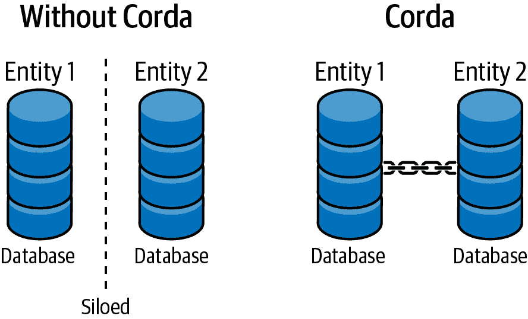
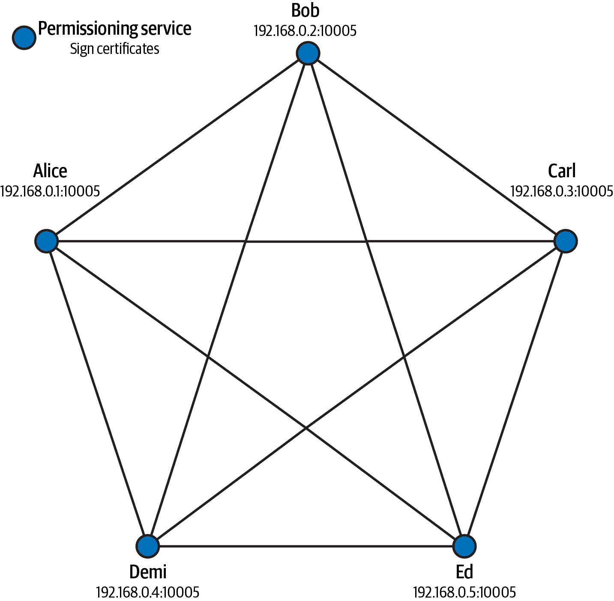
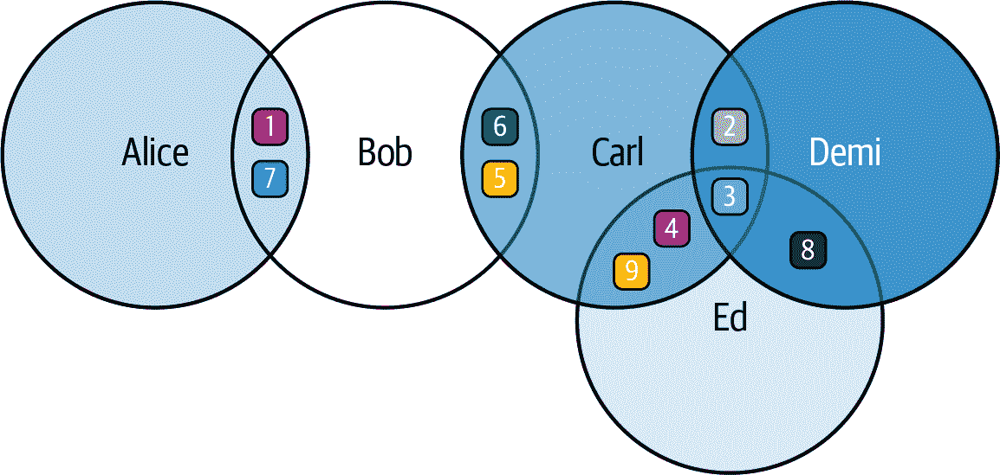
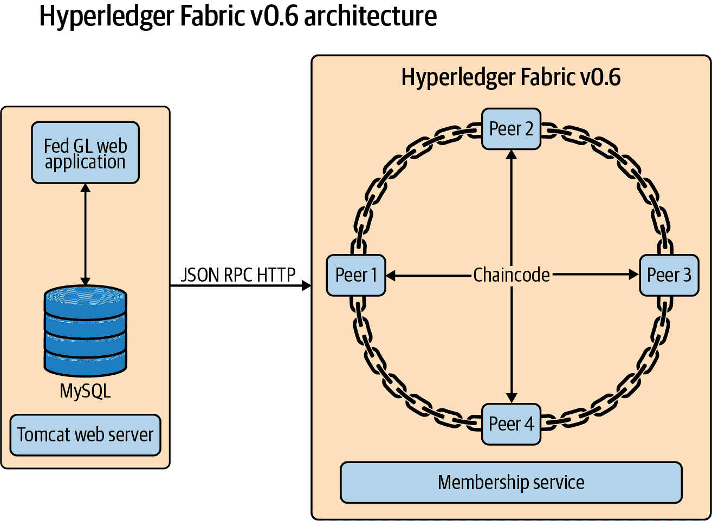
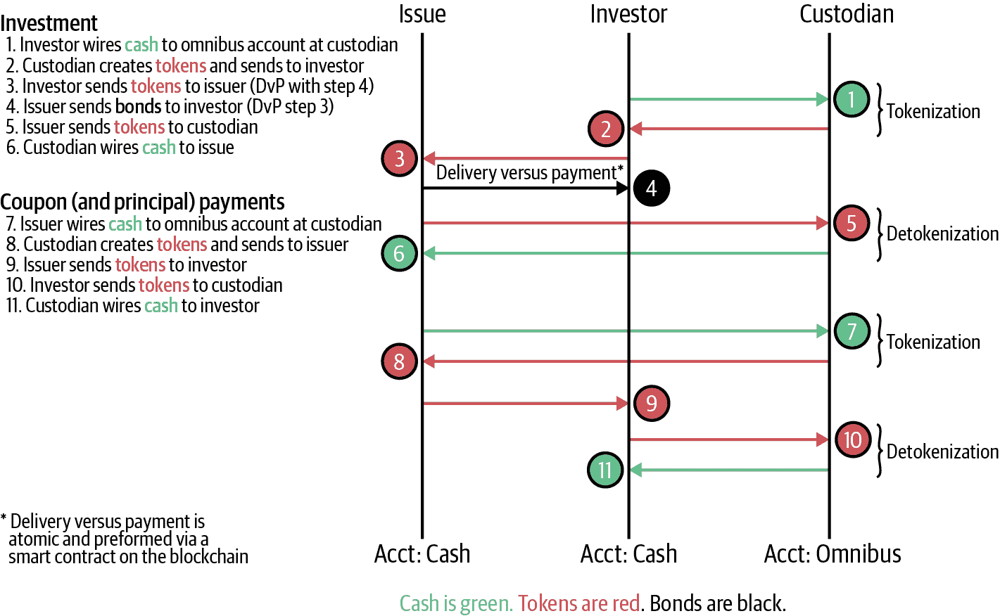
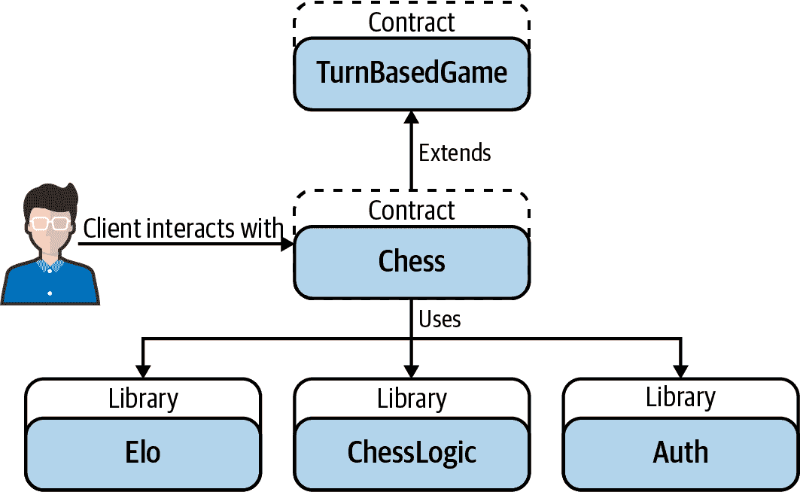
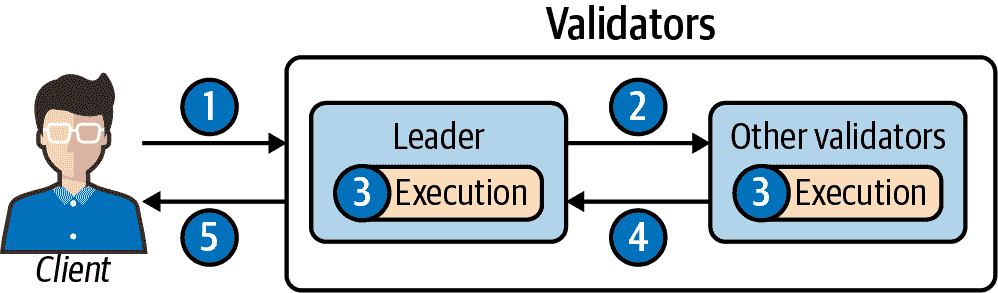
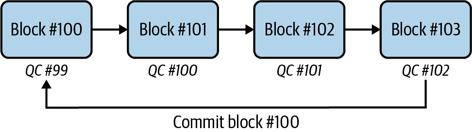

# 第九章。其他区块链

比特币和以太坊的成功为许多开发人员开始研究区块链技术提供了契机。正如前几章所展示的，两个网络的去中心化性质导致了一些有趣的用例。

企业必须确保和保护公司和用户数据，而区块链是如何做到这一点的一个新颖的技术思路。区块链技术在组织内可以有许多用途。然而，在实践中，这通常需要重新思考比特币、以太坊和其他开放式共识网络的运作方式，以符合企业必须遵守的数据安全、监管和其他要求。

# 区块链有什么用？

对于比特币和以太坊等开放区块链，迄今为止主要的使用案例大多是投机性的 - 本书中对市场、dapps 和 DeFi 的覆盖已经表明了这一点，我们希望如此。但对于企业和其他组织来说，区块链有一些其他有趣的用途，并且在这个领域正在进行许多试验。

让我们再次看一看区块链除了加密货币和投机外还有什么用处。以下是被组合在一起创建今天所称的区块链的核心技术：

共识

验证新记录以防止损坏

哈希

巩固记录以保留审计追踪

加密

安全地传输数字数据

分配

可以共享公共账本记录

区块链技术产生了哪些具体的属性？在基本层面上，区块链做了以下几件事情：

自我组织（共识）

区块链在没有提示的情况下，能够以一致的时间间隔处理数据 - 通常是区块生成间隔。

永久记录（哈希）

区块链技术使任何一方很难更改已经放入区块中的记录。

资产转移（加密）

区块链的第一个使用案例是在没有第三方参与的情况下转移资产。这始于加密货币的单位。

股份数据（分配）

不一定信任彼此的多方可以使用区块链合作处理各种数据结构。

许多对区块链感兴趣的人正在寻找使用它解决现有技术尚未解决的问题的原因。开放式区块链提供了一种在没有第三方参与的情况下向某人付款的方式，但如今它们的主要用途已经变成了投机。不幸的是，投机并不是对有技术问题的组织来说相关或有吸引力的用例。

那么对企业来说有哪些使用案例呢？考虑数据库。对许多组织来说，保护和共享数据库是一个挑战，随着云和移动等技术的出现，这一挑战变得更加复杂，因为这些技术开辟了新的安全漏洞。区块链最终可以为组织提供一种协调需要被多方保护但需要被多方共享的信息的方式。

公司可以提出以下问题：

+   区块链是否是交易机制，交易方可以就其达成一致？

+   当事方是否能就使用区块链写入的数据类型达成一致？

+   这项技术能解决问题吗？

在每种情况下，答案都是肯定的。

# 数据库和分类账

数据库是存储在计算机系统内部的结构化信息集。数据库是存储信息的关键，并且可以根据数据的用途以几种不同的方式访问。*数据库管理系统*（DBMS）是端用户用来分类和检索数据的接口。这些用户通常是组织的关键组成部分，从事通信、工资支付、人力资源等领域的工作。今天最流行的数据库是*关系型*数据库，它使用表格来安排信息。数据组织得这样，使得它不会在列之间重复。

*复制系统* 与数据库一起用于使其分布式。复制涉及以多个地方存储数据，以便可以轻松更新或同步数据。这增加了数据的可用性。数据库系统必须在高可用性和效率之间取得平衡，复制还允许用户并行使用各种数据集。复制系统必须不断工作以更新数据，以确保每个人都在处理相同的信息集。有各种复制模型来保持数据更新。

*账本* 是用来描述记录系统的术语。术语 *无需许可账本* 有时用来描述基于加密货币的区块链。这包括比特币、以太坊、各种分叉版本以及大多数替代币。这些网络被称为无需许可，因为任何人都可以加入并参与；没有中央机构来授予或拒绝权限。

区块链在无许可世界中是一个具有账户和支付功能的分布式计算系统。然而，一些组织并不特别看好这一点。无许可系统需要账户、支付和加密货币来正确激励用户，但对于*有许可*的账本来说情况可能并非如此。在有许可的世界中，为支付和账户提供基础设施是可选的。

*分布式账本技术*（DLT）是企业术语，用来描述更具有区块链类型的账本数据库。数据库结构通常遵循特定的模式，允许开发人员对其进行读取、写入和查询。DLT 为数据库基础设施带来了新的模式，使读取和查询可以实时进行（在共识系统中进行写入并不总是实时进行，有点类似于按照时钟进行）。

数据库是集中式的门户。在组织中，通常由管理员控制对整个系统的访问。使用账本系统可以让多个参与方在不需要单一门卫的情况下访问信息。

集中化数据库并没有什么问题。然而，区块链技术通过共识激励而非中心化的寻租（例如在社交网络上进行定向广告或像在线市场一样收取费用）来实现信息共享。

# 去中心化与集中化

早期的加密货币倡导者将去中心化视为技术的核心部分。然而，许多其他区块链平台，特别是为组织开发的平台，更加集中化。让我们来看看一些不同之处。

## 参与者

在像比特币这样的开放区块链中，任何拥有挖矿设备的人都可以加入网络并开始进行哈希运算。对于像用于企业的私有区块链，需要控制谁参与其中。实际上，集中控制是使系统工作的关键组成部分。“构成比共识更重要”是一个用来表达这一点的公理。虽然有一种方式来就在区块中发布的交易或数据达成一致是很重要的，但更重要的是确保只有授权参与者参与其中。这是分散化和集中化区块链之间的重大区别。

## 分布式可验证账本的关键属性

Apache 基金会创始人、在 Google 研究部门工作的密码学家本·劳里(Ben Laurie)提出了一个[分布式可验证账本框架](https://oreil.ly/5Kta5)，概述了希望在不是开放无许可的区块链中具有的特征。

在本章中，我们将这些*其他区块链*称为其他区块链，因为不同的实现之间存在很大差异。然而，在所有这些系统中，考虑以下几个方面是很重要的：

准入控制

必须有一些定义，说明账本中允许什么，并且应该如何格式化。准入控制在 IT 系统中很常见；它是系统安全的关键要素。

共识

共识意味着就在链或账本上发布的信息的有效性达成一致。这可以通过工作量证明、多数规则、联合或其他方法来实现。比特币和以太坊使用最长链规则来解决分叉。

验证

验证确保网络上的行为是正确的并且按照意图进行的。准入控制、共识和账本审查——某种检查方法都是其中的组成部分。

执行

需要某种形式的执行来保持秩序。比特币等区块链通过添加与某些块对应的检查点来提供执行，所有网络上的人都同意这些检查点位于最长的链上。在每次分叉时，新的“最长链”必须包含所有这些检查点。

# 基于以太坊的隐私实现

公共区块链和加密货币网络并不适合企业实施。这是因为许多组织出于竞争原因、合规性或其他因素需要控制他们的信息。然而，如果隐私问题可以解决，区块链技术可能有许多用途。一些企业选择的一个选项是分叉以太坊区块链，并创建包括他们需要的隐私功能的自定义实现。

## 夜晚

[夜晚](https://oreil.ly/FSkNE)是会计事务所 EY 开发的以太坊实现。它为网络的智能合约技术添加了隐私功能，使 ERC-20 和 ERC-721 代币可以在区块链上私下交易。夜晚通过使用 zk-SNARKs 并通过 ZoKrates 生成证明来实现这一点。这为夜晚提供了来自计算的可读证明。ZoKrates 功能有一个 Java 封装器。

## Quorum

由摩根大通投资银行开发的[Quorum](https://oreil.ly/GKAUV)是一种基于以太坊的区块链，支持私人交易和私人合同。它与以太坊工程师熟悉的开发工具兼容。Quorum 使用 Zether，这是一个加密值跟踪系统。它“附加”到 ERC-20 合同，创建私人的 Zether 账户。这是通过使用 ElGamal 密文在公钥下加密每个账户余额来实现的。

# 企业实施

也有一些团体致力于开发更具体的专有区块链。其中许多团体最初使用以太坊，然后决定从零开始构建适用于特定用例的自己的解决方案。

## 超级账本

[Hyperledger](https://www.hyperledger.org) 是由 Linux Foundation 托管的区块链开发的开源平台。最知名的 Hyperledger 项目是 [Fabric](https://oreil.ly/BPLlZ)，它使用 Go 编程语言的账本技术。还有其他实现，包括名为 Iroha 的 C++ 实现和多语言的 Sawtooth。Hyperledger Fabric 提供了对智能合约、交易和共识的支持，类似于以太坊。包括 IBM 和 Oracle 在内的许多企业区块链项目都基于该框架。

## Corda

由联盟 R3 开发，[Corda](https://github.com/corda/corda) 专注于寻求隐私的机构。该平台基于 Java 虚拟机（JVM），对金融行业现有开发者群体非常熟悉。没有全局的区块链或状态的表示。相反，Corda 使用一个账本系统，将其复制到关系数据库以便轻松查询。其智能合约是基于法律条款而不是代码的。

### Corda 工作原理

Corda 旨在使企业之间的交易更加可信和高效，如 图 9-1 所示。没有 Corda，两家公司的数据库是隔离的。有了 Corda，公司可以安全地协作管理交易。

###### 图 9-1\. Corda 实现了协作并保护隐私

通常，当两个独立实体执行交易时，它们各自维护一份账本，并定期进行对账。例如，一个玩具制造商不断从其供应商那里收到零件的发货。每家公司都使用自己的软件和流程跟踪这些发货。每个月，当供应商发送发票时，两家公司会对账，制造商会检查发票以确认其系统中的数字是否相同。

每个企业都有多个类似的关系。公司拥有的合作伙伴越多，就越需要投入精力和资源来跟踪它们。

有两个主要的公共区块链属性可以使企业受益：

交易不可变性

一旦交易被添加到账本中，就无法修改或删除。

同行验证

在交易被添加到账本之前，其他网络参与者会检查交易是否有效。

然而，也有一些对企业不太具有吸引力的属性：

交易透明度

当企业完成交易时，他们可能不希望其他网络中的所有人都知道。只有参与交易的参与者应该了解详细信息。

有限的可扩展性

中心化数据库可以处理数百万笔交易，而公共区块链最多只能处理数百笔交易。

新的编程语言和概念

运行在公共区块链上的 Dapp 主要使用新语言编写，如 Solidity 和 Vyper，并要求开发人员学习新技能。

无需权限

公共区块链允许任何人参与网络，但企业希望控制谁可以与他们进行交易。

隐藏身份

公共区块链上的参与者通过其区块链地址进行标识，这可能使许多参与者基本上是伪匿名的。企业想要知道他们正在与谁进行交易。

Corda 协议是为满足所有这些业务需求而构建的。

### Corda 网络

Corda 网络是节点的点对点网络。每个节点代表一个法律实体，并且每个节点都运行一个或多个 Corda 应用程序的实例。图 9-2 说明。

###### 图 9-2\. Corda 网络示例

任何人都可以启动自己的 Corda 网络，但网络中的每个节点必须得到网络运营商的许可才能加入，并且还必须向网络中的所有参与者进行标识。 网络中的每个节点都通过传输层安全性（TLS）直接且私下地与网络中的每个其他节点通信。

### Corda 总账

网络中的每个节点托管其自己的集中式数据库，并且所有交易均为点对点执行。 两个或多个节点可以执行交易。 多个节点完成交易后，每个节点都将交易存储在自己的数据库中。 只有参与交易的节点或被授予访问权限的节点才能看到交易，如 图 9-3 所示。 交易是防篡改的，并包括参与方的数字签名。

###### 图 9-3\. Corda 网络示例，显示哪些节点可以看到交易

在 图 9-3 中，Bob 与 Alice 执行了交易 #1 和 #7，并与 Carl 执行了交易 #5 和 #6。 Bob 可以看到所有四笔交易，但 Alice 只能看到交易 #1 和 #7。

### Corda 共识

要使交易被记入总账，必须通过以下两项检查：

1.  *有效性共识*。 所有涉及的节点都会检查以下内容是否为真：

    1.  交易中所需的所有签名均有效。

    1.  交易满足相关智能合约中定义的所有约束。

1.  *唯一性共识*。 Corda 遵循 UTXO 账务模型，类似于比特币。 唯一性检查防止双重花费，确认交易中包含的输入未被先前花费。

### Corda 语言

工程师构建企业 Corda 解决方案所需的技能在科技行业中是众所周知且广泛使用的，这使得寻找和培训合格的工程师变得容易。 Corda dapps 是用 Java 编写的，可以与企业数据库 Azure SQL、SQL Server、Oracle 和 PostgreSQL 兼容。

## DAML

由一家名为 Digital Asset 的公司开发，[DAML](https://github.com/digital-asset/daml) 是一个面向分布式应用的区块链无关智能合约语言。它支持所有先前提到的区块链平台。开发人员在与其区块链分开的层上工作 DAML 合约。智能合约开发的重点取决于业务用例。因此，在合同创建后更容易转移账簿或存储模型。

# 区块链即服务

作为一种服务（BaaS）的*区块链*概念，供应商提供易于实现的解决方案，可以根据技术的使用案例进行定制，这种服务很可能随着技术的使用案例增加而增长。类似于软件即服务（SaaS）和云服务，这些区块链产品提供了诸如用户的集中管理和节点分布等要素。以下是一些例子：

亚马逊量子分类账

亚马逊网络服务的一部分，量子分类账数据库（QLDB）是一个由密码学保护的分类账，采用了以太坊和 Hyperledger Fabric 框架。然而，该系统是集中化的，因为基于节点的分布式区块链设置更难。它的优点在于它为用户提供了建立一个不可变且密码学安全的分类账的能力。

Azure

Microsoft 的 Azure 云平台提供了一个分布式模型，允许开发者部署不同的区块链，如 Quorum 和 Corda。由于使用了区块链，Azure 支持智能合约的开发。开发者还可以在他们的区块链实现中设置验证器。Azure 框架使得将区块链信息导出到允许更复杂查询的数据库变得容易。

VmWare

支持 EVM、DAML 和 Hyperledger 的 VmWare Blockchain 是一个多区块链平台。开发者还可以利用 VmWare 的云技术来建立各种类型的基础设施实现，包括增加安全性和隐私的混合云能力选项。它还使用拜占庭容错共识引擎提供去中心化的功能。

Oracle

Oracle 的区块链平台建立在 Hyperledger Fabric 上，并支持多云实现——混合云、本地或两者混合以提供更大的灵活性。其目的是能够根据监管要求配置特定的环境。Oracle 还支持在其现有企业数据库提供的防篡改区块链表，以提供欺诈保护；示例包括数据库内的监管链、托管和审计日志功能。

IBM

IBM 提供了一个工具集，支持 Hyperledger Fabric 作为核心技术。该工具集提供了 Visual Studio Code 扩展，用于企业开发，智能合约编程能力可用于 Node.js、Go、Java 和 Solidity 等语言。IBM 云提供了灵活的托管选项，包括本地、远程或混合，部署通过 Red Hat 的 OpenShift 容器平台进行，该平台由 Kubernetes 管理。

SAP

该公司通过其云平台提供部署和服务，支持 Hyperledger Fabric 和 Ethereum 主网。SAP 区块链业务服务可保护文件和数据免受篡改。SAP 还允许外部区块链和节点插入其各种系统，包括 SAP“景观”，即其各种服务器架构，以及 SAP HANA，其自定义数据平台。

# 银行业务

大型金融机构和中央银行一直在探索区块链实施，以寻找规避可能过时、低效或成本高昂的流程的方法。这些尝试并非全部都完全成功，但该行业的实验表明了区块链技术的进步。

## 皇家铸币厂

皇家铸币厂位于英国，负责生产硬币，曾与芝加哥商品交易所（CME）合作，创建与黄金挂钩的基于区块链的资产。加密货币公司 BitGo 参与提供项目的钱包和 KYC 技术。然而，在 CME 退出后，该计划于 2018 年末搁置，引发了资产将在何处交易的问题。

## 法国银行

法国央行早期就开始探索利用区块链的方式。2016 年，它进行了一项基于数字身份的欧元支付试点。该银行呼吁在区块链行业内制定全球性的监管规定。最近，该银行发布了招聘启事，寻找精通加密经济学以及 Hyperledger、Corda 和 Quorum 平台的区块链专家。

## 中国

2019 年，习近平主席宣布加快发展区块链技术。中国正朝着央行数字货币发展，预计数字人民币将采用区块链技术。该系统计划为两层结构，提供类似于现金的某些功能，以及用于移动交易的脱机功能。

## 美国联邦储备系统

多年来，美国中央银行一直在观察加密货币。2019 年，波士顿联邦储备银行发布了一份描述其进行的以太坊和 Hyperledger 基础区块链测试的 [论文](https://oreil.ly/QW7ut)（图 9-4）。它使用代表各家银行的钱包和智能合约来协调向波士顿联邦储备银行支付的款项，波士顿分行负责此项工作。

###### 图 9-4\. 波士顿联邦储备测试设计——在 Hyperledger 中，“链码”是一个智能合约

## 摩根大通

投资银行摩根大通已经基于以太坊开发了 Quorum 作为其自己的区块链。它还创建了自己的稳定币 JPC Coin。这种加密货币将被用作通过 Quorum 区块链进行昂贵且低效的跨境支付的一种方法。用户将能够向银行存入法定货币，获发 JPM Coin，并在其他地方兑换法定货币。

# 权限账本使用

权限系统的用例通常与开放区块链不同。正如我们所指出的，开放区块链对于投机、代币化和存储数字价值可能很有好处，但企业有其他要求。这些包括速度、隐私和开发能力。这些要求促使了一系列新的区块链用例的开发，经过对权限平台的广泛测试。

## IT

企业 IT 系统中，安全是一个始终存在的组成部分。Digital Asset 的 DAML SDK 支持在许多公司中流行的 Visual Studio 中进行编辑。与分类账绑定的智能合约可以帮助验证对系统至关重要的数据的有效性。这种安排可以包括网络管理、数据库监控和服务台。一个例子是使用合约验证软件包或 Docker 镜像。

## 银行

正如前面提到的，从证券化到结算再到重新思考法定货币，银行和央行都越来越多地关注区块链技术。银行必须与多个其他组织合作，区块链可以作为一个无需信任的中介，所有分散的组群都可以达成一致。一个例子是*数字债券*，桑坦德银行已经发行。在此过程中，托管人、发行人和投资者使用令牌，如图 9-5 所示。

###### 图 9-5\. 桑坦德银行发行的区块链债券的设计

## 央行数字货币

央行数字货币（CBDCs）是一个国家法定货币的数字形式。与需要银行等中介或第三方的传统支付方式不同，CBDCs 可以实现直接的实时支付。虽然 CBDCs 可能使用现有的数据库来实施，但也考虑了部署区块链或分布式账本技术。中国、美国、瑞典和英国都在考虑或测试 CBDC 概念。

## 法律

法律行业天然具有对抗性。它涉及到对立的各方提出主张，而中立的司法机构做出决定。作为一种不可变的技术创新，区块链可以帮助在法律诉讼中验证信息。此外，技术已经在推动自动化多种法律流程方面取得进展；使用智能合约开发的概念可能会有所帮助。例如，BakerHostetler 律师事务所正在[为货运协议使用智能合约](https://oreil.ly/_aeAI)。

## 游戏

任何玩过电子游戏的人都明白虚拟武器、增益道具或服装等物品的价值。在游戏中，这些物品通常具有巨大的价值，但它们通常被锁定在一个特定的游戏或生态系统中。将物品与数字资产连接起来以表示独特性的概念正在获得流行，部分要归功于基于以太坊的 CryptoKitties。

区块链技术也可以用于打击作弊。图 9-6（见<a_schematic_for_technical_university_of）中的链上国际象棋，是柏林工业大学使用以太坊智能合约进行的项目。由于公开的合约代码，玩家知道游戏不可能被作弊。

###### 图 9-6\. 柏林工业大学链上国际象棋的示意图

## 医疗保健

医疗保健行业产生了大量数据，而这些数据大部分都分散在各处。患者前往全科医生、专科医生、医院、门诊保健诊所和其他地点进行健康需求。所有这些就诊都会产生数据。正在制定的法规要求医疗保健提供者使患者能够访问所有的数字数据。谷歌正在研究一种称为*可验证数据审计*的东西，这是一个基于账本的系统，可以对数据记录进行加密验证。

## 物联网

从电源插座到灯泡，数十亿智能设备在与更大的网络合作时可以更加高效地运行。到目前为止，企业仍在努力找到支付所有这些设备连接到物联网（IoT）并提供可验证信息的方法。区块链，通过控制基础设施中的账户甚至支付，可能是解决方案的一部分。IBM 的人工智能平台 Watson 与物联网设备进行交互，并使用基于 Hyperledger Fabric 的 IBM 区块链平台安全存储数据。

## 付款

区块链支付有一定的作用，但开放式区块链一直难以与 Visa 等现有网络竞争。尽管如此，仍有许多人看到使用区块链来解决特定支付用例的机会，例如以下情况：

公司支付

大型组织进行支付时所涉及的行政成本是巨大的。一个例子是确保发票支票与合同中规定的购买订单相匹配。此外，向各个国家付款是复杂的。某些涉及的流程可以通过区块链技术自动化并验证。Visa 于 2016 年开始解决这个问题，并于 2019 年推出了一项名为 B2B Connect 的服务，该服务使用 Hyperledger。

银行间支付

大型银行也在跨境支付中遇到问题。其中一些问题涉及发送支付到世界各地银行时缺乏支付信息。摩根大通通过其 JPM Coin 开发了一种称为银行间信息网络（IIN）的东西。这是一个基于 Quorum 的系统，可以发送银行间支付信息。IIN 现在有 320 多个成员使用该平台。

个人对个人支付

人们对使用区块链账本使支付更便宜、更快速的想法非常感兴趣，而这在公共区块链上一直是个问题。2019 年，PayPal 投资了一家名为剑桥区块链的公司，用于其身份技术，这也是一个挑战。拥有大量用户信息的 Facebook 可能已经解决了这个问题，如下一节所述。

# 利比拉

大多数企业区块链实验都集中在幕后的业务流程上。然而，公司有机会利用加密货币和区块链基本原理为用户和客户提供新功能。现在才刚刚开始这场比赛，但像 Facebook 这样以消费者为重心的公司希望将区块链带给每个人，特别是在互联网支付方面。*Libra*是该公司正在推进的项目的名称。

## Libra 协会

拥有数十亿用户的 Facebook 已经在探索区块链实现技术一段时间了。该公司的 Libra 协会是一组组织联合起来实施全新区块链系统 Libra 的财团。以下是一些参与其中的公司及其角色：

+   *支付*：PayU

+   *技术*：Facebook、FarFetch、Lyft、Spotify、Uber

+   *电信*：Iliad

+   *区块链*：Anchorage、BisonTrails、Coinbase、Xapo

+   *风险投资*：Andreessen Horowitz、Breakthrough Initiatives、Union Square Ventures、Ribbit Capital、Thrive Capital

+   *非营利组织*：Creative Destruction Lab、Kiva、Mercy Corps、Women’s World Banking

## 借鉴现有的区块链技术

Libra 协会打算通过使用 VMware 开发的一种名为 HotStuff 的拜占庭容错的权益证明共识算法，在互联网上创建全新的支付系统。协会的成员将成为该系统的验证者。

HotStuff 使用领先的验证者。它从客户端接受交易并使用投票机制进行验证。它是容错的，因为在出现错误或停机情况下其他验证者可以代替领先者的位置。在其他区块链系统中也使用了拜占庭容错，尤其是在一些利用权益证明的较小的开放网络上。图 9-7 说明了 Libra 的共识机制。

###### 图 9-7。Libra 的共识机制

Libra 加密货币预计将持有稳定的价值，由一篮子资产支持，其中将包括法定货币和国库债券。与大多数稳定币不同，它不计划与美元挂钩，而是将作为一种数字货币存在，并与法定货币相对估值。

预计 Libra 将支持第三方开发人员使用智能合约创建应用程序。这将通过一种称为 Move 的新编程语言实现。这种语言将允许程序员创建合约，甚至更新 Libra 区块链的状态。Move 被标记为一种“可编程资源”的语言。通过经过审核的验证者和特定的资源类型，Libra 的智能合约可能会比以太坊等开放区块链的合约范围更有限。

## Novi

Facebook 本身将开发自己的钱包，称为 Novi，以促进交易。鉴于 Facebook 在其许多平台上拥有数十亿用户，包括 Messenger、Instagram、WhatsApp 和 Oculus VR，Novi 钱包的影响可能会很大。

Libra 还将支持多种第三方钱包实现。网络本身预计将是开放的，钱包将是金融服务的入口。KYC/AML 将需要成为 Novi 的一个组成部分，Facebook 可以很容易地将其实现到其产品中，因为它已经掌握了大量用户数据。

## Libra 协议的工作原理

Libra 的网络包含两种类型的节点：*验证节点*和*全节点*。验证节点是经过许可的，由 Libra 协会的组织构成。这些节点管理网络的治理，并使用 LBFT 共识协议处理 Libra 交易。

任何人都可以运行全节点，它们有两个目的：

1.  它们作为 Libra 区块链当前状态的实时广播者。全节点保持区块链的完整副本，并回答客户对区块链的读取请求。

1.  他们重新验证了由验证者处理的交易。

完整节点通过移除验证节点服务读取请求的负担，使 Libra 更具可扩展性。这也保护验证节点免受潜在的 DDoS 攻击。

当一个客户端应用程序——例如，一个 Libra 移动钱包——想要与网络交互时，它从完整节点读取数据，并向验证节点发送交易请求。

[LBFT 协议](https://example.org/lbft_protocol)是一组规则，定义了在 Libra blockchain 上执行交易和治理的方式。尽管网络上的所有验证节点都被识别并且彼此信任，但仍然存在风险，即在某个时刻，其中一个或多个节点可能变成不良行为者，并尝试在网络上包含无效交易。一个例子是，如果黑客入侵了几个验证节点。然后黑客可以尝试处理将资金从其他帐户转到自己帐户的交易。

### 区块

在 LBFT 中添加到区块链的每个交易区块都由一个轮次的领导者提议。验证者轮流担任领导者。与工作量证明共识不同的是，没有花费精力或时间来决定哪个节点获得生成区块的权利。这使得 LBFT 快速且可扩展。Libra 预计每秒一千笔交易的速度——与比特币的每秒七笔交易相比。

当领导者提议一个新的交易区块时，所有网络验证者都会投票，以确定该区块是否有效。如果超过 2*f* + 1 个验证者同意该区块有效，则生成一个法定证书。这个法定证书附加到下一个区块，通过密码学连接每个区块与其父区块。

一个区块只有在拥有三个连续的子区块，而且所有子区块都有法定证书时，才能提交到[Libra blockchain](https://example.org)上。在此之前，该区块可能会成为孤立区块。Figure 9-8 进行了说明。

###### 图 9-8。区块 #100 在区块 #103 被提议给网络之前不会被提交到区块链，前提是该区块包含区块 #102 的法定证书

### 交易

Libra 中的交易结构与以太坊类似。Libra 遵循账户模型，而不是比特币的 UTXO 模型，因此没有输入或输出。Libra 交易结构如 Table 9-1 所示。

Table 9-1。Libra 交易的结构

| **字段** | **描述** |
| --- | --- |
| 发送方地址 | 交易发送方的账户地址。 |
| 发送方公钥 | 对应于用于签署交易的私钥的公钥。 |

| 程序 | 程序由以下内容组成：

+   Move 交易脚本的字节码。

+   一个可选的脚本输入列表。对于点对点交易，输入包含有关收件人和转账给收件人的金额的信息。

+   一个可选的 Move 字节码模块列表要发布。

|

| Gas 价格（以微利比拉/气体单位计） | 发送方愿意支付的每单位[气体](https://oreil.ly/1RktS)的数量，以执行交易。气体是计算和存储的支付方式。一个气体单位是一个抽象的计算度量，没有固有的现实世界价值。1 微利比拉 = 0.000001 LBR（10^−6）。 |
| --- | --- |
| 最大气体数量 | 交易允许消耗的最大气体单位数。 |
| 序列号 | 必须等于发送方账户下存储的序列号的无符号整数。 |
| 过期时间 | 交易失效的时间。 |
| 签名 | 发送方的数字签名。 |

# 摘要

一些企业希望完全私有的区块链，对于它们来说，R3 Corda 实现可能很有用。一些希望为普通公众提供可用网络。这就是 Libra 项目试图填补的角色。

没有人知道哪项服务会成为区块链业务的亚马逊。AWS 易于部署和开发，虽然它有竞争对手，但在云计算领域却独领风骚。在这些其他区块链系统中，至少目前还没有人占据统治地位。

像比特币和以太坊这样的开放网络创造了区块链世界。现在企业已经接纳了区块链概念，并将其用于改进他们运营的许多方面。

这只是个开始。未来还会继续进行实验——下一章的主题。
