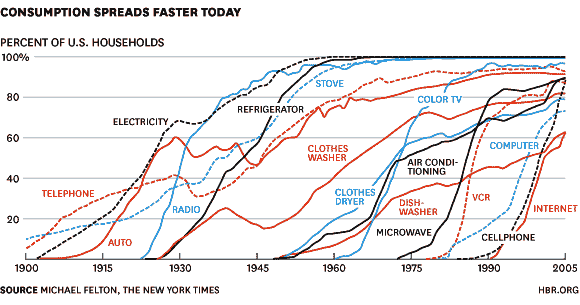
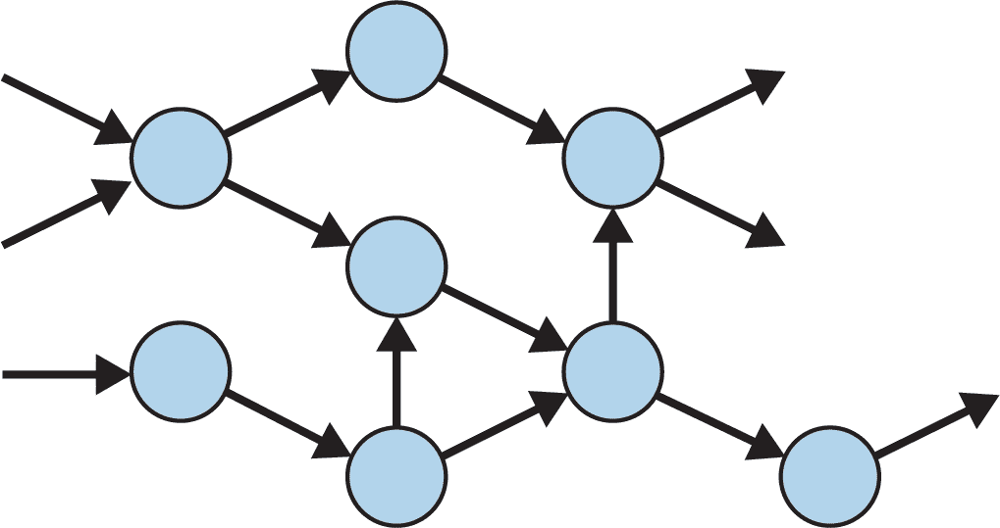
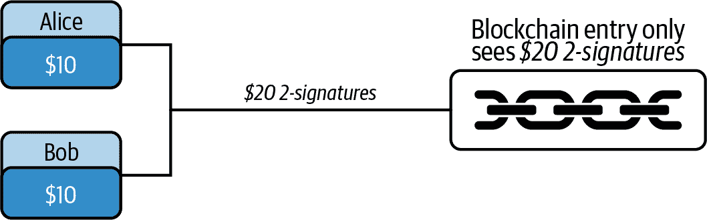
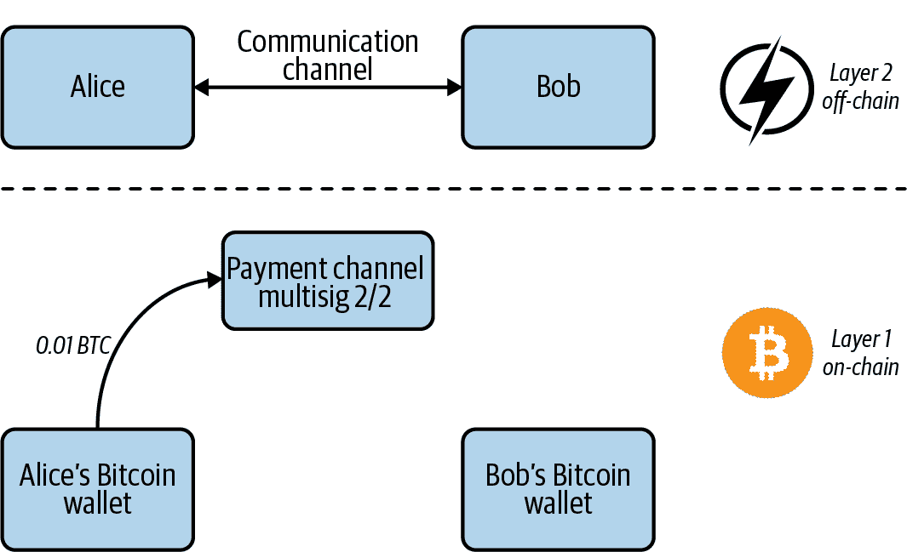
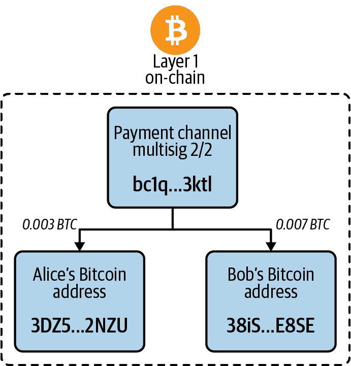

# 第十章\. 区块链的未来

将当今的区块链和加密货币与互联网早期时代进行比较并非完全不正确。正如某些年龄段的人可能记得的那样，早期的消费者互联网速度缓慢，并且缺乏我们现在习惯的大多数功能。

区块链处于类似的阶段。消费者采用率仍然相当低，而且做事情通常令人困惑和困难。这意味着开发者有巨大的机会来塑造区块链行业的未来。

一般来说，新技术的采用速度非常快——比以往任何时候都要快（见图 10-1）。如果能找到适合它的正确应用，区块链可能成为下一个伟大的消费者技术。

当然，并非一切都能成功。互联网提供了一个教训，即灵活适应是前进的道路。区块链世界可能以令人眩晕的速度发展，因此拥有能够适应不断变化的市场和开发者生态系统的观点至关重要。

###### 图 10-1\. 不同技术随时间的采用率

# 事情的变化

在 20 世纪 70 年代，互联网初现时，来自美国、英国和法国的一群计算机行业代表聚在一起，制定了[开放系统互连 (OSI)](https://oreil.ly/Ur4hJ) 模型。他们的目标是创建一组开放且多层次的标准化协议，用于互联网上的数据交换。到了 20 世纪 80 年代，该努力得到了许多利益相关者的支持，包括工程师、监管机构以及计算机和电信公司。然而，到了 20 世纪 90 年代初，两种更有效、更灵活的标准已经取代了它：传输控制协议和互联网协议，即 TCP/IP。以下是这个相对新兴标准如何取代原有标准的简要概述：

1960 年代

数据传输技术从电话网络中的老式电路交换演变而来。分组交换将信息分成块，传输它们，然后在接收端重新组装数据。ARPANET，互联网的早期版本，是第一个使用分组交换的网络。

1970 年代

电话运营商探索了通过“虚拟”电路进行分组交换的想法，提出这一想法是为了保护模拟电路收入。然而，分组交换的最初倡导者提出了更具创新性的分布式数据报模型。在这一分歧之后，OSI 模型被设计出来了。

1980 年代

OSI 的参考模型被发布，包括两种分组交换实现的选项。美国政府，互联网研究的主要赞助者，规定到 1990 年购买符合 OSI 标准的计算机。

1990 年代

TCP/IP，首次在 80 年代使用和发展，并在 ARPANET 中作为其网络控制程序（NCP）的继任者使用，逐渐流行起来。工程师们试图扩展 TCP/IP 引发了一场反抗，导致了对 OSI 标准的拒绝；而 OSI 陷入了标准和程序之中，而 TCP/IP 是自由开放的。

2000 年代

TCP/IP 是所有设备上的互联网通信的事实标准，击败了基于标准的 OSI，因为它具有更宽松的框架，工程师可以在其上构建。

互联网通信协议的这段快照历史与区块链的未来有何关系呢？几十年前，早期的互联网先驱可能认为 OSI 将统治世界。然而，TCP/IP 实现了这一壮举。区块链世界随着时间的推移，也将看到一些有希望的项目因为各种原因而逐渐消失，因为今天的生态系统仍在不断发展。

互联网并非任何人都能看到的东西。他们只看到建立在其之上的应用程序，比如网页和电子邮件。区块链也大致如此。就像互联网一样，区块链是面向消费者应用程序的基础。

加密货币网络及其支撑其的区块链在本质上与软件相似。软件是动态的，永远不会完成，并且是更大生态系统的一部分。加密货币也是动态的，而作为加密货币记录设备的区块链也以动态方式运作。在短短几年内，许多事情都注定会发生变化。未来是光明的，但绝对不是一成不变的。

# 需要关注的区块链

除了比特币、以太坊和各种企业型区块链之外，还有许多其他项目可供开发者构建。无论是因为隐私、效率还是改进的智能合约功能，这些都是未来需要关注的三个平台：

[*EOS*](https://github.com/EOSIO/eos)

一个操作系统和智能合约平台，EOS 增加了每个区块中包含的交易数量，并且不需要费用，使用资源租赁模型为其区块链上的用户提供交易带宽，只使用少量集中节点。这些*区块传播者*使用特殊的硬件配置来处理区块链存储和网络上的智能合约执行。传播者因区块生成和治理而获得奖励。

[*Cardano*](https://cardano.org)

一个使用权益证明的智能合约平台，Cardano 的共识机制选择随机的权益者来验证每个区块。用户还可以将他们的权益在钱包内“委托”给那些始终在线的权益者，这是获得奖励的要求。在委托的同时，用户仍然可以使用本地 ADA 加密货币，这要归功于多重签名地址的结构。该项目以其学术性质和使用 Haskell 库而著称，这些库在协议编程中已经存在并得到了建立。

[*Monero*](https://www.getmonero.org)

Monero 是一个实施隐私并因其执行类似现金的交易能力而受到关注的区块链，通过实施三种加密策略使交易详情保密：环签名、环保密交易和隐形地址。 Monero 的货币符号是 XMR。

区块链中的隐私是未来的重要组成部分。 在下一节中，我们将简要探讨一下 Monero 的更多细节。

## Monero 是如何工作的

为了演示 Monero 的工作原理，我们将查看两个地址之间的 0.5 XMR 交易的示例。

对公众可见的交易详情如下：

+   *交易 ID*: 7de8…53f1

+   *区块 #*: 2015291

+   *矿工费*: 0.00017681

+   *输入*: 只有 1 个真实输入和 10 个伪装输入

+   *关键图像*: b142…da7e

这些是公开可见的输入：

|   | **环成员** | **区块** | **时间戳** |
| --- | --- | --- | --- |
| 1 | 3154…a729 | 1936368 | 2019-10-03 6:07 |
| 2 | 60c9…de58 | 1970318 | 2019-11-19 13:11 |
| 3 | F6a2…b1e3 | 1997733 | 2019-12-27 2:14 |
| 4 | 9a62…a1a8 | 2006400 | 2020-01-08 2:01 |
| 5 | d0aa…c50b | 2014276 | 2020-01-18 22:55 |
| 6 | 31b6…0bbf | 2014635 | 2020-01-19 11:20 |
| 7 | d3a6…6ef1 | 2014688 | 2020-01-19 12:41 |
| 8 | 754e…3a4d | 2015113 | 2020-01-20 3:11 |
| 9 | ce8b…6f7a | 2015154 | 2020-01-20 4:34 |
| 10 | 0bab…594d | 2015200 | 2020-01-20 5:58 |
| 11 | 228d…1bd0 | 2015278 | 2020-01-20 8:38 |

这些是输出：

|   | **隐形地址** | **金额** |
| --- | --- | --- |
| 1 | 0152…19e4 | ? |
| 2 | c44f…e531 | ? |

对公众隐藏的输入如下：

|   | **Monero 地址** | **金额** | **可视者** |
| --- | --- | --- | --- |
| 1 | 43Ao…GHU9 | 0.01 | 该地址的所有者，也是生成交易的人 |

这些是对公众不可见的输出：

|   | **Monero 地址** | **金额** | **可视者** |
| --- | --- | --- | --- |
| 1 | 41qp…NxdK | 0.005 | 该地址的所有者 |
| 2 | 43Ao…GHU9 | 0.00482319 | 此地址的所有者 |

*环签名*在 Monero 交易中隐藏了发送者的公共地址。Monero 采用类似比特币的 UTXO 记账方法。在比特币中，当发送者构建交易时，他们只包括来自他们控制私钥的地址的输入。这样发送者就可以签署提供发送资金授权的交易。

然而，在 Monero 中，当发送者构建交易时，他们会包括从其他人拥有的地址随机选择的虚假输入。因此，即使在交易中包含了许多输入，实际上只有一个在发送资金。公开来说，不可能知道哪个输入正在发送资金。

在上面的示例中，资金仅来自一个输入。环签名中有 11 个地址，意味着有 10 个虚假输入。交易的生成者知道发送资金的地址是＃11（228d…1bd0），但只有他们知道哪一个是真正的输入。

为了防止双重支付，每个 Monero 交易都包括一个*关键图像*，由真实的交易发送者生成。如果发送者尝试从已经发送的输入发送资金，他们生成的关键图像将与在先前发送了这些资金的第一笔交易中生成的关键图像相同。Monero 矿工不会验证双重支付尝试，因为相同的关键图像已经包含在区块链上的先前交易中。

###### 注

关键图像是 Monero 的等价物，相当于比特币的交易签名。它由发送者生成，矿工使用该关键图像来防止发送者进行双重支付。在前面的示例中，关键图像是 b142…da7e。

*环签名交易*（环 CT）的目的是隐藏门罗币交易中发送的金额。这是一个隐私功能，通过密码学掩盖了发送到输出的金额——只有交易的发送方和接收方知道实际发送的资金金额。

总结一下：

+   发送方是生成交易详细信息的人，因此知道交易金额。

+   每个门罗币地址都有一个私密的观察密钥。在门罗币交易中，接收 XMR 的地址的所有者可以使用他们的私密观察密钥解密发送的金额。

矿工不关心发送的确切金额；他们的目标只是确定交易是否有效。要验证交易，矿工必须进行*范围证明*。也就是说，他们必须检查以下内容是否为真：

1.  输入的总和等于输出的总和。

1.  发送到每个输出的金额都大于 0。

矿工可以通过密码学完成这两个检查，而无需知道发送的金额。

在上述示例交易中，资金被发送到两个输出。第一个输出到地址 41qp…NxdK，该地址的所有者可以使用他们的秘密观察密钥解密金额值为 0.005 XMR。他们无法查看第二个输出的金额值。

*隐形地址*隐藏了门罗币交易的接收者。交易的发送方为接收者创建一个新的隐形地址，使用接收者的公开观察密钥、接收者的公开花费密钥和一个随机值。

## 妙动脉搏、Beam 和 Grin

[妙动脉搏](https://oreil.ly/k3W6J)是一种强调隐私与可扩展性的区块链协议。一种称为 Bulletproofs 的零知识证明技术验证交易的有效性，并且状态转换记录在区块链上，模糊了细节。

这导致了另外两个项目的出现：[Beam](https://beam.mw) 和 [Grin](https://grin.mw)。这两个项目的治理方式有很大不同：Grin 是一个组织松散的开源组，而 Beam 的团队得到了投资者的支持。

Beam 和 Grin 都具有一些关键属性，例如 ASIC 抗性、可扩展性和隐私，但除了治理之外还有一些区分特征。

Beam 的特点包括以下内容：

+   用 C++ 实现

+   使用 Equihash 工作量证明

+   供应量限制在 2.63 亿，以鼓励价值储存

+   发送方和接收方钱包可以在不在线的情况下创建交易

+   使用“无脚本脚本”进行交易之外的扩展，如托管和原子交换

Grin 的特点包括以下内容：

+   用 Rust 实现

+   使用 Cuckoo Cycle 工作量证明

+   无限供应以鼓励消费

+   交易需要发送方和接收方在线

+   有限的脚本，旨在尽可能简单

# 扩展问题

未来几年的许多研究都将集中在增加交易容量同时保持高效性上，其中费用低且加密货币仍然易于使用。鉴于目前的限制，比特币和以太坊肯定需要提高它们的可扩展性 —— 比特币每秒只能处理 3 到 7 笔交易，以太坊最多只能达到每秒大约 20 笔交易。这对于加密货币网络要真正大规模起飞来说远远不够。这就是为什么需要新的想法来解决可扩展性问题，其中一些在本节中讨论。

## 侧链

作为一种卸载一些链上数据的方法，*侧链* 携带有关网络交易的额外信息，这些信息不在主区块链上。*联合* 侧链，如比特币的 [Liquid Network](https://blockstream.com/liquid)，使用一组受信任的方签署区块并在多重签名地址中持有资金。*无信任* 侧链仍在开发中，使用 “双向钉” 概念，使用户能够以更加去中心化的方式将资金从一条链移动到另一条链。

## 分片

一种用于分解更大数据块的过程，*分片* 用于数据库系统，并且是扩展加密货币网络的提议解决方案。在由区块链支撑的点对点网络中，分片将数据集分割在节点之间。然后，该信息将与网络上的其他节点共享。在区块链网络上进行分片增加了另一层复杂性，因为必须有一种安全的通信协议来共享数据。

## STARKs

*可扩展透明知识论证*，或 STARKs，利用了前几章提到的以隐私为重点的 zk-SNARKs 技术。 零知识证明可以用作验证者，以确保交易是诚实的。这是通过使用 “证明者” 节点完成的。然后，交易被分批处理，创建较小的区块。个人余额存储在链下。显示余额承诺和证明验证的合同存储在链上。

## DAGs

*有向无环图*（DAGs）重新思考了区块链的构造方式。与链中的区块不同，DAGs 是相互连接的数据结构，如 图 10-2 所示。在这种系统中，交易相互验证，用户既充当矿工又充当验证者。这种设计消除了孤立的区块和长区块时间等效率问题。交易能够以更加去中心化和更快的方式在该网络中完成。

###### 图 10-2\. 有向无环图网络设计

## 雪崩

[Avalanche](https://www.avalabs.org) 是一种针对加密货币的新型共识机制，它依赖于动态人口抽样投票机制来创建具有高度适应性规则的流动区块链，采用“无领导者”模型，其中所有节点被视为平等。这消除了其他加密货币网络中基于硬件的挖矿。设置具有不同规则但仍属于网络的节点是可能的。通过这种方式，该平台可以使用多种脚本语言和虚拟机。

## Liquid

Liquid 是 [Blockstream](https://blockstream.com) 公司推出的一项技术，该公司提供围绕比特币的技术产品和服务。它是一个多重签名钱包，用户将比特币存入其中以用于互操作性目的。侧链使这些锁定的比特币可以在另一条链上使用，该链可能使用与比特币不同的一组规则。这意味着潜在的性能和安全需求可能会发生变化。

Liquid 的基础来自 [Elements](https://oreil.ly/fw3q5) 开源项目。Elements 允许开发人员构建侧链，以及基于比特币技术的独立区块链。因此，它提供了发行新资产的能力。该平台还支持所谓的*机密资产*，这意味着区块链上的标识符和金额被模糊化。

## Lightning

解决比特币吞吐量限制的方法是每秒交易数，[闪电网络](https://lightning.network)使用*通道*，如图 10-3 所示，各方在比特币主区块链之外互相开启。它使用基于主链的承诺方案称为哈希时间锁定合同来跟踪余额，在通道关闭或离线时提供结算。闪电有几种实现方式，包括 Blockstream 的[c-lightning](https://oreil.ly/w8onX) 和 Lightning Labs 的[`lnd`](https://oreil.ly/KXMrs)。Square Crypto 还计划在不久的将来发布闪电开发者工具包（LDK）。

###### 图 10-3\. 闪电通道是由两个或更多参与者创建的，然后将价值分配到比特币区块链上。

当今加密货币存在的扩展问题与计算机网络曾经面临的问题并没有太大的不同。众所周知，需求是发明之母。随着互联网的普及，对容量日益增长的需求导致了许多技术解决方案。其中包括*暗光纤*，即在实际需要之前就铺设的光纤电缆。对加密货币网络进行大量扩展解决方案的投资可能会类似，因为随着采用量的增加，研究可能会被利用，包括在比特币和以太坊中。

闪电旨在通过解决以下可扩展性问题使比特币更易于使用：

交易速度

如前所述，比特币每秒只能处理约七笔交易。如果大量消费者想要使用比特币，目前的网络无法支持这种需求水平。

区块时间

平均而言，每 10 分钟会生成一个新的交易区块，一旦区块满了，网络就无法处理更多交易，直到发现下一个区块。如果有人用比特币购买东西，他们可能不愿意等待超过 10-20 分钟以确认他们的交易是否已处理。

比特币区块链大小

每个矿工和完整的比特币节点都必须维护整个比特币区块链的副本，截至 2020 年 6 月，其大小约为 285 GB。

闪电网络通过使比特币地址能够通过支付通道进行比特币交易来解决这些问题。该通道充当两个比特币地址之间点对点管理的账本。通过支付通道的交易不记录在比特币区块链上，而是记录在链外。

###### 注意

这是对支付通道的简化解释，仅旨在让人了解它们的工作原理。真正的支付通道涉及哈希密钥和可能需要几个节点跳跃才能到达预定的接收者和发送者。

假设 Alice 每天都去 Bob 的咖啡店买一杯咖啡，并想每天都从 Bob 那里购买一杯咖啡。她可以方便地支付的一种方式是购买一张 100 美元的礼品卡，并每天使用。在这种情况下，Alice 承诺了 100 美元，并且礼品卡公司控制着她所有交易的账本。

Lightning Network 的这种情况相当于 Alice 和 Bob 打开一个支付通道，并用 0.01 BTC 资助该通道。在这种情况下，Alice 承诺了 0.01 BTC，而不是由第三方控制账本，Alice 和 Bob 共同控制账本。加密和资助通道所带来的成本迫使 Bob 和 Alice 都必须适当行事。

### 资助交易

Alice 可以通过向 Bob 发送一个*funding transaction*来打开一个支付通道，该交易发送到一个新生成的多重签名地址，用于持有支付通道资金。这个资金地址由 Bob 和 Alice 共同控制，就像一个联合银行账户。在我们的例子中，如图 10-4 所示，Alice 向支付通道地址发送了 0.01 BTC。

###### 图 10-4\. Alice 通过发送一个资金交易与 Bob 打开了一个支付通道

一旦资金存放在支付通道中，它们只能通过两种方式离开该通道的地址：

2/2 多重签名交易

这意味着必须提供两个可能的签名才能生成有效的交易。Alice 和 Bob 必须使用他们的私钥签署交易以执行有效的多重签名交易。

退款合约

由于 Alice 承担了支付通道的资金承诺，存在 Bob 可能退出关系并不提供签名以帮助 Alice 取回资金的风险。为了保护 Alice，在资金交易中嵌入了一份退款合约，规定“在*x*个区块之后，将支付通道地址中的所有资金退还到 Alice 的地址”。这份退款合约使用了`nLockTime`，这是比特币交易的一个属性。

### 离链交易

在将来的某个时间，Alice 和 Bob 将执行一笔提款交易（见图 10-5），该交易需要他们两人的签名。问题是，Alice 和 Bob 各自将从未来的交易中收到多少？如果他们在 Alice 在 Bob 的咖啡店买任何东西之前执行多重签名交易，该交易应将所有资金发送回 Alice 的地址。

下面是可能的未来提款交易 #1：

| **Inputs** | **Outputs** |
| --- | --- |
| bc1q...3ktl（支付通道） | 0.01 BTC | 3DZ5...2NZU（Alice） | 0.01 BTC |
| 签名 1：001443692e0c9ce1c70840847495c3216318b04a7793（Alice 的签名） |
| 签名 2：cb8b99f482852b6c0d40a2f5bc249743ea6d5a80（Bob 的签名） |
|   |   |   |   |

但是，如果 Alice 在 Bob 的商店花费了 0.007 BTC，多重签名交易应该将 0.007 BTC 发送给 Bob 和 0.003 BTC 发送给 Alice。所以这里是可能的未来提款交易＃2（见图 10-5）：

| **输入** | **输出** |
| --- | --- |
| bc1q...3ktl（支付通道） | 0.01 BTC | 3DZ5...2NZU（Alice） | 0.003 BTC |
|   |   | 38iS...E8SE（Bob） | 0.007 BTC |
| 签名 1：9a791cf4d808afec90ed7051314f80f4a9310372（Alice 的签名） |
| 签名 2：104f28ca0bf87c07ef5b97d33dae38f547d0435b（Bob 的签名） |

###### 图 10-5\. Alice 和 Bob 从支付通道地址提取资金

每天，当 Alice 从 Bob 的商店购买咖啡时，未来提款交易中每个人收到的金额都会发生变化。每当金额发生变化时，Alice 和 Bob 都需要生成并签署一个新的唯一交易，以授权未来的提款交易，并向矿工证明新的提款交易是有效的。生成和签署新的提款交易的过程本质上与 Alice 和 Bob 执行链下交易相同。

### 闪电节点和钱包

*闪电钱包*是具有额外功能的比特币钱包，允许用户打开/关闭支付通道并执行闪电交易。第一次使用闪电的常见错误是试图在钱包中没有比特币的情况下打开支付通道。闪电钱包必须有一些比特币用于支付挖矿费用，并有一些资金用于承诺支付通道。

闪电网络要求区块链没有*交易篡改*，这是一种漏洞，可以允许攻击者修改某些交易数据。隔离见证，即 SegWit，是比特币协议的一项更新，它将基础交易数据和签名数据分开。由于交易使用原始交易数据进行序列化，因此可以防止基于签名的篡改攻击。签名数据进入交易见证区域，由支持 SegWit 的全节点用于确认交易是否经授权。

###### 注意

SegWit 将检查交易有效性所需的见证数据移动到每个生成的比特币交易的不同部分。例如，在比特币区块链上实施 SegWit 之前，节点可以更改未包含在已签名交易中的预哈希信息。这导致了网络上的篡改攻击。为了使闪电节点成为可行，需要消除这些篡改攻击的风险。

一旦用户运行了闪电节点，他们就可以打开一个支付通道。拥有打开支付通道的多个参与方可以共同合作进行交易。这是通过提交交易来完成的。

由于闪电使用通道而不是区块链，交易是私密的。但是，如果一个节点在这些双向通道中的一个中断或以其他方式失去连接，它将关闭通道并在区块链上结算交易。此外，支付路由发生在该系统中。这种路由意味着如果由于某种原因某个通道没有打开，付款可以通过节点进行，以与其他参与方打开通道。

## 以太坊扩展

以太坊计划对其网络进行重大更改，以增加其容量。在其下一次迭代中，即以太坊 2.0，网络将转向一种称为卡斯珀的权益证明形式，这将在不增加复杂性的情况下实现更高的效率。它还将被分割成片段，如本章前面所述。这是一个雄心勃勃的计划，汇集了许多新颖的研究思想，以帮助网络迈向未来。

以太坊 2.0 的第一阶段涉及以下规范：

信标链

一种新的区块链，通过为所有分片链提供共识来确保网络保持同步。每个分片链都将有负责向分片区块添加交易并提议要添加到信标链和所有分片链的新区块的验证者。验证者由信标链激活，并且可以由于违规行为而自愿或被停用。

卡斯珀

专为以太坊 2.0 设计的权益证明算法。预计在开始时将与以太坊现有的工作量证明系统混合运行。卡斯珀是拜占庭容错的，这意味着即使一些节点不可靠，仍然可以达成共识，并且有问责制，因此行为不端的验证者会被其抵押的余额处罚。只要三分之二的抵押验证者达成共识，就可以验证链条。

分叉选择规则

在分叉事件中帮助验证者决定跟随哪条链的规则（即收到来自验证者投票最多的链）。虽然网络在区块生成时会使用一种叫做*随机数心跳*的东西来选择验证者，但分叉选择是另一种保护机制。攻击者需要能够以某种方式修改分叉选择规则才能生效。

存款合约

将保存信标链余额的合约。它将存在于以太坊 1.0 网络上。一旦存入，该合约中的 ETH 将无法在 1.0 网络上使用。成为验证者所需的最低存款是 32 ETH。与大多数权益证明系统一样，担任验证者将会获得某种形式的财务奖励，其计算尚未确定。

诚实验证者框架

预计验证者将遵守一组标准，以帮助保护以太坊 2.0 网络。这些标准包括拥有用于签署提议块和杂项投票（存储在热钱包中的签名密钥）的可用私钥，以及用于提取作为活跃验证者所生成的资金的单独私钥，该私钥应安全地离线存储（提取密钥）。相应的公钥将作为与验证者存款合约的交易的一部分进行注册。

###### 注意

从以太坊 1.0 迁移到 2.0 可能需要数年的时间。例如，dapp 的执行环境并不是以太坊 2.0 初始阶段的一部分，因此以太坊 1.0 的主网将在未来数年仍然是一个活跃的开发者平台。

网络中的分片将导致燃气成本增加，并且将取消原子交易的能力，或者一次性进行所有交易的能力。这将增加以太坊 2.0 更像是一个软件平台而不是交易者使用的金融平台的可能性。

# 隐私

隐私预计将成为未来几年区块链技术中最大的增长领域之一。开发者和其他利益相关者意识到*不*公开传输所有关于交易的数据的必要性。以下是一些正在进行中的与隐私相关的项目：

秘密网络

最初是一个名为 Enigma 的 MIT 项目，Secret Network 是一种点对点网络，可以在私密环境中计算数据。区块链管理访问控制和身份，ERC-20 SCRT 代币用于补偿“秘密节点”提供网络计算能力。这允许用户使用密码学共享数据，同时保持数据的私密性，不需要第三方存储用户信息（可能会容易受到攻击）。

**Schnorr**

Schnorr 算法是一种数字签名形式，能够生成简单、高效和短小的签名。这将允许一个交易中的多个签名组合成一个签名，这样可以模糊一些数据。例如，多重签名交易看起来与常规交易相同。它还使得一种称为“tweaking”的密码学技术成为可能，从而可以使用 Taproot（下文讨论）。预计比特币将进行软分叉以启用 Schnorr 签名。

**Taproot**

使用 Schnorr 密钥对的有趣之处之一是使用 Taproot 方案签署交易脚本。Taproot 利用 Merkle 化抽象语法树（MAST），这是一种允许某些脚本信息保持模糊的数据结构。这是通过一个编码了脚本逻辑流的多个不同路径的 Merkle 树来实现的。

# **互操作性**

互操作性被认为是区块链大规模应用的重要先决条件。有许多项目致力于此，包括 Polkadot 和 Cosmos。目标是实现流畅的信息共享、更容易执行智能合约以及不同区块链之间更友好的用户体验。

# **将一切资产加密**

本书的最初目的是澄清围绕区块链行业的一些错误信息和许多误解。但当我们开始写作时，我们意识到这个行业变化速度之快，使得*任何人*都很难跟上所有的创新，包括我们在内。

对于我们来说，这本书与你一样是一个学习的过程。如果我们只是写下我们开始时所知道的内容，它的范围将会大大受限。这就是为什么我们与区块链行业的创新者联系——我们需要依靠社区的专业知识。

利用我们新获得的知识，我们想要以解决我们所面临问题的示例作为结束。我们最初的想法是将每一本书都进行代币化，这样你就知道它是一本正宗的 O’Reilly 书籍——但我们意识到在以太坊区块链上存储《区块链技术指南》每一本的序列号将会非常昂贵。（由于区块链的扩展瓶颈，即使本章已经涵盖了，存储数据在以太坊上的成本也很高。）

所以，我们决定将 50 份限量版拆分成代币。拥有其中一份代币化拷贝的唯一方式是使用与每份拷贝关联的 50 个私钥之一签署以太坊交易。

# 摘要

区块链让开发人员能够构建通过将协议从纸质转移到代码来分发和去中心化信任的系统。有一天，可能会有数百万个运行中的区块链，代表着许多不同类型的数据结构。

现在轮到*你*来利用区块链解决现实世界的问题了。
