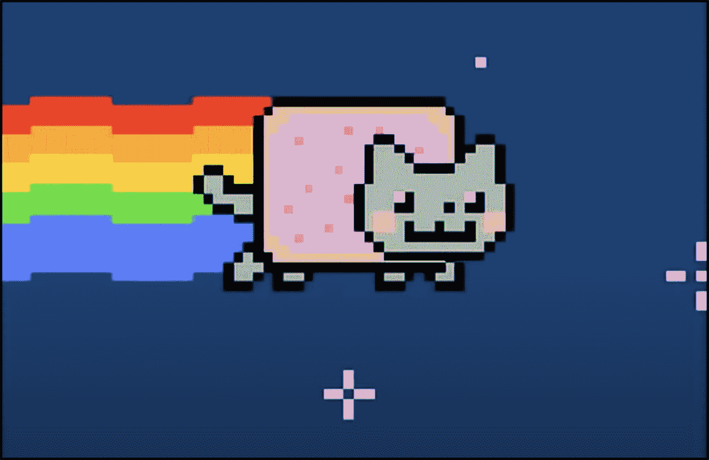

# 第一部分 什么是非同质化代币（NFT）？

## 1.1 NFT 的定义

NFT 是非同质化代币（Non-Fungible Tokens）的缩写，在德语中是不可替代的代币。NFT 是独特数字物体的证书。它们证明你拥有一个特定的文件。在本质上，可替代意味着一样东西可以被等价的东西替代。例如，你的钱包里有 20 美元，无论是一张 20 美元的纸币、四张 5 美元的纸币还是二十张 1 美元的纸币都无关紧要。

然而，由某些属性唯一确定的物体是不可替代的。这样的物体可以是物理存在的，也可以是数字化的。对于物理物体，比如一幅画或一辆车，设定价值是很容易的。这是通过艺术品的独特性以及人们愿意支付多少来衡量的。

对于数字物体，情况就复杂得多了。毕竟，尽管有版权和使用权，但每个图像、歌曲和视频都可以在点击鼠标的一瞬间复制和重新分发。很难确定一个文件的确切价值或所有者。这就是 NFT 的概念开始的地方：数字代币包含有关特定文件的信息，这些信息既是唯一的又是可验证的。区块链技术用于验证文件的真实性。

### NFT 和区块链

区块链基本上是一种数据库，其中存储着数字货币等数字商品的交易记录，并分布在全球许多计算机上。例如，比特币就存在于区块链上。它的架构使得区块链防篡改。

与加密货币不同，区块链中的 NFT 不代表一种可互换的资产，它不会从一个人传递到另一个人，而是一种具体的资产——就像是与一个所有者和一个价值联系在一起的独特数字艺术品。简单来说，通过将 NFT 存储在区块链中，数字商品成为了真正属于你的东西。

目前，开放的以太坊区块链对于 NFT 交易是最重要的。虚拟商品的购买通常以以太币进行处理，它是继比特币之后第二大资产量的加密货币。

### 可替代和不可替代之间有什么区别？

要理解 NFT 何以如此特殊，首先需要了解可替代和不可替代之间的区别。如果某物是可替代的，意味着它是同质可互换的。现实世界中的例子包括纸币或贵金属：一克纯金价值与另一克纯金相同。如果你给某人一张十美元的纸币，那么如果他们没有还给你完全相同的纸币也无所谓。

所有这些都会发生变化，当某物不可替代时。尽管两个物品乍一看可能相同，但它们都具有独特的信息或特征，使它们不可替代或不可互换。

非同质化商品的一个例子可能是机票。航空公司的机票乍一看是一样的，但每张机票包含不同的乘客姓名、不同的目的地和不同的座位号码。因此，如果你用一张机票交换另一张机票，可能会产生严重后果。在数字空间中，NFT 也是如此。另一个例子是互联网域名，因为每个域名只能存在一次。

非同质化代币可以限制数字空间中的事物，并以独特方式呈现它们。许多其他代币或加密货币，如比特币或以太币，都是可替代的。如果你把一些以太币发送给某人，然后又得到同样数量的以太币，你不会注意到任何区别。

对于代币也是一样：迄今为止，大多数代币都基于以太坊的 ERC-20 标准。为了简单起见，可以想象这些代币中的每一个代表一张 10 美元的纸币。如果你把这个代币发送给某人，一周后又得到另一个代币，那就和另一个一样。

所有这些都随着非同质化代币而改变。目前，以太坊区块链上的大多数 NFT 使用所谓的 ERC-721 标准。使用此标准的代币可以类比于 Pokémon 或 Yu-Gi-Oh 可收藏卡片。每个代币包含独特的信息和不同级别的稀有度。

还有另一个严重的差异需要考虑。可替换代币是可分割的，这意味着可以发送或拥有比特币或另一个 ERC-20 代币的一部分。就像现金一样，您可以用十美元的钞票付款并收到找零。

非同质化代币不能共享，必须整体购买或出售。就像可收藏卡片一样，没有人会考虑买一张卡片的一半。

以下是可替换物品的独特属性，例如现金或加密货币，与 NFT 不同。

### NFT 的特性

NFT 具有几个独特的特点。其中一些是

NFT 不具备互操作性

这意味着一个 NFT 不能代替另一个 NFT 使用。这是因为每个 NFT 都是独一无二的，具有自己的特点和信息。一个例子是游戏 CryptoKitties。用户不能在另一个游戏中使用该游戏的资产。

可验证

所有关于 NFT 的数据都存储在区块链上，以便可以轻松追溯到原始所有者。这使得验证 NFT 变得很容易。不可替代令牌可以限制数字空间中的事物并将其呈现为独特的。许多其他令牌或加密货币，如比特币或以太币，都是可替代的。如果你给某人发送一笔以太币并得到一笔以太币作为回报，你不会注意到任何差异。同样适用于令牌 - 迄今为止，大多数令牌都是基于以太坊的 ERC-20 标准。为了简单起见，可以想象每个这些令牌代表一张十美元的钞票。如果你把这个令牌发送给某人，并在一周后得到另一个令牌，那就和另一个一样。所有这些都会因不可替代的令牌而改变。目前，以太坊区块链上的大多数 NFT 使用所谓的 ERC-721 标准。使用该标准的令牌可以比作是宝可梦或游戏王收藏卡。每个令牌都包含唯一的信息和不同级别的稀有度。

不可毁灭

NFT 是不可毁灭的，因为它们由区块链技术和智能合约驱动。区块链的透明性和不可变性确保了 NFT 不能被销毁或复制。

不可分割

可替代令牌是可分割的，这意味着可以发送或拥有比特币或其他 ERC-20 令牌的一部分。就像现金一样，你可以用十美元的钞票付款并收到找零。不可替代令牌不能共享，必须完整购买或出售。就像收藏卡片一样，没有人会考虑购买卡片的一半。

### NFT 的崛起

最初只是一些加密和游戏爱好者中的小众话题，如今已在场外引起了极大的关注。尤其是在艺术界，NFT 的交易量很高。加拿大艺术家兼歌手格莱姆斯在 Nifty Gateway 平台上拍卖了数字艺术品，仅用 20 分钟就收入了约六百万美元。

著名的英国拍卖行佳士得（[Christie's](https://example.org/christies)）也加入了 NFT 的行列。与加密艺术销售平台 Markerspace 合作，佳士得正在拍卖艺术家迈克·温克尔曼（别名 Beeple）的首个全数字 NFT 作品，截止日期为 3 月 11 日。在拍卖结束前一天，“每天：前 5000 天” 的最高出价为 975 万美元。

越来越多的音乐家和网红也在 NFT 中寻找机遇。美国乐队 Kings of Leon 宣布他们将以限量 NFT 版本的形式发布新专辑。在德国，艺术家菲恩·克里曼（Fynn Kliemann）通过区块链拍卖了 100 条 NFT 制作的声音片段，收入约 25 万美元。



动画 GIF “Nyan Cat” 现在也可以作为 NFT 获得。

NFT 在收藏家和游戏玩家中也很受欢迎。除了加密艺术外，NFT 平台如 Open Sea 也交易收藏品，如迷因或卡片，即所谓的收藏品，或者是电子游戏的内容。例如，最近有一个不知名的人支付了 300 以太币（购买时价值约 60 万美元）购买了“Nyan Cat”的修订版本的动画 GIF，该 GIF 几乎在互联网上存在了十年，并且是最著名的 GIF 之一。

另一个例子是幻想足球平台 Sorare，它类似于一种数字化的 Panini 相册。足球爱好者可以购买自己喜爱球员的限量版收藏卡。迄今为止售出最昂贵的卡片以 5.7 万美元易手。游戏玩家也可以在 NFT 市场上购买虚拟角色、资源或物品。目前的记录保持者是基于区块链的收藏怪物游戏 Axie 中的一块虚拟土地，有人支付了大约 150 万美元。

### NFT 是下一个大事件吗？

如果看看 NFT 的繁荣，有些人问自己关于意义的问题。一方面，如同在艺术世界中习惯的，理想价值往往比物质价值更重要。数字证书保证了真实性，同时限制了副本，也使虚拟物品成为了身份象征。

另一方面，NFT 也是投资和投机对象，取决于供需关系。这是因为加密对象可以像传统艺术品一样购买，有可能通过再销售获利。然而，与所有加密资产的投资一样，NFT 以及加密货币的价格可能会剧烈波动，存在高风险。



“白痴”燃烧艺术品：艺术家班克斯的原版印刷品被“Burnt Banksy”艺术家团体焚毁，并复活为数字副本。可以在 Open Sea 平台上购买该 NFT 作品，直到 5 月 9 日。

对于加密艺术创作者来说，NFT 提供了一个新的潜在收入来源。他们不再像传统互联网上那样经典地出售作品，而是通过几个复制品的稀缺性吸引收藏家、投机者和粉丝。艺术家还有可能参与 NFT 的再销售。例如，如果 Fynn Kliemann 的铃声原始买家再次出售，他将获得购买价格的十分之一。特别是在传统市场上遇到困难的艺术家们通过 NFT 获得了新的销售机会。

### NFT 的批评

但是也存在一些阻力，不仅仅因为大幅波动的加密货币价格。其中一个批评涉及可能的版权侵权问题。例如，如果没有验证区块链上的卖家是否真正拥有权利，那么这将成为一个问题。此外，所有者仅在其购买的区块链上拥有加密对象。在大多数情况下，这是以太坊区块链。然而理论上，任何支持 NFT 的其他区块链上的对象都可以重新提供。

NFT 也消耗能源。由于以太坊区块链的单笔交易需要许多计算机的计算能力，能耗非常高。NFT 不仅仅包括一笔交易，还包括依赖于拍卖中投标数量的各种交易。因此，能源需求增加。数字艺术家 Memo Akten 分析了单个 NFT 销售的能源消耗。平均而言，一次销售消耗 340 千瓦时。相比之下，普通的以太坊交易大约只占其十分之一。

## 1.2 NFT 的历史和重要里程碑

就像 DeFi（去中心化金融）协议模仿银行的金融产品一样，NFTs 模仿艺术画廊、商店和博物馆的世界。但是没有昂贵和风险的中介。

这得益于最初在以太坊上诞生的智能合约（dApps）。这种可编程区块链可以为各种去中心化应用提供服务。换句话说，NFT 市场是通过将 NFT 创作者直接连接到买家来支持整个 NFT 经济的 dApps。这极大地促进了双方的进入，并因此消除了通常的进入障碍。

NFT 本身是一种 ERC-721 类型的令牌，即不可分割或不可替代，因此得名。其价值基于区块链技术的保证，即任何 NFT 都无法伪造。此外，整个交易历史都可以追溯和验证，作为完全数字化的资产，无论是作为图形、音乐、视频、动画、游戏资产等。

从 Google 趋势可以看出，自二月以来，全球对 NFT 的兴趣大幅增加。随着越来越多的人欣赏数字资产而不是实物资产，这一 NFT 的趋势几乎是可预测的。通过以下列举的最昂贵的 11 个 NFT，我们将深入探讨这个新世界。

现在我们已经解释了什么是 NFT，我们可以深入探讨这些资产的广泛历史。

### 2012–2013 年：彩色硬币

可以说彩色硬币是存在的第一个 NFT。彩色硬币由 BTC 的小值组成，通常小到 1 Satoshi。彩色硬币可用于代表大量资产，并且可以具有多种用例，包括：

<bdi>●</bdi>房地产

<bdi>●</bdi>优惠券

<bdi>●</bdi>能够提取您自己的加密货币

<bdi>●</bdi>发行公司股份

<bdi>●</bdi>订阅

<bdi>●</bdi>访问令牌

<bdi>●</bdi>数字收藏品

彩色硬币是比特币能力的一个重大飞跃的例子。不足之处在于，如果每个人都同意自己的价值，它只能代表某些值。比特币的编码语言从未被设计成在其自己的网络中实现此类行为，因此彩色货币只有弱势参与者一样强大。例如，3 人同意 100 彩色硬币代表 100 家公司的股份。如果有参与者决定不再将彩色硬币同步为代表公司股份，整个系统将崩溃。

对彩色币的第一次提及似乎来自于 2012 年初 Yoni Assia 的一篇博客文章，标题为 "比特币 2.X (又名彩色比特币) - 第一个特性"。在他的文章中，他讨论了彩色币，但没有提及各种资产或它们的用例。相反，他声称彩色币是独特的，并且可以从普通比特币交易中识别出来，因为它们是属于 "Genesis 过程" 的比特币。这些新资产的潜力显然直到 2012 年 12 月 4 日才被探索出来，当时 Meni Rosenfeld 发表了一篇名为 "彩色币概述" 的文章。几个月后，2013 年，另一篇名为 "彩色币 - BitcoinX" 的文章被发表。

彩色币的缺陷是显而易见的；该系统在一个允许的环境中运作效果最佳，这意味着在某些情况下最好只使用数据库。然而，彩色币为更多的实验打开了大门，并为 NFT 奠定了大部分基础。将现实世界的资产置于分布式分类帐中的巨大潜力是显而易见的，但实施需要更灵活的区块链。

### 2014 年 - 对立面

彩色币的创建使许多人意识到将他们的资产导出到区块链的巨大潜力。然而，人们也明白到，比特币本身并不意味着在其当前迭代中启用这些附加功能。另一边有一个去中心化的交易所，允许资产创建，甚至有 XCP 的加密代币。它有许多项目和资产，包括一款交易卡游戏和乳房交易。

### 2015 年 4 月 - 在另一边的创造魔法

Spells of Genesis 游戏的创造者不仅是先驱，而且是最早通过 Counterparty 发布游戏资产到区块链进行 ICO 的人之一。事实上，早期的 ICO 后来被称为众筹。Spells of Genesis 通过推出一种名为 BitCrystals 的代币来资助开发，该代币被用作游戏内货币。

### 2016 年 8 月 – 另一面的交易卡片

2016 年 8 月，Counterparty 与流行的交易卡片游戏 Force of Will 合作，在 Counterparty 平台上推出其卡片。Force of Will 是北美销量第四的卡片游戏；仅次于宝可梦、游戏王和魔术。他们进入生态系统指出了将这些资产放入区块链的价值。

### 2016 年 10 月 – 另一面的稀有佩佩

在 2016 年 10 月，人们开始在 Counterparty 平台上提取“稀有胡椒”作为一种存在。稀有佩佩是一种含有这个青蛙角色的乳房。这些拥有庞大的粉丝群。甚至有一种称为稀有佩佩胸部指数的胸部替代品。

就好像在比特币区块链上还不够，稀有佩佩胸部指数有“专家”证实佩佩模因是稀有的。除了奇怪之外，这个例子显示了人们想要独特数字元素的程度。如今，Counterparty 在其平台上有大量的项目，其中许多包括类似 NFT 的资产。在此查看另一面的各种项目。

### 2017 年 3 月 – 以太坊上的稀有佩佩

随着以太坊在 2017 年初崭露头角，模因开始在那里交易。2017 年 3 月，宣布了一个名为 Peperium 的项目，“一个去中心化的模因市场和交易卡片游戏（TCG）”，允许每个人在 IPFS 和以太坊中永远创建模因。类似于 Counterparty，Peperium 还有一个与稀有标志相关的代币，用于支付胸部创作和上市费用。

### 2017 年 6 月 – Cryptopunks

直到以太坊区块链出现，NFT 才真正加速发展。第一个以太坊 NFT 出现在 2017 年夏天，名为 Crypto Punks。Crypto Punks 是由[Larvalabs](https://www.larvalabs.com/cryptopunks)创建的 10,000 个独特数字角色。你的数字财产记录以唯一代币的形式存储在以太坊区块链上。每个 Crypto Punk 都有独特的视觉属性，所以没有一个是相同的。Crypto Punks 启发了数字艺术市场，并成为后来标准的先驱。由于供应有限和早期用户的崇拜地位，它们已被视为数字古董。它们仍然可以在大多数以太坊上的 NFT 应用中交易和互操作。

随着以太坊上稀有代币的交易迅速增加，两位“创意技术专家”决定以略有不同的方式创建自己的 NFT 项目。约翰·沃特金森（John Watkinson）和马特·霍尔（Matt Hall）意识到他们可以在以太坊区块链上创造独特的角色。这些角色将限制在 10,000 个，而且这两个角色不会相同。他们将项目命名为 Cryptopunks，以纪念 20 世纪 90 年代与比特币先驱进行实验的密码朋克。

令人惊讶的是，沃特金森和霍尔选择允许任何拥有以太坊钱包的人免费请求 Cryptopunk。所有 10,000 个 Cryptopunks 很快就被请求完毕，推出了一个蓬勃发展的二级市场，人们在其中买卖这些代币。有趣的是，Cryptopunks 并不遵循 ERC721 标准，因为该标准尚未发明，但由于其局限性，它们并不完全符合 ERC20 标准。因此，Cryptopunks 最好被描述为 ERC721 和 ERC20 的混合体。

### 2017 年 10 月 - CryptoKitties 的诞生

随着 CryptoKitties，NFT 已经走向了主流。CryptoKitties 是一款基于区块链的虚拟游戏，允许玩家领养、成长和交易虚拟猫。区块链上的猫！

虽然 Crypto Punks 在以太坊区块链上正式成为第一个 NFT，但大多数 CryptoKitties 仍然在人们的记忆中。到了 2017 年底，它们成为了首个主流的 NFT 应用。

2017 年已经成为围绕加密货币的炒作之年，由以太坊平台上的 ICO 泡沫推动。在短时间内，无数新的 ICO 项目开始了，每个项目都提供了新的、据称是稀缺的代币。这引发了一股真正的淘金热潮。越来越多的以太坊区块链上的新加密货币出现在数字世界中。网络很快变得越来越拥挤，交易费用显著增加。然而，导致网络使用率高的原因之一，是创建和交易 CryptoKitties。

CryptoKitties 是由 Dapper Labs 为区块链电脑游戏创建的漫画猫的数字图像。每只猫都是独一无二的，因此在区块链上只存在一次。它们的特殊之处在于，在链上电脑游戏中，可以通过不同猫的俱乐部繁殖出新的独特 CryptoKitties。然后，这些新猫可以在公开市场上拍卖或出售。

[加密小猫泡沫](https://wiki.example.org/crypto_kitties_bubble)

繁殖吸引了许多投机者。这个想法很简单：你购买一些稀有的 CryptoKitties，用它们繁殖一些更稀有的新猫，以高价出售，然后重新开始整个过程。在 2017 年的高峰期，交易量约为 5000 ETH，CryptoKitties 的销售价格达到了超过 10 万美元。

几乎荒谬地为数字猫支付如此高的价格。但是，与之相关的不可思议的故事，加上围绕加密货币的巨大炒作，短时间内吸引了许多新买家进入市场。当时的以太坊网络容量无法满足需求，导致交易和繁殖 CryptoKitties 的费用高昂，等待时间长达数小时。

这种炒作、投机和病毒式故事的混合最终导致了一个泡沫，也吸引了新闻界的关注。但是，如预料的那样，泡沫很快就破灭了。2017 年 12 月中旬，对 CryptoKitties 的需求一下子下降，价格暴跌。整个加密泡沫不久后开始破灭，进入了一场持续数年的熊市。

CryptoKitties 是 NFT 收藏品的绝佳例子。 CryptoKitties 是以太坊区块链上的数字猫。这个 NFT 背后的理念是让买家像在现实生活中一样培育这些小猫并繁殖。在 2017 年推出的几周内，已经有大约 2,000 万美元被花在了它们身上。但收藏品市场并不受任何限制，因为它在不同方向上延伸。另一个 NFT 有用性的绝佳例子涉及艺术收藏。专家们可以在为每件艺术品创建不可替代的代币之前验证和认证绘画和雕塑。

这个令人难以置信的项目显然出现在从 CoinDesk 到 CNN 的每个新闻站上。也许这是因为该游戏阻塞并减缓了以太坊区块链，或者人们在交易中获得了疯狂的利润。一些虚拟猫甚至卖出了超过 10 万美元。

### 2018 年至 2019 年- NFT 寒武纪爆发

2018 年和 2019 年见证了 NFT 生态系统的巨大增长。现在有 100 多个项目在这个领域，并且还有更多在筹备中。由 OpenSea 和 SuperRare 领导的 NFT 市场正在增长。与其他加密市场相比，交易量虽然较小，但增长迅速，并且已经取得了长足的进步。随着像 Metamask 这样的 Web3 钱包不断发展，参与 NFT 生态系统变得更加容易。Dapper Labs 最近推出了一款无需燃气支付的 Dapper 钱包。此外，现在还有一些网站，如 nonfungible.com 和 nftcryptonews.com（无耻的插件），它们入选 NFT 市场标准，提供游戏指南并提供有关该领域的一般信息。

CryptoKitties 追踪了 NFT，但如果没有之前的项目铺平了道路并创建了独特的数字资产，它们就无法做到这一点。Nonfungible.com 发布的这个有趣的图表显示了 CryptoKitties 对现有 NFT 生态系统的重要性。

这张表显示拥有 CryptoKitties 的人倾向于玩其他 NFT 游戏，而玩其他 NFT 游戏的人通常不会扩展到其他游戏。CryptoKitties 作为进入 NFT 世界的完美入口。

CryptoKitties 可能也经历了巨大的增长，这是由于可以培育不同的猫来组成全新的猫或 ERC721 代币的功能。现在有无数的 NFT 功能，包括角色名称（类似于域名）、虚拟土地规划、虚拟服装、活动门票、小行星挖掘资源等。

### 十二月 - 2020 年：虚拟 F1 赛道创纪录的 223,000 美元支出

NFT 狂潮已经达到了一个新的高度。仅有一段虚拟赛道就被支付了 223,000 美元。

仅有一部分基于区块链的游戏赛道已被拍卖，以换取 900 万 REVV 代币。由 Animoca Brands 开发的 F1 Delta Time 游戏中的赛道是一个摩纳哥赛道，这对于一级方程式赛车的球迷来说是非常知名的。该公司确认赛道的一部分以 NFT 形式出售。

拍卖的获胜者用 Animoca 公司的代币 REVV 支付了一部分摩纳哥赛道。9,081,752 个 REVV 代币大约相当于 375.56 个以太币。这大约是 223,000 美元。

与许多加密货币不同，NFT 的凭证存储在智能合约中。这些信息证明了每个 NFT 都是不同的和独特的。这使它们成为了"唯一的令牌-NFT"。NFT 可以代表任何可以数字化的东西。从艺术作品到游戏产品，都可以创造许多 NFT。因此，由于这些产品的独特、不可更改和不可复制的价格，价格可能会达到很高的金额。

赛道的虚拟道路被划分为 330 个部分并出售

F1 Delta Time 代表所有游戏的关键资产，其中包括 NFT。摩纳哥赛道的虚拟道路被分成 330 个部分并出售。有许多点可以出售，从角落中最常用的 Apex 到最稀有的位置。

这个 NFT 以 22.3 万美元售出，位于 Apex 区域，并将使所有者在每场比赛中获得 5% 的交易费用和玩家从他们投资的资金中获得的 4.2% 的质押回报。支付将使用 Animoca 的 REVV 代币进行：

据了解，以创纪录的价格在 OpenSea 上购买了赛道的这部分的人是同一个人，该人在 2019 年以 111 亿美元购买了同一款游戏中的独特虚拟赛车。他在上个月的一次采访中说：“NFT 的价值隐藏在它们自己的故事中。”有价值的资产总是有故事的。他说：“很明显，车底下的神秘吸引了其他人。”

## 当前的 NFT 场景

NFT 的用例几乎是无穷无尽的。事实上，非同质化代币可以作为基于区块链技术的新数字经济的基础。借助 NFT 的帮助，现实世界可以与数字世界融合。除了在专属数字空间中描绘稀缺性和独特性之外，这也极大地促进了将来自现实世界的物体和资产数字化到虚拟世界的过程。

## 1.3 NFT 如今的最大应用是什么？

我们将在本书的后面详细介绍 NFT 的应用。尽管 NFT 的起源可以追溯到 2012 年，但它们在主流中的爆发直到 2021 年初才发生。这部分要归功于 DeFi 的崛起以及 NFT 的多种潜在应用。2020 年的一大挑战是向我们的祖父母解释如何处理社交平台，现在我们需要找到一种方法来解释另一个越来越流行的话题：NFT 和其他影响品牌和营销世界的“加密现象” - 在它们动摇了金融界之后。

但让我们退一步来定义 NFT：非同质化代币。非同质化基本上意味着它是独一无二的 - 简而言之，是艺术品的数字等价物。NFT 指的是任何可以数字化的内容：视频、音乐、GIF、3D 对象、图像、游戏、文本、表情包，甚至是一条推文，你记得吗？

这些数字内容被收集在区块链中，区块链本质上允许任何人看到谁拥有代币（或展示所有权，例如当您邀请某人来看您的艺术收藏时）。

实际上，有许多市场，选择正确的市场以找到或出售特定物品非常重要。例如，有一些非常独家的市场只能由被邀请的人才能访问以出售他们的作品，然后还有“开放式的”，任何人都可以尝试出售他们的数字内容。然后还有那些被平台策展人选择的作品 - 就像在“传统艺术”世界中一样。

一些最著名的市场是 SuperRare、Nifty 和 OpenSea。

显然，与任何现象一样，有些品牌与之关系更为自然，而对于其他品牌来说，与这个世界的联系乍看起来可能不那么直接。以下是三种可能非常有趣的情景，我们认为这些情景代表了品牌不可低估的机遇。

### 体育：先驱者

体育品牌是最早进入 NFT 世界的一群，也是速度最快的一群。

NBA 过去表现出能够识别和预测各种趋势的能力，这一次也不例外：通过一个特殊平台——NBAtopshot——收藏家们花了超过 3.3 亿美元购买他们最喜欢球员的精彩片段。

每个人都有独特的特点——从外貌到我们的教育背景和医疗历史。非同质化代币使得将这种身份标记化成为可能。因此，关于一个人的所有数据都可以以 NFT 的形式呈现，人们可以重新获得对自己数据的控制。每个 NFT 的独特性正是体育产业试图利用的。

耐克也迅速跟上了 NFT 的潮流，利用 CryptoKicks 吸引了活跃的 Sneakerhead 社区。这基本上是将每双鞋与独特的数字身份链接起来（因此可以通过区块链验证鞋子的真实性——鉴于限量版运动鞋市场的价值日益增长，这已成为一个越来越热门的话题）。

### 收藏品

正如你在 CryptoKitties、Fantasy Football Game Sorare 或 Dapper Labs 的 NBA Top Shot 中所见，NFT 已经被用来创造全新类型的收藏品。例如，Sorare 允许你购买你最喜爱的球员的代币化版本。这个原理与许多人仍然从童年时代知道的 Panini 收藏图片非常相似。同样的原理现在应用在数字世界中，以数字收藏品的形式，数字化地代表了一张收藏卡的所有权。

### 音乐和艺术

在数字世界中，艺术家往往为保护自己的版权和赚钱而感到头疼。通过 NFT，有人可以购买一件艺术品，并在虚拟空间中展示，区块链证明所有权。艺术家因此可以保护自己的版权，并获得销售所产生利润的更大份额。此外，可以配置一个 NFT 来创建一个循环的收入来源，在每次 NFT 的后续销售中都可以为其做出贡献。最近，一些 NFT 已经以数十万美元的价格售出，许多人预计艺术 NFT 领域在未来会大幅增长。

Beeple 的成功可能是独一无二的 - 至少目前是如此 - 但有许多艺术家通过出售加密艺术取得了巨大的成就：意大利 NFT 先驱之一的艺术家夫妇 Hackatao，或是 DotPigeon，他们在 Nifty 上的虚拟展览在一周内就售罄。

在乐队中，Kings of Leon 是第一个将专辑作为 NFT 发行的，有三种不同的代币可以获得独家资产的访问权（从专辑的特别版本到在他们的音乐会前排拥有终身座位的可能性）。

### 游戏

目前，像《魔兽世界》、《堡垒之夜》、《反恐精英：全球攻势》或《英雄联盟》等热门游戏中禁止出售稀有武器或皮肤。并且不能在一个游戏中使用另一个游戏中的物品或皮肤。而利用 NFT，可以实现物品的转移，并清晰地分配产权。这将解决游戏玩家面临的一些最大烦恼。

这些可能是最有活力的市场，因为购买虚拟产品对于游戏用户来说是一种常规操作-例如，《堡垒之夜》的皮肤，或者在游戏中为虚拟化身出售服装的时尚品牌-就像 Gucci 在 Tennis Clash 中一样。

在这些市场中，NFT 的一个绝佳例子是德国足球运动员 Mesut Özil，他与 Boss Logic 和 Genies 合作开发了虚拟化身的服装系列：出售这些资产的收益将捐赠给支持生活在贫困中的儿童的非营利组织 BigShoe。

对于品牌来说，重要的是了解哪种市场和行动最能与与这个世界相关联的活动结合：对于一些品牌来说，这是非常自然的事情，而对于其他品牌来说，可能需要采取更不传统的方法来使用 NFT。

通过方式，我们指的是要创建的内容类型（例如，文字作品、3D 物体或视频）以及根据想要触及的受众和想要传达的信息，在哪种平台中拍卖这些作品的类型。

### 资产

NFT 虚拟资产市场规模巨大。在 Decentraland 和 Cryptovoxels 等平台上，可以购买虚拟土地。这些土地具有独特的属性，就像现实世界的土地一样。在虚拟世界中，这些地块已经被交易出数以万美元的价格。此外，网站 Unstoppable Domains 已经将网站名称标记化。每个网站名称都可以转换为 NFT，并可以被任何人自由交易。

NFT 领域仍处于早期阶段，但有可能将真实资产（如艺术品或唱片合同）作为 NFT 进行标记。NFT 用于证明某人拥有一件艺术品（按比例）或解决版税索赔。

这些周发生的任何事情都将无疑导致新一代与 NFT 相关的平台诞生：市场将越来越像艺术画廊，数字艺术品可以像传统艺术品一样展示和销售。无论是数字还是实物，艺术都是艺术。

对于虚拟 T 台上的阿凡达所穿的服装也是如此，这些服装可以在数字上看到，并且可以被希望打扮他们的数字对应物的人购买。

但需要记住的一件事是，NFT 可能会对碳足迹产生重大影响（加密货币的生产需要大量能源，这显然会影响二氧化碳产量的水平），因此品牌意识到这一点，并了解自己的行为是否负责任至关重要。
