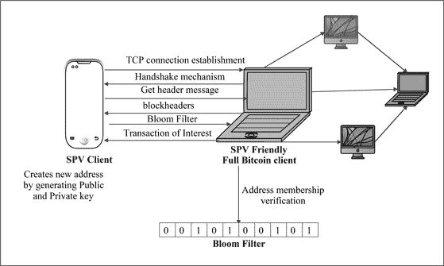
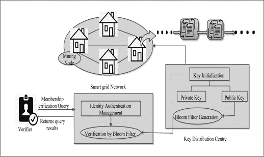
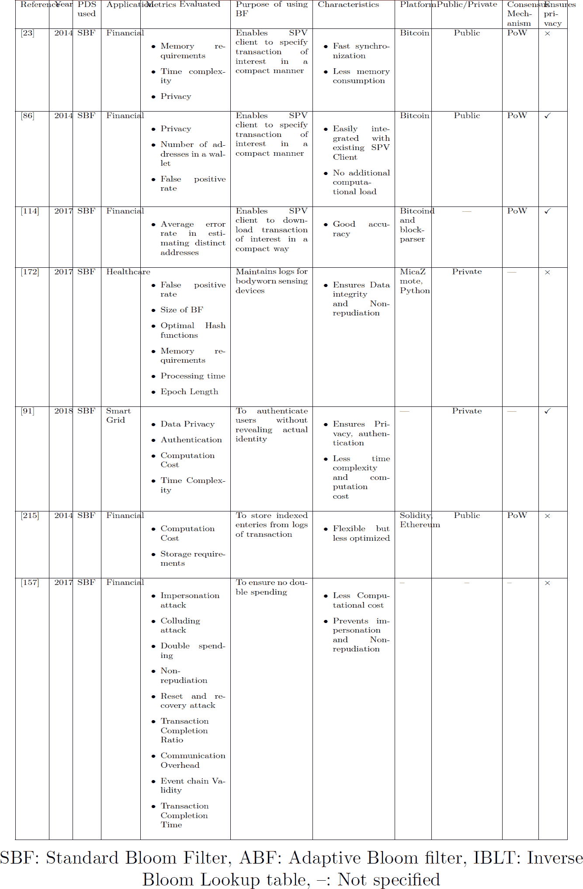
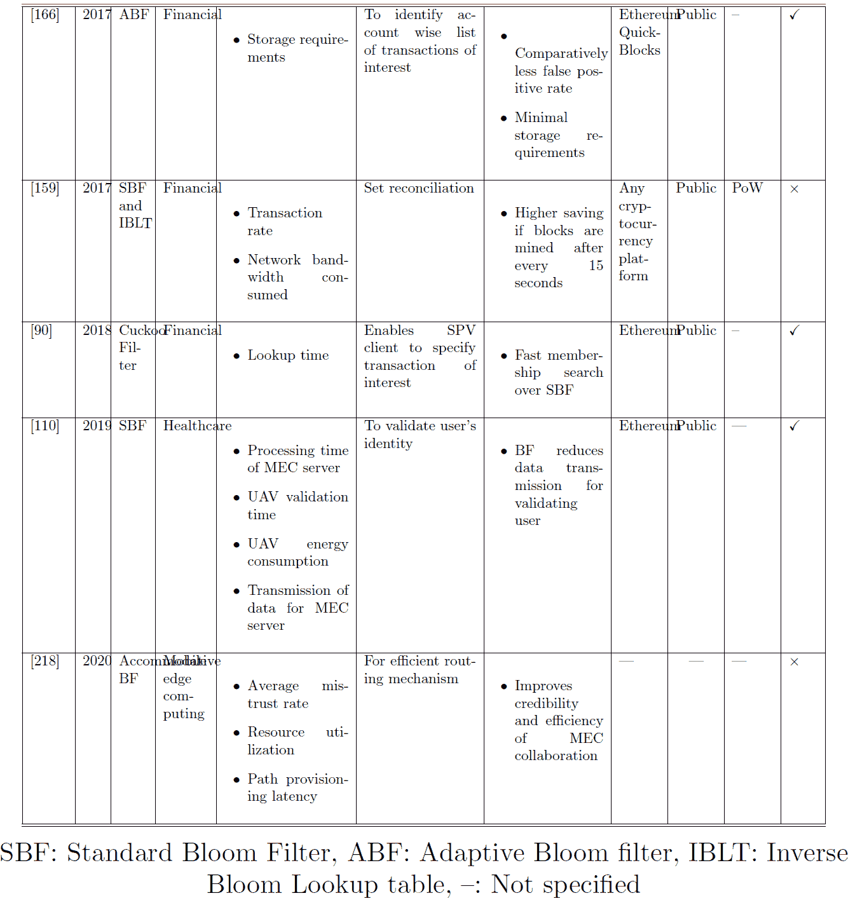
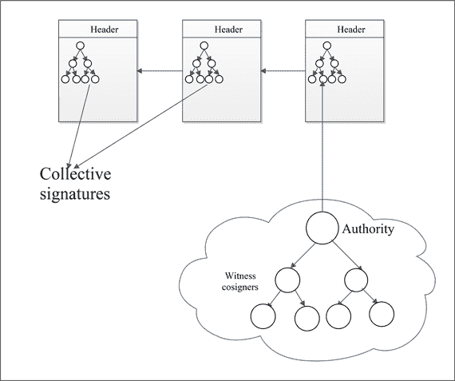
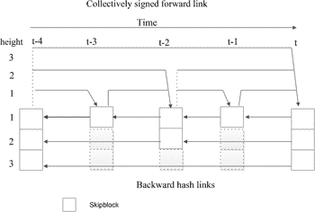
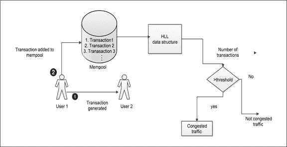
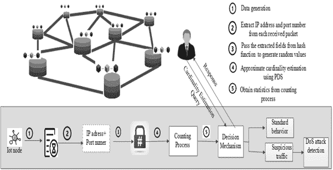
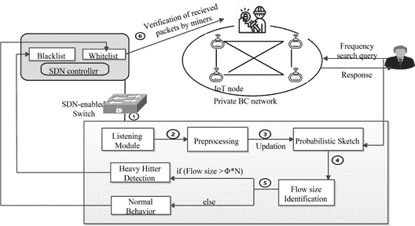

<hgroup>

# 第四部分

# 将概率数据结构与区块链集成

</hgroup>

<hgroup>

# 14

# 将成员查询 PDS 应用于区块链

</hgroup>

## 14.1 完整的区块链客户端与轻量级区块链客户端

如子节 6.1.3 所述，区块链支持两种类型的客户端。完整的区块链节点存储数字账本的完整副本。必须下载并存储整个区块链的全部历史记录。由于下载整个区块链需要耗费时间，并且需要大量的存储空间。这对区块链节点的资源、内存、带宽和计算都提出了严格的要求。除了磁盘空间消耗之外，另一个问题是由于比特币量的增长而增加的验证广播块正确性的开销。因此，区块链支持另一种类型的客户端来解决资源和内存受限设备的问题。与完整客户端相反，轻量级客户端可以在不下载完整区块链副本的情况下进行交易。然而，轻量级客户端仅存储区块头以实现 PoW 区块链概念。但是，轻量级客户端必须引用可信完整客户端的区块链副本。完整客户端仅转发轻量级客户端请求的交易副本。

在这个背景下，SPV 是轻量级客户端用来验证交易是否被包含在一个块中的方法，而不需要下载整个区块链。验证的过程已在第 6.1.3 节中描述。读者可以参考该节。除了检查交易是否存在于一个块中，轻量级客户端还可以验证块的难度。为了验证，轻量级客户端检查一个块是否具有成功的加密链接到前一个块。此外，轻量级客户端还检查 PoW 解决方案是否符合块难度。完整的区块链客户端与轻量级区块链客户端之间的区别显示在表 14.1 中。

**表 14.1**

完整的区块链客户端与轻量级区块链客户端对比。

| **完整区块链客户端** | **轻量级区块链客户端** |
| --- | --- |
| 存储整个历史（完整副本）的区块链分布式分类帐 | 不需要下载区块链分类账的完整副本 |
| 不需要引用任何其他节点 | 引用一个或多个完整客户端来执行操作 |
| 提供更高的隐私保护 | 轻量级客户端必须向完整节点指定交易。因此，存在隐私风险 |
| 主要由计算机系统组成 | 移动设备包括移动钱包 |
| 节点具有挖矿权利 | 轻量级客户端没有挖矿权利 |
| 为网络的完整功能做出贡献 | 对网络功能没有贡献 |
| 不依赖于第三方或任何其他节点 | 依赖于轻量级钱包提供者 |
| 对自己的资金拥有完全控制权 | 在需要时不能保证引用的完整节点在线 |
| 完整客户端的维护非常复杂 | 提供易用性 |
| 这些节点必须验证网络中每个交易的正确性 | 这些节点没有权利验证要添加到区块链网络中的块 |

关键点

完整客户端可以通过简单地不提供感兴趣的交易来欺骗轻量级客户端。这是一种 DoS 攻击。但是，通过连接到多个完整节点，可以解决这个问题。

## 14.2 使用概率数据结构的 BF

### 14.2.1 使用 BF 的比特币

值得注意的是，SPV 客户端无需列出他们感兴趣的每一笔交易（可能有数千笔）。在这种情况下，BF 可以与 SPV 客户端一起使用。BF 不直接发送感兴趣交易的地址列表，而是将 BF 嵌入到 SPV 客户端中，并转发给相关的完整客户端。这个过程的步骤顺序如下所述：

+   在这里，客户端通过插入所有感兴趣交易的地址形成 BF。

+   当完整客户端上线时，轻量级客户端与完整客户端建立连接，连接成功后，经过安全通道传输构建的 BF。

+   对于收到的每个交易块，完整客户端将首先根据从 SPV/轻量级客户端接收到的 BF 进行检查。

+   在匹配的正结果的情况下，与一些 Merkle 分支一起实现 Merkle 哈希所需的交易发送到 SPV 客户端。 SPV 客户端和完整客户端之间的序列步骤在 图 14.1 中表示。

**图 14.1.**

SPV 客户端和完整客户端之间的步骤顺序。

**SPV 客户端存在的问题**

+   现在完整节点知道了请求的轻客户端接收的交易的所有公共地址，这个事实显然违反了客户端的隐私。购买习惯等信息可能会随着这种隐私威胁而被泄露。此外，它可能导致 DoS 攻击。

+   一个完整节点可能会被攻击者入侵，并窃取属于 SPV 客户端的 BF。此外，在攻击者发动的 Sybil 攻击（攻击者故意生成大量恶意节点）的情况下，选择任何恶意节点作为完整客户端的机会增加。

+   不幸的是，在这种情况下也存在误报概率，这意味着可能会将不想要的交易转移到轻量级客户端。然而，这种属性使得难以识别用户拥有的比特币地址，因为很难确定 BF 中实际上有哪些正地址。然而，[86] 的作者建议 BF 的误报率不足以保护 SPV 客户端的隐私。而且，高误报率会浪费更多的网络带宽。然而，具有足够带宽的 SPV 客户端可能会选择高的正地址率。这意味着完整客户端无法准确判断 SPV 客户端的感兴趣交易。实际上，具有非常高误报率的 BF 将导致几乎下载整个区块链。相比之下，通过设置低的 FP 率，完整节点将准确知道 SPV 客户端感兴趣的交易，因为只有特定的交易才会被下载。此外，低 FP 率将导致 SPV 客户端更快地同步，而高 FPR 率将导致更长的同步时间，因为会下载大量的交易。tcolorbox

    **关键点：** BF 代表了隐私和网络带宽之间的折衷。

+   随着 SPV 客户端拥有的地址数量增加，内存请求的大小也会增加。

    **关于使用 BF 保护 SPV 客户端隐私的研究**

+   [86] 的作者讨论了 SPV 客户端使用的 BF 泄露地址信息的问题。作者得出并观察到以下几点：

    +   实验证明地址信息泄漏取决于 SPV 客户端用于形成 BF 的地址数量。研究结论表明，如果一个 SPV 客户端构建 BF 时使用 ¡20 个地址，则与嵌入 BF 中使用 20 个以上地址的情况相比，信息泄漏的风险较高。

    +   如果对手能够从同一个 SPV 客户端收集到多个 BF，这种情况会泄露出更多的地址。因此，应该避免同一个 SPV 客户端构建多个 BF。此外，为了避免对手通过，BF 应该由不同的元素和不同的种子组成，从而避免泄露过多的信息。

    +   如果 SPV 客户端重新启动，对手可以将两个具有相同元素但不同参数的不同 BF 进行关联，这会加剧信息泄露。因此，SPV 客户端应该记住其外包的 BF 的状态，以避免重新计算具有相同元素但不同参数的新过滤器。

+   特别需要注意的是，对于固定的假阳性率 BF，所保留的隐私级别取决于区块中唯一地址的总数。由于区块中唯一地址的总数可能会稳步增加，因此在设计 BF 时决定隐私保护策略至关重要。在这种情况下，[114]的作者提出了一个隐私度量，即*γ*不可否认性，以确定 BF 的假阳性率真正隐藏了多少涉及的地址。基本上，*γ*是一个参数，用于在设计 SPV 客户端的 BF 时控制隐私级别。*γ*不可否认性描述了 BF 中插入的地址有多少被假阳性比特币地址保持平衡的度量。然而，要创建一个指定特定*γ*的 BF，需要了解从上一个检查点到最新区块（Nu）的唯一地址数。作者建议使用线性回归模型来计算 Nu，而无需访问整个区块链。要查看 Nu 估算方案背后的数学，请参考[114]。使用线性回归模型和目标*γ*计算 Nu 后，可以构建 BF 的数组大小。结果表明，与传统方案相比，所提出的方案实现了较高的隐私级别。

+   《163》的作者解释说，还有另一种 SPV 客户端的实现方式，其中这个客户端从完整节点下载整个比特币区块链，以验证感兴趣的单个交易。然而，客户端只会保留区块中感兴趣的交易，并且丢弃其他所有交易。这种方法是隐私保护的，因为网络上的其他节点无法确定 SPV 客户端感兴趣的交易。不幸的是，这种方式会造成大量的带宽浪费。在这里，作者使用了私人信息检索（PIR）的概念，以低带宽和低延迟成本创建完全私密的查询。PIR 使用户可以以数据库不了解用户查询的方式查询数据库。该提案的系统模型涉及不同的 PIR 服务器，这些服务器响应 SPV 客户端的 PIR 查询并提供执行操作所需的数据。PIR 服务器不会了解与用户中心交易数据相关的任何信息。PIR 服务器实际上首先下载整个区块链并将其存储在 PIR 数据库中。对于每个数据库，PIR 服务器都会创建一个名为清单文件的描述文件。SPV 客户端仍然从关联的完整客户端下载 BF，并在之后获取清单文件来查询 PIR 数据库。

+   要将 BF 与 BC 集成，23 中提出了一种类似的方法，该方法通过不向 SPV 客户端发送任何不相关的事务来利用快速链同步。三条消息在轻量级客户端和完整客户端之间执行操作：*filterload* 消息在连接上初始化并设置当前 BF，*filteradd* 消息通过向当前 BF 添加数据元素来更新当前 BF，*filterclear* 消息删除正在使用的当前 BF。此外，作者得出结论，BF 的紧凑大小使得快速成员资格成为可能，从而增加了 DoS 攻击的风险。此外，SPV 方法可能导致隐私问题，因为完整客户端拥有关于 SPV 客户端使用的比特币地址的信息。然而，BF 生成的误报使得完整客户端难以识别实际地址，但它无法完全隐藏 SPV 客户端地址的匿名性。此外，高 FPR 可能导致网络带宽的浪费 153。

#### 14.2.1.1 使用 BF 的 PoW

除了 SPV 实现外，比特币的 PoW 机制使用 BF 来避免 nonce 重复使用攻击。为了实现这一点，每个验证器都使用两个 BF：当前的和先前的。在计算 PoW 之前，会对每个 nonce 分别对这两个 BF 进行检查，对于正面的成员资格结果，拒绝 nonce 值并计算<math alttext="" display="inline"><mrow><mi>S</mi><mi>H</mi><mi>A</mi><mo>−</mo><mn>256</mn><mo stretchy="false">(</mo><mi>S</mi><mi>H</mi><mi>A</mi><mo>−</mo><mn>256</mn><mo stretchy="false">(</mo><mo>+</mo><mo>+</mo><mi>n</mi><mo>|</mo><mo>|</mo><mi>h</mi><mo stretchy="false">)</mo><mo stretchy="false">)</mo></mrow></math>（其中，*n*是 nonce，*h*是先前的头）来检查结果的 MSB 位是否与给定的目标匹配。最后，将 nonce 值*n*添加到更新当前的 BF。此外，验证器可以通过将当前的 BF 复制到先前的 BF 来重置当前的 BF。

### 14.2.2 以太坊使用 BF

除了比特币，以太坊也集成了 BF 以实现更好的空间效率。以太坊存储中的参数是索引的，以便为特定值/地址过滤事件日志。每个交易的收据都被编码在以太坊中。每个交易收据被表示为*BR[i]*，其中*i*表示第*i*个交易。这个收据包括 4 个项目，即(R, Ru, Rl, Rb)，其中 R 表示交易后的状态，Ru 表示在执行交易后立即持有交易收据的区块中累积消耗的气体量，Rl 表示在执行交易时创建的日志集，Rb 表示从每个日志条目中的信息构造的 BF。BF 是 2048 位。使用 BF 可以在几秒钟内扫描整个以太坊区块链，以查找与特定主题匹配的日志。

每当创建新的区块时，任何日志合约的地址以及发生交易时生成的日志的索引字段都会被插入 BF 中，并将此 BF 添加到区块头中。索引字段主要包括交易的地址字段，包括“收件人、发件人和智能合约地址”，以及其他日志主题（例如，转账）。然而，实际的日志并没有添加到区块头中，以节省空间。如果应用程序需要查找给定合约的日志条目或具有特定索引字段，它只需要扫描每个区块头以检索 BF，以查看其中是否包含相关日志。在出现积极结果的情况下，节点会再次执行该区块的交易，重新生成日志，并返回相关日志。然而，通过地址直接索引交易可能会给目标机器带来很大负担。在这种情况下，作者在[166]提出了一种使用 BF 的方法，以一种改进的方式提取各个账户的账户信息。此外，[90]的作者提出了一种布谷鸟过滤器来检查地址成员资格。已经得出结论，布谷鸟过滤器在 SBF 上执行快速成员搜索。

### 14.2.3 区块链与 BF 在证书吊销中的集成

[64]的作者提出使用区块链进行证书管理系统，这是公钥基础设施的核心组件。在这里，所有与证书相关的操作都存储在区块链上供公开审计。然而，作者描述了一些与区块链用于证书管理的关切。

+   实践中的中心化：由于在包括 PoW、PoS 等共识算法中拥有高利益或更好的计算能力的特权节点，网络存在中心化风险。

+   区块大小管理：正如前面讨论的，区块链的当前区块大小是特定的且有限的。然而，在某些情况下，证书吊销列表的大小可达 76 MB，显然无法适应一个区块。因此，需要多个块来存储 CRL 信息。因此，检查有关证书吊销的信息变得不足。

为了保持本书的简洁，我们不讨论第一个问题的解决方案。我们只讨论区块链和比特币的集成。读者可以参考原始论文以获取详细信息。

为了解决后一个问题，即区块大小限制，作者提出了使用双计数布隆过滤器（DCBF）进行吊销检查的方法。DCBF 提供了高效的查询处理和经济的存储。系统的整个证书被分为两组，即有效证书集和已吊销证书集。为了存储两种不同的集合，使用了两个计数 BF，即 CBF1 和 CBF2。更新或新创建的证书存储在 CBF1 中，而吊销的证书首先从 CBF1 中删除，然后存储在 CBF2 中。当创建一个块时，CBF1 和 CBF2 都存储在一个块中。要检查吊销的证书，首先将待检查的证书通过 CBF2。如果此 BF 返回负值，则将证书标记为有效证书。否则，在结果为正数的情况下，在 CBF1 中匹配证书。如果在这种情况下结果为负数，则证书被明确吊销，否则，则检查块中的证书相关操作。比较两个 BF 的结果可确保证书的准确状态而无误报。

### 14.2.4 区块链与 BF 在智能电网领域的集成

在研究工作[91]中，作者提出了在智能电网中实现隐私的解决方案。在这里，作者采用区块链进行数据聚合，而不是依赖可信的第三方。系统架构将智能电网的所有用户根据其用电类型分成不同的组。所有用户的密钥由密钥管理中心（KMC）初始化。KMC 基本上为每个用户分配多个公钥和私钥，并且公钥被用作用户的化名。在每个时间段，根据电力消耗数据选择一个新的矿工节点。所选的矿工节点聚合节点数据，并将这些数据记录在私有区块链中，以确保消息完整性。为了选择一个矿工节点，遵循一个随机的过程。那个电力消耗数据最接近时间段平均电力消耗数据的节点，就被选为矿工节点。网络用户可以创建多个化名来提交他们的电力发电/消耗信息。这样一来，用户的真实身份就无法被揭示。

此外，为了确保在基于区块链的系统中进行快速认证，使用了 BF。BF 使用零知识证明来探测假冒的伪名的存在。为每个不同的组构建布隆过滤器，使用该组的伪名，并将构建的 BF 发送到相应组中的所有节点。为了验证用户的有效性，将用户的注册伪名通过 BF。如果有积极匹配，则对用户进行验证，否则不进行验证。值得注意的是，使用零知识证明进行身份认证。如果未注册用户使用伪名并向系统发送错误信息，则 BF 可以使用有效的空间消耗验证用户的伪名。因此，如果在 KMC 没有注册的用户尝试向网络发送错误信息，则此尝试将失败，因为 BF 中的映射值将至少包含一个零。为了避免误报，作者建议 BF 的数组大小应足够大，以减少哈希碰撞的概率。图 14.2 显示了使用布隆过滤器的身份管理系统。

**图 14.2.**

使用 BF 的身份认证管理系统。

### 14.2.5 集成区块链和比特币用于身体佩戴传感设备

健康保险公司正在制定策略，与体内穿戴设备合作实施他们的政策。尽管体内穿戴的物联网设备生成了关于患者日常生活的相当私密的信息，这些信息不应以任何方式被篡改 [209]。为了解决安全数据记录的问题，[172] 的作者提出了一种轻量级的解决方案。在这里，处于同一广播域的所有智能设备都作为相邻设备的见证人，通过记录所有数据对话以链式结构呈现。然而，网关被用于详细记录与传感器设备之间进行的所有信息交流。基本上，传感器设备记录它们在网络中听到的所有对话，并维护记录并将其转发到网关。值得注意的是，这种方法在网络中产生了大量的流量，使用大容量的内存并对见证人施加了高通信开销。作为解决方案，这些设备不是记录整个对话，而是使用布隆过滤器按照时间顺序存储对话的指纹。因此，使用布隆过滤器降低了空间复杂度。一段时间后，见证人将他们的签名布隆过滤器上传到网关。数字签名确保系统的完整性和不可否认性。此外，为了降低假阳性的概率，作者建议使用不同的哈希函数。

### 14.2.6 石墨烯：区块传播协议

在分布式系统中，始终需要最小化网络带宽，以便在副本之间实现高效同步。显然，为新挖掘的区块和新创建的交易设计高效的网络协议，能够提供许多好处。例如，如果传输的区块所消耗的网络数据较少，那么最大区块大小就可以增加。此外，每秒处理的交易总数也将增加。许多研究人员正在尝试发明一些可以用更少带宽传输区块的技术。带宽使用得越少，区块或消息在网络中传播得就越快。用较少带宽传输的区块不仅增加了对等节点之间的同步，还减少了链上的分叉。在区块链中，Graphene 协议被认为是一种可能以最小带宽传输区块的协议。

此外，比特币矿工的目标是尽快广播新发现的区块，因为哪怕延迟只有毫秒级别，也会增加其他区块被添加到区块链的概率。这促使矿工减少要添加到一个区块中的交易数量。比特币网络中的矿工保留了一个未确认交易的内存池。矿工从内存池中选择一些交易并构建一个新的候选区块。如果所有矿工的挖矿池都是理想同步的，并且它们使用相同的协议来选择要添加到其候选区块中的交易。这消除了将交易包含在区块中的需要，并使每个矿工能够从内存池重建一个区块。在真实场景中，矿工的内存池并不完全同步，因此导致区块传播的低效。为了解决这个问题，作者在[159]中提出了一个名为 Graphene 的协议，用于设计基于区块链的网络的新区块。它将 BF 与反布隆过滤器查找表（IBLT）集成在一起，以解决 P2P 网络中的集合协调问题。IBLT [25] 解决了计算两个数据集之间差异的问题，这有助于确定这两个数据集共享的内容。为了同步区块，发送方首先从区块中的交易 ID 构造一个 IBLT。此外，它使用相同的交易 ID 构造了一个 BF。接收方利用 BF 从内存池中提取交易 ID 并构建自己的 IBLT。最后，接收方解码两个区块之间的差异。这样可以显著减少网络带宽。模拟结果证明，使用 Graphene，网络流量显著减少。

### 14.2.7 使用 BF 和区块链的反恶意软件

随着互联网使用量的增加，病毒和恶意软件的威胁也在增加。大多数反恶意软件程序通过将攻击签名与任意输入流进行匹配来工作。然而，重要的是更新这些模式匹配机制，以保护用户免受所有类型的新恶意软件的侵害。部署集中式更新服务器的想法显然是恶意攻击者的目标。

[156] 的作者提供了一种名为“BitAV”的架构，它以更少的内存使用和更快的速度扫描输入。除此之外，BitAV 通过依赖基于区块链的系统提供了分散式更新和维护。系统可以在区块链上分发新型病毒模式，从而提高了容错性。此外，区块链启用的对等维护机制提高了端到端性能，并且相对不太容易受到 DoS 攻击。BitAV 区块链的结构类似于比特币实现。唯一的区别在于交易字段的工作方式。BitAV 在交易字段的位置存储两个信息，即标识符和使字段。标识符字段使得可以添加新的恶意软件标识符。其余的元数据部分与比特币头部部分相同，以确保可验证性。区块链上的每个新标识符都保持以下格式：*[标识符][公钥][签名]*。此外，BitAV 的扫描机制使用 BF 实现了恒定时间的键值查询。BF 不是存储恶意软件或其更新的签名，而是以哈希格式存储它们，以节省空间并减少查询时间。

### 14.2.8 在灾难多发地区使用 BF 和区块链进行交易执行

[157] 的作者利用 BF 和区块链在灾难易发区域实现基于手机的交易机制。在这里，假设灾难易发区域没有或只有有限的银行接入，因为该地区没有互联网连接。背书者支持客户和商家之间的交易绝对安全性。与比特币类似，在这里，交易也以类似区块链的结构存储。然而，在这种方法中，矿工不需要计算 PoW。用户计算交易日志的哈希值，其他邻近节点在验证后将此签名添加到日志中以形成事件链。事件链是对块上的加密哈希函数的用例。背书者不是签署整个日志，而是计算前一个块的哈希值并将其发送给监控器。此外，监控器对哈希值、GPS 坐标、硬币花费进行整合并发送回给背书者进行签名。网络上的每个用户都将事件链存储为其交易日志。每当发生新事件时，都会将一个新块与上一个事件链进行加密链接。如果手机关闭，事件链被视为中断，因为设备无法与相邻监控节点发送消息。因此，限制了将新事件添加到事件链的可能性。

此外，为了描绘从一开始花费的所有电子硬币，使用了布隆过滤器（BF）。所有花费的电子硬币都使用哈希函数映射到 BF 上。与存储所有已花费电子硬币的 ID 不同，只记录 ID 的哈希值在事件链中。要检查特定电子硬币的双重支付，需要探测 BF。显然，通过使用 BF 可以减少通信开销。

### 14.2.9 利用 BF 和区块链实现的非否认性

197 的作者讨论了他们对证书颁发机构不明确的担忧。如果 CA 对同一身份发布不一致的证书，可能会危及用户的隐私。因此，无撤销确实是当今安全系统中的重要必需品，包括基于区块链的透明度和公钥分发。然而，由于隐私问题和单点故障，使用在线可信方面的无不明确又变得困难。

为了解决这个问题，作者采用了比特币见证方法，主要有三个原因：

+   比特币见证方案对分叉攻击具有抵抗能力。

+   它涉及单一全球见证，即比特币区块链，其他多个可信实体，例如日志提供商和审计员不被允许。

+   比特币区块链提供了开放、去中心化和透明的环境，以提供高效的见证系统。

作者提出了他们的方案，名为 Catena，可以减少审计员的带宽，并在比特币区块链顶部提供防篡改的日志。此外，使用 Catena，不允许分叉。每个 Catena 交易都包含正好一个语句，并暂停上一个 catena 交易，从而创建一系列交易。除了防止模棱两可攻击外，Catena 还可以防止中间人（MITM）攻击。在这里，比特币区块链采用了可信的见证人，可以确认目录摘要。例如，在证书透明度中，可以使用日志服务器直接见证通过 Catena 日志签名的头部。此外，运行客户端界面的审计员可以通过 SPV 方法检查非模棱两可性。类似于 SPV 验证，客户端只需下载比特币区块头和一些 Merkle 散列片段即可检查非模棱两可性。在这里，轻量级客户端依靠 BF，以避免下载完整的数据。轻节点只插入感兴趣的交易或其相关连接以在 BF 中过滤掉不相关的交易。因此，使用 BF，Catena 客户端只接收相关的 Catena 交易。值得注意的是，该方案的作者还指出，轻节点的安全性比完整节点低。

### 14.2.10 使用区块链和 BF 进行户外健康监测

IoT 的一个热门应用是在医疗保健系统中[149][214]。在这种情况下，无人机（UAV）可以在户外为身体可穿戴传感器提供帮助，例如，在自然灾害和交通热点等不可预测的问题上发出警报。（无人机也被称为无人驾驶飞行器，它是一种没有机上飞行员的飞行器，具有在军事、民用和商业领域提供高效解决方案的能力，用于音频和视频监视[138]。）值得注意的是，无人机与移动边缘计算（MEC）合作，可以实现实时支持用户将其健康相关信息存储到 MEC 服务器上。MEC 将云存储服务带到用户附近[45]。然而，无人机和 MEC 之间的通信链路面临着诸多网络威胁，例如中间人攻击等。此外，MEC 服务器容易受到数据完整性攻击的威胁。

[110] 的作者建议将区块链作为解决**无人机（UAV）**和**MEC 服务器**之间存在的安全问题的解决方案。这是首次提出使用区块链来建议室外健康监测系统。在这里，通过 UAV 从用户处收集的健康信息并存储在 MEC 服务器上，受到基于区块链的架构的保护。为了验证用户，作者使用了**BF**，只有当区块链验证它们时，健康数据才会存储在区块链中。每个用户首先在网络上注册，对于该用户，首先使用 ECC 生成公钥和私钥对。接下来，用户请求 MEC 服务器进行注册。从可穿戴设备收集的健康数据会通过 UAV 传输到 MEC 服务器。在发送医疗数据之前，用户使用 UAV 的公钥加密此数据。接下来，在使用 BF 解密 UAV 用户的健康数据之后。最后，在成功验证之后，MEC 加密健康数据并转发到最近的 MEC 服务器。但在转发数据之前，UAV 用 BF 验证用户的身份。因此，在这种情况下使用 BF 减少了数据传输。MEC 服务器解密此数据并检查该数据以查找异常情况。如果有任何问题，将向医院报告。为了验证结果参数，即 MEC 服务器的处理时间、UAV 验证时间、UAV 能耗、MEC 服务器数据传输等参数被使用。在实验中已经证明了，与非 BF 相比，预期的传输数据量随 BF 增加的速率要低得多。随着用户数量的增加，非 BF 的数据以指数方式增加。

### 14.2.11 基于区块链和 BF 的 5G 及其后续的 MEC 多域协作

物联网和 5G 系统的快速增长加速了万物互联的概念[145]，[55]。显然，设备数量的增加导致了数据的高增长。然而，这种高数据增长对 5G 系统和云计算模型的计算能力构成了挑战[58]。为了解决这个问题，设计了异构 MEC 系统[132]，[220]。异构 MEC 被设计为一个分布式计算平台，集成了一个以上的 MEC 服务器、云服务器和计算存储，提供靠近数据源的智能边缘服务。由于这些系统具有短传输链路，边缘计算能够快速响应服务请求。然而，为了实现异构 MEC 系统，多个 MEC 服务器需要整合它们的资源，以完成大规模的计算任务。不幸的是，这种多服务器协作涉及信任和安全问题，因为这些服务器属于不同的域，由不同的组织管理。MEC 服务器通过 SDN 控制器启用的跨域路由与其他 MEC 服务器联系。然而，为了确保多个服务器之间的跨域路由，SDN 控制器需要其他域的拓扑信息。值得注意的是，不同域的这些信息应该对彼此保密，否则隐私泄露可能会损害 MEC 系统。

[218]中的作者使用区块链解决了隐私泄露问题。在这里，区块链实现了 MEC 服务器之间的可信数据共享，实现了多域 MEC 网络的信任合作。此外，该系统采用了适应性 BF 作为载体，帮助实现多域协作路由一致性，而不会泄露拓扑隐私。

首先，跨领域的 MEC 请求通过域 1 到达控制器 A。根据此请求，控制器 A 为域 1 计算域内路径，并选择总权重最小的最优路径。同时，还向后续域的控制器发送新请求，其中包含域 1 的虚拟拓扑。此外，控制器 A 构建包含控制器路由结果的 BF。在这里，BF 维护分布式账本和高效的路由机制。具体而言，BF 还用作路由验证的载体。表 14.2 和 14.3 代表上述方案的表格比较。

**表 14.2**

比较不同方案将区块链与 BF 集成的情况。

**表 14.3**

比较不同方案将区块链与 BF 集成的情况。

## 14.3 QF 与区块链的集成

QF 与 BF 具有相同的目的。然而，如果数据不适合主存储器，BF 将失败。文献不支持任何将 QF 与区块链集成的工作。然而，如果过滤器大小太大无法适应主存储器，则上述使用 BF 的工作可以用 QF 替代，特别是如果过滤器大小太大无法适应主存储器的情况。

## 14.4 Skiplist 与区块链的集成

区块链的一个值得一提的应用案例是在公证文件，例如学位证书方面。区块链的防篡改和透明属性使得区块链上的文件更难伪造和修改。然而，作为一个有前途的应用，公证案例受到一些限制。其中一个挑战是即使文件相对于参考点非常古老，也要验证其在区块链上的存在。可能会出现这样一种情况，即用户未更新他/她的区块链，那么验证人在区块链上的参考点可能落后于问题区块的时间。值得注意的是，这个问题对于低功率设备来说变得更加严重。

解决这个问题的一个方法是使用在前几章讨论过的 SPV 客户端。此外，SPV 引入了安全弱点；如果 SPV 客户端从单个完整节点获取交易，这可能会导致单点故障。此外，SPV 和完整客户端容易受到孤立攻击（例如，来自具有非常少工作量的公共区块链的分叉）和基于路由的劫持攻击 [37]。另外，如果 SPV 客户端连接了多个完整节点，可能会导致更多的带宽和功耗消耗。因此，对于大量薄客户端来说，它不具有可扩展性。重要的是，SPV 客户端需要保持在线，以便检查交易是否提交到区块链上。事实上，对于任何验证者来说，设备需要与良好的互联网连接保持在线。在没有良好连接网络的情况下，验证交易要么是不可能的，要么是不安全的。

此问题的另一解决方案是使用集体签名（CoSi）[183]，这是一种由 ByzCoin 提供的高效数字签名技术。ByzCoin 根据过去几天或几周内最近成功的工作证明矿工构建一个共识组。为了安全地提交交易，形成的这个共识组运行 PBFT 算法。然而，与全对全通信不同，CoSi 在每个阶段都使用，CoSi 生成一个单一的高效可验证的紧凑集体签名，用密码学签名来揭示共识组的一部分已验证。要检查交易上的 CoSi，验证者应该知道交易提交时共识组中矿工的公钥。显然，这个共识组不断变化。为了解决这个问题，在共识组更改时，前一个共识组的一些节点集体形成并签署了一个前向链接，其中包含两个重要信息。CoSi 协议的架构如 图 14.3 所示。

**图 14.3。**

CoSi 协议架构 [121]。

+   通过下一个共识组提交的第一个区块的哈希指针。

+   描述共识组如何更改，同时指定插入或移除的矿工公钥。

此外，所有已提交的区块都使用哈希值具有向后链接。因此，即使验证者没有互联网连接，也可以使用链的前向和后向链接进行验证。然而，使用该方法需要证明者发送所有介入的区块头和前向链接。显然，这会占用低功率设备的带宽、功率和存储带宽。

为了解决这个问题，Chainiac 使用了 Skipchains，这是一种将跳表与区块链集成的加密区块链变体，用于提供安全的 P2P 验证。*Skipchains* 最初是在一个名为 *CHAINIAC* 的框架中引入的，用于更新软件。它使用 *skipchains* 来验证供应商提供的软件更新的完整性和真实性。此外，这个提案消除了单点故障。Skipchain 同时包含了与区块链的长距离前向和后向链接。通过 *skipchains*，验证者可以在前向和后向方向上遍历时间线，从任何参考点跟踪时间。每当在 Chainiac 中创建一个新的区块时，该区块都包含一个向时间更久远的地方指向的哈希链接，同时还具有指向前一个区块的链接。这个后向链接可以证明区块链中任何地方的旧交易的完整性。此外，Chainiac 还提供了与 CoSi 一起的长距离前向链接。长距离前向链接包含共识组中公钥更改的信息。通过这种技术，文档不再由单一的权威验证，而是由领导者以及一组分散的见证人验证。它通过 4 轮通信实现，并在每一轮之后，由见证人生成并验证签名。这确保了如果中央权威密钥被破坏，客户端将无法验证文档，除非它被多个见证人签署。此外，它减少了 PBFT 中的通信开销。因为每个节点不再需要个别节点签名。所以，*CoSi* 减少了在准备和提交阶段在网络中广播的消息的数据大小。拥有长距离前向和长距离后向链接，加密链可以在两个方向上遍历，以便验证者可以验证任何时间点上的区块的正确性，其他参与者可以参考区块链上的某一点。这种验证可以在对数步骤中完成。因此，这种使用 skipchain 的离线和 P2P 验证可以在未来的区块链技术中得到扩展。

*Skipchains*被表示为<math alttext="" display="inline"><mrow><msubsup><mi>S</mi><mi>b</mi><mi>h</mi></msubsup></mrow></math>，其中*h*和*b*分别定义了*skipchain*的高度和基础；如果<math alttext="" display="inline"><mrow><mn>0</mn><mtext> < </mtext><mi>b</mi><mtext> < </mtext><mn>1</mn></mrow></math>，*skipchain*是随机的，如果<math alttext="" display="inline"><mrow><mi>b</mi><mtext> > </mtext><mn>1</mn></mrow></math>（整数），则被定义为确定性的。*skipchains*的元组包含（<math alttext="" display="inline"><mrow><mi>i</mi><msub><mi>d</mi><mi>t</mi></msub><mo>,</mo><msub><mi>D</mi><mi>t</mi></msub><mo>,</mo><msub><mi>h</mi><mi>t</mi></msub><mo>,</mo><msub><mi>F</mi><mi>t</mi></msub><mo>,</mo><msub><mi>B</mi><mi>t</mi></msub></mrow></math>），表示区块标识符、有效载荷数据、区块高度、前向链接列表和后向链接列表。

在 BC 中，*Skipchains*被资源受限的设备用于验证交易的正确性。为了验证，*skipchains*不是下载所有 BC 数据，而是只下载一些对数数量的区块。图 14.4 展示了 skipchain 中的前向和后向链接。*skipchain*中的验证过程也类似于使用 Merkle 树进行验证的过程。所有提交的区块都包含向后哈希链接，不仅指向直接前一个区块，而且指向更远的位置。前向链接是使用*CoSi*形成的，它确保了一定数量的矿工已经验证并提交了一个区块。

**图 14.4.**

确定性 Skipchains 的结构是什么？

## 活动

### 多项选择题

1.  轻量级区块链客户端的特点是什么？

    1.  轻量级客户端也称为 SPV 客户端

    1.  轻量级客户端只下载区块链网络的区块头。

    1.  轻量级客户端下载区块链分布式账本的完整副本。

    1.  轻量级客户端必须参考受信任的完整客户端来执行操作。

1.  轻量级客户端用于验证交易是否包含在区块中的方法叫做？

    1.  复杂支付验证。

    1.  简化支付验证。

    1.  区块链支付验证。

    1.  以上都不是。

1.  完整区块链客户端的特征是什么？

    1.  存储整个区块链分布式账本的历史记录。

    1.  提供比轻量级客户端更好的安全性。

    1.  参考轻量级客户端执行操作。

    1.  以上都不是。

1.  将 BF 与 SPV 客户端集成提供了？

    1.  免受 DoS 攻击的保护。

    1.  获取感兴趣的交易的空间有效方式。

    1.  免受蚂蚁攻击的保护。

    1.  BF 不能与 SPV 客户端一起使用。

1.  以下哪项是 SPV 客户端的主要问题？

    1.  SPV 客户端无法轻松下载区块头。

    1.  SPV 客户端无法在移动设备上运行。

    1.  SPV 客户端的隐私受到威胁。

    1.  以上都不是。

1.  解释以太坊如何使用 BF 来提高空间效率？

1.  解释比特币如何利用 BF 实现 SPV 客户端？

1.  解释 BF 如何用于基于区块链的证书吊销系统？

1.  解释 Graphene 协议的工作原理。

1.  反恶意软件软件如何在 BF 和区块链集成中使用？

1.  解释 Skipchains 的概念。

1\. a, b, d  2\. b  3\. a, b  4\. b  5\. c

<hgroup>

# 15

# 基于区块链的基数估计 PDS 的适用性

</hgroup>

## 15.1 区块链中的 DDoS 攻击

DDoS 是分布式拒绝服务攻击的缩写。这种攻击用于使机器完全关闭。在这种攻击中，目标机器被虚假流量超载，使得合法请求无法被处理。分布式一词用于表示此攻击是由称为僵尸网络的计算机网络传递的。特别地，攻击者发起此攻击是为了娱乐和利润目的。DDoS 难以应对的一个原因是很难区分合法请求和恶意请求。

然而，区块链的去中心化特性阻止了此类攻击的发生。特别地，在区块链网络中已知存在对单个区块链机器的攻击（如 sybil 攻击、路由攻击）。然而，即使一些节点未能处于活动状态，区块链网络仍然可以运作。当受攻击的系统设法恢复时，它们会重新同步并更新来自节点的最新数据。区块链网络的保护程度取决于节点数量和网络的哈希率。为了破坏整个系统，攻击者需要攻击网络总节点数的 51% 或者换句话说，攻击者需要比其他参与者组合拥有更多的计算能力。

对于基于区块链的加密货币系统，此攻击包括针对交易过程，即禁用机器以阻止新交易的生成。发起此攻击的一种方式是创建多个交易以在恶意攻击者预先创建的钱包之间转移资产。通过创建多个交易，矿工们参与解决这些交易的证明。由于需要处理合法交易，导致了服务的拒绝。值得注意的是，在比特币区块链网络中，会收取交易费，但攻击者支付的费用并不高。

举例来说，当加密货币比特币黄金[26]上线时，立刻遭受到了 DDoS 的影响，导致网站下线长达四小时。比特币黄金硬分叉注意到每分钟有 1000 万次点击。后来，推特声明揭示了大多数点击涉及通过中国路由的 IP 地址。

另一种对区块链发起 DDoS 攻击的尝试由[143]的作者讨论，并将该攻击命名为**区块链拒绝服务（BDoS）**。这基于区块链协议为安全分发激励的基本原理，因为挖矿者成功挖出一个区块后会获得奖励。BDoS 利用挖矿者的理性，为他们提供更高的利润来对抗系统。与传统的 DoS 攻击相比，BDoS 可以用更少的资源破坏区块链。与自私挖矿不同，攻击者的目标不是为对手提供收入，而是破坏区块链网络。让我们了解一下 BDoS 攻击。

如果多个矿工同时挖掘区块，则会导致分叉（如果区块具有相同的父区块），在这种情况下，链会出现不同的分支。根据比特币规则，为了防止歧义，只会延伸单一的链，即矿工应该延伸主链上最长的链。然后忽略那些与该链分叉的区块的奖励。然而，为了避免奖励损失，矿工通常在当前区块验证之前就开始挖掘。值得注意的是，他们在收到区块头的元数据后立即开始挖掘最新的区块。因此，通过避免浪费区块资源，矿工尝试增加下一个区块的挖掘机会。这种仅使用头部的挖矿方法被称为前面在 第七章 中描述的 SPV 挖矿。为了发起攻击，攻击者创建一个区块，并仅发布其头部。给定一个头部，矿工尝试扩展该区块。然而，攻击者从不发布完整的区块，而理性矿工尝试的那个区块永远不会包含在区块链的主链中，并且它不会带来来自该区块的预期奖励。因此，攻击者制造了一个使诚实矿工损失奖励的局面。此外，矿工无法处理合法请求，导致诚实矿工放弃挖掘，并导致资源的浪费。

防御 DDoS 攻击的措施包括识别洪泛源，然后设计过滤器以阻止该源。只有源地址位于预期 IP 地址范围内时，才允许来自该源的出站和入站流量。

注意：

DDoS 攻击并不直接影响存储在区块链网络中的数据的安全性，但被攻击的节点无法参与共识机制，其计算能力和资源因此被浪费。

## 15.2 内存池交易计数

所有等待确认的交易都存储在比特币网络的内存池（mempool）中。要得到确认，交易首先需要在来自内存池的区块中。值得注意的是，在区块链网络中不存在全局内存池。比特币网络上的每个节点通过连接到比特币网络构建自己的内存池版本。内存池中的每笔交易都支付费用并具有大小。显然，具有高费用的交易会被矿工优先选择。每当节点重新启动时，内存池就会被清空。节点向矿工支付费用以进行交易挖掘。一个区块中的交易数量的最大值因为不是所有的交易都具有相同的大小而有所不同。内存池中交易数量越多，交通拥堵就越严重，导致确认时间更长。此外，网络交易费用由网络拥塞和交易大小确定。比特币区块大小为 1 MB，这意味着矿工大约每 10 分钟可以处理 1 MB 的交易。对于比特币网络，如果交易数量超过 1 MB，将导致网络拥塞，矿工将优先考虑具有较高费用的交易。在这种情况下，比特币的内存池交易计数指标[27]显示了导致拥塞的交易数量。（相比之下，内存池大小将指定拥塞持续的时间长度。）

## 15.3 线性计数、LogLog 和 HyperLogLog 与区块链的交互

虽然文献中没有现有的工作将 HLL、LogLog 或线性计数集成到区块链中。但是这些概率数据结构可以用于区块链网络中的计数目的，如下所述。值得注意的是，我们在 HLL 的上下文中提出了我们的观点，因为在这三种算法中，HLL 是最受欢迎和高效的算法。

### 15.3.1 统计内存池中的交易

这种基数估计 PDS 可用于计算内存池中的交易数。内存池中的交易计数告诉我们有多少交易导致了拥堵。由于区块链网络上的每个系统对于这些未确认交易具有不同的存储能力。在这种情况下，可以使用 HLL 来计算每个节点内存池中的交易数。要实现这个逻辑，每当新的交易被添加到内存池中，首先对其进行哈希处理，然后将所得的哈希存储在零序列最长值所对应的桶中。最后，将桶中的值使用调和平均数进行组合。此外，可以使用编程在内存池上设置一个上限，指定最大交易数以避免拥堵。要设置限制，还可以使用智能合约的概念，其中开发了一个包含逻辑的合约，指定了内存池中的最大交易数。使用 HLL 检查区块链网络中的拥堵交通的用法如 图 15.1 所示。

**图 15.1.**

使用 HLL 检查比特币网络中的拥堵交通。

### 15.3.2 使用 HLL 预防 DoS 攻击

HLL 可以实现的一个有趣领域是防止区块链中的 DDoS 攻击。在这里，攻击者的意图是通过大量无意义的流量来压倒受害者机器，以消耗资源和带宽。正如前面讨论的那样，DDoS 攻击可以通过同时发送大量交易来发动。另一种方式，对手也可以发送一个特别大的大小操作码来处理区块，矿工所花费的时间也会变得很长。因此，矿工无法处理合法请求。在区块链上执行 DoS 的另一种方法是通过用无限虚假交易填满孤立块，因为孤立交易块具有无限的存储空间。所以，当新交易到达时，所有孤立块中的交易都会被验证和验证，如果之前没有验证，则会使矿工节点忙得无法处理正常交易[28]。在这种情况下，HLL 可以用于网络中，以通知如果传入数据包的源 IP 超过预定义的阈值。例如，作者在[60]中提出了一种算法，该算法使用滑动 HLL 和 BF 来检测端口扫描攻击。端口扫描攻击是一种 DoS 攻击形式，攻击者旨在查找受害者机器上的一些服务。滑动 HLL 几乎与最初由[61]提出的原始 HLL 类似，它使用滑动窗口模型来近似可变有界区间的基数。此外，智能合约也可以用于相同的目的。例如，Rodrigues 等人在[164]中使用智能合约来减轻 DoS。在这里，智能合约报告了跨多个域的黑名单 IP 地址。值得注意的是，阻止 IP 地址的技术仅适用于静态 IP 地址，对于动态 IP 地址则会失败。智能合约被编程为在区块链中阻止 IP 地址。然而，作者使用传统数据结构来计算来自同一 IP 地址的交易数量。可以使用概率数据结构来代替传统数据结构，以节省空间并在恒定时间内执行计数操作。处理基于区块链的 IoT 网络中的 DoS 的过程如 Fig. 15.2 所示。为了在一个块内获取唯一地址计数，从由 IoT 节点生成的数据/交易中提取 IP 地址和端口号。将提取的字段通过 SHA-256 哈希函数传递以估算基数。

**图 15.2.**

区块链基础的物联网环境中的近似基数估计。

**注意** 上述讨论也适用于基于物联网的环境，因为这种环境涉及到像智能电网环境或 V2G 环境中的金融服务，例如交换付款、支付账单等。此外，区块链网络也适用于许多其他物联网领域，例如农业、医疗等。

### 15.3.3 IoT chain

一个名为 IoT chain [29] 的项目采用了区块链和 PDS 来改善物联网网络。IoT chain (ITC) 的推出是为了解决物联网中的诸多挑战，例如数据隐私、DDoS 攻击、集中式环境的开销、数据采集、数据处理等等。这项技术结合了非对称加密、半同态加密和区块链技术支持的分布式账本。通过非对称算法的私钥-公钥对，用户的私密数据无法被敌手看到。区块链技术降低了集中式架构产生的成本，此外还确保了数据不会与任何第三方共享。同态加密使得对加密数据进行操作成为可能。除此之外，ITC 在分布式环境中使用 BF 和 HLL 进行数据的实时分析，在必须在一定时间内处理数据之前进行数据处理。

## 活动

### 多项选择题

1.  mempool 交易计数显示了什么？

    1.  导致拥塞的交易数量。

    1.  拥塞将持续多久？

    1.  区块大小

    1.  这些都不是

1.  mempool 大小指标告诉我们什么？

    1.  导致拥塞的交易数量。

    1.  拥塞将持续多久？

    1.  区块大小

    1.  这些都不是

1.  什么是 IoT chain？

    1.  区块链和物联网的整合

    1.  物联网（IoT）与个人数据保护系统（PDS）的整合

    1.  物联网与同态加密的整合

    1.  这些都不是

1.  什么是比特币黄金？

    1.  比特币的黄金版本

    1.  以太坊的一个变体

    1.  共识算法

    1.  比特币的硬分叉

1.  区块链网络有一个全局内存池。

    1.  正确

    1.  错误

1.  攻击整个区块链网络，攻击者需要攻击……总节点的……%？

    1.  51%

    1.  30%

    1.  33%

    1.  1%

1.  同态加密的主要特点是什么？

    1.  可以对加密数据执行操作。

    1.  它解决了加密问题

    1.  它的过程涉及第三方服务提供商

    1.  以上全部

1.  BDoS 代表什么？

    1.  区块链拒绝服务

    1.  基于服务拒绝攻击

    1.  过度膨胀的拒绝服务

    1.  以上都不是

1\. a  2\. b  3\. a  4\. d  5\. b  6\. c  7\. d  8\. a

<hgroup>

# 第十六章

# 区块链与频率估计 PDS 的适用性

</hgroup>

## 16.1 RFID 标签克隆

无线射频识别（RFID）是一种基于无线电波的最新自动识别技术，用于识别和跟踪物体而无需视线[31]。与传统的条形码不同，RFID 标签是可重用的、可读写的，并且不太容易出错。RFID 的用例包括运输、港口操作、供应链管理、纸币等。提升操作效率、提高准确性、降低运营成本、改善服务是 RFID 的一些好处。RFID 标签读取以数据流的形式呈现。例如，假设 S=S1, S2,…….,Sm 是一个标签读数的数据流，分成了 t 秒的批次。尽管有各种技术，RFID 的安全问题是一个关注的问题，其中 RFID 克隆攻击是一种恶意攻击之一。RFID 克隆攻击意味着制造多个真实标签的复制品。克隆标签通常是真实标签的电子产品代码（EPC）的副本。每当阅读器读取标签时，很难区分两个标签。此外，对同一 EPC 使用相同的哈希函数会导致哈希冲突。RFID 的克隆可能会导致财务损失。然而，基于密码学的身份验证方法不仅可以保证安全和隐私，而且还需要高内存和计算能力[80]。

## 16.2 理解重要指标

网络流量监控对于安全的网络运营非常重要。在这种情况下，检测重量级流是流量测量应用程序的一个过程。检测重量级流可用于网络操作，如流量记账和异常检测。重量级流被定义为具有特定总链路容量的流。换句话说，它是检测大小超过给定阈值的流。根据周等人的说法，检测重量级流是确定属于网络数据流的相同元素的频率的过程[221]。值得注意的是，网络流由 5 元组确定，即源 IP 地址、目的 IP 地址、源端口、目的端口和协议。通常，数据流被定义为 S=p1, p2,….,pn，其中，pi 由 IP 地址、端口号等组成。检测重量级流已在许多领域研究过，例如网络流量和 IP 通话。

使用 PDS 检测重量级流的第一步是数据包处理阶段，从网络数据包中提取网络数据流。第二步，将数据流的每个元素更新为概率草图。在第三步中，通过概率计数计算流大小。最后，在测量间隔中，重量级流被检测为流大小的估计。如果元素的值大于或等于阈值，则相应的 IP 地址被确定为重量级流。

## 16.3 区块链与 CMS 集成

文献缺乏支持 CMS 与区块链集成的工作。然而，我们可以利用 CMS 在区块链中进行各种方式的应用。

### 16.3.1 检测 DoS 攻击

如上所述，检测 DoS 攻击、异常检测、QoS 管理是实时检测重度击中者的重要用例。除了 HLL 外，DoS 攻击也可以通过 CMS 处理，通过为任意时间槽 *t* 设置阈值 *ϕ*，如果 CMS 中计数器的频率大于预定义的阈值 <math alttext="" display="inline" id="chapter16_eq1"><mrow><mi>ϕ</mi> <mo>*</mo> <mi>N</mi></mrow></math>（N 是总计数），那么该节点就可以被识别为恶意节点。此外，通过使用频率计数 PDS，验证器可以检查块中地址的频率，或计算相同源和目的地地址对的频率以生成实时响应。通过使用 CMS，每个流式更新可以在对数步骤中处理。CMS 的另一个优点是可以从观察池中删除合法连接 [118]。

受到[179]的工作启发，提出了一种在私有区块链基础物联网网络中实时检测重量级击打者的想法，如图 16.1 所示。尽管[179]中的作者没有使用 PDS 来检测重量级击打者。由于私有区块链参与者的数量通常较少，因此有必要确保节点始终可用以正确运行。显然，私有区块链网络的节点应始终可用，同时受到 DoS 攻击的保护。该提案使用了一个支持软件定义网络（SDN）的交换机来保护私有区块链中的节点免受 DDoS 攻击。在网络中，该攻击阻止节点参与共识机制，这可能导致计算能力的浪费。然而，基于流统计的 DDoS 是通过使用 Count-Sketches [135, 134, 84] 来检测的。SDN 支持的交换机会过滤生成重量级击打者的远程节点，并尝试在网络内发送数据。它监听所有传入的数据包（*p1, p2,…….., pn*），并从每个数据包中提取源-目标对以计算流条目的统计信息。SDN 交换机配置了私有网络注册的区块链节点的信息（IP 地址和端口号）。SDN 网络控制器定期检查概率计数草图以检测重量级击打者。它将重量级击打者流和正常流分别放入黑名单和白名单中。最后，来自白名单的数据包被转发以由网络内的矿工节点进行验证。

**图 16.1.**

在基于区块链的物联网环境中检测重量级击打者。

### 16.3.2 检测 RFID 标签克隆

在物联网环境中，Count-sketches 可用于检测应用中的 RFID 克隆标记，如供应链管理、航运和港口操作、水位监测等。在这种情况下，Hazalila *等人[113]* 提出了一种基于 CMS 向量和双哈希碰撞一致性的轻量级防克隆方法。CMS 使用两个独立的哈希函数来探测相同的 EPC。当对相同的 EPC 进行哈希处理时，相同的哈希函数会导致哈希碰撞，这意味着标签克隆的可能性很高。实现结果表明，所提出的方法比基线方法表现更好，并在检测克隆比率时实现了更高的准确性。尽管这个提案没有实现区块链技术，但 CMS 可以扩展到基于区块链的物联网网络。草图是分散在多个 RFID 读取器上的标签读取的累积。每个草图在批处理间隔期间收到的标签读取。

## 活动

### 多项选择题

1.  在 RFID 上下文中，EPC 代表什么？

1.  解释 CMS 和区块链集成如何有助于防止 RFID 标签克隆？

1.  解释什么是重击者？

1.  RFID 标签克隆如何执行？

1.  解释 Count-sketch 如何防止 DoS 攻击。

<hgroup>

# 17

# 适用于带区块链的近似相似搜索 PDS

</hgroup>

## 17.1 用于无线多媒体传感器网络的近似最近邻二进制搜索算法

在区块链上存储海量物联网数据需要大量的内存空间。此外，现有的相似性搜索方法所需的空间甚至超过了用于创建索引结构的实际数据集。鉴于这个问题，区块链中的相似性搜索 PDS 允许验证者或用户实时检索给定查询的相似数据。基于 ASS 的 PDS 使用最少数量的距离计算进行计算。文献[136]中的作者将 LSH 和区块链与 IPFS 相结合，以管理无线多媒体传感器网络（WMSN）生成的数据。基于区块链的系统保护高度敏感的数据免受篡改。

## 17.2 使用局部敏感哈希的图像版权区块链

为了证明数字资产的版权，A. Zhuvikin [222] 提出了基于强健图像特征的区块链图像版权注册系统。如上所述，LSH 在高维数据集上进行搜索，确保相似对象高概率碰撞而不是非相似对象。与使用 LSH 不同，使用了交叉多面体 LSH，这也将相似数据映射到相同的索引值 [35]。然而，与原始 LSH 相比，交叉多面体大幅降低了空间和时间复杂度。它使用 LSH 检索具有相似内容的图像，即使它们被内容保留操作更改，例如 JPEG 压缩，缩小，缩放等。为了共享带有版权的原始图像，首先通过执行 LSH 计算强健图像特征向量，并使用所有者的私钥进行签名。在下一步中，获得的签名与称为混淆因子的随机整数相乘，以生成广播给网络上所有矿工节点用于验证的盲签名。最后，使用 LSH 和盲签名构建图像索引项，以便定位版权所有者。此外，提出了一种名为单排列旋转和交叉多面体局部敏感哈希（OPRCP）的混合数据查询方法，该方法在 WMSN 混合数据（音频，图像，文本）中近似最近邻搜索，并构建查询数据结构。OPRCP 首先使用 TF-IDF 方法提取多媒体数据的特征向量，然后从获得的特征向量构建哈希表数据结构。当验证者或用户必须将查询对象映射到数据结构时，查询在进行特征向量化后经历相同的哈希计算过程。作者还分析了从 LSH 最近邻搜索中查询时间和查询准确性之间的关系。与原始 LSH 相比，OPRCP 在空间和时间上改善了相似性搜索。

## 活动

### 回答以下问题

1.  解释一下如何将区块链与局部敏感哈希集成可以帮助保护图像版权。

1.  根据你的看法，最小哈希算法可以与区块链集成的可能领域有哪些？
