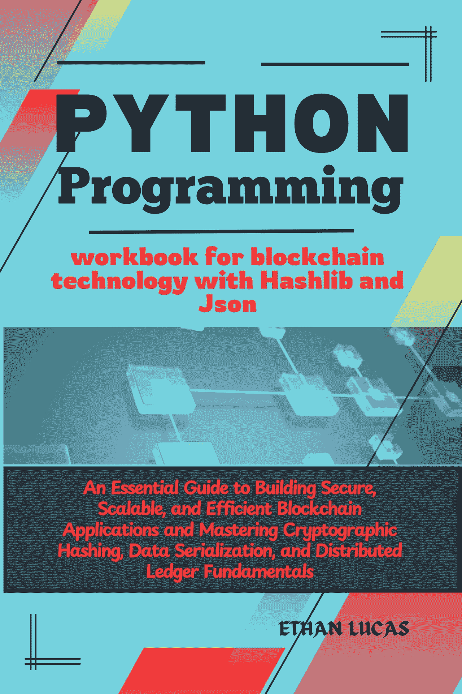

# 面向区块链技术的 Python 编程手册：使用 Hashlib 和 Json

构建安全、可扩展、高效的区块链应用的必备指南，掌握加密哈希、数据序列化与分布式账本基础

版权所有 © 2024 ETHAN LUCAS

保留所有权利。未经出版商书面许可，不得以任何形式或任何方式（电子或机械，包括影印、录制，或通过任何信息存储和检索系统）复制或传播本书的任何部分。

## 目录

引言................................................................... 7  第一部分：区块链技术与 Python 编程入门.......................................................................... 9

第 1 章：欢迎来到区块链革命！......... 10

什么是区块链技术？ ................................. 10

为什么区块链很重要？ ..................................... 12

区块链的实际应用....................... 14

Python 编程入门（可选） . 17

设置你的 Python 开发环境.... 19

Python 基本语法与数据结构..................... 21

第 2 章：揭秘区块链基础 ......... 25

分布式账本与共识机制......... 25

分布式账本：数据管理的范式转变.................................................................. 25  理解交易与区块....................... 28  区块链安全概念（密码学基础） ...................................................................................... 30

加密哈希函数简介 ........ 33

第 3 章：用于区块链开发的 Python .............. 37

使用 Hashlib 库进行安全哈希 37

使用 Json 探索数据序列化......................... 49

第二部分：使用 Python 构建你的第一个区块链 ............ 61

第 4 章：用 Python 构建一个简单的区块链........... 62

设计区块结构（数据、哈希、前序哈希） ...................................................................................... 62

用 Python 实现：定义区块类 .......... 64

实现哈希与验证功能...... 66

构建创世区块（第一个区块）.............. 68

向链中添加新区块（挖矿模拟） 70

第 5 章：增强安全性与可扩展性.................. 75

使用数字签名保障我们的区块链安全（可选）...................................................................... 75 探索共识机制（工作量证明 示例）....................................................................... 78  应对区块链的可扩展性挑战....... 80  第 6 章：与区块链网络交互（可选） .......................................................................................... 84

区块链 API 与客户端简介 ................ 84

使用 Python 构建一个简单的区块链浏览器... 87

（附加内容）连接到真实的区块链网络 ...................................................................................... 90

第三部分：使用 Python 进行高级区块链开发 ..... 93

第 7 章：使用智能合约........................ 94

什么是智能合约以及它们如何工作？... 94

使用 Python 编写智能合约（使用 web3.py 等库）........................................................................ 98 将智能合约部署到区块链网络（可选）.................................................................... 102

第 8 章：使用 Python 构建去中心化应用（DApps） ........................................................................................ 105  构建与智能合约交互的 DApps ... 105  探索 DApps 在不同行业的用例 .................................................................................... 108  保障使用 Python 开发的 DApps 的安全并进行测试 110  第 9 章：区块链应用的安全最佳实践..................................................................... 113  区块链系统中的常见漏洞与攻击 ....................................................................... 113

保障数据、交易与智能合约的安全 ..... 116

关注新兴安全威胁......... 119

第四部分：资源与后续学习路径................. 122

第 10 章：探索更广阔的区块链生态系统 ........................................................................................ 123 流行的区块链平台（以太坊、Hyperledger

Fabric）......................................................................... 123  用于区块链开发的其他 Python 库

............................................................... 127  附录............................................................................. 130  区块链术语表.................................... 130

### 引言

世界正在见证一场技术变革，而区块链技术正站在变革的前沿。这一创新概念承诺提供安全、透明且分布式的记录保存方式，正在从金融到供应链管理等各个行业引发革命。

本书《面向区块链技术的 Python 编程手册：使用 Hashlib 和 Json》为你提供了成为区块链开发者所需的必备工具。无论你是完全的初学者还是经验丰富的程序员，这本手册都将引导你使用 Python 的强大功能，探索激动人心的区块链世界。

**你将学到：**

- 掌握区块链技术的核心原则：揭秘分布式账本、共识机制以及加密安全的重要性。
- 掌握 Python 编程基础（可选）：如果你是编程新手，本书将为你提供 Python 的温和入门，这门通用语言将为你的区块链之旅提供动力。
- 利用 `Hashlib` 和 `Json` 的强大功能：探索用于安全哈希的 `hashlib` 库和用于数据序列化的 `json` 库，这些是区块链开发中的必备工具。
- 使用 Python 构建你自己的区块链：通过实践练习，你将创建一个简单的区块链应用，理解区块是如何链接和保障安全的。

**为什么选择 Python 以及 Hashlib 和 Json？**

- **Python**：以其可读性和对初学者友好而闻名，Python 让你能够专注于核心的区块链概念，而不会陷入复杂语法的泥潭。


• `Hashlib`：这个内置的 Python 库提供了强大的加密哈希功能，对于确保区块链应用中的数据完整性至关重要。

• `Json`：被广泛采用的 JSON（JavaScript 对象表示法）格式简化了数据序列化，使得在你的区块链中表示复杂数据结构变得容易。

准备好开启你的区块链探索之旅了吗？本书是你的全面指南。让我们一起解锁区块链技术的潜力！

## 第一部分：区块链技术与 Python 编程简介

### 第一章：欢迎来到区块链革命！什么是区块链技术？

数字时代彻底改变了我们存储、管理和共享信息的方式。传统方法通常依赖于中心化机构，这引发了关于控制权的担忧。

本章将介绍一项有望颠覆这些系统的技术：区块链技术。但区块链究竟是什么？

透明度、安全性和

向你介绍一个突破性的

揭秘区块链：系统

想象一个巨大的、公开的账本，记录着网络中发生的每一笔交易。这个账本并非存储在单一位置，而是分布在一个计算机网络中。每台计算机都持有账本的一个副本，确保了透明度并防止单一实体篡改数据。这，本质上就是区块链技术的核心原则。

一个分布式账本

记录每一笔交易的账本

区块链的关键特性：

• 分布式账本：数据并非存储在中央服务器，而是复制到计算机网络中，使其具有防篡改和抗审查性。
• 不可变性：一旦交易被添加到账本（记录在一个区块中），它就不能被更改或删除，从而确保数据完整性。
• 透明性：网络中的所有参与者都可以访问完整的账本，这促进了信任和问责。
• 安全性：加密哈希机制确保了区块链内交易的安全、共识和有效性。

区块链是如何工作的？以下是区块链过程的简化分解：

1. 交易发起：用户在网络中发起一笔交易（例如，发送资金、转移资产所有权）。
2. 广播交易：交易被广播给网络中的所有参与者进行验证。
3. 验证与确认：网络上的节点（计算机）使用共识机制（稍后解释）验证交易的合法性。
4. 区块创建：如果有效，该交易将与其他已验证的交易一起被打包到一个新区块中。
5. 哈希与链接：为新区块生成一个唯一的加密哈希值，将其链接到链中的前一个区块。这创建了一个不可变的区块链。
6. 将区块添加到账本：新区块被添加到所有参与节点的分布式账本中，更新整体记录。

这个持续的循环确保了交易记录的安全和透明，促进了信任，并消除了对中心化权威机构的需求。

区块链的力量：超越交易 虽然安全的交易记录是其核心优势，但区块链的潜力远不止于金融应用。以下是一些令人兴奋的可能性：

• 供应链管理：以实时透明度跟踪货物从原产地到目的地的流动，确保真实性并防止假冒。
• 投票系统：实现安全且可验证的投票流程，最大限度地减少欺诈并增强选民信心。
• 身份管理：创建安全且自主的数字身份，使个人能够控制其个人数据。
• 记录保存：安全透明地存储和管理医疗记录、土地所有权文件或知识产权。

区块链技术的潜在应用是广泛且不断发展的。随着你深入阅读本书，你将探索如何利用 Python、`Hashlib`和`Json`来构建自己的区块链应用，并为这场激动人心的技术革命做出贡献。

#### 为什么区块链很重要？

区块链技术的兴起不仅仅是一种新的交易记录方式。它解决了当今数字领域的根本性挑战，提供了几个关键优势：

• 增强的安全性和信任：传统系统通常依赖中心化机构，这些机构可能容易受到攻击或操纵。区块链通过将账本分布在网络中消除了这个单点故障。任何篡改数据的尝试都需要修改网络中的所有副本，这使其非常不切实际且容易被发现。加密哈希通过确保每个区块内的数据完整性进一步加强了安全性。
• 透明性和不可变性：区块链网络中的所有参与者都可以访问完整的账本。这种透明性促进了信任和问责，因为每笔交易都被永久记录且无法更改。这消除了对系统内未经授权修改或隐藏议程的担忧。
• 降低成本并提高效率：通过消除银行或监管机构等中介机构的需求，区块链可以简化流程并降低交易成本。自动化和更快的结算时间进一步提高了效率。
• 提高可追溯性和来源可信度：区块链提供了资产在整个供应链中所有权和流动的可验证记录。这使企业能够跟踪货物从原产地到目的地，确保真实性并打击假冒。
• 赋能与去中心化：区块链使个人能够控制自己的数据并参与安全交易，而无需依赖中心化权威机构。这促进了一个更加去中心化和民主化的系统。

这些优势在各个行业都具有巨大的潜力：

■ 金融：区块链可以通过实现更快、更安全、更具成本效益的跨境支付来革新金融系统。它还可以促进新金融工具和创新投资模式的创建。
■ 供应链管理：通过以更高的透明度和不可变性跟踪货物的流动，区块链可以提高效率、减少欺诈，并增强消费者对产品真实性的信心。
■ 医疗保健：在区块链上安全地存储和管理医疗记录可以改善患者数据隐私，并促进医疗保健提供者之间的协作。
■ 投票系统：基于区块链的投票系统可以确保安全且可验证的选举，最大限度地减少欺诈并增加选民对民主进程的信任。

可能性确实是无穷无尽的。随着区块链技术的不断发展，我们可以期待更多创新的应用，这些应用将重塑我们在数字时代互动、交易和管理信息的方式。

#### 区块链的实际应用

区块链技术的潜力远不止于理论概念。它已经在各个行业掀起波澜，展示了其在现实世界应用中的变革力量。让我们探索一些令人兴奋的例子：

1. 金融服务：加密货币：比特币是第一个被广泛采用的加密货币，它利用区块链技术促进安全的点对点交易，无需中央银行。
跨境支付：区块链可以通过消除中介和减少处理时间来简化国际支付。这可以显著惠及跨境发送或接收资金的企业和个人。
证券交易：区块链上的资产代币化可以革新证券交易，实现更快的结算时间、改进的分数所有权以及增强的监管合规性。


2. 供应链管理：食品安全与溯源：消费者可以追踪食品从农场到餐桌的来源和旅程，确保真实性并识别潜在的污染问题。防伪：在供应链的每个阶段验证产品的真实性，降低假冒风险并保护知识产权。

库存管理：在区块链上实时追踪库存流动可以优化物流、最小化缺货并提升整体供应链效率。

3. 医疗保健：安全的医疗记录：将患者记录存储在区块链上可以确保数据隐私、促进医疗保健提供者之间的安全共享，并使患者能够控制其健康信息。药品供应链管理：在区块链上追踪药品供应链可以打击假药、提高患者安全并确保用药的有效性。临床试验管理：区块链可以通过安全地存储和追踪数据来增强临床试验的透明度和完整性，提高研究效率。

4. 政府与公共服务：投票系统：基于区块链的投票系统可以确保安全且可验证的选举，最大限度地降低欺诈风险并增强选民对民主进程的信心。

土地所有权管理：在区块链上安全地记录土地所有权可以简化产权登记、减少纠纷并提高土地管理的透明度。

身份管理：个人可以在区块链上控制其数字身份，使其能够与授权实体安全地共享数据，同时维护隐私。

5. 其他行业：媒体与娱乐：艺术家和创作者可以利用区块链保护知识产权、确保版税公平分配并与观众直接建立联系。

物联网：通过区块链确保物联网设备之间的通信安全可以增强数据隐私、确保设备真实性并促进安全的数据交换。

这些只是区块链技术已经在改变行业的一些例子。随着其能力的成熟和采用的扩大，我们可以期待更多创新应用的出现，颠覆传统模式并在数字领域创造新的机会。

#### Python 编程入门（可选）

本节简要介绍 Python 编程，特别关注使用`hashlib`和`json`进行区块链开发所需的基本概念。如果您已经熟悉 Python，请随意跳到下一章。

##### 为什么选择 Python 进行区块链开发？

Python 为构建区块链应用提供了几个优势：

- **可读性**：Python 的语法以清晰简洁著称，即使对于初学者来说也更容易学习和理解。
- **多功能性**：Python 是一种通用语言，拥有庞大的库和框架生态系统，使其适用于各种开发任务，包括区块链应用。
- **庞大的社区**：Python 拥有庞大且活跃的开发者社区，为您的学习之旅提供了丰富的资源、教程和支持。

#### 设置您的 Python 开发环境

在深入代码之前，您需要设置您的 Python 开发环境。以下是一个快速指南：

i. **安装 Python**：从官方网站下载并安装最新版本的 Python。
ii. **选择代码编辑器或 IDE**：选择适合您偏好的代码编辑器或集成开发环境（IDE）。Python 的流行选择包括 Visual Studio Code、PyCharm 或 IDLE（随 Python 安装附带）。
iii. **验证安装**：打开您的终端（命令提示符）并输入`python --version`。这应该会显示已安装的 Python 版本。

##### 基本 Python 语法和数据结构

让我们探索一些与区块链开发相关的基本 Python 概念：

- **变量**：变量存储数据，并且可以在程序中被赋予不同的值。它们有名称和数据类型（例如，整数、字符串）。
- **数据类型**：Python 支持多种数据类型，如整数（整数）、浮点数（小数）、字符串（文本）和布尔值（`True`或`False`）。
- **运算符**：运算符对数据执行操作，例如加法（`+`）、减法（`-`）、乘法（`*`）和除法（`/`）。
- **条件语句**：这些根据特定条件控制程序的流程（例如，`if`语句、`else`语句）。
- **循环**：循环允许您重复执行一段代码特定次数或直到满足特定条件（例如，`for`循环、`while`循环）。
- **函数**：函数定义可重用的代码块，执行特定任务，促进代码组织和效率。

#### 设置您的 Python 开发环境

本节将指导您设置 Python 开发环境，特别关注使用`hashlib`和`json`构建区块链应用时有用的工具。如果您已经熟悉您的 Python 设置，请随意跳到下一章。

##### 您区块链开发之旅的必备要素

以下是您需要的关键组件分解：

- **Python 解释器**：
    - 从官方网站下载并安装最新稳定版本的 Python。
    - 安装后，通过打开终端（命令提示符）并输入`python --version`来验证安装。这应该会显示已安装的 Python 版本。
- **代码编辑器或 IDE**：
    - 代码编辑器或集成开发环境（IDE）允许您高效地编写、编辑和运行 Python 代码。Python 开发的流行选择包括：
        - **Visual Studio Code**：一个通用且可定制的代码编辑器，具有广泛的 Python 支持。
        - **PyCharm**：一个专为 Python 开发设计的强大 IDE，提供代码补全、调试工具以及与各种 Python 库集成等功能。
        - **IDLE**：随 Python 安装附带的默认 IDE，由于其简单性，适合初学者。

#### 选择合适的工具

最佳选择取决于您的偏好和编码经验。以下是一个快速比较，以帮助您决定：

- **Visual Studio Code**：提供轻量级设计，具有广泛的自定义选项和用于 Python 开发的广泛扩展。适合初学者和经验丰富的程序员。
- **PyCharm**：提供更全面的调试工具和项目管理功能。适合那些寻求完整开发环境的人。
- **IDLE**：一个简单且用户友好的选项，适合绝对初学者学习 Python 编码的基础知识。

##### 安装代码编辑器或 IDE

- **Visual Studio Code**：下载并安装适合您操作系统的版本。
- **PyCharm**：下载免费的社区版。
- **IDLE**：如果您已经安装了 Python，则无需额外安装。您可以在应用程序文件夹中找到它，或通过在命令提示符中输入`idle`直接启动它。

##### 其他注意事项

- **版本控制系统（可选）**：考虑使用像`git`这样的版本控制系统来跟踪代码更改、与他人协作，并在需要时恢复到以前的版本。
- **Python 库**：我们将使用特定的库，如`hashlib`和`json`进行区块链开发。这些库通常随 Python 预装，但如有必要，可以使用`pip`包管理器轻松安装。我们将在接下来的章节中更详细地介绍库的安装。


通过搭建开发环境，你已经为区块链编程之旅奠定了基础！在下一节中，我们将深入探讨 Python 语法和基本数据结构，为你提供构建自己的区块链应用所需的核心构建模块。

## Python 基础语法与数据结构

本节将提供一个速成课程，涵盖在使用`Hashlib`和`Json`构建区块链应用时会遇到的 Python 核心概念。即使你是编程新手，也无需担心！我们将以清晰简洁的方式讲解这些基础知识。

Python 程序的构建模块：

• **变量**：可以将它们想象成存储信息的容器，这些信息可以在整个程序中使用。你可以为它们赋予描述性的名称，并分配不同的数据类型（如数字或文本）。

```python
name = "Alice" # 用于存储姓名的字符串变量
age = 30 # 用于存储年龄的整数变量
```

• **数据类型**：Python 理解不同类型的数据：
    • 整数（`int`）：完整的数字（例如，`10`、`-5`、`0`）。
    • 浮点数（`float`）：带小数点的数字（例如，`3.14`、`-2.5`）。
    • 字符串（`str`）：用引号括起来的文本（例如，`"Hello, world!"`、`'This is a string'`）。
    • 布尔值（`bool`）：`True`或`False`值。

• **运算符**：这些运算符对数据执行操作，如加法（`+`）、减法（`-`）、乘法（`*`）和除法（`/`）。你也可以使用运算符进行比较（`==`、`!=`、`<`、`>`）和逻辑运算（`and`、`or`、`not`）。

```python
total = age + 5 # 将年龄变量加 5，并将结果存储在 total 中
balance = 100.00 - 25.75 # 从余额中减去一笔费用
is_adult = age >= 18 # 检查年龄是否大于或等于 18（布尔结果）
```

• **条件语句**：这些语句根据特定条件控制程序的执行流程。
    • `if`语句允许你仅在条件为`True`时执行代码块。
    • `else`语句在`if`条件为`False`时提供一个替代的代码块来执行。

```python
if is_adult:
    print("You are an adult.")
else:
    print("You are not an adult.")
```

• **循环**：这些循环允许你多次重复执行一个代码块。
    • `for`循环遍历一个项目序列（如列表或字符串），并对每个项目执行代码块。
    • `while`循环只要某个条件保持为`True`，就会持续执行一个代码块。

```python
# 打印从 1 到 5 的数字
for i in range(1, 6): # range(start, end, step)
    print(i)

# 持续请求用户输入，直到他们输入一个有效的金额
amount = 0
while amount <= 0:
    amount = float(input("Enter a positive amount: "))
```

• **函数**：这些是可重用的代码块，用于执行特定任务。它们可以接受参数（输入）并返回值（输出）。

```python
def calculate_balance(initial_balance, deposit):
    """计算存款后的新余额。"""
    return initial_balance + deposit

new_balance = calculate_balance(100.00, 50.00)
print(f"Your new balance is: ${new_balance:.2f}") # 使用 f-string 进行格式化输出
```

记住，练习是关键！通过编写自己的简单程序来实践这些概念。随着你学习本书的深入，你将把这些技能应用到构建令人兴奋的区块链应用中。

## 第二章：揭秘区块链基础——分布式账本与共识机制

第一章向你介绍了区块链技术的革命性概念。现在，让我们深入探讨驱动这一变革性系统的核心原则：

### 分布式账本：数据管理的范式转变

想象一个巨大的、公开的记录簿，网络中的每个人都可以访问。这个记录簿不存放在单一位置，而是被复制并分发到众多计算机上。每个参与者都持有整个账本的副本，确保了透明度并防止单一实体操纵数据。这本质上就是分布式账本的核心概念。以下是分布式账本与传统记录保存系统的区别：

• **中心化与去中心化**：传统系统依赖于一个中央权威机构（例如，银行）来维护账本。在分布式账本中，没有中央权威机构；网络本身管理账本。

• **透明与不透明**：在传统系统中，访问账本可能受到限制。分布式账本通常是公开的或许可制的，允许参与者查看整个账本或特定的授权部分。

• **不可变与可变**：一旦记录添加到中心化账本中，它就可能被更改。分布式账本保证了不可变性——一旦数据被添加，就无法更改或删除。

**分布式账本的优势：**

• **增强的安全性**：分布式特性和加密哈希使得篡改分布式账本中的数据极其困难。

• **透明度和信任**：所有参与者都可以查看账本，促进了网络内的透明度和信任。

• **降低成本并提高效率**：消除对中介的需求可以简化流程并降低交易成本。

• **提高可追溯性和问责性**：分布式账本提供了资产在整个系统中所有权和移动的可验证记录。

### 共识机制：在去中心化世界中维护共识

在区块链网络中没有中央权威机构，参与者如何就交易的有效性和账本的整体状态达成一致？这就是共识机制发挥作用的地方。这些机制确保网络中的所有节点就交易顺序和账本的当前状态达成一致，防止不一致或欺诈。

以下是一些流行的共识机制：

• **工作量证明（PoW）**：这是比特币使用的机制。矿工竞争解决复杂的密码学难题，第一个解决区块的矿工可以将该区块添加到链中并获得奖励。这个过程需要大量的计算能力，因此能源消耗巨大。

• **权益证明（PoS）**：在`PoS`中，验证者是根据其在加密货币中的权益（持有量）来选择的。然后，验证者验证交易并将新区块添加到链中。与`PoW`相比，这种机制通常被认为更节能。

• **权威证明（PoA）**：这种方法依赖于预先选定的、受信任的实体来验证交易和添加区块。这比`PoW`更快，但去中心化程度较低，因为它依赖于一组受信任的验证者。

• **拜占庭容错（BFT）**：这一系列算法允许网络在某些拜占庭故障（节点可能失败或提供恶意信息）的情况下达成共识。与`PoW`或`PoS`相比，`BFT`通常被认为更复杂且资源消耗更大。

**选择合适的共识机制**：共识机制的选择取决于各种因素，如所需的安全级别、可扩展性和能源效率。`PoW`提供强大的安全性但能源消耗高，而`PoS`被认为更节能，但在去中心化方面可能存在潜在的权衡。

**超越共识机制：**

共识机制的格局在不断演变。新的方法，如委托权益证明（`DPoS`）和概念证明（`PoC`）正在兴起，每种方法都提供了独特的优势和劣势。随着区块链技术的成熟，我们可以期待在优化安全性、可扩展性和效率的共识机制方面取得进一步进展。

### 理解交易与区块

现在你已经掌握了分布式账本和共识机制的核心原则，让我们深入探讨使区块链运作的基本要素：交易和区块。

**交易：变革的引擎**

想象一个现实世界的交易——给朋友转账。在区块链世界中，交易代表网络内的任何价值或信息交换。这可能包括：


• 转移加密货币（例如，比特币、以太坊）
• 交换商品或服务
• 记录资产所有权变更
• 执行智能合约（区块链上的自执行协议）

每笔交易通常包含以下信息：

• 发送方：发起交易方的地址。
• 接收方：接收价值或信息方的地址。
• 价值：转移的加密货币或其他数字资产的数量（如果适用）。
• 数据：与交易相关的附加信息（可选）。
• 数字签名：验证发送方身份和交易授权的独特加密签名。

交易会广播到整个网络，允许节点在将其添加到区块之前验证其合法性。

## 区块：保护链的安全

想象一系列互锁的物理块形成一条链。在区块链世界中，这个类比完美适用。交易被分组并捆绑到区块中，形成按时间顺序排列的记录链。以下是一个区块的组成部分：

• 区块头：包含关键信息，例如：
    • 前一个区块的哈希值：这在链中创建了一个链接，确保了不可篡改性。任何篡改区块数据的尝试都会改变其哈希值，从而被网络轻松检测到。
    • 时间戳：记录区块创建的时间。
    • 默克尔根：代表区块内所有捆绑交易的加密哈希值。
    • 随机数：在 PoW 共识机制中使用的随机数（在第 1 章中解释）。
• 交易数据：此部分包含区块中包含的交易的实际数据。

### 区块创建过程：

i. 交易池：提交到网络的交易在池中等待验证。
ii. 挖矿/验证：矿工（在 PoW 中）或验证者（在 PoS 中）竞争解决一个复杂数学难题或要求。
iii. 区块形成：矿工/验证者通过包含池中经过验证的交易来创建一个新区块。
iv. 哈希和链接：新区块的头部被哈希处理，并将前一个区块的哈希值合并进来。这为新区块创建了一个唯一标识符，并将其链接到链中的前一个区块。
v. 广播和共识：新创建的区块被广播到整个网络。节点验证区块的有效性，并在达成共识后，将其添加到本地的区块链副本中。

### 区块结构的好处：

• 不可篡改性：篡改一个区块将需要更改所有后续区块，因为链接的哈希结构，使其变得极不切实际。
• 数据完整性：默克尔根确保了区块内所有交易的完整性。对交易的任何修改都会改变默克尔根，从而提醒网络潜在的篡改尝试。
• 安全性：加密哈希保护了每个区块内的数据，并加强了链的整体完整性。

## 区块链中的安全概念（密码学基础）

区块链技术的安全性和完整性严重依赖于一个称为密码学的数学分支。密码学提供了在区块链网络内确保安全通信、数据保护和用户身份验证的工具。

在本节中，我们将探讨一些对理解区块链安全至关重要的基本密码学概念：

1.  **哈希**：想象一个强大的函数，它接受任何输入数据（文本、图像、文件等）并生成一个唯一的固定大小字符串，称为哈希值。这个哈希值就像数据的数字指纹。以下是区块链中使用的哈希函数的一些关键属性：
    • 确定性：相同的输入数据总是产生相同的哈希输出。
    • 原像抗性：给定一个哈希值，计算上不可行找到生成它的原始数据。
    • 碰撞抗性：找到两个不同的输入产生相同的哈希输出（碰撞）极其困难。

    哈希在区块链安全中扮演着至关重要的角色：
    • 保护区块数据：每个区块中的默克尔根是一个代表区块内所有交易的哈希值。对交易的任何修改都会改变默克尔根，从而提醒网络潜在的篡改尝试。
    • 链接区块：前一个区块的哈希值被包含在每个新区块的头部。这创建了一个防篡改链——篡改一个区块的数据将需要更改所有后续区块的哈希值，使其变得极不切实际。

2.  **数字签名**：
    数字签名允许用户证明交易的所有权或授权，而无需透露其私钥。它就像文件上的数字批准印章。

    该过程涉及两个加密密钥：
    • 私钥：这是只有用户知道的秘密密钥。它用于为交易创建唯一的数字签名。
    • 公钥：这是从私钥数学派生的密钥。它是公开可分享的，允许任何人使用相应的私钥验证数字签名的真实性。

    在区块链的背景下：
    ■ 交易的发送方使用其私钥对交易数据进行签名。
    ■ 任何人都可以使用发送方的公钥验证签名的有效性，该公钥通常包含在交易数据中。

3.  **公钥基础设施（PKI）**：
    PKI 是一个管理数字证书的框架，这些证书包含公钥并将其链接到特定实体（用户或组织）。它提供了一种机制，用于建立对用于数字签名的公钥的信任。虽然并非所有区块链都直接实现 PKI，但 PKI 概念可以应用于增强某些应用程序的安全性，例如用户身份重要的许可型区块链。

### 密码学在区块链中的力量：通过利用这些密码学原理，区块链技术实现了高度的安全性：

• 数据篡改检测：由于基于哈希的结构，任何篡改区块内数据或链本身的尝试都很容易被检测到。
• 不可否认性：数字签名确保交易不能被发送方否认。
• 安全通信：密码学可用于加密网络节点之间的通信，进一步增强安全性。

## 密码学哈希函数简介

在上一节中，我们触及了哈希的概念及其在保护区块链技术方面的关键作用。现在，让我们深入探讨密码学哈希函数的世界，这些是驱动这种安全性的具体工作马。

### 哈希基础：

想象一条单行道。你可以将任何数据（文本、文件、图像）输入到哈希函数中，但从生成的哈希值中检索原始数据几乎是不可能的。这个哈希值就像数据的独特指纹。以下是区块链中使用的密码学哈希函数的关键特征：

• 确定性：相同的输入数据总是产生相同的哈希输出。一致性至关重要——你总是可以依赖该函数为给定的数据生成相同的指纹。
• 原像抗性：给定一个哈希值，计算上不可行找到生成它的原始数据。想象一下拥有一个哈希值并需要找到产生它的确切文档或消息——使用密码学哈希函数，这项逆向工程任务极其困难。
• 碰撞抗性：找到两个不同的输入产生相同的哈希输出（碰撞）是极其不可能的。这就像找到两个完全不同的人拥有相同的指纹——在密码学领域极不可能发生。

### 为什么密码学哈希在区块链中很重要：密码学哈希函数是区块链中几个安全特性的基础：


## 保护区块数据

默克尔根是区块头中的一个关键元素，它是一个代表该区块内所有交易的哈希值。任何对交易的修改都会改变默克尔根，从而向网络发出潜在篡改尝试的警报。

## 链接区块

前一个区块的哈希值被包含在每个新区块的头中。这创建了一个防篡改的链条——更改一个区块的数据将需要更改所有后续区块的哈希值，这使得篡改在计算上代价高昂且极易被发现。

## 常见的加密哈希函数

区块链应用中使用了多种加密哈希函数。以下是两个突出的例子：

*   **SHA-256（安全哈希算法 256）：** 这是一个广泛使用的哈希函数，生成 256 位的哈希输出。它被用于比特币和许多其他区块链应用中。
*   **Keccak-256（固定输出大小为 256 位的 Keccak）：** 此函数用于以太坊区块链的哈希处理。

## 理解哈希的局限性

重要的是要记住，即使是加密哈希函数也并非万无一失。虽然暴力破解以寻找碰撞的可能性极低，但计算能力的提升在未来可能构成理论上的风险。此外，一些理论攻击，如第二原像攻击（找到与特定数据集具有相同哈希值的另一个数据集）是存在的，但它们在计算上代价高昂，并不被视为对大多数区块链应用的主要实际威胁。

## 超越区块链：哈希的应用

加密哈希函数在区块链技术之外还有许多应用。它们用于：

*   **数据完整性验证：** 确保文件在下载或传输过程中未被篡改。
*   **密码存储：** 哈希值通常用于安全地存储密码。系统存储的是你密码的哈希值，而不是实际的密码本身。当你登录时，系统会对你输入的密码进行哈希处理，并将其与存储的哈希值进行比较。
*   **数字签名：** 如前所述，哈希在数字签名中起着至关重要的作用，允许对交易和消息进行安全验证。

### 第 3 章：用于区块链开发的 Python——使用 Hashlib 库进行安全哈希

现在你已经掌握了区块链技术的基础知识和加密哈希的关键作用，让我们深入探讨用于区块链开发的 Python 编程实践世界。本章介绍`hashlib`库——一个在 Python 中进行安全哈希操作的强大工具。

## 揭秘 Hashlib 库

`hashlib`库是一个内置的 Python 模块，提供了多种加密哈希函数。这些函数允许你从任何数据（文本、文件等）生成安全的哈希值并验证其完整性。

## Hashlib 入门

1.  **导入库：**

    ```python
    import hashlib
    ```

2.  **选择哈希函数：**

    `hashlib`库提供了多种哈希算法。区块链应用中常用的选择包括：

    *   `sha256()` - 安全哈希算法 256（在区块链中广泛使用）
    *   `sha3_256()` - Keccak-256（用于以太坊）

    ```python
    # 使用 SHA-256 的示例
    hash_function = hashlib.sha256()
    ```

3.  **准备你的数据：**

    你要哈希的数据可以是字符串、字节或文件对象。

    ```python
    data_to_hash = "This is some data to be hashed."
    data_bytes = data_to_hash.encode() # 将字符串转换为字节以进行哈希
    ```

4.  **更新哈希函数：**

    你可以用数据块迭代地更新哈希函数，尤其是在处理大文件时。

    ```python
    hash_function.update(data_bytes)
    ```

5.  **完成哈希：**

    一旦提供了所有数据，调用`digest()`方法以字节对象的形式获取最终的哈希值。

    ```python
    hashed_data = hash_function.digest()
    ```

6.  **十六进制摘要（可选）：**

    为了更好的可读性，你可以使用`hexdigest()`方法将哈希的字节数组转换为十六进制字符串。

    ```python
    hex_digest = hash_function.hexdigest()
    print(f"SHA-256 Hash (hex): {hex_digest}")
    ```

## 完整示例

```python
import hashlib

data_to_hash = "This is some data to be hashed."
data_bytes = data_to_hash.encode()

hash_function = hashlib.sha256()
hash_function.update(data_bytes)

hashed_data = hash_function.digest()
hex_digest = hash_function.hexdigest()

print(f"SHA-256 Hash (bytes): {hashed_data}")
print(f"SHA-256 Hash (hex): {hex_digest}")
```

此代码将以字节和更易读的十六进制格式输出所提供数据的 SHA-256 哈希值。

## 需要记住的关键点

*   不同的哈希函数对相同的数据会产生不同的哈希输出。
*   你选择的哈希函数取决于你的具体应用和安全要求。
*   在区块链开发中始终使用适当的哈希函数；避免使用像`MD5`这样的弱算法。
*   生成的哈希值对于输入数据是唯一的。数据的任何更改都会导致完全不同的哈希值。

## 超越哈希：Hashlib 的附加功能

`hashlib`库提供的功能远不止基本的哈希功能。以下是一些可能有用的附加功能：

*   `update()`方法：这允许你通过分块输入数据来高效地哈希大文件。
*   `copy()`方法：这会创建哈希对象的一个副本，允许你在需要时暂停和恢复哈希操作。
*   **可用的哈希函数：** `hashlib`库提供了广泛的算法。请查阅文档以获取完整列表。

## 常见的哈希算法（SHA-256 等）

在上一节中，我们探讨了 Python 中的`hashlib`库及其在区块链开发安全哈希中的作用。我们简要提到了 SHA-256 作为一个流行的选择。现在，让我们深入探讨一些常用的哈希算法及其对区块链应用的适用性：

1.  **SHA-256（安全哈希算法 256）：**

    *   这是一种广泛采用的加密哈希函数，生成 256 位的哈希值。它被用于众多区块链应用中，包括比特币，原因在于：
        *   **抗碰撞性：** 找到两个产生相同 SHA-256 哈希输出的不同输入的可能性极低。
        *   **抗原像性：** 从给定的 SHA-256 哈希值恢复原始数据在计算上是不可行的。
        *   **效率：** SHA-256 在安全性和性能之间提供了良好的平衡。

2.  **SHA-3（Keccak）：**

    *   这个哈希函数家族包括`SHA3-256`，它被用于以太坊区块链。它提供了与 SHA-256 类似的安全属性，但被认为是一种更新且可能更安全的设计。
    *   SHA-3 函数有多种输出大小（例如，256 位、512 位）。输出大小的选择取决于应用程序的具体安全要求。

3.  **RIPEMD-160（RACE 完整性原语评估消息摘要 160）：**

    *   此哈希函数生成 160 位的哈希值。它被用于一些区块链应用中，特别是与比特币相关的应用（例如，比特币地址生成）。
    *   虽然 RIPEMD-160 提供了良好的安全级别，但由于更广泛的采用和潜在的效率优势，一些较新的哈希算法如 SHA-256 可能更可取。

## 选择正确的哈希算法

为你的区块链项目选择哈希算法取决于几个因素：

*   **安全要求：** 你的应用程序数据所需的安全级别。选择具有强抗碰撞性和抗原像性的算法。
*   **性能考虑：** 哈希操作需要多快？一些算法可能比其他算法在计算上更昂贵。
*   **兼容性：** 如果你的项目与现有的区块链生态系统交互，使用像 SHA-256 这样的既定算法可以确保兼容性。

## 超越常见算法


密码学的世界在不断演进，新的哈希算法也在持续开发中。及时了解最新进展，并选择密码学界公认安全的算法至关重要。

**注意：**

*   在区块链开发中，请始终优先考虑成熟且安全的哈希算法。避免使用过时或安全性较低的选项，如 `MD5`。
*   哈希函数的选择会影响区块链应用的安全性和性能。在做决定时，请仔细考虑项目的具体需求。

## 在 Python 中使用 `hashlib` 进行数据哈希

我们已经介绍了哈希的理论方面，并探讨了区块链应用中常用的哈希算法。现在，让我们动手实践，看看如何在 Python 中有效使用 `hashlib` 库来执行安全的哈希操作。

### 基本导入

```python
import hashlib
```

### 选择哈希函数

我们将以 `SHA-256` 作为示例哈希函数，但请记住，您可以根据需要从 `hashlib` 库中选择其他算法（常见哈希算法请参阅上一节）。

```python
hash_function = hashlib.sha256()
```

### 准备数据

您想要哈希的数据可以是多种格式：

*   **字符串：**

    ```python
    data_to_hash = "This is some data to be hashed."
    data_bytes = data_to_hash.encode() # 将字符串转换为字节以进行哈希
    ```

*   **字节：**

    ```python
    byte_data = b"This is some data in bytes format."
    ```

*   **文件：**

    ```python
    with open("data.txt", "rb") as f: # 以二进制模式打开以读取字节
        data_bytes = f.read()
    ```

### 对数据进行哈希

对数据进行哈希主要有两种方法：

1.  **一次性哈希（适用于较小数据）：**

    ```python
    hash_function.update(data_bytes)
    hashed_data = hash_function.digest()
    ```

    *   `update()` 方法将整个数据纳入哈希函数。
    *   `digest()` 方法完成哈希过程，并以字节对象的形式返回哈希值。

2.  **分块哈希（适用于较大文件）：**

    ```python
    chunk_size = 65536 # 根据需要调整块大小
    with open("data.txt", "rb") as f:
        for chunk in iter(lambda: f.read(chunk_size), b""):
            hash_function.update(chunk)
    hashed_data = hash_function.digest()
    ```

    *   这种方法在处理大文件时内存效率更高。
    *   它分块读取文件，用每个块更新哈希函数，最后获取摘要。

### 提取十六进制摘要（可选）

为了更好的可读性，您可以使用 `hexdigest()` 方法将哈希字节转换为十六进制字符串：

```python
hex_digest = hash_function.hexdigest()
print(f"SHA-256 Hash (hex): {hex_digest}")
```

### 完整示例（哈希一个文件）

```python
import hashlib

def hash_file(filepath):
    """使用 SHA-256 对文件进行哈希。"""
    hash_function = hashlib.sha256()
    chunk_size = 65536

    with open(filepath, "rb") as f:
        for chunk in iter(lambda: f.read(chunk_size), b""):
            hash_function.update(chunk)

    return hash_function.hexdigest()

file_path = "data.txt"
hashed_data = hash_file(file_path)
print(f"SHA-256 Hash (hex) of '{file_path}': {hashed_data}")
```

这段代码定义了一个可复用的函数 `hash_file`，它接受一个文件路径，并以十六进制字符串的形式返回文件内容的 `SHA-256` 哈希值。

**注意：**

*   处理文件时，请始终处理潜在的错误（例如，使用 `try...except` 块）。
*   对大文件进行哈希时，请选择合适的块大小；需要在内存效率和处理速度之间取得平衡。

## 使用哈希验证数据完整性

在前面的章节中，您学习了如何在 Python 中使用 `hashlib` 库执行安全的哈希操作。现在，让我们探讨如何利用此功能来验证数据的完整性，这是区块链技术中的一个关键概念。

### 哈希在数据完整性验证中的威力

想象一下，您有一个文档及其对应的哈希值。对文档的任何修改都会改变其哈希值。这一特性使您能够验证数据在传输、存储或任何其他过程中是否未被篡改。

以下是基于哈希的验证工作原理：

1.  **生成原始哈希：** 计算原始数据的哈希值（例如，在 Python 中使用 `hashlib`）。
2.  **存储或传输数据：** 将数据及其对应的哈希值一起发送或存储。
3.  **在目的地验证：** 重新计算接收到或检索到的数据的哈希值。
4.  **比较：** 将新计算的哈希值与原始哈希值进行比较。
    *   **匹配：** 如果哈希值匹配，则表明数据很可能未被更改。
    *   **不匹配：** 不匹配则意味着可能存在篡改尝试，数据的完整性无法保证。

### 在区块链中的应用

在区块链技术中，哈希在确保区块内数据完整性方面起着至关重要的作用。以下是一些具体示例：

*   **区块哈希：** 对区块内的数据（包括交易）进行哈希。然后将此哈希值纳入下一个区块的头部，形成一个链，其中对任何区块的修改都会由于后续区块哈希值的变化而容易被检测到。
*   **默克尔树：** 这是某些区块链中使用的密码学数据结构。区块内的交易被组织成树状结构，每个分支的哈希值最终组合形成一个单一的默克尔根。这允许高效地验证区块内单个交易的完整性。

### 在 Python 中验证数据完整性

以下是一个代码示例，演示如何使用哈希验证数据完整性：

```python
import hashlib

def verify_data_integrity(data, original_hash):
    """使用其原始哈希值验证数据的完整性。"""
    hash_function = hashlib.sha256()
    hash_function.update(data.encode())
    return hash_function.hexdigest() == original_hash

data_to_verify = "This is some data."
original_hash = "b9a677e43f3d8c193ea642c3fbaef0c98eff7e4c49c7c3cdea168caafae4a9c3"

if verify_data_integrity(data_to_verify, original_hash):
    print("Data integrity verified!")
else:
    print("Data integrity compromised!")
```

这段代码定义了一个函数 `verify_data_integrity`，它接受要验证的数据及其原始哈希值作为参数。它计算数据的新哈希值，并将其与原始哈希值进行比较。结果表明数据是否保持未更改状态。

**注意：**

*   这种方法的安全性依赖于所选哈希算法（例如 `SHA-256`）的强度。
*   哈希值本身不会泄露原始数据；它们仅作为验证的指纹。

## 使用 `json` 探索数据序列化

我们已经深入探讨了密码学哈希及其在区块链中的应用。现在，让我们转换话题，探索 Python 中另一个用于区块链开发的重要库：`json`。这个库使您能够有效地处理数据序列化，这是区块链节点之间交换信息的基本概念。

### 理解数据序列化

数据序列化是指将复杂数据结构（如 Python 对象）转换为易于传输或存储的格式的过程。这种格式应该是：

*   **可互操作的：** 不同的系统和编程语言应该能够理解和反序列化数据。
*   **人类可读（可选）：** 理想情况下，序列化的数据格式应该具有一定的可读性，以便于调试和检查。

### 为什么 `json` 在区块链中很重要

区块链应用通常涉及节点之间的数据交换。`json`（JavaScript 对象表示法）由于以下几个优点，成为数据序列化的流行且通用的选择：

*   **互操作性：** `json` 是一种与语言无关的格式，使得用不同语言编写的区块链节点能够轻松理解数据。
*   **人类可读性：** 虽然不是严格必需的，但 `json` 数据类似于 Javascript 对象语法，对开发者来说具有一定的可读性。
*   **效率：** `json` 是一种轻量级且高效的数据交换格式。

### 在 Python 中使用 `json` 库


# Python 中的 JSON 处理

## JSON 库基础

`json` 库是 Python 的预装库。以下是一个序列化和反序列化数据的基本示例：

```python
import json

# Python 字典用于序列化
data = {
    "name": "Alice",
    "age": 30,
    "city": "New York"
}

# 序列化（转换为 JSON 字符串）
json_string = json.dumps(data)
print(f"Serialized data (Json): {json_string}")

# 反序列化（转换回 Python 对象）
deserialized_data = json.loads(json_string)
print(f"Deserialized data: {deserialized_data}")
```

此代码演示了如何使用 `dumps` 函数将 Python 字典（`data`）转换为 JSON 字符串（`json_string`）。`loads` 函数随后将 JSON 字符串转换回 Python 字典（`deserialized_data`）。

### 区块链中的常见用例

JSON 在区块链应用中常用于：
- **交易数据**：交易信息（包括发送方、接收方和金额）在添加到区块前可以序列化为 JSON。
- **智能合约数据**：智能合约之间交换的数据可以使用 JSON 进行序列化，以实现高效通信。
- **节点间通信**：区块链网络中的节点可以以 JSON 格式交换区块头或共识消息等数据。

> **注意**：
> - JSON 适用于区块链开发中常见的大多数数据结构。
> - 对于复杂的数据类型或特定需求，可以探索 `msgpack` 或 Protocol Buffers 等替代序列化库。

## 理解 JSON 数据格式

在上一节中，我们探讨了 Python 中的 `json` 库如何用于区块链应用中的数据序列化。本节将深入探讨 JSON（JavaScript Object Notation）数据格式本身的结构和特性。

### JSON 的核心元素

- **对象**：由花括号 `{}` 表示，对象存储键值对。键通常是字符串，值可以是各种数据类型，如字符串、数字、布尔值、数组，甚至是嵌套对象。
  ```json
  {
    "name": "Alice",
    "age": 30,
    "city": "New York"
  }
  ```
- **数组**：由方括号 `[]` 表示，数组是值的有序集合。数组中的每个元素可以是任何有效的 JSON 数据类型。
  ```json
  ["apple", "banana", "cherry"]
  ```
- **键值对**：在对象中，键值对定义了数据关联。键是唯一的字符串标识符，值表示关联的数据。
  ```json
  {
    "name": "Bob",
    "age": 25
  }
  ```
- **数据类型**：JSON 支持多种值的数据类型，包括：
  - 字符串：用双引号（`"`）括起来。
  - 数字：可以是整数或浮点数。
  - 布尔值：`true` 或 `false`。
  - 空值：表示值的缺失。
  - 数组：值的有序集合。
  - 对象：键值对的集合。

### 格式化与可读性

- **空白字符**：虽然不是严格要求，但适当的缩进和空白字符可以增强 JSON 数据的可读性。
- **注释**：JSON 本身不支持注释，但处理 JSON 数据的工具可能允许注释以便更好地记录文档。

### JSON 的优势

- **互操作性**：语言无关，便于各种系统交换数据。
- **人类可读性**：与二进制格式相比，相对容易理解和编写。
- **轻量高效**：紧凑的格式，适用于数据传输和存储。

### 安全考虑

- **数据验证**：验证传入的 JSON 数据至关重要，以防止潜在的代码注入攻击。
- **数据清理**：在将用户提供的数据包含到 JSON 字符串之前，清理任何安全漏洞，以降低安全风险。

### 进阶内容

JSON 为数据交换提供了多功能的基础。以下是一些可探索的附加功能：
- **类型提示（可选）**：一些 JSON 库允许为键和值指定数据类型，以提高代码清晰度和潜在的静态类型检查。
- **JSON Schema**：一个用于定义 JSON 数据预期结构的验证框架，确保数据完整性。

## 在 Python 中使用 JSON 编码和解码数据

我们已经介绍了 JSON 数据格式的基础知识及其在区块链开发中的重要性。本节将深入探讨在 Python 中使用 `json` 库处理 JSON 数据的实践方面。

### 基本导入

```python
import json
```

### 序列化数据（编码）

`json` 库中的 `dumps` 函数用于将 Python 对象转换为 JSON 字符串。以下是一个示例：

```python
# 要序列化的 Python 数据
data = {
    "name": "Charlie",
    "age": 40,
    "skills": ["Python", "Java", "Blockchain"]
}

# 转换为 JSON 字符串
json_string = json.dumps(data)
print(f"Serialized data (Json): {json_string}")
```

此代码定义了一个 Python 字典（`data`），并使用 `dumps` 将其转换为 JSON 字符串（`json_string`）。生成的字符串以 JSON 格式表示数据。

### 反序列化数据（解码）

`loads` 函数用于将 JSON 字符串转换回 Python 对象（通常是字典）。

```python
# 要反序列化的 JSON 字符串
json_string = '{"name": "David", "age": 35, "city": "London"}'

# 转换回 Python 对象
deserialized_data = json.loads(json_string)
print(f"Deserialized data: {deserialized_data}")
```

在此示例中，使用 `loads` 将预定义的 JSON 字符串（`json_string`）转换回 Python 字典（`deserialized_data`）。

> **注意**：
> - `dumps` 函数接受要序列化的 Python 对象作为输入，并返回一个 JSON 字符串。
> - `loads` 函数接受一个 JSON 字符串作为输入，并返回相应的 Python 对象（通常是字典）。
> - 你可以使用各种参数自定义 `dumps` 的输出，例如用于提高可读性的缩进或处理特定数据类型。

### 区块链中的常见用例

- **交易数据**：在将交易添加到区块之前，可以将其序列化为 JSON 以实现高效存储和传输。
- **智能合约数据**：智能合约之间交换的数据通常利用 JSON 序列化进行清晰通信。
- **节点间通信**：区块链节点可以以 JSON 格式交换消息或区块头，以实现更好的互操作性。

### 错误处理

在序列化和反序列化过程中，使用 `try...except` 块处理潜在错误至关重要。常见的异常包括用于无效 JSON 数据的 `json.JSONDecodeError`。

### 超越简单对象的序列化

`json` 库可以处理各种数据类型，但对于复杂的自定义对象，你可能需要使用以下技术实现自定义序列化和反序列化逻辑：
- **自定义编码器和解码器**：定义函数来处理自定义对象的序列化和反序列化。
- **第三方库**：探索 `marshmallow` 或 `attrs` 等库，以获得具有验证和模式定义等高级数据序列化功能。

## 在区块链应用中使用 JSON 和哈希

在本章中，我们探讨了 Python 中的 `hashlib` 和 `json` 库，了解了它们在区块链开发中的作用。现在，让我们将这些概念结合起来，深入探讨 JSON 和哈希如何与现实世界的区块链应用交互。

### 用于数据交换的 JSON

- **交易数据**：区块链网络上的交易通常涉及发送方、接收方和金额等信息。JSON 提供了一种以结构化和可互操作的格式表示此数据的方式。序列化后的交易数据可以添加到区块中。
  ```json
  {
    "sender": "alice@example.com",
    "receiver": "bob@example.com",
    "amount": 10.0
  }
  ```
- **智能合约通信**：智能合约可以利用 JSON 进行数据交换。当用户与智能合约交互时，他们提供的数据（例如函数调用参数）可能会使用 JSON 进行序列化，以实现清晰高效的通信。
  ```json
  {
    "functionName": "transfer",
    "arguments": {
      "to": "carol@example.com",
      "amount": 5.0
    }
  }
  ```


# 节点间通信与安全考量

## 节点间通信
区块链节点可能会以 JSON 格式交换区块头或共识消息等数据。这确保了用不同编程语言编写的节点能够理解交换的信息。

## 安全考量
- **数据验证**：在使用从外部来源（例如用户输入）接收到的 JSON 数据之前，必须根据模式对其进行验证，以防止潜在的安全漏洞，如代码注入攻击。这确保了数据符合预期结构且不包含恶意代码。
- **数据净化**：当将用户提供的数据整合到 JSON 字符串中时，需要对其进行净化，以移除任何可能利用系统漏洞的有害字符或代码。

## 哈希与数据完整性
虽然 JSON 为数据交换提供了灵活的格式，但它本身并不保证数据完整性。这时哈希就派上了用场：
- **交易验证**：交易中的数据（以 JSON 序列化）可以被哈希。此哈希可以作为交易数据本身的一部分包含在内。当节点接收到交易时，它可以重新计算接收到的数据的哈希值，并将其与包含的哈希值进行比较。不匹配表明可能存在篡改尝试。

```json
{
  "sender": "alice@example.com",
  "receiver": "bob@example.com",
  "amount": 10.0,
  "hash": "b9a677e43f3d8c193ea642c3fbaef0c98eff7e4c49c7c3c dea168caafae4a9c3"
}
```

- **智能合约数据完整性**：类似地，智能合约之间交换的数据可以被哈希，以确保其在传输过程中未被篡改。

## 结合 JSON 与哈希的优势
- **可互操作的数据交换**：JSON 确保数据能被各种区块链节点理解。
- **数据完整性验证**：哈希允许验证数据完整性，防止在传输或存储过程中被篡改。

**注意**：
- 选择适当的哈希算法（例如 `SHA-256`）以进行稳健的数据完整性检查。
- 实施适当的数据验证和净化技术以缓解安全风险。

总之，通过有效利用 JSON 进行数据序列化和哈希进行数据完整性验证，开发者可以构建安全高效的区块链应用。

# 第二部分：用 Python 构建你的第一个区块链

## 第四章：用 Python 打造一个简单的区块链

### 设计区块结构（数据、哈希、前一个哈希）

欢迎来到第四章！既然你已经掌握了区块链技术的基础和加密哈希的强大功能，让我们开始一段实践之旅。我们将用 Python 构建一个简单的区块链，以巩固你对区块链核心概念的理解。本章重点设计任何区块链的基石——区块结构。我们将探讨构成区块的基本元素，以及它们如何为整个链的安全性和完整性做出贡献。

#### 区块：数据的安全容器
区块链的核心是一系列相互连接的区块。每个区块作为一个安全的容器，保存着重要信息。以下是我们简单区块链中区块的基本组成部分：
1. **数据**：这是区块的核心，可以根据特定的区块链应用保存各种类型的信息。在我们的示例中，我们将保持简单，在每个区块中存储交易数据。
2. **哈希**：这是一个使用哈希算法（如 `SHA-256`）对区块数据生成的唯一加密指纹。数据的任何更改都会导致完全不同的哈希值。
3. **前一个哈希**：此元素将每个区块与其前驱区块链接起来，形成一条链。它存储前一个区块的哈希值，创建时间顺序记录并使其易于检测篡改。

#### 可视化区块结构
```
+--------------------+
| 区头 | (不可变)
+--------------------+
| 数据 (交易) |
+--------------------+
| 哈希 | (根据区头计算)
+--------------------+
| 前一个哈希 | (前一个区块的哈希)
+--------------------+
```

#### 理解每个元素的重要性
- **数据**：此部分存储与区块链应用相关的实际信息。在我们的案例中，它将保存交易数据。
- **哈希**：哈希作为区块内容的唯一标识符。它提供了一种验证数据完整性的方法。由于数据的微小变化都会极大地改变哈希值，因此任何篡改区块内容的尝试都很容易被检测到。
- **前一个哈希**：这个关键元素将每个区块与前一个区块连接起来，形成时间顺序链。它确保了不可变性——更改区块的数据不仅会改变其哈希值，还会使所有后续区块的哈希值失效。这种互锁结构使得篡改区块链几乎不可能。

#### 在 Python 中实现：定义区块类
以下是一个表示我们区块链中区块的基本 Python 类：
```python
import hashlib

class Block:
    """
    区块链中的一个区块。
    """
    def __init__(self, data, previous_hash):
        """
        用数据和前一个区块的哈希初始化一个区块。

        Args:
            data: 要存储在区块中的数据（例如交易）。
            previous_hash: 链中前一个区块的哈希值。
        """
        self.data = data
        self.previous_hash = previous_hash
        self.hash = self.calculate_hash()

    def calculate_hash(self):
        """
        计算区块区头（数据 + 前一个哈希）的 SHA-256 哈希值。

        Returns:
            区块区头的 SHA-256 哈希值。
        """
        hashing_function = hashlib.sha256()
        header_data = str(self.data).encode() + self.previous_hash.encode()  # 转换为字节
        hashing_function.update(header_data)
        return hashing_function.hexdigest()

    def __str__(self):
        """
        提供区块的字符串表示，以提高可读性。

        Returns:
            区块的字符串表示。
        """
        return f"区块数据: {self.data}\n 哈希: {self.hash}\n 前一个哈希: {self.previous_hash}\n"
```

此代码定义了一个 `Block` 类，具有以下功能：
- `__init__`：用数据和前一个哈希初始化一个区块。
- `calculate_hash`：计算区块区头（数据与前一个哈希组合）的 `SHA-256` 哈希值。
- `__str__`：提供区块的人类可读字符串表示。

**注意**：
- 这是一个简单的示例；现实世界的区块链可能在数据部分包含额外元素或使用更复杂的哈希算法。
- `calculate_hash` 函数确保数据或前一个哈希的任何更改都会导致不同的哈希值。

#### 实现哈希和验证函数
在上一节中，我们在 Python 中设计了一个具有 `data`、`hash` 和 `previous_hash` 等基本属性的 `Block` 类。现在，让我们深入研究并实现计算哈希和验证区块完整性的函数。

##### 扩展区块类
我们将向 `Block` 类添加两个函数：
1. `calculate_hash`：此函数在上一节中已介绍。它计算区块区头（数据与前一个哈希组合）的 `SHA-256` 哈希值。
2. `verify_integrity`：这个新函数对于维护区块链内的数据完整性至关重要。

##### 验证区块完整性
`verify_integrity` 函数允许我们检查区块的数据是否未被篡改。以下是实现：
```python
def verify_integrity(self):
    """
    通过重新计算哈希并与存储的哈希进行比较来验证区块的完整性。

    Returns:
        如果区块的数据未被篡改则返回 True，否则返回 False。
    """
    calculated_hash = self.calculate_hash()
    return calculated_hash == self.hash
```

此函数：
1. 使用 `calculate_hash` 函数重新计算区块区头的哈希值。
2. 将计算出的哈希值与区块存储的哈希值（`self.hash`）进行比较。
3. 如果哈希值匹配，则返回 `True`，表示未被篡改。如果不匹配，则返回 `False`，表明数据或前一个哈希可能存在潜在问题。


哈希值匹配，表明没有篡改；若不匹配，则意味着数据被修改或

利用验证函数：

```python
# Example usage
block = Block("Transaction data", "previous_hash_value")

# Tamper with the data (for demonstration purposes)
block.data = "Modified data"

if block.verify_integrity():
    print("Block data is intact.")
else:
    print("WARNING: Block data has been tampered with!")
```

此示例演示了如何使用 `verify_integrity` 函数。篡改区块数据将导致计算出的哈希值与存储的哈希值不匹配，从而触发警告消息。

注意：
- 验证过程确保了区块链的不可篡改性。任何修改区块数据的企图都会被检测到。
- 这是区块链技术中的一项基本安全机制。

### 构建创世区块（第一个区块）

在前面的章节中，我们设计了 Python 区块链实现中区块的核心结构，并探索了哈希和数据完整性验证的功能。现在，让我们专注于创建链中的第一个区块——创世区块。

#### 创世区块：一个特例

创世区块在区块链中占据着独特的地位。与后续区块不同，它没有前一个哈希值可供引用。以下是我们如何在代码中处理这种情况：

```python
class Block:
    """
    A block in the blockchain.
    """
    def __init__(self, data):
        """
        Initializes a block with data.
        Args:
            data: The data to be stored in the block (e.g., transactions).
        """
        self.data = data
        self.previous_hash = None  # Genesis block has no previous hash
        self.hash = self.calculate_hash()
```

我们修改 `Block` 类的 `__init` 函数，使其：
- 仅接受数据作为输入（因为创世区块没有前一个哈希值）。
- 将 `previous_hash` 属性设置为 `None`。

#### 创建创世区块：

```python
def create_genesis_block(data):
    """
    Creates the genesis block (the first block) of the blockchain.
    Args:
        data: The data to be stored in the genesis block.
    Returns:
        A Block object representing the genesis block.
    """
    return Block(data)

# Example usage
genesis_block = create_genesis_block("Genesis Block Data")
print(genesis_block)
```

此代码定义了一个 `create_genesis_block` 函数，它接受创世区块的数据并返回一个表示创世区块的 `Block` 对象。创世区块的 `previous_hash` 属性将为 `None`。

可选：添加创世区块哈希函数。虽然对于功能来说并非严格必要，但一些区块链实现会定义一个特殊的创世区块哈希。这可能涉及硬编码一个特定的哈希值，或为创世区块使用自定义算法。

注意：
- 创世区块标志着区块链的开始，并为后续区块奠定了基础。
- 其不可篡改性对于维护整个链的完整性至关重要。

### 向链中添加新区块（挖矿模拟）

我们已经建立了 Python 中简单区块链的构建模块（双关语）：`Block` 类、创世区块创建和验证功能。现在，让我们深入探讨向链中添加新区块，模拟一个简化版的挖矿过程。

#### 理解区块添加：

添加一个新区块涉及创建一个包含以下信息的区块对象：
- 数据：这可以是交易数据或任何与你的区块链应用相关的有用信息。
- 前一个哈希值：这将是链中最新区块（最后添加的区块）的哈希值。

#### 引入区块链类：

我们将引入一个新的类 `Blockchain` 来管理区块链。以下是一个基本结构：

```python
class Blockchain:
    """
    A blockchain containing a chain of blocks.
    """
    def __init__(self):
        """
        Initializes the blockchain with the genesis block.
        """
        self.chain = [create_genesis_block("Genesis Block Data")]

    def get_latest_block(self):
        """
        Returns the latest block in the chain.
        Returns: The most recent block object in the blockchain.
        """
        return self.chain[-1]

    # Function to add a new block will be added later
```

此代码定义了一个 `Blockchain` 类，包含：
- `__init__`：用之前创建的创世区块初始化链。
- `get_latest_block`：检索最新的区块（在添加新区块时引用其哈希值很有用）。

#### 模拟工作量证明（挖矿）：

在现实世界的区块链中，矿工通过解决密码学难题（工作量证明）来竞争添加新区块。我们将实现一个简化版本来模拟挖矿过程：

```python
def proof_of_work(block):
    """
    Simulates the proof of work process (mining) for a block.
    Args:
        block: The block to be added to the chain.
    Returns:
        None
    """
    while True:
        block.hash = block.calculate_hash()
        # Replace with a condition based on hash difficulty in real-world scenarios
        # Here, we'll use a simple string matching condition (for demonstration)
        if block.hash[:2] == "00":  # Only accept hashes starting with "00" (adjustable difficulty)
            break

# Adding a New Block (with simulated mining)
def add_block(self, data):
    """
    Adds a new block to the chain after performing simulated proof of work.
    Args:
        data: The data to be stored in the new block.
    """
    previous_block = self.get_latest_block()
    new_block = Block(data, previous_block.hash)
    proof_of_work(new_block)
    self.chain.append(new_block)
```

此代码定义了两个函数：
- `proof_of_work`：通过持续计算区块的哈希值来模拟挖矿，直到满足特定条件（此处为哈希值以 "00" 开头）。这代表了现实世界工作量证明过程的简化版本。
- `add_block`：接受新区块的数据，使用 `get_latest_block` 获取最新区块，用数据和前一个区块的哈希值创建一个新区块，使用 `proof_of_work` 执行模拟挖矿，最后将新区块追加到链中。

重要考虑因素：
- 这是一个简化的模拟；现实世界的工作量证明涉及复杂的密码学难题和巨大的算力。
- 挖矿过程的难度级别可以通过更改 `proof_of_work` 函数中的条件来调整（例如，要求哈希值有更多前导零）。

### 第五章：增强安全性和可扩展性

#### 使用数字签名保护我们的区块链（可选）

前几章重点在于建立基础理解并在 Python 中构建一个简单的区块链。我们探讨了区块、哈希和链接的核心概念，以建立一个安全且防篡改的数据结构。本章深入探讨一种可选的安全增强技术：数字签名。虽然我们的基础区块链在没有它们的情况下也能运行，但数字签名在现实世界的区块链应用中提供了额外的安全优势。

##### 理解数字签名

数字签名在数字世界中就像密码学签名。它们提供了一种方式来：
- 验证数据来源：数字签名允许接收者验证数据是否来自拥有相应私钥的特定实体（例如，用户）。
- 确保数据完整性：类似于哈希，数字签名有助于确保数据在传输或存储过程中未被篡改。

##### 区块链中的数字签名

在区块链的背景下，数字签名可用于：
- 安全地签署交易：用户可以在将交易广播到网络之前，使用其私钥对交易进行数字签名。这验证了交易的来源并防止未经授权的修改。
- 控制资产所有权：在为数字资产（例如，加密货币）设计的区块链中，数字签名可用于控制这些资产的所有权和转移。

##### 实现数字签名（椭圆曲线密码学 - ECC）


# 将数字签名集成到 Python 区块链中

将数字签名集成到我们的 Python 区块链中，需要引入额外的加密库和功能。以下是使用椭圆曲线密码学（ECC）的概念性概述，这是区块链中数字签名的常见选择：

1.  **密钥生成**：网络上的每个用户将使用 ECC 生成一对密钥：一个用于签名的私钥和一个用于验证的公钥。公钥将在网络上共享。
2.  **交易签名**：当用户创建交易时，他们将使用自己的私钥对其进行签名。此签名将包含在交易数据中。
3.  **交易验证**：接收交易的节点将使用发送者的公钥来验证签名。有效的签名确认该交易源自声称的用户且未被篡改。

## 数字签名的优势

*   **增强交易安全性**：数字签名通过验证交易的来源和完整性，增加了一层额外的安全保障。
*   **不可否认性**：一旦交易被签名，用户就无法否认其发送过该交易。

## 权衡与考量

*   **增加复杂性**：实现数字签名增加了区块链系统的复杂性，需要额外的加密库和功能。
*   **潜在的性能开销**：与没有数字签名的简单区块链相比，签名和验证过程可能会引入一些计算开销。

## 选择是否使用数字签名

是否集成数字签名的决定取决于你的区块链应用程序的具体要求。如果交易的高安全性和资产所有权控制至关重要，则强烈建议使用数字签名。对于安全需求不那么严格、更简单的应用程序，基本的区块链结构可能就足够了。

**注意：**

*   数字签名是增强区块链安全性的强大工具。
*   它们增加了复杂性，但为需要强交易安全性和不可否认性的应用程序提供了显著的好处。

# 探索共识机制（工作量证明示例）

我们已经深入探讨了区块链中数字签名的可选安全性，并探索了基本的共识机制。现在，让我们转换思路，探索区块链技术中的一个关键概念：

## 共识挑战

想象一个由计算机（节点）组成的分布式网络维护着一个共享账本（区块链）。这些节点如何就交易的有效性和区块链的当前状态达成一致？这就是共识机制发挥作用的地方。

## 共识机制详解

共识机制是一套规则，用于管理区块链节点如何就以下事项达成一致：

*   **验证交易**：确定一笔交易是否合法并应被添加到区块链中。
*   **添加新区块**：确定哪个节点可以将下一个区块添加到链中。
*   **保持一致性**：确保所有节点拥有相同的区块链副本，防止分叉（链的不同版本）。

## 工作量证明（PoW）—— 一种广泛使用的共识机制

最著名的共识机制之一是工作量证明（PoW）。其工作原理如下：

1.  **挖矿**：矿工竞争解决一个复杂的密码学难题。第一个找到解决方案的矿工可以将下一个区块添加到链中并获得奖励（例如，加密货币）。
2.  **算力**：解决这个难题需要大量的计算能力。这阻止了恶意行为者试图篡改区块链，因为这在计算上代价过高。
3.  **链验证**：一旦添加了一个区块，其他节点通过检查其哈希值并确保其遵守区块链规则来验证其有效性。

### PoW 的安全优势

*   **不可篡改性**：篡改一个区块需要重新计算所有后续区块的哈希值，由于所需的处理能力巨大，这使得篡改极其困难。
*   **去中心化**：矿工之间的竞争防止了任何单一实体控制网络。

### PoW 的缺点

*   **能源消耗**：解决 PoW 难题需要大量的计算能力，导致高能耗。
*   **可扩展性限制**：随着交易数量的增加，PoW 区块链可能会变得缓慢且运行成本高昂。

### 工作量证明示例

想象一个简化的场景，矿工竞争将一个包含两笔交易（交易 A 和交易 B）的区块添加到区块链中。

*   矿工解决一个复杂的数学问题，以生成一个满足特定标准（例如，以一定数量的前导零开头）的哈希值。
*   第一个找到有效哈希值的矿工将包含这些交易的新区块广播到网络。
*   其他节点验证该区块的哈希值和交易有效性。
*   如果所有检查通过，新区块将被添加到链中，成功的矿工将获得奖励。

**注意：**

*   工作量证明是一种安全但资源密集型的共识机制。
*   在为区块链应用程序选择共识机制时，理解安全性、可扩展性和能源消耗之间的权衡至关重要。

# 解决区块链的可扩展性挑战

在前面的章节中，我们探讨了区块链技术中共识机制的概念，重点关注了作为成熟示例的工作量证明（PoW）。虽然 PoW 提供了强大的安全保障，但它也存在局限性，特别是在可扩展性方面。随着区块链网络上用户和交易数量的增加，PoW 区块链可能会变得缓慢且运行成本高昂。

本节深入探讨与区块链可扩展性相关的挑战，并探索潜在的解决方案。

## 区块链的可扩展性瓶颈

*   **区块大小限制**：像比特币这样的区块链具有固定的区块大小限制。这限制了单个区块中可以包含的交易数量，从而限制了吞吐量（每秒处理的交易数）。
*   **挖矿难度**：在 PoW 中，挖矿难度会调整以保持恒定的出块时间。随着网络的增长，挖矿难度增加，导致出块速度变慢和交易确认时间延长。
*   **网络带宽**：随着区块链变得越来越大，每个节点都需要存储和传输整个链。这可能会成为网络带宽的负担，尤其是对于资源受限的设备。

## 可扩展性的潜在解决方案

目前正在探索几种创新方法来解决区块链的可扩展性挑战。以下是一些关键示例：

*   **增加区块大小**：虽然增加区块大小可以提高吞吐量，但它也增加了节点的存储需求，并且如果只有强大的节点才能参与验证，可能会导致中心化。
*   **分片**：此技术将区块链划分为更小的分片，每个分片包含数据的一个子集。节点只需要验证其分配分片内的交易，从而提高可扩展性并减少整体处理负载。
*   **有向无环图（DAG）**：一些区块链利用 DAG 作为传统线性链结构的替代方案。这允许更快的交易处理和并行验证，可能带来更好的可扩展性。
*   **权益证明（PoS）**：这种共识机制消除了对计算密集型挖矿的需求。相反，验证者是根据其在加密货币中的权益（持有量）来选择的，从而减少能源消耗并可能提高交易速度。
*   **混合方法**：一些区块链结合了不同共识机制的元素，以利用各自的优势。例如，混合方法可能使用 PoW 来保护主链，使用 PoS 来验证分片内的交易。

### 选择正确的方法


选择合适的可扩展性解决方案取决于区块链应用的具体需求。需要考虑的因素包括：

• 交易吞吐量要求：应用需要处理多少笔每秒的交易？

• 安全需求：强大的安全性对应用有多关键？

• 去中心化程度：网络应在多大程度上实现去中心化？

• 能源效率：最小化能源消耗有多重要？

## 区块链可扩展性的未来

对可扩展区块链解决方案的探索仍在持续。研发工作不断探索新技术和优化方案，以使区块链能够应对大规模采用和实际用例。

**注意：**

• 可扩展性仍然是区块链技术面临的关键挑战。

• 正在探索各种方法来解决这些限制。

• 合适解决方案的选择取决于具体的应用需求。

通过理解这些挑战和潜在的解决方案，我们可以迈向一个区块链技术能够充分发挥其潜力并革新各行各业的未来。

## 第六章：与区块链网络交互（可选）

### 区块链 API 和客户端简介

前面的章节提供了对区块链技术及其核心概念的基础理解。我们探索了用 Python 构建一个简单的区块链，深入了解了区块、哈希和共识机制的工作原理。现在，让我们将重点转向应用程序如何与真实的区块链进行交互。本章介绍区块链 API 和客户端，这些是使应用程序能够与区块链网络通信并利用其强大功能的基本工具。

#### 区块链 API（应用程序编程接口）

区块链 API 充当你的应用程序与特定区块链网络之间的桥梁。它提供了一组功能和端点，允许你的应用程序：

• 读取数据：从区块链检索信息，例如交易详情、区块数据和账户余额。

• 提交交易：将交易广播到区块链网络进行处理并包含在区块中。

• 与智能合约交互：如果区块链支持智能合约，API 可能允许你的应用程序调用智能合约函数并与之交互。

**区块链 API 的优势：**

• 简化开发：区块链 API 提供标准化接口，消除了开发者理解区块链协议底层复杂性的需要。

• 缩短开发时间：通过使用预构建的功能，开发者可以专注于构建应用逻辑，而不是重复造轮子。

• 提高安全性：信誉良好的区块链 API 提供商实施强大的安全措施，以保护用户数据并确保与网络的安全交互。

**区块链 API 示例：**

• Bitcoin Core RPC API：提供对 Bitcoin 网络的编程访问，用于读取数据和提交交易。

• Ethereum JSON-RPC API：支持与 Ethereum 网络交互，包括智能合约调用。

• Blockchain.com API：提供一套全面的 API，用于处理各种加密货币并与 Blockchain.com 生态系统交互。

#### 区块链客户端

区块链客户端是代表用户或另一个应用程序与区块链网络交互的软件应用程序。它可以利用区块链 API 或直接使用底层协议连接到区块链。

**区块链客户端的类型：**

• 全节点客户端：这些客户端下载并存储整个区块链到本地机器。它们提供完整功能，但需要大量的存储空间和处理能力。

• 轻客户端：这些客户端只下载区块链数据的一个子集，依赖全节点进行交易验证。它们更节省资源，但与全节点相比功能有限。

• 钱包客户端：这些用户友好的应用程序允许用户管理其加密货币持有量、发送和接收交易，以及与构建在区块链上的 dApp（去中心化应用程序）交互。

#### 选择合适的工具

在使用区块链 API 还是区块链客户端之间做出选择，取决于你的具体需求：

• 对于简单应用：使用区块链 API 提供了一种更快、更便捷的方式来与网络交互，无需管理全节点的复杂性。

• 对于需要更多控制或离线功能的应用：区块链客户端可能更合适，特别是如果你需要在本地存储整个区块链数据。

**注意：**

• 区块链 API 和客户端是与区块链网络交互的基本工具。

• 它们简化了开发，并提供了对区块链功能的安全访问。

• 根据你的应用需求和所需的控制级别选择合适的工具。

### 使用 Python 构建简单的区块链浏览器

区块链浏览器是用户与区块链网络交互并获取洞察的宝贵工具。它们允许用户：

• 搜索特定的交易和区块。

• 查看交易详情，包括发送方、接收方、金额和时间戳。

• 探索区块数据，包括哈希、前一个哈希和包含的交易。

在本节中，我们将使用现有的区块链 API，用 Python 构建一个简单的区块链浏览器应用程序。这是一个可选部分，但它提供了一个使用前面章节中探讨的概念的实践示例。

**前提条件：**

• 对 Python 编程有基本了解。

• 熟悉所选的区块链 API（例如，Bitcoin Core RPC API、Ethereum JSON-RPC API）。

**选择区块链 API：**

对于这个示例，我们假设你已经根据你感兴趣的区块链网络选择了一个相关的区块链 API。请务必查阅 API 文档以获取安装和使用详情。

**构建区块链浏览器：**

1.  **导入库：**

    ```python
    import requests  # 用于发起 API 请求
    # 导入特定于你所选区块链 API 的库
    ```

2.  **API 配置：**

    根据你所选 API 的文档，定义 API 端点 URL、用户名和密码（如果需要）的变量。

3.  **搜索交易：**

    实现一个函数，通过哈希搜索交易：

    ```python
    def search_transaction(tx_hash):
        """
        使用哈希搜索交易并返回其详情。

        参数：
            tx_hash：要搜索的交易的哈希。

        返回：
            包含交易详情的字典（如果找到），如果未找到则返回 None。
        """
        # 使用 API 根据哈希查询交易
        # 替换为你特定的 API 调用和数据解析逻辑
        url = f"{API_URL}/gettransaction"
        params = {"txid": tx_hash}
        response = requests.get(url, auth=(username, password), params=params)

        # 检查响应是否成功并解析数据
        if response.status_code == 200:
            return response.json()
        else:
            return None
    ```

4.  **搜索区块：**

    实现一个函数，通过哈希搜索区块：

    ```python
    def search_block(block_hash):
        """
        使用哈希搜索区块并返回其详情。

        参数：
            block_hash：要搜索的区块的哈希。

        返回：
            包含区块详情的字典（如果找到），如果未找到则返回 None。
        """
        # 使用 API 根据哈希查询区块
        # 替换为你特定的 API 调用和数据解析逻辑
        url = f"{API_URL}/getblock"
        params = {"blockhash": block_hash}
        response = requests.get(url, auth=(username, password), params=params)

        # 检查响应是否成功并解析数据
        if response.status_code == 200:
            return response.json()
        else:
            return None
    ```

5.  **用户界面：**


为了提供用户友好的体验，你可以使用像`argparse`这样的库创建一个简单的命令行界面（CLI）。这允许用户输入交易或区块哈希进行搜索。

运行区块链浏览器：

- 安装所需的库（`requests`和任何特定于 API 的库）。
- 运行 Python 脚本。
- 使用提供的函数通过哈希值搜索交易和区块。

### （附加内容）连接到真实的区块链网络

我们构建了一个简单的区块链，并探索了通过 API 与区块链交互以及构建基本浏览器的方法。这个附加部分深入探讨了连接到真实区块链网络的世界。

重要注意事项：

连接到真实的区块链可能比我们之前的示例更复杂。以下是一些需要记住的关键点：

- **安全性**：像比特币和以太坊这样的真实区块链是庞大的网络，具有重大的安全影响。与它们交互时要格外小心，切勿暴露私钥或敏感数据。
- **资源需求**：运行像比特币这样的流行区块链的全节点需要大量的存储空间和处理能力。在继续之前，请考虑资源限制。
- **全节点的替代方案**：如前所述，轻客户端和区块链 API 为大多数应用程序提供了更实用的选择，避免了下载整个区块链的需要。

连接方法：

1. **官方区块链客户端**：大多数流行的区块链提供官方客户端软件，允许你作为全节点连接。这些客户端下载并存储整个区块链历史。
2. **第三方区块链库**：像`web3.py`（用于以太坊）或`bitcoinlib`（用于比特币）这样的库提供了连接到网络并使用 Python 代码与其交互的功能。
3. **区块链 API 提供商**：如前所述，区块链 API 提供商提供了一种安全便捷的方式与网络交互，无需管理全节点。

选择正确的方法：

最佳方法取决于你的具体需求和目标：

- 用于实验和学习：考虑使用轻客户端或区块链 API 来探索网络，而无需管理全节点。
- 用于构建需要实时数据或离线功能的应用程序：探索像`web3.py`或`bitcoinlib`这样的库以进行编程交互。
- 用于需要最高安全性和控制的应用程序：运行全节点可能是一个选项，但要注意资源需求和安全影响。

安全最佳实践：

- **切勿分享私钥**：私钥对于保护你在区块链上的资金至关重要。请始终保密。
- **使用安全连接**：与区块链网络或 API 交互时，请确保使用安全的 HTTPS 连接。
- **保持更新**：使你的软件和库保持最新的安全补丁，以最大限度地减少漏洞。

## 第 3 部分：使用 Python 进行高级区块链开发

### 第 7 章：使用智能合约

#### 什么是智能合约以及它们如何工作？

区块链技术以其去中心化、透明性和不可变性的核心概念彻底改变了各个行业。智能合约是构建在区块链之上的强大应用，通过实现协议的自动执行，将这些属性更进一步。

本章深入探讨智能合约的世界，探索其核心功能、工作原理及其潜在应用。

**什么是智能合约？**

想象一台自动售货机。你投入钱，选择商品，机器就会吐出商品——一个基于预定义规则的简单、自动化的交易。智能合约在数字世界中的功能类似。智能合约是存储在区块链上的自执行程序。它定义了一组规则和条件，用于管理两方或多方之间的协议。当预定条件满足时，智能合约会自动执行商定的操作，无需中介。

**智能合约的核心功能：**

- **基于代码的协议**：智能合约使用特定于其运行的区块链平台的编程语言编写（例如，以太坊的 Solidity）。此代码定义了协议的条款和条件。
- **自动执行**：一旦部署在区块链上，当其预定义条件满足时，智能合约会自动执行。这消除了手动干预或第三方参与的需要。
- **透明性和不可变性**：智能合约存储在分布式账本上，确保透明性和不可变性。所有参与者都可以查看代码并跟踪协议的执行。

**智能合约的好处：**

- **降低成本**：通过消除中介和自动化流程，智能合约可以显著降低与传统协议相关的交易成本。
- **增加信任**：智能合约的自动化和透明特性促进了协议各方之间的信任。
- **提高效率**：智能合约可以简化流程并加快交易执行。
- **降低错误风险**：智能合约基于代码的特性最大限度地减少了协议中人为错误的可能性。

**智能合约如何工作？**

以下是智能合约执行过程的简化分解：

1. **部署**：开发人员在选定的区块链平台上编写并部署智能合约代码。
2. **注资**：智能合约可能需要初始资金或数字资产存款才能运行。
3. **交互**：协议各方通过满足预定义条件（例如，发送付款、满足特定标准）与智能合约交互。
4. **执行**：一旦条件满足，智能合约代码自动执行，执行商定的操作（例如，转移资金、释放资产）。
5. **验证**：整个过程记录在区块链上，确保所有参与者的不可变性和透明性。

**智能合约的实际应用：**

智能合约有潜力通过促进安全和自动化的交易来彻底改变各个行业。以下是一些例子：

- **供应链管理**：智能合约可以跟踪商品在供应链中的流动，确保透明度和效率。
- **金融服务**：可以使用智能合约构建自动支付、托管服务和安全的借贷平台。
- **投票系统**：可以使用区块链和智能合约实施安全且可验证的投票系统。
- **去中心化应用程序（dApps）**：智能合约是 dApps 的基础，dApps 是构建在区块链上的应用程序，无需中央权威即可运行。

**挑战与考虑因素：**

- **安全漏洞**：智能合约是计算机程序，与任何软件一样，它们可能存在错误或安全漏洞。部署前进行仔细的代码审计至关重要。
- **功能有限**：智能合约目前仍处于开发的早期阶段，其功能正在不断演进。它们可能还不适合复杂的协议。
- **法律不确定性**：智能合约的法律含义及其在某些司法管辖区的可执行性仍在发展中。

**智能合约的未来**

智能合约具有重塑各个领域的巨大潜力。随着技术的成熟，解决安全问题、扩展功能以及建立清晰的法律框架对于广泛采用至关重要。

**注意：**

- 智能合约是存储在区块链上的自执行协议。
- 它们为协议提供自动化、透明性和不可变性。
- 智能合约有潜力彻底改变各个行业。


• 安全审计、功能演进以及清晰的法律框架对其未来的成功至关重要。

## 使用 Python 编写智能合约（使用 web3.py 等库）

在上一节中，我们探讨了智能合约的概念、功能及其潜在应用。现在，让我们深入探讨使用 `web3.py` 等库在 Python 中编写智能合约的实践方面。

### 前提条件

• 对 Python 编程有基本了解。
• 熟悉区块链概念，如以太坊和去中心化应用（dApps）。
• 了解 Solidity，这是一种专门为在以太坊区块链上编写智能合约而设计的编程语言。

### 使用 Web3.py 进行智能合约交互

虽然 Python 通常不用于直接编写和部署以太坊上的智能合约，但像 `web3.py` 这样的库提供了与它们交互的功能。`web3.py` 充当与以太坊节点交互的 Python 接口，允许你：

• 将现有的智能合约（用 Solidity 编写）部署到以太坊网络。
• 通过调用已部署智能合约的函数并从中读取数据来与之交互。
• 管理以太坊账户和交易。

### 用 Solidity 编写一个简单的智能合约

这是一个存储问候消息的 Solidity 智能合约的基本示例：

```solidity
pragma solidity ⁰.8.0;

contract Greeter {
    string public greeting;

    constructor() public {
        greeting = "Hello, World!";
    }

    function setGreeting(string memory newGreeting) public {
        greeting = newGreeting;
    }

    function getGreeting() public view returns (string memory) {
        return greeting;
    }
}
```

这个合约定义了两个函数：

• `setGreeting`：允许更改存储的消息。
• `getGreeting`：返回当前存储的消息。

### 使用 web3.py 部署智能合约

1.  **编译 Solidity 合约：** 使用 Solidity 编译器（`solc`）将合约编译成字节码，这是一种以太坊虚拟机（EVM）能理解的机器可读格式。

2.  **使用 `web3.py` 与网络交互：**

    ```python
    from web3 import Web3

    # 替换为你的以太坊节点提供商 URL
    infura_url = "https://mainnet.infura.io/v3/YOUR_INFURA_PROJECT_ID"
    web3 = Web3(Web3.HTTPProvider(infura_url))

    # 账户详情（私钥应保密）
    account_address = "0xYOUR_ACCOUNT_ADDRESS"
    private_key = "YOUR_PRIVATE_KEY"

    # 合约详情（编译后获得）
    bytecode = "..." # 替换为编译后的字节码
    abi = "..." # 替换为 ABI（应用二进制接口）

    # 构建合约对象
    contract = web3.eth.contract(abi=abi, bytecode=bytecode)

    # 签署交易并部署合约
    tx_hash = contract.constructor().transact({'from': account_address})

    # 等待交易确认并获取合约地址
    tx_receipt = web3.eth.wait_for_transaction_receipt(tx_hash)
    contract_address = tx_receipt.contractAddress

    # 与已部署的合约交互（调用函数）
    greeter = web3.eth.contract(address=contract_address, abi=abi)
    current_greeting = greeter.functions.getGreeting().call()
    print(current_greeting) # 输出: "Hello, World!"
    ```

**说明：**

• 我们使用 `web3.py` 连接到一个以太坊节点提供商。
• 我们定义了账户详情（私钥应保密）。
• 我们将占位符值替换为从 Solidity 合约获得的编译后字节码和 ABI。
• 使用提供的字节码和 ABI 构建合约对象。
• 我们使用私钥签署交易，并将合约部署到网络。
• 成功部署后，我们通过调用其函数（例如 `getGreeting`）与已部署的合约交互。

**注意：**

• 这是一个用于演示目的的简化示例。
• 将智能合约部署到以太坊主网会产生交易费用。考虑使用测试网络进行开发和测试。
• 安全至关重要。切勿分享你的私钥，并在部署前仔细审查你的智能合约代码。

## 将智能合约部署到区块链网络（可选）

上一节探讨了用 Solidity 编写一个简单的智能合约并使用 `web3.py` 部署它。虽然 `web3.py` 是与已部署合约交互的宝贵工具，但本节将深入探讨直接将智能合约部署到区块链网络的更技术性方面。

### 重要考虑因素

• **部署选项：** 部署智能合约有两种主要方法：
    *   **直接部署：** 这涉及编译 Solidity 代码，使用节点提供商的 RPC API 与其交互，并提交交易以部署合约。这种方法需要更深入地理解底层区块链协议，可能更复杂。
    *   **区块链浏览器或网页钱包：** 一些区块链浏览器和网页钱包提供了用户友好的界面来部署智能合约。这些工具通常在后台处理编译和交易提交过程，简化了初学者的部署工作。

• **交易费用：** 将智能合约部署到像以太坊这样的实时区块链网络会产生交易费用。这些费用支付给矿工，用于处理交易并将合约添加到区块链。费用可能因网络拥堵和 gas 价格而异。

• **安全最佳实践：**
    *   **代码审计：** 在部署之前，彻底审计你的智能合约代码，以识别并修复任何漏洞或安全缺陷。可被利用的漏洞可能导致资金损失或意外行为。
    *   **彻底测试：** 在部署到主网之前，在测试网络（例如以太坊的 Rinkeby）上部署和测试你的智能合约。这使你能够在安全的环境中识别和修复问题，而无需冒真实资金的风险。

### 使用节点提供商直接部署

以下是使用节点提供商的 RPC API 直接部署智能合约所涉及步骤的高级概述：

i. **编译 Solidity 合约：** 使用 Solidity 编译器为你的合约生成字节码。
ii. **连接到节点提供商：** 使用其 JSON-RPC API（通常通过 Infura 或 Alchemy 等服务提供）建立与以太坊节点提供商的连接。
iii. **准备交易：** 构造一个交易对象，包含合约字节码、gas 限制和 gas 价格。
iv. **签署交易：** 使用你的私钥签署交易，授权其在网络上执行。
v. **提交交易：** 使用 RPC API 将签署的交易发送到节点提供商。
vi. **监控交易状态：** 在区块链浏览器上跟踪交易，以确保成功部署并获取已部署的合约地址。

### 使用网页钱包和区块链浏览器进行部署

一些网页钱包和区块链浏览器提供了用户友好的界面来部署智能合约。这些工具通常：

• 允许你上传你的 Solidity 代码。
• 在后台处理编译过程。
• 指导你设置 gas 限制和费用。
• 便于使用你的网页钱包签署交易。

**注意：**

• 直接部署需要更深入地理解底层区块链协议及其 RPC API。
• 网页钱包和区块链浏览器界面为初学者提供了更简单的方法，但对于复杂的部署可能有局限性。
• 在将智能合约部署到实时网络之前，安全审计和彻底测试至关重要。

### 选择正确的方法

最佳方法取决于你的技术专长和项目需求。对于初学者或简单的部署，网页钱包或区块链浏览器工具可能就足够了。随着你的项目变得更加复杂，理解通过节点提供商进行直接部署将变得很有价值。

## 第 8 章：使用 Python 构建去中心化应用（DApps）

构建与智能合约交互的 DApps


# 去中心化应用（dApps）

去中心化应用（dApps）是由区块链技术和智能合约驱动的一种革命性概念。dApps 运行在分布式网络上，无需中央权威机构，并促进了透明度和信任。在本章中，我们将探讨如何使用 Python 构建与智能合约交互的 dApps。

## 什么是 dApps？

dApps 是构建在区块链网络之上的应用程序。与传统应用不同，dApps 具有以下特点：

- **去中心化**：它们运行在分布式计算机网络上，无需中央服务器。
- **透明**：其代码可公开验证，功能具有透明度。
- **不可篡改**：一旦部署，dApps 的核心逻辑无法被篡改。
- **安全**：dApps 利用底层区块链的安全机制。

## 智能合约与 dApps

智能合约是 dApps 的构建模块。它们提供了一种安全且自动化的方式来定义 dApps 内的规则和协议。dApps 通过调用智能合约的函数并从中读取数据来与之交互。

## 使用 Python 构建 dApps

虽然 Python 通常不用于编写智能合约本身的核心逻辑（这些逻辑通常使用 Solidity 等语言为以太坊编写），但它可以成为构建用户界面和与部署在区块链网络上的智能合约交互的强大工具。以下是 Python 的应用场景：

- **前端开发**：可以使用`Flask`或`Django`等 Python 框架为你的 dApp 创建用户友好的界面。
- **使用 Web3.py 进行交互**：`web3.py`等库允许你连接到区块链网络、与已部署的智能合约交互以及管理用户账户。
- **数据可视化**：可以使用`Matplotlib`或`Seaborn`等 Python 库来可视化存储在区块链上或从智能合约检索的数据。
- **后端功能**：Python 可以处理用户认证、数据处理以及与区块链网络通信等任务。

## 构建一个简单的 dApp 示例

想象一个用于投票系统的简单 dApp。以下是高层次的分解：

1. **智能合约开发**：编写一个 Solidity 智能合约来定义投票逻辑，例如候选人注册、计票和访问控制。
2. **前端开发**：使用`Flask`等 Python 框架创建一个用户界面，供选民投票和查看结果（不透露个人投票）。
3. **与智能合约交互**：使用`web3.py`连接到区块链网络，与已部署的投票智能合约交互（例如，投票和检索结果）。

## 使用 Python 构建 dApps 的优势

- **可读性和可维护性**：Python 以其清晰的语法和易用性而闻名，使 dApp 开发更易于上手。
- **丰富的库生态系统**：Python 提供了庞大的库生态系统，涵盖 Web 开发、数据分析和区块链交互。
- **多功能性**：Python 可用于 dApp 的前端和后端开发。

## 构建 dApps 的挑战

- **智能合约开发的局限性**：Python 通常不用于直接编写智能合约逻辑。
- **安全考虑**：与区块链网络和智能合约交互需要谨慎的安全实践以防止漏洞。
- **可扩展性考虑**：随着你的 dApp 用户增多，可扩展性成为一个问题。对于高流量应用，可以探索第 2 层扩展协议等解决方案。

**注意**：
- 构建 dApps 涉及多种技术的组合：Python 用于用户界面和交互逻辑，Solidity 用于智能合约开发。
- 智能合约的安全审计和安全编码实践对于 dApp 开发至关重要。

## 探索 dApps 在不同行业的用例

去中心化应用（dApps）有潜力通过实现安全、透明和无需信任的交互来革新各个行业。在这里，我们将探讨 dApps 在不同领域的一些令人兴奋的用例：

### 金融

- **去中心化交易所（DEXs）**：dApps 可以促进点对点的加密货币交换，无需依赖中心化机构，提供更大的控制权和潜在更低的费用。
- **自动化借贷**：智能合约可以自动化贷款申请、批准和还款，简化借贷流程。
- **预测市场**：dApps 可以驱动预测市场，用户可以以透明和可验证的方式对现实世界事件的结果进行下注。

### 供应链管理

- **货物追踪**：dApps 可以实时追踪货物在供应链中的流动，确保所有利益相关者的透明度和问责制。
- **自动化支付**：智能合约可以在供应链达到预定里程碑时自动触发支付，提高效率并减少摩擦。
- **溯源与产地追踪**：dApps 可以验证产品的产地和真实性，打击假冒并确保道德采购。

### 游戏

- **游戏内资产与所有权**：dApps 可以使玩家真正拥有游戏内的物品和资产，在游戏中培育更强大的虚拟经济。
- **去中心化市场**：玩家可以在由 dApps 驱动的点对点市场上安全地相互交易游戏内物品和资产。
- **随机数生成（RNG）**：dApps 可以为可证明公平的游戏提供可验证的随机数生成，消除对操纵的担忧。

### 治理与投票

- **安全透明的投票**：dApps 可以实现安全且可验证的投票系统，降低欺诈风险并增加选民信心。
- **去中心化自治组织（DAOs）**：DAOs 是由代码和智能合约治理的社区，促进集体决策和透明度。
- **身份管理**：dApps 可以提供自主身份解决方案，让用户控制其个人数据并实现安全认证。

### 社交媒体

- **内容所有权与变现**：dApps 可以赋能创作者真正拥有其内容，并可能直接变现，无需依赖中心化平台。
- **抗审查通信**：dApps 可以提供抗审查的通信渠道，促进言论自由和开放对话。
- **去中心化社交网络**：dApps 可以驱动用户数据不由中央机构拥有的社交网络，提供更大的隐私和控制权。

这些只是一些例子，dApps 的潜在应用仍在不断增长。以下是一些需要考虑的要点：

- **早期阶段**：虽然 dApps 具有巨大潜力，但该技术仍处于开发的早期阶段。可扩展性和用户体验需要进一步改进才能实现广泛采用。
- **监管环境**：围绕 dApps 的监管环境仍在演变。开发者与监管机构之间的合作对于为 dApps 创造可持续的未来至关重要。

dApps 的未来是光明的，随着技术的成熟，预计将在各个行业看到更多创新应用的涌现。凭借其对安全、透明和用户赋能的关注，dApp 技术有潜力重新定义我们与数字服务交互的方式。

## 使用 Python 开发的 dApps 的安全与测试

去中心化应用（dApps）提供了令人兴奋的可能性，但安全仍然是最重要的。在本节中，我们将探讨保护和测试使用 Python 构建并与智能合约交互的 dApps 的策略。

### 安全考虑

- **智能合约审计**：在部署智能合约之前，优先由经验丰富的区块链安全专业人员进行全面审计。这有助于识别和纠正可能导致资金损失或意外行为的潜在漏洞。


## 安全编码实践
在你的 Python 代码和 Solidity 智能合约中，都应遵循安全编码实践。这包括避免常见的陷阱，如缓冲区溢出、整数溢出，以及针对智能合约的重入攻击。

## 访问控制机制
在你的智能合约中实施健壮的访问控制机制，以限制未授权操作并保护用户资金。

## 库和框架安全
及时更新 Python 库（如 `web3.py`）以及你正在使用的任何 Web 框架的最新安全补丁。

## 私钥管理
使用行业最佳实践安全地存储私钥。考虑使用硬件钱包以增强安全性。切勿与任何人分享你的私钥。

## 测试你的 dApp

### 单元测试
为你的 Python 代码编写单元测试，以确保各个功能按预期工作。这有助于在开发过程的早期隔离和修复错误。

### 集成测试
使用 `web3.py` 等工具测试你的 Python 代码如何与已部署的智能合约交互。模拟各种场景和用户交互，以识别潜在问题。

### 智能合约测试
利用专门为测试智能合约设计的工具和框架。这些工具有助于识别诸如 gas 效率低下或潜在漏洞等问题。

### 整个系统的安全审计
除了智能合约审计，还应考虑对你的整个 dApp 系统进行安全审计，包括用户界面和后端组件。

## 其他安全提示

### 从小处着手
在初始开发和测试阶段，将你的 dApp 部署到测试网络（例如，以太坊的 Rinkeby）上，然后再部署到主网。这使你可以在安全的环境中进行实验和识别问题，而无需冒真实资金的风险。

### 保持更新
让你的知识库与区块链领域最新的安全最佳实践和新兴威胁保持同步。

> **注意：** 安全是一个持续的过程，而非一劳永逸的解决方案。定期审查你的代码，关注安全漏洞，并在你的 dApp 的整个开发生命周期中优先考虑最佳实践。

## 第 9 章：区块链应用的安全最佳实践

### 区块链系统中的常见漏洞和攻击
区块链技术提供了安全性、透明度和不可篡改性的独特结合。然而，与任何技术一样，区块链及其上构建的应用程序也无法完全免疫漏洞。本章深入探讨针对区块链系统的常见安全威胁和攻击，使你能够更安全地开发和与之交互。

#### 了解威胁格局
区块链安全威胁可分为三个主要领域：

- **智能合约漏洞：** 智能合约代码中的缺陷可能导致非预期行为、资金损失或系统被操纵。
- **网络层攻击：** 这些攻击针对底层的区块链网络本身，旨在破坏运营或损害其完整性。
- **客户端漏洞：** 用户钱包、应用程序或开发工具中的安全弱点可能被利用来窃取资金或获得未授权访问。

#### 常见的智能合约漏洞
- **重入攻击：** 恶意行为者利用智能合约中的竞态条件，通过单笔交易多次执行某个函数，可能导致资金被窃取等非预期后果。
- **整数溢出/下溢：** 处理数学运算时的错误可能导致智能合约内出现非预期行为，可能允许攻击者操纵数值以谋利。
- **拒绝服务攻击：** 智能合约可能被设计成允许攻击者触发消耗过多资源的函数，从而阻碍合法用户的正常使用。
- **抢跑/尾随攻击：** 通过监控区块链交易，攻击者可以利用某些交易的可预测性，在交易中获得不公平优势或操纵价格。
- **社会工程攻击：** 攻击者可能使用社会工程策略诱骗用户与恶意智能合约交互或泄露其私钥。

#### 网络层攻击
- **51% 攻击：** 如果攻击者控制了工作量证明区块链上的大部分算力，他们可能操纵交易历史并进行双花攻击。（对于比特币等主要区块链，这种攻击的计算成本很高。）
- **女巫攻击：** 攻击者创建大量虚假身份（女巫节点）以破坏共识机制或操纵网络内的投票。
- **日蚀攻击：** 攻击者将一个节点与网络的其余部分隔离，阻止其接收有效信息，并可能导致区块链出现不一致。
- **区块链分叉：** 在极少数情况下，区块链可能因软件错误或故意攻击而分裂成两条链。这可能导致混乱和潜在的资金损失。

#### 客户端漏洞
- **钓鱼攻击：** 恶意行为者创建看起来合法的虚假网站或应用程序，诱骗用户泄露私钥或与有害的智能合约交互。
- **钱包漏洞：** 用户钱包中的错误或弱点可能允许攻击者窃取私钥或操纵交易。
- **不安全的开发实践：** 客户端应用程序中糟糕的编码实践可能引入漏洞，攻击者可利用这些漏洞获得对用户账户或资金的未授权访问。

#### 降低风险和最佳实践
- **智能合约审计：** 由经验丰富的专业人士进行全面的安全审计，对于在部署前识别和纠正漏洞至关重要。
- **形式化验证：** 利用形式化验证技术可以从数学上证明智能合约的正确性，提供更高水平的保证。
- **安全编码实践：** 在智能合约（Solidity）和客户端应用程序（Python）中都遵循安全编码实践，以最大限度地减少漏洞。
- **使用安全的库和框架：** 使用成熟且安全的库，如 `web3.py`，并保持其更新以受益于最新的安全补丁。
- **保持更新：** 持续监控不断演变的威胁格局，并关注你所使用的区块链平台特有的新兴漏洞和攻击。
- **教育用户：** 提高用户对常见骗局和钓鱼攻击的认识。鼓励使用强密码、多因素认证，并对私钥保密。

> **注意：** 安全是共同的责任。通过了解常见漏洞、采用最佳实践并保持警惕，我们可以为区块链技术及其依赖的 dApp 构建一个更安全的未来。

### 保护数据、交易和智能合约
在上一节讨论了典型的区块链系统漏洞和攻击之后，让我们更仔细地探讨在保护区块链应用程序中的数据、交易和智能合约时应考虑的特定安全因素。

#### 保护区块链上的数据
- **数据隐私：** 虽然区块链提供透明度，但并非所有数据都需要公开访问。考虑使用哈希函数或零知识证明等技术来安全地存储数据，同时保持可验证性。
- **数据完整性：** 利用加密哈希确保存储在区块链上的数据的完整性。任何对数据的篡改都会反映在哈希值中，从而发出警报。
- **数据访问控制：** 在智能合约中实施访问控制机制，以规范谁可以读取、写入或修改存储在区块链上的特定数据。

#### 保护区块链上的交易
- **数字签名：** 区块链上的交易是


通常使用发送者的私钥进行签名，以确保真实性并防止未经授权的修改。

• 交易费用：交易费用可用于阻止垃圾邮件和拒绝服务攻击，因为攻击者向网络大量发送恶意交易在经济上是不可行的。

• 链下计算：交易中的复杂计算在区块链上可能成本高昂。对于此类场景，可考虑使用链下计算，其结果可在链上安全验证。

## 保护智能合约

• 安全编码实践：采用安全编码实践，如避免整数溢出、重入技术漏洞以及优化 Gas 消耗，以最小化攻击面。

• 代码审查与审计：在部署智能合约之前，由经验丰富的专业人士进行代码审查和安全审计。这有助于及早发现和修复漏洞。

• 形式化验证：在可能的情况下，探索形式化验证技术，以数学方式证明智能合约代码的彻底正确性，提供更高水平的保障。

• 可升级机制：考虑在你的智能合约中实现可升级地址机制，以便在部署后发现潜在漏洞时进行升级。然而，需谨慎设计这些机制，以避免产生意外后果。

## 密钥管理与用户认证

• 私钥安全：私钥对于签署交易和与智能合约交互至关重要。使用硬件钱包安全存储私钥，切勿与任何人分享。

• 多因素认证：为用户账户实施多因素认证（MFA），在密码之外增加一层额外的安全保障。

• 安全用户界面：设计用户界面时应防止网络钓鱼攻击，并且不要求用户在应用程序内直接分享其私钥。

## 其他安全考虑

• 安全开发生命周期（SDL）：为你的区块链应用程序实施安全开发生命周期（SDL），在整个开发过程中整合安全考虑。

• 渗透测试：在将你的去中心化应用（dApp）公开部署之前，进行渗透测试以主动识别漏洞。

• 保持更新：持续监控不断演变的威胁态势，并及时了解针对你所使用的区块链平台的新兴漏洞和攻击手段。

### 了解新兴安全威胁

区块链技术的世界在不断演变，针对它的安全威胁也是如此。作为区块链应用程序的开发者或用户，了解这些新兴威胁对于保护你的资产和确保你所交互系统的完整性至关重要。以下是一些保持领先的方法：

#### 关注可靠来源

• 安全研究博客和网站：订阅由专注于区块链安全的知名安全研究公司维护的博客和网站。这些机构会积极发布详细报告、缓解策略、漏洞研究以及技术分析。

• 区块链安全会议和活动：参加专注于区块链安全的行业会议和活动。这些活动汇集了领先的开发者、研究人员和安全专业人士，讨论最新的威胁、最佳实践和新兴趋势。

• 区块链安全播客和网络研讨会：收听安全专家的播客，观看网络研讨会，了解当前漏洞、攻击方法以及区块链应用的防御策略。

#### 利用社区资源

• 区块链安全论坛和讨论板：参与专门致力于区块链安全的在线论坛和讨论板。这些社区可以成为来自开发者、研究人员和安全爱好者的宝贵信息和见解来源。

• 开源安全审计：许多开源智能合约仓库维护着活跃的社区并定期进行安全审计。关注这些审计和讨论，可以让你从已识别的漏洞和安全智能合约开发的最佳实践中学习。

• 漏洞赏金计划：一些区块链平台和智能合约开发公司提供漏洞赏金计划，激励安全研究人员发现并报告漏洞。关注这些计划可以让你了解特定生态系统内发现的最新威胁。

#### 利用安全工具和服务

• 智能合约安全扫描器：一些在线服务提供自动化的智能合约安全扫描。虽然这些扫描并非万无一失，但它们可以帮助识别潜在漏洞，作为进一步人工审查的起点。

• 区块链网络监控工具：利用区块链网络监控工具，及时了解网络活动和潜在的安全事件。这些工具可以帮助你识别可疑交易或网络操纵尝试。

• 钱包安全审计：考虑对你选择的加密货币钱包进行安全审计，特别是当你处理大额资金时。这些审计可以识别钱包实现中的潜在弱点。

#### 培养安全思维

• 持续学习：积极寻求新知识和资源，以跟上不断演变的威胁态势。你对常见漏洞和攻击向量了解得越多，就越能做出明智的决策。

• 像攻击者一样思考：尝试采用攻击者的思维方式，考虑你可能会如何利用系统中的弱点。这可以帮助你识别其他人可能忽略的漏洞。

• 保持怀疑态度：不要盲目信任任何网站、应用程序或智能合约。在与不熟悉的项目交互之前，务必进行自己的研究和尽职调查。

## 第四部分：资源与后续步骤

### 第十章：探索更广泛的区块链生态系统——主流区块链平台（以太坊、Hyperledger Fabric）

区块链技术的世界广阔且不断演变。众多平台满足不同的需求和用例。本章深入探讨两个最受欢迎的区块链平台：以太坊和 Hyperledger Fabric，重点介绍它们的功能和理想的应用领域。

1.  以太坊：

以太坊于 2015 年推出，可以说是目前最知名、使用最广泛的区块链平台。它开创了智能合约的概念，即存储在区块链上的自执行程序，可以自动化协议并促进去中心化应用（dApps）的发展。

#### 以太坊的关键特性

• 公共、无需许可的网络：任何人都可以加入以太坊网络并参与共识机制（工作量证明）。

• 图灵完备的以太坊虚拟机（EVM）：EVM 充当执行智能合约的虚拟计算机，使开发者能够编写具有各种功能的复杂程序。

• 丰富的 dApps 生态系统：以太坊拥有庞大的 dApps 生态系统，涵盖 DeFi（去中心化金融）、NFT（非同质化代币）、DAO（去中心化自治组织）等。

• 原生加密货币（以太币）：以太币（ETH）是以太坊的原生加密货币，用于支付交易费用和与智能合约执行相关的 Gas 成本。

#### 以太坊的理想用例

• dApp 开发：由于其成熟的生态系统和工具，以太坊是构建和部署去中心化应用的热门选择。

• 去中心化金融（DeFi）：许多 DeFi 协议，如借贷平台和去中心化交易所，都利用了以太坊的智能合约功能。

• NFT 创建与交易：以太坊上的 ERC-721 标准支持创建和交易独特的数字资产，如 NFT。


• 供应链管理：以太坊的透明性和不可篡改性对于追踪商品和确保供应链中的来源真实性具有重要价值。

以太坊的局限性：

• 可扩展性挑战：以太坊使用的工作量证明共识机制可能导致网络拥堵和高昂的交易费用，阻碍了高交易量应用的可扩展性。

• 安全性问题：虽然总体上安全，但偶尔出现的智能合约漏洞曾导致黑客攻击和漏洞利用。严格的审计至关重要。

## 2. Hyperledger Fabric

Hyperledger Fabric 由 Linux 基金会于 2016 年推出，是一个为企业级设计的、面向许可网络的区块链平台。与以太坊的公共网络不同，Hyperledger Fabric 允许组织创建具有定制访问控制的私有或联盟区块链。

Hyperledger Fabric 的主要特点：

• 许可网络：网络的成员资格和参与由授权实体控制，使其适用于私有联盟用例。

• 模块化架构：Hyperledger Fabric 提供模块化架构，允许组织根据自身需求定制共识机制和隐私功能等组件。

• 专注于机密性：Hyperledger Fabric 提供机密交易功能，只有授权方才能查看交易的详细信息。

• 与现有系统集成：Hyperledger Fabric 旨在与现有企业 IT 基础设施集成，促进企业内部采用区块链技术。

Hyperledger Fabric 的理想用例：

• 供应链管理：Hyperledger Fabric 的私有网络和访问控制功能非常适合管理供应链中的机密数据。

• 贸易金融：该平台可以通过自动化任务和确保企业间安全交易来简化贸易金融流程。

• 医疗保健：Hyperledger Fabric 可用于安全、透明地管理患者数据，同时保护患者隐私。

• 投票系统：许可区块链网络可用于组织或政府实体内部安全、可验证的投票系统。

Hyperledger Fabric 的局限性：

• 复杂性：与以太坊等公共区块链相比，设置和管理 Hyperledger Fabric 网络可能更为复杂。

• 有限的 dApp 生态系统：与以太坊相比，Hyperledger Fabric 的开发者生态系统仍在发展中。

## 选择合适的平台

在以太坊和 Hyperledger Fabric 之间做出选择取决于您的具体需求和优先事项。请考虑以下因素：

• 公共网络与私有网络：您是需要像以太坊这样的无许可公共网络，还是 Hyperledger Fabric 提供的许可私有网络？

• 可扩展性要求：您预计区块链网络上会有多少交易？

• 安全性和隐私需求：您的应用是否需要机密交易或访问控制等功能？

• 开发者专业知识：评估您的团队在不同区块链平台上的经验和熟悉程度。

以太坊和 Hyperledger Fabric 都是推动区块链领域创新的强大平台。通过了解它们的优势和局限性，您可以为您的具体项目或用例做出明智的平台选择。更广泛的区块链生态系统还包含许多其他平台，每个平台都有其独特的特点。

### 用于区块链开发的额外 Python 库

虽然 `web3.py` 是从 Python 与区块链网络和智能合约交互的基石库，但还有其他一些库可以增强您的开发体验和能力。以下是一些对您的 Python 区块链开发工具包有用的补充：

• 加密库：

■ `cryptography`：这个维护良好的库提供了一套强大的加密原语，如哈希、数字签名和加密算法。它可用于安全数据处理和在 Python 应用中实现加密功能。

■ `PyCryptodome`：另一个流行的库，提供各种加密功能，包括区块链开发所必需的功能，如用于数字签名的椭圆曲线密码学（ECC）。

• 数据分析和可视化：

■ `numpy`：这个 Python 科学计算的基础库对于处理从区块链获取的数值数据非常有价值。它允许高效的数组操作和数学运算。

■ `pandas`：基于 NumPy 构建，Pandas 提供高性能数据结构（如 DataFrame）来组织和分析区块链数据。它便于数据清理、过滤和探索。

■ `matplotlib` 和 `seaborn`：这些库是数据可视化的利器。您可以利用它们创建图表和图形，以展示区块链数据洞察、交易模式或网络活动。

• 智能合约开发工具：

■ Solidity（通过编译器或在线工具）：虽然 Solidity 不是 Python 库，但它是编写与以太坊和其他 EVM 兼容区块链交互的智能合约的主要语言。熟悉 Solidity 对于开发在区块链上运行的核心逻辑至关重要。

■ `truffle`：Truffle 是一个流行的智能合约开发框架，简化了编译、部署和测试过程。它可以与 Python 集成，以实现更流畅的工作流程。

• 区块链网络交互库：

■ `websockets`：虽然 `web3.py` 可以处理大多数交互，但 `websockets` 库提供了使用 WebSockets 与区块链节点进行更底层通信的能力。这对于构建自定义功能或需要更直接连接的实时应用程序非常有用。

• 测试和调试工具：

■ `pytest`：Python 中流行的测试框架，`pytest` 可用于为与区块链交互的 Python 代码编写单元测试。这确保了您的代码按预期运行，并有助于在开发过程早期识别错误。

■ 区块链浏览器和调试工具：许多区块链平台提供在线浏览器和调试工具。利用这些资源来检查区块链数据、跟踪交易以及排查智能合约中的问题。

## 附录

### 区块链术语表

随着您深入区块链技术领域，遇到新术语是不可避免的。本术语表提供了一些最常见区块链术语的定义，以增强您的理解：

• 区块链：一种分布式账本技术，以安全、透明和防篡改的方式存储数据。它使用密码学来确保数据完整性，并依赖点对点网络进行共识和验证。

• 区块：区块链上的一个数据存储单元。每个区块包含前一个区块的加密哈希、时间戳和交易数据。这种区块的链接创建了一个防篡改的时间顺序记录。

• 哈希：一种加密过程，将任何大小的数据转换为唯一的固定长度字符串。对数据的任何修改都会导致完全不同的哈希值，从而易于检测篡改。

• 共识机制：区块链网络就交易的有效性和账本当前状态达成一致的过程。常见机制包括工作量证明（PoW）和权益证明（PoS）。

• 智能合约：存储在区块链上的自执行程序。它们使用 Solidity 等语言编写，定义了自动化协议或促进交易的规则和条件。


• `dApp`（去中心化应用）：在区块链等去中心化网络上运行的应用程序。`dApps`不受单一实体控制，与传统应用相比，具有更高的透明度和抗审查性。

• 加密货币：一种通过密码学保障安全的数字或虚拟货币。比特币是最知名的加密货币，但还有许多其他具有不同功能的加密货币存在。

• 挖矿：在工作量证明（`PoW`）区块链中，矿工竞争解决密码学难题以验证交易并获得奖励。这一过程保障了网络安全，并向链中添加新区块。

• 质押：在权益证明（`PoS`）区块链中，用户质押其持有的加密货币以参与共识机制。验证者根据其质押量被选中，并因验证交易而获得奖励。

• 节点：参与区块链网络的计算机。节点存储区块链账本的副本，验证交易，并为网络的运行做出贡献。

• Gas：用于衡量在区块链网络上执行交易或智能合约所需计算工作量的单位。用户以 Gas 支付交易费用。

• 公钥基础设施（`PKI`）：一种用于管理数字身份和验证电子签名的系统。区块链技术可以利用`PKI`实现安全的用户身份验证。

• 去中心化：控制权和操作分布在点对点网络中。与由单一实体控制的中心化系统相反，区块链促进了去中心化。

• 不可篡改性：区块链上的数据一旦记录便无法更改的特性。这确保了账本的防篡改性质。

• 透明度：公共区块链上的所有交易和数据对任何人可见，促进了网络内的信任和问责。

• 分叉：由于共识机制分歧，区块链分裂成两条独立的链。这可能导致区块链出现两个不同的版本。

• 硬分叉：区块链中永久性的分歧，原始链和分叉链变得不兼容。

• 软分叉：区块链中暂时性的分歧，旧节点可能仍然接受新节点拒绝的区块。最终，网络会重新收敛到单一链上。

• 预言机：向区块链网络提供外部数据的实体。对于需要与现实世界数据源或事件交互的智能合约来说，预言机至关重要。

• 非同质化代币（`NFT`）：存储在区块链上的独特数字资产，代表对数字或现实世界物品的所有权。`NFTs`不可互换，可用于代表艺术品、收藏品甚至房地产。
