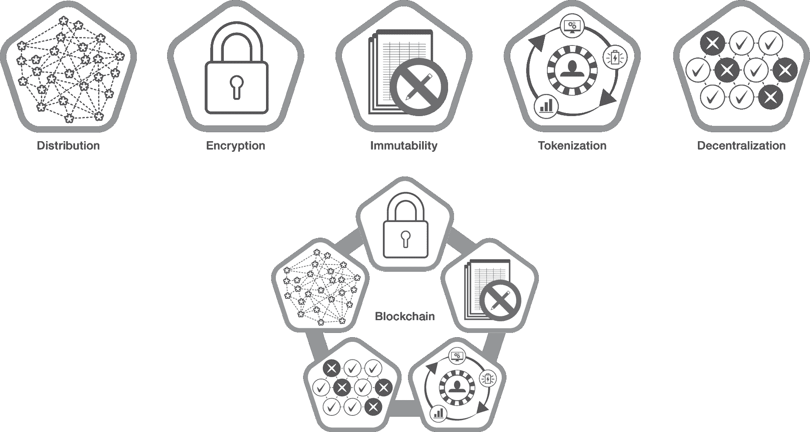
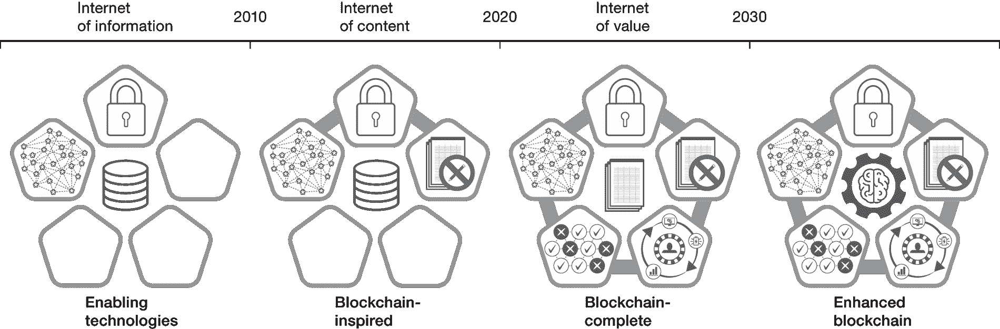
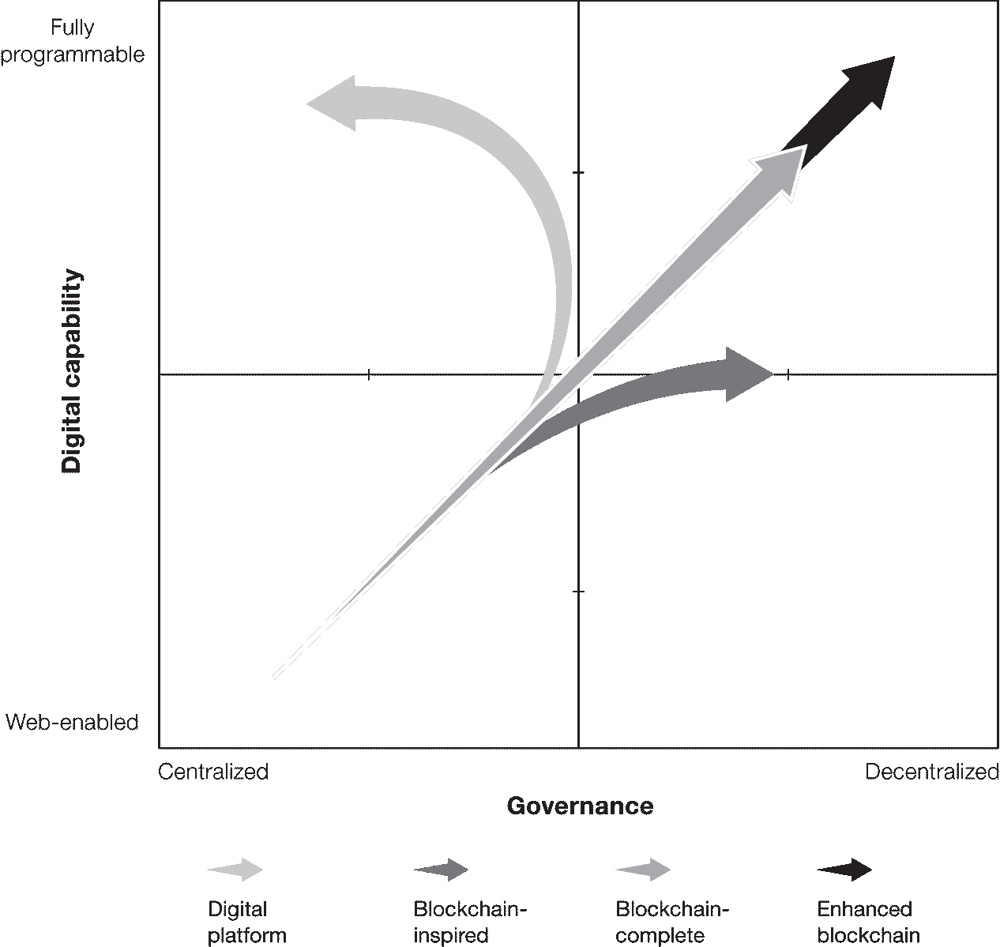

# 第一章

# 区块链的真正商业

在最近一次飞往迪拜的航班上，大卫坐在一个欧洲公司的首席执行官和董事长旁边，该公司正在投资区块链。在八个小时的飞行中，首席执行官谈到了如何将他家族企业从二十世纪的工业采矿公司转变为房地产开发商，然后再进入云计算领域，现在又进入了区块链领域。这个经典的创造性毁灭故事在组织内部执行，表面上看似乎是他这样一个老牌企业、有着悠久历史的公司最不可能的举动。

这就是区块链的魅力所在。它已经俘获了商业界的想象力。许多人将其视为在数字环境中带来信任和透明度的解决方案。通过这样做，它可以扩大贸易、开启新市场，并提供更好的工具来管理昂贵、不透明的流程，这些流程给公司造成了数百万美元的损失。这一承诺使得区块链成为了我们所在的全球研究和咨询公司 Gartner 客户中最受欢迎的主题之一。

金融、体育、医疗保健、零售、石油和天然气以及制药等各行各业的公司正在进行一系列区块链实验。他们希望解决诸如伪造和欺诈、由不透明或手动流程引起的低效率，以及数据质量和数据管理方面的长期挑战。初创公司也正在开发解决方案，例如，创新电影融资、社交媒体参与、酒店业和游戏行业。

在研究本书时，我们与一些组织进行了交流，以下是其中的一些：

+   澳大利亚证券交易所（ASX）和存管信托及清算公司（DTCC）正在开发区块链平台，以现代化资产清算和结算机制。

+   台北医学大学附属医院正在开发一种区块链解决方案，以方便跨机构访问患者记录，需得到患者的同意。

+   欧洲足球协会（UEFA），主办欧洲冠军联赛和欧洲杯足球锦标赛，正在与 IT 解决方案提供商 ELCA 合作开发一种区块链解决方案，以防止二级交易市场上售出的门票存在的欺诈和哄抬价格问题，并在比赛场馆保持安全监督。

+   大众汽车和雷诺分别使用区块链技术创建了一个不可变的“护照”，记录了车辆的历史和维护记录，以防止里程表篡改和其他成本高昂的欺诈形式。

+   德克萨斯州奥斯汀市正在创建一套身份证系统，以帮助无家可归的人们获得医疗护理和其他服务。

区块链的前景是很有根据的。我们与高德纳公司的同事合作，估计到 2030 年，区块链可能创造高达 3.1 万亿美元的新商业价值，其中一半将在 2025 年前出现，应用于运营改进。¹

然而，这些回报并非是免费的。我们这本书的目标之一是证实对于区块链所作的各种宣称，澄清什么是真实的，什么不是，并帮助您作为企业领导者了解为了获得您所分享的价值，您将不得不做些什么。因此，我们要强调的是，企业今天谈论和使用区块链的方式只是一个初步步骤。除了运营改进和效率提高之外，成熟的区块链解决方案将使您能够重塑业务关系，变现不太容易流动的资产，并以可能重新定义您的企业如何在数字世界中进行互动的方式重新分配现有的数据和价值流。这就是区块链的*真正*业务。

为了描述你如何开始解锁你在价值中所占份额，我们将首先澄清区块链是什么以及它能让你做到什么，而其他技术无法做到的事情。

## 区块链的五个核心要素

形式上，区块链是一种数字机制，可以在其中两个或更多参与者在对等网络中直接交换信息和资产，而无需信任的中介机构。区块链验证参与者，并验证他们拥有他们想要交换的资产以及交易是否可以进行。区块链将与交易相关的信息记录在数字账本上，每个网络参与者都会独立持有并更新其副本。记录是不可更改的、时间戳的、加密的，并且以区块链上的块相互连接；每个区块是大约两千个交易记录的集群。账本随着参与者的交易而增长。

但非正式地说，这个定义意味着什么呢？这意味着你理论上可以与地球上任何地方的一个未知合作伙伴做生意，并以任何交易规模交易任何资产，而不需要律师、银行、保险公司或任何其他中介机构来确保你们两个都能履行承诺。这样的解决方案极大地扩大了一家企业可以交易的资产范围。这种安排还大大增加了企业可以直接交易的对象或事物，而无需第三方（它会分一部分价值）。

区块链将现有的技术和技术组合成了一个新颖的架构，由五个元素组成（图 1-1）。

1.  **Distribution**. 区块链参与者分布在彼此物理距离之外，并通过网络连接。每个运行完整*节点*的参与者都维护分类帐的完整副本，在新交易发生时更新。节点是参与者拥有或使用的设备，并配备以运行下文描述的共识算法。⁵ 任何参与者都可以审查分类帐的任何部分，但除非在规定情况下，不能更改它。

1.  **Encryption**. 区块链使用公钥和私钥等技术安全且半匿名地记录区块中的数据（参与者使用化名）。参与者可以控制他们的个人身份和其他信息，并在交易中仅分享必要的信息。⁶

1.  **Immutability**. 完成的交易经过密码签名、时间戳记，并按顺序添加到分类帐中。除非参与者同意需要更改，否则记录无法被损坏或者改变。这样的协议称为*分叉*。⁷

1.  **Tokenization**. 区块链上的交易和其他交互涉及价值的安全交换。这些价值以代币的形式出现。⁸ 数字市场可以更有效地运作，并需要为各种原因创建它们（代币化）。代币可以作为物理资产的数字表示，作为奖励机制以激励网络参与者，或者用于启用新形式价值的创造和交换。它们还允许个人和公司参与者控制他们的数据。

1.  **去中心化**。网络信息和网络操作规则都由分布式网络上的多台计算机或节点维护。在实践中，去中心化意味着没有单一实体控制所有计算机或信息，也不会规定规则。每个节点都维护着网络记录的相同加密副本。由每个完整节点操作的共识机制验证并批准交易。这种去中心化、基于共识的结构消除了对中央管理机构的治理需要，并充当了防止欺诈和不良交易的救济措施。

图 1-1

* * *

区块链的五个要素

* * *

这五个区块链的核心元素共同使得两个或更多不相识的参与者能够在数字环境中安全地进行互动。我们对这五个元素的坚持并非纯粹是言辞学。当一个区块链缺少其中一个或多个元素时，其价值会受到限制，甚至被抵消。

不过，对于这个问题存在相反的观点。新技术往往会经历一个时期，机会主义者试图以模糊或自私的方式来定义市场。将区块链描述为“数据库”的使用就是一个例子。区块链**不是**数据库。虽然供应商有时会错误地将其描述为数据库，但其机制具有几个关键差异。例如，与数据库不同，区块链不是信息的通用存储器。此外，区块链是不可变的；它不像数据库那样被读取、写入、删除和更改。最重要的是，虽然数据库可以分布到各方，但只有一个中央管理员控制它。在区块链中，管理是通过共识进行的。中央控制与区块链的核心理念相矛盾。

我们在其他环境中也看到了误导性的语言。一些供应商试图销售使用某些区块链启用技术和仅使用区块链设计元素的一部分的包或服务，这种行为十分猖獗。同样，一些精通技术的公司正在实施他们称之为“区块链”的解决方案，然后要求供应链合作伙伴与他们集成，作为将这些合作伙伴更深入嵌入其生态系统的一种方式。

区块链尚未成熟，组织尚不知道如何使用或从中提取价值。因此，许多组织只是尝试使用他们理解并具备管理技能的元素进行实验。因此，目前正在开发的所谓区块链解决方案大多仅使用了区块链的五个元素中的一部分，我们在本章开头列出了其中的一些。这些公司甚至可能根本不需要区块链来达到相同的目的。根据我们的研究，传统的数据架构在这些项目中的 85% 的情况下可能效果一样好，甚至更好。

## 区块链如何为您的业务释放价值

我们无法过分强调区块链可能带来的新商业活动量。要了解这个机会的意义，可以考虑一下当前由移动设备、GPS、物联网传感器（放置在物理环境中）以及其他数十种使数字和实物资产对网络环境可见的设备产生的数据量。这个设备网络几乎难以想象，每天捕获超过 2.5 亿亿字节的数据。¹⁰ 像您这样的领导人希望将这些新数据资产货币化，并与愿意购买的买家进行交易。

但是，您依赖于执行商业交易和管理风险的集中式基础设施——支付系统、保险、交付和物流服务以及法律合同——并不是为处理今天数字或数字化资产可能的机器对机器交易而设计的。数字交易不像模拟世界中的交易那样有最小金额限制。数据单位、加密货币、奖励积分以及资产的部分（而不是全部）只是数字化使之可交易的一些新价值形式。单独地，这些单位的价值可能低于$0.01，但它们可以以百万或万亿的数量进行交易。这些数字资产的蓬勃发展是一项大生意，在我们写这本书的时候正在迅速增长。亚马逊拥有一项流媒体数据市场的专利。数字行业如游戏正在采用微交易进行游戏内购买。而且，每天都有新市场形成，用于交易数据、单瓦特能源、碳信用等数字化资产。2017 年盛行的加密货币和首次代币发行（ICO）热潮——随后是一次深度崩盘和走向监管的运动——并没有削减对金融实验的热情。这种热情表明了通过区块链来为数字机会进行融资和捕捉数字机会的令牌驱动型商业模式的主流化。

传统的建立信任、身份和支付的集中式机制并不是为在分布式机器中心环境中自主处理以万亿计的微交易而构建的——它们不能处理这些交易，当然也不能安全有效地处理。企业需要一种不同的方式来处理新的数字资产和交互，而无需涉及可以收集交易中每个方的数据并获取价值一部分的中间人。您需要区块链。

区块链还可以重定向*现有*价值流。它通过减少对四种商业货币的控制权来实现这一点，这些货币由中央市场力量——包括大型跨国公司、数字平台和大型中介机构控制。这些商业货币是：数据、访问、技术和合同。我们在本书的各个部分都会重新审视它们。现在就足以说，数据是锚定货币，因为客户留下数据追踪，就像汉赛尔和他的面包屑一样。强大的市场中介，如大型零售商、金融服务公司、政府机构和数字平台，可以免费获取这些数据并分析它以改善用户体验和推动产品开发。能够以极低成本捕获大量数据并进行分析的组织因此在价值链中具有优势。

区块链开始打破这种优势，通过删除数据追踪。与搜索和与个人或组织互动时留下数据不同，区块链上与您和其他参与方相关的数据可以在特定设计条件下保持参与者控制并根据交易需要共享。这种控制权的转移防止了中央参与者捕获过多的价值份额并将其移出链外，或使用不当影响来引导客户行为朝特定方向发展。通过这种方式，区块链也为新竞争重新打开了现有市场。

## 超越炒作

创造新价值和释放现有价值流的潜力使得区块链成为当今最具革命性的技术之一。但从企业角度来看，目前的区块链仍然年轻且不断发展。它尚未在严峻的商业环境中证明自己，而且其中一些要素——尤其是去中心化和令牌化——足以让许多商业领导者停下脚步。更复杂的应用将通过对技术和使用该技术的企业的持续成熟和实验来实现。

与此同时，市场上流传着大量矛盾的信息。一方面，许多观察家称赞区块链是解决一系列棘手问题的*终极*解决方案。另一方面，我们听到一些企业启动了区块链试点项目，但无法将其转化为运营部署，导致成本节约或价值有限。将不切实际的期望和现实世界的失望与 2018 年的加密货币崩溃相结合，你就会得到我们至少自 2016 年以来一直在预测的情况。用 Gartner 的术语来说，区块链正在向“幻灭低谷”迈进，或者更口语化地说，是区块链的冬季。¹²

区块链技术目前处于演进阶段，被大肆宣扬一段时间然后经历了几乎完全的反弹，在此期间，人们将高期望视为炒作，导致其滑入低谷。对于那些有潜力解决各种复杂问题或创造巨大价值的技术，这种反弹可能尤为强烈。我们在 2001 年的互联网泡沫破裂以及近期企业在数字化转型方面遇到的挑战中看到了类似的热情消退。¹³然而，区块链技术必然陷入低谷并不意味着你应该减少对该技术的利用。相反，你现在应该更多地利用它。尽管人们对区块链的态度发生了变化，但其技术正在成熟，企业的应用案例开始显示影响。在这个不断成熟的时期，你将更容易找到解决*真正*问题和发挥技术潜力的应用案例和设计要素。幻灭低谷之后是生产力高原；冬天之后必将是春天。  

## 《Gartner 区块链光谱：绘制你的未来》

区块链将从今天的早期应用演进，实现其潜力，使各种新数字交易成为可能。我们创建了 Gartner 区块链光谱（图 1-2）来说明从 2000 年代末期开始的进化路径，当时许多区块链的使能技术已经进入主流意识，到如今仅使用少数元素的当前解决方案，再到区块链更长期的潜力，能够实现微交易并解锁数字价值流。该光谱反映了各个组织的经验，包括我们的数百个客户，他们从事区块链技术和设计原则的实际开发和应用。使用该光谱作为我们书中的指导框架，我们揭示了区块链将从今天的状态演变到 2030 年的状态。正如图中所示，我们预计这种演变将分为三个阶段。

图 1-2

* * *

Gartner 区块链光谱

* * *

### 第一阶段：区块链启发

区块链光谱的第一阶段开始于 2012 年后，当企业领导者通过概念验证和试点项目开始探索这项技术。我们预计这个阶段将持续到 2020 年代初期。受区块链启发的解决方案仅使用了五个元素中的三个——分布、加密和不可变性。这些解决方案通常旨在重新设计针对个别组织或行业的现有手动流程。一些知名的区块链启发式示例包括阿里巴巴开发的一种解决方案，用于促进澳大利亚和新西兰的牛奶产品以及来自世界各地的蜂蜜和葡萄酒的跟踪和追溯。全球航运和物流公司马士基也推出了一种名为 TradeLens 的区块链启发式解决方案，用于管理供应链中的文件流程。¹⁴

在   在区块链启发阶段开发的解决方案将专注于五个元素中的三个，其中有几个原因。这些解释归结为技术的成熟度，企业拥抱每个元素的准备情况，每个元素的实施易于程度（内部和外部），监管考虑因素以及处理已知和因此可信的有限一组参与者的倾向。

就区块链技术而言，每个基础元素——分布、加密、不可变性、代币化和去中心化——都有与之相关的一套技术，并且每种技术都有其自己的成熟路径。这些技术还需要以可扩展、可靠和安全的方式进行交互。尽管这项工作具有挑战性，但已经在积极进行中，Gartner 分析师预计，到 2025 年，企业级区块链的主要技术挑战将得到解决。与此同时，市场上有数百个实验正在进行中，但很少有完整的实施。据 Gartner 2019 年 CIO 调查的 2,871 位首席信息官（CIO）回答，只有 3% 的受访者表示他们的企业拥有活跃的区块链，并且处于运行状态，另外 8% 的受访者处于短期规划或试点执行阶段。其中几乎没有一项实施使用所有五个区块链元素。¹⁵

这个挑战不仅仅是技术上的。组织方面也存在挑战。要想从超越区块链启发阶段的效率和流程改进焦点的区块链解决方案中获益，组织必须拥抱去中心化，这是五个要素中最困难的一个。去中心化意味着区块链网络中的每个完整节点对参与者和交易是否有效都拥有平等的投票权，并且每个节点都可以访问并拥有对账本的完全查看权。许多商业领袖对完全透明的概念（尽管是以加密形式）以及让代码行执行业务决策感到困扰，尤其是如果这种执行超出了他们的全面控制。技术基础设施提供商和市场中介助长了这些恐惧。这些行为者通过集中化技术和流程赚钱，并且有利益关系让你继续使用他们的方法。

区块链的技术不成熟，再加上许多组织内的保守主义，导致目前市场上存在区块链启发解决方案在*集中式*环境中的需求。您可以通过*封闭*、*私有*、*许可*、*企业*和*专有*等词来识别这些解决方案。一些解决方案也包括代币，但以有限的方式。根据定义，区块链启发系统是中心化的，因此不能允许数据和其他形式的资产进行无中介的交易。¹⁶

### 第二阶段：区块链-完整

区块链完整解决方案提供了区块链的全部价值主张。从受区块链启发的解决方案中的重大升级来自于在使用智能合约的分散环境中运作的代币。代币化使您能够创建新资产，并以可以自主交易的形式代表非流动资产。分散化使用共识来验证潜在的不受信任的用户、资产和交易，并确保没有中央提供商可以拥有或控制这些资产交易的基础机制。通过分发、加密、不可变性、代币化和分散化的五个要素部署，区块链完整解决方案使得以新形式的价值进行交易成为可能，并解锁了现有形式的垄断。

目前我们所知的很少有主流企业或政府正在构建完整的区块链解决方案。然而，许多初创公司正在这样做，其中一些公司将在 2020 年代初获得市场动力，在 2025 年后更多的规模将显现出来。尽管不是立即的，但完整的区块链解决方案的普及将推动组织探索比他们现在拥有的更大程度的分散化运营的新方式。

### 第三阶段：增强的区块链

2025 年后的某个时候，诸如物联网（IoT）、人工智能（AI）和分布式自主身份（SSI）解决方案等互补技术将融合并与区块链网络更加集成。所得到的增强型区块链解决方案将扩展可以令牌化和交换的价值类型，并将使更多的较小交易能够发生并受到智能合约支持，而这在传统机制下是不可能的。增强型区块链最终将允许多个自主计算机化对象之间在没有人类干预的情况下进行微交易。从这些能力中，新的市场将出现，以货币化以前无法货币化或流动性不足的资产，例如知识产权（IP）、数据、实物对象和其他高量或高价值资产。

分布式、自主身份解决方案将为增强区块链网络带来特殊的好处。这些技术允许参与者将其个人数据安全地存储在数字钱包或其他存储机制中，并根据为此目的设定的规则分享数据。（参与者还将能够通过同意将他们想要与第三方分享的个人数据令牌化，以在区块链完整解决方案上选择性地分享数据。）与人工智能结合使用时，自主身份动态地强制执行数据所有者设定的规则，并在数据可以被分享或使用之前自动要求所有者的同意。一旦他们同意分享他们的数据，参与者还可以追踪和记录谁看过它，以及谁使用过它。这种透明度使个人数据的使用能够更广泛地实现货币化和问责，同时确保隐私。

随着增强型区块链解决方案带来新形式的价值，企业也将通过去中心化的运营结构创新新的商业模式。组织将在技术上能够将经济决策委托给“事物”，这些“事物”将按照在区块链上运行的智能合约中定义的条款自主行动。这些增强型事物可以将人类从交易中移除，并最终将区块链网络转向完全自主的交易，最终建立去中心化自治组织（DAO）。

嘉纳（Gartner）区块链光谱阐明了区块链采用将如何随着时间推移而演变，以包括去中心化作为设计元素。这种演变将为您的行业和组织开辟一条新的数字化道路。

## 可编程社会

区块链——以及业务——的发展，关系到您参与公平且可访问的数字化经济和社会的能力。在这样的环境中，各种各样的企业、个人和事物以自己的条件相互交互、运作、盈利并创造价值。这个世界并非既定结论。

图 1-3 展示了当今日益技术化的世界中的方向选择。*y-*轴代表着不断发展的数字能力环境，从网络化到完全可编程化。*完全可编程*意味着智能物品或自主代理已获得法律授权，能够独立决策生产或消费资产。以一个简单的例子来说明，一个可编程建筑中的传感器可以决定房间所需的照明系统的能量量，然后可以从管理邻居屋顶上安装的微风力涡轮机的传感器中“购买”所需的能量。在完全可编程的环境中，这些价值交换可以在有或无人参与的情况下进行。*y-*轴是与区块链无关的。随着物联网、人工智能以及边缘和量子等先进计算范式的日益主导，无论有无区块链技术，企业和社会都将变得更具可编程性。

图 1-3

* * *

数字能力和去中心化程度的规划

* * *

*x* 轴代表从治理结构的完全集中到完全去中心化的连续体。连续体的概念至关重要，因为去中心化本身就是一种动态条件，即使在区块链中也是如此。某些行业及其相应的企业由于其结构而高度集中化。其他行业则自然更为分散。即使存在这种变化，沿着 *x* 轴的任何显著移动都依赖于区块链，因为希望在去中心化治理下进行数字化转型并运行的组织 *需要* 区块链或其他形式的数字账本技术，以允许包括自主事物在内的所有经济参与者相互交易并获得应有的经济回报。只有由区块链 *启用的去中心化* 才能在网络环境中实现无中介的交易。

因此，尽管图表描绘了四个象限，但随着可编程性的不可避免增加，组织在方向选择上实际上受限于两种选项：组织将要么向北移动，在集中化治理下变得更加数字化，要么向东北移动，在去中心化治理下变得更加数字化。

过去二十年来，主导的重点一直是推动“数字转型”。从图 1-3 来看，这一进程将组织从左下角向北移动——在那里，大多数行业中的大多数业务运作方式相对集中且大部分为模拟。尽管一些传统企业已经从这种方法中获得了积极的成果，但更多的组织在实现当前模式的数字化转型价值方面却面临困难。传统基础设施、投资、流程、合作伙伴、组织文化、利润模式以及这些企业的其他方面都是竞争优势的来源，但也极其难以调整，否则会危及关键关系和当前收入来源。由于数字原生平台没有这些限制，它们可以占领西北象限的领地（数字化复杂、集中化的业务），并凭借这个位置吸引客户。多样化和相关的产品组合、直观的用户界面、简单的支付和便利的交付培养了客户忠诚度，进而实现进一步的集中化。为争夺同一批客户并采用相同技术的非数字原生平台缺乏数字原生平台享有的熟练技巧。

选择向北迁移的组织因此将会看到增加的可编程性，并且将继续沿着过去两十年来由少数大型、数字化能力强的企业（以及政府机构）控制的轨迹前进，这些企业使用我们今天依赖的日益集中的基础设施。允许数字化以这种方式发展将导致价值的超额份额流向少数强大的组织，包括大型数字平台、银行、保险公司、电信公司、物流巨头和中央政府。这些组织将无限制地控制在可编程世界中产生的数据和价值，使它们能够规定其他企业如何进入市场和技术以及如何受益的条款。绝对的控制将使这些可编程实体随着时间的推移变得更加集中。

或者，组织可以选择向东北方向发展，变得更加数字化和更加分散化。一些公司已经决定攻克东北象限，在市场上以相对分散化、数字化的商业模式竞争。我们说“相对”，因为商业的多方面性也意味着公司在某些方面可以非常集中，但在其他方面可以分散。一些公司在业务或经营模式的某些方面采用分散化的例子包括像 Zipcar 这样的共享汽车提供商，它实现了分散化的汽车所有权，以及 LO3 能源，它利用区块链支持个人能源生成和交换，无需中心化的公用事业参与。服装品牌，如 Betabrand 和 Everybody World，采用开放源代码和众筹产品开发模式。而来自 Kickstarter、Indiegogo 和 Ulule 等众筹平台的资金为独立创业提供了分散化的融资。[¹⁸]

随着世界变得更加可编程，有以下可选路径：向北移动，直接与数字原生平台和其他中心行为者竞争；向东北移动，你可以绕过数字原生平台和其他集中力量，制定新的参与条款。沿着这条东北路径，首先是设计有五个定义要素的区块链完整解决方案，后来是构建在包括“事物”作为参与者并在设计协议中使用人工智能的网络上的增强型区块链解决方案。[^f]

## 沿着分散化的轨迹前进

区块链完整和增强的解决方案设计中固有的基于共识的决策制定概念与大多数组织和商业领导人相抵触。你和其他领导者可能会被诱惑仅仅将精力集中在受区块链启发的阶段上，从而限制了你们的活动范围仅限于图 1-3 东北象限的边缘，并忽略了光谱的后续阶段。

然而，我们鼓励您在尝试受区块链启发的解决方案时保持长远视野。我们将沿着去中心化的连续体移动的选择定位为您在一个日益可编程的世界和社会中面临的选择，但我们并不认为每个可用的选项都同样具有吸引力。数以百万计，甚至可能是数十亿的互联网节点和网络化对象在过去的两个十年中一直在捕获通信；记录对话；跟踪活动和交易，关系，使用的对象以及全球数十亿个网络化人类和组织正在考虑的对象。越来越多的公司和政府不仅仅是收集这些数据，而且还在解释它，将其传播回去，对人们进行推动，并影响他们的行为。

这就是现实——我们的现实。全球只有少数几个组织拥有大量的客户和公司数据。我们把数据交给了它们，以换取额外的便利和酷炫的新设备。它们不需要像大哥那样险恶的目标来集中这些资源，这样的中心化行为就已经会带来不吸引人的经济和社会后果。

我们的经济和社会在未来几年不会变得不那么数字化和可编程。相反，它们正在朝着继续采用人工智能和持续扩展物联网的路径前进，以至于几十年内几乎每一项资产、环境、流程和交互都将完全可编程，就像艾伦·图灵在五十多年前所描述的那样。现在你需要决定你想生活在怎样一种可编程社会中。你想要一个由少数人控制交互、交易和与之相关数据的社会吗？还是你想要一个拥有广泛访问、隐私、参与和价值交换的社会？

后者的社会需要 embrace 区块链，并最终采用所有五个元素。要构建这样一个社会，你和其他商业领袖必须积极合作，重新构想你的企业，使其成为更加动态和日益自主的网络参与者。当你们交换价值的方式与我们生活的越来越智能和物联网驱动的环境相一致时，你、你的组织、经济、商业社区和社会都将受益。

## **你真正的商业视角**

### **你学到了什么？**

区块链是一种让网络中的两个或更多参与者在不需要第三方中介的情况下交换资产的计算机化方式，第三方中介将获得一部分价值。我们定义的区块链包括五个核心元素：分布、加密、不可变性、代币化和去中心化。这些元素共同创造了一个值得信赖的环境，可以创建和共享价值。这些元素在实施难度上并不相等。去中心化是最具挑战性的，因为它还需要在业务层面上 embrace 某种程度的去中心化治理。

### **你应该怎么做？**

作为一名领导者，你应该制定一个愿景，看看增加分权如何有利于你的业务。随着所有五个元素的区块链完整解决方案开始在 2023 年左右获得市场支持，时间非常紧迫。稍微远一点的未来是一个包括物联网和人工智能的未来业务和社会环境，在这个环境中，自主和智能的物品拥有资产并交易价值。你需要知道如何准备通过物联网和人工智能进行互动，而不需要一个中心化的参与者来调解你的互动。

### 接下来会发生什么？

区块链的发展不容忽视。在过去几年中，Gartner 进行了数十次案例研究访谈和数千次客户咨询，显示出各国、各行业、各政府、企业和消费者正在采取步骤来了解其使用和应用。这项技术的影响将是巨大的。你必须决定你将以何种方式参与。让我们开始深入探讨当前受区块链启发的光谱阶段。
