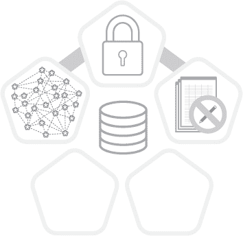
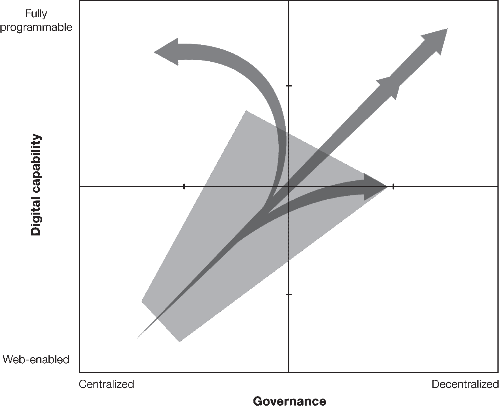
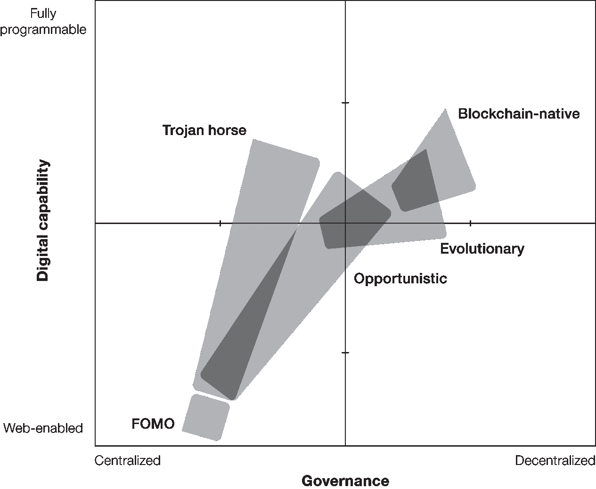
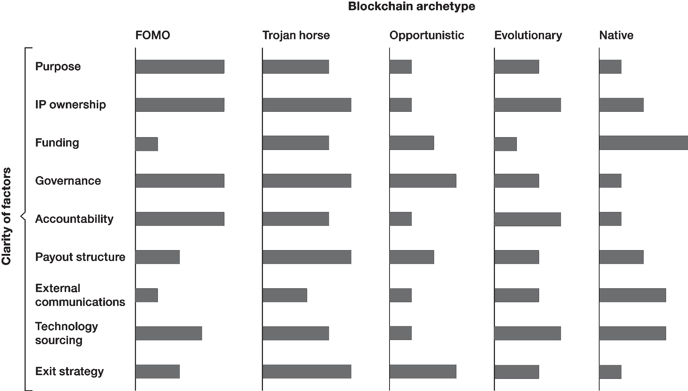

# 第一部分

# 启发于区块链的解决方案

# 第二章

# 寻求价值

启发于区块链的解决方案包括区块链的五个设计要素中的三个：分布、不可变性和加密。组织正在使用这些解决方案来改善记录保管和透明度，并现代化繁琐或手动的流程，包括跨企业边界的流程。到 2023 年，在现有组织内被称为“区块链”的解决方案的大多数将是启发于区块链的，并且是为了实现这些目的而开发的。

应用在正确的情境中，启发于区块链的解决方案例如能够提高效率；降低后勤成本；加快确认、结算和可追溯性；以及提高数据质量和管理。¹符合这些标准的一个潜力巨大的解决方案的例子目前正在澳大利亚证券交易所（ASX）开发中，用于取代其 25 年历史的清算所电子登记系统（CHESS），这是一个记录股份、管理股票交易，并在人们将金融产品卖出获得金钱时促成所有权或所有权交换的计算机系统。今天，CHESS 每天处理多达两百万笔交易。²该系统是一台真正的工作马，但在技术世界里，25 年是很长的时间。ASX 的首席信息官丹·切斯特曼（Dan Chesterman）解释说，他在 2015 年得出结论，认为交易所已经达到了改进 CHESS 能力和效率的自然极限。³

坚持现状不是一个选择，鉴于 ASX 面临的机遇和挑战。CHESS 采用专有的消息传递协议，这使得 ASX 难以吸引来自亚太地区和中东的上市公司。澳大利亚政府还在股票交易的清算和结算领域开放了竞争。⁴ASX 在澳大利亚没有一个可信的竞争对手，但技术进步可能会改变这一情况。因此，该组织需要一个新系统来维持其在澳大利亚的地位，并成为大陆以外的可行全球合作伙伴。2016 年，ASX 提出了用“分布式账本技术”（DLT）解决方案替换 CHESS 的路线图——换句话说，CHESS 作为一个有权限的区块链。⁵然而，路线图还规定了 ASX 将为不想使用 DLT 功能的生态系统参与者构建一个 ISO20022 消息传递选项。通过这一宣布，ASX 确立了自己作为首批希望利用区块链技术进行其关键任务的金融结算系统的国家证券交易所之一的地位。

ASX 和其他正在开发受区块链启发的解决方案的人看到了使用这种新技术的好处，即使没有代币或去中心化作为设计的一部分。ASX 计划首先从股票开始，将其他证券资产类别和新产品纳入其中。最终，这个愿景可能成为彻底改革澳大利亚市场和其他市场的一个基石。然而，也存在风险。我们在本章中为您澄清了这些好处和风险，并为您提供了评估您所看到的市场解决方案的工具。

明确地说，我们坚信受区块链启发的解决方案并不能实现我们对区块链真正商业的全部承诺。尽管如此，这些解决方案也并非毫无价值。对于正确的应用和背景，它们可以在文档管理、可追溯性和防止欺诈等方面实现改进，并创造其他效益。通过使用受区块链启发的原型分类法，我们讨论了如何区分高效益解决方案和低效益解决方案的方法。但在我们描述这些原型之前，让我们重新审视区块链启发的解决方案中的中心化问题以及它如何影响形成区块链启发的利益风险计算核心的四种商业货币（数据、访问、合同和技术）。

## 区块链启发的解决方案的商业货币

总结一下，四种商业货币是数字环境中价值和竞争优势的主要来源，不仅仅是区块链环境。在最简单的互动中，用户通过透露自己的兴趣和习惯的细节“支付”以免费访问软件或数字解决方案；数字平台则利用这些数据吸引广告商，开发新产品和功能，并越来越多地引导客户采取某些行动。用户和数字平台提供商之间没有明确的多边合同意味着提供商可以收集多少数据以及何时何地多频繁使用数据都没有限制。

所有中心化的数字平台都对其运行的数据施加控制。这意味着受区块链启发的解决方案也像数字平台一样对数据施加着中心化控制。此外，因为受区块链启发的解决方案并非设计为去中心化，它们实际上是以某种程度的中心协调和网络管控进行操作。中心化是通过将数据库管理机制的某些方面作为信息架构的一部分来实现的；数据库机制决定了哪个实体充当交易认证者和验证者，从而决定了何种内容被写入分类帐。尽管，正如我们之前解释的那样，区块链不是数据库，也没有中央权威，但受区块链启发的策略模糊了这些区别。有人会说“中心化的区块链”是一个自相矛盾的说法，并且包含数据库的区块链根本就不是区块链。尽管忽略了这些语义争论，我们称这种利用数据库技术的解决方案为 *受区块链启发的*。⁶

最重要的是，中心化解决方案具有单一权威，并且不使用去中心化共识算法来验证参与者的身份和认证交易。此外，具有单一权威的中心化架构为网络造成了单点故障。简单来说，关于区块链比传统数据架构更安全和可靠的承诺都是不真实的 *如果设计是中心化的*。安全性也不是唯一需要考虑的因素。没有代币化和去中心化共识，受区块链启发的解决方案无法让彼此不了解的参与者在无需第三方验证的情况下交换价值。

区块链解决方案的所有权成为了一个主要问题，特别是对于受到集中控制的解决方案。对于像比特币这样的去中心化区块链，不存在所有者，并且任何希望参与并且有能力参与的人（匿名地）都可以自由访问。相比之下，受到区块链启发的解决方案通常只有一个所有者或一小组所有者，并且只有被邀请的各方才能参与。因此，区块链启发的解决方案也被称为*封闭的、私有的*或*受权限控制*的区块链网络。

这些技术和业务控制的动态直接影响了一个给定解决方案能够实现的竞争机会和威胁。图 2-1 重新介绍了图 1-3，该图展示了业务环境中数字化或可编程程度与去中心化程度之间的关系。在图 2-1 中，区块链启发的解决方案由阴影区域表示，其边界清晰地基于集中控制的程度。

图 2-1

* * *

区块链启发的利益区域

* * *

这个图表提供了对于区块链集中化意味着什么的战略视角。任何一个受到区块链启发的解决方案都将在数字化程度和去中心化程度方面占据一个较小的领地。一些区块链解决方案，比如 ASX 及其 CHESS 替代方案，提供了一个高度受控、中心化运营和管理的解决方案来解决市场问题。做出这个选择的理由是合理的。正如切斯特曼在 2018 年澳大利亚 Gartner IT Symposium/Xpo 上的一个现场对话中所解释的那样：“我们并没有解决信任问题。人们本能地相信 ASX 是 CHESS 中数据的真实来源。我们解决的是一个数据同步性问题。”

其他由一家公司或一小群公司主导的解决方案可能旨在控制价值链中的其他参与者。最终，一些解决方案希望随着时间的推移逐渐向去中心化的协作模式发展。这种区别通常可以从解决方案在四个商业货币中的交易方式中看出来。让我们详细分析每一种货币，并着眼于它在区块链启发阶段的运作方式。

### 数据

数据在区块链的各个阶段都是一种重要的货币，但在启发阶段最容易受到威胁。⁷特别是对于旨在促进价值链中跨组织互动的区块链启发解决方案而言，这种脆弱性尤为明显。如果您的组织参与了其中的某个区块链，并且该区块链的治理允许单个参与者或子群体访问或控制通过它流动的所有数据，那么您可能会暴露您的业务信息，而得不到相应的洞察力或价值回报。

为了说明我们的意思，我们将以区块链合作项目 TradeLens 为例。这个项目由航运巨头马士基和全球科技公司 IBM 于 2018 年 8 月推出，旨在简化供应链行业的信息共享。⁸马士基负责 TradeLens 合作业务发展的丹尼尔·威尔逊告诉我们，这个解决方案是在对物流行业的数字化解决方案进行更广泛探索的基础上产生的。“我们行业急需数字化转型，以确保所有参与者拥有可靠和可预测的信息流。我们认为区块链平台至少能在一定程度上解决这些痛点。”

作为背景，地球上有超过五千艘集装箱船航行，其中一些船舶携带着多达二万个集装箱的商品。⁹航运业需要严格的记录来管理这些货物，但其中大部分记录仍然以纸质形式存在。如果文件不完整、用错语言或遗失，货物可能会被扣留，造成额外的成本。

TradeLens 旨在通过在受区块链启发的平台上捕获必要的航运信息来数字化流程，使交易中涉及的参与者在需要时可以访问记录。2018 年 8 月推出时，TradeLens 网络已拥有超过 100 家全球物流部门参与者，到 2018 年 10 月，该平台已处理了 1.54 亿个航运事件，每日交易量达到 100 万。马士基报告称，已入驻 TradeLens 参与者的网络占全球可寻址航运市场的 20%，推动者强调区块链将能够将运输管理时间削减 40%。¹⁰

承诺已经存在。然而，集中式的方法让一些行业参与者犹豫不决。例如，德国运输公司 Hapag-Lloyd 的高管公开表示他们抵制参与由竞争对手拥有和控制的平台。“从技术上讲，这个解决方案可能是一个好平台，”首席执行官 Rolf Habben Jansen 说，“但它需要一种治理方式，使其成为一个行业平台，而不仅仅是马士基和 IBM 的平台。而这正是我们当前许多这些倡议所存在的弱点，因为每个个体项目都声称提供一个他们自己控制的行业平台。这是自相矛盾的，如果没有共同的解决方案，我们将浪费大量资金，而这对任何人都没有好处。”¹¹

当我们问及威尔逊关于治理问题时，他说，“行业内许多人的观点是，拥有一个促进信息共享标准的平台将是一件无可挑剔的好事，但他们对治理模式表示担忧。在过去的十二个月里，我们已经根据行业反馈改变了治理方式。我们在倾听市场的声音。在技术方法上，我们没有听到任何负面的反馈。”

关于技术，威尔逊补充说，“我们正通过各种论坛讨论标准。我们使用开源技术；所有数据结构都是公开的。其他人可以采用同样的技术并建立自己的平台，但他们为什么要这么做呢？价值在于将所有信息集中在一个地方，做到一站式服务。”

与此同时，一家竞争对手的航运行业区块链解决方案已经宣布。全球航运商务网络有九家航运行业签署方，包括中远和上海国际港务。该网络宣布其意图开发区块链解决方案，尽管解决方案在实践中的具体形态尚不明确。¹²

Hapag-Lloyd 提出的数据访问和商业顾虑适用于任何建立在集中式技术治理和中央所有权基础上的解决方案。对信息密集型解决方案而言，这些顾虑会变得更加严重。当启发区块链的解决方案允许一家拥有卓越人工智能分析能力的大公司查看和访问数据，并影响系统中的所有参与方的数据流时，好处可能会不成比例地流向该参与方，并且这种差距会随着时间的推移而加剧。启发区块链解决方案中缺乏代币也加强了权力的集中化，因为没有机制允许参与者控制他们的信息、提供同意或将其作为资产交易。

因此，当我们说数据是一种货币时，我们指的是受到区块链启发的解决方案的形式、所有权和治理结构可以使参与者对其输入的数据拥有更多或更少的控制权。在您签署此类解决方案之前，请了解您正在“支付”的是什么以及如何支付。

### 访问

拥有区块链启发解决方案的企业控制对流程或市场部分的访问。希望参与的企业通过费用或订阅明确支付该访问，但他们还通过将自己锁定在解决方案中或暴露其竞争信息而隐含地支付。

相比之下，在区块链完整解决方案中不存在许可访问的概念。任何参与者或节点都可以加入区块链点对点网络。事实上，区块链设计更偏向于参与，因为当涉及更多节点时，基于去中心化共识的决策制定变得更加强大和可信。访问和参与定义了基于透明度驱动遵守规则的理念。这一概念类似于 eBay 早期使用会员评论来允许人们指出未能遵守拍卖条款的投标者或销售者。让它变得开放、透明和负责，每个人都会友好相处。

开放访问的理论优势是明显的，但现实情况更加复杂。对于许多习惯于在其组织内外看到边界的领导者来说，开放访问是一个具有挑战性的概念。对于他们来说，受到许可访问、定义了互动和已知参与者的区块链启发解决方案更加熟悉和舒适，可以在其组织内立即应用。

然而，在这些熟悉的领域存在风险。将区块链启发的解决方案发展到极端时，是在利用稀缺性而不是可用性。解决方案的创建者使这些形式的区块链变得有用，以便“客户”和“合作伙伴”看到短期利益。但在适当的情况下，这种“价值”可能是被迫的。例如，一个重要的客户或渠道合作伙伴可能会将参与其中心化控制的区块链作为持续合作的条件。在这些情况下，访问区块链解决方案将意味着访问市场。如果你拒绝，你将失去与最终客户联系的能力。

### 合同

合同规定了做生意的条款和条件。在区块链中，这些条款被捕捉在区块链技术本身中，可以是*智能合约*——捕捉和执行区块链的商业规则和协议的代码行——或者是在底层技术栈中。这些规则允许区块链在没有人类干预的情况下执行交易。

但是谁来定义这些规则，谁决定对它们进行修改？如果一个参与者定义规则并拥有区块链，那么有理由谨慎对待。相反，如果决策是基于社区的，智能合约及其维护是透明的，它们可能作为平衡力量，使规则及其后果可见。因此，你需要了解智能合约的来源，谁负责相关代码的维护，以及在发生错误时谁承担责任。智能合约及其执行的规则绝不能被视为技术问题。这是一个商业问题，因为对合同的控制意味着对区块链产生和交换的价值的控制。

### 技术

技术领域正在进行一场激烈的战斗，以定义用于构建区块链解决方案的主导系统。赌注如同过去一样高，参与者既有熟悉的（IBM、Oracle、Intel、SAP、Microsoft、Samsung SDS 等），也有新面孔（以太坊、R3、Quorum、NEO、Digital Asset、Fisco 等以及其他可能的平台超过一百个）。熟悉的竞争者通过坚持权威来源与开源、稳定性与灵活性等旧观点来宣称自己的权威。供应商们全力争夺企业区块链预算。一些公司已经针对常见行业问题设计了特定解决方案。其他则声称他们可以构建任何东西。

许多已经投入使用的解决方案都是过渡性的；它们的主要目的是满足当前的需求或机遇。它们应被视为学习平台，而不是长期解决方案，因为区块链技术不断演进和成熟。区块链技术的不断成熟至关重要，尤其是对于受区块链启发的解决方案，因为采用集中治理构建的解决方案后期几乎不可能（或不能）轻易分散化。为中心化架构设计的技术无法用于去中心化，并且供应商也没有激励去实现这一点，尤其是如果区块链使用*他们*的系统和技术栈。从一开始就构建的开放解决方案能使您更快地进行升级，并随着时间的推移朝着去中心化发展。

## 区块链启发的原型

四种商业货币为评估目前正在开发中的数百个基于区块链的解决方案提供了一个视角。 解决方案如何处理数据？ 谁获得访问权限？ 谁定义合同？ 谁开发技术？ 对这些问题的回答阐明了来自交易伙伴或供应商提供的区块链解决方案中的利益和风险的平衡。 了解这些答案也有助于您提前决定您在构建或购买的解决方案中希望具备的特性。

鉴于我们在市场上看到的区块链活动激增，你会经常提出这些问题。 目前进行中的数百个基于区块链的概念验证、试点和实施在处理这四种货币方面存在差异。 鉴于这些差异，我们确定了五种基于区块链的原型（图 2-2）。 其中一些原型保留了随着时间推移发展为去中心化、通证化模型的可能性；如果设计原则允许，它们可以从基于区块链的发展为完整区块链。 其他原型则加强了与完整区块链解决方案不兼容的集中式运营方法。 采用任何新技术都存在风险，但采取第一步将使您受益。 为了帮助您决定如何行动，我们将更详细地介绍这五种原型。

图 2-2

* * *

基于区块链的原型

* * *

### 错失恐惧（FOMO）解决方案

在最近的对话中，克里斯托夫与一家汽车保险公司的领导进行了交流，他们希望开发一个用于处理汽车索赔的区块链解决方案，我们问了一个在这类客户互动中很常见的问题：为什么要使用区块链？领导们希望捕获和存储有关司机、车辆和事故环境的信息，他们相信这些数据可以通过更透明的流程简化事故调查。然而，他们描述的内容并不需要区块链。事实上，在这种封闭的集中化环境中，区块链可能比使用标准数据库和消息传递技术构建的替代方案更昂贵、复杂和风险更高。克里斯托夫告诉领导们他的想法，但他们耸耸肩，说他们的高层领导告诉他们要想办法使用这项技术。这家公司希望使用区块链更少反映了这项技术与问题相关性，而更多地是对组织跟上数字趋势的压力的反映。

我们经常听到一些组织开发区块链测试或试点项目，以解决可以用已建立的方法更好、更快、更便宜解决的内部问题。对于一些领导者来说，围绕区块链的炒作导致他们产生了隧道视野，使他们无法考虑其他替代方案。其他领导者知道他们应该比较不同的选择，但他们认为这样做没有价值；他们的老板在区块链恐慌的影响下说要么使用区块链，要么就滚蛋。正如一家地区金融服务公司的首席信息官在 2018 年参加了高德纳中东研讨会时告诉大卫的那样，“你不了解，我的 CEO 告诉我要做区块链。”

基于 FOMO 的区块链项目不太可能节约成本或创造价值。然而，它们并非毫无意义。探索像区块链这样的高级数字解决方案可能向市场传递一个信息，即你的组织具有创新性，并且紧跟时代潮流。这种信息可能会引起潜在客户的关注。它还可能迫使竞争对手出于类似的 FOMO 原因投入时间和资源。

然而，领导者需要警惕对区块链知识产生虚假安全感，并且谨慎控制他们在这类解决方案上的支出。如果一个项目未能产生价值，一些领导者会认为他们尝试了区块链并且失败了，而实际上是他们选择了错误的使用案例。过多的 FOMO 区块链会损害区块链在业务中的可信度。此外，当企业坚持在企业中预先实施区块链解决方案时，这些解决方案通常会给现有系统和流程带来负担，并且带来没有提高效率的额外成本。

### 特洛伊木马解决方案

对于这种原型，一个强大的参与者或一小群参与者开发了一种受区块链启发的解决方案，并邀请（有时要求）生态系统参与者使用它。这些解决方案从定义上讲是受区块链启发的，因为它们有一个单一的所有者或一小群相互认识的所有者。尽管一些提供中心化解决方案的提供者会使用诸如*去中心化*和*共识*（去中心化系统的特征）之类的词汇，但原型的中心化所有权强烈表明系统设计也是中心化的。

我们将这些解决方案称为*特洛伊木马*，因为它们看起来很吸引人。它们背后有一个备受尊敬的品牌支持，它们拥有看似强大的技术基础，它们解决了行业中已知的、昂贵且影响广泛的问题。然而，入场的代价是潜在的暴露专有数据、流程和商业活动，而没有同等获取这些信息的机会。从商业货币的角度来看，特洛伊木马解决方案要求参与者放弃对其数据和合同条款的一些控制，以换取进入市场和技术的机会。

沃尔玛的食品追踪区块链似乎属于这一类别。这一解决方案旨在跟踪农产品供应链。据报道，沃尔玛的动机是为了防止食源性疾病，并减少农产品污染造成的成本。在非区块链环境中，要找出造成污染的确切农场或加工厂可能需要数周甚至更长时间，并且在此期间可能有数十人生病。在 2018 年 11 月底发生了这样一起爆发事件，涉及罗马生菜，事件发生后超过一个月罗马生菜从商店货架上消失。这些事件浪费了无污染的农产品，并损害了品牌声誉。完整、可访问的记录将使沃尔玛等商店能够更快地找出污染源的起源，并在源头阻止它。

行业无可否认地需要更好的方法来阻止食品污染。然而，一旦供应链合作伙伴将其数据输入到中心化系统中，这些公司就有风险被锁定在与该系统共享数据的同时，却没有得到对这些信息的合理补偿。

特洛伊木马区块链类方案的潜在长期目标遵循市场重新中介化的路径，这是强大的渠道合作伙伴自工业时代开始就已经开辟的路径。起初，这些主导型公司通过提供解决现有问题和接触所需最终客户的方案来鼓励交易伙伴参与。但一旦参与进来，参与者就会被锁定——平台所有者可以拒绝与他们做生意，除非他们留下或接受新的条款和条件。随着时间的推移，这些特洛伊木马可以分析平台数据，并将采购转移到网络中成本最低或最低杠杆的参与者。他们也可以逐渐向生产者施加压力，以提高质量，重新调整生产，并降低成本，使平台所有者能够吸引更多客户，从而鼓励交易量进一步极化。最初，客户将从更大的便利性、改进产品和更低的成本中受益。然而，最终，市场中的权力集中会减少竞争，这会使供应变得不太可靠、不太多元化、不太受客户选择的影响，而变得更加昂贵。直接说，特洛伊木马式的解决方案会推动更深层次的集中化。

### 机会主义解决方案

集中证券和清算公司（DTCC）是美国金融系统的交易后清算和结算中介。与澳大利亚证券交易所类似，DTCC 管理着交易后流程，并作为美国市场交易活动的单一记录来源。2006 年，DTCC 建立了一个名为交易信息仓库（TIW）的主机解决方案。正如 DTCC 的执行董事兼首席技术架构师 Robert Palatnick 所描述的那样，这台主机原本应该成为“信用违约互换的中央黄金记录。”

“2006 年解决方案推出时，主机处理了许多手工和纸质流程，” Palatnick 说。“但自金融危机以来，已经创建了许多交易所，场外交易量下降。随着主机需要升级和市场规模减小，我们发现成本太高。因此，我们与技术提供商、专家和客户一起，决定利用区块链做一些显著而有影响力的事情。” 公司目前正致力于使用分布式分类账技术和基于云的解决方案设计其 TIW。在我们与 Palatnick 交谈时，TIW 正在与十五家参与银行进行结构化测试，并管理着大约 10 万亿美元的未平仓头寸。

像澳大利亚证券交易所的 CHESS 替代方案一样，TIW 属于机遇主义的基于区块链的解决方案类别。这些解决方案解决了已知的问题或机遇，并且发起公司已经对使用未经测试的技术的风险、与其他技术选项相比的区块链成本以及可能获得的好处进行了资格认证。解决方案受到区块链的启发，但没有增加去中心化的路径（DTCC 等中央机构也不希望如此）。

机遇主义的基于区块链的努力通过改善记录保持或流程级效率提供价值。澳大利亚证交所也看到了将市场扩展到主要地理区域之外的客户可以带来额外价值的潜力。

组织也通过机遇主义的基于区块链的解决方案获得有用的经验。这些努力增加了技术和实施团队的可信度，并让每个人都有机会体验分布式数据共享的一些文化和技术挑战。

对于一家中东银行的前首席信息官来说，2017 年初启动区块链支付项目的机会主义解决方案的好处是值得付出努力的。该解决方案旨在连接一组特定的高交易量客户，这些客户位于不同的国家，可以在没有中介 SWIFT（全球银行间金融电信协会）的情况下执行跨境支付。然而，该系统在六个月后被下线。根据首席信息官的说法，缺乏投资回报率。计划使用该系统的一家大型海外合作伙伴的谈判破裂了，没有了这些交易量，该系统就不值得成本。

尽管如此，首席信息官对这次经历持积极态度。他说，他的银行对区块链作为特定用例的可靠性获得了信心，他的技术团队学会了如何构建和运营区块链系统。他补充说：“我们获得了如何运作的良好经验，我们花费了[很少的钱]，我们发现即使在最小的财团中工作也是痛苦的，并且我们的技术退出战略保持了客户体验。”他补充道：“这对银行来说是好的公关！”¹⁸

再次放在货币的角度来看，机会主义的区块链启发解决方案在数据和合同控制上会有一些损失。但正如银行首席信息官所承认的那样，这些解决方案确实在市场准入和技术经验方面提供了一些回报。

### 进化解决方案

当今区块链技术的技术不成熟使得在关键任务系统环境中实施完整解决方案变得困难。尽管如此，一些组织正在探索受区块链启发的解决方案，他们打算在技术成熟后将其发展为完整的区块链解决方案。为了保持未来过渡的可能性，所有者必须从一开始就做出使分散化和代币化成为可能的架构和运营决策，即使这些元素在初始部署中没有被使用。

瑞典建立区块链房地产登记册的努力提供了一个具有演进潜力的有用示例。在许多发达国家，私人公民将大部分财富储存在他们的房屋中，人们可以将其用作抵押品来获得低利息贷款。尽管房地产作为资产的经济相关性很大，但购买和出售房地产是一项繁琐的技术过程，形式受限。在交易点，业主、买家和房地产经纪人会交换大量文件，与贷款公司、银行以及参与验证所有权并审核合同和财务安排的法律实体共享这些文件。每个参与者可能会以数字方式收到、填写或审核文件，但是每个交易涉及的流程步骤和涉及的人员数量可能会延长几周甚至几个月，并在涉及纸质文件时引入错误。在“成交”后，文件提交给政府登记处后还会有额外的延迟，官员可能需要数周时间才能记录销售并发放正式所有权证书。这些时间延迟可能会带来高昂的成本，限制房地产市场的机会，创建许多并行且不一致的系统，并允许欺诈性所有者申请贷款或在他们不拥有的房地产上进行交易。

瑞典的 Lantmäteriet 是负责监管房地产的政府地图和土地登记办公室，正在测试区块链解决方案，以简化流程，可能每年节省 1.06 亿美元。它与 SBAB 银行、Landshypotek 银行、电信公司 Telia、管理咨询公司 Kairos Future 和区块链技术供应商 ChromaWay 结成合作伙伴关系。正如 Lantmäteriet 首席创新官 Mats Snäll 强调的那样：“目标是开发一个区块链账本，房地产交易将在其上进行，节点最终分布在生态系统中的各个组织中，并在理想情况下分散。”¹⁹ Lantmäteriet 区块链网络最终可能包括抵押贷款人、房地产经纪人、法律事务所、房地产经纪人、房地产开发商以及私人买卖双方。旨在实现比今天的房地产公开登记更高效、更透明的记录。

网络中的第一笔交易发生在 2018 年 6 月。在其初期，“受启发”的形式下，该系统作为一个封闭或许可网络运行在有限数量的节点上。每个房地产交易参与方使用单独的接口访问网络，系统使用一种包括中心管理数据库而不是账本的技术组合。最初的设计不包括数字代币。智能合约验证流程，但合约目前不是自动执行的：它仅验证交换是否发生；不执行交换。

瑞典土地测绘局在达到规模之前必须解决几个问题。一些问题是行政性的（例如，瑞典法律要求不动产交易使用墨水签名，而欧盟法律允许使用电子签名），一些是操作性的（不同的不动产交易参与方对参与的商业案例不尽相同，并非所有案例都一致）。区块链解决方案也可能引发文化问题。例如，客户可能需要一些时间才能接受去中心化的、数字化的不动产交易流程来交换他们的主要财富来源。还必须解决财务问题，例如谁支付解决方案的费用以及谁从中受益。最后，土地测绘局还必须考虑多方网络的监管治理。此外，一组银行和房地产公司正在开发一个竞争性的在线网络门户系统，可能会分割市场或成为更好的短期解决方案。尽管存在这些挑战，但区块链土地登记的倡导者声称该解决方案可能发展成一个以“无许可”方式连接生态系统中所有参与者的网络。在这样一个解决方案中的业务货币将以低到中等风险水平进行交易。

### 区块链原生解决方案

第五个也是最后一个受区块链启发的典型是“出生在区块链上的”解决方案。由初创公司或绿色创新努力开发的这些解决方案利用区块链作为基础要素，创造了一个新的市场或对现有业务模式采取了破坏性的方法。由于去中心化和代币化的核心要素尚未成熟，原生架构中的一些解决方案仍然受到区块链启发，但它们与现有企业环境的独立发展将使它们随着时间的推移逐步发展成为完整的区块链解决方案。

具有显著区块链原生活动的一个领域是高等教育。例如，Woolf University 是一个本地区块链实体，希望成为第一所区块链驱动的教育机构。由牛津和剑桥的一群学者创立，它立志成为一个非营利性的“无国界、数字化教育社会”，一个学位课程的去中心化 Airbnb。Woolf University 通过安全合同将教授与学生连接起来，并记录学习交流的记录，以便学生可以获得学分，教授可以得到报酬。 WOOLF 是智能合约中使用的本地代币，但教师可以选择用 WOOLF 或其国家的法定货币支付。Woolf University 将寻求欧盟认证，并计划于 2019 年全球推出平台。

本地区块链启发的解决方案将在传统行业中引入新的商业模式或方法。未经测试的技术将是主要的货币风险。这些解决方案将吸引那些希望控制自己数据并尝试去中心化的参与者。

## 区块链启发的去中心化路径解决方案

区块链启发式部署的五种原型清楚地说明了在区块链领域的广阔探索。每种原型背后的设计和商业动机决定了参与的成本以及你可以从中获得什么。基于 FOMO 的解决方案可能会提供一些学习的机会，但很少能够推动组织的数字能力或去中心化程度。特洛伊木马式解决方案在图 2-2 中将其参与者迅速带向北方，增强了数字能力，但在一个集中式模型内运作。机会主义解决方案将实施组织带向东北方向，但由于缺乏去中心化，它们遇到了硬性限制。进化和区块链本地解决方案在为组织做好去中心化和未来完全区块链部署方面具有最大潜力。

大多数能够在有限风险下获得可衡量价值的企业将以机会主义、进化论或区块链本地架构的原型实现这一目标。特洛伊木马式的区块链可能会引起市场关注并可能获得一定的市场份额，但不太可能为除平台所有者之外的任何人带来长期价值。如果时间和市场压力改变了特洛伊木马式的所有权结构，那么这些原型可能会向进化模型发展。

## 你真正的业务透镜

### 你学到了什么？

区块链启发的解决方案将在 2023 年左右主导市场。这些解决方案利用了五个关键区块链设计元素中的三个，并且通常解决了涉及企业内部或企业间数据共享和工作流的已知挑战。设计良好的解决方案将带来好处，但你需要权衡所涉及的风险和成本。因为区块链启发的解决方案缺乏去中心化作为一个设计元素，不相互了解的参与者无法在没有第三方验证的情况下进行交易或交换价值。相反，这些解决方案通常只有一个所有者或一小群所有者，并且会限制成员资格。在这种情况下，数据、访问、合同和技术等商业货币可能会由单一行为者或子团体控制，这取决于解决方案的设计和目的。五种区块链原型反映了不同程度的集中化：基于 FOMO 的解决方案（大多数内部项目）、特洛伊木马（例如沃尔玛）、机会主义解决方案（例如 ASX）、进化努力（例如瑞典的 Lantmäteriet）和区块链原生解决方案（例如 Woolf 大学）。

组织无法使用区块链启发的解决方案来创建或交换新形式的价值，因为新的数字原生形式的价值需要在去中心化环境中运行的代币。因此，区块链启发阶段不是终点，而是通往区块链完整阶段的中途站。

### **你该怎么办？**

作为领导者，您将希望将您的区块链开发与数据、访问、合同和技术的四个商业货币进行审查和基准比较，以了解中长期的价值主张和风险。与您的执行团队一起提出以下问题：您的组织将如何推进区块链计划？哪些原型最适合您的战略？您将如何管理您的商业货币？如果您已经参与了区块链试点项目、概念验证或完整实施，解决方案是否受到启发？如果是的话，网络数据存储在何处？谁有权访问？谁撰写了合同？

### 接下来是什么？

组织追求区块链计划，通过特定市场、地理位置或价值链内的合作伙伴关系和联盟努力进行内部使用。事实上，联盟一直是许多区块链活动的推动力。尽管与志同道合的合作伙伴分享风险的潜在好处，但联盟对组织也构成了重大挑战。您应该警惕将控制权让给强大的中央权力或竞争对手。是合作还是不合作？这是我们在下一章中要讨论的问题。

# 第三章

# 与敌人合作

联盟在区块链发展中扮演着至关重要的角色。就像他们帮助推向市场的受区块链启发的解决方案一样，联盟形式多种多样。有些联盟以真正的集体模式来使组织对齐，以追求共同的目标；而另一些则代表了一个单一、强大的实体的愿景，对行业下属施加影响力。尽管有些人可能将后者视为合作伙伴关系或联合企业，而不是联盟，但我们对联盟持有广义的看法，即任何一组公司或组织为实现个体成员无法单独实现的目标而努力。从这个角度来看，联盟在计划或开发中的大多数企业区块链解决方案背后都有着贡献。

区块链联盟作为解决行业问题或地理问题的开发者具有特殊的信誉。例如，考虑一下比利时的 Isabel Group 正在开发的解决方案。成立于 1995 年，由四家比利时银行组成的财团，每家银行拥有当前组织的 25％股权，Isabel Group 是一家技术服务提供商，负责管理多银行等活动，并提供解决方案以实现了解客户（KYC）合规性。 KYC 是一项旨在遏制洗钱的监管要求。 KYC 规则要求所有银行收集并定期更新参与金融交易的客户的身份信息。合规性可能会给银行带来数百万美元的成本，但并不带来竞争优势。Isabel Group 提供的其他服务包括在线身份管理、支付管理和安全保障。

典型的 KYC 实践要求每家银行分别从公司客户那里捕获信息，本地管理它，并定期更新它（通常是每六个月一次）。然而，由于公司可能与多家金融机构建立关系（有时可能有数十家），因此，这种方法在金融系统中造成了冗余，并导致不一致性，从而导致付款延迟或拒绝，并扰乱资金流动。² Isabel Group 认为，区块链可以提供更高效的替代方案，并正在构建一个受区块链启发的解决方案，旨在每个更新周期仅捕获和验证一次企业的 KYC 凭证，无论该企业与多少银行建立了关系。

Frank Verhaest，Isabel Group 的创新与区块链项目经理，在 2018 年 9 月与作者进行电话会议时，将该解决方案描述为企业的自主身份管理工具。³ 一旦其身份被捕获，这家将免费获得区块链解决方案的公司可以与其他银行以及保险公司或非银行支付提供商等第三方重新使用其记录，有效创建数字企业护照。这些身份记录可以使 Isabel Group 提供诸如电子发票和欺诈管理等补充服务。Verhaest 估计，KYC 功能单独就可以将比利时银行每年 3.35 亿欧元的 KYC 合规成本减少 50％。

这些数字很有说服力。但是，Isabel Group 需要区块链来实现这些吗？“对于这项倡议，我们本可以使用加密数据库，”Verhaest 承认道。“但银行认为区块链有优势，因为每家银行只能访问其自己客户的数据，因此，它在联盟中强化了更广泛的信任范围。”

Verhaest 的评论触及到了财团的好处和风险的核心。像你这样的领导者受益于分享思想，以及解决方案开发的成本和风险。然而，你也担心放弃控制权或将专有信息暴露给事实上是你竞争对手的企业。好处似乎在当前市场中获胜，导致了各行各业区块链财团的快速形成。作为一个领导者，你不能忽视这些财团对你行业区块链发展的影响。相反，你需要一个参与的策略：为什么要参与财团？何时参与财团？如何以一种既带来好处又限制风险的方式参与财团？在本章中，我们将为你提供回答这些问题所需的工具。

## 区块链财团：一个自相矛盾的说法？

对于许多区块链领导者来说，财团似乎与区块链自然契合。允许直接交易的点对点网络需要许多分布式节点运行强制执行网络规则的共识协议的弹性。作为多实体组织，财团可以从一开始就以核心参与者的核心量试点解决方案。如果设计为朝着去中心化的方向发展，这些解决方案将属于之前描述的区块链启发式解决方案的演进形式。

尽管区块链和财团之间存在明显的亲和性，但它们也有所不同。财团通常是为了整合市场资源以开发和推广标准操作程序而形成的。为此而形成的财团的例子有用于跨境支付的 SWIFT，石油和天然气行业的石油输出国组织（OPEC），农业市场的 Dairy.com，或者娱乐媒体领域的 Hulu。这些财团的存在是为了集中解决一个行业需求，有时以有利于大型、有权势的成员为方式来规定市场条件，这对于较小的参与者和整体经济影响参差不齐。这种集中化直接与区块链的承诺相冲突，即实现任何人的平等参与和获取。

当多个财团以不同方式专注于同样的问题时，集中化问题变得更加复杂。多个区块链财团试图解决 KYC 合规和贸易金融的挑战，例如。在 KYC 方面，有提到的 Isabel Group，以及由五家北欧银行共同开发的计划为第三方提供服务的北欧 KYC 服务公用事业公司。R3 也进行了 KYC 区块链试点，有三十九家银行在十九个国家运营。贸易金融方面的区块链财团包括 we.trade，Marco Polo，Voltron 和 eTradeConnect，每个财团都有略有不同的方法，取决于不同的区块链协议，例如 Hyperledger（Linux 的区块链分布式分类帐开源工具）和 R3 的 Corda（另一个开源区块链平台）。

如果多个财团专注于相同的问题并取得进展，对竞争的影响将会如何？从集中化的角度来看，仅有几个财团选项仍然会创造出一种保护现状的有限竞争环境。在这种观点下，区块链财团被视为是一种试图通过将参与者锁定到中央中介推广的受区块链启发的解决方案来保护市场力量的尝试。这是一种诱使不知情的领导者通过“礼物”承诺最终限制其独立性的区块链作为特洛伊木马模型。

另一种选择是财团之间的合作推动新的标准。没有中央机构的标准可能会鼓励市场进入，进一步竞争和创新，并为互连和去中心化系统奠定基础。根据这种观点，财团可以促进从受区块链启发到完全基于区块链，最终到区块链增强解决方案的过渡。他们将挑战现状。

区块链作为整合和区块链作为去中心化的两种场景都是可能的。一些财团将旨在集中市场力量，一些将随着区块链市场成熟而变得过时。虽然一些团体会合并（如 we.trade 和 Batavia），解散或陷入困境，因为他们无法解决治理和商业条件，另一些则会发展系统和策略去去中心化并发展成为完全基于区块链的⁶。在受区块链启发的阶段以及可能会持续下去的阶段，各种类型的财团都将成为无数倡议的中心。让我们来看看当今市场上形成的财团的种类。

## 将你的敌人拉近

据我们统计，2019 年有 100 多个专注于区块链的联盟，而且不断有新的联盟成立。联盟成员之间的联系各不相同，包括行业、地理、技术和业务关系。许多企业属于多个联盟。

### 行业中心联盟

一些最知名的区块链联盟是基于行业联系的。例如，总部位于瑞士楚格的能源网络基金会，致力于确定和开发能源供应链中的区块链应用案例。最初是一个欧洲项目的区块链保险行业倡议组成，旨在评估再保险行业的区块链创新。移动开放区块链倡议组织包括汽车价值链的成员，而区块链在交通联盟侧重于制定物流和运输行业区块链应用的标准。基于行业的联盟通常专注于一个共同的问题。它们聚集在一起解决行业特定的挑战，如 KYC、贸易融资、物流、认证和标准。在许多情况下，这些联盟还为讨论这些问题创建了一个开放的论坛。

### 地理联盟

一些联盟还专注于特定国家或地理区域的挑战。这些地理性联盟可能也与行业有关联。例如，Isabel 集团起源于比利时银行市场，但希望其区块链努力能帮助其成为一个泛欧洲的供应商。俄罗斯金融科技协会是另一个以国家为重点的联盟，是在俄罗斯中央银行的监督下形成的。该组织将其 Masterchain 区块链品牌化，据报道已在其上构建和测试了支付处理解决方案，以便通过绕过 SWIFT 网络的方式实现与欧盟内外的跨境支付[⁷]。俄罗斯金融科技协会突显了其他地区的联盟如何涉足地缘政治，例如最近在中国（金融区块链深圳联盟）、卢森堡（Infrachain）、日本（区块链合作联盟）和阿拉伯联合酋长国（全球区块链理事会）的联盟活动[⁸]。

### 以技术为中心的联盟

技术联盟以平台或其他技术方法作为解决方案开发的首要原则。由 Linux 基金会于 2015 年发起的 Hyperledger 和于 2017 年开始的企业以太坊联盟是技术优先的区块链联盟中最知名的两个例子[⁹]。两者的成立目标都是促进组织间的合作，并都提倡账本之间的互操作性[¹⁰]。

第三个以技术为中心的联盟是 R3，它是金融服务机构和技术提供商最初合作的产物。R3 是（现在的）开源 Corda 平台的创造者。作为 Hyperledger 项目的早期参与者之一，并且由于其金融服务行业的背景，R3 拥有一定的影响力。该组织已参与多个在金融服务领域内备受关注的概念验证和试点项目，包括与汇丰银行、荷兰国际集团和嘉吉合作，捕获和分享贸易融资信用证，以及与泰国银行和加拿大央行的合作倡议。¹¹ 然而，由于多方参与的企业规模实施极为困难，一些最初的 R3 联盟成员已经失去了信心并离开。¹² （同样，人员离职和换岗也影响了 Hyperledger。¹³）

### 业务流程联盟

业务流程联盟旨在开发区块链解决方案，以减少业务活动中涉及的成本、摩擦或风险。在海事行业，劳氏船级社已为 Maritime Blockchain Labs 提供资金支持，这是一个研究改善船员选择安全性以及改进船员文档和认证的联盟。¹⁴

蚂蚁金服与四家澳大利亚和新西兰食品生产公司合作，以及与中国的海关和物流公司菜鸟合作，提供了另一个以业务流程为重点的财团的良好示例。食品欺诈在中国一直是一个巨大的问题，因为该国的进口市场庞大且不断增长。例如，2008 年，三十万名婴儿喝了受污染的牛奶制成的奶粉后患病，其中六人死亡。蚂蚁金服拥有一个操作性的区块链溯源解决方案，该方案已在天猫电商平台上实施，适用于各种产品，包括进口奶粉和配方奶粉、蜂蜜产品、有机大米、葡萄酒和烈酒，截至 2018 年 11 月，已追溯超过 1.5 亿个产品。蚂蚁金服的一位代表在 2018 年 10 月向作者明确指出，“每个追溯的产品都会发放一个独特的区块链证书，允许消费者通过支付宝移动应用查看产品的来源、供应链和质量保证信息。由于追溯解决方案，小型生产商还可以将其产品与市场上的低质量仿冒品区分开来。”

## 为什么要成立财团？

区块链财团的成员通常围绕共同的利益进行合作——行业、地理位置、技术或业务流程。然而，这些利益显然并不是互斥的。例如，一个以金融为重点的财团也可能在特定技术上进行标准化。或者成员可能来自同一个国家，但有一个共同的目标，即为参与者实现地理扩张。

然而，对基本关注点或方法的一致并不足以激发长期合作。相反，区块链财团经历了很多变动。企业和商业领袖加入一个或多个财团，参与一段时间，然后再次离开，通常在几个月内加入另一个财团。合作的几个优势可能鼓励成员在长期内保持联系。

### 学习

企业领导人经常被激励加入财团交流想法和收集信息，有时甚至是为了收集竞争情报。尽管想法会自然地在公司之间流动，但财团使得这种分享更加高效，并使信息合法化。领导人还声称，加入财团可以为他们提供公关机会，以缓解组织中上级的 FOMO 压力。嗡嗡声，或者嗡嗡声的幻觉，为他们争取时间来深入了解他们公司的区块链的实质。

即使是强大的学习效益通常也不足以使领导人长期保持会员身份。当要求增加承诺时——例如，通过投资或整合到一个由财团建立的解决方案中——领导人可能会认为没有足够的直接利益来迈出下一步。那些保持参与的人通常是基于更可量化的好处。

### 区块链作为一个很好的谈资

一些行业的领导人经常有共同的经验和合作想法，但并不总能找到聚在一起分享的方式。特别是在高度监管的行业中，人们可能会犹豫与其行业内的其他人会面，因为这样做可能会使他们违反反垄断法。

“区块链让我们能够聚在一起交流，我们发现了一些数字化工作方面可以达成共识的领域，”挪威能源公司 Equinor 运营和技术卓越执行官 Rebecca Hofmann 说道。[¹⁸]她对区块链的初次接触是在 2014 年的一次会议上，能源行业的一些熟人告诉她关于成立一个能源区块链论坛以促进理解、合作和探索行业机遇的需求。在几个月内，Hofmann 成立了美国石油和天然气区块链论坛。现在的成员包括 Equinor、雪佛龙、康菲石油、埃克森美孚、Repsol、先锋自然资源公司和赫斯公司。

Hofmann 认为，区块链为企业之间开启了一种以往无法实现的方式，讨论区块链特定的和其他需求。“对我来说，”她说，“这比区块链技术本身更重要，尽管没有区块链，我们就无法一起聚在一起。”他们以前曾尝试过合作。“我们有许多非营利性的标准委员会试图为行业带来额外的效率，”Hofmann 说。“我们只是从未彼此信任过，所以各方之间的过程一直是零散的。我们都是竞争对手，但我们也是合作伙伴，我们身上有一种我们彼此不信任的污名。区块链承诺了一个中心化的信任因素。我认为这让人们能够说，‘哇，如果有一个地方，所有公司可以实时互动，我们都可以得到那一个真相的副本，并且我们可以信任那个来源，因为它是密码学上锁的，那就非常有趣。’这为我们开辟了一扇门，让我们说，‘让我们来谈谈这个。’”[¹⁹]

自 2018 年 2 月创立论坛以来，它已分为两个运营组：原始的美国石油天然气区块链论坛，重点是围绕能源行业的区块链技术进行持续学习和网络建设；以及 2019 年 1 月成立的 OOC 石油天然气区块链联盟，重点是共同开发区块链解决方案。当我们与霍夫曼交谈时，她提到的四个解决方案都专注于整合和改造油气行业的流程。在这个行业中，一些流程，如地震数据管理、卡车进场、支出批准、投票和合资企业结算交换，由于依赖纸质文件而高度分散。

能源行业似乎并不孤单地希望促进更好的协作和对齐机会。RCI 银行和服务的区块链项目负责人让-弗朗索瓦·博纳尔（Jean-François Bonald）表达了与 Hofmann 组建她的团队相似的观点。该公司为雷诺-日产-三菱的客户和经销商网络提供融资和服务。他说：“从定义上来说，你无法独自制作一个分布式分类账。联盟使我们能够与其他银行团结起来……作为其中的一部分，我们被迫首先就参与规则达成一致，并就如何做出决定达成一致。”他认为，协作方面至关重要。“如果一方占主导地位，区块链将无法运作。这是关于打破现有的垄断并开发新的生态系统。这是关于定义新的范围、新的协议、新的竞争环境。”

### 风险管理

新技术带来了各种风险，包括淘汰传统系统、基础设施成本、整合成本、系统故障、安全漏洞、可伸缩性和速度。即使是拥有强大 IT 人才的公司，每个组织都面临这些风险。联合体使风险的汇集和限制变得更容易，通过集体资助概念验证、应用开发和测试实施。联合体的一个子集根据联合体设定的规则参与，但所有成员都分享成果、经验教训、挑战和最佳实践。区块链保险行业倡议（B3i）最初作为一个联合体，以这种模式合作技术解决方案。该组织后来成为一个私人软件公司，B3i Service AG，由十六家保险市场参与者拥有。它计划部署基于区块链的交易解决方案。²¹

联合体还通过促进有利于技术成熟、从而降低行业成本的标准来限制风险。跨境支付的 SWIFT 网络是标准如何发挥作用的一个例子。该网络为银行成员提供了一个相互之间发送资金的过程和机制。由于 SWIFT，新加坡的一家银行可以在新加坡市场关闭后向纽约的一家对手方借出 1000 万美元，并在第二天的开盘前取回资金，这一切都比使用专有系统成本低得多，并且转移更安全。标准确实保持了资金的流动。

在区块链领域，随着时间的推移，将需要一系列庞大而复杂的标准。其中包括法律条款和条件的业务标准；资金标准；数据治理的技术标准；以及促进解决方案之间通信的互操作性标准。欧洲委员会发起的一项倡议——欧盟区块链观察站和论坛，近期发布了一份报告，突出了标准的重要性。²² 类似的倡议也正在由国际标准化组织和澳大利亚标准组织探索中。²³ 在启发区块链的阶段，标准的制定将首先集中在行业或功能中的共同问题上。随着技术的成熟和企业演变为启用区块链完整解决方案，标准将需要扩展到构建区块链解决方案所使用的各种技术和运行在其上的合同的细粒度水平。所有这些都不会轻松或迅速实现，存在着重大的治理和商业责任方面的挑战。

标准也适用于实践标准。正如前文所述，区块链的未来源于运行在点对点网络上的分散的区块链完整和增强的区块链解决方案，这些解决方案的节点跨越整个价值链。如果你的交易伙伴、客户和下游供应链参与者正在追求不兼容的方法，缺乏标准会损害每个人。有了实践标准，每个人都使用相同的技术和方法。标准化鼓励参与者测试和使用系统。随着参与者的增加，财团可以在更快的周期内对解决方案进行迭代并改进它，增加新功能以吸引更多的参与者。（这一过程也可能驱动中心化增加，因为交易量围绕着给定的解决方案极化。如果财团在高度受监管的行业运作，并获得政府监管机构的批准，那么它的持续相关性几乎是肯定的。）

标准对于技术供应商的验证和整合也有利于风险管理的最后一个益处。当财团为多个成员开发单一解决方案时，购买技术应用和系统的个体买家就会减少。为了竞争这些项目，供应商必须专业化他们的开发流程并修复解决方案中的弱点。由于财团的合作可能导致的“买方市场”解释了为什么这么多大型企业供应商参与了各种财团。他们希望确保

## 基于财团的解决方案：从内向外再到外向内

所有组织都有内在和外在的关注点。虽然基于区块链的解决方案适用于一些后台问题，但作为领导者，你还需要考虑区块链为客户、供应商和整个社区提供解决方案的力量。

### INSIDE-OUT SOLUTIONS

2018 年 9 月，保险行业的区块链联盟 RiskBlock Alliance 宣布了其第一个解决方案：死亡监控器（24）。设计用于人寿保险行业，死亡监控器扫描社会保障数据以验证投保人的死亡，并将信息传递给相关的人寿保险公司。其目标是将流程数字化、简化和验证，以便亲属可以更快地收到人寿保险赔付，同时拦截欺诈索赔 25。该解决方案还保护了可能不知道其亲人拥有人寿保险单的家庭成员 26。

死亡监控器只是 RiskBlock 计划构建并提供给其区块链平台 Canopy 成员的基于区块链启发的解决方案之一 27。正如 RiskBlock 联盟在最近的一次会议上向我们传达的那样，其愿景是建立保险和风险管理行业的权威区块链平台，然后开发可在其之上运行的互操作解决方案。RiskBlock 已经拥有一些有声望的保险公司作为其成员，包括 Geico、Liberty Mutual、Munich Re 和 Nationwide28。

我们之所以强调 RiskBlock，不仅因为其愿景的雄心壮志，还因为其最初解决方案的专注。就像 Isabel Group 计划中的 KYC 合规解决方案一样，RiskBlock 的第一个应用专注于为每个人都造成成本的后勤问题。这是非常普遍的。在我们为这本书审查的财团活动中，我们看到了对后勤流程的重大、当前的强调，理由充分。易受欺诈、以纸为基础的流程明显是组织的痛点。解决这些问题可以在后勤效率方面产生广泛的利益。然而，受到新数字参与者的压力，领导者可能不想将他们的实验局限于基于流程的挑战。相反，他们可以将探索的解决方案多样化，包括那些直接影响客户的解决方案。他们需要将目光从内部转向外部。

### **外部-内部解决方案**

外部-内部解决方案通过卓越的产品设计、改进的客户体验或新的商业模式来解决未满足的客户需求。财团通常不关注这些解决方案，因为成员认为它们是至关重要的差异化因素，对他们的竞争优势至关重要。公司不希望财团介入这些关系。

尽管明显的挑战，但我们仍然相信，无论是个体企业还是财团，都无法完全专注于后勤、内部-外部的问题。有太多的创业活动和来自数字原生的竞争压力，不能忽视。

让我们以汽车行业为例。区块链在汽车价值链的各个孤立部分中正在进行努力。这些努力包括雷诺和大众汽车的上述发展，旨在捕获车辆历史，以及各家汽车保险公司改善理赔处理。这两组努力可能会减少公司的直接成本，并可能将成本节约传递给客户。但这些例子之所以只关注汽车价值链的一部分，是有意义的。保险公司的动机是减少生态系统中的效率低下；制造商则专注于他们的部分。但这些努力是否有助于客户——司机呢？

司机通过旅行者试图到达目的地的视角来看待与驾驶相关的所有问题。从这个角度来看，汽车制造商、汽车修理店、保险公司、加油站或电动汽车充电站、维护道路并收取通行费的交通管理机构、市政停车场以及其他参与者都是同一系统的一部分。只要每个孤立部分都是独立的，并且缺乏与网络的物联网集成，价值链的任何部分都无法对另一个部分的运营做出太多贡献。但随着每个部分变得更加智能，交通变得更加整合，各个独立的参与者必须合作，才能希望保持与市场的相关性。

智能汽车的未来已经非常接近。在未来十年内，汽车中的智能传感器将能够与沿途的传感器交换信息。德国公司博世启动了一家名为 StreetProbe 的初创公司，得到了德国政府的支持，以实现这个概念的一个版本。²⁹ 数据点，如驾驶条件（*减速；路面结冰！*）；行驶距离（*如果您留在这条车道上，收费为$3.60，如果您换到快车道，收费为$5.00*）；以及停车位的可用性（*您的目的地附近有三个可用的停车位；您想预订其中一个吗？*）可以提供给车辆及其驾驶员，以便辅助决策。一些这样的信息交换已经通过由人类中介的孤立流程发生。例如，驾驶员可以通过他们的车载导航系统了解路上的事故情况，而车载标签允许收费站注册车辆数据并收取正确的通行费。然而，这些系统之间并不互相交互，它们仍然需要大量的人为干预才能工作（例如，您必须将目的地输入导航系统）。随着物联网的发展，人类的输入将不再需要；各个城市已经在为这个未来做准备。³⁰

当这些传感器配备执行交易时，一个增强的区块链网络可以促进支付和其他价值驱动的交互，如预订和支付停车费，以及从电网中提取电力。当自动驾驶车辆在多个所有者之间穿梭或在拼车网络中运行时，网络变得更加必要。³¹在共享环境中，汽车的信息系统将访问每位乘客的身份；记录每个人在什么时间行驶了多少英里；分配能源费用、拥堵税、按小时计算的保险费、过路费支付和事故索赔；并执行交易。

最近成立的移动开放区块链倡议正在指向这样的未来，其用例清单包括拼车、基于用量的保险和自主机器支付。其成员包括保险公司、汽车制造商和区块链技术提供商。我们提到这个倡议不是因为它正在开发的解决方案（在我们知道的这个时候没有活跃的系统），而是因为它通过更广泛的汽车生态系统的参与，关注了乘车体验的外部视角。正如该倡议的首席执行官克里斯·巴林格（Chris Ballinger）于 2018 年 5 月告诉 CoinDesk 的那样：“推动[区块链解决方案]前进所需的是一个去中心化的商业网络。你真的需要有共同的标准和汽车进行通信的共同方式，以及进行身份识别和付款。但如果每家汽车公司都试图开发自己的汽车钱包或支付过路费的方式，或者提供拼车服务，那是行不通的；那是巴别塔。”³²

Ballinger 指出，如果财团要在区块链超越受区块链启发的阶段发挥作用，那么必然会出现一种不可避免的演变。正如组织将不得不寻求能够利用数字机会的区块链完整解决方案，财团也必须——如果它们要保持相关性——促进组织向分权化的过渡。

## 当财团成员仍然像敌人一样对待彼此

在本章迄今为止，我们专注于财团在发展受区块链启发的解决方案中所起的作用。我们还建议它们可以促进市场向区块链完整解决方案的过渡。然而，现实中，各种组织都面临着无法否认的合作挑战。委婉地说，直接竞争的行业中的企业并没有友好合作的悠久历史。相反，如果你寻找过去的积极财团案例，趋势往往更多地倾向于失败而不是成功。

印度借贷行业的经验具有启发意义。曾经被吹捧为在大额贷款中将许多银行汇集在一起提供资金的借贷模型被认为是一种扩展信贷同时限制风险的方式。然而，现实世界的经验表明，银行之间并没有及时共享信息。例如，当一家银行得知借款人违约时，并不总是与财团成员共享信息。信息未能共享导致欺诈、信贷违约和其他增加参与者风险的事件发生。³³

印度银行所经历的信息囤积现象经常解释了为什么联盟会失败。问题关键在于信任。如果一些参与者隐瞒信息或其他资产——如技术访问权限、专利、资源或人才——那么联盟就无法公平运作。当然，分享并不总是在制度上或技术上容易的。在像石油和天然气或金融服务这样受到严格监管的行业中，联盟必须遵守严格的客户隐私法律。因为这些行业过去曾引起监管机构对反垄断勾结的担忧，领导者可能会觉得在分享和超越监管边界之间寻找平衡的努力太难以为继。

即使监管不再是问题，组织在长期合作方面仍然感到困难。我们的同事德怀特·克拉皮奇（Dwight Klappich）与我们分享了他在供应链行业促进合作方面的经验：

我曾与一家供应商合作，他们在 1992 年建立了一个可以同时优化进出货的运输系统。二十六年后，公司在优化出货方面取得了很大成功，但成功自动化入货的公司只占很小一部分。为什么？入货运输是一个生态系统启用和治理的挑战，其中可能有成千上万的供应商和数百家物流服务提供商分布在许多地理位置分散的地方。将这些参与者纳入一个共同平台已经够难了，但我如何让供应商在应该做什么、什么时候做以及如何做的情况下始终保持一致，并且及时而一致地执行？几乎是不可能的。一而再再而三。最初非常难以做到，长期来看很难维持供应链的完整性，因为建立起来的关系是脆弱的，需要持续的关注和培养。技术不是问题。同样，我们在 1992 年就有了技术，今天甚至有更好的系统，但仍然有着很低的采用率，甚至更低的成功率，主要是由于生态系统启用问题。 [³⁴]

将来，你可能会被迫做出选择，因为物联网、人工智能和其他能够实现自动化的工具可能会比企业自主选择的时间更早地推动业务走到一起。企业可能被迫以反映客户体验的方式整合其产品或服务——要么整合，要么屈服于能够剔除中间商的中心力量。为什么不主动应对挑战呢？联盟提供了在结构化环境中合作的方式。为了充分利用这种关系，领导者需要了解几个关键的商业问题。

## 追寻清晰度

领导者应该考虑任何发展出的区块链解决方案可能属于的原型，并从那个背景下询问有关图 3-1 反映的问题。这些问题可能会影响领导者对每种区块链原型的体验，反之亦然。条形图反映了每种原型与每个问题相关的风险程度。例如，一个因为 FOMO 而设计区块链的联盟没有明确的目的（因此在这个问题上的风险程度最大）。而一个具有区块链本地解决方案的联盟在治理透明度方面有着极佳的水平（低风险）。你对这些问题的回答，无论是单独还是结合在一起，都允许你选择最小化风险、最大化机会的关系。

图 3-1

* * *

由于缺乏明确性而创建的联盟的风险程度，按区块链原型划分

* * *

### 你在那里的原因？明确的目的

你的组织是否有一个关于区块链对客户战略意味着什么的愿景？你知道自己在市场上如何区分吗？你想追求哪些新的机遇？不同的联盟在帮助你实现企业目标方面会表现得好与坏，所以在加入联盟之前，你应该知道这些问题的答案。

尽管你和你的组织清楚自己的目标，但很多区块链联盟却没有。这些联盟似乎只是出于对*任何事情*的一般兴趣而激发。它们可能会迅速增加成员，但如果成员的目标差异很大，承诺程度不一致，那么这些联盟在达成共识方面将面临挑战。

同样要注意的是，联盟应当专注于问题，而不是过于庞大或广泛定义的问题。确定问题和达成足够的关于细微差别和根本原因的协议之间存在着巨大差距，从而探讨区块链作为解决方案。面对复杂的问题，成员不愿意分享，利益相关者需求差异巨大，很难有所作为。一般而言，目标明确的狭义联盟比意图不明确的广义联盟更有效。

### 谁拥有什么？知识产权所有权的明晰性

合作联盟的参与者带来了各种专业知识。为了营造参与和开放的环境，一个联盟需要澄清哪些知识产权属于参与组织，哪些属于联盟。因此，知识产权的创建、捐赠和变现应该明确定义。

### 谁支付什么？资金的明晰性

资金一直是联盟面临的挑战，它必须平衡对可持续资金的需求与对接入和控制的期望。R3 的经验可以提供指导。该组织最初只有几个股权持有人，但后来扩展为订阅模式，使成员扩展到了三百多个成员和合作伙伴。有那么多成员给了 R3 更多的资金选择，但随之而来的是一个技能和目标更为多样化的利益相关者群体。例如，在涉及最终用户的联盟中，技术供应商和专业服务公司应该扮演什么角色？如何评估不同成员贡献的价值并认可或补偿它们？支付结构应该是什么样子的？在财务灵活性与审计可能性之间取得平衡至关重要。

### 谁决定什么？治理的明晰性

合作社需要明确的治理规则。所有成员是否拥有平等的投票权，还是有分层成员制度？投票成员是否要为其在投票池中的位置付费，还是领导人会当选为投票职位？规则是基于多数派、最多派还是一致性？谁负责运营合作社的运营？管理团队对谁负责？董事会结构如何？它是非营利性的还是营利性企业？如何仲裁异议或关注点？如何考虑监管？必须考虑哪个行业和管辖区的监管？规则适用于整个合作社，还是有些规则只适用于一些团队或倡议，就像 Hyperledger 项目一样？随着商业和技术背景的变化，规则如何更新？无论对这些问题的回答如何，合作社都可以以各种方式使用区块链解决方案来运营组织、记录规则并强制执行规则。

### 谁对什么负责？责任清晰度

了解谁负责或有发言权对合作社很重要。决策如何做出？谁有投票权？如果决策或流程违反政府监管机构或活动利益相关者，谁负责？正如我们所说，区块链合作社有时可以作为中央化的行为者。它们允许多方合作共同资源创建共同数字解决方案。然而，尚不清楚它们是否也集中了责任。如果某个流程失败，联合开发是否也产生联合责任？监管机构对什么或谁有监管权限：对合作社还是对成员组织的资产负债表？受启发于区块链的解决方案不会为您解决责任难题，尽管它们的记录对于处理争端解决和澄清责任规则将会很有价值。

### 谁受益？支出结构的清晰度

同样重要的是要了解联合体中的利益是如何分配的。谁首先可以访问联合体开发的解决方案？如果一个解决方案带来利润，那么分红或者再投资的规则是什么？这些规则与谁付款的问题有什么关系？存在多种分配利益的模式，这取决于业务和行业情况，企业的类型和规模，成员使用解决方案的情况，以及其他问题。成本节约和“利润”的平均分配可能是最有效的，甚至可能是最公平的方法，但如果成员对解决方案的使用差异很大，这样的分配可能并不现实。在实践中，参与者之间的完全平等是不太可能的，特别是在成员众多的群体中。考虑到这些复杂、不断变化的因素，你在参与联合体之前，应该了解目前关于利益的规则以及未来调整这些规则的政策。你还必须认识到规则可能会发生变化，特别是在一个可能会慷慨地提供利益以吸引用户并鼓励锁定的特洛伊木马联合体中。

### 谁有发言权或者可以获得荣誉？外部沟通的清晰度

成员需要关于质询通信的一般规则。公共关系和营销材料的起源在哪里？谁需要知道它们或批准它们？如果个别成员参与了一个使用案例，该成员能谈论吗？这个人可以分享什么信息？他们如何与被指定代表公共协会的人清楚他们将要与之谈论的内容？要考虑的问题与责任、合规性和不同成员组织实施的质量控制有关。在为这本书做研究时，我们与不完全同意其他成员对组织说的话的协会成员交谈过。这种混合的信息传递可能会损害联合会的信任基础，并可能带来法律和商业后果。务必了解通信规则是什么。

### 技术决策是如何做出的？技术来源的清晰性

区块链联盟通常进行测试或试点项目，其中许多努力涉及第三方技术供应商或服务提供商。对外部专业知识的需求引发了关于如何选择和支付技术以及如何避免强大成员的供应商偏见的重要问题。联盟将如何与所有成员分享实施经验和最佳实践？谁支付个别企业级解决方案的集成，解决方案如何适应现有系统和流程？成员有义务使用联盟开发的解决方案吗？解决方案的升级和其他更改将如何达成一致？哪些技术标准将适用？技术选择将对个别企业的安全策略产生什么影响？也许最关键的是，个别企业的技术债务是否会增加？当联盟构建的技术不符合个别成员的更广泛架构时，成员将承担额外成本和运营问题。

### 如何退出？退出策略的清晰度

联盟规则通常规定成员参与的方式，但很少澄清当联盟的目标不再与成员的目标一致时，成员的退出路径。领导者需要了解进入和退出规则，以便他们可以决定潜在锁定风险是否值得参与所获得的收益。

退出策略还允许您定义您对联盟的财务、技术、流程和数据承诺的边界，以及当联盟的目标不再与您的优先事项相匹配时应该采取的措施。如果没有退出的路线图，请将此遗漏视为一个红色警告。

## 你的真正业务透镜

### 你学到了什么？

联盟在开发受区块链启发的解决方案方面发挥着积极作用。组织将目光投向联盟，以巩固市场资源并限制责任，因为他们参与区块链的早期探索。联盟成员与同行业他人积极互动，而他们通常将任何其他群体视为竞争对手。对于一些成员来说，这种互动建立了合作精神，并实现了更广泛的信任。

在短短几年间，成百上千个联盟应运而生，旨在促进特定行业、国家和技术平台的利益。那些在保护中心化运营和价值链方面有既得利益的强大公司将建立联盟，以实现市场主导地位，并推广锁定参与者的特洛伊木马解决方案。

### 您应该采取什么行动？

与敌人交往需要仔细考虑，这取决于您对组织的愿景以及您打算如何利用区块链。首先，确保您的区块链相关的组织战略符合您所在行业或地理区域的联盟的意图和参与模型。其次，通过将潜在联盟按照其受区块链启发的原型——FOMO、特洛伊木马、机会主义、进化或本地——进行分类，并决定您可能要探索的类型。第三，通过明确了解与相关联盟的九个重要考虑因素：目的、知识产权所有权、资金、治理、问责制、支付结构、外部通信、技术采购和退出策略，最大限度地提高您的机会。

### 下一步是什么？

我们期待联盟及其开发的解决方案沿着去中心化的轨迹不断发展。随着它们的成熟，联盟将考虑如何利用代币和代币化来改进他们的解决方案。在下一章中，我们将探讨代币化以及它如何推动新形式的数字价值和增长。
