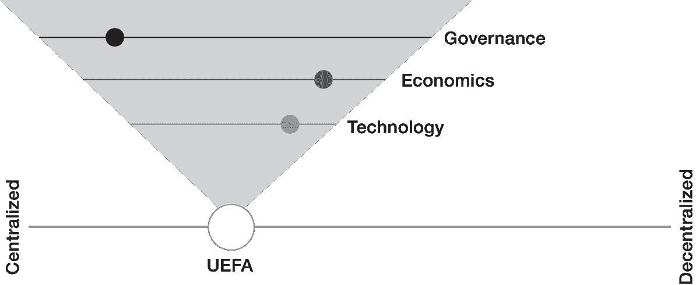

# 第二部分

# 区块链完整解决方案

# 第四章

# 代币化的游戏开始了

代币能够交换价值，几个世纪以来一直如此。它们可以追溯到两三千年前，非洲和亚洲贸易网络中使用贝壳作为支付形式。这些贝壳具有作为物理装饰的内在价值，金银币的出现取代了它们。随着货币和银行体系在几个世纪的演变，具有内在价值的代币被法定货币取代，其价值由政府定义。

虽然法币在经济稳定和安全方面带来了广泛的好处，但它也有局限性。在数字环境中，最相关的缺点之一是其物理形式和面额——法定交易有一个字面上的低端（以美元面额为 0.01 美元），以及一个实际上较高的低端，因为全球支付系统的基础是集中式的且成本高昂的基础设施。然而，随着设备和传感器使得个别数据片段、能量瓦特或注意力分钟的交换变得越来越普遍，小额交易也变得越来越常见。这些数字、基于机器的微交易需要在宏观尺度上实时执行，而这并不是传统支付系统设计的目的所在。

这些限制在区块链成为主流之前就已经开始推动对数字代币的接受。从 2000 年代开始，非洲撒哈拉以南的城市居民开始向居住在偏远农村的家人发送手机分钟，而不是现金。几年后，在津巴布韦，当通货膨胀严重贬值了国家货币之后，商店老板开始给予分钟而不是零钱。当被用作交易单位时，手机分钟成为了价值的代币，在原始用途之外也很有用。

这种灵活性对于代币的用户来说是一种吸引人的品质，即使对于其发行者来说并非如此。中国社交媒体和游戏巨头腾讯在 2000 年代中期看到了用户如何在淘宝上购买 Q 币的灵活性第一手资料，淘宝是中国的易趣。Q 币是腾讯发行的一种虚拟货币，用于其即时通讯和游戏服务腾讯 QQ 上的支付。官方上，玩家应该使用 Q 币购买他们的头像的资源。但在这些代币于 2002 年推出后不久，人们就开始在腾讯生态系统之外使用它们。首先，其他在线游戏公司开始接受它们。然后 Q 币成为了一种替代的点对点支付机制。后来，它们出现在黑市服务的支付选项中，例如赌博或卖淫。到 2009 年，中国虚拟货币交易已达到每年 200 亿美元的水平，当时中国人民银行停止允许使用 Q 币购买实物商品和服务，并最终停止了 QQ 账户持有人之间的所有 Q 币交易。⁵ 但市场的信息是明确的：Q 币揭示了数字用户在数字环境中交换价值的安全和灵活方式的需求。对代币的兴趣激增——包括加密货币——表明这种需求只是在增长。

这一章阐述了为什么以及如何对区块链感兴趣的商业领袖必须拥抱代币，而不管企业使用加密货币所带来的噪音和潜在担忧。在讨论区块链的真正业务时，我们提出了多种代币价值的更广泛论证。我们着重介绍了代币和代币化——使用代币创建和表示资产的过程——在区块链中如何为创建者和参与者带来益处。我们展示了代币如何推动数字业务转型，获取新的资金来源，并创建新的市场。同样，我们强调了代币作为支付手段、交换机制以及作为奖励和激励参与者的工具的灵活性，使他们能够控制和货币化个人资产，如数据。但买方需谨慎：代币也是数字平台和进一步市场整合的有用工具。为了阐明为什么代币既能够促成非数字原生公司的数字转型*又*增强数字平台的力量，我们从解释数字环境中已经存在的不同类型的代币开始，并演示它们作为区块链一部分的持续发展将如何推动数字价值。

## 代币的形态

理论上，数字环境中可能存在与价值来源一样多的代币类型。在我们探讨它们在区块链中的具体用途之前，我们先对代币进行一般性定义，并呈现以下四个类别：

*法定代币*代表着中央发行的政府货币，如欧元、美元或人民币，用于促进商品和服务的交换。这些代币以其实物形式而闻名，包括现金票据和硬币、贵金属和商品。这种实物形式限制了它们在数字环境中的直接使用。

*流程代币*通过封装数字环境中使用它们所必需的过程，扩展了法定货币的范围。例如，EMVCo 代币通常驻留在智能手机中，代表银行或借记卡或信用卡账户信息；这些用于促进远程环境中的交易。同样，当用户点击“使用您的 Facebook 登录”功能时，Facebook 访问令牌将被分发给第三方应用程序；这些令牌同样封装了用户登录凭据。

*补充代币*在封闭或其他有限的环境中充当交换媒介。例如，来自航空公司、酒店忠诚计划或知名品牌如星巴克星星和优步现金的奖励积分。其他例子包括亚马逊硬币或 Q 币等数字货币。英国的布里克斯顿等城镇也发行了补充货币——在这种情况下是布里克斯顿镑——以支持当地的小型企业。另一个地理上的补充货币示例是日本的*fureai kippu*，这是一种社会服务货币，人们在进行志愿慈善行为时获得。补充代币在历史上填补了法定代币未能提供足够激励的空白，促使发行者同意交易条件，并为经济和监管理由。

*加密货币*是数字原生货币，取代了法定货币，处理代币并可以用于创建新形式的资产。加密货币有几种形式。*实用代币*旨在作为一种集资方法，用于资助产品或服务的开发，并作为结果解决方案的访问机制。*证券代币*使其持有者持有发行实体的股份，就像股东持有上市公司的股份一样。*稳定币*是加密货币，其价值与第二资产（例如法定货币）、公开交易的商品或另一种加密货币挂钩。

加密货币的十年历史受到了投机和操纵的影响，通常是在安全代币和首次代币发行的背景下。然而，诈骗的高调存在不应该污染整个类别。加密货币对于支持新形式的数字资产的创建以及新市场的形成至关重要。例如，加密货币使参与者能够以数字形式代表流动性较差的实物资产，对其进行代币化并进行交易。加密货币还可以交易数据单元、证书或知识产权。加密货币类别包括通过区块链解决方案发行或交易的所有类型的代币；当一个特定的加密货币示例给整个类别造成了误导印象时，我们会注意到。

## 动态令牌

要了解不同令牌类型在数字环境中的运作方式，让我们看一个像计划假期那样常见的真实情况（参见图 4-1）。想象一下，一个数字平台，如 Travelocity 或 Expedia，甚至 Facebook，会使用代币来支持假期计划。如果是这样的话，计划将像现在一样开始，客户会基本决定何时、何地以及与谁一起旅行。客户可能还会考虑其他细节，如酒店或航空公司的偏好、喜欢的食物或餐厅以及有趣的旅行。在现实世界中，旅行者将这些信息与他们的人类旅行代理人分享。在互联网上，他们使用旅行经纪网站上提供的模板。这些网站充当数据经纪人，因为它们使用客户信息来吸引各种旅行领域的营销人员并产生收入。在我们的代币化环境中，关于旅行者计划的信息发送到这些数据旅行经纪人之一（参见图 4-1）。

图 4-1

* * *

在集中式数字环境中的代币

* * *

在收到客户数据后，数据经纪人将获取信息并以令牌化形式捕获，从而创建数据令牌。 在我们的示例中，这些令牌存储在数据经纪人控制的数字钱包中。 可能存在不同的令牌，代表供应旅行服务的航空公司、酒店、餐厅、旅游提供商等需要的不同数据组合。 这些供应商将以令牌化形式回应产品提供。 供应商发行的令牌被捕获在由数据经纪人管理的钱包中（图中的第 2 步）。

在第 3 步中，旅行者开始支付和使用服务，例如，在旅行中使用供应商发行的令牌，例如，在酒店办理入住手续并在那里使用服务。 令牌可能在旅行期间继续发挥作用（如在步骤 4 中）。 例如，当旅行者接受酒店额外住宿的优惠时，该优惠可能附带额外的令牌，可用于客房服务、在酒店酒吧喝酒或客房升级。 在这些情况下，令牌鼓励旅行者留在供应商的商业生态系统内。

在度假期间和返回后，旅行者可能会将照片、餐厅评论和旅游赞美上传到各种社交媒体动态中，其中可能包括数据经纪人（步骤 5）。 数据经纪人与供应商协调，通过提供一晚免费住宿或一顿免费餐来鼓励这些口口相传的评论。 旅行者可以将这些令牌储存以备另一次旅行，将其用于供应商拥有的不同位置，或者通过数字钱包与决定追随旅行者脚步的朋友分享这些令牌（步骤 6）。

## 当令牌遇见区块链

迄今为止，我们专注于数字和物理环境中令牌采用的各种形式，但没有区块链的好处。此外，当令牌在区块链中使用时，它们被设计用于至少满足三个目的。

首先，它们可以*最大化发行者的现有价值*。当令牌的目的是最大化价值时，令牌鼓励客户采取直接或间接使发行者受益的行动。奖励点、身份令牌和令牌化的 KYC 信息都是公司可能将现有资源令牌化并在区块链中进行管理以便于发行、跟踪和允许所有者使用的示例。目标是增加客户便利性或减少摩擦力，以促进更多的忠诚度或贸易。在度假的例子中，当酒店向接受额外优惠的旅行者提供令牌作为奖励时，比如房间升级，这些令牌最大化了价值。

其次，令牌可以*代表价值*。加密货币可以被视为价值的代表。最直接的是，比特币代表了比特币“矿工”^a 所使用的电力和计算资源的价值，这些矿工运行验证用户并验证交易的算法。⁶ 使用比特币时，因为令牌也是矿工参与网络运作的激励措施，令牌也最大化了价值。

虽然比特币也是一些数字商务网站上被接受的支付方式，但大多数比特币交易是由货币投机者完成的，他们根据比特币相对于美元或其他外汇货币的价值进行交易，换句话说，他们将其视为法定货币价值。⁷ 除了比特币之外，那些允许区块链网络参与者交易现实世界资产或其份额（例如能源合作社、投资证券或房地产）的加密货币都代表着价值。再次回到旅行的例子，当供应商将酒店房间套餐等优惠进行代币化时，他们正在创造代表持有者价值的代币，因为这些代币可以交易为资产或服务。

最后，代币可以*创造一种全新的价值类型*，并与区块链相结合。例如，代币可以允许参与者将以往无法货币化或流动性不足的资产进行货币化。正如台北富邦银行总裁罗曼·郑所强调的那样，“区块链创造了一种能够引入基于资产的代币的能力，例如，通过大型企业采购供应链生态系统的各个层次的供应商所产生的应收账款。因此，为这些[中小企业]创造了强大的金融工具。”⁸ 其他及时的代币实例可以在专注于数据交换的新兴数字资产市场中看到。其中一些市场将允许用户对其个人或公司数据进行代币化，并根据其市场价值积极出售或与经批准的方进行共享。

例如，Edgecoin 提供了一个用于教育证书的区块链解决方案，允许大学数字化其学生记录，并提供毕业生的认证代币副本供雇主或其他教育机构分享。另一个使用代币促进数据资产交换的区块链提供者是 ClimateCoin，这是一个非营利组织，致力于使为机构和政府开发的碳抵消市场对个人可访问。ClimateCoin CO2 代币可以被任何人购买，其收益用于投资于从事碳抵消活动的公司，如可再生能源发电。

不论它们的目的是最大化价值、代表价值还是创造一种新类型的价值，对于许多热情者来说，代币是区块链的重点，因为对特定形式价值（代币所代表的价值或它所创造的价值）的需求促使网络的创建和参与。代币化资产的规模、流动性或价值都没有上下限，网络参与者可以是机器。因此，代币使经济活动大幅扩展，理论上包括每一个存在的人类和机器以及每一种可交易的资源。

## BEYOND DIGITAL MONEY

在像度假规划这样的简单交易中所涉及的各种类型和目的的代币应该清楚地表明，代币比你从当前市场对加密货币作为取代法定货币的关注中所能猜测到的要多得多。我们理解将许多种类的代币混为一谈的本能，因为比特币区块链是第一个吸引主流关注并且第一个运营中的区块链完整解决方案。但是设计用于取代法定货币的加密货币只是数字环境中将有用的代币类型之一。

尽管如此，围绕着首次代币发行（ICOs）的炒作增加了混乱，并值得简要提及。所谓的 ICO 在开源环境中为基于区块链的倡议筹集资金。作为 ICO 的一部分，公司在区块链平台上发行代币，并使用智能合约——自动执行协议条款的代码行——来管理代币发行并定义规则。尽管货币投机和欺诈在许多 ICO 中都是一个因素，但那些以真诚意图启动的 ICO 带来的期望是，代币持有人将获得对正在开发中的平台或功能的访问权限。这样，代币对发行者起着双重作用：它代表价值，因为买家用法定货币购买它们，它还可以通过吸引用户到区块链解决方案上来创造价值。我们将在 第六章 中更详细地讨论 ICO 和金融去中心化。

稳定币，或稳定加密货币，是另一个令人困惑的来源。它们旨在匹配加密货币的数字好处，但避免了市场交易加密货币（如比特币）所困扰的波动性，并阻止了对风险警惕的企业用户。稳定币试图通过将其价值锚定在法定货币（如美元）上，并持有某种数量的储备货币来减轻波动性。稳定币的发行方必须调整代币的供应以匹配储备。以法定货币支持的稳定币往往是中心化的，因为它们的目标货币变量是中心化的。它们的使用增加了一个中心化的遗留参与者（政府或其代理机构，即央行）和另一个可能不太稳定或不太有声誉的参与者，因此可能不太可信赖的中心化参与者。为了避免固有的中心化，稳定币可能会通过智能合约将其价值锚定在一篮子加密货币上。另一个选择是通过算法和智能合约复制央行的行动，以管理交易的方式降低波动性。

尽管他们有他们的支持者，但稳定币到目前为止并没有成功地保持与其基础法定货币的完美价格平价。最新的受害者是泰达币，由于市场怀疑该网络缺乏其声称拥有的美元储备，导致其与美元失去了平价。市场尚未放弃稳定币。然而，2018 年底推出了新的交易所，推广了管理波动性的替代方式。

## 区块链启发的代币到区块链完整解决方案

现在我们已经就区块链中不同类型和目的的代币奠定了基础，让我们来看看代币和代币化将如何沿着 Gartner 区块链光谱演变。

市场上受区块链启发的解决方案很少包括代币。然而，当代币成为区块链启发设计的一部分时，它们通常服务于有限的目的，并且可能会为发行者巩固权力。这种限制削弱了代币的效力，因为理想情况下，代币不应该是静态的；它们的承诺在于它们的适应性。一家企业可能最初发行代币时心中有一个目的，并随着采用和交易量的增加而扩大该目的。客户的倡议可能推动这种扩展，就像上面的 Q 币例子所示的那样。或者发行者可能会从一开始就设计代币以在不同条件下使用。

在图 4-1 所示的度假示例中，酒店获取的奖励代币与房间住宿结合在一起，成为旅行者用来支付产品或服务的货币。如果该酒店与同一城市的其他提供商有合作关系，这些代币也可能被其他地点接受作为货币。你可以在最简单的代币环境之一的背景下想象这样的情景：航空公司奖励计划，这些奖励可以交换成奖励发行方和计划合作伙伴提供的服务。在受区块链启发的解决方案中，这样的代币可以被有效地追踪和存储。区块链甚至可以允许计划合作伙伴作为网络中的节点参与，并允许奖励代币持有者根据网络规定的业务规则兑换他们的代币以获取任何构成服务中的服务。

新加坡航空正在沿着这条线路开发私人区块链，以使持有它们的旅行者的 KrisFlyer 里程更具相关性，并涉及兑换合作伙伴。旅行者可以将里程兑换成 KrisPay 代币来资助数字钱包，然后使用该钱包在合作伙伴地点支付服务。 ¹¹

代币的初衷是作为奖励结算货币在不同提供者和产品类别之间流通。顾客可以从更灵活的兑换规则中受益，包括将奖励转移给家人和朋友的潜力，暗示了代币的可交换性增加。而商家则可以通过获得新业务和了解顾客需求，实现潜在的新产品开发。这样，区块链中的代币就成为了一种充满活力和多功能的交换媒介。这些代币可以在演进的、受区块链启发的解决方案中使用，帮助实现向完全区块链解决方案的过渡。除了奖励代币，旅行业对区块链技术表现出了巨大兴趣。国际航空运输协会正在探索如何创建旅行网格区块链平台作为一项服务，让各种航空相关应用可以在其上运行。示例包括机场的零售应用、航空票务、供应链管理和其他功能。旨在提升乘客体验，并促进生态系统参与，影响价值 2.7 万亿美元的航空业。¹²

旅行领域并非唯一在探索使用代币促进去中心化的行业。电子竞技也正在接受代币，我们将在接下来的部分中探讨。

### 代币助力去中心化

游戏产业长期以来一直是数字实验的试验场。早在区块链和比特币出现之前，就有像*Second Life*（2003 年推出）这样的虚拟世界，以及像*魔兽世界*（2004 年推出）这样的大型多人在线游戏。[¹³] 这两款游戏都有自己的数字货币，玩家可以用来交换数字和现实世界的资源。与现实世界一样，游戏经济也存在真正的经济问题，例如资源囤积、不平等、货币贬值、数字货币黑客攻击、银行挤兑和欺诈。[¹⁴] 这种高科技、娱乐、经济和社会实验的交汇使得游戏产业成为令人关注的代币创新的温床，也是一个值得关注的地方，考虑到玩家的技术知识和他们在游戏中创新货币的历史倾向。在这片肥沃的土地上，电子竞技——以比赛驱动的视频游戏竞赛——正在成为区块链创新的主要竞争者。

电子竞技估计全球观众人数达到了 3.8 亿人。[¹⁵] 这个市场结构涵盖了全球游戏开发者社区（创意工作室和数千名独立游戏设计师）、发行商（如动视和艺电）、分销商（谷歌 Play、苹果商店、微软以及专门的游戏站点如 GameStop）、数百款游戏（*部落冲突*、*堡垒之夜*、*使命召唤*等）、以及平台（游戏机、PC 和移动设备）。同样，电子竞技也容易受到困扰所有高交易量环境的相同问题。该行业面临欺诈、高转换成本、游戏设计师或玩家等待付款的长时间延迟以及数字平台收取的高费用等挑战。

几家公司正在考虑在区块链上实现代币以解决这些挑战。 其中一个目标是帮助电子竞技发展成一个更专业的结构，类似于国际足球联合会（FIFA）和其他组织的模式。 实现这种专业化结构的一条途径是电子竞技在主要数字游戏企业的支配下 consolide。 这些企业包括拥有*使命召唤*的 Activision 和拥有极受欢迎的电子竞技特许经营权*FIFA 19*，*Madden NFL 19*和*战地*的 Electronic Arts。 这两家发行商都为其部分产品提供了游戏内代币系统。 另一个整合力量是亚马逊，其拥有一个名为 GameOn 的基于亚马逊网络服务的电子竞技平台，通过该平台，游戏开发人员可以互动举办比赛，组建联盟并支付玩家报酬。 亚马逊于 2013 年推出了 Amazon coin 虚拟货币，用作其数字产品生态系统的游戏和奖励货币。 自那时以来，市场上一直有充足的市场猜测称亚马逊计划推出亚马逊加密货币，尽管到 2019 年中期，该公司尚未采取这一举措。 在其他数字平台上，腾讯当然拥有其 Q 币，玩家可以在其生态系统中的所有游戏中使用。

这些平台正面临着来自游戏行业内不断发展的区块链初创公司的竞争。游戏公司 DreamTeam 是一个资金充足的例子，它于 2017 年推出。它拥有强大的背景，其顾问来自电子竞技锦标赛组织者 Major League Gaming 和 Electronic Sports League。在第一年，DreamTeam 专注于*英雄联盟*（每月 1 亿玩家）和*反恐精英：全球攻势*（每月 1200 万玩家）。在其启发自区块链的平台上，它通过使用 DreamTeam 代币实现支付，并防止不支付和欺诈行为。到 2018 年底，DreamTeam 报告称有超过 100 万名玩家。

另一个经过标记的解决方案来自 GameCredits，该项目于 2015 年推出，旨在解决电子竞技中的欺诈和支付延迟问题。GameCredits 的一个关键目标是增加支付给开发者的金额和速度，作为他们将游戏提供到 GameCredits 商店的激励。该公司表示，支付比例可以从游戏购买价格的 70％（在 Google Play 和 Apple Store 上提供的典型份额）增加到其平台上的 90％。

DMarket 通过基于区块链的游戏代币进一步远离了集中式平台模式，该代币旨在跨游戏和平台使用，以便与一个游戏相关联的资产可以被购买或交换为与另一个游戏相关联的资产。通过与 Steam 的连接启动，Steam 是数百款游戏的游戏分发平台，DMarket 为游戏经济做了我们在本章早些时候假设的航空奖励可以发生的事情。其代币可以跨属性和供应商使用，为购买者提供更灵活、忠诚和重复的业务。

最后一个引人注目的游戏代币来自 Enjin，这是一个允许用户创建自己的代币来支持他们的游戏的平台。为了限制欺诈和重复计数，Enj 代币使用了一种设计元素来验证玩家拥有他们购买的物品。

电子竞技的社交方面凸显了社交媒体和游戏之间的交叉。允许观众奖励玩家的代币在社交媒体*积分*中有所体现，这些代币是为社交媒体平台设计的，可以让参与者变现他们的喜欢。²⁰现在有许多基于区块链的社交媒体平台，旨在打破 Facebook、YouTube 等平台的模式，这些平台奖励参与者的帖子和喜欢。例如，ConnectSocial 每当用户上传内容时就会奖励他们；公司的愿景是促进意见领袖与他们选择推广的品牌之间的积极互动。²¹另一个基于区块链的社交媒体网站 Steemit 也会奖励内容创作者上传内容时的一定数量的代币，随着参与者查看和喜欢内容，奖励会逐渐增加。将这个概念扩展到电子竞技，平台可以奖励玩家获胜、受到电子竞技观众欢迎或者他们的运动精神。再将其扩展至零售或体验品牌，您可以看到通过奖励顾客发布使用产品的照片来培养品牌忠诚度的方法。

高用户量和快速创新使游戏行业成为创新代币开发的试验场，这是一个可以看到用户如何推动代币适应性并因此加强较少集中化模型的地方。从 DMarket 的代币，可在多款游戏中使用，到 Enjin 的自定义代币开发方法，这些公司和其他公司为亚马逊、谷歌或苹果生态系统方法提供了吸引人的替代方案，并为其他行业的公司建立了一种新的方法。

### 数据货币化

代币化还可以通过数据货币化带来奖励。大型数字公司捕获的大量数据并向第三方公开（想想剑桥分析），或者被黑客攻击（想想信用评分机构 Equifax 和万豪酒店度假村）的最初启示有助于推动企业和个人控制自己的数据。对数据控制的关注已经持续了很长时间。互联网用户越来越意识到他们的数字行为被捕获、存储、分析并出售给广告商和产品开发者。现在，这个数据宝库变得更加庞大，物联网收集和数字化信息，人工智能分析物理世界和数字世界的信息。

区块链技术还使用户能够切实评估何时、是否、在哪里、与谁以及如何为价值交易数据。已经有新的面向数据的区块链解决方案正在开发中。这些解决方案利用代币对数据资产进行价值评估和交易。在区块链上，代币还可以通过一种机制实现全球范围内的去中心化点对点数据交换，该机制赋予数据所有者在未明确同意给予对等方查看或使用数据之前，将其拥有的数据保密的能力。

一个区块链解决方案，可以让用户更好地控制和监督数据的来源于 Datawallet，一家美国-德国合资的初创公司，提供了一个基于区块链技术的代币化解决方案和移动应用，允许参与者同意与市场营销人员分享个人信息片段，以换取数字代币。Datawallet 向参与者推销的理念是他们会得到报酬；而向广告商推销的理念是，这些信息将比他们从一些数据经纪人处获取的信息更及时、更相关。（经纪人从一系列在线资源和政府人口普查数据库（如机动车辆部门）获取信息，其中许多信息存在不准确性和重大时间滞后。）Datawallet 对卖给广告商的数据进行了匿名化处理。²⁴

Datawallet 的解决方案使用智能合约来捕获和执行数据所有者的意图和同意。通过这种方式，用户与其数据相关联，所有权记录在区块链上。这些是数据市场的基本要求。从法规遵从的角度来看，跟踪数据所有权和同意还提供了一种方式，使组织能够遵守诸如欧盟的全球数据保护条例（GDPR）等隐私法规。例如，在区块链中，从根信息（个人数据）到账本中相应记录的链接可以断开。由于此分离是可审计的，参与者可以确认已经尊重了被遗忘权，如 GDPR 所要求的那样。

这样的工具将帮助涉足数据货币化的公司避免与隐私泄露相关的高额罚款。²⁵ 随着物联网生成的数据越来越多，并且通过人工智能更容易理解，用于数据货币化、管理同意和启用数据市场的代币的角色将变得更加重要。

除了数据的大量和来源的多样性之外，还将逐步发展能够实现数据所有权和控制的技术解决方案。为了演示这种工作方式，我们回到了我们在 图 4-1 中展示的度假情景。我们最初的情景涉及数字旅行平台作为数据经纪人参与交换，通过其创建和控制数据和货币令牌流动的数字钱包。经纪人对旅行者数据和偏好拥有优先访问权限，从而获得了主导市场地位。如果它使用令牌，它们将有助于更多的集中和对所创造价值的控制。

图 4-2 重新审视了这个例子，但这次是在一个完整的区块链解决方案的背景下，该方案将客户数据去中心化，并允许参与者在本地保留数据并选择性地共享。旅行者可以定义令牌的使用方式，并且通过智能合约捕获这些参数下的令牌。

图 4-2

* * *

区块链完整解决方案中的令牌

* * *

在这种情景下，旅行者通过令牌化的形式与旅行提供者（航空公司、酒店等）协调共享相关数据，并通过数字钱包或其他只有旅行者能够访问的界面直接收到回报。在区块链完整平台上协调这些交互还将为旅行者在多个市场选择性地共享数据创造机会，并因此获得更好或更多样化的报价。

处于中心位置给予旅行者对数据的主权。去中心化将增强受消费者信任的服务提供者制定自己的条款和条件的能力。这些公司可以协商和设定自己的价格，而不是由平台的条款指导价格。这种自由可能推动他们的参与和创新。数据货币化的去中心化将有利于市场竞争。

一波区块链初创公司，如 Sovrin Network、Peer Mountain、Civic Technologies、SelfKey 和 Blockpass，正在向数据所有者——无论是个人、组织还是物品——展示如何掌控他们的数据。这些公司允许参与者将个人或公司信息进行代币化，保持对其个人主权，并公开交换。随着时间的推移，主权数据的存在将促进基于同意和数据所有者奖励的新数据市场的创建，同时也为一系列企图竞争数字市场的公司提供公平竞争的机会。

## 战略代币化路径

由于代币可以在集中和去中心化环境中使用，它们未来几年可能会有几条进化路径。例如，数字平台已经做好准备，并正在投资利用代币（无论有无区块链）来货币化客户数据、身份和其他非货币资产，并通过这些资产扩大其数字生态系统的影响力。除了亚马逊和腾讯在游戏领域进行的代币实验外，Facebook、谷歌和阿里巴巴等公司也在代币化方面积极活跃。

例如，Facebook 正在开发自己的数字货币，据称使用区块链解决方案，并发行 Libra 作为稳定币。²⁶ Facebook Libra 的一个可能意图是创建一种结算货币，支持 WhatsApp、Facebook Messenger 和 Instagram 上的点对点支付。Facebook Libra 还可以作为对发布帖子的用户（即分享数据的用户）的奖励，并作为 Facebook 平台间的支付机制。然而，这些情景都与区块链完整模型不兼容，因为 Facebook 将控制该币及其使用。此外，任何数字平台手中的代币都可以用于推动客户使用平台产品和服务，而不是第三方供应商的产品和服务。专有代币也可以用于补偿通过其平台销售的内容提供者、产品开发者和服务公司。在集中化的环境中，代币构建市场力量。

图 4-3 在 第一章 中介绍的去中心化程度与数字化/可编程程度四象限模型上绘制了一些代币的选择。对于代币，“可编程”——表示数字化连续性的最北端——包括代币的适应性。如果代币的用途能够适应业务环境、基础资产、需求、供应、所有权或可转让性的变化，则该代币是可适应的。（请注意，该图不是在评估代币计划的质量，而仅仅是展示它们与去中心化和数字化的关系。）

图 4-3

* * *

战略性代币化路径

* * *

目前，现有令牌的大部分旨在促进传统运营过程和交换方式（西南象限）。这些令牌发挥着战术角色。目前正在进行更具战略性的令牌使用。设计上既集中化又可编程的令牌将为发行者提供高度控制。为了推广采用，数字生态系统可能会在初始令牌实施中采纳一些分散化的方面。然而，这些分散化元素可能是暂时的，因为目标是*控制*（图中西北象限）。一旦令牌的采用率达到临界质量——并锁定——我们预测令牌在集中化背景下的使用将进一步限制，因此会更加集中化。例如，Uber Pro（Uber 司机的奖励计划）的令牌在其可编程性方面具有一定程度的控制，但由 Uber 全面控制，只有满意评级至少达到 4.85 分且取消率低的司机才能参与。²⁷ 令牌将仅略微分散，因为访问规则旨在影响 Uber 生态系统内的客户和业务合作伙伴的行为。对于此类令牌来说，目的地是图中的西北象限。这个象限也是亚马逊、Facebook 以及 DreamTeam 正在进行的集中平台扩展的逻辑方向的游戏令牌。

就他们来说，启发区块链解决方案的解决方案很少包括令牌，但那些带有令牌的解决方案在扭转航向前，可以使分散化程度略微增加。当财团或提供商实现其运营目标或为了控制令牌的流通速度和可交换性而集中化时，令牌可能会变得更加集中化。司法管辖因素也可能影响令牌的交换、存储、合法性和其他特性。

新加坡航空公司通过其实验性的受区块链启发的奖励解决方案，可能会走上这条道路。 当前解决方案将去中心化程度限制在少数合作伙伴之间。 在该平台上，代币的主要目的是在合作伙伴之间协调流程（东南象限）。 此象限中的代币对其适应性有自然限制。 要变得更可编程，网络必须适应所有合作伙伴的业务需求； 但这并不是新加坡航空公司及其 KrisFlyer 计划的目标。 因此，代币计划最终可能变得更少去中心化。

对于电子竞技，另一条途径正在出现。 GameCredits、DMarket 和 Enjin 的代币比过去的游戏代币更为去中心化，更可编程。 它们的去中心化程度是对数字巨头试图控制该行业以及玩家、粉丝和开发者多样化需求的直接回应。 这些更去中心化的代币使游戏网络能够在新兴行业（东北象限）转型期间创造价值。 作为颠覆性的代理，这些代币无疑将进入游戏流媒体的领域。 Google 在 2019 年 3 月宣布了其 Stadia 流媒体服务，一些基于区块链的替代方案已经计划挑战它。

## 你真实的业务透镜

### 你学到了什么？

代币化，即使用代币创建和表示资产，并不新鲜。中央银行和政府发行的法定代币与支持 Apple Pay 的过程代币以及奖励积分等辅助代币已经多年并存。区块链增强了代币的可用性和适应性，将它们转变为创建和交换点对点网络中的价值的灵活动态机制。在区块链上，不同类型的代币将用于不同的目的。旨在取代法定货币的加密货币，如比特币，将试图挑战中央化货币模型。实用代币和安全代币将促进新的众筹、融资和投资模式。

代币不仅在金融领域发挥作用，还可以实现个人数据等非流动资产的货币化。代币还提供了解决旧问题的新方法。例如，它们帮助组织遵守数据隐私法规，如欧洲的 GDPR（对 B2B 和物联网数据至关重要）。代币还可以防止欺诈，加速支付（例如，对电子竞技玩家），并降低中介费用。

### 你应该怎么办？

你的组织和行业的成熟度影响所需的代币类型。确定你的直接竞争对手或已经有代币策略的相邻公司。一旦你了解了你今天所处的位置，你应该开始尝试使用代币作为数字业务转型的代理。例如，你可以开发一个代币化机制，让你的客户拥有对他们数据的主权；这种权威会鼓励他们参与数据市场，因为他们知道他们控制着自己的信息。将个人数据控制权移交给数据所有者的副作用是支持你遵守数据隐私法律的努力。你还可以探索代币作为奖励和激励。奖励用于促使网络参与者分享数据并创建新市场。这些例子展示了在分散的、区块链完整环境中的代币如何成为动态而多才多艺的经济代理，从而扩大你的市场力量。

### **接下来是什么？**

代币依赖分散化来充分发挥它们的潜力，鼓励市场参与、数据共享、资产创建以及代币的多样性和适应性。在下一章中，我们将沿着区块链的光谱再迈进一步，更全面地探讨分散化，这是区块链的第五个设计元素。

# **第五章**

# **通过分散化接受共识**

在许多方面，分散化是区块链的核心。当与代币结合时，就像是商业生态系统中的象征性血液，分散化决定了你和其他网络参与者是否作为真正的同等能力的同行运作，能否获得价值，或者是否某些行为者获得了超出其贡献的利益。如果你希望参与由区块链驱动的数字市场，并从区块链中获得最大的利益，分散化是不可选的。

尽管区块链完整阶段的谱系要到 2023 年左右才开始，但去中心化的实验已经在进行中。如果您的客户对某些事情感到沮丧，我们可以保证，一些区块链初创公司正在研究去中心化的解决方案来缓解他们的沮丧。

例如，Golem 正在为那些需要大量处理能力但需求不规律、因此无法被亚马逊或谷歌等云服务提供商很好服务的计算机用户开发解决方案。这些云服务提供商因为运行分布式的集中式计算网络的沉没成本而需要长期合同。Golem 的解决方案允许点对点网络中的参与者将他们服务器和计算机上未使用的处理能力出租给需要大量处理能力的用户。将其模式想象成过剩计算能力的去中心化版 Airbnb。就像 Airbnb 一样，Golem 正在构建一个具有交易潜力的平台来交易今天的不太流动的供应。未使用的计算供应是一个巨大的市场：全球服务器使用仅占总容量的 70%，这意味着数据中心中有价值 300 亿美元的空置服务器。Golem 的方法也提供了新的关系可能性。与要求长期合同不同，Golem 可以根据需要访问资源，并使用代币奖励资产所有者。¹

该公司将其第一个用例 Brass Golem 推向计算机图形设计师市场，他们需要短期内大量的计算能力来渲染二维设计，使其在屏幕上呈现三维效果。自 2016 年成立以来，Golem 已经筹集了超过 1,700 万美元。²它加入了区块链同行 Sonm、Ethernity Networks、Conduit 等，提供去中心化计算能力，以及 Filecoin 和 Storj 两个专注于去中心化存储的区块链初创公司，重新构想了云计算的去中心化模式。

随着像 Golem 这样的区块链初创公司的壮大，以及受到区块链启发的解决方案不断扩大其用户群，传统组织将需要更积极地探索分散化解决方案。尽管有这些明显的竞争推动因素，但我们所接触到的商业领袖们对分散化及其所涉及的一切表示了关注。这些挑战涉及技术、经济和社会系统以及商业治理领域。

在本章中，我们将涉及关于分散化的各种主题。我们定义了区块链中分散化的组成部分，概述了在日益数字化的环境中分散化的商业价值，并展示了传统组织如何演变并沿着分散化的范围拥抱分散化。我们还将带您了解分散化所带来的主要挑战。我们从分散化的基础知识开始。

## 分散化的八大组成部分

表面上看，去中心化的技术方面是很直接的。区块链的设计不同于中央权威，它赋予网络中的每个参与者*一个平等的投票权*，用于判断其他参与者是否真实，并根据指导区块链交互的业务规则来验证交易的有效性。参与者可以作为节点运行，这些节点是由参与者拥有或使用的机器，在每次交易块通过时运行区块链共识算法。^a 如果至少 51% 的全网络节点认为交易有效，则交易将被清算，然后由每个节点独立将其附加到账本副本上。³ 可能被一个节点忽视或故意忽略的重复、双重计算的资产和欺诈性交易，不太可能被共识忽视。一个节点，一个投票的政策是区块链在缺乏中央权威的情况下解决认证和验证挑战的*方式*。

但是，去中心化不仅仅涉及技术。它还涉及区块链为解决方案定义和执行业务规则的方式。它涉及谁可以作为网络中的完整节点参与。去中心化还涉及根据参与者的贡献分配参与者的奖励。总的来说，我们看到去中心化在区块链中运作有八种主要方式，涵盖了治理、经济和技术等方面。

***治理***

***决策制定：*** 参与者可以在区块链上将决策编码并执行，而无需中央权威介入。

***参与性：*** 任何人或任何事物都可以作为完整节点，假设具备必要的基础设施，并同意遵守运营条款。

***商业所有权和监管：*** 没有任何单一实体或财团在区块链产生的价值中拥有绝对多数股权。这种公平的分享适用于货币价值，以及数据、访问、合同和技术的货币。

***经济学***

***融资：*** 没有任何单一实体或财团提供或负责区块链的流动性；一个健全的经济模型维持着这个平台。

***奖励分配：*** 区块链根据约定和透明的规则公平地将奖励分配给运行共识的所有节点。

***技术***

***技术架构：*** 区块链依赖共识算法和一节点一票政策来认证参与者和验证交易。

***协议开发：*** 解决方案和源代码的输入通常来自多个来源，通常通过开放源代码开发。

***网络治理：*** 没有任何单一实体或财团对区块链上的节点有绝对控制。参与者可以担任积极或被动的角色，并有加入和退出的自由。

尽管这八个组成部分每个都可以更多或更少地去中心化，但它们之间存在明确的依赖关系。例如，拥有单一所有者或一组所有者的区块链（例如，集中式商业治理）很可能会通过集中协调的技术架构来加强这种中心性。这样的设计意味着区块链不依赖去中心化的共识，因此它是受区块链启发的典型。相比之下，开放参与可能依赖于共识驱动的技术架构来建立信任，因为参与者彼此不了解。

### 深入探讨治理问题

尽管区块链当前存在技术上的局限，但这些缺点并非我司经验的公司犹豫转向去中心化的原因，而是组织层面上的阻力。

像你这样的领导者告诉我们，他们正在努力应对区块链要求他们将决策控制权交给算法的问题。你和其他领导者无疑会担心参与一个你不知道、也无法知道对方是谁的网络中。你正在探索从一种你既不拥有也不控制的资源（区块链）中提取价值意味着什么。这些治理问题的复杂性值得更多的关注。

#### 去中心化决策

区块链中，算法执行其代码中包含的业务规则和决策。为了达到这一点，领导者们必须同意放弃对相应决策的控制，并详细定义决策，以便可以将其转换为代码。

这种放弃控制的做法听起来可能像是一个巨大的跳跃。然而，一些商业领袖已经开始了这个旅程。通过使用人工智能和外包核心系统和流程所获得的经验，为进入去中心化环境提供了垫脚石。⁴

智能合约包含执行区块链决策所需的代码。这些合约的复杂程度各不相同。简单的智能合约处理单个决策或流程；复杂的智能合约则包含了定义整个操作功能决策的完整规则集，比如供应链管理中涉及的所有金融任务（从采购到结算）。这些复杂合约在区块链世界中被称为 DAO，即分散自治组织。可以把它们想象成业务流程的化身。在某些情况下，DAO 将包含经营业务所需的所有业务规则，而 DAO 产生的交互、交易和价值将没有物理世界的等价物。作为一个独立的业务，DAO 将做出所有决策，并执行其编程中所固定的所有流程。整合先进的 AI 代理将使这些业务决策能够由运行在账本上的智能系统自主地进行。

如果以这种方式交出决策控制权的想法似乎激进，那么请记住，这不会作为第一步而发生。相反，你将从将已经很好理解的决策，如招聘或员工年度审查，分散到区块链解决方案开始，然后再逐步分散到像项目管理或融资这样的流程，然后再到整个企业职能。向 DAO 过渡同样将首先以重点放在已经高度标准化、编码化或自动化的流程或市场部分开始，这些部分可以适应现有的情境。

#### 分散参与

作为区块链治理的一个要素，参与指的是在给定的基础设施下允许谁或什么作为网络中的节点。在一个完全分散的区块链中，任何想要的人或事物都可以成为一个完整的节点。分散参与的一个常见同义词是*公共*或*无许可*网络。无许可网络与中心化参与相对应，后者被称为*私有*或*许可*，甚至是*企业*区块链。

中心化参与背后的逻辑是，它允许所有参与者知道他们正在与谁打交道，并遵守组织和运营规范。你们中的许多人坦率地告诉我们，与未知的交易方进行交易或互动的想法让他们感到不安。然而，保持一个所有已知参与者的中心化系统会削弱区块链的基础好处。在这个意义上，一个许可制区块链就像是带有内置桨的摩托艇：你本来不应该需要它们，那它们为什么会存在呢？

#### 分散商业治理

谁拥有一个区块链？谁监督它的治理？如果有人受到伤害或其他问题出现，谁负责？在一个分散的区块链中，对于所有权的问题的答案既不是任何人也是所有人：没有单个参与者拥有整体，每个参与者都通过操作一个完整的节点、运行共识，甚至可能贡献于开源协议和解决方案的开发来对其进行维护和运营负责。

表面上，集体所有权允许网络成本分散，尽管分散本身也带来一定的成本。例如，运行共识算法会消耗操作它的节点一些计算能力和能源（例如，比特币挖矿过程）。网络和系统安全也带有相关成本。

影响治理的另一个问题是社区的团结或者说是非团结。在技术层面使分散化成为可能的共识通常依赖于多数规则。如果一个网络引入了代表其愿景和目标转变的新规则，并且一些节点不同意采纳该规则，那么网络就可能会分裂或者出现分叉。当网络成员在目标上发生分歧并决定分成两个独立的网络时，就会产生分叉（例如，比特币和比特币现金）。分叉也可能是作为对紧急情况的回应而发生的，例如，2016 年以太坊社区因 DAO 项目的失败而选择分叉。在任何情况下，分叉都会带来技术、商业和法律上的影响，这些影响让需要对关键任务系统的可持续性进行保证的企业领导人感到不安。

### 分散化的不断变化状态

分散化的八个组成部分既独立运作，又组合在一起，构建了一个以共识驱动的价值创造和公平分配环境。重要的是，这八个组成部分是动态的；它们的分散程度随时间而变化。让我们更仔细地研究这种动态性。

比特币区块链中的去中心化——通过去中心化架构协调的最大分布式区块链——为我们提供了一个有用的视角，展示了网络如何随着时间演变其去中心化架构。由于区块链的开放性和点对点的性质，节点根据自己的选择进入和退出，技术架构和网络治理也随着这些进入和退出而改变。比特币的激励机制，即完整节点因维护网络和运行共识所做的工作而获得比特币的报酬，也推动了这一趋势。据说节点在*挖矿*比特币，而运行节点的人被称为*矿工*。随着账本的增长，矿工需要更多的计算力以更快的速度运行共识。在比特币中，具有最具规模性和成本效益操作的矿工可以比其他人挖矿更快。这种差异导致市场整合。比特币价值的下降使问题变得更加复杂，因为奖励对于效率低下的矿工来说已不再值得。他们退出矿池。所有这些导致了挖矿的中心化；如今，四个矿池运行了超过 50%的比特币网络。⁶

协议开发是比特币区块链中去中心化的另一个维度。开源解决方案所声称的承诺是，因为没有个人公司拥有它们，所以从许多独立程序员的多样贡献中受益。更多的人发现更多的漏洞，并在较短时间内做出更多的改进，这比如果中心组织进行的话会更快。实践中，人们需要生活。开发人员更有可能投资于解决技术问题，如果他们得到报酬的话。

开源模型也面临着连续性挑战。例如，当 GitHub 于 2018 年 6 月被微软收购时，这一收购引发了关于 GitHub 库中现有开源解决方案的可持续性的问题。⁷ 一些开发人员会努力保持开放性，例如在甲骨文收购 Sun Microsystems 后将 MySQL 分支为 MariaDB 以及将 Open-Office 分支为 LibreOffice。

日本金融服务公司 Monex Group 的高级顾问皮特·弗兰肯指出：“许多维护区块链的贡献都是基于志愿者的。这样的模式可持续吗？谁来维护源代码？谁对编码错误负责？如果开发人员对世界有不同的看法，会发生什么？这对您的业务有何影响？在 Monex Group，我们认为将资源分配到与开发者社区联系起来是至关重要的。”⁸

区块链的发展越来越复杂，其发展挑战也变得越来越复杂，需要解决这些挑战的技能也变得越来越专业化，因此集中在较少的开发人员手中。比特币也存在着同样的集中趋势。平台的持续发展由越来越少的人完成，这样就更有可能有一个开发人员引入了一个漏洞。⁹

明确地说，没有证据表明比特币区块链因挖矿池或协议开发的增加集中化而受损。我们更多地强调这个例子，是因为它代表了去中心化区块链技术演变的一个自然实验。这些经验为您量化构建共识的区块链解决方案的相对风险和回报提供了有用的素材。请记住，比特币或任何加密货币相对于全球交易量和业务范围的规模较小。同时要认识到区块链开始的绿色领域，没有传统数据需要转移，没有现有流程需要转换，也没有既定的利益相关者需要协调和管理。

在理解了区块链中分散化的含义以及它的多种运作方式之后，让我们转向控制和价值创造的问题，使用我们从商业领导者那里得到的最迫切的问题的视角：分散化允许你的组织通过区块链实现什么？

## 分散化的价值

在区块链中讨论分散化必须面对一个令人不安的事实：你们在传统企业工作的人们面临巨大的分散化阻力。今天建立区块链解决方案的传统企业是少见的。你经常听到为什么分散化不起作用的复杂理由。我们经常听到的一些最常见的理由是这些：

+   一个中心化的系统比分散化系统更快地清算交易。

+   由于安全或监管原因，一个已知的参与者必须掌控局面。

+   你的合作伙伴不会支持它。

+   中心化系统消耗的能源较少。

+   每笔交易涉及的数据量，或者业务流程的复杂性，使得分散化成为不可能。

+   你需要集中化（并掌控局面），因为你的参与者缺乏运行节点的技术能力。

+   区块链中的参与者不希望暴露他们的交易数据，或者也许不希望暴露他们的身份。

在面值上，这些论点都不是不准确或者不明智的。鉴于今天的技术能力，中心化系统确实通常运行更快。它们也通常消耗的能量较少（取决于操作架构），并且更能够处理涉及大量描述性数据的交易。中心化可以让监管机构拥有单一的管控点，并且确实允许强大的行为者管理和控制标准化流程和价值链。最后，中心化系统对于普通信息系统团队来说可能更容易管理。

上述观点并不是支持区块链中央化设计的论点。它们只是支持在需要或希望与信任的对等方进行集中协调和监督时使用传统数据管理的论点。更重要的是，这些论点是自我施加的限制。与其想象在一个由去中心化定义的商业环境中可能发生的事情，不如将区块链硬塞到您组织现有的中央结构中，其中包含自上而下的等级制度。这种固定的思维方式正在创造一种战略的逻辑自洽，遗留组织将区块链视为解决高成本内部或生态系统挑战的工具，然后合理化他们设计的解决方案不需要去中心化，因为它所解决的问题适用于已知参与者的封闭网络。要打破这种循环思维，您可以改变视角。与其关注为什么不需要去中心化，不如考虑它对您能做什么。

### 为什么去中心化？

正如我们之前所描述的那样，去中心化系统重新定义了参与规则，从“赢者通吃”的经济模式转向了一个更加公平的系统，在这个系统中，奖励根据参与者的贡献和责任来分配，并且透明可见。考虑一下这种公平分配对于第一章中介绍的商业货币的影响：数据、访问、合同和技术。正如我们所指出的，数据是推动数字经济的主要货币，因此数据访问和控制（通过合同实现）是数字能力的主要驱动因素。当然，访问和控制并不是同一回事，但在中心化的交易环境中二者会融合在一起。例如，在亚马逊、阿里巴巴或者特洛伊木马或者机会主义的区块链启发解决方案等数字平台上，参与者隐式地通过暴露其专有数据来支付访问费用，而平台所有者则除了每笔销售的百分比或服务费外还会收取这些数据。对于平台而言，服务费收入是一次性的投入，但数据的价值在平台所有者下游不断复制，用于指导广告、产品摆放、产品设计、供应链合作伙伴等等。总之，中心化环境遵循一种非正式的合同，要求参与者放弃对其数据的控制，以换取对客户或技术的访问权限，或两者兼得。

像区块链这样的去中心化环境提供了一种替代方案，允许在数字环境中分别协商对数据的访问和控制。正如我们在第四章中展示的那样，令牌化允许参与者——无论是个人、组织还是物品——以可交易的形式捕获数据，然后整体或部分地与交易对手分享，以产生新的收入来源。将令牌化与去中心化相结合，使参与者能够控制他们分享信息的方式，并允许来自该交换的价值积累到他们身上。没有第三方可以在不告知数据所有者的情况下进行数据交换的谈判。在去中心化环境中，诸如身份和访问管理工具以及零知识证明等保密系统等辅助技术，使参与者对他们分享的信息、与谁分享以及如何分享信息有了更严格的控制。例如，企业可以确保机密数据已传递给另一方，而不分享底层信息的细节。这种能力将对每个行业部门产生广泛的影响。在金融服务行业的企业银行业务领域，贸易金融是利用这种方法改善采购订单发放流程的一个领域。通过使用诸如 eTradeConnect 之类的平台，金融机构可以在不分享客户数据的情况下，通过交叉参考银行之间的融资信息来避免过度融资。¹⁰

图 5-1 重新展示了我们在第一章中介绍的图像，以模拟今天业务环境中的潜在组合，这取决于去中心化程度和可编程性程度。 对于那些已经达到行业平均数字化水平并采用集中式治理（分层决策制定；集中管理的人员、流程和资源；以及集中式商业模式）的公司，它们处于西南“结构”象限。 对于它们来说，变得更加数字化而不变得更加去中心化会将它们推向北方的“最大化”象限，因为在该象限中，组织最大化了对商业货币的控制和使用。 这种向北的移动就是特洛伊木马原型的区块链启发解决方案所做的事情，正如在第二章中所描述的那样。

图 5-1

* * *

可编程性与去中心化

* * *

一些传统企业已经设法在西北象限中占据了一席之地，但过去的二十年已经非常清楚，与数字平台正面竞争是多么艰难。 这样做需要对各种数据拥有独家访问权、分析能力以及将学到的东西转化为新产品开发和商业模式的能力。 追求这条道路的人会随着时间的推移变得*更加*去中心化，以便对所积累的数据以及他们的受众看到和购买的内容施加更多控制。

受区块链启发的解决方案，包括进化和原生典型，促使了在区块链上执行的业务决策的某种分散化，将部分移动到或仅略高于“协商”象限，因此被命名为该象限，因为在此象限中，参与者对业务货币有更多控制，并创造了一个新的环境，用于协商对这些资源的访问和使用。参与合作联盟可以帮助组织进一步沿着分散化连续体前进，但如果技术架构不分散，就会存在局限。因此，对于有兴趣采用新的运营方法、新的商业机会或新的价值来源的组织来说，它们的目标是向东北移动到“解放”象限。这些具有完全可编程性的分散式区块链促进了新形式的价值创造，并与任何人在任何数量和价格点上进行交换。

正如我们所说，组织似乎可以选择向北或向东北前进，但就机遇而言，这两个方向并不相等。物联网（IoT）与人工智能（AI）和边缘计算结合起来，已经推动商业活动沿着集中与分散的连续体相反的方向发展。[¹¹]一方面，物联网和边缘计算的扩张通过将计算和决策权置于广泛分布的物体之中，推动了分散化。另一方面，数字平台提供商通过利用他们从客户、物体、数据中心和其他来源收集的大量数据，加强了他们对权力的掌控。

竞争差距正在不断加大。对于绝大多数公司来说，能否竞争将取决于它们利用分散式商业模式从其流程和数据中获利的能力。

### 比起晚一点开始，更早开始的重要性

去中心化将为绝大多数公司提供更大的竞争机会。然而，这并不意味着，对去中心化治理、技术和经济的拥抱对所有组织来说都会容易。

相反，传统组织承载着重要的隐喻性重量，使它们难以改变。僵化的组织流程、过时的产品和服务、老旧的技术、固定的思维方式以及不灵活的文化和等级结构都是阻力的源泉。这些原因是为什么组织变革专家约翰·奇尔德雷斯着重强调需要持续和专注的努力来改变组织文化的原因。¹²

将这种努力应用于去中心化，图 5-2 说明了组织必须如何运用力量来克服各种阻力以实现业务效益。组织 1 的运营和技术摩擦源比组织 2 多，因此组织 1 在开始去中心化决策、其他流程和业务模式方面需要更长时间。结果就是去中心化滞后。滞后时间越长，组织距离那些内部阻力较小的组织越远。此外，学习成本与公司文化密切相关，另一家公司很难复制。这种差异可能会阻止落后者追赶，这要归功于所在行业领先组织的技术实验。同样，时间带来了更高的成本，因为随着时间的推移，流程和技术变得老化，思维方式也变得僵化。因此，组织必须随着时间的推移施加更多的力量来实现进步。

图 5-2

* * *

去中心化的拐点

* * *

这些因素共同导致组织 1 在组织 2 达到其各自的分权转折点之后很久才达到其分权转折点。 *分权转折点* 是您的组织中抵抗力量减弱并且分权化的好处开始累积的时刻。这个转折点的另一侧是改善竞争力、效率、价值创造和盈利能力，统称为*分权化利益*。保持分权化的好处需要持续和动态的努力，就像任何一组竞争性活动一样。总之，转向分权化将带来挑战，但如果其他组织和竞争对手更早地开始他们的分权化之旅，这些挑战只会随着时间的推移而变得更糟。

需要更多的实验来确定实现更大分权化的最佳实践。激励和奖励结构将在分权化中扮演重要角色。代币可以用来将奖励分发给那些符合变革目标的人和物品。

协作软件开发者 Loomio 提供了一个示例，展示了在组织内部使用代币来奖励面向群体的行为。作为背景，Loomio 起源于新西兰的一个占领运动。威灵顿的占领营地经理本杰明·奈特（Benjamin Knight）受到了运动中协作决策过程的启发，并希望将其应用于分布式环境中。¹³ 从那时起，Loomio 诞生了。早期，这个作为合作社运营的组织创建了 Loomio 积分，并分发给了它的第一批成员。合作社的创始人描述了这些积分：“我们有一个单独的系统来承认人们为了让项目起步而免费付出的工作，以及员工因接受低于市场水平的薪酬而承担的机会成本。我们通过在早期阶段的点数上加倍来承认工人为一家没有任何保证的初创企业投入时间所承担的风险。”¹⁴ 有趣的是，Loomio 积分没有具体的价值。只有当董事会认为 Loomio 处于良好的财务状况时，这些积分才会被兑换成现金奖金。

在其他情况下，通证可以用于鼓励跨组织职能的信息共享。信息孤岛是层级组织的已知缺点之一。将知识与权力等同起来，并由此导致信息囤积，大大延长了去中心化的滞后期。但如果通过通证分发鼓励和奖励信息共享，那么孤立的信息源是否会变得更加开放呢？答案尚不明确，但我们鼓励您进行实验，以找出如何在组织内部定价和共享知识。区块链使得这种透明的实时行为测量成为可能，因此领导者们可以更好地理解推动组织朝着新运营方式的必要激励措施。

### 集中式企业拥抱去中心化

尽管去中心化有诸多优势，但受区块链启发的解决方案仍是传统组织在发展中的主导模式。类似地，创业社区正在推出更具进化性而非完全去中心化的解决方案，这是由于当前市场状况所致。除了这种常见的不妥协性外，一些高度集中的组织现在正在尝试某种程度的去中心化。

#### 法国银行：去中心化的证书发行

欧盟的支付曾由各成员国以各自的方式处理，但在 2008 年，欧盟支付流程在“单一欧元支付区”（SEPA）倡议规则下进行了整合，要求支付受益人（即债权人）具有身份证书。法国银行负责在法国发行 SEPA 债权人 ID。手工流程繁琐且容易出错，并且需要将信息从硬拷贝文档转移到数据库中。这一程序导致延误，并与银行的 KYC 流程重叠。

想要通过区块链现代化身份证发放程序，法国央行看到了尝试新技术、解决已知问题并与商业银行利益相关者合作的机会。其开发的区块链在设计上受到启发，新技术提供的解决方案很基础；一个安全的数字门户也可以达到相同的效果。但是，该银行看到了更广泛的合作和最终银行间流程去中心化的好处。我们在法国央行采访的官员表示，该项目在法国央行与其服务的商业银行社区之间创建了新的参与层次。该项目还使每个人能够理解去中心化对决策、问责制、数据隐私和权限的影响。¹⁵

目前，法国央行拥有该软件、管理安全基础设施和私钥，并且共同拥有数据。然而，其领导人希望随着时间推移，治理模式发生变化。法国央行的一位受访者告诉克里斯托弗：“我们的角色是软件提供者和门卫。这种治理模式是不可持续的。商业银行并不把这视为优先事项，但我们需要集体治理，否则这不会奏效。”

对于一位中央银行官员来说，这是一个非凡的评论。正如他所表达的，愿景是建立一个开放的社区模式，促进更加分散化的发展、共享成本，并能够构建新的互补解决方案。他将其比作像 GitHub 上托管的开源项目；在法国银行和其客户的情况下，应用程序的代码可以是开源的，并且可以被参与的银行访问。尽管最初的区块链是为法国而建的，但 SEPA 凭证 ID 适用于整个欧元区的债权人。同样，KYC 认证使用了部分相同的信息，从而实现了可以利用相同平台的互补用例。这些因素共同指向了欧洲各中央银行在更为渐进式地去中心化的区块链认证模型上进行合作的机会。

#### 欧洲足球协会联盟：门票的安全去中心化

另一个通过区块链实验控制去中心化的高度集中的组织的例子是欧洲足球协会联盟（UEFA），这是欧洲国际足球联合会（FIFA）的欧洲管理机构。¹⁶ UEFA 组织一些最负盛名的泛欧足球比赛，包括每年的欧洲冠军联赛。UEFA 活动门票需求量大，有一个强大的、去中心化的二手市场用于转售——基本上是黄牛行为。UEFA 估计只有 37%的门票销售给主要购买者；其余的销售给转售商和赞助商。

二次销售给欧洲足球协会带来了几个问题。其中一个是安全问题。当使用门票的人不是购买者时，联盟将失去其进入活动场所的记录。与体育相关的流氓行为持续存在的问题以及对恐怖主义的日益关注，使得识别门票使用者成为一个紧迫的问题。另一个问题是价格剥削。门票很快被机器人（或经纪人）抢购，然后以极高的价格出现在二级市场上。当普通家庭无法负担足球比赛的门票时，欧洲足球协会受到品牌的打击，但其中的任何一笔钱都不会流向欧洲足球协会或球队。相反，它流向了门票经纪人，其中一些与有组织犯罪有关。另外两个问题是伪造，即当黄牛兜售假门票时，以及重复计数，即当黄牛将同一张门票卖给多个购买者时。

尽管存在这些问题，但欧洲足球协会认为二次销售是其业务的现实，并且是促进社交观看和口碑传播的好方法。替代渠道在触达欧洲足球协会无法触及的市场部分方面发挥着作用，因此目标不是完全阻止二次销售，而是通过使用分散化的经济市场来限制其负面影响。为此，欧洲足球协会正在转向区块链技术。

欧洲足球协会与 SecuTix 和 TIXnGO 合作，这是瑞士技术公司，属于瑞士 IT 公司 ELCA Group 的一部分。SecuTix 和 TIXnGO 平台于 2018 年 5 月在法国里昂进行了首次欧洲足球协会试点。该平台在该城市用于发行和管理两万张欧洲联盟欧洲联赛决赛的门票。同年 8 月，在爱沙尼亚塔林进行了第二次试点，涉及一万张欧洲超级杯比赛门票。现在所有人的目光都在这个解决方案的主要奖项上：2020 年欧洲杯，这是欧洲足球世界对世界杯的等价物。

该平台通过提示购票者下载 SecuTix 和 TIXnGO 应用程序来运作。该应用程序连接到区块链，票务被令牌化以允许平台记录票务购买并链接其所有权详情。如果持有者想把票务转赠给朋友或家人，他或她可以通过应用程序进行操作，将转让记录发送到区块链上。当持票人想把票务放在公开市场上时，事情变得有趣起来。SecuTix 和 TIXnGO 已经开发了一种在区块链应用程序内部运作的二级市场能力。SecuTix 平台定义了允许转售者收取的溢价。这一做法防止了价格操纵，并限制了非法经纪人参与的动机，但仍然保持了允许所有类型的票务持有者——无论是个人还是票务经纪人——向愿意购买者出售的去中心化环境。

由于每笔票务转移都记录在区块链上，SecuTix 和 TIXnGO 可以追踪票务并知道进入场馆的人的身份。理论上，这些信息可以提供给安保团队，让安保人员在认为持票人构成安全风险时阻止其入场。但实际上，UEFA 如何使用或愿意使用这一功能尚不清楚。正如 SecuTix CEO Frédéric Longatte 所解释的那样：“我们有一种架构解决方案，确保票务持有者的隐私得到保护，没有个人数据存储在区块链上，这一特性使我们的客户能够遵守 GDPR 规定，同时仍然能够将票务与购票者关联起来。”¹⁹

UEFA 与 ELCA Group 的合作展示了区块链如何实现业务决策的去中心化，特别是在销售模式方面。 技术解决方案受到区块链的启发，但结合了使用代币的治理和经济能力，包括次级市场参与者的包容性，以及持票人自由出售或交换票证的灵活性（在价格限制内），推动了解决方案在去中心化的连续中向东移动（图 5-3）。 随着时间的推移，方向可能会更进一步向东，因为解决方案旨在整合二级票务市场，从而使更多的参与者和市场参与者能够更安全地去中心化围绕票务销售的经济系统。

法国银行和 UEFA 一起展示了集中式组织将尝试去中心化以开启新机会的几种方式。 然而，我们在本章开篇提到了 Golem——一个原生的区块链公司——以突出一个市场现实：初创公司已经在开发现有商业模式的去中心化替代品。

图 5-3

* * *

欧洲足球协会联盟（UEFA）通过相对去中心化的票务

* * *

一个例子是 rLoop，一个以代币为基础的 DAO，专注于连接来自全球的工程和设计领域的去中心化人才，以创造工程创新。 这种模式已经使该公司获得了 SpaceX 的创新奖，以其超级高速交通系统 Hyperloop 的原型为例。 SpaceX 的竞争可能会将 rLoop 定位为未来的实体，但该团体正在解决科学、技术、工程和数学（STEM）领域人才获取的当前问题。

去中心化可以有两种方式。拥抱机构变革需求的中心化组织可以进行渐进式的变革。或者，提供替代方式创造价值的新进入者会更强力地推动去中心化。

## 你真正的商业视角

### 你学到了什么？

区块链启发的阶段延续到大约 2025 年，当技术成熟和商业经验使组织能够过渡到完整的区块链解决方案时。这种转变发生的速度有多快，以及您从中获益的程度取决于您多快地接受了某种程度的去中心化。

去中心化不仅仅涉及技术。它有八个组成部分，分为三个主要类别：治理（决策、参与和商业所有权与监督）；经济（融资和奖励分配）；和技术（技术架构、协议开发和网络治理）。这些组成部分决定了区块链如何定义并执行解决方案的业务规则；谁有资格参与以及他们在网络中的角色；以及根据他们的贡献向参与者分配奖励的方法。

### 你应该怎么做？

要利用区块链解决方案，你需要尝试去实现去中心化。从简单的行政决策开始，然后逐步转向更复杂的管理和领导决策。继而转向组织运营，再到组织的商业模式。因为你的组织变革能力和文化将是最大的阻力来源，你应该早早考虑通过代币使用激励和奖励结构的角色。即使是非常集中化的组织也可以采纳一些去中心化的原则，并为新经济体系奠定基础。抵制在市场中等待看看发生什么的诱惑。二十年来的数字颠覆经验显示了前行业领导者崩溃的模式。它们不仅因为新的竞争者进入市场而失败，还因为那些竞争者利用了顾客失望的情绪，而现有企业忽视了这一点。生存和增长将来自于参与自己的创造性毁灭。

### 接下来呢？

集中化与去中心化的辩论并不是二元的。区块链光谱显示了一条进化路径。市场、行业、企业和运营的某些方面仍然可能从集中化中受益。然而，随着区块链能力的成熟，你将遇到更多鼓励你攻克去中心化拐点并沿着去中心化连续体进步的机会。

在下一章中，我们将沿着这一光谱进一步探讨区块链完整解决方案及其在推动这一进化中的角色。

# 第六章

# 市场接入和参与

区块链完整解决方案将在 2020 年代中期开始产生市场影响，其中包括令牌化和去中心化等五个要素。基于共识的去中心化模型颠覆了驱动商业经济数千年的赢者通吃的动态。仅仅对数据本身的影响可能是巨大的，考虑到区块链完整解决方案将允许客户令牌化其数据（和其他资产）并有选择地与他人共享，而且需得到积极的同意。与此同时，新形式价值的本地创造和交换将促使新市场的出现，并大幅提升非流动资产的流动性。作为领导者，你应该立即做好准备。

一些一线行业的先行者已经在做准备。例如，许多区块链初创公司已经出现了去中心化商业模型。我们以旅行区块链的形式（第四章）为例，预览了这样一个模型。零售业的类似模型包括 Bleexy，一个去中心化市场，在这个市场中个人、零售商、批发商和制造商可以直接联系并相互交易。这样的生态系统可能会促进制造商和零售商之间更高效的交易，并且可以将销售直接导向像美国的 Dollar Shave Club 这样的微品牌模式的消费者。另一个零售区块链公司是 Buying.com，其旨在连接同一地理市场的买家和卖家进行按需、短交货时间的购买。该公司正在美国新泽西州的四个地区进行试点项目。

如果 Bleexy 和 Buying.com 的目标是成为区块链版的亚马逊或天猫，那么 OpenBazaar 则是 eBay 或淘宝的答案。 OpenBazaar 最初是一个黑客马拉松实验，旨在创建一个去中心化的替代中心化且现已关闭的暗网市场 Silk Road。¹ 今天，OpenBazaar 将自己定位为数字平台的免费、安全和匿名替代品。自 2016 年推出以来，据报道已吸引了超过七千五百名卖家。²

这些新兴解决方案以及其他解决方案依赖于驱动数字平台的相同货币，但它们以透明的方式实现了这一点。在设计中加入了代币化和去中心化使它们能够提供吸引消费者和卖家的相同好处，但无需这些参与者为了使用它们而支付两次费用——一次是以真实货币购买物品或支付交易费用的形式，另一次是以个人或组织数据的形式。

在本章中，我们探讨了新兴的区块链完备解决方案可能的样貌以及它们如何挑战现有模型。我们重点介绍了区块链完备模型已经产生影响的行业，并演示了它们所提供的开放性如何能够被利用以获取竞争优势。

## 区块链完备解决方案的好处

零售只是追求区块链完备解决方案的初创公司的一个活跃领域。其他具有强大区块链完备初创活动的行业包括广告经纪、数据存储、旅行经纪和金融科技。这些行业共同拥有高度数字化和关注个人数据被滥用的客户子段。区块链初创公司正在提供去中心化、共识驱动的替代方案，以取代现有的中心化、平台驱动模型。

一个例子来自区块链广告拦截浏览器提供商 Brave，他们正在试点一种数字广告平台，当客户同意观看广告时，用 BATs（基本注意力通证）来赔偿他们的注意力。BitClave 正在探索类似的模式，使用消费者活动通证来奖励用户，在他们同意分享个人数据或查看广告时。消费者的浏览和购买行为不受影响，因为人们仍然可以自如地进行网络业务，但在与其身份和偏好的透明度和选择相关联的奖励和更多透明度情况下。

去中心化的环境可能会带来一些直觉上的数据质量改进。区块链通常被称为*真相机*，这是一个令人不安的说法，因为数据可能是不完整的、不准确的、带有偏见的、依赖特定情境的，或者以其他方式具有误导性。在数字平台上，“真相”是通过随时间积累关于客户浏览或购买行为的数据来建立的，然后根据这些见解来执行。当然，这些数据包括相当多的产品，而且数量还在不断增长，但它仍然只是总客户需求和偏好的一部分。我们当中谁没有过在网络平台上浏览一个周边有趣的产品，然后几周内一直被那个产品的广告追随着的经历呢？平台利用这种有缺陷的真相版本来推动客户采取特定的行动和购买。

由区块链完整解决方案可能实现的准确、透明和私密的真相可能会打破数字平台的市场力量，同时提高信任并带来广泛的机会和参与。共识算法使“真相”在区块链完整解决方案中成为可能。该算法将拒绝基于其认为是不准确或不可验证的数据的交易，而且即使参与者不明确知道或不信任他们的交易对手，也允许他们进行交易。不遵守区块链规则的参与者将不被授权进行交易。违反这些规则的交易将不被验证。此外，记录的不可变性允许参与者访问交易记录以解决任何后期争议。受区块链启发的解决方案不一定具有这些安全机制，或者如果有的话，它们将更加昂贵和繁琐。

提高准确性和基于共识的验证可以在公平性方面带来广泛的好处，特别是在公平参与和获取方面。只要参与方遵守网络的共享规则，任何人或任何事物都可以在区块链完整网络中进行交互或交易。通过这种方式，区块链完整解决方案实现了在万维网创立时承诺的平等获取的承诺。鉴于数字平台作为门户的能力，我们今天远远落后于这一承诺。为了增加收入，平台必须尽可能多地收集数据，并限制竞争对手可能拥有的对同一资源的访问。这种捕获和控制创造了扭转去中心化的动机（见图 6-1）。相比之下，区块链解决方案将参与者的范围扩大到任何看到价值的人。尽管区块链不一定会产生开放参与的绿色领域，但它可以增加参与度并促进利益的公平分配。

图 6-1

* * *

可编程性对区块链完全去中心化的影响

* * *

公平访问不仅涉及参与的权利，还包括实际参与的能力。高效、安全和私密的身份信息共享强力鼓励参与。可携带和去中心化的身份凭证将成为区块链完全解决方案捕获和共享参与者信息的标准方式。在区块链完全环境中，这些凭证通常是捕获用户相关信息的代币。（捕捉凭证的技术方法会随着技术的进步而改变。）这些代币可以存储在数字钱包中。数据所有者可以将他们的代币与指定的交易伙伴共享一次性使用。安全许可是个人数据代币的一个应用。例如，您的凭证可以识别您作为财务账户的有效所有者。⁵

这种方法在许多行业中都有广泛的应用。我们最近与台北医学大学附设医院（TMUH）的代表进行了交流，该医院正在将患者数据记录在区块链上，以实现更全面的患者记录管理和共享。TMUH 看到了给患者控制他们的“健康护照”的潜力，以改善文件保护并实现更高效的信息共享。在患者的同意被捕获在智能合约中后，提供者可以访问另一位医院内其他医生所要求的医疗检查报告，从而防止不必要的检查重复。患者还可以与医院系统外的护理提供者共享他们的护照。根据 TMUH 的院长陈瑞杰博士的说法，“单单是效率方面的好处就已经令人震惊，即使是系统中少数试点患者也是如此。以前进行一次健康记录交换需要三个星期；现在同样的交换可以在三小时内完成。同样，由于数据交换更加完整和高效，保险公司更快地偿付医疗保健费用。”

可移植性是一个重要的特性。在 TMUH 的例子中，患者从具有跨提供者和支付者可移植性的健康记录中受益。对于企业而言，可移植的许可证或证书可以大大降低业务成本。企业不必为每个渠道合作伙伴单独进行证书认证流程，而是可以一次性记录相关细节，将其存储在身份令牌中，并在网络间共享。较小、地方或专业化的公司因此可以扩大其市场准入。企业和个人不必将数字活动集中在一个平台上，而是可以跨平台参与，并将对其数据的访问在它们之间进行分散。

区块链完整网络中的另一个公平元素是价值的公平评估，这是基于整个网络的共识，并因此产生公平定价。公平的评估和定价将从更公平的市场准入中产生。更广泛的参与允许平台、产品开发者和客户之间权力和利益的更广泛、更平衡的分配。正如在第四章中所描述的，这种动态的早期迹象正在游戏行业中发展，这得益于区块链替代品对游戏零售商如 EB Games、索尼、任天堂、苹果、谷歌和微软的影响。区块链公司承诺为游戏销售提供更大的份额和更快的支付。

智能合约将通过捕获有关接受的买入价和卖出价的规则以及某些资产的交换条款来支持价值的公平评估和交换。诸如 Gnosis、Delphy.org、Stox、Hivemind 和 Augur 等预测市场解决方案可以在允许市场参与者就市场活动进行投票并获取与价格和价值相关的市场信息方面发挥作用。

远非理论，这些公平元素已经在一些行业中出现，这些行业普遍接受了分散化方法和具体的区块链。金融，作为一个积极实验的领域，值得特别关注。

## 通过区块链完整解决方案进行金融创新

央行对货币供应、利率、商业银行的执照和监管拥有绝对控制。这种集中化影响到客户层面，导致需要融资以启动或扩大业务的企业（和零售客户）的选择有限。企业家可以听从亿万富翁和*创业板*明星马克·古巴尼的建议，他曾经明言：“最好的股权是汗水股权。你能做得越多而不募集资金，你会走得更远，你将拥有更多的公司股份。”⁸ 良好的建议，但对于每家企业来说并非都可行，特别是在需要对原材料或产品开发进行初期投资的领域。这些领域需要资金支持。

世界各地普遍认为，资本获取不足是制约企业增长的主要因素之一。⁹ 创业家可以用个人储蓄或贷款以及来自朋友或亲戚的投资来为他们的事业提供资金支持，或者他们可以寻求来自金融部门的债务或股权形式的正式融资。还有一直以来存在的、仍然存在的非正式融资来源，比如放贷人（一些非常合法，一些则是高利贷）和储蓄组。在某些社区，这些非正式来源比正式来源更为普遍。但对于大笔资金，有迅速增长愿望和高资本需求的初创企业通常会转向商业银行和自上世纪 70 年代以来的风险投资基金，或天使投资者。

正式渠道有其局限性。首先，它们是集中的，因此稀缺。根据环境的不同，一位企业家可能只有几十个供应商可以向他们筹集资金。其次，正式融资渠道成本高昂。每个借款人或投资者在利率、份额比例或兑现时间等方面都有自己的要求。由于资金规模庞大且重复筹集，创始人必须将越来越大的公司股份交给他们所创造的公司。

我们几乎不是第一个指出金融行业适合去中心化的人。在上世纪 90 年代末，总部位于旧金山的投资银行 WR Hambrecht + Co 推出了荷兰式拍卖模式的首次公开募股（IPO），以便让个人投资者获得新股票的机会，并打破自上世纪 80 年代以来机构一直享有的 IPO 准入垄断¹⁰ Spring Street Brewing 是最早采用这一模式上市的公司之一¹¹ 不同之处在于，今天的技术更便宜、更强大，并且分布更广，更易获取。

数字技术已经被用于促进金融的去中心化。众筹平台提供了一个具有重要影响力的模式。这些平台的例子包括 51Give、Ketto、Indiegogo 和 Kickstarter，甚至是 Kiva 用于小额贷款。2017 年，全球众筹平台筹集了约 330 亿美元¹² 考虑到仅美国企业筹集的 840 亿美元风险投资，众筹显然从未打算取代传统来源，而是填补传统金融不能满足的空白¹³

在 2013 年，众筹模式在区块链上执行的初始代币发行（ICO）形式找到了一个新的应用。如第四章中所讨论的，ICO 是区块链解决方案中代币的最早广泛应用之一。据认为，建立在比特币区块链上的加密货币 Mastercoin 于 2013 年推出了第一个 ICO。以太坊的 ICO 在 2014 年随之而来，在最初的十二小时内筹集了超过$2 百万。2017 年，ICO 市场大幅扩张，全年举行了近九百次发行活动，筹集了超过$60 亿。2018 年，有超过一千两百次 ICO，筹集了超过$75 亿。

在概念上，ICO 体现了区块链完整解决方案的承诺，作为公平获取和价值交换的推动者。他们通过向更多志向成为企业家的人提供金融通道来实现这一点，这些人可能无法或不愿由商业银行、天使投资者或风险投资基金提供服务，并可能访问全球资本池。改善的访问权也延伸到供应方。ICO 允许任何投资者以几乎任何水平支持企业家，甚至可以小于`$0.01`的增量。双方都在一个从众多参与者中获取少量资金的系统中以公平的价格进行更公平的价值交换。作为流程的一部分使用智能合约还促进了更准确和可审计的交易流程。所有这些元素打破了正式金融部门对资本的控制。因此，去中心化金融降低了资本成本，并在理论上实现了更公平的交换。

### 智能合约作为监管者

在我们探讨这些动态在现实中如何发挥作用之前，我们想简要介绍一下支持区块链完整解决方案并确保其公平性和安全性的机制。其中一个基础性的推动因素是智能合约。正如我们在数字货币讨论中所解释的，用户和数字平台之间缺乏明确合约，这使得后者可以捕获和存储无限量的数据。合约的存在将阐明条款并明确规定参与者所得到的东西。智能合约的概念始于 1994 年，由计算机科学家和密码学家尼克·萨博提出，他被认为是比特币的前身设计者。以太坊是最早采用智能合约的区块链之一；它们现在是许多区块链执行规则的标准。

一个简单的智能合约捕捉了基本规则和标准，以实现自治的点对点交易。涉及多方或复杂信息流的更复杂的交易将使用一种称为*分布式应用*或*dapp*的更复杂技术。Dapp 是使用智能合约加上附加代码来实现数字资产（代币）交换的应用程序，涉及后端计算和前端访问。为了避免过度简化，如果交易像两个对等方交换数据代币一样简单，则会使用智能合约。如果要启用例如保险理赔，从保险公司向申报人支付金钱并涉及申报信息的交换和处理，则会使用 dapp。

智能合约和 dapp 捕获和执行区块链的规则。这些规则在公共区块链中具有共识机制的额外保障，以确保它们在每笔交易中都得到公平遵循。尽管捕捉这些规则的技术仍然不成熟，但它们最终将发挥与今天的中心化监督相同的功能——作为一种保障。事实上，智能合约、dapp 和共识可能比我们今天的中心化和调解型金融体系更有效、更便宜、更快。但在实现这一承诺之前，需要一个显著的学习曲线，正如 DAO 项目所展示的那样。

DAO 项目是一个去中心化的区块链组织，旨在资助建立去中心化运营的项目，每个项目都由 DAO 代币持有者投票决定。¹⁷ 该项目没有组织结构，完全由共识驱动。2016 年 5 月，该项目筹集了惊人的 1.5 亿美元。但随后的一个月，一个代币持有者利用智能合约和网络代码的漏洞，转移了相当于 5000 万美元的资金。由于网络规则中的微妙差异，社区得以分叉项目的区块链，冻结货币，并将剩余的 DAO 资金清算给原始投资者。

DAO 项目进一步证明，一个引人注目的理念可以从群众中筹集资金，而无需借助传统的资本市场。但它也暴露了去中心化金融机制的不成熟性，尤其是缺少监管回旋余地。DAO 项目事件中的罪魁祸首是其区块链上运行的智能合约。ICO 已经成为了老式货币操纵和其他非法手段更直接的挑战的牺牲品。

### ICO 的风险和利益

ICO 对金融去中心化的影响体现在通过区块链融资获得资本的公司数量之多。ICO 支持的创业公司高失败率也揭示了这一挑战。波士顿学院的研究人员分析发现，56%的发行 ICO 的初创公司在完成代币销售后的四个月内关闭了业务¹⁸。考虑到种子轮或风险投资的大多数初创公司未能获得更多融资并最终关闭业务，这样的失败率并不令人意外。然而，加速的时间表引发了问题，即这些公司是否有足够严谨的理念来支持融资¹⁹。

ICO 吸引了合法企业家和投资者的大量关注，也吸引了欺诈者和投机者的注意。一些诈骗行为是由自称企业家所犯下的。一个声音强大的理念加上有能力的营销可以吸引投资者参与 ICO，即使发行组织对这些数百万美元的用途模糊不清，也会为其带来数百万美元的资金。有限的监管使这种模糊状态得以继续存在。

正如第四章中所述，代币分为几类。安全代币代表对公司的股权投资，类似于在 IPO 中购买股票。相比之下，实用代币据称为持有者保留了访问技术解决方案的位置。但是，早期 ICO 中很少有附带的合同要求发行公司生产产品。因此，许多 ICO 没有产生任何东西。即使是真诚的企业家提出的合法想法也可能成为 ICO 操纵的牺牲品，特别是由投资者操纵的炒作和倾销活动，他们炒作币价然后将自己的币抛售市场，导致价值暴跌。与 ICO 和操纵主题混淆在一起的还有*加密货币空投*，一次性向指定接收者的钱包分发代币的免费活动；空投试图在代币及其对应的区块链上创造流动性和兴趣。它们是零售促销活动的区块链等价物。[²⁰]

许多在这个充满炒作和模糊不清市场中运营的企业家都是真诚的商人，寻找资助他们的热情的替代选择。比特币和以太币的价格上涨帮助许多人看到了去中心化金融的前景。然而，这里有过，也将继续有成长的痛苦。2018 年加密货币价值的暴跌平息了 ICO 热潮，导致下半年的 ICO 比上半年少得多。已经完成 ICO 但尚未将资金转换为法定货币的组织看到了最初 ICO 的价值大幅下降。[²¹]其中一些组织现在资金不足以继续进行。其他人则在更紧张的资源环境中重新制定战略计划。

这些挑战都没有减少 ICO 的前景。相反，从 2017 年到 2018 年的时期对于去中心化金融是一个有用的概念验证。将可编程性加入公司所有权从根本上改变了资产创造、投资和交换的模式。ICO 的成功和失败表明，广泛的金融去中介化可以扩大对金融及其交付的获取。ICO 甚至对投资者似乎是有利可图的。上述波士顿学院的报告发现，ICO 投资者平均获利 86％；研究人员还指出，虽然存在欺诈性 ICO，但其影响很小，因为投资者发现了它们并且没有给这些 ICO 提供足够的资金。

ICO 热潮（2017 年至 2018 年）也凸显出组织需要一个完善的商业计划和有效的领导力——无论是否分散——在区块链周围。获取资金并非企业面临的最后一个挑战。在 ICO 之后立即失败的如此之多的组织表明，一些创始人准备不足以经营一家企业。要成为可持续的区块链平台或解决方案，仍然必须吸引客户并在规模上为他们提供服务。

ICO 不仅仅适用于初创企业。已建立的组织也在利用它们，通常用于资助分散化倡议。对于这些组织，ICO 代表了一个机会，可以在新倡议（受监管约束）上吸引现有和潜在客户。当组织从用户市场中获得资金时，他们可以巩固忠诚度，并使客户对产品或服务的成功更有投入感。由已建立的组织执行的代币发行通常被称为*反向 ICO*。

创立于 2009 年的加拿大通讯应用 Kik 于 2017 年进行了反向 ICO。Kik 拥有大约 3 亿注册用户，使用相同的广告驱动模式与 WhatsApp、Facebook Messenger 和微信竞争。这家加拿大公司通过传统渠道筹集了大量资金，但在 2017 年，决定将其解决方案发展为一个基于区块链的模型，该模型是令牌化和去中心化的。为此，Kik 进行了反向 ICO，并出售了近 1 亿美元的 Kin 代币，这些代币也用于平台上用户之间的激励和奖励。Kik 的 CEO Ted Livingston 表示：“我们的最终愿景是 Kik 成为 Kin 的数百个或数千个数字服务之一。如果我们能让所有这些开发者都整合 Kin，那么作为一个消费者，我可以在所有这些地方赚取和花费 Kin 吗？”²³

Kik 并不是唯一尝试这种方法的公司。柯达在 2018 年尝试了 KodakCoin ICO，作为 KodakOne 权益管理平台的一部分，该平台旨在允许摄影师对他们的数字作品进行货币化和监控版权。²⁴

### 去中心化金融的监管

加密货币及随之而来的 ICO 的崛起大多在政府监管范围之外运作。那些日子似乎已经结束。²⁵ ICO 周围定义不清的规则正在迅速在监管机构的监视下组织起来。一些国家，如中国和韩国，已经彻底禁止了 ICO，并严密控制着加密货币活动。其他国家采取了更包容的方式。²⁶ 在没有跨境适用的标准政策的情况下，全球化的去中心化金融市场的概念纯粹是理论性的。

对于 ICO 来说，美国开始根据证券交易委员会的指导原则将安全代币作为证券进行监管。²⁷ 其他国家，如加拿大、法国和德国，正在审查代币的功能，以确定特定代币是安全代币、实用代币还是其他类型，并相应进行监管。例如，法国监管机构通过了 PACTE 法案，其中包括一项条款，鼓励代币发行人获取在该国运营的签证。²⁸

清晰的安全代币将越来越多地以一种混合的 IPO/ICO 模式发行，称为*安全代币发行*，或者 STO。²⁹ STO 周围的合同比 ICO 更加结构化，具有明确定义的要求，为发行人和投资者提供了一些法律保护。STO 也将受到更多的监管，并且（根据司法管辖区）将仅限于合格投资者。更严格的监管可能会严重影响去中心化的参与。³⁰ 然而，监管也可能促使更多样化的证券的创建，以便促进数字资产和物理资产（如物联网设备及其产生的数据）的交易。

STO 仅适用于安全代币的发行。ICO 将继续使用实用代币，但在更加受到监管的未来，ICO 运作的智能合约将包括对发行人和代币持有人的要求，明确规定交换中谁得到什么。

通向金融去中心化的道路还必须考虑到稳定币。因为它们旨在稳定加密货币的波动，稳定币间接参与了金融去中心化，同时又带来了与加密货币相关的另一项监管挑战。监管者需要全面考虑市场监管。有迹象表明，一些监管机构打算做到这一点。例如，在美国，司法部和商品期货交易委员会正在探讨 Tether 稳定币作为操纵加密货币市场，特别是比特币交易的工具的角色。 ³¹

### MOVIECOIN 和超越 ICO 的去中心化金融

围绕加密货币和 ICO（Initial Coin Offering）的宣传、活动和资金交易提供了一个案例研究，展示了区块链完整模型如何颠覆旧规则。区块链初创公司 MovieCoin 希望将这种方法应用于财务支持大制作、好莱坞风格的电影。

大制作电影的制作类似于由少数几个主要投资者提供大量资本的风险投资小企业融资。在电影行业中，每个参与者都需要自己的法律顾问来创建和审查大量与项目各个方面相关的合同，从而增加了成本。然后，资金将被锁定数年，直到有人看到回报。还有一层与院线发行以及 DVD 或流媒体相关的合同和许可。

MovieCoin 正在致力于推出去中心化金融替代方案，以使价值链的生产和分销双方更具流动性。该公司于 2017 年成立，并开发了一个区块链平台和一个 MOV 代币，用于自动化正在制作中的电影的支付收集和分发。MOV 是一种旨在促进资金流管理和财务支出的实用代币。结合 MovieCoin 平台上运行的智能合约，这些代币理论上将促进支付，并消除第三方服务提供商，以便相关贡献者（包括演员和其他创意人员，他们经常等待多年才能看到自己的钱）能够更快地得到支付。消费者甚至可以购买 MOV 代币，并使用它们购买电影票。2018 年的 MOV 预售收到了强烈反响，导致了代币的公开销售取消。³²

2019 年，MovieCoin 计划推出另一种代币，MovieCoin 智能基金代币（MSF），这是一种安全代币，旨在允许认证投资者投资购买和制作原创好莱坞风格的电影内容。创始人克里斯托弗·伍德罗（Christopher Woodrow），前投资银行家和电影融资人，告诉我们，MovieCoin 计划在六年内为 60 部电影提供资金支持。³³ MSF 有效地实现了电影所有权的数字化和去中心化。通过它，一类新的认证投资者可以拥有电影的一部分。在接受《福布斯》杂志采访时，伍德罗说：“需要考虑的关键事项之一是获取权限。以前要投资好莱坞电影，必须出示一张价值 5000 万美元的支票才能受到认真对待。利用区块链技术可以向此前无法做到这一点的认证投资者开辟一整个新的阶层。”³⁴

一个投资者也可以在电影制作完成之前在加密货币市场上交易他或她的股份。 与限制访问和锁定投资不同，MovieCoin 平台上的 MSF 代币可以扩大投资者参与度并改善市场流动性。 尽管该公司仅计划为 MOV 实用代币和 2019 年的 MSF 代币进行 ICO，但伍德罗想象他的平台未来可以启用项目特定代币。

### **Swarm Fund**

Swarm Fund 是另一个公司的例子，该公司希望利用代币化与去中心化相结合，为投资者提供新的访问和交易价值的方式。 这家非营利性区块链初创公司创造了它所谓的*私募股权区块链*。 其目标是通过让个人投资者购买通常仅供机构使用的资产来实现投资的民主化。 私募股权、房地产、基础设施发展和自然资源都是 Swarm 希望向更大群体开放的投资领域。 这些部门通常需要的最低投资对所有人来说都是无法企及的。 Swarm Fund 通过允许用户购买 SWM 代币来访问这些部门，该组织将这些代币组合成一个能够购买机构规模区块的投资者集群。 如果成功，Swarm 模型不仅可能挑战主要共同基金和对冲基金公司对一系列消费者投资的主导地位，还可能解除一部分投资管理部门的中介。 例如，通过向基金的费用和定价结构引入透明度，并提供更详细的投资组合洞察，该初创公司可以为基金管理创建一个更为去中心化的运营模式，并可能重新排列竞争格局。

## **集中式解决方案的命运**

随着技术成熟，使区块链完整解决方案成为可能，并且组织试验分散式决策、流程和商业模式，区块链启发的解决方案和其他中心化方法的价值主张将发生变化。市场上可能会出现多种情景。

到 2020 年中期，一些区块链启发的解决方案将投入使用并获得认可，并且会在组织采用更分散化的模式的同时生存下来并成为标准，例如，一群投资银行家可以开发一种用于首次公开发行的区块链，即使去中心化的 ICO 环境不断发展，每种模式都为融资市场的不同层次、部门或感知提供服务。

区块链完整解决方案将根据受到启发的解决方案的原型而产生不同影响。由于少数 FOMO 解决方案将会投入运营或长期存活，到时候完整的区块链解决方案可能会出现，但这一原型的解决方案可能已经不存在了。相比之下，为了自动化内部或行业流程而设计的机会主义解决方案在流程存在的情况下仍然是相关的。例如，澳大利亚证券交易所正在开发用于取代 CHESS 的新交易平台，这样的解决方案可能来自于机会主义原型（参见第二章）。然而，这些解决方案不会保持静态。由财团建立或旨在实现跨组织使用的机会主义解决方案，如果取得成功，吸引用户，并开始整合与业务流程相关的数据，可能会向中心化方向发展。或者，如果解决方案管理的决策被智能合约捕获并执行，它们也可能变得更加去中心化。而构建成进化或本地化的区块链启发解决方案将有最高的可能性保持相关性，并与去中心化的区块链解决方案共存，只要它们促进的业务模式或数字资产继续产生长期利益。

其他集中式数字环境呢？当存在完全区块链替代品时，亚马逊、Facebook、Google、腾讯、阿里巴巴、Airbnb 和 Uber 是否仍然会拥有如此强大的力量？随着数字化的加速，数字平台毫无疑问将继续捕获大量数据，以供其算法使用并开发新产品。在许多完全区块链解决方案中，个人数据的代币化将允许客户在数字环境中保持其数据的私密性，但客户是否会为了短期的痛苦而放弃使用数字平台所获得的便利和速度，这是一个待解的问题。强有力的价值主张以及以代币形式的激励将是将客户活动从数字平台转移到运行在区块链上的替代品上所必需的。

在去中心化连续体上存在着一种平衡。每当一家公司对一个行业的业务货币（数据、访问、合同和技术）拥有重大控制力——特别是通过动员数字平台、人工智能和物联网时——去中心化就提供了一种防御机制。去中心化防止一家公司积累足够的数据，以便进行相关性分析、识别模式并控制业务结果。一大批具有完全区块链雄心的企业正在开发解决方案，使个体利益相关者能够控制他们的信息和他们所占价值主张的一部分。

一个积极进行快速实验的行业是旅行。像 Airbnb 这样的数字平台已经清楚地证明了共享经济在旅行住宿方面的盈利潜力。许多新的创业公司正在探索区块链替代方案，看看共享经济是否可以在一个更加公平分配价值的模式下运作。像 Cool Cousin、Beenest 和 LockTrip 这样的初创公司是对酒店业数字平台进行去中心化选项颠覆的最初尝试。

Cool Cousin 的模式奖励本地人提供有关他们喜欢的地点、餐馆或活动的建议；该公司可以与酒店网站或应用程序集成，并且可以作为游客的数字礼宾。Beenest 正试图取代 Airbnb 成为去中心化的共享住宿选择。Beenest 解决方案使用蜜蜂代币在其系统内结算所有交易，从而避免外汇费用。该系统还使用代币奖励租户和访客的良好行为（从而创建声誉），并作为解决争议的工具。LockTrip 同样为酒店和私人房产所有者提供了零佣金率的去中心化预订解决方案。

## 你真正的业务视角

### 你学到了什么？

区块链充分阶段将从 2020 年代中期开始，尽管这些解决方案自 2009 年比特币推出以来就存在。事实上，ICO 在每个地理位置、市场和行业都培育了区块链初创企业，表明了人们对在区块链完整网络中执行的分散化模式的广泛兴趣。早期采用者行业包括金融，当然还有零售、旅行和社交媒体。区块链完整解决方案旨在赋予客户更广泛的机会，让他们控制自己的身份和数据。

### 你应该怎么做？

时刻关注市场趋势将使你能够掌握组织的区块链完整活动时间。持续监控区块链初创企业市场。新的区块链完整公司已经开始涌现，打破了各行业现有参与者的局面。这些初创企业希望开采的机会之脉显示了一些可用机会，分散化和代币化模式可能占据主导，并让你实现规模化。

另外，要密切关注 ICO 市场的活动。尽管它充满了法律困难、流动性问题和波动性，但市场的成熟和一些增加的监管可能有助于将去中心化金融行业转变为改善资本获取机会、更接近客户并潜在地重组融资成本的机会。

### **接下来呢？**

区块链完整解决方案的成熟将与其他技术趋势同时发生，包括物联网和人工智能的增加应用。当区块链将物品和自学习算法纳入其协议时，我们将看到更多种类的资产可以交换，交易速度更快，并且网络参与者的分布更广泛。网络甚至可能被物品接管，因为算法代理开始代表个人和组织自主地交互和交易。我们将在下一章中探索这个增强型区块链解决方案的世界。
