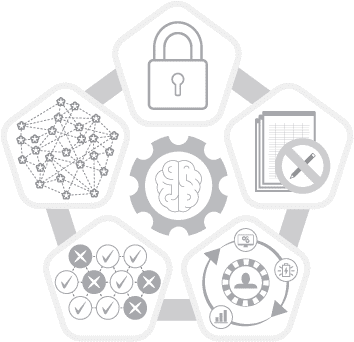
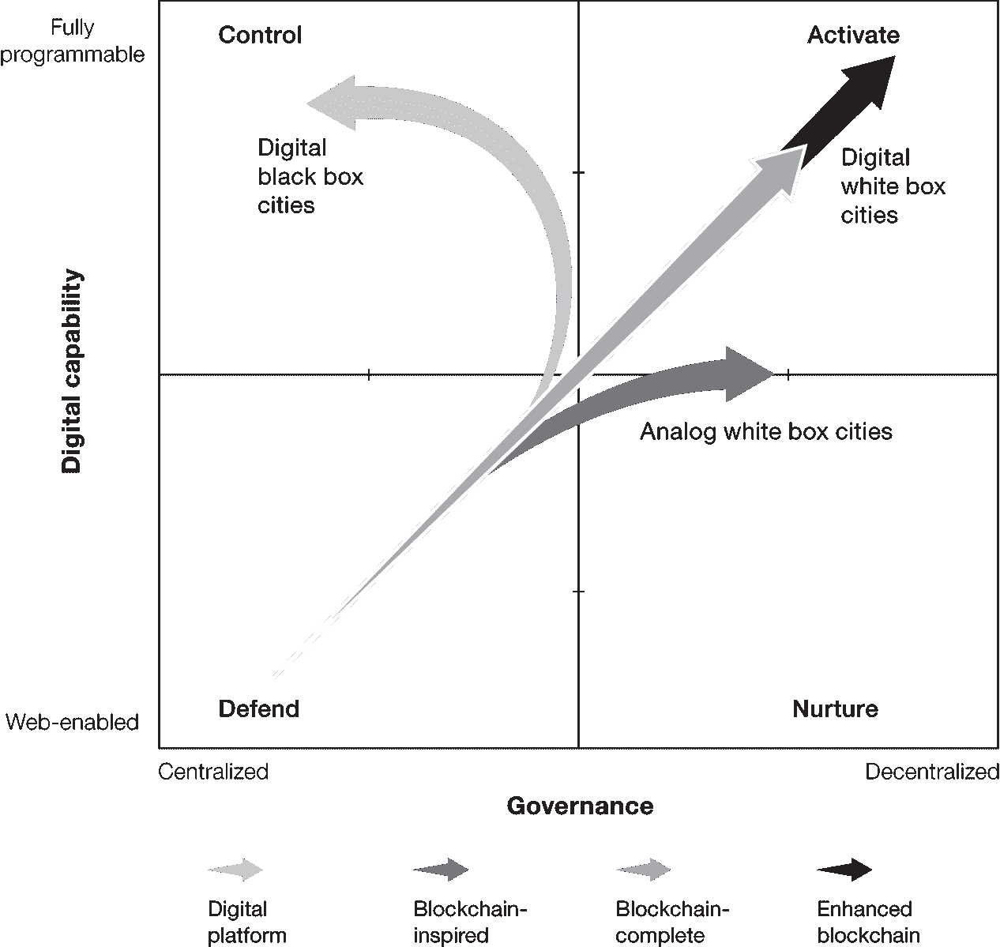
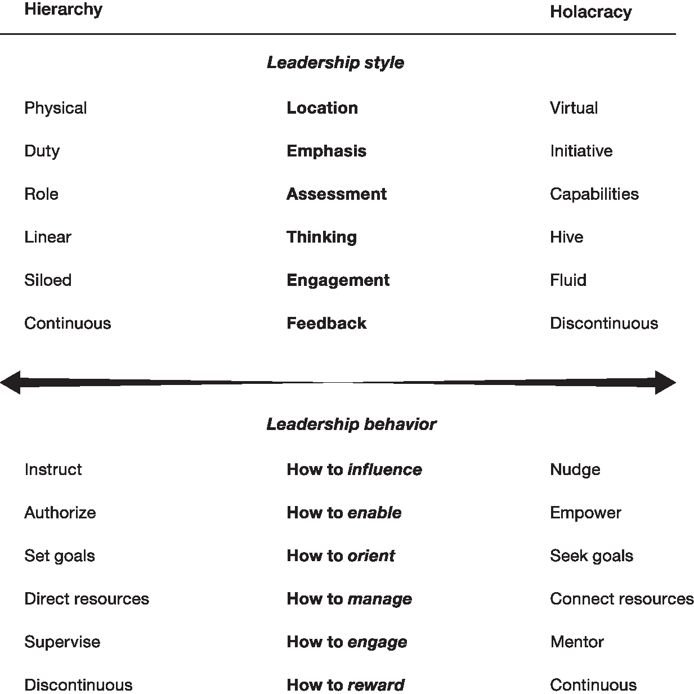
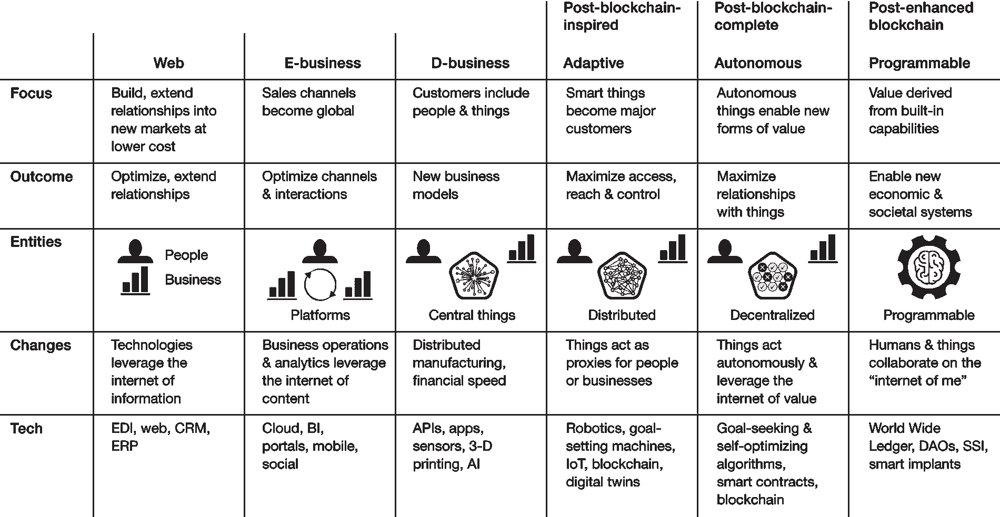
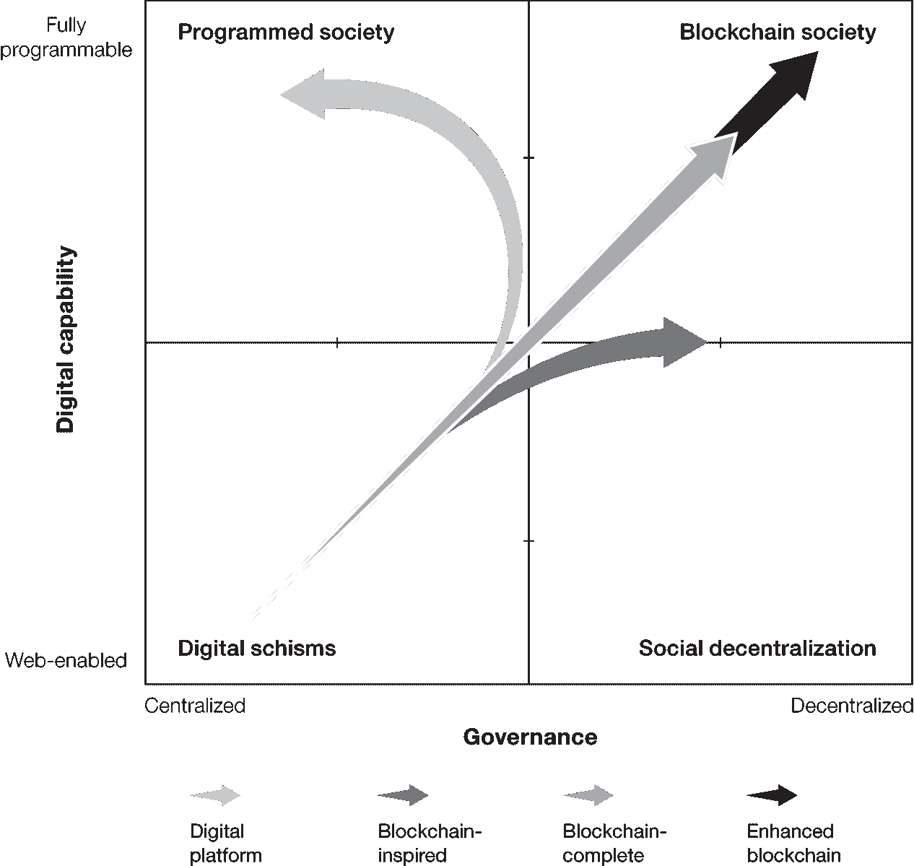

# 第三部分

# 加强型区块链解决方案

# 第七章

# 发挥智能物联网的力量

在当前对区块链的兴奋中，很容易忽视下一个十年将爆发的并行技术趋势。对于区块链而言，其中最重要的是物联网和人工智能。今天我们认为组织主要由人组成。然而，在短短几年内，组织中智能资产的数量可能会远远超过人数，因为组织将在其产品和基础设施中嵌入数十亿台设备和传感器。今天我们认为人们在做决策和采取行动。不久，许多决策将被转化为算法并自主执行。

物联网和人工智能将激活新的价值并推动新的创新。当与区块链集成时，它们将创造出*增强型区块链*，一种智能、自主的事物加入人作为能够识别、创建、交易和协商数字资产的参与者的区块链。创新者已经开始朝着这些协同作用迈出试探性的步伐。

住房紧缺导致中国主要城市出现了非法租赁市场。当真正的房产所有者不在时，保安可能会“租赁”一个单位，或者租户们可能允许非法转租。住房欺诈的挑战正在推动中国尝试不同的方法。在北方城市雄安，规划者们旨在借助区块链打击住房欺诈，提高租户对房产的获取。蚂蚁金服的代表解释了这种方法：“区块链将被用来验证房产的真实性。房东和租户将在区块链上同意租赁的条款和条件。区块链的另一个好处是，当租户申请住房贷款时，他们无需涉及多个机构来证明他们的租赁真实性。因此，这种区块链租赁解决方案使租户能够享受更加便利的房产租赁体验。”[¹] 雄安并不是一个普通的城市；它是一个正在发展的智慧城市。[^a] 除了使用区块链之外，它还使用人工智能和物联网，并具有将所有三者结合起来的潜力。[²] 《AI 超级大国：中国、硅谷与新世界秩序》一书的作者李开复谈到了中国科技公司百度的努力：“百度已经与雄安当地政府合作，以环保为重点建设这座人工智能城市。可能的方案包括传感器装备的水泥、计算机视觉启用的交通信号灯、具有人脸识别功能的十字路口以及停车场改建成公园。”[³]

IoT 和 AI 当然不需要区块链。这些技术已经开始影响我们的生活、工作和互动方式。然而，没有区块链，最强大和普遍的 IoT 和 AI 解决方案将在中心参与者的控制下隐形地在背景中运行——这些参与者包括数字平台、政府实体、公用事业公司和银行等等。相比之下，有了区块链，IoT 和 AI 将变得更加透明和可审计，它们的运作方式可能变得可货币化，从而创造全新的价值创造方式。

在这一章节中，我们将探讨增强型区块链解决方案的作用——这些解决方案被定义为应用于由人和物构成并由自主算法智能操作的环境中的区块链——它如何释放 IoT 和 AI 的潜力，同时确保隐私、公平和获取。鉴于增强型区块链阶段将在另外十年后才开始，本章包含一些猜测和愿景。尽管如此，通过观察 IoT 和 AI 如何在数十个行业中发展，我们将从当今的实验中推演出一些增强型区块链的情景。特别是，我们将探讨 IoT、AI 和区块链如何相互补充，并推动广泛组织朝着竞争优势前进的情况。

## 对 IoT 和 AI 的简要介绍

加特纳将物联网定义为“包含嵌入式技术的物理对象网络，用于与其内部状态或外部环境进行通信和感知或交互。”⁴ 这些嵌入式对象实现了许多实用的应用。例如，在制药行业，药品包装中的传感器可以在条件超过一定水平时激活嵌入式冷却功能，从而节省了数百万美元的库存，并可能挽救生命。⁵ 在智能城市中，物联网可以在公共交通中使用，实时观察需求并动态改变列车频率，或者可以在公共事业拥有的地下管道上放置传感器，以检测故障点并防止主要破裂。

这些想法并不是理论性的。例如，密苏里州堪萨斯城在 2018 年进行了一项试点，使用街道摄像头捕获有关交通流量的数据。一个算法分析了数据并识别出有高风险发生路面坑洼的街道。然后，街道维护人员被派去重新铺设这些街道，*在*坑洼出现之前。堪萨斯城首席信息官鲍勃·贝内特估计，这种预防性维护方法通过在问题严重之前停止问题来节省资金。⁶

区块链上的类似例子来自 PotholeCoin，这是一个旨在去中心化公共基础设施修复融资的解决方案。 PotholeCoin 应用程序允许司机注册需要的道路修复，并提供一个通过代币资助的“赏金”来支付修复费用。当足够多的代币被保存时，区块链向指定的修复组织（市政基础设施部门或私人承包商）发送消息。当修复完成时，公司通过智能合约获得付款。这种方法使社区成员能够集体资助对城市基础设施部门可能不是优先考虑的修复。⁷

人工智能指的是使用先进分析和其他基于逻辑的技术来解释事件，支持和自动化决策，并采取行动。尽管人工智能的方法和技术各不相同，但在区块链的背景下，我们广泛使用这个术语来指代智能算法，这些算法能够自主地进行*调整*（即无需人为干预）以实现更有效的数据管理，从而加快交易流程和互动。当与物联网结合时，人工智能可以检查由分布式和多样化的物联网设备收集的数据，从中得出结论，并实时地对信息采取行动。在城市中，这些行动的简单示例可能包括调整交通信号灯以减轻拥堵，跨智能电网调整能源分配，根据冲突迹象调度警察巡逻，或者像堪萨斯城一样（其在填坑试点项目中使用了人工智能算法来分析视频镜头），优先考虑道路维护。

区块链在这一切中扮演什么角色？物联网（IoT）、人工智能（AI）和区块链正开始以相互有利的方式互动和演进。通过将区块链应用于物联网和人工智能带来的能力，一种新形式的信任基础设施得以实现。通过在实时性中，通过传感器捕获的数据并利用人工智能进行分析，这些数据可以被透明地处理，可能更安全地进行处理，而且不会受到操纵的威胁。由此产生的增强型区块链解决方案将变得更加强大，并将增强物联网和人工智能的有效应用。区块链与人工智能和物联网之间的双向关系都需要更多的细节。

## 物联网和人工智能如何增强区块链

当区块链的设计更加去中心化，其代码能处理更多更复杂的交易时，区块链的好处显然会增加。物联网和人工智能，无论是独立还是结合在一起，都可以作为区块链去中心化的智能代理。让我们看看这两种技术如何实现这一角色。

### 智能合约变得更加智能

正如前文所述，智能合约是捕捉并执行区块链业务规则的代码行。智能合约的最初愿景默认合约将使用智能、自学习的算法来适应环境。换句话说，这些算法可以超越市场的最初定义规则，可能挑战监管框架。

如今在区块链中使用的智能合约并非如此。为区块链启发的解决方案和初创的区块链完整解决方案开发的智能合约只是简单的 if-then 规则引擎，只能执行有限指定的操作。例如，在 ICO 中使用的智能合约定义了提供的代币类型以及购买者可以获得的内容，但它不能根据市场或参与者活动动态更改结果。

今天的智能合约应用范围有限，因为技术尚未成熟到足以可靠安全地在足够的规模上执行更多功能。另一个原因是业务领导者不愿意将控制权交给一行代码。在未来十年，人工智能和区块链都将发展到光谱的增强阶段，并且将有更先进的算法和协议可用。到那时，智能合约可能会足够智能、可靠和安全，能够自主指导和引发活动。人类也将在各种业务领域部署算法方面有更多经验。

区块链初创公司 Fetch 正在进入这个充满抱负的领域，提供了一个解决方案，允许采用者编写和部署自主软件代理来执行特定任务。Fetch 代理可能会将数据从一个参与者传递到另一个参与者，或者执行特定服务。在这个系统中，代理通过 Fetch 代币获得奖励。有趣的是，Fetch 平台允许设计者定义 Fetch 代理运行的工作环境。而人类通常会从地理角度考虑工作环境，一个 Fetch 代理可能被设计为将其工作空间定位为安全性和保障性为主要考虑因素，例如。⁸

### 物体成为节点

就像人工智能可以使区块链智能化一样，物联网可以更广泛地扩展给定区块链的去中心化，特别是随着 5G 的引入。⁹在物理环境中分布的物体数量的扩展会在区块链网络中创建更多的参与者。当然，并非所有的物体都能够捕获数据并运行智能代码，或者做出自主决策。这需要足够的安全性、本地存储器、网络能力、处理能力和本地能量存储，而这些只有一些物体才具备。然而，“复杂”到足够大且强大以具有本地智能并自主行动的物体可以作为参与者——甚至作为具有经济和客户特权的完整节点——在区块链中运行，并以此方式扩展网络规模和价值潜力。

此外，物联网（IoT）可以提高数据的即时性、质量和准确性，例如，通过使一些应用中使用的数据的来源多样化并潜在地分散化，以便没有单个数据点可以决定行动。例如，考虑一下你家里的气候。如果你住在一栋老房子里，很可能有一个恒温器，它测量房间内的空气温度，然后告诉供暖和制冷系统根据那个读数进行调整。如果恒温器在或靠近你的厨房，它所描述的家庭气候情况比实际情况要温暖。相反，如果你在整个家中分布了一组移动温度传感器，并安装了一个可以与传感器通信的网络恒温器，可观察的数据将提供一个更完整的图片。

通过交叉参考来自多个来源的数据，物联网可以改善上传或链接到区块链的数据的质量。从理论上讲，具有多个无偏见的来源可以提供比人类更可靠的世界观。例如，一个直接从汽车内外连接的物品收集数据的区块链可以提供比车主更准确的真相版本，特别是如果该车主倾向于误导潜在买家关于车辆状况的话。物联网在这方面可以促进真相。

### 身份变得分散和主权

在第六章中，我们描述了一个情景，一个在互联网上购物的人将能够将个人数据货币化，并根据需要与营销人员或零售商分享其中的片段。从现在到区块链完全阶段的开始（大约在 2023 年之前），使个人数据货币化的技术仍然不够成熟，部分原因是使用了静态身份标识。

分散的自主身份，或者称之为 SSI，相比之下，是一个动态而不断发展的数字身份，人们可以灵活使用。[¹⁰] 一个人的 SSI 将会在数字系统中识别这个人，并且在不损失隐私的情况下提供安全访问。结合人工智能，SSI 可以支持由所有者部署的自主代理，以寻找机会（例如，在我搬到新工作的城市找一间新房子）并且采取行动（获得抵押贷款预批）。

在各种情境中建立数字身份的需求是一个古老的概念，但却是一个获得了动力的概念。世界网页联盟（W3C）一直在努力定义网络用户所谓的“分散标识符”的标准。[¹¹] 与此同时，非营利性的 Sovrin 网络于 2017 年成立，作为一个旨在在互联网上创建和管理 SSI 的公共服务实用程序的开源项目。Sovrin 旨在创建护照或护照的数字等价物，即一种便携、被普遍接受的身份证明。然而，护照和 SSI 之间的区别在于 SSI 不会由中央实体许可或维护。相反，互联网用户应该能够通过分散的系统提供信息来确认他们的身份并获得 SSI。

Sovrin 在这一领域扮演着多重监督角色。首先，它是一个旨在协调身份焦点区块链及相应用户应用程序开发的非营利性开源项目。其次，它管理着分布式治理框架，该框架旨在遵守现有的法律体系。Sovrin 网络包括五十个组织，被称为“监护人”，其中许多运行着一个节点。这些监护人包括技术公司，如 Evernym —— 一个 SSI 解决方案提供商 —— 平台供应商，如 IBM，网络提供商，如 T-Mobile，以及城市政府等身份合规利益相关者。¹²

与此同时，不列颠哥伦比亚省政府正在考虑将 SSI 技术的概念应用于解决现实问题。在我们最近的一次对话中，不列颠哥伦比亚省新兴数字倡议执行董事约翰·乔丹描述了他的团队为该省企业开发的身份解决方案。正如乔丹所解释的，企业必须跳过几个环节来保持其许可证的有效性。考虑到企业可能需要多个许可证、公司注册证书和其他验证文件，这个过程既昂贵又耗时，而这些文件都是由不同的政府机构颁发的。尽管将这些信息进行整合和集中化似乎是一个好主意，但乔丹认为这种整合方法是错误的。

“我们希望摆脱中央数据管理机构，” 他说。“我们不希望以可能导致数据被滥用的方式聚合数据。我们希望使诸如电子邮件、电话号码等数据的相关性变得困难。” 他继续说：“互联网已经破裂。当交易需要 Visa 或者大规模侵犯隐私的数据存储来支撑时，政府无法在经济中注入信任。”¹³

该省正在与安大略省和加拿大联邦政府合作开发的解决方案，使企业注册机构、许可服务和承包机构等组织能够使用可验证的凭证发布真实数据，这是一种新兴的 W3C 标准。这些可验证的凭证将被发布到使用 Hyperledger Indy 开源软件的公共凭证注册表（OrgBook BC）。这种初始方法是一种自举策略的一部分，为市场提供了准备，以便企业所有者能够持有自己的可验证凭证的软件。不列颠哥伦比亚省和安大略省的省政府设想，企业将使用这些经过验证的数据来建立与供应链合作伙伴等需要的受信任的点对点关系。这些新软件服务共同运作，建立了一个新的全球系统，即可验证组织网络。该网络将促进建立新的数字关系，这些关系是可持续的和可信赖的，无需中央化或中间服务。

加拿大的地区政府并不是唯一一个看到为企业创建可适应的身份解决方案在管理上有价值的地方。在中国南部的大湾区（中国努力将包括香港、澳门和深圳在内的许多城市合并成一个整体经济枢纽的努力的称呼），香港应用科技研究院有限公司（ASTRI）正在探索如何利用区块链技术促进香港、澳门和中国大陆的企业注册，每个地区都有其自己独特的法律框架。如今，注册是一个复杂的过程，企业必须信任未知的中间人在其他市场开设子公司。在这种情况下，正如 ASTRI 的首席技术官梁微基博士所解释的那样，“区块链的角色很狭窄。它只检查数据是否真实，并通过匹配数字密钥进行认证。它解决了一个特定的问题，但对经济发展具有重要意义。”¹⁴

### 身体成为节点

随着 SSI 技术的成熟，我们将看到 SSI 与物联网融合成生物植入物的形式，这些植入物位于人体内并完成特定的任务。生物植入物是医学研究的一个新兴领域。目前的应用包括：可以直接在皮肤下输送糖尿病药物而无需每天或每周注射的植入物；用于提供深度脑部刺激以治疗阿尔茨海默病和帕金森病等特定疾病的脑部植入物；以及“假体记忆”，一种可以在您练习某些技能时复制大脑模式，然后在您需要时为您播放以提供记忆增强。¹⁵ 对于瘫痪或缺失肢体的人来说，研究人员还开发了允许个体通过思考他们想要做的动作来控制假肢设备的植入物的突破性发展。¹⁶

这些进步最终预计将导致可以植入大脑的传感器来捕获脑电数据并执行活动的植入物。脑植入 SSI 可以自主行动——把大脑想象成一个节点。

一些私营公司不愿等待医疗领域提供解决方案。一家公司已经开发了一种可植入手部或指尖的植入物，用于存储加密货币或个人数据。这些实验性的努力今天的价值尚不清楚，尽管它们预示着一种以身体为中心的可能未来。

## 区块链如何使物联网和人工智能受益

就像物联网和人工智能可以使区块链受益一样，区块链也可以使物联网和人工智能受益。区块链网络能够实现更广泛的交易类型，提高真实性水平，并鼓励更多的信任。让我们更详细地研究其中的每个方面。

### 使用区块链，智能物件可以识别和交易。

当今大多数物联网应用涉及将传感器嵌入其制造的产品中，并提供兼容的软件来提取数据并对其进行分析。在这种情况下，物件之间并不相互交互，而是与一个中央平台交互。然而，随着物联网的成熟，交互的多样性和数量将显著增加。5G 技术的引入将有助于这些增加。一个结果将是事物能够直接彼此通信，而无需一个中央平台来调解这种交换。另一个结果将是所收集的信息种类的增加，因此价值也会增加。例如，办公大楼中的物件将能够与五十码远的公用水管中的物件交谈。这些分布式的物件——由不同实体拥有并运行在不同技术上——将需要一种相互识别、交流、协商和交易的方式。

区块链的一个核心价值主张是提供一个架构，用于在分布式、自主的计算环境中进行身份验证和微交易。为了实现身份验证，物品将拥有去中心化的对象等效的 SSI¹⁸。对于微交易，区块链将实现更多样化的价值形式。正如我们在第一章中所说的，法定货币及其代理人（银行账户、信用卡、自动结算所、SWIFT 等）并不适用于可能在物品之间进行的大量、多种类型的资产交易或机器与机器之间的微交易。当数百万这些物品能够交换能源的单个单位或数据项时，任何单笔交易的规模都将远低于 0.01 美元，而交易数量将成倍增加达到难以想象的规模。在这种高交易量、低单价价值的环境中运营，需要新形式的价值和本地货币。

微交易功能扩展到本质上是数字化的资产交换。我们提供了数据如何在代币化环境中作为单个单位或捆绑包进行交换和货币化的示例，或者个人关注如何被出售给内容创作者。单个数据点或五分钟人类关注的市场价值会因市场和环境而异，但一般来说，单笔交易的价值会很微小——每个几美分到几美元。在数百万甚至数十亿参与者之间安全地以极快的速度交换这些价值，需要分散的、自主的、代币化的机制。因此，企业领导者必须意识到代币化在法定货币替代和支付之外的角色。最重要的是能够使用代币来*创建和代表*新形式的价值，并实现这种价值的新微交易。

加强的区块链的第三个交易效果是能够将资产部分交易，而不仅仅是整体交易。保险业中这个想法的一个例子是可调利率定价。最近与客户的讨论显示了在航运行业可能出现不同定价的可能性。例如，智能合约可以就在船舶较低风险或较高风险部分运输的货物进行不同定价（中间部分更安全），或者通过更安全或不太安全的国际路线运输的货物进行不同定价。

### 区块链将数据置于背景中

物联网和人工智能在很大程度上依赖于提供给它们的数据的质量、准确性和安全性。然而，企业领导者长期以来就知道，其中一些数据是脏数据。数据的来源和类型、捕获和组织方式、谁可以访问它、存储位置以及一系列其他问题使数据可靠性成为一个令人头疼的问题。

物联网和人工智能结合起来，从多个来源捕获和分析数据，并从各个来源构建准确的数字视图，这种能力为数据准确性提供了一个好处。当与区块链的共识机制相结合，该机制验证数据及其可审计记录时，这些优势变得更加可靠和有用。共识可以拒绝与正常模式和系统规则不一致的数据。在高容量数据来源中查找不一致之处的能力对于检测设备故障的早期迹象以及检测数据泄露同样有用。有了通过共识验证的能力，任何数据篡改都更容易审计。

人工智能也受益于可靠的数据。专家们使用大数据集来教算法。数据越准确，算法的性能就越可靠；数据越有缺陷，算法就越有偏见。虽然人类在编程周期中的影响也是一个因素，但我们需要避免向这些算法输入有缺陷的数据集。如果算法要克服广泛使用的应用程序中的算法偏见的证据，例如抵押贷款起源工具或刑事判决算法，我们需要使用我们可以收集到的最准确的数据来开发它们。¹⁹

结合区块链的人工智能（AI）和物联网（IoT）的一个应用示例是*数字孪生体*，即通过传感器收集的数据创建的真实世界对象或系统的数字表示。^b 数字孪生体允许组织以数字形式表示物理资产，以更好地管理和交易它们。例如，香港机场管理局已经建立了香港国际机场的数字孪生体，以帮助规划和管理设施，因为机场管理局正在进行机场的扩建。数字孪生体使机场员工能够可视化机场的各个区域，并模拟不同的变化，以查看设计选择的影响。这种建模特性对机场扩建的工程师和零售店店主尤其相关，他们可以更容易地可视化增加如何影响乘客流量。

明确来说，机场管理机构是一个中央集权的组织，其"孪生体"并不驻留在区块链上。将该概念转化到涉及多个设施所有者和利益相关者的环境中，你就能看到，基于增强型区块链的数字孪生体如何从各种流程中获益。设施所有者可以验证数据并保护自己免受错误数据、错误交互和未经授权的用户的侵害。参与者还可以享受访问分发，以便不同地点的人可以与数据进行交互并基于此做出决策。最后，区块链参与者将能够获得替代融资选择，投资者能够看到环境并与其互动，从而推动了融资活动的进行。

## **物联网（IoT）和人工智能（AI）的危险区域**

尽管有诸多好处，但将物联网（IoT）和人工智能（AI）与数据和区块链相结合也存在潜在的陷阱。一个问题源自数据过多。多个传感器收集相同或互补数据，并将重复信息传递给多个系统，可能会增加复杂性和冗余，导致高昂的成本和少量的洞察力。请注意，物联网开发人员使用数字孪生体概念的变体，在网络边缘对冗余数据进行过滤，然后将其带入集中式分析中。

另   另一个风险是数字平台部署并利用各种事物促进中心化，以至于区块链替代方案无法竞争。考虑一个模型，例如，亚马逊部署了数千架送货无人机，然后将它们的剩余容量租给第三方，如保险公司。例如，当保险代理需要房屋图片时，它可以下单，亚马逊可以让无人机在途中拍摄照片以便交付。这种服务的便利性和效果将使保险公司很难在以后转向替代方案，并且亚马逊以非常低的成本获得了新的收入来源——以及新的数据来源。就像特洛伊木马受区块链启发的解决方案通过提供近期价值吸引参与者一样，像这个例子集中式物联网服务可能将事物变成特洛伊大军，将流量和价值引导给所有者。

然而，区块链解决方案可以缓解这一问题，通过实现新的安全的参与模式，避免先前的实物接触和冗长的合同谈判。例如，无人机将成为跨越多个行业运营的公司之间的共享资源，例如零售、物流和保险，从而产生范围经济效益。由于区块链记录的不可变性，这种安排将提高对空中交通规定的遵守，并通过为无人机创建虚拟飞行数据“黑匣子”来促进无人机的保险。从业务模式的角度来看，跨行业的价值交换可能是暂时的，并且可以以微小的面额进行交易。这些交换将产生由智能合同管理的费用收入，从而使数据代币与另一种形式的价值代币进行交换，这两种代币都是通过区块链发行的。例如，一位投资者希望通过农业数据定价商品，可能会请求访问另一家公司使用的无人机生成的数据。通过这种方式，区块链增加了业务交互，并促使在各行业中发现新的机遇，甚至重新塑造了行业界限。

消费者对自动驾驶车辆的发展越来越担忧，特别是在 2018 年 Uber 的一辆车撞到行人之后。²⁰ Google 的 Waymo 也在亚利桑那州钱德勒（Chandler）受到了公民的愤怒，当地人质疑该公司的自动驾驶汽车对他们城市的就业和隐私可能意味着什么。²¹

因此，小型企业，特别是直接面向消费者的微品牌，可能会从使他们的行为透明化中获得最大的好处。而区块链的不可变性、可追溯性和审计功能为各种组织提供了一种方式，可以保持透明度，并证明他们的行为符合他们的意图——这在当今环境中是一个有用的工具，考虑到人们对公共和私人机构的信任水平很低。

## 智慧城市：增强区块链的实验室

城市在商业和政府之间处于奇怪的十字路口。像企业一样，城市需要收入，并竞争吸引愿意支付地方所得税、财产税和销售税的人和组织。但城市还负责提供一系列重要的公共服务，包括执法、学校系统、安全的饮用水和可通行的道路。当收入产生者的需求与服务使用者的需求相冲突时，紧张局势就会产生。

在我们高科技时代，城市竞相争取科技公司的关注，城市面临的挑战已经呈现新的转折。这种竞争呈现多种形式，包括吸引或留住大型雇主（如亚马逊的 HQ2）的备受关注的战斗；科技基金会（如彭博和盖茨基金会）面向城市的资助活动；以及科技公司对城市的追逐，试图在市场上占据一席之地，并与合作的监管机构进行自然实验。城市是数据战争的最新前线。正如人们所说，时间紧迫，因为现在全球一半以上的人口居住在城市，这一比例预计到 2050 年将增长到 65%。

智慧城市的概念被吹捧为解决许多城市增长问题的解决方案。尽管对于什么构成至少智慧城市有不同的定义，但 Gartner 将其定义为一种以提高居民生活水平、刺激经济增长和保护环境为焦点的城市治理的生命周期方法，利用数据和分析来为居民创造以用户为中心和情境化的体验。这一愿景是值得赞扬的，但智慧城市的努力几乎才刚刚开始，尤其是因为它们需要持续的智慧。一些城市已经开始将智慧城市的方法应用于各种问题。

### 存在环境中的智慧创意

堪萨斯城于 2016 年开始实施智慧城市愿景。除了本章早些时候描述的防止坑洞的预防性维护解决方案之外，堪萨斯城的倡议还包括更新其交通系统，使其更加高效和包容，并利用技术来管理犯罪。拟议的变化包括改善低收入、高流量走廊；在机场周围特别是在机场周围的自动驾驶车辆的整合；以及车辆之间和车辆之间的数字连接。巴士和巴士站牌上的传感器旨在提供有关人流、旅行时间和交通需求的准确信息，以便城市可以更好地适应容量和需求。

数据是智慧城市努力的重要资源。在纽约，市长的复苏和抗灾办公室正在使用数据来确定到 2050 年将温室气体排放量减少至 2005 年基准的 80% 的优先事项；这一减排目标是市长的重要目标之一。[²⁸]

考虑在办公楼中使用传感器捕获能源使用数据并使用人工智能分析数据并找到优化效率的方法的好处。DeepMind，Alphabet 的人工智能部门，2016 年就在谷歌云服务器农场中做到了这一点，并实现了高达 40% 的能源使用减少。[³¹]

### 老建筑，新技术，模糊规则

像堪萨斯城和纽约这样的现有环境迫使 IT 专业人员面对在复杂环境中部署智能解决方案的真正挑战。DeepMind 有幸能够使用已知的现代设备。同样，它正在尝试解决一个具有有限变量数量的问题。城市要复杂得多，系统根据年龄和基础设施的不同而变化。

智能建筑的理想状态是与不同系统相关联的传感器（例如，加热与照明）能够彼此交流。如果建筑物正在产生自己的能源或者访问邻居产生的能源，则还需要与隔壁建筑物中的传感器交流。两个建筑物的业主不应该购买相同的硬件或软件来实现这种通信。由于使用今天的技术进行这种交换很困难，城市领导者和技术公司对于他们可以从头开始建设的智能项目感兴趣——正如中国的雄安所做的那样。他们希望获得经验并展示进步，而不受复杂性的束缚。

在加拿大多伦多，一种这种绿色领域的开发正在进行中，城市官员已与 Alphabet 旗下的 Sidewalk Labs 签署了合作协议，计划在滨水区的一个未开发地区建设。这个地区被品牌化为 Quayside，并由名为 Waterfront Toronto 的公私合作伙伴关系管理，该地区的规划包括混合用途的零售和住宅建筑，自动驾驶车辆和室外空间，所有这些都将布设传感器和摄像头，以收集数据并管理人和车辆的流量，能源使用，废物管理以及城市生活的其他方面。

多伦多的码头似乎是约翰·乔丹在不列颠哥伦比亚省分散式 SSI 计划的智能对立。尽管乔丹试图让政府不再管理公民数据，但通过 Sidewalk Labs，Quayside 看起来似乎意图捕获尽可能多的信息。尽管官员们发出了保护隐私的正确声音，但目前的数据政策使许多数据规则未定义。据报道，2018 年 10 月的顾问委员会会议上，Sidewalk Labs 重申了其打算清除收集到的数据中的识别细节，但表示不能保证项目中其他参与团体会做同样的事情。这种隐私影响使安·卡沃基安——安大略省前隐私专员兼 Sidewalk Labs 的顾问——感到震惊，她辞职了。安大略省政府随后撤销了三名市政代表的多伦多滨水局委员资格，称他们加速了流程，并未允许市、州和联邦利益相关方以及公民的评论进行足够的监督。³³

一个建造有单一平台和同质技术的码头可能会在能源效率、废物管理以及人类和车辆交通等方面产生更好的短期效果。然而，这些好处是有代价的；对公民数据的控制（以及随后的商业化）将被转让给一个私营公司。这种权力的集中在一个民主社会中是有问题的。当一个人选择使用 Gmail 或 Google 时，他有其他竞争性的选择。但当一个人开车在街上时，他的行为被摄像头捕捉并由与他无协议的第三方存储，这是另一回事。

隐私倡导者担心这种集中式模式所设立的隐私先例。堪萨斯城的市民在考虑他们的城市智慧努力时也有同样的担忧。改善其低收入社区中的交通系统的计划包括安装光纤电缆以实现 Wi-Fi。但是同一个项目还带来了摄像头，以及枪声检测系统，这让社区成员担心城市的新智慧系统还捕捉了他们的什么其他信息。³⁴

### 智慧城市中的区块链

隐私与技术之间的紧张关系并不局限于城市。它适用于更多数据与更智能的算法相结合，能够提取洞见的任何地方。我们突出的智慧城市示例暗示了市政领导者在城市环境中采取的不同方法。一些努力着眼于通过物联网（IoT）、人工智能（AI）、区块链或所有这些技术共同推动的日益去中心化的环境中改进数字化。而其他人则试图通过数字化来进一步集中化。图 7-1 说明了这些场景。

图 7-1

* * *

可编程性与强化区块链的去中心化对比

* * *

西北象限代表着在中央集权控制下高度数字化的环境。可以称之为城市的*数字黑匣子*。算法是特定组织或机构的财产，对于那些算法影响行为和行动的市民来说，它们是不可见的。这一象限中智慧城市的示例包括中国政府控制的雄安以及截至 2019 年 1 月，由 Alphabet 的 Sidewalk Labs 及其合作伙伴控制数据的多伦多 Quayside 的提议模型。在城市中，控制当然可以由政府拥有，但也可以由技术提供商甚至大型房地产所有者拥有。

重申一下，集中化的方法在技术效率和互动性方面带来了好处，但在公民隐私、潜在的独立性和利益公平分配方面却存在成本。在城市的黑匣子中，技术事物不可避免地成为监视的代理。它们提供了控制社区成员的方式，引导他们以特定方式行事。人工智能加速了对数据的行动，并可能提出新的想法，关于收集什么数据来监控和影响公民行为。

社会评分引发了不同的反应。一方面，存在损害社区的行为，全球各地的城市都希望加以限制。乱扔垃圾、过度使用能源或水资源、倾倒危险物品、暴力、犯罪、欺诈、剥削——这些只是其中的一部分。控制部门的核心人物可能合理地主张，他们的方法可以更快、更准确地监督这些行为，因此可以制定更相关的政策和方法来管理它们。但是，对于已经习惯了隐私的民主社会来说，代价可能太大了。

一个选择是在城市环境中使用数字工具是可选的——我们称之为*模拟白盒*。纽约的建议是升级建筑，属于这一类别。政府已经发布了针对想要更高效的供暖和制冷系统的建筑业主的指南；其中许多指南包括传感器技术。同样，该市倡导分散式能源发电，以减轻当地公用事业公司康埃迪森的压力，并使城市能源系统更具抗风暴或沿海洪水的韧性。这些建议的数字化效应是最小的，同时它们促进了所有权和决策的继续分散化。这个象限代表了一个中间步骤。如果能源使用政策变得更加严格，或者城市感到来自其他环境更具吸引力的城市的竞争增加，包括那些由数字黑盒启用的城市，建筑业主、公司、市民和其他利益相关者将感受到更多的压力，变得更数字化、更集中化，或者两者兼而有之。

或者，城市可以朝向不列颠哥伦比亚省的乔丹方向迈进，将公民数据的控制权交给所有者——*数字白盒*模型。算法的参数和意图属于决定如何塑造它们以影响期望行为和行动的公民所有，而区块链结合物联网和人工智能虽然不能解决数据隐私和使用的所有挑战，但起着重要作用。由区块链实现的数字环境中物品收集的数据，结合去中心化的 SSI，可以以保护安全、问责和数据隐私的方式通知社区资源的可用性和发展需求。去中心化的数字城市可以成为一个更具交易性和社会响应性的环境，因为公民可以为分享数据获得公平价格，并了解数据的使用方式。这些交易不仅仅是为了利润，还涉及到诸如获得住房、公共交通、清洁空气和绿色空间等社会利益。去中心化的数字化还可以通过使城市合同招标过程公开和可审计来提高地方政府的透明度。这些系统仍然可以通过使用代币来激励和奖励来引导行为，但它们是以透明的方式进行的。

城市和市民会选择哪种方法？随着区块链带来新的社会机遇，我们很可能会在全球范围内看到符合数字白盒或数字黑盒情景的情况。对于将个人数据控制权交给谷歌等数字平台的担忧是挑战中心化的强大动力。因此，包括企业及其高管在内的公民利益相关者需要了解在利益相关者环境中如何使用物联网和人工智能算法，如果他们想要影响并倡导这些工具的公平透明使用。为此，公民必须积极参与。幸运的是，增强的区块链为企业领导者提供了可持续参与的工具，通过代币形式的“推动”，向客户、公民和其他利益相关者提供奖励和激励。最终，增强的区块链帮助人们采取行动，获得社会或社区的利益。

## 你的真实商业视角

### 你学到了什么？

区块链、物联网、人工智能和自我主权身份（SSI）的并行发展将在 2020 年代中期到晚期融合在增强的区块链解决方案的伞下。物联网和人工智能单独或联合可以促进去中心化并改善区块链。物联网可以增加区块链网络的节点数量并提高数据质量。人工智能可以通过自学习算法使智能合约更智能化。添加 SSI 解决方案通过为所有参与者（包括物品）提供便携式 ID 来提升区块链的功能；智能物品必须能够向交易对手识别自己并与其交易。

利用这种共生关系的解决方案已经在智慧城市项目和其他地方出现。多伦多码头开发和堪萨斯城出现的紧张局势凸显了在城市现代化与安全和数据隐私之间取得平衡的重要性。设计有分散式治理的增强型区块链解决方案可以平衡这些紧张局势。

### 你应该采取什么行动？

人工智能正在更广泛地嵌入技术中，并在几年内使各种机器能够做出自主经济决策。这将在有区块链或没有区块链的情况下发生，但企业领导者应该探索增强型区块链解决方案如何发现新的、符合道德的商业机会。

一些人对人工智能和物联网发起了持续的反击，他们担心隐私侵犯以及机器取代呼叫中心或汽车驾驶员的经济影响。作为领导者，你不能低估组织内外都需要多少透明度和企业社会责任来帮助利益相关者理解人工智能和物联网的利弊。区块链可以帮助你向利益相关者展示，你的行动是合适和符合规定的，你对个人数据的尊重是高的，使用不可变记录。

也要注意，数字巨头可以利用专有的智能设备将物联网和人工智能变成特洛伊木马，以巩固市场地位。如果你早期投资增强型区块链解决方案，可能会建立起另一种市场地位。

### 下一步是什么？

由共识管理的增强型区块链环境对构建和使用它们的组织如何调整其各种功能具有深远的影响。当运营活动和决策已编码到智能合约中，或者在更先进的情况下，编码到 DAO 中时，组织会是什么样子？它将做些什么？业务文化和领导力将如何适应？你的组织准备好面对一个你的产品、客户和员工由物品或代码行表示的世界了吗？当你的员工由人类和算法的混合表示时，你将如何领导？我们将在下一章探讨这些问题。

# 第八章

# 区块链组织

在增强型区块链光谱阶段期间以及之后，机器和其他物品将变得非常强大，这一点很难言之凿凿。AI 启用的系统将能够在一秒钟的时间内积累成千上万个生命周期的业务规则和其他信息，并对其进行处理。在区块链上，自执行的 dapps 将自主处理信息、得出结论并进行交易。在那个世界里，人类领导意味着什么，领导者将如何履行这一角色？当组织不再受到可识别中心的驱动时，它们会是什么样子？

对于越来越多的组织及其领导者来说，这些问题涉及到他们想要实现的基本目标。ConsenSys CEO、以太坊的创始人之一 Joseph Lubin 告诉我们：“如果我们将世界包裹在即时通讯的层中，并且我们有像以太坊和比特币这样的共识技术，仅仅这种共识形成的概念就对我们如何建立组织产生了影响。我们正在构建的技术激励我们尝试一种新方法。”¹

当我们考虑到共识不仅可以在区块链上运行，而且可以在一个组织的结构中起作用时，我们受到了计算机化群体的新兴研究的启发。群体行为指的是动物（如蜜蜂或鸟类）在进行迁徙等集体活动时的集体行为。在飞行过程中，群体的领导权会传递给不同的成员。领头的鸟类利用自然界的共识算法来确定谁参与以及承担什么角色。[²]

计算机化的群体是计算机科学家实验的对象。在 2018 年冬季奥运会的开幕式上，群体在韩国平昌展示，同时也出现在 Lady Gaga 的 2017 年超级碗中场表演中。[³] 在这两个例子中，无人机被编程以编排的方式移动，并在指定的时间发光。但科学已经超越了预编程，走向了自主协作。2018 年 6 月，《科学机器人学》杂志发表了一项研究结果，科学家们开发出了第一批能够以集体智慧运行的无人机群体。换句话说，这个群体是去中心化的，每个无人机都自主决定何时何地以及如何移动。[⁴]

从群体化的无人机到在区块链上汇聚在一起集体进行商业交易的群体化分散自治组织（DAO）只有一步之遥。 DAO 或这些组织的集体可以在多个功能（如金融、法律、合规、通信）上发挥作用，就像一群蜜蜂包括蜂后、工蜂和雄蜂，每个人都在做不同的工作。或者一群 DAO 可以整合资源并执行个体成员无法独立完成的交易，类似于 Swarm 基金整合零售投资者的资源以购买机构资产（见第六章）。

群体为领导力如何从层级模式向着激进、自动化和自治的人机协作寻求价值的模式演变提供了一个有用的隐喻。尽管区块链对组织的确切影响仍然是一个巨大的未知数，但在未来几十年内，今天占据组织时间和资源的许多任务将不复存在，或者由机器处理。在这种情况下，组织将需要以与今天不同的方式领导、激励和奖励人们。鉴于可能的变化以及对变化确切性质的不确定性，本章是关于区块链组织的一次思想实验。我们试图回答诸如以下问题：在区块链环境中，哪些组织结构将占主导地位？哪种领导方法将成功？哪种类型的人才能在由人工智能和物联网组成的分散环境中发挥作用？在去中心化和自治组织以及参与者的世界中，如何激励和奖励利益相关者？

## 区块链上的组织

对于许多在传统公司环境中度过职业生涯的人来说，理解以共识驱动设计构建一个或多个增强型区块链运行的去中心化区块链组织的概念将会很困难。人们与去中心化组织建立联系和参与的方式看起来与今天普遍的方式截然不同。在人们组织方式、得到的指导、做事的时间和原因以及工作的激励和报酬方面存在巨大的差异。去中心化区块链组织可能会对组织的结构和成功的领导风格产生影响。

在可能改变组织的区块链技术上，还将设计面向组织的区块链解决方案，用于实现新的结构、分配领导角色以及允许人才同意项目或角色的方式。例如，总部位于伦敦的初创公司 Colony 将其解决方案定位为技术架构的“人力资本层”。Colony 允许组织定义他们需要做的事，并将结构和人才需求分解成可行的部分。

在第一级别，用户创建一个殖民地（即组织），然后定义工作领域（例如，财务，法律，营销），这些工作领域与一系列任务相关联，任务是殖民地中最小的工作单位。殖民地在不同的上下文中使用标准词汇来描述参与者在殖民地中扮演的各种角色。管理者定义需要完成的任务，工作者完成任务，评估者决定任务是否以必要的质量水平完成。

参与者通过完成任务来积累声誉，从而晋升到他们的角色（经理、工人或评估者）。完成的任务越多且质量越高，声誉就越好。声誉越好，参与者在群体中扮演领导角色的机会就越大，参与者在群体产生的价值中所获得的份额也就越多。对 Colony 的择才精神至关重要的一点是，如果参与者停止贡献，声誉就会下降。早期的投资不会让参与者在一个企业的终身价值中拥有任何股份。在一个以谁以什么样的质量做了什么为组织原则的环境中，个人的魅力、偏好、吸引力、毕业于何处，以及他们的朋友是谁都不会对其产生影响。没有人能够依赖自己的影响力。激励和奖励是基于持续不断的贡献的。

在 2019 年，Colony 的解决方案尚未投入运营。我们强调这家初创公司并不是因为它本身的组织情况，而是因为它所代表的理念：一种以功绩为基础的工作环境，其中领导和福利都是流动的。当我们将 DAO（去中心化自治组织）的概念与类似 Colony 这样的区块链组织工具相结合时，我们会看到组织如何结构自己，以及领导者如何进入权力地位都发生了重大变化。让我们更仔细地研究这两个方面。

### 从等级制到全能组织

等级制度长久以来一直是主导的商业领导标准和最常见的组织方法⁵。几个世纪以来，它一直为我们保持系统中每个参与者朝着共同目标努力工作提供了便利。我们可以将其长寿部分归功于企业管理的应用纪律和许多二十世纪的思想家的影响。例如，弗雷德里克·泰勒、赫伯特·R·汤恩斯和亨利·L·甘特都是科学管理的主要贡献者；弗兰克和莉莲·吉尔布雷斯将个人效率目标应用于团队；彼得·德鲁克帮助奠定了现代管理理论的基础。通过他们和其他人的贡献，集中和等级制的组织总体上比更水平或扁平的组织享有更高的生产力。学者们将这种生产力归因于组织内清晰的关系网络和由此产生的奖励体系。这些元素使参与者能够有效地相互交流并获得好处⁶。

然而，等级制度也有其缺点。⁷ 这些挑战包括在面对变化时缺乏灵活性，在决策方面官僚化的决策过程既缓慢又不了解工作实际情况，决策者与与客户互动最多的人之间的距离过大，以及领导者的偏见。陡峭的等级制度在需要各种专业知识和观点的活动中也往往表现不佳。当世界经济主要由制造实物产品的公司主导，而连接依赖于固定电话和铁路时，对这种范围的需求是不寻常的。但是，在数字环境中，尤其是受移动、数字、社交和最近的区块链解决方案影响的情况下，对这种需求的需求是正常的。在所有这些情况下，传统的管理方法都缺乏提供所需的多样化能力。

一些组织早就看到了等级制度的局限性。在数字时代之前很久，一些激进分子就看到了更扁平、更去中心化结构的敏捷优势。在她们的书籍《异类经济》中，Alexa Clay 和 Kyra Maya Phillips 描述了十九世纪英国海盗采用的平等组织结构。由于海盗活动的风险由所有人共担，海盗们以集体的形式运作，每个人都有投票权，并且每个人在赃物中都获得平等的份额。在战斗中，“船长”只在战斗期间具有不同的权威性。⁸

更现代的非等级制企业的例子包括长期以来以联邦组织方式运作的伊利诺伊工具公司（ITW），该公司有一个设定标准和战略的中心核心，但让各个独立运营单位保持本地领导和决策。如果这家传统机械制造商的一个单位变得太大，领导者会将其分成几个较小的部分，以便每个单位都能保持对市场的创业方式。ITW 采用这种模式已有数十年历史，如今成为一个价值 143 亿美元的公司。⁹

强生公司同样以其联邦模式而闻名。前 CEO 威廉·韦尔登（William Weldon）在 2003 年解释说，强生公司的分散结构是其消费品包装、医疗器械和制药部门多样化产品线的产物。不同的关注点、目标客户和监管复杂性要求每个产品都作为一个独立的业务运营，并拥有独立的领导层。¹⁰ 韦尔登表示，保持这么多独立单位的一致性是一项挑战，但由于分散结构带来的增强韧性，这种努力是值得的。如果一个功能出现问题，它不会影响其他功能。¹¹

还有一家距离等级制度更远的公司是 Zappos，一家在线鞋类和服装零售商，正在进行一项与整体组织有关的激进实验，即使用一种称为 holacracy 的组织方法，将决策权分散给自组织和自治的团队。尽管观察者注意到自采用 holacracy 组织结构以来，Zappos 的劳动力流失空前，但组织内部的领导者将这种流失视为变革的自然副产品。并不是每个员工都想成为这个实验的一部分。¹²

正如 Zappos 所展示的，习惯于明确界限的人可能会对去中心化组织的协作要求感到不适。Zappos 的领导对采用去中心化组织的挑战持乐观态度，但对于任何试图进行根本性重组的组织来说，改变文化的困难是真实存在的。在为这本书做研究时，我们与几位有去中心化组织经验的领导进行了交流。其中一位受访者是一家国际制造企业的前高管，该企业正在拥抱组织去中心化。这位高管匿名同意分享他的经验，他报告说，去中心化模式在个别业务单元的水平上运行良好，这些单元开发特定产品和业务模式，并在市场上作为协作、自组织的代理商运作。然而，他们的全面转型受到持续的层级化和中央化行为的阻碍，这些行为来自运营服务职能，如财务、营销和人力资源。这些服务职能的领导仍然要求业务单元在释放预算资金、促成新的招聘或承包、设计营销活动或提供其他中央化功能之前获得批准。

ConsenSys CEO Lubin 分享了他对领导一家从事激进实验的年轻组织的看法。 “ConsenSys 正试图摒弃自上而下的命令和控制。然而，这可能会导致在中央集权组织中能够获得的明确性和问责制的丧失。”¹³ 公司将需要新的流程来确保明确性和问责制。 Lubin 还说，作为一个去中心化的组织并不意味着它完全拒绝分层的方法。例如，通过明确协议，在一个项目中可能会发展出一个短期的分层结构，以便在一种情况下，A 负责向 B 汇报，而在另一种情况下，B 负责向 A 汇报。

这两位高管的经验表明，要按照区块链的协作精神运作，领导者需要保持警惕。否则，很容易滑向“免费”带来明确性或问责制的做法，正如 Lubin 所说的那样。文化会吸引某些类型的人。在保留所有人员的同时改变组织结构，不论他们的倾向如何，都会制造冲突。为了更深入地研究这一观察，让我们看看领导风格如何在区块链这种无领导环境中发展。

### **从权威到参与**

在分层命令和控制的环境中，领导者通常因为展示了独立作出强有力决策的能力而上位，而无需下属的输入。换句话说，他们可能会变得威权。或者，他们可能因为能够官僚化地遵循正式或非正式规则的指南而上升。最后，他们可能是具有魅力的，并因个人亲和力吸引员工并影响他们的行为。¹⁴

然而，在增强的区块链环境中，威权主义、官僚主义或魅力型风格不太可能取得成功，鉴于平等参与、开放获取和开放贡献的理念。加入所有将通过人工智能做出自主决策的技术要素，你将有另一层自主性和自我寻求的对象，它们将具有相当大的影响力。区块链通过去中心化、共识以及代币形式的个人激励和奖励赋予了这些独立运动部件力量。在这种环境中，很难想象权力会流向从房间前面发出指令的领导者。

更可能的是，优势将倾向于擅长协作式领导形式的人，包括所谓的参与式领导和仆人式领导，这些方法早在区块链出现之前就存在，并且在数字领域之外具有动力。¹⁵ 例如，汽车巨头丰田因其强调对员工的指导和培养而被视为仆人式领导的典范。这不仅仅是说说而已。丰田组织其报告结构（应该注意的是，这是分层的）以确保没有领导者拥有超过八个直接报告对象。¹⁶ 这样做的目的是为领导者提供他们需要的时间来指导他们的直接报告对象，同时也从他们的直接领导者那里接受关于业务线责任的指导（自我发展是丰田式领导的另一个核心原则）。

这些协作式领导运动并不一定依赖于区块链，但这种领导和区块链是相互补充的。更重要的是，那些自然倾向于合作并鼓励群体共识的领导者，在去中心化环境中将比依赖地位权威的人具有优势。

### 在没有追随者的情况下领导

要考虑组织结构和领导行为与区块链的关系，我们将重新审视蜂群。这些结构展示了与区块链领导力相关的几个特质。

首先，蜂群具有分散的协调。技术蜂群并不是传统意义上的团队。没有领导者，参与者也不是被选择的。蜂群是全面自治的：参与者自主选择加入蜂群，并在其中进行自我管理。这种特质表明成功的区块链领导者将擅长界定目标或问题，并鼓励合格的参与者选择加入项目。明确的目标界定、所期望结果的清晰定义以及明确的激励机制使参与者能够加入并采取有利于个人和整个网络的行动。像 Colony 或 Bounty0x 这样的区块链解决方案，一个发布任务的区块链解决方案，可以提供组织和参与者执行愿景的技术机制。¹⁷

其次，蜂群在规模和活动范围上都是动态的。曾经组建或参与过敏捷团队，或者其组织采取了数字化转型的双模式方法的领导者对这种团队发展方式应该不陌生。^a 区块链领导者将需要类似于敏捷领导者的技能。他们必须保持广泛的视野，看到不同部分之间的联系，并确定任何需求。区块链领导者不会采用自上而下的沟通方式，而是将会连接可能不知道彼此的人、事物或资源。¹⁸ 领导者将持续这样做，直到事情变得足够智能，可以相互发现并互动。

第三，群体对其环境做出响应并适应。如果成员获得新信息，他们可以自主地转向另一种行动方案。在这种环境中，领导者也需要迅速适应新信息。如果证据表明环境已经改变，他们不能过于执着于五年战略计划或任何其他预先确定的结果。图 8-1 总结了在分散且非分层的区块链驱动环境中所需的领导风格和行为，与传统的等级制相比。

图 8-1

* * *

从等级制到全体治理的领导风格

* * *

## 传达你的存在目的及如何实现它

领导者将如何吸引和激励在逐步分散的环境中的人们？与所有组织一样，分散的组织需要制定方法来吸引能够在其分散文化中蓬勃发展的参与者，并阻止那些不能的人。为此，正如斯蒂芬·柯维三十年前建议的那样，你需要“从最终目标出发”[¹⁹]。在其最简单的术语中，领导分散增强的区块链环境需要一种愿景。

当你的组织能够自主寻求价值、自我组织、与其他自主组织合作和互动时，你的组织存在的原因以及它如何完成其设计任务必须得到明确定义。传统组织具有人类思维过程缓慢节奏和季度董事会会议固有的自然审查和平衡，可以更灵活地制定规则。

只需考虑 DAO 在一个人类工作日内可以进行的业务量。理论上，该组织将能够访问大量数据，从中得出结论，并在你早上从床上到咖啡机之前执行数千甚至数百万笔交易。组织在几分钟内能够进行的交互数量或范围将没有限制。拥有这些能力的两个组织之间的竞争条件可能取决于机会主义或道德上最小的差异。竞争压力将会非常激烈，可能会导致公司降低价值创造的底线。我们真的希望 DAO 在没有任何限制的情况下运作吗？我们想让这些组织能够串通作弊吗？关于用算法取代人类判断的短期经验——执法和抵押贷款批准，就是其中两个领域——表明算法可能具有与人类相同的偏见。作为领导者，你将需要一些方法来对算法决策进行审查，评估它们的变化，并确定这些变化是否公平。

除了公平和道德之外，对区块链上的去中心化业务进行检查的原因与今天的检查一样——因为法律要求进行这些检查。尽管它们通常落后于技术采用，但法律最终会鼓励某些商业行为并限制其他行为。区块链可能会加速监管的反应，因为不可变的记录使监管者能够更轻松快速地审计您的行动，任何监管救济都可能同样动态，因为监管者将拥有相同的工具。

超越法律，还有价值观。尽管弥尔顿·弗里德曼（Milton Friedman）著名地声称，企业的唯一责任是为股东创造利润，但许多领导者——也许更值得注意的是，客户们——认为企业应该以一定程度的尊重对待促使其繁荣的人和资源。

领导算法固有的挑战与领导人的挑战一样重要。幸运的是，这些挑战密切相关。两者都将推动领导者明确愿景、使命和价值观，因为对于自己存在的原因和所做的事情有一个理由有助于集结所需的人才和资源。这为分散应用程序（dapp）中编码的规则和条款提供了一个框架。^b 从这些规则中，你可以吸引参与者来帮助你追求组织目标。这种方法为人们提供了根据自己的能力参与的机会。一旦人们加入进来，你将需要一种评估他们工作质量的方法，为他们的贡献进行补偿，并为他们留下或回归创造激励措施。区块链在这里也可以发挥作用，使审计工作记录并用代币奖励质量成为一件容易的事情。

Lubin 谈到了 ConsenSys 在这方面正在尝试的一些区块链机制。例如，ConsenSys 的“赏金”计划列出了需要资源的倡议。“我们正在让聪明的人加入我们的项目，”他告诉我们，“我们可以明确工作内容。在 Gitcoin 上，如果项目或公司喜欢他们，我们可以雇佣这些人。” 关于明确需求的重要性，Lubin 提出应该将其作为组织与贡献者之间基于区块链的具有法律约束力的协议的一部分：“明确愿景、使命、运营目标、董事会、咨询委员会、完成工作的方法。识别软件开发团队遇到问题的故事或问题。我们需要这些机制，以及反馈机制。团队将有方法明确他们的预期结果以及每个预期结果的单一负责人，以及争端解决、仲裁 - 所有这些都是协议的一部分。”

Lubin 和其他我们交谈过的人传达的信息表明，去中心化组织对清晰度的要求非常高。只有当您能清楚地阐述您需要的资源时，您才能吸引它们。当然，一旦您拥有这些资源，您将需要识别和支付它们的方法。区块链也将在奖励方面发挥作用。

### 通过区块链赋权工人

人才招聘和管理的挑战是长期存在的。根特（Gartner）2019 年的首席执行官调查报告显示，32%的受访者认为他们在未来三年内需要对人才基础进行实质性或完全变革[²⁰]。2018 年由会议委员会（Conference Board）进行的首席执行官调查将未能吸引合适的人才列为受访者关注的首要问题，高于需要创建新的业务模式以应对颠覆性技术[²¹]。普华永道（PwC）第二十一届首席执行官年度调查同样显示，全球 80%的首席执行官认为他们的组织没有他们需要的数字技能来竞争[²²]。区块链为领导者和人才相互找到、共同工作、创造价值和获得补偿带来了新的选择。

在数字环境中吸引人才不能忽视临时、合同和零工模式日益增长的影响。在模拟世界中，存在一个强大的、不断增长的全球人才供应产业，以短期为基础来获取人才[²³]。像 Lyft 和 Uber 这样的零工平台提供交通服务，而 TaskRabbit、Upwork 和中国的 Ziwork 则提供非运输、劳动密集型活动的机制来获取工人。据摩根大通公司研究所的研究显示，自 2013 年以来，美国在这些平台上的工作者参与增长了 300%[²⁴]。在西欧，据信每个国家有 9%至 22%的工人通过数字平台找到了一些工作[²⁵]。看到了这个潜力，大型组织正在采用零工模式来补充自己的员工。会计公司普华永道推出了普华永道人才交流，以应对不稳定的人员需求，而《华盛顿邮报》则开发了专有的人才网络，用于找到自由记者[²⁶]。总之，仅在美国就有超过 1600 万名工人在合同、自由职业或临时角色中工作[²⁷]。

数字化获取自由职业和临时工作者的趋势势不可挡。与现有的工人匹配机制、确认工作和补偿工人的机制存在的问题也是不可争辩的。鉴于这些挑战，区块链初创公司自然而然地提出了新的解决方案来调解零工和临时工作。

Heymate 于 2018 年在瑞士推出了一项解决方案，该解决方案促进了工人和雇主之间的交易，避免了像 Upwork 这样的零工平台上常见的价格竞标。²⁸ Workchain 提供了一种区块链工资支付解决方案，旨在实现工作完成后的即时支付，这在零工经济中是一个重大问题，因为在一些平台上工作完成和工人收到支付之间存在很长的滞后时间。Workchain 通过一种解决方案促进了及时支付，允许注册工人完成工作，将工作验证上链，并立即将他们的钱发送到一个可以提取现金的 Visa 预付借记卡的 Workchain 钱包。Workchain 还提供了一种形式的工资贷款，允许表现良好的工人提前获得未来收入的预付款。

另一个旨在解决基于零工的人才招聘和管理问题的区块链解决方案是位于澳大利亚悉尼的 ChronoBank。ChronoBank 的解决方案 LaborX 是一个区块链劳动力平台，允许雇主和工人连接并创建工作安排。²⁹ 雇主用 LH（劳动小时代币）购买工人的工作时间，该代币与参与雇主所在国家的最低小时工资挂钩。³⁰

经济日益全球化的趋势同样需要使雇主更容易支付位于另一个国家的工人的解决方案。初创公司 Bitwage 正在解决这个问题，提供跨境工资单区块链。支付是以比特币进行的，并且 Bitwage 管理将工人支付的比特币转换为当地货币。³¹ 至于寻找合同或自由职业工作的人，Bitwage 有一个招聘部门，与广告职位匹配工人。

ChronoBank 和 Workchain 分别在处理组织领导者和为他们工作的人之间复杂关系的一个方面。可以将它们视为有着极大抱负的区块链启发，因为它们专注于将为去中心化数字环境翻译的现有流程。其他组织，例如本章前面描述的初创公司 Colony，正在进一步重新构想人才供应和解决透明度和奖励带来的持续参与问题的工作。

### 透明度和奖励

区块链组织最有趣的一点是可以赋予领导者和工作者选择共同工作以及了解彼此工作情况的权利。这是一个根本性的改变。雇主们喜欢说，拥有高需求技能的工作者有权力，因为组织需要他们满足客户需求。高需求工作者可能有一些权力，但这种权力会因为企业政策对员工薪酬和福利的限制以及他们可以工作的地方而减少。评价方法也通常会由上至下地决定一个人的产出如何被评判和奖励。对于普通员工来说几乎没有谈判的余地；即使是非常高级的员工也会碰到严格的限制。

区块链企业可能会改变这种等级制度带来的根本性透明度。算法化的区块链组织只有在公开它们所做的事情、他们需要完成的工作以及需要完成这些工作的技能时才能运作。工作者的产出质量将会公开接受审查，领导者的工作也会如此。奖励也会是透明的，并且会使用代币进行发放。

区块链不能对实现特定输出所需的要求模棱两可，工作完成与付款之间的关系，或者将工作者或领导者分配到职位的基础。透明度、不可篡改性和可审计性确保了这种清晰度。将流程（例如员工目标和目标）转化为算法所需的定义性纪律将迫使组织和领导者变得具体。领导者有时甚至需要倾向于绝对主义，以控制和限制链上活动的方式定义人才需求。

具体性也并非排除偏见。组织可能会不知不觉地将偏见嵌入到区块链中，从而影响其人才管理计划。领导者在定义需求并批准参与区块链网络时需要格外小心。区块链组织——就像所有组织一样——需要坚定的伦理标准。

我们正看到区块链在人才招聘和管理中的早期应用。例如，人力资源功能正在探索区块链解决方案来验证申请者的证书。区块链初创公司 APPII 提供了一个平台用于此目的。一些工具还允许员工开发技能和更新认证，就像我们在教育部门中突出显示的解决方案捕捉和存储学生证书，并将学生与教师匹配进行技能发展。这些示例与分层组织结构兼容，并从组织的角度设计。这种观点适用于今天的分层环境，尽管我们建议 Colony 提出的双向平衡愿景，即领导者评估工作者，工作者评估领导者，提供了一个更有趣和更有价值的未来模型。如前所述在图 8-1 中，从传统的自上而下结构转向更灵活、水平的结构意味着向全面自治制度（holacracy）的转变——Zappos 采纳的组织模型。

Holacracy 中的人员会主动采取行动，定义并追求自己的目标，并随着技能的增长或发现新机会而调整这些目标。在实际操作中，工作者（人类或事物）将选择是否竞标任务或参与项目；他们不会像今天的大多数环境中那样被分配任务。重要的是，可选择加入的模式可以像对内部人才库一样轻松地用于分散式劳动力。该模型可以通过将所有参与者都标识为一组数据令牌化来运行，该数据记录了他们的技能、知识、证书、可靠性、首选时间表和过去的成就。Lubin 表示，ConsenSys 正在尝试使用一种奖励制度，奖励那些填写入职信息或将其技能档案放入可以用于参与项目的令牌化钱包的人。同样的方法也可以应用于你作为领导者。

这种激进的透明度可以通过信息公开带来客观性——我们敢说公平吗？通过获取信息，工作环境变得更加客观。技术所赋予的另一种选择是*未来宪政*，这是一种治理模式，其中商业社区定义了特定企业成功的衡量标准，然后利用预测技术来确定哪些行动最有可能带来期望的结果³²。未来宪政是经济学家罗宾·汉森构想的一种政府模式，已被区块链社区所接受，已经出现了几个预测市场，包括 Augur、Stox、Gnosis、AlphaCast 和 Hivemind³³。

这些市场可以更清晰地展示特定项目的需求和潜在贡献。领导者和工作者都将根据具体产出进行评估、补偿和奖励（通过代币）。与表现相比，受欢迎度、个人关系和公开自我倡导的能力对薪水水平和奖金比例的影响会更小。在匿名环境中（假设匿名环境中已经消除了已经在其中识别出来的算法偏见，因为人类在编写智能代码方面变得更加优秀），基于种族、年龄、性取向或身体特征的歧视会较少。在一贯高质量工作的情况下，多年前犯的大错将不会被严重评估。奖励不是通过领导者的“权威证明”获得的，而是通过合作者的“能力证明”获得的。奖励流向和控制的这种变化可能会直接影响行为。如果工作者知道他们可以获得更大的利益，他们会贡献更多吗？领导者是否会更加一贯地投资于他们共事的人和他们监督的项目？

## 区块链领导力的挑战

我们将本章定位为对区块链广泛应用如何改变领导力和组织结构的思想实验。尽管区块链有很多前景，但与组织相关的一些主要挑战也很突出。尽管今天的环境很少提示这些挑战可能是什么，但它们包括领导责任、监督和默认行为。我们一一来看看它们。

在我们的客户中，区块链中责任问题经常被提起，主要是在不确定性的背景下。例如，领导者们在考虑到如果两个匿名参与者之间的活动被视为非法时谁来负责。如果一个解决方案有多个所有者并经历了一次昂贵的违规行为，谁承担风险？

当一个组织在集中式环境中违反监管指导方针时，监管机构会寻求领导者进行妥善处理。在极端情况下，这些领导者可能会被监禁。这是一个相当好的激励因素，使他们保持在法律的正确一边。然而，正如我们在本章中一直强调的，与在物理世界中运作的分层组织不同，分散式组织在网络上自主展开业务并没有像在传统分层组织中那样的领导者。在这种情况下，一个 DAO 甚至能够被监管吗？DAO 是否应该像传统以人为中心的组织一样受到监管？如果发生监管违规行为，即使是由于数百万行代码中的一行错误造成的，谁应该承担责任？我们不知道这些问题的答案，监管机构也没有公开就区块链治理的监管细节发表意见，除了一些关于加密货币的对话。

另一个具有复杂影响的重要问题是决策监督。在物理环境中，大多数决策是由人类做出的，存在着自然的制衡。领导者会听取来自上级、同事、下属和客户的意见。而在区块链上运行的算法则没有接收到这样持续的输入。意外后果最终会变得清晰，但可能仅在数百万次交互和交易之后才能显现出来。

区块链纯粹主义者相信，如果共识机制足够大，它将排除错误决策。我们认为，把这种机制的安全性视为理所当然是不明智的。我们对人工智能使用周围伦理结构和治理的缺乏加剧了我们的担忧。组织可以决定作为政策将领导监督编码到 DAO 运营中。但随着 DAO 不断增长到成百万行的代码，应用于多个司法管辖区并不断更新，保持政策一致性和权威可能是具有挑战性的。概括而言，监督和治理没有简单的解决方案。

影响领导力的最终问题是默认行为。人们倾向于默认一套硬编码的习惯在行为心理学中有充分的文献记录。组织也容易受到默认值的影响，正如克莱顿·克里斯滕森在《创新者的窘境》中强调的那样。当前的领导力关注区块链作为一种技术来加强当前的商业模式，而不是作为一种促进去中心化和新商业模式的工具，这在当前的默认行为中已经明显可见。

可以承认，现在还为时过早。当今的领导者尚未不得不改变，但当计算机能够在一个拇指驱动器大小的机器上保存和分析整个行业的整个历史时，他们将会这样做。当寻求价值的对象能够识别全新形式的价值时，它们会迫使组织适应吗？只要人类编写算法并教给它们，代码就会反映人类的思维。原则上，如果思维倾向于公平、包容和道德底线，它的存在可能并不是坏事。如果思维倾向于排斥和维护旧模式或权力，那么算法可能会有问题。谁来决定？我们如何确保算法决策不会限制区块链解锁新经济价值的承诺，使其处于一个不那么偏见且更具协作性的环境中？

## 你的真实业务视角

### 你学到了什么？

增强型区块链解决方案的广泛采用可能对组织运作方式和领导者的领导方式产生深远影响，因为自主、自我寻求的机器和 DAO 的增多将创造一个人类和算法可以共同创造价值的环境。

群体提供了一个有用的隐喻，说明人类和机器如何共同实现特定目标，然后分开并重新组合成新的配置以实现新目标。像 ConsenSys 和 Colony 这样的组织展示了人们如何参与活动、积累声誉，并根据他们的贡献获得奖励的一瞥。

全局性、未来志向性和预测市场使参与、协作和决策更加有效，并且通过领导者和组织的透明问责制。它们之所以能做到这一点，一种方式是利用数据预测哪些选择或行为可能导致哪些结果。理论上，这些信息激励参与者朝着他们想要的结果努力工作。

### 你应该怎么做？

你需要清楚你的业务目标和目的。在分散化的环境中，人才和资源将会自主决定与你合作，因为他们对你的目标和目的感兴趣。为了保持这些资源的参与，采取措施来评估你的领导风格和组织结构，并将它们与更加全局性的工作和参与方式对齐。

也寻求关于如何领导、与算法和算法实体如 DAOs 合作和管理的建议。寻求法律框架以及道德、伦理和基于价值观的结构作为指导。

最后，认识到由于引入自主代理，您的组织文化将发生变化。审视您当前的奖励和激励机制，看看它们是否能够鼓励您组织内的人才进行合作。确保您已经建立了多方面的反馈机制，以改善结果、责任和争议解决。考虑您的奖励机制将如何影响员工与自主代理合作相关的行为。

### 接下来是什么？

对于商业组织来说，参与、合作和激励同样重要，对于政府组织和地方社区以及“全球和本地”（既全球又本地）的公民社区来说也是如此。在下一章中，我们将扩大视野，探讨区块链在社会层面的作用，并探索分散式基础设施和代币化如何为一个可访问、参与和创造价值的区块链社会打开大门。

# 第九章

# 区块链社会

当我们开始写这本书时，我们的目标是帮助商业领袖了解区块链如何今天和明天被用来重新定义谁是您的客户和合作伙伴以及您如何与他们互动。然而，即使关注商业，我们对区块链的研究也总是涉及它如何从根本上改变更广泛社会互动规则的方式。毕竟，企业既依赖于社会，也是社会的促进者。社会建立了企业运作的基础设施，而企业则通过就业、经济参与和应用创新来滋养社会。我们不能谈论其中一个，而忽视另一个的影响。

如何打造一个技术和商业友好的新社会契约的模型已经在区块链世界中出现。其中最引人注目的模型之一正在爱沙尼亚进行。该国建立了一个名为 X-Road 的数字平台，并将爱沙尼亚政府机构与之连接。X-Road 既全面又受控：它支撑着从医疗保健到金融等各种私人和公共服务，但没有一个个体服务可以在未经信息所属者许可的情况下访问另一个服务的信息。给定记录的查看也被跟踪记录，查看者对信息的权利也得到了验证。

在短短几年内，**X-Road** 在爱沙尼亚社会中变得如此重要和可靠，以至于企业在其上构建他们的平台。芬兰政府同样租用 X-Road 作为其数字基础设施，引发了关于公民服务的可移植性、边界的性质以及政府主权的新问题。爱沙尼亚正在通过一种允许非爱沙尼亚人申请爱沙尼亚居民身份，并随后在那里建立他们的企业并缴纳税款的 e-居留权模式来提出这些问题。作为一个资源有限、地缘政治易受影响的小国，爱沙尼亚正在吸引欧盟企业家，以争取长期经济独立。

考虑到爱沙尼亚仅有 130 万居民，X-Road 只需满足伦敦或纽约（人口超过 800 万）等地的一小部分需求，更不用说墨西哥城或北京（人口超过 2000 万）了。然而，这个国家在认识到允许点对点信息共享的网络的重要性方面并不孤单。区块链显然可以在此基础上发展，并可用于重新塑造社会服务和参与的更广泛能力集。立陶宛——拥有高科技部门、廉价互联网接入和复杂的金融科技和监管科技（解决监管问题的技术）倡议——已经拥抱了加密货币，并在 2018 年的 ICO 投资排名中位列世界第三，仅次于美国和中国。² 马耳他政府已介入，以监督智能合约和 DAO 的发展，从而使区块链发展合法化。³ 在瑞士，楚格州政府基于以太坊发行了数字身份证。日本已实施了监管指南，允许加密货币交易。阿联酋正试图作为其“智慧迪拜”计划的一部分实施区块链基础设施。⁴ 这些例子和其他例子表明，区块链作为赋予社会力量的工具正在获得越来越多的关注。⁵

本章探讨了区块链对社会和社会结构可能产生的影响，以及随着区块链的成熟，社会可能如何做出反应或调整。在整个章节中，我们既采用了组件化观点，又采用了整体观点。我们研究了区块链技术的独立应用如何重新塑造实践或结构，以及这些组件如何在数百甚至数千个支持区块链的账本中展开，从根本上改变社会结构。我们从定义开始：什么是区块链社会？

## 选择区块链社会

几年前，我们和高德纳公司的同事展开了一项研究工作，描述了与互联网、移动技术、云计算、大数据、社交媒体、物联网、人工智能和区块链相关的技术进步在未来的结合。我们想详细说明这些技术趋势如何个别和集体地推动人类、物品、企业和社会互动方式的变化。当时，我们将这一结合称为*可编程社会*，因为我们相信这种互动将依赖数字技术，但会影响人们如何聚集形成社区并参与持续的社会互动。

我们设想的可编程社会位于技术、商业和社会进程的终点，这一进程始于万维网的出现。十年后，这一进程演变为数字化业务的早期阶段，通过采用 Gartner 所称的“力量的交汇点”来描述移动计算、社交媒体、云计算和大数据的综合力量。从数字化业务——我们现在所处的位置——我们的经济和社区将首先经历一个可适应业务的阶段，在此期间，第一批 AI 启用的智能代理将通过其算法定义的方式寻求价值并进行交易，然后将发展成为自主业务，到那时，这些智能代理将独立适应和演化（见图 9-1）。

图 9-1

* * *

可编程社会之路

缩写：AI = 人工智能；APIs = 应用程序接口；BI = 商业智能；CRM = 客户关系管理；DAO = 去中心化自治组织；EDI = 电子数据交换；ERP = 企业资源规划；IoT = 物联网；SSI = 自主身份认证。

* * *

许多技术元素将推动向可编程社会的势头。例如，网络化物品将继续蔓延，并且像量子和边缘计算这样的高级计算能力将变得更加可行。高级人工智能将用于商业应用。物品之间的微互动和交易量将急剧上升。强大的中心角色正在投资所有这些技术，以确保他们自己对网络和数据的访问或所有权。这些角色包括政府、金融机构和强大的公司（包括数字平台提供商）。

同时，对社会变革的渴望也很强烈，并将继续如此。在 2008 年金融危机之后，各种意识形态倾向的公民开始质疑传统中央中介的可信度。全球化和技术自动化显然带来了巨大的增长，但也带来了明显的意外后果，最显著的是收入不平等的增加。法定货币长期以来一直被视为信任的象征，因为法定货币意味着一个受信任的权威——中央银行——对信贷金融机构在系统的最佳利益和借款人偿还借款资金能力方面做出了定性判断。当这些机构需要用纳税人的钱来拯救时，对他们的百万富翁领导者没有任何后果，这是社会契约的一种违反。

客户和企业向中介机构（包括银行、保险公司和政府领导人）明确授予权力，写法律来监管它们。这种权力是有条件的；为了保持这种权力，机构必须证明有了它们，世界会比没有它们更好（承认不同的行动者以不同的方式定义利益）。社会成员还向搜索引擎、手机、智能家居设备、社交媒体平台和 GPS 等我们所有人用来管理生活的设备授予隐含的权力。然而，随着数字化和社交媒体为人们提供了对明示和隐含权威如何交叉甚至篡夺彼此的见解，现在很明显，曾经信任的机构正在推动许多公民不同意或不受益的目标。分歧变得更加明显，各个层面的信任都在消失。

技术能力的进步与社会的明显紧张关系表明，我们的社会制度和基础设施是脆弱的，甚至可能是破碎的。现在世界上的每个国家都在不同程度上经历着相同的政治、社会和经济压力。最常见的表现是公民无法满足食品、住房、收入、医疗保健、教育和金融服务等基本需求。作为媒体的消费者，我们无法相信我们的报纸或电视新闻的真实性。我们的政府基础设施需要修理、升级和扩建。气候事件正在威胁着人们的生命和生计，人们被迫离开家园。社会中不同群体之间的信任受到威胁，民主社会正变得更加两极分化。

技术进步可能以许多方式加剧这些社会问题。技术可能会破坏企业历来获取利润的价值来源。这些进步也可能导致工作过时，并对未来的收入机会产生不确定性。AI 在社会领域的控制和应用可能会强化对谁能够获得社会资源的偏见。当然，相反的情况也可能成立。技术进步可能会缓解这些问题。

简而言之，可编程社会有着多种可能性。作为领导者和公民，我们如何管理技术的破坏并协商社会的薄弱环节将决定我们未来社会的样貌。在第六章中，我们在分散式金融和其他地方的讨论中，强调了分散式系统可能对资源和机会的公平获取以及确保问责制产生的影响。当我们升级到社会层面时，个别企业和机构所做的选择将为未来可编程社会产生两种可能性。图 9-2 描述了这些不同的道路。

图 9-2

* * *

编程社会与区块链社会

* * *

在一个运行在可编程但集中式系统上的社会，其潜力可能是十分奥威尔式的。在这个*编程社会*中，极少数组织可能拥有大量关于个人行为、活动、财务、消费模式，甚至健康和 DNA 的信息。在这种情况下，*选择*将被诠释为“数据经纪人从中获益最多的选项”。隐含的社会契约是，个人和组织都放弃对数据、数字资源访问、相关合同和技术的控制，以换取消费主义和在数字平台上的可见性。新闻组织可以以选择性和误导性的方式呈现信息。工作和社会参与带来的回报将被不平等地分配。人权可能会受到广泛限制，例如通过限制对健康服务的资格、某些大学的入学资格，以及在某些社区购房的资格。组织可以将招聘限制在具有期望的 DNA 资料或根据由垄断利益设计和受益的社会信用体系的人员范围内。

一些读者会嗤之以鼻，认为社会永远不会允许这样一个奥威尔式的世界出现。但其他人已经生活在那个世界里了。数十亿人在日常互动中经历系统性偏见。尽管几乎每个社会都有一些好的地方，但人类普遍未能使社会的所有成员都能平等获得社会权利和公共资源。这种失败在各个层面都存在，无论是组织层面还是政府层面。一些形式的剥夺意味着有意的（例如，当因性别、种族、年龄或组织资历而剥夺群体的选举权时），一些则是偶然的（例如，当缺乏照片 ID 导致某人无法获得健康服务或投票时）。在一个被程序化的社会中，这种偏见可能会加剧，因为定义特权以及奖励或剥夺特权的能力将变得更加容易、更加自动化，并且应用范围更广泛。

有些人和组织希望看到这种集中化的未来实现。他们希望为某些群体确保权利，同时剥夺其他人的权利。如果技术能帮助这些个人更快地拒绝某些人访问资源，他们会利用它。这可能会发生得非常快。只需考虑右翼民粹主义运动在匈牙利、波兰、美国和英国等国家迅速获得的影响力，即使在当今技术水平相对较低的情况下也是如此。这些运动给人以为人民服务的印象，特别是对那些感到有权力但却被某种方式隔绝的人。

与之相反，依靠可编程但去中心化系统运行的社会具有公平和赋权的潜力。社会参与者控制着自己的数据，并被赋予通过有效和积极的参与来倡导他们的观点和他们的社区的权力。只有在我们在本书中讨论的技术被商业化规模化部署时，去中心化的社会模式才会出现。去中心化的治理模式，如 holacracies 和 futarchies，同样将促进更具赋权的模式。社会契约将使个人和组织能够解放数据，并为他们提供对数字资源、相关合同和其他技术的访问，以换取更深入的参与和捍卫和建立自己的核心价值观的能力。

我们称这种去中心化模式为*区块链社会*。它使自我表达、获取、价值交换和社会利益分配变得公平。这种社会不是由一个账本在网络化、数字化环境中运作，而是由一系列相互交织、重叠的去中心化区块链网络所构成，形成一个能够进行跨网络交易的网格。第四章 提及了这种互操作性，展示了如何将奖励点变形为首先在一个供应商处使用，然后在生态系统中的多个提供商处使用的代币。在另一个互操作性示例中，游戏代币可以在新的聚合平台上跨多个游戏使用。在 Gartner，我们将这种互操作的区块链网络网格称为全球总账（WWL）^a。WWL 使 dapp 和分布式账本能够独立或作为任何集中式组织内的嵌入单元来推动 DAO。因此，WWL 引入了一个全球信任框架，允许去中心化和集中式的组织单位和操作共存。

当然，还有另外两种可能性。如果社会经历了数字扩张的硬性限制并保持其当前的集中模式，我们在社区中经历的*社会分裂*将变得更加根深蒂固，且越来越多地成为反乌托邦。或者，经历了有限数字化并变得更加去中心化的社会可能会经历*社会去中心化*。在这种情况下，社区或部落的公民可能会集合数据以访问有限的数字资源和相关合同、技术，或者作为影响这些群体社会结果的一种方式。鉴于当前数字化的步伐以及区块链社会提供的更大机会，这种情况似乎不太可能是可持续的。

社会将随时间浮出水面？我们预测会是一个编程或区块链社会。我们得到的是哪一个取决于您作为公民和领导者的选择。在数字化复杂的环境中，社会将像往常一样形成，基于部落、地理、文化、语言、经济或意识形态的联系。但在区块链社会中，参与者将选择他们的归属。社会也将随着时间的推移保持凝聚或解体，这取决于实施参与者定义和修订的社会契约的权利、法律和机构。通过对身份、选举权和其他形式的社会参与的普遍获取，区块链可以为社会中所有参与者提供更广泛的接入和参与。让我们看一些例子。

## 区块链社会中的身份

世界上有超过 10 亿人口的一大部分无法证明自己的身份。⁷妇女和年轻人受到的影响特别严重，无家可归的人也是，包括在约旦生活的超过 67 万名叙利亚难民。⁸缺乏身份证明使得难民很难获得联合国世界粮食计划署（WFP）提供的食品援助。⁹作为回应，世界粮食计划署尝试了一种基于区块链的虹膜识别解决方案，允许在约旦阿兹拉克难民营的难民进入当地合作超市，选择他们的食品项目，并进行虹膜扫描以自我识别到 WFP 的区块链平台。然后，通过将购买者的身份与 WFP 分配给他或她的食品券相关联来验证和认证交易。该解决方案最初是以数百名难民的试点项目开始的，现在正在考虑将其推广到所有在约旦生活并接受 WFP 支持的 50 万叙利亚难民身上。观察者指出，随着时间的推移，区块链身份解决方案可能会扩展到其他用途，例如验证工作计划的证书。

### 从约旦的阿兹拉克到美国的德克萨斯州奥斯汀

联合国利用区块链技术的工作已经激发了世界各地其他团体考虑使用区块链来解决类似的获取和识别方面的挑战。像难民一样，无家可归的人通常缺乏身份证明。当你没有住的地方时，很难保管财物，而没有实体身份证，你就无法使用社会服务。

“最明显的例子是利用弹出式卫生诊所，”得克萨斯州奥斯汀市首席创新官 Kerry O’Connor 说道。¹⁰“人们可以去那里注册城市[医疗]项目，然后去找一个初级医护人员。但在三个月后继续看医护人员，你必须有身份证明；居住地证明，因为这是针对城市居民的项目；和收入证明，因为这些诊所是为收入低于一定水平的低收入人士保留的。”

德克萨斯大学奥斯汀分校戴尔医学院的数据整合主管 Anjum Khurshid 听说了约旦的 WFP 实验，并告诉了 O'Connor。当 O'Connor 调查后，她看到对奥斯汀无家可归人群和为他们服务的一线工作者有多重好处：“案工人员要花很多时间去取得文件或详情，以使受赠人能够获得案工人员没有报酬提供的服务，”她说道。

O'Connor 团队开始了区块链计划，并确定了它想要触及的人群，这些人是奥斯汀市一万名无家可归者中的主要群体。¹¹“如果你量化一下，”O'Connor 解释说，“每个进入无家可归状态的人[以及与社会服务接触的人]都要被评估他们的各种脆弱性。他们是否有瘾？是否遭受虐待？是否患有疾病？等等。从这些评估中，他们会得到一个分数。分数高的将得到最多的资源，但如果最不脆弱的人需要等待[住房或服务]，他们的情况通常会恶化。所以我的团队开始思考，当这些人的情况不那么危险时，我们如何能更快地帮助这八千名得分较低的人，也许帮助他们摆脱无家可归。”

怀着这个人群的考虑，O’Connor 和她的团队于 2017 年 10 月申请了彭博慈善基金会市长挑战，并获得了第一阶段的资金进行测试和创建原型——这是申请全额彭博赠款的必要步骤。团队成员设计了一个解决方案，将包括所有可用的社会服务和每个服务机构所需的文件。他们决定专注于与文件相关的元数据：与其要求提供出生证明或社会安全卡的副本，区块链将确认该人物是否与经过验证的出生证明或社会安全卡相关联。然后，该解决方案具有一个机制，让人员在服务站点登录并验证自己。

O’Connor 在 2018 年 8 月提交了她的市长挑战最终提案。在我们的对话之前不久，她听说这个提案未被接受。尽管如此，她并没有放弃为她的城市开发一个“最小可行产品”的资金。

“当涉及到技术时，”她说，“我们没有花足够的时间讨论它如何帮助我们社会中最弱势的成员。” 她反思了她花在开发和测试区块链身份解决方案上的时间：“我们有这个想法是因为我们花时间思考医生、案件工作者、警察、图书馆工作人员等人是什么样的，我们花时间从基层视角看待与无家可归者打交道是什么样的。这是一个系统问题。我参加的每个会议都有来自不同领域的工作人员，他们都说，‘天哪，如果我们能共享信息该多好！’ 如果你考虑他们的痛点，同时也考虑赋权问题，就必须以人为中心的视角来看待，即使是你认为没有资源或能力利用它的人也是如此。”

### **身份作为力量**

使用你的识别信息来为自己谋利是一种权力形式。我们在营销和数据平台中探索了这个想法的多个应用。将这个想法延伸到区块链社会，我们看到了身份驱动解决方案在医疗保健、制药和医学研究行业的潜在应用——这些领域在社会和私人市场之间存在交叉。

健康领域一个巨大且令人垂涎的识别方面是个体基因组。像 23andMe 这样的公司允许消费者支付几百美元来对其基因组的一部分进行测序。个人使用这些套件来了解其种族遗传或确定是否携带与疾病相关的某些基因突变。就公司而言，他们存储这些序列并出售对数据的访问权给第三方，如研究人员或制药公司。那些基因组数据所指的人没有被告知他们的数据何时被共享；他们也没有因其使用而得到补偿。在医疗和药物研究行业，对遗传信息缺乏控制是很普遍的。我们并不是说人们不应该分享他们的数据，而是说共享应该是每次都可以选择的。

区块链使选择成为可能。总部位于英国的区块链初创公司 Genomes 正在构建一个区块链平台，个体可以选择在其基因组解码完成后立即添加进去。当公司或研究机构对基因组的某个部分有疑问时，所有者可以选择性地解锁访问权限以换取价值。这个基因组数据库可以通过提供一个新的更大的数据池（由于参与激励和改进的隐私保证）来使私人和公共研究机构受益。公民也受益于有一种（理论上）安全的方式来存储遗传信息。

初创企业并不是唯一一个倾向于使用区块链来保护医疗数据的。我们在前几章中重点介绍的台北医科大学医院解决方案的开发者们对区块链解决方案抱有希望。一旦他们将所有患者数据输入系统，区块链网络将创造一种更灵活的方式来识别研究候选人，然后利用平台来捕获和跟踪研究数据。

如果区块链能够捕获有关细胞和 DNA 的数据，那么它能否用同样的方式捕获突触和脑电波的数据呢？哲学家梅兰妮·斯旺（Melanie Swan）提出了*区块链思维*的概念，即将思维和其他认知体验（也许最终还包括意识）收集为“心智文件”并上传到区块链。¹³ 斯旺对这种解决方案提出了几种应用的推测。例如，心智文件区块链可能在因年龄、受伤或疾病而导致的记忆丧失时增强记忆，或者它们可以用来创建数字孪生体以测试未来的场景。

## 社会与表现

身份直接关系到选举权。因此，旨在验证身份的同样区块链活动也可以帮助增加选民参与选举。世界各地的民主国家都在努力寻找一种无歧视的方式来确保只有具有选举权的人行使选举权，并限制每位公民的投票为一票。然而，选举制度的缺陷导致了不均等的访问以及在确保可靠的选票计数方面的错误和延迟。

面临的挑战激发了对区块链投票系统的实验。例如，美国西弗吉尼亚州在 2018 年开发了一个系统，解决了驻外军事人员低投票率的问题。部署的公民有资格使用邮寄选票进行投票，但一些军事成员从未收到选票，只有收到选票的一小部分人寄出了选票。¹⁴ 作为回应，西弗吉尼亚州政府与一个名为 Voatz 的区块链初创公司合作，为居住在海外的西弗吉尼亚人开发了一款移动投票应用程序。¹⁵ 总共，来自三十个县的 144 名海外人员下载了该应用程序，完成了注册过程，并在 2018 年 11 月选举中投了票。¹⁶ 这些数字是有意小规模设计的，Voatz 的方法受到了区块链的启发。¹⁷ 但作为概念验证，西弗吉尼亚的实验指向一个未来，更多符合条件的选民可以行使他们的权利。

其他国家和地方政府正在进行类似的与投票相关的应用程序实验。奥地利维也纳正在考虑将区块链作为一种保护各种政府数据的方式，包括选民名单。¹⁸ 日本筑波市的官员测试了一个区块链系统，允许市民对地方发展项目进行投票。¹⁹ 瑞士楚格市正在进行一项多层次实验，发放电子身份证，然后允许市民在投票应用程序中使用它们来验证自己的身份，然后参与地方政府民意调查。试验中提出的问题包括市民是否认为应该提供电子系统用于支付图书馆罚款或停车罚款（试验性民意调查结果不具约束力）。²⁰

提高选民参与度以及结果的加密、不可变和可审计记录，为预测算法在投票系统上运行铺平了道路。社会中的预测工具可以实现未来政府，这是经济学家罗宾·汉森提出的一种治理模式。在未来政府中，社会界定了广泛的福祉指标，并使用预测工具评估哪些政策或方法最有可能实现期望的结果。对于选举存在明显的担忧。例如，如果早期选票开始偏向一种方法，它们是否会影响人们跟随群众投票，即使结果与选民个人信仰相冲突？但是，更容易将社会团结在一起并引导货币投资或政策的潜力是令人着迷的。

迄今为止，预测市场的经验还有限于一些实验。然而，社会成员希望根据地方共识积极引导本地投资的想法正在获得推广，特别是为了确保更高水平的问责制和行动导向的政策。

## 社会与投资

财政资源对社会的运作同样重要，如同对企业一样。然而，很少有话题能像政府对财政资源的使用那样引发更多冲突。让社区成员选择如何支配社会资源可能会提高他们的参与度。甚至可能会产生更多的财政资源：经济学家发现，如果纳税人被允许选择他们的税款资助预算的哪些部分，他们愿意支付的金额是将资金放入一般基金池时的两倍²¹。

多个在地资源控制实验正在进行中。在孟加拉国，一家名为 ME SOLshare Ltd 的公司与德国咨询公司 MicroEnergy International 合作，为该国农村地区的社区提供可以发电并实现能源交易的太阳能电池组。ME SOLshare 与当地的非政府组织（NGO）和基础设施发展有限公司（IDCOL，孟加拉国政府拥有的发展银行）合作，为无法得到中央公用事业服务的社区提供装备，并使用一个硬件系统监控并将能源重定向到其他消费者。移动支付系统和一个移动应用程序（非区块链）协调支付。

在纽约布鲁克林，分散式能源的众多区块链实验之一正在进行中。在 LO3 Energy 的帮助下，这是一家提供区块链能源解决方案的公司，与为纽约市提供服务的能源公用事业公司 Con Edison 合作，一个微型社区建立了一个微电网，自行发电并将其出售给附近的其他人。²² 布鲁克林的实验得以进行，是因为一群房主已经共同购买了太阳能电池板。 LO3 Energy 和 Con Ed 随后与电池板所有者合作，创建了监控发电量的平台和应用程序，而不是将多余的能量馈送到 Con Ed 系统，使没有电池板的当地人可以购买多余的能量。分散式能源的实验受到城市政府的明确支持，后者有兴趣探索减轻纽约老化基础设施的方法。

去中心化资源的概念并不新鲜。非政府组织和发展机构投入了大量资源用于小规模移动解决方案，用于能源、水、医疗保健等社会服务，结果参差不齐。一个未解决的问题涉及捐赠者或安装者离开后对物理基础设施的维护和修复。地方社区并不总是知道如何修理损坏的设备，或者缺乏修理所需的零部件。当共享资源损坏时，谁应该承担费用也不明确。因此，非政府组织和发展金融机构正在投资于社区参与。他们正在积极与当地代表合作，使社区投资反映当前的需求。基础设施的生命周期视角越来越成为这些对话的一部分，而区块链可以通过提高可追溯性、可见性和减少欺诈或腐败来促进这一过程。通过支持对资源的公平获取和分配，区块链将使其金融和社会影响更为显著。

一个不同的、以金融为驱动的社区投资模式来自 Neighborly，该公司与市政当局合作，确定需要资金支持的当地项目，然后发行市政债券来为这些项目筹集资金。地方政府可以利用该平台筹集资金用于学校建筑维护、道路修复、公园基础设施以及其他社区资源。区块链记录了持有发行债券的人，并确保这些投资者在债券到期时获得回报。由于这些债券是正式注册的并具有官方评级，它们风险较低，并且由于相对较低的最低投资水平，它们是广泛可用的。它们也可以随时在二级债券市场上交易。

## 社会与边界

许多人类社会都建立在边界之上。我们有界定国家或市政单位的国家和地区边界。组织也有一种边界；它定义了哪些人与组织有关联。本章讨论的身份、选民参与和地方投资等问题都发生在已建立的政府边界范围内。但是，将这些过程数字化并将其放入区块链有时可能会使实际边界更加流动。

我们绝不会将边界在社会身份和治理中的文字和象征意义最小化。巴勒斯坦人在约旦河西岸和加沙地带，以及俄罗斯对克里米亚半岛的持续吞并，只是边界与社会权力和安全密切相关的两个例子。例如，从 2014 年到 2018 年，伊斯兰国在伊拉克北部维持了所谓的哈里发国，为其在基尔库克市及周边地区的极端伊斯兰教版本创造了象征性的祖国。较少暴力，但也许同样有争议的是自由地带这个国家的存在，其存在是基于对克罗地亚和塞尔维亚真实边界的不同看法。

然而，就像一些人在边界中找到深层意义一样，其他人则开始质疑边界的存在。由海上建设研究所推动的“海上定居”运动旨在建立一个完全脱离国家边界的基于海洋的社会，以追求技术创新而无需政府的监管。这个概念充满了与《侏罗纪公园》（Jurassic Park）同等级别的狂妄自大，而且海上定居运动由于在海洋中建立安全、宜居环境的技术挑战而失去了动力。然而，绕过政府法治的想法在非营利性海洋船只上仍然存在，这些船只在国际水域停泊时为世界各地提供医疗服务，如堕胎服务。希腊也利用船只为等待合法处理的移民提供住所。

区块链通过让参与者相互联系并获取社会资源，扩大了无国界社会的潜力。随着时间的推移，这种潜力可能会以更加细化的方式呈现出来。一些加利福尼亚人关于该州是否应宣布独立的随意思考可能会以加利福尼亚区块链的形式在数字领域体现出来。在更小的尺度上，区块链可以实现由微市场和微企业组成的微型社会。

## 我的互联网

微发展能达到何种程度？Gartner 的 WWL，即其提出的全球分类帐网络，可以支持一个代理人生态系统（自主和其他），促进各种价值的多样化交换。在我们当前的经济体系中，参与者、资产、客户和供应商相互独立运作，并且与实现机制也是相互独立的。相比之下，在区块链社会中，这些组成部分可以直接在同一个系统内编码。因此，你拥有的资源、你使用的融资机制、你拥有或与你有关的数据以及你期望的合同条款都编码在 DAO 或 WWL 上的 dapp 中，以你的身份进行交易。我们将系统及其组成部分的这种整合称为*我自己的互联网*。

在第七章中，我们介绍了生物黑客和与外部组件无缝通信的人体植入物的概念。我们还讨论了思维波或基因组被捕获并存储在区块链上的潜力。除了静态存储外，我们的基因组还可以通过更先进的 CRISPR 编辑形式进行操作。²⁵我们希望这些技术进步走多远？

在对基因治疗的现有文献进行审查时，大卫了解到生物学上操纵行为、思想和能力的能力比他之前所知道的要接近。²⁶ 他假设商业高管将来可能会利用基因增强获得竞争优势，通过能够让他们思考更快、做出更好决策的基因程序。²⁷ 在当今的数字社会，技术能力是*可插拔*的，也就是说，可以轻松地添加到企业的功能中。例如，一个数字钱包应用程序需要用户发起和认证交易。区块链技术结合了 SSI，植入式自主代理能够代表您做出决策。这种能力引发了关于未来社会契约将如何构建的问题。在机器生活在人类内部的时代，人类之间的社会契约将如何书写？

即使没有先进的基因编辑技术，区块链社会也可以像社交媒体、微博以及点对点文件共享一样颠覆大型传统经济机构，这些已经颠覆了传统的内容和媒体产业。这些早期的颠覆与未来的区块链颠覆之间的区别将取决于变革的多样性和规模，以及其分散化和可编程的本质。这些变革的后果重大而广泛，意味着道德、法律、伦理、社会、经济和文化规范的重新定义。

## 区块链社会中的挑战

我们看到区块链社会在促进参与和公平方面有着巨大的潜力。但这个社会也带来了一些围绕安全、隐私和数据所有权的风险。

在区块链社会中，安全性变得更加先进和复杂。我们已经多次试图驳斥区块链作为不可破解系统的观点。尽管区块链完整解决方案的某些方面使其难以受到破坏，但在使用或加在区块链分类账上的外围技术中仍然存在漏洞。例如，加密货币钱包在其当前形式下是不安全的，加密货币交易所的令牌持有和智能合约代码的多次遭到破坏也是如此。物联网系统也非常不安全；它们目前缺乏核查和平衡来确认捕获和导入的数据是否真实。

安全领域的一个相关问题是密钥管理。SSI、加密货币所有权和网络访问都通过使用安全密钥来实现，这些密钥很像密码，但是由解决方案自身发行。就像处理密码一样，参与者必须跟踪密钥。一旦丢失，你就会丢失对你的令牌、身份等的访问权限，而且没有办法恢复它们。在完全数字化的系统中，密钥的丢失是一个重大风险。这个风险的现实演示发生在 2019 年 2 月，当时一个加密货币交易所的 CEO 去世，持有存储的价值 1370 万美元的令牌的唯一密钥也就荡然无存[²⁸]。

数据所有权的问题在社会变得更加可编程时也会继续困扰我们。设计用于捕获成员数据的社会系统将构成所有可编程环境的基础，无论它们是程序设计还是区块链。作为领导者和社会成员，我们如何能确保没有单一的行为者能够获得其中的全部数据？我们可以从建立去中心化系统并拒绝强大公司推动的中心化模式开始。这种策略将需要消费者大规模地远离为我们带来如此多好处的经过验证的中心化平台。在没有强大商业替代方案的民主社会中，这样的变革不会发生。在非民主社会中，数据去中心化将更具挑战性，因为这些社会的政府机构对它们可以访问的内容几乎没有限制。在智能城市的背景下描述的社会评分系统，当政府可以无限制地使用它时，就会带上更加阴险的色彩。据报道，中国的社会信用体系已经影响了谁可以乘飞机旅行或在某些项目上工作。

公民参与同样在区块链社会中提出了挑战。在我们强调的例子中，如投票和参与地方投资，我们假设人们会想要参与。但是他们会吗？在许多国家，选民参与度很低，不仅仅是因为我们在本章早些时候描述的投票挑战，而且因为一些人不想投票，不认为投票很重要，或者认为他们的选票无关紧要。

类似的关于参与和行为的问题也适用于那些对将管理重要社会基础设施的算法拥有如此大的控制权的技术开发者社区。该领域的一些人提出了一项面向软件开发者的希波克拉底誓言。最近，B9lab 提出了一项“中本聪誓言”，邀请区块链开发者考虑不可变性、中立性和去中心化的价值如何在他们接触的每个项目中得以体现。该想法是为人们提供一个结构，以便他们在区块链社会不断发展的过程中开始管理自己的选择。

所有这些问题都指向了一个现实，那就是改变社会契约不仅仅是建立必要的基础设施，而且也是吸引人们举手参与其中建设的过程。正如区块链组织需要参与者加入合作一样，区块链社会也是如此。区块链本土的奖励和激励模式可以帮助推动参与。物的复杂角色对区块链社会有很大影响。可以相互交互并交换价值的机器可能会为自己制定治理规则。这种自治能力给共享智慧和共同决策的想法带来了全新的视角。

## 你真正的商业视角

### 你学到了什么？

客户期望能够利用技术来购物、管理他们的财务，以及追踪健康行为。为什么不也利用它来参与公民活动呢？可编程的未来将触及我们生活的每一个方面。区块链已经开始作为赋权社会和公民的工具而获得认可。正在进行的实验在瑞士楚格和美国奥斯汀市的政府应用中使用区块链。在约旦，区块链使叙利亚难民能够获得资源。在布鲁克林，区块链是离网、去中心化能源生成关键实验的一部分。该技术还是通过发行基于区块链的市政债券来激活对基础设施项目的本地投资的一部分。这些解决方案和其他方案可能有助于推动公民走向一个以去中心化系统运行的区块链社会，赋予参与者权力，并鼓励透明和公平地获取资源。另一种选择是一个被编程的社会，在这个社会中，个人和组织放弃了对数据、访问和资源的控制权，将其交给了一个集中化的权力。选择仍然掌握在我们手中。

### 针对这一问题，你应该怎么做？

在这个技术能力不断变化、因此社会和经济规范也在变化的时代，作为一名领导者，你需要决定自己想要扮演的角色。寻找利用区块链吸引公民参与，并扩大每个人都有权利获取的社会资源的机会。

在更具体的层面上，在采用或推广区块链解决方案时，请使用和推广强大的安全密钥管理。安全管理在早期尤为重要，当人们仍在学习信任区块链时。为了让区块链开发者们围绕一套指导原则进行对齐，考虑采用一种类似于希波克拉底誓言的软件开发者誓言，比如萨托希誓言。通过在设置区块链社会的规范和标准方面发挥领导作用，您还将获得品牌利益。

最后，为了应对技术的进步，使“我的互联网”成为可能做好准备。个人将以代表组织、公民和消费者的领导者身份与区块链系统进行交互——同一个人可能扮演这三种角色中的任何一种。无论您与这些角色的关系如何，您识别这些角色的能力将有助于您从您的客户的日益增长的社会和经济参与中获益。

### 接下来会发生什么？

对于风险厌恶型组织来说，等待并观望任何新技术如何发展的冲动很强烈。我们敦促您作为公民和社会组织的领导者，包括企业在内，不要等待。可编程社会不是一个遥远的梦想。它的一些方面已经存在，例如，在执法中使用算法来确定判决。

编程系统正在渗透到我们日常生活中的更多领域，这一点比许多人愿意承认的要多。如果我们希望未来的可编程社会能够保障公平和隐私，我们就需要立即奠定基础。平台领导者们并不在等待。管理资金流动的金融机构也没有在等待。最大的保险公司们也没有在等待。因为他们没有在等待，所以任何社会机构，无论是公共的还是私人的，只要希望影响其社区的发展方向和其中的参与条件，都不能承担等待的风险。
