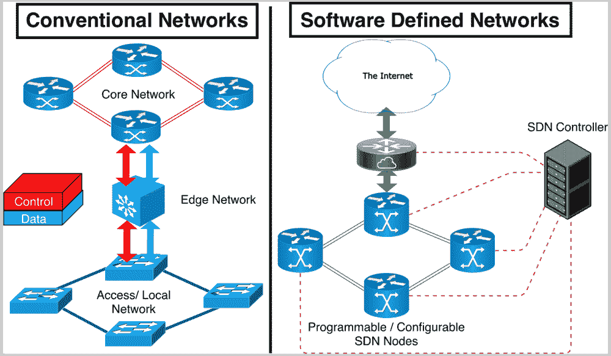
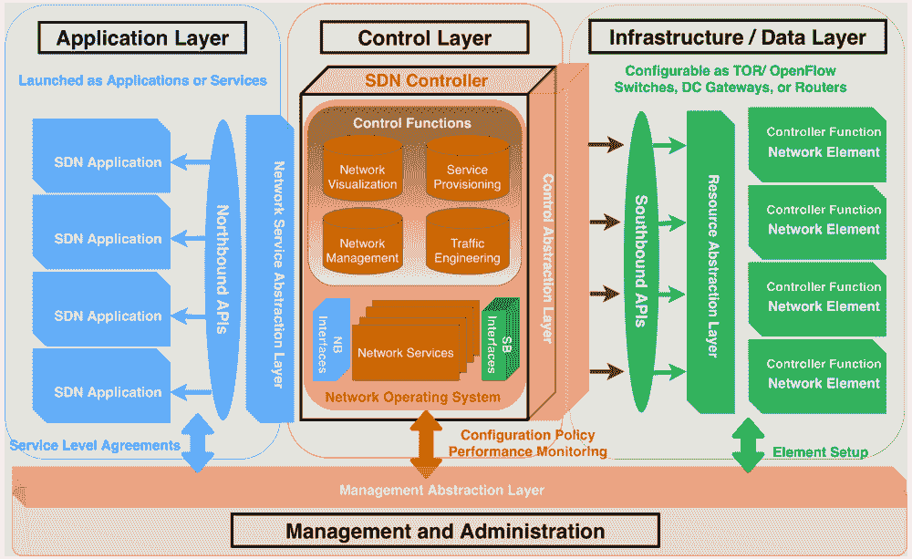
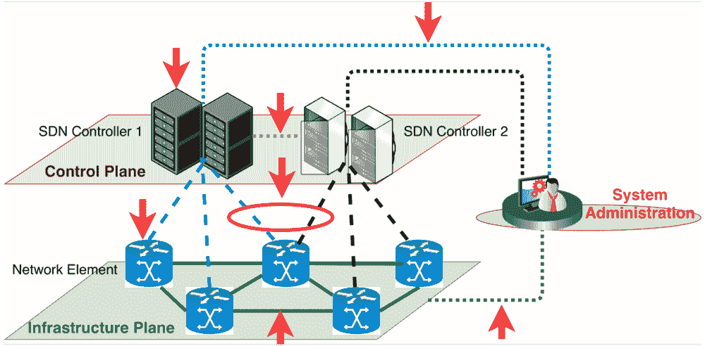
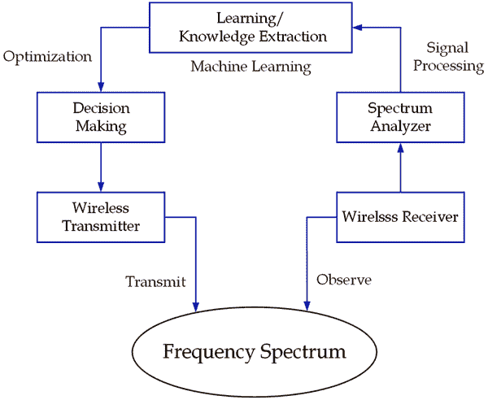
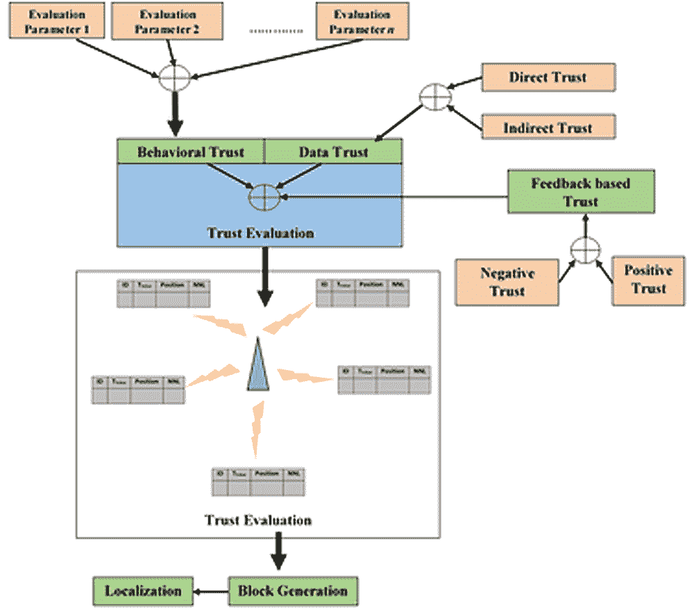
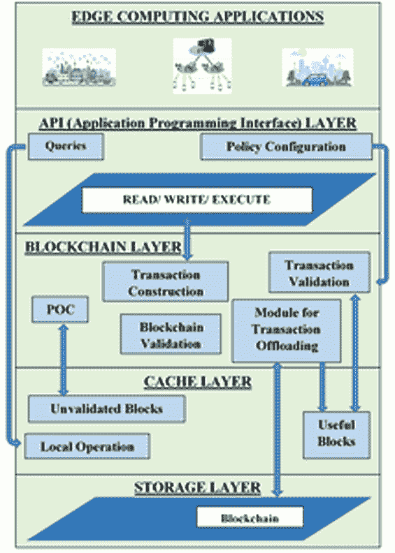
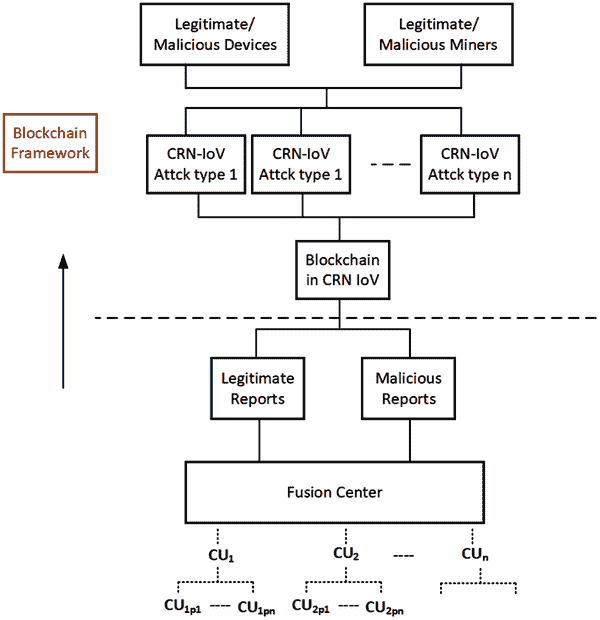
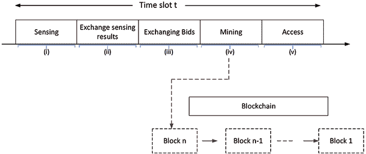
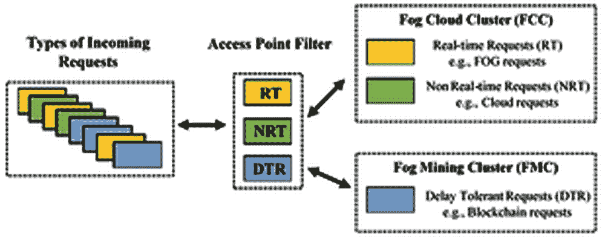

# 第一章

# 区块链在无线传感器网络（WSN）、认知无线电网络（CRN）、软件定义网络（SDN）、机会移动网络和延迟容忍网络中的进展和安全实践

+   Eranda Harshanath Jayatunga

    斯里兰卡鲁瑟纳大学工程学院

+   Pasika Sashmal Ranaweera

    斯里兰卡鲁瑟纳大学工程学院

+   Indika Anuradha Mendis Balapuwaduge

    

    斯里兰卡鲁瑟纳大学工程学院

摘要

物联网（IoT）正在铺平一条连接众多智能设备的道路，这些设备源自新颖的基于 5G 的应用。这种明显的异质性引发了无线传感器网络（WSNs）、软件定义网络（SDNs）、认知无线电网络（CRNs）、延迟容忍网络（DTNs）和机会网络（oppnets）等多样化技术的整合。然而，由于不断演变的指令的特色兼容性和互操作性方面，安全性和隐私性是突出的难题。区块链是一种最新的范式，旨在解决安全性和隐私性问题，同时保持性能标准。在本章中，探讨了区块链技术在上述网络中的进展，并将其作为实现概念的安全实践的手段进行展示。

引言

本章讨论的所有变体都是管理新兴通信服务及其应用的先导技术。这些指令旨在解决不同现有技术的不足之处，并以提高性能标准的改进视角形成。尽管每个独特的指令在安全方面存在局限性，但应用繁琐但防篡改的安全机制显然会降低它们的性能。因此，在延迟和适用安全级别之间存在明显的权衡。此外，类似于大多数现有通信技术或协议，可验证的安全性只有在有信任的第三方（TTPs）或证书颁发机构的情况下才可信。相比之下，区块链提供了一种去中心化的方法，消除了对 TTP 的依赖。此外，区块链中透明但防篡改的机制使其能够被采用于各种应用以保护其交易。因此，本章重点讨论了 WSN、oppnets、SDN、CRN 和 DTNs 技术，以解决其安全限制问题而采用区块链。本章主要分为 WSN、SDN、CRN、DTN 和 oppnets 几个部分，其中总结了各种主流区块链适应技术，概括了最佳的安全实践。

背景

无线传感器网络（WSNs）基本上是自组织网络，将嵌入有感知功能的小型设备集成起来，部署在监测周围感兴趣区域的物理活动。这些传感器节点应具有覆盖范围大、监测精度高、自组织、随机部署和容错等特点。由于能够提供低成本解决方案的可能性，现在无线传感器网络（WSNs）在许多实际应用中受到越来越多的关注。然而，许多传感器节点的密集部署在其管理中引起了独特的安全挑战。与此同时，由于传感器节点在能源消耗方面的固有限制以及更低的内存和存储空间的可用性，许多安全协议的调整以克服这些挑战并不直接。因此，及时重要的是研究人员讨论无线传感器网络中资源消耗最小化与安全最大化之间的权衡。

灵活性是软件定义网络（SDN）的关键特性，使其标准超越了传统的网络基础设施（Kreutz、Ramos 和 Verissimo，2013）。这个概念通过使网络实例的配置独立于硬件层，为网络管理员提供了先进的网络管理能力。事实上，在网络设备和它们的丰富聚合中展示的多样性正在制造兼容性和互操作性的困境。在 SDN 中，通过标准化硬件规格，提高了核心和接入网络的同质性；并且更高程度上依赖于基于硬件的处理被转变为一种具有软件集成的自主处理方法（Kumar 等，2017）。事实上，SDN 通过为控制平面增加智能化，为传统网络拓扑和路由算法中的复杂问题构想了解决方案。此外，这是网络运营商的一种范式转变，使他们能够解决与硬件层的问题以及将网络功能提升到新需求的广阔途径。除了灵活性之外，SDN 的主要优点可以指定为：经济效益（货币化）、集中化、更高的吞吐量、支持更高移动性的动态特性、低通信延迟、最优的网络利用率、快速有效的负载平衡、容错性以及适应性/上下文感知安全性（Tomovic、Pejanovic-Djurisic 和 Radusinovic，2014；Jaballah、Conti 和 Lal，2019；Scott-Hayward、O'Callaghan 和 Sezer，2013）。

近年来，无线通信领域的研究集中在第五代（5G）蜂窝系统上。与此同时，5G 及其后续无线网络设计者面临着诸如更多容量、更高数据速率、更低延迟、更好地连接大量用户、更少的成本和能耗，以及更重要的改进的体验质量（QoE）等挑战性需求（Munsub Ali、Liu 和 Ejaz，2020）。此外，随着通信设备数量的增加，对更高带宽的需求变得至关重要。然而，由于有限且昂贵的无线频谱资源，分配新的频段是一项极其困难的任务。因此，近年来，在动态政策下有效管理频谱已成为一个有前景的研究课题。

尽管互联网接入已经成为人类基本的主要需求之一，但仍然有许多农村地区没有任何网络连接，有时甚至间歇性。这些情况要求以机会主义的方式开发分布式网络技术，以便至少提供一定水平的服务与自组网络。因此，这些机会网络（oppnets）在周围集成了各种通信、计算、感知、存储和其他设备和资源。与 oppnet 相关联的初始节点称为种子节点。一旦其他节点被邀请成为原始 oppnet 的潜在助手，这个种子 oppnet 就会成长为一个扩展的 oppnet，同时存在各种安全问题。

区块链与物联网的集成为构建安全、可信和强大的通信前景提供了许多好处。但挑战在于确定在当前物联网设置中放置区块链的最合适位置。通过将区块链作为第三方融入，将数据存储在集中式数据中心，然后通过雾层来卸载数据中心的流量负担，当前物联网是一个三层架构，即物联网设备层、雾层和云层。一般来说，用于访问级别的传入请求可以分为实时、非实时和延迟容忍。延迟容忍网络有助于通过存储和转发设施解决与今天的异构网络中缺乏基础设施、固定节点和连接性相关的问题。然而，这些网络需要新的身份验证和信任建立机制，以确保没有对手方能够破坏时域延迟容忍网络路径中的隐私。

多样网络中的安全问题

无线传感器网络中的安全漏洞

WSN 中的攻击可分为基于主机和基于网络的攻击。在基于主机的攻击中，对手方总是与网络中的用户妥协，以揭示有关传感器节点的密码或密钥等信息。这是通过破坏传感器节点上运行的软件或篡改硬件以提取存储在传感器节点上的程序代码、数据和密钥来实现的。而基于网络的攻击包括所有与信息传输和/或对协议预期功能的偏离相关的攻击。关于与 ISO-OSI 层中不同层相关的四种固有攻击（中断、截获、修改和伪造）的总结如表 1 所示（Chowdhury & Kader，2013）。

因此，WSNs 的安全需求可以在四个学科下确定，即机密性，完整性，认证和可用性（CIAA）。对于任何网络，数据的真实性都是必要的，以保证通信节点的身份是否来自可靠的来源。在网络中存在恶意节点的情况下，传输节点上的数据可能会被对手篡改，更改或更改。为了确保数据的完整性，通常会使用消息完整性代码。由于无线接入技术是开放资源，有时被动攻击者可以通过收集其他受损节点的秘密数据来窃听消息或在监视应用程序中发现秘密。因此，应提前定义加密标准，以保持节点之间的保密性。最终，可用性将确定节点是否具有使用资源和网络传输数据的能力（Zia & Zomaya，2006）。

表 1. 基于 ISO-OSI 分层架构的 WSNs 中的可信安全威胁

| 层 | 攻击 | 可信安全威胁 |
| --- | --- | --- |
| 物理层 | 干扰 | 敌对方试图通过广播高能信号来干扰网络的运行 |
| Tampering | 从捕获的节点中提取加密密钥，篡改其电路，修改程序代码甚至替换为恶意节点。 |
| 数据链路层 | 持续通道访问（耗尽） | 恶意节点通过持续请求或传输通道来干扰 MAC 协议 |
| Collision | 两个节点同时尝试在相同频率上传输 |
| 网络层 | Sinkhole | 敌对方试图通过受损的节点吸引几乎所有其他节点的流量 |
| Sybil | 一个节点试图展示网络中所有其他节点的多个身份 |
| 虫洞 | 在网络的两个部分之间创建低延迟链接，使攻击者能够通过隧道传输消息，以混淆路由协议 |
| 问候洪水 | 通过广播 HELLO 数据包来破坏邻居发现的过程 |
| 确认洪泛 | 许多链路层网络路由算法使用确认来选择下一跳，以克服网络中的可靠性问题。确认欺骗导致沿此类链路传输的数据包丢失 |
| 嗅探 | 对手节点被放置在传感器网格的附近，用于拦截或监听 |
| 传输层 | 注入虚假消息和能量耗尽攻击 | 通常传感器节点是资源受限的实体。因此，攻击者试图利用被 Compromise 的节点注入捏造的报告，在网络中生成大量流量 |
| 洪泛 | 攻击者重复生成新的连接请求，达到最大限制，直到其他人筋疲力尽 |
| 去同步 | 打断现有连接 |
| 应用层 | 虚假节点 | 对手方添加恶意节点，注入恶意数据并诱使其他节点捕获数据 |
| 节点颠覆 | 通过受 Compromise 的节点揭示其信息，包括公开的加密密钥，从而影响整个网络 |

软件定义网络的安全漏洞

| 图 1. 传统网络与 SDN 网络的比较 |
| --- |
|  |

如图 1 所示，传统网络主要分为接入或本地、边缘和核心网络；在每个级别操作的节点或设备在其构建、系统规格（处理、存储、内存、能耗、接入接口和数量）、财务成本、运营成本、嵌入式协议和操作复杂性方面都不同。事实上，设备的复杂性取决于设备在开放系统互联（OSI）或 TCP/IP 协议栈中操作的层。通常，本地网络设备在第 2 层（数据链路）运行，而边缘和核心网络设备则扩展到第 2 层以上的其余层（OSI 的网络到应用）。诸如多协议标记交换（MPLS）和虚拟专用局域网服务（VPLS）之类的指令已被引入以提高边缘和核心网络的数据包转发效率和安全性（Liyanage、Ylianttila 和 Gurtov，2016）。将整体网络升级为这些指令需要替换网络节点，以使其与追求的更新兼容。这是现有网络的一个明显缺点，限制了先进技术在现实世界网络中的应用。此外，通过网络转发的控制/信令信息和数据分别通过单独的通道传输；这使得带宽利用困难，因为有专用信令通道。流量负载平衡已成为一种静态且独立的过程，只能通过远程控制通道监视和管理。由于负载平衡算法/机制/协议应在设备级别执行，因此管理控制信号和统计信息已变得过度去中心化，超出了可接受的控制域。这是需要更多控制网络流量管理的新服务的重要方面，具有规定的服务质量（QoS）和体验质量（QoE）分类。

SDN 架构分为三个层次或平面，如图 2 所示。 应用层启动了网络上下文中指定的应用程序和服务。 应用实例正在生成流规则，并通过北向应用程序编程接口（API）或插件（Feghali，Kilany 和 Chamoun，2015）将要求传达给控制器。 基础架构层由嵌入了控制逻辑的网络元素组成。 如上所述，这些网络元素可以配置为不同的网络功能。 控制层是这种架构最重要的方面，它集中了整个网络。 控制器负责网络可视化、服务提供、网络管理和流量工程的功能。 这些功能由网络操作系统（NOS）执行，并且每个网络服务的实例都部署在控制器上。 控制器可以形成高级策略，支持安全性和可靠性（Kreutz 等，2013）。 OpenFlow（OF）协议用于在控制器和网络元素之间建立通信通道，而 NOX、POX、Faucet、Floodlight、ONOS、Open vSwitch、Cherry 和 Beacon 是最常用的控制器。 控制器通过南向 API 的资源抽象层与网络元素进行通信。 除了三个常见的层外，还有一个管理和管理层与所有其他层进行交互。 实际上，管理抽象层与：应用层上的每个服务实例的服务级别协议（SLA）交互，控制层用于更新配置策略和监视性能，基础设施层用于设置和启动网络元素。

| 图 2\. 典型的 SDN 架构 |
| --- |
|  |

SDN（软件定义网络）带来的同样好处，即网络可编程性和集中控制逻辑，正在使 IT 网络暴露于新兴威胁之下（Kreutz 等，2013 年）。 允许应用层实体与控制平面元素（即为了提高灵活性而）进行交互的权利，使得整个架构暴露于未经授权的访问控制和恶意网络规则插入威胁之下（Tselios，Politis 和 Kotsopoulos，2017 年）。 范式的集中化性质会在 SDN 控制器被渗透的情况下损害整个网络。 在 SDN 中的软件化方法不再是单独运行的网络设备，连接的本质正在提高对手插入恶意内容或介入这样的链接的可能性（Aujla 等，2020 年）。 由于传统网络主要基于专有设备，例如思科，瞻博和 NEC，攻击者的任务是揭示针对每个供应商特定的漏洞。 这是一项艰巨的任务，这意味着揭示的一个漏洞仅适用于特定供应商的设备。 虽然使用 SDN，为了保持兼容性和互操作性，应该使用通用标准化和一组协议。 这个事实增加了 SDN 的漏洞级别，高级持续性威胁（APTs）可以针对其进行攻击。

| 图 3. 典型 SDN 部署中的威胁 |
| --- |
|  |

图 3 显示了典型 SDN 部署场景中对手可以利用的各种威胁。SDN 网络元素之间的连接是攻击者最有可能的威胁。这种链接可能受到中间人攻击（MitM）、中继或高级持续性威胁（APT）攻击，从而导致各种后果。这些后果可能是恶意代码注入、窃听、冒充、欺骗、拒绝服务（DoS）或恶意软件植入。由于 SDN 环境的动态特性，网络元素可能受到侧信道类型的攻击（Liu，Reiter 和 Sekar，2017）。此外，注入为网络元素的恶意节点可以被利用来执行 sinkhole 或 wormhole 攻击以操纵流量（Tselios 等，2017）。此外，受损的节点可以通过伪造其他节点或克隆来破坏整个数据平面设备的性能；而 SDN 控制器可以被利用成为合法节点。多重和同时的冒充攻击可能导致分布式拒绝服务（DDoS）威胁，延迟流量并破坏提供的服务。由于它们放置在安全场所，通过物理手段访问 SDN 控制器是不太可能的。他们的访问可以通过利用 OF 协议的漏洞来获得。成为合法的网络设备并进行认证以确保访问是任何攻击者的明显途径。一旦获得访问权，SDN 控制器可以通过 DoS 类型的攻击被超载。此外，受损的网络控制器可能欺骗其他领域的控制器。一个有资源的攻击者能够以管理员的身份发起冒充攻击，渗透到控制和基础设施平面。SDN 环境的主要问题在于缺少信任和责任模型，无法保障消费者的安全。

认知无线电网络的安全差漏

根据频谱利用统计数据，全球范围内大量的频谱资源在不同时间、不同地理区域仍然部分或完全未被使用，因此效率低下。尽管已经确定了不同的技术和方法作为未来无线网络中频谱未充分利用的解决方案，但认知无线电（CR）技术的整合将为未来 5G 及更高版本网络中面临的频谱稀缺问题提供有效的解决方案（Hindia 等人，2020）。CR 技术的主要目标是从实时环境中感知频谱并发现未被利用的频谱。认知无线电网络（CRN）旨在能够机会地利用这些频谱空洞，以相应地调整其无线电参数。为了促进这一任务，CR 需要准确可靠的频谱感知。

| CR 节点的主要组件图示 |
| --- |
|  |

因此，认知无线电收发器由不同的组件组成，以实现图示中所示的功能。为了检测有许可用户的信道占用情况，并找到空闲或可用信道以供无许可接入，使用频谱分析仪。为了有效地识别可用和占用频谱带，CR 节点需要支持高效的信号处理技术。基于分析的频谱细节，CR 节点的学习和知识提取单元通过采用机器学习技术来识别有许可用户的频谱使用模式。从这个正确的识别中，通过应用优化理论来做出访问频谱的决策由决策单元来进行。

在一个 CRN 中，CR 具有根据环境条件调整其传输参数并根据其通信能力进行更改的能力。然而，与有线网络相比，无线网络的安全性容易受到影响。CRN 中的频谱管理和感知涉及各种控制消息。在此过程中，恶意用户可能会窃听这些信息，从而导致已经授权和未授权用户的严重统计信息泄漏。因此，需要在 CRN 内防止恶意活动。例如，恶意的次要用户可以窃听其他用户的信号信息，并基于此假冒虚假的干扰水平。另一方面，一些恶意的次要用户可能会伪装成主要用户，通过使用物理层攻击来获取给定频道的资源。几个安全问题、涉及的网络层以及这些问题可能的原因总结在表 2 中。

表 2. CRN 中的安全问题

| 攻击类型 | 目标层 | 原因/描述 |
| --- | --- | --- |
| 干扰（主用户或次要用户） | 物理层 | 攻击者恶意发送数据包以阻碍通信会话中合法参与者的数据发送或接收 |
| 恶意节点增加干扰 | 网络层 | 当与恶意节点协商时 |
| 涟漪效应 | 网络层 | 由于关于频道占用的不正确信息 |
| 主用户仿冒攻击（PUE） | 物理层 | 恶意的次要用户仿冒主用户以获取给定频道的资源 |
| 频谱感知数据篡改 | 数据链路层 | 如果攻击者向其邻居发送不正确的本地频谱感知结果，则 CR 接收器会做出错误的频谱感知决策 |
| 狮子攻击 | 传输层 | 使用 PUE 攻击来干扰传输控制协议（TCP）连接 |

在 5G 网络中，预计将处理大量用户的异构网络，上述安全问题可能无法通过使用现有的加密方法有效地克服。事实上，对于上述技术领域，频谱管理和安全机制不应依赖于集中式控制器。这是因为固定频谱分配、操作员控制的资源共享算法和安全机制在部署大量小区以支持数百万移动用户的 5G 及其后应用时将无法扩展。

区块链在不同网络中的进展和安全实践

区块链在增强无线传感器网络安全方面的进展

恶意节点检测和隔离在应用层，网络层的密钥管理和安全路由实现，以及数据链路层的链路层加密是最常见的技术。此外，使用自适应天线和扩频技术被认为是物理层解决方案。然而，在当前的物联网范式中，无线传感器网络（WSNs）是开放的，分布式的，并且使用动态的多跳路由技术通过协商的路由协议从集成传感器节点传输聚合数据到中央位置。因此，需要对安全性、隐私、连通性和数据需求进行许多判断。现有的加密机制仅能在一定程度上检测和防御节点受损。另一方面，多跳路由暴露于几种恶意或自私攻击，完全取决于加密算法和认证机制。当发生恶意攻击时，传统路由算法无法区分恶意节点和其他路由节点。恶意节点可以丢弃数据包，从而在网络中创建数据“黑洞”。因此，需要一个可信赖的、去中心化的、自组织的第三方中介来解决上述安全问题。

因此，区块链被视为一个能够进行对等网络连接（PPN）、分布式文件共享（DFS）和自主设备协调（ADC）功能的去中心化或分布式网络，使物联网系统能够跟踪大量连接和网络化设备。主要它增强了物联网系统的隐私和可靠性，使设备之间的交易更加稳健协调。

基于区块链的无线传感器网络（WSNs）恶意节点检测

在 WSN 中生成的威胁遵循两种习俗，即对网络的外部攻击者或在被入侵后变得恶意的内部节点。因此，在 WSN 中检测恶意节点对于确保操作安全至关重要。可以通过基于发展信任模型或引入新的 WSN 协议来加以理解。在前一种方法中，通过使用邻居-权重信任确定（NWTD）算法，D-S（Dempster-Shafer）证据理论或基于模糊的多属性信任模型等计算信任价值来开发信任模型。增强 LEACH 协议以检测能量消耗、距离和恶意节点以确保其鲁棒性，并使用新的多值信任路由协议（MTR）等新协议用于恶意检测（She 等，2019）。尽管基于行为的信任模型可以用于监视网络和检测恶意节点，但由于位置估计不准确，它们仍然容易受到恶意攻击。为了提高准确性以及记录恶意节点的检测过程以便稍后进行跟踪，基于混合区块链的基于行为和数据的信任评估方法已经在（Kim 等，2019）中提出，如图 5 所示。这可以拒绝网络中的恶意传感器节点，从而增强信标节点之间的信任关系。首先，计算每个信标节点的信任值，考虑诸如亲密度、诚实度、亲密度和互动频率等指标，然后将其广播到基站以生成信任值的区块链。最终将丢弃信任值最低的信标值。模拟结果显示，尽管大多数可信赖的信标节点用于估计未知节点的定位过程，但所提出的算法在假阳性率（FPR）、假阴性率（FNR）和平均能量消耗（AEC）方面优于现有算法。然而，建议进一步测试贝叶斯统计学，最大似然估计，基于强化学习的信任评估以及与区块链长度相关的复杂性，以确定该方法的完整性。

| 图 5. 混合区块链基础的信任管理模型 |
| --- |
|  |

使用区块链和强化学习的可信赖路由方案

为了增强路由节点之间的信任度，传统无线传感器网络使用加密系统、信任管理、集中式路由决策等。尽管许多研究人员提出了第三方中介或管理中心来解决安全问题，但在多跳分布式无线传感器网络中的大多数路由方案都未能动态识别路由节点的不可信行为。同时，仍然没有有效的方法来防止恶意节点攻击。因此，作为一个值得信赖的、去中心化的、自组织的账本系统，区块链已经显示出改善安全性和公平性的解决方案。通过用区块链协议替换传统的公钥基础设施（PKI），Gómez-Arevalillo 等人提出了基于区块链的公钥管理框架（SBTM），以消除中央认证并提供去中心化的域间路由系统。智能基于区块链的合约路由（BCR）已经在（Ramezan & Leung, 2018）中用于记录具有恶意行为的路由节点，从而帮助路由节点找到可信赖的路径。然而，似乎没有保证阻止将数据包转发到声称拥有 BCR 令牌的恶意节点。因此，有必要开发具有自适应性质的路由算法。因此，Yang 等人提出了使用区块链结合强化学习的信任路由方案，以提高路由信息的可信度。在这里，使用权威证明（PoA）区块链进行易于追踪并避免任何篡改，而强化学习模型被用来动态选择更可信赖的路径。

基于区块链的无线传感器网络数据溯源

在未经监督甚至对抗性环境中部署更多的传感器节点的性质导致 WSN 容易受到网络故障和攻击的威胁。因此，跟踪传感器节点之间的数据包以评估其可信度，探查对抗性行为并检测通信故障至关重要。数据溯源通常记录数据包的数据来源追溯信息，包括所有权和对其采取的操作。然而，在选定的 WSN 路径中，数据包的溯源大小随着传输跳数的增加而显著增加，因此在电池寿命、通信带宽等方面产生问题。因此，需要开发数据溯源方案本身或在主机 WSN 之外开发。

一种轻量级的区块链技术，用于防篡改，已经在（Tiberti 等，2020）中提出，以检测受损节点。在这种方法中，传感器网络由多个 motes 和一个汇聚节点组成，汇聚节点是一种受限制的节点，用作通往外部网络的网关。在监控过程中，汇聚节点收集并存储来自其他节点的数据，然后将其转发到其他网络。使用基于区块链的哈希计算来为汇聚节点提供不可变和防篡改的存储。另一种无压缩的基于区块链的数据溯源方案（BCP）已经在（Zeng 等，2018）中提出，其中溯源分布存储在部署在网络上方或附近的高性能节点（H-nodes）上，沿着数据包路径。基站可以通过查询过程按需检索溯源。

虽然区块链技术在无线传感器网络中可以采用不可否认和不可篡改的属性，但由于资源受限的边缘设备，实施这些方案仍然是一个挑战。Chenhan Xu 等人提出了一种用于协作边缘大数据共享的绿色区块链框架，以克服边缘计算属性带来的挑战。他们将该框架分为四个层，即 应用程序编程接口（API）层、缓存层、区块链层和存储层，根据在协作边缘大数据共享中减少的计算、存储和网络资源要求，如图 6 所示。该工作的主要发现包括：1）基于低计算复杂性的 PoC（Proof-of-Collaboration）共识机制，提供了低计算能力，2）区块链交易过滤和卸载方案，可以显著减少存储开销，以及 3）新类型的区块链交易（即快速交易）和区块（即空块），以增强通信效率。

| 图 6. WSN 中的区块链框架分层架构 |
| --- |
|  |

上述所有研究工作均考虑在网络内或网络边缘应用数据溯源。然而，像工业控制、智能电网以及安全和监控系统等关键任务应用仍更偏向于云中心的物联网网络。为了保证数据的高可信性并进行准确及时的决策，提出了一种基于公共区块链智能合约的云中心物联网网络安全数据溯源框架（Ali 等人，2018）。在该框架中，设备元数据的加密哈希存储在区块链中，而实际数据存储在云中。这些位于区块链中的多个智能合约用于保证云中的数据溯源，从而允许更密集的物联网设备部署。表 3 总结了一些利用区块链技术增强无线传感器网络安全性方面的关键研究文献。

表格 3\. 基于区块链的无线传感器网络安全实践

| 参考文献 | 基于区块链的安全实践 | 可预防的安全威胁/攻击 | 解决方案特征 |
| --- | --- | --- | --- |
| (She 等人，2019) | 恶意节点检测区块链信任模型（BTM） | 数据篡改，恶意节点检测 | 使用哈希值和哈希指针连接前一个区块，以满足区块链完整性的需求 |
| (Kim 等人，2019) | 基站生成区块链，管理个体信标节点的信任值 | 恶意节点检测 | 根据节点位置信息、节点行为信任和数据信任，评估信标节点之间的互动和协作来评估信任值 |
| (Yang 等人，2019) | 通过区块链查询网络状态信息 | 路由信息的追踪和篡改 | 在区块链上初步获取路由节点的路由信息，并利用强化学习改善路由安全性 |
| (Ramezan & Leung，2018 年) | 基于以太坊的分布式区块链合约路由（BCR） | 恶意设备的黑洞和灰洞攻击 | 用于物联网的路由协议，具有较低的路由开销 |
| (崔等，2020 年) | 一个采用 PoA 共识机制的财团区块链，由几个权威节点共同管理 | 虚假节点，节点篡改 | 具有高可靠性的去中心化网络，包括完整性和真实性 |
| (Ali 等，2018 年) | 一个混合区块链模型，包括本地区块链和公共区块链 | 冲突，洪水，去同步 | 网络的调整，以消除需要经过身份验证才能加入网络的私有区块链节点，而这些节点位于不同的基站上 |
| (Haseeb 等，2019 年) | 通过区块链实现可信的设备注册和身份可信性智能合约 | 流量行为的不一致性 | 在以云为中心的物联网网络中确保设备的完整性和可信性 |
| (Xu 等，2019 年) | 一种区块链交易过滤和卸载方案，可以显著减少存储开销 | 流量问题 | 基于 WSN 的移动物联网设备之间的轻量级安全数据路由，实现更长的网络生命周期 |

区块链在保障 SDN 方面的进展

用于验证/核实并追加到防篡改账本的共识使得区块链成为 SDN 部署中信任和责任问题最有前景的解决方案。事实上，区块链使得 SDN 可以在去中心化的点对点方式下运行，而无需第三方信任代理。SDN 网络的主要问题是其易受基于流量的攻击，例如虫洞或漏洞威胁，这些攻击是通过操纵流量头部来实施的，因为 SDN 过度依赖于软件化控制。流规则表、其内容、更新过程以及 OF 协议及其与 TLS 和 TCP 协议的集成问题是 SDN 的脆弱方面。因此，通过注入可追溯性和验证能力来保护与路由和流量工程过程相关的因素是一项主要要求。区块链是一种数据结构，其元素（即块）通过时间戳上的密码哈希链接或链接，并记录在账本中进行的所有交易（Tselios 等人，2017）。这种方法使得区块链不可变且不可腐败。区块链技术的这些特点非常适合保护流/路由表和协议机制，提供透明和快速的应用能力。因此，本小节阐述了区块链可用于保护 SDN 的各种方法。

区块链用于 SDN 节点身份验证

向 OF 开关的流量中注入恶意数据包是 SDN 攻击者最常见的渗透方法。在（Aujla 等人，2020）中，流表和数据包使用许可区块链进行了安全保护，其中制造区块并将其聚合成链的功能受到控制器的限制。这种方法被扩展用于在身份验证阶段使用零知识证明概念验证和验证 OF 开关的身份。交换机身份被链接到区块链上。这项研究进一步演示了在基础设施平面上阻止针对立即连接节点的 DoS/DDoS 攻击，最终针对控制器。最终的解决方案可以被视为针对 SDN 的区块链即服务方法。

为 SDN 架构设计的区块链层

（Jiasi、Jian、Jia-Nan 和 Yue，2019）提出了一个基于单一区块链的安全机制，将 SDN 控制平面分散，以避免单点故障，同时保证真实性、可追溯性和问责制。在提出的架构中，在控制平面和数据平面之间附加了一个区块链层；其中，采用基于属性的加密（ABE）用于与应用平面的交互，采用一次性高性能 Diffie-Hellmann（HOMQV）协议用于区块链层与数据平面之间的交互。这个区块链层正在为所有在控制平面和数据平面之间传递的交易创建一个安全区域。

应用区块链管理 SDN 流规则表

负载平衡是 SDN 的一个关键方面，其中传输的控制统计数据和网络状态应该受到保护。 (Faizullah, Khan, Alzahrani, & Khan, 2020) 提出了一种基于许可区块链的方法，用于保护 SDN 的负载平衡过程，使其成为适合物联网应用的解决方案。SDN 流规则表通过基于区块链的交易得到保护。采用流规则表更新过程来评估所提出的系统，其中准确性、可扩展性、安全性和效率与基于公共区块链和基于 OF 的 SDN 进行了比较；其中所提出的系统证明性能更好。

在 (Sharma, Singh, Jeong, & Park, 2017) 中提出的 DistBlockNet 方案是一种利用区块链进行流规则表更新的新方法，采用了一种验证策略。通过这个系统可以实现版本验证、验证和下载流规则表到物联网设备。SDN 的一个主要问题是其依赖于管理员手动参与来审查和应用不断增加的安全政策和建议。DistBlockNet 对所考虑的威胁景观具有适应性，可以在实时环境中实现完全自主的决策和应用。每个 SDN 控制器本地网络视图由 OrchApp、控制器和避难所组件组成。OrchApp 和 Shelter 模块都专注于应用层和数据层的安全攻击。在功能上，OrchApp 负责使用威胁情报进行访问控制；而避难所则在分布式区块链网络中更新流规则表。因此，区块链在这个解决方案中的应用集中在 SDN 控制器网络内的流量策略上。

区块链启用的 SDN 方法适用于新兴应用

新兴技术如物联网（IoV）或车辆间通信（V2V）已考虑应用基于 SDN 的网络基础设施，以实现在 5G 基础用例下所述的设想要求。在（Gao 等人，2019）提出的架构中，采用 SDN 管理雾区和移动接入网络内的网络，用于车辆自组网（VANET）部署。从车载单元提取的数据通过边缘装配了无线资源的雾区转发到远程或云端。SDN 模型利用 OF 协议软化处理雾区的流量，并利用光纤远程链路的容量。区块链用于处理控制平面中的身份验证、访问控制、数据管理和策略管理。区块结构在标头中嵌入了时间戳和 Merkle 根，而交易状态被封装为一个独立的字段。这种解决方案构想了一个为 VANET 节点提供快速和安全通信的信任模型。

移动或无线网络的交接过程是任何移动或无线网络的一个不方便的方面，它暴露了无线电信道，使其容易被意图敌人拦截。这是这些网络的一个不可避免的因素，需要在每次移交时重新对移动设备进行认证。当相应的无线电信区变得异构时，问题变得严重，因为每个基础技术的认证机制和协议都是不同的。因此，（Yazdinejad、Parizi、Dehghantanha 和 Choo，2019）提出了一个基于 SDN 的内部网络，用于应对 5G 的异构性，同时采用区块链方法来保护移交机制。一个区块链中心，在其中采用以太坊为基础的账本技术，与 SDN 控制器协同处理认证控制。为每个移动设备生成的原语被记录在区块链中心，在 SDN 控制器管理的移交期间可以利用这些原语来验证其身份。这种方法消除了重新认证的要求，并阻止了渗透。

在先前的小节中，为 SDN 网络整合区块链采用了各种方法。对这些方法的分类对于在实际环境中实现这两种技术的成功应用至关重要。因此，表 4 指定了区块链启用的 SDN 实施的分类最佳实践。

表 4. 用于 SDN 的基于区块链的安全实践

| 适用的 SDN 层 | 参考 | 基于区块链的安全实践 | 可预防的安全威胁/攻击 | 解决方案的特点 |
| --- | --- | --- | --- | --- |
| 适应性 | 灵活性 | 真实性 | 账户性 | 追溯性 | 入侵检测 |
| 应用 | （Steichen 等人，2017） | 用于 SDN 的区块链防火墙应用 | 病毒、恶意软件、蠕虫 |  |  |  |  |  | × |
| 控制 | (Faizullah 等人，2020) (Sharma 等人，2017) | 使用区块链保护流规则表及其更新过程 | 流量工程 | × | × |  | × | × |  |
| (Gao 等人，2019) | VANETs 的身份验证、访问控制和数据管理 | 攻击、蠕虫、虫洞 | × | × | × | × | × |  |
| (Yazdinejad 等人，2019) | 在异构网络中保护移动切换过程 | 干预攻击，如中间人、中继、APT | × | × | × | × | × |  |
| 基础设施/数据 | (Jiasi 等人，2019) | 在控制和数据层之间引入区块链层 | 对控制器的 DoS/DDoS 攻击，冒充威胁 | × | × | × | × | × |  |
| (Aujla 等人，2020) | 用于 OF 开关身份验证的区块链 | 恶意节点注入，流氓节点 |  |  | × | × | × |  |

区块链在 CRNs 的进展

同时，区块链技术被引入作为无线网络中安全问题的有效解决方案，它由可以安全地进行迭代更新的分布式数据库组成。区块链技术实现了分布式分类帐：一种安全的去中心化数据库形式，在其中没有单一方控制（Werbach，2018）。因此，区块链可以被视为分布式实施的防篡改数字分类帐，没有中央来源。

请注意，存储在区块链分布式分类帐上的记录可以与任何数据类型相关联。然后，关于频谱访问权和频谱使用及其动态变化的信息可以记录在此分布式分类帐上。同时，可以使用智能合约动态管理频谱。因此，对于 CRN，它们使 CR 用户能够在相关的 CRN 组内的共享分类帐中记录频谱感知细节和 QoS 要求以及真实身份，以便在区块链网络的正常操作下，无法以恶意方式更改任何信息。

用于移动 CRNs 中 DSA 的安全区块链

在（Kotobi & Bilen, 2018）中，提出了一种区块链验证协议，并将其评估为一种启用和保障 CRNs 中频谱共享的技术。为了验证和保障移动 CR 之间的频谱共享，维护了一个分散式的区块链数据库。这项提出的工作背后的一般概念是，频谱许可证持有者向其他方，即次级用户，宣布特定频谱波段的拍卖。为此，利用一个公共控制信道来广告可用的信道和拍卖信息。赢得竞标的投标者可以通过一种名为 Specoins 的虚拟货币购买相应的频谱。通过制作区块链或直接交换，次级用户可以收到这种货币。例如，通过利用其处理能力更新区块链，CR 可以赚取 Specoins。此外，提出的方案允许将真实货币转换为 Specoins，考虑到那些有大量数据需要传输但没有足够 Specoins 的次级用户。

使用 Specoins 的次级用户交易被记录在区块链中。请注意，根据区块链的概念，这个分布式数据库对所有参与方都是可见的。能够更新数据库的节点被称为矿工。一旦次级网络交易发生，它就会被矿工更新。之后，区块链用于验证交易。根据获得的模拟结果，(Kotobi & Bilen, 2018)提出的基于区块链的频谱分配方案在传输数据量方面优于传统的 CR 系统。然而，这种吞吐量的改善是以更高的功耗为代价的。在(Kotobi & Bilen, 2018)中做出的一个有趣观察是，即使存在衰落条件，所提出的方案也可以提供比现有方案更高的吞吐量。这项研究提供了一个基本的观察区块链在 CRNs 上的应用。它在电池供电设备的功耗方面需要进一步改进。

区块链启用的 IoV 的 CR 技术

车辆自组网（VANETs）使在路车辆之间的通信成为可能，通过收集和与其他车辆共享交通状态来为驾驶员提供车载环境下的安全。由于未来的 VANETs 配备了认知传感器和智能通信单元，基于 CRN 的车联网（IoV）将为高可靠性和安全的车辆通信提供智能解决方案。由于安全通信是实现高可靠性的重要功能，在(Rathee et al., 2020)中，开发了一种决策技术来在使用 CRN 进行频谱感知和信息传输期间为 IoV 提供安全保障。为了在数据共享期间保持车辆之间的透明度，采用了区块链机制。

在(Rathee et al., 2020)中，采用了融合中心(FC)来收集认知用户(CUs)的频谱感知数据。 FC 分析提交的数据报告的安全性和隐私措施。此外，FC 对 CUs 的性能进行独立评估，分析理想通道的可用性。决策模型可以分层表示，如图 7 所示，由这种被称为理想解偏好相似性排序技术(TOPSIS)和区块链框架的决策方案组成。在这个图中，〖CUij〗_ 表示第 i 个 CU 的第 j 个安全参数。在区块链部分，来自每个 CU 的记录存储在一个网络上，将由所有用户进一步追踪和分析。在其中，合法的 CU 可以识别入侵者对记录和数据的修改。为了增加执行块验证的矿工数量，所提出的决策模型提供了各种激励措施，如额外积分或高信任能力。

根据对旧金山真实数据集进行的模拟分析结果显示，采用所提出的方法检测到恶意物联网设备的概率显著高于基准（现有）方法。有更高检测率的主要原因可能是基于各种交互参数识别合法物联网设备的过程，例如交互频率、能耗，以及合法或恶意设备的正负交互和传输时间。此外，拉蒂等人（2020 年）的研究结果表明，通过区块链机制，所提出的方法可以轻松测量拒绝服务（DoS）威胁。由于所提出的方法是基于区块链的，对入侵的影响也是有限的，因为设备无法删除或更改数据。此外，研究表明，当网络由大量物联网设备组成时，所提出的现象可以通过参数评估提供更好的性能。

| 图 7. 基于区块链的 IoV 的分层模型（拉蒂等人，2020 年提出） |
| --- |
|  |

区块链启用的协作频谱感知

区块链技术在无线电频谱感知方面的应用在(Weiss et al., 2019)中进行了研究。其中，提出了一种基于合作感知的动态频谱访问(DSA)方案，该方案由区块链支持。所提出的 DSA 方案包括一个协议，其中包括 SUs 进行时间分槽操作以获取可用频谱的访问。一个 SU 需要执行两种角色，即作为感知节点和作为所提出的区块链网络中的矿工或验证者。为了执行矿工任务，SU 节点收集了大量的频谱感知和利用记录，这些记录可以适应一个区块，并进行数学计算以验证该区块并将其与先前区块链的链结合起来。有趣的是，该论文提出了一种针对次级网络的合作频谱感知机制，其中通过分析所有贡献 SU 的个体感知结果来得出最终的感知结果。在这里，多数规则被应用于确定特定频谱带的信道可用性。

| 图 8\. 每个时间槽中 CRN 的运行，如(Weiss et al., 2019)所提出的 |
| --- |
|  |

如图 8 所示，在交换频谱访问竞标并进行适当验证后，合作频谱感知细节被记录在区块链中。为了激励 SUs 执行挖矿任务，参与合作频谱感知的 SUs 将被奖励代币，这些代币可以后来用于竞标频谱访问。

正如已经指出的那样，当区块链在动态频谱访问中启用时，观察到功耗的增加是实现 CR 网络更高吞吐量的主要成本。为进一步分析这一成本，(Weiss et al., 2019) 引入了一种称为感知-挖矿能效的度量标准，用于衡量每单位用于感知和挖矿的能耗的平均传输速率。根据获得的仿真结果，观察到感知-挖矿能效并不随着 SUs 的感知概率增加而单调增长。事实上，可以注意到与给定最大能效相对应的感知概率的最优值。因此，启用区块链的 CRNs 需要配置 CR 的频谱感知相关参数，而不会导致功耗方面的更高成本。

CR 基础的区块链网络中的深度强化学习

不同于先前讨论的研究工作，(Luong et al., 2019) 提出了一种深度强化学习方法，用于为 CR 基础的区块链网络中的次级用户制定最佳的交易传输策略。由于传统的维护物联网数据的方式在透明度、可追溯性以及安全性方面存在局限，无法满足 5G 级别的服务需求。因此，为了避免这些缺点，(Luong et al., 2019) 采用区块链技术来收集、存储和处理来自 SUs 的传感数据。然而，为了做出最佳决策，仅依靠区块链提供的安全机制可能是不够的。因此，作者提出了一种基于深度神经网络（DNN）和 Q-learning 的机器学习方法，以进行最佳的传输决策和信道选择。

在提出的网络模型中，一个次级用户选择所需的频道，并通过基站向区块链挖矿池发送包含次级用户感知数据和次级用户愿意支付的交易费用的交易消息。另一方面，采用的强化学习方法学习环境，目标是最大化成功的交易传输数量，同时最小化频道成本和交易费用。此外，考虑到更多的实际情况，（Luong 等，2019）并没有完全忽视双花攻击，即在传输过程中可以恶意修改区块中的交易。在性能评估过程中，可以注意到提出的机器学习方法使次级用户能够以更低的成本实现更多成功的交易传输。

CRNs 容易受到不同种类的威胁和安全问题的影响，这将影响网络的性能。利用区块链技术，可以在 CR 频谱管理中实现新的安全实践。本节的目标是通过参考最近进行的研究工作来调查区块链在 CRNs 中的实用性。表 5 列出了上述讨论过的基于区块链的 CRNs 安全实践的摘要。

表 5. CRNs 中基于区块链的安全实践

| CRNs 中适用的层 | 参考 | 基于区块链的安全实践 | 可防止的安全威胁/攻击 |
| --- | --- | --- | --- |
| MAC | (Weiss 等，2019) | 消除对频谱感知的信任第三方的需求 | 感知数据篡改 |
| MAC，网络 | (Kotobi & Bilen，2018) | 阻止恶意用户接入网络 | 单点攻击 |
| 应用程序，网络 | (Rathee 等，2020) | 在彼此之间安全地分享数据并验证新用户的合法性 | 服务拒绝（DoS）攻击，虚假报告生成，恶意节点识别 |
| 应用程序，MAC | (Luong 等人，2019) | 增强安全性并保证数据完整性 | 双重支付攻击已经分析，但并未完全克服 |

区块链在 DTNs 中的进展和安全实践

R.H. Memon 等人提出了基于区块链的双重雾-IoT 架构，将雾层分为雾云集群和雾挖矿集群。在这里，雾云集群接受实时和非实时应用程序请求，类似于现有的 IoT 架构，而雾挖矿集群专门用于执行挖矿操作并维护延迟容忍区块链应用程序请求的分布式账本，如图 9 所示。

| 图 9\. 双重雾-IoT 架构模型 |
| --- |
|  |

在机器对机器（M2M）通信中，机器类型通信设备（MTDs）在没有任何人类干预的情况下连接和通信。因此，智能计量表、环境监测和电子健康系统等应用程序可以允许相对较长的数据流量延迟。例如，部署智能计量表可能需要定期进行数据上传或下载。然而，由于 MTDs 配备了有限的电池电源，数据计算任务无法仅在本地设备上缓存、处理和执行。因此，最佳选择是在网络边缘卸载一些存储和计算需求。另一方面，安全性和可靠性也是 MTDs 敏感数据的主要关注点。Meng Li 等人提出了一个联合优化框架，以基于对抗深度 Q 网络的 M2M 通信网络中缓存服务器和计算服务器做出最佳决策，并确保安全性（Li 等人，2020）。

区块链在 OPPNETs 中的进展和安全实践

通常，移动物联网 oppnets 在云计算中经常遭受带宽和延迟问题，主要是由于设备和云之间的较差无线连接。与其仅依赖于集中式云平台，寻找能够在设备附近执行相同网络操作或服务的解决方案至关重要。关于这一点，(Chamarajnagar & Ashok, 2018)提出了一种机会性协作移动物联网设计，利用区块链框架在移动物联网网络边缘提供分布式计算解决方案。类似于以往的工作，为了满足下一代移动网络的严格延迟和带宽要求，(Jijin, Seet, & Joo Chong, 2019)提出了基于雾的无线接入网络（F-RAN）。然而，这与传统的 F-RAN 和虚拟雾接入点（v-FAP）或服务节点不完全相同，这些节点是动态形成的，并由预定义的物理或种子节点监控。机会式雾 RAN（OF-RAN）与区块链智能合约的集成保证了边缘节点物理过程的可验证自动化。

未来的研究方向

显然，区块链技术的最新技术已经对诸如医疗保健、物流、智能城市或能源管理等领域的安全性产生了巨大影响。然而，基于区块链的物联网设置需要各种与加密货币的实施不同的技术需求，例如资源受限硬件的能源效率或特定架构的需求。因此，仍需发现关于无缝认证、数据隐私、轻松部署和自我维护以及保护基于区块链的网络免受安全攻击的创新研究方向，如下所述。

+   • 数据管理、隐私和安全解决方案：传统的在线支付通常只对交易各方和分销商可见。但是，由于区块链技术中所有交易都由用户共享，因此需要确保交易的隐私性，同时保持透明度。

+   • 能源效率：一般来说，基于区块链的交易使用耗电量大的挖矿过程，并且需要更多的电力来建立边缘设备之间的点对点（P2P）链接。因此，在基于区块链的应用中确保能源效率是非常重要的特性。

+   • 多链管理：同时处理多个网络的可能性将能够在网络管理方面提供更大的灵活性。

+   • 区块链协议的可持续性：越来越多的协议套件是必需的，以通过优化区块链网络的吞吐量和延迟，同时调节区块链的大小、带宽和基础设施来吸引各种应用的需求。

+   • 大数据和人工智能：支持区块链的人工智能解决方案的应用可以用于利用智能合约以及为实现实时功能而路由自主无人机。

结论

现代和未来的通信网络将增长到数十亿台机器和传感器之间的交互。此外，由于现代技术的进步使各种数据源的普遍访问需求增加，未来的无线网络变得日益异构和复杂。由于这些网络高度利用现有的无线传感器技术，因此天生面临着隐私和安全威胁。在 SDN、WSN 和 CRN 中的无线节点被认为容易受到分布式拒绝服务等攻击的影响。此外，这些网络中的智能无线节点大多受到云环境的控制。这种集中式架构也存在单点故障，并进一步增加了脆弱性。

然而，防范与安全、隐私和漏洞相关的缺点已成为这些网络面临的主要挑战之一。本章探讨了现有研究，讨论了如何将区块链添加到实施在 SDN、WSN 和 CRN 中的分布式系统中，从而使网络操作更加安全、自主、灵活和有利可图。区块链为这些网络提供了安全性、匿名性和数据完整性，而无需第三方参与。

此外，还简要讨论了区块链在延迟容忍和机会主义移动网络上的应用。本章介绍的研究表明，区块链可以作为一种高度抗篡改的数据记录方法，以及对抗将恶意用户引入 SDN、WSN 和 CRN 网络的一种方式。

参考文献

Ali, S., Wang, G., Bhuiyan, M. Z. A., & Jiang, H. (2018). 通过区块链智能合同在云中心物联网中实现安全数据溯源。 在 2018 年 IEEE 智慧世界，普适智能计算，先进可信计算，可扩展计算通信，云大数据计算，人类互联网和智能城市创新（智能世界/ scalcom/uic/atc/cbdcom/iop/sci）（第 991-998 页）。 学术出版社。

Aujla, G. S., Singh, M., Bose, A., Kumar, N., Han, G., & Buyya, R. (2020). BlockSDN：用于智能城市应用的软件定义网络的区块链即服务。 IEEE 网络，34（2），83–91。 doi:10.1109/MNET.001.1900151

ChamarajnagarR.AshokA. (2018). 基于区块链的机会式移动物联网与协作。 在 2018 年 IEEE 全球通信大会上（第 1-6 页）。 10.1109/GLOCOM.2018.8647756

Chowdhury, M., Kader, M. F., & Asaduzzaman, A. (2013). 无线传感器网络中的安全问题：一项调查。 未来一代通信与网络国际期刊，6（5），97–116。 doi:10.14257/ijfgcn.2013.6.5.10

Cui, Z., Xue, F., Zhang, S., Cai, X., Cao, Y., Zhang, W., & Chen, J. (2020). 用于多 WSN 的混合区块链身份验证方案。 IEEE 服务计算交易，13（2），241–251。 doi:10.1109/TSC.2020.2964537

Faizullah, S., Khan, M. A., Alzahrani, A., & Khan, I. (2020). 基于许可的区块链的 SDN 在物联网云网络中的安全性。 arXiv 预印本 arXiv:2002.00456。

Feghali, A., Kilany, R., & Chamoun, M. (2015). SDN 安全问题和解决方案分析。 在 2015 年分布式系统协议工程与新技术国际会议上（第 1-5 页）。 学术出版社。

Gao, J., Agyekum, K. O.-B. O., Sifah, E. B., Acheampong, K. N., Xia, Q., Du, X., & Xia, H. (2019). 一种基于区块链-SDN 的车联网环境，用于雾计算和 5G 网络。 IEEE 物联网杂志，7（5），4278–4291。 doi:10.1109/JIOT.2019.2956241

Gómez-Arevalillo, A. de la R., & Papadimitratos, P. (2017). 基于**区块链的公钥基础设施**用于跨域安全路由。 在国际网络安全问题研讨会上 (pp. 20-38)。 学术出版社。

Haseeb, K., Islam, N., Almogren, A., & Ud Din, I. (2019). **WSN-Based 移动物联网**中安全路由的入侵预防框架。 IEEE 《Access: Practical Innovations, Open Solutions》, 7, 185496–185505。 doi:10.1109/ACCESS.2019.2960633

Hindia, M. N., Qamar, F., Ojukwu, H., Dimyati, K., Al-Samman, A. M., & Amiri, I. S. (2020). 用于**5G 网络上启用认知无线电**的平台。 《无线个人通信》, 113(2), 1241–1262。 doi:10.1007/s11277-020-07277-3

Jaballah, W. B., Conti, M., & Lal, C. (2019). **软件定义 VANETs**调查：优点、挑战和未来方向。 arXiv 预印本 arXiv:1904.04577.

Jiasi, W., Jian, W., Jia-Nan, L., & Yue, Z. (2019). 基于**区块链**的安全软件定义网络。 arXiv 预印本 arXiv:1906.04342.

Jijin, J., Seet, B., & Joo Chong, P. H. (2019). **区块链**启用的机会主义雾计算无线接入网络：一个立场文件。 在 2019 年第 29 届国际电信网络和应用会议上 (pp. 1-3)。 学术出版社。

Kim, T., Goyat, R., Rai, M. K., Kumar, G., Buchanan, W. J., Saha, R., & Thomas, R. (2019). 用于**无线传感器网络**中分布式区块链的安全定位的新型信任评估过程。 IEEE 《Access: Practical Innovations, Open Solutions》, 7, 184133–184144。 doi:10.1109/ACCESS.2019.2960609

Kotobi, K., & Bilen, S. G. (2018). **安全区块链**用于动态频谱接入：在移动认知无线电网络中的分散式数据库增强了安全性和用户访问。 IEEE 《车载技术杂志》, 13(1), 32–39。 doi:10.1109/MVT.2017.2740458

KreutzD.RamosF. M.VerissimoP. (2013). 迈向安全可靠的软件定义网络。在第二届 ACM SIGCOMM 软件定义网络热点问题研讨会上（第 55-60 页）。10.1145/2491185.2491199

KumarR.HasanM.PadhyS.EvchenkoK.PiramanayagamL.MohanS.BobbaR. B. (2017). 使用 SDN 为实时系统提供端到端网络延迟保证。在 2017 年 IEEE 实时系统研讨会上（第 231-242 页）。10.1109/RTSS.2017.00029

Li, M., Yu, F. R., Si, P., Wu, W., & Zhang, Y. (2020). 基于深度强化学习的区块链 IoT 边缘计算中延迟容忍数据的资源优化。IEEE 物联网杂志，7(10)，9399-9412。doi:10.1109/JIOT.2020.3007869

Liu, S., Reiter, M. K., & Sekar, V. (2017). 通过对 SDN 交换机的定时攻击进行流量侦察。在 2017 年 IEEE 第 37 届国际分布式计算系统会议上（第 196-206 页）。10.1109/ICDCS.2017.281

Liyanage, M., Ylianttila, M., & Gurtov, A. (2016). 使用 SDN 改进安全 VPLS 架构的隧道管理性能。2016 年第 13 届 IEEE 年度消费者通信与网络会议。

LuongN. C.AnhT. T.BinhH. T. T.NiyatoD.KimD. I.LiangY.-C. (2019). 智能无线电区块链网络中的联合交易传输和信道选择：一种深度强化学习方法。在 IEEE 国际会议上：声学、语音和信号处理（第 8409-8413 页）。10.1109/ICASSP.2019.8683228

Memon, R. A., Li, J. P., Nazeer, M. I., Khan, A. N., & Ahmed, J. (2019). Dualfog-Iot：用于解决物联网中的区块链集成问题的额外雾层。IEEE Access：实用创新，开放解决方案，7，169073-169093。doi:10.1109/ACCESS.2019.2952472

Munsub Ali, H., Liu, J., & Ejaz, W. (2020). 使用离散烟火算法和本地搜索方法的集合规划 5G 及以上无线网络的容量。EURASIP 无线通信与网络杂志，185，1-24。

Nanthini, S. B., Hemalatha, M., Manivannan, D., & Devasena, L. (2014). 认知无线电网络（CRN）中的攻击-一项调查。印度科学与技术杂志，7（4），530–536。doi:10.17485/ijst/2014/v7i4.18

Ramezan, G., & Leung, C. (2018). 一种基于区块链的智能合约路由协议，用于物联网。无线通信与移动计算，4029591，1–14。提前在线发表。doi:10.1155/2018/4029591

Rathee, G., Ahmad, F., Kurugollu, F., Azad, M. A., Iqbal, R., & Imran, M. (2020). CRT-BIoV：一种用于区块链启用的车联网的认知无线电技术。IEEE 智能交通系统交易。

Sharma, P. K., Singh, S., Jeong, Y.-S., & Park, J. H. (2017). Distblocknet：一种基于分布式区块链的安全 SDN 架构，用于物联网网络。IEEE 通信杂志，55（9），78–85。doi:10.1109/MCOM.2017.1700041

She, W., Liu, Q., Tian, Z., Chen, J., Wang, B., & Liu, W. (2019). 无线传感器网络中恶意节点检测的区块链信任模型。IEEE Access：实用创新，开放解决方案，7，38947–38956。doi:10.1109/ACCESS.2019.2902811

Steichen, M., Hommes, S., & State, R. (2017 年 9 月)。ChainGuard—使用 SDN 和 OpenFlow 的区块链应用防火墙。2017 年原理。IP 电信系统和应用。学术出版社。

Tiberti, W., Carmenini, A., Pomante, L., & Cassioli, D. (2020). 一种轻量级的基于区块链的无线传感器网络防篡改技术。2020 年第 23 届欧洲微电子数字系统设计会议（第 577-582 页）。学术出版社。

TseliosC.PolitisI.KotsopoulosS. (2017). 通过区块链增强物联网相关部署的 SDN 安全性。2017 年 IEEE 网络功能虚拟化和软件定义网络会议（第 303-308 页）。10.1109/NFV-SDN.2017.8169860

Weiss, M. B. H.，Werbach, K.，Sicker, D. C.，& Bastidas, C. E. C.（2019）。关于将区块链应用于频谱管理的应用。IEEE 认知通信与网络交易，5（2），193–205。doi:10.1109/TCCN.2019.2914052

Werbach, K.（编）。（2018）。区块链与新信任架构。麻省理工学院出版社。doi:10.7551/mitpress/11449.001.0001

Xu, C.，Wang, K.，Li, P.，Guo, S.，Luo, J.，Ye, B.，& Guo, M.（2019）。在边缘进行大数据开放：一种资源高效的基于区块链的方法。IEEE 并行与分布式系统交易，30（4），870–882。doi:10.1109/TPDS.2018.2871449

Yang, J.，He, S.，Xu, Y.，Chen, L.，& Ren, J.（2019）。一种基于区块链和强化学习的无线传感器网络的可信路由方案。传感器（巴塞尔），19（4），970。doi:10.3390/s19040970

Yazdinejad, A.，Parizi, R. M.，Dehghantanha, A.，& Choo, K.-K. R.（2019）。SDN-based 5G 网络中基于区块链的认证切换与高效隐私保护。IEEE 网络科学与工程交易。

Zeng, Y.，Zhang, X.，Akhtar, R.，& Wang, C.（2018）。一种用于无线传感器网络中安全数据溯源的基于区块链的方案。2018 年第 14 届移动自组网和传感器网络国际会议（pp. 13-18）。10.1109/MSN.2018.00009

ZiaT.ZomayaA.（2006 年 10 月）。无线传感器网络中的安全问题。2006 年国际系统和网络通信会议（ICSNC’06）（pp. 40-40）。10.1109/ICSNC.2006.66

额外阅读

Banerjee, M.，Lee, J.，& Choo, K.-K. R.（2018）。区块链未来的物联网安全：立场文件。数字通信与网络，4（3），149–160。doi:10.1016/j.dcan.2017.10.006

Casino, F.，Dasaklis, T. K.，& Patsakis, C.（2019）。基于区块链的应用的系统性文献综述：当前状况、分类和开放问题。远程监控和信息学，36，55–81。doi:10.1016/j.tele.2018.11.006

Chanson, M., Bogner, A., Bilgeri, D., Fleisch, E., & Wortmann, F. (2019). 物联网区块链：传感器数据的隐私保护。信息系统协会杂志，20(9)，1274–1309。doi:10.17705/1jais.00567

Dai, H., Zheng, Z., & Zhang, Y. (2019). 万维网物联网区块链：一项调查。IEEE 物联网杂志，6(5)，8076–8094。doi:10.1109/JIOT.2019.2920987

Jiasi, W., Jian, W., Jia-Nan, L., & Yue, Z. (2019). 基于区块链的安全软件定义网络。

Minoli, D., & Occhiogrosso, B. (2018). 物联网安全的区块链机制。物联网，1-2，1–13。doi:10.1016/j.iot.2018.05.002

Mohsin, A., Zaidan, A., Zaidan, B., Albahri, O., Albahri, A., Alsalem, M., & Mohammed, K. (2019). 区块链对网络应用的认证：分类、能力、开放挑战、动机、建议和未来方向的分类。计算机标准与界面，64，41–60。doi:10.1016/j.csi.2018.12.002

RajuS.BoddepalliS.GampaS.YanQ.DeogunJ. S. (2017). 使用区块链进行认知蜂窝网络的身份管理。2017 年 IEEE 国际通信大会（第 1-6 页）。doi:10.1109/ICC.2017.7996830

关键术语和定义

共识机制：一组基于区块链的系统中所有成员就单个数据值达成的一致意见，例如加密货币。

加密货币：这是一种数字货币，用于通过在线方式获取服务。因此，使用去中心化账本来安全地验证和执行在线交易。

数据溯源：一段元数据或记录，可用于追溯源数据的有效性，包括从原始位置到当前位置的所有转换步骤。

雾计算：这使计算功能位于网络边缘或更接近数据源，因此，它允许摆脱基于云的存储需求的必要性。

强化学习：一种机器学习领域，由软件代理利用特定环境中的累积奖励来最大化或确定最佳解决方案。

软件定义网络：这是一个集中式控制器，通过将控制平面与数据平面分离，使用软件应用程序来管理网络功能。

频谱感知：一种定期监测特定频段的过程，以确定是否识别到主要用户的存在或缺失状态。
