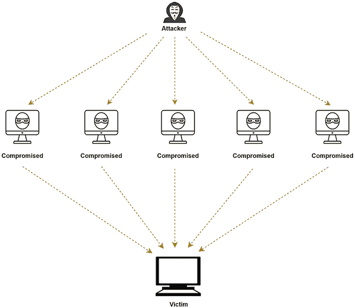
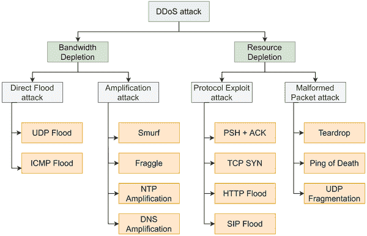
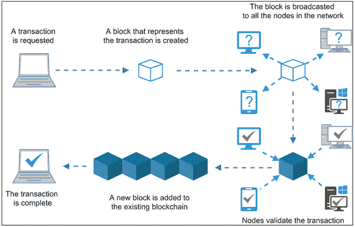
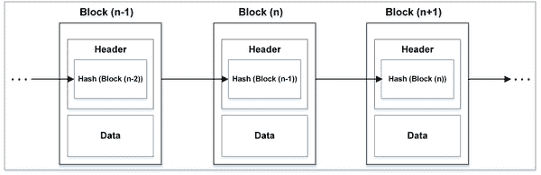
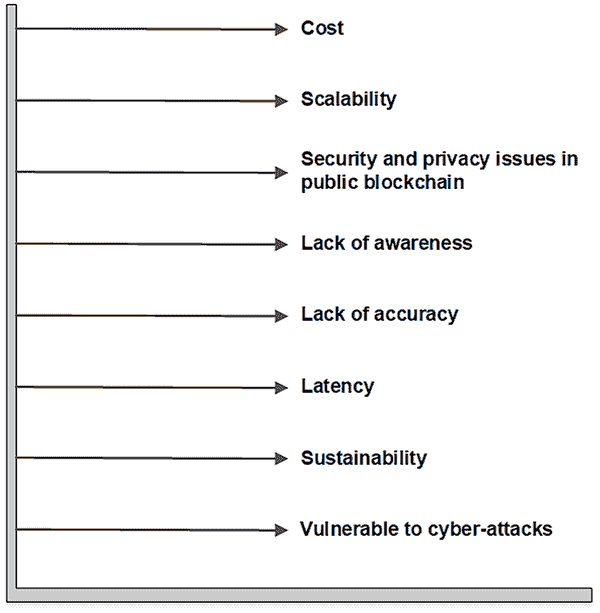

# 第二章

# 朝着利用区块链来对抗分布式拒绝服务（DDoS）

+   罗查克·斯瓦米

    印度库鲁克什特拉国立技术学院

+   迈杨克·戴夫

    

    印度库鲁克什特拉国立技术学院

+   维伦德尔·兰加

    

    印度库鲁克什特拉国立技术学院

+   尼克希尔·特里帕蒂

    德国达姆施塔特工业大学

+   阿比吉斯·卡拉伊尔·夏吉

    德国麦格德堡奥托·冯·格里克大学

+   阿瓦尼·夏尔玛

    印度斋普尔马拉维亚国立技术学院

摘要

过去二十年来，分布式拒绝服务（DDoS）攻击一直是网络管理员关注的严重问题。这些攻击目标包括内存、CPU 周期和网络带宽等资源，以使它们对良性用户不可用，从而违反了网络安全的组成部分之一的可用性。随着互联网上 DDoS 作为一种服务的存在，DDoS 攻击现在对于攻击者来说变得更具吸引力，以针对潜在的受害者。在本工作中，作者们专注于利用一种最新技术称为区块链来对抗 DDoS 攻击。在初始阶段，利用区块链来对抗 DDoS 攻击已经被证明是相当有前途的。作者们还比较了现有的基于区块链的防御机制来对抗 DDoS 攻击并对它们进行了分析。在工作结束时，他们还讨论了该领域可能的未来研究方向。

引言

分布式拒绝服务（DDoS）被认为是当今最具破坏性的攻击之一。DDoS 攻击试图通过针对服务器、服务或网络（Mirkovic 等人，2004 年）来干扰网络的正常工作。它向目标发送大量的互联网流量，并让正常用户因网络资源的拒绝服务而受苦。DDoS 攻击针对系统的资源，如带宽、CPU 和内存。这些攻击可以在有线和无线网络场景中使用。DDoS 攻击可以在短时间内对网络造成巨大破坏。因此，提供有效的防御解决方案来保护网络免受这些攻击非常重要。最近，已经提出了几种防御机制（Elsayed 等人，2020 年；Tripathi 等人，2016 年；Tripathi 等人，2018 年）。DDoS 攻击的数量随着时间的推移而迅速增加。根据 Lawrence Abrams 提供的 DDoS 攻击统计报告，2018 年的平均 DDoS 攻击大小为 26.37 Gbps（Abrams，2018 年）。在 2020 年之前的历史上，“Github”曾遭受过一次非常高达 1.35 Tbps 的最大 DDoS 攻击（Sam Kottler，2018 年）。然而，2020 年证明自己是 DDoS 攻击者和黑客更成功的一年。在 2020 年 2 月，亚马逊网络服务（AWS）遭受了一次 2.3 Tbps 的 DDoS 攻击，这次攻击被 AWS shield 防御——一项用于防御 DDoS 攻击的安全服务（Cimpanu，2020 年）。这次攻击被报道为有史以来最大的 DDoS 攻击。在 2020 年，DDoS 攻击者变得更加活跃，增加了攻击的机会。DDoS 攻击者还利用全球大流行的“COVID-19”（Wikipedia，2020 年）进行攻击。大多数人都在远程工作，需要在线或互联网访问。每个人/组织都依赖于在线服务进行日常生活。这些攻击针对在线服务，并用大量的网络流量来淹没它。政府和教育机构在 COVID-19 封锁期间也受到了更高比例的攻击（Palmer，2020 年）。2020 年 3 月，美国卫生与公众服务部门（HHS）的服务器在一段时间内被耗尽（Bannister，2020 年）。虽然不总是可能完全防止 DDoS 攻击，但可以减少攻击的影响。应该进行研究工作来减轻这些破坏性攻击，并开发有效的攻击防御系统。在过去几年中，一种名为“区块链”的新兴技术（Li 等人，2020 年）已被引入以预防和减轻 DDoS 攻击。区块链基本上是一组记录。这些记录也称为块，因此得名为区块链。这些块使用加密技术相互连接。区块链和 DDoS 的工作方式相反。区块链是一种分布式技术，而 DDoS 攻击是基于集中式服务器的。由于区块链是一种分布式/去中心化技术，它将信息分配给不同的节点，这使得攻击者难以通过针对特定系统来破坏整个网络的功能。攻击者必须获取对节点的访问权限才能使攻击成功。这个过程使得发动攻击变得困难和耗时。区块链在减少 DDoS 攻击成功率方面的另一个优势是，它将信息/数据存储在使用加密块的账本上。这个特性拒绝了第三方访问或进行任何更新，使其更安全。区块链使用密钥管理（私钥）允许用户彼此通信。因此，区块链在减轻 DDoS 攻击方面可以发挥重要作用。

这一章介绍了各种现有的基于区块链的防御机制来抵御分布式拒绝服务（DDoS）攻击以及可能的研究挑战。剩余章节的组织如下。第二部分定义了 DDoS 及其各种类型。与区块链及其不同类型相关的研究在第三部分中解释。第四部分讨论了各种现有的基于区块链的防御机制来抵御 DDoS。第五部分介绍了基于区块链的防御机制中一些可能的研究挑战。最后，本章在第六部分中总结。

分布式拒绝服务攻击

DDoS 攻击的定义

分布式拒绝服务（DDoS）（Swami 等，2020）攻击是一种恶意企图，通过以互联网流量的洪流淹没目标服务器、服务或网络，从而干扰其正常流量。这些攻击利用多台受感染的计算机或网络资源（如物联网设备）（Cloudflare，2020）来实现高吞吐量。大多数被攻击的资源是系统（服务器）的带宽、CPU 使用率和内存。它旨在为合法客户拒绝服务，从而降低网络系统的性能。图 1 显示了 DDoS 攻击的一般结构。

DDoS 攻击的主要目标是耗尽或过载目标的资源。DDoS 的影响各不相同，对于依赖其在线可用性的企业来说，可能是轻微的不便，也可能是严重的财务损失。攻击者的动机各种各样，从简单的娱乐（黑客活动）到经济利益（商业竞争）再到意识形态（政治、恐怖主义等）（Radwire ltd，2019）。DDoS 攻击占去年所有网络攻击的约 8%。根据最近的研究，趋势表明，DDoS 在频率、规模和持续时间方面不断发展。例如，2018 年超过 80% 的 DDoS 攻击持续时间很短，不到 10 分钟，但在这些攻击中，大约有 20% 的 DDoS 受害者在 24 小时内再次成为目标。2019 年第一季度，DDoS 攻击的规模比 2018 年同期增加了 73%（Infosec newsflash，2019）。攻击量增加的一个原因是每周都有更多受保护的终端设备、物联网设备以及地下市场上出售被攻陷系统的访问权限。表 1 展示了一些最著名和最近的 DDoS 攻击。

| 图 1\. DDoS 攻击的结构 |
| --- |
|  |

DDoS 攻击背后的一些主要原因和动机

DDoS 攻击有各种各样的原因。这里讨论了一些常见的原因（Douligeris 等，2004; Mirkovic 等，2004）。

+   • 有限的互联网资源：每个互联网组件，如网络、主机或服务都有有限的资源功率和大小。这些资源被多个用户使用，可能导致 DDoS 攻击。

+   • 互联网安全相互依赖：每个系统通过互联网与网络上的不同系统相连接。特定系统可能安全性很高。然而，特定系统是否成为 DDoS 攻击者的目标完全取决于全球互联网安全。

+   • 少数对多数：如果攻击者拥有比受害者资源更多的资源，则发生 DDoS 攻击的可能性更高。

表格 1\. 最近一些 DDoS 攻击案例

| 攻击月/年 | 攻击名称 | 受害网站 | 攻击描述 | 攻击影响 |
| --- | --- | --- | --- | --- |
| 2020 年 2 月 | AWS 攻击 | 亚马逊网络服务（Amazon Web Services） | CLDAP 反射攻击，体积巨大达到了 2.3 Tbps | 在减轻之前，持续了一周内有 3 天的高威胁 |
| 2019 年 6 月 | Telegram 攻击 | 电报（加密消息服务） | 攻击量为 200-400Gbps。攻击类型不详 | 影响到美洲地区以及其他一些国家的超过 2 亿用户的消息服务 |
| 2018 年 2 月 | GitHub 攻击 | GitHub（软件开发者的编码网站） | 使用 memcached 进行 UDP 放大类型攻击，流量速率达到 1.3Tbps，数据包速率为 126.9MPPS。 | GitHub.com 在几分钟内不可用，直到被 GitHub DDoS 保护服务减轻。 |
| 2016 年 10 月 | Dyn 攻击 | Dyn – 一个域名服务（DNS）提供商 | 利用由恶意软件 mira 创建的僵尸网络（botnets）袭击了 Dyn，一个主要的 DNS 提供商。 使用 TCP Syn 洪泛（flood）攻击了 Dyn 的 20 个数据中心。 | 导致了许多网站服务中断，包括 AirBnB、Netflix、PayPal、Visa、Amazon、纽约时报、Reddit 和 GitHub |
| 2015 年 12 月 | BBC 攻击 | BBC 新闻网站 | 针对 BBC 服务器的约 602 Gbps 大小的攻击。 | 虽然攻击持续时间不到 20 分钟，但 BBC 的服务却不可用了整整 24 小时。 |
| 2013 年 3 月 | Spamhaus | Spamhaus（一家反垃圾邮件组织） | 针对 Spamhaus 数据中心的第三层攻击被设计出来。采用 DNS 反射攻击，初始流量达到 10Gbps，峰值高达 120Gbps。 | Spamhaus 数据中心的互联网访问被阻断了数小时。攻击者约 48 小时后以全力发动攻击，直到实施了基于 Cloudflare Anycast 的负载均衡为止，该服务才恢复正常。 |

+   • 竞争优势：一些在线服务型企业向竞争对手的业务发动 DDoS 攻击，以减慢其网站速度。这会导致网站崩溃，丢失合法客户的请求，造成财务损失，并玷污该品牌形象。在这种情况下，客户会转向竞争对手的网站。

+   • 政治问题：如今，DDoS 攻击在国家和政府之间频繁发生。新的战场是“网络”。政府网站可能成为同一国家或其他国家的目标。不同政治派别或政府越来越倾向于使用网络进行沟通。因此，政府通过 DDoS 攻击瞄准其他对立的政党。如果公民对政府的工作不满意，他们也会瞄准政府网站。

+   • 个人乐趣：一些黑客使用不同类型的最新 DDoS 攻击工具发动攻击，展示他们的黑客技能。而一些黑客则瞄准网站以获得个人乐趣并扰乱网站的运行。

DDoS 攻击分类

有不同类型的 DDoS 攻击用于各种目的。图 2 显示了 DDoS 攻击的分类。DDoS 攻击根据消耗资源的类型分类，即带宽耗尽和资源耗尽（处理能力和内存）（Swami 等，2019 年）。

+   • 带宽耗尽：带宽耗尽攻击是 DDoS 攻击的一个重要类别。根据攻击，大量的网络流量被发送到消耗网络带宽的网络。消耗的带宽会丢弃来自合法用户的请求，并降低网络性能。带宽耗尽攻击分为两种不同类型，即直接洪水攻击和放大攻击。

    +   o 直接洪水攻击：这是最常见且最易于执行的 DDoS 攻击类型之一。在这种攻击中，攻击者向目标设备发送大量数据包，以耗尽其带宽或向网络段发送大量数据包，以创建网络拥塞。IoT 设备和租用的僵尸网络的可用性使得这种攻击类型更加常见。UDP 洪水和 ICMP 洪水是直接洪水攻击的类型。

    +   o 放大攻击：这种 DDoS 攻击涉及一个放大因子，攻击会得到倍增。当用户向服务器发送多个请求时，服务器会向目标设备发送大量回复。通常，攻击者会在数据包头部伪造源 IP，导致大量数据包发送给受害者。放大攻击的一些例子包括 smurf、fraggle、NTP 和 DNS 放大。

+   • 资源耗尽：这类 DDoS 攻击针对系统的主要资源，如内存、CPU（处理能力）等。资源耗尽攻击试图完全消耗资源，以致正常用户必须因资源不可用而遭受困扰。有两种不同类型的资源耗尽攻击，即协议利用和恶意数据包攻击。

    +   **协议利用攻击**：这种攻击针对 TCP/IP 协议栈的 L3 和 L4 层的协议的弱点。攻击者利用目标设备上安装的协议中的特定功能或漏洞来耗尽其资源。协议利用攻击的一些例子包括 push + ack、tcp-syn、http flood 和 sip flood。

    +   **畸形数据包攻击**：在这种攻击中，攻击者向目标设备传输 IP 数据包，这些数据包要么是畸形的，要么是不完整的，从而导致目标设备在处理时异常或甚至崩溃。畸形数据包攻击的例子包括 teardrop、ping of death 和 UDP 分段。

| 图 2\. DDoS 攻击分类 |
| --- |
|  |

**区块链技术**

区块链无疑是一种巧妙的发明。它是一种记录信息的系统，其中任何数字资产的历史都是通过去中心化和加密哈希技术来保证不可更改和透明的。区块链，又称为分布式账本，是一种数字交易账本，其副本分布在整个区块链网络的计算机系统之间（Euromoney，2020）。区块链中的每个区块包含多个交易，一旦新的区块被添加到区块链中，每个参与者的账本都会添加一份副本。区块链的工作流程在图 3 中有所解释。区块链的诞生通常被认为是在 2008 年末，当时发布了一篇介绍使用化名 Satoshi Nakamoto 的去中心化 P2P 电子现金系统的白皮书时。比特币的介绍显然是一个重要的里程碑，并在 P2P 和区块链领域提供了进一步的进步。但与许多其他创新一样，比特币也是建立在先前的技术基础上的（Beyer，2020）。

区块链的概念最早由科学家 Stuart Haber 和 W. Scott Stornetta 在 1991 年描述（比比特币白皮书早了 17 年）。他们引入了一个使用密码学安全的区块链来存储时间戳文档的系统，这个系统在 1992 年进一步改进为 Merkle 树（Haber et al., 1991）。这个改进通过允许将多个文档存储在单个区块中来提高了系统的效率。但是这项技术未被使用，并且专利在 2003 年到期。

比特币，第一个区块链，诞生于 2009 年 1 月 3 日，第一个硬币由中本聪挖出。2013 年，区块链技术又迈出了另一个重要的里程碑。程序员、比特币杂志联合创始人维塔利克·布特林（Vitalik Buterin）因比特币的编程限制而推动了一个可塑形的区块链的发展。由于比特币社区的拒绝，他开始开发第二个名为以太坊的区块链。以太坊引入了“智能合约”的概念——一个图灵完备的软件，可以在以太坊区块链上进行处理，满足其中设定的一系列标准（Beyer，2020）。智能合约可以用几行代码创建，并且旨在根据其中包含的一系列规则自动执行或保存法律上有时间戳的事件或活动。以太坊可以处理任何类型的智能合约，而无需创建专用的区块链基础设施。尽管比特币仅设计用于单一功能，即货币交易，并且只能使用单个智能合约，但以太坊区块链具有更强大的设计，使用了一个分散的计算机网络，可以编程任何类型的智能合约（Beyer，2020）。受智能合约潜力的吸引，这项技术吸引了许多主要的 IT 巨头的关注。企业以太网联盟（Enterprise Ethernet Alliance）就是由来自领先 IT 公司的成员组成的一个正式组织，旨在进一步推动该技术的发展（Medium，2020）。

| 图 3. 区块链的工作原理 |
| --- |
|  |

区块链架构在金融行业中被广泛应用。然而，如今这项技术不仅广泛应用于加密货币，还应用于保险、区块链物联网（IoT）、资产管理、供应链传感器等领域。区块链的结构是按特定顺序排列的交易块的反向链接列表。这些列表可以存储为平面文件（.txt 格式）或以简单数据库的形式存储。区块链中使用的两个重要数据结构是：

+   • 指针 - 值简单地指向存储在其他地方的另一个值。哈希指针只是在引用的基础上添加了值的哈希，使数据防篡改。

+   • 链表 - 是一种数据结构，用于存储一系列块，其中每个块存储一些数据，并使用指针链接块。

图 4 展示了基于两种数据结构的区块链的结构，即指针和链表。

| 图 4\. 区块链结构 |
| --- |
|  |

区块链的类型

区块链技术的一个重要应用是通过安全网络促进交易或信息交换。使用分布式分类帐或区块链的方式因用户而异。对于数字加密货币比特币等数字货币，区块链网络应该是公共的，因为来自世界各地的人都可以成为节点，验证其他节点并交易比特币。另一方面，银行业的网络应该限制向用户传递信息以保持机密性。广义上，区块链被分为公共区块链和私有区块链。为了获得公共区块链和私有区块链的优势，研究人员已经开始研究财团/混合模型。

1\. 公共区块链

它是一个无需许可和无限制的分布式账本系统，其中任何有互联网接入的用户都可以进入区块链系统成为其一部分和授权实体。用户还可以访问之前和当前的交易记录，参与交易验证的工作量证明，并进行区块挖掘。其基本应用是挖矿和交易加密货币。这是一个安全系统，用户必须遵循安全规则和政策。然而，当参与者拒绝服从安全协议时会发生安全漏洞。一些公共区块链的例子包括比特币、以太坊和莱特币。表 2 显示了比特币、以太坊和莱特币的比较研究。

表 2\. 比特币、以太坊和莱特币的比较研究

| 区块链 | 比特币 | 以太坊 | 莱特币 |
| --- | --- | --- | --- |
| 创始人 | 中本聪 | 维塔利克·布特林 | 克里斯·拉森和麦卡利德 |
| 描述 | 用于点对点网络的去中心化加密货币 | 运行智能合约的去中心化平台 | 像比特币一样，它是一个点对点的加密货币和在 MIT/X11 许可下发布的开源软件项目 |
| 成立时间 | 2009 年 1 月 | 2014 年 1 月 | 2011 年 10 月 |
| 市值（近似值） | 56% | 13% | 3% |
| 最大数量 | 2100 万比特币 | 1800 万 | 8400 万单位 |
| 通过 | 区块链/挖矿 | 去中心化程序/智能合约 | 基于较简单算法的挖矿 |
| 交易时间 | 10 分钟 | 12-14 秒 | 2.5 分钟 |
| 哈希算法 | SHA-256 | Ethash | Scrypt |
| 挖矿 | 处理器密集型 | 内存密集型 | 内存密集型 |
| USD 价格（截至 2018 年） | BTC/USD: 17,571 | Eth/USD: 610 | LTC/USD: 332 |

(SEPA, 2017)

2\. 私有区块链

私有区块链是一个受许可和限制的网络，通常在企业/组织内使用。在此，只有选定的成员参与区块链活动。为了维护和管理权限和授权，部署了一个控制实体。一般而言，这种类型的网络用于投票系统、数字身份和供应链管理。在表 3 中对 Multichain 和 Hyperledger 进行了比较。

表 3\. Multichain 和 Hyperledger 的比较

| 区块链 | Multichain | Hyperledger Fabric |
| --- | --- | --- |
| 描述 | 区块链应用的开放平台 | 推进区块链技术的开源倡议 |
| 成立时间 | 2015 年 6 月 | 2015 年 12 月 |
| 模型 | 自适应运行时 | 认可 |
| 语言 | Javascript | Go+Java+Javascript |
| 速度 | ~1s | ~10s |
| 哈希和数字签名 | SHA-256，ECDSA（secp256k1） | SHA-256，ECDSA（p-256，p-385，p-521） |

（Ismailisufi 等，2020；Cachin 等，2016）

3\. 联合区块链

联合区块链具有半去中心化的行为，由一组实体管理。它们与私有区块链的工作方式略有不同。私有区块链和联合区块链之间的关键区别在于前者由多个组织处理，而后者由单个组织处理。多个组织作为一个节点工作并可以交换数据。银行部门和政府机构使用这种类型的区块链技术。

4\. 混合区块链

它结合了私有区块链和公共区块链的特点。在这种类型的系统中，参与者对区块链中存储的数据的访问权限拥有控制权。与其将所有数据公开，只有部分信息/数据被公开，保持机密性。私有区域发生的交易验证也在同一区域内进行。然而，用户有权将交易发送到公共网络进行验证。基于混合系统的区块链的一个例子是 Dragonchain。

基于区块链的 DDoS 缓解方法

区块链是当前最热门的技术之一，正在被用于网络安全领域以防止攻击。研究人员正在使用区块链，因为其分布式架构可以帮助减少 DDoS 攻击的可能性。大多数现有基于区块链的工作都利用了公共区块链。在本节中，讨论了一些利用区块链防御 DDoS 攻击的主要工作。

Rodrigues 等人（2019a）提出了一种协作机制，用于自主系统和客户之间减轻 DDoS 攻击的影响。该方法的主要组成部分包括自主系统和客户，作为 SDN 概念的一部分，以及来自区块链技术的智能合约。在这个实现中，以太坊区块链被选择为信令的基础设施，因为它具有公开可用的特性，还可以生成智能合约，每 14 秒创建一个新的区块。SDN 的 OpenFlow 协议被用作网关的监控框架，用于分析流量。该系统的参与者需要最初创建一个智能合约。客户有权向区块链写入，ASes 则具有区块链的写入和读取权限。如果任何 AS 或客户遭受 DDoS 攻击，攻击者的 IP 地址列表将被存储在智能合约中。更新后的地址列表将被发送给订阅的 ASes，通过分析流量和验证目标的真实性来确认攻击的真实性。一旦地址确认，根据域的政策可以应用不同的缓解策略以防止攻击。作者建议在这些场景中将近源缓解作为理想策略，以改善互联网的健康状况。这可以防止转发数据包的成本，因为 DDoS 攻击涉及大量无用的数据包。还提出了一种激励机制，用于在近源进行缓解，以防止域利用合作防御的优势。

Javaid 等人（Javaid 等人，2018 年）提出了一种使用区块链为物联网设备进行 DoS/DDoS 缓解的框架。所提出的框架基于以太坊区块链进行攻击防御。以太坊区块链与智能合约集成用于防御。在该框架中，物联网设备被注册到服务器以与其他物联网设备进行通信。为物联网设备分配了气体限制以供工作。物联网设备在限制到期后不工作。服务器可以随时取消注册物联网设备，如果其工作不正确或其气体限制到期。服务器还管理智能合约的创建和注册。已注册智能合约的地址被广播到网络中的所有可用物联网设备。合同维护包括注册物联网设备在内的受信任列表。合同中的每笔交易的气体限制在智能合约初始化时固定。智能合约作为主要组件定期检查物联网设备。智能合约执行物联网设备的授权。当物联网设备发送消息时，智能合约检查其受信任节点列表。如果智能合约在受信任列表中找到物联网设备的地址，则仅将该物联网节点的消息存储在区块链中，否则，消息被丢弃。

所提出的框架的主要优势是，该架构具有分布式控制。这意味着一个崩溃的节点不能影响剩余系统的工作。分布式架构还减轻了服务器的负担。所提出的系统能够保护服务器免受洪水式的 DDoS 攻击。它的工作原理是，即使所有设备在气体限制下同时发送流量，服务器也不会耗尽。如果任何物联网设备被损坏并充当攻击者，则它不能超出气体限制工作。该系统提供了检测和缓解功能。

Kataoka 等人（Kataoka et al., 2018）提出了一种基于区块链的物联网设备的 DDoS 缓解架构。缓解机制基于流量管理的信任列表。信任列表将区块链与 SDN 技术集成。它由三个模块组成：（1）物联网服务器、网关和验证器，（2）物联网应用和设备，（3）边缘网络。信任列表保存在区块链中。它为所有三个组件之间提供反馈机制。信任列表仅允许受信任的设备进行通信。信任列表定义设备是否受信任。它维护两种类型的配置文件，即服务配置文件和设备配置文件。这些配置文件在网络中分布。服务配置文件存储与受信任的物联网服务器、网关和验证器相关的信息。受信任的物联网应用程序和设备的信息放置在设备配置文件中。SDN 开关连接在边缘网络上，过滤恶意网络流量。控制器与区块链保持协同作用，并访问与服务和设备配置文件相关的信息。物联网服务器、网关和验证器维护与受信任的服务和设备相关的数据。控制器向开关发送流规则以更新它们以阻止或允许物联网流量。使用验证器的目的是检查物联网设备的真实性。因此，它将 DDoS 攻击限制在边缘网络。然而，在伪造攻击的情况下可能存在安全问题。

Rodrigues 等人（Rodrigues 等人，2017b）提出了一种新的机制“区块链信令系统”（BloSS），用于合作网络防御系统中的 DDoS 防御。BloSS 包括两个主要组件，即智能合约（SC）和去中心化应用（dApp）。SC 展示了自治系统之间如何交换信息。dApp 定义了自治系统在合作防御中的互动方式。区块链维护了对自治系统的信任。BloSS 架构与软件定义网络（SDN）集成。它包括三个层次：部署在以太坊区块链中的智能合约；与区块链交互以提取地址的 dApp；用于监视流量并更新交换机中的流规则的 Ryu 控制器。在区块链层中，使用中心 SC 配置自治系统的 SC，并更新 IP 网络上的信息。dApp 层负责将本地客户端连接到以太坊区块链。用于实验目的的硬件测试平台包括 OpenFlow Zodiac FX 交换机，Ryu 作为 SDN 控制器。

Gruhler 等人（Gruhler 等人，2019 年）提出了一种用于 DDoS 缓解的声誉管理方案。 作者主要关注了为 BloSS 设计、实施和评估所提出的声誉方案。 所提出方案的关键思想是利用激励设计来处理恶意活动，提出声誉和奖励方案的基础。 声誉方案基本上赋予了网络的贡献者和消费者评价请求保护的实体的权力。 通过合作防御评价方案由三个模块组成，即缓解任务索引、声誉数据存储和声誉指标实施。 该方案在以太坊区块链上进行了评估，结果显示 DDoS 攻击得到了有效缓解。 这种方案的主要优点是声誉管理方案解决了合作防御中“虚假报告”和“免费乘车”的问题。 此外，它还防止了 Sybil 和串通攻击。 该方案的主要局限性在于它使用了工作量证明（PoW），这导致了可变的区块创建时间。 这种限制可以通过使用权威证明（PoA）来解决。 所提出的方案可以改进以检测投票填充和恶意安装攻击。

Kumar 等人（Kumar et al., 2020）提出了一种基于 sfog 计算范例的智能合约分布式入侵检测系统（IDS）。作者首先提出了两种基于人工智能的攻击检测模型，然后提出了一种用于管理数据负载平衡和物联网分布式文件存储的星际文件系统。在检测模型的开发中，使用了随机森林和 XGBoost。所提出的 IDS 在 BoT-IoT 数据集上进行评估。将智能合约与基于机器学习的 IDS 集成的主要目的是防止区块链物联网系统中的异常交易。所提出的解决方案包括以下步骤：（1）IDS 分析传入流量，（2）如果数据包正常，则根据智能合约中包含的逻辑执行交易，执行后的交易永久添加到区块链中，（3）如果数据包被发现为恶意，则向管理员报告警报，并采取必要措施，（4）如果 IDS 发出虚警，则由管理员决定是否将交易发送到智能合约。实验结果表明，所提出的 IDS 优于最先进的解决方案。IDS 的主要优点包括：使用较少的特征可达到高达 99.99%的检测率，分布式文件存储消除了实际数据障碍，并维护了物联网数据的离线存储。所提出的 IDS 的主要限制包括其与星雾节点中的智能合约的集成。

Abou El Houda 等人（Abou El Houda 等人，2019 年）提出了基于区块链的 DDoS 缓解机制“Cochain-SC”。它涉及两个层次的缓解，即域内和域间。作者提出了基于 SDN 的域内 DDoS 缓解方法。该缓解方法包含三个步骤：域内基于熵的、基于贝叶斯的和域内缓解。基于熵的域内过程用于测量域内数据的随机行为。基于贝叶斯的域内过程负责使用熵变化对攻击和非攻击（合法）流进行分类。为了缓解同一域内的攻击流量，使用了一个域内缓解过程。对于域间的 DDoS 缓解，作者提出了基于区块链的 DDoS 缓解方法。该机制利用以太坊区块链的智能合约来缓解不同 SDN 域之间的攻击。为此，开发了一种方法，允许其他 SDN 域之间进行安全通信，并以分布式方式交换攻击信息。因此，观察到域内和域间 DDoS 缓解方法的集成“Cochain-SC”使得能够对正在进行的 DDoS 攻击进行高效缓解成为可能。所提出的方法已经作为首个利用 SDN 和智能合约考虑域内和域间 DDoS 缓解的缓解方法进行了实施。为了实现这一目的，使用了一个名为“mininet”的仿真器来创建 SDN 的真实网络场景。使用 sFlow-RT 监控网络流量，使用 Floodlight 作为 SDN 控制器。它还减少了将数据包发送到不同域的成本，并避免了单点故障。所提出的方法提供了高精度的攻击检测和灵活性的评估结果。

Yeh 等人（Yeh 等人，2019）提出了一种基于区块链的机制，用于共享 DDoS 攻击的 IP 列表。共享这些恶意 IP 列表是为了阻止不同节点上正在进行的攻击。联盟区块链用于监视恶意行为。使用智能合约比较 IP 列表以识别恶意 IP。所提出的系统确认了 CIA 模型的所有安全原则（机密性、完整性和可用性）。椭圆曲线加密用于确保数据的保密性和完整性。

Yeh 等人（Yeh 等人，2020）提出了一种机制“SOChain”，用于与 DDoS 攻击相关的信息交换，这是 Yeh 等人（2019）提出的一项扩展工作。所提出的机制利用联盟区块链。所有节点都需要经过身份验证才能共享与 DDoS 攻击相关的信息。所提出的机制由四个模块组成，分别是智能合约、Swarm、安全运营中心（SOC）和去中心化 Oracle 服务。智能合约用于控制平台上的完整流程。Swarm 负责存储 DDoS 攻击的加密 IP 列表的日志。SOC 用于监视网络中的任何恶意活动。去中心化 Oracle 服务用于处理从智能合约中引发的事件，以采取任何与隐私保护相关的行动。所提出的机制在安全方面的目标是维护 DDoS 攻击的 IP 列表的机密性和完整性。每个 SOC 都可以像上传者、买家和数据验证者一样运行，以与其他 SOC 共享安全信息。为此，使用了一些 DDoS 硬币作为虚拟货币，以及两种声誉积分，即正面声誉和负面声誉。这些硬币和积分由 SOC 管理。此外，所提出的系统包括两个阶段，即上传阶段和购买阶段。在上传阶段，每当检测到 DDoS 攻击时，SOC 上传者将检测到的攻击的 IP 列表上传到 Swarm。IP 列表的上传以加密形式进行。在购买阶段，买家通过安全检查后收到 DDoS 的 IP 列表，并解密 IP 列表以访问它。

这些基于区块链的防御方案在表 4 中进行了总结。

表 4\. 区块链防御 DDoS 攻击的解决方案

| 作者 | 机制 | 区块链类型 | 实施细节 | 优势 | 限制 |
| --- | --- | --- | --- | --- | --- |
| Rodrigues et al. (2017a) | 基于区块链的智能合约协作机制 | 以太坊 | 仅提供了提出的框架 | 可作为现有安全机制的补充方案 | 没有展示包括 SDN 在内的实际细节 |
| Javaid et al. (2018) | 区块链与物联网的集成防御系统 | 以太坊 | 以太坊开发包和 Go 客户端节点（用于物联网设备）。 | 避免单点故障，减轻服务器负担 | 可扩展性问题 |
| Kataoka et al. (2018) | 基于信任列表的机制，使用 SDN 和区块链 | 以太坊 | Ryu 控制器， | 提供攻击预防和防御行动 | 在成本和信任列表方面存在可扩展性问题，信任列表未加密 |
| Gruhler et al. (2019) | BloSS 的声誉管理方案 | 以太坊 | 测试平台 | 克服了合作防御中的“虚假报告”和“搭便车”问题 | 由于 PoW 导致的可变块创建时间 |
| Rodrigues et al. (2017b) | BloSS- 一种与 SDN 合作的机制 | 以太坊 | 测试平台（Zodiac FX SDN 交换机，Ryu 控制器和 Raspberry-Pi） | 提供更高的信任 | - |
| Kumar et al. (2020) | 分布式入侵检测系统 | 以太坊 | - | 99.99% 的检测率，分布式文件存储 | 与智能合约的集成是一项具有挑战性的任务。 |
| Abou El Houda et al. (2019) | Cochain-SC（基于域内和域间缓解方法） | 以太坊 | Mininet，Floodlight 控制器，以太坊官方网络“Ropsten” | 使用 SDN 和智能合约处理域内和域间，减少将数据包传输到不同域的成本，同时避免单点故障。 | SDN 中设备间共享的信息也需要受到攻击的保护。 |
| Yeh et al. (2019) | 基于使用令牌和布隆过滤器与其他节点共享恶意 IP 列表的机制 | 联盟 | 没有可用的实施细节 | 比现有的 IP 列表共享方法更具可扩展性。 | - |
| Yeh 等人（2020 年） | SOChain- Yeh 等人（2019 年）的一个扩展 | 联盟 | wolfSSL 库 | 减少加密时间，提高信任级别。 | 未详细显示实现细节 |

区块链技术的研究挑战和未来方向

区块链技术存在一些研究挑战。图 5 显示了基于区块链的防御解决方案中的这些挑战和未来方向的列表。

+   • 成本：基于区块链的防御系统面临两个方面的成本问题。单独使用区块链无法提供足够的安全解决方案。它必须与其他一些网络技术合作。例如，可以分析到最近区块链技术正在与一种流行的网络范式即软件定义网络（SDN）集成。SDN 提供对网络中恶意流量流的监控，并在检测到任何异常活动后进行动态处理。区块链被用于发布与攻击或信任相关的信息。这两种技术的整合可以用于防御网络遭受 DDoS 等攻击。这些整合的防御解决方案增加了整个系统的总成本。正如人们所知，区块链处于发展和创新的早期阶段。因此，将其与现有的传统系统及其合作替换，使这一过程变得昂贵。

采用区块链技术来保护网络涉及高能耗问题。目前大多数基于区块链的机制都是基于比特币基础设施和工作证明（PoW）作为一种共识技术来验证交易的。这些技术需要更高的计算能力来解决复杂的计算问题，以提供防御解决方案。用于解决复杂计算的计算机系统需要更多的能源。因此，有必要对这些计算机系统进行冷却，这增加了过程的成本。

| 图 5\. 研究挑战 |
| --- |
|  |

+   • 可扩展性：可扩展性是区块链的主要挑战之一。在公共区块链的情况下，可扩展性比私有区块链更为严重。可扩展性问题可以体现在时间、速度和成本方面。在当前情况下，大多数系统倾向于使用公共区块链。传统的交易网络能够以更高的速度处理交易。但是一些区块链如比特币和以太坊的交易速度较慢。私有区块链不会遭受这类可扩展性问题的困扰。在私有区块链中，交易处理直接进行，验证区块所需的计算能力较少。

+   • 公共区块链中的安全和隐私问题：大多数现有解决方案使用公共区块链。在隐私/机密性方面，公共区块链与私有区块链存在差异。在公共区块链中，信息对外开放。这可能存在隐私问题。区块链不提供任何交易保证。此外，区块链可能成为网络攻击的目标。可以考虑使用私有区块链来保持信息和交易细节的机密性。为了使信息保密，应限制访问。因此，应开发此类机制，以保护敏感信息的隐私，并处理其他网络攻击。

+   • 缺乏意识：使用区块链的主要挑战之一是缺乏意识。不同的组织和学术界对区块链技术及其应用了解不足。在许多机构中尚未引入区块链技术，这使得处理区块链更加困难和耗时。组织应熟悉区块链技术，以提出更高效的基于区块链的防御解决方案。

+   • 缺乏准确性：DDoS 防御系统应努力提供更高效的结果。防御系统的验证以准确性、误报等方式进行衡量。一个高效的防御系统提供更准确的结果，并减少错误报警。但大多数提出的基于区块链的解决方案不关心误报和漏报。

+   • 延迟：区块链技术在分布式基础设施中发挥作用。在分布式基础设施中，所有参与方都必须更新他们的信息，这可能会花费很多时间。这个过程增加了基于区块链的防御解决方案的延迟。

+   • 易受网络攻击：大多数解决方案使用比特币、以太坊等公共区块链，这些区块链利用 PoW 作为用户行为的共识方法进行防御。这些区块链容易受到各种网络攻击。因此，应设计这样的防御系统，可以在区块链系统中减轻攻击。为此，应该开发一种更安全的共识方法。

在该领域一些有前途的研究方向如下：

+   • 开发一款成熟的基于区块链的自动化 DDoS 防御工具：为了测试所提出方案的整体有效性，重要的是应该开发一个基于该方案的工具，然后可以在不同的测试案例中进行测试。因此，我们认为该领域的研究人员应该开发一款成熟的自动化区块链基础的 DDoS 防御工具。随后，应该对所提出的工具的有效性进行一系列广泛的已知 DDoS 攻击测试。

+   • 将区块链应用于抵御慢速 DoS 攻击（Tripathi 等人，2016 年和 Tripathi 等人，2018 年）：自上个十年以来，慢速 DoS 攻击的流行度与其他类型的应用层 DoS 攻击一直在持续上升。这些攻击甚至可以使用少量计算机就能使具有巨大计算能力的服务器崩溃。文献中提出了各种防御机制来应对这些攻击，然而，所有已知的机制都存在其自身的一套限制。因此，我们相信追求在这个方向上进行研究并分析基于区块链的防御机制是否能有效地抵御这些攻击将是很有趣的。

结论

DDoS 是最强大的攻击之一，其目的是通过向系统发送大量网络流量来消耗资源（带宽、CPU 力量和内存）。DDoS 攻击可以对网络造成巨大破坏。即使全世界都面临着全球大流行病“COVID-19”并试图应对，DDoS 攻击者也已经处于活跃状态。所有与日常、职业、机构或健康相关的工作都是通过在线服务处理的。DDoS 攻击者有最好的机会使所有服务崩溃或减速。这些攻击应该及时处理，以免使服务完全崩溃。许多研究人员和组织已经提出了许多预防解决方案。其中一种流行的技术，“区块链”，也被用于防御 DDoS。在本章中，详细介绍了 DDoS 攻击及其不同类型。本章还讨论了不同类型的区块链以及基于区块链的防御工作对抗 DDoS。区块链提供了许多有利于应对网络攻击的特点，但同时也使自身容易受到攻击。区块链存在一些应该被探索的挑战。因此，本章还解释了现有区块链机制中存在的一些重要研究挑战。区块链领域的主要问题是缺乏认识和可理解性。区块链是一种技术，如果缺乏对其概念的了解，就不能在现有的网络范式中利用。这就是为什么大多数现有研究工作在实施和模拟方面都存在缺陷的原因。因此，应该广泛研究区块链，以获取可以帮助防止诸如 DDoS 等网络攻击的好处。

REFERENCES

Abou El Houda, Z., Hafid, A. S., & Khoukhi, L. (2019). Cochain-SC：基于区块链的域内和域间 DDoS 缓解方案，使用 SDN 和智能合约。IEEE Access：实用创新，开放解决方案，7，98893–98907。

Abrams, L. (2018). IoT 设备导致 DDoS 攻击规模显著增加。https://www.bleepingcomputer.com/news/security/dramatic-increase-of-ddos-attack-sizes-attributed-to-iot-devices/

Bannister, A. (2020). DDoS 可疑行为：美国卫生部正在调查“交通量显著增加”。https://portswigger.net/daily-swig/ddos-suspicions-us-health-department-investigating-significant-increase-in-traffic

Beyer, S. (2020). 比特币之前的区块链：历史 | 区块电报。区块电报。https://blocktelegraph.io/blockchain-before-bitcoin-history

Cachin, C. (2016 年 7 月）。超级账本区块链布局。在分布式加密货币和共识分类工作坊上（Vol. 310, No. 4）。学术出版社。

Cimpanu, C. (2020). AWS 表示已减轻了一次 2.3 Tbps 的 DDoS 攻击，这是有史以来最大的。https://www.zdnet.com/article/aws-said-it-mitigated-a-2-3-tbps-ddos-attack-the-largest-ever/

CloudFlare. (2020). 什么是 DDoS 攻击？https://www.cloudflare.com/learning/ddos/what-is-a-ddos-attack/

Douligeris, C., & Mitrokotsa, A. (2004). DDoS 攻击与防御机制：分类与现状。计算机网络，44(5)，643–666。doi:10.1016/j.comnet.2003.10.003

Elsayed, M. S., Le-Khac, N. A., Dev, S., & Jurcut, A. D. Ddosnet：用于检测网络攻击的深度学习模型。在 2020 年 IEEE 第 21 届“无线、移动和多媒体世界”的国际研讨会上（WoWMoM）（第 391-396 页）。IEEE。

Euromoney.com. (2020). 区块链解释：什么是区块链？ | 欧洲货币学习。https://www.euromoney.com/learning/blockchain-explained/what-is-blockchain

GruhlerA.RodriguesB.StillerB. (2019 年 4 月)。区块链网络合作防御的声誉方案。在 2019 年 IFIP/IEEE 综合网络与服务管理研讨会(IM) (pp. 71-79)。IEEE。

Haber, S., & Stornetta, W. (1991)。如何给数字文档时间戳。《密码学杂志》，3(2)，99–111。

Infosec newsflash. (2019)。InfoSec Newsflash 发布的 2019 年网络安全统计数据。https://www.cyberdefensemagazine.com/cyber-security-statistics-for-2019/

Ismailisufi, A., Popović, T., Gligorić, N., Radonjic, S., & Šandi, S. (2020 年 2 月)。使用 Multichain 开源平台进行私有区块链实现。在 2020 年第 24 届信息技术国际会议(IT) (pp. 1-4)。IEEE。

JavaidU.SiangA. K.AmanM. N.SikdarB. (2018 年 6 月)。利用区块链缓解基于 IoT 设备的 DDoS 攻击。在第 1 届加密货币和区块链分布式系统研讨会论文集 (pp. 71-76)。学术出版社。

Kataoka, K., Gangwar, S., & Podili, P. (2018 年 2 月)。Trust list: 利用区块链和 SDN 进行全球范围的分布式物联网流量管理。在 2018 年 IEEE 第四届物联网世界论坛(WF-IoT) (pp. 296-301)。IEEE。

Kottler, S. (2018)。2 月 28 日 DDoS 事件报告。https://github.blog/2018-03-01-ddos-incident-report

Kumar, P., Kumar, R., Gupta, G. P., & Tripathi, R. (2020)。利用雾计算检测智能合约型区块链物联网系统的分布式框架来防范 DDoS 攻击。《新兴电信技术交易》，▪▪▪，4112。

Li, X., Jiang, P., Chen, T., Luo, X., & Wen, Q. (2020)。关于区块链系统安全性的调查。《未来一代计算机系统》，107，841–853。doi:10.1016/j.future.2017.08.020

Medium. (2020)。区块链架构基础知识: 组件、结构、优势和创建。https://medium.com/@MLSDevCom/blockchain-architecture-basics-components-structure-benefits-creation-beace17c8e77

Mirkovic, J., & Reiher, P. (2004). DDoS 攻击和 DDoS 防御机制的分类。计算机通信评论，34(2)，39–53。doi:10.1145/997150.997156

Mlsdev.com。 (2020). Mlsdev。https://mlsdev.com/blog/156-how-to-build-your-own-blockchain-architecture

Radware. (2019). DDoS 攻击定义 - DDoSPedia。https://security.radware.com/ddos-knowledge-center/ddospedia/dos-attack/

RodriguesB.BocekT.LareidaA.HausheerD.RafatiS.StillerB. (2017a). 基于区块链的智能合约协作 DDoS 缓解架构。在 IFIP 自主基础设施、管理和安全国际会议上（pp. 16-29）。Springer。

Rodrigues, B., Bocek, T., & Stiller, B. (2017b). 通过区块链信令系统（BloSS）实现合作式、多域 DDoS 防御。Semantic Scholar。

企业 SEPA。 (2017). 比特币、以太坊、瑞波和莱特币之间的区别。https://www.sepaforcorporates.com/thoughts/difference-bitcoin-ethereum-ripple-litecoin/

Swami, R., Dave, M., & Ranga, V. (2019). 基于软件定义网络的 DDoS 防御机制。ACM 计算调查，52(2)，1–36。doi:10.1145/3301614

Swami, R., Dave, M., & Ranga, V. (2020). 使用机器学习技术的 SDN DDoS 攻击和防御机制。在传感器网络和物联网中的安全与隐私问题（pp. 193–214）。IGI Global。doi:10.4018/978-1-7998-0373-7.ch008

Tripathi, N., & Hubballi, N. (2018). 针对 HTTP/2 的慢速拒绝服务攻击。计算机与安全，72，255–272。doi:10.1016/j.cose.2017.09.009

Tripathi, N., Hubballi, N., & Singh, Y. (2016). Web 服务器有多安全？慢速 HTTP DoS 攻击和检测的实证研究。在 2016 年第 11 届可用性、可靠性和安全性国际会议上（pp. 454-463）。IEEE。10.1109/ARES.2016.20

维基百科。 (2020). COVID-19 大流行。https://en.wikipedia.org/wiki/COVID-19_pandemic

YehL. Y.HuangJ. L.YenT. Y.HuJ. W. (2019 年 8 月)。基于区块链技术的协作式 DDoS 防御平台。在 2019 年第十二届国际 Ubi-Media 计算大会(Ubi-Media) (pp. 1-6)。IEEE。

Yeh, L. Y., Lu, P. J., Huang, S. H., & Huang, J. L. (2020)。SOChain: 一个隐私保护的 DDoS 数据交换服务，基于 SOC 联盟区块链。IEEE 工程管理交易。
