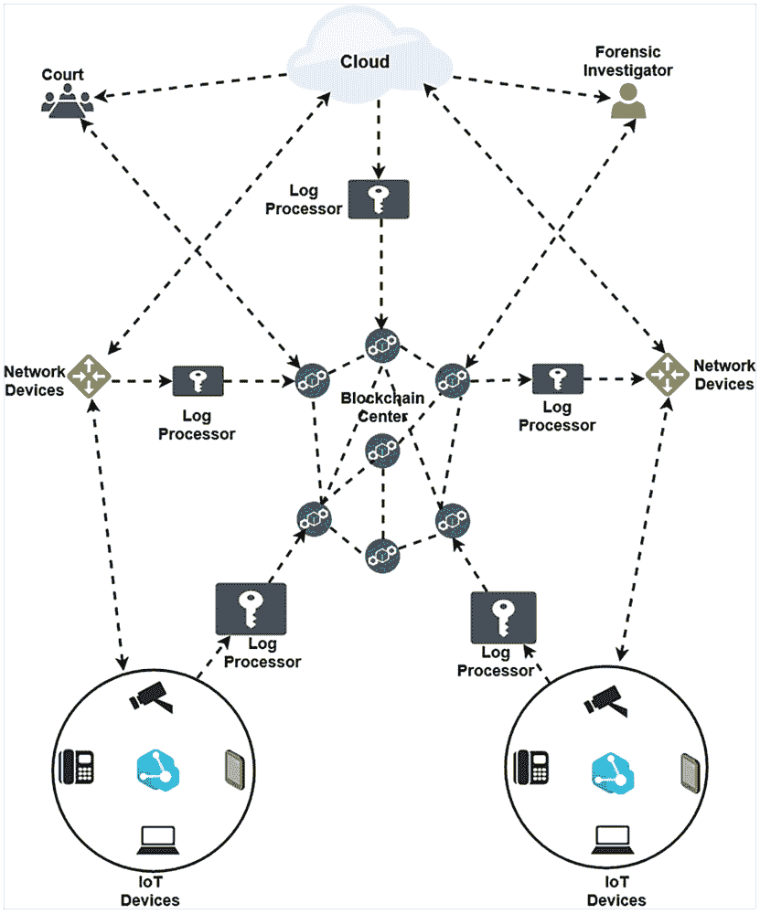
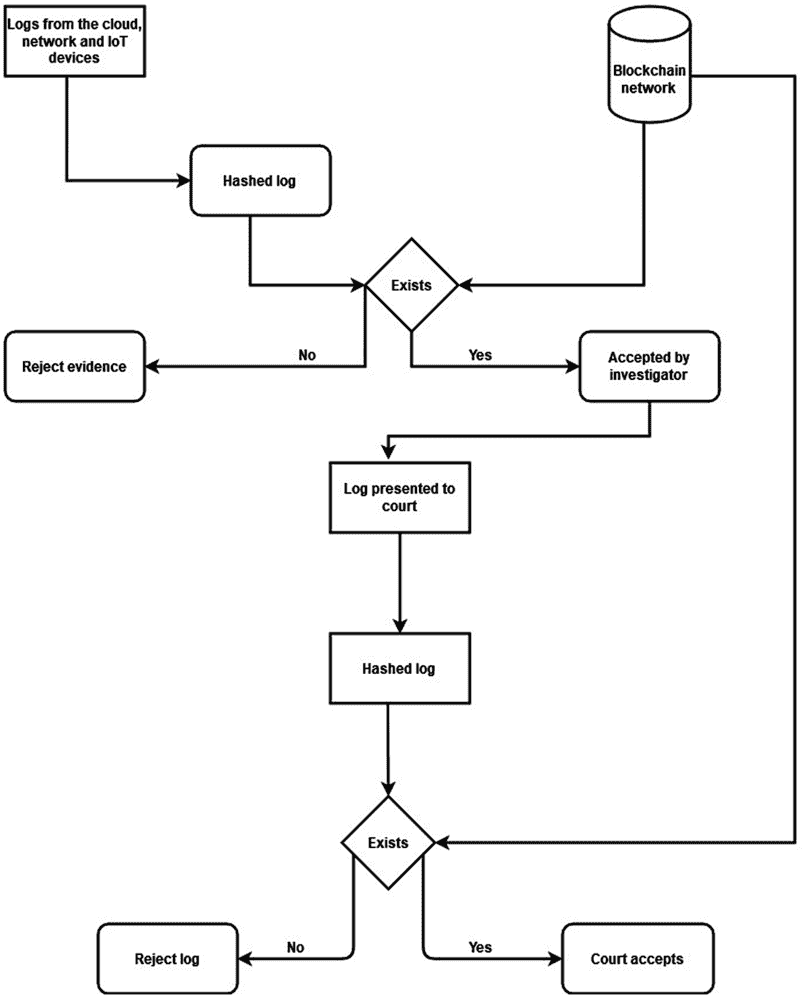

# 第三章

# BLOFF：

基于区块链的物联网取证模型

+   普罗米斯·阿格贝达努

    

    爱尔兰都柏林大学

+   安卡·德利亚·朱尔库特

    爱尔兰都柏林大学

摘要

在当今技术蓬勃发展的时代，物联网（IoT）在智能家居和城市、智能能源、安全监控和医疗保健等技术方面已经成为了改变者。物联网所提供的众多优势已经成为用户和网络犯罪分子青睐的技术。如今的网络犯罪分子拥有工具和技术，可以发动数百万次复杂的攻击。需要对这些攻击进行调查；这就是数字取证发挥作用的地方。然而，在物联网系统中进行取证调查并不容易，因为物联网环境的异构性。此外，取证调查人员主要依赖于服务提供商提供的证据，这种情况可能导致证据污染。为了解决这个问题，作者提出了一个基于区块链的物联网取证模型，防止篡改日志证据被录入。 

1\. 引言

在这个技术爆炸增长的时代，物联网（IoT）已成为改变游戏规则的技术之一，尤其是在智能家居和城市、智能能源、安全监控和医疗等方面（Statista, 2019）。据 Statista 的一份报告预测，在 2025 年，物联网设备的数量将达到 75 亿台。将现实世界的物体与互联网相融合不仅带来了许多优势，同时也给我们的生活带来了网络安全威胁（A. Jurcut et al., 2020）。与任何计算技术一样，物联网受到安全问题的威胁。许多研究人员和设备制造商正在探索各种技术，以确保物联网设备的安全，以及保护这些设备产生的数据。然而，根据(Atlam et al., 2017)的研究结果，由于这些设备的异构性和动态特性，要确保物联网环境中产生的数据的安全性是很困难的。因此，不足为奇，物联网的安全性已成为许多研究人员重点研究的领域，包括设备的物理安全以及其架构的安全性（A. D. Jurcut et al., 2020）。

目前，正在进行多项工作，以确保物联网环境中的数据保密性、访问控制、身份验证、隐私和信任（Borhani 等人，2020 年；Braeken 等人，2019 年；A. Jurcut 等人，2009 年，2012 年；A. D. Jurcut，2018 年；A. D. Jurcut 等人，2014 年；Kumar 等人，2019 年；Xu 等人，2019 年）。尽管使用上述参数在物联网安全方面取得了许多成功，但攻击者仍然找到方法利用物联网系统中存在的漏洞（A. D. Jurcut 等人，2020 年）。这些数十亿的物联网设备包含敏感数据，这一属性使它们成为网络攻击的目标。网络攻击的数量和成本逐年增加。根据（Morgan，2017 年）的报告，网络犯罪造成的损失将在 2021 年达到 6 万亿美元。这些攻击需要进行调查；这就是数字取证发挥作用的地方。

数字取证有助于获取可用于了解这些攻击、预防未来攻击并最重要的是起诉这些犯罪分子的法律证据。然而，在物联网系统中进行取证调查并不容易。根据（Perumal 等人，2015 年）的说法，物联网系统的异构性和动态特性使得在物联网环境中使用传统数字取证中使用的相同框架实际上很困难。因此，有必要开发可以在物联网环境中使用的框架，考虑到其动态性和异构性。

在本章中，我们讨论了一种基于区块链的模型，该模型确保了物联网环境中产生的日志的可验证性。该模型的主要思想是确保在取证调查期间由物联网设备产生的日志的可信度和真实性。我们的模型采用了去中心化方法和区块链的不可变性属性，以确保在物联网环境中产生的日志和其他证据可以被取证利益相关者验证。我们提出的模型防止了云服务提供商（CSP）或执法机构（LEA）在取证调查或法庭诉讼中提供虚假证据。所提出的模型将法院、执法机构、云服务提供商和其他利益相关者纳入一个统一的范围，在这个范围内，每个利益相关者都可以验证任何人提出的证据的真实性。该模型还确保了证据在监护链中不被篡改。我们从介绍物联网和区块链中的数字取证开始本章。然后我们继续描述我们提出的模型。我们讨论了我们模型的好处，然后我们提出了结论。

2\. 背景

在本节中，我们介绍数字取证、物联网取证和区块链的背景。

2.1 数字取证

数字取证已经有过多种定义。 (Bellegarde et al., 2010) 将计算机取证定义为“保护、识别、提取、解释和记录计算机证据，包括证据规则、法律程序、证据完整性、信息的事实性报告以及在法庭或其他法律和/或行政程序中提供专家意见，说明发现了什么。” 数字取证和计算机取证的概念密切相关，后者是前者的子集。 最广泛接受的数字取证定义是在第一次数字取证研究研讨会上提出的，并由 (James et al., 2015) 中的作者陈述为“利用科学证明的方法对来自数字源的数字证据的保护、收集、验证、识别、分析、解释、记录和呈现，以促进或进一步重建被发现为犯罪行为的事件，或者帮助预测已显示为对计划操作具有破坏性的未经授权行为。” 数字取证涉及应用科学方法调查网络犯罪 (Carrier, 2003)。 根据 (Sumalatha & Batsa, 2016)，数字取证中采用的处理电子证据的方法源自法医科学。

2.1.1 数字取证过程

数字取证证据在最终呈现给法庭进行起诉目的之前需要经历各种阶段。 （Daniel & Daniel，2012）指出数字取证由四个过程组成。 这些过程是鉴定，收集，组织和呈现。 同样，（Zawoad et al.，2015）列举了数字取证的阶段，包括鉴定，保存，分析和呈现。 根据（Hemdan & Manjaiah，2018），数字取证涉及在识别，收集，组织和呈现证据方面应用科学过程。 美国国防计算机取证实验室前主任 Ken Zatyko 概述了使数字取证成为科学过程的八个步骤（Zawoad et al.，2015）。 这八个步骤包括（Zawoad et al.，2015）：获得搜索权限，记录责任链，成像和哈希证据，验证取证过程中使用的工具，分析证据，重复和再现以确保质量保证，通过记录取证过程中使用的程序进行报告，最后在法庭上提交专家证人。

2.1.2 证据鉴定

这是法庭过程的第一阶段。 这个阶段包括两个步骤。 第一个是确定事件，第二个是确定证据。 事件和被识别的证据之间必须有直接的相关性（Daniel & Daniel，2012）。

2.1.3 证据收集

这个阶段涉及从不同媒体中提取证据。 提取方法可能包括对证据的原始副本进行成像。 这个阶段还涉及保护证据的完整性（Daniel & Daniel，2012）。

2.1.4 组织

此阶段主要包括证据检查和证据分析两个主要步骤。一些研究人员明确将这两个步骤分开。在证据检查期间，调查员对作为证据的数据进行彻底检查（Daniel＆Daniel，2012 年）。此检查可能涉及使用不同的取证工具。这些工具用于提取和过滤调查员感兴趣且与调查过程相关的数据（Zawoad＆Hasan，2015 年）。分析阶段涉及通过分析收集的数据来重建事件。证据分析背后的理念是发现任何有助于案件技术和法律角度的证据材料（Ademu 等，2011 年）。

2.1.5 证据呈现

在识别、收集和组织证据之后，需要将证据呈现给法院。这一阶段包括调查员准备一份组织良好的报告，说明他或她在调查过程中所得到的发现（Daniel＆Daniel，2012 年）。然后将这些发现呈现给法院，如果有必要作证，调查员将担任专家证人（Ieong，2006 年）。

2.2 物联网取证

与传统数字取证不同，物联网取证是行业和学术界都尚未探索的新领域。虽然数字取证和物联网取证的目的都是使用科学方法提取数字信息；但在信息提取方面，物联网取证的范围更广。根据（Atlam 等，2017 年；Raghavan，2013 年），物联网取证由云、网络和设备级取证组成。同样，（Stoyanova 等，2020 年）将物联网取证定义为数字取证的一个方面，其中的证据识别、收集、组织和呈现发生在物联网生态系统内。他们还将物联网取证分为云、网络和设备级取证。

2.3 区块链

区块链，也称为分布式账本技术，是一个包含各种交易链的分散和分布式账本，这些交易链通过加密哈希连接在一起。根据（Gaur 等人，2018），区块链是“用于记录交易的不可变账本，由相互不信任的节点组成的分布式网络维护。” 来自节点的任何交易都会在区块链网络中由其他参与节点验证。验证后，交易集会由特殊节点（比特币中的矿工）添加到区块中。矿工是具有足够计算能力以解决密码难题的节点。区块链使用点对点（P2P）网络。这种架构使得每个节点能够与一组相邻节点通信，然后这些节点也与它们的相邻节点通信，通信不断进行。区块链设计为任何节点都可以随意加入和离开网络。区块链技术的设计和实施需要一些关键元素。这些元素包括：

+   1\. 时间戳：这意味着在加密货币应用程序（例如比特币）的情况下，双重支付的问题被避免。时间戳通过将待处理交易收集到区块中，然后计算区块的哈希来实现。这可以证明在创建区块时交易已存在，因为它被散列到区块上。

+   2\. 共识：由于新区块由挖矿节点创建并广播，因此所有节点需要就区块的单个版本达成一致。分布式共识有助于决定哪个区块会被添加到区块链中，这是由不同节点生成的多个变体所决定的。

+   3\. 数据安全和完整性：此属性或特性防止恶意节点创建虚假交易，因为每个交易都由节点或用户使用其私钥签名。 类似地，（Gaur et al.，2018）也在区块链框架内确定了四个区块。 这些区块是：共享账本、加密学、共识和智能合约。

挖矿，也称为工作证明（PoW），用于达成共识并确保数据安全和完整性。 挖矿是基于交易序列进行的； 只有重新执行工作证明，情况才能发生变化。 挖矿引入了区块生成的难度。 还有其他可用于确保数据安全和完整性的方法。 其中一些方法是权威证明（PoA）、存在证明（PoE）和概念验证（PoC）。 区块链可以是无许可或有许可的。 无许可的区块链也称为公共区块链，允许任何节点在任何时间加入和离开，而私有或有许可的区块链允许节点在加入网络之前进行身份验证。

3\. 相关工作

在本节中，我们探讨了一些与我们密切相关的工作。区块链已被广泛应用于物联网安全领域。然而，当涉及到物联网取证时，这一概念仍处于探索阶段。 (Meffert 等人，2017) 提出了一个框架，帮助在物联网取证中获取证据。该框架采用了集中式方法，在三个节点上部署，即控制器到物联网设备、控制器到云和控制器到控制器。尽管这项工作中使用的概念验证表明，所提出的框架可以从物联网设备中提取取证数据。然而，他们方法的集中化特性使得很难验证框架捕获的证据。 (Li 等人，2019) 也采用了数字证人方法，允许人们共享具有保证隐私的物联网设备日志。作者使用了他们早期工作中提出的隐私感知物联网取证（PRoFIT）模型来部署他们的数字证人模型。他们工作中提出的方法旨在帮助收集物联网环境中的数字证据，并确保所收集证据的隐私性得以保持。所提出的方法支持其 PRoFIT 方法中捕获的 11 个隐私原则。在他们的工作中， (Nieto 等人，2017) 提出了一种用于物联网取证的分布式日志记录方案。在这项工作中，作者使用了确保物联网环境中生成的日志可用性的修改信息分散算法（MIDA）。这些日志被聚合、压缩、验证和分散。这项工作中使用的分布式方法仅关注日志如何存储，而不关注它们如何被验证。利用区块链技术的不可变性属性， (Noura 等人，2020) 提出了一种使用基于许可的区块链的物联网取证框架。这个框架增强了证据的完整性、真实性和不可否认性。

4\. 提出的模型

在本节中，我们提出了我们基于区块链的物联网取证模型（BLOF）。在物联网环境中，有三个层次。这些是云、网络和设备层。我们的模型利用区块链的去中心化特性，确保在物联网环境中产生的日志存储在网络上，并且可以由网络中的任何参与节点进行验证。在进行取证调查时，有几个要考虑的物件。然而，我们的模型只关注系统和事件日志。我们模型中的实体包括云服务提供商（CSPs）、网络设备和物联网设备。这些实体在网络中充当区块链节点。通过密钥生成过程将新节点添加到网络中。节点的公钥在写入块之前附加到交易中。新节点生成一对密钥。CSPs 在网络中充当矿工。它们的计算能力使它们成为挖矿的理想候选者。我们的模型由区块链中心（BC）、日志处理中心（LPC）和用户中心（UC）组成。在前述子节中，我们详细讨论了每个组件。所提出的模型如图 1 所示。

4.1 区块链中心

区块链中心由一个分布式账本组成，每个日志在处理后写入一个区块。分布式账本由已提交到网络的所有区块组成。每个区块包含从日志计算的哈希值的事务值。日志从各个实体中提取，经过哈希处理后作为交易写入区块链网络。BC 中的节点由取证利益相关者、网络和物联网设备以及云服务提供商组成。在节点达成共识后提出区块。

4.2 日志处理中心

这个模型的这个组件处理日志处理。LPC 是一个位于实体和区块链网络之间的应用程序编程接口（API）。LPC 从物联网设备、网络设备和云层提取日志。提取的日志使用 SHA-256 哈希函数进行哈希处理，哈希值作为交易写入区块。我们选择对日志进行哈希处理，因为这些日志可能包含敏感信息。因此，将日志存储为明文是不可取的。其次，对日志进行哈希处理可以减小其大小，从而减少处理日志所需的时间。

4.3 用户中心

用户中心由法院和取证人员组成。模型的这个组件使得取证人员能够验证服务提供商提供给他们的日志的真实性。此外，取证人员在责任链传递日志时也可以验证日志的真实性。此外，法院还可以验证检察官提供的日志的真实性，并决定是否必须接受此类证据（日志）。这可以防止调查人员篡改日志以不公正地定罪无辜人员或为罪犯开脱罪行。

5. 日志验证

与传统数字取证不同，调查人员在物联网取证时完全依赖 CSP、网络和物联网设备获取证据。这种对 CSP 的依赖可能会导致证据被篡改。我们提出的模型不仅通过使用分散式账本确保日志的完整性，还允许作为证据提供的日志由取证过程中的各方验证。

在我们提出的模型中，取证调查人员仍然依赖云服务提供商和物联网设备来获取证据。然而，在这种情况下，即云实例、网络和物联网设备生成的各种日志被取证调查人员从云服务提供商那里收到后，将被哈希处理。哈希值然后与存储在区块链网络上的交易值进行比对。调查人员然后在区块链网络上搜索哈希值。如果哈希值存在于区块链上，则该日志被调查人员接受，并作为可信证据提交给法庭。另一方面，如果哈希值在区块链网络上不存在，则日志被拒绝。当法院收到了取证调查人员的日志后，法院可以通过类似方式对日志进行哈希，并将哈希值与区块链网络上的哈希值进行比对，以确定日志的可信度。如果值存在，则证据被法庭接受。否则，被拒绝。我们提出的模型的验证过程如图 2 所示。

例如，鲍勃是一名取证调查员，他收到了一个云服务提供商（CSP）的日志，意图将证据提交法庭起诉一名叫埃尔文的攻击者。然而，鲍勃不确定 CSP 提供的日志是否被篡改过。由于我们基于区块链的模型对所有日志的哈希进行了处理和存储；鲍勃可以验证日志的真实性。鲍勃首先将日志通过 SHA-256 哈希函数运行，并获得一个值（x）。然后他在区块链网络上搜索交易（x）。鲍勃是网络上的一个参与节点。如果他在网络上找到值（x）作为有效交易；那么该日志是真实的，他可以继续向法庭提交日志作为证据。然而，如果值（x）不是有效交易，则鲍勃必须丢弃该日志，而是调查谁对日志进行了更改。在鲍勃向法庭呈交日志后，法庭也可以验证日志的真实性。这里的假设是鲍勃可能试图诬陷埃尔文是他无辜的罪犯。同样，法庭将日志通过 SHA-256 哈希函数运行，然后在区块链网络上搜索确切的值。如果交易值存在，则法庭接受日志作为证据，并继续审理案件。否则，法庭将拒绝证据并驳回案件。

| 图 1\. 我们提出的基于区块链的物联网取证模型 |
| --- |
|  |
| 图 2\. 我们提出的模型验证过程 |
|  |

6\. 讨论

在本节中，我们讨论了我们提出的模型的优点，它可能对物联网取证性能的影响，然后我们将我们的模型与当前现有的模型进行了比较。

首先，我们提出的模型基于区块链，与(Meffert et al., 2017)讨论的中心化方法相比，使模型成为一个完全去中心化的模型。我们模型的去中心化特性确保可以验证日志以确定其真实性。它还防止服务提供商和法医调查人员在未被察觉的情况下篡改日志。我们的模型利用了区块链的不可变性属性，以确保在物联网环境中产生的日志的完整性。

此外，我们的模型提供了可验证性的优势。这一优势为法医利益相关者验证物联网环境中产生的日志的真实性提供了可能性 - 这是现有相关工作中要么不可用要么未充分探索的优势(Nieto et al., 2018; Nieto et al., 2017; Nieto et al., 2017; Le et al., 2018)。

我们将我们的模型与与我们密切相关的当前工作进行比较，使用以下参数：基于区块链、可验证性、去中心化、证据完整性和隐私。在模型满足参数的情况下，我们将其标记为是（Y）。如果它不满足该参数，则将其标记为否（N）。比较如表 1 所示。

表 1。将我们的模型与其他现有模型进行比较

| 指标 | (Nieto et al., 2018) | (Nieto et al., 2017) | (Noura et al., 2020) | (Le et al., 2018) | 我们的模型 |
| --- | --- | --- | --- | --- | --- |
| 基于区块链 | N | N | N | Y | Y |
| 可验证性 | N | N | N | N | Y |
| 去中心化 | N | N | N | Y | Y |
| 证据完整性 | Y | N | Y | Y | Y |
| 隐私 | Y | Y | Y | Y | Y |

我们意识到将我们的模型整合到物联网环境中将会带来一些额外的资源使用和计算成本。在随后的工作中，我们打算通过建立一个测试平台来评估我们模型的性能，以验证模型的有效性。

7\. 结论

今天，物联网已经成为人类生活中不可或缺的一部分。它已整合到医疗保健、汽车、农业、制造业和家庭等领域。随着 5G 网络的引入，物联网技术将会有更大的增长。然而，就像任何计算技术一样，这种技术的安全性也是一个问题。随着网络攻击数量的指数级增加，重要的是要调查此类犯罪行为，并将肇事者绳之以法。由于物联网环境的异构性以及云和网络层的整合，物联网环境中的取证调查是一项非常具有挑战性的任务。此外，对于利益相关者来说，确定他们处理的证据的真实性是极其困难的，因为在大多数情况下，他们必须依赖服务提供商提供这些证据。为了确保提交给取证调查人员的日志是真实且不可篡改的，我们提出了一个区块链取证模型，该模型使用去中心化方法将物联网环境中生成的日志的哈希值保存为交易记录。所提出的模型允许任何取证相关方验证他们正在处理的日志的真实性。该模型确保无辜者不会被陷害，而在取证调查期间，肇事者也不会被利益相关方免罪。对于未来的工作，我们希望进行实验验证，以确定我们的模型在物联网环境中的计算影响。此外，探索在我们的模型中存储日志的方法是我们感兴趣的另一个领域。

参考文献

Ademu, I. O., Imafidon, C. O., & Preston, D. S. (2011). 一个数字取证模型的新方法，用于数字取证调查。《国际先进计算机科学与应用期刊》，2(12)，175–178。

AtlamH. F.AleneziA.WaltersR. J.WillsG. B.DanielJ. (2017). Developing an adaptive Risk-based access control model for the Internet of Things. 2017 IEEE International Conference on Internet of Things (IThings) and IEEE Green Computing and Communications (GreenCom) and IEEE Cyber, Physical and Social Computing (CPSCom) and Ieee Smart Data (SmartData), 655–661\. 10.1109/iThings-GreenCom-CPSCom-SmartData.2017.103

Bellegarde, M., Orvis, M., & Helba, S. (2010). Ethical Hacking and Countermeasures: Attack Phases. EC-Council Press.

Borhani, M., Liyanage, M., Sodhro, A. H., Kumar, P., Jurcut, A. D., & Gurtov, A. (2020). Secure and resilient communications in the industrial internet . In Guide to Disaster-Resilient Communication Networks (pp. 219–242). Springer. doi:10.1007/978-3-030-44685-7_9

Braeken, A., Liyanage, M., & Jurcut, A. D. (2019). Anonymous lightweight proxy based key agreement for iot (alpka). Wireless Personal Communications , 106(2), 345–364\. doi:10.1007/s11277-019-06165-9

Carrier, B. (2003). Defining digital forensic examination and analysis tools using abstraction layers. International Journal of Digital Evidence , 1(4), 1–12.

Daniel, L., & Daniel, L. (2012). Digital forensics for legal professionals. Syngress Book Co , 1, 287–293.

Gaur, N., Desrosiers, L., Ramakrishna, V., Novotny, P., Baset, S., & O’Dowd, A. (2018). Hands-On Blockchain with Hyperledger: Building decentralized applications with Hyperledger Fabric and Composer. Packt Publishing. https://books.google.co.za/books?id=wKdhDwAAQBAJ

Hemdan, E. E., & Manjaiah, D. H. (2018). CFIM : Toward Building New Cloud Forensics Investigation Model. Academic Press.

Ieong, R. S. C. (2006). FORZA–Digital forensics investigation framework that incorporate legal issues. Digital Investigation , 3, 29–36\. doi:10.1016/j.diin.2006.06.004

James, J. I., Shosha, A. F., & Gladyshev, P. (2015). 数字取证调查和云计算。在云技术中（第 1231–1271 页）。IGI Global。doi:10.4018/978-1-4666-6539-2.ch057

JurcutA.CoffeyT.DojenR. (2012). 安全协议加密消息中的对称性——一种可被并行会话攻击利用的严重弱点。2012 年第七届可用性、可靠性和安全国际会议，410–416。10.1109/ARES.2012.39

Jurcut, A., Coffey, T., Dojen, R., & Gyorodi, R. (2009). 安全协议设计：使用密钥分发协议的案例研究。计算机科学与控制系统杂志，2(2)。

Jurcut, A., Niculcea, T., Ranaweera, P., & LeKhac, A. (2020). 物联网的安全考虑：一项调查。ArXiv Preprint ArXiv:2006.10591.

Jurcut, A. D. (2018). 用于安全协议的自动逻辑验证技术。计算机网络进展杂志，6，77–85。doi:10.18178/JACN.2018.6.2.258

JurcutA. D.CoffeyT.DojenR. (2014). 安全协议中针对并行会话攻击的设计要求。2014 年第十二届隐私、安全和信任国际会议，298–305。10.1109/PST.2014.6890952

Jurcut, A. D., Ranaweera, P., & Xu, L. (2020). 物联网安全简介。IoT 安全：身份验证的进展，27–64。

Kumar, T., Braeken, A., Jurcut, A. D., Liyanage, M., & Ylianttila, M. (2019). AGE：非便携式医疗环境中的身份验证。信息技术管理，1–20。

Le, D.-P., Meng, H., Su, L., Yeo, S. L., & Thing, V. (2018). Biff：基于区块链的 IoT 取证框架与身份隐私。TENCON 2018-2018 IEEE 第 10 区会议，2372–2377。

Li, S., Choo, K.-K. R., Sun, Q., Buchanan, W. J., & Cao, J. (2019). IoT 取证：以亚马逊 Echo 为例。IEEE 物联网杂志，6(4)，6487–6497。doi:10.1109/JIOT.2019.2906946

MeffertC.ClarkD.BaggiliI.BreitingerF. (2017). 从物联网中获取取证状态（FSAIoT）: 一种物联网取证的通用框架和实用方法. 第 12 届可用性、可靠性和安全性国际会议论文集, 56:1-56:11\. 10.1145/3098954.3104053

Morgan, S. (2017). 网络犯罪报告, 2017. Academic Press.

Nieto, A., Rios, R., & Lopez, J. (2017). 面向隐私感知的物联网取证方法论. 2017 IEEE Trustcom/BigDataSE/ICESS, 626–633.

Nieto, A., Rios, R., & Lopez, J. (2018). 物联网取证遇见隐私: 走向合作数字调查. Sensors (Basel) , 18(2), 492\. doi:10.3390/s18020492

Noura, H. N., Salman, O., Chehab, A., & Couturier, R. (2020). DistLog: 一种用于物联网取证的分布式日志方案. Ad Hoc Networks , 98, 102061\. doi:10.1016/j.adhoc.2019.102061

PerumalS.NorwawiN. M.RamanV. (2015). 互联网物联网（IoT）数字取证调查模型: 自上而下的取证方法论. 2015 第五届数字信息处理与通信国际会议, 19–23\. 10.1109/ICDIPC.2015.7323000

Raghavan, S. (2013). 数字取证研究: 当前技术现状. CSI Transactions on ICT , 1(1), 91–114\. doi:10.1007/s40012-012-0008-7

Statista, R. D. (2019). 物联网-全球连接设备数量 2015-2025. Statista Research Department. Statista. Com/Statistics/471264/Iot-Number-of-Connected-Devices-Worldwide.

Stoyanova, M., Nikoloudakis, Y., Panagiotakis, S., Pallis, E., & Markakis, E. K. (2020). 物联网（IoT）取证概况: 挑战、方法和未解决问题的调查. IEEE Communications Surveys and Tutorials , 22(2), 1191–1221\. doi:10.1109/COMST.2019.2962586

SumalathaM. R.BatsaP. (2016). 云中数字取证的数据收集和审计日志. 2016 年国际信息技术近期趋势会议, 1–8\. 10.1109/ICRTIT.2016.7569587

Xu, L., Jurcut, A. D., & Ahmadi, H. (2019). 5G 中物联网面临的新挑战和要求。5G-Enabled 物联网。

Zawoad, S., & Hasan, R. (2015). 一个值得信赖的云取证环境。IFIP 信息与通信技术进展，462，271–285。doi:10.1007/978-3-319-24123-4_16

Zawoad, S., Hasan, R., & Skjellum, A. (2015). OCF: 一种可靠的数字取证开放云模型。2015 年 IEEE 第 8 届云计算国际会议，437–444。
