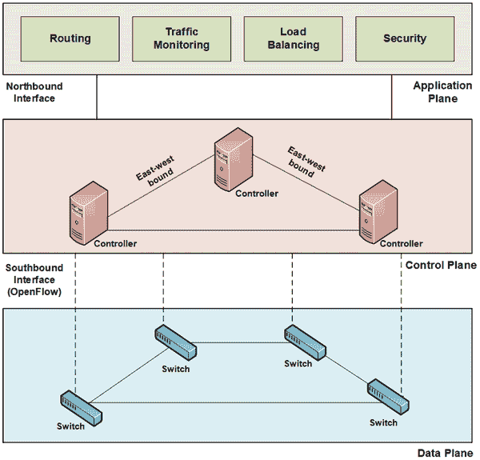
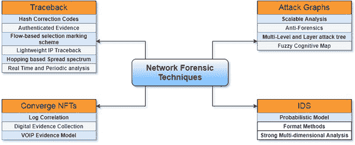
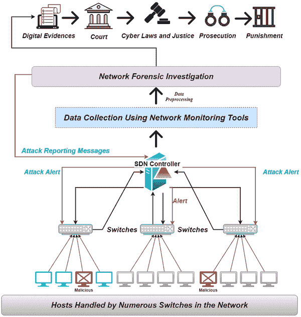
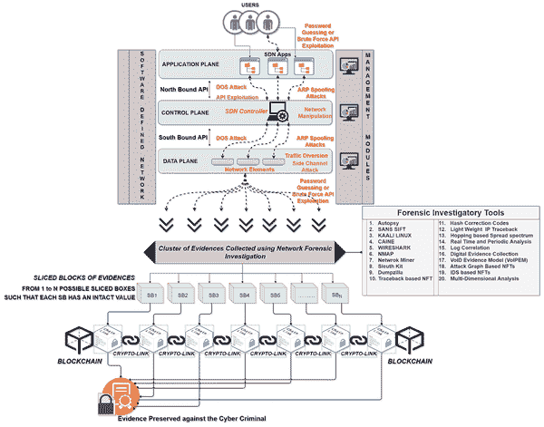
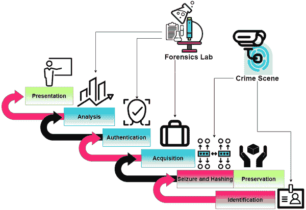

# 第四章

# 基于区块链的 SDN 反向调查框架

+   Sonam Bhardwaj

    印度库鲁克谢特拉国立技术学院

+   Rochak Swami

    印度库鲁克谢特拉国立技术学院

+   Mayank Dave

    

    印度库鲁克谢特拉国立技术学院

摘要

软件定义网络（SDN）是一种有前途的网络技术，为客户提供了一种新的网络管理方式。SDN 提供了更可编程和灵活的网络服务。SDN 打破了控制平面和数据平面的垂直整合，推动了集中化的网络管理。SDN 的这一独特特性为应对恶意活动提供了安全功能。然而，SDN 的架构设计使其容易受到多种攻击。因此，通过各种法证技术调查犯罪是很重要的。本文讨论了一些可能的法证技术的文献研究。还提出了一个针对攻击场景中 SDN 环境的法证调查框架。所提出的框架包括收集证据并保护它们免受任何损坏。在调查过程中，保护证据和责任链至关重要，以避免调查人员被误导。通过区块链技术可以实现安全存储策略以及维护责任链。

介绍

网络已成为我们日常生活中不可或缺的一部分，符合业务需求和个人经验。在网络技术中有两个主要的概念模型，即数据平面和控制平面。这些平面描述了网络流量或数据包的处理方式。数据平面包括不同的网络和转发设备，如路由器、交换机等。网络设备处理数据包的转发。因此，数据平面也被称为具有转发功能的转发平面。数据平面设备用于转发决策制定的控制逻辑放置在控制平面中。在传统网络中，数据平面和控制平面是相互耦合的。这些网络以分布式和静态方式工作。控制逻辑在网络的每个网络设备中实现。当需要在现有机制中添加新机制或策略时，需要在所有网络设备中进行更改。为了克服这些限制，开发了一种新的网络范式，即软件定义网络（SDN）。SDN 是一种独特的网络技术，根据需求为用户提供简化和可编程的网络管理。SDN 因其处理网络服务的灵活和可编程性质而吸引了学术界和工业界的注意。在 SDN 的情况下，控制逻辑与数据平面设备分开（Kreutz 等，2015; Hakiri 等，2014）。这种分离是 SDN 的主要特征。在 SDN 中，数据平面包括 SDN 特定的交换机，控制平面包括控制器。控制器控制转发设备，并提供完整网络的全局视图。控制器是 SDN 中最重要和智能的组件，提供了集中式的网络架构。数据平面设备通过标准协议“OpenFlow”与控制平面通信（McKeown 等，2008; Lara 等，2013）。OpenFlow 于 2008 年问世，由开放网络基金会（ONF）开发（Goransson 等，2013）。可能需要在网络中添加或更新任何现有策略，然后仅在控制平面中进行更改（Kim 等，2013）。与传统网络相比，SDN 使这一过程成本效益更高，耗时更少。SDN 还提供安全功能，例如在网络中全局可见恶意流量，并在检测到攻击时立即更新策略以应对恶意活动。无论何时或使用哪种网络技术，始终存在安全问题的可能性。同样，SDN 由于其集中控制和控制-数据平面分离而吸引了几种攻击，如中间人攻击、嗅探、DDoS、饱和攻击等（Swami 等，2019; Swami 等，2020）。在所有 SDN 组件中，控制平面是最敏感的实体，可能由于其集中式架构而导致单点故障。通过耗尽控制器，可以使整个网络崩溃，从而降低正常用户的网络性能。因此，有必要通过定期分析恶意活动来保护网络免受网络攻击。在 SDN 中调查此类攻击是一项具有挑战性的任务。为此，在网络中使用数字取证的一个分支 - “网络取证”来调查网络流量和所有网络活动。

网络取证在定位攻击源和确定攻击类型方面发挥着至关重要的作用。调查过程涉及系统地收集、获取和归因攻击，调查人员需要将数字证据来源作为首要任务进行识别（Liu 等，2018）。调查纯粹基于证据，需要保护证据以防止任何损坏或篡改。因此，针对 SDN 环境提出了一个用于调查的强大证据保护模型，采用了一种名为“区块链”的知名技术。网络的调查分为几个阶段，并以清晰的方式记录下来。由于所检查的所有数据都需要安全可靠，基于区块链的框架允许将数据以交易形式存储。数据作为证据存储在区块中，并通过密码链接来保持责任链，以维护证据的链条。为了保护受害者设备和被检查设备，SDN 控制器维护了数据收集模块、交换机和主机之间的智能合约，以避免任何系统连接到网络的未经授权的访问。

本章介绍了不同法庭调查技术及其所需工作组成部分的概述。该章节结构如下。第二部分讨论了区块链和 SDN 架构及其工作原理。第三部分介绍了各种法庭调查技术的分类和总结。基于对 SDN 的法庭调查的提出框架在第四部分中介绍。第五部分讨论了此领域的开放研究挑战。最后，第六部分对本章进行了总结。

背景

在本节中，我们讨论了与区块链技术和 SDN 相关的本章中提出的基本概念和架构。我们提供了关于这些技术如何工作以及如何进一步集成的详细信息。

区块链技术

区块链实质上是一种数据管理技术，将一整个已提交事务列表和数字痕迹以一系列区块的形式存储，这些区块由一组实体管理，而不是单个计算机。这些实体在一个点对点（P2P）网络上以密码学方式相互链接，如图 1 所示，每个区块包含三个主要元素，即数据、当前区块的哈希值和前一个区块的哈希值。链的第一个区块被称为“创世区块”，标志着区块链的开始。每个区块都存储与交易金额、发送方和接收方相关的数据。存储的哈希在证明单个区块的身份方面非常有用，起到了指纹的作用。因此，对区块内容的任何修改都会导致哈希值更改，从而更容易识别任何无效交易，并将其从链中丢弃（郑等，2018 年）。

| 图 1. 区块链架构 |
| --- |
|  |

基于交易管理和可用性，有三种基于区块链的类型：公共、私有和联盟（陆，2018 年）。在公共区块链中，几乎不可能篡改数据，因为记录可以由大量参与者验证，交易对公众可见，使区块链在传递数字信息方面非常突出。这些数字信息以比特币的形式在用户之间共享，以电子现金的形式进行验证和安全地进行分散式和点对点的加密货币传输。

承诺的交易由每个参与者批准和验证，从而避免了数据篡改，并确保分类账的一致性。区块链的这一独特特性促使将这一技术与网络安全解决方案相结合，以在不同的网络环境中实现可持续性和稳健性。

软件定义网络

软件定义网络（SDN）是一种为客户提供灵活且易于重新配置的网络技术。SDN 的主要特点是数据平面和控制平面的分离。数据平面包括不同的网络设备，如路由器、交换机等。控制器放置在控制平面上，提供整个网络的全局视图。控制器的这种属性使得 SDN 成为一种集中式的网络架构（Swami 等，2019 年）。借助全局视图和数据和控制平面的分离，任何新策略都可以轻松地应用到现有策略中。这种修改只需在控制平面完成。因此，与传统网络（非 SDN）相比，该过程变得更加节省时间和经济。由于 SDN 的这些优势，它正在迅速取代传统网络。

SDN 架构

SDN 的架构由三个层（平面）组成，即数据平面、控制平面和应用平面。图 2 描述了 SDN 的不同层。对这些层的简要解释如下：

+   • 数据平面：它由多个网络设备组成，例如路由器和交换机。这些不同的设备彼此连接。这些转发设备用于将网络流量从一个主机转发到另一个主机。由于转发功能，数据平面也被称为数据转发平面。SDN 通常在交换机上作为数据转发设备工作。每个 SDN 交换机都有存储网络数据包条目的流表。每个条目都有三个主要组件，即规则、动作和计数器。规则维护着传入数据包的不同头部值，即源 IP 地址、目标 IP 地址、协议、源端口、目标端口、以太网源、以太网目标、优先级等。这些头部值用于与传入新数据包的头部值进行匹配。动作组件决定在什么条件下应采取哪些操作。这些操作包括将数据包转发到控制器、转发到目标主机或丢弃数据包。每个流表都有一个计数器字段，用于跟踪与数据包相关的统计信息。可以确定特定流的多少数据包已被丢弃、转发或发送到控制器。数据平面设备通过标准协议“OpenFlow”与控制器通信。当数据包到达交换机时，在流表中找不到匹配条目，则转发到控制器以采取适当的操作。

+   控制平面：控制平面包括一个或多个控制器。控制器控制和管理所有转发设备（SDN 交换机）以及网络的完整工作。这就是为什么控制器被认为是“SDN 的大脑”的原因。当由于未匹配的条目而将数据包发送到控制器时，它决定应采取什么动作。此外，控制器向交换机发送流修改规则以更新其流表。控制器提供了对整个网络的全局视图。有一些中央控制器的例子，例如 Ryu，POX 等。OpenDaylight，Floodlight，ONOS 是支持多控制器场景的分布式控制器类型。在多控制器控制平面的情况下，控制器通过东西向绑定接口连接。如果单个控制器无法处理大量交换机，则使用多控制器环境。一个个体控制器控制一组交换机。

+   应用平面：应用层包括不同的应用程序，如路由、安全、负载平衡、流量监控等。这些应用程序位于控制平面之上。这些应用程序制定转发决策的逻辑。在控制器中，控制逻辑是在控制器中使用应用程序实现的，转发设备使用该逻辑进行转发决策。应用层通过诸如 REST 之类的北向接口与控制平面通信。

控制器和交换机之间的数据包转发

在 SDN 中，当数据包到达交换机时，它会检查其流表以检查安装的规则。然后，如果传入数据包的头字段与流表中的规则匹配，则将数据包转发到目标主机。如果不匹配流规则，则将带有数据包所需头字段的 packet_in 消息传输到控制器。控制器为数据包决定适当的操作，定义一个新规则，并将流修改规则“FlowMod”发送到所有交换机。所有交换机都会更新其各自的流表中的流修改规则。

在发生攻击或任何恶意活动的情况下，SDN 中数据包转发的正常处理被打断，整个网络崩溃。正常用户会受到此类恶意活动的影响，网络性能下降。

| 图 2. SDN 体系结构 |
| --- |
|  |

SDN 体系结构中的易受攻击目标点

SDN 体系结构中存在各种易受攻击的点（Swami 等，2019 年）。控制器是攻击者最敏感的目标。简要讨论了 SDN 体系结构的主要潜在目标。

+   • SDN 交换机：SDN 交换机具有流表来存储传入网络数据包的轨迹。这些流表具有有限的内存大小，因此对于安全目的而言是一个问题。

+   • SDN 交换机之间的链接：交换机将网络数据包转发到其他交换机，以将其传递到目标主机。转发的数据包携带的重要信息可能会被攻击者拦截。

+   • SDN 控制器：SDN 控制器是管理整个网络的集中实体。它可能会受到单点故障的影响。

+   • 控制器与交换机之间的链接：控制器与交换机之间的链接用于根据需要发送关键消息，如数据包和流修改规则。当控制器向交换机发送流规则时，它们可能会受到干扰，可能会添加恶意规则。

+   • 控制器之间的链接：控制器之间共享敏感信息。攻击者可以针对控制器获取知识和信息来源。在多控制器环境中，控制器的级联故障可能已经发生。

+   • 应用程序：根据需求，通过北向接口在控制器中实现各种应用程序。攻击者可以获取对应用程序的访问权限，并可能添加恶意活动。

网络取证调查技术分类

调查人员必须按照系统化和及时的调查程序对犯罪进行调查，以免收集的证据失去其可信度。为处理证据，遵循了各种保存方法（Brotis 等人，2019 年），使证据得到了安全保障。调查团队不仅应该制定保护证据的战略计划，还应采用标准的网络取证技术进行进一步调查。任何技术的采用都必须满足在法庭上合法和可接受的要求。一些技术及其相应的取证方法如图 3 所示。这些技术都有自己的框架和方法论（Khan 等人，2016 年），旨在实现特定目标，如确定攻击、监视日志或维护证据的完整性。以下讨论了一些现有技术：

+   • 基于溯源的网络流量追踪技术：当调查人员需要确定网络数据包的来源时，会使用溯源技术。确定来源表示攻击的来源地。溯源是一种有用的技术，用于对抗 DDoS 攻击和 IP 欺骗攻击（Dou 等人，2012）以及其他不同的分布式网络。与互联网合作的分布式网络也吸引了不同攻击的僵尸网络主控（Mizoguchi 等人，2011）。为了增强网络系统的安全性并克服此类攻击，溯源机制必须有效地整合到系统中。下面讨论了溯源机制中使用的一些取证方法：

    +   o 哈希校正码：在这种方法中，IP 地址片段用于通过在受害节点上执行哈希编码来追溯攻击（事件）的源/来源。这种方法对于在拓扑辅助确定性数据包标记（TDPM）方案中追溯 DoS 和 DDoS 攻击非常有效（Wang 和 Wang，2010）。路由器在数据包中使用哈希值，然后在受害节点进行比较。受害节点有责任使用 BFS（广度优先搜索）识别入口路由器（生成恶意数据包）。随后，来自其他路由器的接收的哈希片段与入口路由器的哈希片段进行比较以调查恶意数据包。

    +   o 认证证据：该方法还使用数据包标记方案用于溯源，如 TDPM，为收集的证据提供完整性。收集证据的认证由负责管理收集数据并解除边缘路由器（为每个记录维护时间标签）流量管理负担的值得信赖的运营商提供，从而改善整体网络性能（Ma 等人，2020）。

    +   流基选择标记方案：这种方法由网络取证证据获取（NFEA）采用，遵循一种数据包标记方案（Kim 和 Kim，2011）。它通过适当的跟踪范围追溯入侵者的来源。通过查看数据包头部和路由器信息来改善有效跟踪范围。当攻击者隐藏其 MAC 地址时，该方法的关键之处在于找到其来源。

    +   轻量级 IP 追溯（LWIP）：该方案利用 IP 头部的生存时间（TTL）字段来调查网络中的大规模 DDoS 攻击，通过查找和重建攻击路径。该方法使用树分析算法和路由过滤算法来追溯攻击，同时通过包从一个路由器移动到另一个路由器向受害节点递减 TTL 值（Saurabh 和 Sairam，2016）。

    +   基于跳频扩频技术（HBSST）：该技术基于频率跳跃直接扩频、码跳跃直接序列扩频和时间跳跃直接序列扩频（Gomes 等人，2018）。在 HBSST 中，会将一个秘密伪随机码与正常流量一起发送，这个码对入侵者隐藏，但可以被调查人员用来监控其恶意活动。

| 图 3. 网络取证调查技术及其方法 |
| --- |
|  |

+   实时和周期性分析：IP 追溯协议采用这种方法来确定入侵者的来源，对通过路由器的流量进行实时和周期性分析（Tian 等人，2018）。实时分析用于路由器哈希表，而周期性分析则用于存储在数据库中的压缩哈希表，以进一步调查流量。

    +   • 收敛 NFTs：这表明在收敛网络中识别数字证据，特别是在 VoIP 通信中（Khan 等人，2014 年），其中信号被划分为帧，最终嵌入到数据包中作为语音代码。稍后，这些数据包像普通语音包一样通过 IP 网络发送。传输的语音包被入侵者利用并改变为恶意数据包，原因是语音包中的未加密字段。入侵者可能进行的攻击包括洪水攻击、缓冲区溢出、劫持呼叫、降低呼叫完整性、中间人攻击和隐私泄露。因此，为了应对此类攻击，可以考虑各种取证方法：

+   o 日志相关性：基于模式的网络取证（PBNF）的关键方法，用于发现和阻止攻击，确定入侵者的痕迹，并帮助收集针对入侵者的证据。在该方法的成功中发挥关键作用的两个模块是 VoIP 证据收集器和 VoIP 证据分析器。前者根据应用于语音流量的过滤规则集在实时环境中收集攻击数据包。后者从取证服务器收集数据，并基于日志相关性和归一化进行分析。

+   o 数字证据收集：此方法的有用性在于识别网络流量中的恶意数据包。恶意数据包也被归类为针对其进行数字证据收集的异常流量（Len 等人，2012 年）。对任何字段的任何更改都视为恶意。因此，此方法在 VoIP 网络取证分析中具有应用，其中数据包字段比数据包日志重要。

+   o VoIP 证据模型（VoIPEM）：这种技术的策略是根据收集的信息假设调查 VoIP 通信中的恶意软件攻击（Ibrahim 等，2012）。这种方法在重建攻击方面有优势（其中信息不足会妨碍调查），使用安全的时间逻辑行动。这种方法帮助调查人员发现系统未捕获的未知攻击。对攻击场景的重建是为了识别攻击的时间、位置和过程。

    +   • 基于攻击图的 NFT：攻击图方法用于跟踪和可视化入侵者在网络中执行攻击的所有可能路径。通过分析网络、主机和其他安全设备，可以确定所有可能的路径。攻击图（Ou 等，2006）由表示攻击节点的顶点和表示这些顶点（节点）之间状态转换的边组成。这种可视化用于网络取证调查，以确定最糟糕的攻击路径，并帮助网络管理员在攻击发生之前改进防御系统。

+   o 可扩展分析（SA）：SA 确定一类警报，以衡量大型网络流量环境中恶意活动对当前和未来攻击的影响。SA 提供了一个实时情况的框架，用于处理大量原始数据（Albanese 等，2011）。首先生成攻击图来确定网络组件及其之间的关系。确定了组件后，攻击图会在一段时间内分布，以捕获入侵者的概率时间行为。概率行为有助于构建攻击场景，以收集攻击利用的服务和漏洞，以便将依赖关系集成到图中。

+   o 反取证：在入侵者可能使用各种反取证技术删除或更改痕迹的情况下，采用此方法进行取证调查。因此，用于取证检查的攻击图（AGFE）使用带有攻击图的反取证节点来监视恶意活动，并将其存储在反取证数据库中。存储的信息帮助调查人员监视恶意活动并识别注入的痕迹中的任何更改（Chandran 和 Yan，2014）。

+   o 多级和分层攻击树（MLL-AT）：MLL-AT 确定多阶段网络攻击中的系统风险。通过使用多属性效用理论计算系统风险，并在攻击树中为节点分配一些权重来进行计算。计算系统风险后，生成攻击顺序，并从攻击树中删除不需要的节点（Soleimani 和 Ghorbani，2012）。

+   o 模糊认知图（FCM）：FCM 是由使用遗传算法识别攻击路径的攻击图构建而成（Luo 等人，2019）。它仅识别最糟糕的攻击路径，而不是找到所有攻击路径。它通过为概念边缘（FCM 解中的边缘）分配权重来执行最糟糕路径的识别，这些权重基于概念节点（FCM 解中的节点）。这些概念节点和边缘存储在基于此的相邻矩阵中，遗传算法从攻击行为集合中确定最糟糕的攻击。

    +   • 基于 IDS 的入侵检测系统（NFT）：IDS 监视网络，以检测入侵者试图利用网络并触发警报消息以通知管理系统的任何恶意活动。IDS 有助于调查网络中的任何违规行为，并将其报告给管理员以相应地采取行动。

+   o 概率模型：此方法用于分析性入侵检测框架（AIDF）中，用于整合 IDS 传感器的警报信息和入侵检测的取证分析（Kamthe 和 Deisenroth，2018）。采用概率方法的隐藏信息解除了建模和检测入侵者攻击。Snort（Shah 和 Issac，2018）被用作概率推理，以触发规则，如果网络流量与签名规则中编码的模式匹配，则会触发规则。这些规则有助于检测和理解攻击，以便调查人员可以采取必要措施来防止将来的攻击。

+   o 形式方法：这些取证方法用于入侵容忍系统中，用于分析和建模动态取证系统（Belta 等，2017）。入侵容忍系统基本上意味着系统必须能够承受攻击者进行的攻击所导致的故障状态。采用有限状态机构建动态取证系统的稳态概率用于评估这些系统的安全属性。

+   o 强多维分析：这种分析方法用于基于入侵检测静态和动态分析构建网络取证框架。此方法用于通过匹配基于库迹的模式并进行协议分析，对离线捕获数据进行行为分析，以检测恶意行为（Dernbecher 和 Beck，2017）。

表 1. 不同网络环境中网络取证技术的总结

| 技术 | 方法 | 网络环境 | 数据完整性 | 认证 | 机密性 | 承担责任链 | 证据保护 |
| --- | --- | --- | --- | --- | --- | --- | --- |
| 基于追踪的 NFT | 散列修正码 | 分布式网络 | 是 | 是 | 否 | 否 | 是 |
| 验证证据： | 分布式网络 | 是 | 是 | 否 | 否 | 是 |
| 基于流量选择标记方案 | 数据中心网络 | 是 | 否 | 否 | 是 | 否 |
| 轻量级 IP 反向跟踪（LWIP） | 无线传感器网络 | 否 | 否 | 否 | 是 | 否 |
| 基于跳频扩频技术（HBSST） | 无线局域网 | 否 | 否 | 是 | 否 | 否 |
| 实时和周期性分析 | 无线网格网络 | 否 | 否 | 否 | 是 | 否 |
| 收敛 NFT | 日志相关性 | VOIP 网络 | 否 | 否 | 否 | 是 | 是 |
| 数字证据收集 | VoIP 网络 | 是 | 否 | 否 | 是 | 是 |
| VoIP 证据模型（VoIPEM） | VoIP | 是 | 否 | 否 | 是 | 是 |
| 基于攻击图的 NFT | 可扩展分析（SA） | 实时网络 | 是 | 否 | 否 | 是 | 否 |
| 反取证技术 | 蜜罐网络 | 是 | 否 | 是 | 是 | 是 |
| 多级和层攻击树（MLL-AT） | 多阶段网络 | 否 | 否 | 否 | 是 | 否 |
| 模糊认知图（FCM）： | 模糊认知网络 | 是 | 否 | 否 | 是 | 否 |
| 基于 IDS 的 NFT 入侵检测系统 | 概率模型 | 社交网络 | 否 | 是 | 是 | 否 | 否 |
| 形式化方法 | 无线传感器网络 | 是 | 否 | 否 | 是 | 是 |
| 强多维分析 | 实时网络 | 否 | 是 | 是 | 否 | 是 |

表 1 总结了不同网络环境下的网络取证技术，但不限于此。这些技术在性能方面表现出色，但在 CIA（保密性、完整性和可用性）三重属性以及证据链和证据保护方面存在缺失。因此，它迫切需要一个 SDN 环境下的调查框架，通过整合上述安全特性为证据提供强有力的保护。

基于 SDN 的取证调查框架

可重构的 SDN 建立在数据平面设备和 SDN 控制器之上。数据平面包含处理从一个主机到另一个主机的数据转发任务的交换机。众多主机通过交换机连接到网络，后者根据流规则将数据包转发到控制器。交换机的流表中的规则无法识别连接主机中的恶意未知节点。因此，随着数据流向 SDN 控制器，恶意流量也进入网络，并试图利用网络的漏洞。对网络的未经授权访问可能损害安全原则（数据完整性、机密性和可用性），并以攻击的形式执行恶意活动。单独的 SDN 无法识别这些可疑活动。因此，在图 4 中提出的框架中需要一个网络调查模块来识别攻击并向 SDN 控制器报告以改进其防御机制。控制器收集的数据通过网络监控工具传递到数据收集模块，如图 5 所示。在数据收集模块中，应用区块链机制来保留数据并将其存储为区块的形式。区块链技术的加密保护系统可以保护数据，并帮助维护责任链。所提出的框架结合了基于智能合约的监督和数据访问控制，使用区块链技术提供安全和可信任的数据共享环境。该框架对数据进行了三步保留，首先在数据收集模块中使用区块链进行原始数据的存储和保持其完整性。其次，在调查事件时，通过对扣押数据创建哈希值进行保留，最后，在网络调查模块获取证据时，以确认数据的准确性和可验证性。

| 图 4. SDN 网络中的法证调查 |
| --- |
|  |

在数据收集过程中，对数据进行预处理或过滤以消除歧义，并集成来自不同交换机的数据。对网络调查模块接收的数字数据进行了详细的法医调查，这些数字证据经历了从事件识别到将事件报告为攻击的多个彻底的调查阶段。一旦确认了攻击，攻击报告消息以攻击的支持细节发送到 SDN 控制器。控制器向网络中的数据平面发出警报，并提出针对攻击的防御措施。网络调查模块生成的报告得到了法律的支持，将在司法机构面前对网络犯罪分子进行呈现。框架的所有机制都得到了区块链技术的支持。它不仅为框架提供安全性，还提供了基于去中心化的交易系统，以可管理的形式存储证据，并提供了高度保护数据的保护。整个框架最终由法律和法律伦理支持，最终呈现在司法机构面前进行刑事起诉。

提议框架的组成部分

+   • 数据收集模块（DCM）：数据收集的基本原则是收集数据，规划数据选择、收集和分析的统一流程。提议框架中的收集模块基于去中心化的区块链技术，使用智能合约在 DCM 和交换机之间确保收集的任何数据都是有效的、可靠的和可信的。在进行调查时考虑伦理问题同样重要。

数据是使用各种网络监控和收集工具收集的，这些工具有助于将数据与元数据一起提供给数据采集模块（DCM）。一旦数据进入 DCM，数据就会以不同区块的形式分发，就像以不同区块的形式切片的证据一样。为了确保完整性，包含证据的区块通过加密链接连接起来。证据的区块是使用 SHA-256 加密技术保存的。将证据以交易形式存储的想法是为了保持证据链和通过加密链接连接起来的收集到的证据之间的连通性。

| 图 5. 基于区块链的数据采集模块 |
| --- |
|  |

SDN 控制器在数据平面和数据采集模块之间维护智能合约，有助于维护收集到的证据的可信度。这些智能合约对于确保在调查过程中没有设备具有任何未经授权的访问以可能破坏来自数据平面的证据特别是在实时取证的情况下至关重要。这些智能合约也适用于受损主机，并成为调查期间的主要证据来源。在进行调查时，任何活动都应受到限制。维护这些智能合约积极并在各个组件之间同步是 SDN 控制器的责任。DCM 识别的有用于调查的信息如表 1 所列。在任何网络犯罪事件中，每一份流动的数据都至关重要。因此，数据需要保持安全，并在确认攻击后，控制器会发出警报。结果，防御团队根据从控制器收到的信息采取行动。

表 2. SDN 调查中数据采集模块收集的信息列表

| 系统时间 | 网络连接 | 控制器内存 | 元数据 |
| --- | --- | --- | --- |
| 登录用户 | 打开的流规则 | 剪贴板内容 | 服务信息 |
| 控制器类型 | 进程信息 | 驱动程序信息 | 命令历史记录 |
| 使用的协议 | 交换机类型 | 映射的驱动器 | 共享资源 |
| 网络信息 | 进程到端口映射 | 打开的文件 | 交换机类型 |
| 进程内存 | 网络状态 | 控制器日志 | 内存转储 |

所提出框架中的 DCM 允许对信息进行受控访问，并为收集到的原始证据提供更好的安全性。智能合约之间的同步确保网络的正常和可信赖的运行，从而降低了安全风险。

+   • 网络取证调查：在 SDN 网络中进行的调查基于修改后的网络取证通用模型（Pilli 等人，2010 年），包含图 6 所示的六个阶段。所提出的工作修改了此模型以适用于 SDN 网络，并将调查任务交给了控制器。数据收集模块将收集到的数据传输到网络调查模块，后者根据定义的阶段对数据进行处理。

    +   o 识别：工具监控的网络事件被确定为事件（攻击），并基于攻击确认确定可以收集证据的所有源。确定证据的识别是调查的第一个任务。在 SDN 网络中，证据的主要来源是数据平面，其中包含所有网络设备和关联数据，并在这些设备上存储所有数据和流规则。由于设备的内存有限，易失性数据立即传输到控制平面进行进一步调查。

    +   o 查封、散列和保存：一旦发现攻击，就会根据查封原则立即查封设备和数据。这些原则指导着调查，以安全地创建数据镜像，这些镜像不能被写入或篡改。数据是基于网络中可疑活动和收集可疑数据进行查封的。调查人员还必须注意处于“ON”状态的运行进程、共享和映射设备、注册表和事件日志。收集的数据需要立即保存，以防止证据被篡改。数据的保护基本上是通过应用散列来完成的，这是一种不可逆转的过程，它将数据块转换为固定大小的字符串（MD5、SHA-1、SHA-256 或 HMAC），并存储与数据对应的散列值。在此阶段结束时，将生成一个查封报告，其中包含有关系统配置、散列值、传输和存储介质的各种详细信息。

| 图 6. 具有两步证据保存的法证调查模块 |
| --- |
|  |

+   o 获取：这是调查中最重要的阶段，它将收集到的原始数字证据转换为位流图像，并写入可信的块中，需要安全存储（写入封锁器）。由于要维护证据的可信度和完整性，无法直接处理查封的证据。收集到的证据的图像必须在具有比源设备更大存储容量的设备中进行，以便保存数据镜像进行检查。获取报告包括原始证据的散列和取图像的哈希块的哈希。将原始证据的散列与查封报告中的散列进行验证。如果匹配是真实的匹配，则认为报告是可信的，并有助于进一步的调查。

+   o 鉴定：一旦报告了事件并收集到证据，保护证据的真实性就成为首要任务。必须对证据进行鉴定，以确认真实性。证据需要遵循简单的规则来证明其真实性，即：

    +   ▪ 可采用性：收集的证据可以在法庭或其他地方用于证明事件或网络犯罪的发生。

    +   ▪ 真实性：碎片（证据）不能偏离事件的本质，必须以相关方式与事件相关联。

    +   ▪ 完整性：不应该存在对替代嫌疑人的隧道视野或无罪证据。

    +   ▪ 可靠性：收集证据以证明对嫌疑人的指控。因此，对于真实性和准确性不应该有任何疑问。

    +   ▪ 可信度：调查员有责任收集清晰易懂、陪审团可以相信的证据。

因此，在调查过程中，如果证据遵循上述规则并验证了先前获取的哈希值，则认可证据的真实性。在检查时，计算实际数据的哈希值，并将其与先前获取的哈希值进行验证。如果哈希值完全匹配，则由检查机构确认真实性。

+   o 分析：调查员分析经过验证的数据，发现相关信息并找出攻击模式。路由器信息、应用的流规则、元数据以及南向流量的 PCAP 文件作为分析的基本数据。这一关键阶段的目的是识别攻击行为、利用了哪些漏洞、解锁攻击模式、报告任何未知攻击，并发布分析报告以改进防御机制。分析数据的完整性由区块链机制保证，并通过整个过程维护。

+   o 展示：调查的每个阶段都要详细记录，以准备依法在法庭上提交的调查报告。证据的呈现必须是可识别的，并清楚地描述与事件相关的事实。在网络攻击的情况下，证据以攻击图的形式呈现，这些图是根据攻击图生成的。每个证据都被赋予攻击的概率分数，并根据该分数确定所有可能的路径。这些图帮助可视化攻击并预测攻击者的行为，以避免未来的攻击。

开放式研究挑战

本节讨论了在 SDN 中使用区块链技术有效保护证据所面临的挑战，以进行取证调查。

+   • 数据量管理：在网络中，流经网络的流量数量庞大，每个流量单位从调查角度都是至关重要的。网络流量还可能包含需要足够存储空间的多媒体文件或日志文件。数据平面设备的内存有限。因此，重要的易失性数据可能由于内存有限而短暂存在（Azmoodeh 等人，2019 年）。因此，必须提供必要的存储服务，将数据的哈希存储在区块中，其余数据存储在写阻塞器磁盘中。

+   • 数据提取位置：从网络中适当位置提取信息是网络取证中的一个挑战。在庞大的网络中，重建和调查每个攻击路径对调查人员来说变得困难。确定正确的设备、正确的位置和正确的时间收集相关信息对调查至关重要。为了克服这个问题，可以通过将相似的日志分组到相同的块中并为这些块提供集中访问来维护日志存储库，以便进行集中分析。

+   • 访问 IP 地址：识别数据包源的身份对于确定网络中的入侵者至关重要。入侵者的 IP 地址通常通过各种技术（IP 欺骗）隐藏起来。这些技术通常被采用来通过向控制器发送大量超出其处理能力的数据包来进行 SDN 中的 DDoS 攻击，从而使系统崩溃。因此，可以采用源地址验证，将相同上行链路的地址存储在同一块中。这有助于减少 IP 欺骗攻击，并将源 IP 和 MAC 地址绑定在同一块中。

+   • 事件时间线和编年史：为了维护责任链，必须尊重事件的时间线。数据采集和事件顺序是确定模式和分组类似事件的关键，以便将来避免此类事件的发生。SDN 中的高数据率使得及时记录事件和在有限存储空间中存储日志成为挑战。区块链时间戳和哈希值确保证据是在特定时刻收集的，并且没有被修改。

+   • 可理解的法医报告：在 SDN 中使用区块链提供了诸如可验证和数据流的提供等好处。知识检索和创建报告属于不同阶段。在这种情况下，即使报告和结果是自动化的，它们也必须在法庭上易于理解。因此，即使区块链有助于完成这项任务，也必须进行研究以提供法医程序、SDN 流规则及其解释之间的联系。

+   • 智能法医工具：传统的法医工具通过捕获完整数据包来监视和记录流量，这在存储和处理数据包时常常面临时间延迟问题。因此，需要智能工具根据调查情况在新兴的 SDN 基础设施中捕获流量。这将通过快速事件响应机制解决存储、资源和时间延迟问题。区块链哈希事务可以以规则的形式应用于流量，并生成自动化报告，从而为智能系统提供安全性（Krivchenkov 等，2018）。

结论

SDN 为用户提供了比传统网络更灵活和可编程的网络服务。中央集权的全局视图和能够在检测到恶意行为后立即部署安全策略的可编程性使 SDN 在网络领域备受关注。然而，其设计特性也吸引了各种攻击，可能会破坏整个网络的工作。因此，为了保护集中式 SDN，法医调查在分析网络活动和识别恶意活动的来源方面起着重要作用。因此，在本文中讨论了各种法医调查技术。此外，还提出了一个针对 SDN 的法医调查框架，该框架收集数据，进行调查，并在网络中发出警报以激活防御系统。

该工作讨论了框架的不同模块及其详细功能。该框架通过使用区块链安全地保留了收集的数据，从而避免了对收集的证据进行任何篡改。调查过程强制执行司法法律，以呈现法庭可接受的方式呈现证据，并使证据具有可信性，区块链允许数据安全存储，维护完整性和保管链。

在未来的工作中，重点将放在开发基于区块链的 SDN 自动取证框架上，该框架使控制器代理能够收集异构数字证据。控制器代理还将集成调查工具，进行调查并加密报告以在网络上传输。

参考文献

AlbaneseM.JajodiaS.PuglieseA.SubrahmanianV. S. (2011). 攻击场景的可扩展分析。在欧洲计算机安全研究论文集(pp. 416-433)。 Springer.

Azmoodeh, A., Dehghantanha, A., & Choo, K. K. R. (2019). 大数据和物联网安全与取证：挑战与机遇。在大数据和物联网安全手册(pp. 1–4)。 Springer。doi:10.1007/978-3-030-10543-3_1

Belta, C., Yordanov, B., & Gol, E. A. (2017). 离散时间动态系统的形式化方法 (Vol. 89)。 Springer。doi:10.1007/978-3-319-50763-7

BrotsisS.KolokotronisN.LimniotisK.ShiaelesS.KavallierosD.BelliniE.PavuéC. (2019, 六月)。 物联网环境中的区块链解决方案用于法庭证据保全。在 2019 年 IEEE 网络软件化会议 (NetSoft) (pp. 110-114)。 IEEE。10.1109/NETSOFT.2019.8806675

Chandran, R., & Yan, W. Q. (2014). 网络反取证的攻击图分析。数字犯罪和取证国际期刊, 6(1), 28–50。doi:10.4018/ijdcf.2014010103

Dernbecher, S., & Beck, R. (2017). 信息系统研究中正念概念的多维分析. 《欧洲信息系统杂志》, 26(2), 121–142\. doi:10.1057/s41303-016-0032-z

Dou, W., Chen, Q., & Chen, J. (2013). 云环境中用于 DDoS 攻击防御的基于置信度的过滤方法. 《未来一代计算机系统杂志》, 29(7), 1838–1850\. doi:10.1016/j.future.2012.12.011

Gomes, P. H., Watteyne, T., & Krishnamachari, B. (2018). MABO‐TSCH：基于多跳和黑名单的优化时序信道跳频. 《新兴电信技术交易杂志》, 29(7), e3223\. doi:10.1002/ett.3223

Goransson, P., Black, C., & Culver, T. (2016). 软件定义网络：一种全面的方法. Morgan Kaufmann.

Hakiri, A., Gokhale, A., Berthou, P., Schmidt, D. C., & Gayraud, T. (2014). 软件定义网络：未来互联网的挑战与研究机会. 《计算机网络杂志》, 75, 453–471\. doi:10.1016/j.comnet.2014.10.015

Kamthe, S., & Deisenroth, M. (2018). 概率模型预测控制的数据高效强化学习. 在国际人工智能与统计学会议上(pp. 1701-1710). Academic Press.

Khan, S., Gani, A., Wahab, A. W. A., Shiraz, M., & Ahmad, I. (2016). 网络取证：综述、分类及挑战. 《网络与计算机应用杂志》, 66, 214–235\. doi:10.1016/j.jnca.2016.03.005

Khan, S., Shiraz, M., Abdul Wahab, A. W., Gani, A., Han, Q., & Bin Abdul Rahman, Z. (2014). 移动云计算网络取证框架的适应性综述. 《科学世界杂志》, 2014, 2014\. doi:10.1155/2014/547062

Kim, H., & Feamster, N. (2013). 用软件定义网络改进网络管理. 《IEEE 通信杂志》, 51(2), 114–119\. doi:10.1109/MCOM.2013.6461195

KimH. S.KimH. K. (2011 年 5 月)。具有分组标记的网络取证证据采集（NFEA）。在 2011 年 IEEE 第九届国际并行与分布式处理应用研讨会论文集中（第 388-393 页）。IEEE。10.1109/ISPAW.2011.27

Kreutz, D., Ramos, F. M., Verissimo, P., Rothenberg, C. E., Azodolmolky, S., & Uhlig, S. (2015)。软件定义网络：一项全面的调查。IEEE 论文集, 103(1), 14–76。doi:10.1109/JPROC.2014.2371999

KrivchenkovA.MisnevsB.PavlyukD. (2018 年 10 月)。数字取证中的智能方法：现状。在国际可靠性与运输通信统计会议论文集中（第 274-284 页）。斯普林格出版社。

Lara, A., Kolasani, A., & Ramamurthy, B. (2013)。利用 OpenFlow 进行网络创新：一项调查。IEEE 通信调查与教程, 16(1), 493–512。doi:10.1109/SURV.2013.081313.00105

刘 C. H., 林 Q., & 温 S. (2018)。区块链启用的工业物联网数据收集与共享与深度强化学习。IEEE 工业信息学交易, 15(6), 3516–3526。doi:10.1109/TII.2018.2890203

陆 Y. (2018)。区块链：功能、应用和未解决问题的调查。工业整合与管理杂志, 3(04), 1850015。doi:10.1142/S242486221850015X

罗 C., 张 N., & 王 X. (2019)。基于直觉模糊认知图的时间序列预测。软计算, 1–16。doi:10.1007/s00500-019-04321-8

马 J., 黄 X., 穆 Y., & 邓 R. H. (2020)。带责任和透明度的经过身份验证的数据编辑。IEEE 可靠和安全计算交易, 1。doi:10.1109/TDSC.2020.2998135

McKeown, N., Anderson, T., Balakrishnan, H., Parulkar, G., Peterson, L., Rexford, J., Shenker, S., & Turner, J. (2008)。OpenFlow：在校园网络中促进创新。计算机通信评论, 38(2), 69–74。doi:10.1145/1355734.1355746

MizoguchiS.TakemoriK.MiyakeY.HoriY.SakuraiK. (2011, 六月). 通过共享网络通信模式信息抵御僵尸网络控制者的溯源框架。 在 2011 年第五届创新移动和普适计算国际会议 (pp. 639-644). IEEE. 10.1109/IMIS.2011.152

OuX.BoyerW. F.McQueenM. A. (2006, 十月). 一种可扩展的攻击图生成方法。 在第 13 届 ACM 计算机与通信安全会议论文集 (pp. 336-345). 10.1145/1180405.1180446

Pilli, E. S., Joshi, R. C., & Niyogi, R. (2010). 一个网络取证的通用框架。《国际计算机与应用》, 1(11), 1–6\. doi:10.5120/251-408

Saurabh, S., & Sairam, A. S. (2016). 提高 IP 溯源对 DDoS 攻击的准确性和可靠性。《网络安全国际期刊》, 18(2), 224–234.

Shah, S. A. R., & Issac, B. (2018). 入侵检测系统的性能比较及对 Snort 系统的机器学习应用。《未来一代计算机系统》, 80, 157–170\. doi:10.1016/j.future.2017.10.016

Soleimani, M., & Ghorbani, A. A. (2012). 多层次事件过滤以进行多步攻击检测。《计算机通信》, 35(11), 1368–1379\. doi:10.1016/j.comcom.2012.04.001

Swami, R., Dave, M., & Ranga, V. (2019). 基于软件定义网络的 DDoS 防御机制。《ACM 计算调查》, 52(2), 1–36\. doi:10.1145/3301614

Swami, R., Dave, M., & Ranga, V. (2020). 利用机器学习技术的 SDN 的 DDoS 攻击和防御机制。 在《传感器网络和物联网中的安全与隐私问题》(pp. 193–214). IGI Global. doi:10.4018/978-1-7998-0373-7.ch008

Tian, Z., Cui, Y., An, L., Su, S., Yin, X., Yin, L., & Cui, X. (2018). 智能校园的实时主机事件相关性。《IEEE Access：实用创新，开放解决方案》, 6, 35355–35364\. doi:10.1109/ACCESS.2018.2846590

Wang, X. J., & Wang, X. Y. (2010). 拓扑辅助的确定性数据包标记用于 IP 追踪。《中国邮电大学学报》, 17(2), 116–121。doi:10.1016/S1005-8885(09)60456-8

Zheng, Z., Xie, S., Dai, H. N., Chen, X., & Wang, H. (2018). 区块链的挑战与机遇：一项调查。《国际 Web 和网格服务杂志》, 14(4), 352–375。doi:10.1504/IJWGS.2018.095647
