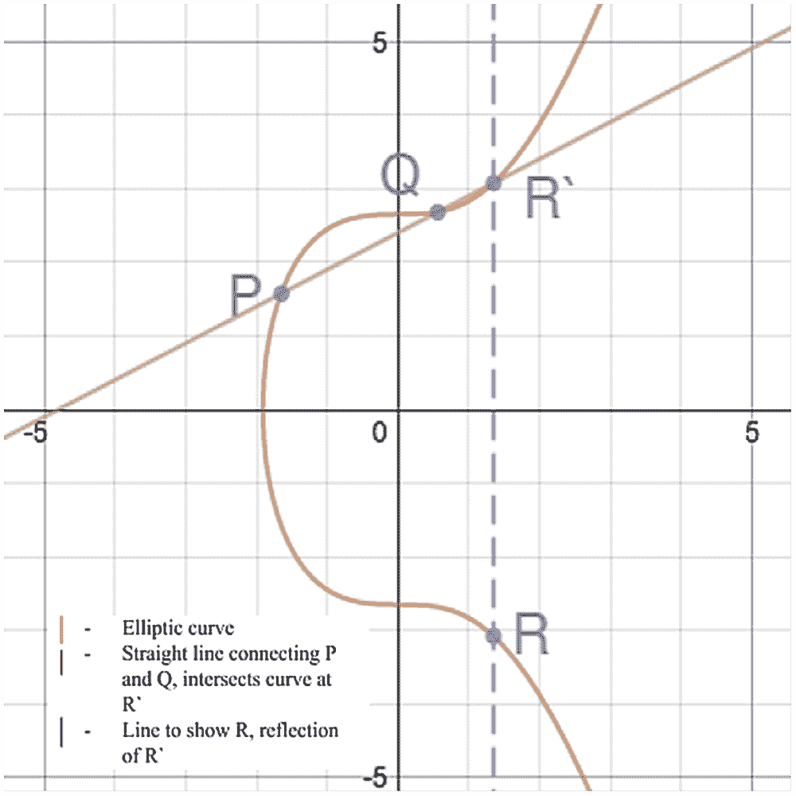
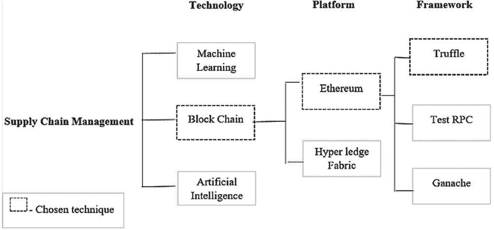
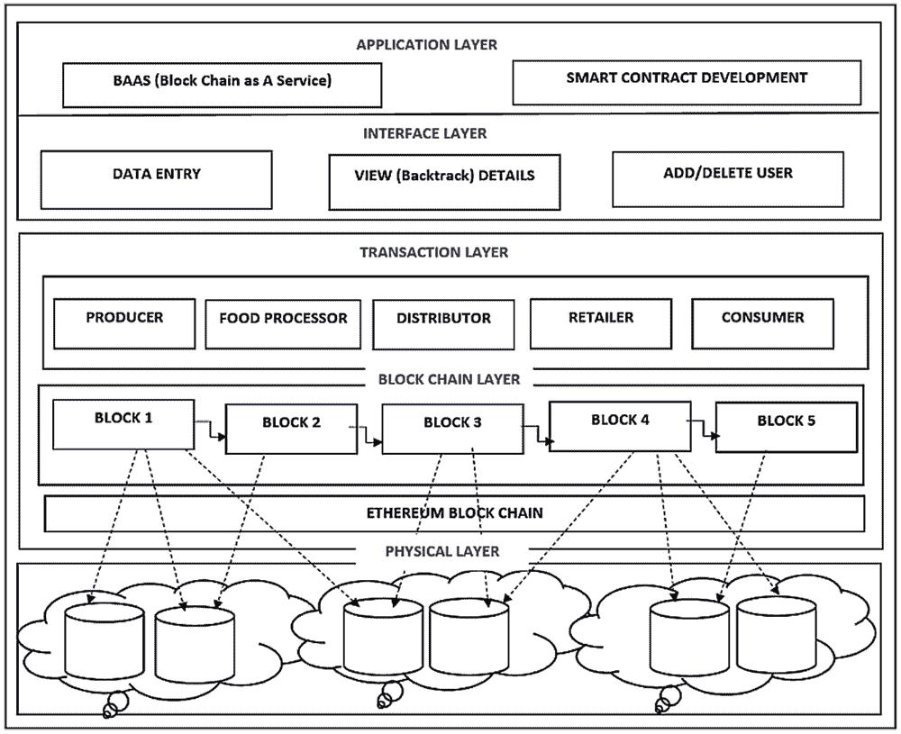
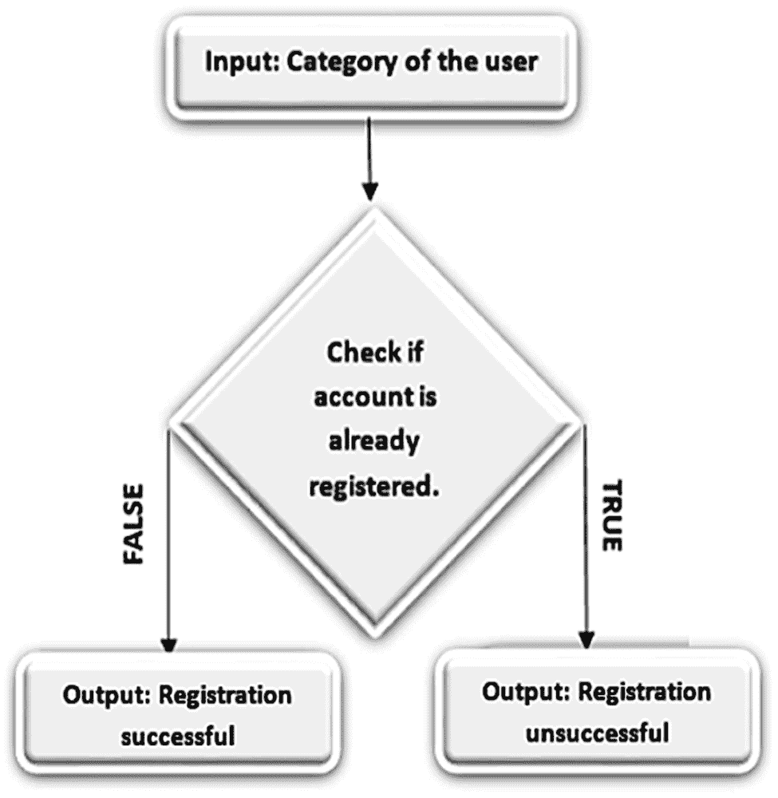
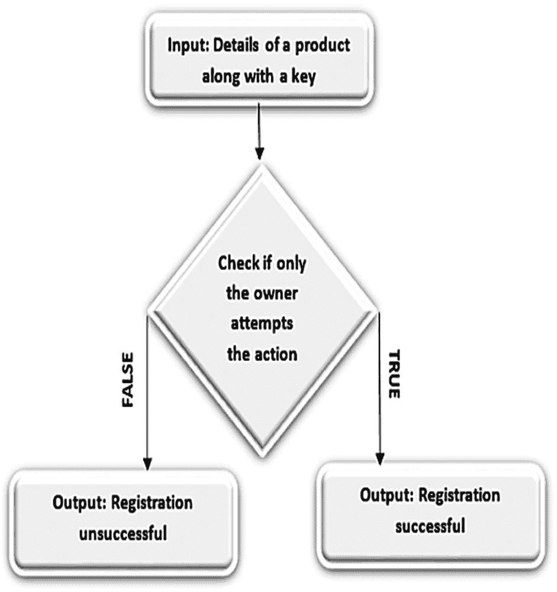
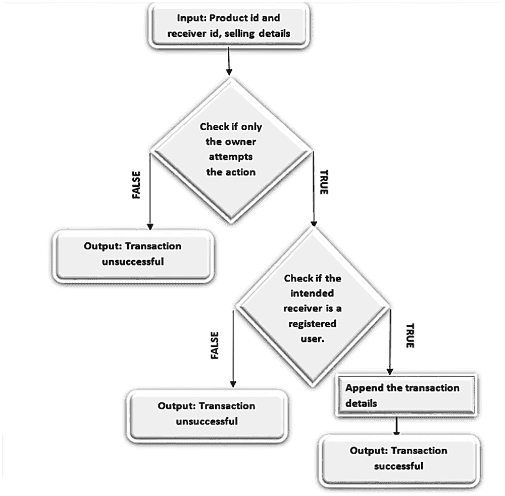
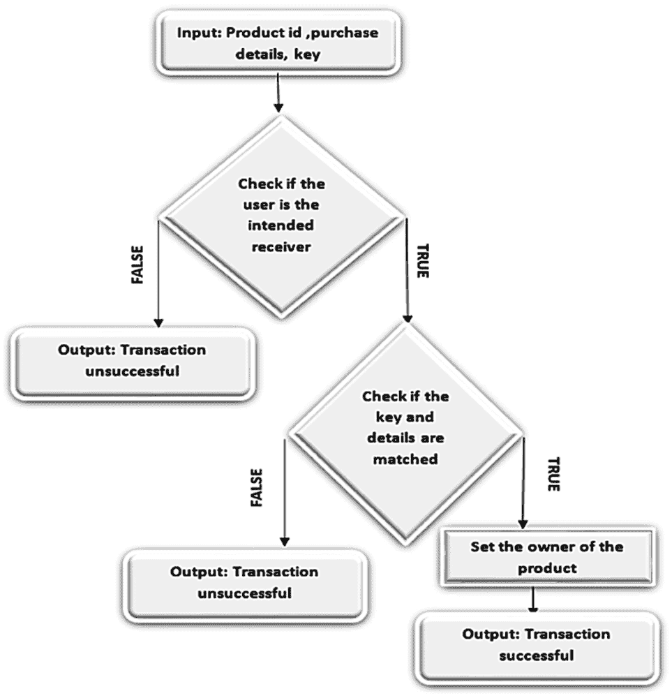

# 第七章

# 基于区块链的食品供应链管理

+   Dhana Srinithi Srinivasan

    印度 PSG 技术学院

+   Karpagam Manavalan

    

    印度 PSG 技术学院

+   Soundarya R.

    印度 PSG 技术学院

+   Thamizhi S. I.

    印度 PSG 技术学院

摘要

区块链是一种新兴技术，基于分布式账本的概念。它允许不同方之间进行广泛的交易，并消除了第三方中介的需要。区块链的几个特点使其适用于农业领域的使用。区块链的一些潜在应用包括有效管理食品供应链和基于价值的支付机制。农业产品通常是多方分布式供应链的输入，其中消费者通常是最终客户。食品链涉及多个参与者，包括农民、船运公司、经销商和杂货店。这使得整个系统分布式，并且在整个链条上扮演不同角色的多个参与者。目前使用的这种系统在各个方面都是低效且不可靠的。本项目旨在利用区块链技术解决和解决食品供应链中涉及的差异。

案例研究

食品行业在提供支持各种人类活动增长的必需品方面发挥着至关重要的作用。一旦收获或生产完成，食品就会经历各种阶段，如加工、运输、分销、储存和交付。据报告称，每年约有三分之一的生产食品被丢弃或浪费（约 13 亿吨）。其中三分之二的浪费食品（约 10 亿吨）发生在供应链的各个阶段，如收获、运输和储存等。由于食品供应链管理效率低下和无效，2011 年全球共有 492 百万吨易腐烂的水果和蔬菜被浪费。

食品供应链管理与其他供应链（如家具物流）有所不同，体现在食品质量、安全性和新鲜度等因素上，而这些因素需要在有限的时间内得到体现，这使得底层供应链更加复杂且难以管理。当涉及到易腐烂产品时，情况会变得更加复杂，因为它们在食品供应链中的流动时间，包括仓库或缓冲区的使用，需要相当有限。

农民面临的主要困难之一是需要中间商来销售他们的农产品。在某些情况下，农民被迫按这些所谓中间商提供的价格出售他们的商品。在印度等国家，作物生产地区的基础设施不足，使这些中间商能够欺骗农民关于他们正在出售的产品的真实价值。大多数仓库位于城市附近，这增加了因腐烂而造成的收获后损失。

Label Insight 和食品营销学会（FMI）的一份报告显示，购物者越来越需要透明度和与他们的食品更紧密的联系，以至于 75%的人表示他们会转向提供更深入产品信息的品牌，超出了物理标签上提供的信息。这些因素强调了对更透明的食品供应链的需求，至少在一定程度上减轻了农民所面临的劳苦，并确保产品来源的信息对最终用户可用。

文献综述

本调查的目的是将每项工作置于其对研究问题理解的贡献背景中。它定义了其他研究人员使用的数据来源。文献综述有助于查看之前发生了什么，其他研究人员做了什么事情，以及哪些事情对他们有效或无效。它还提供了支持我们发现的证据。

区块链的特点

在 2016 年，王远、王永博等进行了一项关于基于区块链的智能交通系统的初步研究。该研究概述了一个面向智能交通系统的，基于七层概念模型的区块链，并提供了基于区块链的实时拼车服务的案例研究。该研究简要讨论了区块链技术的利弊。一旦新区块被验证并添加到链中，这种添加是永久的，无法篡改或删除，这一区块链的特性被称为不可变性。这种区块链的特性提高了网络的安全性，并且是网络的最简单的责任追究。在 2017 年，郑子斌等人提出了关于区块链技术和区块链架构的全面概述，比较了不同区块链中使用的一些典型共识算法，并分析了区块链的技术挑战和最新进展。

区块链被描述为“在计算机网络上产生了成千上万的克隆”的革命性图景（Zibin Zheng 等人，2017 年）。比特币、以太坊区块链和智能合约实现构成了加密货币发展的核心。Gavin Wood 博士（2014 年）讨论了以太坊区块链的各种特性，概述了区块链技术如何在这个框架中以一种通用的方式实现，并对设计、实施、实施过程中遇到的问题、提供的各种机会以及未来的障碍进行了深入的解释。2018 年，Dejan Vujičić等人重点关注了区块链领域的几个方面和发展，并详细阐述了比特币、以太坊区块链和智能合约实现的概要。

区块链应用

区块链在加密货币、医疗保健、广告、保险、版权保护、能源、社会应用等各个领域有着广泛的应用。Wubing Chen 等人（2013 年）在不同领域多年来对几种区块链应用进行了调查。此调查的目的是激励更多基于区块链的应用的创建。

区块链技术可以为大数据领域的各个方向提供新颖的解决方案（E.Karafiloski,2017）。在寻找处理大数据的最佳方式以存储、组织和处理数据时，区块链技术成为重要的输入选择之一。它提出的关于私人数据的去中心化管理、数字财产解决方案、物联网通信和公共机构改革的解决方案对大数据可能如何发展产生了重要影响（更多信息请参见 2017 年的《区块链解决大数据挑战》）。

区块链在食品供应链管理中的应用

食品供应链涉及多个参与者，包括农民、船运公司、分销商和杂货店。这使得供应链管理系统分布式，多个参与者在整个供应链中扮演不同的角色。Nir Kshetri（2018）研究了区块链将如何影响供应链管理目标，重点是将食品供应链管理的目标与区块链的特性（如透明度和责任制）联系起来。当物联网（IoT）纳入基于区块链的食品供应链管理中时，它可以发挥重要作用（有关更多信息，请参阅 2018 年《区块链在实现关键供应链管理目标中的作用》）。

2018 年，Miguel Pincheira Caro 等人提出了一个完全去中心化的、基于区块链的农业食品供应链管理可追溯性解决方案。Miguel Pincheira Caro 等人提供了两种区块链实现，分别使用了以太坊和 Hyperledger Sawtooth。然后比较了这两种部署的性能。

食品安全是“所有人在任何时候都能够获得足够、安全和营养丰富的食物，以满足他们的膳食需求和食物偏好，保持积极健康的生活”的情况（粮食和农业组织（FAO））。实现这样的目标并不容易，特别是在危机、自然灾害和政治气候动荡时。在这种情况下，区块链可能成为确保国际援助透明交付的不可或缺的资源，将中间商从交付过程中移除，使真实资源可获得，并在紧急情况发生后更快速、更有效地做出响应。

食品安全涉及以卫生方式加工、管理和存储食品。由于食品污染引起的疾病是当今世界的普遍问题。区块链很可能是一个有效的解决方案，因为它能够确保食品供应链的每个层面的透明度，从而提高食品安全的可追溯性。天（2017）提出了一个系统，促进了区块链与物联网的集成，用于实时监测物理数据和基于 HACCP 系统的追溯。这个系统对于保持易腐食品配送物流中的冷链至关重要。ZetoChain 是一个系统，它专注于冷链的每一个环节的环境监测，基于物联网设备（Zeto，2018）。问题识别和报告迅速进行，以立即采取控制损害的措施。建议消费者使用移动应用程序扫描产品上的 Zeto 标签，以查找产品的历史。

食品完整性关乎供应链内食品的可靠交换。每个参与者都有责任提供关于货物的完整详细信息，从起源到生产。通过区块链，食品公司可以通过快速识别和追溯到特定来源来减轻食品欺诈是欺诈的必要步骤。这个系统正在被多个组织和机构采用。

术语和术语

+   区块链 - 区块链是一种数据结构，用于保存交易记录并确保安全、透明和去中心化。它就像是以块的形式存储的记录链，不受任何中央机构的控制。

+   • 公开区块链 - 公开区块链是一个全球开放的网络，任何人都可以参与交易并执行共识协议，确定哪些区块被添加到链上并维护一个共享的账本。

+   • 私有区块链 - 私有区块链是一个封闭网络，参与者需要通过验证流程。私有区块链中的参与者数量可能有限。

+   • 分布式账本 - 一个共识分布的数据库，所有权在多个参与方之间共享。数据在系统的每个节点上同步复制和存储。

+   • 交易 - 交易是指不同节点之间的加密货币或数据传输。区块链中的每笔交易都生成一个哈希。

+   • 以太坊 - 一个公开的区块链网络和一个去中心化的软件平台，开发者可以在其上构建和运行他们的应用程序。

+   • 加密货币 - 基于数学函数的数字货币，使用加密技术来调控货币单位的创建。它还验证资金的转移。

+   • Gas - 在以太坊中，Gas 衡量一项操作所需的工作量。它是以太坊网络上一笔交易所需的计算步骤的度量，然后将其等价于用户的费用。

+   • Gas 限制 - 为每笔交易设置的限制，指明该特定交易可以消耗的最大 Gas 量。

+   • 以太币 - 以太币是以太坊区块链网络的本地货币。它作为整个以太坊生态系统的燃料，通过作为节点或参与者执行基本操作的奖励媒介和支付形式。

+   • 区块 - 区块链网络上的一系列交易被聚集到一个称为区块的集合中，该集合被哈希并添加到区块链上。

+   • 创世区块 - 区块链系统中的初始区块。

+   • 密码哈希函数 - 对于每个唯一的输入，返回一个唯一的固定长度字符串的函数。它创建一个数字标识或数字指纹。

+   • 哈希 - 哈希是加密哈希函数的输出。也被称为数字指纹。哈希确认区块链上的交易。

+   • 智能合约 - 一种自执行合约，其中协议条款写入代码。它们是一种可以编码并在一组条件满足时执行的自动化操作。

+   • Solidity - Solidity 是一种面向合约的编程语言，用于编写智能合约。

+   • 代币 - 代表建立在现有区块链系统上的数字资产。

+   • 比特币 - 它是基于工作证明区块链的第一个加密货币。

+   • 工作证明 - 一种建立系统共识的协议，将挖矿能力与计算能力联系起来。对一个区块进行哈希需要每个矿工解决一个称为难度目标的难题，这导致矿工之间竞争解决难题。对于每个经过哈希的区块，哈希过程将会花费一定的时间和计算功夫。这个经过哈希的区块被视为工作证明。

+   • 共识 - 当区块链网络的大多数参与者就区块链系统内发生的交易的有效性达成一致意见时。

+   • 认证 - 通过将传入请求与一组身份验证凭据相关联来识别用户身份的过程。

+   • 数字信任 - 这是参与者对区块链网络保护和安全数据的信心。

+   • 威胁 - 任何可能导致系统损害的事件，通过创建机密性、可用性或完整性的丧失。它可以是意外的或蓄意的。

+   • 漏洞 - 漏洞是系统中的一种潜在弱点，可能会被威胁所暴露。

+   • 攻击 - 攻击是对系统的蓄意未经授权的行为。它可以是主动的或被动的。

+   • **欺骗** - 欺骗攻击是指恶意用户或程序成功冒充他人以获得非法访问或优势的事件。在区块链技术中，欺骗指的是攻击者能够在区块链网络上冒充他人的能力。

+   • **篡改** - 篡改攻击指的是通过未经授权的渠道故意修改数据，以违反数据的完整性。

+   • **否认** - 否认攻击是指系统未采用有效的控制措施来跟踪和记录节点或用户的操作，从而允许非法操纵或伪造新操作的识别。

+   • **信息泄露** - 信息泄露攻击旨在由非法用户从系统中获取特定信息。这些信息很可能被归类为敏感信息。保密性的违反属于信息泄露范畴。

+   • **提升权限** - 提升权限攻击是指用户成功获得对系统的未经授权的控制级别。该用户可能是一个经过身份验证但被拒绝访问系统敏感信息的用户。

+   • **区块链网络** - 区块链网络是节点用于通信的基础网络。该网络定义了协议，规定了区块链生态系统内部的通信方式。

+   • **节点** - 任何连接到区块链网络的计算机都称为节点。它是由区块链系统上的合法用户操作的分类账的副本。完整节点是一台可以完全验证交易并下载特定区块链的整个数据的计算机。轻量级节点不会下载整个数据，而是使用不同的验证机制。

+   • **加密** - 一种过程，将明文与称为密钥的较短数据字符串结合起来产生密文。持有密钥的人可以将密文解密为原始明文。

+   • 随机数（Nonce）- 在加密通信过程中仅使用一次的数字。通常包括时间戳。

+   • DDoS 攻击 - 一种网络攻击，攻击者试图通过暂时或永久地中断服务，使合法用户无法使用一台机器或网络资源。

+   • 51% 攻击 - 区块链系统中大多数矿工对其他节点发起攻击的情况，这允许进行双重支付。

+   • 双重支付 - 区块链系统中某人尝试同时向两个不同的接收方发送特定交易的事件。

+   • 大数据 - 大数据是大规模数据集的汇编。它是一个处理分析和从数据集中提取信息的领域，这些数据集过于复杂，无法用传统的数据处理技术处理。

+   • 物联网（IoT）- 指的是一组连接的设备网络，这些设备能够收集并交换彼此之间的数据。

区块链的特性

区块链提供了几个特性，使其成为多个用例和业务解决方案的广泛适用和合适的技术。每个区块链都有一个存储信息的区块链。每个区块都包含关于交易的信息，以及与这些交易相关的值被散列并存储在区块中。区块链的这种基本工作机制形成了几个特性，确保了与各种交易相关的数据的完整性、机密性和透明性。以下是使区块链适用于多个用例的特性。

不可变性

不可变性意味着某物无法改变或更改。每个信息块，例如事实或交易详情，都使用密码学原理或哈希值进行处理。该哈希值由每个区块单独生成的包含字母数字字符串。每个区块不仅包含自身的哈希或数字签名，还包含前一个区块的。这确保了区块被回溯地耦合在一起且未经修改。区块链技术的这一功能确保了没有人可以侵入系统。这个特性还确保了网络在整个过程中保持完整和不变。

区块链中的每个区块都具有前一个区块的哈希。因此，在特定区块中篡改数据需要费力的努力，几乎是不可能成功的。改变一个区块的值会改变其哈希值，因此也会改变下一个区块的“上一个区块的哈希值”。由于这种哈希是相当复杂的，因此不可能将其逆转。区块链的这个特性确保了数据的完整性。

去中心化

整个区块链网络是去中心化的，一组节点维护网络，没有中央管理机构参与。由于缺乏管理机构，任何人都可以访问网络并将其资产存入其中。每个用户都将拥有自己的私钥，通过该私钥可以直接访问他们存储的数据。这个特性带来了几个优点。

无单点故障

由于数据存储在多个节点上，并且没有中央管理机构，因此不会有单一故障点。

攻击成本高昂

攻击网络将是一项昂贵的任务，因为它涉及到多个节点。

无第三方

用户可以直接访问他们的资产，而不必向任何第三方寻求帮助。

用户控制

通过去中心化，用户对自己的资产拥有完全控制权。他们不必依赖于任何第三方来维护他们的资产。

分布式分类账

区块链是一个去中心化和公开的分类账。分类账是已完成交易的记录或日志。由于它对区块链系统中的每个人都可见，所以被称为公开分类账。没有个人或任何机构负责交易。区块链网络中的每个节点都有相同的分类账副本。这个特性提供了几个优点。

无恶意修改

由于区块链是分布式分类账，它对任何可疑活动或篡改都做出了很好的响应。由于没有人可以更改分类账，而且所有内容都更新得非常快，因此使用所有这些节点追踪分类账中发生的情况非常容易。由于它是一种公开的分类账，区块链确保对网络上的每个人都可见的任何更改，这使得黑客修改数据变得非常危险和困难。

验证所有权

在区块链系统中，每个节点都充当分类账的验证者。如果用户想要添加一个新的区块，其他人必须先验证交易，然后给予批准。这使每个用户成为公平和安全的参与者。

平等特权

网络上的任何人都不能从网络中获得任何特殊优惠。每个人都必须通过常规渠道，然后添加他们的区块。在区块链系统中没有特权等级。区块链的去中心化属性使区块链网络成为点对点网络。该属性使区块链只涉及两个方，发送者和接收者，从而完全消除了第三方授权。网络中的每个节点都可以授权自己。

透明度

区块链技术的去中心化特性确保了高度透明性。为每个参与者创建了透明的个人资料。区块链上的每一次变更都是可查看的，并最终被更具体地建立。每笔交易都被记录下来，并且每个网络参与者都可以查看。区块链的这种基本特性确保了变更的具体性，并使其非常适合需要使存储和交易对所有利益相关者可见的应用。在公共区块链中，区块链网络中的每个人都可以看到交易，因此它非常透明。另一方面，对于希望在员工中保持透明并保护他们的敏感信息免于公众视线的企业来说，私有或联盟区块链可能是最佳选择。

共识

共识机制/算法在多个参与者需要验证网络中发生的交易时至关重要，特别是在作为去中心化、自我调节系统以无任何单一管理机构运行的公共区块链中。它们涉及到大量参与者的贡献，这些参与者负责验证和认证区块链上发生的交易。这种架构设计巧妙，共识算法是这种架构的核心。每个区块链都有一个共识机制来帮助网络做出决策。共识确保了链中发生的所有交易都是合法的，并且所有利益相关者都同意分布式账本的状态。

安全

区块链上的记录通过包括哈希技术在内的加密算法进行安全保护，这是区块链技术的一个重要方面。每个参与者持有一个唯一的私钥，他们可以使用该私钥来访问其资产，因此充当个人数字签名。如果记录被更改，哈希将变得无效，对等网络将立即知道不一致之处。这确保了一旦交易块添加到分类账上，就没有人可以随意返回并更改它。因此，网络上的任何用户都无法编辑、删除或更新它。供应链管理系统中的风险可能来自外部或内部实体的攻击。使用区块链进行供应链管理的一个重要优势之一是，它承诺消除中间人或任何第三方认证，而是使对等互动和数据交换成为可能。区块链的这种特性使网络成为一个稳定且安全的环境。

数学模型

区块链技术的基本数学模型涉及一种称为椭圆曲线密码学（ECC）的加密概念。它是一种广泛用于区块链实现中的非对称加密，特别是用于验证交易并确保交易被授权执行。ECC 可以通过以下两种主要方式使用：

+   • 椭圆曲线数字签名算法（ECDSA）

+   • 椭圆曲线 Diffie-Hellman 密钥交换（ECDH）

ECDSA 用于生成交易的签名，而 ECDH 用于加密需要交易的消息。区块链及其应用，包括比特币，广泛使用 ECDSA 来验证和授权交易。ECC 依赖数学来确保交易的安全性。

椭圆曲线是由形式为

y² = x³ + ax + b

a 和 b 的值确定了椭圆曲线的形状，不同的 a 和 b 值导致不同的椭圆曲线。椭圆曲线有许多属性，其中一种属性是当一条非垂直线与曲线上的两个非切点相交时，它总是会与曲线上的第三个点相交。

| 图 1\. 椭圆曲线数字签名算法图 |
| --- |
|  |
| *注. P 和 Q 是椭圆曲线上的两个不同的点，并且 P 不是 -Q。为了添加点 P 和 Q，通过这两点画一条线。这条线在椭圆曲线上交叉点处恰好再相交一个点，R'。点 R' 在 x 轴上反射到点 R。椭圆曲线群的加法法则是 P + Q = R。来源 https://medium.com/dataseries/explaining-the-math-behind-blockchain-algorithms-98d06e06c2e3* |

在曲线上的点 P 和 Q，如图 1 所示，被添加以找到相应的第三点 R。例如，考虑两点，P(x[1], y[1]) 和 Q(x[2,] y[2])。为了找到点 P 和 Q 的和，定义，

λ = (y[2] - y[1])/(x[2] - x[1]) mod M

然后求和 R(x[3], y[3]) = P(x[1], y[1]) + Q(x[2,] y[2]) 由此给出，

x[3] = λ - x[1] - x[2] mod M

y[3] = λ (x[3] - x[1]) + y[1] mod M

这是实现区块链的概念。在实际的现实场景中，M 被选择为一个质数非零整数。然后，选择一个基点 (x[1], y[1])，使得点 (x[1], y[1]) 能够在因为除零而失败之前加到自身的次数是一个质数，这被称为阶，以及一个与 M 一样大的值。然后设置一个私钥 (k[1])。为了获得公钥 (x[3], y[3])，

(x[3], y[3]) = k[1] * (x[1], y[1])

现在，使用私钥和公钥构造数据的数字签名 S(x[4], y[4])，选择一个值 k[2]，使得 k[2] 位于 0 和阶值之间。数字签名然后定义为，

(x[4], y[4]) = k[2] * (x[1], y[1])

现在，设 Z 为数据，则，

y[4] = (Z + x[4] * k[1]) / k[2] mod n，其中 n 是阶数

要验证交易的合法性，让，

s[1] = y[4] – 1 mod n

s[2] = Z * s[1] mod n

s[3] = x[4] * s[1] mod n

(t[1],t[2]) = s[1] * (x[1], y[1]) + s[3] * (x[3], y[3]) * 5

最后，验证 t[1]是否等于 x[4]将产生对交易合法性的验证结果。

研究背景

| 图 2\. 研究背景 |
| --- |
|  |
| *注：突出显示了实现区块链系统和选择方法的各种选项。* |

食品供应链管理可以通过利用多种技术和工具来实现。所选择的技术在图 2 中突出显示。

根据文献调研得出的结论，已经选择了实现拟议系统不同功能的软件技术和平台。选择过程的主要考虑因素包括易用性、保持效率和确保透明度。

区块链技术

在涉及易腐货物的产品时，对于食品供应链管理系统有一些关键特性是必不可少的。供应链中的每个参与者都负责向最终客户交付可消费的产品。对于这种使用情况，不可变性、透明度和可追溯性成为不可或缺的因素。区块链技术在该系统中得到应用，因为它能够支持并提供这些特性。

为什么不选择人工智能或机器学习？

从定义上来说，人工智能代表了数字计算机或计算机控制的机器人执行与智能生物常见的任务的能力。机器学习是基于机器应该被赋予数据访问权，并让它们自行学习这一想法的应用。然而，即使再先进，也没有一种技术是完美的。例如，人工智能机器做出的一次错误预测，比如在食品供应链管理中预测食品产品的健康状况，都会引起健康以及商业上的担忧。此外，人工智能涉及自动化而不是手动输入数据。这需要开发人员对决定食物变质等因素有深入的了解。

以太坊

以太坊平台是一个开源的、分布式的公共区块链网络，拥有自己的加密货币称为以太币。以太坊区块链中的每一笔交易都需要燃气（Gas），并且可以设置一个燃气限制（Gas Limit），这是交易能够消耗的最大燃气量。交易的数据和细节存储在区块中，每个区块通过使用哈希值进行唯一标识。以太坊还提供了自己的虚拟机，称为以太坊虚拟机（EVM），可以用来运行智能合约。

为什么不选择超级账本？

Hyperledger Fabric 是一个模块化的区块链框架，作为开发基于区块链的产品、解决方案和应用程序的基础，使用即插即用的组件，旨在私有企业内使用。关于 Hyperledger 没有什么重要的缺点可讨论。尽管以太坊在供应链管理方面具有显著的优势。以太坊是透明的，这对于供应链管理系统是必要的。它有一个名为 Ether 的内置加密货币，而 Hyperledger 没有。以太坊以去中心化和大规模消费为目的运行智能合约。而 Hyperledger 则利用区块链技术为具有高机密性的企业业务提供支持。因此，通过这些充分的支持证据，显然以太坊更适合供应链管理应用程序。

Truffle 框架

Truffle 框架提供了一个完整的工具套件，用于构建和测试区块链。它提供了用于编译、链接和部署智能合约的功能，所有这些功能都内置在框架中。此外，它使用 Node Package Manager 或 Ethereum Package Manager 进行软件包安装、版本管理和依赖管理。Truffle 框架由三个主要的以太坊智能合约和去中心化应用程序开发框架组成，分别称为 Truffle、Ganache 和 Drizzle。因此，选择了它来开发这个原型。

Truffle

Truffle 是为了使用以太坊虚拟机（EVM）构建 dApps 而制作的，它提供了一个开发环境、测试框架

Ganache

Ganache 是一个个人区块链，允许开发人员创建智能合约、dApps 和测试软件，作为桌面应用程序和命令行工具提供

Drizzle

Drizzle 是一个基于 JavaScript 的前端开发库，能够自动同步合约和交易数据

提议系统

本系统采用的架构是分层架构。系统中的每个组件都组织成水平层，每一层在应用程序中执行特定功能。每一层都有具体的职责，有助于系统的正常运行。

应用层、接口层、事务层、区块链层和物理层按顺序相互交互，并围绕着满足请求所需的工作形成自己的抽象。

分层架构提高了整个系统的可维护性、可扩展性和灵活性，因为每个层次只关注特定任务，从而为满足请求做出贡献。

| 图 3. 概念架构 |
| --- |
|  |
| *注意。考虑使用区块链实现食品供应链时所考虑的各个层次如下所示。* |

概念架构在高层次上视觉描述了食品供应链管理系统的细节。概念架构的目的是提供无法用言语轻松传达的信息。考虑使用区块链实现食品供应链的架构是分层的。

应用层

如图 3 所示，架构的最顶层是应用层，强调部署智能合约并向用户提供完整的食品供应链管理服务。在这一层中，智能合约通过部署到底层区块链来实现。

接口层

接口层专注于三个主要方面。每个方面满足系统不同功能的需求。农民、分销商、零售商和顾客等各方参与者通过该层中的接口在系统内注册。此外，还为注册顾客提供了追溯选项的接口。各参与者根据其角色输入特定的细节，包括湿度、温度、价格等因素。此外，接口还提供了从系统中移除利益相关者的选项。

交易层

这一层展示了涉及交易的各级用户。一个 20 字节的地址表示发起交易的账户或利益相关者。Gas 限制是用户愿意为一笔交易支付的最大 Gas 量。一个典型的简单交易通常需要一个 Gas 限制为 21000。每个 Gas 都应分配一个值，这基本上是用户愿意为每个 Gas 单位支付的值。

区块链层

这一层是区块的创建和管理层。每个区块存储有关交易的信息，包括涉及交易的各方参与者、执行交易所使用的 gas 以及参与者之间交换的数据。每个区块都有一个唯一标识区块的哈希值。区块通过引用上一个区块的哈希值来相互连接。

物理层

最后一层是物理层，如图 3 所示。前一步创建的区块存储在物理层的数据库中。在以太坊中，一个区块可以容纳 20 到 30 kb 的数据。

要求

本节试图突出食品供应链管理系统通常期望的功能和非功能需求。功能需求解释了构成供应链管理系统基本工作流程的各种元素，而非功能需求则强调了这些系统固有期望的抽象和隐含因素。

功能需求

用户账户

Truffle 提供了 10 个不同的用户账户，具有一定数量的组合级别。这些账户由不同类型的用户使用，如农民、分销商、零售商、加工商，用于进行交易并将其附加到区块链上。

在每个阶段附加详细信息

农民使用移动应用程序保存成熟作物的详细信息，如起源、作物类型、播种使用的程序、储存信息等。农民存储的信息可被系统中的所有相关利益相关者访问。一旦作物成熟，农民将它们分配给食品加工公司或精炼厂进行进一步加工。接收到农民提供的食品后，精炼厂或食品加工公司开始加工并将有关作物精炼的信息存储在公共区块链上。加工完食品后，加工公司将加工后的食品运送给批发商，并在区块链上更新运输详情。批发商聘请物流服务提供商将货物分发给不同的零售商。通过物联网（IoT）启用的车辆或卡车运输加工食品有助于在受控环境下保持食品安全。物联网车辆内置的传感器向区块链发送与食品温度和实时位置相关的信息。

溯源

区块链上存储的信息帮助零售商或消费者验证食品是否经过适当处理。从源头到目的地，诸如农场起源详情、批号、运输详情、存储温度、到期详情等信息都与供应链区块链内的食品相关联。最终消费者可以追溯食品供应链区块链，并确保食品是否安全。

非功能需求

可用性

应用程序设计了一个简单的用户界面，以及必要的说明，以确保用户有舒适的体验。区块链的内部工作完全对用户抽象，使其完全用户友好。

完整性

有关商品的数据存储在区块链中，因此具有防篡改性。有关商品供应的信息也存储在区块链中，因此这些记录变得不可变。这可以防止经销商拒绝购买或农民拒绝供应。

保密性

此功能是关于在供应链中可靠地交换食品，而无需受到未经请求的第三方干扰。每个参与者都有责任提供有关商品的完整详情，从起源到生产。通过区块链，食品公司可以通过快速识别并将疫情与其特定来源联系起来来缓解食品欺诈是防止欺诈的重要一步。这个系统正在被多个组织和机构采用以防范欺诈。

设置

安装

如研究背景中所讨论的，对于这个应用，Truffle 框架用于开发和编译智能合约，并在以太坊区块链上部署它。设置这个框架涉及安装和配置一组工具和框架，作为依赖性和在开发阶段开始时的使用便利性。Truffle 框架需要 NodeJS 和一个操作系统，其中之一是 Windows、Linux 或 Mac OS X。NodeJS 自带一个包管理器，称为 Node Package Manager（NPM），可用于安装和管理包。在 Windows 机器上详细解释了 Truffle 框架的安装和基本设置，见下一小节。

+   1\. 根据相应的操作系统安装 NodeJS。可以从 https://nodejs.org/en/ 下载可执行文件，或者使用像 Chocolatey 这样的软件管理自动化软件。

+   2\. 在计算机上设置 NPM。

+   3\. 在终端中键入以下命令，使用 Node Package Manager 安装 Truffle，

使用以下命令全局安装 truffle：

+   4\. 安装成功后，需要创建一个新项目。这可以通过两种方式完成，

    +   a. 使用以下命令创建一个空项目，

初始化 truffle：

+   b. 使用以下命令创建一个带有现有代码的项目，

使用以下命令初始化 metacoin 项目：

Metacoin 是一个 Truffle Box，作为一个样板代码，简化了使用 Truffle 开始的过程。Truffle 网站提供了许多这样的 Box，可帮助专注于特定的需求和应用。

Truffle 项目的结构

Truffle 提供了广泛的功能来处理编译、测试、部署和访问使用以太坊区块链的各种应用的智能合约。Truffle 还为轻松构建用户界面提供了几个包，并允许以简化的方式与智能合约进行交互，无论是在开发还是使用方面。一个 Truffle 项目创建的文件夹包含多个子文件夹，包括 Contracts、Migrations 和 Test。它还包括一个配置文件。这些文件和文件夹中的每一个从智能合约的开发到部署，再到分布式应用的用户界面构建，都发挥着重要作用。它们各自的功能如下所示。

合约文件夹

合约文件夹存储了 dApp 所需的所有智能合约。除了用户特定的智能合约外，它还包含一个称为 Migration.sol 的合约。该合约的主要目的是跟踪网络中发生的所有迁移。它基本上充当了管理部署的接口。

迁移文件夹

迁移涉及将合约部署到以太坊网络中。随着项目的变化和开发的进展，需要创建新的迁移脚本。迁移文件夹包含部署 Migration.sol 到区块链的 JavaScript 文件。随着迁移的增加，迁移文件夹中的 JavaScript 文件数量也相应增加。

测试文件夹

Truffle 提供了一个内置的自动化测试框架，可以用来测试智能合约。在对像 Ganache 或 Truffle Develop 这样的以太坊客户端运行测试时，Truffle 确保各个测试文件之间不共享状态。测试代码可以用 Solidity 或 JavaScript 编写。

运行智能合约

在 Solidity 中，合约基本上是存储在以太坊区块链上特定地址的一组代码和数据。运行智能合约的步骤如下。

编译智能合约

运行智能合约的第一步是编译。要编译一个 Truffle 项目，请切换到项目所在目录的根目录。要编译智能合约，需要使用以下命令，

truffle compile

在第一次运行时，将编译所有合约。在后续运行中，Truffle 将仅编译自上次编译以来已更改的合约。要覆盖此行为，需要使用以下命令，

truffle compile --all

构件。编译的构件将放置在相对于项目根目录的 build/contracts/ 目录中。

依赖项。合约依赖项可以通过两种方式的 import 命令声明：

+   • 通过文件名导入依赖项，

import “./importContract.sol”

+   • 从外部包导入合约，

import “externalpackage/externalContract.sol”

运行迁移

迁移是帮助将合约部署到以太坊网络的 JavaScript 文件。这些文件负责分阶段部署任务，并且它们是在假设部署需求会随时间而变化的前提下编写的。运行迁移的命令如下，

truffle migrate

这将运行项目迁移目录中的所有迁移。此命令将从上次运行的最后一个迁移开始执行，仅运行新创建的迁移。如果不存在新的迁移，它将不执行任何操作。要从头开始运行所有迁移，需要执行以下命令，

truffle migrate --reset

迁移文件结构

+   • artifacts.require()。告诉 Truffle 与哪些合约进行交互。指定的名称应与源文件中的合约定义名称匹配。

+   • module.exports()。所有迁移必须通过 module.exports 语法导出一个函数。每个迁移导出的函数的第一个参数应该是一个部署器对象。

+   • 部署器。部署器被迁移文件用于分阶段部署任务。

测试合约

Truffle 有一个标准的自动化测试框架。该框架允许以两种不同的方式编写简单且易于管理的测试。

+   • 在 JavaScript 和 TypeScript 中，用于从外部应用程序执行合约。

+   • 在 Solidity 中，用于在先进的、裸金属场景中执行合约。

所有测试文件都应存在于 ./test 目录中。此外，也可以在命令旁边提及测试文件的路径。运行测试的命令如下，

truffle test

堆栈跟踪是应用程序在抛出异常时所进行的方法和函数调用列表。可以通过以下方式获取失败或回滚的交易的 Solidity 堆栈跟踪，

truffle test --stacktrace

执行此命令将为通过 Truffle Contract 进行的测试中发生的任何失败导致测试失败的事务和部署生成堆栈跟踪。该选项仍处于试验阶段，并且目前不支持对调用或 gas 估算的堆栈跟踪。

在 Solidity 中编写测试

Solidity 测试合约被保存为 .sol 文件。当运行 truffle 测试时，它们将作为每个测试合约的单独测试套件包含在内。这些合约为每个测试套件提供了一个清洁的环境，直接访问部署的合约和导入任何合约依赖项的能力。

Solidity 测试结构

Solidity 测试合约的结构包含几个部分，每个部分都具有特殊功能。通过使用这些测试合约，可以根据几个参数测试智能合约中每个函数的工作方式。构成测试合约的各个组件如下所述。

+   • 断言。断言函数可以来自默认的断言库，如 Assert.equal()，也可以自行创建。

+   • 部署地址。作为迁移的一部分部署的合同的地址可通过 truffle/DeployedAddresses.sol 库获取。

+   • 测试合同名称。所有测试合同都必须以 Test 开头，使用大写 T。

+   • 测试函数名称。所有测试函数都必须以 test 开头，t 小写。每个测试函数将按照在测试文件中的顺序，作为单个事务执行。

+   • Before/After 钩子。这些钩子可用于在每次测试之前和之后，或在每次套件运行之前和之后执行设置和拆卸操作。

以太坊客户端

在 Truffle 中构建 dApp 所需的一个重要工具是以太坊客户端。有许多以太坊客户端可供选择。可以根据开发或部署的目的选择合适的客户端。 

Ganache

Ganache 是以太坊开发的个人区块链，在本地桌面上运行。Ganache 是 Truffle Suite 的一部分。它通过将合同和交易置于中心位置来简化 dApp 开发。Ganache 帮助开发人员快速了解应用与区块链的交互方式，并深入了解账户、余额、合同创建和燃气成本等细节。Ganache 在启动时运行在 http://127.0.0.1:7545。它将显示前 10 个账户和用于创建这些帐户的助记词。开发人员也可以输入助记词。

Truffle Develop

Truffle Develop 可以通过一个命令来设置集成的区块链环境，

truffle develop

执行此命令会在 http://127.0.0.1:9545 上运行客户端。它将显示前 10 个帐户和用于创建这些帐户的助记词。与 Ganache 的区别在于，助记词在 Ganache 重新启动时将持续存在，而在 Truffle Develop 中，它将生成一个仅对该用户帐户持续存在的随机助记词，即对特定用户帐户唯一。

一旦启动 Truffle Develop，它将为您提供一个控制台，您可以在其中运行所有可用的 Truffle 命令。这些命令输入时省略了 truffle 前缀。例如，要编译智能合同，而不是键入，

truffle compile

你只需要键入，

编译

Ganache CLI

Ganache 具有命令行界面，非常适合自动化测试和持续集成环境。Ganache CLI 以无头模式运行，可配置为满足所有开发需求。Ganache CLI 可用于快速测试代码是否有效，因为它能立即处理交易，而不必等待默认的区块时间。它还会立即通知智能合同遇到错误，并直接与 Truffle 集成，可将测试运行时间缩短高达 90%，相较于其他客户端。

Drizzle

Drizzle 会自动将链数据同步到 Redux 存储库，最大程度减少了开发人员的工作量。Drizzle 可以配置为在每个区块上同步链数据，或者仅在终端应用程序正在监听的合同数据发生变化时同步。它涵盖合同状态、事件和交易。

有一个 Truffle Box 可供 Drizzle 使用，该 Box 将 Create React App 设置与 Drizzle 和 Drizzle React Components 包结合在一起。可以通过以下命令下载 Truffle Box，

truffle unbox drizzle

这会自动设置所需的文件夹和合同，以便进行用户界面开发并与底层架构集成。

Remix IDE

Remix 提供了一个集成环境，可用于编写、编译和调试 Solidity 代码。可以通过在线版本通过网络浏览器访问 Remix IDE，也可以通过本地安装的副本或通过 Mist（以太坊分布式应用浏览器）访问。它提供了各种选项将区块链实例注入到浏览器中。在不同的选项中，JavaScript 虚拟机有一定的优势，它忽略了 gas 限制，为用户提供了无限数量的以太币来玩耍，并提供了加速整个调试过程的工具。当前版本（v-0.10.1）提供了 15 个不同的帐户，每个帐户分配了 100 个以太币。

为什么使用 Remix？

+   • Remix IDE 是初步开发和测试智能合约的良好工具。

+   •  Remix 不能创建真实用户账户并在它们之间转移资金，因此它是初学者最喜欢玩耍的工具之一。

+   • 在线版本无需任何特殊安装，可以直接通过网络浏览器访问。可以使用以下 URL 访问 IDE：[`remix.ethereum.org/`](https://remix.ethereum.org/)。

+   • 它提供了一套完整的 IDE，有单独的面板用于编译、运行和调试智能合约，以及一个代码编辑器。

+   • 为了方便执行交易，Remix 提供了几种环境，如 JavaScript 虚拟机。它允许模拟区块链，每次重新加载页面时都会创建新的实例。

+   • 此外，Remix IDE 还附带了许多插件。Solidity 单元测试是其中之一，可用于编写测试合约。

+   • Remixd 是一个 NodeJS 工具，允许 Remix IDE 访问计算机的本地文件系统。可以通过以下 npm 命令使用此工具，

npm install -g remixd

原型实施

为了检查设计的可行性，已实现了所提议系统的原型，以实现在实施方面的可行性。该系统的实际流程被公开，以便我们可以辨别系统的完整目的和结构。这将改善需求和规范的质量，以便能够尽早确定最终用户真正想要的内容，从而可能导致更快速、更少成本的软件开发。下面描述了食品供应链管理系统的流程，以及各个模块的伪代码。

注册

+   • register_user: 将用户添加到授权用户列表中。

| 图 4. 用户注册 |
| --- |
|  |

该模块的输入是用户的类别，可以是客户、农民、供应商或分销商。该模块检查用户帐户是否已经存在。如果帐户尚不存在，则将用户添加到授权用户列表中，并注册成功。如果用户已经注册，则注册被宣布为失败。图 4 描述了该模块的流程。

+   • register_product: 注册产品并分配 ID

| 图 5. 产品注册 |
| --- |
|  |

如图 5 所示，该模块以产品细节和关键信息作为输入。它检查启动此操作的帐户，并确保其为产品所有者。如果产品所有者发起了操作，则产品注册成功。如果任何其他非产品所有者的用户发起了操作，则注册失败。该条件确保只有产品所有者可以注册产品。产品的注册通常由其初始所有者（即农民）完成。

所有权变更

+   • change_ownership: 将产品的所有者从当前所有者转移到供应链中的下一个用户。

| 图 6\. 所有权的变更 |
| --- |
|  |
| *注意。当前产品所有者尝试将所有权转移给指定的接收者。* |

该模块接收产品 ID、接收者 ID 和购买详情（例如购买日期和时间）作为输入。它检查启动此操作的帐户，并确保它是产品所有者。如果不是产品所有者，则交易失败并终止。如果产品所有者启动了交易，则检查接收者 ID 是否为注册用户。如果接收方已注册，则在追加交易详情后，交易成功结束。如果接收方未注册，则交易失败，因为接收方不能是非法用户，并且需要事先注册。图 6 显示了此模块的流程。

获得所有权

+   • attain_ownership: 产品的所有权在此转移。

| 图 7\. 获得所有权 |
| --- |
|  |
| *注意。此处实际上正在根据列出的某些条件更改所有权。* |

该模块接受产品 ID 和购买详情以及密钥作为输入。在图 7 中，该模块首先检查发起行动的用户是否是预期的接收者。如果用户不是产品的实际接收者，则交易终止，产品的所有权仍然归发件人所有。如果发起行动的用户是产品的预期接收者，则模块检查密钥和购买详情是否匹配。如果匹配，则产品的所有者被分配为接收者，并且交易被宣布为成功。如果详情不匹配，则交易失败。

回溯细节

+   • get_details: 客户检查交易历史以及产品详情。

| 图 8\. 回溯细节 |
| --- |
|  |
| *注. 产品的详细信息由消费者追溯。* |

图 8 显示了客户如何追溯已购买产品的详细信息。该模块将产品 ID 作为输入，并检查启动行动的客户是否为注册用户。如果用户未注册为客户，则该操作将失败。如果客户是注册用户，则模块将检查启动追溯操作的客户是否为产品的预期接收者。如果客户购买了产品，则客户可以查看整个产品详情。否则，该操作被视为失败。

威胁建模

安全分析

区块链的普及对数据存储、传输和应用的安全和隐私保护提出了新的要求，并对现有的安全解决方案、身份验证机制、数据保护、隐私保护和信息监管提出了新的挑战。该项目的风险可能来自外部或内部实体的攻击。在供应链管理中使用区块链的一个关键优势是它承诺消除中间人，而是实现点对点的交互和数据交换。  

威胁建模

威胁建模的原则是尽早对组织的利益相关者分类、沟通和理解威胁及其缓解方法。该方法的文档为系统分析人员和防御者提供了对潜在攻击者配置文件、最有可能的攻击向量以及攻击者最渴望的资产的广泛分析。威胁可以是任何利用漏洞以突破安全性并对感兴趣的对象产生负面变化、删除和损坏的东西。

表 1 概述了项目在区块链的每一层面临的各种威胁。欺骗指的是攻击者可以伪装成系统上经过身份验证的实体的能力。篡改攻击违反了受保护系统上存储的数据的完整性。违反保密性属于信息泄露。如果用户成功获取对系统的未经授权的控制级别，这就是特权升级攻击。系统被开发成尽可能减少攻击。特权升级通过产品密钥进行，只能由农场主进行注册。一旦所有权转移完成，就无法撤销，旧所有者将失去相应的特权。

加密原语代表着哈希函数和公钥加密，用于确保数据完整性并提供用户认证。中心化节点的安全问题包括涉及数字货币交易和管理大量资金的交易所。这些节点是整个区块链网络的任何故障点，攻击收益高而成本低，是攻击者的首选目标。

另一个攻击是未经授权的访问攻击，它发生在智能合约中。智能合约响应接收到的消息，它可以存储接收到的值，可以发送信息和价值。这种攻击是由于未能明确指定函数可见性或未能进行足够的权限检查，这可能导致攻击者访问或修改不应访问的函数或变量。通过对用户的所有阶段进行授权和限制其功能来尽可能避免这些攻击。例如，在转让所有权时，发送方和接收方都要进行双重检查。

另一个重要的攻击包括恶意信息攻击，攻击者在区块链中写入恶意信息。由于区块链的数据不可删除功能，在写入区块链后，信息很难删除。如果恶意信息出现在区块链上，将会引发许多问题。

基本的区块链技术可以通过构建在其之上或通过 API 连接到外部系统来扩展。这些是区块链扩展。

表 1\. 威胁模型

|  | 冒充 | 篡改 | 信息披露 | 拒绝服务 | 提升权限 |
| --- | --- | --- | --- | --- | --- |
| 密码原语 | 私钥 |  | 私钥 |  | 私钥 |
| 节点 | 恶意软件 | 恶意软件 | 恶意软件 | 未更新恶意软件 |  |
| 网络 |  | 网络设计 | 网络设计 | 网络设计 | 网络设计 |

| 智能合约 |  | 算术不良随机性

短暂

地址

时间戳

未检查的返回值 |  | 超出 Gas 的访问控制 | 访问控制 |

| 区块链扩展 | 不安全的 API |  |  |  | 不安全的 API |
| --- | --- | --- | --- | --- | --- |

注：对每个攻击向量的分类是基于它在区块链生态系统的各个级别可能产生的影响进行的。每个单元格显示了在给定区块链生态系统级别可能发生的不同攻击。

表 1 中呈现的这种区块链威胁模型代表了对区块链系统当前已知攻击向量的分类，并旨在不断进行改进，因为没有系统能够完全安全，而且与其他系统一样，区块链也会发现新的攻击向量。

51%攻击 - 分析

区块链系统在供应链管理中可能面临的主要攻击之一是 51% 攻击。51% 攻击是针对区块链的一种攻击，当攻击者拥有或控制 51% 的哈希算力时发生。这种攻击是通过私下创建一条完全与原始链隔离的区块链来发起的。随后，隔离的链被添加到网络中，以建立为真正的链。这就使双重支付攻击成为可能。由于区块链政策符合最长链规则，如果攻击者能够获得 51% 或更多的哈希算力，他们将能够通过说服网络节点遵循他们的链来驱动最长的链。

分析攻击的性质，并专注于在其发生之前识别脆弱性，最好的减轻 51% 攻击的技术是延迟块提交的惩罚系统。惩罚系统是一个研究原型，它提出了大幅增加攻击成本的建议，以使获得 51% 攻击的潜在优势无法用于剥削。根据隔离块隐藏在区块链网络中的时间量进行惩罚。时间是根据块之间的间隔持续时间计算的。这种安全保护技术通知所有参与方，包括农民、零售商、分销商等，关于持续分叉，而在此期间，交易受到限制，不能执行欺诈交易，直到延迟解除为止。这种方法的主要优势是惩罚使得攻击变得更加昂贵。延迟块方法要求攻击者在加入合法链之前连续挖掘大量的块。这种方法有助于在真正的链接受之前识别出脆弱性。

讨论与结论

区块链技术可以用于食品供应链管理，以设立全球标准并在食品企业生态系统中提供质量保证。将区块链引入食品供应链可以确保追溯性，这对于追溯到源头并在食品产品污染的情况下进行根本原因分析是不可或缺的。区块链环境确保每个参与者安全地共享数据，以创建一个负责任和可追溯的系统。此外，传统的食品供应链系统在定价时依赖于个别参与者的主观输入。在食品供应链系统中采用区块链可以确保在为食品产品报价之前，每个价值链中的参与者提供的信息都被考虑在内，从而使整个过程成为全面的。总之，区块链的独特属性为食品供应链中验证的实践和产品铺平了道路，从而确保了透明和去中心化的系统。

区块链无疑是通向透明食品供应链的最有前途的技术之一，尽管许多障碍和挑战仍然存在，这些障碍和挑战阻碍了它在农民和食品供应系统中更广泛的流行。不久的将来将会显示政府和私人努力是否以及如何解决这些挑战，以确立区块链技术作为确保食品安全和完整性的安全、可靠和透明的方式。

为了降低使用障碍，政府应该更多地投资于研究和创新，以及教育和培训，以生产并证明该技术的潜在好处。从法律和秩序的角度来看，可以采取各种行动和政策，如激励发展基于区块链的农业食品链生态系统，支持将区块链技术作为优化竞争力和确保农业食品供应链可持续性更广泛目标的一部分，并为区块链系统的实施设计清晰的监管框架。这个系统可以作为任何供应链管理的基础，根据情景可以添加或移除任意数量的用户或中间商。

REFERENCES

Caro, Ali, Vecchio, & Giaffreda. (2018, June 7). 农业食品供应链管理中基于区块链的可追溯性：一个实践实施。10.1109/IOT-TUSCANY.2018.8373021

Chen, Xu, Shi, Zhao, & Zhao. (2018, December 10). 不同领域中区块链应用的调查。10.1145/3301403.3301407

Divakar, Archana, & Sushma. (2018, May). 智能农业中的物联网技术。国际工程技术研究期刊，5。

Esmaeilian, B., Sarkis, J., Lewis, K., & Behdad, S. (2020). 工业 4.0 可持续供应链管理未来的区块链，资源、保护和回收。10.1016/j.resconrec.2020.105064

Gayatri, M. K., & Jayasakthi, J. (2015). 通过物联网为农民提供农业解决方案以获得更好的产量。全球信号处理趋势国际会议，印度金奈。

Hongal, A., Jyothi, M. P., & Prathibha, S. R. (2017). 基于物联网的智能农业监测系统。全球信号处理趋势国际会议，印度班加罗尔。

Karafiloski & Mishev. (2017, July 1). 大数据挑战的区块链解决方案：文献综述。10.1109/EUROCON.2017.8011213

Kshetri. (2017). 区块链在实现关键供应链管理目标中的作用。 10.1016/j.ijinfomgt.2017.12.005

Nikesh, G. & Kowitkar, R.S. (2016, 六月 6). 基于物联网的智能农业。 计算机与通信工程高级研究国际期刊, 5。

Patil, K. A., & Kale, N. R. (2016). 一种智能农业模型使用物联网。 全球信号处理趋势国际会议, 印度贾尔冈。 10.1109/ICGTSPICC.2016.7955360

Queiroz, M. M., Telles, R., & Bonilla, S. H. (2019). 区块链与供应链管理整合：文献的系统性回顾。 供应链管理, 25(2), 241–254。 doi:10.1108/SCM-03-2018-0143

Saberi, Kouhizadeh, Sarkis, & Shen. (2018, 十月 17). 区块链技术及其与可持续供应链管理的关系。 10.1080/00207543.2018.1533261

Shakhbulatov, D., Medina, J., Dong, Z., & Rojas-Cessa, R. (2020). 区块链增强供应链管理。 调查。 IEEE 计算机学会开放期刊, 1, 230–249。 doi:10.1109/OJCS.2020.3025313

Sunny, J., Undralla, N., & Pillai, V. M. (2020, 十二月). 通过基于区块链的追溯实现供应链透明度：概述及演示。 计算机与工业工程, 150。 10.1016/j.cie.2020.106895

Tian, F. (2017). 基于 HACCP、区块链和物联网的食品安全供应链追溯系统。 IEEE。 doi:10.1109/ICSSSM.2017.7996119

Verhoeven, P., Sinn, F., & Herden, T. T. (2018). 物流与供应链管理中区块链实施的例子：探索新技术的审慎应用。 物流, 2018(2), 20。 doi:10.3390/logistics2030020

Vujičić, Jagodić, & Ranđić. (2018, 四月 26). 区块链技术、比特币和以太坊：简要概述。 10.1109/INFOTEH.2018.8345547

Wood. (2014). 以太坊：一个安全的去中心化通用交易分类帐。 EIP-150 REVISION。 (a04ea02 - 2017-09-30)

Wüst, K., & Gervais, A. (2018). 《你需要区块链吗？》IEEE Zug。doi:10.1109/CVCBT.2018.00011

YuanY.WangF.-Y. (2016). 《基于区块链的智能交通系统》。doi:10.1109/ITSC.2016.7795984

Zheng, Xie, Dai, Chen, & Wang. (2017 年 9 月 11 日). 《区块链技术概述：架构、共识和未来趋势》。doi:10.1109/BigDataCongress.2017.85
