# 第八章

# 基于区块链和 PUF 的比特币安全交易流程

+   西瓦珊卡里·纳拉辛汉

    印度梅普科·施伦克工程学院

摘要

在区块链中，交易哈希通过公钥加密和哈希函数实现。因此，两个用户有可能无意识或有意识地选择相同的私钥。甚至入侵者可以跟踪特定用户的比特币交易，并通过生成他的私钥和公钥对来冒充该用户。如果发生这种情况，用户可能会丢失他的交易。一般来说，比特币技术使用从 1 到 2256 的随机数。这是一个很大的范围，但是对于更多的用户，应该有另一个解决方案。数字原型化可能会导致更多帐户的丢失。本章提供了一种称为物理不可克隆函数（PUF）的设备特定指纹技术，用于区块链型比特币环境中的身份验证。来自 PUF 的随机唯一响应确保正确的交易。在本章中，一种新的四面体振荡器 PUF 已经被内在地介绍。所有区块链操作都是通过 PUF 响应进行的并得到验证。

引言

比特币技术出现已有 11 年；比特币中使用的分布式账本是通过区块链技术实现的。区块链技术是由**中本聪**（Nakamoto，2008）于 2008 年 10 月提出的。比特币技术需要一些密码学技术来控制参与其中的人之间的交易，一些硬件设备来运行软件，以及参与维护交易账本的矿工。

安全问题已成为比特币在发送者方面面临的最具挑战性的问题。比特币软件向矿工发出一些软件挑战，这些挑战必须在特定的时间间隔内解决。这个挑战使矿工找到指定区块的 Nonces。在软件发布挑战后，解决挑战的竞赛开始。一段时间后，这将关闭。在规定的时间内，正确解决挑战的人将获得奖励。其他矿工验证答案。交易将被添加到区块链中。大多数威胁和区块链概念都由 Saraju 等人在参考文献中讨论过（Mohanty 等人，未知日期）。

设计安全协议是复杂的，因为要解决软件挑战和随机数创建的问题。比特币的安全性在于软件挑战；这必须对功率分析攻击和任何侧信道攻击具有抗性。除此之外，它们必须无法被任何人想象。此外，它们必须在计算上得到保护并且易于产生。比特币链的功率和内存资源应该更少。在本章中，提出了基于 PUF 的比特币安全区块链架构。此外，在区块链网络中提供了基于 PUF 辅助硬件的注册和认证协议。

已经提出了许多类型的 PUF。主要可以分为两种类型：外部 PUF 和内部 PUF。两者都各有优缺点。基于涂层材料、金属组件和忆阻器，制造了外部 PUF。基于延迟特性，在简单逻辑门中生成内部 PUF。本文介绍了一种新的 PUF 类别，用于生成个人身份。本文提出了一种四面体振荡器（Muthukumar 等人，2019）PUF，用作内在 PUF，可用于基于 PUF 的区块链实现。在一些地方，PUF 被用来代替哈希操作，从而避免了更多的软件计算加密哈希。椭圆曲线生成模块还额外添加了 PUF 结构以生成公钥。在 Proof of PUF-enabled authentication (PoP)的情况下，PUF 模块负责生成设备的唯一标识。

由于 PUF 元素的响应仅由设备制造商和 PUF 持有者知道，因此行为仅由他们知道。因此，响应重复和伪造的概率变得非常小。入侵者如何欺骗验证设备的方式在于底层设备的独特性和可靠性。但是在存在 PUF 设备的情况下，他们无法满足交易证明链所期望的条件。

2\. 相关工作

Cui 等人（Cui et al., 2019）描述了具有设计权威、合同制造商、分销商和最终用户的区块链网络层次结构。描述了不同级别的攻击分析。他们建议使用 PUF 来避免 FPGA 克隆。对于物联网设备的分散式身份验证，PUF 与区块链一起使用。信任分数根据设备性能计算，并将数值存储在数据库中。如果信任值大于或等于可接受水平，则设备开始进行通信，而不需要期望第三方开始。Rahim 等人（Rahim et al., 2018）提出了基于传感器的可穿戴式 PUF 与区块链，用于决定是否接受或拒绝访问特定设备的人，而所有者不在家。对于区块链环境，PUF 充当决策机构。使用哈希和 MAC 算法实施了挑战-响应验证程序。该设计已由 Javid 等人（Javaid et al., 2018）在 Blockpro 中实施。这里提出了一种基于 PUF 的身份验证方法，同时还结合了生物特征识别。提出了用于车辆认证的高级身份验证。PUF 密钥的导出被称为无密钥签名技术。公钥可以从任何公钥密码系统中派生，如参考文献所述（Intrinsic ID, n.d.）。在区块链技术的密钥管理中，Om Pal 等人（Pal et al., n.d.）讨论了区块链钱包，使用 PUF 来识别物联网设备。PUF 是一种利用设备的物理特性生成所需输出的功能。使用物联网设备的物理特性生成的所需输出，生成了独特的私钥/公钥对，并且生成的对在区块链基础设施中使用。因此，物联网节点并不完全依赖于一次性号码。在参考文献（Patil, n.d.）中，揭露了区块链的攻击分析，并且他们解释了将 PUF 和哈希算法与区块链作为一些攻击的解决方案。Delgodo 等人（Prada-Delgado et al., 2020）使用 PUF 作为用于加密操作的密钥生成器。该论文解释了数字信任作为 PUF 给出的物理信任。

本文的其余部分组织如下。在第三部分中，提出了基于 PUF 的钱包、比特币地址和交易方法。在第四部分中，描述了内在 PUF 架构和设计。实验结果在第五部分中呈现，随后是一些结论。

3\. 基于 PUF 的比特币概念

3.1\. 具有 PUF 的比特币钱包

通常，比特币钱包包括用户拥有的秘密密钥。私钥是随机生成的。现在秘密密钥可以使用 PUF 响应生成。 PUF 可用于创建主密钥。通过使用由线性反馈移位寄存器和伽罗华场基元组成的简单逻辑电路，可以从主密钥派生子密钥。还可以通过使用来自子密钥的简单逻辑生成子孙密钥。从 PUF 种子值生成的密钥层次结构如图 1（a）所示。子密钥是从主密钥、时间戳和秘密信息生成的。

| 图 1\. (a) 从 PUF 主密钥生成的比特币钱包密钥；(b) 从先前主密钥派生密钥 |
| --- |
| 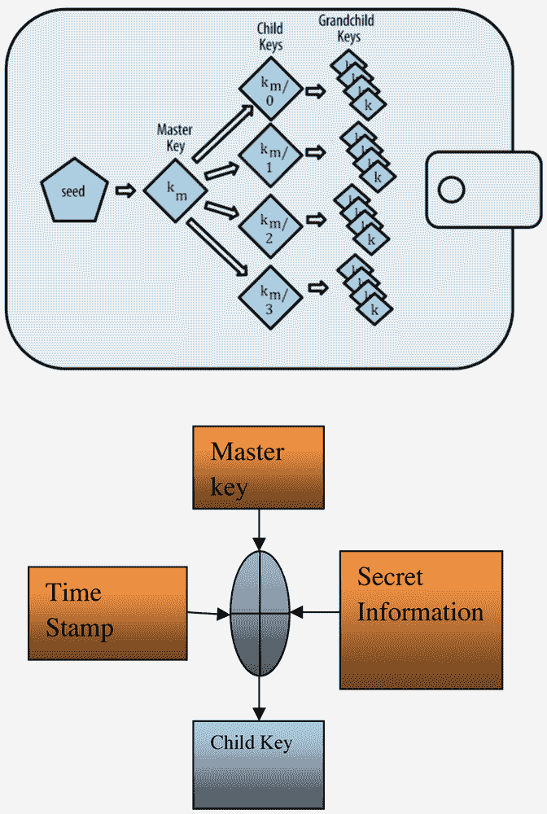 |

将作为秘密保留的主密钥的响应视为挑战，响应作为私钥（α）。从此私钥计算出公钥，从私钥，公钥被计算为β= αxG。在后续级别中，私钥和公钥对以相同的方式生成。在正常的私钥-公钥生成中，可能会出现两个响应相同的问题，但在 PUF 响应中，没有两个响应相同的机会。这似乎更像是颗粒中的沙的数量。

3.2\. PUF 比特币地址

PUF 比特币持有者必须生成比特币地址以向每个人发送货币。实际上，PUF 概念在一个设备中的制造变化的真实性与在另一个设备中的制造变化不等价，即使应用相同的输入。这种集成电路制造变化无法克隆。PUF-哈希是一个密码算法，即使是输入的单个位变化也会产生完全不同的摘要。此外，哈希函数是一个不可逆的单向函数，从输出获取输入的过程通常是一个困难的任务。因此，设备特定的 PUF 模块和输入特定的哈希函数将产生一个雪崩效应，以区分每个 PUF-比特币链。由于 PUF 的硬件模块减少了许多复杂的软件执行单元，处理时间、功耗和面积被最小化。总的来说，当对两个 PUF 设备应用相同的挑战时，这些设备的响应是不同的。因此，从 PUF 生成的密钥也不同。

| 图 2\. PUF 比特币地址生成 |
| --- |
| 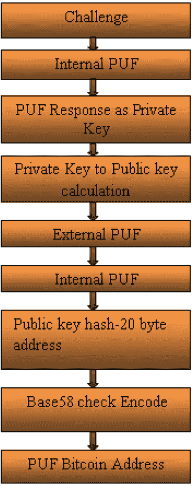 |

对 PUF 电路施加特定挑战（挑战可能是一个人的身份），从 PUF 生成的响应称为用户的私钥（K[Pr]）。椭圆曲线标量乘法过程应用于私钥 K[Pr]，以生成公钥（K[Pu]= K[Pr]xG）。这个公钥生成过程应该表现出单向性质；（即）从 K[Pr] 计算 K[Pu] 应该很容易，而从 K[Pu] 计算 K[Pr] 是一个困难的任务。

公钥比特币地址由以下规则从公钥派生：

+   1\. 首先，公钥通过外部和内部 PUF 哈希算法进行双哈希。

+   2\. 然后执行 Base58Check 编码操作以生成编码后的公钥哈希。

同样的事情也可以用 QR 码形式提供。实际上，在这一点上创建了三个单向属性。(1) PUF 挑战到响应（设备特定级别）(2) 私钥到公钥（公钥加密方式）(3) 公钥到公钥地址（哈希级别）。因此，即使交易中出现微小变化，也会导致后续交易哈希的完全变化。每个交易哈希都唯一标识了详细信息。PUF 比特币地址每个 PUF 都应该执行的整个过程如图 2 所示。PUF 本身充当单向函数，而不是软件哈希函数。如图 2 所示，挑战被用于派生私钥。然后，通过使用乘法算法，计算了公钥。然后，外部和内部 PUF 被用作哈希元素，而不是传统的哈希。

| 图 3\. PUF 私钥到比特币地址 |
| --- |
| 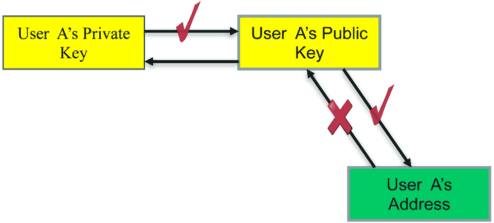 |

任何用户地址的单向属性如图 3 所示。

3.3\. 比特币交易

与内在 PUF 相比，外部 PUF 被认为更强大。所有比特币条目都记录在分类帐中。每个交易都用于创建下一个交易。所有网络中的节点都进行验证。因此，避免了比特币资金的欺骗和双重支付问题。与银行交易类似，金额的减少和增加以哈希形式存储在实施了区块链的比特币分类帐中。图 4 展示了连续交易的方法。

| 图 4\. 区块链交易 |
| --- |
| 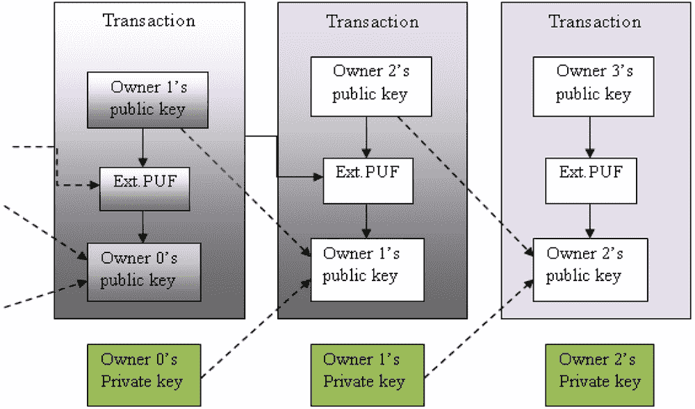 |

3.4\. 使用 PUF 数字签名锁定比特币交易

交易哈希主要由四个元素生成：(1) 交易金额 (2) 收件人地址作为输出 (3) 包括收件人地址的锁定脚本 (4) 时间戳。所有这些元素都一起进行哈希处理。这个过程由发送者的私钥的数字签名锁定。现在在提议的 PUF 区块链技术中，交易锁定由 PUF 响应执行。签名依赖于交易。在数字签名创建过程中，涉及到交易类型和 PUF 响应私钥。在数字签名验证过程中，参与挖矿过程的其他所有人都可以参与。只有预期的接收者才能声明交易。因为没有人能够复制 PUF 响应。

带 PUF 的 3.5 比特币账本

所有这些交易都以哈希码的形式维护在一个比特币分类帐中。如果爱丽丝从杰克和鲍勃那里得到钱，它们将以不同的哈希值表示。每个交易都以哈希函数的形式维护在比特币分类帐中（（JACK 到爱丽丝→）1021ab3582939214221 和（鲍勃到爱丽丝→）ab3582939211231）。哈希函数是唯一的，区分大小写和标点符号敏感的。例如，如果鲍勃向爱丽丝发送了 5 比特币（BTC），那么它将以表单编码的哈希形式记录在比特币分类帐中，如“1021ab3582939214221”。正如前面提到的，比特币是一个去中心化的分类帐，任何人都可以挖掘用户之间的交易。挖掘过程是通过附加的锁定和解锁过程进行的。在锁定过程中，将一个数学难题与接收者地址合并为锁定脚本。这个脚本是基于数字签名算法的。这个难题的数学答案是解锁脚本。正确解答难题的挖掘者可以要求这笔交易。发送者必须支付激励（0.00180736 BTC）来处理此交易。挖掘者的任务是在网络上收集新的交易，并将这些交易按照特定顺序组装成一个交易块。他们必须挖掘新的区块并更新区块链。

4\. **四面体振荡器作为内在 PUF**

本章讨论了比特币地址创建的两种 PUF 结构。在本章中，只集中讨论了内在 PUF 结构。

4.1\. 四面体环架构与行为

所提出的内在 PUF 被命名为四面体振荡器 PUF。四面体振荡器被用作逻辑门元件的竞赛路径。一个人的随机和独特的模式创建可能会利用不同的频率。四面体振荡器还利用了频率变化作为人的变化现象。相同类型的 PUF 用于比特币地址生成的两种不同情况，但使用不同的频率。四环由三个循环组成：所有循环都由简单的 NOT 门组成。第一个循环包含四个 NOT 门，其余两个循环包含两个 NOT 门。逻辑门的振荡亚稳态可以用于随机数生成。在本文中，信号路径传播产生了亚稳态以及独特的行为。图 5 显示了由 8 个反相器组成的三个循环的四面体振荡器结构。

| 图 5\. 四面体振荡器 PUF |
| --- |
| 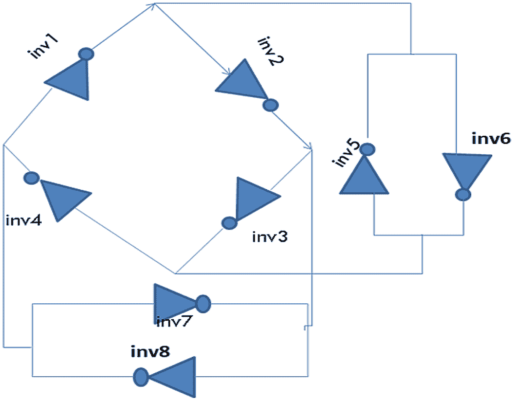 |

亚稳态条件（三个循环信号）导致整个电路中的瞬态振荡。这包括循环中的抖动条件。传统的环形振荡器环包含多个级联反相器。但在由 D.Liu 等人提出的四面体振荡器结构中，嵌套的 NOT 门循环彼此之间，使电路充满了有线 OR 逻辑和信号竞争，导致逻辑混乱并产生亚稳态。其次，噪声的扰动使得振荡更容易被激发。此外，由于不同循环之间的冲突，可以实现大的抖动以增强输出位的随机性。正如图 5 所示，振荡的次数不是特定的。而且，最终的逻辑电平可以不同（'0' 或 '1'），这引入了不可预测性。

4.2\. 四面体振荡器 PUF

如何修改四面体振荡器以创建 PUF 结构的方式在图 6 中显示。以某个特定频率运行的开关决定了上下振荡器的二进制位在此模块输出中是否累积。用户声称的身份决定了在相应时间，哪个振荡器必须给出输出。定时器开关以 8 毫秒的速度运行，每次流出 8 位。这个设计取决于用户的选择。

| 图 6\. 四面体振荡器 PUF |
| --- |
| 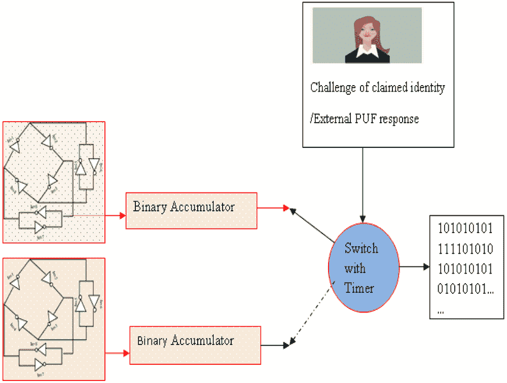 |

5\. 结果与讨论

本章将 SRAM PUF 视为外部 PUF 和四面体振荡器 PUF。概念主要集中在新引入的四面体振荡器 PUF 上。在实施方面，对于区块链实现，从参考资料（区块链演示，无日期）中的概念被作为模型采用。取代 Nonce，采用了 PUF 响应。已开发了分布式和单一基于区块链的模型。使用 SHA-256 哈希函数。Base56Encoding 方案在此工作中被利用。

| 图 7\. 单一区块链地址生成 |
| --- |
|  |

为了这项工作，一个简单的 PUF 原型已经生成，其中包括外部 PUF 和内部 PUF 电路。从套件中取出的随机数已经取代随机数生成器放在了生成比特币地址的位置。PUF 模块的长度为 128 位。

个别地，四面体振荡器 PUF 响应是由两个四面体振荡器构成的。各个振荡器的输出如图 8 所示。上部和下部振荡器仅在一些时间持续上有所不同。随机振荡的波形最初是正弦波。正弦波形首先转换为方波形，然后编码为二进制数。可以通过增加二进制累加器大小和编码大小来扩展它。给出 64 位挑战以获得响应。收集足够数量的二进制数后，对 PUF 性能指标进行了分析。有关 PUF 结构的详细信息请参见表 1。

| 图 8\. 上部和下部振荡器输出 |
| --- |
| 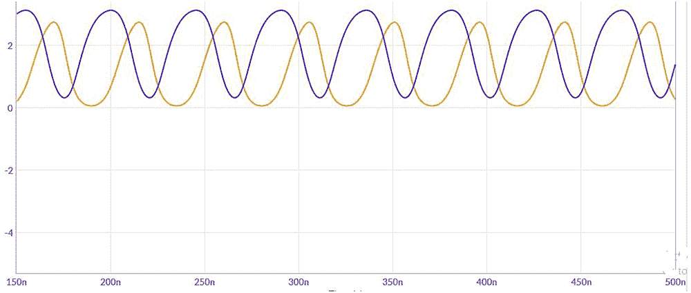 |

表 1\. PUF 性能细节

| PUF 度量和细节 | 计算值 |
| --- | --- |
| PUF 类型 | 内在四面体振荡器 PUF |
| 振荡器数量 | 每个 3 个网格的 2 个 |
| 生成的响应位数 | 128 |
| 挑战位数 | 64 |
| 独特性 | 51.07% |
| 可靠性 | 99% |
| 随机性 | 83% |

独特性是每个 PUF 都应具有的特性的一种度量，由 Maiti 等人解释（Maiti 等人，2010 年）。它不同于其他板的 PUF 响应。

 (1)

这是在 PUF 响应方面芯片间变异的估计。在这项工作中，取了 9 块 FPGA 板，因此这里的 k=9。

可靠性是一个衡量芯片在不同环境下（不同温度、不同电压等）如何有效地产生相同响应的指标。为了做到这一点，确定了在正常温度下的 PUF 响应 (Ri)。在不同温度下，计算相同实例的 PUF 响应 (Ri')，共计 m 次。使用以下公式计算响应之间的汉明距离

 (2)

然后通过以下公式计算可靠性

可靠性 = 100% - HD[INTRA] . (3)

HD [INTRA] 表示不可靠/噪声 PUF 响应位的平均数量。HD[INTRA] 的值应该低，并且在特定芯片实例中可靠性的值应该高。除此之外，PUF 响应应该容易找到，且难以预测挑战和证明设备的方法。二进制 1 和 0 的概率应该是均匀分布的。直角四面体振荡器 PUF 的直方图度量是通过 (Hori 等人，2010) 中给出的方法计算并显示在图 9,10,11 中。

| 图 9\. 生成的二进制位的随机性 |
| --- |
| 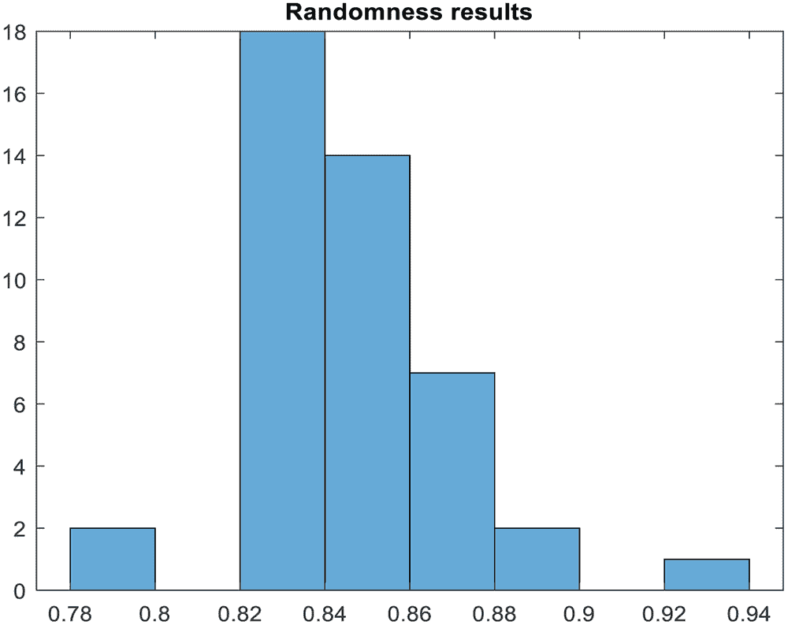 |
| 图 10\. 二进制位的二进制 1 的概率直方图 |
| 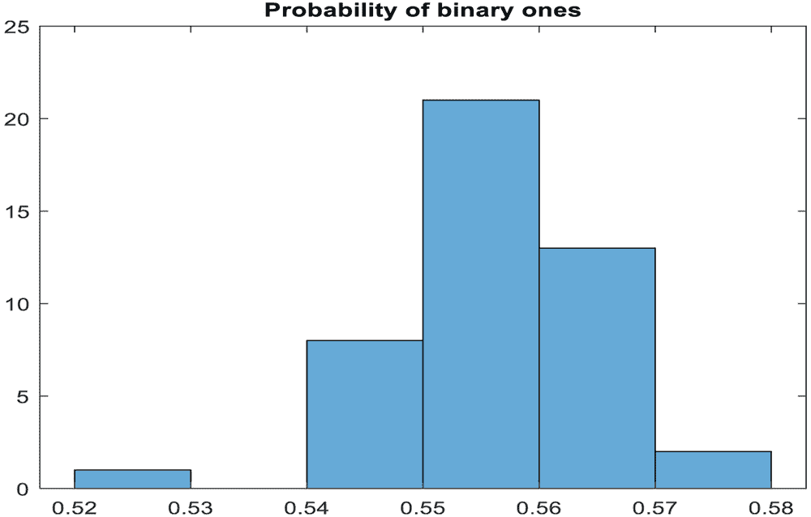 |
| 图 11\. 特定位的稳定性直方图 |
| 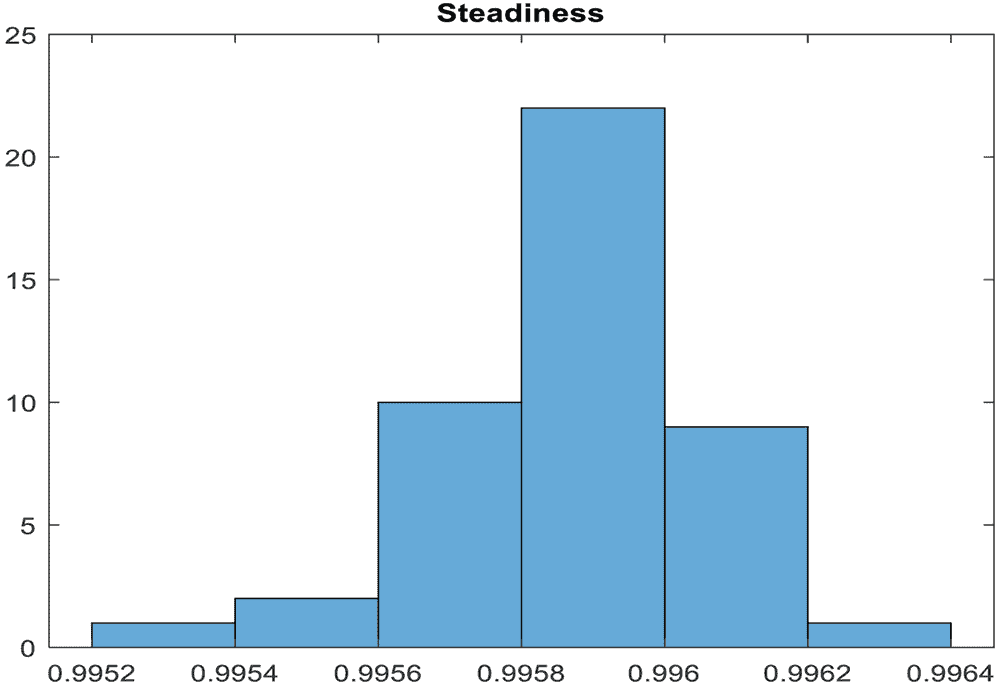 |

引入两个内在 PUF 电路和一个外部 PUF 电路，正确声明的身份和冒名顶替的身份被分开分类，并且彼此之间存在较大的距离。真正阳性的碰撞几率较低。图 12 显示了真实和冒名顶替者分布的分离。

| 图 12\. 真实和冒名顶替分布图 |
| --- |
| 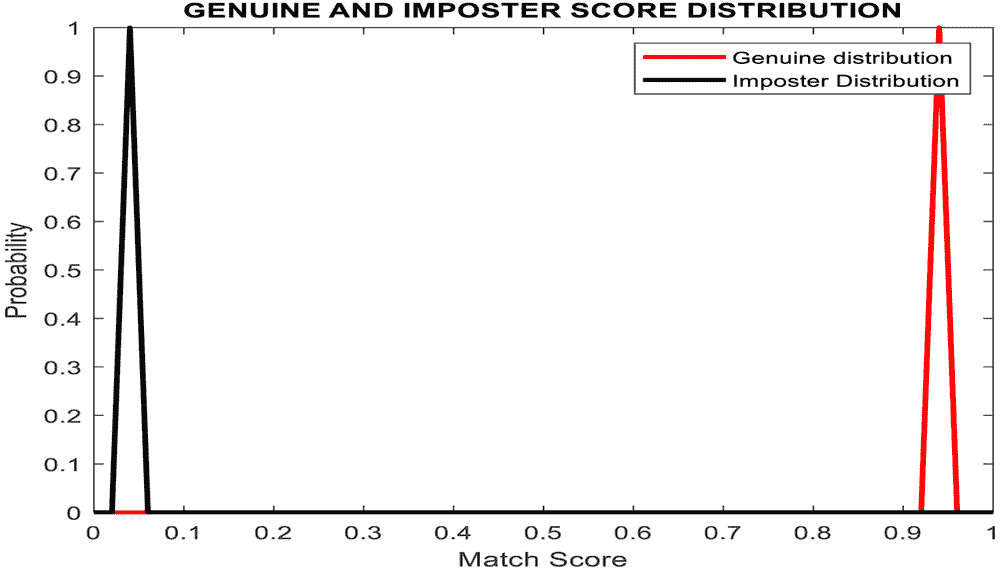 |

6\. 结论

区块链已成为去中心化账本交易最适用的领域。在物联网和敏感货币交易条件下，可以通过这种基于 PUF 的哈希生成功能声明设备身份验证。这种硬件基于比特币地址的生成可以实现准确的设备身份验证和相应的人员身份验证。也可以对特定人员进行工作证明。PUF 生成的数字很难受到机器学习攻击。因此，它对抗侧信道攻击更为强大。未来，对于实际应用，必须为特定应用程序开发特定的时间约束。

参考文献

15 区块链演示。 （无日期）。Anders Brown。检索自：https://andersbrownworth.com/blockchain/block

7 崔 P.，迪克森 J.，吉恩 U.，迪马斯 D.（2019 年）。供应链溯源的基于区块链的框架。IEEE Access：实用创新，开放解决方案，7，157113-157125。doi:10.1109/ACCESS.2019.2949951

6 堀 Y.，吉田 T.，片下 T.，SatohA.（2010 年）。基于 FPGA 的仲裁器物理不可克隆功能的定量和统计性能评估。ReConFig，2010，298-303。doi:10.1109/ReConFig.2010.24

11Intrinsic ID。 （无日期）。https://www.intrinsic-id.com/wp-content/uploads/2017/05/gt_KSI-PUF-web-1611.pdf

10JavaidU.AmanM. N.SikdarB. (2018). Blockpro：基于区块链的数据溯源和完整性，用于安全的物联网环境。在第 1 届区块链启用的网络传感器系统研讨会论文集中（第 13-18 页）。10.1145/3282278.3282281

4 刘 D.，刘 Z.，李 L.，邹 X.（2016 年）。基于低功耗低成本环振荡器的智能卡上真随机数生成器。IEEE Transactions on Circuits and Wystems. II，Express Briefs，63（6），608-612。doi:10.1109/TCSII.2016.2530800

5 迈蒂 A.，卡萨罗纳 J.，麦克黑尔 L.，施奥蒙特 P.（2010 年）。RO-PUF 的大规模特性化。硬件导向的安全与信任（HOST），IEEE 国际研讨会，94-99。

3Mohanty, Yanambaka, Kougianos, & Puthal. (n.d.). **PUFchain: 硬件辅助区块链，用于互联万物（IoE）中的可持续同时设备和数据安全**. IEEE Consumer Electronics Magazine, 9(2), 8-16.

2Muthukumar, Sivasankari, & Rampriya. (2019). **用于安全 AES 加密系统的抗衰老可控真随机数生成器**. International Journal of Systems, Control and Communications, 10(4), 338 – 355.

1Nakamoto, S. (2008). **比特币：点对点的电子现金系统**. White paper.

12Pal, Alam, Thakur, & Singh. (n.d.). **区块链技术的密钥管理**. ICT Express.

13Patil. (n.d.). **使用区块链智能合约和 PUFs 的高效隐私保护认证协议**. Academic Press.

14Prada-Delgado, M. Á., Baturone, I., Dittmann, G., Jelitto, J., & Kind, A. (2020). **PUF 衍生的物联网身份在区块链的零知识协议中**. Internet of Things, 9.

9RahimK.TahirH.IkramN. (2018). **基于传感器的 PUF 物联网认证模型，用于带私有区块链的智能家居**. 在 2018 年国际应用与工程数学会议上 (ICAEM) (pp. 102-108). IEEE. 10.1109/ICAEM.2018.8536295

8Venkatesan, Srivastava, & Shukla. (n.d.). **使用区块链的物联网设备的去中心化认证**. Academic Press.
