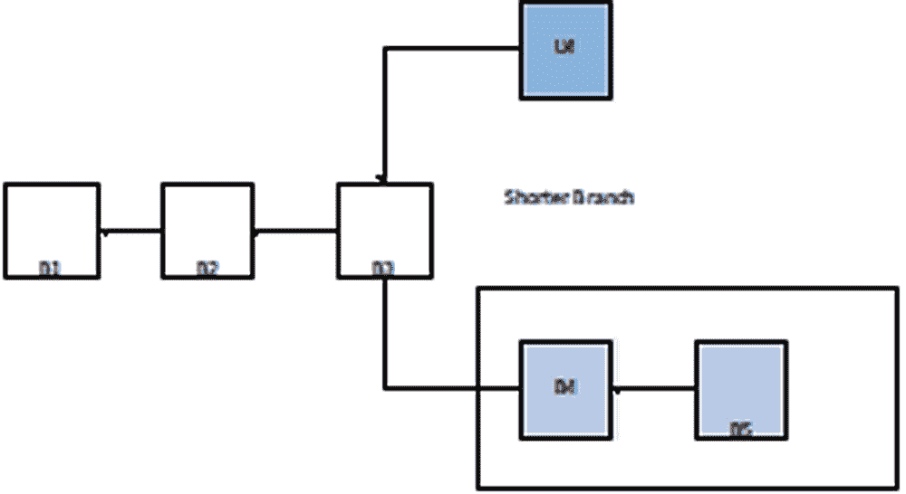

# 第九章

# 区块链革命：

企业界的适应性和实施挑战

+   Archana Sharma

    印度诺伊达管理研究所

+   Purnima Gupta

    印度诺伊达管理研究所

摘要

作为比特币的基础，区块链最近受到了广泛关注。区块链代表一种不可变的分类账，允许交易以分散的方式发生。基于区块链的应用程序非常广泛，例如金融服务、工业和供应链服务、法律和医疗保健服务、物联网和区块链集成、大数据分析等等。然而，区块链技术仍然面临诸多挑战，如安全性和分叉问题需要解决。本研究首先着重介绍了区块链技术及其架构，其次突出了与区块链相关的安全挑战和问题。进一步提出并比较了不同区块链中使用的各种典型共识算法。研究总结了区块链作为未来趋势的潜在前景。

引言

在当前情况下，信息技术在金融行业发展中发挥着重要作用。金融组织重构了彼此互动的方式。然而，这一领域的众所周知的实践和标准可能面临全面改革，因为像区块链这样的令人惊叹的创新正处于成熟阶段。

区块链最早是在九十年代初由斯图尔特·哈伯（Stuart Haber）描述的。2008 年，中本聪（Satoshi Nakamoto）通过比特币（Bitcoin）引入了区块链作为一种数字加密货币。作为基于网络协议的加密货币，比特币允许网络用户以安全的方式使用数字货币或虚拟货币进行交易，这些货币只能存在于他们的系统中。作为一系列区块，区块链在连接到对等网络的各种计算机上注册和维护交易的详细信息。每个区块记录最近的交易作为区块链的当前组成部分，并在完成后作为永久数据库维护在区块链中。完成每个区块后，会创建另一个区块。作为比特币的技术革命，区块链以交易的每个证明作为网络上的余额和地址。与银行交易一样，比特币的交易按顺序输入区块链中。由于开放性，整个系统以区块链的公共财产的形式维持安全性。交易是透明的，并验证所有者的真实性。区块链被认为是没有任何第三方验证的分散式架构，这对需要中心化架构或来自可信方的验证的传统业务流程构成了严重的干扰。区块链设计和架构的固有属性是鲁棒性、透明度、可审计性和网络安全性。作为分布式数据库，区块链组织了一系列有序的区块，并且已提交的区块被设置为不可变。由于已提交区块的不可变属性，没有人可以进一步更改它。区块链的类别决定了存储在区块中的数据内容。例如，比特币维护交易详细信息、转账金额、发送者和接收者信息。为了进行身份验证，每个区块都与一个独特的哈希相关联，类似于指纹。在创建区块时，哈希也同时计算，如果在同一区块中进行了任何更改，哈希也将发生变化。主要有三种类型的区块链：

私有区块链（需许可）：私有区块链中访问权限受限。网络管理员的许可是必要的，以加入区块链的参与者或验证者。通常，私有组织可能作为私有区块链运行，并不希望公开包含公司机密信息的区块的通信。

公共区块链（无需许可）：与私有区块链相对立，无限制的互联网成员可以加入无需许可的区块链并进行交易验证。

联邦区块链：它是公共区块链和私有区块链的融合。尽管联邦区块链与私有区块链具有相似的可扩展性和隐私性，但一个主要区别在于领导节点（一系列节点）被选中代替单个单位进行交易验证过程。

考虑到区块链的应用领域，公共区块链的知名执行包括比特币、莱特币、以太坊，以及广泛的大多数加密货币。主要优势是自维护网络、自我维护以及基础设施成本低，大幅降低管理开销。而在私有区块链中，主要的应用包括审计、数据库管理，通常是基于性能的解决方案。对于开放平台，Multichain 可以作为构建和组织私有区块链的示例。最后，联邦区块链广泛应用于银行业、商业组织和 IT 行业。还有各种其他应用领域也已部署区块链，如医疗保健、供应链、法律服务。

尽管区块链技术的特性可能带来额外可靠和便捷的服务，但这一创新技术背后的安全问题和挑战也是一个需要关注的重要话题。脆弱性包括端点脆弱性、公钥和私钥安全、供应商风险、缺乏标准和监管。区块链技术是通过密码算法、点对点通信、数学共识算法等组合形成的一种分布式数据库同步难度的内在多领域基础设施建设（Garay 等，2015; Gervais 等，2014; Nakamoto，2013）。区块链技术构建了六个关键要素。

+   • 去中心化：区块链的基本特性是不再需要依赖于集中式节点，数据可以以分散的方式记录、存储和更新。

+   • 透明性：区块链结构记录的数据对所有节点都是透明的，对于更新数据也是透明的，由于这一点，区块链可以被认为是可靠的。

+   • 开放源代码：大多数区块链分类对所有人都是开放的，可以公开确保记录，公众也可以使用区块链技术根据需要生成任何应用程序。

+   • 自主性：由于得到共识的支持，区块链组织上的所有节点都可以安全地重新分配或更新数据，建议是从一个特定的人转变到整个系统，没有人可以干涉。

+   • 不可变性：一些记录将永远被保留下来，并且除非有人能够同时控制 51%的节点，否则不能更改。

+   • 匿名性：区块链技术解决了与节点之间的信任问题，因此数据传输或交易可以是匿名的，只需知道个人的区块链地址。

理论背景

区块链是通过比特币作为加密货币引入的。比特币是一种在没有中央权力支持的情况下控制电子现金的机构，因此必须有一个系统来防止未经授权的用户可能进行的数据欺诈、支付重复和其他类型的威胁和攻击活动。为了实现这一目标，比特币利用了许多不同的基本技术，包括 P2P、公钥加密、哈希、数字签名和工作证明。区块链的这些基础技术的详细信息如下：

比特币：点对点系统中的电子现金

作为一种加密货币，比特币同意在对等系统中转移数字资产，而无需任何第三方的信任支持，比特币是全球范围内被广泛使用和高度重视的数字货币（中本聪，2008 年；Narayanan 等，2016 年）。在比特币中，一个区块的完整序列对于维护每个硬币的所有权至关重要。为了维护每个区块的所有权，通过指向链中前一个正确区块的指针建立了一个链接，上一个区块的哈希被维护以形成一个链表结构。

| 图 1\. 简化的区块链 |
| --- |
|  |

区块链从起始区块到结束区块的总数被称为区块高度。一般来说，区块链会持续增长，由于这种持续增长，对于验证过程会需要大量的计算资源。为了保持体量和计算尝试的合理性，比特币提出了梅克尔树的简化支付验证支持（中本聪, 2008 年）。

散列函数

使用输入值 I 生成一个固定大小字符串形式的哈希值 h，并将其分配给哈希函数 H。通过这种机制，只有在给定正确输入的情况下才会生成相似的哈希值。利用哈希值对原始输入值进行假设是非常复杂的。比特币利用计算哈希值的方法来确保发现数据失真并验证区块链记录的持久性。

| 图 2\. 哈希机制 |
| --- |
|  |

公钥密码学与数字签名

公钥和私钥对于数字货币转账的区块链来说是重要组成部分。作为非对称密码学，它使用一对密钥进行加密和解密。通常，公钥可以被世界上任何人访问，并且可以通过使用接收者的公钥对消息进行加密，将消息转发给接收者。接收者的私钥仅在接收者端用于消息解密（Bergstra & Leeuw，2013）。

| 图 3\. 数字签名 |
| --- |
|  |

通过公钥密码学，数字签名验证了以数字形式发送的消息的合法性。它提供了认证、不可否认性和完整性，包括这些特性，验证了比特币交易的所有权，以及比特币钱包地址（Badev & Chen，2014）。

时间戳服务器

比特币提出了一个时间戳服务器，用于对交易区块进行时间戳和广泛发布哈希。时间戳建立了交易的关联链，并且所有时间戳都包含在其哈希内的前一个时间戳中。

| 图 4\. 时间戳服务器 |
| --- |
|  |

时间戳服务器旨在证明数据必须一直存在（Nakamoto，2008）。

默克尔树

每个带有默克尔树支持的比特币区块都维护了区块内每个交易的汇总。默克尔树作为一种数据结构，已被用于总结和完整性验证大量数据。作为二叉树，默克尔树也可能只有两个子节点（刘等，2015）。默克尔树是使用哈希函数创建的，并在一对节点上递归执行，直到识别出单个哈希作为默克尔根。比特币的默克尔树哈希算法 SHA256 的加密已应用两次，从底部到顶部发展默克尔树。它不存储交易，而是将交易数据进行哈希处理，并将哈希结果维护在每个子节点中。由于默克尔树的二进制性质，在交易数为奇数时，最后一个交易将被复制以维持偶数个子节点。默克尔树允许丢弃多余的交易而不侵犯块的哈希，因为不维护内部哈希。

| 图 5\. 默克尔树 |
| --- |
|  |

在默克尔树中，可以进行简化的支付验证（SPV），而不是执行完整的网络节点。用户需要维护最长工作量证明链的区块头副本。用户除了网络接受它之外，没有交易访问权限。

作为一个点对点网络，区块链网络也通过加密算法维护节点网络和功能。交易的通信和验证过程由网络节点处理，这些节点还通过从头到尾的交易生成合法块，并确定资源激励任务（PoW）来抵抗收入（交易费）。比特币网络运行以下步骤：

+   • 数字签名的新交易被传输到每个节点。

+   • 一个区块包含每个节点收集的新交易。

+   • PoW（工作证明）正在由节点计算其区块。

+   • 节点确认 Pow 后，将区块传输给所有其他节点

分布式哈希表

分布式哈希表作为一种分散的数据结构通常用于积累与键相关的条目。此外，作为两个主要组件，被视为地址的键和值可以是链接到该地址的文件内容。因此，用户被允许通过条目找到一个键，就像通过名字（地址）查找电话号码（键）一样。DHT 广泛用于构建和管理复杂的服务。例如，BitTorrent 正在使用 DHT 来进行哈希表的目的，使其成为解决任何问题的潜在方法。"（图 6）

| 图 6. 分布式哈希表 |
| --- |
|  |

分布式分类帐技术

作为目录，分布式分类帐旨在促进多个位置或与多个参与者合作。区块链技术也被称为 DTL。DLT 提到了一种创新和快速的机制，用于跨多个分类帐共享、记录和存储数据。这项技术允许我们通过分布式网络与不同网络参与者共享、交易和记录数据。根据分布式分类帐技术的理念，每个参与者都可以访问共享分类帐。基于区块链技术的思想首次应用于比特币加密货币的基础技术。它还提供了一种在没有第三方介入的情况下保持数据安全的方法（Mills 等人，2016）。

分布式分类帐类型

分布式账本技术可以是无需许可的（公共的）或需要许可的（私有的），它们之间有基本的区别。以太坊和比特币是完全无需许可的区块链的最流行的例子，而 Codra 和 Hyperledger Fabric 则是一个著名的例子。

公共账本

公共账本也称为非许可账本，任何人都不需要许可来创建和验证区块以及通过存储和更新数据修改账本状态。它为每个人提供了访问和存储数据的透明度。在这种技术中，不需要任何实体的预先批准，网络参与者可以随意加入或离开网络。它没有所有者来控制它。记录的同质副本分发给所有网络参与者。这引发了对特定情况的隐私关注，其中这些数据的隐私需要受到保护。

私有账本

私有账本，也称为权限账本，顾名思义，它是受限制的，这意味着只有受信任和授权的实体才被允许参与账本活动。分布式账本的成员是由账本的所有者或管理员事先选择的。他们还控制网络访问并设置账本的条例。与其公共对应物相比，它是受限制的，因为只有授权和受信任的实体才能参与账本内的活动。通过仅允许授权实体，私有账本可以确保账本数据的隐私，在某些用例中可能是可取的。

私有账本，也被称为权限账本，顾名思义，它是受限制的，这意味着只有受信任和授权的实体才能参与账本活动。分布式账本的成员是由账本的所有者或管理员事先选择的。他们还控制网络访问并设置账本的规则。与其公共对应物相比，它是受限制的，因为只有授权的实体才能参与账本内的活动。通过仅允许授权实体，私有账本可以确保账本数据的隐私性，这在某些用例中可能是可取的。

表 1. 公共账本与私有账本

|  | 公共账本 | 私有账本 |
| --- | --- | --- |
| 访问 | 对所有人公开读写 | 对所有人公开读写 |
| 中央方 | 没有中央所有者或管理员 | 具有一定程度的管理或控制 |
| 网络参与者 | 不相互了解 | 相互了解 |
| 速度 | 慢 | 快 |
| 身份 | 用户身份匿名 | 所有者要求进行身份验证 |
| 本地代币 | 是 | 不必要 |
| 安全性 | 通过广泛分布在大规模网络中实现安全性 | 通过小规模网络中的访问控制与分布式账本技术相结合实现安全性 |
| 开放性 | 账本是公开透明的 | 不同程度的开放性和透明度 |
| 信任级别 | 网络成员无需彼此信任 | 网络成员需要更高程度的信任 |

| 示例 |      • 比特币      • 以太坊

• Manero

• Zcash

• Steemit

• Dash

• Litecoin

• Stellar 等。 |      • R3（银行）      • EWF（能源）

• Corda

• 超级账本 Fabric

等。 |

超级账本 Fabric

[超级账本面料（Hyperledger Fabric）](https://wiki.example.org/hyperledger_fabric)是 IBM 在 Hyperledger 项目下发展出来的。Hyperledger 是一个开源区块链项目。它已经由 Linux 基金会发展壮大。超级账本面料首次实现于 2015 年。超级账本面料提供了一个高特权网络，成员可以在其中交互、交换和追踪数字化数据。这个面料被设计来支持不同功能的实现，也允许使用各种编程语言，比如 GO 语言来实现链码，并且通常运行在 Docker 容器内。它是一个运行链码的分布式平台。在超级账本面料中，交易遵循有权限的账本和保密性。由于网络是私有的，每个想要参与交易的用户都必须在网络中注册以获取他们对应的 ID。面料账本还提供了审计性以满足监管需求。模块化的架构提供了高比例的韧性、灵活性、实施和设计中的保密性。（Sajana 等人，2018 年）。

Corda

这是一种专注于金融应用的分布式分类账技术（DLT）。它旨在为金融用例结构提供支持。记录的开放程度和透明度可以有各种不同的程度。这是一个许可网络，这意味着所有参与者必须具有相应的可验证身份才能参与任何交易。成员之间需要更高程度的信任。Corda 与其他公共分布式分类账平台（如以太坊和比特币）之间的一个主要区别是使用区块链来记录交易。Corda 也是一个 DLT 平台，但不使用区块链来记录交易。Corda 由超过 70 家金融机构组成的私人公司 R3 管理。它提供了非常高的信任水平。使 Corda 与一些著名金融网络（如瑞波和恒星）不同的强大功能之一是其智能合约功能。它由一个大型开发者社区组成，他们可以使用 Kotlin 和 Java 编写代码，在 Corda 中开发 DApps（Chowdhury 等，2019 年）。

IOTA

IOTA 是为物联网（IoT）设计的自由可用的分布式分类账。它旨在增强未来物联网的功能。它提供了物联网设备之间的安全通信。IOTA 的分布式技术不是由区块链驱动的传输链。其共识构建结构由基于 Tangle 的有向无环图（DAG）组成。每个顶点表示一个交易的网络由一条边连接。IOTA 的交易没有成本且可扩展。它的交易速度非常快。IOTA 使用 Tangle 解决了大多数分布式分类账面临的交易费用和可扩展性问题。IOTA 避免了集中化，它通过交易而不是矿工或持币者增长。IOTA 旨在成为物联网（IoT）的 m2m 经济的支柱（Chowdhury 等，2019 年）。

区块链应用

数字货币：比特币

比特币的交易系统及其数据结构是基于区块链技术开发的，这使比特币成为在线支付系统的数字货币。资金的转移可以通过加密技术安全地完成，而无需信任任何第三方银行。公钥被用于发送和接收比特币，交易记录和个人 ID 是未签名的。交易过程进一步需要用户的计算能力来获得共识，然后向网络记账。

智能合约：以太坊

智能合约作为数字合约组织用户的数字财产，规划参与者的权利和责任，将会由计算机系统自动执行。它可以被视为参与者之间的合约，并允许他们接收和响应消息，除了存储数据。此外，智能合约还可以向外部发送消息。作为一个可信的权威或者个人，智能合约也可以暂时持有资产并执行已经编程好的指令（Kosba 等，2016）。作为一个开源的区块链，以太坊平台处理合约结合了智能合约，并提供了一个去中心化的虚拟机。通过使用以太币（ETH），这被称为其数字货币的用户可以在该平台上创建各种应用程序、服务或合约（Watanabe 等，2016）。

Hyperledger

与以太坊类似，Hyperledger 区块链也是一个由 Linux 基金会于 2015 年 12 月发起的开源平台，用于维护分布式账本。它关注于维护被认为是维护全球商业交易的账本，与主要的金融、供应链公司和技术一起，以提升性能和可靠性的多个方面。为了建立开放协议和一套标准，各种独立的努力被整合在一起，提供一个维护不同组件用于不同目的的模块化框架。这将包括一系列具有各自存储模型和共识的区块链，以及身份、合约和访问控制服务。

其他应用

金融服务

目前，区块链技术已在广泛的金融领域得到应用，包括商业服务、金融资产结算、经济交易和预测市场。区块链在全球经济可持续发展、目前银行结构下消费者的利益以及整个世界普遍受益方面都扮演着重要角色（Nguyen，2016 年）。

全球金融组织正在考虑采用基于区块链的应用程序来管理金融资源，如法定货币、证券和衍生合约（Peters 等，2016 年；Fanning & Centers，2016 年；Kosba 等，2016 年）。例如，区块链技术提议对资本市场进行巨大改变，并提供了更高效的方法来执行衍生品交易、证券和数字支付等流程。

保险理赔处理

理赔处理对于理赔处理人员来说经常是一个未解决的、棘手的任务。保险工作站需要经历从头到尾的、分阶段的事件、伪造案例和难以处理的客户等问题，这大大增加了不准确和错误分类的风险。区块链可以在这种情况下提供一个理想的框架，无需任何风险和公开性地处理案件。其加密功能使保险公司可以确保处理过程安全可靠（Mota 等人，2017 年）。

法律服务

“智能合约”是一种用于自动化协议的计算机代码，是一种自动执行的数字协议，记录并执行两个或更多人之间的协议。与传统合同不同，它的本质是自我执行的，也就是说，智能合约的结果已经直接编码到合同本身中（Legalwise，2019 年）。传统的区块链允许计算机网络构建一个可信的、去中心化的、自动化的系统，是这种智能合约的权威。这些数字合同可以更有效地执行，而且不需要人类参与，从而增加结果的确定性。

医疗管理

医疗保健行业是另一个区块链技术可以在各种领域的应用中发挥重要作用的领域，如公共医疗保健管理、自动化健康索赔结算、纵向医疗报告、分享患者的健康检查数据、在线患者访问、以用户为导向的医疗研究、药品伪造、临床试验和精准医学（Juneja&Marefat，2018 年）。通常情况下，区块链技术与智能合约一起可以解决临床检查中的科学权威问题（终端切换、数据丢失、选择性发布和数据搜索）以及患者知情同意问题。

商业和工业应用

区块链有望通过改进和自动化业务流程，在行业和管理方面成为重大的颠覆性发展基础。在当前情况下，物联网和区块链正在崛起，基于此，已经开发了许多电子商务模型。区块链应用似乎提出了实质性的性能提升和商业化前景，提高了电子商务的可靠性，并促使物联网企业在减少时间和成本的同时优化其流程。基于区块链的应用程序可以为许多企业提供去中心化的交易流程组织。在这种情况下，所有业务流程示意图都可以保留在区块链上，并且工作流路由可以由智能合约进行，从而改革和自动化企业内部流程，并减少成本（Mendling 等，2018 年）。

供应链管理

区块链技术很可能提升供应链系统的透明度和责任性，从而实现额外的灵活价值链。特别是，基于区块链的应用有潜力在供应链的三个领域实现改进：优化、可见性和需求。区块链可以在物流、识别假冒产品、减少纸质文件处理、促进资源追踪以及允许买家和卖家直接进行交易而无需通过中间人（Subramanian，2017）方面发挥作用。此外，已经证实，基于区块链的应用在供应链网络内的处理将能够处理安全性，引领第三方和第四方物流（3PL、4PL）之间更加健全的合同管理系统，以应对信息不一致性，改进跟踪系统和可追溯性声明，提供更好的整个供应链信息组织，通过先进的数据分析（即加密的消费者数据）和原始推荐系统提供更好的客户服务，改进跨复杂供应链的库存和性能管理，并最终改进智能运输安排并提出新的分散式开发设计。

与区块链实施相关的各种问题

区块链是由交易记录组成的数字块，通过公共或私有网络传输。区块链记录的安全性可以通过加密来确保。然而，共识和不可变性的概念是区块链网络中的核心安全和隐私关注点，但区块链网络的安全取决于网络的基础设施。基础设施具有防止所有类型用户访问敏感信息、防止非法数据更改请求或尝试，并使用最高安全机制来防范黑客攻击的能力，是区块链网络基础设施的基本安全要求。公共、私有和混合区块链是不同的，因此提供了不同强度的安全性。公共区块链与互联网等公共网络通信，以便任何独立节点都可以加入，但私有网络只允许已知网络加入。匿名性是区块链通常被设计的原则，而身份是私有区块链用于确认访问权限的关键术语（Zhang 等，2019 年）。

对区块链的攻击

多数攻击

通过多数攻击（51%攻击），攻击者可以对区块链网络造成严重的网络中断，这是对区块链网络的潜在攻击，在这种攻击中，攻击者试图管理主要部分的哈希费用。 如果攻击成功，可以阻止区块链网络上的交易，但攻击不允许侵入者撤销其他方的交易。 通过这种攻击，无法阻止在区块链网络上创建和提交新交易。然而，随着链的增长，更改先前确认的块变得更加困难，因为一个块获得的确认越多，更难以改变和撤销交易。 由于先前交易的硬编码，历史块无法更改。 Krypton 和 Shift 是两个基于以太坊的区块链网络，于 2016 年 8 月遭受了多数攻击。 Bitcoin Gold 也在 2018 年 5 月遭受了一次多数攻击，攻击者成功地进行了双重支付（Lin＆Liao，2017 年; Saad 等，2019 年）。

双重支付

双重支付是一种应用导向的攻击，指的是通过区块链网络上的冲突交易，在一个快速的会话中两次花费货币，这将破坏对服务提供商的信任。验证交易的所有权对阻止双重支付和其他欺诈行为至关重要。先前的研究结果表明，要在像比特币这样的大型区块链网络上执行双重支付攻击，需要非常大量的计算能力，这对于任何个人都是不可能的。对于较小的区块链网络来说，安全风险仍然存在。在网络上种植此类攻击后，攻击者的身份可能会被揭示，如果有两笔连续生成的交易以实施攻击，则这些交易将被转移到未确认的交易池中。第一笔交易将被授权，第二笔将被标记为无效交易。如果两笔交易都被验证为合法并从组中拉取，那么具有最大确认数的交易将被合并到链中，其他交易将被丢弃（Vokerla 等人，2019 年）。

芬尼攻击

**Finney 攻击** 是由矿工发起的，他在他的区块中挖掘或控制他的交易内容，而这个区块并没有被广播到网络上。与先前交易相关的货币现在被用于第二笔交易，之后先前挖掘的区块再次释放。这种行为会导致其他矿工在拒绝第二笔交易时产生一定的时间延迟。如果卖家没有等待足够的确认，就可能导致供应发生两次。这种类型的攻击只有在卖家接受了未经确认的交易时才会成功。假设在找到区块和卖家接受付款之间需要的时间是 t，以及搜索区块的平均时间是 T，那么在同一网络上找到另一个区块的概率将是 t/T 时间单位。攻击不会成功，攻击者也不会从区块 B 中获得任何利益。尝试攻击的标准成本为 (t/T)*B。假设 V 是交易的价值，则卖家必须至少等待 t=V*T/B 才能释放供应。Finney 攻击由于短区块间隔和时间敏感的攻击程序而具有较低的成功概率。比特币和以太坊的区块时间分别为 10 分钟和 15 秒（Saad 等人，2019）。

**暴力攻击**

在这种攻击中，入侵者尝试为现有钱包的数字签名密钥尝试大量可能的密码，并检查返回的明文以确定其准确性。 攻击时间和尝试次数取决于密钥大小。 这种类型的攻击用于从诚实用户那里窃取比特币。 首先，攻击者使用与当前区块链状态相关联的当前未使用交易输出集合创建具有一些资金的比特币地址列表。 然后，攻击者从提取的交易列表中选择一些密钥集，并构建密钥列表。 然后从密钥列表中选择一个密钥，并生成相应的地址。 然后将生成的地址与第一阶段生成的地址列表中的地址进行匹配。 如果找到该地址，则攻击者发布交易以从被攻击的地址获益到他们的地址。 所有这些操作都针对列表中的所有密钥重复进行（Vokerla 等人，2019）。

自私挖矿攻击

这种攻击   这种攻击也被称为区块阻挡攻击。在这种攻击中，一个恶意攻击者会损害网络的完整性。在自私挖矿的情况下，只涉及恶意矿工。恶意矿工隐藏/阻挡挖掘出来的区块，损害其他诚实的矿工，并让他们对区块链网络的完整性失去信任。在这种情况下，诚实的矿工感到困惑，浪费了他们的资产在无益的课程上。由于矿工增加了无效的区块或者阻挡了有效的区块，增加有效区块变得非常困难。自私的矿工将维护他们的私有链，并公布它以获取更多的奖励，这是由于他们的贡献献性方法。对矿工进行区块链分支的随机分配并设置挖矿池的阈值限制可以消除这种类型的攻击（Vokerla 等人，2019 年；Saad 等人，2019 年）。

Sybil 攻击

在这类攻击中，攻击者会 compromise 客户端系统，并通过区块链进行交易。一个虚假的软件或多个假帐户、节点或计算机可以被视为攻击区块链的媒介。这是由一组被 compromise 的节点执行的社区攻击。"Sybil" 这个词来自一个患有多重人格障碍的女人的名字，名叫 "Sybil Dorsett"。如果攻击者创建了许多假帐户，他们可以拒绝接收或传输区块，以阻止其他用户执行区块传输。如果多个帐户创建给予了控制最大所需的哈希率的能力，那么攻击者可以发起多数攻击。通过使用不同类型的共识算法，如权益证明、工作证明或委托权益证明，可以消除对区块链协会上这种恶意活动的安全执行，从而使攻击过程变得非常不切实际。提高创建新身份的成本，实施信任管理协议，在创建新身份之前对用户权力进行加权，可以大大降低在区块链网络上发动攻击的可能性（Vokerla 等，2019）。

Fork 问题

区块链网络基于彼此合作的去中心化的一组参与方（节点）。当区块链软件参与更新过程时，Fork 问题就出现了。区块链网络的每个节点都会验证区块链的公共分类帐并确保区块链网络的安全性。当启动新软件更新时，参与区块链系统的每个节点的协议规则也会发生变化。这一事件导致所有节点分裂为两组。一组接受更新并同意遵循新更新的交易规则，另一组则放弃更新并继续遵循旧的交易规则。这种冲突导致链被分裂（分叉）成两部分（林，I.C.，＆廖，T.C.，2017 年）。

社区对于新协议的意见分歧导致出现了两种不同类型的方法（问题）。硬分叉问题指的是社区中部分人不同意协议的升级版本或新协议。如果有足够的旧节点拒绝软件升级，他们可以继续遵循完全不同的链，即使新节点的计算能力比旧节点更强。

软分叉可表示为向后兼容。当社区接受新协议时，它与旧协议不兼容，并拒绝挖掘旧链。大多数节点应该升级到新协议以使软分叉生效，并在分叉后使网络更加安全。由于两种类型节点的计算能力存在差异，新节点从未同意批准由旧节点挖掘的区块，同时两种类型的节点继续保持相同的链。就像硬分叉一样，在升级时软分叉从不减少系统的效力和完整性。软分叉被应用于比特币和以太坊区块链中（林＆廖，2017 年）。

建议

区块链作为一个分布式的去中心化网络旨在提供不可变性和数据安全性。由于没有中央权力来验证和验证交易，在区块链中的所有交易都被认为是安全的和经过验证的。由于区块链是建立在去中心化模型中并在瞬间处理大量交易，可能存在现实复杂性的可能性。关键是就一种方法或另一种方法达成共识，否则可能会发生恶意行为，如双重支付攻击。因此，共识算法的作用变得至关重要。

共识算法是计算机科学中一种设置在分布式系统中跨越单个数据值的协议的方法。作为协议，在共识算法中，区块链网络的所有团队或用户都向着对账本的当前数据位置达成普遍一致（共识），并能够相信分布式计算背景下的未知对等方。共识算法在区块链网络中非常重要，因为它们作为基本要素维护了这些分布式计算系统的完整性和安全性。在区块链中，实现在不可信节点之间的共识的方法是拜占庭将军问题（Lamport 等人，1982）的一场革命。在这个问题中，一群将军控制着城市四周的一部分拜占庭军队。一些将军倾向于进攻，而其他将军则倾向于撤退。然而，如果只有一部分将军进攻，攻击就会失败。因此，他们必须达成一致（或共识）以进攻或撤退。在分布式环境中实现共识的方式是一个挑战。区块链也面临相同的挑战，因为它的网络是分布式的。需要确保不同节点中的账本是一致的。

在区块链中达成共识有几种一般方法。

共识方法

工作证明（PoW）

工作证明是比特币网络中应用的一种共识方法（Nakamoto S., 2008）。在一个去中心化的连接集中，必须选择某人来记录交易。最好的方法是随机选择。然而，随机选择容易受到攻击。因此，如果节点希望生成一个交易块，必须做大量的工作来证明该节点不太可能攻击系统。

表 2. 典型共识算法比较

| 属性 | PoW |    PoS |  |   PBFT |   DPOS |  |   Ripple |  | Tendermint |
| --- | --- | --- | --- | --- | --- | --- | --- | --- | --- |

| 节点身份管理 | 开放否

<25%

计算能力

比特币 [2] | 开放部分

<51%

股份

Peercoin | [21] | 许可是的

<33.3%

有故障的副本

Hyperledger Fabric [18] | 开放部分

<51%

验证者

Bitshares | [22] | 开放是的

<20%

有故障的联合国

Ripple | 节点 [23] | 中 | 许可是的

<33.3%

拜占庭投票权

Tendermint [24] |

| 节能 |
| --- |
| 对手的容忍力 |
| 例子 |
| 图 7. 工作证明过程 |
|  |

图 7 展示了区块链分支（最长的分支被承认为主链，而较短的分支将被抛弃）的计算发展。在工作量证明中，网络的每个节点都计算一个块头的哈希值。随机数和块头的矿工会经常修改随机数以获得不同的哈希值。共识规定计算出的值必须等于或小于某个特定值。一旦一个节点达到目标，它将把块传输给其他节点，每个节点必须共同完成哈希值的准确性。如果块被验证，其他矿工将把验证过的块添加到他们的区块链上。计算哈希的节点称为矿工，比特币的工作量证明过程被称为挖矿。

分布式网络的验证块可能会在许多节点几乎同时找到适当的随机数时一起生成。因此，分支可能会产生，如图 7 所示。但是，两个相互对立的分支同时生成下一个块的可能性很小。

股权证明

证明股权作为共识可能与使用基于网络申请者投资的方法的 PoW 挖矿共识不同。在这种情况下，不同于执行哈希函数，验证者主要以代币或数字货币的形式投入资源。每个块的验证者是根据所拥有的计算能力的数量从持有者中随机选择的。

所有 PoS 方案都可以以不同的方式实施该算法，通常，区块链通过一个伪随机选择过程来保护，该过程旨在确定节点的分配和分发，从而确定参与者确保网络安全的保证。以开发者活动为基础的世界上最大的区块链网络以太坊区块链已经开始从 PoW 算法转向 PoS，以努力提高网络的可扩展性，同时减少不必要的电力浪费。

实用拜占庭容错

这是一个接受拜占庭错误的复制算法（Miguel & Barbara, 1999）。在这个算法中，Hyperledger Fabric 利用了类似 PBFT 的共识算法，因为 PBFT 可以承受多达 1/3 的恶意拜占庭限制。大约在所有轮次中，都会识别一个新的块。在所有轮次中，都会根据各种规则选择一个人。此外，它还负责组织交易。整个过程可以分为三个部分：预准备、准备和提交。在所有阶段中，如果一个节点获得了超过所有节点的 2/3 的投票，则该节点将进入下一个阶段。因此，PBFT 要求每个节点都被网络认可。与 PBFT 类似，（SCP）Stellar 共识协议（Mazieres D.,2015）也是一个拜占庭容错协议。在 PBFT 中，所有节点必须查询其他节点，而 SCP 则赋予参与者选择其他参与者集合的权利来相信。客户不需要担心欺诈性的委托，因为他们可以毫无疑问地被指定出去。DPOS 是比特股的支柱。

瑞波

Ripple 是一种共识协议，利用了较大网络中受信任的子网络（Schwartz 等，2014）。在这种情况下，网络的节点被分为两类：参与共识过程的服务器和仅用于传输资金的客户端。所有服务器都有一个独特的节点列表（UNL）。对服务器来说它是至关重要的。一旦决定将交易存入账本，服务器会询问 UNL 中的节点，如果获得了 80%的认可，交易就会填入账本，对于一个节点来说，只要 UNL 中破损节点的比例低于 20%，账本就会保持准确。

Tendermint

Tender mint 是一种拜占庭共识，大约在几轮内确定一个新的区块。一个提议者可能被选中在当前轮次广播未完成的区块。它可能被细分为三个步骤：1）Prevote 步骤。认证机构选择是否对预期区块进行预投票。2）Pre-commit 步骤。如果节点收到了超过预期区块的 2/3 的投票，它就会传送对该区块的预提交。否则如果节点已收到超过 2/3 的重新提交，它会进行委托步骤。3）Commit 步骤。节点对区块进行验证，并传送验证过的区块的提交。如果节点已经收到了 2/3 的提交，它就会承认该区块。与 PBFT 不同，节点需要限制他们的硬币以成为验证者。一旦认证者或验证者被发现是欺诈的，它将被处罚。

一种高质量的共识算法表明了安全性、效率和及时性。近年来，为改进区块链共识算法已取得了一些成就。新的共识协议旨在解决区块链的一些特定问题。PeerCensus（Decker 等人，2016 年）的首要提议是将区块形成和交易最终化分开，以显著提高共识速度。

可能的未来发展方向

区块链已在商业和学术界展现出潜力。研究集中在其未来潜在指导方针上，涉及四个领域：区块链测试、向中心化的趋势、大数据分析和与区块链相关的物联网。

区块链测试

近年来，不同类型的区块链出现了，迄今为止，加密货币市场资本化记录了 700 多种加密货币。然而，一些开发人员可能会伪造他们的区块链演示，以吸引追求巨大利润的投资者。此外，当用户希望将区块链融入商业时，必须清楚哪种区块链符合他们的需求。因此，区块链测试方法需要能够检验不同的区块链。

区块链测试可以分为两个部分：标准化和测试阶段。在标准化阶段，每个标准必须得到完成和解决。尽管区块链很直观，但它必须符合已批准的标准，以确定区块链是否按照开发者的意愿运作良好。至于测试阶段，区块链测试需要根据不同的标准进行。例如，负责在线交易的用户会关注区块链的吞吐量，因此测试需要调查从客户发送交易到交易打包进入区块链的平均时间。

中心化倾向

区块链旨在成为一个去中心化的系统。尽管如此，矿工倾向于在采矿组中联邦化。到目前为止，前 5 个采矿组共同拥有比特币网络中总体哈希控制的 51%以上。除此之外，自私的挖矿方法表明，拥有整个计算能力的 25%以上的群体可以获得比公平分配更多的利润。均衡的矿工将参与自私的群体，最终，该群体可以轻松超过整个计算能力的 51%。由于区块链并不打算为少数组织提供服务，因此应该设计几种技术来解决这个问题。

大数据分析

区块链可以与大数据很好地共享。现在，它只是将分组分类为两类：数据管理和数据分析。在数据管理方面，区块链可以用于积累重要数据，因为它是分散且安全的。区块链可能还能确保数据是新的。例如，如果区块链用于积累患者的健康详情，这些信息将不会受到干扰，而且很难窃取个人的私人内容。而当它转向数据分析时，区块链交易可以用于大数据分析。

物联网和区块链

物联网代表着不同事物之间的互联。对象一词指的是人类、传感器或可能是任何可以请求或提供服务的东西。物联网的目的是将物与物相连接，将物与人连接，以及人与人连接（Mosenia & Jha, 2016）。它对于识别、管理和控制很方便。各种物联网应用的主要重点是自动化其任务并赋予物体能力。自动化物体执行不同任务以支持各种物联网应用。主要关注使物体有能力，在没有人类参与的情况下运行。

物联网安全目标

物联网应用承诺给我们的生活带来巨大的变革。如果我们消除安全威胁的障碍，那么物联网可以帮助我们使生活变得智能和便利。在广泛运用计算技术、无线网络和先进传感器的支持下，物联网已成为下一个前沿。安全三元素是通过使用三个主要领域提供的杰出技术：数据完整性、保密性和可用性。数据保密性是通过使用不同的技术来提供对机密数据隐私的信心，以防止其泄露给未经授权的方，并且只能被授权用户访问。数据保密性通常通过不同的机制来支持，如数据加密或访问控制（Zhang 等，2019 年）。数据完整性指的是数据在其生命周期内的准确性和一致性。它可以通过两个对象之间或存储的数据信息的两次升级之间的修改的缺失来指示。数据完整性可以通过校验和和循环冗余校验来验证。数据可用性确保授权方能够在正常情况下和不良条件下立即访问其信息资源（Sharma 等，2019 年；Adat 和 Gupta，2018 年）。

使用区块链的物联网安全

如今，通过物联网账户已连接了 50 亿台设备，这一数字将继续增加，并在 2022 年达到 29 亿台（Reyna 等，2018 年）。每个物体都在互联网上生成和传输数据。由于物联网具有分布式架构，因此对安全性至关重要。通常，在物联网网络中，每个节点都是可能的风险点，可用于发动网络攻击。在数据漏洞攻击存在的情况下，无法正确利用物联网数据。此外，在涉及到物联网智能应用的许多情况下，其中设备交换数据、计算能力或其他资源，数据安全性变得至关重要（Sridhar 和 Smys，2017 年）。区块链技术已成为解决所有安全问题的非常有效的解决方案。区块链和物联网是两种吸引人的技术，它们旨在提高用户的整体透明度、可见性、舒适度和信任级别。将区块链实施到物联网中带来了一些改进，如去中心化和可扩展性、身份、自主性、可靠性、安全性和服务市场。区块链背后的基本思想很简单，它使用了分布式账本技术。区块链中的条目是按时间顺序和时间戳的。账本中的每个条目都使用加密哈希键与前一个条目紧密耦合（Panarello 等，2018 年）。

**物联网与区块链的整合**

物联网可以从区块链提供的各种功能中获益，并有助于进一步改进现有的物联网技术。区块链可以在物联网应用程序中起到重要的数据安全保护作用。目前，这两种技术是研究中最突出的主题。这种方法的结合可以带来革命性的变革（Reyna 等，2018 年）。物联网与区块链整合的一些好处如下：

+   -   身份认证：参与者可以通过共同的区块系统识别每个设备。系统中提供和存储的数据是不可更改的，并且能够唯一识别设备提供的实际数据。因此，对于物联网应用来说，区块链可以提供一个经过授权和可信的环境。

+   -   去中心化和可扩展性：架构的去中心化有助于提高容错性和系统的可扩展性。从集中式架构转向对等分布的架构的其他好处将消除单点故障和退步。

+   -   自主性：区块链帮助物联网设备在没有任何服务器的情况下相互关联。区块链技术赋予了下一代物联网应用功能，使其成为自主对象。

+   -   可靠性：借助区块链的支持，物联网信息可以保持上传时的状态。区块链系统能够检查数据完整性，并提供确保数据未被篡改的保证。区块链最重要的方面之一就是提供可靠的物联网。

+   -   速度：区块链在一分钟内即可将交易分发到整个网络，任何时候都可以进行处理。

+   -   安全的代码部署：区块链提供不可更改的存储。相关代码可以安全地上传到设备上。

| 图 8\. 物联网和区块链集成的好处 |
| --- |
|  |

将物联网与区块链集成时，必须确定这些交互将在何处进行。有各种集成方案：

物联网 - 物联网

由于它可以脱机工作，因此在安全性和延迟方面速度最快。物联网交易可以在不使用区块链的情况下进行，因为仅有少部分物联网数据存储在区块链中，如图 9 所示。这种方法在处理安全物联网数据时特别有用，其中物联网交互具有低数据延迟。

| 图 9\. 物联网到物联网 - 区块链集成 |
| --- |
|  |

物联网-区块链

当这种方法被应用时，所有交互都通过区块链进行。所有选定的交互都是可追溯的，因为它们的记录可以通过使用这种方法在区块链上访问。它还确保了物联网设备的自治性。在区块链中记录所有增加带宽和数据的交易的一个常见复杂性。甚至与该交易相关的所有物联网数据也应存储在区块链中，如图 9 所示。

CONCLUSION

区块链通过其关键特征：去中心化、持久性、隐私和可审计性揭示了其改变传统业务的潜力。这项研究探讨了区块链的综合摘要。在第一阶段，它重点介绍了区块链技术的一般概念，以及区块链架构和区块链的主要特征。此外，在下一阶段，研究概述了几个可能阻碍区块链发展的安全挑战和问题。除此之外，研究还讨论了区块链中用于维持这些分布式计算系统的完整性和安全性的独特共识算法。这些意识到的协议在不同的视角下进行了分析和评估。还讨论了各种潜在的未来方向，如与区块链的大数据分析、物联网和区块链集成。目前区块链支持的应用正在不断增长，这项研究致力于深入探讨当前和未来各个业务领域的基于区块链的应用，以及与之相关的安全挑战。

REFERENCES

Adat, V., & Gupta, B. B. (2018). 物联网安全: 问题、挑战、分类法和架构。 电信系统 , 67(3), 423–441\. doi:10.1007/s11235-017-0345-9

Badev, A., & Chen, M. (2014). 比特币：技术背景与数据分析。学术出版社。

Bergstra, J. A., & de Leeuw, K. (2013). 与比特币和其他信息货币相关的问题。arXiv 预印本。arXiv1305.5956。

Chowdhury, M. J. M., Ferdous, M. S., Biswas, K., Chowdhury, N., Kayes, A. S. M., Alazab, M., & Watters, P. (2019). 分布式账本技术平台的比较分析。IEEE Access：实用创新，开放解决方案，7，167930–167943。doi:10.1109/ACCESS.2019.2953729

Decker, C., Seidel, J., & Wattenhofer, R. (2016). 比特币遇见强一致性。在《分布式计算和网络第 17 届国际会议(ICDCN)》论文集中。新加坡：ACM。

Fanning, K., & Centers, D. P. (2016). 区块链及其对金融服务的即将影响。《公司会计与财务杂志》，27(5)，53–57。doi:10.1002/jcaf.22179

JunejaA.MarefatM. (2018). 利用区块链重新培训深度学习架构进行特定于患者的心律失常分类。2018 年 IEEE EMBS 生物医学与健康信息学国际会议，BHI 2018，393–397。10.1109/BHI.2018.8333451

KosbaA.MillerA.ShiE.WenZ.PapamanthouC. (2016). Hawk：区块链密码学和隐私保护智能合同模型。2016 年 IEEE 安全与隐私研讨会（SP'16），839–858。10.1109/SP.2016.55

Lamport, L., Shostak, R., & Pease, M. (1982). 拜占庭将军问题。ACM 编程语言与系统交易，4(3)，382–401。doi:10.1145/357172.357176

Legalwise. (2019). 澳大利亚和新西兰区块链技术智能合同的崛起。可在: https://www.legalwiseseminars.com.au/news/smart-contracts-and-the-law/ 获取。

Lin, I. C., & Liao, T. C. (2017). 区块链安全问题和挑战的调查。《网络安全国际期刊》，19(5)，653–659。

Liu, C., Ranjan, R., Yang, C., Zhang, X., Wang, L., & Chen, J. (2015). MuR-DPA：基于自上而下级别化多副本 Merkle 哈希树的云端动态大数据存储的安全公共审核。IEEE 计算交易。

Mazieres, D. (2015). 星际共识协议：互联网级共识的联合模型。Stellar Development Foundation.

Mendling, J., Weber, I., Aalst, W. V. D., Brocke, J. V., Cabanillas, C., Daniel, F., Debois, S., Ciccio, C. D., Dumas, M., Dustdar, S., Gal, A., García-Bañuelos, L., Governatori, G., Hull, R., Rosa, M. L., Leopold, H., Leymann, F., Recker, J., Reichert, M., & Zhu, L. (2018). 用于业务流程管理的区块链-挑战与机遇。ACM 管理信息系统交易，9(1)，4。doi:10.1145/3183367

MiguelC.BarbaraL. (1999). 拜占庭容错实用性。第三届操作系统设计与实现研讨会论文集，99，173–186。

Mills, D. C., Wang, K., Malone, B., Ravi, A., Marquardt, J., Badev, A. I., ... Ellithorpe, M. (2016). 付款、清算和结算中的分布式账本技术。学术出版社。

Mosenia, A., & Jha, N. K. (2016). 互联网物联网安全的综合研究。IEEE 计算新兴主题交易，5(4)，586–602。doi:10.1109/TETC.2016.2606384

Mota, A. V., Azam, S., Yeo, K. C., Shanmugam, B., & Kannoorpatti, K. (2017). 安全数据传输的不同加密技术的比较分析。IEEE 国际电力、控制、信号与仪器工程会议，ICPCSI。10.1109/ICPCSI.2017.8392158

Nakamoto, S. (2008). 比特币：点对点电子现金系统。学术出版社。

Narayanan, A., Bonneau, J., Felten, E., Miller, A., & Goldfeder, S. (2016). 比特币与加密货币技术：综合介绍。普林斯顿大学出版社。

Nguyen，Q. K.（2016 年）。区块链——未来可持续发展的金融科技。绿色技术和可持续发展第 3 届国际会议论文集，GTSD 2016，51–54。

Paech，P.（2017 年）。区块链金融网络的治理。现代法律评论，80（6），1073–1110。doi:10.1111/1468-2230.12303

Panarello，A.，Tapas，N.，Merlino，G.，Longo，F.，& Puliafito，A.（2018 年）。区块链与物联网的整合：系统调查。传感器（巴塞尔），18（8），2575。doi:10.3390/s18082575

Peters，G. W.，& Panayi，E.（2016 年）。通过区块链技术理解现代银行分类帐：未来货币互联网上的交易处理和智能合约。新经济窗口。doi:10.1007/978-3-319-42448-4_13

Reyna，A.，Martín，C.，Chen，J.，Soler，E.，& Díaz，M.（2018 年）。关于区块链及其与物联网的整合。挑战与机遇。未来一代计算机系统，88，173–190。doi:10.1016/j.future.2018.05.046

Saad，M.，Spaulding，J.，Njilla，L.，Kamhoua，C.，Shetty，S.，Nyang，D.，& Mohaisen，A.（2019 年）。探索区块链的攻击面：系统概述。arXiv 预印本 arXiv:1904.03487。

Sajana，P.，Sindhu，M.，& Sethumadhavan，M.（2018 年）。关于区块链应用：Hyperledger fabric 和以太坊。纯粹与应用数学国际期刊，118（18），2965–2970。

Schwartz，D.，Youngs，N.，& Britto，A.（2014 年）。涟漪协议共识算法。涟漪实验室白皮书。

Sharma，P.，Tripathi，S. S.，& Panda，R.（2019 年）。物联网安全问题调查。学术出版社。

SridharS.SmysS.（2017 年 1 月）。基于加密的物联网设备智能安全框架的端到端安全架构。在 2017 年国际创新系统和控制会议（ICISC）中（第 1-5 页）。IEEE。10.1109/ICISC.2017.8068718

Subramanian，H.（2017 年）。去中心化的基于区块链的电子市场。ACM 通信，61（1），78–84。doi:10.1145/3158333

VokerlaR. R.ShanmugamB.AzamS.KarimA.De BoerF.JonkmanM.FaisalF. (2019). 区块链应用与攻击综述. 在 2019 年国际通信与网络新趋势视觉会议(ViTECoN)上(pp. 1-6). IEEE. 10.1109/ViTECoN.2019.8899450

渡边浩, 藤村聪, 中平明, 宫崎阳, 阿久津明, 岸上淳. (2016). 区块链合约：保障智能合约的区块链. IEEE 国际消费电子会议(ICCE’16), 467–468. 10.1109/ICCE.2016.7430693

张瑞, 薛瑞, & 刘磊. (2019). 区块链安全与隐私. ACM 计算调查, 52(3), 1–34. doi:10.1145/3316481
