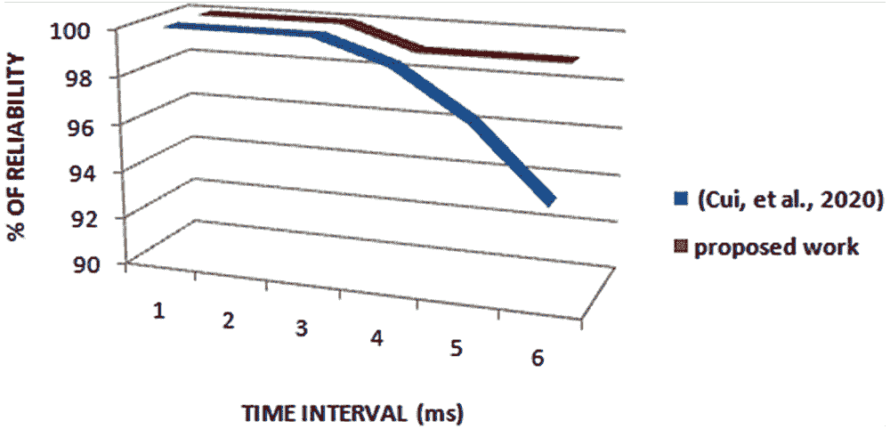
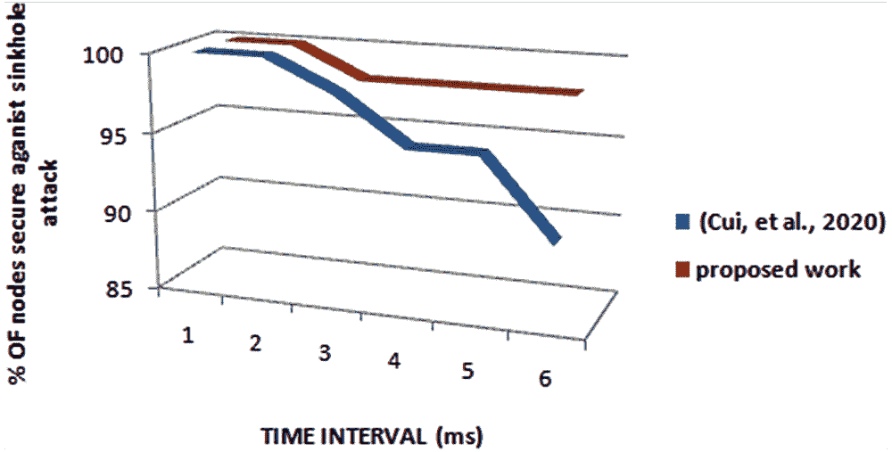

# 第十章

# 一种可靠的基于混合区块链的物联网网络认证系统

+   安比卡·N。

    

    印度班加罗尔 Sivananda Sarma 纪念 RV 学院计算机应用系

摘要

物联网是由不同规格和功能的设备组成，共同致力于实现一个共同的目标。区块链是一种计算机记录，其中包含系统上进行的所有交易的完整历史。建立了一个多-WSN 布置模型。根据其功能，物联网的节点分为基站、集群头和传统节点，这有助于节点的管理和协作。提出了一种混合区块链模型。为了更好地适应多-WSN 布置模型，根据不同节点的功能和能源，分别在集群头节点和基站之间部署本地区块链和公共区块链，并形成混合区块链模型。提出了一种物联网节点的共享认证方案。对于集群头节点，作者们使用全球区块链进行认证，对于传统节点，则使用本地区块链进行认证。该提议旨在通过与之前贡献相比，提高可靠性 1.17%，并将 sinkhole 攻击最小化 2.42%。

1\. 引言

物联网，即 IoT（Alaba，2017）（Ambika N.，2019），是多种规格和功能的各种供应品的集合，朝着一个共同的目标发展。它们通过提供给它们的共同平台进行彼此之间的交流。IoT 中的设备（Khan＆Salah，2018）远程控制以执行所需功能。然后，设备之间的信息共享通过网络使用通信的标准协议进行。智能连接设备或“物品”范围从试验性可穿戴配件到大型机器，每个都包含传感器芯片。安装在某个区域进行监视的监控摄像头可以在世界任何地方进行远程监视。其他智能设备执行各种功能。例如，在医院监测手术（Ambika N.，2020），家庭监控（Al-Ali，Zualkernan，Rashid，Gupta 和 Alikarar，2017），检测天气条件，在汽车中提供跟踪和连接以及使用生物芯片识别动物等，已经满足了特定社区的需求。通过这些设备收集的数据可以实时处理以提高整个系统的效率。

区块链（A＆K，2016）是一个数字化的记录，其中包含了在系统上进行的所有交易的完整历史记录。它是通过引入可信的数字货币来消除中介方的一个基本原因。它是一系列由随时间产生的哈希值连接的区块。区块链上的所有数据都是永久性的，无法更改。我们定义为区块链技术的发现、估值和量子转移的网络范式。这项技术在政治、人道主义、社会、经济和科学领域都有着自己的作用。

这项发明利用了加强比特币的技术。区块链是一种开放记录，它去中心化了一个无需信任的系统，可以在互联网上将资金从一个点转移到另一个点。该技术旨在解决双重支付问题。对于这种技术的使用，中间人的信任并不必要。它是公钥密码学和 BitTorrent 点对点文件共享的结合体。它通过加密协议和挖矿网络确认了一部分币的所有权。发生的交易会添加到记录中。需要两个因素 - 一个私钥和钱包软件。使用这些凭据可以让卖家在互联网上进行交易。钱包软件可能会记录所进行的交易。在公共记录文档中使用的技巧包括文档库、事件存储、身份和事件。它控制、跟踪和交换任何资产。标准算法将技术引入使用。计算会将文件转换为 64 字符的代码。它确保生成的哈希代码无法恢复源文件。交易使用哈希代码和时间戳。源文件是从所有者的计算机中检索出来的。

先前的研究（Cui 等，2020 年）使用了混合区块链系统。它是私有和公共系统的混合体。该系统由不同类型的设备组成。汇聚节点收集数据以进行进一步的分析。部署常规设备感知并传输处理后的数据给组长。客户在经过身份验证后将获得感知数据的访问权限。汇聚节点和客户使用公共区块链系统。而中间的组长和常规设备使用本地系统。

该贡献是对先前建议的增强。节点使用标识和以太网地址来生成散列值。汇聚节点将能够将设备的地址映射到以太网地址。使用相似以太网地址的其他受损设备将早日引起注意。与先前工作相比，可靠性提高了 1.17%。

这项工作分为七个部分。提案的动机在第二部分。文献调查紧随贡献的动机。第四部分详细描述了提案。对贡献的分析讨论在第五部分。第六部分讨论未来工作。写作在第七节总结。

2\. 动机

物联网是由智能传感器和执行器组成的物品。这些设备是智能的，能够从经验中学习。这些无人监督的设备需要网络安全。先前的贡献（Cui 等人，2020 年）使用了混合区块链系统。它是私有区块链和公共区块链的混合体。该框架包括不同类型的设备。汇聚节点收集数据以进行进一步分析。常规设备部署感知并传输处理后的数据到组头。客户端在经过身份验证后将获得感测数据的访问权限。汇聚节点和客户端采用公共区块链系统。组头和常规设备之间使用本地区块链。

对手可以捕获节点并适当地进行修改。一个标准设备在早期阶段将无法检测到它。因此，可靠性对于这些系统至关重要。该提案试图通过提高可靠性和安全性来为网络设备带来信任。

3\. 文献调查

这一部分讨论了之前对该领域的贡献。一个多传感器网络排列模型（Cui 等，2020）被构建。物联网中有许多中心（Ambika N.，2020）。物联网的设备根据其功能隔离为基站、集群头和传统中心，这有助于它们的管理和协作。为了适应多传感器网络排列模型，在集群头和基站之间分别部署了更好的本地区块链和公开链，以及混合区块链模型。它提出了物联网中的节点的共享验证方案。为了提高物联网验证的可扩展性，作者采用了层次化的区块链模式。对于集群头，作者使用全局链进行验证。对于传统中心，他们使用本地链来进行验证。

验证方案的总体目的是允许多个节点在不受信任的网络上进行一致的通信。在工作中（Hammi, Hammi, Bellot, & Serhrouchni, 2018），作者考虑了一个拥有许多物品提供和使用各种物联网服务的系统，以融合或适当的设计。这些设备与众多其他物品进行通信。交换的消息经过不稳定且可能丢失的通信网络。我们方法的主要目标是在物联网环境中创建安全的虚拟区域。每个设备必须只与其区域的设备进行通信，并将其他设备视为恶意的。这是一个带有认证机构的气泡主体结构。任何设备都可以成为主体。此外，每个制造系统的项目被称为 Follower。每个 Follower 生成一个椭圆曲线（EC）私钥/公钥对。每个 Follower 都有一个称为票据的结构，它代表 64 位轻量级证书。

该贡献提出了带外两因素确认（Wu、Du、Wang 和 Lin，2018）方案，以改进验证和批准流程。可选验证因素可识别家庭物联网设备和房外恶意设备，无论恶意工具是否使用正确的访问令牌模仿真实物联网设备。它询问执行者的室温。它可以根据当前的度量改变颜色。代理从链中检索相同的关系数据。代理选择与未经身份验证的设备靠近的相关设备。它将操作序列发送给相关设备。待认证的设备通过将序列代码编码到开/关灯开关中来接收并执行操作序列。相邻的相关设备解释了嵌入在灯开关中的代码。相邻的相关工具通过调用区块链上智能合约的功能向链发送验证结果。代理通过智能合约检查链以获取确认结果。

创作者（Huh、Cho 和 Kim，2017）利用了一些物联网设备，而不是许多设备。他们还使用了一个手机和三个树莓派。它们充当着一个用于监控能源消耗的仪表、一个空调和灯光，因为使用真实设备，比如一个空调框架，会需要太多的开销。使用手机，用户可以设置这个配置。例如，当能源消耗达到 150 千瓦时，用户可以将设备设置为节能模式。当用户通过手机设置了配置后，数据发送到以太坊网络。例如，灯光或空调定期从以太坊检索策略值。此外，仪表监控能源使用情况，并将其更新到以太坊上。因此，三个不同的周期同时进行。以太坊部署到计算平台上。

在多节点架构中（Li、Peng、Deng 和 Gai，2018），设备的身份信息注册到区块链中。每个设备的 ID、公钥、试验数据的哈希以及其他信息都存储在区块链记录中。同时，每个仪器都是区块链网络中的一个节点，共识机制确保每个节点存储相同的信息。每当发生分布式通信时，公钥密码学使用在物联网设备之间进行身份验证。系统流程分为三个阶段。所有设备在认证之前都需要在区块链上完成注册。当设备需要访问该配置时，它将使用区块链中的注册信息进行验证。经过验证后，设备检查主要数据哈希的完整性，以发现潜在的入侵行为。

工程（Almadhoun, Kadadha, Alhemeiri, Alshehhi, & Salah, 2018）由五个主要成员构成，通过互联网可以访问以太坊合同：管理员、终端用户、迷雾节点和负责托管物联网数据的云工作节点。物联网设备确实具有以太坊地址。所有其他成员都具有特殊的以太坊地址（EA），并通过以太坊客户端（对于迷雾和云节点）或管理员和终端用户的前端应用程序/钱包直接与合同接口。智能合同的所有者可以添加其他用户作为管理员。管理员的任务是管理系统中物联网设备和迷雾节点的注册和注销。管理员通过智能合同授予终端用户访问物联网设备的权限。迷雾节点使用的这些权限值用于验证用户访问物联网设备的权限。一旦用户通过智能合同被授予访问权限，他们就会联系负责处理目标物联网设备的指定迷雾节点进行验证和访问。智能合同包含所有注册迷雾节点及其管理的相关物联网设备的规划。这些设备管理对物联网设备的访问。每个迷雾节点都在管理和处理一组物联网设备。系统中的每个物联网设备都计划为一个设备。云主机注册和存储服务器完成并存储物联网数据。

一种集中而敏锐的一致性协议（Ourad, Belgacem, & Salah, 2018）验证客户与其特定的物联网设备之间的连接。客户验证以太坊钱包地址。如果客户是合法的，则智能协议会传达一个访问令牌和发送者的以太坊地址。客户和物联网设备从智能合约获取传输的数据。客户制作一个包含访问令牌、用户 IP、访问时长和以太坊公钥的数据包。该数据包使用以太坊私钥签名，然后与相应的公钥一起发送。如有需要，该数据包可以进行加密。在这种情况下，消息的签名是至关重要的诚信问题。当物联网设备收到数据包时，它会验证其内容。验证成功后，设备将根据指定的时长允许来自发送者 IP 的用户访问。否则，如果任何一个检查失败，请求将被拒绝。

在周期开始时（Puthal，Mohanty，Nanda，Kougianos 和 Das，2019），网络中的个体参与者/节点生成带有数据的交易（Trx）并将其合并到一个区块中。设备广播区块以进行进一步评估。该模型使用 ElGamal 加密方法。在节点广播之前，源节点使用其私密凭证进行签名并公开其密钥，可供所有人使用。它信任网络内的工具进行区块验证。随着每个验证区块，受信任的节点获得信任值。通过获取源节点公钥，它准备评估其有效性。签名仅通过使用凭证进行验证。基于离散对数问题属性，当已知其他值时，无法计算该值。在签名验证后，受信任的节点还检查第二轮评估的 MAC 值。节点在验证后使用 PoAh 识别将区块广播到网络。此后，网络中的设备从链中找到 PoAh 数据。单个设备计算区块的哈希值并将其保留以链接下一个链，并且新计算的哈希值存储在当前链中以维护链的连续性。

CertCoin（Jiang 等人，2019）的核心思想是维护用户身份及其相关公钥的开放记录。该系统包含六个主要功能：注册与相应凭证相关的身份，更新密钥，搜索与给定身份对应的线索，否认与身份对应的公开解决方案，恢复与身份对应的线索，以及挖矿。

BATM 模块（Moinet, Darties, & Baril, 2017）融合了一个称为人类知识为基础的信任模型（HKT），赋予了人类般的行为以维持每个节点的声誉水平。HKT 是系统中所有设备共享认识的一种折衷。它是一个信任位置的存在。他们利用区块链中包含的有效负载作为时间上每个节点在网络中的行为的指示。作者保证一个节点不能通过篡改数据或假装成另一个人来欺骗其他人。因此，该工作确保了信任评估的可靠性，而无需信任位置。接下来的发展将专注于网络节点的信任评估。相同的原则适用于可用服务，区别在于可用服务的声誉水平在网络中的每个节点上都有所体现，因此，使用它的每个设备上的声誉水平都会调整。该工作通过比较网络节点的当前声誉水平来进行信任评估，以相信他在网络中进行某些活动。贡献利用与区块链相关的活动，并将它们与信任水平联系起来。该水平评估了一个节点被信任以实现结果事件的最低声誉水平。该工作考虑了两种类型的规则：时钟，关键有效性中断以及先前描述的事件声誉因素。

跨领域确认工具（Shen 等人，2020）正在区块链头部运行。基于个性的签名（IBS）和瞬时椭圆曲线 Diffie-Hellman（ECDHE）凭证交易过程在验证和密钥理解周期中使用。特别是，IBS 验证设备。在基于 IBS 的系统中，当设备作为申请者请求由另一个设备作为验证器确认时，验证器需要根据某些基本参数验证由申请者使用申请者的公钥生成的标记的合法性，其中包括空间申请者的居住地。所提出的工具中存在一些任务，包括 IIoT 设备，密钥生成中心（KGC），区块链代理服务器（BAS）和认证代理服务器（AAS）。它们通过它们的功能将它们分成不同的层。KGC 被包括在实体层中，因为它们在 IBC 系统中是最小的角色。BAS 和 AAS 是为特定任务引入的两个任务特定服务器。另外两个层包括区块链层和存储层。区块链层可以被视为区域特定信息共享的普通安全通道。区块链存储最少的信息，即位置标识符及其由统一资源标识符（URI）和计算出的哈希值组成的配对值，该哈希值基于历史区域特定数据。URI 指向位于互联网上的实际存储文件。

物联网（IoT）设备与区块链安排相关联（Gagneja & Kiefer，2020）。系统管理员信任一方，该方在服务器上使用区块链与处理资产相关的使用来代表物联网设备执行密集的工作。区块链包含包含主要数据字段的块，以提供物联网的模拟网络区块链的基础。发送方数据字段保存将消息添加到区块链的物联网设备的 ID。接收方数据字段具有用于签署通信的公钥。该数据字段用于设备介绍和由消息的指定接收方物联网设备的 ID 生成共享会话凭证。纯文本数据字段保存消息或指令。签名数据字段具有使用凭证的物联网发送方的签名。该数据字段考虑使用区块链与其他物联网设备共享公开签名验证密钥。上一个哈希数据字段使用上一个哈希块。当前数据字段具有使用 SHA 函数计算的当前块的哈希值。时间数据类别具有预定周期内块生成的小时。证明数据主题具有产生由区块链参数指示的有效哈希的工作证明。物联网设备连接到连接到云或边缘计算群组的网关，以进行许多哈希计算。通过循环遍历区块链中的所有块并对每次迭代检查三个条件来验证区块链。起始块在纯文本数据字段内设置区块链参数。

BCTrust（Tian、Su 和 Liang，2019）传达在以太坊区块链上，这在全球拥有最佳记录，有一个跟随它的网络，并允许在其上构建应用程序。 它保证了安全的交易，并且，例如，比特币，以太坊在大规模上进行了测试。 在智能合约中，只有一组值得信赖的节点才具有区块链上的写入权限。 这些优选设备是网络的 CPANs。 每个 CPAN 都有一对私钥/公钥，允许与区块链安全地进行交易。 该网络有两个 CPAN 和一个具有以下特性的设备：Dresden Elektronik deRFsam3 23M10-R3，具有 48 ko 的 RAM、256 ko 的 ROM 和一个 Cortex-M3 处理器。 他们发送了以太坊区块链副本和 TestRPC 作为连接到区块链的客户端。 该代码使用 C 语言实现。 为了通过 TestRPC 连接到区块链，他们开发了一个接口，用于编码/解码以太坊中要解释的数据。 它使用 JSON RPC 进行通信，其中 JSON 是标准的打印数据格式，RPC 是一种远程过程调用系统。 该接口允许使用 C 编写的程序以远程方法调用模式与 TestRPC 进行通信，从而与区块链进行交互。

这是一个依赖于基于设备和基于编程的技术的链式思想（Kim、Kim 和 Huh，2019）。将色谱链应用于物联网的技术如下：用于色谱链的区块链存储了可以访问物联网的设备的验证状态，并在物联网设备的多个服务器上运行。在服务器上，色谱链完成了设备信息的确认步骤，将识别设备的验证状态存储在区块链中，并检查存储设备的验证状态。连接到服务器的各种设备通过色谱链注册到区块链中，并通过验证步骤进行通信。在物联网环境中，服务器与设备之间进行通信。为了进行安全通信，服务器必须验证设备在进行通信之前信任一个工具。设备验证过程通过以下方式在色谱链中注册设备验证状态进行：作为色谱链的设备注册方法，服务器和设备通过色谱链生成公钥和私钥，例如，椭圆曲线数字签名算法（ECDSA）—用于区块链交易的色谱链。设备将各自的数据和密钥进行电子签名，并将它们传输到服务器，自动请求将设备注册到色谱链。服务器将接收到的信息与物联网验证设备信息进行比对，以确认设备是否为验证设备。之后，它将所有权的交易存储到由色谱链提供的服务器拥有的验证令牌的区块链中。存储的区块在色谱链服务器之间同步。如果在所有服务器上都达成一致意见，则将设备视为已验证。物联网设备通过从色谱链中服务器传输的验证令牌进行通信。作为色谱链的设备验证系统，设备将数字签名的验证信息发送到服务器以与服务器通信。服务器通过收到的信息确认色谱链中的验证状态，并在执行安全通信的安全策略之前检查其是否为验证设备。此外，色谱链具有多种验证方式。区块的生成使用随机函数和智能合约功能。它使用哈希协议而不是使用现有的密钥生成协议。

在提议的框架中（Sultana 等人，2020），各种精明的协议管理着网络用户之间的信息和服务共享。智能协议包括访问控制合同（ACC）、注册合同（RC）和裁判合同（JC）。ACC 管理系统的整体访问控制，RC 在系统中注册用户（主体和对象）。它还生成一个注册表，存储用户的信息。JC 规定了各自的行为。它检查是否发生了任何不端行为。当主体发送过多请求或取消已创建的请求时，该行为是错误的。在麻烦的情况下，JC 会对主体进行惩罚。ACC 处理物联网设备之间的访问控制。每当主体需要来自对象的任何帮助时，它向系统发送请求。之后，ACC 维护主体的访问控制。它还提高了系统的性能效率。该对象传递了多个 ACC 的基准结构。在这个系统中，访问控制由用户而不是系统本身完成。用户的验证由 RC 完成，通过将它们注册到系统中。战略性的决策由 JC 执行，它判断用户在系统中的行为。当主体在系统中发送服务请求时。JC 检查它的行为。如果它发送了访问过多次数的请求，它被视为在捣蛋。此外，如果它取消了生成的请求，也被称为捣乱。

4\. 提议的架构

先前的贡献（Cui 等人，2020 年）使用混合区块链系统。它是私有区块链和公共区块链的混合体。该框架包括不同类型的设备。汇聚节点收集数据以供进一步分析。常规设备部署感知并将处理后的数据传输给组长。客户在验证自身后将获得对感知数据的访问权限。汇聚节点和客户集成了公共区块链系统。组长和常规设备之间使用本地区块链。

所提出的架构相对于更可靠。该系统使用以下阶段 -

+   •

    初步/初始化阶段 - 它是汇聚节点在部署设备之前将所有凭据嵌入设备的责任。仪器的身份是唯一的。部署后的设备将散列值传输给基站进行验证。该提案使用以太网详细信息和唯一标识生成散列值以增强信任。基站将能够将以太网地址映射到设备的身份。在方程（1）中，使用散列算法对具有标识符 id[i]和以太网地址 Li 的设备进行散列处理，并将其分派给汇聚节点 BS。

     (1)

其他阶段类似于（Cui 等人，2020 年）。注册阶段包括组和常规设备索引。授权阶段是常规设备和客户 - 常规仪器之间的验证。该系统包括设备注销阶段。

5\. 工作分析

先前的研究（Cui 等人，2020）使用以太网地址来推导出散列值。这个值由基站来验证。在提议中，设备使用唯一标识和以太网地址来推导出散列值。陷阱节点将能够将唯一地址映射到以太网地址上。这为系统构建了可靠性。其他使用类似以太网地址的受损设备将很早被注意到。该工作在 NS2 中进行了模拟。表 2 提供了研究中使用的参数。

表 1\. 模拟中使用的参数

| 使用的参数 | 描述 |
| --- | --- |
| 网络维度 | 200m * 200m |
| 部署在网络中的设备数量 | 10 |
| 以太网地址长度 | 48 位 |
| 标识长度 | 48 位 |
| 散列值长度 | 20 位 |
| 消息长度 | 256 位 |
| 模拟时间 | 60ms |

该工作的可靠性与之前的研究相比增加了 1.17%（Cui 等人，2020）。图 1 中也有相同的表现。

| 图 1\. 两个系统可靠性比较 |
| --- |
|  |

使用提议的陷阱攻击可以最小化。由于在早期阶段检测到了受损节点，非法节点可以从网络中分离出来。该工作将陷阱攻击最小化了 2.42%，相较于（Cui 等人，2020）。图 2 中也有相同的表现。

| 图 2\. 陷阱攻击分析 |
| --- |
|  |

6\. 未来的工作

在提议中，设备使用唯一标识和以太网地址来推导出散列值。陷阱节点将能够将唯一地址映射到以太网地址。其他使用类似以太网地址的受损设备将很早被注意到。可靠性与之前的工作相比增加了 1.17%。该工作将陷阱攻击最小化了 2.42%，相较于（Cui 等人，2020）。该工作的缺点是 -

+   • 大量能源被用于实施公共区块链。这项技术是在常规节点和客户之间实施的。可以考虑一些措施来将其最小化。

7\. 结论

物联网是各种规格和功能的许多供应品的组装，朝着一个共同的目标前进。它们使用提供给它们的共同平台进行相互通信。物联网中的设备远程控制以执行所需功能。然后，设备之间的信息共享通过网络使用通信的标准协议进行。区块链是一个包含系统上进行的所有交易历史的数字化账本。它是在数字货币领域引入可信数字货币的一个重要原因。它是一组通过随时间生成的哈希值连接在一起的相关块。区块链上的所有信息都是永久性的，不可更改的。我们定义为区块链技术的发现、评估和量子传输的网络范式。这两种技术结合在一起以增强安全性。在提案中，设备使用唯一标识和以太网地址来推导哈希值。汇聚节点将能够将唯一地址映射到以太网地址。使用相似以太网地址的其他受损设备将提前被发现。与以前的工作相比，可靠性提高了 1.17%。与以前的贡献相比，它将下沉攻击减少了 2.42%。

参考文献

A, B., & K, M. V. (2016). 工业物联网区块链平台。《软件工程与应用》, 9(10), 533。

Al-Ali, A., Zualkernan, I. A., Rashid, M., Gupta, R., & Alikarar, M. (2017). 利用物联网和大数据分析方法的智能家居能源管理系统。IEEE 消费电子交易，63（4），426-434。doi:10.1109/TCE.2017.015014

Alaba, F. A., Othman, M., Hashem, I. A. T., & Alotaibi, F. (2017). 物联网安全性：一项调查。《网络与计算机应用杂志》，88，10-28。doi:10.1016/j.jnca.2017.04.002

Almadhoun, R., Kadadha, M., Alhemeiri, M., Alshehhi, M., & Salah, K. (2018). 利用区块链启用的雾节点对物联网设备进行用户认证方案。在 IEEE/ACS 第 15 届国际计算机系统与应用会议（AICCSA）（第 1-8 页）。约旦亚喀巴：IEEE。

Ambika, N. (2019). 利用 GPS 数据在虚拟专用网络中进行能量感知认证。在《物联网环境中的安全、隐私和信任》（第 25-38 页）。斯普林格出版社。

Ambika, N. (2020). 云端工业物联网设备数据的加密。在 Pal, S.，& Díaz, V. G.（Eds.），D.-N. Le，物联网：安全与隐私范式（第 111-129 页）。CRC 出版社，泰勒和弗朗西斯集团。

Ambika, N. (2020). 医疗保健中的系统化物联网信息系统。在《医疗保健中的智能医疗数据感知和物联网系统设计》（第 155-177 页）。印度班加罗尔：IGI 全球。

Balandina, E., Balandin, S., Koucheryavy, Y., & Mouromtsev, D. (2015). 医疗保健和旅游中的物联网用例。IEEE 第 17 届商业信息学会议，2，37-44。

Cui, Z., Fei, X. U., Zhang, S., Cai, X., Cao, Y., Zhang, W., & Chen, J. (2020). 用于多 WSN 的混合区块链身份认证方案。IEEE 服务计算交易，13（2），241-251。doi:10.1109/TSC.2020.2964537

Gagneja, K., & Kiefer, R. (2020). 物联网安全协议：基于区块链的实施和分析。在第六届移动与安全服务国际会议（MobiSecServ）（第 1-6 页）。迈阿密海滩，佛罗里达州：IEEE。

Hammi, M. T., Hammi, B., Bellot, P., & Serhrouchni, A. (2018). 信任气泡：用于物联网的分散式基于区块链的认证系统。《计算机与安全》，78，126–142。doi:10.1016/j.cose.2018.06.004

Huh, S., Cho, S., & Kim, S. (2017). 使用区块链平台管理物联网设备。在第 19 届高级通信技术国际会议（ICACT）（第 464-467 页）。韩国冬平：IEEE。

Jiang, W., Li, H., Xu, G., Wen, M., Dong, G., & Lin, X. (2019). PTAS：基于区块链的 PKI 中隐私保护的薄客户端认证方案。《未来一代计算机系统》，96，185–195。doi:10.1016/j.future.2019.01.026

Khan, M. A., & Salah, K. (2018). 物联网安全：综述，区块链解决方案和未来挑战。《未来一代计算机系统》，82，395–411。doi:10.1016/j.future.2017.11.022

Kim, S. K., Kim, U. M., & Huh, J. H. (2019). 改进区块链应用以克服物联网多平台安全漏洞的研究。《能源》，12(3)，1–29。doi:10.3390/en12030402

LiD.PengW.DengW.GaiF. (2018). 一种基于区块链的物联网认证和安全机制。在第 27 届国际计算机通信与网络会议（ICCCN）（第 1-6 页）。中国杭州：IEEE。doi:10.1109/ICCCN.2018.8487449

Moinet, A., Darties, B., & Baril, J. L. (2017). 基于区块链的去中心化传感器网络的信任与认证。IEEE 安全与隐私，区块链专题，1-6。

OuradA. Z.BelgacemB.SalahK. (2018). 使用区块链进行物联网访问控制和认证管理。在物联网国际会议（第 150-164 页）。加利福尼亚州圣巴巴拉：Springer。doi:10.1007/978-3-319-94370-1_11

PuthalD.MohantyS. P.NandaP.KougianosE.DasG. (2019). 可扩展区块链中的身份验证证明在资源受限的分布式系统中的应用。在国际消费电子会议（ICCE）（第 1-5 页）。拉斯维加斯，内华达州：IEEE。doi:10.1109/ICCE.2019.8662009

Shen, M., Liu, H., Zhu, L., Xu, K., Yu, H., Du, X., & Guizani, M. (2020). 区块链辅助跨域工业物联网安全设备认证。《IEEE 通信领域选择杂志》，38(5), 942–954\. doi:10.1109/JSAC.2020.2980916

Sultana, T., Almogren, A., Akbar, M., Zuair, M., Ullah, I., & Javaid, N. (2020). 基于区块链智能合约的物联网设备数据共享系统集成访问控制机制。《应用科学（瑞士巴塞尔）》，10(2), 1–21\. doi:10.3390/app10020488

Tian, H., Su, Y., & Liang, Z. (2019). 一种适用于区块链物联网的可证明安全的服务器友好型双方 SM2 签名协议。在 IEEE 全球通信会议研讨会 (GC Wkshps) . IEEE.

WuL.DuX.WangW.LinB. (2018). 一种利用区块链技术为物联网提供的脱机身份验证方案。在国际计算、网络和通信会议 (ICNC) (pp. 769-773). Maui, HI: IEEE. 10.1109/ICCNC.2018.8390280

重要术语和定义

区块链：它是一种为网络带来可靠性的方法。先前和现在的行为的哈希代码附加到所有传输的消息中。这些消息经过验证。

物联网 (IoT)：这些是由传感器和执行器组装而成的无人看管设备。

汇集节点/基站：它是负责收集和组装接收数据的服务器。它还将凭据、算法嵌入到设备中。它还向网络中的设备传输必要的数据。
