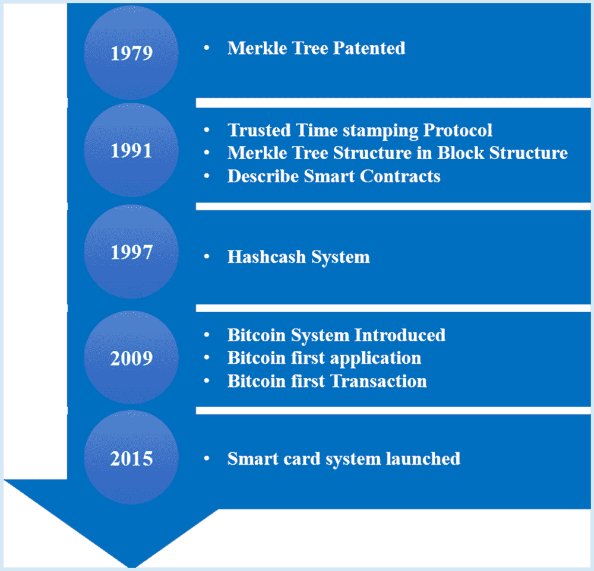
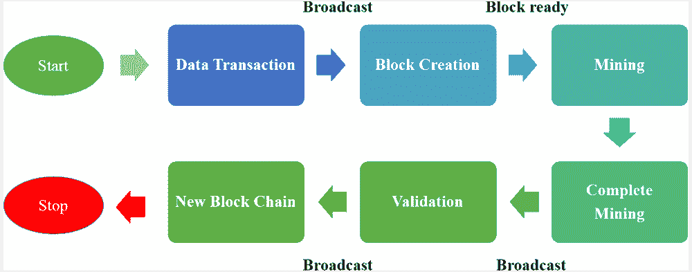
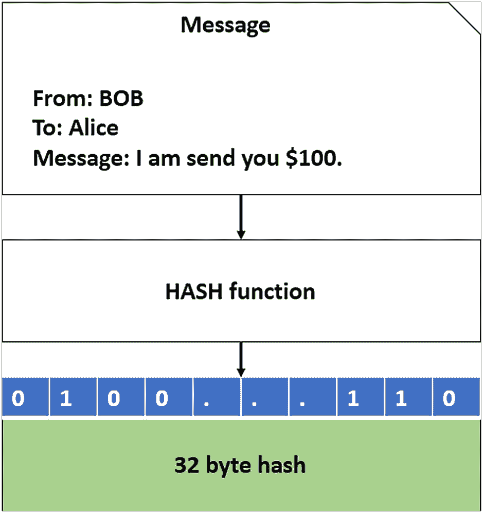
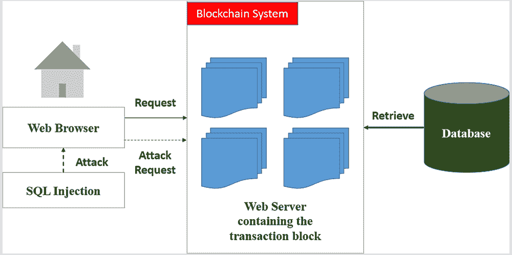
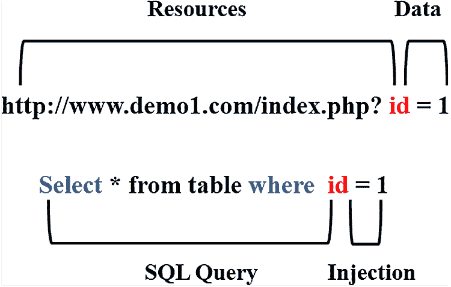
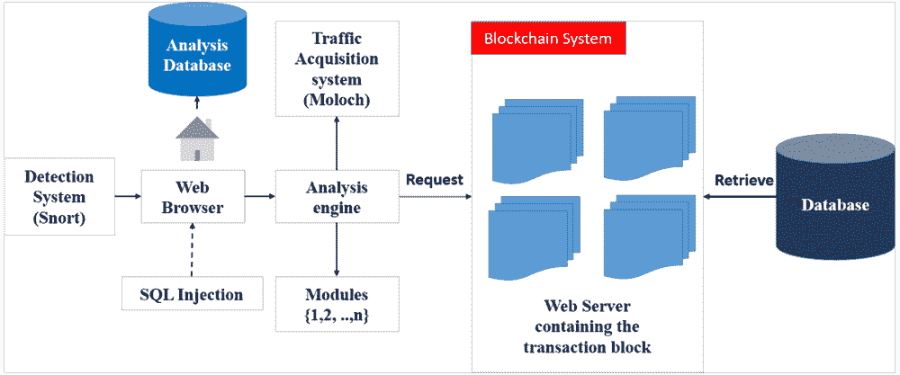
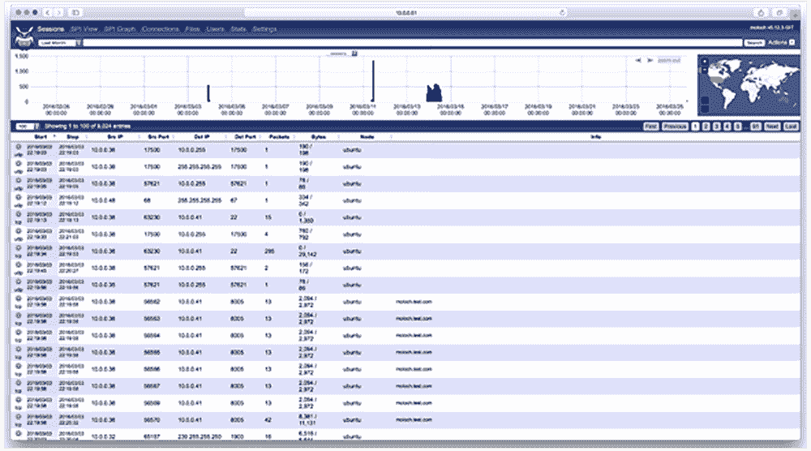
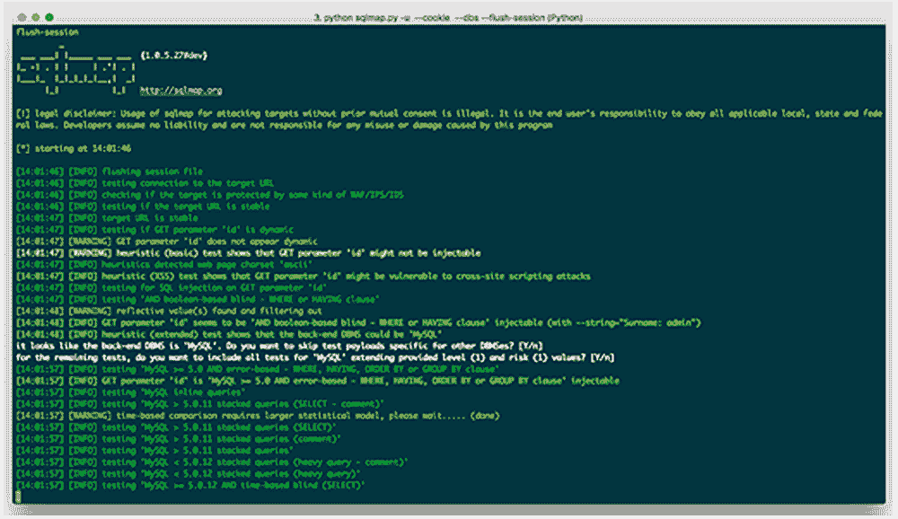

# 第十一章

# 基于区块链数据库的 SQL 注入检测

+   Keshav Sinha

    

    印度比尔拉理工学院

+   Madhav Verma

    B.I.T Sindri，印度达恩巴德

摘要

在当今世界，数据的存储需要大量的空间。与此同时，云和分布式环境为数据提供了充足的存储空间。其中一个具有挑战性的任务是保护存储数据的隐私。为了解决隐私问题，使用基于区块链的数据库来存储数据。对于系统安全的威胁，对手常常会执行拒绝服务攻击（DoS）和内部攻击。在这一章中，作者讨论了一个基于区块链的数据库，数据经过加密后存储。Web API 作为数据存储和分享的接口。在这里，他们主要关注的是 SQL 注入攻击，这是对 Web API 的一种常见攻击。为了应对这一问题，他们提出了基于 Snort 和 Moloch 的案例研究，用于自动检测 SQL 攻击、网络分析和系统测试。

引言

区块链已成为信息技术行业中重要的技术之一。在过去的几十年中，区块链成为头条新闻，因为加密货币和智能合约技术的成功。之后，许多公司采用了区块链技术用于其产品。区块链技术始于 1991 年，当时使用了可信的时间戳协议来保护数据隐私（Haber, 1991）。随后，在 1992 年，Merkle 树被提出用于在单个块中存储多个数据（Bayer, 1992）。之后，由于集中式系统的出现，研究人员没有太多关注来发展这项技术。在不同时间段内，在区块链领域进行了各种研究，如图 1 所示。

| 图 1\. 区块链领域在不同时间段的各种发展 |
| --- |
|  |

区块链的安全性和保密性

区块链技术基于公共账本，数据存储在多个节点以进行传输。区块链系统具有各种安全原则和特性，例如：

+   1\. 去中心化：区块链系统中不存在单点故障，因为节点分布在互联网上，网络上的所有交易都可以被所有节点看到。

+   2\. 机密性：使用公钥加密技术识别真实用户，并提供互联网上数据的安全传输。

+   3\. 完整性：区块链技术基于时间戳的概念，其中每个数据都用唯一的时间签名，并且任何节点都可以轻松追踪和验证交易。

+   4\. 透明度：在区块链系统中，在数据传输之前，节点和网络签署了独特的协议。

+   5\. 不可变性：区块链是区块的概念，添加到网络的数据不会被销毁或修改。

区块链系统由公共账本操作，每个节点都可以访问网络数据。网络上发生的任何交易都会被不同节点成员审查和验证。这样就实现了数据透明性，并且在系统网络中没有任何参与者看不到账本的情况下无法篡改。这一结论表明，区块链系统对任何类型的攻击都具有抵抗能力。根据理论，区块链系统不可能受到虚拟攻击。但是在 2017 年，有 10%的攻击针对区块链系统进行了执行（Passeri, 2017）。这一事件给 IT 行业造成了巨大损失。许多研究人员认为，区块链技术主要集中在加密货币上，攻击者一旦攻击成功就可以获得巨大的回报。

密码学技术

传统的区块链系统基于公钥密码学和哈希函数进行数据的安全传输。使用密码学技术实现了数据的安全性（Darshani, 2018）。密码学的最重要部分是使数据变得不可读，加密和解密在其中起着重要作用。加密使用三种不同类型的密钥选择技术来加密消息：

+   1\. 对称密钥密码学：在这种情况下，发送方和接收方都使用单一密钥进行加密和解密（Darshani, 2016）。

+   2\. 公钥密码学：在这种情况下，客户端和服务器使用一对密钥进行加密和解密。客户端共享公钥进行加密，而私钥由客户端用于解密数据（Paul, 2019）。

+   3\. 哈希函数：在这种情况下，任意大小的数据被映射为固定大小的值（Almuttalibi, 2019）。哈希表用于以非常小的时间量存储和检索数据。

传统密码学使用排列技术来对原始文本文件中的英文字母进行混淆。让我们看一个例子，其中字母（n）的 ASCII 值用于加密（Paul，2019），原始消息（M）由多组子消息{, , …, } 组成，其中‘m’是有限的字母集合，‘n’是固定长度的序列 (). 在这里， 代表 ASCII 字母表。这就是密码学在分布式和集中式环境中如何为明文加密的工作原理。

区块链的一般结构

区块链的结构被分成四个不同的子部分：

+   1\. 主要数据: 它记录了所有当前服务，例如交易，银行和合同记录，或者物联网数据记录。

+   2\. 哈希: 哈希用于安全地广播交易记录到其他节点。 Merkle 树函数用于生成哈希值，并且记录在区块头中。 通过使用 Merkle 树函数来减少计算时间。

+   3\. 时间戳: 一旦区块被创建，每个区块会生成时间，并且元数据存储在数据库中。

+   4\. 其他信息: 用户为了数据的安全传输而定义了密码签名和 Nonce 值。

区块链技术框架

区块链由一个公共账本组成，每条记录都添加到交易列表中。各种记录的集合称为区块。在这里，每个节点负责验证区块。图 2 展示了区块链系统的框架。该过程分为六个子部分：(1) 数据交易，(ii) 区块创建，(iii) 数据挖掘，(iv) 挖掘过程完成，(v) 区块验证和 (vi) 在新区块之间创建链。

| 图 2\. 区块链技术框架 |
| --- |
|  |

+   1\. 数据交易：两个节点之间的数据交易被记录并广播给其他连接的节点。在加密货币的情况下，当在区块链系统中启动交易时，另一个节点会记录它们的交易历史。这导致节点之间的大量广播。

+   2\. 区块的创建：在区块链系统中，矿工验证全局账本。所有传入的数据交易都根据区块链协议进行验证。一旦确认了区块的有效性，矿工将开始组织过渡。在这里，每个区块的大小有限，挖掘过程不会停止，直到达到限制。所有有效的交易都被设置到候选区块中，并且矿工将记录先前信息的时间戳。

+   3\. 区块的挖掘和挖掘完成：一旦候选区块完成挖掘过程，就开始了这个过程，称为解谜。在这里，使用加密哈希来获得区块 ID。哈希值的生成非常琐碎，矿工继续调整候选区块头中的随机数值，这创建了一个安全层，不会被对手更改。一旦谜题解决，挖掘过程就完成了。

+   4\. 验证：一旦区块被挖掘出来，矿工将该区块发送到另一个节点（广播），然后等待确认。其他节点开始验证该区块，如果发现任何不一致之处，则拒绝该区块。如果该区块在所有节点中通过而没有任何差异，则将该区块添加到现有网络的数据链中。

+   5\. 新区块链：一旦验证结束，时间戳被添加到区块中，最终区块按线性或时间顺序添加到链中。现有链被广播到整个网络，并存储在公共账本中。

区块链系统和自动检测 SQL 注入攻击

区块链技术的出现为数据提供了高度的保密性。除了抗篡改的概念之外，区块链将其日志保留在原生的数据库管理系统（DBMS）中。然而，在内部攻击中，对手可以更改 DBMS 中存在的交易日志和登录详细信息。为了应对这个问题，我们必须将所有数据库推向区块链框架。存储数据分布在地理区域的各个地方，并且有大量的用户可以访问这些数据。网络分析对管理员来说是一个巨大的挑战。根据 Frost, 1994；Nikolaidis, 1992 的说法，网络流量有两种特征（i）随机和（ii）确定性。随机模型用于更好地跟踪网络源的统计信息，而确定性模型在确定流量方面具有最差的行为。有各种各样的稳态随机模型，如可变比特率、马尔可夫调制过程、自相似、变换-扩展-采样（TES）、自回归模型等等。限制源特性的确定性模型包括峰值速率模型、最大包长度和最小包间到达时间，用于确定每个连接的峰值速率。一个大型网络的最佳示例是自动取款机（ATM），它通过虚拟电路发送 53 字节的数据包或单元。应用协议和 ATM 层之间有几个协议层，增加了复杂性，但它并没有解决会话劫持的问题。在这里，自动检测起到了作用，它使用各种随机模型提前检测响应和事件。诸如 SQL 注入之类的攻击是由对手在客户端-服务器架构上执行的。对手使用 SQL 查询来注入网络流量，以收集信息。数据库的安全正在朝着这个方向发展，其中 BigchainDB 将 Tendermint 与 MongoDB（NoSQL）集成，以提高数据的交易速率。LedgerDB 是另一个基于区块链技术的数据库。它支持高交易吞吐量、单表，并且不支持 SQL 功能。比特币交易得到 ChainDB 的支持，用于所有一般目的的解决方案。基于区块链的数据库管理系统没有太多的 SQL 查询接口，这增加了公共账本型区块链系统中数据隐私的关注。传统的数据库管理系统有一个以上的管理员，内部攻击者可以完全访问数据服务器。由于缺乏加密协议，传统的数据库管理系统无法抵御攻击。因此，我们的目标是在将系统用于区块链系统之前对其进行验证。区块链系统只在 DBMS 中存储元数据。哈希函数用于将任意数据映射到固定长度的比特串数据。哈希函数定义为 h:，其中'n'为 128、256 和 512\.

| 图 3\. 消息块的密码哈希 |
| --- |
|  |

图 3 表示原始消息块的哈希值并将其存储在数据库管理系统中。哈希的属性是两个值之间的差异不是相对的，这意味着输入的微小变化会导致输出值的巨大变化。这为数据库中所有元组的唯一哈希值的生成提供了优势。现有数据库管理系统与区块链网络的使用是基于元数据的。数据库管理系统中的元组经过密码哈希，然后生成元数据。数据库管理系统表 'T' 是基于主键 () 和元组 'r'，我们必须生成 Row_ID。

 (1)

Eq. 1 用于将主键和元组与表名连接起来生成哈希形式。每个元组的指纹都使用数字签名（私钥）存储在区块链节点上。每次元组中的更改都记录在用户信息中。

工作的动机和目标

工作的动机是在基于区块链的数据库管理系统中提供安全的数据存储。区块链中的任何用户节点都可以更新 DBMS 的元组，并将这些修改存储在数据库中。这些数据来自于教育、军事、商业和娱乐等各个领域。现在，攻击正在执行以获取数据库的信息。信息的基本处理是通过使用 DBMS 中的 select、update 和 delete 命令来调用的。如今，传统数据库被用于区块链领域，这增加了 SQL 注入等攻击的机会，从而利用了数据库的安全性并检索个人信息。为了克服高百分比的威胁，需要自动化来阻止对区块链网络的入侵或攻击。管理员必须面对许多安全挑战，例如：

+   • 个人信息攻击：目前，对手正等待在互联网上检索个人信息。像 SQL 注入这样的攻击可以检索数据库表信息和登录凭据（用户名、密码），以利用区块链网络。

+   • 元数据复制：在区块链网络中，数据库存储行和列的元数据。对手总是试图复制 DBMS 的详细信息。

+   • 数据隐私：大量数据分布在互联网上。基于区块链系统的娱乐公司一直关注数据盗版问题。

这些是区块链系统面临的一些挑战。但在数据安全方面存在一系列问题，我们无法涵盖所有问题。有各种方式来提供数据安全。但自动检测攻击是阻止区块链数据库篡改的有效方法之一。它为在区块链网络中安全存储数据提供了鲁棒性和有效性。

背景

在区块链和数据库管理系统安全领域进行了各种研究，我们发现大多数情况下攻击者进行了两种不同类型的攻击（i）主动攻击和（ii）被动攻击。在主动攻击中，对手修改数据并发送给用户，这一事件对人员造成严重影响。在被动攻击中，对手不会损害系统，只是观察信息的流量。根据 w. Jung 和 S. Park（2017）的说法，区块链是一个 P2P 系统，在这里对手应用 DDoS 攻击关闭交易节点。在区块链系统中，所有节点检查内存池和洪水攻击的时间。在这里，作者提出了最小均方方法来最小化在区块链系统中创建新交易的数量。W. J. Lai 等人（2019 年）提出了时间敏感的消息加密方案。在这里，消息在分散式环境中加密，鼓励参与者与网络共享资源。Bansal 和 Sethumadhavan（2020 年）提出了针对基于名称的攻击的预防技术。这是一种在区块链系统中的 DNS 缓存中毒攻击，作者使用用户定义的端口而不是预定义的端口进行传输。在第二步中，作者加密端口号，通信使用解密的用户定义的端口号启动。Tanriverdi 和 Tekerek（2019 年）提出了一种基于区块链的网络攻击检测模型，使用基于签名的检测。该工作是检测特定模式，如结构化查询语言（SQL）注入，跨站脚本（CSS）和命令注入。作者使用 MultiChain 应用程序，并在区块链上更新签名列表。Anita 和 Vijayalakshmi（2019 年）提出了对区块链技术不同类型攻击、挑战和安全特性的简要调查。Wang 和 Li（2019 年）提出了一种追踪分析技术，用于检测区块链中的各种攻击。在这里，作者根据运行协议捕获操作序列。这将有助于检测 DDoS 和三角形等攻击。Brown 等人（2020 年）提出了一种对区块链已建立的交易进行双重支付攻击的方法。该攻击的成功取决于交易和计算能力。Gochhayat 等人（2019 年）提出了一种使用区块链技术的轻量级分散式加密云存储模型。这个模型为存储数据提供了机密性和完整性。在这里，作者使用了哈希和对称加密技术保护数据的安全性。Saad 等人（2020 年）探索了公共区块链系统的攻击面。在这里，属性攻击用于检查加密构造、分布式架构和应用上下文。作者还探讨了各种向量如何与区块链系统相连。Holbrook（2020 年）研究了区块链中的各种安全方面。在这里，作者解释了公共账本是分布式的，无法修改或删除。像 Hyperledger、Quorum（等）这样的特定功能为区块链管理员提供了安全性。Rikken 等人（2019 年）分析了关于区块链治理的各种挑战。在这里，作者提出了基于基础设施、应用程序、公司和机构/国家的框架。Singh 等人（2019 年）提出了基于区块链的 DDoS 解决方案，以避免网络遭受严重攻击。在这里，作者提供了关于区块链技术在金融、游戏和分散式服务器领域的快速变化，以提供块的交易的安全环境的关注。

区块链系统使用数据库存储元数据，我们的工作是为数据存储提供安全环境。基于这一事实，我们在此提出了一些在区块链环境中有助于安全数据库存储的技术。根据 Sinha 等人（2020）的说法，数据的安全存储是一个具有挑战性的任务之一。在这里，作者提出了云数据服务器中数据存储的非对称技术。Bertino 等人（2007）提出了异常检测技术，作者根据 SQL 查询识别数据库应用程序的恶意行为。他们证明了所提出的模型可以检测数据库的 SQL 注入攻击。Tajpour 等人（2010）介绍了各种方法来检测 SQL 注入。Wei 等人（2006）提出了一种新颖的技术，用于抵抗针对存储过程的各种攻击。他们利用代码分析和运行时验证来检测针对 SQL Server 2005 数据库的攻击。Ntagwabira（2010）提出了查询标记化来检测 SQL 注入，作者使用查询解析器来检测字符串中的空格、单引号或双破折号。基于长度比较两个数组字符串来检测注入。Sadeghian 等人（2013）介绍了针对 SQL 注入的各种检测和预防技术，以提供数据库中信息的机密性、完整性和可用性。Kumar（2012）介绍了关于 SQL 注入攻击、检测和预防技术的调查。他们发现编写不良的应用程序会影响组织网络。攻击者违反所有类型的安全层和协议来访问信息。Singh 等人（2016）讨论了针对 SQL 注入的攻击和预防。他们提出了用于 SQL 服务器的防火墙技术，以限制非注册用户的特权。但是，使用此服务需要进行节点对节点的签名认证。Gudipati 等人（2016）使用 Sp_executesql 以特定顺序执行语法，取代 QUOTENAME。它还在攻击时管理权限。Kamtuo（2016）使用机器学习技术进行攻击分析。它还提取信息进行训练和测试。Zhou（2016）引入了用户定义方法（UDA）来将属性映射到特定要求。它还检查任何攻击的阈值值。Dubey（2016）引入了用于发送和接收请求的过滤机制。Aldlaeen（2013）引入了用于阻挡 SQL 注入攻击并只允许真实用户访问控制的防火墙技术。Chatur（2015）采用了基于安全的模型来检查真实用户的签名。Ghorbanzadeh 等人（2010）引入了用于防止移动数据库不必要入侵的防火墙和虚拟专用网络。Sallam 等人（2016）提出了一种基于角色的异常检测方法，用于内部人员的攻击。Fatih（2017）和 Mouton 等人（2014）介绍了基于网络的安全方法，以防范 SQL 注入攻击。Orman（2018）提出了一种区块链概念，用于验证 Web 服务器的真实节点。

基于区块链的数据库包含大量的元数据，在与网络节点共享之前需要进行组织和优化。在这里，我们介绍了一些优化和调度技术，可以降低数据的时间复杂度。根据 Priya（2020）的说法，通过减少等待队列的最大处理时间来降低时间复杂度。在这里，作者提出了用于最小化流水车间调度问题的 PA-ACO 技术。Sahana 等人（2018）提出了一种用于预算问题的优化和分配技术。作者提出了用于大规模预算问题优化的遗传算法（GA）和最优计算预算分配（OCBA）技术。Khowas 等人（2016）介绍了用于大规模预算问题的粒子群优化（PSO）技术。Paul（2019）提出了一篇关于基于语音的身份验证方案的文章，以便检测现实世界的罪犯。Verma 等人（2020）提出了一种用于在分布式数据库中共享和存储数据的非对称加密技术。Chaddha 等人（2020）提出了基于非对称密钥密码学的实时图像加密技术。该技术用于大规模图像加密和数据存储在数据库中。Choudhary 等人（2018）提出了使用非对称密钥进行多媒体加密以进行存储的技术。该技术基于密钥管理服务器将数据存储在云中。

案例研究：自动 SQL 注入检测

在对不同技术进行详尽研究后，我们希望提出使用 Snort 和 Moloch 实现自动化 SQL 注入检测。这将有助于在区块链网络中检测 SQL 注入。网络攻击是任何个人都面临的重大问题之一。在这里，对手总是试图获取个人信息，如信用卡/借记卡信息，从存储数据库中获取密码，并且这些信息在暗网上非常容易出售。另一方面，基于区块链的数据库管理系统用于存储元数据。许多公司使用区块链系统进行多媒体存储，为此它们使用网络 API。网络接口更容易受到以下方面的攻击：(i) 密码验证薄弱，和 (ii) 端点连接中的缺陷。像 SOAP 这样的协议提供了安全架构，而 REST 则提供了 API 实现的安全环境。在数据传输期间，对手秘密地拦截两方之间的通信，甚至他们改变了消息。API 注入，如 XSS 和 SQLite，将恶意代码注入软件程序，并在系统中创建后门。分布式拒绝服务（DDoS）是一种攻击，攻击者会向区块链网络发送不需要的数据包。API 注入或 SQL 注入是攻击者执行的最常见攻击。SQL 注入不需要权限验证，而是重定向数据库的信息（H. Meyer 1996）。1988 年，计算机应急响应小组（CERT）在卡内基梅隆大学（CMU）设立了一个协调中心，负责应对网络攻击，如蠕虫、病毒、恶意软件等（J. Clarke 2009）。

SQL 注入概述

主要的 SQL 注入攻击是在客户端-服务器架构上执行的。Web API 充当轻客户端，用户通过发送查询来从数据库中提取数据。图 4 展示了在具有 Web API 的区块链系统上执行的 SQL 攻击。Web API 使用 SQL 命令从数据库中提取数据。SQL 是一种结构化查询语言，用于管理和与关系数据库通信。最常见的 SQL 查询包括：

+   • SELECT：从表中检索存储的条目。

+   • INSERT：用于在表中创建条目。

+   • DELETE：它从表中删除记录。

| 图 4\. Web API 上的 SQL 攻击 |
| --- |
|  |

在这里，认证用户发送查询以从数据库检索信息。但在 SQL 注入的情况下，对手使用特殊字符和符号进行身份验证。大多数情况下，对手使用 'AND' 和 'OR' 数据库管理系统条件进行攻击。

SQL 注入

SQL 注入是对 Web API 的一种基于查询的攻击，它最早由 Jeff Forristal 在 1998 年提出（Joseph Cox，2015）。该攻击主要由利用和操纵数据库记录的 SQL 查询组成。SQL 注入在开放网络应用安全项目（OWASP）的十大 Web API 攻击中保持着最高位置。应用程序员使用脚本语言处理所有类型的用户输入。还有一种程序员的行为准则，不相信用户输入。存在一些 SQL 注入风险，比如远程访问敏感数据、检索存储的信息、了解数据库记录和表信息等等。SQL 注入为黑客提供了自由空间，在其中开发并执行网络上的脚本。黑客开发了一个用于检查网站漏洞的机器人。这些机器人（bots.txt）在区块链网络上运行并攻击服务器机器。

SQL 注入是如何工作的？

这是一种基于查询的攻击，攻击者将代码片段注入到 Web API 中。恶意查询将在 URL 参数中提供数据库表信息。图 5 描述了一个简单网站上的 SQL 注入。

| 图 5. SQL 查询注入 |
| --- |
|  |

我们介绍了对数据库执行的几种类型的 SQL 注入，以提取表信息（Pollack，2018）。

+   1\. 基于布尔的盲注：在这种情况下，逻辑查询附加到参数，并且对手等待一些有意义的搜索。 恶意查询将重定向到与布尔操作（True 或 False）相关的一些结果。 使用“WHERE”运算符来评估参数的蕴含。 让我们考虑一个基于布尔的恶意字符串（https://abc.com/index1.php?id=1 AND substring (@@version,1,1)=4）。 现在，查询用于检查数据库表信息。 使用“substring (@@version, 1, 1)=4”来检查数据库版本。 如果为真，则返回一行，否则将给出失败的“0”结果。 这意味着没有 4 版本的数据库。 攻击者将一遍又一遍地执行此过程，以映射数据库的逻辑结构。

+   2\. 基于时间的盲注（TBBI）：它利用服务器的时间来访问数据库的信息。 TBBI 的格式应用于任何网站示例（http://example1.com/index.php?id=1; IF User = ‘admin’ WAIT FOR DELAY ‘00:00:15’）。 它通过延迟 15 秒来评估响应，然后将信息发送给攻击者。

+   3\. UNION Based Injection（UBI）：它用于合并两个不同的表行。 UBI 的唯一缺点是（i）表的结构相同，（ii）行和列的数量相同。 UBI 使用“ORDER BY”运算符来查找列。 示例（http://example1.com/index.php?id=1 ORDER BY 1 -> OK＆http://example1.com/index.php?id=1 ORDER BY 2 -> Error）。 基于联合的注入用于测试 2 列，只传递其中的 1 列。

有多种方式可以对区块链数据库服务器的 Web API 执行 SQL 注入攻击。系统防火墙无法提供足够的安全性来抵御 SQL 注入攻击。因此，我们的工作是限制这些攻击，并为连接到区块链系统的每个用户提供安全的环境。在这里，我们提出了使用 Snort（Zhou 等人，2010）和 Moloch（Uramova 等人，2017）自动检测 SQL 注入攻击的框架。检测系统的概要如图 6 所示。

| 图 6\. 使用 Snort 和 Moloch 在区块链系统中进行自动化 SQL 攻击检测的框架 |
| --- |
|  |

图 6 展示了自动化 SQL 攻击检测框架。该框架分为多个组件，每个组件都有特定的工作，如：

检测系统（Snort）：它使用 Snort 技术来检测 SQL 注入。它还分析庞大的 HTTP 网络流量。Snort 是由 Martin Roesch 在 1988 年首次创建用于网络入侵检测（Roesch, 1999）。在这里，数据包捕获模块用于收集系统的请求和响应。数据包捕获的伪代码如下所示。在这里，真正的用户只通过身份验证过程。如果存在 SQL 攻击，则使用特定关键字来识别攻击。

伪代码

Class Public Signin(request, response)

{

String signin = request. getParameter(“signin”);

String p_word = request. getParameter(“p_word”);

String query1 = “SELECT info FROM userTable WHERE”;

if ((!signin. equals(“”)) && (!p_word.equals(“”))) query += signin = “‘+ signin+’” AND pass= “‘+p_word +’” elsequery+ = “‘signin= ‘Guest’’”;

ResultSet result1 = stmt. executeQuery(query1) ;

if (result1 != null)

showAccount(result1) ;

else

sendAuthentacationFailed();

}

这里有一个示例来检测 ECHO REQUEST 中的 ICMP 数据包。

警告 ICMP $ExternalNET

任意 -> $HOME 任意 (msg:”ICMP PING”; icode:0; itype:8; classtype: misc-activity; sid:384; rev:5;)

Snort 软件包分为两部分：头部和主体。头部分为七个不同的片段：(i) 行动，(ii) 协议，(iii) 源 IP，(iv) 源端口，(v) 方向，(vi) 目的地 IP，和 (vii) 目的地端口。这些字段由变量或字符串组成，用于与数据库匹配。主体使用消息的负载或 HTTP 头。警报是通过使用 fast_output 模块生成的。例如：

[**] [1:374:5] ICMP PING [**]

[分类：杂项活动] [优先级：4]

03/12-02:11:09.359780 10.1.1.10 -> 10.0.1.253

ICMP TTL：30 TOS：0x0 ID：38175 IpLen：15 DgmLen：92

类型：8 代码：0 ID：32335 Seq：1 ECHO

起始行用于数据包匹配。[**] 符号用于序列的开始和结束。方括号内有三个值，由冒号分隔。(i) 生成器 ID (GID) 用于警报模块，(ii) Snort_ID (SID) 用于识别唯一警报，和 Revision_No (REV) 用于触发警报。

交通获取系统

它使用 Moloch 作为默认系统来获得 SQL 注入的可见性。在攻击期间，由于性能原因，有些数据包未被记录。它使用 IPv4 数据包来检测入侵。Moloch 会话使用七元组：Moloch_Session = (St_Time、Sp_Time、Source_IP、Dstination_IP、Source_Port、Dstination_Port、Protocol)。

| 图 7\. Moloch 网页界面 |
| --- |
|  |

图 7 展示了 Moloch 网页界面用于拦截网络数据包。Moloch 由三个主要部分组成：

+   • 弹性搜索数据库：用于索引存储的会话。它还管理已捕获的会话。实时情况下，使用网络流量分析来管理大容量数据。

+   • 捕获：它将网络分为已捕获和网络流量两部分。

+   • 观察者：用于过滤存储的会话，也可以导出存储的会话。

Moloch 用于 HTTP 会话过滤。Moloch 过滤表达式为（ip.src == 10.0.0.41 && start_time >= “2019/03/05 22:11:23” && port.dst == 8080）。

+   • HTTP 标签过滤：这是 Moloch 用于数据包过滤的过程（协议 == http && 方法 == GET && 状态 == 200 && 停止时间 <= “2019/02/05 12:21:03”）。

+   • 分析引擎：分析引擎的工作是分析恶意数据包。PCAP 分析由模块完成。每个模块将在 PCAP 上执行一定数量的操作，以从引擎返回输出。数据库用于存储分析信息（如攻击调查）。

+   • 攻击者 IP 详细信息：攻击者 IP 对于任何 IDS 来说都很容易找到。攻击者经常隐藏他们的 IP 和位置服务器以保护个人信息安全。根据 Cloudflare，有 90% 的请求来自 Tor 浏览器，这对于找到真正的请求是非常不可预测的。IP 地址由以下组成：

    +   o 拥有者 IP 地址，

    +   o 互联网服务提供商（ISP）的起源，

    +   o CIDR 表示法，

    +   o 电子邮件联系方式，

    +   o Tor 节点检查

所有信息均从地区互联网注册机构（RIRs）检索。所有 Tor 节点都公开存在，并且它们使用加密流量来访问 HTTPS。

+   • Web 服务器详细信息：它用于查找目标服务器的详细信息。分析引擎无法访问分析 Web 服务器，因此它使用模式匹配技术来查找详细信息。Wappalzer 是一个用于检测 Web 服务器、内容管理系统（CMS）和 JavaScript 库的开源工具。

+   • 统计分析：如果有犯罪，也有证据，攻击者以入口点的形式留下指纹。在统计分析中，观察 PCAP 模式以找到 SQL 注入的证据。分析引擎用于识别流量、网络端点中的大纲。

+   • 数据库蜘蛛：攻击者通常会尝试检索表名和列等信息。蜘蛛的工作是添加一个适当长的字符串，替换数据库的信息。它还向服务器发送 SQL 注入成功消息，但是发送给攻击者的不是实际的表，而是空表。蜘蛛由 256 位字符串生成，放置在数据库中。这不会提供对基于时间的盲注入的安全性。

+   • 连接：它捕获网络子网并提供主机列表。使用 Moloch 将在 API 面板中提供此信息。

+   • 存储和 Web 接口：它使用基于文档的 NoSQL 数据库 RethinkDB 和 API 用于实时应用。传统数据库不会提供分析功能。RethinkDB 将在独立机器上使用远程服务器或连线执行。NoSQL 数据库的命令如下：

cursor = r.table(‘analyses’).filter(r.row[‘dst_ip’] == ‘10.0.0.1’).run()

for document in cursor:

print(document)

Web 接口：Web 接口用于分析结果。分析的可视化呈现在 Web API 中。个体结果以地图和表格的形式提供。实现是在 anaconda 3.1 上完成的，在 Windows 8.1 x64 平台上进行，使用了核心 i5 处理器。部署的先决条件是 Snort、Proofpoint、PulledPork 实例用于生成签名地图。Snort 的工作是以二进制形式生成入侵日志，称为 unified2。日志由几个警报组成，例如 (i) Alert_syslog、(ii) Alert_fast、(iii) Alert_full、(iv) Alert_unixsock 和 (v) Log_tcpdump。在 Moloch 中设置 Snort 日志会话需要几件事。Moloch 需要子网地址作为开发点，时间戳使用 UTC 标准，具有自签名 SSL 证书的 REST API，以及删除旧的不需要的会话的 PCAP（数据包捕获）。

+   • 警报转发：Snort 用作将警报发送到日志处理系统的分析引擎。日志系统不断地检查新的记录。手动实现使用 Python 中的 "idstools" 包来监视日志记录。

伪代码

从 idstools 导入 unified2

reader1 = unified2.SpoolEventReader(directory, prefix, follow=True)

对于 reader 中的每个事件：

# 处理事件

# ...

+   • 签名映射：这是将数值签名 ID 设置为文本表示的过程。使用 "idstools" 包完成了签名映射的伪代码。

伪代码

从 idstools 导入 maps

sigmap1 = maps1.SignatureMap()

sigmap1.load_signature_map(open(’/path/to/sid-msg.map’))

sigmap1.load_generator_map(open(’/path/to/gid-msg.map’))

sigmap.get(gid, sid)

Snort 警报转发的附加任务是 (i) 签名过滤和 (ii) 书签。在签名过滤中，仅提供 SQL 注入 ID 的警报。书签将有助于跟踪分析引擎的所有事件。

+   •

    创建分析：IDS 在 SQL 注入攻击时会生成多个警报。分析引擎用于使用 API 检索负载流量。警报以时间框架的形式生成，并在一个分析中聚类。与指定的聚类检查类似的警报。警报中存在三个元组。

    

+   • 任务队列：它以分布式形式使用任务，意味着每个任务在不同的处理器上执行。Celery 是一个开源的 Python 软件，用于并行处理。Celery 使用主从模型，其中主节点将任务分发给不同的处理器，而从节点将并行运行这些任务。API 将处理数据库的条目。该条目由时间戳和待处理数据的任务状态组成。

分析引擎：它用于任务调度。分析引擎中存在几个步骤：

+   • 状态：它监控任务的状态，如“待定”或“进行中”。

+   • 来自 Moloch 的 PCAP：它分析源和目的地之间的 HTTP 流量。使用 (/sessions.pcap endpoint) 生成警报。Moloch 流量过滤器如下进行(port.dst == {dst_port} && protocols == http && ip.src == {src_ip} && ip.dst == {dst_ip})。简单来说，Moloch 观察到了初始警报，例如开始时间、结束时间和表达式。

+   • 数据库条目更新：它将条目更改为任务分析引擎的成功或错误。

模块：它使用命令来分析分析模块：(module_results = module(opts, pcap_path, config).bootstrap())

+   • opts = 源 IP，目的地 IP 警报。

+   • pcap_path：它检索 PCAP 存储文件。

+   • config：它管理 RethinkDB 主机和端口，Celery 代理。

+   • bootstrap() 返回从数据库中存储的内容。

通过 Web 界面分析源 IP、目标 IP。PCAP 检索 Moloch 信息。Snort 和 Moloch 都监视主机信息。它使用 uWSGI、Celery 和警报转发器监督运行任务。

评估：对于评估，使用 Ubuntu 18.1、MySQL 数据库和 Damn Vulnerable Web App（DVWA）进行测试。Sqlmap 用于检测 SQL 注入（Axinte，2014）。Sqlmap 的工作流程分为五个步骤：

+   • 设置：Sqlmap 作为独立工具用于检测 SQL 注入。它需要一些基本配置，如：指定目标 URL 的入口点，HTTP 标头，代理，篡改脚本。

+   • 检测：它检查链接的入口点。

+   • 指纹识别：它使用数据库服务器和 Web 服务器的指纹来获取关键数据。它还在 Web 服务器之前检测 Web 应用防火墙（WAF）和受保护的 Web 服务器（IWS）。

+   • 列举：它还使用暴力攻击来检索数据库的表和列。它使用字典攻击来攻击哈希保护的数据。

+   • 接管：它尝试访问操作系统的信息。

为了测试，我们在 DVWA 上使用 20 个 sqlmap（版本 1.0.5.27）攻击，并使用 Snort 包能够检测到 SQL 注入。警报通过适当的 PCAP（数据包捕获）进行分析。Sqlmap 还能识别响应中的 canary 字符串。对于每个 sqlmap 攻击，Snort 将生成 40 个不同的警报。Sqlmap 参数用于测试目的。

python sqlmap.py -u

“http://abc.com?id=1&submit=login#”

--cookie “PHPSESSID=[session_id]; security=low”

--dbs --flush-session --tamper=randomcomments --level=5 -v 3

| 图 8\. Sqlmap API 截图 |
| --- |
|  |

诸如 base64 转换之类的 temper 脚本不会被 Snort 检测到。Sqlmap 还包含使用 temper 脚本来规避 IPS/WAF 检测的功能。只有在输入的语法发生变化时才起作用。在大多数情况下（99/100），Snort 能够注意到这种规避行为。这表明，基于网络的攻击检测自动化使用大型网络负载，并在很短的时间内通信数千个系统。实施的系统用于检测所有类型的 SQL 注入攻击。

结论

SQL 注入是一种攻击类型，攻击者从数据库中检索个人信息。在当前情况下，许多基于区块链的公司面临着基于 SQL 注入的网络攻击问题。为了解决这个问题，我们在这里提供了一个章节，简要介绍了区块链系统和 SQL 注入的基本概念。整个章节分为两部分：(i) 我们首先简要介绍了区块链系统以及数据如何存储在公共数据库中，(ii) 第二部分描述了攻击者对数据库执行的 SQL 攻击。在这里，我们提供了基于自动检测 SQL 注入攻击的案例研究。为了检测，我们使用了 Snort 和 Moloch 包。该系统适用于大型网络流量，如区块链系统。Sqlmap 用于评估过程和寻找成功的 SQL 注入。该系统不使用任何新技术进行分析，而是基于时间戳和指纹信息收集信息。它是一个基于签名的系统，在检测时有一些限制。这项工作的未来展望是使用 Splunk 技术提供在数据库威胁领域的巨大解决方案。

参考文献

Chaddha, R., Kumar, A., Sinha, K., Paul, P., & Amritanjali. (2020). 选择各种传统图像加密技术：一项研究。《电气工程讲义》，219–228。10.1007/978-981-15-2854-5_20

Verma, N., Sharma, S., Sinha, K., Paul, P., & Amritanjali. (2020). 选择传统密码算法用于实时视频传输和存储：一项研究。《电气工程讲义》，229–238。10.1007/978-981-15-2854-5_21

Al-Sayid, N. A., & Aldlaeen, D. (2013). 数据库安全威胁：一项调查研究。第 5 届计算机科学与信息技术国际会议论文集。10.1109/csit.2013.6588759

Anita, N., & Vijayalakshmi, M. (2019). 区块链安全攻击：简要调查。第 10 届计算、通信和网络技术国际会议论文集。10.1109/icccnt45670.2019.8944615

Axinte, S.-D. (2014). 使用 SQLmap 在 Web 应用程序中进行 SQL 注入测试。《信息安全与网络犯罪国际期刊》，3(2)，61–68。

Aziz Yousif Almuttalibi, R. (2019). 区块链哈希函数用于安全生物特征系统。《工程与应用科学期刊》（亚洲研究出版网络），14(11)，3797–3805。https://doi.org/10.36478/jeasci.2019.3797.3805

Bansal, M. K., & Sethumadhavan, M. (2020). DNS 安全 - 使用区块链防止 DNS 缓存中毒攻击。《创新技术与探索工程国际期刊》，9(4)，2151–2162。10.35940/ijitee.d1549.029420

Bayer, D., Haber, S., & Stornetta, W. S. (1993). 提高数字时间戳的效率和可靠性。《序列》，II，329–334。doi:10.1007/978-1-4613-9323-8_24

Bertino, E., Kamra, A., & Early, J. P. (2007). 利用数据库应用程序进行分析以检测 SQL 注入攻击。IEEE 国际性能、计算和通信会议论文集。10.1109/pccc.2007.358926

Bigchain, D. B., & Gmb, H. (2018). Bigchaindb 2.0: 区块链数据库。白皮书。可参考：[`www.bigchaindb.com/whitepaper/bigchaindb-whitepaper.pdf`](https://www.bigchaindb.com/whitepaper/bigchaindb-whitepaper.pdf)

Brown, M., Peköz, E., & Ross, S. (2020). 区块链双花攻击持续时间。概率工程与信息科学, 1–9\. 10.1017/s0269964820000212

Chaindb. (2018). 一个点对点数据库系统。可参考：[`bitpay.com/chaindb.pdf`](https://bitpay.com/chaindb.pdf)

Clarke, J. (2009). 利用 SQL 注入 . SQL 注入攻击与防御.

Cox, J. (2015). SQL 注入的历史，这种永远不会消失的黑客攻击。可参考：[`www.vice.com/en_us/article/aekzez/the-history-of-sql-injection-the-hack-that-will-never-go-away`](https://www.vice.com/en_us/article/aekzez/the-history-of-sql-injection-the-hack-that-will-never-go-away)

Dubey, R., & Gupta, H. (2016). SQL 过滤: 预防 SQL 注入攻击的有效技术。可参考：[第 5 届可靠性、信息通信技术和优化国际会议论文集](https://doi.org/10.1109/icrito.2016.7784972)

Frost, V. S., & Melamed, B. (1994). 模拟电信网络的流量建模。IEEE 通信杂志 , 32(3), 70–70.

Ghorbanzadeh, P., Shaddeli, A., Malekzadeh, R., & Jahanbakhsh, Z. (2010). 移动数据库安全威胁及其解决方案的调查。信息科学与交互科学第 3 届国际会议论文集. 10.1109/icicis.2010.5534685

Gochhayat, S. P., Bandara, E., Shetty, S., & Foytik, P. (2019). Yugala: 基于区块链的物联网数据加密云存储。IEEE 区块链国际会议论文集. 10.1109/blockchain.2019.00073

Gudipati, V. K., Venna, T., Subburaj, S., & Abuzaghleh, O. (2016). 高级自动化 SQL 注入攻击与防御机制。康涅狄格州工业电子技术与自动化年会论文集. 10.1109/ct-ieta.2016.7868248

Haber, S., & Stornetta, W. S. (1991). 如何为数字文档加时间戳. 密码学杂志, 3(2), 99–111.

[Handschuh, H. (2005). SHA 家族（安全哈希算法）. SpringerReference, 565–567.](https://doi.org/10.1007/springerreference_491)

Holbrook, J. (2020). 区块链安全和威胁景观. 架构企业区块链解决方案, 323–347.

[Jung, W., & Park, S. (2017). 利用动态交易限额预防区块链系统的 DDoS 攻击. 国际控制与自动化杂志, 10(12), 131–138.](https://doi.org/10.14257/ijca.2017.10.12.12)

Kamtuo, K., & Soomlek, C. (2016). 用于服务器端脚本的 SQL 注入预防的机器学习方法. 国际计算机科学与工程会议论文集 (ICSEC).

Karuparthi, R. P., & Zhou, B. (2016). 增强型 SQL 注入攻击检测方法. 第 15 届 IEEE 国际机器学习和应用会议论文集 (ICMLA).

Koçak, S. (2017). 对密码哈希函数 lux 的第二前像攻击和碰撞攻击. 安卡拉大学理学院通讯 A1 数学与统计学系, 66(1), 254–266.

Kumar, P., & Pateriya, R. K. (2012). SQL 注入攻击、检测和预防技术综述. 第三届国际计算、通信和网络技术会议论文集.

[Kwon. (2014). Tendermint: 无需挖矿的共识. 草案 v. 0.6, 秋季.]

Lai, W.-J., Hsueh, C.-W., & Wu, J.-L. (2019). 区块链上的全面去中心化时间锁加密系统. IEEE 国际区块链会议论文集 (Blockchain).

[Ledger, D. B. (2018). Github 仓库](https://github.com/ledgerdb/ledgerdb)

Meyer, H. (1996). 计算机应急响应团队政策。 计算机与安全 , 15(4), 320.

Mongo, D. B. (2018). 开源文档数据库。 https://www.mongodb.com/

Mouton, F., Malan, M. M., Leenen, L., & Venter, H. S. (2014). 社会工程攻击框架。 南非信息安全。 10.1109/issa.2014.6950510

Nikolaidis, I., & Akyildiz, I. F. (1992). ATM 网络中的源特征化和统计复用。 佐治亚理工学院计算学院.

Ntagwabira, L., & Kang, S. L. (2010). 使用查询标记化检测和防止 SQL 注入攻击。 计算机科学与信息技术第三届国际会议论文集。 10.1109/iccsit.2010.5565202

Orman, H. (2018). 区块链：新 PKI 的帝国？ IEEE 互联网计算, 22(2), 23–28\. https://doi.org/10.1109/mic.2018.022021659

Passeri, P. (2017). 2017 年网络攻击统计数据。 可用：https://www.hackmageddon.com/2018/01/17/2017-cyber-attacks-statistics/

Pollack, E. (2018). 防止 SQL 注入。 动态 SQL。

Priya, A., & Sahana, S. K. (2020). 使用 PA-ACO 最小化完成时间的确定性流水车间调度问题。 国际工程与先进技术杂志, 9(3), 1555–1560\. 10.35940/ijeat.b4573.029320

PriyaA.SinhaK.DarshaniM. P.SahanaS. K. (2018). 一种新型的多媒体加密和解密技术，使用二叉树遍历。 第二届微电子、计算与通信系统国际会议论文集 (MCCS 2017), 163–178\. DOI: 10.1007/978-981-10-8234-4_15

Rikken, O., Janssen, M., & Kwee, Z. (2019). 区块链和去中心化自治组织的治理挑战。 信息政策, 24(4), 397–417\. 10.3233/ip-190154

Roesch, M. (1999). Snort: 轻量级网络入侵检测。 LISA. 在第 13 届 USENIX 系统管理会议(LISA ’99)的论文集中。 USENIX 协会。

Saad, M., Spaulding, J., Njilla, L., Kamhoua, C., Shetty, S., Nyang, D. H., & Mohaisen, D. (2020). 探索区块链的攻击面：一项全面调查。IEEE 通信调查与教程, 1–1. [10.1109/comst.2020.2975999](https://doi.org/10.1109/comst.2020.2975999)

Sadeghian, A., Zamani, M., & Manaf, A. A. (2013). SQL 注入检测和预防技术的分类。在国际信息学和创意多媒体会议（ICICM）的论文集中。 [10.1109/icicm.2013.18](https://doi.org/10.1109/icicm.2013.18)

Sahana, S. K., Khowas, M., & Sinha, K. (2018). 预算优化和分配：基于进化计算的模型。Bentham Science. [10.2174/97816810870781180101](https://doi.org/10.2174/97816810870781180101)

Sallam, A., Xiao, Q., Bertino, E., & Fadolalkarim, D. (2016). 数据库保护中的异常检测技术，针对内部威胁（邀请稿）。在信息重用和集成国际会议（IRI）第 17 届的论文集中。 [10.1109/iri.2016.12](https://doi.org/10.1109/iri.2016.12)

Shastri, A. A., & Chatur, P. N. (2015). 针对数据库的高效安全模型，专门设计以避免内部威胁。在国际智能技术和管理计算、通信、控制、能源和材料会议（ICSTM）的论文集中。 [10.1109/icstm.2015.7225407](https://doi.org/10.1109/icstm.2015.7225407)

SinghN.DayalM.RawR. S.KumarS. (2016). SQL 注入：类型、方法论、攻击查询和预防措施。在第 3 届国际计算可持续全球发展会议（INDIACom）的论文集中，(pp. 2872-2876). IEEE.

Singh, R., Tanwar, S., & Sharma, T. P. (2019). 利用区块链减轻分布式拒绝服务攻击。安全与隐私, 3(3). [10.1002/spy2.96](https://doi.org/10.1002/spy2.96)

Sinha, K., Choudhary, S., Paul, S., & Paul, P. (2018). 在云中使用秘密共享密钥保护多媒体的安全性。在计算、电力和通信技术国际会议（GUCON）的论文集中。 [10.1109/gucon.2018.8675031](https://doi.org/10.1109/gucon.2018.8675031)

Sinha, K., Darshani, M. P., Kumari, S., & Paul, P. (2016). 基于语音特征的法庭应用的说话人识别和验证。Imperial Journal of Interdisciplinary Research, 3.

Sinha, K., & Paul, P. (2019). 在法庭实验室中使用的基于语音的身份验证。CSI Communications, 42(11), 26.

Sinha, K., & Paul, P. (2021a). 分布环境中的网络安全方法。Research Anthology on Artificial Intelligence Applications in Security. doi:10.4018/978-1-7998-7705-9.ch061

Sinha, K., & Paul, P. (2021b). 分布环境中的网络安全方法。Research Anthology on Blockchain Technology in Business, Healthcare, Education, and Government. doi:10.4018/978-1-7998-5351-0.ch078

Sinha, K., Priya, A., & Khowas, M. (2016). 使用粒子群优化的预算分配和优化框架。Advances in Computational Intelligence, 149–158. 10.1007/978-981-10-2525-9_15

Sinha, K., Priya, A., & Paul, P. (2020). K-RSA: 多媒体云数据服务器中的安全数据存储技术。Journal of Intelligent & Fuzzy Systems, 1–18. 10.3233/jifs-191687

Sinha, K., Paul, P., & Amritanjali. (2019). 分布环境中的网络安全方法。Advances in Computational Intelligence and Robotics, 174–209. 10.4018/978-1-5225-7955-7.ch008

Tajpour, A., & Shooshtari, M. J. (2010). SQL 注入检测和预防技术的评估。Proceeding of the 2^(nd) International Conference on Computational Intelligence, Communication Systems and Networks. 10.1109/cicsyn.2010.55

Tanriverdi, M., & Tekerek, A. (2019). 基于区块链的分布式 Web 攻击检测应用的实现。Proceeding of the 1^(st) International Informatics and Software Engineering Conference (UBMYK). 10.1109/ubmyk48245.2019.8965446

Tendermint. (2018). https://tendermint.com/

Uramova, J., Segec, P., Moravcik, M., Papan, J., Mokos, T., & Brodec, M. (2017). 基于 Moloch 的数据包捕获基础设施。《第 15 届新兴电子学习技术和应用国际会议 (ICETA)》论文集。10.1109/iceta.2017.8102538

Wang, Y., & Li, G. (2019). 通过跟踪分析检测区块链上的三角攻击。《第 19 届软件质量、可靠性和安全性国际会议伴随论文集 (QRS-C)》。10.1109/qrs-c.2019.00066

Wei, K., Muthuprasanna, M., & Kothari, S. (2006). 在存储过程中防止 SQL 注入攻击。《澳大利亚软件工程会议 (ASWEC’06)》论文集。10.1109/aswec.2006.40

Zhou, Z., Chen, Z., Zhou, T., & Guan, X. (2010). 关于 Snort 网络入侵检测系统的研究。《网络与数字社会国际会议》论文集。10.1109/icnds.2010.5479341

关键术语和定义

区块链：由连接的数据块创建，类似链条，链条中的数据由使用密码学算法相互连接的记录列表组成。

数据安全：通过任何形式的攻击，由对手执行，以保护在线/离线模式中的数字内容。

域名系统 (DNS)：这是一个以分层或分散式形式的计算机集合，在其中资源与互联网或私有网络连接。

哈希函数：在这种情况下，将任意大小的数据映射到固定大小的值，哈希表用于存储和检索。

入侵检测系统（IDS）：这是一个软件应用程序，用于监控网络上的不良和恶意活动。

公钥加密：在这种情况下，发送方和接收方使用不同的密钥进行加密和解密。

SQL 注入：这是一种由对手通过在客户端应用程序的输入数据部分插入 SQL 查询而执行的攻击。

结构化查询语言（**SQL**）：它是一种专用语言，用于管理数据关系型数据库管理系统。

对称密钥加密（**Symmetric Key Cryptography**）：在这种加密方式中，发送者和接收者使用单一密钥进行加密和解密。

时间戳（**Timestamp**）：它用于为存储在数据库中的每个数据创建时间。

用户界面（**User Interface**）：这是基于 Web 的用户界面，应用程序在运行时环境接受数据。
