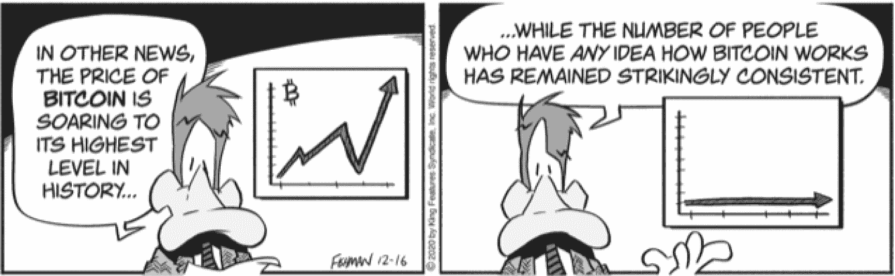

# 欢迎

很高兴你能来！你即将开始一段迷人的旅程，这是我在 2012 年开始的旅程。我当时正在采访著名未来学家雷·库兹韦尔，我们在他在哈佛的教职办公室聊天。聊天结束后，雷鼓励我参加“未来大学”的行政课程。他与彼得·迪阿曼迪斯共同创办了这个机构，帮助世界领导人学习如何运用技术解决全球挑战，并为地球建设一个更美好的未来。在雷的帮助下，我被录取进入了为期九天的深度挖掘指数技术的课程。该课程涵盖人工智能、机器人技术、机器学习、3D 打印、大数据、纳米技术、生物技术、金融科技、教育科技、农业科技等等。^(注)

就是在那里，我第一次听到了*比特币*这个词以及“加密货币”的概念。这对我来说毫无意义（尽管或者说因为我在金融领域的知识和经验）。然而，我感到很好奇。于是，我在 2013 年开始了对比特币的探索，并在 2014 年开始投资。随着我的知识增加，以及与许多涉及其中的人们的接触，我清楚地意识到两个事实：

首先，区块链技术及其可能带来的数字资产是革命性的。这是自互联网发明以来商业领域最深刻的创新。

其次，很少有人意识到这一点，包括绝大多数金融专业人士。

尽管加密社区已经创造了令人惊叹的产品和服务，但它还没有学会如何接触像你这样的投资者。而美国金融服务业的大部分，管理着三分之二的投资者资金，还没有完全意识到这个新资产类别中可获得的令人难以置信的投资机会。金融领域还不知道如何让其客户获得这些机会的访问权限。

这就是为什么我在 2018 年创建了金融专业数字资产委员会（Digital Assets Council of Financial Professionals）。如今，DACFP 被普遍认为是华尔街和美国企业界在这一话题上的主要资源。我们是连接加密社区与金融服务领域的桥梁。我们的角色是为金融专业人士提供所需的教育，以便他们可以向客户解释这些新技术，帮助每个人获得这些投资机会。 （已有数千名金融专业人士注册参加了 DACFP 的区块链和数字资产证书项目。）

在过去的十年里，我培训了数千名金融顾问和企业高管，教授他们有关区块链和数字资产的知识。具有讽刺意味的是，这些人拥有的投资知识和经验越多，就越难理解这一新的资产类别。事实上，我发现一个人拥有的大学学位、专业资格认证以及投资和金融经验的年限越多，就越难以理解这个话题。这只是因为区块链和数字资产技术与金融专业人士在职业生涯中所学到或经历过的任何内容都毫不相干。

所以，如果你对经济学、金融学、资产管理或投资组合分析一无所知——那么…… *恭喜你！* 你比所有的华尔街人士都具有明显优势！

如果你是（抱歉）那些拥有多年投资和金融经验的金融人士之一，我建议你，在阅读这些页面时，暂时搁置你那些辛苦积累的知识和经验。我知道这是一个很大的要求——我在金融领域工作了 37 年，自己也有六个专业资格认证，如果有人让我忽略我所知道的东西，嗯，是的，我会认为这是一个很大的警告信号。我只能说我理解你的感受。当我开始探索这个新的资产类别时，我也有同样的感觉。但我很快就意识到，我的知识和经验并没有帮助，反而是一个阻碍。我有很多假设、期望和判断要克服。我现在看到，我的最初抵制干扰了我对这项新技术及其提供的一切的理解之旅。所以，你可以从我的经验中受益，并按照我的建议继续——这将为你节省大量的时间和烦恼——或者你可以像我起初那样艰难前行。由你决定。

## 让我们使用正确的词语。

汽车曾经被称为*无马马车*——但想象一下，如果你告诉别人你想买一辆这样的车，你会得到怎样的表情。同样，比特币被介绍为*加密货币*——如果你这样称呼同样，比特币被介绍为*加密货币*—如果这就是你称呼它的方式，你会跟那些在下雨天穿胶鞋的人一样过时。

因此，让我们使用正确的术语。这是展示你有知识的最佳方式。技术是新的，很多词也是新的。它们通常源自或类似于熟悉的词语和术语，但有些只是不好的笑话。

我会在逐步解释它们，但是这里有几个关键术语值得一提。

首先，有*比特币*（大写）。然后，有*bitcoin*（小写）。*比特币*指的是计算机网络；*bitcoin*指的是在该网络上使用的资产。所以，你在比特币网络上买卖比特币。

是的，你可以在特定情况下使用 *比特币* 的复数形式。你会注意到我在整本书中如何处理它。你会慢慢习惯的。但如果有疑问，就用单数；这更像是 *鹿* 和 *鹿* 而不是 *猫* 和 *猫*。就像“我拥有很多比特币”，而不是“我拥有很多比特币”。

另外，在与行内人交流时，说 *加密* 也是可以的，就像我在十段落之前所做的那样。但一般来说，最好使用 *数字*。它比可怕的 *加密* 更友好，而且，此外，每个人都熟悉 *数字*，因为我们现在生活在一个数字世界里——Twitter 和其他社交媒体；PayPal、Venmo、Zelle 和其他在线支付应用；亚马逊和其他在线商店；等等。

Zelle

至于 *加密货币* 的后半部分，现在我们需要将其分成两部分：*货币*，是的，但也是*资产*。当你指的是其中一个时不要提及另一个。我们将在第八章更多地讨论这个问题。现在，只需意识到存在差异即可。

还有一个项目：*法定货币*。你会经常遇到这个短语。法定货币是由政府发行的，但没有任何东西作为支撑（比如黄金）；相反，公民们对政府支持货币的意愿和能力表示信任。当一个货币被，比如黄金（就像美元在 1973 年之前一样）支持时，可以印刷的货币数量受到政府持有的黄金数量的限制。通过用法定货币取代黄金支持的货币，央行可以更自由地控制印钞数量。今天，几乎世界上的每一种货币，包括美元，都是法定货币。

如果我不喜欢 *加密* 这个词，为什么在书的标题中使用它！？

由于这个术语，遗憾的是，仍然是通用的命名法。我的出版商认为这将是吸引读者的最佳方式，^(III)而且我发现很难不同意。但愿，现在你知道为什么最好停止使用这个术语了。

## 披露

本书描述了许多加密货币和代币，我和我的妻子 Jean 拥有其中许多。该书还包含了许多公司的名称和描述，我与其中许多公司也有关系。在某些情况下，我和 Jean 投资了这些公司的代币或货币。在其他情况下，我们投资了支持这些投资的公司。最后，一些公司是 DACFP 或我的媒体公司“关于你的未来的真相”（[thetayf.com](http://thetayf.com)）的赞助商或广告客户，该公司致力于向消费者和投资者教授区块链、数字资产和相关主题。最后，我是本书中提到的一些产品或服务的客户或用户。

因此，在提到每个代币、货币或公司的第一次提及的页面上，您将看到图标（如果需要额外披露，则为脚注）。图标及其含义如下：

我和 Jean 目前持有讨论中的资产。因此，我们在其成功上有经济利益。

截至目前，Jean 和我拥有所讨论的发行者的股权、期权、认股权证、顾问股票、可转换债券、债券或其他债务（或其产品、服务或投资被讨论）。因此，我们对发行者的成功有经济利益。如果您购买、雇用、订阅或以其他方式使用这些产品、服务或投资，发行者将获得收入，这可能反过来对 Jean 和我有利。

截至本文撰写时，讨论中的公司或产品或服务背后的公司是 DACFP 和/或 TAYF 的赞助商或广告客户。我有经济动机希望您购买、雇用、订阅或以其他方式使用其产品或服务（尤其是如果您告诉他们是我推荐的！），以便我增加说服他们继续或增加他们与我的公司的赞助和广告活动的机会。

截至本文撰写时，我是提到的产品或服务的客户或用户。

避免这些利益冲突的唯一两种方法是：Jean 和我可以放弃所有数字资产的所有权或停止我们的业务活动，但是，嘿，这不太可能发生。或者，我可以在书中省略对任何此类资产或公司的任何提及。那将对您造成极大的损失。这也会使这本书毫无意义，因为我甚至无法使用*比特币*这个词（本书中出现了 718 次）。

所以，由于这些冲突无法避免，我们正在采取次优策略向您披露这些情况。这样，凭借您自己的良好判断力，您可以得出自己的结论。

当您评估这些页面中呈现的性能数据时，请记住过去的表现不保证未来的结果。此外，我已经编制了几十个列表，帮助您找到投资、公司和提供有用产品和服务的供应商，使您在数字资产的世界中更容易参与。尽管我努力编制了准确和完整的列表，但对于任何错误或遗漏，我不承担责任。您应将这些列表作为自己研究工作的起点，而不是依赖它们来做出任何购买或使用参考产品或服务的决定。

## 现在，您已经准备好开始了！

在本书的第一部分，我将向您介绍区块链技术——它的工作原理以及为什么对我们的全球经济具有如此深远的变革性影响。在第二部分，您将了解比特币和其他数字资产。在第三部分，您将发现投资机会：如何选择适合您的投资项目，并将它们纳入您的整体投资组合。在第四部分，我们将涵盖监管、税收和合规性。在第五部分，我将通过回答您最常见的疑虑来帮助您入门。

单子大学

让我们开始吧！

1.  我。完成项目后，我受邀成为客座讲师并投资于该组织。我两者都做了。

1.  II。这也是你能立刻判断你正在交谈的人是否真正了解这个话题的方法。使用过时术语的人并不知道他们认为自己知道的那么多——而且你几乎每次谈论这个话题都会遇到他们。

1.  III。这招奏效了，嗯！
