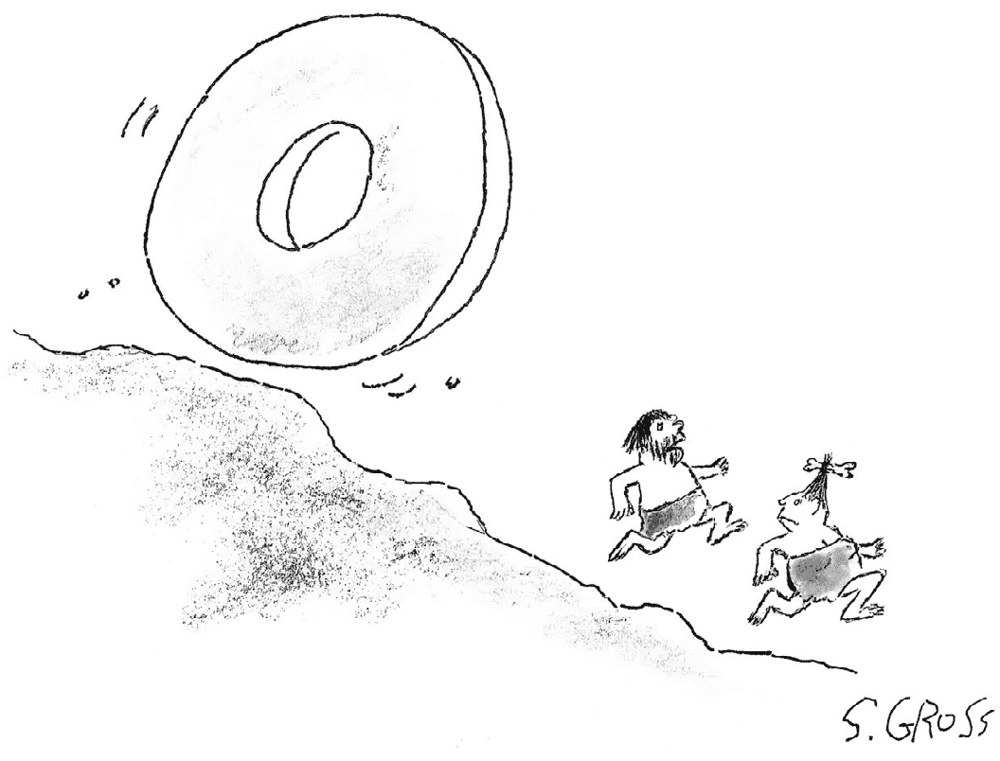
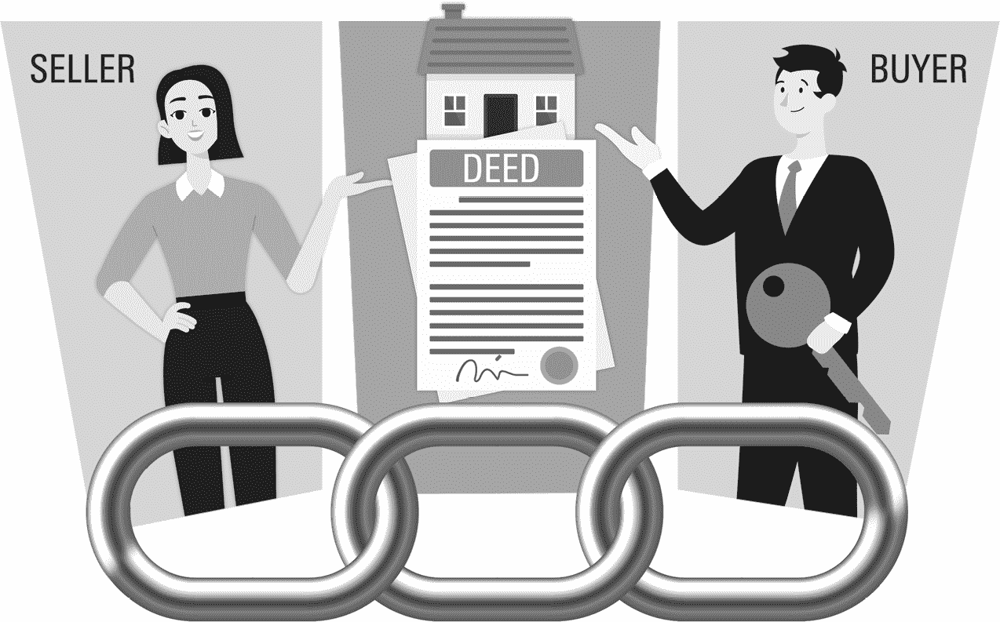
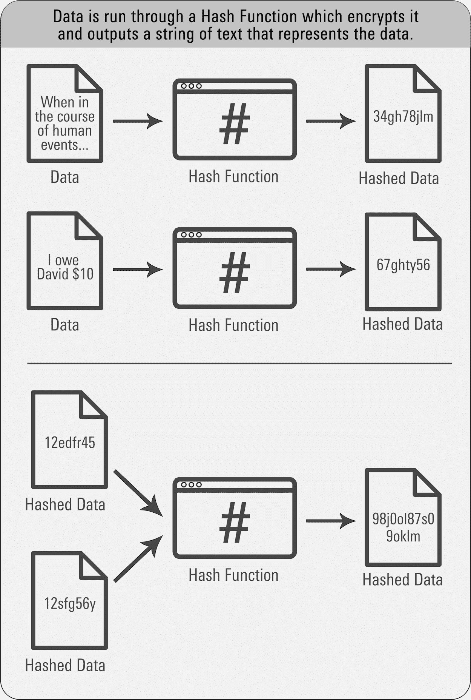
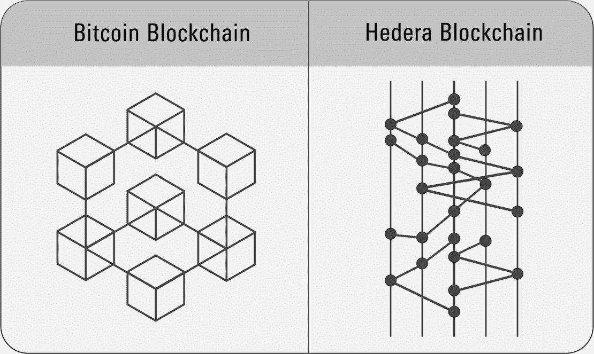

# 第一部分 理解技术

## 第一章 商业历史上四个最具变革性的创新

所有人类的进步都归功于创新——从新的思维方式到新工具的发明。在商业世界中，有人建议最具影响力的四个创新是：

+   火

+   轮子

+   互联网

+   区块链

确实很容易同意前三者改变了历史。但区块链呢？

*“你不应该让我展示给你它是如何工作的。”*

是的，区块链。将其视为互联网 3.0。第一次互联网使人们大规模连接起来——想想 Facebook 和社交媒体。你知道那有多有影响力（而且仍然有）。这导致了互联网 2.0（更常称为物联网，即物联网）。这个互联网将事物连接到彼此——我的狗戴着一条能告诉我的手机她是否离开院子的项圈。而在杂货店，一个 QR 码告诉自动结账亭我正在买香蕉。

互联网 3.0 是货币互联网，又称区块链。通过互联网连接货币对商业和社会的影响与人际互联网和物联网一样深远，因为“金钱推动世界运转”，互联网 3.0 将证明比其前任更具影响力。全球范围内的财富创造机会确实前所未有。

确实，纳斯达克表示区块链技术“在提高资本市场运作效率、增强透明度和安全性方面具有巨大潜力”。英格兰银行（相当于美国的联邦储备系统）更进一步表示，区块链技术可能会改变世界金融体系。全球超过 90%的银行正在开发区块链技术；仅 2021 年，美国银行就提交了超过 160 项涉及数字支付技术的专利申请。摩根大通表示，银行每年将节省 1200 亿美元。根据市场情报公司 IDC 的数据，2021 年，银行和其他公司在区块链研发上花费 66 亿美元，到 2024 年每年将花费 190 亿美元。几乎所有国家顶尖的学院和大学都提供区块链和数字资产课程，区块链工程师现已成为全国薪水最高的程序员，年薪超过 17.5 万美元。（根据 LinkedIn 的数据，2021 年美国针对“加密”和“区块链”职位的招聘数量增长了 1000%。包括摩根大通、纽约梅隆银行、德意志银行、富国银行、花旗集团、高盛、摩根士丹利、美国首都一家，瑞银、美国银行、瑞士信贷和巴克莱等主要金融服务公司在 2021 年比前一年多招聘了 40%的加密员工。工作包括销售专业人员、为消费者设计加密产品的员工和为银行建立区块链平台的工程师。）

激动不仅限于金融领域。MarketsandMarkets 报告称，区块链市场每年将增长 53%，到 2026 年将达到 32 亿美元。例如，*Billboard*杂志表示，区块链“为难以解决的问题提供了解决方案，如歌曲版权监控和版税及活动门票的可靠分配。”

所有这些都有助于解释为什么普华永道（PricewaterhouseCoopers）表示，区块链技术将在 2030 年前为全球 80 万亿美元的经济体增添近 2 万亿美元。确实是改变性的。

## 第二章 区块链为何如此变革性

区块链技术将会产生如此深远的影响，因为它革新了业务。而这一切都始于不起眼的账簿。

什么是*账簿*？它是一个记录存款和取款的地方。你的支票簿就是一个账簿。电子表格也是。两者都是私人的；只有你能访问它们，只有你决定谁能看到信息。如果你想欺骗，你可以创建一个带有虚假信息的第二个账簿，并且你可以向他人展示假账簿而不是真实的账簿。（这就是所谓的“二套账”，是阿尔·卡彭的崩溃之路。）

账簿在全球金融系统中被广泛使用。由于每个账簿都是私人的，它们的管理和维护成本很高，并且容易发生欺诈和滥用。因此，根据 IBISWorld 的数据，全球会计行业是一个价值 1200 亿美元的行业。难怪银行成本如此之高！

现在，想象一下存在于区块链上的账簿。它被广泛分布给每个拥有互联网连接的人，这就是为什么区块链也被称为 DLT，*分布式账簿技术*。与私人账簿不同，DLT 是公开的；任何人都可以随时免费查看它（只需访问[`www.blockchain.com/explorer`](https://www.blockchain.com/explorer)）。但尽管每个人都可以看到数据，但没有人可以修改它。事实上，区块链上的数据永远不能被任何人删除、更改或复制。

我刚刚描述的是革命性的。

你看，当我查看你的私人账簿上的数据时，我被迫相信你说的数据是合法的。这就是为什么我们的全球金融系统被称为信任经济。我们彼此之间做生意是因为我们相互信任。

但是信任是有限的。因此，我聘请审计员来确认你告诉我的是真实的。

信任（或缺乏信任）是购买房屋如此繁琐的原因。在你签署销售合同后，你会聘请一名结算律师进行产权搜索，以验证卖方确实拥有契据并具有合法出售的权利。然后，你会购买产权保险，以防产权搜索有误。与此同时，你申请抵押贷款，贷款人会核实你确实拥有你声称拥有的收入和资产。所有这些都会增加几个月的时间和数以万计的美元到交易中——但这并不会增加房屋的价值。你正在花钱进行验证，因为我们处在一个*信任经济*中。

区块链消除了所有这些。它将信任经济替换为*认证经济*。因为区块链上的数据是永久性的，我们不需要信任其合法性。它只是，天生如此。原因是：作为一个*分布式*记录，多个参与方（网络上的每台计算机）都有一个相同的副本。所有记录以这样一种方式链接在一起，以至于没有单个人是记录的唯一持有者，因此，没有人可以篡改记录（他们必须篡改每个地方存在的记录的每个副本，并且他们必须同时篡改每个副本）。

让我们回到我们的 Excel 电子表格。想象一下在 A1 单元格中输入关于你自己的数据。在 B1 单元格中，你会找到你房屋的契据，在 C1 单元格中是买方的信息。每个单元格都是一个区块。在每个区块内是数据。而这三个区块在链中相互链接。一个*区块链*。^(I)

因为数据已经被验证并链接在一起，交易可以几乎瞬间完成——就像你在杂货店买香蕉一样快。这意味着你立即有资格获得抵押贷款。无需产权搜索或保险。没有托管支付。你省去了数月的延迟，节省了成千上万美元的费用。当销售合同被接受的当天，你就能搬进新房。

图 2.1

不夸张地说，这对全球商业的转变是多么深远。这也是极具颠覆性的——因为如果你是结算律师或产权保险公司，你刚刚变得和制造马车一样过时了。

实际上，区块链消除了所有中间人，即介于买家和卖家之间的*中介机构*。多亏了区块链技术，我们不再需要他们。证券经纪人、律师、保险代理人、票务转售商——所有为帮助买家和卖家执行交易而处理文件工作的人可能都会失业。我们谈论的是美国 1000 万白领工作者，占国内生产总值的 21%。^(II)

### 区块链的特性

到目前为止，我们只看到了这项新技术的转型力量的一个例子。而且我们只是刚刚开始。由于其许多特性，区块链的能力是广泛的。其中包括：

1.  **1\. 它是去中心化的。** 没有单一的潜在故障点。没有单一的地点或个人可以威胁网络——无论是恶意的还是出于无能。

1.  **2\. 无串通。** 通过去中心化，操纵变得极其困难。

1.  **3\. 透明度。** 每个人都可以平等地访问所有记录。这是信息的民主化。

1.  **4\. 无偏权威。** 与中心化系统不同，这里没有等级制度。

1.  **5\. 不可变性。** 一旦创建，记录就无法被删除、复制或更改。

1.  **6\. 无限制。** 我们可以无休止地追加现有记录并提供新信息。

1.  **7\. 开源软件。** 该程序不仅可供任何人查看和审计，而且只能通过共识来进行更改。没有独裁者，没有首席执行官。

1.  **8\. 低交易成本。** 这项技术使用成本低廉，使其更容易接触到全球更多的人。

1.  **9\. 更快的速度。** 时间是我们所有人拥有的唯一商品，也是我们无法替代的，因此能够更快地完成交易是区块链的一个关键特性。

1.  **10\. 匿名性。** 在许多情况下，您可以将数据发布到区块链上并在保持隐私的同时执行交易。

### 区块链的好处

区块链技术有成千上万种商业应用。分布式账本技术使政府和企业能够以更高的速度、更高的安全性、更低的成本和更高的透明度运作。让我们看看其中一些关键用途。

#### 消费者购买

2020 年，有 4.2 万亿美元的商业交易是在互联网上进行的，占全球所有商业的 14%。其中大部分交易涉及信用卡；Visa 和 MasterCard 通常向商家收取约 2%的费用，美国运通和发现卡则为 3%。这约为每年 1000 亿美元的费用，商家将其转嫁给消费者，以更高的价格形式。 

Visa

美国运通

区块链技术允许消费者跳过信用卡基础设施，直接将资金传输给商家。这为消费者带来了巨大的成本节省，但也给信用卡公司带来了存在威胁。

#### 汇款

每年有 4 万亿美元从一个国家流向另一个国家。不仅是大公司在全球转移资金，普通人也在做：根据世界银行的数据，移民工人向另一个国家发送约 5000 亿美元，通常是给在家乡生活的家庭成员。

要通过世界银行系统向另一个国家汇款（称为*跨境汇款*），您需要使用 SWIFT，即全球银行间金融电信协会网络。每天有超过 11,000 家银行处理超过 3500 万笔此类交易，每笔汇款需要最多五天的处理时间，平均成本为所汇款额的 6.7%（在一些撒哈拉以南的国家甚至高达 20%）。如果是周五晚上，您必须等到周一早上才能告诉您的银行发起转账。（希望周一不是假日。）

借助区块链技术，您可以全天候、全年无休地转账。您的收款人将在几分钟内甚至可能在几秒内收到款项，而交易几乎是免费的——每年可为消费者和企业节省 2680 亿美元。像西联汇款这样的支付处理商可能会变得过时。

#### 企业融资

数百个政府（包括加拿大皇家银行、泰国银行、欧洲投资银行和世界银行）和公司（包括汇丰银行、高盛、法国兴业银行和桑坦德银行）已经通过区块链发行了债券。德国金融科技公司 Cashlink 表示，这样做可以削减承销成本 35%，并让投资者获得更高的收益率。

高盛

#### 外贸

跨境业务的公司面临着重大的财务风险，因为银行系统中的例行延迟。当您用本地货币购买产品时，海外商家必须将您的货币转换为其货币。转换所需时间越长，价格波动的风险就越大。即使您能迅速完成转换，转换货币也会产生相当大的费用。当您在国际度假时花费数千美元已经够糟糕的了。想象一下在企业采购上花费数十亿美元。损失可能是巨大的。

区块链技术可以解决这两个问题。转账实时发生，消除了外汇汇率风险，并缓解了现金流问题。通过区块链，货币可以在几秒钟内以相对较低的成本进行交换，这在时间和金钱上都是巨大的节省。

#### 可编程货币，又称智能合约

当你通过区块链向某人发送资金时，他们几乎会立即收到。但也许你不希望他们立即收到。也许你只想在他们履行承诺时支付给他们——比如送达你的披萨或者在某个特定日期、时间、温度、天气、政治或体育事件结果或其他条件下。通过智能合约，你的钱被发送了，但在满足所有条件之前不会被收到——使用区块链作为第三方担保账户。

以太坊

智能合约可能会改变全球范围内的商业交易方式。金融、制造业、房地产等领域的复杂协议可以更透明、高效、安全和合规地执行——保护买家免受卖家不履行承诺的风险。

#### 微支付

一个阻碍许多行业成功的问题是无法进行微小金额的支付。2020 年，鲍勃·迪伦将他的音乐目录权利卖给了一家出版公司。如果该公司决定将这些权利出售给投资者怎么办？拥有《打击乐手》的一部分股权会很酷——想象一下，每次这首歌在收音机或 Spotify 上播放时，你都能分到版税！

问题在于你的份额会很少。据报道，迪伦的 600 多首歌曲目售价为 4 亿美元。因此，每首歌平均价值约为 667,000 美元。假设这些歌曲以每股 1,000 美元的价格出售，那就是约 670 股“塔布林人先生”。当这首歌在电台播放时，它会获得 9.1 美分的版税。如果每年播放 12 次，每股将有 0.0016 美元的支付。正如我所说，你的份额会很少。

这么小的金额没有货币可供使用（便士只是美元的两位小数点），分发该付款的成本将使付款本身相形见绌。仅邮寄支票的邮票就要 55 美分，更别提支票的成本和发放和记录它的劳动力成本了。经济上不可能支付如此微小的金额。

但这仅因为美元的最小面额是便士，只有两位小数。但数字货币（由比特和字节、一和零组成）可以被分割成更小的单位。因此，将数字货币分割成仅为硬币的一亿分之一是很容易的。这已经实现了——正如我们将在第八章中了解的那样。而且，由于是数字货币，不需要邮费来发送它。因此，区块链技术使微支付成为可能，进一步提升了全球电子商务的潜力。

的确，世界上没有银行账户的成年人中有 17%（全球 3 亿人）拥有一部手机，这就是你需要访问数字资产的一切。新技术为数十亿人提供了前所未有的获取资金的机会。

#### 供应链管理

*供应链*指的是商品从工厂到消费者的流动。这个链条很长，从获取或制造原材料和零件开始，送到工厂，然后进行组装或装配，交付给批发商，然后是零售商，最终到达消费者手中。对于制造商来说，订购所有这些零件并跟踪它们和成品是很昂贵的。

多亏了分布式账本技术首次提供的共享记录，我们可以监控商品和服务在供应链中的流动。在分布式账本模型内，链条中的每个参与方都成为相互连接的。贸易商、货运代理、内陆运输公司、港口和码头、海运公司，以及海关、FDA、执法机构等当局，都在一个安全的系统内工作。每个人都分享实时信息，其中包括航运里程碑、货物详情、贸易文件、海关申报、传感器读数等。由于它是无信任的，该系统通过数字化和自动化全球贸易中的业务流程来促进合作。

再以渔业为例。挪威海产品协会正在使用 IBM 创建的区块链追踪鲑鱼的繁育、捕捞、存储和运输情况。在杂货店，消费者可以扫描每条鱼的二维码，查看鱼是何时被养殖的，以及离开海洋多久了。而渔民则可以防止欺诈和减少浪费。

或者考虑奢侈手表。世界上一些最负盛名的钟表制造商，包括江诗丹顿、雅典和宝玑，正在使用区块链技术追踪他们制造的每一只手表。这使得购买者可以从工厂到零售商验证每只手表的来源，并通过所有权变更来保证真实性。路易威登也在为其奢侈手袋采取同样的做法。

几乎每个行业都可以通过部署区块链技术找到类似的价值和好处。目前，大多数公司尚未参与。但可以肯定的是，区块链技术的应用将呈指数级增长；施乐公司在 1964 年发明了商用传真机，但在 1980 年代传真机并没有普遍存在于公司办公室。区块链技术变得同样普遍不会花费太长时间。医疗记录、金融交易、教育报告、环境信息——可以放在区块链上的数据列表是无穷尽的，公司和政府有巨大的经济激励去这么做。

真的无穷吗？可以肯定。我们已经从制造产品的角度讨论了供应链。但我们可以很容易地将这个对话延伸到金融服务行业，他们的产品是……钱。每家银行和券商公司的账簿？它们实际上只是金融数据的仓库。想象一下将所有这些数据转移到区块链上。知道会得到什么吗？每个供应链点上的所有世界商业活动的商业记录，存在于单一数据库中。每个人都可以跟踪每笔交易，无论涉及多少个中介。我们将以一种以前从未有过的方式有开放访问和透明度。 *这* 才是分布式账本技术的真正承诺。

#### 自主身份

与其让 Facebook 在您不知情且未经批准的情况下拥有并使用您的所有个人信息，而无需向您支付任何补偿，区块链技术能让您控制您的个人身份和信息。您可以按照自己的选择授予访问您的数字自我的权利，并且您可以得到补偿。

### 所有的最重要的益处与用途

将区块链技术视为一时的风尚、新奇玩意、玩具或选择是很容易的。在考虑它时，大多数美国人 —— 实际上是发达世界的大多数人 —— 可以合理地问：“有什么意义呢？”

毕竟，没有它我们也过得很好，非常感谢。我们的银行系统运作良好（尽管我们喜欢抱怨）。我们可以签订租约和购买协议，承诺稍后支付即可立即获得产品。我们可以轻松借钱买房子、车子和家具。今天没钱？没问题，我们可以把日常开支刷到信用卡上。我们银行账户里的钱？很安全 —— 我们从不担心银行可能关闭或政府可能没收我们的钱。

当然，如果你正在阅读本书，很有可能你不需要区块链来改善生活。你的生活已经相当不错了。

对于世界上另外 56 亿人来说，生活同样美好。但 20 亿人（包括美国 6%的家庭）就没那么幸运了。他们都是*无银行账户*的，意味着他们没有足够的资金来开立银行账户。因此，他们享受不到你我视为理所当然的任何好处。

想想信用吧。没有信用，你可能无法上大学、开车或买房 —— 更别提进行需要信用卡的购物（比如在线购物）。没有信用，企业无法投资于工厂、支付研究或产品开发成本，也无法轻松为产品的分销提供资金。确实，如果没有信贷，全球经济将受到严重阻碍。

但是这里有个有趣的地方。根据皮尤基金会的说法，20 亿无银行账户的人中，60%拥有智能手机，他们可以使用它获取和持有数字资产。这使他们可以创建他们的收入和购买的交易历史记录，从而让贷款人确定他们的信用价值。而那些愿意借出至少 25 美元的小额贷款人可以接触到他们。突然之间，无需银行的情况下就可以获得信贷，变得可行了。

一个很好的例子是 M-Pesa，它于 2007 年 3 月在肯尼亚推出（*M*代表“移动”；*pesa*是斯瓦希里语中的“钱”）。如今，96%的肯尼亚家庭在使用它。它还在阿尔巴尼亚、刚果民主共和国、埃及、加纳、印度、莱索托、莫桑比克、罗马尼亚和坦桑尼亚等国家可用。

M-Pesa 允许客户安全地接收和存储资金并支付账单。无需银行账户；您只需一部基本手机（智能手机用户可以下载应用程序）。肯尼亚政府表示，M-Pesa 显著减少了在现金经济中普遍存在的街头抢劫、入室盗窃和腐败现象。它还允许创建“智能电表”，这是预付设备，让低收入家庭按使用量支付电费和水费。M-Pesa 还用于向 10 万名难民提供食品配送，消除了中间商，从而降低了援助分发成本，同时为难民营中的人们创造了就业机会。

所有这些解释了为什么了解数字货币的美国人中，仅有 18%支持政府发行数字货币，而无银行账户的人中有 42%支持。这也解释了为什么尼日利亚 32%的人口拥有比特币（根据 Statista 的数据，尼日利亚是全球加密货币采用率最高的国家），为什么萨尔瓦多宣布比特币为法定货币（以及为什么巴拿马、乌克兰和巴拉圭也计划这样做），为什么古巴正式接受比特币供其公民使用，以及为什么越南（21%的成年人拥有比特币）、菲律宾（20%）、土耳其（16%）、秘鲁（16%）和印度（9%）是比特币人均持有量最高的国家。

Stastista

区块链提供了迄今为止消除全球贫困、提高数十亿人生活水平并促进全球经济增长的最佳途径，这有助于全球每个人。毫无疑问，这是区块链的最大承诺和最重要的好处和用途。

尽管所有这些好处令人兴奋，但要记住，目前来看，这些好处主要仅仅是承诺。目前使用的应用程序很少，用户相对较少。在评估我们将在第三部分介绍的投资机会时，请记住，商业基本面仍然适用。公司是否提供客户想要的服务？区块链的部署是否解决了真正的问题，还是只是一种营销噱头？您应该像对待任何潜在投资一样谨慎。

1.  见了没？这东西真的并不那么复杂。

1.  参见：到 2035 年将被淘汰的具体哪些工作，请参阅《关于您未来的真相》第十四章。

## 第三章 区块链——以及比特币——的发展历程

大多数人将区块链技术的概念归功于写于 2008 年描述该想法的一篇白皮书的中本聪（Satoshi Nakamoto）。实际上，我们应该感谢斯科特·斯托内塔（Scott Stornetta）和斯图尔特·哈伯（Stuart Haber）。他们在贝尔实验室相遇。斯科特拥有斯坦福理论物理学博士学位；斯图尔特拥有哥伦比亚大学计算机科学博士学位。他们共同撰写了 1991 年描述他们概念的开创性论文（获得了 1992 年计算机软件 Discover 奖）。在中本聪 2008 年的白皮书中引用了八次，其中三次参考了斯科特和斯图的工作。

那么，为什么中本聪如此出名？因为中本聪解决了阻止区块链技术发展的问题。

### 重复提现的问题

假设奶奶给你寄了一张 50 美元的生日支票。你想花这些钱，但没有人会接受支票作为支付。他们不知道支票是否真实，也不知道奶奶账户中是否有 50 美元来支付。 （又是这个*信任*问题。）因此，你把支票存入银行账户，并等待它清算。然后你取出钱来花。

不久以前，你必须亲自去银行，把奶奶的支票交给出纳员。再见，支票；你好，银行账户余额增加。然后，在 2009 年，美国联合服务汽车协会成为第一家接受奶奶支票照片的银行。你只需用手机拍张照片，然后将照片通过电子邮件发送给银行。

但是等等。你还持有实体支票。什么能阻止你在发送照片后走进银行分行存入支票呢？通过用同一张支票进行两次存款——一次通过手机，一次在实体分行——你的账户会有 100 美元，而不仅仅是 50 美元。在银行意识到你做了什么之前迅速取款，你就把钱翻了一番。

当然，这是犯罪行为；网络安全公司 F5 表示，银行每年因此诈骗案件损失 17 亿美元，这种诈骗被称为*重复提现欺诈*。

这个问题也可能存在于区块链中。如果两份相同的契约副本被张贴呢？如果两个人都声称是同一栋房子的买家或所有者呢？

中本聪解决了这个问题。本质上，中本聪的创新在于对放置在区块链上的每个数据块进行时间戳和加密。一旦完成，每个人都知道这些信息是可靠的，因为它已经过身份验证。不需要信任。

### 比特币的引入

好的。明白了。你需要使用区块链技术来加密验证数据。但为什么需要比特币呢？

答案很简单。中本聪将这个新的区块链称为*比特币*。要向链上提交一块数据，你需要一种传输方式。中本聪称之为*比特币*。^(III) 比特币对于比特币网络来说就像筹码对于赌场一样。如果你想玩扑克，你必须将你的美元换成筹码。筹码是你的传输方式——你用它们来玩游戏。玩完后，你可以把筹码换回美元。对于区块链也是如此：如果你想把数据块放到链上，你必须使用系统内部的硬币。中本聪发明了它们，而不是称之为美元、便士、筹码、代币或股份，中本聪称之为比特币。

所以，如果你想参与中本聪的区块链，你必须使用比特币。它有自己的股票代码（BTC），就像公开交易的股票一样。

### **什么激励了中本聪去解决银行问题，发明比特币呢？**

2008 年，全球陷入了全球信贷危机。抵押贷款人向无法偿还贷款的人提供了贷款，当那些数百万房主违约时，贷款人损失了所有的钱。

最大的借贷者——Countrywide Financial，以及 IndyMac Federal Bank 和 Washington Mutual Bank 纷纷倒闭。政府接管了房利美和房地美。Bear Stearns 倒闭，随后是 Lehman Brothers。政府救助了花旗集团，然后安排了美国银行收购梅里尔·林奇，后者面临破产。与此同时，富国银行收购了华科维亚，高盛和摩根士丹利成为受联邦储备系统监管的银行控股公司。全国最古老的货币市场基金储备主要基金资产为 600 亿美元的储备主要基金“跌破底线”，成为第一个亏损的基金（从而在华尔街引发了“抛售”潮）。最后，国会通过了 7000 亿美元的紧急资产援助计划，以拯救福特、通用汽车和克莱斯勒——以及全球最大的保险公司 AIG。

福特

美国银行

所有这些都令人震惊和前所未有，而且发生得非常迅猛。紧急资产援助计划帮助避免了经济崩溃，但引发了新的恐惧：大量货币涌入经济，导致联邦债务激增，可能引发全球通货膨胀失控。

Satoshi 感到厌倦了。难道我们的全球金融系统没有更好的运行方式吗？因此，在 2008 年 12 月，金融危机的最低谷时，中本聪发布了一份九页的白皮书，“比特币，一种点对点的电子现金系统。”[^IV] 在这份文件中，中本聪描述了问题：

> *传统货币的根本问题在于需要信任才能使其运作。中央银行必须受人信任不会贬值货币，但法定货币的历史充满了对这种信任的违背，这个观念就是问题的根源。*

中本聪建议的解决方案是什么？你不必阅读白皮书。[^V] 相反，只需阅读标题。让我们专注于它的确切文字。

**比特币** 这个标题的第一个词是 Satoshi 全新发明的介绍。这个名字是 *coin*（指钱）和 *bit*（指计算机比特和字节，数据的基础）的巧妙组合。

**点对点** 这意味着“你和我之间”。使用比特币时，没有中间人，没有买方和卖方之间的人。这在世界当前的金融系统中很少见，那里几乎总是有一个中间人。

**电子货币** Satoshi 创造了一个旨在在数字时代、利用互联网的系统。重要的是，与法定货币不同，这里没有涉及纸质货币。

**现金** 这个新的电子系统提供了一种将现金从一个人或实体转移到另一个人或实体的方式。

**系统** 这就是比特币的本质——一个完整、自包含的系统，使所有这一切都能正常运行。

* * *

简而言之，Satoshi 的白皮书展示了数字货币如何作为世界央行发行的纸币的替代品。

现在你知道 Satoshi 为什么创建了比特币。但它是如何运作的呢？

1.  I。没有人知道 Satoshi 是谁。许多人认为 Satoshi 是一个人；还有人认为 Satoshi 是一个团队合作发明比特币的名字。

1.  II。Scott 是我在数字资产金融专业人士委员会的一位成员，在那里他教授一些金融专业人士参加的在线自学课程，以获得他们的区块链和数字资产证书。

1.  III。我更希望用一个不同的词而不是将相同的词转换为小写，以帮助避免混淆，但 Satoshi 没有征求我的意见。

1.  IV。你可以在[bitcoin.org](http://bitcoin.org)上阅读它。

1.  V。即使我刚告诉过你。

## 第四章 区块链的工作原理

我们从数据开始。假设你有一个文件，从简短的文本到博士论文都有可能。也许你有一个简单的银行记录，显示你欠你的兄弟 10 美元。

无论数据是什么，我们都会将其转换为*哈希*。哈希是表示数据的计算机代码字符串。这些字符串可能很长，如果原始文档中只改变了一个字符，它就会产生一个全新且不同的哈希值，与之前的哈希值相连。例如，这就是产权证书与卖方之间，然后与买方之间的关联方式。

区块链上的链接是安全的、不可破解的，并且它们广泛分布在全球所有的计算机节点之间。这些链接一起形成了一个单一的记录，加密社区称之为*真实的单一来源*。

更重要的是，任何类型的记录——不仅仅是金融交易——都可以放入区块链。

顺便说一句，我可以告诉你，链上的一系列区块并不一定是线性链接的。例如，哈希图是比特币更新、更复杂（有些人说更优越）的区块链。那又怎样呢？对你来说，最重要的是，无论如何将区块链接在一起——这是区块链的核心所在，它保证了区块的完整性。

说到方向盘、油门和刹车，你的汽车还有一个其他的必不可少的部分：钥匙。没有它，你无法进入汽车或启动发动机。区块链也有钥匙；每个都称为数字签名。

图 4.1 

图 4.2

在我们的旅程中的这个时候，阅读本书的区块链技术专家可能已经秃顶了—因为他们由于我对 DLT 工作原理的极度简化而懊恼得拔光了头发。但是，请原谅我，技术爱好者，这是一本面向消费者和投资者的书籍；它不是一门大学 301 编程课程，也不是旨在帮助任何人成为区块链软件工程师的书籍。

所以，亲爱的读者，让我们你和我粘在一起，而科技爱好者则会拿起一杯冰镇 IPA（当然用比特币支付），然后放松下来。你所阅读的一切都是准确的，尽管是简化的。你得到了基本信息，因此你已经足够熟悉这个新生态系统，能够决定是否要参与—如果选择参与，如何最好地去做。

换句话说，我正在教你如何开车——这意味着向你展示油门和刹车踏板以及方向盘；我们不是在探讨内燃机的原理。

### 公钥和私钥

每个数字签名都由两个标识符组成—一个*公钥*和一个*私钥*。

你的私钥就像密码中的**希望钻石**一样宝贵。价值巨大。不可替代。它是分配给你的（不，你不能选择自己的），而且非常长，所以不要试图记住它。当你进行交易时，你的私钥生成你的公钥，而是你的公钥与他人分享。

这样想：你的私钥就像是你访问电子邮件账户的登录凭据。你的公钥就像是你与他人分享的电子邮件地址。你绝不会与任何人分享你的私钥。

保持你的私钥私密是至关重要的。这是你唯一可以从分布式账本中检索数字资产的方法。如果你丢失了你的私钥，你将永远失去对你的数字资产的访问权限。如果有人得知了你的私钥，他们可以窃取你的数字资产。

听起来可怕吗？担心你的私钥可能丢失或被盗吗？我在第十六章有一个解决方案。^(我)

### 公共区块链 vs. 私有区块链

到目前为止，我们一直在谈论公共区块链。它们是*无需许可的系统*—因为你无需任何人的许可即可加入或参与，也无法被排除或审查。

但有些区块链是私有的。每个由公司运营，因此被称为*经过许可的系统*，因为运营它的公司在让你使用它之前会验证你的身份。2019 年，摩根大通推出了 JPM Coin，成为全球第一家推出自己区块链的银行。JPM Coin 允许银行的客户在 24/7 跨境进行即时支付。

但要访问摩根大通的系统，你必须完成银行的 KYC/AML 程序。这些了解客户和反洗钱法旨在帮助政府打击恐怖主义、毒品交易和逃税行为。银行和证券经纪公司必须了解他们正在与谁做生意，并在怀疑有问题时向监管机构和执法部门发出警报。

如果摩根大通协助与未知人士进行交易，就会被银行监管机构关闭。但比特币网络让你保持隐私。有些人甚至称这是比特币的最佳特性。尽管人们有你的公钥，但他们不知道你是谁。^(二)

1.  我。敬请关注！

1.  二。现在你知道为什么勒索软件攻击者经常要求用比特币支付了。
