# 第二部分 理解比特币和其他数字资产

## 第五章 比特币是如何工作的

Satoshi 于 2009 年 1 月 3 日推出了比特币区块链。第一个写入账本的区块被称为创世区块^(I)或区块 0（是的，你仍然可以看到它）。

创世区块引用了伦敦一家报纸的头条：“总理在银行第二次救助的边缘。”

创世区块值得注意的是它并非金融性质。它只是一段文本，这对于一套以数字货币闻名的系统来说颇具讽刺意味。尽管这段文本被广泛视为对世界央行的批评（这也是比特币被发明的原因），但第一个区块不是货币的事实显示了区块链技术的真正价值：它可以作为*数据*的存储库。

但是，Satoshi 的论文并未强调数据或区块链；它强调了货币。数字货币。因此，阅读论文的每个人都关注货币和比特币。六年后，人们开始认真关注区块链，这是使比特币存在的基础技术。

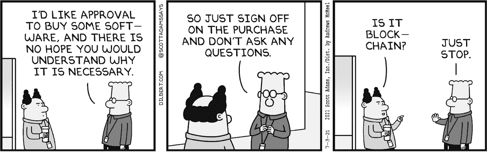

### 比特币存储在哪里？

你知道，当你把钱存入银行账户时，你的银行会在其账本系统上维护你的存款记录。这是一个封闭或*集中化*的账本——它仅对你的银行和你可见。银行在大型数据中心上花费了大量资金来存储所有数据。

但是，谁在操作 Satoshi 构建的区块链？Satoshi 不是一家公司，也没有客户。那么，它是如何运作的呢？

记住，比特币是分布式账本技术。现在，关注*分布式*。比特币账本不像美国银行那样集中化。相反，它是*去中心化*的——分布在全球数百万台计算机上。因此，没有公司、政府或个人（包括 Satoshi）控制它。

相反，比特币计算机网络在全球范围内通过互联网运行。比特币网络上的每台计算机都被称为一个*节点*。节点保存数据。

### 我们怎么知道节点上的数据是真实的？

简单地说，你将一块数据发布到比特币网络上。网络上的某个人使用他们的计算机来验证数据；这个过程大约需要 10 分钟。一旦验证完成，数据块将作为新的区块添加到区块链上。一旦在那里，它就是永久的，并且始终可供所有人查看。

### 为什么会有人费心验证我的数据？

当我将数据发布到网络上时，我需要有人为我验证它。为了吸引你这样做，中本聪创造了一种激励措施：当你将我的数据添加到区块链上时，你会得到报酬。这被称为*区块奖励*。获得奖励证明你已经完成了验证我的数据的工作。

区块奖励不给你美元。相反，你得到的是*比特币*。

当中本聪于 2009 年启动比特币网络时，数据验证者每验证一个区块就会获得 50 个比特币。50 听起来很多，但当时，比特币的挖掘成本低廉，没有明显的价格，也无法转换成任何实际的东西。所以那 50 个比特币并不是你会考虑有价值的东西。

但计算机程序员喜欢尝试新的想法。所以他们不是玩视频游戏，而是说：“算了，我们来玩这个新的比特币网络吧。”起初，收集区块奖励很容易。毕竟，那时候没有很多人试图赚取它们。

如今，全球数百万人争夺区块奖励；竞争是激烈的。

### 挖矿

解密一个区块所需的复杂数学方程被称为*挖矿*。

你如何提高赢得区块奖励的机会？这就像一场汽车比赛：最好的司机配备最快的车最有可能获胜。因此，即使你可以用一台普通的台式电脑挖掘比特币，你也应该考虑购买一台速度非常快的计算机。

比特币挖矿计算机的成本约为 12,000 美元。事实上，购买成千上万台计算机，并将它们链接在一起以进一步增加您的计算能力。世界各地都有*计算机农场*，每个都竞相成为第一个解决每个区块独特加密难题的人，从而赢得区块奖励。

我提到，2009 年的区块奖励是 50 比特币。但现在不是了。这是因为，大约每四年会发生一次*减半*^(II)：区块奖励减半。减半分别发生在 2012 年、2016 年和 2020 年，将区块奖励从 50 减少到 25，然后到 12.5，目前到 6.25 比特币。在下一次减半——2024 年 1 月——区块奖励将变为 3.125 比特币。奖励将在 2028 年再次减半，然后再次减半，直到 2140 年挖出所有比特币为止。

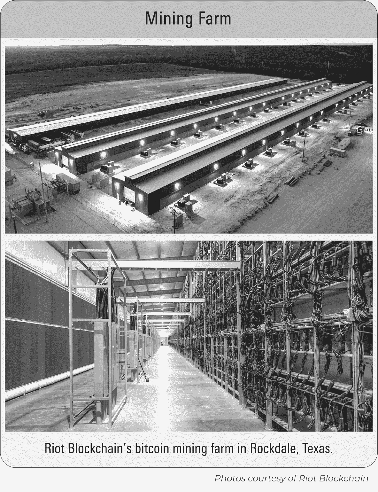

由于这个原因，许多人看好比特币的价格。如果区块奖励减半，价格必须翻倍才能使矿工维持他们的补偿水平。比特币的价格*总是*在每次减半后上涨。这种模式会持续吗？没有人知道（过去的表现不代表未来的结果），所以请自行决定。

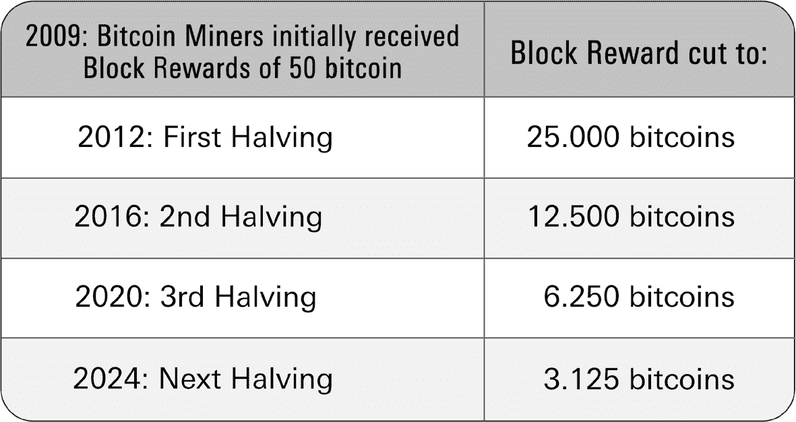

图 5.1

#### 工作量证明 vs. 股权证明

挖矿被称为 PoW，或*工作量证明*。这都是“认证”命名法的一部分——通过解决复杂的计算问题，比特币区块链在密码学上验证每笔交易。“信任”是不需要的。

但是 PoW 并不是验证区块链数据的唯一方式。您还可以通过 PoS，或*股权证明*来实现。 

股权证明的发展是因为对 PoW 的批评：它完全依赖于纯粹的蛮力——即，您的计算能力。您拥有的计算机越多，您的机器越快，您赢得区块奖励的可能性就越大。但是所有这些计算机设备都会消耗大量电力（本章后面会详细介绍）。PoS 避免了这个问题（以及随之而来的批评）。

PoS 协议就像一个抽奖。如果有 5000 张彩票，而你只买了一张，那么你中奖的几率就是 1/5000。但如果你买了一千张彩票，那么你中奖的几率就是 1/5。所以，在 PoS 区块链中你持有的币越多——你持有的*投资*越多，明白吗？——你赢得区块奖励的几率就越大。因此，PoS 协议鼓励人们购买币；理论上，随着更多的币被购买，价格也会上涨。

PoW（工作量证明）和 PoS（股权证明）是验证区块链上数据的两种最常见的过程（称为*共识机制*）。但它们并不是唯一的。还有其他方法（比如时间和空间的证明），而且定期会有更多的方法被发明出来。但是其他的方法都还不常见，因此在这里不值得讨论。^(III)

### 有多少比特币会被创造出来？

不同于联邦储备系统不断印制的美元，比特币总量只有 2100 万个——从 2009 年第一枚比特币产生到 2140 年最后一枚。到目前为止，大约已经创造了约 1850 万个比特币，而且大约有 400 万个被认为丢失了。

***迷失了吗？！***

是的。事情就是这样。记住，2009 年和 2010 年间比特币还没有约定好的价格。只有一小群电脑技术人员在玩这个网络，花费时间得到毫无价值的“奖励”。其中许多程序员失去了兴趣并且退出了，删除了他们的文件，以及他们的比特币。其他人买了新电脑（然后扔掉了旧电脑）。还有一些人遭受了硬盘崩溃，或者干脆忘记了他们的私钥。

容易得来，容易失去。当时比特币没有被赋予价格，因此那时真正“失去”的并不是有价值的东西。

矿工并不是在区块链上唯一竞争的人。用户也是。如果你希望你的交易比其他人先被验证，你将支付交易费，这样矿工就会优先为你服务。（这有时被称为燃气费——就像，你应用的燃气越多，你就越快。也就是说，你支付的越多，你的交易就越快被验证。）

随着区块奖励不断减半，交易费用对于矿工来说将变得越来越重要。 这确保了即使没有更多比特币作为奖励，也会支付验证。

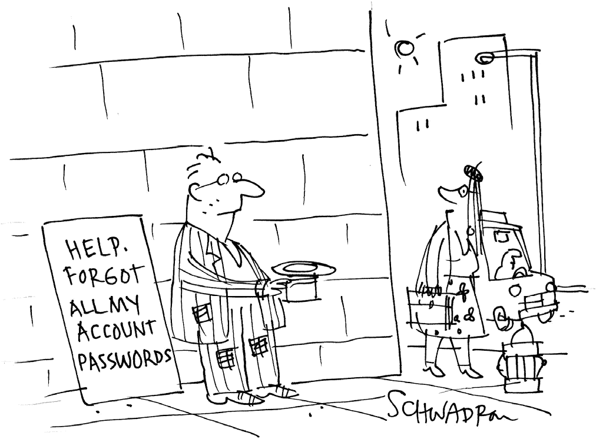

一个现在在华尔街工作的人告诉我，2010 年初，他刚从麻省理工学院毕业不久，一个前室友邀请他过去，说：“你一定要看看我们在做什么。” 到达目的地后，发现他的前室友和另外三个人在挖比特币，他问：“那是什么？”

在接下来的周末，他们五个人昼夜不停地挖矿，积累了 250 个比特币。 到星期天晚上，这个人筋疲力尽。“我们刚刚花了两天两夜浪费时间，收集这个一文不值的东西！”他宣称。“我们都在浪费时间！”

他们都放弃了。 他们关闭了电脑，销毁了文件——连同其中的比特币一起。“如果我们继续下去，”这个人带着一丝苦笑告诉我，“今天，我们都会成为亿万富翁。”

就像这样的故事有数百个，有些人在意识到自己正在放弃之前就放弃了。 然而，还有些人非常清楚地知道他们已经放弃了什么，比如英国的詹姆斯·豪尔斯（James Howells），35 岁，他在 2021 年告诉世界，8 年前，他不小心把一个含有 7500 比特币的硬盘放进了垃圾桶。 他请求市政厅允许他搜索垃圾堆，甚至提议如果找到比特币，他将向市镇提供 25％的比特币。 截至目前，市政会拒绝了，理由是环境问题。

还有斯特凡·托马斯（Stefan Thomas），他是旧金山的一名计算机程序员，他在一个便携式硬盘上存储了价值 3000 万美元的比特币，然后忘记了密码。（请记住，这是一个去中心化的账本系统；没有公司为您提供一个“忘记密码”按钮来帮助您。）

最后，还有亿万富翁米尔西亚·波佩斯库（Mircea Popescu）的悲惨案例，他被广泛报道为世界上最大的比特币持有者之一。2021 年，他在哥斯达黎加海岸溺水身亡。新闻报道称，他的家人或业务圈子中没有人知道他的私钥。如果属实，他据称拥有的数十亿美元比特币永远丧失了。^(IV)

尽管这些故事令人震惊，但它们并不新鲜。财政部表示，已经有 31 万亿美元的美元丢失或被销毁——其中包括自 2014 年以来生产的价值 30 亿美元的便士。

### 钱包类型

你知道什么是钱包。你的口袋或钱包里有一个！^(V)

你把钱放在钱包里。同样，你把数字资产存放在数字钱包里。傻瓜。

好的，好的，但是你从哪里获取数字钱包呢？它们是由您使用的应用程序提供的。例如，当您建立 PayPal 或 Venmo 帐户时，它们会为您创建一个钱包，用于存放您放入其应用程序的资金。Google、Walmart、Apple、Android、三星和许多其他公司都为他们的用户提供数字钱包。

苹果

亚马逊

PayPal

Venmo

如果您在数字资产交易所开设账户，它也会将您存入的资金放入数字钱包中。（数字资产交易所类似于股票交易所。第十六章将进一步介绍。）

数字钱包被称为*热钱包*，因为它与互联网连接。这一点很重要，因为如果您没有互联网连接，您将无法访问该应用程序或指示其将资金转入或转出您的钱包。

热钱包也有这个问题：它们与互联网相连。这使它们存在风险，因为黑客可能会访问您的钱包并窃取其中的内容。为了解决这个问题，您可以创建或获取一个*冷钱包*。这些钱包不与互联网连接，因此不受在线黑客的影响。

许多供应商以大约 100 美元的价格出售冷钱包，它们使用起来很容易。它们看起来（实际上就是）像闪存驱动器，就像您用于存储在桌面或笔记本电脑上创建的数据的那种。冷钱包用于存放您的数字货币和代币，因此它们带有加密（只有您知道的私人密码）。如果有人偷了您的冷钱包，他们将无法访问其中的内容。

当然，您可以使用任何闪存驱动器；只是不会有任何加密。或者您可以简单地将您的私钥写在一张纸上——然后将那张纸存放在一个安全的地方。

冷钱包免受在线黑客的攻击，但并不安全免受普通窃贼的侵入。而且存在着丢失、忘记存放位置或忘记密码的风险。还记得那个把比特币存储在加密驱动器上然后忘记密码的人吗？

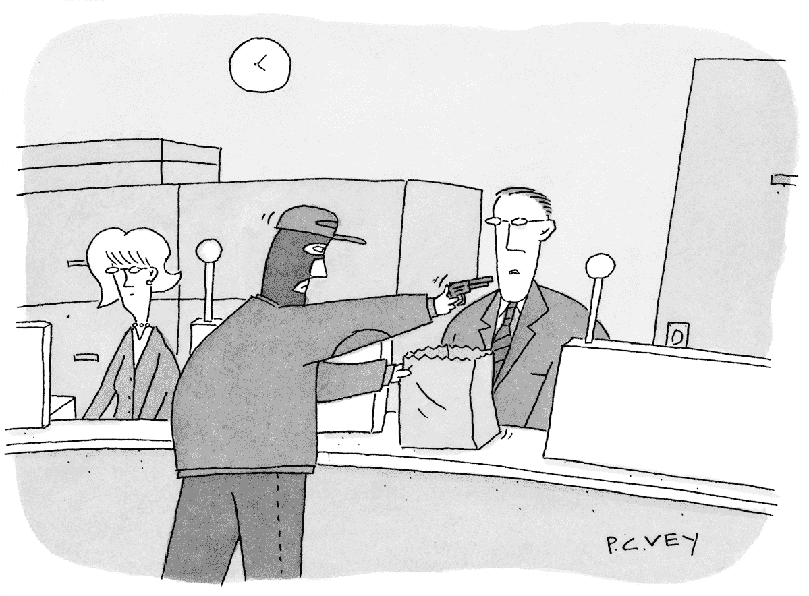

*“你知道，你也可以轻松地在线完成这个步骤。”*

冷钱包的最后一个问题是其中存储的资金无法用于消费。当您准备出售您的数字资产或将其用于购买商品或服务时，您必须将币上传到您的应用程序的热钱包中。从热钱包转移币到冷钱包，然后再次转回来可能很烦琐且耗时。但这确实可以减少黑客风险，因为您的币只在热钱包中存放足够长的时间以执行交易。

为了减轻麻烦，一些应用程序提供了*暖钱包*。您的币在热钱包中保管，但您设置了限制资金发送到何处的指令。只有当您向同一钱包（其他人或供应商）频繁发送资金时，这才有效。

针对这一切有两种解决方案。第一种是与数字资产交易所开户。他们会为您提供热钱包和冷钱包；您只需告诉他们你想要在每个钱包里放多少个币。 （您随时可以在它们之间轻松转移币。）

另一种解决方案是将你的资金投入基金，而不是直接买币。这就像购买股票基金而不是购买个别股票一样。许多基金投资于数字资产；一些对任何拥有传统经纪账户的人都可用，而另一些只对合格投资者（即：富人。有关他们的更多信息请参阅第十六章）可用。

一些基金投资于单一数字资产，而另一些则购买一篮子硬币，提供更多的多样化。所有基金都收取费用，您应该将其与您在交易所产生的交易成本进行比较。我们将在第十六章中更详细地讨论所有这些。 

### 比特币的首次商业应用

让我们回到早期的比特币挖矿者。他们每个区块奖励都能获得 50 个比特币，虽然赢得和积累它们很便宜和容易，但却无法确定它们的价值。

冷钱包硬件设备

| **BC Vault**[bc-vault.com](http://bc-vault.com) | BC Vault 是一个冷存储加密货币钱包，将用户的私钥存储在安全的硬件设备上。每个 BC Vault 都预装了一个私钥，以与设备上的其他钱包相同的方式加密。这个私钥对应着一个拥有 1.0 BTC 的公共地址。 |
| --- | --- |
| **BitBox**[shiftcrypto.ch](http://shiftcrypto.ch) | BitBox 是瑞士制造的硬件和软件，用于轻松存储您的数字资产。 |
| **BitLox**[bitlox.com](http://bitlox.com) | BitLox 具有使用终极硬件钱包的安全性和“暗网”-基于的隐私访问工具的能力。BitLox 可以与 TOR-based 访问一起使用。 |
| **Coldcard**[coldcard.com](http://coldcard.com) | Coldcard 是一个超级安全、开源的硬件钱包，可以通过加密的微型 SD 卡轻松备份。您的私钥存储在专用的安全芯片中。MicroPython 软件设计使您可以进行更改。 |
| **CoolWallet**[coolwallet.io](http://coolwallet.io) | **CoolWallet**是一款信用卡大小的蓝牙硬件钱包，支持各种代币，包括比特币、以太坊、莱特币、瑞波币、ERC20 等。 |
| **D’CENT Biometric**[dcentwallet.com](http://dcentwallet.com) | **D’CENT Biometric**通过**D’CENT Hardware Wallet**保护客户的数字资产，后者是软硬件安全解决方案的组合。 |
| **ELLIPAL**[ellipal.com](http://ellipal.com) | **ELLIPAL Titan**是一款完全隔离网络的离线冷存储设备。ELLIPAL 冷钱包能够完全防止远程和在线攻击。 |
| **KeepKey**[shapeshift.com](http://shapeshift.com) | **KeepKey**是一款没有操作系统的冷存储钱包。PIN 码和密码保护防止未经授权的使用。您可以在一个设备上获得可定制的交易速度和无限的钱包地址。**KeepKey**由 ShapeShift 拥有，ShapeShift 是一个数字资产平台，使客户能够购买、销售、交易、跟踪、发送、接收和与他们的数字资产进行互动。 |
| **Keystone**[keyst.one](http://keyst.one) | **Keystone**提供给高级用户一个高端冷存储钱包（Cobo Vault），并为机构投资者提供托管服务，支持 30 多种币种和 700 多种代币。 |
| **Ledger Nano X**[ledger.com](http://ledger.com) | **Ledger Nano X**可以通过电缆临时连接到 Mac 或 Windows 设备，以便您购买、销售、兑换、质押、借出和管理 1500 多种代币。可选择的 Live Ledger 移动应用通过蓝牙管理钱包；否则，无线连接将被阻止。 |
| **NGRAVE**[ngrave.io](http://ngrave.io) | **NGRAVE ZERO**是 100%隔离并且没有 WiFi/蓝牙/NFC 的空气隔离设备，没有 USB 互联网连接以防止在线攻击。相反，它使用单向 QR 码传递信息。不锈钢外壳防火。 |
| **Opendime**[opendime.com](http://opendime.com) | Opendime 是一个小型 USB 设备，可让您花费比特币。它连接到任何 USB 接口，因此您可以查看余额。 |
| **Prokey**[prokey.io](http://prokey.io) | Prokey 硬件钱包是一种离线、冷存储和安全设备，可将您的私钥保存在离线状态下并保护好，同时使您能够接收、存储和签署交易，发送比特币、以太坊、莱特币、泰达币等数字资产。 |
| **Secalot**[secalot.com](http://secalot.com) | Secalot 是一款硬件加密货币钱包。它是一个小型 USB dongle，具有 OpenPGP 智能卡、U2F 认证器和一次性密码生成器功能。 |
| **SecuX**[secuxtech.com](http://secuxtech.com) | SecuX 技术提供军用级别的 Infineon SLE Solid Flash CC EAL 5+安全元件。其跨平台操作包括 SecuX 网页和移动应用程序，支持 1,000 多种数字资产，可达 500 个账户。 |
| **Trezor**[trezor.io](http://trezor.io) | Trezor 是世界上第一款比特币硬件钱包。Trezor One 和 Trezor Model T 冷钱包都支持超过 1,000 种硬币，具有易于使用的 LED 界面，与 Windows、Mac 和 Linux 兼容，并具有多种安全功能，包括 PIN 输入、口令输入和设备恢复。 |

为了弄清楚，软件开发者拉兹洛·汉叶茨提出用比特币购买两个 Papa John's 比萨。他在 2010 年 5 月 22 日找到了一个愿意参与的人。在那个日期——今天亲切地称为*比特币比萨日*——拉兹洛完成了世界上第一笔使用比特币的商业交易。

两个派共需花费$14。完成交易所需的比特币数量？

一万。

以每个价值$50,000，那 10,000 个比特币将价值$500,000,000。五亿美元。

那些披萨非常昂贵。

### 其他收到硬币的方式

挖矿和质押并不是获取硬币的唯一方式。还有其他方式。

#### 叉子

我所指的不是你用来吃意大利面条的工具。相反，它指的是当在一个区块链上工作的开发人员对技术的运作方式有不同意见时会发生什么。而且，不，我不是说其中一个会大喊，“去你的！”

在创建比特币时，中本聪开源了软件代码，以便其他开发人员可以改进它。没有共识就无法进行更改，但有时无法达成共识。例如，一些开发人员开始抱怨比特币的速度慢（每个数据块的验证需要 10 分钟）。如果我们改变代码，他们说，我们可以让比特币变得更快。但是加快速度，其他人指出，会削弱其安全性。

无法达成共识，开发人员于 2017 年 8 月同意将比特币分成两部分，称为*分叉*。这类似于当一家大型公司进行拆分时发生的情况，将一个部门变成一个独立的独立公司。^（VI）

当公司拆分和加密货币分叉发生时，现有的持有者保留他们已有的东西。他们还会得到新实体的一部分。在 2017 年的分叉事件中，所有的 BTC 持有者都收到了一些 BCH，即新的*比特币现金*币。然后，比特币现金被修改以提供更快的速度。（今天，BCH 几乎比 BTC 快 17 倍。）

将 BTC 转换为 BTC 和 BCH 称为*硬分叉*，因为现在有两个区块链而不是一个。在*软分叉*中，新旧两种币都使用原始的区块链。

比特币现金

比特币 SV

如果你在想，不，BCH 的硬分叉并没有解决开发者的争执。进一步的分歧导致了另一个硬分叉——这次是从 BCH 到 BSV（比特币 Satoshi Vision）。BSV 承诺严格遵循中本聪的白皮书。它比 BTC 快 128 倍，支持者说它提供了更好的用户体验、更低的成本和更大的安全性。（截至目前，BTC 是最大的数字资产；BCH 是第 19 大，BSV 是第 51 大——这表明人们并没有完全接受分叉所声称的改进。）

在过去十年里，涉及许多硬币的分叉有数百个，因此上面只是几个例子。顺便提一下——这是一个很重要的顺便提一下——分叉也会产生税务影响，我们将在第二十章中介绍。

#### 空投

另一种创建硬币的方式是通过*空投*。这个术语是基于 2008 年开始使用的*直升机货币*一词，当时联邦政府向经济注入了 7000 亿美元，以应对信贷危机。

发生了什么呢？你创建了一个新的、比比特币更好的协议。为了让人们使用它，你创建了硬币并发送给持有某些其他硬币的人——也许是与你的硬币相似（但在你的看法中是次优的）的硬币。这就像一个新乐队试图引起注意一样——它在当地酒吧预订了一场演出，并向附近每一家邮寄了免费门票。

空投通常只是营销噱头。为了收到硬币，你有时必须做一些事情，比如关注某个特定的 Twitter 账户。是的，收到空投会有税务影响（第十九章）。

### 关于比特币与非法活动的担忧

罪犯、恐怖分子和流氓国家喜欢在不透露身份的情况下执行金融交易。比特币的一个重要特点就是匿名性。因此，坏人自然而然地被吸引过来。

比特币

想象一下，能够在不必通过银行系统转移资金的情况下购买和出售毒品、枪支和盗窃的信用卡！这就是非法互联网网站 Silk Road 在 2011 年促成的事情。

2013 年，FBI 关闭了 Silk Road。2021 年，黑客向 Colonial Pipeline 要求 440 万美元比特币，FBI 在两周内就帮助 Colonial 追回了大部分资金。而当黑客从 Poly Network 窃取了 6.11 亿美元的数字资产时，几乎所有被偷的钱都在几天内被归还。这些犯罪是如何如此迅速地被解决和追回资金的呢？因为数字资产留下了数字足迹。（只需 Poly Network CEO 发一条推文表示他知道黑客的电脑和电子邮件地址。瞬间！钱立刻就被返还了。）

我并不是在暗示拥有数字资产没有风险。许多托管平台都曾遭受过黑客攻击，包括 Mt. Gox、Bitfloor、NiceHash、BitFunder 和 Bitstamp。2014 年至 2020 年期间，美国证券交易委员会对区块链和数字资产采取了 87 项执法行动，包括欺诈性证券发行、与加密货币交易相关的欺诈行为、未能适当披露薪酬以及涉及比特币的庞氏骗局。这平均每年约有 15 个案件。

但这只是每年超过 700 起美国证券交易委员会执法行动中的一部分，这意味着加密货币仅占美国证券交易委员会案件的 2%。同样，Chainalysis 在 2021 年的一份报告中发现，犯罪活动仅占所有加密货币交易量的 0.15%。这直接与财政部长珍妮特·耶伦在 2021 年声称数字资产“主要用于非法融资”的说法相矛盾。事实上，Compound Labs 的总法律顾问杰克·切尔文斯基告诉《福布斯》：“她的声明显然是错误的。”

让我们记住，每一种资产类别都存在欺诈行为：股票、债券、石油、黄金、房地产、艺术品等等。没有人建议关闭这些市场。每一项创新，不幸的是，都伴随着恶棍的出现——这是一个不可避免的附属品。

事情一直都是这样的。美国第一笔公开交易的证券是亚历山大·汉密尔顿发行的联邦债券，用于偿还殖民地在革命战争期间所欠下的债务。汉密尔顿的计划泄露了，债券很快就陷入了有史以来的第一起投资欺诈：内幕交易。（内幕人士从退伍军人那里以便士为单位购买债券，知道汉密尔顿很快就会以面值兑现它们。）

自从有了投资以来，就存在投资欺诈。就像汽车的发明导致了汽车盗窃一样。

联合国的数据证明了因为非法活动而批评比特币的荒谬性。联合国估计，日常洗钱和其他非法活动占全球 GDP 的 2%到 5%。因此，与其因为少量比特币被恶意使用而禁止它，我们不应该先消灭所有法定货币吗？因为它们被不当使用的程度远远超过了比特币。

### 关于比特币挖矿对环境的影响的担忧

也许你想购买比特币，但你听说它“对地球有害”。你可以继续购买比特币，并因此感到高兴，因为“对地球有害”的说法是错误的。

这种说法只不过是一种分散注意力的手段，通常是由那些不认为比特币是一个好的投资理念的人所吹嘘的。（我们将在第三部分讨论*那个*问题。）

由于批评者无法阻止人们购买比特币或阻止比特币的价格上涨，他们已经转而采取了这种其他策略：罪恶感。“比特币对地球有害！”那又怎样？抽烟、喝酒和赌博对你都有害，但我们并没有将它们禁止。相反，我们仅仅对它们进行监管。比特币也可以采取同样的方式处理。

或许比特币不需要这样的处理。也许它对我们并不像吸烟、酗酒和赌博那样有害。让我们来探讨一下，从比特币挖掘每年消耗的能源与阿根廷相同的抱怨开始。

阿根廷？

我查过了。这个说法显然是正确的。但同样正确的是阿根廷并不消耗太多能源：在世界上最大的 30 个工业化国家中，它排名垫底。

在你因比特币的能源消耗而感到不安之前，你可能会对汽车感到不满。美国能源信息署报告称，交通运输是世界上最大的能源浪费者，消耗了全球能源的 25%。但根据剑桥替代金融中心的数据，比特币网络的能源消耗不到全球能源的 0.5%。因此，如果你愿意开车、坐公交车或乘坐飞机，那么购买比特币应该不会有任何问题。

汽车并非总是消耗如此大量的能源。在 1920 年，汽车行业还处于起步阶段时，它们的能源消耗很少。随着汽车的普及，它的能源使用量也在增加。

比特币也是如此。十年前，比特币的能耗很少。今天它消耗大量能源反映了不断增长的需求。这是成功的标志。有人认为汽车至少有商业用途，但正如我们所见，比特币也有宝贵的商业用途。

所以，与其抨击比特币，不如抨击一个更耗能的东西——一个更糟糕的能源浪费，因为它根本没有任何有用的目的。我说的是你家里那些常开着的设备：你的电视，咖啡壶，Alexa，还有你烤箱上那个愚蠢的时钟。这些设备每年在美国消耗 3.44 亿千瓦时的电力，并向空气中排放 2.5 亿吨二氧化碳——根据自然资源保护委员会的数据，这占美国温室气体排放总量的 4%。仅在美国，这些设备消耗的能源就比全球所有比特币矿工消耗的能源还要多！所以，在你让比特币矿工关掉之前，你可能想告诉人们每晚拔掉电视的插头。

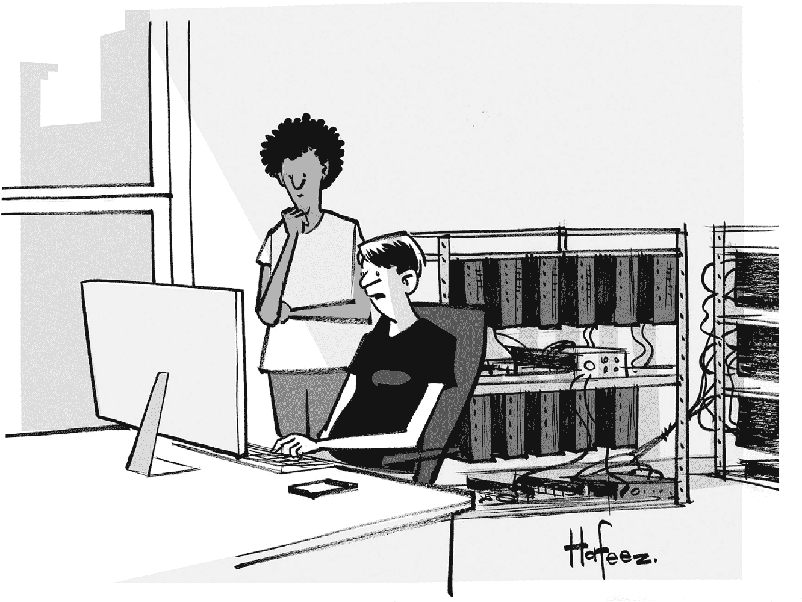

*“我们挖比特币挣了 30 亿美元，减去我们的电费，结果只有 1.61 美元”*

如果你真的想消除能源浪费，告诉大家停止玩视频游戏。一项 2020 年的研究发现，视频游戏玩家消耗的能源比全球比特币矿工多 46%。

#### 排放量，而不是能源

抱怨比特币能源消耗的人忽略了一个重要的观点：你使用多少能源并不重要。重要的是你排放了多少二氧化碳到大气中。

运输行业使用的能源近 80%来自石油、天然气和煤炭。它们的使用排放了大量的二氧化碳，对地球不利。但是比特币 73%的能源消耗是碳中性的。剑桥比特币能源消耗指数显示，矿工主要使用水力、太阳能、风能或地热能。只有 38%依赖煤炭。因此，《Joule》杂志在 2021 年报告称，比特币的年全球排放量约等于伦敦市的排放量，而不是整个阿根廷国家的排放量。

想象福特说，虽然制造汽车需要大量能量，但驾驶员使用汽车时却不需要能量。但如果真是这样就好了。但对于比特币来说，情况却是如此：几乎所有比特币的能源消耗都被挖矿所使用。一旦硬币被挖出，购买或出售它们所需的能量是极少的。

尽管如此，比特币的能源消耗并非为零。我们确实需要做出改变，加密社区的每个人都知道这一点。这就是为什么正如《哈佛商业评论》所指出的那样，许多人签署了加密气候协定（类似于巴黎气候协议），该协定主张减少比特币的碳足迹。

挖矿者可能比任何其他行业都更多地为解决世界能源危机做出贡献。为什么呢？因为他们有最大的动机这么做。对于大多数行业来说，材料和工资是它们最大的支出。但对于挖矿者来说，能源价格是第一大成本。这给了他们降低能源成本的巨大动力——这反过来又激励他们寻找更便宜的替代能源。例如，许多矿业公司已将其设施搬迁到可以利用可再生能源的地方，如风力发电场和水力发电站。毫无疑问，其他行业也会使用比特币网络提出的任何解决方案。

我不认同比特币因为对环境有害而应该被禁止的观点。但如果你持有这种看法，那就别买比特币了。而是买权益证明币。问题解决了。

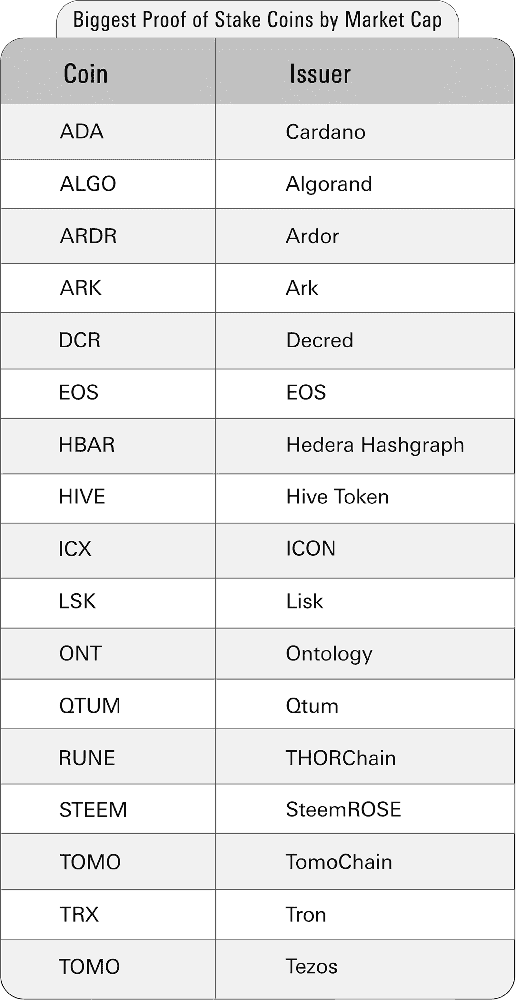

图 5.2 

ADA

算法

1.  我。这是加密社区在其新词汇中努力创造的一个很好的例子。当然，这里的参考是《创世纪》这本圣经中的第一本书，以及通常使用 *genesis* 一词来表示某物的起源或开端。

1.  II。或者 *halving*。比特币使用者都使用这两个术语。我会让语言学家来解决这个争论。

1.  III。不客气。

1.  IV. 这不是一本谈论资产规划的书，所以去读一本有关这方面的书：*关于金钱的真相*。

1.  V. 看吧？你真的比你意识到的更了解这个主题。

1.  VI. 注：分叉的税收处理*不*类似于拆分。更多内容请见第二十章。

1.  VII. 烤箱为什么需要时钟呢？

## 第六章 谁在使用比特币？

自拉兹洛用 10,000 个比特币买了几块披萨以来，我们已经走了很长一段路。比特币的年交易量现在已经超过 1.5 万亿美元——是 PayPal 的两倍多，是 Discover 的六倍多。难怪，在撰写本文时，比特币的市值超过了摩根大通、万事达卡、联合健康、家得宝和华特迪士尼公司。然而，比特币没有办公室，没有员工，也没有股东。它真的是革命性的。

公司从 2021 年开始提供与比特币关联的信用卡；当你使用这张卡时，不是获得现金返还或航空公司积分，而是获得比特币——Visa 表示其客户已经在比特币奖励卡上花费了超过 10 亿美元。万事达卡也为“在当今数字经济中为客户和企业提供安全可靠的体验”，而 PayPal 让其 3.25 亿用户在其平台上购买比特币，并用其在连接到应用程序的 2,400 万商户中进行购物；该公司表示将近 20% 的用户已经这样做了。

世界第三大保险公司安盛现在允许客户使用比特币支付，原因是“客户需求增长”，指出“比特币使支付变得简单”。在线旅行社 Travala 表示已经预订了 1,000 万次旅行，其中 70% 的客户使用比特币支付。美国联合抵押贷款公司允许房主用比特币支付抵押贷款。

零售商并不是唯一接受比特币的人。政客也在接受。联邦选举委员会允许候选人接受比特币政治捐款。沃顿商学院允许参加数字资产课程的学生用比特币和以太坊支付学费。成千上万的慈善机构和非营利组织也接受比特币捐款。

图 6.1

### 谁拥有比特币？

据[Crypto.com](http://Crypto.com)称，截至目前，有 2 亿人拥有比特币，其中包括 24%的美国成年人。Coinbase 是苹果商店中最受欢迎的免费应用程序。另外 63%的成年人称自己是“加密好奇者”。人们参与其中是因为他们听说了很多关于它的事情。

这并非偶然；加密货币社区正在努力确保你了解比特币。 Coin Cloud，一家安装比特币 ATM 的公司（是的，你可以在路边的亭子上购买比特币，沃尔玛正在全国范围内安装比特币 ATM 在商店里），聘请了斯派克·李（Spike Lee）执导并主演了一则电视广告。另一家比特币 ATM 运营商 CoinFlip 聘请了尼尔·帕特里克·哈里斯（Neil Patrick Harris）出现在他的广告中。亚历克·鲍德温（Alec Baldwin）为 eToro 交易所做广告。马特·达蒙（Matt Damon）在广告中推广[Crypto.com](http://Crypto.com)，该公司还聘请了综合格斗运动员朗达·罗斯（Ronda Rousey），篮球明星卡梅洛·安东尼（Carmelo Anthony），滑雪者林赛·雅各贝利斯（Lindsey Jacobellis），说唱歌手 CL 以及宇航员斯科特·凯利（Scott Kelly）。竞争对手 FTX 聘请了两次 NBA 最有价值球员史蒂芬·库里（Stephen Curry）担任品牌大使，而交易所 Voyager Digital 则签约四届超级碗冠军罗布·格朗科夫斯基（Rob Gronkowski）担任品牌大使。流行歌手玛丽亚·凯莉（Mariah Carey）正在推广加密交易所 Gemini。格林湾包装者队四次 NFL 最有价值球员亚伦·罗杰斯（Aaron Rodgers）与说唱歌手梅根·西·斯泰利恩（Megan Thee Stallion）和歌手麦莉·赛勒斯（Miley Cyrus）合作 Cash App，在 Twitter 和 Instagram 上进行了一百万美元的比特币赠送活动。在一名球迷接到了坦帕湾海盗队四分卫汤姆·布雷迪（Tom Brady）投出的第 600 次触摸下，布雷迪给了这名球迷一个比特币。布雷迪和他的妻子，超级名模吉赛尔·邦辰（Gisele Bündchen），购买了加密交易所 FTX 的股权，现在是该公司的大使。洛杉矶斯台普斯中心，NBA 湖人队和快船队，NHL 国王队和 WNBA 火花队的主场，现在是[Crypto.com](http://Crypto.com)竞技场。（该公司支付了 7 亿美元以确保 20 年的命名权。）达拉斯小牛队已与比特币交易所 Voyager 合作，而 NBA 和 WNBA 则与 Coinbase 达成了多年协议，使其成为其独家加密货币赞助商。餐厅巨头 Landry’s（拥有 Bubba Gump Shrimp，Morton's The Steakhouse，Rainforest Cafe 等几十个品牌）推出了一个忠诚度计划，当您消费 250 美元时，将获得 25 美元的比特币。阿迪达斯正在与 Coinbase 合作（“可能什么都没有”，阿迪达斯在一条推文中开玩笑说）。汉堡王正在与 Robinhood Crypto 合作，赠送比特币，以太币和狗狗币。汉堡王甚至在俄罗斯推出了自己的数字资产，名为 WhopperCoin。 AMC 影院宣传称现在接受比特币，以太坊，比特币现金和莱特币支付，并报告说其 14％的电影观众通过这些数字资产购买在线电影票。

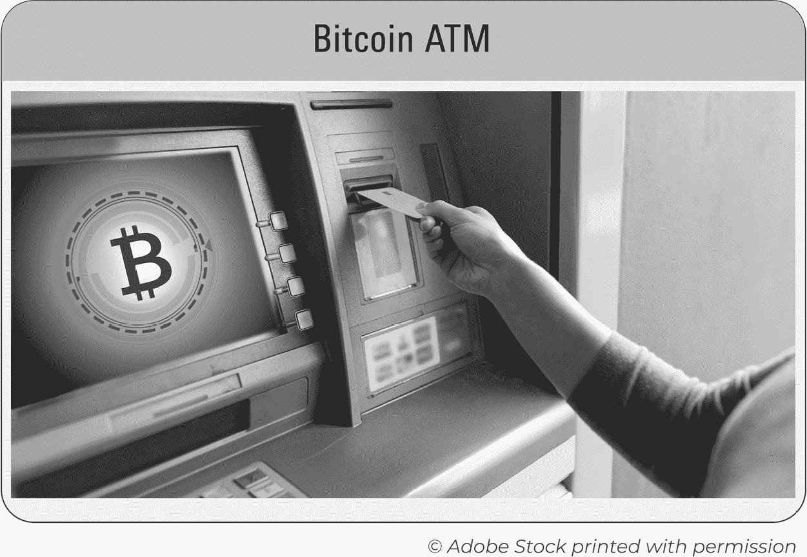

所有这些不仅仅发生在美国；这是全球性的。例如，在印度，70%的电视广告出现在板球世界杯期间，宣传加密货币公司。

施瓦布

Voyager Digital

Grayscale

纽约梅隆银行

所有这些宣传，加上比特币和其他数字资产价格的大幅增长，已经创造出一股看似不可阻挡的力量。Coinbase，一个公开交易数字资产的在线交易所，现在拥有的账户持有者比查尔斯·施瓦布公司还要多。施瓦布在 2019 年报告称，其千禧一代客户持有的前十大资产中包括 Grayscale 比特币信托基金（我们将在第十六章学习）。事实上，施瓦布表示，千禧一代拥有的比特币比他们拥有的伯克希尔·哈撒韦、迪士尼、Netflix、微软或阿里巴巴的股票还要多。

美国最古老的银行之一纽约梅隆银行（由亚历山大·汉密尔顿于 1792 年建立）现在为比特币和其他数字资产提供托管服务。亚马逊正在墨西哥开展数字货币项目。摩根大通、高盛、美国银行美林和麦士途都为他们的客户提供比特币服务。优步接受比特币支付。

数字资产银行

| **Anchorage Digital Bank**[anchorage.com](http://anchorage.com) | Anchorage Digital Bank 是美国第一家国家数字资产银行。作为联邦特许的合格托管人，它保管客户资金，持有证券，并使 RIAs 满足联邦托管义务。账户持有者可以在 Anchorage 的监管区块链协议下抵押和借出数字资产。 |
| --- | --- |
| **Avanti Bank & Trust**[avantibank.com](http://avantibank.com) | Avanti 银行与信托是一家为数字资产与传统金融系统建立联系的怀俄明州银行。Avanti 是数字资产的托管人，可以满足最严格的机构托管标准。 |
| **Kraken**[kraken.com](http://kraken.com) | Kraken 是第一家在怀俄明州获得银行特许经营许可作为 SPDI 的数字资产交易所。Kraken 银行客户可以在数字和法定货币之间无缝银行，并将资产从他们的银行账户转移到他们的投资和交易组合中。 |
| **Silvergate 银行**[silvergate.com](http://silvergate.com) | Silvergate 银行是联邦储备成员银行，是增长中的数字资产行业的创新金融基础设施解决方案和服务的主要提供商。 |

美国国家银行监管局已经开始批准银行接受和托管数字资产。2021 年，美国国家银行监管局批准了第一家数字资产银行，安克雷奇数字银行。

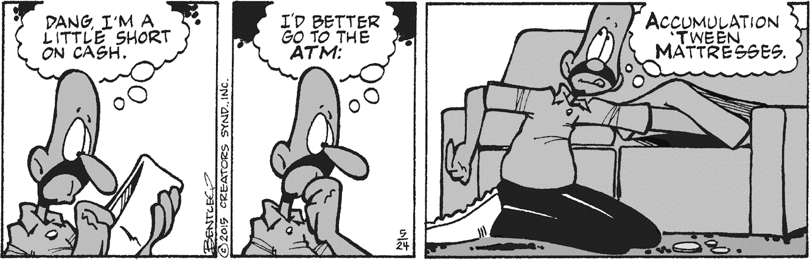

社区银行和信用社也在为零售投资者提供服务。通过与成立于 1884 年的现金注册公司 NCR 和数字资产投资公司 NYDIG 的合作，来自 650 家银行的 2400 万银行客户（美国所有金融机构的 40%）可以在他们的手机上交易比特币。

并且我们不能忘记孩子们。数十个暑期加密营教授年仅五岁的孩子如何挖掘比特币。父母也可以参与；你只需要诺顿防病毒软件。点击一个按钮，你的电脑就会在你不使用时挖掘比特币，让你通过简单地开启电脑就能赚钱。

普通消费者不是唯一参与其中的人。高盛表示，其 24%的富裕投资者和 10%的机构客户也在交易数字资产，另外还有 20%有兴趣这样做。摩根大通表示，其 10%的机构客户现在也在交易数字资产。

富达

富达数字资产

每个主要公司都在帮助其客户购买数字资产。摩根士丹利提供比特币投资基金，花旗集团设有数字资产部门，美银美林通过其数字资产研究团队让客户交易比特币期货，州街全球投资者有数字资产基金服务部门。富达通过富达数字资产为机构客户提供服务，富兰克林·坦普尔顿也设有数字资产部门。

大学捐赠基金也在购买数字资产，包括哈佛、耶鲁、麻省理工、斯坦福、达特茅斯和北卡罗来纳大学的基金。德国的 4,000 个养老基金和捐赠基金管理着 2.1 万亿美元的资产，在 2021 年获得政府批准，可以将资产的 20% 投资于数字资产。（如果他们都按照法定限额投资，将有 4000 亿美元流入比特币和其他数字资产。）美国的养老基金已经开始投资，包括休斯顿消防员救助和退休基金、费尔法克斯县（弗吉尼亚州）雇员退休系统和警察退休系统。

先锋

黑石

ARK

富兰克林·坦普尔顿

马拉松数字

微战略

亿万富翁也拥有数字资产，包括保罗·图多·琼斯、斯坦利·德鲁肯米勒、里卡多·普利格、比尔·米勒、雷·达里奥、乔治·索罗斯、马克·库班、蒂姆·库克、彼得·蒂尔和比尔·格尔利。

公司也在购买数字资产：贝宝、方块、微战略、时代、麻省互助保险公司和特斯拉。 CNBC 的吉姆·克莱默说，作为企业财务储备的一部分拥有比特币“几乎是不负责任的”。

贝宝

CNBC^(注释)

许多基金经理也投资比特币，包括文艺复兴、拉夫尔、古根海姆、布里奇沃特、黑石、天桥。愚人节也是如此。

天桥

比特币已经变得如此普遍，以至于现在成为你税表上的第一个问题。IRS 表格 1040 问道：“在任何时间内，您是否收到、出售、发送、交换或以其他方式获得任何虚拟货币的任何金融利益？”这是 IRS 表示，它知道许多美国人拥有数字资产，但没有向政府报告他们的交易，也没有支付应付的税款的方式。

1.  我。我也经常出现在 CNBC 和 [CNBC.com](http://CNBC.com) 上。

## 第七章 为什么有这么多币种？

中本聪于 2009 年发明了比特币来取代法定货币。一枚硬币有一个目的：一个电子现金系统。

结果证明，比特币有一些局限性。例如，它的价格波动很大。比特币的平均每日价格波动为 3%，是股市的三倍。波动对于一种货币来说是不利的，所以有人创建了泰达币，这是第一个 *稳定币*，其价格应该等于美元或其他法定货币的价格。（关于稳定币的更多信息请见第八章。）

还有其他人意识到比特币需要很长时间（七秒）来验证每一笔交易。Visa 每秒处理 1700 笔交易（即每天 1.5 亿笔）。这导致了 Litecoin 的出现，它每秒处理 56 笔交易——比比特币快得多，但仍然比 Visa 慢得多。^(我)

另外一件事。比特币交易被立即处理，这可能不是你想要的结果。以太坊引入了智能合约，让你可以控制你的传输的时机。

好吧，我们刚刚确定了三个合理的理由，说明为什么比特币不够用，以及为什么需要引入泰达币、莱特币和以太币。再加上一些解决方案、创新和改进，你就可以证明可能需要十几种币。

然而，CoinMarketCap 列出了 11,233 种货币和 393 个交易所，在这些交易所你可以购买到它们。而且每天都有更多的货币出现。许多货币是噱头，有些是骗局（详见第十三章），还有一些纯粹是市场营销策略，旨在吸引消费者的注意力和金钱。还有很多只是品牌延伸。

前几天，我去了李维斯的网站买一条牛仔裤。网站要求我选择我喜欢的合身度，并提供了这些选项：锥形、直筒、修身、运动、休闲、紧身、喇叭、原版、宽松、极高腰或西部风格。然后我被问及我想要 501 牛仔裤，还是 502、505、510、511、512、513、514、517、527、531、541、550、551、559 或 569。我想要黑色、蓝色、棕色、深色水洗（不管那是什么）、绿色、灰色还是卡其色？等等，我们还没结束。我想要叫做 Sustainability、WaterLess、有机棉、TENCEL、莱赛尔、棉麻、回收聚酯纤维、回收棉、或 Repreve 的材料，我想要我的牛仔裤是有弹性的还是无弹性的，是有破洞的还是没有破洞的？我还必须选择风格：西裤、工装裤、短款、高球卷边、慢跑裤或西部风格。我想要 100%棉、全季节科技、定制（哦不！）、生态舒适、大麻、弹性或细带？最后，我想要纽扣还是拉链？

李维斯

海因兹

我买番茄酱也遇到了同样的问题。海因兹提供了各种规格的番茄酱，当然，还有：

+   不含人工甜味剂

+   无添加盐

+   无添加糖

+   仅用蜂蜜调味

+   添加了各种蔬菜

+   用 Tabasco 辣椒酱调制的热辣口味

+   用真正的墨西哥辣椒调制的哈拉皮尼奥辣味

+   用 Sriracha 调制的香辣口味

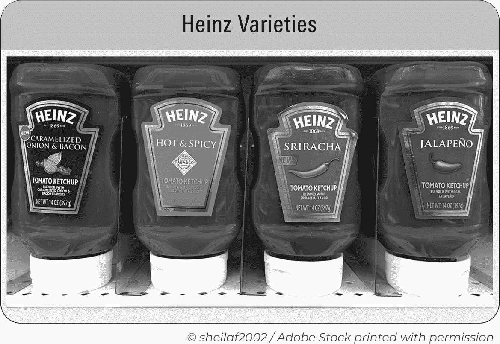

如果你认为中本聪在 2009 年发明比特币将永远是我们唯一需要（或最终拥有）的数字货币，那么当你把番茄酱洒在牛仔裤上时，请记住这一点。

### 数字资产宇宙

数字资产生态系统复杂而不断增长。世界经济论坛将所有硬币分为四类之一；我见过其他人将其描述为两种至七种不等。哎呀。

我的目标是帮助你了解存在的协议和硬币类型，部分是为了理解，也是为了投资考虑。所以，我将为你提供四个类别。前两个与世界经济论坛的方法相匹配：

+   *基础层协议*（允许创建、转移和存储数字资产的根区块链网络）

+   *第二层协议*（建立在基础层之上，并提供额外功能和能力）

接下来的两个描述了各种产品和应用，让消费者、投资者和企业与基础层和第二层交互。它们是：

+   金融

+   非金融

### 基础层协议

这也被称为*本地层*，这是一切的开始。所有数字硬币都始于一个协议；每一个都是由它的创建者命名的。中本聪创建了比特币协议。维塔利克·布特林创建了以太坊协议，而杰德·麦卡勒布则构思了瑞波协议，举几个例子。

每个协议都创建了一个数字资产来在其平台上运行——有点像说，“我要修一条高速公路，然后我要制造车子在上面开。”高速公路是区块链，硬币或代币是在其上运行的载体，协议设置了这些硬币必须遵循的规则。

每个创建者都会为他们的区块链取一个名字。他们也会为他们的硬币取名。中本聪并不是非常聪明，把*比特币*这个名字同时用于区块链和硬币。以太坊的硬币是以太币，而瑞波的是 XRP。诸如此类。

亚马逊

迪士尼

就像股票有股票代码一样 — 亚马逊的 AMZN，福特汽车公司的 F，和华特·迪士尼公司的 DIS — 数字资产也有代号。比特币的代号是 BTC，以太坊的是 ETH，而瑞波币的是 XRP。所以，每个协议都有三个描述符 — 区块链、货币和其代号，比如比特币、bitcoin、BTC 或以太坊、Ether、ETH。

主要基础层协议

| **Arweave** [arweave.org](http://arweave.org)该项目的主要目标是确保重要的历史和文化信息永远不会丢失、被审查或被修改。Arweave 的代币（同名）奖励那些存储数据的人，因此在网络上托管应用的人不必担心技术维护或持续托管成本；一旦他们的代码部署，它将永远存在。为了保护历史信息，Arweave 与互联网档案馆等机构合作来保护记录。文件可以一次性费用存储，内容可以匿名上传和共享。Arweave 于 2018 年推出。 |
| --- |
| **Avalanche** [avax.network](http://avax.network)Avalanche 自称是区块链行业中最快的智能合约平台，并拥有最多的验证者来保护其活动，是任何权益证明协议中最多的。它可以处理超过每秒 4,500 笔交易。 |
| **Bitcoin** [bitcoin.org](http://bitcoin.org)第一个区块链。 |
| **Bitcoin Cash** [bitcoincash.org](http://bitcoincash.org)比特币现金让您以低于一美分的价格向他人发送资金，并且安全地存储储蓄，没有中间人。BCH 也是私密的；没有像银行账户那样的交易历史。每月有超过 1,100 万笔 BCH 交易发生，自 2017 年以来已经有超过 3 亿笔交易。数十家交易所让您购买、出售和持有 BCH。 |
| **cUSD** [celo.org](http://celo.org)cUSD 是一种跟踪美元价值的稳定币。Celo 的目标是为无银行账户的人服务。cUSD 于 2020 年推出，已经拥有 2.7 万个钱包地址和 1,500 万个 cUSD 在流通。已处理了一百多万笔交易。该平台得到了繁荣联盟的支持，这是一个由 100 多个组织组成的团体，致力于改善世界上未受服务和无银行账户的人的生活。 |
| **EOS** [eos.io](http://eos.io)比特币的价格随着更多的人使用而上涨。EOS 公共区块链采用了不同的模式：它锁定 EOS 代币以保留 CPU 带宽（处理交易所需的时间）、带宽（交易的字节大小）和 RAM（以字节存储数据）。本质上，EOS 代币拥有数字房地产；当您锁定您的代币时，您就预留了总可用资源的一部分。您可以支付一小笔费用来为您的账户提供足够长的时间来执行您的交易，或者存入闲置代币以获得整个 EOS 区块链所产生的费用的一部分。根据您的使用水平，您可能会收取比您支付的费用更多的费用来为您的账户提供动力。 |
| **Ether** [ethereum.org](http://ethereum.org)以太坊开创了“智能合约”。它是一种可编程的区块链，意味着您可以规定以太币的转移条件。以太坊的数千台计算机网络跟踪每个合约的状态；任何人都可以在以太坊的公共账本上审计它们，这个账本由以太坊基金会维护，这是一个非营利性组织。要理解其规模，可以考虑这一点：微软拥有 4 万名软件开发人员。相比之下，在以太坊区块链上有超过 20 万名开发人员编程。 |
| **Filecoin** [filecoin.io](http://filecoin.io)Filecoin 的使命是通过让用户从成千上万的地理分布式存储提供者中选择来实现云存储的去中心化。您可以通过支付 Filecoins 获得存储空间，从而激励那些拥有额外存储空间的人分享它。Filecoin 在 2020 年 10 月推出；在三个月内，数千名矿工已经承诺提供了 1.3 太字节的存储空间（足以容纳美国研究实验室存储的所有数据的 650 倍）。到目前为止，已经有超过 100 个应用程序构建在 Filecoin 上。 |
| **Litecoin** [litecoin.com](http://litecoin.com)比特币作为货币转移平台的使用受到其处理交易能力的限制。莱特币的发明是为了解决这个问题。它的确认速度比比特币快八倍。 |
| **MobileCoin** [mobilecoin.com](http://mobilecoin.com)MobileCoin 设计用于在手机上作为数字现金使用。大多数交易在十秒内完成。像 WhatsApp、Facebook Messenger 和 Signal 这样的移动消息应用可以与 MobileCoin 钱包集成。每笔交易都受到密码学保护。MobileCoin 对美国用户不可用，因为付款是私密的。 |
| **Neo** [neo.org](http://neo.org)Neo 是用于构建分散应用程序的“最全面的区块链平台”，支持分散存储、预言机和域名服务。它是由 Da Hongfei 和 Erik Zhang 于 2014 年在中国创立的第一个公共智能合约平台，使其成为早期区块链行业的先驱。如今，Neo 有全球开发人员贡献核心开发、基础设施和工具，包括来自微软、Facebook、亚马逊、三星、戴尔、希捷等公司的校友。 |
| **Stellar** [stellar.org](http://stellar.org)比特币网络仅用于交易比特币。相比之下，Stellar 将所有形式的货币数字化，使全球金融系统能够在单一网络上运作。它还比其他区块链更快、更便宜（其账本每五秒验证和更新一次）。它于 2015 年推出，并已处理了来自 400 万多个帐户的 4.5 亿多个操作。Stellar 的数字货币是光环，仅需用于初始化帐户。之后，交易可以使用任何货币。例如，数字化的美元可以被全球人民使用，而无需美国银行账户。其他法定货币也一样。事实上，您可以使用 Stellar 发行任何资产的代币——从玉米到您作为顾问的一小时时间。Stellar 代币可以被任何用户看到、持有和交易，但可高度配置。与其他支付系统不同，Stellar 允许用户发送一种货币并使接收者收到另一种货币——从根本上实现一笔交易中的货币兑换。Cowrie、Settle、Tempo、Finclusive 等许多其他货币都在 Stellar 上运作。 |
| **Tether** [tether.to](https://tether.to)Tether 是一种稳定币，与美元、欧元和离岸人民币挂钩。Tether 是当今最广泛整合的数字货币。 |
| **Tez** [tezos.com](http://tezos.com)Tezos 在 2011 年推出并开创了股权证明协议。该平台允许用户创建智能合约和构建无法被第三方审查或禁止的去中心化应用。持有者还可以通过评估、提出或批准修改而参与网络升级，而无需硬分叉。Tezos 可以代表股票、黄金、房地产，甚至是总统选举的选票。 |
| **XRP** [ripple.com](http://ripple.com)RippleNet 网络可以通过单一接口连接全球数百家金融机构，使资金转移更快、更便宜、更可靠。通过使用 XRP，金融机构无需预先在目标货币中拥有资金来促进跨境支付。支付在大约三秒钟内结算；网络每秒可处理 1,500 多笔交易，每笔成本仅为$0.0003。RippleNet 在六大洲的 55 多个国家提供服务，并在 70 多个国家提供支付能力。数十家公司已签署了其即时流动性的合同，包括 MoneyGram、Azimo、Santander、American Express、CIMB、Siam Commercial Bank、SBI 和 HDFC。 |
| **Zcash** electriccoin.coZcash 交易可以是透明的，尽管用户可以选择部分或完全保护其信息，提供交易级别的隐私。Zcash 是由 Electric Coin Company 和 Zcash 基金会支持的开源项目。 |

### 第二层协议

开发人员继续寻求改进区块链网络的方法。他们希望实现三个目标：

1.  **1\. 去中心化**，意味着资产的掌控权归网络（而非个人、公司或政府）所有；

1.  **2\. 安全性**，意味着网络不能被攻破或其数据被复制、更改、删除、窃取或使其无法访问；以及

1.  **3\. 可扩展性**，意味着你为 10 个人所能做的事情也可以为十亿人做到。

为了达成所有三个目标的努力被称为*三难问题*，这个术语是以以太坊创始人 Vitalik Buterin 命名的。很容易构建一个实现其中一两个目标的区块链，但要同时实现这三个目标是非常困难的。

比特币和以太坊，例如，设计时重点放在去中心化和安全性上（两者都不属于任何人，也从未被黑客攻击过），但是它们以规模为代价提供了这些功能。（以太坊每秒只能处理十五笔交易，而比特币甚至更慢，每秒只有七笔交易。相比之下，Visa 每秒可以处理 24,000 笔交易，但是它由一家公司控制，并且多次被黑客攻击过。）

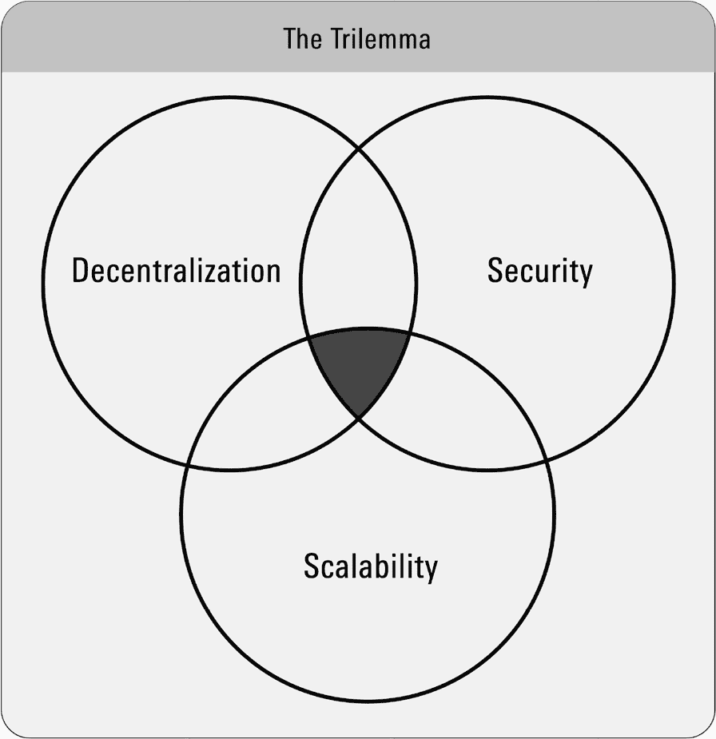

图 7.1

三难困境阻碍了基础层协议。因此，开发者在基础层之上创建了一个框架。基础层提供安全性和去中心化，而次级层提供速度和规模。

第一个也是最著名的例子是闪电网络，它位于比特币区块链上。由 Joseph Poon 和 Thaddeus Dryja 于 2015 年发明，闪电网络完成交易更快、更便宜，因为它不需要完全计算和结算比特币的工作量证明。它通过*链下*交易实现了这一点——所谓的因为这些交易不是在区块链上执行的。

比特币

比特币现金

比特币 SV

以太

要理解这一点，想象一下在赌场里的生活，赌场就是一个区块链。你走进去，把你的美元换成筹码（赌场的数字货币）。这是一个*链上*（意思是，在区块链上）交易——你需要荷官的许可来交换你的美元和筹码，并且赌场记录了这笔交易。但是一旦你到了扑克桌旁，你和其他玩家自由地交换筹码，而且经常交换——赌场不会关注这些*链下*（意思是，双方之间）交易。只有当你把筹码换回美元时，赌场才会介入，这是唯一记录在区块链上的交易。

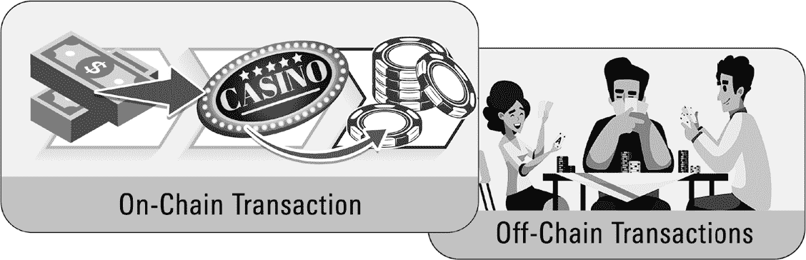

图 7.2

主要的第二层协议

| **Aave** [aave.com](http://aave.com)作为最早的去中心化借贷协议之一，Aave 允许您使用数十种数字资产进行借贷。平台上托管的资产超过 250 亿美元。 |
| --- |
| **Bancor** [bancor.network](http://bancor.network)Bancor 协议以公平且可预测的价格即时转换代币。它在以太坊和跨区块链上去中心化自动化代币交换，使用智能合约创建自动化做市商（称为 AMM、流动性池或债券曲线）。因此，它是传统交易所“买入卖出”或“订单簿”方法的替代方案。Bancor 协议实时显示所有代币的交易汇率，并且任何人随时都可以将任何代币添加到网络中——不仅限于金融机构和大型投资者。自 2017 年推出以来，以太坊区块链上数百种代币的流动性池已添加到 Bancor 网络中。已经在数以万计的钱包之间进行了超过 20 亿美元的代币转换。 |
| **Cardano** [卡尔达诺](http://cardano.org)卡尔达诺建立在奥罗博罗斯协议上，使用 Haskell 编程语言，具有无与伦比的安全性和稳定性。 |
| **Chainlink** [chain.link](http://chain.link)以太坊的智能合约有时需要来自链外的信息。没有它们，它们无法正常工作。Chainlink 通过安全地将智能合约连接到可靠的外部数据源和系统来解决此问题。代币 LINK 推动 Chainlink。它可以交易换取法定货币或数字货币。 |
| **Compound** [compound.finance](http://compound.finance)Compound 存在于以太坊区块链之上。您通过以太坊获取的任何资产都可以存入 Compound，您将获得利息。您还可以将资产作为抵押品在全球任何地方 24/7 获得贷款。Compound 因此创建了一个基于供求关系的新信贷市场。 |
| **Etherisc** [etherisc.com](http://etherisc.com)Etherisc 是构建在以太坊区块链上的第一个保险协议。它确保保单条款永久编码到智能合约中，付款立即和可靠执行。许可要求限制了增长；正在测试方法以扩展可编程风险保护，而不需要保险许可证的要求。 |
| **The Graph** [thegraph.com](http://thegraph.com)The Graph 是一个索引协议。数据可以跨应用程序共享，因此任何人都可以用几个按键查询。在 The Graph 之前，团队使用专有的索引服务器。现在数据存储和处理在可验证完整性的开放网络上进行。 |
| **闪电网络** [lightning.network](http://lightning.network)闪电旨在使比特币更快、更便宜，以便比特币可以成为互联网的主要支付网络。使用闪电，发送和接收比特币就像发送和接收照片一样简单。结算比特币交易几乎是瞬间的。而其成本是难以想象的小：仅为 0.0000001 satoshi。因此，你可以用一笔 satoshi 的成本执行 1 亿次闪电交易。 |

还有其他的扩展方法，如 *侧链* 和 *子链*。侧链是连接到但比父区块链更快的区块链。Rootstock 和 Liquid 是两个例子。子链是在原始区块链上运行而不是在其旁边的区块链。Plasma 是一个例子。子链因此依赖于其主机（父级）区块链，而侧链则不是。子链与其父链一样安全；侧链则不是。

Chainlink

Uniswap

MetaMask

主要的第二层协议

| **OMG** [omg.network](http://omg.network)该网络的目标是实现数字资产的实时点对点转账和支付-不仅仅是数字资产，还包括其他无形形式的价值，例如积分。OMG 位于以太坊区块链网络之上，使应用程序能够更快速、更便宜地运行，而不会影响以太坊的安全性。OMG 可以以三分之一的成本每秒执行数千次交易。OMG 的代币分布在 678,000 个地址之间，使其成为以太坊生态系统中分布最广的代币之一。 |
| --- |
| **SushiSwap** [sushi.com](http://sushi.com)Uniswap 的竞争对手（见下文），于 2020 年 8 月首次亮相。 |
| **Uniswap** [uniswap.org](http://uniswap.org)以太坊上最大的项目之一是 Uniswap，一个去中心化交易所（关于此后面会详细介绍）。自 2018 年以来，该协议已经支持了 250,000+个唯一地址交易的$20 亿资金流动，涉及 8,000+种资产，并且由 49,000+提供流动性的提供者存入了超过$10 亿的流动性。 |

### 金融产品与服务

Satoshi 创建了比特币，让人们可以自由地在全球范围内转移资金。你觉得那很有创意？等你读到接下来的这些创新时就会更加惊叹。所有这些创新都是建立在区块链技术的基础和第二层之上。

Bitgo

金融产品与服务的主要区块链应用

| **Binusu** [binusu.com](http://binusu.com)乌干达 4200 万人口只有 600 万银行账户，但有 2300 万移动货币用户。然而，移动货币存在高昂的成本、交易缓慢以及功能和服务有限的问题。Binusu 让乌干达人可以使用一个定制的区块链进行借贷、存款、投资和交易，该区块链以乌干达货币——先令为锚定的稳定币 BNU 进行交易。Binusu 向商家和消费者提供非托管金融服务，超越了银行系统的限制。Binusu 的利率是乌干达最低的，并且其商家服务实现了实时结算。 |
| --- |
| **BitGo** [比特高](http://bitgo.com)BitGo 为机构客户提供服务；2018 年，比特高信托公司成为首家独立的、受监管的数字资产托管机构。其安全平台被数百家交易所和机构投资者以及数字资产领域所使用。比特高现在提供数字资产的安全存储、优质服务（集成了贷款、借贷、交易、清算、结算和其他资本市场服务于一体的托管账户）以及包括税务解决方案在内的投资组合工具，以帮助用户管理他们的持有资产。开发者和机构可以轻松地将比特高的服务整合到自己的应用程序中。该公司在 50 个国家拥有 350 多个机构客户，并每月处理 150 亿美元以上的交易。这占了所有比特币交易的 20%。 |
| **Cowrie** [cowrie.exchange](http://cowrie.exchange)尼日利亚的货币没有全球交易，使得跨境支付缓慢且昂贵。Cowrie 让尼日利亚人可以通过由尼日利亚奈拉支持的数字代币，以高效和具有成本效益的方式在全球范围内进行交易。 |
| **德意志银行** [cib.db.com/solutions/securitiesservices](http://cib.db.com/solutions/securitiesservices)是世界十大金融机构之一，正在为机构客户及其数字资产开发一个完全集成的托管平台，这是一个一体化的易于使用的平台，通过机构级别的冷热存储和保险级别的保护，确保客户的安全。 |
| **LocalBitcoins** [localbitcoins.com](http://localbitcoins.com)LocalBitcoins 让来自不同国家的人将本地货币兑换成比特币，使全球经济在全球范围内可访问。LocalBitcoins 在每个大洲都可用，并且已在 8,000 多个城市中使用。最大的交易量涉及俄罗斯卢布和委内瑞拉玻利瓦尔。与交易所和中心化交易站不同，LocalBitcoins 让用户彼此协商，使过程可定制化、快速且适合交换而不是投机。 |
| **MetaMask** [metamask.io](http://metamask.io)MetaMask 提供一个安全、易于使用的以太坊钱包，让用户能够通过一个登录与数千个网站和智能合约进行交互，提供比任何其他解决方案更多的用例，包括支付、交易和 DEX 交换、去中心化金融服务、游戏、艺术收藏、国际交易、自我主权身份、身份验证等。MetaMask 移动端用户中有三分之二来自北美和欧洲以外的市场，主要是无银行服务的市场。 |
| **PayPal** [paypal.com](http://paypal.com)这家支付公司希望扩大数字资产在其 2.46 亿消费者和 2,000 多个市场中的接受程度。其目标是让买家使用比特币支付，并让交易以法定货币结算。截至本文撰写时，用户可以购买、出售和持有比特币、以太坊、莱特币和比特币现金。 |
| **Rally** [rally.io](http://rally.io)Rally 让拥有数百万粉丝的意见领袖、运动员和创作者推出并管理自己的数字货币，以推动粉丝参与。一旦创建，粉丝可以购买或赚取代币，构建一个去中心化的社区。其“无代码”工具让任何创作者都能在没有任何技术知识或对数字资产的高级理解的情况下推出代币。 |
| **Ripio** [ripio.com](http://ripio.com)2019 年，阿根廷央行将每月购买美元限制在 200 美元，并引入了 65%的税收，以避免大规模动用储备。Ripio，南美领先的数字资产公司，让阿根廷人可以通过符合当地法规但不受购买限制和税收影响的产品来存钱并赚取利息。该平台允许用户全天候存取阿根廷比索，并轻松购买、出售和存储数字资产。 |
| **SuperRare** [superrare.co](http://superrare.co)SuperRare 让任何有互联网连接的人都可以接触艺术。每位艺术家为作品签发真实性证书，让赞助人可以追踪作品来源。 |
| **XBT Provider** [coinshares.com/etps/xbtprovider](http://coinshares.com/etps/xbtprovider)2015 年，CoinShares 的比特币跟踪器成为首个在受监管交易所上市的基于比特币的证券，使投资者可以通过传统证券交易所购买数字资产变得简单。 |

### 非金融应用和服务

如果你对金融领域的创意印象深刻，那么当你了解一些行业外的创新时，你会双倍印象深刻。

主要区块链应用和服务——金融业外部

| **加密基金** [cryptofund.unicef.io](http://cryptofund.unicef.io)联合国儿童基金会于 2019 年 10 月推出了 CryptoFund，以接收和分发比特币和以太币，作为资助新兴或发展中经济体中的初创企业的手段，这些企业正在利用创新技术解决本地挑战。与涉及多家中间银行、需要数天完成并且成本高达转款金额 8%的传统方法相比，将数字资产转移给初创企业可以在几分钟内几乎零成本完成。 |
| --- |
| **世界粮食计划署** [innovation.wfp.org/project/](http://innovation.wfp.org/project/)作为 2020 年诺贝尔和平奖获得者，世界粮食计划署是全球最大的提供人道主义资金的机构。该机构已向数十个国家数以亿计的人分发了数十亿美元。将现金提供给有需要的人往往是分发人道主义援助的最有效、最高效的方式，同时也支持本地经济。然而，在世界粮食计划署开展工作的许多地区，金融服务提供商往往不足、不可靠或不可用。在其他地区，难民无法开设或访问银行账户。为了解决这些问题，世界粮食计划署使用数字资产网络通过手机分发资金。受益人控制着如何何时接收和花费现金——在零售店、ATM、手机货币等地。例如，通过 110 万笔交易向叙利亚难民中的 10.6 万人等人转移了 2500 万美元。使用区块链技术，世界粮食计划署将其银行交易费用削减了 98%。 |

1.  我。然而，你越快行动，安全性就越弱。根据尼尔森报告，2020 年美国消费者因信用卡欺诈损失了 110 亿美元，Visa 表示其服务器上每月平均发现 14 万个恶意软件实例。相比之下，比特币网络从未被黑客攻击过。

## 第八章 数字资产是否是货币？

中本聪显然打算让比特币被视为货币，一种取代所有法定货币的“数字货币”。中本聪的梦想是否成真，如果没有，是否会成真？

要回答这个问题，我们首先必须回答这个问题：什么是货币？让我们探讨这个概念，这样你就可以决定比特币或任何其他数字资产是否符合（或将来会符合）这个定义，或者这是否重要。这将帮助你决定是否想拥有任何数字资产，如果想拥有，又想拥有哪些。

### 什么是货币？

货币几个世纪以来一直是社会的核心协调功能。货币让我们能够有效地促进交易，这样我们就不必依赖低效的*实物交换系统*。

如果你给邻居一夸脱牛奶换取一杯糖，那就是实物交换。记载显示，早在公元前 6000 年，美索不达米亚人、腓尼基人和巴比伦人就开始使用实物交换——早于货币的发明。

实物交换很麻烦，因为你必须一直携带着牛奶，直到找到有糖的人。我们需要一种更简单的交换方式——这就引入了货币的概念。我可以携带少量纸张、金属或其他物品，而不是携带牛奶。当你告诉我你有些糖时，我可以用纸来换取它。之后，你可以将纸交给某人，他会给你牛奶。

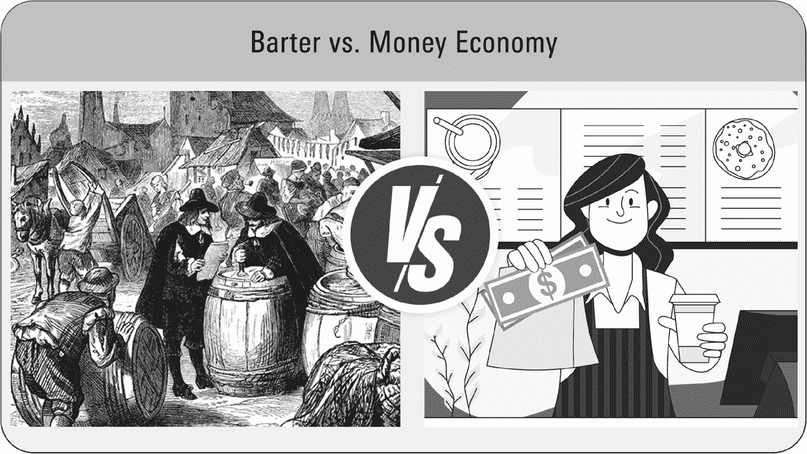

货币使生活更高效。你不必在给我糖的同时立刻收到牛奶。你可以更轻松地携带和保护货币，而不是牛奶。纸张可以用于任何东西的交换——你不必拥有有牛奶的人想要的东西。

我们的祖先使用各种各样的物品作为货币，包括动物、作物、贝壳、金属、纸张、盐，甚至是大石头。

牛奶就是牛奶，假设它是新鲜的，一夸脱和另一夸脱之间几乎没有区别。因此，人们很容易就能达成一致意见，认为需要多少牛奶才能获得一杯糖。但如果我想用硬币换你的糖，你会要求多少硬币呢？

你会想知道是谁创造了这个硬币。这就是第一个问题。在货币早期，任何人都可以创造货币——就像任何人都可以挤奶一样。由于个人和企业创造了自己的货币，其中许多货币都被证明是毫无价值的。因此，人们不愿接受货币作为支付手段——这让我们重新回到了问题重重的以物易物系统。

为了让每个人都对接受的硬币有信心，政府开始宣布只有他们才能印钞。政府更加稳定，并且拥有（多亏他们的军队）执行规则的权威。然而，问题在于政府来来去去，而且总是不止一个。

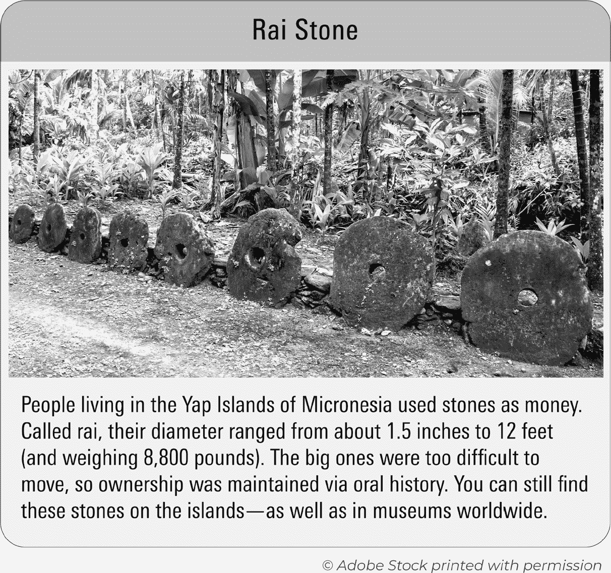

例如，在美国，所有 13 个殖民地都发行货币。但是马萨诸塞州的货币价值与宾夕法尼亚州的货币不同，而且人们对这些相对价值的认识也没有广泛的一致性。

这不是一本经济史的书，所以我会跳过细节，但你知道一切是如何发展的：在美国，联邦政府现在是唯一的货币发行者，并且正如每张美元纸币上所写的那样，该货币对所有公共和私人债务有效。其他政府也会印刷本国境内使用的货币，但许多政府拒绝接受其他国家印制的货币。不过，美元几乎被世界上的每个人都接受。

但是美元仍然是印在纸上的。[¹] 财政部的印钞局每年印刷 42 亿张纸币，面值从 1 美元到 100 美元不等。

*“你将如何支付？加密货币，Venmo，Zelle，电子资金转账，信用卡，支票，现金，贵金属，色彩鲜艳的贝壳还是牲畜？”*

当然，在你的钱包中携带钱会比携带牛奶容易得多。但金钱仍然是一个麻烦事——特别是如果你有很多。 想要随身携带数十万甚至数百万美元吗？

因此，人们很快就决定他们需要一个存放他们钱财的地方，这导致了银行的引入。起初，你在当地银行存现金，而它则将你的钱存放在保险库中。但现在已经不再是这样了。今天，你的存款是以电子方式进行的；当地银行手头的现金很少。 （在瑞典，银行需要提前通知，并且如果你想提取实物现金，他们会收取一定费用。）

然而，财政部一直在生产纸币。

我们已经将几乎所有其他东西数字化了——从照片到健康记录再到契约书，因此某个人将找出如何将货币进行数字化是不可避免的。 这个人并不是美联储，世界银行或国际货币基金组织。是中本聪。 真好玩。

但比特币真的是货币吗？

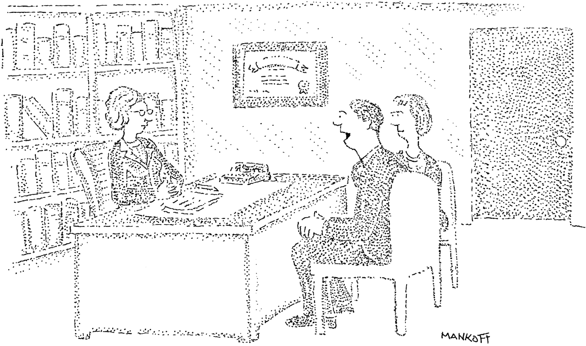

*“哦，我们的婚姻真的没有什么问题。我们只是想弄清楚如何将其货币化。”*

#### 定义钱货

为了回答这个问题，让我们确认一下什么能够被称之为货币。*货币*通常具有三个关键功能：

1.  **1.** 价值储存

1.  **2.** 账户单位

1.  **3.** 交换媒介

让我们一起来看看每个特点。

##### **价值储存**

你相信你钱包里的每一美元将保持其价值。由于有这种信心，即使你计划几天、甚至几十年后才花掉它，你也愿意今天就接受一美元。与此同时，你可以轻松地存放和随时取回你的钱。而牛奶中却没有这样的方式，它会随着时间的推移而腐坏，因此不能保持其价值。

然而，货币并不是一种完美的价值储存工具，因为其购买力也会随着时间的推移而下降。这是由于通货膨胀。在美国，联邦储备委员会的目标是每年降低货币价值 2%。作为一种有意的政策，可以预期你钱包里的每一美元明年只值 98 美分。

如果每年损失两美分都让人讨厌，那么考虑一下政府和经济远不稳定的国家。2021 年委内瑞拉的通货膨胀率达到了 2300%——这意味着你早上用$100 买的杂货晚上要花$300 才能买到。2021 年，你需要 4000 亿委内瑞拉玻利瓦尔才能买到用一美元可以买到的东西。

可以说，如果你的货币不是一种价值存储工具，那它就不是货币。

##### **记账单位**

金钱可用来描述商品和服务、资产和负债的相对价值。这让我们可以对某物定价并将其与其他东西进行比较。

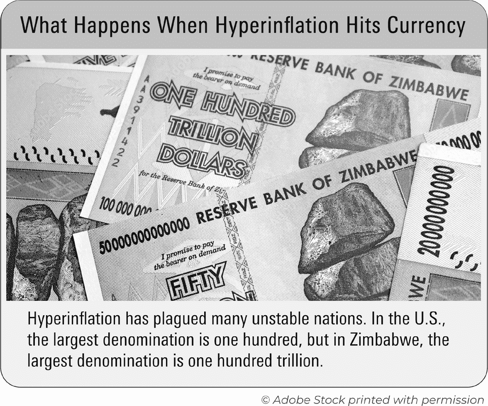

当我们看到一辆车的价格是$30,000，而另一辆车的价格是$100,000 时，我们立即了解它们的相对价值。如果没有金钱作为一个共同的分母，社会几乎无法进行商业交易。

##### **交换媒介**

金钱是一种中介；它促进了商品和服务的交换。如果没有它作为交换媒介的使用，我们就不得不依赖于以物换物的不便。

比特币是否满足这三个定义？

是的，根据这三个特征，比特币是货币。

但是一些人认为还有更多需要考虑的因素。他们说，比特币不能被视为货币，因为它不是以任何有形的东西，比如黄金或白银，作为支持。这个论点行不通——简单的原因是美元也不是以黄金或其他任何东西作为支持的。 

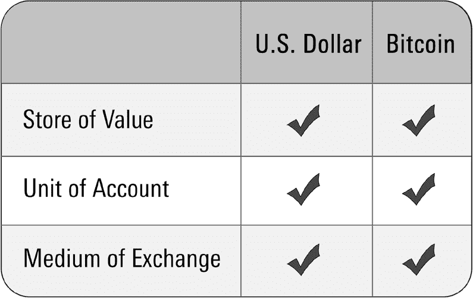

图 8.1

美元具有价值，因为在交易中使用它的两个当事方同意它有价值。他们也就同意了价值是多少。当事方对货币有信心，因此愿意使用它。他们对货币有信任。

比特币是否有类似的协议、信心和信任？

目前还没有达到人们对美元的协议、信心和信任的水平。也许，随着比特币的使用增加，人们对其的协议、信心和信任水平会增加。全球数百万人已经相信比特币是货币 —— 因为它通过了上述三个特征测试 —— 也许总有一天每个人都会同意。

让我们暂时假设你是那些认为比特币是货币的人之一。这是否意味着比特币也是货币？

#### 定义货币

*货币*是金钱的物质表现形式。因此，当我们问比特币是否是货币时，我们也必须问比特币是否可以被认为是货币。

货币具有六个特征：

1.  **1.** 耐用性

1.  **2.** 可携带性

1.  **3.** 可分割性

1.  **4.** 一致性

1.  **5.** 供应有限

1.  **6.** 可接受性

让我们逐个来审视，以便确定比特币是否通过了测试。

**耐久性** 货币必须足够强大，能够经受多次使用。牲畜和农产品不符合这一测试，但美元和硬币却符合。

**可携带性** 货币必须易于携带和使用。美元纸币易于携带；桶装的原油则不是。少量黄金是可携带的，但大量黄金不是。

**可分割性** 货币必须能够分割成小面额。美元可以分成便士。金条可以切割成盎司或克 —— 如果你有正确的设备，甚至可以分割到原子级。

**一致性** 每个货币单位必须与其他等值单位具有相同的价值，无论单位是何时创造的。例如，每个美元都具有与其他每个美元相同的价值。

**有限供应** 为了维持其价值，货币的货币必须稀缺。美联储严格控制发行美元，以防止过多的供应进入市场。正如我们在委内瑞拉博利瓦尔和津巴布韦元看到的那样，过多的货币发行会大幅降低货币的价值。

**可接受性** 货币必须被人民广泛接受，以进行货物和服务的交换。美元在全球范围内被接受，不仅在 50 个州内。

* * *

比特币是否满足这六个定义？

**耐久性** 数字资产非常耐久，因为它们是位和字节——软件代码永远不会退化或蒸发。构成我们电子时代的一和零可以永远持续。

**可携带性** 数字资产完全可携带。因为数据存储在互联网上，并通过手机上的应用访问，你的数字资产随时随地与你同在。你始终可以立即访问，并且可以在几秒钟内将你的数字资产传输给他人。

**可分割性** 比特币的最小面额是 *聪*（简称 *sat*）；每个聪价值 0.00000001 比特币。一亿聪等于一比特币。^(II)

**统一性** 比特币就像美元和黄金一样；每一个都与其他所有一样。对于牲畜、水果和蔬菜、房屋或汽车来说，情况并非如此。

**有限供应** 不像美元——政府不断印刷它们（特别是在金融危机期间），比特币的供应是有限的。只会产生 2100 万个比特币。^(III)

**可接受性** 比特币越来越被接受作为支付手段。全球数千万家商户通过 PayPal 接受比特币付款，而一些政府（从萨尔瓦多开始）已开始将比特币指定为官方货币，与他们的法定货币并行。但接受程度尚未普遍。

许多人（包括我在内）认为，比特币的供应量有限有助于其价格上涨。这是经典的供需经济理论，我们将在第十一章介绍。可以承认，这可能会干扰比特币作为货币的地位，因为如果你相信价格会上涨，你就不会想在购物时花任何钱。你会选择囤积。实际上，对于这样的人有一个称号：HODLers，即 Hold On for Dear Life 的缩写。也称为钻石之手，因为俗话说，钻石是永恒的。

* * *

比特币显然具备货币的所有特征，除了可接受性也许不足。那么，比特币是否符合货币的资格？我猜这取决于你问谁，以及你所在的国家。最终，答案将变得清晰明了。在此期间，这取决于你。

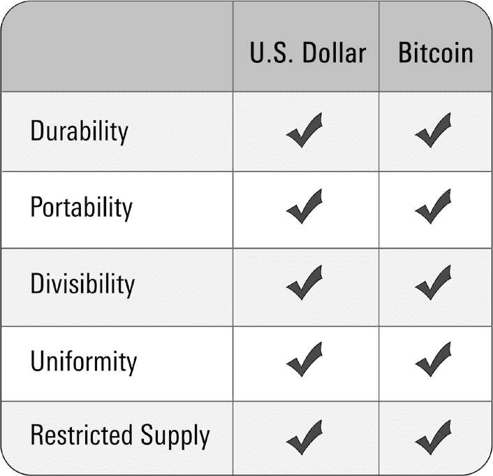

图 8.2

#### 比特币的数字货币

关于比特币作为货币使用的最大担忧之一是其波动性。如何对一种价格不断波动，而且经常剧烈波动的货币感到信心？

进入稳定币。我们在第七章介绍了泰达币。它和所有稳定币声称能够做到比特币所不能的事情：提供稳定的价格。如果属实，这将使它们真正成为数字货币。因此，让我们更仔细地看看稳定币。

#### 稳定币

不同于比特币和其他数字资产，其价格是“投资者说了算”的，稳定币的价格与其意图替代的货币相同，从而消除了波动性。

比如你购买了价值$100 的美元稳定币。发行方会使用你的资金购买一百美元，从而创建了一比一的币对美元的比例。实际上，使用稳定币与使用美元完全相同。

那么为什么要费心去使用稳定币呢？为什么不像以前一样使用美元？

简单来说：美元在联邦金融体系内运作。你需要一个银行账户来存储它们，而且你只能按照其规定发送资金——正如我们在第二章中所了解的那样，这是耗时且昂贵的。相比之下，你可以全天候、全年无休地免费转账稳定币。

嗯，稳定币存在两个问题，第二个是第一个问题的结果。首先，正如前面提到的，稳定币不一定符合联邦银行法规。例如，银行被要求保持一定数量的资本，但稳定币没有这样的义务。它们也不必遵守反洗钱、税收合规或其他规定。而且没有美国联邦存款保险公司来保护你。

一些稳定币与美元挂钩，其他的则与欧元或日元挂钩，或者与许多法定货币篮子挂钩。

其他稳定币与商品挂钩，如黄金、白银或石油。有些甚至由算法支持，该算法控制供需以稳定其代币价格。

是的，有一种稳定币是由——你猜对了——其他数字货币支持的。

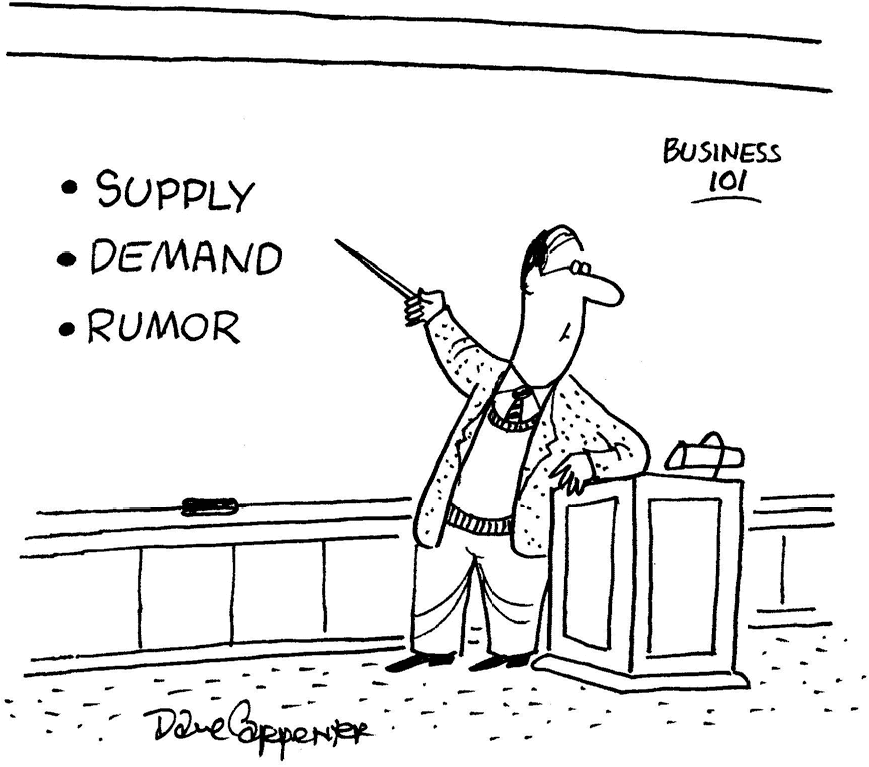

“一只股票的价格会因这三个因素而波动……”

这导致了第二个问题。虽然所有稳定币都声称它们与所选择的货币挂钩 1:1，但没有法律或法规要求它们这样做。因此，正如你可能预料的那样，一些稳定币所声称支持的资产引发了质疑。

考虑一下泰达币（Tether）。它是最大的稳定币，并声称其所有存款都 exclusively 受美元支持。但美国证监会表示，泰达币的大部分资产实际上是持有美国国债、银行存单、商业票据、公司债券和市政债券。这些资产并不像美元那样安全。（2021 年 10 月，泰达币和 Bitfinex 因错误地声称其数字代币完全由美元支持而向商品期货交易委员会支付了 4100 万美元的罚款。）

政府之所以担心，是因为投资者和消费者已经将 1200 亿美元投入稳定币。一大堆联邦机构正在处理这个问题，包括总统金融市场工作组、联邦储备委员会、货币监理办公室和金融稳定监督委员会。稳定币会被监管甚至被禁止吗？这个问题的答案将在本书的续集中揭晓。

但是政府不是有点傻吗？我是说，他们为什么反对稳定币呢？从概念上讲，它们比我们当前的金融体系更好——转移跨境资金太慢（五天），成本太高（平均为 6.7%）。甚至在我们国内转移资金也需要一周甚至更长的时间（试着给住在另一个州的人寄支票，看看存款后需要多长时间支票才能兑现）。而且如果你汇款，你还要支付汇款费用。而且这一切都是建立在你首先有银行账户的前提下。我们当前的体系在 50 年前可能是可以辩解的，但是在今天，考虑到当前的技术能力，我们的体系严重过时。

因此，与其为稳定币和没有监管以及担心支持不足而烦恼，为什么政府不直接发行自己的稳定币呢？！

新闻快讯：他们要这么做了。

### 中央银行数字货币

在本十年结束之前，你将会获得、接收、使用和存储*数字美元*。它们与你口袋或钱包里的美元一样，由美国联邦储备系统发行，并由美国联邦政府的完全信任和信用支持。

要理解这是为什么以及如何发生的，让我们退后一步，看看政府（单独或与邻国合作）如何发行货币。

这个过程开始得相当简单：政府聘请一家银行。银行印刷货币并将其分发给其他银行。作为其宪章的一部分，该银行负责国家的货币政策。这包括设定利率和确定将在整个国家分发多少货币。该银行甚至对其他银行拥有监管权，比如告诉它们相对于存款需要持有多少现金（这影响它们的利润潜力）。而获得这个政府特许经营权的银行则拥有所有这些权利的垄断；该国的其他银行没有同样的权威。

显然，这是一份甜蜜的交易。你可能会认为该国的每一家银行都争夺机会被选中。但是，那不是事实。通常，政府只是发明一家新的银行并将所有这些权力和责任授予它。因为这家银行对国家的经济体系如此重要，如此中心，所以被称为*中央银行*。

几乎世界上每个政府都有一家中央银行。甚至有一个他们的协会，叫做国际清算银行。目前，世界上 179 家中央银行中有 63 家是成员。

所有中央银行的运作方式都类似。而其中一个他们共同拥有的习惯（对于我们的目的来说）尤其值得注意：他们仍然都印刷他们的货币。

*真的吗？*

是的，即使在今天的数字时代，他们仍然以老式方式做这些。即使是你，作为普通公民，也以比中央银行更先进的方式管理你的资金。你通过电子银行存款收到工资、养老金、年金支付和社会保障福利。你用信用卡和借记卡支付账单，通过 PayPal、Venmo 和 Zelle 等数字应用发送和接收资金。你甚至不用手动支付大部分账单；你只需将它们设置为自动支付，这样就不用费心去处理它们。你也通过电子方式提交纳税申报，支付税款，也是电子方式接收税金退款。

你大部分购物都是在线完成的。当你在商店时，只需将手机在收银机上轻轻一刷即可。你已经记不起上一次用现金支付了什么。你甚至可能已经停止携带现金，因为没有必要了。

然而，政府仍在不断印刷货币。

所有这些印刷出来的现金都带来了问题。其中一个问题是努力的巨大规模。美国印钞局每年花费超过 10 亿美元印刷 58 亿张面额从 1 美元到 100 美元的钞票。这笔钱必须得到保障，交付给当地银行，并保护免受伪造的威胁。而且每年还有大量的钞票被销毁——这又会产生更多的成本。

即使是现金本身也会造成问题。第一个问题涉及恐怖主义和毒品贩子。罪犯和恐怖分子不会用 Visa 或 MasterCard 支付毒品或炸弹。他们使用现金。例如，2007 年，美国和墨西哥当局在一次毒品缉捕行动中查获了 2 亿美元的现金。流氓国家和恐怖组织主要通过非法使用现金来支持自己。

另一个问题是逃税。当你付给保姆$50[^IV]时，你可能不会发给她 IRS 1099 表格，同样，保姆可能也不太可能在她的纳税申报表上报告这笔收入。对于说新屋顶要价$25,000，但如果你用现金支付，只需$20,000 的房屋建造商来说，情况也一样，这样屋顶工人就可以“忘记”向 IRS 报告这笔收入——从而省下大约$10,000 的税款。问题有多严重？好吧，IRS 专员查尔斯·雷蒂格说未缴税款每年达 1 万亿美元——相当于联邦政府新冠疫情前的整个预算赤字。换句话说，国会不需要提高守法纳税人的税率；它只需要收取那些逃税者未交的税款。

当然，从执法和纳税合规的角度来看，印刷货币是危险和有害的。但现在已经有了解决方案：数字货币。

数字货币可以严重阻碍——如果不是直接消除——恐怖主义资金、非法毒品交易和逃税。这是因为数字货币留下了数字足迹。每笔电子交易都可以被追踪——虽然这可能会惹恼隐私倡导者，但确实让犯罪分子感到恐慌。

这就是为什么数字资产会长久存在的原因：政府喜欢它们。这也是为什么世界上每一个中央银行都在调查或开发 CBDC——*中央银行数字货币*。巴哈马已经推出了他们的数字货币，名为沙元（sand dollar）。（巴哈马的货币称为元。）岛上的政府意识到，飓风经常迫使当地银行关闭数周——这阻止了居民在最需要大笔资金时访问他们的钱。沙元使岛上的经济即使在银行关闭时也能运转。

世界并非只有巴哈马。中国正在试验数字人民币，俄罗斯试验数字卢布，日本试验数字日元。尼日利亚在 2021 年推出了数字货币，巴西和瑞士将在 2022 年，瑞典将在 2023 年推出。澳大利亚、马来西亚、新加坡和南非的中央银行正在与国际清算银行合作测试联合的中央银行数字货币（CBDC）；香港、中国、阿拉伯联合酋长国和泰国的中央银行也在进行同样的测试。

在美国，波士顿联邦储备银行正与马萨诸塞理工学院数字货币计划合作，以确定数字美元的益处和挑战。波士顿联邦储备银行助理副总裁罗伯特·本奇称该项目的潜力为“巨大”。与此同时，美联储聘请了首位首席创新官。美联储理事会副主席莱尔·布雷纳德于 2021 年 7 月表示：“美联储必须保持在关于 CBDC 的研究和政策发展前沿，这一点至关重要。”她指出：“美元在国际支付中占据主导地位，如果其他主要司法管辖区都提供 CBDC，而美国却没有，我就无法理解。这对我来说听起来不像是一个可持续的未来。”

其他人也持有相同观点。英格兰银行 2021 年 7 月的一份报告指出：“数字货币的新形式将是经济中支付方式演变过程中的最新创新。它们可能有助于更快速、更便宜和更高效的支付，可能提升金融包容性。数字货币的新形式可能在成本和功能性方面提供好处。转向更市场化融资可能也可能带来潜在收益。它们还可能增强货币政策的传导。”紧随其后的一个月，欧洲央行行长克里斯蒂娜·拉加德表示：“我们必须确保我们做得对——我们欧洲人有责任。”日本、加拿大和韩国的中央银行也都发布了赞扬 CBDC 益处的白皮书。

根据 BIS 的数据，全球 80%的中央银行正在探索 CBDC，预计到 2025 年将在全球范围内广泛使用。难怪 2021 年德勤对全球金融专业人士进行的调查中，76%的人同意数字资产“将在未来 5-10 年内成为法定货币的强有力替代品或直接替代品。”德意志银行的一项研究得出了同样的结论，称加密货币可能在 2030 年取代现金。

#### Facebook 的威胁

但我们不要自欺欺人。中央银行并不是仅仅因为 CBDC 的优势而计划推出它们。他们推出 CBDC 是因为他们害怕如果他们不这样做，他们和他们的政府可能会发生什么。

他们的恐惧在 2019 年变得明显，当马克·扎克伯格宣布他在瑞士成立了一个非营利组织，将推出稳定币 Libra（现在称为 Diem）。Diem 与世界主要的法定货币挂钩，只能供 Meta Platforms 旗下的应用用户使用，比如 Facebook、WhatsApp 和 Messenger，他们可以使用 Diem 互相转账，也可以在 Facebook Marketplace 上购买商品，与亚马逊、沃尔玛、Craigslist 和 eBay 竞争。

Facebook 全球拥有近 30 亿用户。这几乎是地球人口的一半；拥有互联网连接的所有人中有三分之二拥有 Facebook 账号。如果现在世界上每个人都能够立即使用一种在政府监管或控制之外运行的私人创造的货币购买任何东西并向任何人发送资金，那么，为什么还会有人需要美元、英镑或欧元呢？一个世界，一个货币——由一个人，马克·扎克伯格，控制。

瞬间，全球各国政府都陷入了恐慌。扎克伯格宣布消息几分钟后，法国财政部长布鲁诺·勒梅尔表示法国将不允许 Diem 进入欧盟，理由是威胁到其货币主权。日本立即开始调查 Diem 及其对日本货币政策和金融监管的潜在影响。26 个中央银行的官员迅速召开会议讨论 Diem。

在美国，扎克伯格宣布消息后，一群美国监管机构和立法者在几小时内就发出了尖叫声。美国众议院金融服务委员会主席马克辛·沃特斯将扎克伯格传唤到国会听证会上，后来又给 Facebook 发了一封信，要求其停止开发 Diem，理由是隐私、国家安全、交易和货币政策问题。美联储主席杰罗姆·鲍威尔告诉国会，美联储对 Diem “存在严重的担忧”，唐纳德·特朗普总统在推特上表示，如果 Facebook 想继续下去，“必须寻求新的银行特许证，并受到所有银行监管法规的约束”。2021 年 10 月 19 日，美国参议员理查德·布卢门撒尔、谢罗德·布朗、布赖恩·沙茨、蒂娜·史密斯和伊丽莎白·沃伦致信马克·扎克伯格，要求他 “不要推出 Diem”。

当局并没有止步于此。国会还对 Visa、PayPal、MasterCard 和 Stripe 等公司展开了调查，迫使它们解释如果 Diem 推出后将采取何种措施。

面对如此多的阻力，扎克伯格…放弃了 Diem。他最初试图通过将非营利组织从瑞士迁至美国来安抚政府官员，但国会并不为所动。因此，扎克伯格以 1.82 亿美元的现金和股票（不是比特币）将 Diem 出售给了 Silvergate 银行。

尽管世界各国政府进行了种种策略，但它们知道自己无法阻止这一趋势。当然，它们可能会阻止 Meta ——但只是因为 Meta 是一家有其他商业利益需要保护的大公司。但另一家公司可能会出现，而这家公司并没有这样的弱点。互联网无处不在，而区块链技术允许创建没有中央位置或权威的组织（关于这些 DAOs ——分散自治组织——更多内容见第十章），这使得政府难以停止或者仅仅是监管它们成为了一种挑战。

因此，当然，中央银行数字货币对每个人都提供了巨大的好处——政府、企业和消费者。但是世界各国中央银行之所以积极创建自己的数字货币，是因为他们知道，如果他们不这样做，像马克·扎克伯格这样的人就会取而代之，消灭他们和世界当前的金融体系。

如果你无法打败它们，就加入它们。

因此，中央银行也加入了行列。当他们这样做时，一个新问题会出现：如果政府为我们提供数字货币，我们是否还需要稳定币？

#### 中央银行数字货币是否威胁到比特币？

监管机构不必禁止稳定币。他们可以简单地使它们变得不必要——通过创造自己的数字货币。的确，由美联储发行的数字美元应该会比某些私人实体发明的稳定币更受企业和消费者欢迎。市场将做出决定，但毫无疑问，美联储的中央银行数字货币将成为稳定币的佼佼者。

如果中央银行数字货币赢得了稳定币之战，这对比特币意味着什么？中央银行数字货币是否对比特币和其他类似数字资产构成了生存威胁——无论是因为政府会禁止比特币（就像他们可能会禁止稳定币一样），还是因为消费者的兴趣会消退（比特币会简单地消亡，变得毫无价值），因为每个人都选择了联邦储备的数字货币？

我不认为任何一种情况会发生。比特币作为货币的前景保持完整，这得到了萨尔瓦多决定将其定为官方货币的证明（巴拿马、乌克兰和巴拉圭也在此写作时效仿）。但即使比特币不被广泛视为货币，它仍然不会对中央银行构成威胁——与 Diem 不同。

原因？虽然人们可能会争论比特币是否是数字货币，但毫无争议的是它是一种数字资产。数字资产并不威胁美联储。作为证据，考虑到已经有大量数字资产——航空里程、礼品卡、忠诚积分等等——它们并没有让任何中央银行感到恐慌。当然，比特币和其他数字资产面临着价格、可用性、安全性和隐私方面的问题，但这些问题可以轻易受到监管——就像股票和债券市场一样已经受到了监管。

这也解释了为什么对比特币的兴趣不会消退。所有资产的价格都会波动，这吸引而不是排斥投资者。你不能通过购买货币致富，但你可以通过购买股票、房地产和棒球卡致富。如果人们认为他们可以通过购买比特币和其他数字资产赚钱，他们会继续购买。

因此，世界各国政府发行 CBDC 的出现增强了比特币的合法性，而不是削弱了它。数字美元的发行是联邦政府直白地承认数字货币的有效性，并具有纸币所缺乏的特征和优点。这是对区块链的隐含认可（这将是发行和管理所有 CBDC 的技术），从而也是对所有数字资产的认可。

因此，你将能够购买由政府发行的价值稳定的数字货币，或者由他人发行的价格给你创造财富机会的数字资产。这两者将和平共存。

### 黄金 vs. 比特币

我们不能在谈论金钱的章节中不谈论黄金。不是因为黄金是货币，而是因为有些人坚持认为它是。这些“黄金迷”认为黄金是唯一真正的货币，而股票、债券、房地产和所有其他资产都不值得拥有。

但比特币拥护者认为比特币比黄金更好。有些人实际上将比特币称为“数字黄金”。

对于黄金爱好者来说，这些话可是挑衅之言。而且，黄金拥护者为持有黄金提供了许多理由：

+   黄金已经作为价值存储了 5000 年，提供了其他资产无法比拟的信心。

+   黄金是一种真实的实物资产。它不仅仅是代表其他东西的一张纸。

+   黄金可以抵御通货膨胀和地缘政治不确定性。

+   黄金有许多商业用途，因为它是惰性的；不会变色或腐蚀；不需要润滑、维护或修理；可以熔化并轻松制成线材，锤打成微薄的片材，或与其他金属合金化；导电；并且不会引起过敏。黄金最常用于珠宝，但也用于电子产品、太空计划和医疗保健（包括牙科和类风湿性关节炎和癌症治疗）。由于黄金长期以来一直象征着卓越，奖品和奖章通常是由黄金制成的。

+   自 2000 年以来，黄金开采量一直在下降，而需求不断增长。供需论认为黄金的价格将上涨。

+   黄金与股票或债券没有正相关性，因此对投资组合进行多样化是一个极好的选择。

+   有许多购买黄金的方法——金条、金币、金矿公司股票、黄金期货合约和黄金 ETF。

对于上述清单，我并不是特别印象深刻。黄金的历史是无关紧要的；关键是未来。

至于地缘政治的不确定性，嗯，如果世界崩溃了，你需要的不是黄金，而是子弹和威士忌。至于作为实物资产的好处，一百万美元大约是 35 磅的黄金。试着整天拖着它四处走动吧。

此外，黄金未必是有效的通货膨胀对冲工具。在过去的一百年里，黄金价格有时会随着通货膨胀而上涨。但是，有时它们会下跌。你根本不能确定黄金是否会保护你免受通货膨胀的影响。

让我们也记住，黄金交易商、价格和费用都没有受到监管，黄金采矿股的价格往往偏离黄金价格。黄金确实永远不会消失或过期，但这也意味着它的供应每年都在增加——只有需求不断增长才能防止价格崩溃。

那么，我是在告诉你不要拥有黄金吗？一点也不是。相反，我认为“黄金与比特币”的争论是愚蠢的。这两种资产类别没有任何共同点，*比特币*和*黄金*这两个词不应该出现在同一句话中。

这整个争论都是由狂热分子（两边都有）制造出来的扭曲事实，他们认为只有当别人都错的时候他们才能是对的。事实上，你不需要在两者之间进行选择。如果你是投资组合多样化的信徒（我们将在第十四章探讨这个概念），你应该两者都拥有！

1.  我。其实，这种材料是 75%的棉和 25%的亚麻——是政府反对伪造的一部分。

1.  II。因此，比特币的价格有多高已经不重要了。价格已经如此之高，大多数人买不起一枚。相反，人们购买的是聪——比特币的一部分。（同样，没有人有足够的钱买苹果，所以他们买苹果的一部分——一股，因为苹果的单股价格现在很贵，你可以用只需 5 美元的方式购买一部分股份。）将来，人们不会提到比特币。他们会提到聪。

1.  III。有限供应并不总是数字资产的特点。有些允许无限数量。（例如，狗狗币目前存在超过 1300 亿，每年还会增加 50 亿——这是投资狗狗币既愚蠢又危险的众多原因之一。稍后详述。）

1.  IV。用 Venmo 或 PayPal，对吧？还有人在用现金吗？有人？巴勒？

## 第九章 代币

啊哦，又来了一个新词……*代币*。但别担心，因为你已经熟悉它们以及它们的工作方式。你只是还没有意识到。

代币是某种无形事物的小型物理表示。几十年来，你需要一枚代币才能乘坐纽约的公共汽车和地铁。在许多游乐园，你使用代币来玩游戏。一个“象征性的表示”是一种代表你感情的小举动——比如把玫瑰递给你的爱人。

注意*小*这个词。这很关键。考虑购买一个大披萨。你吃不完，所以你把披萨切成八块。每一块都是一份，一个*股份*。

股票也一样。拥有亚马逊会很酷吧？不幸的是，亚马逊市值 1.6 万亿美元——你可没有那么多钱。别担心——你可以购买公司的一小部分——一份*股份*，就像我们的披萨一样——你就拥有了一些亚马逊。你购买的股份越多，你拥有的公司就越多。

在加密世界里，他们不出售股份。有时他们出售*硬币*，就像我们所见的那样。但在其他情况下，他们出售*代币*。与股份和硬币相同，只是一个不同（第三）的名称。

让我们看看以代币形式发行的数字资产。

### 实用代币

*实用*这个词指的是有用的东西。航空里程积分就是实用代币的一个例子——每一点都有价值，如果你积累了足够多的积分，你可以用它们换取一些有用的东西，比如飞机票或酒店房间。

实用代币仅限于预期的用途。你不能用你的航空里程乘坐地铁，也不能用地铁代币飞往巴黎。

新公司，通常称为*初创公司*，经常发行实用代币。比如说，你正在推出一家新业务。你很快就会有一个新奇的新产品要销售，但它还没有准备好。没有产品，你就无法吸引顾客——或者他们的钱。但你现在需要他们的钱，来帮助你资助产品的开发。由于你还不能销售产品，你就向顾客出售代币——在产品推出时可以获得你的产品的权利。“今天购买我的代币”，你告诉潜在顾客，“在未来你可以用它来换取我的产品。”

实用代币不同于股票和债券等投资或证券，就像地铁代币一样。它们的价格由发行公司确定，并不会预期波动（尽管如果初创公司只发行少量代币并允许接收者转售，价格可能会波动）。相反，人们一般购买实用代币是因为他们想要你承诺提供的产品，并且希望成为第一批获得产品的人。或者，在产品供应有限的情况下，他们想在售罄之前购买其中之一。

当购买实用代币时，你要承担风险，因为发行公司可能永远不会推出产品，或者在推出产品时，你可能不再需要它。与此同时，你可能无法出售你的代币。这就像购买音乐会门票一样，你必须希望活动最终会发生，而且你确实能去参加——因为如果没有，你可能无法出售你的门票，而且如果音乐会取消了，活动主办方也不会提供退款。

购买实用代币时要小心。

### 证券代币

这个名称是错误的，因为这种类型的代币与网络安全毫无关系。相反，这个名称是对联邦证券法的一个（糟糕的，不准确的）引用。因此，这些代币应该被称为证券代币，而不是安全代币。

但是（叹气），由于加密社区使用了错误的短语，我们也必须这样做。让我们继续吧。（抱怨。）

证券代币是对实际物理资产的在线表示。你知道契约代表房屋所有权，股票证书代表公司所有权。对于证券代币也是如此：它代表资产的所有权——由发行代币的人确定的资产。

但是，证券代币不仅仅是公司发行股票的一种新型方式。相反，这些数字资产可以用来筹集资本并提供流动性，适用于*任何*资产——包括那些历来非常不流动的资产。

你能想到一个价值很高但出售起来非常困难的资产吗？你答对了：*房地产*。

拥有帝国大厦会很酷。但这座建筑价值 23 亿美元。这不仅对你是个问题（因为你的支票账户里没有那么多现金），对于建筑物的所有者也是一个问题。当它想要出售时，它必须找到有非常丰厚口袋的买家。

区块链来拯救。这栋大楼的所有者可以对其进行通证化——发行类似于苹果公司发行股票的证券代币。每个代币将代表建筑物的部分所有权，如果这些代币价格合理，数百万投资者可以购买它们——然后轻松地在他们之间交易，就像他们在股票市场上做的那样。

这并不是科幻小说。第一笔通证化的房地产交易完成于 2018 年，是曼哈顿下城的一栋价值 3000 万美元的豪华公寓楼。更近期的是，2021 年，迪拜房地产公司阿姆斯与麦格雷房地产国际公司推出了中东第一个房地产通证化平台，使用的是通证化基础设施提供商 Blocksquare。

不动产是世界上价值最高的资产类别——根据萨维尔斯世界研究公司的数据，达到了 280 万亿美元，大约是全球股票市场价值的三倍——所有这些都可以进行代币化，为投资者创造一个庞大的新资产类别。通过这样做，世界上最大但流动性较差的资产之一可以像股票一样容易地进行交易。

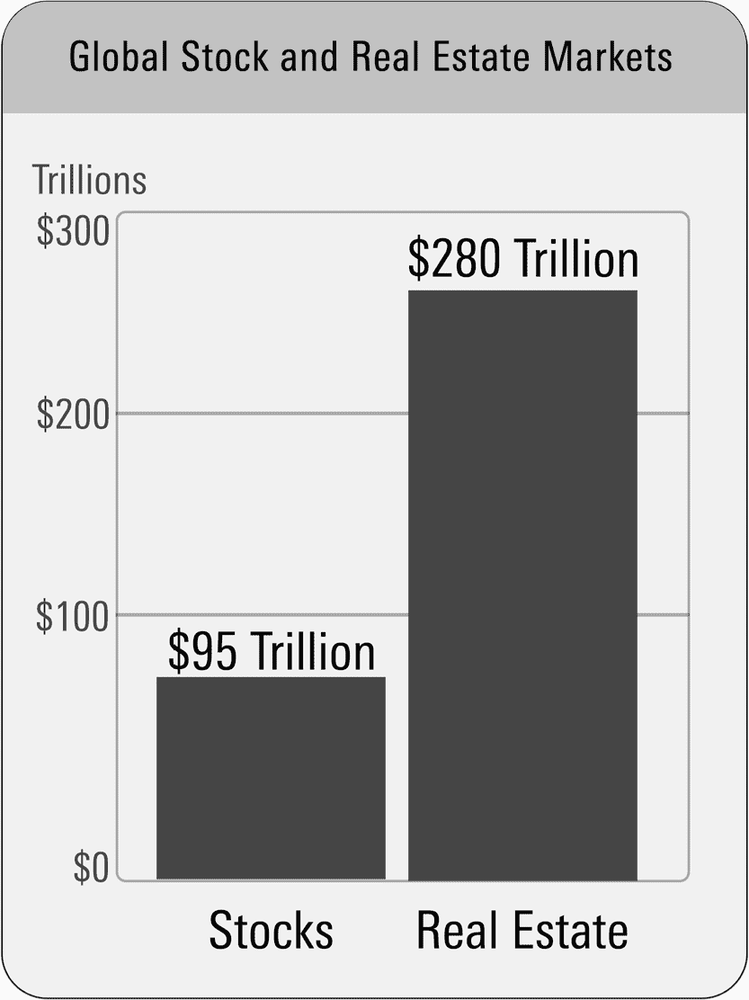

图 9.1

想象一下能够代币化你的家。为什么你会想要这样做？嗯，如果你像大多数房主一样，你的房子是你最大的资产。假设它值 100 万美元。你退休了，需要额外的收入来维持生活。你可以卖掉你的房子，但你不想搬家。你可以申请抵押贷款，但在退休期间很难获得贷款。而且，你不想被每月的还款所困扰。

因此，将房屋进行代币化。把契约分成 100,000 份，或者代币，每份售价为$10。然后，你可以出售尽可能多的代币。现在卖一些，以后再卖一些——随你怎么做。买家将投资于不动产——你的不动产。他们甚至可以在区块链上把他们的代币卖给其他投资者。你甚至可以回购这些代币；它们的价值将取决于房屋的当时价值和供需关系。

不动产被视为一种流动性较差的资产；卖出需要很长时间，并且你需要支付许多费用来完成交易。而且这种交易是全额或者零额——你必须出售整个房产（你不能仅仅出售餐厅）。但是多亏了区块链技术，你*可以*仅仅出售餐厅。你的房子变成了一种流动资产，就像股票和债券一样。

任何实物资产都可以被代币化，包括艺术品、收藏品（例如棒球卡、稀有硬币和邮票——关于税务方面的内容请参阅第二十章）、古董、豪华汽车、美酒、版税和表演合同（演员、艺术家、运动员和作家随时间赚取的钱）。卖家获得流动性，买家获得新的投资机会，并以前所未有的方式创建惊人的新的投资组合分散程度，远远超过以往。

令人兴奋！只要在购买任何代币之前，确保您像评估任何其他投资一样评估它。

### 治理代币

我们已经看到，开发者之间的分歧可能导致硬币分叉。但是哪些开发者有权对这些决定进行投票呢？

一些协议通过发行治理代币来回答这个问题。一个代币=一票，因此您收集的代币越多，您在特定区块链上的发言权就越大。

请思考一下。当一家公司面临决策时，董事会——坐在公司总部的会议桌周围——进行投票。这是一个集中式的结构。每个人都知道谁在投票以及投票发生的地点。

但是，当全球数十万开发者和用户对去中心化区块链进行投票时，谁掌控着？没有人；这个组织是自主运行的。而投票发生在哪里呢？既不在任何地方，又在所有地方同时。

因此，这种组织被称为*去中心化自治组织*，或 DAO。根据追踪器 DeepDAO 的数据，这些实体已经拥有超过 80 亿美元的资产；*MoneyWeek*宣称 2020 年代是“DAO 的十年”。一些人称 DAO 是数字资产的下一个大事。就我个人而言，我认为它们是下下一个大事。下一个大事（更快地到来）是……

### 非同质化代币

要了解什么是非同质化代币以及为什么我称之为下一个大事，您首先必须了解什么是同质化代币。

*可互换*意味着相同且可互换。例如，美元纸币是可互换的。假设我借给你一美元，你下周还给我。你还给我的一美元不必是我给你的那张，因为所有美元纸币都是相同的。它们是可互换的。你用 Visa 卡获得的里程积分也是可互换的，赌场筹码也是如此。我们随意交换可互换的代币、股票、货币和其他资产，因为每个都与其他每个相同。比特币、以太币和 XRP 也一样——每个硬币和每个代币都是可互换的。

除非它们不是。当代币不可互换时，意味着不同，它们是，呃，*非同质化代币*，或者 NFT。每个 NFT 都是独一无二的。就像毕加索的画作一样，没有两个是相同的。

NFT（非同质化代币）是代表现实世界对象的数字资产，例如艺术品、音乐和视频游戏物品。与其他数字货币和代币一样，NFT 是在区块链上创建的。（尽管有几种区块链允许它们的创建，但截至本文撰写时，以太坊区块链是最广泛使用的。NFT 是使用本地区块链币购买和出售的，在这种情况下是以太币。）

关注 NFT 始于 2021 年 2 月，当住在南卡罗来纳州查尔斯顿的艺术家 Mike Winkelmann 拍卖了一幅数字图像时。他以 Beeple 的名字闻名。他的 NFT 以 6900 万美元的价格售出。买家获得了对数字图像的法律权利，但那只是一幅图像。这件艺术品并不存在于现实世界中。买家无法将其挂在墙上，只能在手机上查看。

为什么有人会购买不能挂在墙上的艺术品？

一个简单的原因是你并不经常看墙。你更经常看手机。随身携带艺术品这样你随时都可以看到它，这难道不是有意义的吗？

好的，那有道理。但是其他数百万人也可以查看 Beeple 的艺术作品，不仅仅是买家，因为这幅图像对于每个人都可以在互联网上轻松查看。（试试吧。谷歌一下。）

等等——买家到底买了什么？

部分是炫耀权利。但也是因为买家购买了对资产（虽然是数字化的）的合法所有权声明，因此有权按照他们的意愿出售、许可或分发它。包括每个其他发布该图像的人停止并放弃或遭受法律后果的权利。

无论你是在理解中点头，还是在不信和不赞成中摇头，要认识到全球非同质化代币的总销售额在 2021 年超过了 130 亿美元；而在 2020 年，这个数字还不到 3000 万美元。现在有超过 400 万人每天购买和出售 NFT。它们无处不在，发行者争相吸引买家的注意力。当 Coinbase 在 2021 年创建其 NFT 平台时，有超过 90 万人在第一天就注册了。

国家篮球协会已经成为最成功的 NFT 发行者之一，拥有名为 NBA Top Shots 的虚拟交易卡片。这些是可收藏的卡片，就像几代人的孩子们交易的棒球卡片一样——不同的是，这些新卡片只存在于互联网上。NBA 最初创建了定价为 $999 的 2,500 套卡片，每套包含 10 张卡片。这些卡片在区块链上提供，并在几分钟内售罄。今天，你可以在 Top Shot 网站上购买、出售和交易这些卡片。NBA Top Shot 在不到一年的时间内实现了 7 亿美元的销售额；每天有 25 万人登录该网站。而为 NBA 构建 Top Shot 的 Dapper Labs 公司估值达到了 76 亿美元。

尽管一张勒布朗·詹姆斯的 NFT 卖出了 30 万美元，但它并不是富人的专属领域；已经有 300 万次交易，每次交易都少于 50 美元。它如此受欢迎，以至于 NBA 还推出了 WNBA 的卡片，而美国职业棒球大联盟和美国橄榄球联盟以及欧洲足球俱乐部也纷纷效仿。

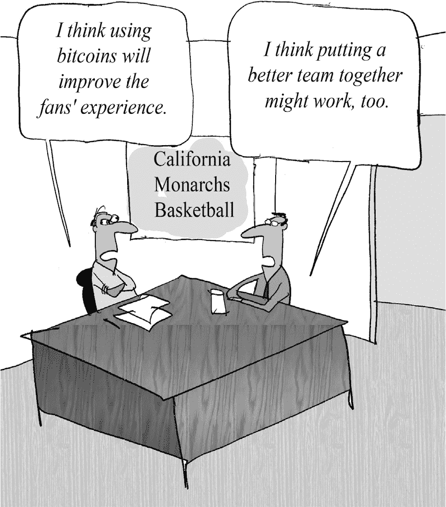

为什么有人想要购买只存在于数字形式的交易卡片？有很多原因。因为这些卡片是数字的，所以可以播放视频和照片。它们不受物理交易卡片三乘四英寸尺寸的限制——可以提供更多内容，包括指向其他网站的超链接。它们不会丢失、损坏或被盗。并且对 NFT 的所有权可能会给买家带来权利和利益，这些物理卡片可能没有，比如对其他产品（包括比赛门票）的优先权，或者对运动员的特别访问权。而且，由于这些卡片仅在区块链上交易，交易者知道之前的所有者是谁，因为完整的历史记录是可查看的。这种公开可查的出处可以提高卡片的价值（就像一座房子如果曾被名人拥有过可能价值更高一样）。

最重要的是，交易者知道他们购买的卡片是真实的，而不是假的，这要归功于区块链技术的不可变性。假体育纪念品是一个巨大的问题；联邦调查局表示，市场上 50%的体育纪念品是伪造的，而庞大的保险公司 Chubb 则表示其他专家将这一数字更接近 80%。但 NFT 无法复制或伪造。

一个著名的早期 NFT 的例子是 CryptoKitties。这些并不是真正的猫；它们存在于以太坊区块链上进行交易。CryptoKitties 已经有三百万次交易，总额达到 3900 万美元；其中一只的最高价格曾达到 12 万美元。另一个名为无聊猿游艇俱乐部（Bored Ape Yacht Club）的组织。一万只独一无二的数字猿，每只都是一个 NFT。2021 年 7 月，平均一只猿的售价为 3600 美元，比三个月前的初始发布价格高出了近 1600％。已经有超过 6000 万美元被投资，抱歉，是*花费*在这些 NFT 上。

看起来每个人都在创作 NFT，包括 Katy Perry，Rob Gronkowski，Floyd Mayweather，Porsche，Mattel，*纽约时报*，McLaren 和 Jay-Z。Visa 推出了一个 NFT 计划，帮助艺术家加入数字艺术领域。美联社发行了名为“独特时刻”的 NFT——基于 AP 对上个世纪历史时刻的报道的数字化照片和新闻线。其中包括日本二战投降、纳尔逊·曼德拉的就职典礼以及冥王星的发现。电影导演昆汀·塔伦蒂诺拍卖了七个 NFT，每个都有一段未经剪辑的《低俗小说》片段。马克·库班的达拉斯小牛队给予了在主场比赛中出席的球迷 NFT 作为奖励。*经济学人*杂志刊登了一期以加密货币为封面的问题——然后以 42 万美元的价格出售了它的 NFT。滚石乐队出售其音乐的代币化版本，捆绑了虚拟和现实世界的商品。麦当劳举办了一场以 McRib 为主题的 NFT 赠品活动。State Farm 推出了增强现实寻宝活动，让消费者找到 NFT。康宝莱、必胜客、塔可贝尔、Clinique、美国鹰、夏尔曼和金枪鱼在 2021 年都举办了与 NFT 相关的促销活动。

詹姆斯·艾利森是一位教授，在伯克利时，因其在癌症免疫疗法方面的工作而获得了诺贝尔奖。他将他的研究论文数字化，并将它们全部转化为数字艺术品，然后以 NFT 的形式出售——这相当于将米基·曼特尔的新秀棒球卡数字化的科学等价物。伯克利大学为詹妮弗·道德纳（CRISPR 技术的另一位伯克利诺贝尔奖得主）做了同样的事情。蒂姆·伯纳斯-李于 1989 年发明了万维网。他编写了代码，但从未对其工作进行专利申请。因此，他将代码转化为 NFT，拍卖行苏富比以 540 万美元的价格出售了它。

*纽约时报*

*USA Today*

*经济学人*

不仅是个人和公司对 NFT（非同质化代币）感兴趣，慈善机构也是如此。NFT for Good 通过出售 NFT 筹集了 80,000 美元，用于反种族主义事业。Noora Health 以 500 万美元的价格拍卖了一枚 NFT。Alex's Lemonade Stand 出售了由患癌症儿童绘制的艺术品的 NFT。麦克米兰-韦伯斯特拍卖了 *NFT* 的定义，并将所得捐赠给 Teach For All。梅西百货在 2021 年感恩节游行期间出售了 9,500 枚经典气球的 NFT——这些 NFT 基于经典游行气球，为 Make-A-Wish 基金会带来了利益。世界自然基金会推出了一系列名为“非同质化动物”的 NFT，而 StreetCode Academy 则拍卖了“pNFTS”（慈善性 NFT），以帮助少数族裔加入科技经济。Gannett，即 *USA Today* 的所有者，通过出售报纸艾伦·谢泼德送上月球的 NFT 筹集了空军航天导弹博物馆基金会的资金。白血病和淋巴瘤协会、救助儿童组织、弗雷德·哈钦森癌症研究中心等慈善机构都通过出售 NFT 进行筹款活动。MLB、NHL 和 NFL 都举办 NFT 拍卖活动以筹集慈善资金。

现在人们甚至购买和出售只存在于 NFT 中的家具、房屋和土地。SuperWorld 将地球进行了绘制，并将其划分为 64 亿块地块，每块地块为 300 英尺×300 英尺。你可以购买任何地块——埃菲尔铁塔、罗马竞技场、帝国大厦、你的童年家园，你想要的任何东西。如果地块尚未被认领，你需要支付 0.1 个以太币（约 400 美元）。如果有人已经购买了你想要的地块，你可以从他们那里购买；你只需像在任何市场中一样协商价格。一旦你拥有了一块地块，你可以随时将其出售给其他人，就像你可以出售你拥有的任何资产一样。

想学习如何做到这一点吗？在线游戏可以教你。Axie Infinity 是一个玩赚游戏。当你繁殖、战斗和交易名为 Axies 的数字宠物时，你将获得 NFT 和其他奖励，并使用你的资产购买游戏内的虚拟地块。（2021 年 12 月，一块地块以 250 万美元的价格售出。）

制作 NFT 如此简单，以至于连孩子都能做到。Ahmed，一位 12 岁的编程人员，与父母一起住在伦敦，他在 2021 年夏天创建了自己的 NFT 系列作品，名为 Weird Whales。他的父母提供了他需要的 300 美元来将他的 NFT 上传到区块链上——整个系列在九小时内售罄。Ahmed 迄今为止已经通过销售和二次销售赚取了 500 万美元（他在每笔二次销售中获得 2.5%的版税）。截至目前，Ahmed 正在开发更多的 NFT 项目，并且仍然没有银行账户。只有一个加密钱包。

电子游戏玩家也参与了 NFT 活动。为什么不呢？全球每年花费 1600 亿美元进行游戏（见侧边栏）。但一旦你停止玩游戏，这笔钱就没了。但是现在不一样了。Burberry 制作了 10 万件其服装的 NFT；玩家可以购买这些服装并让他们的化身穿上。而这些不再是游戏中毫无价值的小玩意儿，你拥有了你的 Burberry NFT。意味着你可以携带它并在其他游戏中穿上它。当你厌倦时，你还可以出售它。

Mythical Games 还为玩家制作并出售 NFT 服装。您可以创建自己的衣服来使用或出售。神话般的游戏从投资者那里筹集了 1.2 亿美元，但您不需要大量资本就可以开始。创建一个 NFT 的成本不到 1000 美元，有些网站甚至可以免费创建。

而且，许多玩家并不是花钱玩游戏，而是赚钱。由战斗模拟器游戏 Axie Infinity 领导，玩家竞相赚取平滑爱情药水（游戏的代币）。可以赚取可观的收入。该游戏在菲律宾尤其受欢迎，一些人通过玩游戏赚取他们唯一的收入。其他流行的游戏还包括：

+   **CryptoBlades：** 在币安智能链上的角色扮演游戏，您可以通过击败敌人和进行突袭来赚取 SKILL 代币。

+   **Cometh：** 玩家探索星系并从小行星上开采代币。

+   **植物大战僵尸：** 玩家通过浇灌其他玩家数字农场上的虚拟植物来赚取 PVU 代币。他们使用代币购买真正的种子和植物。

+   **Zed Run：** 玩家通过血统和祖先繁殖虚拟赛马，以创建各种颜色，力量和速度的马匹。优秀的饲养员可以通过在数字赛道上比赛他们的电子马赢取数千美元的奖金。

全球近 30 亿人每年在线玩电子游戏，花费 1600 亿美元。他们用于购买和订阅费用，角色扮演（游戏中使用的数字化版本），服装和化妆品（毕竟，你的角色必须看起来好看！），提示，武器和技能工具（以提高游戏表现）。10 位玩家中有 7 位使用信用卡和借记卡支付这些购买费用；只有 3.2%使用比特币或其他数字资产支付。因此，数字资产的增长潜力巨大，信用卡公司面临的威胁也很大。

#### 不仅仅是一个愚蠢的游戏

如果这些对你来说仍然有点傻，那是因为我们只谈到了艺术、棒球卡和视频游戏。这些东西 *真的* 重要吗？

公平的。那么，让我们试试这个：很快，你将能够将你的护照转换成由区块链技术支持的 NFT。你将不必随身携带纸质护照。你的护照是独一无二的，并且由于区块链的存在，它经过验证，无法复制、复印或删除。

或者，机场、航空公司和体育赛事可以发行 NFT 作为数字纪念品。你在音乐会上不再买 T 恤，而是购买一个 NFT。

或者，全球最大的音乐活动组织 Live Nation 现在以 NFT 形式销售音乐会门票。

纽约市的餐厅 Quality Eats 在 2021 年创造了一款鸡尾酒和一个秘方的 NFT。它以约 2000 美元的价格拍卖出去。除了拥有秘方外，买家每次来餐厅免费喝酒时还能获得一杯免费饮料。这是一个聪明的商业举动——餐厅能够一次性获得两千美元现金，并吸引一个经常光顾的顾客，他会向朋友们吹嘘自己拥有这个秘方。每次来兑换免费饮料时购买的餐点的成本远高于一杯免费饮料的成本。双赢。

Quality Eats

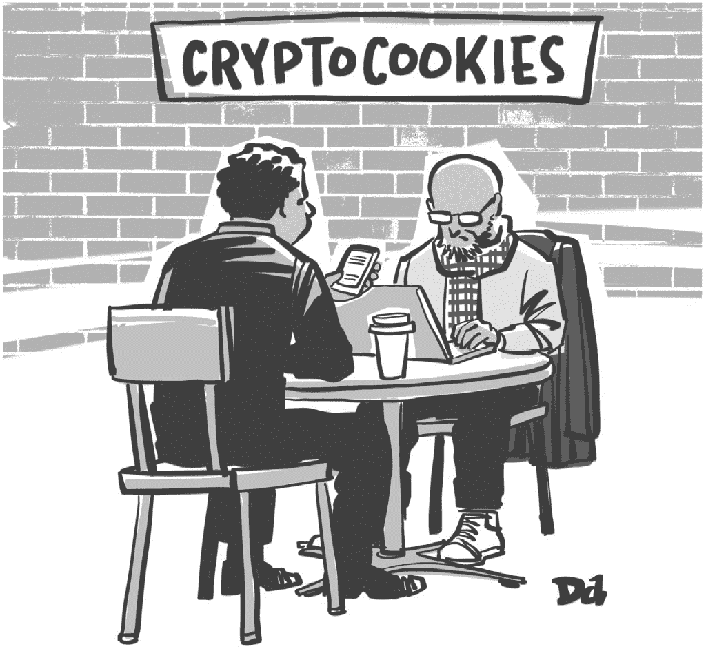

*“我不在乎我拥有多少东西——对于数字版女童子军薄荷饼仍然有些不满足。”*

或者，Masterworks 购买了由沃霍尔、班克斯、莫奈等人绘制的艺术品。然后公司对这些绘画进行标记化并出售代币。这是首次，数百万零售投资者可以拥有稀有绘画的一部分。

在数字世界中，一切都可以实现代币化、货币化和民主化。参与的唯一要求是拥有连接到互联网的手机。难怪 NFT 市场正在蓬勃发展：2021 年第三季度，NFT 交易量达到 107 亿美元，比前三个月增长了 700%。摩根士丹利表示，到 2030 年，NFT 市场将成为一个 3000 亿美元的业务市场，帮助奢侈品牌增加 25%的利润。所有这些解释了为什么《经济学人》表示，2021 年风险投资家向区块链和数字资产公司投资了 200 亿美元，比 2020 年增加了 7 倍。

所有这些兴奋之情将越来越多地归因于*元宇宙*。这是一个广义的术语，指的是虚拟现实，这个术语本身本质上是指“视频游戏”。玩家创建一个化身，购买土地、工具、技能、知识和 NFT，并与其他玩家交易他们的财产。元宇宙是相互连接的，全天候在世界范围内运转的 3D 虚拟世界。这是一个涵盖数字和物理世界的自包含的互联网经济体。

元宇宙经济规模巨大。Grayscale 称，到 2025 年将产生 4000 亿美元的年收入，最终成为一个万亿美元的市场。现在你开始明白为什么马克·扎克伯格将他的公司名称从 Facebook 改为 Meta Platforms 了。

想要购买一些 NFT，或许是用于在元宇宙中交易？就像你会评估任何其他你想购买的东西一样来评估它们。

### 未来代币的简单协议

投资去中心化项目的风险投资者（第十章）经常通过获取 SAFTs（*未来代币的简单协议*）来购买企业的股权。SAFT 是一份合同：公司承诺在将来给予风投代币，如果代币被发行的话。这是一个新的方法，有许多尚未解决的法律和税务问题——因此在撰写本文时，它还不是适用于日常投资者的工具。

1.  -   这些名字真是令人爱不释手。

## 第十章 去中心化金融，也称为 DeFi

谈到 NFT 时，我们很快意识到，除非我们先理解了可互换的，否则我们无法理解非同质化代币。

同样地，DeFi，或*去中心化金融*。要理解它，我们必须首先了解什么是*中心化金融*。好消息是你已经了解了：你每天使用的金融服务由中心化公司提供——银行、经纪公司和证券交易所。它们有实体位置、大量员工和股东拥有它们。公司决定是否授权你参与。如果经纪公司不同意为你开设账户，你就无法交易股票；如果银行不同意，你就无法开设银行账户。

因此，中心化公司拥有着巨大的权力。但 DeFi 消除了它们——以及它们的权力。令人惊讶但却是事实：银行、经纪公司和交易所不再是必需的。世界各地的人都可以参与，无需任何人的许可。

这是一场革命。

去中心化金融世界为你提供了传统金融服务公司提供的一切——借贷、资产管理、投资和保险产品。所有这些都通过区块链上的*智能合约*（我们在第二章学到了）提供。

要使用去中心化应用程序，你需要获取一个热钱包，比如 MetaMask 提供的一个。将数字资产放入其中，比如以太币。就这样。你就可以使用任何去中心化应用程序了。无需登录。无需用户名。无需密码。不需要任何人的许可。

MetaMask

因此，与通过连接到纽约证券交易所的经纪公司购买股票（两家中心化公司！）不同，你去的是去一个 DEX——一个*去中心化交易所*。最大的是 Uniswap，自 2018 年成立以来已处理了超过 4000 亿美元的交易；每天它处理的交易额超过 3.5 亿美元。纽约证券交易所有 3000 多名员工；Uniswap 有 37 个。纽约证券交易所成立于 1792 年；Uniswap 是由海登·亚当斯在 2018 年创建的，他在大学毕业两年后。令人震惊，是吧？

Uniswap

纽约证券交易所^(I)

据追踪服务 DefiLlama 表明，DeFi 平台已经在多个区块链上持有超过 2400 亿美元，风险投资和私募股权公司已经向 DeFi 初创公司投资超过 700 亿美元，根据 DeFi Pulse 的数据。

但这一切仍然很新，因此使用起来有风险。DeFi 在任何监管框架之外运作——没有 SEC、CFTC 或 FDIC 来保护你。如果智能合约中有 bug，函数可能会失败或执行错误——导致你经济损失。燃气费（在第五章中介绍）可能会每笔交易 100 美元或更多。而且你永远无法确定幕后是谁；例如，协议 PolyGaj 管理着 700 万美元；它是由 Gajesh Naik 创建的。他只有 13 岁。

因此，在参与之前，请确保你理解技术——以及你打算使用的平台背后的人。

### Oracles

*Oracle* 是将数字世界与现实世界连接的软件代码。例如，IBM 股票现在的价格是多少？纽约证券交易所可以告诉你，因为那里是 IBM 的交易地点。但区块链却不知道。这就是 Oracle 的用处。

预言机将来自物理世界（称为链下）的数据带入数字区块链（链上）。预言机有成千上万的用途——供应链和商品流动，天气，特定生态系统中的用户数量，政治趋势，法律协议等等。所有这些数据都可以带入数字世界。

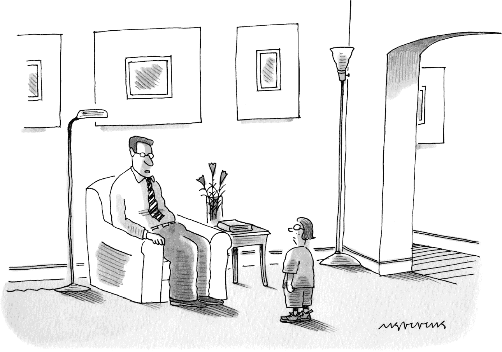

*“上周我不是刚给你一家初创公司投了钱吗？”*

也有 *出站预言机*。它们告诉区块链外的真实实体有关链上事件的信息，比如特定应用程序、网络或协议借出的总金额。

在撰写本文时，Chainlink 是最大的区块链预言机提供商。

1.  我。我在 NYSE 的母公司 ICE 和曾由 ICE 拥有的数字交易所 Bakkt 拥有股权。

## 第十一章 比特币和其他数字资产的估值和定价

这是我经常被问到的问题，也是可以理解的：比特币的价值是多少？你必须知道答案，这样你才能决定它的增值潜力。

然而，这个问题存在问题。并不是问题本身，而是提问者的问题。你知道吗，问题“比特币的价值是多少？”大多来自那些“要求知道”比特币价值的批评者——因为他们已经认定答案为零。这些人咆哮着说比特币没有内在价值，没有预期收益（根据他们的经济学教授阐述的理论），没有效用，利息，股利或用途。 *“哼，”* 这些人对我说，“比特币一文不值！”

我从不与他们争论。与穴居人（就像我认识的某个投资经理）争论毫无意义。相反，我回答：“比特币可能没有任何价值。但它的价格确实够劲。”

所谓的专家自从 *比特币* 这个词进入他们的脑袋以来，就一直告诉我比特币没有价值。当它的价格在几百美元时（我第一次遇到它的价格），他们说它没有价值。当它涨到 20,000 美元时，他们说它没有价值。当它跌了 84%，但仍然以 3,000 美元的价格销售时，他们说它没有价值。当价格达到 60,000 美元时，他们说它没有价值。而今天，他们仍然说它没有价值。

不错。它没有价值。但自问世以来，其价格已经上涨了 87,000,000%。比特币是历史上最赚钱的资产。因此，那些象牙塔里的、拥有研究生学位的资产管理人员应该放下他们的傲慢，免得历史将他们与说地球是平的“专家”联系起来。

杰米·戴蒙，摩根大通的首席执行官，讨厌比特币

| $812—2014 年 1 月 | 杰米说比特币是一个“糟糕的价值存储工具。” |
| --- | --- |
| $400—2015 年 11 月 | 杰米说：“比特币将被阻止。” |
| $3,900—2017 年 9 月 | 杰米说：“比特币是一种欺诈。它不会起作用。” |
| $3,900—2017 年 9 月 | 杰米说：“它最终会崩溃。这是一个欺诈，知道吗？”——同时威胁要解雇他公司的交易员购买了比特币。 |
| $5,600—2017 年 10 月 | 杰米说：“如果你愚蠢到买它，总有一天你会付出代价。” |
| $6,300—2018 年 10 月 | 杰米说：“我真的不在乎，这就是重点，知道吗？” |
| $53,300—2021 年 5 月 | 杰米说：“我不是比特币的支持者……我不关心比特币。我对它没有兴趣。” |
| $54,800—2021 年 10 月 | 杰米说：“比特币没有内在价值。我认为这有点像愚人金。” |
| $57,500—2021 年 10 月 | 杰米说比特币“毫无价值”。“我个人给人的建议是，远离它。” |

杰米·戴蒙（Jamie Dimon）和沃伦·巴菲特（Warren Buffett）讨厌比特币。但并非所有他们队伍中的人都持有这样的观点。例如，摩根士丹利（Morgan Stanley）的首席执行官詹姆斯·戈尔曼（James Gorman）在 2021 年 10 月表示：“我认为加密货币不是一种时尚，我认为它不会消失... 支持它的区块链技术显然是非常真实和强大的。”

因此，你必须决定要听谁的话。对我来说，我选择忽视那些说他们“不在乎”的人，以及承认“我对[它]一无所知”的人。我觉得接受市场实际上已经为比特币和所有其他数字资产指定了价格（即使杰米·戴蒙和沃伦·巴菲特也同意这一点！）更有帮助，因此我关注真正重要的问题：未来的价格会是多少？毕竟，就像任何投资一样，知道价格将上涨还是下跌肯定是有用的信息！

沃伦·巴菲特讨厌比特币

| $450—2014 年 3 月 | 沃伦表示：“它基本上是一个海市蜃楼。认为它具有巨大内在价值的想法在我看来只是一个笑话。如果它在十年或二十年后不复存在，我不会感到惊讶。它不是价值储存器。它一直是一种非常投机的“巴克·罗杰斯”（Buck Rogers）类型的东西。” |
| --- | --- |
| $9,900—2018 年 1 月 | 沃伦表示：“我们不持有任何比特币。我们永远不会持有它们的头寸。为什么我要在我一无所知的东西上采取立场呢？” |
| $7,300—2018 年 5 月 | 沃伦表示：“可能是毒鼠强加倍。” |
| $6,900—2018 年 8 月 | 沃伦表示：“它会持续一段时间。它吸引了许多江湖骗子。它将走向一个糟糕的结局。” |
| $3,700—2019 年 2 月 | 沃伦表示：“比特币根本没有独特价值。它基本上是一种幻觉。” |
| $8,800—2020 年 2 月 | 沃伦表示：“加密货币基本上没有价值，它们不产生任何东西。就价值而言：零。比特币已被用于非法转移大量资金。我没有任何比特币。我永远不会有。” |

传统的资金管理人和投资分析师经常认为比特币是毫无价值的，因为他们的估值技术表明如此。事实上，他们经常展示他们的研究来证明他们的观点。问题在于，他们正在使用的方法论——那些经过验证、成熟的指标应用于各种传统资产类别（如股票、债券和房地产）——在评估数字资产时不起作用。这是因为数字资产缺乏其他资产类别所具有的输入。这并不是数字资产的缺陷；有缺陷的是认为缺少这些输入意味着比特币没有价值。

投资学者和从业者通常使用三种技术来确定资产的价值。让我们来看看它们，你会明白为什么把它们应用于数字资产是毫无意义的。

### 成本法

这种技术基本上是说，资产的价格应该等于建造、替换或采购它所产生的成本。在比特币早期，这个数字估计起来相当容易，当时 Laszlo 购买披萨的行为使比特币的价格为每一百分之七的一美分。

一个早期与比特币相关的网站看了一下租用一台计算机挖矿比特币所需的费用以及支付电费的金额，然后将这个成本与挖矿得到的比特币数量进行了比较。这似乎更合理，当你试图确定可口可乐的适当价格时，它起作用。但比特币不是一个产品，你也不是在确定硬币的价格。你想要确定的是整个网络的成本，而这种“挖矿成本”方法忽略了比特币生态系统及其网络的价值。这是一个相当大的遗漏，这就是为什么它会导致极度错误（而低估）的估值。

### 市场方法

这种方法通过比较交易与具有类似特征的其他交易来评估资产的价值，调整不同的数量、质量或规模。公开公司对比法比较相似的公开交易公司的数据。这显然对于数字资产没有帮助，因为它们都不是上市公司；它们没有员工、总部、产品或销售。

先例交易法看重的是在某个行业中已经出售的公司，并以它们的*倍数*作为确定被估价公司价格的基础。例如，假设一个酒店公司有 100 亿美元的利润，并以 500 亿美元出售。那就是一个 5 倍的倍数。所以，如果你的酒店有 30 亿美元的利润，你应该愿意以大约 150 亿美元的价格出售，使用相同的倍数。

问题在于比特币不是一家公司，没有收入或利润；没有任何东西可以评估价值，使这种方法失去意义。但是，许多市场分析师却坚持认为这证明了比特币没有价值。

### 贴现现金流

当你知道或可以做出合理假设关于未来现金流量、贴现率和终值时，这是一个有效的工具，但对于不产生现金流的资产——比如比特币，它并不可靠。

如你所见，当应用于数字资产时，这些技术并不能提供准确的信息。尽管如此，许多金融分析师和投资经理仍然坚持使用它们。因此，当这些技术无法产生有效数据时，他们只是说，“比特币没有价值”，而不是说，“我们需要更好的估值方法。”

数字资产领域的参与者们正在做的就是这样。他们已经开发或应用了其他方法来帮助他们确定比特币和其他数字资产的适当价格。每一种方法都值得一门大学水平的课程，所以我只会在这里提供简短的摘要（一部分是为了介绍你这些概念，一部分是为了避免让你厌烦到死）。

### 市场替代品和效用价值

中本聪创建比特币的意图是明确的：它是一个独立的点对点支付系统。换句话说，比特币被设计成货币。如果这是它唯一的用途，那么它的整个价值必须基于这个功能。一些人认为比特币的价值因此可以与其他理论上可以替代的“价值储藏”资产相比，比如黄金。

如果比特币要成为黄金的替代品，它的价格就必须与黄金相当。那么，我们就来做这个比较，看看得到什么答案。

世界黄金协会估计，历史上已经挖出了 1.9 亿吨的黄金（仍然被记录）。假设每盎司价格为 2,000 美元，那么世界黄金的总价值为 13.4 万亿美元。

因此，这个理论认为，世界上所有比特币的价值也应该如此。由于总共只有 2100 万比特币会被挖出，每个比特币的价格——如果与黄金价格相当的话——应该是 639,000 美元。

但是等等。我们知道到目前为止只有 1850 万比特币被挖出，其中大约有 400 万被视为丢失。这就剩下了 1450 万比特币——这意味着每个现存比特币的实际价格应该是 926,000 美元。

提醒我，比特币今天的实际价格是多少？

正如你所看到的，*市场替代品和效用价值*方法表明，数字资产的价格将会大幅上涨，因为投资者意识到当前价格低于实际价值。

### 货币的流通速度

你在床垫下放了一张美元钞票。它的流通速度有多快？

哦，显然，它根本不动。它只是躺在那里，就在你床底下。零流速。但是，假设你把那美元交给商家以支付产品。商家将美元交给批发商以购买更多商品。批发商将美元交给制造商购买更多产品，制造商使用美元从供应商购买原材料。

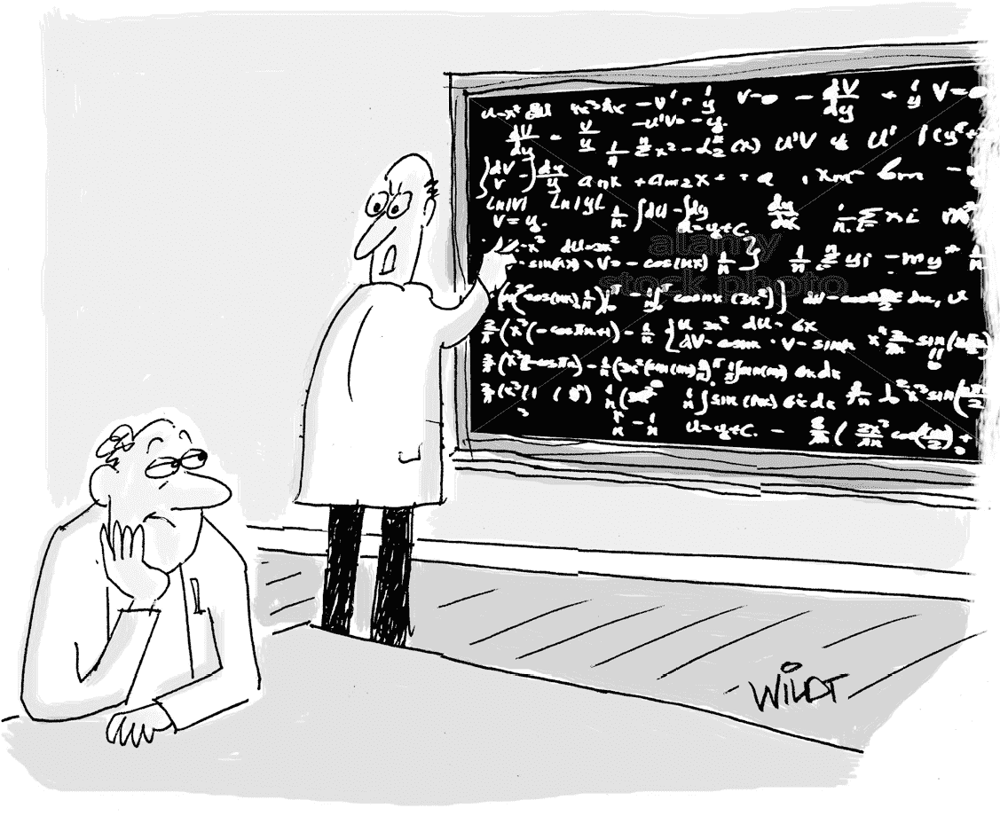

"你知道，‘DUH’可能是一个非常伤人的词！"

资金在经济系统中的流动被称为*货币流速*。在给定时期内的交易数量增加时，货币流速增加，而流速越高，经济增长越快。

将此应用于比特币买家。他们是否使用比特币购买和销售商品和服务？还是作为 HODL 者？根据这一理论，如果你认为比特币作为金融交易工具的使用将随时间增加，那么你就在主张其价格上涨。

### 网络价值

这种估值方法基于梅特卡夫定律，该定律指出一个网络的价值随着网络用户数量的增加呈指数增长。这一理论由经济学家乔治·吉尔德在 1993 年提出，但是互联网先驱罗伯特·梅特卡夫（乙太网的共同发明者和 3Com 的联合创始人）将其应用于通信网络的用户，而不是设备。

梅特卡夫定律认为，一个网络的价值与网络连接用户数量的平方成正比。简单来说，Facebook 因为有很多用户而价值连城，随着用户数量的增加，Facebook 的价值不是线性增长，而是呈指数增长。

记住，比特币是一个网络。因此，那些试图评估比特币价值的人已将梅特卡夫定律应用到其价格上。网络价值与梅特卡夫比率（NVM）将数字资产的市场资本化除以活跃地址数量的平方。

许多人认为，这种技术更适合将一个数字资产与另一个数字资产（或在不同时间段内的自身）进行比较，而不是作为确定数字资产内在价格的工具。此外，该比率不考虑每个用户的地理位置、活动频率、吞吐量或其他因素。因此，我尚未遇到任何完全依赖这种方法的人。相反，它与其他指标一起被考虑。

### NVT 比率

一些比特币分析师关注“网络价值与交易比率”。这衡量了数字资产网络的价值和资产的流通单位的总美元价值与其作为支付网络的价值（以资产的区块链上结算的交易的美元价值衡量）之间的关系。

NVT 比率有助于表明市场愿意为区块链的交易效用支付多少。

### 股本流比率

该指标用于量化资产的稀缺性。该比率通过将现有供应量除以年产量增长来计算。

### 投机价值

这里的估值是基于希望未来的投资者愿意为数字资产支付比今天更多的价格。这全都是供需关系的问题，这就是所说的。

* * *

这是数字资产领域设计或部署的六种估值方法。还有很多。

[Woobull.com](http://Woobull.com) 提供了这个详尽的列表：

+   **比特币价格模型。** 比特币的各种价格模型。

+   **比特币 NVT 比率。** 比特币的市盈率。用于检测比特币是否被高估或低估。

+   **比特币 NVT 价格。** 有助于了解有机投资支持的价格的比特币 NVT 价格。

+   **比特币 NVT 信号。** NVT 比率经过优化以更具响应性，作为长期交易指标很有用。

+   **比特币 VWAP 比率。** 使用成交量加权平均价格，是一个对本地和全球市场顶部和底部的有用信号。

+   **比特币 MVRV 比率。** 基于已实现市值的比特币超额估值指标。

+   **比特币 RVT 比率。** MVRV 的基于交易量的变体，用于确定市场顶部和底部。

+   **比特币梅耶倍数。** 跟踪梅耶比率以衡量比特币价格与其历史变动之间的关系。

+   **比特币难度带。** 一个关于矿工投降的视角；通常信号显示买入是明智的时机。

+   **比特币风险调整回报率。** 比较调整了风险的比特币投资回报率与其他资产的回报率。

+   **比特币波动性与其他资产类别。** 将比特币的波动性与其他资产类别进行比较。

+   **比特币增长与其他资产类别。** 将比特币增长与其他资产类别进行比较。

+   **比特币持有在 ETF 和公司财政中。** 跟踪公开可访问的实体通过股份持有的比特币。

+   **每投资一美元的比特币估值增益。** 每投资一美元，比特币价格增长多少。

+   **比特币网络交易量。** 每月在网络上在不同投资者之间流动的比特币数量。

+   **比特币与黄金。** 比较比特币与黄金的投资表现。

+   **比特币波动性趋势。** 这与外汇交易进行比较；还有交易量。

+   **比特币货币供应与美元。** 比特币是否朝着世界储备货币的方向发展？

+   **比特币通胀率。** 跟踪比特币货币供应的历史年通胀率。

+   **比特币货币速度。** 比特币是朝着支付还是储蓄/投资方向发展？

+   **比特币交易量与网络价值。** 比特币的区块链传输量与其网络价值密切相关。

+   **比特币隔离见证采用率。** 跟踪隔离见证的采用情况。

+   **比特币网络吞吐量。** 比特币在交易、支付和每秒 USD 价值方面的吞吐量。

+   **比特币拥堵情况。** 用户为中心的度量，跟踪网络拥堵情况，例如支付费用、确认时间。

+   **比特币哈希价格。** 每个哈希的价格跟踪比特币挖矿硬件随时间的能力变化。

+   **比特币交易输出。** 跟踪每个比特币交易中打包了多少输出。

我相信你会松了一口气，因为我没有深入探讨这些细节。如果你对它们感兴趣，可以访问[woobull.com](http://woobull.com)。我列出它们的目的是为了说明聪明而认真的市场参与者——其中许多是现任或前任的华尔街人士——正在努力确定比特币的价格。暗示比特币没有价值仅仅因为几种其他为不相关资产类别创建的方法没有显示出有效的价格，并不意味着它没有价格。

从这段内容中你应该得出的结论是，虽然有人可能正确地断言比特币没有内在价值，但它肯定有一个价格。
