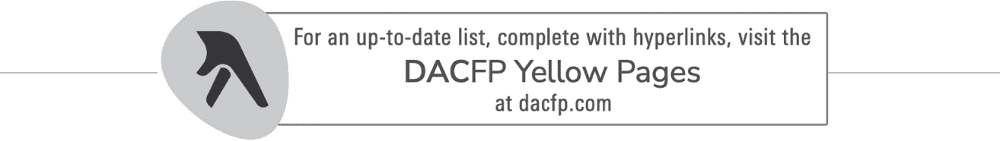

# 第三部分 投资数字资产

## 第十二章 购买比特币是否为时已晚？

比特币自问世以来的价格上涨了 87,000,000%。这种增长不可能再次发生。但是，仍然存在巨大的增长可能性，特别是当你将潜在回报与其他资产类别相比较时，后者通常每年都在个位数或低两位数范围内。

因此，我们不应该关注过去，而应该关注未来。比特币和其他数字资产的未来价格可能是多少？

许多人预测进一步的巨大增长，认为这种新兴资产类别仍处于初期阶段。亿万富翁对冲基金经理史蒂夫·科恩（Steve Cohen）表示，“虽然[数字资产]市场现在是一个 2 万亿美元的资产类别，但我们仍处于机构采用的早期阶段。”前普拉信证券主席乔治·鲍尔（George Ball）称数字资产“非常吸引人”，并预测“许多人将投资于这个资产类别”。黑石集团固定收益首席投资官里克·里德（Rick Rieder）表示，比特币可能与黄金竞争成为主要价值储存物。他的老板，黑石集团首席执行官拉里·芬克（Larry Fink）表示，“比特币是来留下的。”而斯坦福大学经济史教授尼尔·弗格森（Niall Ferguson）表示，疫情后最佳的投资机会是比特币。

由尼古拉斯·帕尼吉尔佐格鲁（Nikolaos Panigirtzoglou）领导的摩根大通策略师表示，比特币可能升至 14 万美元。Tiburon Strategic Advisors 预测为 15 万美元。花旗银行技术总监汤姆·菲茨帕特里克（Tom Fitzpatrick）表示，比特币将升至 31.8 万美元。古根海姆（Guggenheim）表示，它将达到 40 万美元。ARK 投资表示为 50 万美元。外汇建议表示，到 2025 年比特币将达到 100 万美元。而富达投资公司全球宏观主管朱里安·蒂默（Jurrien Timmer）表示，比特币的价格将在 2030 年达到 100 万美元，并在 2038 年达到 10 亿美元。（这不是打字错误。十。亿。美元。）

难怪大学和学院管委会协会说数字资产“已经产生了数以百万计的百万富翁，数以亿计的亿万富翁，并可能在未来十年产生世界上第一批万亿富翁。”该组织感到兴奋，因为这些新的富翁将被要求向大学捐赠大量资金。

Tiburon

2018 年，Inigo Fraser Jenkins 抨击了比特币。这很值得注意，因为他是全球投资管理公司 AllianceBernstein 的投资组合策略联席负责人，该公司管理的资产规模为 6310 亿美元。但在 2021 年，Fraser Jenkins 在向公司客户分发的一份研究报告中写道：“我改变了对比特币在资产配置中的作用的看法。”他的决定受到了各种发展的推动，包括大流行、政府政策的变化、联邦债务水平以及数字资产生态系统中投资者的新的分散化选择。他现在说，比特币在资产配置中确实有一席之地。

比特币的许多热情来自供需法则。沙子便宜是因为有很多，但很少有人想要。钻石昂贵是因为它们稀有，但被许多人所渴望。

比特币也具有稀缺性，随着对它的需求增加，其价格也会上涨。想象一下：世界上有 4700 万百万富翁。如果他们都想买一枚比特币，他们将无法做到。因为目前只有约 1400 万枚比特币，而且永远不会超过 2100 万枚。如果每个百万富翁都开始与其他人争相购买比特币，价格将不得不上涨——也许会显著上涨。

那么普通美国人呢？有多少人想要比特币？2009 年的答案是“没有人”。到了 2021 年，24%的美国人拥有比特币，据预测，到 2029 年，90%的人将拥有它。当资产的供应固定而需求增长了 530%时，你认为价格会发生什么变化？

这甚至在金融顾问中也算是早期。 根据《金融顾问》杂志的报道，迄今为止，只有 14% 的金融顾问将比特币纳入客户投资组合，但另有 26% 的人表示计划开始，将参与率提高三倍。 如果属实，那么到 2022 年底，每两位顾问中就会有一位推荐比特币和其他数字资产。 Tiburon Strategic Advisors 表示，金融顾问控制着 8 万亿美元的投资者资产；如果所有这些顾问只将客户资产的 1% 投入比特币，那么将有 800 亿美元涌入市场，这一金额相当于本文写作时比特币市值的 8%。 如果对一场音乐会门票的需求突然增加了 8%，你认为这些门票的价格会发生什么情况呢？

图 12.1

图 12.2

这还不算什么。 Ernst＆Young 和 Intertrust 在 2021 年的调查发现，31% 的对冲基金经理表示他们将在 2023 年之前将数字资产纳入其投资组合，到 2025 年将投资其投资组合的平均 7.2%。 Intertrust 的调查显示，资金流入达 3120 亿美元，这一激增相当于本文写作时比特币总价值的三分之一以上。

太晚了吗？几乎没有。

向客户推荐数字资产的金融顾问和财富管理者都是聪明人：他们将分享管理这些资产所产生的费用收入。 这些费用有多少？ 根据 Broadridge Financial Solutions 的数据，未来 5 年总共为 46 亿美元。

## 第十三章 投资数字资产的风险

尽管许多人对比特币和其他数字资产的未来前景感到兴奋，但我们必须承认这仍然是一个新兴的资产类别。 没有人知道会发生什么——这意味着我们必须认真考虑我们可能会经历数字资产价格的巨大和永久的市场崩盘的可能性。

因此，我们必须仔细审视投资于这一资产类别的风险。您必须对任何投资机会都要这样做；我们必须始终问自己，我们对我们的资金期望的回报率是多少，我们是否会得到资金的回报 *。

因此，让我们探讨数字资产价格可能下跌的原因……一直到零。

### 市场操纵

这种风险适用于每一种资产类别。抽水和倾销计划、插队交易和内幕交易是投资世界中常见的问题，数字资产也不例外。更糟糕的是，许多数字资产在 SEC 看来并不是证券。因此，数字资产世界也存在违反证券监管规定的行为。

### 业务和商业失败

数字资产不会自己出现；它们是由企业家发明的。一个想法可能很好，但将其转化为一个运作高效、盈利、规模化的成功业务是另一回事。您可能正在投资于在市场上失败的东西。

### 技术淘汰

还记得索尼的贝塔玛克斯（Betamax）吗？它被 VHS 录像机在市场上击败了——而这些录像机本身又被 Netflix 击败了。 Lotus 1-2-3 被 Microsoft Excel 取代。《大英百科全书》被 Wikipedia 超越。今天的伟大创新可能被下一个伟大的创新抛弃——从而摧毁您的投资价格。

Netflix

微软

维基百科

索尼

### 消费者/投资者需求

警惕凯文·科斯特纳综合征——即“如果你建造它，他们就会来”的信念。这只会发生在电影中。在现实生活中，要建立一家成功的公司需要远不止信仰。仅仅因为你开了一家商店并不意味着人们会光顾它——或者当他们光顾时会购买任何东西。

想想你每天看到的广告数量。公司们竭尽全力吸引你的注意，而最成功的公司并不一定提供最好的产品；通常情况下，它们只是有着最好的营销。

你购买的数字资产会因为解决了商业或消费者问题而获得关注吗？还是会被忽视或很快被遗忘？

### 监管干预

数字资产领域仍然备受争议。一些政府已经完全禁止了它们。其他国家则禁止某些实践。还有些限制谁能购买以及他们能购买什么。

鉴于这个领域的快速发展，许多政府经常改变主意，给加密社区带来了混乱。你必须意识到，联邦或州政府可能会禁止你的投资，或者施加繁重的税收或报告要求。所有这些行动都可能对你的投资价格产生不利影响。

### 51% 攻击

一个地方银行分行是银行劫匪的诱人目标，因为金库里有很多钱。这就是中心化系统的风险所在——它解释了为什么许多公司被黑客攻击：每家公司网络的位置都是已知的，因此可以成为攻击目标。

但是区块链是去中心化的；这就像一家银行将每张纸币分散在全世界的金库中一样。黑客如何跟踪并窃取它们呢？不可能。

这就是为什么加密社区成员对他们的活动如此自信的关键原因：区块链是不可被黑客攻击的。事实上，在比特币的整个历史中，它从未被黑客攻击过。

不过，这并非不可能。黑客可以通过一种方式做到。这就是所谓的 51% 攻击。为了控制一个区块链并窃取其数据（以及资产），黑客必须控制网络大部分节点。

有数百万个节点分布在全球各地，比特币网络被认为是不可能被黑客攻击的。也许我们应该说“几乎不可能”或者“实际上不可能”，或者“见鬼了，不要担心 51% 攻击，找点别的事担心吧。”

为此态度不屑一顾有其原因：比特币网络如此庞大——根据[Bitnodes.io](http://Bitnodes.io)网站的数据，全球有超过 11,500 个节点——仅仅根据 2021 年的哈希率，黑客要控制其中 51%的节点仅硬件成本就需要 55 亿美元。拥有这么多钱的黑客可能根本不需要更多，尽管你确实需要担心流氓政府。（许多人认为诸如朝鲜这样的流氓政府喜欢比特币，因为它让他们可以规避美国和其他国家实施的经济制裁。所以也许我们应该更担心 CIA 进行 51% 攻击，而不是金正恩。）

无论如何。仅仅因为比特币网络被认为是“太大而无法被黑”并不意味着所有区块链都是如此。事实上，一些*确实*成为了 51% 攻击的受害者——因为它们规模更小。BSV 在 2021 年 8 月 4 日遭受了 51% 攻击。此前的攻击也曾打击比特币黄金、以太经典、Verge 等。在每种情况下，在攻击被击退之前，都有货币被盗，给投资者造成了重大损失。

底线：网络越小或者货币或代币越新，就越容易受到 51% 攻击的威胁。在决定购买哪些数字资产以及投入多少资金时，请记住这一点。

### 量子计算的进步

在本书中——包括上面的部分——我们一直对比特币的私钥的无懈可击性持有了相当漫不经心的态度。这些密钥非常长（由字母和数字组成的 256 位数），有 10⁷⁷种可能的排列方式。任何计算机都不可能破解这个密码，这就是为什么黑客们转而攻击你在 ATM 上使用的那个愚蠢的 4 位数 PIN 码。

根据[stackexchange.com](http://stackexchange.com)，世界上最快的超级计算机需要 0.65 亿亿年^(II)才能破解一个单独的比特币地址。所以，没有什么可担心的。

直到量子计算机进入市场。这是计算机科学的下一个重大进步，预计到 2030 年将成为商业产品。有多重大的进步呢？假设你想从一个拥有一万亿项的数据库中找到一条数据。今天的超级计算机需要 1 万年才能找到你要找的数据。而量子计算机只需要 200 秒就能找到。许多网络安全专家担心的是，比特币的私钥将很容易被破解。

你应该担心吗？这取决于你，但我不担心有两个原因。首先，如果这些新机器能够黑客比特币区块链，区块链将是我们最不用担心的问题。我担心的是我们国家电网的安全性、水系统、空中交通管制——以及我们的核武库的安全性。

“这些比特币的东西是由技术和互联网支持的！可能出什么问题呢？”

其次，如果黑客可以使用量子计算机来破解私钥（以及我们的核弹头），你不认为比特币开发者（以及国防部门）会使用量子计算机来创建新的网络安全系统来防止这种黑客攻击吗？让坏人建造一把 10 英尺的梯子。我们将建造一堵 12 英尺高的墙。

如果我错了，量子计算确实摧毁了所有数字安全系统，那么，游戏结束。在这种情况下，没有什么是安全的——一切都会被黑客攻击，包括你的银行和证券账户、养老金、社会保障支票、保险单、年金、信用卡等等。

这就是为什么我不担心。你可以担心小行星撞击地球一样。如果它会发生，就会发生。如果发生了，就没有地方可以躲藏。

不要因为这种恐惧而避免数字资产。即使你没有被黑客攻击，其他人都会被攻击——这会使你陷入与被黑客攻击一样糟糕的境地。找点其他事情来担心吧，不要把这个作为不投资的理由。

### 流氓监管者

你上次想到空气是什么时候？可能已经有一段时间了——因为它无处不在且数量巨大。你对此不加思索，因为没有必要。然而，它对你的生命至关重要。

这就是你财务生活中的监管——你个人财务中极为重要、不可或缺的一部分。如此重要，如此自动，如此确定，以至于你可能都没有意识到你完全依赖于它。

但这种情况并不总是这样。今天的监管结构是我们解决了几个世纪以来遇到的问题的结果——并且只有在过去 90 年里才认真处理了这些问题。

什么是监管？这是一个法律术语，指的是某人持有并对属于别人的东西负责。（如果你去世了，谁将获得你未成年子女的*监护权*？看，你比想象中更熟悉这个术语。）

在我们度过物物交换时代之后，人们开始在销售产品和服务时收到货币。随着人们变得成功，他们开始积累大量的货币——这带来了问题。你如何保管它？

你可以把钱藏在床垫底下或者埋在后院，但它可能会丢失、被盗或者被摧毁。你可能会忘记你把它放在哪里，如果你去世了，你的继承人就不会知道你把它藏在哪里。因此，你把它存在银行里，那里可以赚取利息并且安全。

直到比利·小子、杰西·詹姆斯、布奇·卡西迪和其他 19 世纪 70 年代和 80 年代的土匪出现。在大萧条期间，银行受到进一步抢劫，成为约翰·迪林杰、邦妮与克莱德、婴儿脸纳尔逊、机关枪凯利和其他臭名昭著的亡命之徒的受害者。在每一次案件中，当强盗从银行偷钱时，他们实际上是在偷*你*的钱。

这导致许多人停止把他们的钱存入银行。没有存款，银行就没有多少钱可供贷款。没有借贷资金，商业就无法发展，经济就会受阻。

最终，国会采取了行动。它宣布银行抢劫为联邦罪行，并赋予新成立的联邦调查局追捕和逮捕强盗的权力，无论他们身处哪个州。国会还创建了联邦存款保险公司，为银行存款提供保险，让消费者相信他们的钱是安全的，即使银行本身不安全。

今天，美国国库司，联邦储备局，联邦存款保险公司，消费者金融保护局，证券交易委员会，联邦贸易委员会以及其他联邦和州级机构都对银行进行监管，并进行审计以确保它们正确核算和保护存款资金。银行自身采取谨慎的经营实践，包括广泛的安全系统（如大型保险库）和内部审计，以防止和发现员工欺诈行为。

证券行业也是如此。美国证券交易委员会，金融业监管机构，纽约证券交易所，商品期货交易委员会，劳工部，养老金保障公司以及其他监管机构努力确保你在证券公司、交易所和托管人处存放的现金和证券得到保护。而美国证券投资者保护公司就像联邦存款保险公司一样保险你的证券账户。

今天，整个金融服务行业在托管方面做得非常出色，以至于您根本不用考虑。您甚至从未考虑过您的托管人（为您持有账户的公司）可能会倒闭或窃取您的资产的风险。这是因为确实存在很少的风险。所以，与其担心将您的钱损失给托管方的倒闭或不端行为，您只需担心您的投资因市场下跌而崩溃即可。（例如，SIPC 为您提供对公司倒闭的保险，而不是市场崩盘导致的损失。）

第十六章将向您展示如何选择托管人。但现在，请注意，当涉及数字资产时，您选择的托管人和您的投资一样重要。

### 忘记密码、被入侵的钱包和被劫持的 SIM 卡

您知道网络安全和保护个人信息的重要性。在处理数字资产时，所有这些谨慎的行为尤其重要，因为根据其定义，您与之相关的所有操作都是在线进行的——因此，您会不断面临网络犯罪分子的窃取风险。保护好您的用户名、密码和个人识别码。不要分享、忘记或丢失它们。小心那些利用技术非法访问您钱包的盗贼。

特别要注意 SIM 卡劫持。您的 SIM 卡是智能手机中的可移动存储芯片。它存储有关您的信息，并将您的手机连接到您供应商的网络，以便您可以打电话和访问互联网。

小偷们并不需要实际偷走你的手机来获取你的 SIM 卡。他们所需要的只是你手机的个人识别码（PIN）。如果骗子们知道你的个人识别码（PIN），他们会打电话给你的手机服务提供商，假装是你，说服他们更换与你的手机号码关联的 SIM 卡为新的 SIM 卡和手机。这样骗子就能接管你的手机号码——从而获得你所有在线账户的访问权限，包括你通过短信接收的双因素身份验证代码。这会使你的所有金融账户处于风险之中，包括银行和经纪账户，当然还有你的数字资产账户和钱包。

在你意识到之前——也许你正在开会或者睡觉——骗子们就已经进入了你的电子邮件、社交媒体和金融账户，更改了你的密码，并在网上冒充你。

那么，你的个人识别码（PIN）安全吗？嗯，在 2021 年 8 月，T-Mobile 遭到黑客攻击，泄露了 5000 万客户的社会安全号码、驾照号码—还有，是的，个人识别码（PIN）。

### Fat-Fingered Trades

你曾经在打字时按错了键吗？当然了，我们都会这样做，而且不时地会发生。^(III) 通常情况下，这没什么大不了的。但在金融行业，可能会产生严重后果。当三星应该向员工分发 28 亿美元作为利润分享计划的一部分时，一名员工意外地下达了分配 28 亿*股票*的命令——超过了公司整体价值。超过了 1000 亿美元被汇出，导致股价大幅下跌。

幸运的是，华尔街人士只是在玩钱，而不是像心脏外科医生那样玩人的心。所以，在大多数情况下，损失是可以挽回的。如果你想卖 100 股而买了 100 股，你通常可以告诉你的经纪人取消交易。如果他们不能（或不会）这样做，你可以简单地下对立交易来逆转这一过程。在你整理一切的过程中，你可能会遇到一些佣金和因价格波动而遭受一些损失，但你很可能会拿回大部分的钱。^(IV)

还有保险可用来恢复损失。最后，政府机构，如 FDIC、SIPC 和 PBGC，旨在保护储户、投资者和养老金领取人。

但当你误按公钥时，这一切都没用了。假设你既拥有比特币又拥有以太币，你想把硬币从一个交易所的钱包转移到另一个交易所。你必须把你的比特币从一个比特币钱包转移到另一个比特币钱包。如果你误将你的比特币发送到你的以太钱包，无论是因为公钥输入错误还是编码错误地将公钥输入到错误的钱包，你的。比特币。将。永远。丢失。就像，消失。不可撤销。不可挽回。不可逆转。

当你交易或发送加密货币时，慢慢地 小心地 和 仔细地 三次检查 你输入的 每一个字母，我的意思是你输入的每一个字母之前都要三次检查。

### 普通的日常诈骗

投资骗局太常见了。骗子无处不在，随时准备着通过承诺不切实际的回报而没有风险来欺骗你，骗取你的钱财。犯罪分子针对股票、黄金和房地产投资者以及对数字资产感兴趣的人。联邦贸易委员会表示，消费者在 2021 年因加密货币诈骗损失了 1.64 亿美元。所以，在这个领域被投资理念接近时，要像对待任何其他投资一样小心谨慎。

这些风险表明，在投资数字资产时不能骄傲自大。这个生态系统的很多运作超出了监管机构的管辖范围，允许经营者肆意妄为。如果失败了，就没有联邦存款保险公司或证券投资者保护公司来偿还你。

有时候，骗局就藏在眼前。我指的是狗狗币。

2013 年，两位软件工程师以玩笑的方式创造了狗狗币。甚至名字也是个笑话：它是“doggy”的拼写错误，导致很多人错误地发音。

狗狗币从来都不是、也不曾打算成为合法的数字资产。比特币拥有 50 万倍的计算能力，而比特币是稀缺的，而狗狗币的供应是无限的。（已经有 1130 亿狗狗币在流通，每天还有 1400 万枚新币铸造出来。）稀缺性使比特币的价格上涨，而狗狗币的丰富性使其价格更加危险。

尽管如此，狗狗币自推出以来的价格已上涨超过 40,000%。在 2021 年，Robinhood 的 62%加密货币交易是狗狗币。

对于许多美国人来说，狗狗币是他们对数字资产的第一次认识。问题在于，狗狗币之所以增长是出于所有错误的原因。当世界上最富有的人埃隆·马斯克以一种看起来像是操纵和倾销的方式宣扬狗狗币时，这并不有益。他和许多其他人的行为令人担忧，因为狗狗币本来是一个短暂的笑话。没有商业用例，所以它不可能是其他任何东西，只能是一种时尚。

许多人称比特币为“数字黄金”。我会说，狗狗币就像是“数字宠物石头” —— 就像上世纪 70 年代的一种风靡一时的玩意儿一样，它将会消失。而当它消失的时候，很多人都会受到伤害。这场丑闻将成为一个污点，有可能干扰那些认真努力与监管机构和立法者合作，以合法化新兴数字资产类别的认真人士所进行的努力。

狗狗币是危险的，它让我感到非常不安，它竟然受到了如此多的关注，无论这种关注是否转瞬即逝。

不要购买狗狗币。告诉你的朋友和家人不要购买它，如果他们拥有它，让他们卖掉，并向他们保证，它与区块链和数字资产生态系统中的其他发展几乎没有什么共同之处。

你经常听到人们把加密货币称为荒野。事实上，情况比那更糟糕。正如一个加密货币评论员告诉我的，“这不是荒野，这是刘易斯和克拉克！”因此，尽管你专注于如何赚取你的资金，你也应该尽一切努力确保你的资金的回报。

如果你因为失败的幻影而不愿意投资数字资产，那并不算疯狂。但在你得出这个结论之前，请读一下下一章 —— 因为它将展示数字资产的高风险实际上是你应该投资的最重要原因！

听起来疯狂吗？继续读下去，我的朋友！

1.  I. 尽管多数技术上是 50.1%，而不是 51%，但称其为 50.1%攻击会很麻烦，所以我们选择了（稍微不准确的）简称。给我们点喘息的余地，人们。

1.  II. 没有没有，那不是笔误。我确实是指 650,000,000,000,000,000 年。只是不想打那么多个零。现在看看你逼我干的事情。

1.  III。在我这种情况下，每隔几秒钟就会出现。我是一个速度极快的打字员——每分钟超过 100 个单词（前 1%）——但是当你把我的打字错误考虑进去时，我的速度会下降到不到 40，甚至低于平均水平。我花了四分钟完成这个脚注。

1.  IV。如果你幸运的话，市场会朝着你的方向发展，你实际上会从错误中获利。这种情况发生在法国，2018 年一位认为自己在测试平台上实践的交易员输入了真实交易，并赚了 1160 万美元。

## 第十四章 风险是投资数字资产的理由

投资数字资产为何如此冒险？因为这样做会减少你的风险。

*嗯？*

是的，我知道。这似乎毫无道理。所以，让我来解释一下。或者说，让哈里来解释。

### 现代投资组合理论

在 1950 年代初期，作为芝加哥大学的研究生，哈里·马科维茨发现，投资两种风险资产比仅投资其中一种更安全。他的研究长期被忽视，但其他人最终意识到他的想法是多么基本重要——1990 年，哈里因现在被称为现代投资组合理论的研究而获得了诺贝尔奖。今天，哈里的工作是全球专业投资组合管理的基础。

我曾有幸与之见面的哈里最先意识到，将一个高风险资产加入到投资组合中可能会导致投资组合的整体风险降低。他说，关键在于*相关性*：如果你拥有两种资产，它们同时涨跌—意味着它们*正相关*—那么你的情况就和只拥有其中一种一样。但如果其中一种上涨而另一种下跌，反之亦然—意味着它们*负相关*—那么你的总体损失风险将大大降低。如果你再添加一个比其他两种资产更加风险的第三种资产，并且它与其他两种资产都不相关，你不仅可以在任何时候降低总体投资组合的损失风险，还可以提高其总体回报（因为新的第三种资产赚的钱比其他两种更多）。

因此，你可以在更低的风险下获得更高的回报。

了不起。深刻。值得诺贝尔奖。

要将学术研究转化为实际应用，你所需要做的就是在你的投资组合中添加一个比其他资产风险更高的资产。而如今最具风险的资产就是比特币。

亲爱的读者，这就是这个新资产类别的投资论点：*将数字资产加入到你的投资组合中可以帮助你获得更高的回报，同时实际上降低你的投资风险。*事实上，在富达数字资产对金融顾问进行的 2021 年调查中，69%的金融顾问表示他们喜欢数字资产的最主要原因是其与其他资产类别的低相关性，如图 14.1 所示。

他们的推理通过四个金融专业人士常用来衡量风险和回报的指标展示出来。我们来看看它们。

图 14.1

### 夏普比率

这衡量了每单位波动性所获得的回报。这个工具可以帮助揭示你的回报是由于明智的决策还是因为你承担了过多风险。（它驳斥了“成功不可争辩”理论。）你希望夏普比率越高越好，因为数字越高，你的投资组合的风险调整后的表现就越好。*比特币投资组合的夏普比率高于没有比特币的投资组合*。

### 索尔蒂诺比率

这是夏普比率的变种。它承认并不是所有波动性都是有害的（毕竟，没有人会抱怨*上升*的波动性！）。因此，索尔蒂诺比率仅度量投资组合的下行波动性。同样，数字越高越好。*比特币投资组合的索尔蒂诺比率高于没有比特币的投资组合*。

### 标准差

理想的投资组合每次都能产生相同的回报；它们永远不会*偏离*。只有银行储蓄账户能够这样做，但它们的回报非常低。股票提供更高的回报，但它们的回报一直在波动，有时剧烈波动。如果一种资产的回报偏离是正常的，那么这种偏差就变成了标准——因此有*标准差*。银行账户的标准差是零；标准普尔 500 指数的标准差约为 15%，这意味着其每年的回报通常比其平均回报高或低 15%。因此，标准差越低越好。*比特币投资组合的标准差与一个由 60%股票和 40%债券组成的投资组合几乎完全相同*。

### 最大回撤

此数字反映了投资组合的最大损失。它是在给定期间内下行风险的指标。它只衡量了最大损失，而不是损失频率或从每次损失中恢复所需的时间。因此，它回答了一个问题：“我可以亏多少钱？”这是大多数投资者的关键关注点。具有类似夏普比率、索丁诺比率和标准差的投资可能具有截然不同的最大回撤数。显然，数字越低越好。*将比特币添加到 60/40 投资组合对这个统计数据的影响很小。*

上面讨论的相关数据反映了比特币从创立到 2021 年中的价格表现。但当股票和债券市场在 2021 年末至 2022 年初下跌时，比特币也下跌了。这是否意味着相关性已经改变？现在还为时过早，但投资者需要密切监控这种情况。

* * *

现在我们看到，将比特币等风险资产加入投资组合有助于降低投资组合的整体风险，我们准备解决下一个问题：您应该将多少投资组合置于数字资产中？

而且，天哪，出乎意料的是，那就是下一章的标题！

## 第十五章 您应该将多少投资组合置于数字资产中

前一章表明，添加比特币和其他数字资产可以降低您的投资组合风险，同时提高您的回报。

因此，现在是考虑下一个问题的时候了：**您应该投资多少资金到这个资产类别中？**

请不要用美元回答这个问题。相反，请以百分比来思考。这是因为美元价值不断变化，而百分比永远不会改变：无论您的账户价值如何，您始终拥有其中的 100%。

过去，在考虑上述加粗的问题时，你可能会将资金分配在四个主要资产类别之间：现金、股票、债券和房地产。现在又多了一个：数字资产。所以，是的，这个问题现在变得更加复杂了。

这就像将披萨切成五块。^(I) 每一块应该有多大？

你的答案包括你的投资组合的*资产配置*。经验丰富的财务顾问和投资者知道，每个部分的大小必须是实质性的；否则，这个部分就没有存在的理由。

考虑这个简单的例子，仅使用两种资产类别：现金，年收益率为 1%，和股票，年收益率为 10%。

一个 100% 的现金投资组合将获得 1.00% 的回报。如果我们创建一个 99/1 的现金/股票分配，我们的总回报将为 1.09%。差异是如此之小，以至于根本没有必要将任何资金投入股票；我们倒不如把所有资金都投入现金。

50/50 的分配将产生 5.5% 的回报——比现金高五倍——但这也要求你将一半的资金投资于股票市场（这比将所有资金都投入现金市场要冒更大的风险）。这是所有投资者都面临的经典风险/回报权衡。

经验丰富的财务顾问和投资者会告诉你，除非你愿意分配*很多*资金，否则不要把任何资金分配给股票。这就是为什么顾问们经常建议将 60% 至 100% 的资产投入股票组合中。

但是，如果你将这种思维方式应用到数字资产上，你将会犯下两个重大错误中的一个。首先，你可能会将你投资组合的大部分资金分配到数字资产上，就像你对待股票、债券和房地产一样。但数字资产仍然处于发展阶段，因此仍然存在很大的风险；它们很容易导致全部损失。因此，将投资组合的大部分资金投资到数字资产中可能会对你的个人财务造成无法弥补的损害。那将是一个重大错误。

为了避免这样的结果，你必须限制自己只投入少量资金。但你知道这样做是没有意义的，因为小额投资不会对你的整体回报产生实质性的影响。这可能会导致你得出结论，根本不要费心投资数字资产。再次，犯了大错。

投资很多是一个错误。但是什么都不投资也是一个错误。剩下的选择是什么？

少量投资。

如果这似乎与之前解释的给特定资产类别的微小配置是无意义的相矛盾，让我们记起我们学到的另一个关键点：数字资产与任何以往发明的资产类别都不同。因此，如果你将投资组合建模的标准原则应用于此资产类别，那么你就会犯错误。相反，需要采用不同的方法。让我向你展示那是什么。

### 来自 Ric Edelman 的 1%数字资产配置策略

我在 2015 年开创了这种策略。将仅有的 1%的投资组合投入数字资产似乎违反直觉，然而这个金额确实足以在不暴露自己于不可接受的风险的情况下对你的投资组合产生有意义的影响。

为了帮助你理解为什么，让我问你三个问题。

1.  **1.** 你对一个典型分散投资组合在多年内的平均年回报率有什么期望？

1.  **2.** 2017 年，比特币上涨了 1500%。接下来的一年，它暴跌，失去了 84%的价值。类似的情况可能会再次发生吗？

1.  **3.** 比特币可能会变得毫无价值吗？

我经常在我的网络研讨会和现场活动中提出这些问题，大多数人都说他们期望分散投资组合每年增长 7%，另一个“浪潮和崩溃”肯定会再次发生，比特币确实可能会变得毫无价值。我同意所有这些答案。

因此，让我们将这些答案应用到两年期间的三个投资组合中，如图 15.1 所示。第一个投资组合是传统的 60/40 股票/债券组合。另外两个投资组合则分别配置了 59/40/1——这意味着我们仅将每个投资组合的 1%配置到比特币上。在这两个投资组合中，第一个是“波动与崩溃”投资组合：第一年的 1%比特币部分将增长 1500%，但第二年将损失 84%。而在另一个投资组合中，比特币将会“归零”，即变得毫无价值。

图 15.1 展示了结果。第一年后，传统投资组合上涨了 7%。波动与崩溃投资组合的回报率是其三倍，达到了 22%。至于全损投资组合呢？其年度收益为 6%，与没有持有比特币的 60/40 投资组合相比没有太大差异。

图 15.1

显然，59/40/1 投资组合的潜在损失很小。但是潜在的超额收益巨大。这充分说明了将少量资金配置到数字资产中的合理性。

但是等等！我们还没结束，因为波动与崩溃投资组合还没有崩溃。那么，让我们看看第二年结束后的结果。

第二年结束后，60/40 投资组合的两年总回报率为 14.5%（由于复利效应，实际上超过了 14%）。但是波动与崩溃投资组合中的比特币下跌了 84%，使得总投资组合的两年收益率为... 15.4%。与此同时，全损投资组合的总回报率为 13.4%。

这个例子清楚地表明了：仅仅分配 1%的资金就可以在不危及未来财务安全的情况下显著提高回报。但这只是一个例子。我的 1%配置策略在现实世界中有效吗？

嗯，让我们来看一下由 Bitwise Asset Management 编制的数据。在其具有里程碑意义的研究《机构投资组合中的加密货币案例》中，Bitwise 揭示了自 2014 年 1 月 1 日至 2021 年 6 月 30 日的期间内，一个 60/40 的股票/债券投资组合，如果分配了 1%的比特币，每年的平均收益率将比没有比特币的可比投资组合高出 14%（8.9%对 7.8%）。而且，正如图 15.2 所示，1%的比特币配置改善了夏普比率，同时没有伤害标准偏差，最大回撤几乎没有变化。

FIGURE 15.2

在此期间，1%的配置在 77%的一年期间，97%的两年期间以及所有三年期间都提高了回报并降低了风险。数据具有说服力。

我并不是唯一建议新资产类别分配 1%的人。例如，2021 年 9 月 25 日的《经济学家》杂志说：“在投资组合中持有比特币是明智的选择.… [该] 配置看起来合理，作为高度多元化投资组合的一部分.… 最佳投资组合是 1–5%。”

此外，耶鲁大学的研究人员在 2018 年发表的一篇论文得出了相同的结论。即使您认为比特币将以每年 200%的速度超过其他资产类别，如图 15.3 所示，您应该仅在投资组合中投资 6.1%的比特币。

也许我对仅提议 1%的加密货币配置过于谨慎了。例如，Bitwise 的研究突出了 2.5%的比特币配置。但您可能对进行*任何*配置持怀疑态度。毕竟，比特币自诞生以来价格飙升。例如，在图 15.2 所示的七年半时间内，比特币的涨幅超过了 10,000%。但比特币在此期间经历了四次 50%以上的暴跌。那么，如果您在不同时间投资，会有什么样的表现呢？

FIGURE 15.3

Bitwise 的研究回答了这个问题，不仅仅是从 2014 年开始的那段时期，而且还包括那时以来的每个三年滚动间隔。

正如 Bitwise 指出的，这七年半期间有 1,642 个三年间隔，每个间隔都有不同的开始日期——比特币对每一个间隔都产生了积极的贡献。

最差的区间将投资组合的回报率增加了近两个百分点，而最好的区间增加了 22 个百分点。中位数改善了 13.3 个百分点。图 15.4 为您展示了结果。

### 适合您的正确配置

当 Jean 和我对加密货币还是新手时，我们遵循了我的 1% 策略。随着我们获得更多的知识和经验，我们增加了我们的配置。

让你的知识水平（和风险承受能力）成为你的指南。不要对这个决定过于担心。记住，你在辩论是否投资 1%，2.5%，甚至（咽口水）6.1%。这个辩论不值得你花费 50% 的时间或精力。不值得焦虑。

图 15.4

图 15.5 可能会帮助您决定适合您的正确配置。它显示了从 2014 年到 2021 年 6 月 30 日的三年滚动间隔（季度再平衡，我们将在第十七章讨论）的表现，持有比特币配置从 0% 到 10% 的投资组合。正如您所见，投资越多，回报率越高，夏普比率也越好——但请注意，标准差和最大回撤也会上升。

“百分比”和“百分点”之间有很大的区别。假设一个 60/40 的投资组合赚取了 10%。如果我们说添加比特币可以使回报率增加 22%，那么回报率将为 12.2%。但如果我们说添加比特币可以使回报率增加 22 个百分点，那么回报率将为 32%。

所以，是的，“百分比”和“百分点”之间有很大的区别——这就是为什么 Bitwise 的研究结果非常重要的原因。

图 15.5

从图 15.5 看来，3%的配置是最佳的——但请记住，该图表仅涉及标普 500、巴克莱聚合债券指数和比特币。其他数字资产未纳入考虑范围——而且具有不同组成部分的投资组合的表现也会有所不同。此外，过去的表现并不保证未来的结果。

这一切都是在长篇累牍地说，你需要决定，最好是在你的财务顾问的帮助下，找到适合你的配置。

1.  I. 哦，是的，你可以。 

## 第十六章 为你的投资组合选择合适的数字资产

我为你感到骄傲！到目前为止，我们已经涵盖了大量的内容，你取得了很多进步。你现在理解了什么是区块链技术，它是如何工作的，以及存在的许多硬币和代币，以及这一切即将如何以前所未有的规模颠覆全球商业。

现在，你也知道了评估数字资产的价值（！）和价格的基础，以及投资其中所带来的风险。尽管存在这些风险，但你仍然有兴趣投资你的一部分资金到数字资产中。（欢迎加入俱乐部！）

本章将帮助你决定哪些投资机会适合你。正如你将看到的，这些产品在很大程度上是不同的——不仅在费用和支出、风险、流动性、收入和增长潜力、可用性、发行者和其他因素方面有所不同，甚至在你如何获取它们方面也有所不同。

### 挖掘硬币

获得比特币的最基本方式是挖矿。我们在第五章中探讨了这一点。

如果你从挖矿中获得的比特币价值超过了挖矿成本（考虑购买、运营和维护所有那些计算机的成本），那么你将乐意整天挖矿。即使比特币的价格可能下跌，你的努力成本可能不会下降。因此，你可能赚钱，也可能亏钱。这一切取决于你的成本、你获得的比特币数量以及它们的价格。

*“Alexa，给我挖一些比特币。”*

### 投资于矿工

挖矿是一项积极的业务，而不是 passinvestment- 这可能会让你望而却步。 但你可能会觉得这个想法很吸引人。 因此，与其自己挖矿，不如投资于一家挖矿公司。 例如，Riot Blockchain 是美国最大的公开交易的比特币矿工（纳斯达克代码：RIOT）。 该公司表示，挖掘一枚比特币的成本约为 15000 美元。 如果比特币的价格高于此价格，Riot 就会盈利- 比特币的价格越高，Riot 赚的利润就越多。

截至 2021 年 12 月 31 日，Riot 拥有超过 1600 枚比特币，并且每天几乎挖掘出六枚比特币。 它和像它一样的挖矿者可能是世界上唯一没有产品和客户的公司； Riot 的产品本质上就是它的股价，其股价往往随着比特币价格的涨跌而涨跌。

RIOT Blockchain

公开交易的比特币挖矿公司

| **Argo Blockchain**[argoblockchain.com](http://argoblockchain.com) | Argo Blockchain（ARBKF）从事大规模加密货币挖矿。 股票在伦敦证券交易所上市，并在美国的 OTCQX 最佳市场上交叉交易。 |
| --- | --- |
| **Bitfarms，Ltd.**[bitfarms.com](http://bitfarms.com) | Bitfarms，Ltd. （代码：BFARF）是一家区块链基础设施公司，在北美运营着最大的数字资产挖矿操作之一。 总部位于多伦多。 |
| **EcoChain**[ecochainmining.com](http://ecochainmining.com) | EcoChain，Soluna Holdings，Inc.（SLNH）的子公司，是一家由可再生能源驱动的加密货币挖矿业务。 |
| **Hut 8 Mining Corp.**[hut8mining.com](http://hut8mining.com) | Hut 8（HUTMF）是一家专注于挖掘比特币的加密货币挖矿公司。 |

| **马拉松数字控股有限公司**[marathondh.com](http://marathondh.com) | 马拉松数字（MARA）致力于在美国的区块链生态系统和数字资产生成方面挖掘加密货币。该公司总部位于拉斯维加斯。

马拉松数字

|

| **Riot 区块链**[riotblockchain.com](http://riotblockchain.com) | Riot 区块链（RIOT）是美国最大的上市比特币矿工，在纽约和德克萨斯州有采矿业务。

RIOT 区块链

|

### 购买硬币和代币

如果你不想挖矿或投资矿工，但想拥有硬币或代币，你将不得不购买它们。为此，你必须去一个市场，那里你会找到愿意出售的所有者。市场有两种类型：交易所和托管人。

#### 数字资产交易所

这些就像股票交易所一样运作。你开设一个账户并向其中存入资金（任何法定货币都可以——美元、欧元、日元等）。然后，你下订单购买你想要的数字资产，使用你的货币支付你的购买。

交易所将尝试通过将订单与匹配订单配对来填补每个订单。如果你提交一个*市价单*，你将以你的订单被填充时的硬币价格获得。*限价单*让你设置你愿意接受的最差价格，当交易所找到愿意交易的对手方时，你的交易将以该价格（或更好）填补。你的限价单可以在当天结束时到期，也可以是 GTC——*有效直到取消*。

一些交易所专门为机构投资者提供服务，但大多数也为零售客户提供服务。最好的交易所提供高水平的安全性，以降低黑客获取您热钱包访问权限的风险，并且他们也竭尽全力保护冷钱包。冷钱包放置在与互联网断开连接的便携式驱动器上，并带到未公开的、远程的位置——有时候甚至深入山中——仅有少数交易所员工知晓其具体位置。然后，该离线金库受到严密的保护。此外，交易所为每位客户提供保险，承诺如果发生盗窃或黑客攻击，将对您进行赔偿。

交易所不仅仅促进交易。服务包括：

+   数据和研究，帮助您分析市场。

+   杠杆、期权和期货，使您能够使用超过您账户资金的金额购买资产。这被称为*杠杆*，通过这种方式，您可以用 100 美元的投资购买价值 200 美元的比特币。这意味着如果比特币价格上涨，您可能会赚取更多的钱，但如果价格下跌，您也可能会损失更多。此外，您还将支付费用和开支。

+   数字钱包，帮助您安全存储您的数字资产。每个交易所都提供热钱包；许多还提供冷钱包。（有关钱包的更多信息，请返回第五章。）

+   储蓄账户：您将数字资产存入其中，并赚取利息。

+   支持计息、由 FDIC 保险的银行账户，用于存放您的现金存款。

+   贷款，抵押以您的数字资产为担保。

+   Visa 或 MasterCard 信用卡。您不再可以通过购物获得里程或现金返还，而是可以获得比特币。

使用交易所会产生成本。这些包括：

+   **价差。** 您知道一百个便士等于一美元。假设您走进银行，递给出纳员一张一美元的钞票，出纳员给了您 99 个便士。您刚刚产生了价差成本。那个便士是银行为向您提供将您的一美元换成便士的服务而收取的费用。如果您后来想要将您的便士换成一美元，您将再次产生价差。实际上，没有银行向客户收取价差以找零，但是当您购买股票和债券时，您会支付价差。当您购买或出售数字资产或将一种数字资产交换为另一种数字资产时，您也会支付它们。

+   **接受者费用和制造者折扣。** 如果您的市场订单从市场中提取流动性，交易所可能会向您收取接受者费用。限价订单通常会向市场增加流动性，因此在下达限价订单时您可能会获得制造者折扣。

+   **交易费用。** 每次交易您都要支付这笔费用。它可能是一个固定费率或交易价值的百分比。交易越大且交易频率越高，您支付的费用就越少。您可以通过批量购买交易所的实用令牌（如果有的话）以获得折扣来降低这笔费用；然后您将使用它们支付交易费用。

+   **服务费用。** 您将承担类似于银行和经纪公司收取的费用。费用适用于交易所的信用卡和借记卡，转账和电汇，存款和提款等。

+   **托管费用。** 我们将在下一节中更多地讨论托管。

#### 选择交易所

购物比较，就像购买洗碗机一样。以下是需要注意的功能：

1.  **1\. 提供的币种。** 没有交易所提供所有数字资产，所以确保您的交易所提供您想要的数字资产。

1.  **2\. 流动性。** 在数字资产世界，价格变动非常快。因此，您希望知道您的订单将会被迅速执行，特别是在波动性很高并且交易水平很可能远高于通常水平时。询问交易所的交易量；交易量越高，越好。

1.  **3\. 访问。** 这个交易所在你的国家或州是否可用？你能够快速轻松地访问你的账户和资产吗？用户界面体验如何？它使用起来容易吗？资金在交易所和你的银行账户之间的转移速度有多快？

1.  **4\. 客户服务。** 很多交易所根本没有人工服务团队；它们完全依赖提供通用回答的聊天机器人。如果出现问题，你能够多快轻松地解决它？

1.  **5\. 安全。** 交易所是否提供冷钱包存储？它是否使用增强加密保护数据？

1.  **6\. 监管。** 虽然股票交易所在联邦法律和法规下运作，但数字资产交易所不受其约束。它们可以像漫画书店一样自由经营。然而，一些交易所选择符合监管要求，并已获得联邦或州政府的批准。（全球最大的加密货币交易所——币安的 CEO 赵长鹏曾在 2021 年 10 月表示：“我们经营的非常合法。但如果你看一下全球范围内的加密货币采用率，可能不到人口的 2％。为了吸引剩下的 98％，我们需要受监管。”）不要使用没有遵循适当流程和控制的交易所。例如，交易所应该能够展示其经过审计的 SOC 1 和 SOC 2 报告；前者确认了交易所财务运营和报告控制的设计和实施，而后者确认了安全性、可用性和机密性控制的设计和实施。

1.  **7\. 保险。** 如果你的资产被黑客攻击或其他事件所丢失，交易所能够给你报销吗？保险公司的赔付能力如何？保单涵盖什么，每个账户和总额有什么限制？

1.  **8\. 规模。** 你希望知道你的交易所是一个财务上强大的组织，它可以在增长的过程中继续有效地为你服务。

数字资产交易所

| **Binance**[binance.com](http://binance.com) | Binance 是全球最大的加密货币交易所。Binance.US 为美国提供一个快速、安全和可靠的平台，用于买卖加密货币。 |
| --- | --- |
| **Bitfinex**[bitfinex.com](http://bitfinex.com) | Bitfinex 允许用户以最小的滑点交换比特币、以太坊、EOS、莱特币、瑞波、NEO 和许多其他数字资产。 |
| **BitFlyer**[bitflyer.com](http://bitflyer.com) | BitFlyer 是全球最大的比特币交易所，截至目前已完成 2500 亿美元的交易。 |
| **BittyLicious**[bittylicious.com](http://bittylicious.com) | BittyLicious 是一个已经完全设置了在线银行的英国银行账户。支付必须直接来自 BittyLicious 账户持有者。 |
| **BitOasis**[bitoasis.net](http://bitoasis.net) | BitOasis 是中东和北非地区加密货币生态系统的先驱，旨在为零售客户和机构客户提供安全和受监管的加密货币交易基础设施。 |
| **Bitpanda**[bitpanda.com](http://bitpanda.com) | Bitpanda 是一个用户友好的、交易一切的平台，专为投资股票、加密货币和金属而设计。 |
| **Bitstamp**[bitstamp.net](http://bitstamp.net) | Bitstamp 是一家总部位于卢森堡的加密货币交易所，允许货币、比特币和其他加密货币之间的交易。它允许美元、欧元、英镑、比特币、ALGO、XRP、以太坊、莱特币、比特币现金、XLM、Link、OMG 网络、美元稳定币或 PAX 的存款和提款。 |
| **Changelly**[changelly.com](http://changelly.com) | Changelly 为客户提供了一个一站式购买、销售、交换和交易数字资产的体验。 |
| [Coinbase](http://coinbase.com) | Coinbase 是一个数字钱包服务，允许交易者购买和出售比特币和其他数字资产。它是公开交易的（股票代码：COIN）。 |
| [CoinCorner](http://coincorner.com) | CoinCorner 是一个在英国和欧洲用信用卡或借记卡购买比特币的交易平台。投资者可以购买和出售比特币，并存储数字资产。 |
| [Coinfloor](http://coinfloor.org) | Coinfloor 是一家为机构和资深投资者打造的数字资产交易所集团。 |
| [CoinJar](http://coinjar.com) | CoinJar 是一家澳大利亚平台，可实现比特币的购买和销售，并允许商家接受比特币支付。 |
| [Coinmama](http://coinmama.com) | Coinmama 是一家数字资产交易所，允许个人和公司快速在自 2013 年以来的 188 个国家购买和出售比特币和其他替代币。 |
| [Coinspot](http://coinspot.com) | Coinspot 构建了一个考虑到易用性的界面，快速访问功能和您真正想看到的信息。 |
| [eToro](http://etoro.com) | eToro 是一个社交交易和投资网络，允许用户交易货币、商品、指数、加密资产和股票。 |
| [Gemini](http://gemini.com) | Gemini 是一家为个人和机构打造的持牌数字资产交易和托管平台。其加密产品简单、优雅、安全，让您可以购买、出售和存储数字资产。 |
| [HitBTC](http://hitbtc.com) | HitBTC 是一个用于购买和销售比特币和其他数字资产的区块链平台。 |
| **Kraken**[kraken.com](http://kraken.com) | 作为全球最大、最古老的比特币交易所之一，Kraken 一直被认为是在线购买和出售加密货币的最佳地点之一。自 2011 年以来，他们一直处于区块链革命的前沿。 |
| **KuCoin**[kucoin.com](http://kucoin.com) | KuCoin 是一家全球加密货币交易所，提供 400 多种数字资产，为超过 800 万用户提供加密货币服务。 |
| **Luno**[luno.com](http://luno.com) | Luno 是一个使比特币和以太坊等数字资产对公众易于访问的平台。 |
| **Mercatox**[mercatox.com](http://mercatox.com) | Mercatox 是一个通过比特币、以太坊和莱特币进行加密货币交易的交易平台。该公司还提供存款和提款服务。 |
| **OKEx**[okex.com](http://okex.com) | OKEx 是一家数字资产交易所，利用区块链技术为全球交易者提供先进的金融服务。 |
| **Paxful**[paxful.com](http://paxful.com) | Paxful 是一个由任何人在任何地方、任何时间与任何人进行货币转账的人民驱动市场。 |
| **Plus500**[plus500.com](http://plus500.com) | Plus500 是一家提供在线差价合约交易服务的全球金融公司。 |
| **Poloniex**[poloniex.com](http://poloniex.com) | Poloniex 是一个具有高级交易功能的加密货币交易所。 |
| **Revolut**[revolut.com](http://revolut.com) | Revolut 是一家专门从事手机银行、卡支付、汇款和外汇的金融服务公司。 |
| **Robinhood**[robinhood.com](http://robinhood.com) | Robinhood 是一家股票经纪公司，允许客户免佣金地买卖股票、期权、交易所交易基金和加密货币。 |
| **ShapeShift**[shapeshift.com](http://shapeshift.com) | ShapeShift 是一个加密平台，使客户能够购买、出售、交易、跟踪、发送、接收和管理他们的数字资产。 |

#### 保管人

购买数字资产后，您必须决定将其存放在何处。这就是所谓的托管。您有两个选择：您可以通过简单地将数字资产存储在手机钱包或闪存驱动器上而自行托管，或者您可以让另一方为您托管资产。

任何个人或实体都可以提供数字资产托管服务，因此请确保您（或您的理财顾问代表您）与*合格的托管人*合作。这是一个法律定义。托管规则旨在保护投资者免受资金被盗或挪用的可能性。

合格托管人可以是银行、注册经纪人、期货佣金商和某些外国实体。它们要么将您的资产存放在以您的名义开设的单独账户中，要么将其存放在以您的理财顾问的名义开设的所有客户的代理人或受托人名下的集合账户中。通过与合格托管人合作，您获得了额外的信心，即该企业正在以*受托人*的身份（即为您的最佳利益服务）并遵守法规。虽然非合格的托管人可能也在这样做，但您不能那么确定。

只有美国证券交易委员会（SEC）才能批准一个机构成为“合格保管人”。但各州也在努力这样做；第一个是怀俄明州，在 2020 年宣布 Two Ocean Trust（怀俄明州一个有趣的公司名称）可以担任合格保管人。SEC 很快发布声明表示，怀俄明州的决定“不应被解释为代表 SEC 或任何其他监管机构的观点。” 就是这样。

一个机构是合格托管人并不意味着它处理数字资产。因此，您需要一个具有资格的托管人来处理数字资产。

#### 个人退休账户（IRA）托管人

您可以使用个人退休账户（IRA）或罗斯个人退休账户（Roth IRA）购买和出售数字资产，甚至挖掘它们。联邦法律和法规只要求您为您的 IRA 和 Roth IRA 账户使用托管人。

数字资产托管人

| **Anchorage Digital**[anchorage.com](http://anchorage.com) | Anchorage Digital 是历史上第一家联邦特许数字资产银行，是合格的托管人。 Anchorage 使用自己的硬件以高效的方式安全地保管数字资产，90% 的交易在 15 分钟内处理完成。 Anchorage 还提供定制服务，以满足客户的需求，并提供行业领先的保险产品来保护数字资产。 |
| --- | --- |
| **Bakkt**[bakkt.com](http://bakkt.com) | Bakkt 仓库支持比特币期货的实物交割，并且也可用于期货市场之外的比特币机构托管服务。为了保护客户，Bakkt 在温暖和冷藏钱包之间重新平衡，并由全球领先的保险公司提供 1.25 亿美元的保险保障。 |
| **BitGo**[bitgo.com](http://bitgo.com) | BitGo 是南达科他州银行监管部门下的一家受监管的信托公司。冷藏资产存放在隔离账户中，并由 BitGo 的经过同行评审的多重签名安全保护。 |
| **布朗兄弟哈里曼**[bbh.com](http://bbh.com) | 布朗兄弟哈里曼为机构客户提供专业的数字资产托管服务。 |
| **铜**[copper.co](http://copper.co) | 铜通过在线和离线技术提供托管服务，可以访问超过 150 种数字资产。铜专注于多方计算，可以远程共同签署交易，而不会暴露私钥风险，因此用户可以在离线和在线配置其钱包。 |
| **富达数字资产**[fidelitydigitalassets.com](http://fidelitydigitalassets.com) | 富达数字资产是世界上最大的多元化金融服务提供商之一。其托管服务采用冷藏存储和额外的多层保障。该公司将一流的交易执行整合到其托管平台中。 |
| **Fireblocks**[fireblocks.com](http://fireblocks.com) | Fireblocks 平台使每个企业都能轻松而安全地支持数字资产。 |
| **Gemini**[gemini.com](http://gemini.com) | Gemini 是一家受托人和合格托管人，由纽约授权托管数字资产。 |
| **Hex Trust**[hextrust.com](http://hextrust.com) | Hex Trust 的 Hex Safe 是数字资产的银行级托管解决方案，与 IBM 合作提供最先进的安全框架，以及与核心银行系统的无缝集成和全面的保险覆盖。 |
| **Paxos**[paxos.com](http://paxos.com) | Paxos 为投资者提供最佳安全措施，包括多方计算签名用于热钱包和冷钱包的签名以及多重签名用于冷钱包。 |
| **Prime Trust**[primetrust.com](http://primetrust.com) | Prime Trust 是一家合格的托管人，为各种类型的账户提供托管和子托管。它专注于通过使用专门的 API，专注于基础架构以安全地构建和扩展数字资产。 |
| **Tetra Trust Company**[tetratrust.com](http://tetratrust.com) | Tetra 是加拿大首家获得许可的数字资产托管机构。其平台为机构投资者提供企业级数字资产托管。该公司得到了 Coinsquare、Coinbase Ventures、Mogo 以及金融服务行业的高管的支持。 |

### Yield Farming

当您购买数字货币和代币时，您不会获得利息或股息。因此，您唯一可以获利的方法是以比购买时支付的更高价格出售所购买的货币。

至少在比特币发明时是这样的。但是今天，你*可以*在你的硬币和代币上赚取利息。如何？通过把它们借给别人。这被称为*收益农业*——借出或质押你的硬币以换取利息。数十个平台促进了这一过程，支付年度收益率为 12%或更高。

这些平台通常被宣传为“储蓄钱包”或“利息账户”。它们宣称自己是安全的。也许它们是。但监管监督很少（也没有 FDIC 保护）。

在一个大型交易所，有 10 万个账户持有 20 亿美元的比特币和其他数字资产，并且在撰写本文时，他们的收益率为 7.5%。该交易所的网站称，贷款是“第三方”。

让我们来看一下这个问题。当你购买一只垃圾债券——由 SEC 定义为“投机”投资——你正在向一个财务实力不强的公司借钱；存在着公司可能无法支付应付的利息，甚至在到期时无法返还你的钱的重大风险。但你知道这家公司是谁，所以你可以通过评估它借款的原因来评估风险。你还可以查阅公司的财务报表，以评估公司能够按照承诺支付利息并返还本金的可能性。你可以做所有这些，因为你知道你向谁借了钱。但是，当你用加密货币进行收益农业时，你根本不知道是谁借走了你的硬币和代币，或者为什么他们这样做。

有资格持有数字资产的 IRA 托管人

| **Alto**[altoira.com](http://altoira.com) | Alto 是一个自主管理的 IRA 平台，可以让个人、顾问和机构访问和投资于替代资产。CryptoIRA 允许您通过与 CoinBase Pro 集成实时购买、销售和交易 100 多种加密资产。AltoIRA 允许您在替代资产类别之间进行分散投资，包括专业管理的数字资产策略。 |
| --- | --- |
| **Bitcoin IRA**[bitcoinira.com](http://bitcoinira.com) | Bitcoin IRA 是一个加密 IRA 平台，允许客户为退休账户购买比特币和其他加密货币。 |
| **BitIRA**[bitira.com](http://bitira.com) | BitIRA 与 Equity Trust Company 和 Preferred Trust Company 合作，这两家领先的自主 IRA 托管机构管理账户并为账户管理准备文件。 |
| **BitTrust IRA**[bittrustira.com](http://bittrustira.com) | BitTrust IRA 是一个开始以低成本投资交易加密货币的平台。 |
| **BlockMint**[blockmint.com](http://blockmint.com) | BlockMint 使用冷存储钱包，确保您的投资不会暴露于黑客、盗窃或电子错误。 |
| **Choice**[choiceapp.io](http://choiceapp.io) | 选择，是第一个允许持有比特币和以太币的自主退休账户的平台，是由南达科他州银行监管的独立合格托管人。 选择制定了严格的政策、程序、控制和披露，以满足客户的最高托管标准。 选择与 Fidelity Digital Assets 合作提供冷存储解决方案，并与 Kraken 和 CoinShares 合作进行数字资产交易。 |
| **Coin IRA**[coinira.com](http://coinira.com) | Coin IRA 是美国最早提供投资者在退休计划中添加数字资产的公司之一。 |
| **ITrustCapital**[itrustcapital.com](http://itrustcapital.com) | iTrustCapital 是一个数字资产 IRA 交易平台，让客户可以直接通过退休账户实时购买和交易加密货币。 iTrustCapital 与 Coinbase Custody 合作提供托管和存储服务。 |
| **Madison Trust**[madisontrust.com](http://madisontrust.com) | 麦迪逊信托公司是一家投资托管机构，提供会计、审计、IRA 代表、财务和风险管理服务。 |
| **MyDigitalMoney**[mydigitalmoney.com](http://mydigitalmoney.com) | MyDigitalMoney 是一个自动交易的加密货币投资平台，具备无与伦比的军事级安全和总部位于美国的客户服务。 |

为什么？是一个重要的问题。如果你能赚取 7.5% 的利息，借款人显然会支付这么多 —— 并且更多，因为他们为获得贷款而支付的费用。他们会用你的比特币做什么来赚取超过贷款成本的利润呢？

我真的不知道 — 因为我不知道他们是谁。也许他们会在认为比特币价格可能下跌超过 7.5%时卖掉你的比特币。在价格下跌后（假设确实下跌了），他们会回购并归还给你，保留利润。也许他们会利用价格差异；全球各地的各个交易所往往在同一时间对数字资产有不同的价格；通过在一家交易所低价买入，同时在另一家高价卖出，可以获得巨大利润（这被称为*套利*实践） — *如果*存在这些异常，并且 *如果* 你能抓住它们。也许他们会借走你的币，给你 7.5% 的利息，然后借给其他人，让他们支付 8% 或更多的利息。我相信还有其他策略可以采用。

在参与收益农场之前，请考虑风险。并且问问自己，你为什么要买比特币？如果你认为价格会上涨 100%，为什么还要尝试赚取利息？为了获得那 100%，你已经承担了足够的风险。你还愿意承担多少额外风险来获取额外的收益 —— 这额外的风险是否值得你期望的收益呢？

当我把这些问题提出给一位投资者时，他断然说，“**是的！**”他的理由是：他预计比特币在 10 年内价格翻倍。他预计通过借出比特币每年能赚取 7.5%的利息。由于复利的作用，这将在 10 年内增长 106%。如果一切顺利，他的 10 万美元投资将在 10 年内价值为 30 万 6103 美元，而如果他不参与借贷，那么它只有 20 万美元。

你可以通过挖矿大幅提高你的回报。但这是有风险的。所以，你要自己决定。

数字资产借贷与借款平台

| **Aave**[aave.com](http://aave.com) | Aave 是一个开源的、非托管的协议，让你可以在存款上赚取利息并借出资产。 |
| --- | --- |

| **BlockFi**[blockfi.com](http://blockfi.com) | BlockFi 为市场提供有限的金融产品，提供市场领先的利率和机构级别的优势。 Gemini 信托公司是主要托管方。

BlockFi

|

| **Celsius Network**[celsius.network](http://celsius.network) | Celsius Network 是一个基于区块链的平台，提供无法通过传统金融机构获得的精选金融服务。 Celsius 专注于消费者信贷、金融科技和金融服务。 它的总部位于伦敦。

Celcius

|

| **Colendi**[colendi.com](http://colendi.com) | Colendi 通过其独立于银行的信用评分、小额信贷和金融服务平台，帮助消费者、商户和金融机构。 |
| --- | --- |
| **Compound**[compound.finance](http://compound.finance) | Compound 是一个为开发者构建的算法自主利率协议，解锁了一系列开放式金融应用的宇宙。 |
| **Everex**[everex.io](http://everex.io) | Everex 开发了一款基于区块链的信用卡，面向消费者，并为在线商户提供支付处理解决方案。 |
| **Kava**[www.kava.io](http://www.kava.io) | Kava Labs 致力于使金融服务对世界上任何地方的任何人都开放。它提供借贷、铸造和交换。 |
| **Nexo**[nexo.io](http://nexo.io) | Nexo 是一个加密利息账户和借贷平台。该公司自称是数字金融行业中全球最大、最受信任的借贷机构。 |
| **SALT Lending**[saltlending.com](http://saltlending.com) | SALT Lending 提供加密抵押贷款，使消费者、企业、银行和政府能够以美元或稳定币贷款抵押数字资产。 |
| **Silvergate Bank**[silvergate.com](http://silvergate.com) | Silvergate Bank 通过比特币抵押的美元贷款提供安全的、机构级别的资本获取。 |
| **Zerion**[zerion.io](http://zerion.io) | Zerion 是一个 DeFi 资产管理工具，让用户通过他们的数字钱包进行收益农场，并获得对流动性池的访问。 |

### 购买拥有货币和代币的公司的股票

大型企业拥有数十亿美元的现金储备。它们每个都面临一个如何处理所有这笔钱的决定。它们可以收购其他公司，投资研发，回购自己公司的股票（这会减少供应，从而理论上导致其股价上涨），或将资金分配给股东作为股利。大多数公司会对所有这些进行组合。

越来越多的人现在也在购买比特币。马萨诸塞州第六大寿险公司麦斯慕特投资了 1 亿美元的比特币。特斯拉拥有 42,000 比特币。最大的买家是 32 岁的 MicroStrategy，这是美国最大的公开交易的商业智能软件提供商。它拥有超过 100,000 比特币——这笔投资如此之大，以至于公司的股价现在更多地跟踪比特币的价格而不是公司的实际业务。

拥有数字资产的上市公司

| **公司** | **股票代码** |
| --- | --- |
| 微策略 | MSTR |
| 特斯拉 | TSLA |

微策略（MicroStrategy）

上市数字资产交易所

| **Coinbase**coinbase | Coinbase（纳斯达克：COIN）是美国最大、最知名的数字资产交易所。用户包括零售、合格投资者和机构投资者。 |
| --- | --- |
| **Voyager Digital**[investvoyager.com](http://investvoyager.com) | Voyager Digital（OTC：VYGVF，TSX：VOYG）是支持比特币、顶级 DeFi 代币、稳定币和各种另类币种的加密资产经纪商。 |

### 选择“挑选和铲子”之路

你知道李维·斯特劳斯（Levi Strauss）的故事：像成千上万的人一样，他在 19 世纪中叶加利福尼亚淘金热期间去了旧金山寻找财富。他确实变得富有——但不是通过寻找黄金。相反，他向淘金者出售服装。斯特劳斯的智慧被称为*挑选和铲子*策略——与其直接参与冒险，不如为冒险家提供所需的工具和基础设施。即使他们从未这样做，你也会赚钱。

你可以以同样的方式参与数字资产领域。与其挖掘或购买硬币和代币，不如投资那些构建使所有这些活动发生的基础设施的公司。没有计算机，矿工就无法挖矿——所以投资芯片制造商。投资者需要跟踪市场，所以投资编制和销售数据的公司。买家需要一个平台来进行他们的活动，所以投资为他们服务的交易所和托管机构。而且许多《财富》500 强公司正在开发或部署区块链技术来发展业务。

你的投资形式可以是：

+   **股票。** 这使你成为公司的所有者；如果你相信股票价格会上涨，你会购买。

+   **债券。** 这使你成为公司的贷款人；你将获得你借出的钱的利息。

+   **可转换票据**。这些票据支付利息——通常低于债券，但如果股价上涨，你可以将你的投资转换为股票。

+   **SAFEs。**这些*未来股权的简单协议*类似于我们在第九章介绍的 SAFTs。

### 通过衍生品进行投注

正如其名，*衍生品*不是资产。它基于一种资产——是对资产未来可能获得或损失多少钱的一种投注方式。衍生品是合约；你和交易对手持有相反的立场。其中一方认为资产的价格在一定时间内会上涨一定金额，而另一方则认为不会发生。其中一方将被证明是正确的——赢家赚钱，而失败者，嗯，亏钱。

衍生品合约有许多种类。最常见的是期权、期货、远期和互换。它们已经存在了几个世纪，在商业中发挥着重要而合法的作用。

这里有一个例子：一位种植玉米的农民需要以每蒲式耳 10 美元的价格出售庄稼。虽然这是当前的价格，但农民将在四个月后才收割庄稼——到那时价格可能会下跌。因此，农民将一个期权合约卖给了一家谷物公司；该公司需要庄稼来制作其产品，并知道如果以每蒲式耳 10 美元的价格购买庄稼，就能赚取利润。即使双方都意识到未来价格可能会更高或更低，但他们都愿意锁定当前价格。因此，衍生品通过消除由天气和其他事件引起的价格波动的风险，帮助了商业界。

多年来，银行家和投资者——向谷物公司提供所需资金以与农民达成交易的人们——开始关注这些活动。尽管金融家对玉米没有特别的兴趣（他们不种植任何玉米，也不从中制作谷物），但他们意识到，如果能准确预测未来价格并利用这些预测来买入或卖出衍生品合约，他们就能赚很多钱。

毕竟，如果你签署了一份以每蒲式耳 10 美元购买农民作物的合同，而在收获时价格是每蒲式耳 12 美元，那么你仍然只支付给农民 10 美元。然后你以 12 美元的价格转售它。在短短几个月内就能获得 20%的收益！不错！

想象一下，投机者迅速参与到行动中是多么自然。为什么要让通用磨坊成为唯一一个能对未来的农产品价格做出猜测的人呢？

现在任何人都可以参与期权和期货交易，你可以对几乎任何东西的未来价格进行投机——各种作物以及石油、黄金、股票等等。还有数字资产。芝加哥商品交易所和 Bakkt 都提供全面监管的端到端数字资产衍生品合约。

这些复杂的产品存在双重风险——因为资产本身已经很有风险——有四个原因：

1.  **1\. 杠杆。** 要押注 10,000 美元认为比特币在六个月内价值会更高，你并不会投资 10,000 美元到比特币期货合约中。相反，你只需支付至少 500 美元。换句话说，你的 10,000 美元可能使你能够买入或卖出控制 200,000 美元比特币的合约。这夸大了结果——巨大的利润潜力，但同时也伴随着巨额亏损的风险，远远超过你投入的资金（或者也许是你负担得起的）。

1.  **2\. 时间。** 当你购买数字资产或任何其他投资时，你可以永远持有它们。但所有衍生品都有一个到期日，从一天到一年不等。这意味着你不仅必须对未来的价格正确，还必须在*何时*达到该价格上正确。否则，你的投资可能会变得一文不值。对于价格或时间中的一个错误而言已经具有挑战性，而要在正确的时间和价格上正确则更具挑战性。在价格或时间中的一个错误的可能性很高。

1.  **3\. 价格偏差。** 与场外交易证券一样（本章后面会讨论），期货合约的价格通常与基础资产的价格不同。这是因为合约本身是一种证券——这就是你购买的东西，而不是合约所基于的资产。例如，2021 年 10 月，比特币期货的芝加哥商品交易所价格比比特币本身价格高出 15%，这是因为对期货合约的需求高于对比特币的需求。有时，合约本身的价格相对于彼此也会出现不同寻常的情况。当这种情况发生时，甚至有专门的术语（*正套* 和 *反套*），但我们这里不打算深入探讨。

1.  **4\. 费用和税收。** 无论你是对还是错，你都将支付佣金来购买你的合约，并在到期前取消合约时支付额外的佣金。如果你设法从交易中获利，你将欠很多税。这是因为所有这些交易都是*短期*的，由美国国内税收局定义为一年或更短时间内发生。这意味着你的利润不符合长期资本增值税率的资格。相反，你将按照你的最高边际普通收入税率缴税。对于很多投资者来说，这是联邦和州税率合并后的 40%或更高税率。（有关税收的更多信息请参见第二十章。）

谨慎对待衍生品。

#### **比特币期货 ETF**

比特币期货 ETF 并不直接持有比特币。相反，它们持有比特币期货合约——我们刚刚探讨过的衍生品。

当你购买期货合约时，你承诺在特定日期以特定价格购买特定数量的资产。期货合约的价格并不能完全模拟其基础资产，但它们通常非常接近。

我们讨论了衍生产品的缺点，现在来看看比特币期货 ETF 的优点：

1.  **1.** 作为 ETF，这些产品受到 1940 年证券法的监管——这是投资世界中最严格的法律。它比场外交易证券更严格，具有更大的消费者保护。

1.  **2.** 投资者（和他们的顾问）对这种工具非常熟悉，你可能已经持有几只 ETF。它们价格低廉、透明，并且易于购买和管理，与你的投资组合的其他部分一起。

美国比特币期货 ETF

| **环球 X ETFs**[globalxetfs.com](http://globalxetfs.com) | 环球 X 区块链与比特币策略 ETF（代码：BITS）是一只积极管理的基金，旨在捕捉区块链和数字资产主题的长期增长潜力。该基金持有美国上市的比特币期货合约和受益于区块链技术增加采用的公司的多头头寸。 |
| --- | --- |
| **ProShares**[proshares.com](http://proshares.com) | ProShares 比特币策略 ETF（BITO）是首只美国比特币联动 ETF，为投资者提供了便利、流动性和透明度的比特币回报机会。该基金旨在通过对比特币期货合约的管理敞口提供资本增值。 |
| **瓦尔基里**[valkyrie-funds.com](http://valkyrie-funds.com) | 瓦尔基里比特币策略 ETF（BTF）是一只积极管理的 ETF，主要投资于比特币期货合约。 |
| **范埃克**[vaneck.com](http://vaneck.com) | 范埃克比特币策略 ETF（XBTF）是一只积极管理的 ETF，通过投资比特币期货合约来寻求资本增值。 |
| 注意：这些 ETF 中有一些并不完全投资于比特币期货。例如，Global X 的比特币期货 ETF 还投资于直接拥有数字资产或涉足区块链技术生态系统的公司或基金。这样的 ETF 因此比仅投资于比特币期货合约的 ETF 更加多样化。 |

1.  **3.** 比特币期货可能与比特币具有更高的相关性，而不同于其他代理，比如购买比特币的公开公司（例如 MicroStrategy 或 Tesla）。

1.  **4.** 比特币期货 ETF 不使用杠杆和管理到期日。因此，这些 ETF 可以被短期交易者和长期投资者考虑。

### 间接购买硬币、代币、挑选与铲子、公司和衍生品

我们迄今所探讨的一切被称为 *直接投资*。这是因为你购买了实际的投资。

但这样做很麻烦。您必须寻找投资机会，分析和评估每一个，然后购买它们。这通常涉及在数字资产交易所或托管机构开设账户——这意味着您也必须对它们进行研究！在选择一个之后，您必须开设账户，为其提供资金，选择要购买的投资，安排其存储，并处理所有的记录和报税繁琐事务。

唉。

但等等。你已经有一个投资组合了。而且那个投资组合里已经有了股票。你是不是也和你的股票一样麻烦？可能不是。相反，你可能将你的钱投入了一些股票基金。那就简单多了！

那么为什么不对您的数字资产采取相同的做法呢？越来越多的人可以这样做。当您购买数字资产基金时，您避免了与交易所、钱包和托管打交道的麻烦。

让我们看看不同种类的可用基金。在此过程中，请记住所有基金都收取费用，通常高于交易所和托管人收取的费用。此外，您仍然面临投资于此领域的所有风险。

专门投资于从事区块链和数字资产的公司的 ETF

| **Amplify ETFs**[amplifyetfs.com](http://amplifyetfs.com) | Amplify 变革性数据共享 ETF（BLOK）投资于积极开发或使用区块链技术的公司股票。 |
| --- | --- |
| **ARK Invest**[ark-funds.com](http://ark-funds.com) | ARK 创新 ETF（ARKK）让投资者可以访问“颠覆性创新”——技术驱动的产品和服务，可以改变世界运作方式。ARKK 是主动管理的。 |

| **Bitwise 投资管理**[bitqetf.com](http://bitqetf.com) | Bitwise 加密行业创新者 ETF（BITQ）跟踪一个由 Bitwise 行业专业知识设计的指数，以识别大部分收入来自加密业务活动的先锋公司。

Bitwise

|

| **Capital Link ETFs**[cli-etfs.com](http://cli-etfs.com) | Capital Link 全球金融科技领导者 ETF（KOIN）跟踪 ATFI 全球下一代金融科技指数。 |
| --- | --- |
| **第一信托**[ftportfolios.com](http://ftportfolios.com) | 第一信托 Indxx 创新交易与流程 ETF（LEGR）旨在投资结果与 Indxx 区块链指数的价格和收益大致相符。 |

| **全球 X ETFs**[globalxetfs.com](http://globalxetfs.com) | 全球 X 区块链 ETF（BKCH）为涉及区块链技术增长的公司提供曝光。

全球 X

|

| **Hashdex ETFs**[hashdex.com](http://hashdex.com) | Hashdex 纳斯达克加密指数 ETF（HDEX BH）跟踪纳斯达克加密指数的表现。 |
| --- | --- |

| **Invesco ETF**[invesco.com](http://invesco.com) | Invesco CoinShares 全球区块链 UCITS ETF（BCHN）跟踪 CoinShares 区块链全球股票指数的表现。

Invesco

|

| **iShares by BlockRock**[ishares.com](http://ishares.com) | iShares 指数技术 ETF（股票代码：XT）跟踪 Morningstar 全球公司的指数，这些公司取代了旧技术并开辟了新市场。该指数包括九个技术主题的全球技术生产商和用户的全球股票。它由 200 只股票组成，等权重且每年重新构建。 |
| --- | --- |
| **简化 ETF**[simplify.us](http://simplify.us) | 简化美国股票 PLUS GBTC ETF（SPBC）将 100％的资产投资于标普 500 股票指数，然后使用 10％的杠杆，并将这些额外资金投资于 Grayscale 比特币信托（GBTC）。 |
| **Siren ETF**[sirenetfs.com](http://sirenetfs.com) | Siren 纳斯达克 NexGen 经济 ETF（BLCN）跟踪大型公司的现实股份纳斯达克区块链经济指数，这些公司开发、研究、支持、创新和使用区块链技术。指数选择委员会偏爱纯粹的区块链。 |
| **范埃克 ETF**[vaneck.com](http://vaneck.com) | 范埃克数字转型 ETF（DAPP）跟踪 MVIS 全球数字资产股票指数的表现。 |
| **Volt 基金**[voltfunds.com](http://voltfunds.com) | Volt 比特币革命 ETF（BTCR）专注于与比特币以及围绕其的基础设施相关的公司。BTCR 是一只积极管理的基金，使用存货流动模型确定其比特币相关投资的集中度。 |

你可能拥有数字资产而自己都不知道。富达、万家、黑石是北美最大的比特币挖矿公司之一，马拉松数字的最大持有者。ARK 投资管理和摩根士丹利是 Grayscale 比特币信托的最大持有者。美国基金是一家 2.2 万亿美元的共同基金公司，拥有 MicroStrategy 12%的股份；黑石甚至拥有更多。

他们并不是唯一能让投资者接触数字资产的公司。动力学、FOMO、翡翠、苹果籽和其他基金公司投资于 Grayscale 比特币信托——所以如果你拥有这些基金中的任何一个，你间接地投资于数字资产。你甚至可能是比特币的投资者而自己都不知道。

#### 交易所交易票据

ETNs 在美国境外更为常见，与 ETF 有着重要的基本区别。

你知道 ETF 购买实际资产或其篮子。现在，想象一下：一个金融机构（比如一家银行）发行了一种无担保债务债券。ETN 购买了该债券，并且银行使用这笔钱购买了资产。所以，银行拥有该资产，ETN 拥有银行发行的债券，债券的支付条件与资产的表现有关。

因此，ETNs 比 ETFs 更具风险。ETNs 不拥有基础资产，而只有发行方的信用状况那么安全。SEC 已经发布了有关交易所交易票据的警告：“您应该了解，ETNs 很复杂，对有兴趣的投资者涉及许多风险，并可能导致您的整个投资损失。”

我不喜欢 ETNs。我不买它们，也不拥有任何一种，并且从未向任何人推荐过它们。但我希望你知道它们的存在，所以如果一个财务顾问向你推销一个，你会明白交易所交易票据与交易所交易基金在实质上有很大的不同。

专门投资于从事区块链和数字资产的公司的交易所交易产品

| **单一资产** |
| --- |
| **发起者** | **产品名称** | **股票代码** |
| 21Shares | Algorand ETPAvalanche ETPBinance ETPBitcoin ETPBitcoin Cash ETPCardano ETPEthereum ETPPolkadot ETPPolygon ETPRipple ETPShort Bitcoin ETPSolana ETPStellar ETPTezos | ALGOAVAXABNBABTCABCHAADAAETHADOTPOLYAXRPSBTCASOLAXLMAXTZ |
| **基于指数和多资产** |
| **发起者** | **产品名称** | **股票代码** |
| 21Shares | **Bitwise Select 10 ETP** 追踪的是 Bitwise Select 10 大型加密货币指数 | KEYS |
|  | **加密货币篮子指数 ETP** 追踪的是按 2050 年市值排名前 5 的数字资产指数。 | HODL |
|  | **加密货币篮子 10 ETP** 追踪的是前 10 大数字资产指数 | HODLX |
|  | **加密货币篮子等权重 ETP** 追踪的是按市值平均权重计算的前 5 大数字资产指数 | HODLV |
|  | **比特币瑞士指数 ETP** 追踪的是由比特币和以太坊组成的指数 | ABBA |
|  | **Sygnum 平台赢家指数 ETP** 追踪的是原始协议最大本地代币的指数 | MOON |

#### 场外信托

加密货币社区对美国证券交易委员会说：“你会让我们向投资大众出售比特币 ETF 吗？”

美国证券交易委员会对加密货币社区说：“不行。”

加密货币社区对美国证券交易委员会说：“哦，是吗？*看看这个*。”

截至撰写本文时，美国证券交易委员会仍然表示，一般投资者投资专门购买比特币的 ETF 太过于冒险，但该委员会却没有问题让经验丰富、资历深厚、财富雄厚的投资者这么做。^(I)

好吧，行了。比特币 ETF 不行。但故事并未就此结束。

加密货币社区毫不畏惧，因此转而推出了 *比特币信托* —— 并获得了美国证券交易委员会的批准。想想看吧。

不要把这些信托与与资产规划相关的信托搞混。^(II) 相反，把这些信托想象成一种类似于共同基金的东西。

这些信托基金最初是*私募配售*，只有*合格投资者*才能购买。这就是为什么 SEC 对它们表示赞成的原因：合格投资者被认为具有足够的净资产和投资经验，以应对与投资相关的风险。具体而言，如果您是一位合格投资者，那么

+   在过去两年中每年赚取$20 万或更多（如果已婚则为$30 万），并预计今年也会如此；或

+   个人净资产为$100 万或更多（不包括主要住所）；或

+   拥有 Series 7、65 或 82 证券许可证。

这是时间表。一个基金公司为合格投资者推出了比特币基金。投资者购买基金份额，就像购买共同基金或 ETF 一样。但这些私募基金不是流动性的；它们通常有一个 10 年的生命周期。（这是 SEC 认为它们不适合零售投资者的原因之一，因为零售投资者可能需要更早的流动性。）

但即使是富人有时也想出售他们的投资。因此，这些基金提供了一个巧妙的功能：在*限制期*（六个月或一年）后，您可以将股份转移到您的经纪账户。您可以通过该账户在公开市场上出售您的股份。在公开市场上，*任何人*—无论是否合格—都可以购买您正在出售的股份。

在公开市场上，私募基金变成了所谓的场外交易信托，这是指通过*柜台交易*进行交易的证券，通常是通过 OTCQX 最佳市场（[OTCmarkets.com](http://OTCmarkets.com)）进行交易。这只意味着您的经纪公司将通过与另一家经纪公司直接联系来寻找您的交易对手，而不是通过纽约证券交易所或纳斯达克。

所以，这里有一个谜题。 一个富人用 $100 购买了私募基金中的认可股份。 忽略开销，那 $100 的投资为他购买了价值 $100 的比特币。 后来，这位富人将他的股份转移到他的经纪账户，并且他通过场外交易市场提供出售这些股份。 你愿意以 $100 的价格购买这些股份。 假设比特币的价格没有变化，并再次忽略开销，你拥有多少比特币？

答案：你可能拥有价值高达 $500 或微薄的 $50 的比特币。 这是如何发生的？ 嗯，让我们从最开始的地方开始吧，这是非常好的起点，感谢朱莉·安德鲁斯。

对于共同基金、ETF 和私募基金，股价称为 *净资产值*； 它只是基金资产的总价值除以公众持有的股份数量。 例如，如果该基金拥有价值 $100 的比特币，而流通股份为 20 股，每股的净资产值为 $5。

想要兑现你在共同基金中的股份吗？ 你不是真正“出售”它们； 你“赎回”它们 - 意味着你把它们归还给基金公司，基本上是从它的账目中抹掉它们，并给你他们在那一刻价值多少。

根据我们上面的例子，如果一位投资者赎回了三股份，那么原来的 20 股份中现在只剩下 17 股，而基金的总资产将为 $85。 因此，所有的流通股份仍然每股 $5。

但是当认可投资者场外出售他们的股份时，股份的价格 *不是* 净资产值。 相反，价格是 *卖方和买方达成协议的任何*。 信托不参与交易； 因此，没有股份的创建或消除 - 没有赎回。 股份只是从一方转移到另一方。 而且这些交易双方可能就价格达成与净资产值不同的协议。

实际上，如果投资者购买的股份多于出售的股份，价格可以上涨至净资产值之上。这被称为*净资产值溢价交易*，或者简称为*溢价*。如果股份销售超过购买，股价可能会低于净资产值。这被称为*净资产值折价交易*，或者简称为*折扣*。

令人着迷的是，这些股份的价格往往独立于比特币的价格而移动。有时，场外交易的股份上涨而比特币下跌，反之亦然。

如果这听起来很熟悉，那是因为你了解*封闭式共同基金*，它们的运作方式类似。但是，尽管这些证券往往以净资产值附近交易（折扣不超过 5%很常见），比特币场外信托的股份已知会从 500%的溢价波动到 20%的折扣。

是的，投资者愿意花费$600 购买价值$100 的比特币（咦？），而其他人只愿意花费$80 购买价值$100 的比特币（酷！）。

##### **一场赌局**

这种溢价/折价特性为机敏（也称为积极）的认可投资者创造了一个迷人的机会。如果你是这样的投资者，请考虑这种策略：你以净资产值通过私募方式购买信托的股份。然后，在限制期结束后，你将股份转移到经纪账户。如果股份溢价，你就可以在场外交易市场卖出它们获利——这是与比特币本身价格无关的利润！

比特币交易价格为$100，你以净资产值购买认可股份。假设一年后，比特币的交易价格上涨了 50%。普通比特币投资者获得了 50%的收益。但如果信托公司的股价交易溢价 75%，你的收益将达到 162.5%。

甚至没有认可投资者也可以参与这种赌局。如果股价打折，你可以在场外交易市场购买它们——本质上是以不到一美元的价格购买价值一美元的比特币。如果折扣缩小或变成溢价，你将获得与比特币本身价格变动无关的利润。

当然，这种投机行为增加了风险。通过私募以 NAV 价格购买股份的合格投资者必须等待限制期结束；在此期间，场外交易价格可能折价。而且这个折价可能增长而不是缩小，导致亏损而不是盈利。这种情况以前曾发生过，是需要考虑的一个重要风险。

为什么会有人明知股价可能大幅波动于 NAV 之外的产品呢？很多原因，包括：

1.  **1.** 在没有比特币交易所交易基金的情况下，这些信托是在经纪账户内购买比特币的最便捷和透明的方式。这些证券可以无缝地添加到多元化投资组合中。这反过来又可以实现轻松的定期定额投资、再平衡、记录和报税，我们将在第二十章介绍这些内容。

1.  **2.** 如果你与财务顾问合作，使用这些信托会让你的顾问轻松地协助你处理以上所有事务。与你投资组合的其他部分一样，你的顾问可以帮助你避免昂贵的错误。

1.  **3.** 溢价/折价特性提供了增加利润潜力的机会。

公开交易的场外信托，投资区块链和数字资产（也可直接从基金公司以 NAV 价格购买给合格投资者）

| **单资产** |
| --- |
| **赞助商** | **产品名称** | **股票代码** |
| **灰度** | 比特币信托 | GBTC |
|  | 比特币现金信托 | BCHG |
|  | 以太坊信托 | ETHE |
|  | 以太经典信托 | ETCG |
|  | Horizen 信托 | HZEN |
|  | 莱特币信托 | LTCN |
|  | 星际币信托 | GXLM |
|  | 零币信托 | ZCSH |

| **Osprey** | Osprey 比特币信托 | OBTC

Osprey

|

| **基于指数和多资产** |
| --- |
| **赞助商** | **产品名称** | **股票代码** |
| **Bitwise** | Bitwise 10 加密货币指数基金持有前 10 大数字资产（按市值排序） | BITW |
| **Grayscale** | Digital Large Cap Fundholds large-cap digital assets comprising 70% of the digital asset market | GDLC |

1.  **4.** 当出现折价时，人们大量购买信托份额，理论上应该会减少折价。

1.  **5.** 许多场外信托的赞助商表示，一旦 SEC 允许，他们将把信托转换为 ETF。如果发生这种情况，交易折价的股票预计会上涨至 NAV（净资产值）。（反之亦然：任何交易溢价的股票会下跌至 NAV。）

区块链和数字资产基金适合合格投资者

| **单一资产** |
| --- |
| **赞助商** | **产品名称** |
| **Bitwise**[bitwiseinvestments.com](http://bitwiseinvestments.com) | Aave FundBitcoin FundCompound FundEthereum FundPolygon FundUniswap Fund |
| **BlockFi**[blockfitrust.com](http://blockfitrust.com) | Bitcoin TrustEthereum TrustLitecoin Trust |
| **First Trust SkyBridge**[skybridgebitcoin.com](http://skybridgebitcoin.com) | Bitcoin FundEthereum Fund |
| **FS NYDIG**[fsnydig.com](http://fsnydig.com) | Select Bitcoin Fund |
| **Galaxy**[galaxyfundmanagement.com](http://galaxyfundmanagement.com) | Bitcoin FundEthereum Fund |
| **Grayscale**[grayscale.com](http://grayscale.com) | Basic Attention TrustChainlink TrustDecentraland TrustFilecoin TrustLivepeer Trust |
| **IDX**[idxdigitalassets.com](http://idxdigitalassets.com) | Risk-Managed Bitcoin TrustRisk-Managed Ethereum Trust |
| **Osprey**[ospreyfunds.io](http://ospreyfunds.io) | Algorand TrustSolana TrustPolkadot TrustPolygon Trust |
| **Pantera**[panteracapital.com](http://panteracapital.com) | Bitcoin Fund |
| **基于指数和多资产** |
| **赞助商** | **产品名称** |
| **Bitwise**[bitwiseinvestments.com](http://bitwiseinvestments.com) | **DeFi 加密指数基金**持有基于 Bitwise 去中心化金融加密指数的最大 DeFi 数字资产**10 ex Bitcoin 加密指数基金**持有排除比特币的前 10 大加密资产**10 加密指数基金**持有基于 Bitwise 10 大市值加密指数的前 10 个数字资产**10 指数离岸基金**与 10 加密指数基金类似，此基金可供非美国投资者使用 |
| **Galaxy**[galaxyfundmanagement.com](http://galaxyfundmanagement.com) | **加密指数基金**跟踪最大数字资产的指数**DeFi 指数基金**跟踪最大 DeFi 数字资产的指数 |
| **灰度**[grayscale.com](http://grayscale.com) | **DeFi 基金**持有组成 CoinDesk DeFi 指数的数字资产 |
| **不败资本**[invictuscapital.com](http://invictuscapital.com) | **比特币 Alpha**投资于比特币，并通过期权和借贷提供收益**Crypto20**跟踪前 20 大数字资产的指数，使用权益证明生成额外收益**Crypto10 对冲**根据市场活动积极切换前 10 大数字资产和现金**保证金借贷**旨在产生利息收入，而无风险损失**DeFi 指数**70% 的资产跟踪半被动指数；30% 由主动管理 |
| **摩根溪**[morgancreekcap.com](http://morgancreekcap.com) | **风险管理比特币基金**通过量化风险管理技术寻求降低波动性**数字基金**投资于区块链技术、人工智能和数字资产 |
| **Pantera**[panteracapital.com](http://panteracapital.com) | **区块链基金**投资于风险股权、早期阶段和流动代币**早期阶段代币基金**投资于构建新协议的团队，遵循早期阶段的风险投资模式**流动代币基金**投资于 15-20 个代币，使用量化策略进行每小时交易 |
| **SarsonFunds**[sarsonfunds.com](http://sarsonfunds.com) | **加密和收入策略**通过期权交易和质押产生月度收入**加密货币 ESG 策略**投资符合环境、社会或治理标准的数字资产**大型币策略**投资于 10 个最大的数字资产**小型币策略**投资于 20-40 个小市值数字资产，包括 ICO**智能加密 15 等权重指数**平均投资于 15 个最大的数字资产**稳定币指数**投资于跟踪美元的一篮子稳定币 |

这些场外交易证券持有数十亿美元的数字资产。它们是投资者获取这一新资产类别曝光度的最受欢迎的方式之一。在考虑这些证券时，无论是通过公开市场还是私人配售，一定要确保您理解了溢价/折价特性。

OTC 信托基金的发起者不仅提供比特币。它们的大多数信托仍然只向合格投资者开放，但一些在场外交易并向所有人开放。

#### 单独管理账户

这些对许多财务顾问很受欢迎，原因马上就会显而易见。

当你购买 ETF 时，你和其他所有股东共同拥有 ETF 资产的按比例份额。但在一个*单独管理账户*中，账户中的所有资产都是投资者直接拥有的。因此，SMA 是直接拥有投资和通过基金间接拥有投资之间的混合体。把 SMA 想象成一个只有你是唯一投资者的 ETF。

因为 SMA 是你独自拥有的，你的投资组合可以专门为你定制。这使您可以排除您不想要的资产（您无法做到这一点与 ETF）并参与税务优化策略。正因为如此，许多顾问使用 SMA。他们可以为客户提供比购买 ETF 和共同基金获得的更具体的投资组合管理。

传统上，SMA 被用于构建股票投资组合。但是现在一些 SMA 供应商现在也参与数字资产交易—这就是为什么我们在这里谈论它们。

SMA 收取费用，就像所有基金一样。

数字资产 SMA 提供商

| **Arbor Digital**[arbordigital.io](http://arbordigital.io) | Arbor Digital 提供了首款专为数字资产设计的 SMA 产品，使得 RIA 及其客户可以访问合格的托管人，以确保合规性和安全性。

Arbor Digital

|

| **BITRIA**[bitria.io](http://bitria.io) | BITRIA SMA 网络为寻求在拥有数字资产时寻求简便的顾问提供了“简单的入口”。SMA 合作伙伴在数字资产方面拥有专业知识，并管理客户在入职到投资组合管理的整个过程。 |
| --- | --- |
| **DAiM**[daim.io](http://daim.io) | DAiM 根据固定费用为机构投资进行定制计划管理分开管理账户。 |

| **Eaglebrook Advisors**[eaglebrookadvisors.com](http://eaglebrookadvisors.com) | Eaglebrook 是一家专注于数字资产的科技驱动型投资管理公司。其 SMA 平台提供了无缝的入职流程、税务优化和定制的投资策略，专为顾问量身定制。资产存放在 Gemini Trust Company 的离线机构级托管账户中。

Eaglebrook

|

| **Honeycomb Digital**[honeycombdigital.io](http://honeycombdigital.io) | Honeycomb Digital 为专业财富管理者提供 SMA 平台。 |
| --- | --- |
| **Kingsly Capital Management**[kingslycapital.com](http://kingslycapital.com) | Kingsly Capital 为个人、机构、家族办公室和 RIA 管理和从事数字资产投资组合的副投资顾问。该公司是最早专门从事数字资产、DeFi、NFT 和其他区块链资产的 SEC 注册投资顾问之一。 |
| **Leavenworth Capital**[leavenworthcapital.com](http://leavenworthcapital.com) | Leavenworth 是一家量化投资公司，为个人、机构、RIA 和金融顾问管理加密资产策略。该公司使用专有的分析和交易模型来产生 alpha。 |
| **PM Squared Financial**[pmsquaredfinancial.com](http://pmsquaredfinancial.com) | PM Squared 的投资涵盖了区块链可能性的全部范围。其解决方案将区块链技术与传统证券世界的经验相结合。 |
| **Rubicon Crypto**[rubicon.finance](http://rubicon.finance) | Rubicon 架起了数字和传统投资世界之间的桥梁。它提供了熟悉的、常识性的投资解决方案，为新兴的数字资产领域带来了资产配置和纪律性的专业管理。 |
| **Willow Crypto**[willowcrypto.com](http://willowcrypto.com) | Willow Crypto 专注于数字资产管理。它创建了专业管理的投资组合，为最有前景的数字资产提供核心曝光，并针对新兴和发展中的趋势进行战术性配置。 |

#### 一站式资产管理计划

*一站式资产管理计划*（TAMPs）是一体化的后台系统，帮助金融顾问管理客户资产，提供投资研究、资产配置、账户管理、计费和报告等服务。

在我以前作为一名财务顾问的生活中，我和我的同事们建立了 EMAP——埃德尔曼管理资产计划。当时，它是行业内规模最大的 TAMP 之一，只对我们公司的客户开放。所以，可以说我是这些投资解决方案的粉丝。

顺便提一下，我们刚刚介绍的 SMAs 是 TAMP 的一种类型。

#### 创业投资、对冲基金和基金

如果 ETFs、SMAs 和 TAMPs 存在问题，那就是它们传统上只投资于上市公司的股票。这在 50 年前不是问题；当时，年轻的公司经常上市，为零售投资者提供了早期购买股票的机会。但今天通常不是这样的情况；公司往往会在取得巨大成功后才会上市，而且保持私有化更长时间。

例如，微软在 1986 年上市时仅筹集了 6100 万美元。但当 Facebook 在 2012 年上市时，它的价值已经达到了 1020 亿美元。

这意味着什么？就是这样：如果您将投资限制在公共股票上—直接购买或通过共同基金、ETFs、SMAs 和 TAMPs 购买—您将无法购买明天的微软。相反，您将被困在拥有今天 Facebook 的股票上，错过了它们在上市前所享受的巨大增长。

的确，一些最大的新科技公司仍然是私有的，如图 16.1 所示。

这些都是*独角兽*—年龄不到 10 年的科技公司，每个公司价值超过 10 亿美元。CB Insights 列出了来自全球各地 800 多家这样的公司。

数字资产 TAMP 提供商

| **BITRIA**[bitria.io](http://bitria.io) | BITRIA 数字交易平台为数字资产投资带来了专业级投资组合管理能力，赋予顾问和资产管理者对公司账户、客户账户和模型策略的分布式访问和控制。它将接管客户资金，采用模板化或定制投资组合配置，重新平衡持仓等等。 |
| --- | --- |

| **BlockFi**[blockfi.com](http://blockfi.com) | BlockFi 弥合了数字资产市场和传统金融机构之间的差距，以及它们对传统证券世界的向后兼容性的需求：执行、保证金、做空和报告。

BlockFi

|

| **富达数字资产**[fidelitydigitalassets.com](http://fidelitydigitalassets.com) | 富达数字资产为金融中介提供一个安全参与数字资产领域的平台。富达数字资产提供专业的托管服务以及执行解决方案。 |
| --- | --- |
| **Flourish**[flourish.com](http://flourish.com) | Flourish 为顾问提供了一种提供对这一新兴资产类别的简单、安全和合规访问的方法。它提供了一个高度受监管的、合格的托管方、易于使用的体验以及顾问开始所需的所有工具。 |
| **SFOX**[sfox.com](http://sfox.com) | SFOX 是领先的独立加密货币主要交易商，通过单一账户统一全球流动性和最佳价格执行。 |

图 16.1

如果你是零售投资者，对于这种情况你无能为力。但是，如果你是一位认可投资者，你有机会。你可以投资于*风险投资基金*。顾名思义，投资者提供的资金用于购买年轻公司的股权。风险投资基金由小型风险投资公司和国家最大的券商公司（如高盛和摩根大通）为富裕客户、养老基金、捐赠基金、主权基金（属于政府的资金）和机构客户（如保险公司）创建。根据美国国家风险投资协会的数据，已有超过五万亿美元被投放到风险投资基金中。

尽管很多共同基金和交易所交易基金很相似——每个标准普尔 500 指数基金基本上都一样，除了费用——每个风险投资基金都是独一无二的。这是因为每个基金都投资于不同的早期阶段公司。因此，虽然你购买哪个标准普尔 500 指数基金可能并不重要，但你选择的风险投资基金却非常重要。

这是因为，在 VC 世界中，一切都取决于*交易流*。VC 基金经理必须了解这些年轻公司，并说服他们的创始人让基金投资于它们。关系至关重要——这解释了为什么许多 VC 基金的员工都驻扎在创业公司蓬勃发展的地区，如硅谷、波士顿和纽约。你评估的公司越多，找到下一个 Facebook 的机会就越大。

每家 VC 公司发行多个 VC 基金——依次进行。他们从投资者那里筹集一定金额的资金，找到要投资的公司，然后启动一个新的基金并重复该过程。因此，每个 VC 基金只在有限的时间内和少数投资者中可用。而且没有两个 VC 基金是相同的。像葡萄酒一样，VC 基金有年份——在崩盘前购买互联网股票的 1999 年基金表现不佳，而在信贷危机后投资的 2009 年基金表现良好。

投资风险极高：

+   5 到 10 年内没有流动性。

+   此期间不支付股息或利息。

+   投资额较大——从$50,000 到$10 million 不等。

+   复杂的税务报告。VC 基金不像共同基金和 ETF 那样发行一张页的 IRS 1099 表。相反，它们发行 IRS K-1 表。这份复杂的文件可能有几十页，要求您聘请专业的税务准备人完成您的税务申报。您的准备费用会增加——您很可能需要延期申报，因为 K-1 表很少在 4 月 15 日的税务截止日期前寄给投资者。计划每年十月份申报您的纳税申报。

+   高额费用。根据 Morningstar 的数据，平均 ETF 投资者每年支付 0.45%的费用。然而，VC 基金通常采用“二十二”费率表：他们每年收取 2%的管理费 *以及* 一个激励费，相当于基金生命周期内利润的 20%。

尽管存在负面因素，但根据 PitchBook 的数据，VC 基金在过去十年中产生了最佳回报，如图 16.2 所示。

图 16.2

当然，过去的表现并不保证未来的结果。风险投资者自己知道，但可能不会告诉你，他们期望在大多数投资中亏钱。对于他们投资的十家公司，他们可能希望在其中两三家上不亏不赚，并在其中一家大获全胜——足以弥补其他六到八家的损失，并仍然产生双位数的年度回报，扣除费用。

对冲基金类似于风险投资基金。作为一个附加特性，它们通过多种策略努力*对冲*或减少风险，这些策略不仅仅包括购买各种公司的股权。它们还投资于衍生品，进行*卖空*（赌公司价值将下跌而不是上涨），和*杠杆*（借款投资比投资者提供的资金更多的资本，这可能增加回报但也会增加损失）。

与风险投资基金不同，后者在启动时接受资金，然后保持关闭状态，直到在 5 到 10 年后自行终止，而对冲基金是*开放式基金*，就像共同基金一样。换句话说，投资者几乎总是可以购买或赎回股份。我说“几乎”是因为对冲基金有时会关闭这些窗口——要么拒绝接受新资金，要么限制当前投资者卖出的能力。正如你可能想象的那样，这些“门”往往在市场表现特别好时开启（他们不接受新资金）或表现特别差时关闭（你不能卖出）。

因为交易流量对风险投资基金和对冲基金非常重要，投资者的挑战在于选择正确的基金。这就是为什么出现了另一种基金类型：*基金的基金*。

与投资于单个风险投资基金或对冲基金不同，您可以投资于多个基金。但每个基金都有自己的最低投资要求，通常为 50 万美元或更多。因此，投资于其中 10 个基金将需要您支付 500 万美元。相反，您可以将您的 50 万美元投入一个封套基金。它将为您投资于这 10 个基金——让您获得更广泛的多样化，而不必投资多 10 倍的资金。

最大的缺点是你将产生两组费用：基础风险投资公司或对冲基金的费用以及封套的费用，即基金本身。

投资区块链和数字资产的风险投资基金

| **10T**[10tfund.com](http://10tfund.com) | 10T 是一家中期到后期成长股权基金，投资于数字资产生态系统中的私营公司。 |
| --- | --- |
| **a16z by Andreessen Horowitz**[a16z.com](http://a16z.com) | Andreessen Horowitz 的 a16z 拥有数个基金，包括 a16z 加密和加密基金 III。投资覆盖了各个阶段的非投机用例公司和协议，并以股权、可转换票据、代币和证券代币的形式进行。 |
| **Abstract Ventures**[abstractvc.com](http://abstractvc.com) | Abstract Ventures 是一家在种子轮、种子轮和 A 轮初创公司中不受行业限制的风险投资者。 |
| **AlphaBlock**[alphablock.com](http://alphablock.com) | AlphaBlock Investments 是一家投资于创新区块链技术公司的风险投资公司。 |
| **Arrington XRP Capital**[arringtonxrpcapital.com](http://arringtonxrpcapital.com) | Arrington XRP Capital 专注于基于区块链的资本市场。成立于 2017 年的西雅图，它投资于早期创业公司、种子轮、A 轮、首次代币发行和企业轮。 |
| **原子基金**[atomic.fund](http://atomic.fund) | 原子基金的平台提供一系列产品，重点关注交易工具、监控仪表板、市场数据和冷存储钱包，从而使用户能够轻松投资加密货币。 |
| **AU21 资本**[au21.capital](http://au21.capital) | 成立于 2017 年，AU21 资本是一家总部位于旧金山的风险投资公司。该公司致力于投资于区块链和人工智能领域的公司。 |
| **币安实验室**[labs.binance.com](http://labs.binance.com) | 币安实验室确定、投资并支持可行的区块链企业家、初创企业和社区，为促进更大的区块链生态系统增长的行业项目提供资金支持。 |
| **比特弗雷资本**[bitfury.com](http://bitfury.com) | 比特弗雷资本投资于构建下一代区块链和加密解决方案的企业家。它为在区块链技术、数字资产、人工智能和可再生能源领域表现出长期成功潜力的企业提供种子和后期阶段的资金支持。 |
| **区块链加速**[bloccelerate.vc](http://bloccelerate.vc) | 区块链加速投资于促进公司和企业对区块链技术的复杂实施的项目。 |
| **区块链资本**[blockchain.capital](http://blockchain.capital) | 区块链资本是一个专注于区块链的风投基金集团，迄今已投资了几家独角兽企业，包括 Anchorage、Coinbase、Ripple 和 Kraken。它是第一个通过世界上第一个安全性代币发行股份的基金。基金通过增长阶段和地理位置进行风险调整的多样化。该基金提供运营支持，包括治理和权益证券协议设计。 |
| **Blockchange Ventures**[blockchange.vc](http://blockchange.vc) | Blockchange Ventures 投资于早期阶段的区块链公司、协议和应用程序。 |
| **BlockTower Capital**[blocktower.com](http://blocktower.com) | BlockTower 将交易、投资和投资组合管理应用到数字资产类别中。 |
| **Block Ventures**[blockventures.com](http://blockventures.com) | Block Ventures 是一家永久性的风险投资公司，通过支持和发展欧洲下一代早期技术企业，以不同的方式思考投资和扩展深度技术公司。 |
| **BlockWealth Capital**[blockwealthcapital.com](http://blockwealthcapital.com) | BlockWealth Capital 专注于与区块链技术、数字货币和加密资产相关的创业、代币和项目。 |
| **Castle Island Ventures**[castleisland.vc](http://castleisland.vc) | Castle Island Ventures 是一家专注于公共区块链的早期风险投资公司。 |
| **CMT Digital Ventures**[cmt.digital](http://cmt.digital) | CMT Digital 是一家从事数字资产和区块链技术行业的风险投资公司。 |
| **Coinbase Ventures**[coinbase.com](http://coinbase.com) | Coinbase Ventures 是 Coinbase 的投资部门，专注于投资早期阶段的加密货币和区块链初创企业。 |
| **CoinFund**[coinfund.io](http://coinfund.io) | CoinFund 在区块链领域投资风险和流动性机会，重点关注数字资产、去中心化技术和关键的基础设施。 |
| **Collaborative Fund**[collaborativefund.com](http://collaborativefund.com) | Collaborative Fund 专注于支持和投资共享未来。基金的重点在于两个宏观主题：创意阶层的增长和合作经济的概念。 |
| **ConsenSys Ventures**[consensys.net](http://consensys.net) | ConsenSys Ventures 是 ConsenSys 的风险投资部门，ConsenSys 是一家区块链风险投资工作室。 |
| **Defiance Capital**[defiance.capital](http://defiance.capital) | Defiance Capital 是一家专注于 DeFi 的加密资产基金，将基础研究与积极投资方法相结合。 |
| **Delphi Labs**[delphidigital.io](http://delphidigital.io) | Delphi Labs 是一个外包的投资团队，通过定制的研究解决方案为许多顶级基金提供洞察力。 |
| **Delphi Ventures**[delphiventures.com](http://delphiventures.com) | Delphi Ventures 是一支全球团队的分析师，专门研究数字资产行业的特定领域。 |
| **Digital Currency Group**[dcg.co](http://dcg.co) | Digital Currency Group 是一家位于纽约的风险投资公司，专注于数字资产市场。 |
| **Distributed Global**[distributedglobal.com](http://distributedglobal.com) | Distributed Global 是一家专注于区块链和数字资产生态系统的投资公司。 |
| **Divergence Ventures**[div.vc](http://div.vc) | Divergence Ventures 是一家总部位于旧金山的风险投资公司，致力于在数字资产领域进行投资。 |
| **Dragonfly Capital**[dcp.capital](http://dcp.capital) | Dragonfly Capital Partners 汇集了去中心化经济中的领先参与者，投资并支持加密资产类中最有前景的机会。 |
| **Draper Goren Holm**[drapergorenholm.com](http://drapergorenholm.com) | Draper Goren Holm 是一家金融科技风险投资工作室，孵化和加速早期区块链初创公司。 |
| **Electric Capital**[electriccapital.com](http://electriccapital.com) | Electric Capital 是一家专注于加密货币、区块链和金融科技市场的早期风险投资公司。 |
| **Eos Fund**[eosventurepartners.com](http://eosventurepartners.com) | Eos 专注于保险科技。Eos 成立于 2016 年，旨在弥合保险科技初创公司与传统保险公司之间的“数字鸿沟”。 |
| **Fabric Ventures**[fabric.vc](http://fabric.vc) | Fabric Ventures 是一家投资于可扩展去中心化网络的风险投资公司。 |
| **FinShi Capital**[finshi.capital](http://finshi.capital) | FinShi Capital 是一个基于区块链技术成立的风险投资基金，与 Capinvest 21 和 Asia LP 联盟共同创立。 |
| **Framework Ventures**[framework.ventures](http://framework.ventures) | Framework Ventures 是一家风险投资公司，投资于能够推动区块链技术发展的创始人。 |
| **Future Perfect Ventures**[futureperfectventures.com](http://futureperfectventures.com) | Future Perfect Ventures 是一家早期阶段的风险投资公司，专注于包括区块链、加密货币、物联网和人工智能在内的去中心化技术。 |
| **Galaxy Interactive Fund**[galaxyinteractive.io](http://galaxyinteractive.io) | Galaxy Interactive 是一家领先的行业专注型风投公司，投资于互动娱乐领域，处于内容、社交、金融和技术交汇点。 |
| **#hashed**[hashed.com](http://hashed.com) | Hashed 是一家全球性的早期风投基金，专注于支持开创未来区块链和数字资产的创始人。 |
| **HyperChain Capital**[hyperchain.capital](http://hyperchain.capital) | HyperChain 是一家专注于基于区块链项目和去中心化协议的数字资产管理公司。 |
| **Hyperion VC**[hyperionvc.com](http://hyperionvc.com) | Hyperion 是一家早期区块链风投公司，帮助初创公司全球性地颠覆传统企业。 |
| **IDG Capital LPs**[idgcapital.com](http://idgcapital.com) | IDG Capital 在技术领域资助早期到成长期公司。 |
| **Kenetic Capital**[kenetic.capital](http://kenetic.capital) | Kenetic 专注于数字资产和与区块链相关的公司。 |
| **KR1 Fund**[kr1.io](http://kr1.io) | KR1 是一家公开上市的投资公司，专注于区块链生态系统，投资于早期项目和基于区块链的数字资产。 |
| [Medici Ventures](http://mediciventures.com) | Medici Ventures 管理着 Overstock.com 在构建解决方案，利用和服务区块链技术的公司的投资。 |
| [Moonrock Capital](http://moonrockcapital.io) | Moonrock Capital 是一家总部位于伦敦和汉堡的区块链咨询和投资合作伙伴关系。 |
| [NGC Ventures](http://ngc.fund) | NGC Ventures 是一家区块链和分布式账本技术的投资者。 |
| [North Island Ventures](http://northisland.ventures) | North Island Ventures 是一家专注于数字资产的风险资本基金。 |
| [Pantera Capital](http://panteracapital.com) | 通过其风险基金，Pantera 为投资者提供积极管理的、多阶段的区块链产品和服务的公司曝光。Pantera 于 2013 年推出了世界上第一家专门从事区块链的风险基金，此后又筹集了两只后续的风险基金。 |
| [Paradigm](http://pdvpl.com) | Paradigm Ventures 成立旨在挑战分析、投资和发展科技聚焦创业项目的传统方法。 |
| [PayPal Ventures](http://pypl.com) | PayPal Ventures 是一家公司级风险投资公司，投资于金融服务、商业启用和数据与基础设施公司。 |
| [PNYX Ventures](http://pnyx.ventures) | PNYX Ventures 是一家专门从事区块链资本市场的数字资产管理公司。 |
| [Polychain Capital](http://polychain.capital) | Polychain Capital 是一家总部位于旧金山的数字资产对冲基金和风险资本公司。该公司对区块链公司进行早期投资，投资于 ICO，并交易数字资产。 |
| **PostModern Partners**[postmodernpartners.com](http://postmodernpartners.com) | PostModern Partners 是一家领先的投资管理公司，仅对合格投资者开放。它管理着一家激进的跨市场投资基金，专注于高风险、高回报的区块链投资机会。 |
| **Rarestone Capital**[rarestone.capital](http://rarestone.capital) | 成立于 2020 年，Rarestone Capital 是一家总部位于伦敦的风险投资公司。该公司投资于区块链和数字资产。 |
| **Spark Digital Capital**[sparkdigitalcapital.com](http://sparkdigitalcapital.com) | Spark 投资于区块链和技术的未来。 |
| **SPiCE VC**[spicevc.com](http://spicevc.com) | SPiCE 为投资者提供广泛的投资组合，涵盖了区块链和 tokenization 生态系统的巨大增长。 |
| **Union Square Ventures**[usv.com](http://usv.com) | 联合广场风投基金支持互联网和移动行业的初创企业，并且一直是区块链初创企业的重要投资者。 |
| **Valar Ventures**[valar.com](http://valar.com) | Valar Ventures 投资于追求巨大市场机遇的高利润、快速增长的科技公司。 |
| **Volt Capital**[volt.capital](http://volt.capital) | Volt Capital 是一家以研究和社区驱动为基础的加密货币基金。 |
| **Woodstock Fund**[woodstockfund.com](http://woodstockfund.com) | Woodstock 是一家新兴科技投资基金，投资于早期和成长阶段的区块链初创企业和公司。 |

加密货币和数字资产的对冲基金投资

| **BlockTower**[blocktower.com](http://blocktower.com) | BlockTower 是一家加密货币和区块链投资公司，将专业交易、投资和投资组合管理应用于数字资产类别。 |
| --- | --- |
| **Ikigai Asset Management**[Ikigai 资产管理](http://ikigai.fund) | Ikigai 是一只投资于数字资产的多策略对冲基金。该公司致力于通过风险调整后的超常收益，通过风险投资阶段的 ICO 前投资和流动对冲基金策略获得优异回报。 |
| **Multicoin Capital**[Multicoin 资本](http://multicoin.capital) | Multicoin 是一家以主题驱动的投资公司，投资于重塑万亿美元市场的数字资产和区块链公司。它管理着一只对冲基金和一只风险投资基金，跨越公开市场和私人市场进行投资。 |

| **Pythagoras Investments**[Pythagoras 投资](http://pythagoras.investments) | Pythagoras 管理着一只加密套利交易基金和一只加密趋势跟踪基金。Pythagoras 的资产管理规模达到 1 亿美元，拥有七年的投资历史，以及在哈佛和哥伦比亚接受培训的 10 名全职量化交易员和程序员。

Pythagoras

|

区块链和数字资产的基金投资

| **Accolade Partners**[Accolade 合伙人](http://accoladepartners.com) | Accolade 专注于风险投资和成长股领域的难以接触的基金集中组合。 |
| --- | --- |
| **Blockchain Coinvestors**[区块链共投资者](http://blockchaincoinvestors.com) | 区块链共投资者是一只开放式流动基金。它管理着一揽子的区块链基金以及股权投资。它是第一个区块链基金基金。 |
| **Galaxy Vision Hill**[Galaxy Vision Hill 基金管理](http://galaxyfundmanagement.com) | Galaxy Vision Hill Venture FOF II 投资于由区块链技术带来的长期颠覆性趋势，包括 DeFi、Web 3.0、NFTs/数字商品以及其他新型加密相关服务和基础设施。 |
| **Hutt Capital**[huttcapital.com](http://huttcapital.com) | Hutt 与风险投资公司合作，通过二级和直接投资向全球有前景的区块链和数字资产初创企业提供多样化的投资机会。它致力于为区块链创新提供长期的全球性曝光，并降低风险和波动性。 |
| **Protocol Ventures**[protocolventures.com](http://protocolventures.com) | Protocol 与高流动数字资产、SAFTs 和区块链/加密相关股权的顶级对冲基金经理有着密切的关系。该基金与具有对区块链技术的深刻技术理解、行业的不对称知识和愿景、全球尊敬的领导者网络、对生态系统的增值方法以及明确和有差异的投资论点的基金经理达成一致。 |

1.  I. 美国证监会也没有问题让人们购买 3 倍反向 ETF——这是一种你打算持有一天的投资，其产生的收益或损失是股票市场每日波动的三倍。那没问题，但比特币 ETF 就不行？！

1.  II. 那么，为什么它们被称为 *信托* 而不是 *基金* 呢？我不知道。没关系。让我们继续。

1.  III. 这不是打字错误，尽管 Word 的拼写检查器一直告诉我是。

## 第十七章 如何管理你的投资组合的数字资产

### 买入持有 vs. 市场择时

恭喜！你取得了巨大进步。现在你知道你想要拥有哪些投资（或哪些类型），以及如何购买它们。你也知道你想要将你的投资组合中的多少资金分配给数字资产。

接下来是你需要考虑的下一个问题：当你购买数字资产时，你应该长期持有还是持有时间更短，仅在价格上涨时拥有它们，并在价格下跌之前出售？

这种买卖的观念被称为*市场定时*。在其他资产类别中，历史告诉我们市场定时是不起作用的^(I)。但是对于数字资产也是如此吗？

例如，我们知道在投资其他资产类别时，需要将大部分资金投入其中才能对回报产生有意义的影响，但现在我们也知道在投资数字资产时这并非必要。那么，我们是不是也需要对数字资产的市场定时采取不同的方式呢？

让我们通过查看比特币的价格历史来回答这个问题，从 2010 年 7 月 17 日（被视为比特币确立价格的第一天）到 2020 年 12 月 31 日，如图 17.1 所示。

这张图表中的数据表明，你持有比特币的时间越长，获得的利润就越多。但让我们看看更近期的一个时间段，2015 年到 2020 年，如图 17.2 所示。

图 17.1 

图 17.2

正如你在图 17.2 中所看到的，比特币存在很高的波动性——2017 年的涨幅高达 1,369%，2018 年的跌幅深达 73%。然而，如果你更仔细地观察每年的十个最佳日，你会发现不同的情况。例如，2015 年比特币涨幅为 34%，但在那一年的十个最佳日内涨幅达到了 96%。

而 2016 年，比特币年度涨幅达到了 124% —— 其中有 10 天的涨幅为 80%。图 17.2 向你展示了每年都有类似的表现。

让我为你总结一下：

+   自比特币诞生以来，如果你错过了比特币涨幅最大的一天，那么你将错过比特币所有收益的 35%。

+   如果你错过了最好的一周，你将错过比特币整个历史上 50%的收益。

+   如果你错过了最好的一个月，你将错过总收益的 72%。

+   如果你错过了最好的两个月，那么你将错过总收益的 92%。

如果这激励你参与市场定时，请问自己：如果你不是捕捉了 10 个最好的交易日，而是意外捕捉了 10 个最糟糕的交易日，会发生什么？

这就是答案：

+   在 2015 年，尽管比特币上涨了 34%，你将失去所有的资金。

+   在 2016 年，比特币上涨了 124%，但你将损失 81%。

+   在 2017 年，比特币上涨了近 1400%，但你将失去你的全部投资。

+   在 2018 年，你又将失去所有的资金。

+   同样的情况也发生在 2019 年，尽管比特币几乎翻了一番。

+   你在 2020 年遭受了重创，那一年比特币翻了三倍。

*换句话说，在数字资产市场定时与股票市场定时没有任何不同。* 从金融顾问那里得到的所有有关市场定时的警告都适用于这个资产类别。

在你开始与我争论，声称比特币的异常和过度波动使其成为市场定时的理想选择之前，请考虑这个：在 2020 年，标准普尔 500 指数中有 30%的股票比比特币更具波动性。你是在股票市场进行市场定时吗？如果不是，那就不要在比特币市场这样做。

### 通过美元成本平均法降低风险

波动性让你感到害怕吗？如果是的话，这里有一个能够将波动性转化为你的优势的策略。

这叫做美元成本平均法（DCA）。与其一次性投资你的资金，不如慢慢地分批投资。以下是如何做到的：

首先，确定你打算投资数字资产的金额。然后，确定进行这些投资的时间范围。假设你决定在一年内投资$10,000。因此，你每月投资$833。（间隔不重要，金额也不重要。重要的是你在投资时要保持一致。）

为了帮助你理解美元成本平均法的好处，让我提出这个谜题：你有$100，你买了价值$10 的投资。因此，你得到了 10 股。下个月，你再投资了$100，但是投资现在只值$5。因此，你得到了 20 股。你所有股份的平均价格是多少？

你的答案是$7.50 吗？如果是，这是你推导出来的方式：

($10 + $5) / 2 = $7.50。

但是那个答案是错误的。

正确答案是$6.67。你总共投资了$200，拥有了 30 股。这是你应该使用的公式：

$200 / 30 = $6.67。

感到困惑？那是因为你使用了*算术平均数*，这是你在三年级学过的。我使用的是*调和平均数*，这是我们在四年级学过的。

两个平均数都是合法的。它们只是提供了不同的信息。调和平均数显示了*平均成本*，而算术平均数显示了*平均价格*。由于调和平均数始终低于算术平均数，平均成本始终低于平均价格！因此，分期定投总是会产生利润！^(II)

很酷，是吧！你知道最佳买入时机是在价格低时，而分期定投会自动为我们做到这一点。价格越低时，你获得的股份越多，而价格越高时，你获得的股份就越少。因此，你以一种成本有效的方式积累股份。

要使分期定投发挥最佳效果，需要应用于价值波动的资产。储蓄账户的价格始终稳定为$1，因此分期定投并不特别有利。股票市场波动较大，这就是为什么分期定投是股票投资的常见策略。你也可以同样有效地应用它到数字资产上。

要说明分期定投的影响，让我们回到 2017 年 12 月 31 日，当时比特币的价格为$13,379。假设你一次性投资了$10,000，购买了 0.75 个比特币。十四个月后，即 2019 年 1 月 31 日，比特币的价格下跌了 74%。你的$10,000 投资只值$2,592。

但随后比特币价格开始上涨；到 2020 年 10 月 31 日，它达到了$13,737，你已经收回了损失。这并不是非常令人兴奋，因为经过三年，你只是保本而已。

如果你采用了定期定额投资（DCA）的方法，情况将会大不相同。如果你在 12 个月内（每月$833）投资了这$10,000，而不是一次性投资，结果会是这样的：

+   与 2019 年 1 月低点的下跌 74%相比，你的损失将比一次性投资者的损失小三分之一。

+   而不是等到 2020 年 10 月 31 日才能收支平衡，你将提前六个月收回损失。

+   最重要的是，你的比特币数量几乎是一次性投资者的两倍。通过拥有更多的比特币，到 2020 年 12 月，你的投资价值将增长至近$40,000，而一次性投资者的账户价值仅约为$21,000。

图 17.3

当然，如果资产价格稳步上涨，定期定额投资（DCA）也会减少你的收益。但数字资产的历史表现极其波动，这表明如果你想降低风险，最好通过定期定额投资进行投资。

### 通过重新平衡来降低风险

我们看到的所有数据和图表都假设你将一小部分比特币（在这里是我们对更广泛的数字资产生态系统的代理）添加到你的投资组合中。而且我们假设你采取了一种设定并忘记的方法。

这并不理想。更好的管理资金的方法是进行*定期的投资组合重新平衡*。这是至关重要的，因为如果被放任不管，你创建的投资组合将从有意识的变得鲁莽。

原因在于你拥有的每项投资都独立于其他投资。有些投资会上涨，而有些会下跌——最终你的投资组合将不再符合你创建的资产配置模型。

举个简单的例子，考虑将你的资金平均分配到现金和股票中，即 50/50 的投资组合。随着时间的推移，股票的增长速度很可能会比你的现金更快。如果不加管理的投资组合会从 50/50 漂移到 60/40、70/30、80/20，最终到 90/10。

要解决漂移的问题，你必须定期进行再平衡。你可以通过卖出足够的股票将配置比例调整回 50%，并将这笔钱加到现金中，将其提升回 50%。这将使你的投资组合恢复到最初的比例。

这可能看起来有些反直觉，因为再平衡要求你卖出赚得最多钱的投资，并购买赚得最少（甚至可能赔钱）的投资。但这个想法实际上是很聪明的，因为当你再平衡时，你总是以相对较高的价格卖出资产，同时购买相对较低价格的其他资产。

买高价卖低价。或者，更常见的说法是，*低买高卖*。

考虑 2017 年 12 月 16 日至 2020 年 3 月 3 日期间，比特币下跌了 67%。一个进行再平衡的 59/40/1 投资组合的回报率比一个没有进行再平衡的 60/40 投资组合更高，风险更低。*即使其价格下跌，拥有比特币也比没有的好*。

的确，历史表明，将比特币加入投资组合 69%的时间会提高夏普比率，而当你将比特币 *和* 重新平衡投资组合时，你将 100%的时间提高夏普比率。

你可以每月、每季度、每年或根据投资组合内的百分比变动进行再平衡。哪种方法最好？这就像问文艺复兴时期最好的画家是谁一样——这是主观的。我能告诉你的是，数据显示每种再平衡策略都会降低波动性。

1.  I. 想了解更多，请阅读我的任何一本书——这是一个持续的主题。

1.  II. 除非资产变得一文不值，否则没有任何东西可以拯救你。
