# 第四部分：监管、税收和合规

## 第十八章 数字资产的监管方式

专利药在 18 世纪和 19 世纪变得流行。事实上，它们并不是真正的药物，也没有真正的专利——名称本身就是骗局的一部分。

它们就是骗局。华而不实的推销员吹捧它们是治疗几十种疾病的药物，包括肾问题、秃头、性病、肺结核、癌症、霍乱、癫痫、猩红热、瘫痪、“女性问题”等等。这些产品都是假的——最多只是安慰剂，但通常是危险的（吗啡和可卡因是常见的成分）。

为了保护公众，国会通过了几十项法律，从 1906 年的《纯食品和药品法》开始，成立了许多联邦机构，包括 FDA、国家卫生研究院、农业部和疾病控制与预防中心等等。尽管骗局仍然存在——你经常看到宣传“营养补充剂”的广告，声称能增加能量、增强性能力、治愈秃头等等——我们可以说，我们都更愿意生活在今天的制度下，而不是 1850 年的制度下。

汽车也是一样。第一辆汽车离开工厂后不久就发生了第一次车祸。联邦和州政府很快意识到了需要制定关于汽车应该如何制造以及我们应该如何操作它们的法律和法规，我们取得了惊人的进步：根据国家安全委员会的数据，1913 年，每 1 万辆汽车上有 33 人死亡；到 2019 年，每 1 万辆汽车中的死亡人数少于 2 人，提高了 96%。

从监管的角度来看，数字资产领域就像 18 世纪和 19 世纪的药品和汽车一样。数字资产是如此新颖，以至于立法者和监管者还没有能够跟上，但他们正在努力做到这一点。

决策者必须解决四个主要问题：

+   **司法管辖权。** 数字资产并不存在于固定的地方，这使得难以知道谁对产品和交易拥有管辖权。

+   **术语。** 如果我们甚至不能就要使用什么词语达成一致意见，那就很难制定关于数字资产的法律和法规。

+   **匿名性。** 往往很难确定谁是数字交易的幕后人或参与者，因为大多数区块链或其交易都是匿名的。其他是伪匿名的，意味着交易与可追溯的账户相关联，但不与账户的所有者相关。当你无法辨识参与方时，如何监管交易呢？

+   **纠纷解决。** 争论是不可避免的。即使你知道参与方是谁（也许通过自我识别），如果参与方处于不同的司法管辖区，你如何执行裁决呢？

决策者有三种选择：鼓励、允许或严格。 *鼓励型国家*让区块链及与之相关的公司蓬勃发展。他们制定了法律和法规，明确了交易的处理方式和必须遵守的规则。这些国家包括百慕大、香港、日本、马耳他、新加坡和瑞士。

*允许型国家*不干涉数字资产的交易和交易，但他们的规则尚不明确。本质上，这些政府允许运营，而政府则在弄清楚一切。大多数国家都属于这一类。

*严格的国家*要么禁止某些数字资产交易或交易所，要么对使用数字资产的公民采取敌对态度。这些国家包括阿尔及利亚、玻利维亚、摩洛哥、巴基斯坦和中国。

美国是允许型国家之一。作为世界领先的资本主义国家，它理解创新的重要性，并意识到禁止该行业只会将创新推向海外，从而使其他国家受益。

但是，在美国，制定法律和法规是具有挑战性的，因为我们的政府体系。单单在行政部门中，财政部拥有多个声称具有司法管辖权的机构：美国国家银行监察处、外国资产控制办公室、国税局和 FinCEN（金融犯罪执法网络）。这还不包括独立机构：联邦储备委员会、证券交易委员会和商品期货交易委员会。而且让我们不要忘记国会，它决定哪个机构具有司法管辖权（和资金）。由于总会有人对所做的任何决定提出抱怨，法院最终也会发表意见。

而且这仅仅是美国。这是一个庞大的世界，联合国承认有 197 个国家。全球金融监管政策制定机构金融行动特别工作组正在进行工作。所有成员国（其中包括美国）通常同意遵守 FATF 的规定。2021 年 10 月，它发布了关于数字资产监管的指南，其中包括一项规定要求数字资产交易所采取更大的步骤来打击洗钱行为。这是在 FATF 自 1995 年以来推出的“旅行规则” 基础上制定的，该规则要求机构收集有关所有跨境交易金额超过 1000 美元的信息。现在，该规则也适用于数字资产交易所，要求它们获取您的姓名、帐号、地址、您金融机构的身份、交易金额和执行日期以及受款人金融机构的身份。

我们甚至还没有提到 50 个州 —— 每个州的结构都类似于联邦政府的结构。因此，把所有事情都乘以 51。

例如，纽约要求想要提供数字资产产品和服务的公司获得 BitLicense——这被加密货币社区视为繁琐（导致一些人宣布他们将在除纽约外的所有州开展业务）。怀俄明州、德克萨斯州和迈阿密（与佛罗里达其他地区不同）采取了不同的做法。它们都通过了全国最友好的加密法律。它们的法律明确规定了允许和不允许的事项——使公司能够以他们知道符合法规的方式运营。

怀俄明州还为数字资产公司创建了*金融科技沙盒*。监管机构意识到社区正在创新，因此并不总是确定自己在做什么或什么会奏效。怀俄明州不要求公司遵循预先规定的规则，而是要求公司向政府通报其活动，以便与企业家一起开发规则，就像产品本身正在开发一样。这种欢迎态度已将怀俄明州变成了数字资产社区的枢纽，就像 30 年前硅谷对计算机一样重要。

德克萨斯州也提供了监管和法律上的明确性；该州现在是比特币矿工青睐的少数几个州之一。根据市长弗朗西斯·苏亚雷斯的说法，迈阿密的目标不亚于成为“世界加密资本”。企业家甚至推出了数字代币迈阿密币，将部分收益捐给了该市。加密货币交易所 FTX 获得了该市 NBA 体育馆的命名权，而股票交易平台 eToro 和加密钱包[Blockchain.com](http://Blockchain.com)在迈阿密设立了办事处。

FTX

迈阿密处于一个良好的位置来取得成功。该城市是一个重要的国际金融中心；许多来自拉丁美洲、中美洲和加勒比地区的移民居住在那里。他们经历过超级通胀或财富没收，倾向于使用比特币向自己的祖国的朋友和家人汇款。迈阿密还是美国最不具银行账户的城市之一，有 20%的家庭没有银行账户。（单单在南迈阿密就有 400 台比特币 ATM。）

但迈阿密并不是唯一一个向社区推广加密货币的城市。纽约市市长埃里克·亚当斯（Eric Adams）公开与迈阿密展开了他所称的“友好竞争”。他希望纽约市拥有自己的数字货币，并宣称：“我们将成为比特币的中心。”为了证明他的观点，他拿到了自己的前三个工资以比特币支付 —— 超过了迈阿密市长弗朗西斯·苏亚雷斯（Francis Suarez），他只拿到了一份比特币的工资。

亚当斯和苏亚雷斯都最好时刻保持警惕，因为萨尔瓦多正在建设一座由比特币支持的十亿美元政府债券资助的“比特币城市”。整个城市据称将由附近的火山产生的地热能源提供动力。居民将不需要支付房地产、财产或所得税 —— 只需支付欧洲普遍存在的增值税。

追逐加密货币的竞赛已经开始。

所有这一切都发生了，因为大多数政府已经得出结论，数字资产无法被阻止。他们能做的就是试图对其进行监管和治理，并且，如果他们足够聪明，还能从中获利。

政府官员努力平衡安全与隐私。政府没有权利知道你如何使用你的钱，除非你想用它来伤害他人或国家本身。在数字资产的监管方面，努力在四个领域找到平衡：货币和银行业务（数字资产在账户之间或人与人之间的流动），证券，非证券和税收。让我们分别来看看每一个。

### 全球加密货币的监管情况

让我们简要了解一下全球各地区政府对数字资产的看法。

#### 亚洲

韩国已经建立了明确的法规，因此拥有世界上最大的加密货币市场之一。同样，日本的数字资产公司和交易蓬勃发展。但是这两个国家都经历过大规模的诈骗和失败，因此它们正在扩大监管和监督，以保护其公民。新加坡也给予高度支持，并鼓励数字资产企业在那里设立。其规则主要涉及反洗钱和 FATF 合规。

印度则是另一回事。政府试图禁止数字资产— 印度立法机构提议对参与某些数字资产交易的人可能面临 10 年监禁。这些和其他努力被印度最高法院推翻。目前情况仍然不确定。

然后是中国。中国长期以来一直是数字资产领域的领导者（大部分比特币都在那里挖掘），其政府处于中央银行数字货币（CBDC）发展的最前沿。但中国是一个共产主义政权，政府蔑视任何威胁其控制的事物。然而，其经济以强烈的资本主义倾向运作，这在国内造成了重大的哲学斗争。

中国不知道该害怕数字资产对其控制构成的威胁还是喜爱这个新资产类别带来的经济利益。政府的政治立场越来越胜出。2009 年，比特币发明仅六个月后，中国就将其禁止。2013 年，中国禁止银行处理比特币交易。2017 年，它禁止了 ICO。2019 年，该国威胁要禁止比特币挖矿— 并最终在 2021 年执行。同年，中国还禁止了所有比特币活动。

中国的损失成了美国的收益。当中国政府禁止比特币挖矿时，许多中国矿工将其业务转移到了纽约和德克萨斯州。如今，美国在比特币挖矿方面是世界领导者，主要是以牺牲中国为代价。

正如 图 18.1 所示，中国的禁令并没有对比特币价格产生任何长期影响。

#### 中东

沙特阿拉伯政府正在努力鼓励数字资产企业搬迁至该国。加拿大的比特币 ETF 在 2021 年获得了在纳斯达克迪拜交易的许可，这说明了该国对该主题的立场，而以色列央行发布了一份研究报告称 CBDC 可以改善经济，并选择以太坊进行试点。阿拉伯联合酋长国也被视为友好于加密货币，伊朗和黎巴嫩也是如此，这两个国家饱受严重通货膨胀之苦。（伊朗的所有比特币挖矿中有 5% 在伊朗进行。）

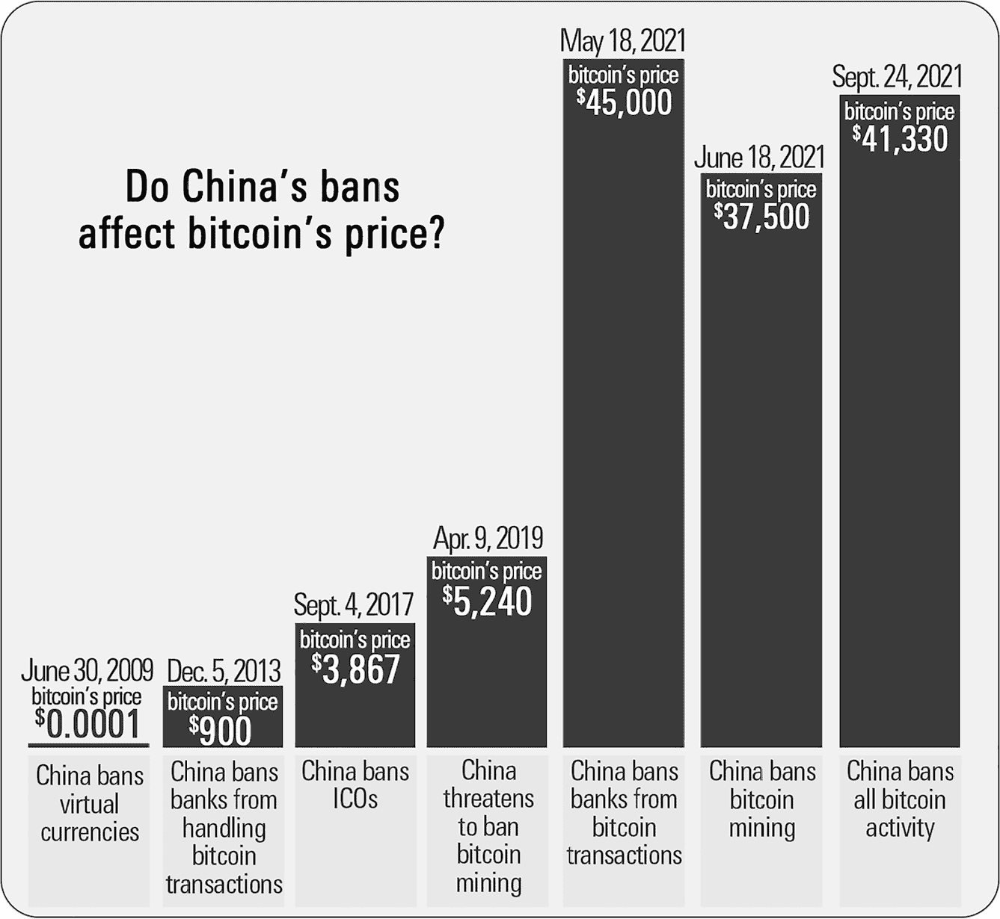

图 18.1

土耳其也面临通货膨胀问题，但土耳其政府禁止使用数字资产进行支付。尽管如此，2021 年土耳其的加密货币使用量增长了十一倍，根据 ING 银行的数据，如今有 18% 的土耳其人拥有数字资产。

巴林中央银行批准了 Rain，一个为本地居民和沙特阿拉伯、阿联酋、科威特和阿曼居民服务的数字资产交易平台。沙特和阿联酋中央银行正在合作进行一个名为 Aber 的区块链项目，该项目将成为用于跨境支付的双重发行 CBDC。以色列、黎巴嫩和土耳其也都宣布了他们自己的 CBDC 计划。

但卡塔尔的监管机构采取观望态度——说明不同国家对这一新兴资产类别有不同看法。

#### 欧洲

欧盟于 2020 年发布了一项关于数字资产监管的提案，这是数字金融、战略、零售支付和数字韧性全面方案的一部分。如果被采纳，将使欧盟在西部大陆拥有一致的数字资产策略。

英国的进展较为缓慢。尽管到目前为止相当令人鼓舞，但英国人的行为更像是美国人：尚未完全接受数字资产，但最终预计会这样做。

乌克兰更为明确。截至目前，该国计划宣布比特币为该国的合法货币。

俄罗斯总统弗拉基米尔·普京在 2021 年表示，数字资产“有存在的权利，并可以用作支付手段。”副财政部长亚历克谢·莫伊塞耶夫表示，政府没有禁止该资产类别的计划。

#### 非洲地区

南非已正式接受数字资产，并预测监管机构活动将增加。这使南非区别于大多数其他非洲国家，这些国家的央行正在禁止使用数字资产。津巴布韦、肯尼亚和加纳的数百万公民仍在交易数字资产，尽管这些国家已经禁止了该行为。

但尼日利亚采取了相反的方式，并为数字资产公司制定了鼓励政策。

#### 北美地区

加拿大是世界上最进步的国家之一，批准了几个比特币 ETF 等权限。墨西哥也持积极态度，鼓励使用数字资产。古巴中央银行现在承认比特币——这是帮助该国公民从其他国家的亲戚那里收到钱的重要一步。（西联关闭了该国超过 400 个地点于 2020 年。）

#### 中美洲地区

2021 年，萨尔瓦多成为第一个将比特币作为法定货币的国家，购买 550 枚比特币以支持其努力。政府数字钱包的初始需求量很大——70% 的公民没有银行账户——以至于政府不得不暂停开设新账户。官员表示，使用比特币的萨尔瓦多人每年将节省 4 亿美元的汇款佣金。

通货膨胀保护是比特币受欢迎的主要原因之一。萨尔瓦多是世界上通货膨胀率最高的国家之一，以比特币支付可以保护买卖双方免受其破坏。

在此时此刻，巴拿马计划效仿萨尔瓦多的做法，将比特币设立为官方货币。

加拿大 ETF 投资区块链和数字资产

| **单一资产** |
| --- |
| **赞助商** | **产品名称** | **代码** |
| **3iQ 数字资产管理** | 比特币基金 | BTCQ 适用于加拿大投资者 BTCQ.U 适用于美国投资者 |
| 3iq.ca | 以太坊基金 | ETHQ 适用于加拿大投资者 ETHQ.U 适用于美国投资者 |
| **CI Galaxy**[cifinancial.com](http://cifinancial.com) | 比特币 ETF | BTCX.U 适用于美国投资者 |

|  | 以太坊 ETF | ETHX.U 适用于美国投资者

Galaxy Digital

|

| **Purpose Investments** | 比特币 ETF |  |
| --- | --- | --- |
| [purposeinvestments.com](http://purposeinvestments.com) | 碳抵消非外汇对冲外汇对冲非外汇对冲对美国投资者 | BTCC.JBTCCBTCC.BBTCC.U |
|  | 以太坊 ETF |  |
|  | 碳抵消非外汇对冲外汇对冲非外汇对冲对美国投资者 | ETHH.JETHHETHH.NETHH.U |
| **Evolve ETFs**[evolveetfs.com](http://evolveetfs.com) | 比特币 ETF | EBITEBIT.U 适用于美国投资者 |
|  | 加密货币 ETF | ETCETC.U 适用于美国投资者 |
|  | 以太坊 ETF | ETHRETHR.U 适用于美国投资者 |
| **多资产** |
| **赞助商** | **产品名称** | **代码** |
| **Evolve ETFs**[evolveetfs.com](http://evolveetfs.com) | 加密货币 ETF 在比特币和以太坊上进行投资 | ETCETC.U 适用于美国投资者 |
| **富达 ETF**[fidelity.ca](http://fidelity.ca) | 比特币优势 ETF | FBTCFBTC.U 适用于美国投资者 |

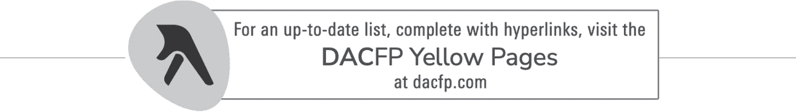

#### 南美洲

委内瑞拉也在与通货膨胀抗争（其 2021 年通胀率超过了 1600%），因此看到其公民将大量资金转入比特币。面对这样的竞争，委内瑞拉采取了严格的限制措施，但许多人并未遵守。

玻利维亚也已禁止数字资产和交易所，而厄瓜多尔只允许其自己的数字资产，即 SDE 代币。阿根廷、巴西和智利倾向于允许数字资产，并承认广泛的使用已经存在。此外，截至目前，巴拉圭正准备将比特币确定为官方货币，追随萨尔瓦多的步伐，展示了在这个问题上存在的不同观点。

1.  我。协助全球各地政府处理这些问题的是全球区块链融合，这是由来自全球各地的约 200 名专家组成的团体。我自 2019 年以来一直是该团体的一部分。

## 第十九章 数字资产是否属于证券？

又到了一个谜题时间！这是一个多项选择题。根据美国监管机构的说法，比特币是：

1.  **1.** 货币

1.  **2.** 证券

1.  **3.** 商品

1.  **4.** 财产

是的，又是一个诡计题。答案是——以上所有。

至于监管的清晰度，就这么多了。

有许多答案，因为有许多政府监管机构在回答这个问题。这很重要，因为一个机构如何回答这个问题决定了它是否有管辖权，以及如果有，它的哪些法规适用。

让我们从证券交易委员会开始。证券交易委员会表示比特币不是证券。证券交易委员会对此非常肯定。为什么？因为比特币未通过 *豪伊测试*。

在我解释这是什么之前，你了解为什么豪伊测试出现会很有帮助。故事始于 1929 年的股市崩盘和随后的大萧条。为了防止再次发生这种情况，国会通过了各种法律，包括 1933 年的证券法和 1934 年的证券交易法。这些法律要求创建和出售证券的人遵循严格的规则——在 20 世纪 20 年代并不存在的规则。

创造并出售证券？好的，但是什么是证券？根据这些新法律，证券是一种*投资合同*。好的，但是什么是投资合同？

对此存在着相当大的分歧，争论一直持续到最高法院。1946 年，法院在具有里程碑意义的案例*SEC v. Howey*中裁定，如果：

1.  **1.** 这是一笔货币投资。

1.  **2.** 对于这项投资有盈利的预期。

1.  **3.** 这笔货币投资是在一个共同的企业中。

1.  **4.** 任何盈利来自于推销人或第三方的努力。

这被称为豪伊测试。如果这四个标准描述了你正在做的事情，那么你在处理证券。

美国证券交易委员会（SEC）将豪伊测试应用于比特币，并得出结论认为比特币不是一种证券。以太坊也一样。但是 SEC 表示，其他数字资产是或可以是证券。如果您购买的基金是一种证券，而该证券购买比特币，则即使基础资产不是证券，您也在处理证券。

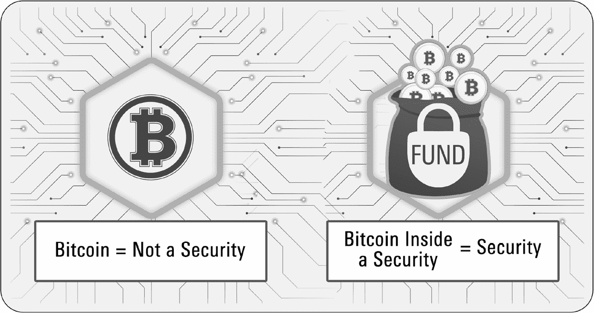

图 19.1

还记得电影《飞越疯人院》的翻拍吗？杰夫·戈德布拉姆扮演的塞斯·布伦德尔是一位试图建造等价于《星际迷航》传送器的科学家。他将其测试在自己身上，没有意识到一个苍蝇也在舱室里。当他试图弄清楚出了什么问题时，布伦德尔问他的电脑测试结果是什么。电脑的回答：“不是布伦德尔。”

并不是非常有帮助。

SEC 也不认为比特币是证券。如果问这个机构，“比特币是什么？”它会回答，“比特币不是证券。”好吧，那它到底是什么？

美联储已经发表意见称比特币不是货币。这一点很重要，我们在讨论每个人最喜欢的话题（税收）时会详细说明。但这依然没有告诉我们它到底是什么。

商品期货交易委员会表示比特币不是商品，尽管其他数字资产可能是。这取决于该机构使用的测试，比如合同如何交付。目前还没有完全的清晰度，CFTC 已成立数字资产工作组来解决这个问题。

所以，我们仍然不知道比特币是什么。我们只知道它不是什么。

美国商品期货交易委员会（CFTC）、证券交易委员会（SEC）和财政部正在共同努力制定数字资产的监管条例。但财政部内的某个机构并不与其他机构很好地合作。它正在制定自己的政策，而不顾其他机构的做法。这个机构是？

美国国税局。所以，接下来，我们要单独讨论这个话题。

## 第二十章 数字资产如何课税

### 前言

个人财务的最糟糕的部分是什么？不，不是缴税（尽管那也够糟心的）。最糟糕的部分是不知道自己需要交哪些税。说起来真是令人沮丧！

这在数字资产中经常出现。这个资产类别的某些方面是如此新颖，以至于国会尚未更新国内税收法典，而 IRS 也未修改或发布相关法规。尽管在许多领域已经有了明确性——比大多数人意识到的还要多——但还有许多不明朗之处。我会尽我所能向您解释这一切。我还将提供包含相关引用的脚注。您可能对它们不感兴趣，但您的税务和财务顾问会感兴趣——所以请与他们分享这本书。^(I)

税法和法规经常变化，因此在采取本文提供的任何信息之前，请务必咨询您的税务顾问。

### 让我们用正确的词汇

什么是孩子？联合国称任何年龄在 18 岁以下的人为孩子。然而，美国移民法规定，任何 21 岁以下的人都是孩子，而 1998 年《儿童在线隐私保护法》规定，未满 13 岁的人是儿童。而美国卫生与公众服务部表示，父母可以将 26 岁以下的“孩子”纳入他们的医疗保险政策。

如果我们无法就如何定义“孩子”达成一致，那我们是否会对如何称呼这种新资产类别达成一致感到惊讶呢？

出于本章的目的，我们将使用 IRS 定义的术语。它们是：

+   **数字资产。** 一般来说，这是任何具有经济价值且可以被拥有的东西的二进制表示。

+   **加密资产。** 这是使用密码学在分类账上安全记录交易记录的任何数字资产，例如在区块链上，以控制额外这类资产的创建并验证其所有权的转移。

+   **虚拟货币。** 这是除美元或其他政府货币以外的货币媒介、记账单位或价值储存的数字表示。

+   **可转换虚拟货币。** 这是具有等值于或是真实货币替代的虚拟货币。可转换虚拟货币被视为财产，因此适用于涉及可转换虚拟货币交易的一般税收原则。重要的是，IRS 表示比特币是可转换虚拟货币的一个例子。（哈！我们终于开始知道比特币是什么了！）

+   **加密货币。** 这是一种使用密码学来保障数字资产交易记录的虚拟货币，比如区块链。^(V) 比特币、以太币和莱特币都是加密货币的形式。^(VI) (哈！更加清晰了！)

### 介绍

税务人员喜欢有钱的人——因为他们可以拿走一部分。自 2009 年比特币问世以来，数字资产产生了大量财富，所以就像长角牛对盐舔一样，全世界的税务机构都对这个新资产类别和参与其中的人们垂涎三尺。

IRS 首次在 2014 年提到了数字资产。《通告 2014-21》^(VII) 指出，数字资产是一种财产；因此，长期以来适用于财产的税务原则也适用于这个新资产类别。^(VIII) 由于相信许多纳税人忽视了这一通告，IRS 在 2016 年向 Coinbase 发出了传票，要求该公司提供其所有客户的记录。Coinbase 拒绝遵守，但在 IRS 缩小传票范围后，加利福尼亚北区地方法院做出了支持 IRS 的裁决。Coinbase 提供了 IRS 想要的数据。

2019 年，由于许多参与数字资产交易的人没有缴纳税款^(IX) ，IRS 发布了更多指导文件，包括《2019-24 年财政规则》^(X) 和常见问题解答。^(XI)

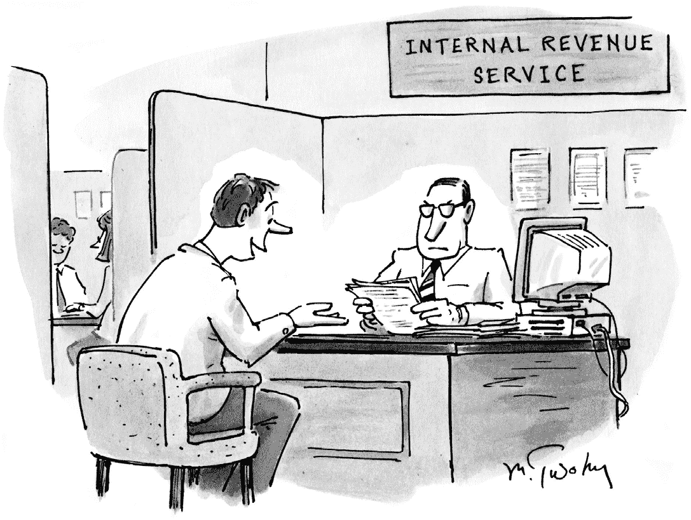

*“有趣的是两个聪明人对税法有着完全相反的解释！”*

但是，这只是软言相待：IRS 还宣布将强制执行审计和刑事调查的合规性。作为这些努力的一部分，IRS 开始要求纳税人在纳税申报表（1040 表）上回答这个问题：

在 2019 年的任何时间，您是否收到、出售、发送、交换或以其他方式获得任何虚拟货币的财务利益？

这个问题被埋在一个子计划中，但在 2020 年，IRS 将其移到了第一页的顶部，以确保不会被忽视！

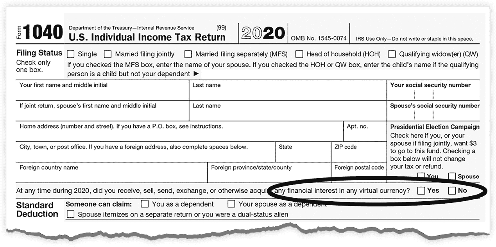

IRS 在 2021 年加强了执法力度，推出了隐藏宝藏行动：经过特训的 IRS 特工现在正在寻找未报告的与加密相关的收入。

这一切对你来说是不是太像大哥了？好吧，让我们记住，您有义务向政府支付所有应缴税款。但是您对自己和家人有同样重要的义务，即不支付任何比所需更多的税款，也不会比必要的时间更早支付税款。

您不是一个逃税的人。您愿意支付您所欠的税款。但是您如何确定您是否欠税，或者欠税的金额呢？

这是一个聪明的问题。这里有一个愚蠢的答案：只有当您经历了应税事件时，您才需要缴税。

哦，显而易见。那么，什么是应税事件呢？

*应税事件*是导致税务责任的任何事件。事件包括销售、交换、转换、交易、付款、捐赠、收据和收入的获得。您必须在税表的某个地方报告所有应税事件——即使金额微不足道也必须如此。如果另一方（或中间人）没有向您发送税务相关文件，如 1099 或 W-2 表格，也不要紧。IRS 要求 *您* 报告所有收入和交易，无论您是否从他人那里收到税务表格。数字资产并没有特殊或神奇之处，使其免于征税。

为了帮助您理解需要考虑的所有问题，让我们探讨数字资产所有权的生命周期。有三个阶段：获取、持有和处置。

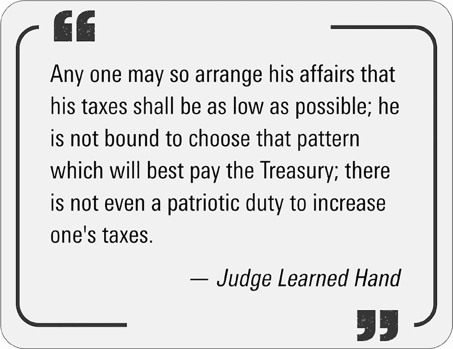

### 获取数字资产

注意我没有说*购买*。那是因为有多种方式可以*获取*数字资产。你甚至可以在不采取任何行动的情况下获得数字资产；相反，你可能只是“收到”它。让我们看看你可以获取数字资产的所有方式。

#### 购买

你可以通过

1.  **1.** 中心化交易所。例如，你用现金购买比特币。

1.  **2.** 去中心化交易所。例如，你拥有比特币并用它购买以太币。

1.  **3.** 非加密货币平台购买数字资产。例如，你在 Robinhood、PayPal 或 Venmo 有账户。

1.  **4.** ATM 以现金交换。

1.  **5.** 银行。（不，现在还不行，但总有一天……）

在这些情况下，你的*税基础*是资产的*公允市场价值*（FMV），以美元计算，购买时的价格。你的基础是你用来获取数字资产的金额，包括费用、佣金和其他费用。你的*调整税基*是你的成本基础加上某些允许的支出。

#### 接受数字资产作为工资或服务的支付

你的雇主可能会以比特币而不是美元支付你。这就是肖恩·卡尔金得到薪水的方式——整整$920,000。作为堪萨斯城酋长队的紧密端位，他成为首位完全以比特币支付薪水的 NFL 球员。进攻前锋拉塞尔·奥坎格将他 1300 万美元的薪水的一半以比特币支付，另一半以美元支付。洛杉矶公羊队的广播员奥德尔·贝克汉姆·小贝，一位三次 NFL 全明星球员，他的整个 425 万美元的薪水都是以比特币支付的。格林贝兄弟队的四分卫亚伦·罗杰斯，一位三次 NFL 最有价值球员，也将部分薪水以比特币支付。

从税收角度来看，这些人所做的并不重要，因为工资就是工资，不管支付形式如何。^(XII)

税法在这一点上很清楚：如果您将数字资产作为工资收入，那么该资产的 FMV，以美元计量，将在您收到时作为您的应税收入，并且您收到的金额将根据您的税率以普通收入的形式纳税。^（XIII）

如果您收到的数字资产没有公开价值，那么 FMV 等于交易发生时服务的 FMV。^（XIV）例如，拥有 100 万美元合同的 NFL 球员可能选择接受 NFT 而不是美元。NFT 可能没有公开价值。在这种情况下，球员必须使用其合同设定的 100 万美元价格。

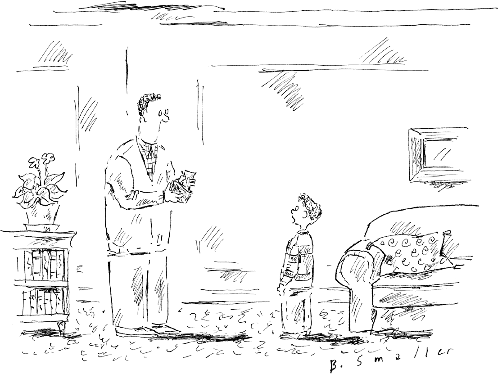

*“如果你无所谓的话，我想用比特币拿我的零花钱。”*

对于承包商也是一样。您的房屋油漆工可能要求以数字资产而不是现金支付。处理方式与上述相同。

#### 以物业交换收到数字资产

如果您将物业 A 转让给某人，并收到数字资产 B 作为交换，您对数字资产 B 的税基等于您收到的数字资产 B 的公兑美元价值（FMV），即您收到数字资产时的美元价值。^（XV)

如果物业 A 是资本资产，则您对其处置产生资本收益或损失。如果物业 A 不是资本资产，则您具有普通收益或损失。^（XVI）在这两种情况下，收益或损失是您收到数字资产 B 的 FMV（通常是记录在分布式账本上的日期）与您转让的物业 A 的调整税基之间的差额。^（XVII）

如果数字资产没有公开价值，则 FMV 等于交易日期时您用于交换数字资产的物业的 FMV。^（XVIII）

#### 以数字资产作为您欠他人的钱的支付

假设 Sally 欠您$1,000，并向您发送价值$1,000 的数字资产。您都将该交易视为如果使用了现金一样处理。^（XIX）

#### 当您使用借记卡或信用卡时获得数字资产作为折扣

多年来，信用卡公司一直提供折扣和奖励以鼓励您使用他们的卡。奖励包括航空里程和现金，现在还有数字资产。当然，这涉及税务影响，所以让我们看看细节。

##### **信用卡使用**

无论您使用个人还是商务信用卡，IRS 长期以来一直认为折扣被视为对购买价格的调整。因此，折扣不算是收入，但涉及加密货币时，将会产生税基础。

假设您将$5,000 的购买金额充入信用卡，您的信用卡公司将$50 的比特币存入您的加密账户。IRS 将交易视为您花费了$4,950 购买和$50 购买比特币。您获得的比特币不会产生应税收入，但当您出售时，您将有一个$50 的税基础。（这很好，因为您的税基础越高，您要缴纳的税就越少。）

##### **个人使用信用卡支付已报销的购买**

人们通常会使用个人信用卡支付商务费用（例如旅行），然后由雇主报销。如果您从信用卡公司获得了已报销的费用的折扣，那么您收到的奖励的公允市场价值是应报告的收入，即使您没有收到 1099 表或其他税务文件，该金额也被视为您的税基础。

##### **如果您因使用信用卡购买现金等价物而获得加密货币折扣或奖励**

如果您使用信用卡购买“现金等价物”，例如汇票和可充值借记卡，税务法院裁定您获得的任何折扣或奖励都是应税收入。^（XX）

##### **如果您因开立账户而获得的奖励以数字资产支付**

您可能仅仅因为开设信用卡账户而收到数字资产。如果是这样，其公允市场价通常被视为应纳税收入。如果价值超过$600，信用卡公司应向 IRS 和您发送 1099-MISC 表格。（无论您是否收到，您仍然需要在您的税表上报告这些金额作为收入。）与上述情况类似，您的税基将是可报告收入的金额。

##### **如果您因介绍朋友或其他促销活动而获得数字资产**

如果不需要购买即可获得奖励，则其公允市场价通常被视为应纳税收入。如果价值超过$600，信用卡公司应向 IRS 和您发送 1099-MISC 表格。（无论您是否收到，您仍然需要在您的税表上报告这些金额作为收入。）与上述情况类似，您的税基将是可报告收入的金额。

#### 学而思

一些数字资产交易所在其网站上发布教育内容。为了吸引您观看，他们会向您的账户存入一个价值不高的代币（价值为$5）。当您赚取这些代币时，您已获得应纳税收入。您的税基是资产的公允市场价，以美元计算，即您收到代币的时间点。

因为金额通常很小，一些交易所不会发放 1099-MISC 表格。尽管如此，您仍然需要在您的税表上报告这笔收入。

#### 收到的礼物

如果您收到数字资产作为礼物，则您保留捐赠人的税基。当您出售或处置它时，您将产生资本增值或减值（除非您将其捐赠给慈善机构）。如果您没有任何文件证明捐赠人的基础，那么您的基础为零——这意味着您将支付最大可能的税款。换句话说，获得并保留捐赠人的基础！^(XXI)

#### 继承

如果您继承数字资产，遗产执行人将确定您的成本基准为死亡日期或六个月后的 FMV，以较高者为准。当您出售或处置它时，您将产生资本增值或减值（除非您将其捐赠给慈善机构）。

#### 获取数字资产的不寻常方法

到目前为止，我们所讨论的内容可能对您来说很熟悉，因为我所描述的规则适用于所有资产，而不仅仅是数字资产。但是，您可能以不太常见的方式获取或接收数字资产。这些方式包括：

##### **赚取数字资产**

一般来说，您以货物或服务交换方式获得的任何物品的价值都是应纳税的，除非税法中有特定的例外或排除。收入是您收到时的公允市值（FMV）。您在获得数字资产时报告的收入成为资产的税基，您可以使用这些数据来确定您处置时的资本增值或减值。

然而，您获取数字资产的方式将决定您如何、何时以及在何地报告您的收入。例如，挖矿会产生不同的税务影响，这取决于您如何参与（使用自己的挖矿设备，加入挖矿池（一群人在网络上合作工作的方式，例如诺顿防病毒软件提供的挖矿池[第六章]），或者云挖矿（您从云服务购买的计算能力是您对挖矿池的贡献）。

作为矿工，您一般被视为赚取收入，根据您收到代币的当天的 FMV 而被视为一般收入课税。但是，您在报税表上如何报告以及在何处报告取决于您是将挖矿视为业余爱好还是业务。

如果这是一个爱好，你要使用 1040 表格，附表 1。如果你的挖矿操作是商业活动的一部分，你需要在 C 表上报收入。（美国国税局称矿工是自雇人员。这意味着你可能需要对挖矿收入负责自雇税。稍后再讨论有关自雇收入的更多信息。）

##### **抵押**

我们撰写此文时，美国国税局尚未就抵押和获得抵押奖励的税收问题提供很多澄清。因此，谨慎的做法是将通过抵押产生的收入视为收到时的普通收入，然后在你收到代币的次日将其视为资本资产，这样，任何随后的增值在你处置它时将被视为资本收益。^(XXII)

如果你更愿意采取一个不那么严厉（也不那么昂贵）的立场，你可以咨询你的税务顾问，询问如何将抵押治疗成可出租财产的方式。根据这个理论，抵押奖励可以被视为租金收入（使用 1040 表格，附表 E）；这样做有可能降低税务责任。

##### **从你的一个钱包转移到另一个钱包**

投资者通常在各种交易所和托管人处拥有多个钱包和账户，很容易在它们之间转移代币和硬币。如果你将一美元从储蓄账户转到支票账户，这没有税收影响，但将数字资产从一个钱包或账户转移到另一个是否会被视为应税事件呢？

你可能不这么认为。但是如果您从一个交易所转移加密货币到另一个交易所，"from"交易所可能会将转移视为处置事件——从而向您发送 1099 表格。IRS 知道这样的错误可能会发生，并发表了令人放心的指导，即使您收到这样的 1099，您也不会产生应税事件。您可能需要做一些文书工作——向 IRS 解释您收到的 1099 是错误的——但至少您不必因此错误而支付税款。

##### **将数字资产转移给其他人或实体**

如果您将一个硬币或代币从您拥有的一个数字钱包、地址或帐户转移到别人名下的一个帐户，IRS 将把您的转移视为资产的出售或赠与，受本书所述的相关规则约束。

可能没有中介，意味着没有人发出 1099 表格。不过，双方都有责任遵守税法。

##### **将数字资产所有权转移给共同所有者**

如果您将一个硬币或代币从您拥有的一个数字钱包、地址或帐户转移到与您和另一个人共同拥有的帐户，可能会有许多税务后果。

转移数字资产可能会对您的税务产生立即影响，也可能不会。这取决于您转移给谁。（配偶？非配偶？未成年人？您拥有或控制的实体？信托基金，如果是的话，是什么样的信托基金——可撤销的，不可撤销的，慈善的？）有这么多的变量，需要一本完全不同的书来解释所有的考虑和策略。因此，请咨询财务规划师、税务顾问或遗产律师，以获取与您情况相关的建议。

##### **将数字资产转移至您的 IRA**

你不能将数字资产转移到 IRA 中；所有 IRA 的捐款必须以美元进行。一旦现金被放入 IRA，你可以使用这笔钱购买数字资产。只需确保你使用的是允许购买你想要的资产的合格托管人。

一旦你在 IRA（个人退休账户）中拥有数字资产，你可以随时将其转移给其他托管人，而不会产生税务后果。如果你想保留你的数字资产，你应该执行一项*按原样转移*，这样你的硬币或代币就可以按照原样移至新的托管人。新的托管人将为你促成这一转移，这被称为*受托人对受托人的转移*。不需要进行税务报告。

##### **空投**

空投通常被视为普通收入，收到空投时即使你可以交易或转移它们也是如此。如果你不能（因为发行方尚未允许），请在你能够转移、出售、交换或以其他方式处理它的日期上将其作为收入申报。然后，你的成本基础将等于你报告为收入的金额。^(XXVI)

数字资产遗产律师

| **安东尼·S·帕克专业有限责任公司**[anthonyspark.com](http://anthonyspark.com) | 帕克代表全球客户作为他们的专业执行人、受托人或遗嘱律师。该团队擅长与法院、税收、银行和与遗嘱流程相关的所有其他官僚机构合作。 |
| --- | --- |
| **布雷迪·科宾法律集团，专业有限责任公司**[ncestateplanning.com](http://ncestateplanning.com) | 布雷迪·科宾帮助客户确保对其数字资产的适当获取和分配。 |
| **迪伦多夫律师事务所**[dilendorf.com](http://dilendorf.com) | 迪伦多夫为区块链和金融科技领域的广泛参与者提供尖端战略、交易和监管解决方案——包括代币发行者、加密货币交易所、传统和加密货币投资基金，以及希望将区块链技术整合到其现有业务和投资模型中的企业和管理者。 |
| **E.A.古德曼法律**[eagoodmanlaw.com](http://eagoodmanlaw.com) | 古德曼是新泽西州一家顶尖的老年法和资产规划公司，为客户提供服务。其服务范围从规划小额遗产到为高净值个人进行复杂规划。其律师还为经营 closely held businesses 和专业实践的客户设计继任规划策略。 |
| **遗产与遗嘱法律集团**[estateandprobatelegalgroup.com](http://estateandprobatelegalgroup.com) | 遗产与遗嘱法律集团专注于遗嘱和信托管理以及诉讼实践。 |
| **弗罗斯特法律**[askfrost.com](http://askfrost.com) | 弗罗斯特法律协助处理税务争议、商业、诉讼、财产规划和破产问题。 |
| **戈登·费舍尔律师事务所**[gordonfischerlawfirm.com](http://gordonfischerlawfirm.com) | 戈登·费舍尔律师事务所帮助人们规划遗产，并帮助非营利组织管理他们的慈善事业。 |
| **古特曼法律**[guttmanlaw.com](http://guttmanlaw.com) | 古特曼法律协助客户处理各种形式的数字资产规划，帮助客户准备在线账户、受密码保护的文件、数字存储的媒体等的处理方式。 |
| **哈里森遗产法**[harrisonestatelaw.com](http://harrisonestatelaw.com) | 哈里森遗产法拥有多年的经验，准备从基本遗嘱和信托到复杂遗产计划的所有文件。 |
| **哈特·戴维·卡森, LLP**[hartdavidcarson.com](http://hartdavidcarson.com) | 哈特·戴维·卡森是一家位于芝加哥的律师事务所，与企业和个人合作。 |
| **约翰·曼甘, P.A.**[palmcitylawyer.com](http://palmcitylawyer.com) | 曼甘与客户合作制定财产规划。 |
| **麦科德与亨菲尔**[ourbendlawyer.com](http://ourbendlawyer.com) | 麦科德与亨菲尔帮助您规划数字资产，就像您为实物财产、房地产和金融账户所做的一样。 |
| **墨菲与伯格伦律师事务所**[murphyberglund.com](http://murphyberglund.com) | 墨菲与伯格伦保护家族树的每一支。他们努力与客户建立持久的关系。他们的重点是为客户提供准确的法律建议，并引导他们度过生活中的转折点。 |
| **保罗·布莱克长者法和财产规划**[georgia-estatelaw.com](http://georgia-estatelaw.com) | 保罗·布莱克是一位提供法律服务于亚特兰大地区人民的财产规划律师。 |
| **普尔夏弗里**[pooleshaffery.com](http://pooleshaffery.com) | 普尔夏弗里协助制定和执行符合每个客户意图的财产规划。 |
| **普罗斯考尔**[proskauer.com](http://proskauer.com) | 普罗斯考尔在美洲、欧洲和亚洲的主要金融和商业中心设有办事处，拥有 725 多名律师的网络，为客户提供服务。 |
| **辛格与辛格**[singhandsingh.com](http://singhandsingh.com) | 辛格与辛格是一家拥有多年经验的印度律师事务所，提供知识产权法、媒体和电信法、仲裁、竞争法、税法和药品监管法等服务。 |
| **怀特和布莱特律师事务所**[whiteandbright.com](http://whiteandbright.com) | 怀特和布莱特为南加州的企业和个人提供交易和诉讼服务。 |

##### **分叉**

回想一下软分叉和硬分叉之间的区别（第五章）。因为在软分叉中你并没有收到任何新东西，所以软分叉不会导致任何可报告的收入。^(XXVII)

但是如果你从硬分叉中获得了加密货币，那么这种新的加密货币将作为普通收入纳税（只要你对其有控制权，意味着你可以转让、出售、交换或以其他方式处置它）。^(XXVIII) FMV 是指在你收到它的日期，有人愿意支付的价格。

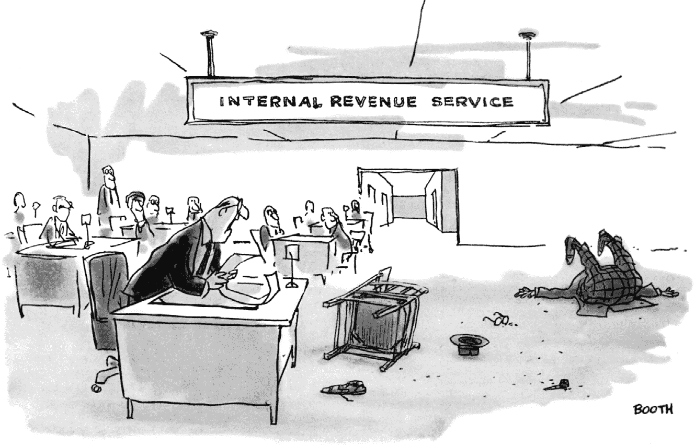

*“其他人也必须交税，赫尔登先生，所以你能不能饶了我们这些戏剧性的台词！”*

在第五章，我提到硬分叉类似于公司分拆。这是真的——除了税收影响。适用于股票分拆的税收规则不适用于加密货币硬分叉。这里有一个很好的教训：不要假设你在税法的其他方面熟悉的规则在这个类别中是有用的。我以前说过，我会再说一次：数字资产不同于任何其他资产，因此你不能将你用于其他资产的规则应用于这个资产类别。

### 持有数字资产

你现在拥有一个数字资产。你既没有移动它，也没有处置它。它只是在那里……无论那是一个钱包、一个账户，或者其他什么。

目前还没有税务后果，对吧？

并非一定如此。分叉和空投可能会为你带来税收，即使你并没有寻求或发起它们。抵押你的数字资产也可能产生税务责任，正如我们所见。同样适用于数字资产的借贷。

#### 借贷

借钱（并偿还贷款）从未是一个应税事件。但是，如果你未能偿还贷款，你将产生应税事件。例如，如果你借了$100,000 并违约，你将被视为有$100,000 的应税收入。

#### 抵押品

假设你拥有数字资产，但需要现金。你不想出售你的数字资产，因为这样做会产生税务责任。所以，你将你的数字资产作为抵押品存入贷方，贷方向你提供法定货币贷款。当贷款到期时，你以相同的法定货币加利息偿还贷方，贷方将你的数字资产归还给你。

如果你无法偿还贷款，贷方将出售（并保留）你的抵押品。无论贷方从销售中获得多少，都将使你（而不是贷方）产生资本利得或损失。

大多数贷方要求提供现金作为抵押，但也有一些愿意接受与你借入的数字资产不同的数字资产作为抵押品。（例如，你提供比特币作为抵押，以便借入以太币。）偿还贷款时，你归还相同数量的相同数字资产。在你偿还贷款时，贷方会归还你的抵押品。

#### 贷款的税收处理

截至目前，IRS 或财政部尚未就涉及数字资产的贷款发布任何指导意见 —— 无论是对借款方还是贷款方。因此，我们不得不使用适用于一般贷款的税收原则。

IRS 表示贷款是支付金钱的义务，而不是交付财产的义务。但与此同时，IRS 表示，“可转让虚拟货币”被视为财产。这就是为什么这个讨论很混乱的原因。普遍认为，大多数数字资产是可互换的（除了明显的非互换代币之外），但一些税务从业者并不确定 IRS 是否会同意。如果他们是对的，而普通数字资产如比特币被认为是“类似但与其他个别比特币不同”，那么借款人（还款贷款时）和出借人（归还抵押品时）将会归还类似但并非完全相同的财产。如果是这样的话，这些税务从业者想知道，IRS 是否会将贷款归类为应纳税销售？毕竟，如果你提供一辆汽车作为贷款的抵押品，但出借人给你退回一辆不同但相似的汽车，IRS 将视该交易为销售。

我不支持这个理论，也不同意上述担忧。但考虑到 IRS 缺乏明确表态，我想我们必须承认存在这种可能性。

情况变得更加混乱。考虑以下问题：

+   如果数字资产价格下跌，哪一方承担经济损失的风险？如果价格上涨，哪一方受益？随之而来的税务影响又是什么？

+   如果在贷款期间出现空投或分叉，哪一方获得新的单位？

在缺乏权威税务指导的情况下，您应该：

1.  **1.** 与您的税务顾问讨论涉及数字资产贷款的利息的适当处理方式。您对待它的方式将部分取决于借用的财产用途（个人与投资用途）。

1.  **2.** 恰当地记录双方意图，以便将交易视为贷款。

1.  **3.** 将贷款结构化，使其符合标准放贷惯例。

最后，与用作贷款抵押品的任何资产一样，请注意如果资产价格下跌会产生的后果。贷方可能会发出*追加保证金*的要求，要求您提供额外的抵押品；如果您未能这样做（通常要求在 24 小时内），贷方可以出售您的抵押品以弥补其损失。这种清算可能会为您产生已实现的资本收益（或损失）—这意味着您不仅可能会失去您的抵押品，而且您还必须支付税款。天哪！

#### 拥有某些信托

我们在第十六章中讨论了私募和其后的场外信托。这些工具本身不缴纳税款；相反，它们将任何税收责任转移到您，投资者。

这意味着您必须支付由信托产生的任何税务责任的按比例份额。如果信托出售资产以筹集现金以支付费用，这就好像您出售了投资的一部分。这意味着您会有收益或损失—尽管您未采取任何行动。更糟糕的是，这些费用被视为投资管理费用，您无法在税表上扣除。

### 处置数字资产

每当您处置数字资产并获得某种回报时—无论是出售它、交易它还是用它购买商品或服务—都会触发一个应税事件。

这意味着，对于投资目的持有的资产，您会像处置任何其他投资一样在交易中产生资本收益或损失。

+   如果您的持有期为一年或更短，您将产生*短期*资本收益或损失。

+   如果您的持有期超过一年，您将产生*长期*资本收益或损失。

持有期从您获取资产的次日开始，直到您出售或交换该资产的当天结束。您将净收益和损失报告在表格 8949 上，并在表格 1040 的附表 D 上进行总结。^(XXIX)

结论是，你应该为每个数字资产保留详细的记录，包括所有购买和处置的日期，税基和出售时的公允市值。很快就会有一个解决方案，所以请继续阅读。

人们处置数字资产最常见的方式是出售它们，以美元换取。但也有其他处置方法。让我们来看看它们。

#### 将一个数字资产转换为另一个

这被视为一次销售。例如，你用比特币交易以太币。实际上这是两笔交易：比特币的销售和以太币的购买。你必须在交易时计算每个的公允市值。

#### 使用数字资产支付商品和服务

AMC 电影院让你用比特币、以太币、莱特币和比特币现金购买电影票和爆米花。有趣！

除非这样做会产生税务问题。使用数字资产作为支付方式等同于出售它。因此，你已经创建了一笔资本交易来观看电影，从而产生了资本收益或损失。你的收益或损失是你收到的财产或服务的公允市值与你交换的数字资产的调整基础之间的差额。

所有这些都是因为联邦储备局和国税局都表示数字资产不是货币。对于货币，你可以随时用美元交换产品和服务，而无需将此类事件视为资本交易。（现在你知道为什么数字资产是否被宣布为货币是件大事了。现在，你羡慕萨尔瓦多人了吧。）

#### 礼物

适用于所有资产的礼物税规则也适用于数字资产。如果你把数字资产赠送给某人，你不会产生任何税务责任。（注：美国国内税务局对你无税赠予的金额，无论是每年还是一生，都有限制。）接收你的数字资产的人在收到礼物时也不会产生任何税务责任。但是，当他们出售资产时，他们用来计算应纳税收益或损失的税基将是你的税基。这被称为延续税基。

例如，你购买了一比特币，支付了$50,000。这个金额就是你的税基。你把比特币给了你的姐姐；当时，比特币价值为$58,000。你的姐姐后来以$60,000 的价格卖掉了它。她的应纳税收益是$10,000，而不仅仅是$2,000，因为她必须使用你原始购买时延续的税基。

#### 捐赠

适用于财产的慈善礼物规则也适用于数字资产。你可以扣除对内部税收法第 501(c)(3)节非营利组织的捐款。

+   如果你持有要捐赠的资产超过一年，你可以扣除慈善机构收到时的公允市场价值。

+   如果你持有要捐赠的资产不足一年，你的减税额是你的税基或其公允市场价值中较低的一个。^（XXXIII）

给慈善机构捐款很容易；它们都会接受。大多数也接受证券，如股票、债券、共同基金和交易所交易基金。有些甚至接受汽车、船只和房地产。但是很少有机构接受数字资产，因为他们不习惯这样做，也不知道如何创建和管理钱包。

如果你想要将增值的数字资产捐赠给慈善机构，你可以有两种方式。首先，出售资产并将收益捐赠给慈善机构。比如你购买比特币花费了$10,000，然后以$50,000 的价格卖出并将所有收益捐赠给慈善机构。你必须在税表上报告$40,000 的资本收益和$50,000 的捐赠。这可能会产生意想不到的副作用。例如，申报收入可能会导致你支付更高的医疗保险费，可能会影响学生贷款或经济援助资格，或使你受到其他所得税规则和收入阶退的影响，因为你的应税收入更高。

更好的策略是将比特币捐赠给捐赠者指导基金。这些看起来和行为像共同基金，但实际上是慈善机构，所以当你将你的数字资产捐赠给它们时，你将获得全部的税收抵免，而无需事先出售资产。DAF 将出售数字资产，并将销售收益投资到股票和债券中，就像任何共同基金一样。然后，你想要的时候，你可以指示 DAF 将钱发送给你指定的慈善机构，数量可以是你想要的。你可以立即提出请求，也可以延迟几年，你可以发送一部分的钱或全部的钱。你几乎有完全的灵活性，DAF 将为你处理一切。

美国最大的资助机构 Fidelity Charitable 在 2021 年收到了近 2.75 亿美元的加密货币捐赠，是 2017 年创下的历史纪录的四倍。Fidelity 表示，数字资产的所有者比其他美国人更慷慨：虽然 33%的捐赠者每年捐款$1,000 或更多，但有 45%的加密货币持有者这样做。

接受数字资产捐赠的捐赠者指导基金

| **Endaoment**[endaoment.org](http://endaoment.org) | Endaoment 是一个在以太坊区块链上建立的免税社区基金会和公益慈善机构，提供捐赠者指导基金，促进对几乎所有美国非营利组织的捐赠。 |
| --- | --- |

| **费城慈善基金**[fidelitycharitable.org](http://fidelitycharitable.org) | 费城慈善基金的赠与账户是捐赠者获取税收福利并支持自己喜爱的慈善机构的简单高效的方式。费城慈善基金的费用是所有 DAF 赞助商中最低的之一。

费城信托

|

| **全国慈善信托**[nptrust.org](http://nptrust.org) | 全国慈善信托是全国最大的独立 DAF（捐赠咨询基金）提供者。 |
| --- | --- |

| **施瓦布慈善基金**[schwabcharitable.org](http://schwabcharitable.org) | 施瓦布慈善基金为广泛的慈善投资者提供服务，账户金额从$5,000 到超过$5 亿不等。施瓦布慈善基金为客户及其投资顾问提供税收智能、简单高效的慈善赠与服务。

施瓦布

|

请注意，捐赠额超过$5,000 的捐赠需进行评估。这是 IRS 规定的，适用于除现金和证券之外的所有捐赠（SEC 和 IRS 都表示数字资产不是证券的另一个原因）。因此，请预计在评估上花费几百美元，并且这个费用不可从税中扣除。

数字资产评估师

| **慈善解决方案，有限责任公司**[charitablesolutionsllc.com](http://charitablesolutionsllc.com) | 慈善解决方案是一家专注于非现金资产收取和处置、慈善赠与年金风险管理、赠与年金再保险经纪服务以及人寿保险和数字资产评估的计划赠与风险管理咨询公司。 |
| --- | --- |
| **MPI 管理规划公司**[mpival.com](http://mpival.com) | MPI 是一家业务估值、诉讼支持、法证会计和并购咨询公司，为税务、财务报告、诉讼和其他业务应用提供估值，以及为业主及其代表提供公司咨询服务。 |
| **普华永道**[pwc.com](http://pwc.com) | 普华永道提供“一站式”服务，包括交易咨询、估值和尽职调查等加密货币服务。 |
| **Redwood 估值**[redwoodvaluation.com](http://redwoodvaluation.com) | Redwood 是领先的代币估值提供商，与顶级律师事务所和前沿公司合作，确保代币发行完全合规。 |
| **Teknos 合伙人**[teknosassociates.com](http://teknosassociates.com) | Teknos 提供全球估值和咨询服务，在区块链和数字资产领域有丰富的经验。 |
| **瓦尔泰克**[valtech-valuation.com](http://valtech-valuation.com) | 瓦尔泰克的专业团队在许多行业都具有估值专业知识。 |

### FIFO，LIFO 和 HIFO

你曾经买过比特币然后再也没买过吗？不太可能。如果你购买数字货币、代币，或者与之相关的共同基金或交易所交易基金的股份，你很可能经常这样做，特别是如果你采用了均价成本法（第十七章）。每次投资构成一个*交易批次*，每个交易批次都有自己的日期和每个硬币、代币或股份的成本。

因此，当你决定卖掉一些时，你需要做出决定：卖哪些？你可以自由选择——但只有在你能够确定涉及的单位并能证明你在其中的基础时才能这样做。[^XXXIV]

选择交易批次是有好处的。通过这样做，你可以选择具有最高基础的批次，因此获得的收益最低，税收也最低。这就是所谓的*HIFO*，即*先进先出*。

如果你没有指定特定的交易批次，你将被视为按照时间顺序进行了处置，从最旧的交易批次开始——又称*FIFO*，即*先进先出*。[^XXXV] 可能的情况是，你拥有的时间最长的批次获得了最大的收益，因此当你处置它们时，你会产生最大的税收。

另一个选择是*LIFO*，或*后进先出*。由于这些是你最新的持仓，它们可能获利最少。但你可能持有这些资产不到一年，所以要注意避免产生短期收益而不是长期收益的风险。

如你所见，你需要对出售的方式和时间投入大量注意力。为了让生活更轻松，你应该考虑使用税务跟踪服务。这些公司为您管理所有的记录和税务报告事务，包括交易、挖矿、权益质押和利息。有些服务甚至可以为您预填美国国税局表格。税务跟踪服务也对您的财务和税收顾问有所帮助。

数字资产投资组合跟踪服务

| **Altrady**[altrady.com](http://altrady.com) | Altrady 是一款由交易者为交易者打造的完整加密货币交易平台。它将一些最流行的交易所集成到一个易于使用的界面中。 |
| --- | --- |
| **BitUniverse**[bituniverse.org](http://bituniverse.org) | BitUniverse 提供一个交易 6000 多种数字资产的平台。其交易机器人让程序员设计自己的交易策略。 |
| **CoinGecko**[coingecko.com](http://coingecko.com) | CoinGecko 是全球领先的加密货币数据聚合器。自 2014 年以来，它一直是数百万数字资产投资者信赖的信息来源。 |
| **CoinMarketCap**[coinmarketcap.com](http://coinmarketcap.com) | CoinMarketCap 允许用户使用其易于使用的平台跟踪利润、损失和投资组合估值。用户可以在他们的桌面和移动应用程序之间同步数据，并在多个位置跟踪数字资产。CoinMarketCap 提供来自最大交易所的数千种数字货币和代币的实时价格数据。它成立于 2013 年，总部设在特拉华州。 |
| **Coin Market Manager**[coinmarketman.com](http://coinmarketman.com) | Coin Market Manager 是一个行业投资组合追踪器，旨在帮助交易者进行风险管理和负责任的交易，从而增加盈利能力。 |
| **CoinStats**[coinstats.app](http://coinstats.app) | CoinStats 为 100 万月活跃用户提供了一站式查看和管理他们的加密货币持仓的能力，来自于 300 多家交易所和钱包提供商，全部实时更新。 |
| **CoinTracker**[cointracker.io](http://cointracker.io) | CoinTracker 是一款比特币税务软件和加密投资组合管理工具。它允许用户连接 Coinbase、币安和所有其他交易所和钱包。 |
| **Delta**[delta.app](http://delta.app) | Delta 提供免费的手机版本，以及收费的专业计划。Delta 支持多个钱包和超过 300 个交易所，包括 Coinbase、币安、Bithumb、Bitstamp、Bit-Z、Gemini、HitBTC 和 Kraken。Delta 支持超过 7,000 种硬币，并提供自定义选项，包括多种法定货币转换。Delta 是由 eToro 拥有。 |
| **FTX**[ftx.com](http://ftx.com) | FTX 是一款流行的免费手机端投资组合追踪器，成立于 2014 年。该应用集成了投资组合管理、新闻和数字资产交易。其仪表板支持追踪 10,000 多种数字资产。该应用为 600 多万用户提供免费的 Signal 可定制新闻应用。用户可以在交易时赚取数字资产利息，最活跃的交易者还可以获得随机的硬币奖励。 |
| **Kubera**[kubera.com](http://kubera.com) | Kubera 是一个财富管理平台，让用户以电子表格格式跟踪他们的数字资产、股权和银行账户。 |
| **Messari**[messari.io](http://messari.io) | Messari 为投资者、监管机构和公众提供数字资产投资组合追踪、分析和评论，以帮助推动明智的投资决策。 |
| **TradeBlock**[tradeblock.com](http://tradeblock.com) | TradeBlock 是世界领先的为数字资产提供机构交易工具的提供商。 |

数字资产税务规划和税务咨询服务

| **Azran Financial**[azranfinancial.com](http://azranfinancial.com) | Azran Financial 提供数字资产会计、审计、税务规划与合规、尽职调查和咨询服务。该公司在 SAFTs 和安全代币方面拥有深厚的专业知识。Azran 准备联邦和州所得税申报，并提供国际税务报告协调。 |
| --- | --- |
| **比特币税务解决方案**[bitcointaxsolutions.com](http://bitcointaxsolutions.com) | Cross Law Group 为美国及海外的加密货币投资者提供税务服务。 |
| **科恩与公司**[cohencpa.com](http://cohencpa.com) | 科恩与公司是领先的全球数字资产审计和税务实践机构。该公司为投资者准备美国联邦和州税务申报，并为数字资产生态系统中的企业提供咨询支持，包括稳定币验真服务、托管人 SOC 报告、首席财务官运营和风险评估，以及顾问、数字资产基金和交易所的税务合规。 |
| **科尔比·克劳斯**[colbycrosscpa.com](http://colbycrosscpa.com) | 科尔比·克劳斯通过管理个人和小企业主的财务及其美国税务义务，为其服务。 |
| **加密货币税务顾问**[crypto-taxadvisors.com](http://crypto-taxadvisors.com) | 加密货币税务顾问为个人和企业提供一系列会计和税务服务，重点是加密货币税务。 |
| **狼组**[thewolfgroup.com](http://thewolfgroup.com) | 狼组为数字资产矿工、投资者、交易商和交易员提供建议，帮助他们减税、简化信息收集和报告，并为税务效率构建运营结构。 |

数字资产的税务记录和报告服务

| **Accointing**[accointing.com](http://accointing.com) | Accointing 是一款加密货币和比特币税务平台，允许您跟踪您的数字资产组合。 |
| --- | --- |
| **BearTax**[bear.tax](http://bear.tax) | BearTax 帮助您从各个地方获取交易信息，识别跨交易所的转移，并自动生成税务文件。 |
| **CoinTracker**[cointracker.io](http://cointracker.io) | CoinTracker 是数字资产的统一界面。它允许加密货币持有者连接他们的钱包和交易所，在一个地方查看他们的组合、钱包和交易，并通过点击按钮生成他们的数字资产税务报告。 |
| **CoinTracking**[cointracking.info](http://cointracking.info) | CoinTracking 是一款加密货币税务软件，允许用户跟踪加密货币交易和组合。 |
| **CryptoTrader.tax**[cryptotrader.tax](http://cryptotrader.tax) | CryptoTrader.tax 是为不断增长的市场提供税务报告软件。 |
| **Ledgible**[ledgible.io](http://ledgible.io) | Ledgible Crypto TaxPro 帮助投资顾问通过轻松处理数字资产税务规划和咨询服务来保留客户并吸引新客户。它直接与顾问的客户合作，收集、纠正和报告数据。Ledgible 包括交易所和钱包集成以及可直接导入到 1040 税务准备系统的税务软件集成。 |
| **Lukka**[lukka.tech](http://lukka.tech) | Lukka 为个人和专业人士提供一套与税务相关的服务。Lukka 的 Essentials 允许客户连接他们的账户，并在一个地方查看他们的交易和余额。 |
| **ProfitStance**[profitstance.com](http://profitstance.com) | ProfitStance 是数字资产投资者的首选税务和会计平台。 |
| **TaxBit**[taxbit.com](http://taxbit.com) | TaxBit 为消费者和企业提供数字资产税务软件。 |
| **TokenTax**[tokentax.co](http://tokentax.co) | TokenTax 是一家加密税务软件平台和全方位加密税务会计公司。 |
| **ZenLedger**[zenledger.io](http://zenledger.io) | ZenLedger 为客户提供用户友好的加密投资、交易和基金运营税务和会计软件。ZenLedger 帮助数字资产交易者在一个平台上连接他们的钱包和交易所，快速生成他们的税表。 |

### 类似性交换

美国国内税收法案第 1031 条允许你在不支付资本利得税的情况下出售一项投资，如果你用这笔钱购买一项类似的投资。（利润将推迟到你出售替代品时才支付。）嘿，比特币和以太币很相似，对吧？它们都是数字资产！所以，你可以出售其中一种来购买另一种并推迟资本利得税吗？

很好的尝试，但是不行。在通过 2018 年《减税和就业法案》时，国会明确指出 1031 条款（也称为 Starker 交易）仅适用于房地产。所有其他财产都不能使用该条款，包括数字资产。

### 洗盘交易规则

如果你出售一项投资资产以获得损失，你可以申请税收扣除。如果你这样做了，在出售前后至少 30 天内你不能购买相同的资产。如果你违反了这条规定，出售将被视为“洗盘交易”，你不能在出售新持有资产之前扣除损失。

洗盘交易规则关闭了一个让人们人为降低税收的漏洞。游戏规则如下：你以 10 美元购买一只股票。它跌到 8 美元。你仍然想持有这只股票，并相信它的长期前景，所以你卖出它然后立即买回。你仍然拥有这只股票，但是通过出售它，你可以在税表上报告 2 美元的损失。

通过强迫你等待 30 天再买回股票，在此期间股票价格可能上涨，洗盘交易规则阻止你进行交易。漏洞已被关闭。

因此，坏消息是您不能立即购买刚刚出售的东西（至少，如果您希望在损失上获得税收减免的话）。但好消息是：洗钱规则仅适用于证券，根据 IRC 第 1091 条款。比特币、以太币和许多其他数字资产并非证券，因此洗钱规则不适用于它们，对吧？

当我写下这些话时，对的。但就在我写下这些话时，拜登总统正在努力让国会通过《重建更好法案》。该法案中有一项条款将使所有交易都受到洗钱规则的约束，而不仅仅是证券。这意味着，如果按照目前的草案将该法案签署成法，所有数字资产将受到洗钱规则的约束。请通过国会关于该法案的进展来了解其最终结果，咨询您的税务顾问，或者关注我的播客 [thetayf.com](http://thetayf.com) 获取最新信息。

### NFT 的税收

在撰写本文时，IRS 尚未就 NFT 发布任何指导意见。但通过研究 NFT 的工作原理，我们可以对其税务方面做出一些基本假设。

+   **创作。** 创建 NFT 不太可能产生任何税务后果。毕竟，一个画家仅仅是为了创作一幅画而不会实现任何收益或损失。

+   **创建者的原始销售。** 如果您创建了一个 NFT 并将其出售，则您将获得普通收入。这种收入也受自雇税的影响。^(XXXVI) 另外，如果您在别人查看 NFT 时获得版税，则这些版税属于应纳税收入。

+   **买方的税务后果。** 如果您使用数字资产购买 NFT，则您将在处置您的数字资产时产生资本增值或损失，正如我们所见。

+   **后续销售。** 如果您购买了一个 NFT 并且之后以盈利的价格出售，则您需要按照资本利得税率或收藏品税率缴税。（从事购买和销售收藏品和艺术品的人受到其他规则的约束。）

#### 什么是收藏品？

IRC 第 408(m) 条款将收藏品定义为

+   艺术作品

+   地毯或古董

+   金属或宝石（除外）

+   邮票或硬币（除外）

+   酒精饮料（尽管据说你只是暂时收集这些）^(XXXVII)

+   IRS 决定是可收藏品的其他任何东西。^(XXXVIII) 除了可能是 NFT：提议的财政部法规称 IRS 有权将代码中未明确列出的任何有形财产视为可收藏品——但是 *有形* 这个词不适用于 NFT。财政部官员是否有意排除了 NFT，还是在制定法规时简单地没有考虑到它们呢？

尽管 IRS 尚未就 NFT 提供指导，但艺术作品显然是可收藏品。因此，合理地假设艺术品的 NFT 也是可收藏品。

那么 NBA 的数字交易卡通过 Top Shot（第九章）又如何呢？虽然交易卡没有被 IRS 特别列出，但它们在历史上一直被视为可收藏物品——这意味着 IRS 会认为 Top Shot 的卡片、CryptoKitties 等也是可收藏物品。

区分很重要，因为可收藏品的税率高于长期资本增值税率。持有超过一年的收藏品要缴纳 28% 的税款。持有时间较短的则按短期资本增值税率缴纳。

如果你是一名艺术品经销商，而 NFT 实质上是你库存的一部分，那么普通所得税率适用。如果你购买 NFT 是出于个人目的而非“为了投资”，那么你无法扣除任何损失。

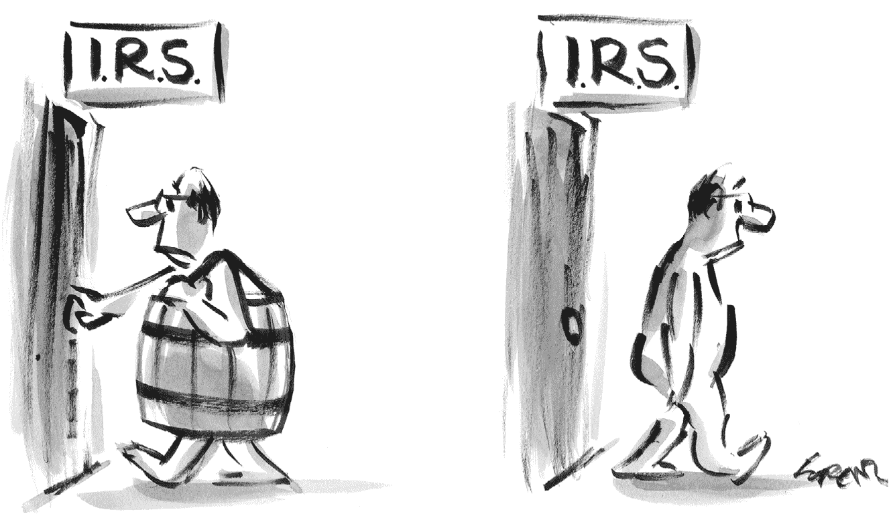

### 如果您拥有一家企业并使用数字资产支付服务费用

如果您在日历年内以数字资产支付给某人 600 美元或更多，您必须向 IRS 和收款人报告这些付款，就好像您已经用美元支付给他们一样，正如 IRS 2014-21 号公告中所述。

## 第二十一章 运营和合规性

如果你是金融顾问或金融服务行业的高管，如果想在客户投资组合中包含数字资产，你需要熟悉与数字资产相关的合规和报告义务。

如果你是一名金融专业人士，你已经熟悉托管、管理资产与顾问资产、KYC/AML、受托责任等问题。因此，在这里我们将跳过所有这些内容。

相反，我只会给出三个关键点，从最重要的开始：

1.  **1\. 始终要表现为受托人。** 是的，我知道我刚在上一段中说过我不打算涉及这个话题，但这一点非常重要，必须始终强调。所以我说了。你必须始终遵守受托人标准，为每个客户服务，维护其最佳利益——无论是否涉及数字资产。

    如果你是一名顾问，而且你并非始终表现为受托人，请你和其他所有人一个忙，立即离开这个行业！

1.  **2\. 将数字资产视为证券。** 请记住，SEC 认为一些数字资产是证券，而其他一些数字资产则不是。如果你对某种特定资产是否为证券感到疑惑，要么在确定之前不要使用它，要么将其视为证券处理。这样，在监管角度上，你就以最安全的方式运作。

1.  **3\. 注意美国证券交易委员会发布的最新声明。** 例如，2021 年 2 月 26 日，SEC 的审查部门发布了一份风险警示，“审查部门对数字资产证券的持续关注”。这份警示聚焦于数字资产中固有的“独特风险”，并提供了针对 SEC 注册的顾问和公司的指导。你必须及时了解最新的监管发布信息。请参阅接下来的几页，了解可以帮助你保持最新的新闻服务。

### 披露

你管理多少钱？这个数字对于顾问及其公司来说非常重要；对于许多人来说，它提供了吹嘘的资本，帮助你吸引和留住客户。毕竟，投资者希望与他们认为会让他们赚很多钱的人一起投资，他们经常做出的一个假设是，一个拥有 *大量* 资金的公司一定很擅长这个。

这就是为什么 SEC 确保你确实在管理你声称在管理的资金。因此，每年，你向 SEC 提交你的 ADV，向你的客户和公众提供副本，揭示这个数字（以及更多）。

在计算 AUM 时，SEC 要求你区分证券和非证券；在 AUM 计算中，你只需要包含那些至少有 50% 总价值是证券（包括现金和现金等价物）的账户或投资组合。

区块链和数字资产的新闻服务

| **无银行**[banklesshq.com](http://banklesshq.com) | 无银行是一份每周三次发送的通讯，帮助你在这个新的加密经济中持有、借贷、借款、赚取、花费、投资和抵押你的资金。 |
| --- | --- |
| **Bitcoinist**[bitcoinist.com](http://bitcoinist.com) | Bitcoinist 提供关于分散式数字货币和区块链技术的最新新闻、指南和价格分析。 |
| **比特币杂志**[bitcoinmagazine.com](http://bitcoinmagazine.com) | 比特币杂志是关于数字资产和区块链的最古老的出版物，它在 2012 年开创了这个领域。它提供了围绕严格的编辑和新闻标准建立的思想领导力。 |
| **比特币新闻**[bitcoin.com](http://bitcoin.com) | 比特币新闻是一个数字新闻平台，涵盖 ICO、DApps 和区块链等主题，以及加密货币市场的更新。 |
| **Blockworks**[blockworks.co](http://blockworks.co) | Blockworks 是一个金融媒体品牌，向数百万投资者提供有关数字资产的突发新闻和高级见解。 |
| **CoinCentral**[coincentral.com](http://coincentral.com) | CoinCentral 是数字资产爱好者的全包式通讯、播客和教育网站。 |
| **CoinDesk**[coindesk.com](http://coindesk.com) | CoinDesk 是一个媒体平台，探讨数字资产如何促进全球金融系统的演变。成立于 2013 年，CoinDesk 通过其网站、社交媒体、新闻通讯、播客、视频、研究和现场活动，触达数百万对数字资产和区块链技术感兴趣的用户。 |
| **Coinstats**[coinstats.app](http://coinstats.app) | Coinstats 是一款领先的加密货币投资组合跟踪器，提供 24 小时加密货币报告以及最新的加密货币新闻。 |
| **Cointelegraph**[cointelegraph.com](http://cointelegraph.com) | 成立于 2013 年，Cointelegraph 是一个领先的独立数字媒体资源，涵盖了关于区块链技术、数字资产和新兴金融技术趋势的广泛新闻。每天，其记者、专家和撰稿人团队都会从去中心化和中心化世界带来最新的新闻。 |
| **Crypto Daily**[cryptodaily.io](http://cryptodaily.io) | Crypto Daily 关注来自币安智能链、Solana、Polygon 和以太坊生态系统的最新消息。 |
| **DappReview**[dapp.review](http://dapp.review) | Dapp Review 帮助用户找到更多有趣的 Dapps，并帮助开发者推广其 Dapps 并获得更多客户。 |
| **Delphi Insights**[delphidigital.io](http://delphidigital.io) | 对于高级用户，Delphi 的 Insights 会员包括市场覆盖（DeFi、Layer 1s、NFT 等）、宏观分析以及重点领域（如 DAO 治理和收益策略）的摘要。Delphi Pro 是一个复杂的会员层，拥有深入、自下而上的研究报告数据库。Delphi 还提供独家访问仅限会员的社区聊天，其中包括与行业顶尖人才的持续对话。 |
| **Digital Asset Research Newsletter**[digitalassetresearch.com](http://digitalassetresearch.com) | DAR 为机构客户提供多个简报，涵盖从每日故事到最新的数字资产法规，以及数字资产市场的定性和定量分析。 |
| **NewsBTC**[newsbtc.com](http://newsbtc.com) | NewsBTC 是一个加密货币新闻服务，涵盖比特币新闻、技术分析和数字资产预测。 |
| **Quantum Economics Newsletter**[quantumeconomics.io](http://quantumeconomics.io) | 该简报为投资者提供数字资产信息，考虑市场情况和链上分析，以评估数字资产的下一步动向。 |
| **[Securities.io](http://Securities.io)**[securities.io](http://securities.io) | Securities.io 每日提供安全代币、代币化基金和房地产、监管和众筹等领域的新闻、访谈和每月回顾。 |
| **The Bitcoin Forecast by Willy Woo**[willywoo.substack.com](http://willywoo.substack.com) | 《The Bitcoin Forecast》是由技术专家 Willy Woo 撰写的付费简报。Willy 专注于比特币区块链的链上结构。 |
| **The Block**[theblockcrypto.com](http://theblockcrypto.com) | The Block 是数字资产领域的领先研究、分析和新闻品牌。The Block 的团队遍布七个时区，全天候报道全球加密货币和区块链领域。 |
| **The Daily Gwei**[thedailygwei.libsyn.com](http://thedailygwei.libsyn.com) | 《The Daily Gwei》让你了解以太坊上正在发生的一切。 |
| **The Defiant**[thedefiant.io](http://thedefiant.io) | 《The Defiant》是 DeFi 的内容平台。它策划、整理和分析 DeFi 的所有重大发展。 |
| **The Pomp Letter**[pomp.substack.com](http://pomp.substack.com) | 《The Pomp Letter》因其对商业、金融和科技行业的日常分析而备受欢迎。 |
| **Unchained Newsletter**[unchainedpodcast.com](http://unchainedpodcast.com) | 《Unchained Newsletter》是劳拉·辛（Laura Shin）对最新数字资产新闻的每日观点。劳拉曾是*福布斯*的高级编辑，也是第一个全职报道数字资产的记者。 |

那么，如果账户 75%的持仓是数字资产，比如比特币，而不是证券，你该怎么办？在这种情况下，你必须将整个账户或投资组合排除在你的 AUM 计算之外。

此外，请注意，仅仅拥有客户账户中数字资产的自主权并不会自动使价值符合 AUM 的资格。要计入，你必须能够记录你正在单独监控和评估客户的数字资产头寸，而不是仅在定期审查会议或与客户的财务规划对话中。因此，你必须随时了解区块链和数字资产的发展，以便在 SEC（证券交易委员会）来访时（总是令人愉快的时刻）向他们证明你正在进行持续和定期的监控和配置服务。

即使没有自主权，你可能仍然可以将资产算作资产管理规模（AUM），但基本上只有在公司拥有客户的授权执行建议或完成交易的权力时才可以；如果客户自行决定是否执行，那就不算 AUM。（2021 年 2 月的风险警报列出了“计算 AUM”作为顾问的合规问题。）

### 估值

数字资产全球范围内 24/7 在许多交易所进行交易，并且每个交易所发布不同的价格。这使得估值比股票或共同基金困难得多。估值在许多方面都非常重要。其中，它们确定了您的 AUM，您用来确定向客户收取的费用。因此，如果您使用不正确的估值，您将向客户报告不准确的账户价值，这不仅可能影响您提供的建议，还可能导致您向客户过度收费。

您的托管人应该雇用或订阅提供数字资产每日收盘价的估值服务；通常您会依赖这些信息。然而，估值在这个领域是一个发展中的问题，因此您的公司必须了解最新动态，以确保您采取最佳做法。如果您不依赖于托管人报告的定价，您需要找到另一种正确确定估值的方法。这意味着找到一个独立、可靠的机构——对任何公司来说都是一个困难的过程。

### 单独管理账户（SMAs）

SMAs 可以算入 AUM，但前提是您保留自主权，可以雇用或解雇经理人，或将资产重新配置到另一家经理公司。即使您向客户推荐了 SMA，按照资产基础费用支付，并且客户的账户是自主账户，因为 SMA 需要自主权，这也是正确的。

### ADV，第一部分，项目 5.G.7

这里您需要披露您提供的咨询服务类型。“选择其他顾问”是一个选择；如果您推荐 SMAs 或通过私募基金进行投资，则您的公司应该选中这个选项。

### ADV，第一部分，项目 8A

本部分涉及客户交易中可能存在的利益冲突。如果您个人投资于数字资产，并在向客户推荐同样的资产，您应该回答是（除非这些资产仅限于共同基金）。

### ADV，第一部分，项目 8C

在回答此项目时，您需要确定您是否对客户账户中的数字资产交易具有自主权。第 8C 项仅涉及对证券的自主权，而不涉及非证券（因此请记住豪伊测试）。

### ADV，第一部分，附表 D，第 5K 节

这是一个将您的资产管理规模按资产类别分段的大表。目前，数字资产并未显示为一个明细功能，但这可能会改变。

### ADV，第二部分 A

您知道，客户无法看到第一部分。但他们会收到第二部分（这就是为什么这被称为披露手册），所以对数字资产的参考在这里尤为重要。如果您首次推荐数字资产，则必须更新此部分以承认您已对 ADV 进行了实质性更改。

### ADV，第二部分，第 4 项

由于这描述了公司的咨询业务，可能需要根据第一部分中显示的资产管理规模计算结果进行更新。您可以在第二部分中以不同方式描述资产管理规模，但需要保持文档描述您使用的方法以及为何您在每个部分的回答虽然不同但不会误导的原因。如果您提供数字资产咨询作为单独的服务，则可能还需要更新您提供的咨询服务类型。

### ADV，第二部分，第 5 项

这可能是客户最感兴趣的部分，因为它描述了您如何获得有关数字资产提供的建议的报酬，以及客户可能需要承担的其他费用和开支。任何尚未在其他地方披露的与数字资产有关的费用和开支都应在此处描述。

### ADV，第三部分，第 8 项

这里是您披露您的分析方法、投资策略和损失风险的地方—如果您现在推荐数字资产，这些内容已经发生了变化。如果任何证券涉及重大或不寻常的风险（让我们承认吧，数字资产确实涉及重大或不寻常的风险），那么您需要在此处详细解释它们。

决定是否需要更改和添加第三部分第 8 项风险因素的关键考虑因素包括：

+   价格波动性

+   数字资产的投机性质

+   数字资产通常不受硬资产或现金流支持的事实

+   定价的供需驱动因素

+   技术网络风险，也称为受损风险或访问风险

+   未经授权的交易和盗窃风险

+   数字资产的安全保管和存储风险

+   业务连续性计划

+   私钥丢失

+   流动性不足

+   不确定的监管环境

+   存放在混合账户或基金中的资产受到债权人索赔的约束，并且托管人可能享有实际所有权的利益

+   数字资产账户和价值不受 FDIC 或 SIPC 保护

+   与数字资产投资相关的费用和开支通常不可比较

### 托管

*托管*意味着持有客户资金或证券（直接和间接）或有权取得它们的控制。如果您拥有客户资金或证券的托管权，则必须保护这些资金。托管规则旨在保护投资者免受投资顾问的盗窃或侵占风险。因此，您必须在《ADV 表》的第一部分和第二部分上披露有关托管的信息。

数字资产是否受托管规则约束？在撰写本文时，监管清晰度尚不明确。答案肯定会取决于事实和法规，而这两者随时间而变化。因此，请考虑

+   1940 年通过投资顾问法案时国会的意图；

+   美国证券交易委员会（SEC）广泛的保护投资者及其资产的宪章；和

+   数字资产和传统证券都面临相同问题的事实。

如果公司没有直接或通过清算数字资产并分配收益的权限，那么证券律师普遍认为不存在托管。

处理和托管数字资产证券的技术要求与传统证券有所不同。例如，传统证券交易通常涉及基础设施提供商和交易对手等中介，但数字资产证券市场没有类似的中介。

尽管 SEC 发布了一些指导意见，称托管规则仅适用于数字资产被视为基金或证券的情况，但请记住，即使数字资产不被视为证券，您仍需证明该数字资产不属于“客户资金”类别，以避免适用托管规则。

### 合格的托管人

关于数字资产托管的法律仍在发展之中，但其中一个要求是您必须只使用合格的托管人来持有客户的资产。2020 年 11 月，美国证券交易委员会（SEC）发布了一份声明承认“确定谁有资格作为合格的托管人是复杂的，需要根据事实和情况来判断。”一些公司放弃了在 SEC 获得“合格托管人”地位的努力，而是通过成为州立特许信托公司在州级别获得批准，这也使它们能够提供受监管的托管服务（尽管由州政府监管，而不是 SEC）。

选择合格托管人是受托人的基本职责。考虑以下问题以选择托管人：

1.  **1.** 您的业务经营时间有多长了？

1.  **2.** 您雇用了多少位工程师或软件开发人员？

    1.  他们在数字资产方面的经验如何？

1.  **3.** 您是否已被认定为合格的托管人？

1.  **4.** 您托管哪些资产，哪些不托管？

1.  **5.** 您是否接受合格和非合格账户？

1.  **6.** 您持有哪些许可证和认证？

    1.  他们在您公司工作多长时间了？

    1.  是否曾发生过这些许可证和认证的失效？

1.  **7.** 描述您的财务稳定水平。

    1.  您是否愿意提交证据？

    1.  您是否由独立第三方审计？

    1.  您会向我提供这些审计结果吗？

1.  **8.** 您进行了安全审计吗？

    1.  您会与我分享该审计的结果吗？

1.  **9.** 是否根据需求提供存在证明审计以验证资产的可用性？

1.  **10.** 您提供数字资产服务多长时间了？

1.  **11.** 您的数字资产存储在哪个国家？

    1.  如果在美国以外，您如何评估政府扣押的风险？

1.  **12.** 数字资产是否存放在隔离钱包或总账户中？

    1.  为什么以这种方式维护？

1.  **13.** 您托管的数字资产存放在热钱包还是冷钱包中？

    1.  如果是冷的，请描述冷存储协议。

1.  **14.** 您是否使用多重签名协议？

    1.  如果是，描述您的方法和理由。

1.  **15.** 如何处理分叉和空投？

1.  **16.** 您是如何生成密钥的？

    1.  如何确保这些密钥的安全？

    1.  私钥是否曾暴露给人类？

1.  **17.** 如何验证用户和审核者？

1.  **18.** 如何防范串通和胁迫？

1.  **19.** 每夜数据馈送的仓位、净值和定价数据是否进入您的投资组合会计应用程序？

    1.  是哪些？

1.  **20.** 描述一下您的保险覆盖范围。

    1.  承运人是谁？

    1.  政策只保护托管人，还是也保护我的客户和我？

    1.  单笔索赔、每个账户和每个客户的政策限额是多少？

    1.  政策包括什么？

1.  **21.** 您是大公司的子公司吗？

    1.  如果是，您的母公司对您的错误和疏漏负责还是免责？

1.  **22.** 是否可以处理批量或汇总交易以便重新平衡所有账户？

1.  **23.** 您提供最佳执行吗？

    1.  交易通常多快被填充？

1.  **24.** 如何促进从客户账户扣除我的咨询费用并将我的费用支付给我？

1.  **25.** 您的费用计划是什么？

托管人对以上问题的回答可能导致您更新您的 ADV。

### 隐私和保密性

任何顾问都不应接受关于任何客户私钥或种子短语的信息。如果你这样做了，即使密钥也由托管方持有，你也可能被视为可以访问客户的资产。

除了安全风险之外，托管这些信息会让你或你的公司难以证明交易是由公司、客户还是其他方完成的——无论是否涉及合格的托管方。

### 道德准则

你想要个人投资数字资产吗？在你这样做之前，请阅读你公司的道德准则。它描述了你的义务——这可能包括在购买任何被视为证券的数字资产之前获得公司的批准。你公司可能还要求在任何购买之前进行预批准，以便可以预防和监视前瞻、挂靠和其他问题。

你公司的道德准则还规定你有义务向公司提交每季度报告，披露你持有的任何和所有证券。这包括任何被视为证券的数字资产。道德准则还可能要求你报告你的非证券持有情况。这将需要你披露资产的名称和位置，包括托管方、交易所、硬件和钱包的使用情况，以及购买日期和地点、购买价格和数量。对于任何销售也是如此。但永远不要提供有关你的私钥或种子短语的任何信息——即使有人要求你这样做。（也永远不要要求任何员工提供他们的私钥。）

如果你通过机构第三方投资，它可能会生成一份活动摘要供你下载并提供给你的合规部门。该下载可能会满足你的报告义务。（如果不行，你的合规主管会告诉你！）

了解公司的要求并遵守其规定是您的责任。如果您负责为公司做出这些决定，请确保向员工和任何访问人员（如董事会成员或审计员）提供适当的指导，以便他们知道他们必须做什么和不得做什么。

### 利益冲突

您的道德准则解释了您如何避免与客户的利益冲突，并在无法避免时进行披露。

对于数字资产，具体考虑因素包括您或公司是否持有与推荐给客户的相同数字资产的头寸。如果是这样，请在 Form ADV 中披露这些冲突以及您如何解决这些冲突。

需要解决的一些问题包括：

+   如果您为自己和客户购买交易量较低的数字资产，那么谁的交易将首先执行—您的交易还是客户的交易？（换句话说，公司将如何避免前置交易？）

+   公司是否要求其顾问和其他人员在为个人账户购买或出售数字资产之前获得预先批准？

+   公司是否会限制数字资产有限发行（如私募）的交易？

+   在交易时，公司是否会向客户披露任何信息？

### KYC（了解您的客户）

尽管投资顾问没有“了解您的客户”规则，但顾问确实有义务按照每个客户的最佳利益行事，这意味着必须了解哪些投资适合每个客户。这又意味着要了解客户的投资需求、目标、目的、风险承受能力和其他详细信息，例如客户要求的任何限制。综上所述，您基本上有了一个 KYC 义务。

你的 KYC 要求程度取决于你与客户的关系。例如，管理客户资产的资产管理人可能对客户一无所知；例如，这对于互惠基金经理来说是常规情况。如果这描述了你与客户的关系，这必须向客户披露，并在客户入职期间签署的协议中反映出来。

作为受托人的重要一部分是对你推荐的投资进行尽职调查。仅仅因为客户要求或者因为“其他人都在购买”而说你向客户提供了数字资产安全是不够的。请记住，SEC 在 2021 年 2 月的风险警报中将投资组合管理列为合规风险，这意味着 SEC 正在关注顾问向客户推荐的数字资产。这包括数字资产的证券分类、对这些资产的尽职调查、风险缓解以及对客户的受托责任的履行。

初始化客户关系时执行 KYC 操作是不够的。相反，你的要求是持续的。你和你的公司应定期向每个客户请求关于他们的生活和财务状况的更新，以便你可以根据需要对先前的推荐进行更改。即使你的客户不回复你的更新请求（这是常见的），你和你的公司应该使用常识并做出你知道需要的更改。例如，与你合作二十年的客户可能不处于与你见面时相同的境况；请据此行事。如果你觉得在这种信息真空中不能有效地行事，与你的合规部门讨论终止关系。

### AML

投资顾问不受《美国爱国者法》关于反洗钱规则的约束。然而，你的公司可能出于其他原因——作为一项自愿的最佳实践决策，或者因为第三方要求——制定了一个 AML 计划。

你公司的 AML 计划（如果有的话）应考虑与数字资产相关的特定风险。对投资顾问而言，最大的风险很可能是与数字资产交易所普遍存在的匿名性。（如果你不知道你和你的客户在与谁打交道，那么防范洗钱就是一个挑战。）

尽管投资顾问不需要拥有 AML 计划，但所有美国公民都受《美国爱国者法》的约束。这意味着如果客户被允许洗钱或资助恐怖主义活动，你或你的公司可能会违反该法案。

即使该活动被认为是合法的，你也面临着巨大的声誉风险。因此，请确保你的公司确保第三方审查每位客户的行为，以发现潜在的洗钱和资助恐怖主义行为。

### 最佳执行

你在这里的责任深深扎根于受托责任之中。所有顾问必须以客户的总成本或每笔交易的收益为标准执行证券交易，使其在各种情况下最有利可图。决定性因素不是最低可能的佣金，而是交易是否代表最佳的定性执行。

因此，最佳执行并不意味着客观意义上的“最佳”。相反，令公司感到困惑的是，它取决于事实和情况。而这些事实和情况对数字资产而言将是不同的。

例如，当不同的数字资产交易所同时提供不同的价格时，试着履行你的最佳执行责任。由于所有交易所的价格都在不断变化，你如何可能知道哪个交易所提供的价格最优？这是无法知晓的，所以在做出选择时，考虑诸如速度、安全性、透明度、平台质量、研究、支持服务、交易所声誉和定价记录等标准。

### 合规政策与实践

如果你的公司决定将数字资产加入其推荐组合，那么有必要全面审查公司的整个合规计划。以下是一些需要审查的领域：

+   监督责任

+   SMA 的监控

+   托管

+   交易分配

+   投资估值用于结算和报告

+   最佳执行

+   证券订单

+   交易审核

+   代理交叉和主要交易

+   网络安全

如果数字资产被盗，通常比其他资产更难找回，因此公司应该审查 SEC 在此问题上的观点。此外，追踪行业的最佳实践，这些实践通常领先于 SEC 的警报、行动和指导。

### RFIT 计划

你的公司应该审查并加强其反欺诈身份盗窃计划，以便你和公司可以确定客户的出售或转移数字资产的请求是否真的来自客户，而不是冒充客户的黑客。

### 营销

你的公司应该审查与数字资产相关的营销计划，因为这些投资可能需要与你用于其他营销活动的标准模板不同的披露。在向公众使用任何营销材料之前，必须得到你公司的广告或合规部门的批准。

### 第三部分

也称为 CRS 表格，客户关系摘要是一份一至两页的文件，概括了你公司的服务、投资权限、费用、成本、冲突和其他重要事实。你必须在客户关系发生重大变化后的 30 天内更新 CRS 表格，并且你必须在之后的 60 天内向每位客户通报这些变化。（请注意，你必须向客户提供突出变化的修改版本以及新修订版本。）

### 保密

你的受托责任要求你对客户及其交易保持保密。这是常规操作，但是区块链技术带来了对保密性需求的新关注。在你的实践中部署区块链技术意味着你有一些新事项需要考虑关于保密性。例如，你必须防止钱包追踪——这在之前从未成为问题。你还必须确保只有需要知道的人员可以访问公司使用的区块链。这点尤为重要，因为存在未妥善访问、转换或转移数字资产的潜在风险。

### 双重注册

到目前为止我们一直在提到 SEC，让我们聚焦于 FINRA。成千上万的金融顾问同时向 SEC 和 FINRA 注册。如果你就是其中之一，你必须遵守两个监管机构发布的规则。

作为注册代表，你的券商可能要求你在为自己或客户购买数字资产之前获得其许可。如果你或任何关联人员或关联企业从事或打算从事与数字资产相关的活动，你还必须及时通知公司的风险监测分析师。这些活动包括

+   购买或出售数字资产或投资于数字资产的基金；

+   购买或出售与数字资产相关的期货或期权；

+   参与 ICO；

+   托管数字资产；

+   从客户那里接受数字资产；

+   挖矿；

+   显示数字资产的报价；和

+   使用区块链技术。

不要假设您的 ADV 披露满足 FINRA 的要求。FINRA 有自己的规定，所以一定要确保您也满足它们。

### 在处理数字资产保险政策时保护您和您的公司——从而保护您的客户

首先，绝大多数数字资产及其所在账户都不受 FDIC 或 SIPC 保险的保护。这种缺乏保障必须成为您决定是否以及如何向客户推荐数字资产的分析的一部分。

为了为您自己和您的公司获得保障，请联系您的保险提供商，查看您现有的专业责任或错误与疏漏保险是否涵盖涉及数字资产的活动。询问您和您的公司是否需要额外的保单、附加条款或为提供关于数字资产的建议和/或对数字资产投资拥有自主权而获得的保障，并确保在将数字资产纳入您的实践之前获得此保障，因为许多保单不涵盖之前的行为。

通过经纪人/交易商（B/D）获得错误与疏漏保险的注册代表可能不会对基于费用的活动进行保险，即使 RIA 活动得到了批准或者由 B/D 进行了监督也是如此。

另外，请查看您的保单的网络覆盖范围。您希望得到保护，以防发生数据泄露、转账欺诈、媒体责任和人为错误等问题。

#### 诚信保险

尽管它们被称为保险单，但诚信保险是一种保险形式，旨在保护您和您的客户免受由员工或承包商犯下的错误行为等造成的财务损失。

尽管您不会监管客户的私钥，例如，与您公司有关的人可能会接触到有关这些密钥的信息，或者通过不安全的方式传输这些数据（无论是意外还是恶意），都会导致不良结果。一份诚信保险可以帮助保护您。

如果您提供与数字资产相关的税务和会计服务，您还应考虑扩展保障范围。

许多保险公司尚未在此领域提供保险，而其他公司则限制他们提供的保险范围。随着数字资产市场的成熟，保险覆盖机会可能会增加；与此同时，如果您和您的公司今天无法获得所需的保险覆盖，您将不得不就是否以及如何处理数字资产做出商业决策。

数字资产保险提供商

| **BitGo**[bitgo.com](http://bitgo.com) | BitGo 为投资者提供机构托管、交易和保险服务。它为托管人和企业提供各种安全保险解决方案。BitGo Business Wallet 客户可以通过第三方公司 Digital Asset Services 购买关键恢复服务保险和额外的自保钥匙保险。 |
| --- | --- |
| **Coincover**[www.coincover.com](http://www.coincover.com) | Coincover 保证数字资金不会丢失或被盗。其技术将保险与安全功能结合，确保数字资产投资对投资者和企业都是安全的。 |
| **HCP National**[hcpnational.com](http://hcpnational.com) | HCP National 帮助企业为其数字资产获得高质量的保险覆盖，包括一般商业保险、董事和管理人员责任保险、错误与疏忽保险、犯罪保险、托管保险和 DeFi 保险政策。 |
| **Marsh**[marsh.com](http://marsh.com) | Marsh 的区块链和数字资产风险转移保险解决方案为区块链技术、加密货币和数字资产领域的公司提供服务。 |

#### 如何将数字资产纳入您的实践

尽管数字资产在金融界越来越受到认可，但许多顾问仍然简单地告诉客户：“这不是我们做的事情。”

因为客户越来越要求将数字资产纳入他们的投资组合中，而其他顾问——您的竞争对手——也越来越能满足这一需求，您可能会感到别无选择。毕竟，如果您不参与，您就有可能失去客户和资产管理规模。事实上，NYDIG 在 2021 年的一项调查发现，92%的客户期望他们的理财顾问能够就比特币给出建议，如果他们的顾问不能帮助他们，62%的人会换掉顾问。因此，您自己选择不参与就是自己冒险。

当我提到风险时，我不仅指的是您可能失去客户的风险。您还可能遭受监管机构的愤怒。请记住，您是受托人——这意味着您有法律义务为客户着想。如果您甚至不考虑数字资产，您怎么能说您正在满足这一标准呢？

当 SEC 检查员来访时，您需要能够解释为什么*不*投资数字资产。您需要向他们展示，您进行了尽职调查，并且您的研究和分析使您得出结论，即在*任何*客户投资组合中不包括这一新资产类别是正确的。

如果您所能说的只是“我认为比特币不过是郁金香球茎或 Beanie Babies”，而没有数据支持这一观点，那么，祝您考试好运。

那么，让我来帮助您设计一种实践管理方法，使您能够真正确定，无偏见或预设观念，数字资产是否适合客户投资组合。

### 公司理念：你的未来计划是什么？

让我们从理念开始。您目前的答案可能是以下任何一种：

+   我们已经研究过这一资产类别，并得出结论，它并不适合我们的客户。我们将继续观察发展情况，未来可能会改变主意。

+   目前我们不建议客户投资数字资产，但我们在密切关注相关问题并持续学习，未来可能会决定参与其中。

+   我们正在积极寻找经理，以便我们可以为客户提供这一资产类别。

+   我们向客户提供这一服务，但只有那些对此表示兴趣的客户。

+   我们为一些客户提供曝光，但对其他客户则不提供，这取决于每个客户的情况。

+   我们定期为所有客户提供这一资产类别的曝光，但也有例外。

任何这些立场都有助于确立您公司的观点。它为您和公司中的每个人设定了基调，并在客户询问问题时消除了任何挫折或戏剧性—通常是在他们与某人交谈或在新闻中遇到之后。

拥有这样的理念，并有支持它的证据，将在 SEC 询问时大有帮助。

#### 公司政策

您和您的公司选择的理念将决定您必须采纳的政策——比如交易执行、投资决策、尽职调查等等。

您还需要更新内部合规程序，比如外部业务活动和员工证明。您需要什么信息，想要多频繁地获取它，以及如何收集它？

公司应从员工中进行抽样调查。了解谁对这个主题感兴趣，谁拥有数字资产，以及他们的计划是什么。通过这样做，公司领导层让每个人都知道公司在关注这个领域。公司还在了解可以寻求帮助的人——因为那些参与这个领域的人很可能比公司的法律和合规人员更有知识。

作为其中的一部分，你将不得不解决你对数字资产与作为证券的数字资产的观点。例如，根据美国证券交易委员会的说法，比特币和以太坊不是证券，但瑞波币是。那么，你会要求公司的每个人都披露他们持有的比特币吗？你不会问员工是否拥有棒球卡或稀有邮票——毕竟它们不是证券——那你为什么会问比特币呢？而且由于那些拥有比特币的人很可能意识到这一点，你将如何处理对你询问的反对意见？

### 客户沟通与文档

请确保记录所有涉及数字资产的客户对话，即使对话涉及非证券，如比特币。并且处理所有数字资产交易时，要与处理任何其他交易一样。

与客户特别明确——最好在你的客户协议和投资政策说明书（如果你发布的话），但也在当前的对话和电子邮件中——关于你的交易时间政策。纽约证券交易所每周一至周五上午 9:30 至下午 4:00 开放，东部标准时间，除了联邦节假日。因此，如果客户在周六晚上 8:00 给你发电子邮件要交易 IBM 的股票，你（和他们）都知道他们必须等到市场开放才能进行交易。但数字资产全天候交易，365 天，我们知道价格有多么波动。因此，如果你在周六晚上收到一封交易的电子邮件，但直到周二早上回到办公室才执行交易，你是否未能满足客户的期望？或者更糟糕的是，使自己面临责任？你的客户协议、IPS 和持续的沟通可以帮助你避免纠纷或对你的声誉造成损害。

区块链研究和分析公司

| **AnChain**[anchain.ai](http://anchain.ai) | AnChain 为金融机构和政府机构提供智能合约智能，以保护他们免受数字资产领域内的不良行为者的伤害。 |
| --- | --- |
| [Amberdata](http://amberdata.io) | Amberdata 是区块链和加密资产市场数据提供商。 |
| [Binance Research](http://binance.com) | Binance Research 为数字资产行业的所有参与者提供机构级分析、深入洞察和公正信息。 |
| [Blockchain Research Institute](http://blockchainresearchinstitute.org) | 区块链研究所是一个独立的全球智库，致力于探索和分享区块链对业务、政府和社会的战略影响的知识。 |
| [BTCS](http://btcs.com) | BTCS 是一家专注于提供链上分析的区块链基础设施和研究公司。 |
| [ByteTree](http://bytetree.com) | ByteTree 提供区块链网络的实时数据，并且是机构级加密资产数据的领先提供商。其投资者终端实时跟踪超过 80 种数字资产的指标。 |
| [CertiK](http://certik.org) | CertiK 是领先的以安全为重点的排名平台，用于分析和监控区块链协议和 DeFi 项目。 |
| [Chainalysis](http://chainalysis.com) | Chainalysis 为构建在区块链上的全球经济创造透明度，使银行、企业和政府能够共同了解个人和机构如何使用区块链。Chainalysis 为 60 多个国家的政府机构、交易所、金融机构以及保险和网络安全公司提供软件和研究。其平台提供用于解决网络犯罪案件的调查、合规和风险管理工具。 |
| [Chainbeat](http://chainbeat.io) | Chainbeat 帮助投资者了解 DeFi 应用程序的真实使用情况和留存率，提供对 DeFi 采用情况的整体理解。 |
| **Ciphertrace**[ciphertrace.com](http://ciphertrace.com) | Ciphertrace 通过保护数字资产公司和金融机构免受安全和合规风险的威胁，促进了区块链经济。 |
| **CoinMetrics**[coinmetrics.io](http://coinmetrics.io) | CoinMetrics 是领先的加密金融情报提供商，为接触数字资产的最负盛名的机构提供网络数据、市场数据、指数和网络风险解决方案。 |
| **Crystal Blockchain**[crystalblockchain.com](http://crystalblockchain.com) | Crystal Blockchain 为交易所、银行和合规要求提供加密交易分析和监控。 |

| **Delphi Digital**[delphidigital.io](http://delphidigital.io) | Delphi Digital 在其主要垂直领域（研究、实验室、创业）树立了良好的声誉，并被广泛认为是致力于加密和数字资产市场的首要研究公司。 Delphi 的客户群包括许多行业内最知名的基金、金融机构和投资者。

Delphi Digital

|

| **Digital Asset Research**[digitalassetresearch.com](http://digitalassetresearch.com) | Digital Asset Research 为机构参与者提供全面的数字资产市场数据。 |
| --- | --- |
| **DMG**[dmgblockchain.com](http://dmgblockchain.com) | DMG（股票代码：DMGGF）是一家上市的、垂直整合的区块链和数字资产公司，管理、运营和开发端到端的数字解决方案，以实现区块链生态系统的货币化。 |
| **Elementus**[elementus.io](http://elementus.io) | Elementus 是第一个通用的区块链搜索引擎和机构级别的加密取证解决方案。 |
| **Elliptic**[elliptic.co](http://elliptic.co) | Elliptic 为加密业务、金融机构和监管机构提供区块链分析、培训和认证。它提供服务和软件来检测和防止金融犯罪。该公司分析 100 多个数字资产数据点，提供可操作的见解，客户依靠这些见解来减轻风险并保持监管合规性。Ciphertrace 通过保护数字资产公司和金融机构免受安全和合规风险的影响，推动了区块链经济的发展。 |
| **Flipside**[flipsidecrypto.com](http://flipsidecrypto.com) | Flipside 直接与领先的加密项目合作，通过结构化的悬赏计划提供按需分析。 |
| **Glassnode**[glassnode.com](http://glassnode.com) | Glassnode 是一个区块链数据和情报提供商，为数字资产利益相关者生成创新的链上指标和工具。 Glassnode 通过关注来自区块链本身的数据，为区块链和数字资产提供洞察力。 |
| **IntoTheBlock**[intotheblock.com](http://intotheblock.com) | IntoTheBlock 是一家应用人工智能的前沿研究的科技公司，为加密市场提供可操作的情报。 |
| **Lukka**[lukka.tech](http://lukka.tech) | Lukka 提供数据和软件解决方案，以管理未来商务基础设施上的数字资产。 |
| **Mosaic**[mosaic.io](http://mosaic.io) | Mosaic 是一个区块链研究平台，为加密金融提供更大的透明度和机构分析。 |
| **Nansen**[nansen.ai](http://nansen.ai) | Nansen 是一个区块链分析平台，用数百万个钱包标签丰富链上数据。 |
| **NYDIG**[nydig.com](http://nydig.com) | NYDIG 在银行业、保险业、金融科技和非营利组织等行业提供比特币产品和见解。 |
| **Omniex**[omniex.io](http://omniex.io) | Omniex 是一家金融服务技术公司，提供一套解决方案，用于访问、交易和管理加密和数字资产。 |
| **QLUE**[qlue.io](http://qlue.io) | QLUE 是与资深执法人员和反洗钱专家合作开发的调查解决方案，它结合了先进的专有搜索算法，用于检测犯罪分子试图利用数字资产隐藏的可疑活动。 |
| **ScoreChain**[scorechain.com](http://scorechain.com) | ScoreChain Analytics 跟踪数字资产，帮助您创建结构化和一致的 AML 战略，用于识别、评估和管理风险。 |
| **Sherlock (Fidelity Digital Assets)**[fidelitydigitalassets.com](http://fidelitydigitalassets.com) | Sherlock 是一种数字资产和分析解决方案，帮助机构投资者评估市场。它由 Fidelity Digital Assets 提供。 |
| **SIMETRI**[cryptobriefing.com](http://cryptobriefing.com) | SIMETRI 是全球最大的独立加密研究提供商之一。它提供了一种通过研究和分析对加密货币项目进行评分的专有方法论。 |
| **Streaming Fast**[streamingfast.io](http://streamingfast.io) | Streaming Fast 是一家区块链 API 公司，通过使用简单的 API 调用，实现了实时状态更新的流式传输、超快速搜索和不可逆转的交易保证。 |
| **Totle**[totle.com](http://totle.com) | Totle 将去中心化交易所和合成资产提供商聚合到一套工具中，使得以最佳价格轻松访问 DeFi 资产的深度流动性成为可能。 |
| **TradeBlock**[tradeblock.com](http://tradeblock.com) | TradeBlock 是提供机构交易工具、数据和数字货币指数的历史最悠久的供应商之一。它计算并发布数字资产的行业领先参考利率，用于定价无数场场场外交易、资产管理和衍生品。 |
| **TROY**[troytrade.com](http://troytrade.com) | Troy 提供聚合中心化交易平台、数据监控和链上交易等功能，为用户提供全方位的交易服务。 |
| **zK Capital**[zkcapital.substack.com](http://zkcapital.substack.com) | zK Capital 是一个专注于研究的区块链投资公司。 |

### 内部系统

你的公司将如何管理与数字资产相关的活动？例如，Excel 并不是为处理这些资产而设计的。因此，如果你的公司使用 Excel 进行数据输入和存储，你很可能需要考虑安装数据集成软件，使数据能够自由地在公司的所有系统之间流动，及时向适当的人员提供他们所需的信息。

### 咨询费用的计费和收取

这里有一件不那么琐碎的事项：确保你能够收到付款！

所以，请问自己，如果你建议客户将一些资产转移到数字资产上，从收入的角度来看，对你有什么影响？

你有五种选择。第一种是根本不向客户收取 AUM 费用。显然，这不是一个理想的选择，不仅仅是因为它会花费你的钱。这种方法的真正问题在于，它引发了关于利益冲突和你的建议合法性的质疑。“如果你告诉我，你无法在投资比特币的资产上收取你的 AUM 费用，然后告诉我不要投资比特币，那么你是因为不想损失收入而叫我不要投资吗？”突然间，客户无法相信你说的任何话。

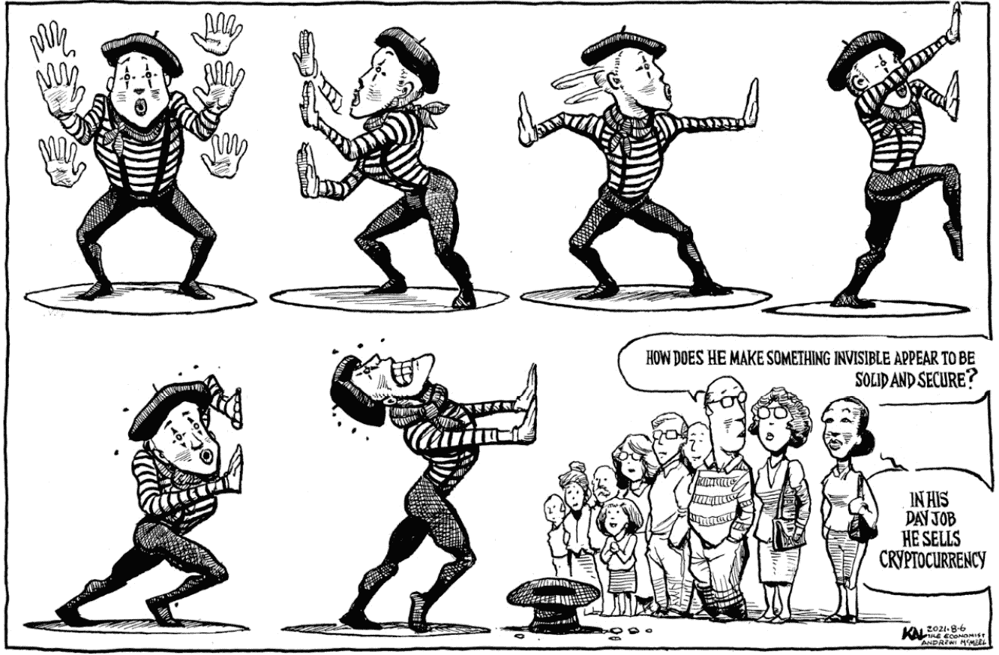

第二个选择是根据数字资产的持有金额向你的客户发送账单。但是，如果收取这笔费用需要你向客户开具发票，那么你就在你的实践管理中引入了一个新的繁琐方面。你将因为这一努力而产生新的费用。如果客户不支付怎么办呢？

第三个选择是将投资组合分成两部分——一部分持有常规投资，另一部分持有数字资产——然后仅从第一部分收费。具体操作如下：假设客户向你投资了$100,000。你并不是将所有的资金都放入投资组合 A，而是将资产的 99% 放入投资组合 A（购买常规投资），并将资产的 1% 放入投资组合 B，购买比特币。现在投资组合 A 拥有$99,000，投资组合 B 拥有$1,000。接下来，你不是按比例从投资组合 A 和 B 收取你的费用，而是从投资组合 A 收取全部费用，如图 21.1 所示。

第四个选择是将数字资产证券放置在与其他证券相同的账户中。一个账户，一个账单。简单。容易。自动。

第五个选择是与能够满足你所有实践管理需求的交易所或托管人合作——不仅包括账单，还包括投资组合再平衡、税务管理和相关服务。

#### 提前结算费用

大多数顾问每季度提前从客户账户中扣款。这不符合客户的最佳利益。通过提前收取费用，你减少了他们投资的金额，从而降低了他们的回报。考虑到数字资产的波动性，这个问题甚至更严重。

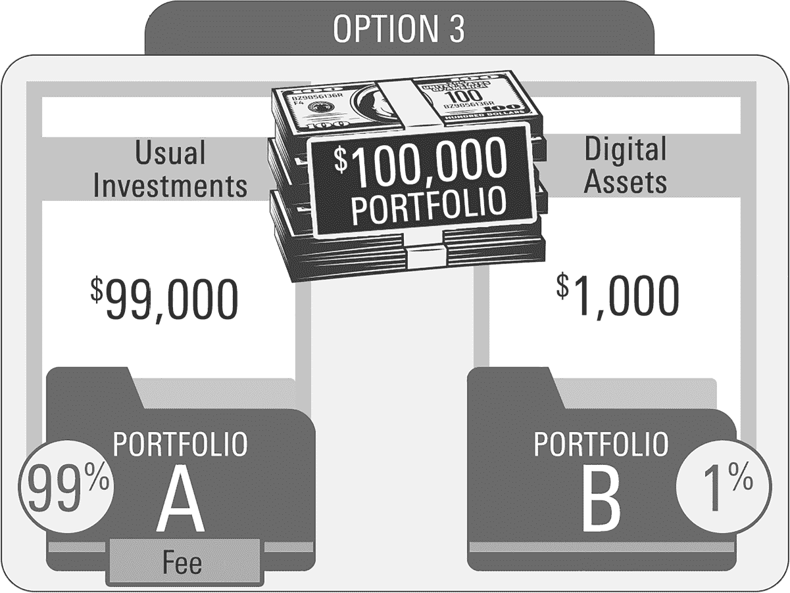

图 21.1

因此，你应该在季度结束后收取你的费用——以欠费方式。市场上有充足的技术让你以这种方式运作，并且你将向客户展示你正在参与最佳实践。

如果运营和合规挑战诱使你回避数字资产，那么你应该采取以下三种行动之一：

1.  **1\. 克服它。** 这是你的工作。即使你必须做一些没有描述你进入这个领域的原因的工作，你也有责任为客户服务。

1.  **2\. 委托琐事。** 仅仅因为这项工作很重要且必须完成，并不意味着你就是必须去做的人。可以雇佣员工或将任务外包给顾问。

1.  **3\. 辞职。** 在一个不那么苛刻的领域找一份新工作，在那里你不必关注其他人的最佳利益。
