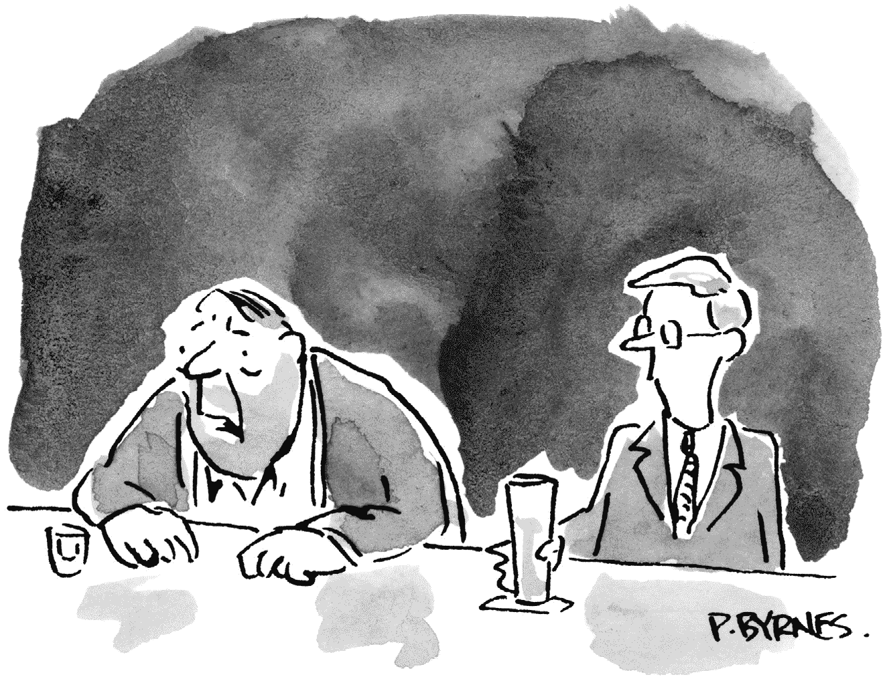

# 第五部分 开始

## 第二十二章 十大常见问题的答案

祝贺你！你已经学到了很多关于区块链和数字资产的知识。你可能仍然有一些顾虑。我将在这里回答最常见的问题。

在我们开始之前，请记住我们谈论的是将你的投资组合的一小部分投资到这个新的资产类别中。所以，让我们保持透视，好吗？正如我们学到的那样，投资的完全失败不会妨碍你在退休时享受财务安全。

第二，关注的是收益而不是特性。例如，有文件工作或新的托管人，这些都是特性。关注的是收益，其中包括改善分散投资、降低风险、实现更高回报和实现您的财务目标。

现在，让我们考虑一下你的顾虑。

### 1. 我对投资数字资产感到紧张

我知道你的感受。当我第一次接触到比特币时，它似乎确实很奇怪——和我见过的其他东西都不一样。我那时感觉就像你现在可能感觉到的那样——投资于如此新的、如此不寻常、如此“虚幻”的东西是令人不安的。

但我学到的越多，就越理解。而我理解的越多，我就越感到舒适。而这种舒适感使我得以进行......起初是缓慢的。 

你应该考虑同样的方法。假设你的投资组合价值为 10 万美元。1%的配置就是 1000 美元。如果你将这笔钱分为 12 个月的定期定额投资（如第十七章中解释的成本平均法），那么你每个月只需投资 83 美元。这是每周 20 美元，或者每天不到 3 美元。你每天在软饮料和零食上花费超过 3 美元——而看不到这笔钱的希望。至少对于数字资产来说，你可能会拿回一些钱！当你用这种方式思考时，你会更容易开始。

如果你仍然在权衡投资的欲望与对失去资金的恐惧，并且不知道如何解决这个辩论，可以使用本杰明·富兰克林在面临选择时使用的策略。Ben 在他于 1771 年出版的自传中描述了他的策略。他解释说，他会拿一张空白的纸，在纸的中间画一条线。在左边，他会列出所有继续进行的理由；在右边，他会列出拒绝的理由。然后他会比较这两个列表。

本意识到，没有什么是完美的；每个决定都有利弊。通过创建两个列表，他可以很容易地看出哪个列表更长。如果优点比缺点多，他得出结论认为继续进行的好处大于注意事项。

所以，让我们尝试 Ben 的方法。让我们从列出投资数字资产的好处开始。它们包括：

1.  **1.** 多样化

1.  **2.** 与其他资产类别不相关

1.  **3.** 减少投资组合风险

1.  **4.** 可能增加投资组合回报

1.  **5.** 增加投资组合税收效率

1.  **6.** 投资最低限额低

1.  **7.** 通货膨胀保护

1.  **8.** 全天候访问

你的回合。增加一些更多的好处：

1.  **9.** 

1.  **10.** 

1.  **11.** 

**现在，列出你避免数字资产的理由。**

1.  **1.** 这是一种新的资产类别，因此还有一定的不确定性

1.  **2.** 可能会因黑客攻击而丢失硬币

哪个列表更长？相应地进行，有信心地认为，在综合考虑所有因素后，你正在做出最佳选择。

### 2. 这是一种时尚

在投资时，区分时尚和趋势很重要。前者是暂时的；后者是持续的。例如，服装是一种趋势。喇叭牛仔裤是一种时尚。

毛绒玩具熊是一种时尚，而不是一种趋势。有一段时间，这些毛绒玩具售价高达数百甚至数千美元。不可避免地，新奇感消失了。所有人都失去了兴趣。时尚已经结束了。价格也随之暴跌。

历史上充满了类似的故事，可以追溯到 1636 年的郁金香热。所有的时尚都经历着相同的生命周期：它们出现并迅速受到欢迎，导致价格飙升。兴趣突然消失，价格暴跌。宠物石、溜溜球、口袋妖怪。这些都是时尚。

所以，是的，我明白了。你在想比特币是否只是最新的时尚，是今天的版《Beanie Babies》。

不是。数字资产是一种趋势，而不是一种时尚。趋势与时尚有一个重要的区别：实用性。《Beanie Babies》好玩又好看，但仅此而已。你不能*用*它们做任何事情；它们没有实际用途。

相比之下，数字资产和区块链有成千上万个商业用途，正如我们在第二章中所看到的。这些优势，使企业能够更快速、更便宜、更安全、更透明地运作，这些都是这项技术将会留存下来的原因。

*“我在 99 年的《Beanie Baby》崩盘中失去了一切。”*

### 3\. 这是一种欺诈行为

您肯定听说过很多涉及比特币和其他数字资产的欺诈故事。我也听说过，这些故事也让我担忧。我发现比特币本身并不是欺诈的；它只是有时卷入了欺诈活动。按照同样的理念，尽管美元参与了许多银行抢劫案，但美元本身并没有问题。

实际上，每一种资产类别都涉及欺诈、诈骗和彻头彻尾的盗窃。美国历史上第一次出售的证券——1792 年由美国国库发行的债券——卷入了一起内幕交易丑闻。尽管所有庞氏骗局、抬高然后抛售骗局、亲情欺诈和涉及股票市场、房地产市场和黄金市场的电话推销计划，投资者仍然对在这些资产类别中投资感到自信。在投资时我们必须时刻保持警惕。数字资产也不例外。

### 4\. 没有合法的方法来确定价值

我同意你的观点。幸运的是，这没关系。在投资时，价格才是最重要的事情——比特币和所有其他数字资产都有价格。这个价格的设定方式与所有资产价格的设定方式相同：基于供需。比特币的供应是有限的，所以你只需要决定需求是否会增加。这是数字资产的最佳特点之一。与设定客房价格的酒店不同，数字资产是去中心化的；没有单个公司或个人设定价格。而是由全球网络来决定。这是该资产类别的令人放心的特征。

### 5\. 波动性太大

截至目前，比特币自 2014 年以来已经崩溃了五次。大多数观察者认为未来崩溃是可能的。

新闻快讯：自 1929 年以来，股市也崩溃过五次。同期房地产市场也崩溃过多次，黄金和石油市场也是如此。

崩溃只是投资的一部分。你不必喜欢波动性，但因为担心可能发生崩溃而不投资于某个资产类别是很昂贵的。原因是：历史上每次崩溃都会被新的历史高点所跟随。市场循环不总是以这种方式进行，但也没有理由认为会有所不同。

所以，与其害怕波动性，不如对它微笑。把下一次崩溃看作是在价格较低时购买的机会。在等待崩溃的同时，通过定期定额投资和进行组合再平衡来进行投资。我们在第十七章学到了所有这些。

让我们也记住，波动性是双向的：价格既上涨*也*下跌，不仅仅是下跌。猜猜怎么着？没有人会抱怨*上行*波动性。但如果你想享受价格上涨，你必须容忍偶尔的价格下跌。

最后一点。你确定数字资产像你想象的那样波动吗？在标普 500 股票指数的 500 只股票中，2020 年有 112 只比特币更具波动性。因此，如果你愿意将你的 40%到 80%的资金投资于股市，你应该愿意将 1%投资于数字资产。

### 6\. 太冒险了

所有新的资产类别都存在风险。这就是为什么我建议你将投资组合中暴露于这类资产的比例限制在 1%的原因。即使完全损失了这笔投资，也不会给你造成重大的财务损失。

### 7\. 我认为我的投资组合不需要这种资产

正如你需要投资组合中的其他所有东西一样，这类资产也是必需的，以提供更好的分散化。

投资组合中资产类型越多，承担的风险就越小。这是数字资产投资的一个关键特征。它们是非相关的，这意味着它们的价格变动与你已经拥有的所有其他资产类别的价格变动无关。

### 8\. 现在买太晚了，因为价格太高

最好的买入时机永远是过去。你是不是希望 30 年前买了房地产，或者 20 年前买了苹果股票？

人类天性会将今天的价格与过去的价格进行比较。但时间是向前流逝的，而不是向后——所有迹象都表明，这类资产的未来价格将高于当前价格。全球仅有 3 亿人拥有比特币。这大约占世界人口的 3%。如果有 6%的人口决定购买比特币，比特币的价格会发生什么变化？如果有 12%购买？如果有 24%购买？日益增长的采用率是许多人相信比特币未来价格将高于当前价格的关键原因。

一些人说，价格上涨也使比特币的价格更安全。这种理论认为，更高的价格反映了更多的采用，拥有和使用比特币的人越多，价格下跌的可能性就越小。顺便说一句，这正是股票市场的反作用：股价上涨得越多，投资者就越有可能出售——因为他们将价格与基础公司的利润联系起来。但比特币没有“公司利润”，因此经典的“股票市场卖出信号”不适用。按照这种思路，如果比特币的价格很高，你应该更愿意买入它，而不是相反。

我记得读过莱特兄弟早期飞行的事情。他们的第一次坠机发生在 1908 年 9 月 17 日。飞机在空中飞了约 150 英尺，然后坠毁。奥维尔是飞行员；他幸存了下来，但乘客托马斯·塞尔弗里奇上尉死了。在回顾事件时，奥维尔说，如果他飞得更*高*，事情会好得多。这不是很反直觉吗？毕竟，如果在问题发生时奥维尔离地面更近，塞尔弗里奇上尉可能就不会死。但不，奥维尔说。在 150 英尺的高度飞行，他没有太多时间去应对事件。在 1000 英尺的高度，他会有更多时间来纠正问题。同样，2021 年以 50000 美元的价格购买比特币比 2012 年以 479 美元的价格购买比特币更安全。

不要害怕比特币的高价。

### 9\. 比特币价格波动大，所以我会等待下一次下跌再买入。

每个人都希望以低于现价的价格购买所有东西，但很少有人成功。

这个想法存在一个问题：价格在下跌之前可能会进一步上涨。它可能会上涨到一定程度，以至于在崩溃时，崩溃后的价格仍然可能高于今天的价格。

所以，与其坐等，希望你能捕捉到最好的价格，不如进行分批购买。这样，你就能获得你投资期间的平均低成本。

### 10\. 我不知道如何开始，甚至不知道从哪里开始

我有个好消息要告诉你：你已经开始了！你已经完成了前三个步骤：你发现了数字资产，你有足够的好奇心去了解更多，而且你已经快读完这本书了。你已经了解到足够多的信息，可以决定是否想在你的投资组合中投入少量资金到这个资产类别，如果是的话，你很可能会如何去做。在这个阶段，我建议你找一位了解这个资产类别的财务顾问进行额外指导。

那么你如何找到那位顾问呢？去[DACFP.com](http://DACFP.com)。数字资产金融专业顾问委员会是我创建的教育组织，专门教导财务顾问这个新的资产类别。DACFP 提供区块链和数字资产证书，并且维护着一份来自世界各地已获得证书的顾问的目录。这些顾问比大多数人对数字资产更了解，并且他们将能够给你所需的建议。这个目录是免费使用的，所以请充分利用它。

与你的个人财务的所有方面一样，没有理由孤军奋战。通过获得一位技能娴熟且知识渊博的顾问的帮助来获得内心的平静。数字资产金融专业顾问委员会的顾问目录可以帮助你。

你已经在这个激动人心的旅程中走得很远，而且一切都如此轻松，以至于你甚至没有注意到！
