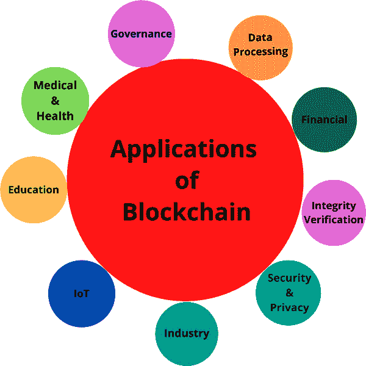
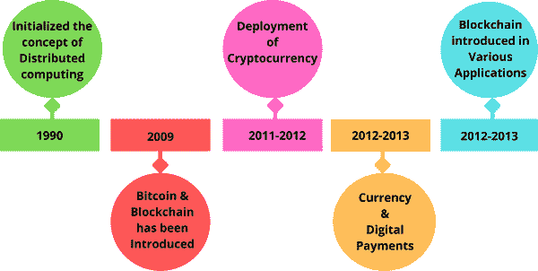
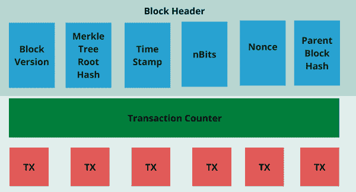
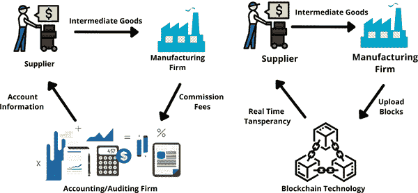
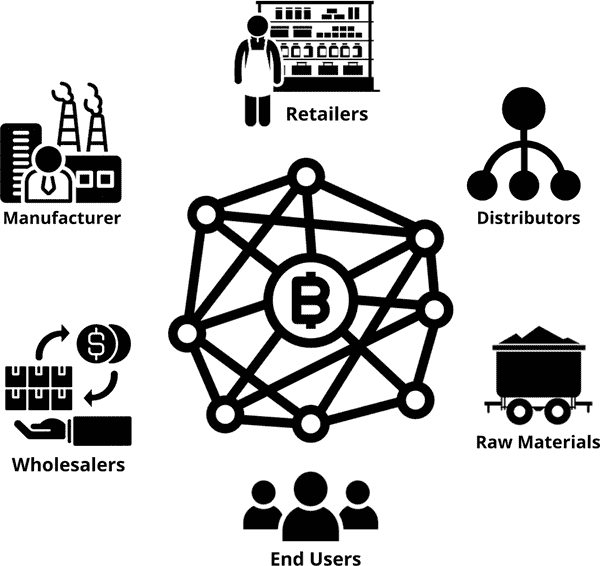

# 第一章

# 制造业和物流业中区块链的需求、作用和影响

+   Renjith V. Ravi

    ]

    印度 MEA 工程学院

+   Mangesh M. Ghonge

    ]

    印度 Sandip 技术与研究学院

+   P. Febina Beevi

    印度 MEA 工程学院

+   Rafael Kunst

    巴西 Rio dos Sinos 河谷大学

摘要

最近，区块链技术已经成为学术界和工业界议程的重要议题，这是因为它们在各个领域都具有潜在的优势。这是由于它们在解决目前阻碍不同工业部门进展的许多问题方面具有实用技能。这些问题包括安全地捕获和交换交易数据，创建自动化和高效的供应链程序，以及改善整个价值链的透明度。区块链提供了一种有效的方法来解决这些问题，即使用分布式、共享、安全和许可的交易分类帐。本章讨论了区块链技术在制造业和物流领域的应用。研究表明，在不同的工业部门中使用区块链技术有许多可能性；然而，在完全使用该技术之前，必须解决一些障碍。本章还涵盖了在工业和物流部门使用区块链时遇到的案例研究和困难。

引言

区块链为商业和工业领域引入了新的复杂功能。许多现有的商业和工业流程可以从这些功能中受益，这些功能可以帮助它们改进、优化、保护和简化其操作。它们还可以促进新的商业模式的发展，这些商业模式在几年前是难以实现的。这些新的商业模式影响了许多行业，包括银行业、医疗保健、制造业和物流业。尽管互联网已经帮助创建了许多当今的商业和服务模式，但安全注册和确保不同方之间的商业交易始终存在问题。公司和个人现在可以通过区块链的出现记录和保存他们签署的合同。

区块链使用各种方法在用户（组织、企业、个人、软件代理等）之间维护分布式分类账。其内容得到了所有相关方的同意。所有交易都是安全的，一旦被添加就无法更改。它还能够进行全面的交易监控、测量和追踪。在没有管理机构的情况下，区块链允许一组公司就特定交易达成一致意见并记录下这一协议。区块链可用于记录、保护和传达它们达成的协议行动。从一个成员到另一个成员的现金交易，购买行为，投票参与或患者的医学实验室测试记录都是经过同意的活动的例子。多个参与某项工作的各方、合同协议以及供应链物流只是此类操作的几个例子。

区块链技术结合了点对点网络的特点和优点以及加密技术，以确保完成的协议是合法的。未经其他参与组织的参与，不得更改任何已批准或已注册的活动。这种功能非常适合在各个地方的一组组织之间促进其他商业协议。除了保留事件顺序之外，区块链还可以保证随时间记录的交易的准确性。几乎不可能伪造记录或拒绝协议，因为没有人可以独立更改任何记录的交易。因此，许多行业和公司正在考虑采用区块链，并正在进行更多的研究以成功地在这些领域使用区块链。

对于商业和工业界来说，区块链引入了额外的高级功能（Nakamoto，2008）。许多现有的商业和工业流程可以从这些功能中受益，通过改进、优化、保护和简化它们。它们还可以促进以前难以开发的新业务模式的发展。这些创新的业务模式影响到金融、医疗保健、制造业和物流等领域。尽管互联网对当今许多商业和服务模式的发展做出了贡献，但人们仍然担心如何安全地注册并保证商业交易中涉及的众多各方之间的协议。随着区块链技术的出现，企业和个人现在可以记录并保留彼此之间的交易协议。区块链技术的典型应用如图 1 所示。

| 图 1\. 区块链技术的典型应用（Casino、Dasaklis 和 Patsakis，2019） |
| --- |
|  |

区块链技术，预示着分布式信息技术新时代的开始，是一项改变生活的发明。其实用性远远超出数字货币和金融资产，因为它是作为比特币基本设计的一部分在 2008 年创造的（中本聪，2008 年）。这项技术仍处于萌芽阶段，尚未被普通大众或企业采用。随着近年来技术的兴起，已经出现了许多改进、新的应用案例和应用（Bogart & Rice，2015）。区块链应用的可能性是无限的，从数字货币到区块链启用的法律合同（Buterin & others，2014），最有前景的应用仍在研究中。

区块链使用各种技术在用户之间建立共享账本，如组织、企业、个人、软件代理等。其内容已经得到所有参与方的一致同意。所有交易都是安全的，一旦输入就无法更改。它还允许准确地跟踪、测量和追踪交易。在没有管理机构的情况下，区块链允许各方就特定活动达成一致并记录下来。区块链技术有潜力用于记录、保护和传输达成一致的行动。会员之间的现金交易、购买活动、投票活动或患者的医学实验室测试输入都是达成一致的活动的例子。多方项目的协作、合同谈判和供应链物流是其他活动的一部分。为了保证已完成协议的有效性，区块链技术通过密码技术使对等网络受益。未经其他参与实体的参与，没有经授权和注册的行动可以被改变。这种功能对于促进来自不同地点的一组公司之间的其他商业协议是理想的。此外，除了保留事件顺序之外，区块链还可以验证随时间记录的交易的准确性。因此，几乎很难伪造记录或拒绝协议，因为没有人可以独立修改任何记录的交易。因此，许多部门和组织正在考虑采用区块链，并正在进行更多的研究，以成功地在这些领域使用区块链。

本研究调查了区块链在许多领域的应用。内容包括对区块链在工业中的应用的回顾，以及其优点和缺点。金融、医疗保健、物流、制造业、能源、农业和食品、机器人技术、娱乐以及其他工业领域都是其中涉及的应用领域。文章还讨论了在工业应用中使用区块链的基本标准和一些未解决的挑战。

区块链的历史

鉴于区块链对从银行业到制造业和教育等各行业的影响，区块链技术必须是 21 世纪最伟大的创新之一（Iredale，2020）。许多人不知道区块链可以追溯到上世纪 90 年代初。

Stuart Haber 和 W. Scott Stornetta 于 1991 年提出了区块链的概念。他们最初的目标是建立一个具有密码学安全性的区块链，以确保没有人能篡改文档上的时间戳。Merkle 树于 1992 年被添加到他们的系统中，提高了效率，并使他们能够在一个单一块上存储更多的文档。然而，由于一个名为 Satoshi Nakamoto 的个人或组织的努力，区块链历史开始在 2008 年开始变得重要。区块链技术被认为是由 Satoshi Nakamoto 作为其幕后智慧的。人们认为中本聪可能是在比特币上工作的一个人或一组人，这是数字账本技术的首次应用，但对他的了解甚少（Rathee, 2020）。图 2 描述了从 1990 年代到 2018 年的区块链技术的历史。

| 图 2. 区块链的历史（Atlam & Wills, 2019） |
| --- |
|  |

中本聪于 2008 年发明了第一个区块链，此后该技术发展并在加密货币之外找到了应用。2009 年，中本聪发表了有关该技术的第一篇白皮书（Iredale, 2020）。在白皮书中，他解释了由于去中心化组件而使得该技术特别适合加强数字信任，这意味着没有人能够控制任何事情。数字账本技术自中本聪退出并将比特币开发交给其他核心开发者后已经发展，导致了更多应用程序的出现，这构成了区块链的发展历史。

区块链技术概述

区块链是一个不断增长的链接文档集合，称为区块，使用加密技术（Bogart & Rice, 2015）链接和保护。从一个区块到下一个区块建立的连接是这个列表有效性的关键，使得一旦将区块放入列表就不可能更改任何区块。因此，“区块链”一词的由来实质上是一系列数据块。该列表是一个受密码保护的在线注册表，用于记录各个公司或组织之间达成的并已完成的交易。金融、商业、工业和系统运作都是产生记录交易的活动示例。交易区块通常带有时间戳、加密并且在许多位置复制，它们是不可更改的。

区块链可以通过连接个人或公司通过网络来记录某些交易（活动）。组的成员通常可以查看先前记录的交易，但没有人可以编辑或删除它们。因此，区块链保留了组织行动的不可变记录。这一历史记录与整个或部分组织共享。所有记录的交易都具有很高的可追溯性和透明度，任何涉及的人都可以查看它们。然而，确保这些记录（或块）不能被创建它们的组内任何人，也不能被其他任何人更改。组对交易之间的逻辑关系达成一致，但由于它们是不可逆转的，因此更改它们是困难的。

区块链技术最显著的一个方面是，它允许两个或多个组织在像互联网这样的公共网络上安全记录一项特定行为的协议，而无需第三方如持牌公司或政府机构的参与。参与方可能互不相识，他们绝对不会彼此信任。他们仍然可以达成一致，记录交易，并将其添加到链上。因此，当协议附加到链上时，任何一方都不能更改、取消或否认协议的记录。通过一种称为挖矿的过程，确保了添加到链上的执行协议的真实性和完整性。在区块链引入之前，这一关键功能是不可访问的。因此，区块链是支持事务互联网（Abeyratne & Monfared, 2016），（Mainelli & Milne, 2016）的最重要的促进者，并且需要支持广泛的工业应用。

区块链是一种发展中的技术，最初用于比特币领域（Chuen, 2015），但它具有广泛的工业用途，其中一些我们将在本文中进行检验和探索。IBM 坚信区块链在更广泛的商业和工业领域的潜力，大量投资于该领域并开发各种改进和应用（Abeyratne & Monfared, 2016）。在我们深入研究这些应用程序的具体细节之前，我们将介绍区块链的基本特征和功能，这些是研究过的工业应用的主要促进因素。

近年来，分布式账本技术（DLT）引起了广泛关注。DLT 是一种分散、安全、透明的数据存储和传输系统，不依赖于中心化的可信第三方。分布式账本是由许多节点的点对点网络维护的分散数据库。每个节点验证并复制账本。DLT 的一种是区块链。在区块链上，数据被分成区块，并通过一个仅追加的结构连接。最常见的 DLT 数据结构是基于链的区块结构，尽管它远非唯一。DLT 可以使用其他数据结构来实现，例如有向无环图（DAG）。

BlockDAG 和 Transaction DAG 是基于 DAG 的 DLT（TDAG）的两种类型。BlockDAG 结构是一个 DAG，其中每个区块可能指向许多先前的区块。两个示例是 BlockDAG 系统（Lewenberg, Sompolinsky, & Zohar, 2015）和 Spectre（Sompolinsky, Lewenberg, & & Zohar, 2016）。在基于 TDAG 的 DLT 中，交易立即添加到图中，从而创建了一个交易图。因此，每个交易都指向许多先前的交易。两种典型的 TDAG 系统是 IOTA（Xie 等，2019）和 Byteball（Xie 等，2019）。因为区块链是最常用的分布式账本系统，我们将在本文中重点关注它。

区块链系统有三种类型：私有区块链、公共区块链和联盟区块链（Cui 等人，2017）。联盟和私有区块链都是许可制的，而公共区块链是无需许可的。在公共区块链上，任何人都可以加入网络，参与共识过程，阅读和发送交易，并跟踪共享账本。无需许可的区块链系统被大多数加密货币和开源区块链平台所使用。比特币（Li 等人，2010）和以太坊（Steiner，Baker，Wood 和 Meiklejohn，2015）是两个最著名的公共区块链平台。比特币的创造者是最著名的加密货币，它于 2008 年开发。另一个著名的公共区块链示例是以太坊，它使用图灵完备的智能合约编程语言来允许大型去中心化应用。

区块链的架构

就像传统的公共账本（Chuen，2015）一样，区块链（Zheng Z.，Xie，Dai，Chen 和 Wang，2018）（Zheng Z.，Xie，Dai，Chen 和 Wang，2017）是包含完整交易记录列表的一系列区块。区块链如图 1 所示为例。如果区块头包含最后一个区块哈希，则一个区块只有一个父区块。叔区块的哈希（区块的前任的子区块）也将记录在以太坊区块链上。创世区块是区块链中的初始区块，它没有父区块。该架构如图 3 所示。

| 图 3。区块链示例由一系列连续的区块组成。（Zheng Z.，Xie，Dai，Chen 和 Wang，2018），（Zheng Z.，Xie，Dai，Chen 和 Wang，2017） |
| --- |
|  |

区块

如图 4 所示，一个区块由一个区块头和一个区块体组成。特别是，区块头包含以下信息：

| 图 4. 区块结构（郑某、谢某、戴某、陈某、王某，2018）（郑某、谢某、戴某、陈某、王某，2017） |
| --- |
|  |

区块版本：区块版本指定应使用哪组区块验证标准。

Merkle 树根哈希：区块中所有交易哈希值的总和。

时间戳：自 1970 年 1 月 1 日以来，当前时间以世界协调时间的秒数表示。

nBits: 一个有效的区块哈希目标阈值。

Nonce：一个 4 字节字段，通常以 0 开头，并在每次哈希计算中递增（将在第 III 节详细说明）。

父区块哈希：指向上一个区块的 256 位哈希值。

区块体由计数器和交易组成。可以包含在一个区块中的交易的最大数量取决于区块的大小和尺寸。为了验证交易，区块链采用了一种非对称加密机制。在不可靠的情况下，使用非对称加密创建数字签名。

制造业中的区块链

制造业正朝着智能制造和自动化/自动化流程取得重大进展，区块链可能以各种方式帮助。例如，我们之前提到的物流管理是一个重要话题。物流管理对于每家公司来说都至关重要，以确保公平定价和及时交付原材料和物资用于其运营。它还有助于有效及时地分发商品以满足消费者的需求。使用区块链进行工业物流管理可能会减少时间延误、管理费用和人为错误，就像其他任何物流管理程序一样（Buterin 等人，2014）。因此，企业可以降低生产成本，同时变得更加灵活和竞争力强。

另外，区块链可以用于促进制造企业社会网络（SMNs）的社会生产资源的高效、公平和安全共享和利用。社会制造是一种快速发展的生产过程和商业活动，旨在向消费者提供更个性化的商品和服务。利用这种技术，制造业企业可能能够提高竞争力。当多个制造企业合作共享其社会制造资源并为所有成员共同利益创建社会制造网络时，这种技术的成功可能会增加。在这个网络中拥有更多的社会制造资源，制造企业可以生产出更精确、更专业的商品，满足消费者独特的需求（Ding、Jiang、Leng 和 Cao，2016）。

然而，这种合作网络中始终存在着对安全性、公平性和效率性的高度关注。其中一种方法在（Liu、Jiang 和 Leng，2017）中描述，Liu 等人开发了基于区块链的产品信用机制（PCM），以安全、公平和有效地管理其社会制造网络中的跨企业合作伙伴关系。这种管理通过智能合约和信用系统，以点对点的方式完成，不涉及第三方的参与。

区块链技术有巨大潜力支持云制造。云制造是一种将云计算、物联网（IoT）、SOA 和虚拟化结合起来，将制造资源和过程转化为一组数字化链接和管理的制造服务网络的新型制造范式（Li 等，2010）。在这方面，区块链技术应该能够支持开发安全的去中心化云制造架构（Barenji，Li 和 Wang，2018）以及用于制造设计信息的安全交换，例如注塑模的创建和重新设计（Li，Liu，Barenji 和 Wang，2018）。

区块链的另一个用途是改进增材制造中的版权和防伪程序。例如，肯尼迪等人（肯尼迪等，2017）设计了一种物理防伪检测方法，可用于验证 3D 打印组件的有效性和质量。在这种方法中，纳米材料化学特征被应用于这些组件，并且它们的来源使用基于它们的许多纳米材料化学特征的区块链进行验证。

利用区块链验证生产组件的真实性的主要好处之一是，它允许更健康的制造供应链，并减少了使用假冒零部件的风险（Holland，Nigischer 和 Stjepandić，2017）。此外，每个零件在被用于构建其他商品之前都可以通过自动化程序进行认证。

创世纪的事物正在研发一种结合了 3D 打印、区块链和物联网的平台，以创建更先进的制造流程。这通过减少 3D 打印产生的定制品和自动化各种制造和相关操作来实现更有效的定制化。另一个优点是能够安全地在合作公司之间传递和共享制造数据。在这些情况下，数据必须受到保护、跟踪和监管，以确保适当的访问并防止未经授权的修改或篡改。

区块链技术对制造业的影响

区块链可以用于改善其他新兴技术，也可以改变基本的业务运作，正如我们所知，这将促进制造业的发展（Xcube，2020）。例如，区块链固有的开放性在每个生产过程中都为利益相关者建立了信任，从原材料采购到现场操作再到向客户分发最终产品。因此，您可以改进诸如：

+   • 合同起草和实施

+   • 供应链监控

+   • 发现伪造

+   • 知识产权管理

+   • 资产跟踪和监控

+   • 库存管理

+   • 质量控制

+   • 遵守法规

区块链技术可以通过简化各种业务流程来加速公司的上市时间。由于区块链应用程序的应用，供应商订单准确性、产品质量和交付率都得到了改善，从而提高了客户满意度和收入。

| 图 5\. 使用区块链时制造企业的验证成本的消除（Ko，Lee 和 Ryu，2018） |
| --- |
|  |

在制造业中使用区块链的优势

虽然区块链是为了实现比特币交易而创建的，但其基础技术是通用的。以下是区块链技术如何帮助制造业的几个示例：

降低行政开支和减少进入壁垒

区块链可以大幅降低运营制造业所涉及的一般开支，降低进入壁垒。基于区块链的“设备即服务”（MaaaS）是一个商业概念，允许制造商支付使用的设备的产出，而不是机器本身，从而降低开支。通过使用这种商业模式，新的制造商和设计师可以在没有重大启动成本的情况下出售他们的产品（Xcube，2020）。智能合约自动化了从采购到付款等不同业务流程，这些流程通常需要团队成员的时间和精力，而这些资源可能在其他地方得到更好的利用。图 5 展示了制造业中消除验证成本的一个模型。

稳定性和弹性

由于 COVID-19，制造商在过去一年一直关注业务连续性和弹性。虽然没有一个全球流行病的“治愈”方法，但区块链是帮助制造公司发展韧性的绝佳途径。

区块链的去中心化至关重要，因为它包括一个对所有网络参与者可见的分布式账本。这意味着即使其中一个节点失败或其中一个方离开网络，区块链也将继续正常运作（Xcube，2020）。因此，致力于强大商业模式的制造公司将从区块链技术提供的稳定性中受益。

提高透明度和信任

区块链是企业在许多利益相关者之间建立信任的优秀工具。分布式目录包括信息的单一、不可更改版本，始终可供所有网络参与者使用（Xcube，2020 年）。此外，网络必须验证每笔交易或修改以增强其可信度。

提高的安全性

用于巩固系统安全性的复杂加密代码是区块链特殊之处的一部分。区块链的透明度必须与每笔交易的密码签名要求相平衡，以提高防篡改性（Xcube，2020 年）。网络的存储也是分散的，从而降低了网络安全风险和数据风险。

制造业中的区块链应用

区块链是一种多功能技术，在各种行业的各种操作中被广泛使用。以下是一些制造业中如何利用它的示例。

供应链管理

供应链管理是企业面临的最重要的工作之一，区块链技术被用来协助解决这个问题。区块链提高了许多公司的跟踪功能，以确定在以前和现在的情况下使用的材料、部件和产品的位置（Xcube，2020 年）。区块链提供明确的端到端路线，增加了组件和产品的可追溯性，并确保正确性，减少了生产过程中的错误。

智能合约

区块链技术实现的智能合约正在制造业中证明其改变游戏规则的作用。智能合约不是纸质合同或不稳定的数字副本，而是作为区块链上的计算机程序存在。智能合约包含了区块链技术的所有优点：它是不可变的，并且随时可供所有利益相关者访问。

智能合同自动化原本复杂的商业流程的能力是其安全性的一个优势（Xcube，2020）。存储在区块链上的条款和条件中的数据可用于管理库存、监控供应链、安排和执行付款等。

自动化以前手动完成的流程节省了时间、精力和金钱。员工的技能可以通过智能合同更好地为公司的目标服务。

车间地板操作

车间地板可能是任何制造业操作中最重要的部分，也是最难优化的部分之一。区块链正被用于改进车间地板操作。例如，区块链应用程序被用来监测和报告特定设备的健康状况，为操作人员提供可能有助于他们计划维护而不是依赖昂贵的紧急维修的数据（Xcube，2020）。通过一种称为机器控制维护的技术，区块链可能被用于自动化设备维护。制造商与第三方维修人员合作安装共享软件，包括区块链系统，通过设备的数字副本监控设备。无需任何人为干预，区块链监控可识别计划维护何时需要，生成服务请求，购买设备所需的任何部件，并在订单完成后处理付款。

质量控制和法规合规性

区块链技术固有的安全性以及监测数据单一版本的能力使其成为制造业质量控制和监管合规性的理想选择。机器级别的监控和材料和零部件的准确追踪精简了质量控制流程，减少了错误（Xcube，2020）。因此，召回的商品减少了，浪费减少了，总收入增加了。

此外，区块链账本创建了关于设备、流程、材料和其他事物的数据的不可变记录。内部审计员可以利用这些记录来验证场地是否安全，以及是否遵守规定。这些日志也可以作为外部检查时的合规证据。

制造业中的区块链潜力

该领域的许多以创新为驱动的企业认识到通过区块链发展在许多过程中存在可大幅改进的潜力（Xcube，2020）。49%的人认为区块链可以提高对当前和未来法规的遵从性，31%的人表示区块链可以改善新领域的产品销售，28%的人认为区块链可以降低产品召回风险。

无论是供应商、采购、采购、库存和生产，区块链都提供了一种新的业务方法，并且是不同工业活动的一种扰动性解决方案。随着制造业区块链越来越广泛地被接受，专家预计区块链的使用在生产中可能会记录大约 78%的 AGR 增长率。

区块链在制造业中的使用案例

制造业部门占全球 GDP 的 17%，长期以来一直在与质量控制、低效率和其他问题作斗争。通过在生产的各个方面提供见解，区块链可以彻底改变它（Xcube，2020）。以下是区块链技术在制造业中可能应用的一些示例：

跟踪和可追溯性得到提升

IoT 技术驱动的系统可以监控制造组件从制造点到零售目的地的来源，提高了价值链中所有参与方的透明度和可追溯性。IoT 传感器数据可以输入到区块链中，以便在产品在供应链中移动时，所有参与方都有一个共同的视角，没有处理产品的漏洞（Xcube，2020）。区块链实施可以极大地增强许多涉及的程序，如文件处理、证书获取、时间戳和质量检查。

产品采购的高效率

低效的产品采购一直是公司财务损失的主要原因之一。由于其复杂的供应链，组织往往面临风险和不受欢迎的成本（Xcube，2020）。公司可以利用区块链技术简化和自动化其供应链，并加快采购流程，包括订购产品和支付流程。

更好的支付流程

制造商经常遇到延迟付款和支付流程缺乏透明度的问题，因为许多参与方参与确认和发放付款（Xcube，2020）。支付在整个供应链的不同环节被阻止。区块链的智能合约功能自动化了支付流程，并保证向供应商提供更快速、更可靠的付款。

高效的库存管理

由于区块链允许您与供应链的每个参与者-供应商、分销商，甚至零售商（Xcube，2020）建立连接，因此网络中的每个人都可以查看数据。这意味着每个人都拥有信息的副本，减少了供应链中的误解数量。这使得库存规划和管理变得更容易。

增加了消费者的参与度

可以检查并利用区块链数据集进行预测和预测，减少供应链延迟，并通过保证产品来源和制造过程透明度来改善客户体验。例如，杂货店可以向消费者提供特定信息，例如证明食品是有机生产的供应来源（Xcube，2020）。共享这些信息促进透明度，从而导致消费者忠诚度和长期关系的建立。

更好的数据安全性

使用传统方法在任何供应链中传递信息，例如发票和合同数据，可能非常危险。这就是区块链介入的地方，它使用最先进的加密方法来保护数据（Xcube，2020）。由于信息块只是与前一个块连接的文档的按时间顺序存储的副本，因此被黑客攻击的风险被消除了。

对供应商的支付是自动进行的

区块链使全球任何地方的付款人和收款人之间直接、迅速、安全地转移资金成为可能。甚至不再需要等待一个小时——就是这么简单（Xcube，2020）。一旦数字安全交易数据包含在区块链协议中并且您的网络同意了条款和条件，智能合约就会启动付款流程。

供应链可靠性

制造商非常重视他们购买的供应品质。知名供应商越来越希望获得品牌的文件化和认可。在区块链技术的协助下，制造商可以获取有关供应商的信息，以确保他们收到的正是他们购买的物品，并且这些物品状态良好，没有任何问题（Xcube，2020）。智能合约的实施还确保了标准，保护了知识产权，并且允许安全付款。

制造工厂和区块链

为了计划维护，一些工业设施已经使用了物联网和机器学习。当与区块链技术结合时，机器零部件寿命的数据可以被收集并保存在区块链网络中，然后智能机器可以定期购买和支付替换零件。当设备故障并且零件必须手动购买时，这将最小化停机时间，使预测性维护更加有效（Xcube，2020）。制造商可以利用区块链网络存储其数据，并将其企业资源计划（ERP）系统连接到供应商的系统上。

保修管理

假索赔、欺诈商品、涉及保障范围的误解以及其他问题困扰着企业关于保修管理的问题（Xcube，2020）。制造商必须采取措施来避免欺诈、节省费用，并提供更好的消费者体验。

通过弥合制造商、保修提供商和其他供应链参与者之间的信息鸿沟，并保护责任链，区块链可以帮助加速保修生命周期，确保没有假冒品进入供应链，并且没有提交欺诈性索赔。

公司如何在制造业中使用区块链？

一些企业已经开始调查区块链可能用于解决全球制造商遇到的许多问题的可能用例（Xcube，2020）。

+   • 三星电子开发了一个分布式分类账系统，以监控海外货物运输并节省 20%的运输费用。根据彭博社的一篇文章，基于区块链的系统将使公司能够节省诸如货运文件等成本，并对市场变化做出更迅速的反应。

+   • IBM 区块链项目鼓励供应链的开放和责任。航运和物流利益相关者可以利用共享分类账，随着过程的进行而自动更新过程，增加整个供应链网络的信心，并建立一个可靠的合作平台。

+   • 为了提高增材制造的安全性，美国空军与区块链服务公司 SIMBA Chain 合作。美国海军部门利用区块链来管理其 3D 打印机。

+   • 全球最大的集装箱运输公司 MAERSK 正在使用区块链技术来分享事件数据，并在工业供应链中管理文件流程。

+   • 美国银行和美国万事达卡公司正在使用区块链技术，并拥有与区块链相关的 48 项专利和申请。

物流行业

软件解决方案可以协调生产者/销售商和消费者目的地之间的原材料、商品和服务，这些解决方案被称为物流管理应用程序。这些应用程序可能都属于同一个组织，也可能分散在各种组织和实体之间。这些应用程序可以从区块链的强有力支持中受益。在物流管理中的一个困难是许多企业参与到操作中。由各种企业进行的许多协调的子活动，如制造商、仓储公司、航运公司和常规机构，也可能包括在内。任何物流管理程序都必须具备一套功能，用于计划、调度、协调、监控和验证完成的任务。通过使用区块链的共享分布式分类帐来验证、记录和审计物流交易，可以有效减少时间延迟、行政成本和人为错误。

此外，使用智能合约将使企业更容易达成协议并更快、更便宜地建立约束性合同。由于这些优势，预计区块链将对物流行业产生重大影响（Hackius & Petersen, 2017）。许多初创企业在这一领域提供基于区块链的物流管理系统和应用程序。例如，Provenance（Steiner、Baker、Wood 和 Meiklejohn，2015）是一个追溯系统，连接了客户和供应商进行各种物流操作。Hijro 是另一个例子，提供了一个全球供应链管理的应用平台。

物流业受益于区块链

现代商业的最重要方面之一是物流。它确保货物以最短的时间、最低的成本和最少的损坏到达目的地。简而言之，它涉及规划和执行复杂的程序，将产品从一个地点移动到另一个地点（通常从起点到消费地点）。图 6 显示了区块链在供应链中的角色。

| 图 6. 供应链角色（参与者）与区块链分布式分类账技术的互动（Litke、Anagnostopoulos 和 Varvarigou，2019） |
| --- |
|  |

当前物流业规模庞大！仅在 2020 年，美国就产生了 7917 亿美元的收入。从统计数据来看，这是令人震惊的，这使得物流行业成为世界上最复杂的行业之一（Blockchains，2020）。

区块链技术创建了一个分散的网络，其中同行可以在不依赖中央机构的情况下连接和交易。不可变性、透明度和安全性只是其分散性特点的几个优点。此外，它非常适合物流行业。

由于区块上的交易数据无法更改或伪造，交易数据非常可靠。您还可以通过使用可以在特定情况下自动执行交易的智能合约大幅提高工作速度。区块链技术正在被用来在需要大量文书工作的物流行业进行创新。

丹麦航运公司 MAERSK Line 在 2016 年进行了区块链概念验证，估计如果使用区块链将产品从东非运送到欧洲，运输成本可以减少 20%。区块链不仅仅是一种新技术；它预计将在帮助物流公司保持稳定增长方面发挥重要作用。因此，必须就区块链技术在物流行业中的角色进行讨论（Thistlethwaite, 2018）。

在将原材料或成品交付给消费者时，涉及到物流的多个利益相关者。为了保证交易的可信度，所有物流交易都是用大量的文件进行的。在全球商业活动中，通常使用传统的贸易文件，而在面对面的交易中，由于买方在看到货物后支付，通常不存在信任问题。

因为全球贸易交易完全依赖于记录，风险通常是巨大的，因为你永远不知道对方是否会交付货物，或者进口商是否会支付你。此外，当全球贸易需要质量保证文件时，这些文件可能被更改或伪造（Thistlethwaite, 2018）。除非电话或发送电子邮件，否则无法实时了解对方正在进行的任务或程序。然而，区块链技术确保区块上的交易数据不受欺诈或篡改，从而产生了一个可信赖的生态系统。

区块链预计将在未来引起物流领域的范式转变。它将加快交易验证过程，并通过促进参与者之间的相互信任来帮助货物和服务的供应。这个程序在物流中完全实施可能需要很多年。

物流中区块链的应用案例

区块链物流有许多应用。让我们看看五种区块链物流用途，以便更好地了解区块链技术的物流优势（Blockchains, 2020）。

更好的货运跟踪

在物流系统和供应链中使用区块链可能会更容易追踪货物。目前，同日和即时交付正在增长（Blockchains, 2020）。因此，这可能迅速成为物流公司的一种压力，因为他们无法满足这些不断增长的需求。

许多卡车公司正试图投资于更先进的跟踪技术；然而，这些系统的安全性存在疑问。

此外，这些系统缺乏安全的身份验证程序。因此，黑客或不良行为者始终可以利用网络的数据（Blockchains, 2020）。区块链有改变这种情况的潜力。由于区块链提供了适当的验证路径，因此没有人可以篡改数据。此外，由于您可以实时跟踪所有交付并监控它们，这可能有助于物流部门提供更好的客户体验。

提升货运流程效率

区块链将增强物流的第一个领域是货运和运费。简言之，它可以用于提升国际和本地交付流程（Blockchains, 2020）。它还将鼓励他们增加产品数量和流程效率。

Maersk 认识到区块链的价值，并已将其纳入到其程序和运营中。他们是世界上最大的集装箱运输公司之一（Blockchains, 2020）。最终目标是通过与其他机构合作尽可能密切地监控货物。IBM 和 Maersk 还在合作以加强全球商业基础设施。

为物联网设备提供安全性以提高效率

许多公司现在使用物联网传感器来跟踪库存并保证质量的稳定。然而，这些物联网设备易受攻击，因为它们依赖云服务器进行通讯（Blockchains, 2020）。因此，物流和供应链中的区块链可以保护这些物联网设备，同时监控它们产生的所有数据。它还可以帮助分析和分类这些设备产生的所有数据，以进行商业策略的改变。

更好的透明度

透明度是区块链的最重要特征之一。当正确部署时，供应链的区块链提供更多开放性，影响了物流的透明度（Blockchains, 2020）。它允许企业之间更加信任彼此。更多开放性、更少的劳工剥削和更低的审计费用将导致更少的计费纠纷。

除了消费者以外，由于其增加的信任和诚信，B2B 行业正在蓬勃发展。由于信任，审计费用、发票纠纷和其他形式的冲突将会显著减少，甚至完全消除。

公司已经在提高透明度方面进行投资（Blockchains, 2020）。其中一家公司是 Provenance，他们进行了一个案例研究，以探讨如何利用区块链，包括供应链，可以提高物流要素。

库存跟踪

库存管理是一项艰巨的任务。公司投入了大量资金来使其完美和高效（Blockchains，2020 年）。即便如此，它仍然存在许多问题。因此，库存监控是该行业的主要关注点之一。公司花费数百万美元来处理它。区块链技术可以通过允许企业在宏观和微观水平上控制其商品来帮助解决该问题。例如，公司可以通过密切监控来密切关注物流。 IBM 的基于区块链的技术就是一个例子。它允许企业在整个交易过程中监控和报告食品产品（Blockchains，2020 年）。像雀巢、沃尔玛、联合利华等大公司已经加入了这一倡议，并协助实现最佳结果。最终用户将受益最多，因为他们将始终获得新鲜、即食的食品。这是该行业企业区块链用例的最佳示例之一。

解决纠纷

区块链在物流中的另一个用途是解决货物运输纠纷。货物运输容易发生争议（Blockchains，2020 年）。如果货物丢失或迟到，可能会发生这种情况。纠纷难以解决，可能需要数周时间。所有这些都需要企业投入额外的资源。

借助不可变数据和实时货物信息，区块链可以帮助更快地解决冲突（Blockchains，2020 年）。多亏了自动化和可靠数据，许多冲突可以在几分钟内解决。它还帮助企业解决消费者投诉。

发票和付款

最后，通过一个有效和受保护的系统，区块链可以帮助提高发票和付款的效率。在大规模进行时，发票可能成为一个重大问题（Blockchains，2020 年）。因此，您会遇到高效的发票和付款方法。

企业可以使用智能合约自动化整个流程，使其无误差和清晰。由于这一点，发票和付款将更加高效。

物流中的区块链：实施挑战

企业必须克服许多障碍才能采用区块链。以下是一些困难。以下是一些困难（Blockchains，2020）。

+   ▪ 不同的数据存储模型应用：为了在区块链上合作，不是所有企业或系统都使用相同的数据模型。

+   ▪ 在当前 IT 环境中嵌入区块链技术：将区块链整合到当前 IT 环境中始终是困难的。

+   ▪ 演变中的区块链技术：与区块链合作是最后的障碍。区块链是一项相对年轻且快速发展的技术。如今实施区块链将导致未来实施困难。

+   ▪ 信息流动：物流中另一个重要问题是控制各个组织之间的信息流动。当交易跨国时，程序变得更加复杂，因为涉及到额外的实体。

区块链如何改善物流

效率

区块链技术有能力改变运输和货运处理方式。区块链有潜力通过有效监控货物来增强交付流程，提高物流企业的效率。为了创建高效的物流系统，必须在国际上开放合作，以确保并优化伙伴之间的产品交付，同时保护信息和财务活动（Scand，2020）。由于行业的竞争性特质、非标准化流程、数据孤岛和不同程度的技术进步，物流的透明度和碎片化结构较差。

区块链有潜力通过简化行政程序来提高全球贸易效率。多方参与和大量的文书工作可以通过自动化程序来消除，该程序提供了一个系统化的方法来监控产品生命周期，从其起源到商店货架，同时也使所有权转移之间的生产者、零售商和购买者之间的所有权转移成为可能。

安全

因为当前系统是集中化的，一旦恶意攻击者获得访问权限，他们可能会完全控制系统。系统内保存的任何数据都可能被这样的入侵者篡改或删除。

区块链网络中没有对整个系统的中央控制权（Scand，2020）。然而，与其他竞争解决方案不同，区块链提供了更高级别的安全性，因为没有第三方可以更改链中记录的数据。此外，区块链网络可以使用加密安全方法使黑客攻击数据链变得极其困难。

透明度

区块链提高了安全性和透明度。它允许公司监视和记录所有变更，包括什么被改变、为什么要改变、谁做出了变更以及何时做出了变更（Scand，2020）。此外，由于链上的每个实体使用相同的账本版本，因此对于链上交易不存在误解，交易过程变得更加高效。

在产品交付并数字智能合约签署后，数据将被记录在公共分类帐上。数据保存有关创建者和创建时间的信息，不可能更改。由于可以访问此分类帐，企业可以随时跟踪产品并确定谁拥有它们（Scand，2020）。一旦物品交付并执行数字智能合约，数据将记录在公共分类帐上。有关制作者和制作时间的信息得以保留，因此几乎不可能更改。有权访问此分类帐的公司可以跟踪货物并查看谁拥有它们。

实时资产跟踪和库存管理

区块链技术可以与物联网和基于移动技术结合，建立实时交付监控系统。不再需要手动跟踪，而是电子传感器可以从供应链的开始到结束监控货物。物流公司可以利用区块链和物联网缩短交货时间，提高物流行业的透明度，并密切关注所运输的货物（Scand，2020）。此外，附加在货物或物体上的小型传感器可以帮助组织保持准确和最新的库存。这种“智能”库存可以提供有关货物的大量信息，例如它们的先前位置、它们在设施中存放的时间长度等。利用物联网传感器可以简化详细的库存审计，降低丢失货物、存储不正确和其他影响总利润的问题的风险。

智能合约

每天有 $1400 亿被锁定在交通支付问题中。完整结算一张发票平均需要 42 天的时间，这是一种浪费时间和金钱。智能合约是一种基于区块链的技术，能够自动化供应链法律约束协议。智能合约允许企业跟踪物流流程中的各个阶段，并强制执行交易的预先确定标准，降低了对方未能履行协议的机会（Scand, 2020）。对于让小型和不太知名的企业，比如初创企业，进入供应链行业而不需要先前的声誉或推荐，这尤其有用。通过确保透明度，智能合约可能有助于缓解这个问题。

性能历史监控

运输公司和供应商的业绩历史可以使用区块链进行跟踪。此外，公司可以分析车队中各辆车的表现以及过去的运输商表现，比如准时提货和交付等等（Scand, 2020）。这些信息有助于更好的决策，从而改善供应链。企业可以利用重要数据创建更快的路线，并消除运输过程中不必要的阶段。

结论

我们只涵盖了制造业中的一些区块链使用场景。这项技术仍然远未被广泛采用，并且存在诸多障碍，比如行业标准等等。然而，有一件事是，区块链可能会改变制造商的业务方式。那种缓慢、不安全、手动的系统正在被革命性地转变为在单一平台上运行的数字化、安全、快速和自动化的网络。在流程变革、资金转移、供应链监控、担保管理等方面，我们可能会预见到更多的区块链，直到我们最终看到一个完整的、去中心化的制造系统。尽管我们现在主要看到区块链革命在白皮书和论文中发生，但随着越来越多的公司试点他们的使用案例来颠覆制造业，我们可以确信，大多数公司很快就会拥抱它，试图在第四次工业革命到来时生存下来。物流是当今企业发展中的主要问题之一。但如果你是物流业的一员，整个情况就完全不同了。重要的参与者包括制造商、供应商、第三方物流服务商、长途运输公司、短途运输公司、仓库和发货人。各种数据存储策略的使用、与现有生态系统的整合、区块链技术的发展以及信息流是物流业目前面临的主要困难。库存跟踪、增加透明度、解决纠纷以及发票和付款是一些适用于物流的区块链使用案例。然而，即使在这些情况下，区块链在物流中也提供了许多成功因素。

参考文献

Abeyratne, S. A., & Monfared, R. P. (2016). 使用分布式账本的区块链就绪制造业供应链。《国际工程技术研究杂志》，5(09)，1–10。doi:10.15623/ijret.2016.0509001

Al-Jaroodi, J.，& Mohamed, N. (2019). 各行各业的区块链：一项调查。IEEE Access：实用创新，开放解决方案，7，36500–36515。doi:10.1109/ACCESS.2019.2903554

Atlam, H. F., & Wills, G. B. (2019). 第一章 - 区块链和物联网的技术方面。在 Kim，S.，Deka，G. C.，& Zhang，P.（Eds。），区块链技术在物联网应用中的作用（Vol. 115，pp. 1–39）。爱思维尔。doi:10.1016/bs.adcom.2018.10.006

Barenji, A. V.，Li, Z.，& Wang, W. M. (2018). 区块链云制造：车间和机器级。Smart SysTech 2018：智能对象，系统和技术欧洲会议，（pp. 1–6）。学术出版社。

区块链。 （2020 年 2 月）。区块链在物流行业中的好处。区块链在物流行业中的好处。于 2021 年 7 月 17 日检索，https://101blockchains.com/blockchain-in-logistics/

Bogart, S.，& Rice, K. (2015). 区块链报告：欢迎来到价值互联网。Needham Insights，5，1–10。

Buterin, V.，& Associates. (2014). 下一代智能合约和去中心化应用平台。白皮书，3。

Casino, F.，Dasaklis, T. K.，& Patsakis, C. (2019). 基于区块链的应用的系统文献综述：当前状态，分类和未解决问题。远程通信和信息学，36，55–81。doi:10.1016/j.tele.2018.11.006

Chuen, D. L. (2015). 数字货币手册。比特币。

Churyumov, A. (2016). Byteball: 一个用于存储和价值转移的去中心化系统。https://byteball. org/Byteball. pdf

Connor, T. (2001). 仍在等待耐克的行动。全球交流。

Cui, G., Shi, K., Qin, Y., Liu, L., Qi, B., & Li, B. (2017). 区块链在多级需求响应可靠机制中的应用。2017 年第三届信息管理国际会议（ICIM），337–341。

Ding, K., Jiang, P., Leng, J., & Cao, W. (2016 年）。在社会制造背景下对企业关系网络的建模和分析。机械工程师学会论文集。第 B 部分，工程制造杂志，230（4），752–769。doi:10.1177/0954405414558730

Elder, S. D., Zerriffi, H., & Le Billon, P. (2013）。 公平贸易认证是否使农业实践绿色化？卢旺达的公平贸易环境标准分析。乡村研究杂志，32，264–274。doi:10.1016/j.jrurstud.2013.07.009

Frentrup, M., & Theuvsen, L. (2006）。 供应链透明度：信任是否是限制因素？技术报告。

HackiusN.PetersenM. (2017）。 物流和供应链中的区块链：欺骗还是礼物？数字化在供应链管理和物流中：工业 4.0 环境的智能和数字化解决方案。汉堡国际物流会议（HICL）论文集，23，3–18。

Holland, M., Nigischer, C., & Stjepandić, J. (2017). 区块链在增材制造中的版权保护。在跨学科工程：范式转变（第 914–921 页）。IOS Press。

Iredale, G. (2020 年 11 月）。 区块链技术的历史：详细指南。区块链技术的历史：详细指南。 于 2021 年 7 月 17 日检索，来自 https://101blockchains.com/history-of-blockchain-timeline/

Kennedy, Z. C., Stephenson, D. E., Christ, J. F., Pope, T. R., Arey, B. W., Barrett, C. A., & Warner, M. G. (2017). 增强的增材制造防伪措施：将镧系纳米材料化学特征与区块链技术相结合。材料化学杂志。C，用于光学和电子器件的材料，5（37），9570–9578。doi:10.1039/C7TC03348F

Ko, T., Lee, J., & Ryu, D. (2018）。 区块链技术与制造业：实时透明度和成本节约。可持续性，10（11），4274。doi:10.3390/su10114274

LewenbergY.SompolinskyY.ZoharA. (2015). 包容性区块链协议. 国际金融密码学和数据安全会议, 528–547\. 10.1007/978-3-662-47854-7_33

Li, B.-H., Zhang, L., Wang, S.-L., Tao, F., Cao, J. W., Jiang, X. D., & Chai, X. D. (2010). 云制造：一种新的面向服务的网络制造模式. 计算机集成制造系统, 16, 1–7.

Li, Z., Liu, L., Barenji, A. V., & Wang, W. (2018). 基于云的制造区块链：注塑模重设计的安全知识共享. CIRP 会议论文集 , 72, 961–966\. doi:10.1016/j.procir.2018.03.004

Litke, A., Anagnostopoulos, D., & Varvarigou, T. (2019). 供应链管理的区块链：架构要素和面向全球范围部署的挑战. 物流 , 3(1), 5\. doi:10.3390/logistics3010005

Liu, J., Jiang, P., & Leng, J. (2017). 社会制造背景下制造服务的信用保障机制框架. 2017 年第 13 届 IEEE 自动化科学与工程大会 (CASE), 36–40.

Mainelli, M., & Milne, A. (2016). 区块链对证券交易生命周期的影响和潜力. 学术出版社.

Moore, M. (2012). 苹果制造商富士康工厂发生‘大规模自杀’抗议活动. 电讯报, 11.

Nakamoto, S. (2008). 比特币：点对点的电子现金系统 . 去中心化商业评论.

Punter, A. D. (2013). 供应链故障. 供应链性质、原因和复杂性研究. 学术出版社.

Rathee, P. (2020). 区块链和物联网简介 . 在区块链技术的高级应用中 (pp. 1–14). Springer. doi:10.1007/978-981-13-8775-3_1

Scand. (2020 年, 九月). 区块链可以改善物流的 6 种方式. 于 2021 年 7 月 17 日检索自 https://scand.com/company/blog/blockchain-for-logistics/

Sompolinsky, Y., Lewenberg, Y., & & Zohar, A. (2016). SPECTRE：一种快速可扩展的加密货币协议. IACR 加密. ePrint Arch.

Steiner, J., Baker, J., Wood, G., & Meiklejohn, S. (2015). 区块链：产品供应链透明度的解决方案。可在：provenance.org/whitepaper 获取。

Taylor, E., & Cremer, A. (2016). 大众汽车因排放丑闻损失 180 亿美元。Tech. rep., Reuters.

Thistlethwaite, G. (2018 年 7 月）。区块链如何改变物流行业。检索于 2021 年 7 月 17 日，来源 https://www.gbnews.ch/blockchain-logistics-industry/

Tschorsch, F., & Scheuermann, B. (2016). 比特币及其发展：去中心化数字货币的技术调查。IEEE 通信调查与教程，18(3)，2084–2123。doi:10.1109/COMST.2016.2535718

Xcube, L. A. (2020 年 4 月）。全球公司如何在其制造过程中使用区块链技术。检索于 2021 年 7 月 17 日，来源 https://www.xcubelabs.com/blog/how-companies-worldwide-are-using-blockchain-technology-in-their-manufacturing-processes/

Xie, J., Tang, H., Huang, T., Yu, F. R., Xie, R., Liu, J., & Liu, Y. (2019). 区块链技术在智能城市中的应用调查：研究问题和挑战。IEEE 通信调查与教程，21(3)，2794–2830。doi:10.1109/COMST.2019.2899617

Xu, R., Zhang, L., Zhao, H., & Peng, Y. (2017). 基于区块链技术的网络媒体数字版权管理方案设计。2017 年 IEEE 第 13 届国际自主去中心化系统研讨会（ISADS），128–133。

Xu, Z., Liu, Y., Zhang, J., Song, Z., Li, J., & Zhou, J. (2019). 基于以太坊区块链的制造业供应链管理。2019 年 IEEE 国际泛在计算通信（IUCC）和数据科学与计算智能（DSCI）和智能计算，网络和服务（SmartCNS）会议，592-596。10.1109/IUCC/DSCI/SmartCNS.2019.00124

Yu, F. R., & He, Y. (2019). 带有虚拟化的面向服务的区块链系统。区块链技术应用交易，1，1–10。

Yu, F. R., Liu, J., He, Y., Si, P., & Zhang, Y. (2018). 分布式账本技术的虚拟化（vDLT）。IEEE Access：实用创新、开放解决方案，6，25019–25028。doi:10.1109/ACCESS.2018.2829141

Yuan, Y., & Wang, F.-Y. (2016). 面向基于区块链的智能交通系统。2016 年 IEEE 第 19 届智能交通系统国际会议（ITSC），2663–2668。

Zheng, Z., Xie, S., Dai, H., Chen, X., & Wang, H. (2017). 区块链技术概述：架构、共识和未来趋势。2017 年 IEEE 大数据国际大会（BigData congress），557–564。

Zheng, Z., Xie, S., Dai, H.-N., Chen, X., & Wang, H. (2018). 区块链的挑战与机遇：一项调查。国际 Web 和 Grid 服务期刊，14(4)，352–375。doi:10.1504/IJWGS.2018.095647
