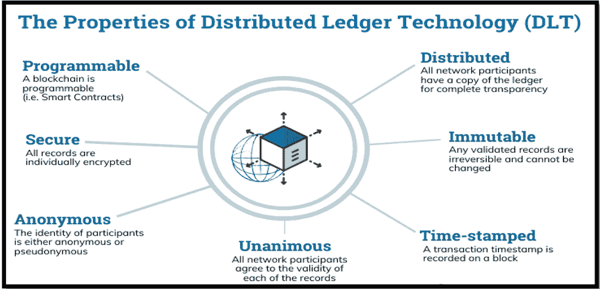
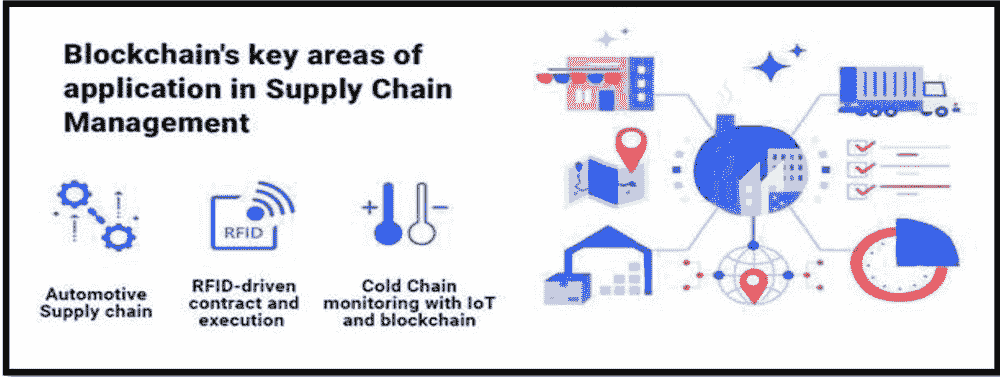
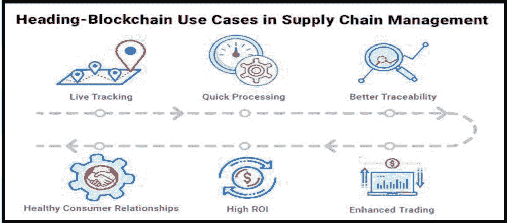
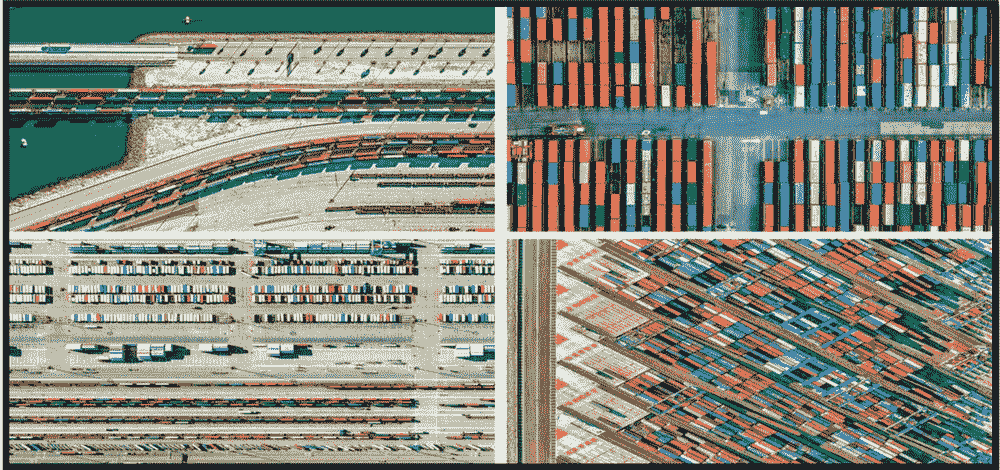
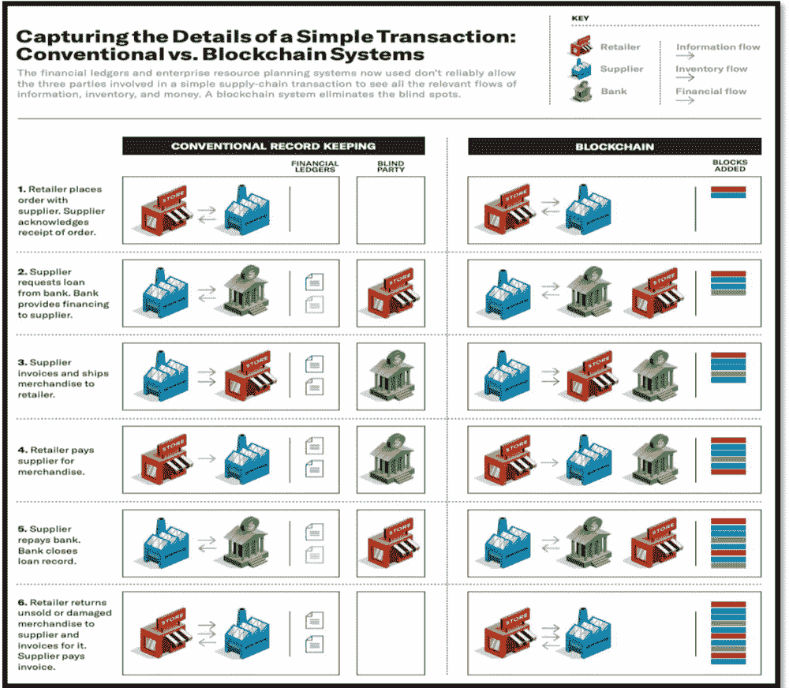

# 第三章

# 区块链技术在构建透明供应链管理中的作用

+   Ram Singh

    

    量子大学，印度

+   Rohit Bansal

    

    印度的 Vaish 工程学院

+   Sachin Chauhan

    量子大学，印度

摘要

本章的基本目标是发现并突出区块链技术在库存网络中的作用，包括其优势和障碍。该研究的概念基于辅助数据和信息。必要的数据和信息已从不同的网站、杂志和媒体报道中收集。供应链在质量、成本和速度方面都需要面临挑战。利用区块链技术可以轻松实现这些障碍在库存网络中的管理。

引言

“区块链有可能成为整个记录系统的基石，但是它仅在 10 年前被推出，是由在线货币比特币背后的不知名的人，化名为‘中本聪’创建的。区块链可以成为数字化供应链的基础。”它真的帮助客户和企业跟踪他们的产品，从提取到最终客户到达的时间。区块链是永久保存的数字记录，非常安全地与各方共享和进行交易。区块链最初被引入到金融服务中，用于高效和安全的支付、经济联盟等。近年来，制造业、消费品和零售等各行各业都在研究如何进入区块链应用（Paliwal, V., Chandra, S., & Sharma, S. 2020）。本章的主要目标是发现和突出显示区块链技术在供应链管理中的作用及其优缺点。研究的概念很吸引人，它基于次要数据和信息。所需的数据和信息已从各种网站、期刊、杂志和媒体报道中收集到。通过企业区块链技术可以改变供应链，具有以下三个用例：可追溯性、透明度和可交易性。

可追溯性：通过设计和可视化“企业供应链，越来越多的消费者要求了解他们购买的产品的采购信息”（Casino, F., Dasaklis, T. K., & Patsakis, C. 2019）。区块链帮助组织了解他们的供应链，并与真实、不可质疑和永久的数据吸引消费者互动。

Transparency: 它通过捕获关键数据点（如确认和声明），然后公开提供这些数据的访问，来建立信任。一旦在以太坊区块链上注册，其真实性可以由第三方验证者验证，并且“数据可以实时更新和验证”（Chanson, M. 2019）。

Tradability: 它是一个令人瞩目的区块链提供，重新思考了传统的市场中心概念。利用区块链，一个人可以通过将一件物品分成股份来“代币化”，这些股份数字化地代表所有权（Dwivedi, Y. K., et. 2019）。就像股票交易允许交易公司的股份一样，这种部分所有权允许代币代表投资者在某个物品中的股权价值，这些代币是可交易的，用户可以在不实际转移资产的情况下转移所有权。

区块链技术

区块链是一个通用的、超级耐用的记录，用于记录交易和跟踪商业组织中的资产（Egels-Zandén, N., Hulthén, K., & Wulff, G. 2015）。一个资源可以是实物“房屋、车辆、货币和土地”，也可以是理论的“知识产权、专利、版权、商标”，基本上任何有价值的东西都可以在区块链网络上进行跟踪和交易，减少风险并降低所有参与者的成本（Yang, H., & Tate, M. 2012）。商业运作依赖于数据。数据越快速获取并精确，它越有可能。区块链非常适合传递数据，因为它提供快速、共享和完全透明的数据，这些数据存储在一个超级耐用的记录上，只能被授权网络成员访问，区块链网络可以追踪订单、支付、记录、生产等等。

区块链技术的要素

区块链是一种记录信息的方式，使得修改，黑客攻击或欺诈该系统变得困难或者不可能，它本质上是交易的数字记录，该记录被复制并在整个区块链的计算机系统网络中传播（Figorilli, S., Antonucci, F., & Menesatti, P. 2018）。"由多人管理的分散数据库称为'Distributed Ledger Technology (DLT)'，而区块链是 DLT 的一种，其中交易记录为"：

分布式账本技术：来自协会的个人可以接触到分布式账本技术及其对常规记录交易的实时记录，在这些常规记录中，交易只记录一次，消除了普通商业协会常见的工作重复（Akter, S., Michael, K. 2020）。来自协会的个人可以接触到分布式账本技术及其对常规记录交易的实时记录，在这些常规记录中，交易只记录一次，消除了普通商业协会常见的工作重复。

永久记录：一旦记录到常规账本后，没有人可以更改或修改交易。如果交易记录包含错误，（Firdaus, A., A. B. Razak 2019）必须添加另一笔交易来纠正错误，然后这两笔交易都是可见的。

卓越的合同：为了加速交易，许多规则被称为快速安排，被处理在区块链上并因此执行。“智能协议可以描述企业安全转移的条件；联合条款以支付分支保险等等”。这意味着如果一个链中的一个区块被更改，很快就会明显地看出它已经被篡改（Hackius, N., & Petersen, M. 2017）。假设黑客想要破坏一个区块链系统，他们将不得不更改链中的每个区块，跨链的所有分布式版本。“像比特币和以太坊这样的区块链不断地发展，因为区块不断地被添加到链中，这从根本上增加了账本的安全性”。

| 图 1\. 分布式账本（DLT）的特性 |
| --- |
|  |

供应链管理

生产网络融合了从产品起点到客户手中的所有活动、人员、关系、信息和资源，例如，在客户库存空间中，这可能涵盖原材料、生产、包装、运输、仓储、运输和零售等环节（George, R. V., Harsh, H. O., Ray, P. 2019）。最终目标是明确的：满足客户的需求。“通过在整个供应链中平衡市场需求”，Frayer 说，“组织和渠道共同努力将产品移动起来。”术语“供应链”可以具有多个含义、流程和角色。这些包括：生产网络的概念，涵盖了从采购到完成品满足的最常见方式（Hughes, L., Akella, V. 2019）。业务方面，包括指导货物运输的承运人和规定，以及管理运营、物流和库存水平的实践，作为规划买方和供应商的一部分。当这些流程和功能得到良好实施时，可以提升任何行业的效率，这就是为什么供应链管理应该成为业务战略的基本组成部分（Jia, C., Cai, Y., Yu, Y. T. 2016）。供应链管理是整合市场需求管理的最常见方式，不仅在组织内部，而且在供应链的各个成员和渠道之间，以便它们能够最有效、最有效地合作（Maier, D., Maier, A., Așchilean, I. 2020）。供应链管理系统中有五个基本组成部分：计划：为了满足客户需求，供应链经理需要做好准备（Modi, D., & Zhao, L. 2020），这意味着量化需求、战略性地规划供应链，并决定组织将如何监督供应链，以确保它在效率、为客户提供价值和帮助实现最终目标方面的表现如预期。采购：选择能够提供产品、原材料或制造产品的服务的供应商是供应链的一个重要组成部分，作为重要采购的一部分，供应链管理者应该管理请求、接收、管理库存和支持供应商的收款的过程（Montecchi, M., Plangger, K., & Etter, M. 2019）。制造：供应链管理者还需要协助协调与制造实际产品有关的所有步骤，包括检查和接受原材料、生产产品、质量测试和包装。回收：生产网络管理者还需要建立一个支持产品回收的体系，在某些情况下，这可能包括拒绝或重新制造有缺陷的产品；在其他情况下，这可能仅意味着将产品退回仓库（Morgan, T. R., Richey Jr, R. G., & Ellinger, A. E. 2018）。这个体系应该是可靠且灵活的，以满足客户的需求。“所有这些部分的基础是一套强大的支持流程的组织，能够有效地监控整个供应链的数据，并确保遵守法律和法规；这包括许多部门，包括人力资源、信息技术、质量保证、财务、产品设计和销售”。

区块链在供应链管理中的应用

汽车供应链

由于区块链技术允许全球范围内的资金转移，它消除了直接在付款人和收款人之间进行的传统金融交易的必要性。基于区块链的供应链管理系统允许精确的记录和溯源教育，包括通过嵌入式传感器和 RFID 标签轻松访问的产品信息（Qian, X. A., & Papadonikolaki, E. 2020）。区块链可以是保护品牌免受仿制品侵害并建立以客户为中心的商业模式的理想解决方案。

| 图 2\. 供应链中区块链的关键领域 |
| --- |
|  |

RFID 驱动的合同竞标与执行

RFID 标签允许 IT 系统自动读取标签并进一步处理它们；因此，在物流中使用 RFID 标签对智能合约将是非常有利的。 RFID 标签可以通过可能的设置（Raheem, D., Shishaev, M., & Dikovitsky, V. 2019）发挥作用：用于货床的 RFID 标签存储可在交货地点和日期上使用的信息，物流合作伙伴可以运行这些 RFID 标签的应用程序并竞标交货联系，物流合作伙伴然后提出一个完美的价格和服务合同，智能合约有助于跟踪产品的状态和最终交付执行情况。

使用区块链进行冷链监控

区块链为共享提供了一个单一的真相标志；不可篡改的记录，物联网区块链解决方案提供了利用物联网进行资产跟踪的解决方案和区块链网络。基于区块链的物联网供应链解决方案架构带来了从现实世界获取的增强可见性和见解，并导致了商业世界中进一步的协作和信任（Sunny, J., Undralla, N., & Pillai, V. M. 2020）。区块链提供的共享记录技术使商业网络中的参与者能够记录经过封闭且无法修改的销售历史（Ramezani, J., & Camarinha-Matos, L. M. 2020）。这种基于区块链的物联网平台解决方案允许物联网设备利用多种物联网和资产数据参与区块链交易，以验证受信任的永久区块链记录中的商业条件。

| 图 3\. 区块链在供应链管理中的应用 |
| --- |
|  |

实时追踪与快速处理：基于区块链的供应链管理框架已经投入使用，以分散化和透明度为特点；它帮助企业实时监控每一个活动（Shoaib, M., Lim, M. K., & Wang, C. 2020）。尽管供应链处理着庞大且复杂的数据集，但由于中间商的存在，该过程变得过于冗长。智能合约已被设计用于消除纸上的条款。

更好的可追溯性与健康的客户关系管理：将区块链整合到供应链中已经降低了市场上假冒产品的供应（Violino, S., Pallottino, F., Sperandio, G. 2019）。通过更好的可追溯性，这样的做法得到了显著减少。提供所需的产品相关信息对于区块链至关重要，将客户体验提升到了一个新的水平。此外，它允许客户真正查看产品的真实性。

增强交易与高投资回报率：通过区块链的帮助，财产和许可权有所发展。由于每个组织都有相似的记录版本，他们可以轻松监控所有权记录（Violino, S., Pallottino, F., Sperandio, G. 2020）。借助区块链，企业正在建立优质品牌差异，从而实现更高的投资回报率。

区块链已经成为产业可追溯性系统的一种有前途的技术（Wang, Y., Han, J. H. 2019）。它也可以应用于供应链管理（SCM）系统的许多方面，如物流、质量保证、库存管理和定价，以便在 SCM 中合理地整合区块链，我们正在使用一些应用程序：

Stratis：Stratis 是一家总部位于英国的合作平台，主要致力于利用微软技术，目前正在与全球开发人员合作，提供基于区块链的供应链管理的终极解决方案，具备完整的透明度，在一个无需信任但高度安全的去中心化环境中进行（Virto, L. R. 2018）。这表明，全球的软件开发人员将积极开发，并致力于提供多样化的解决方案，从而展示了 Stratis 开发的平台的威力，并支持在与 Stratis 区块链技术合作中提供帮助。

Treum：Treum 是一种现代化的基于区块链的供应链操作系统，侧重于可追溯性、透明度和可交易性（Yang, H., & Tate, M. 2012）。它允许企业通过无缝记录从头到尾的资产信息来与客户建立信任，使制造商能够验证其供应链是否达到其产品目标。

**Naturipe Farms**：利用 SAP 云平台区块链服务追踪从农场到餐桌的蓝莓，Naturipe 农场将 QR 码放置在水果和蔬菜的公开箱上，这些码会一直保留在箱子上，消费者可以用手机扫描这些码，查看这些浆果的种植地和它们所采用的农场实践（Zelbst, P. J., Green, K. W., Sower, V. E., & Bond, P. L. 2019）。

**Tony's Chocolonely**：在非洲许多地区，每年都有大量的可可豆由青少年工人和奴隶运送；然而，总部位于阿姆斯特丹的巧克力公司**托尼的巧克力**已经迈出了一步，帮助结束儿童劳动和现代奴隶制度（Zhu, S., Song, J., Hazen, B. T., Lee, K., & Cegielski, C. 2018）。他们正在建立一个名为“熊追踪器（bear tracker）”的共同价值链平台，该平台包括一个监测工具，可以随时随地追踪可可豆的位置。所有农民合作社和供应链参与者都与豆子追踪器连接在一起，并且每周输入数据。

**GlaxoSmithKline**：作为世界上最大的制药公司之一，格兰斯密斯克莱恩公司正在与 IBM 和其他重要公司合作，成为一个新的区块链供应商公司，该公司的基础设施使用了加密安全和智能合约，并提供企业洞见作为资产管理和分布（Kumar, N., & Ganguly, K. K. 2020）贯穿整个供应链。这种去中心化的方法和在区块链上生成的不可变的审计路径消除了手动繁琐的流程，并减少了欺诈和错误的风险，从而实现了供应链的无缝连接。

Luxarity：Luxarity 已与重要的区块链开发公司合作，通过使用区块链技术实现捐赠过程的全面透明化。他们计划开发一款用户友好的捐赠跟踪解决方案，可以与他们现有的客户旅程无缝集成，并实现消费者无需麻烦即可参与。该解决方案侧重于创建捐款分配的永久记录；消费者可以选择支持哪些社会和教育事业（Kumar, N., & Ganguly, K. K. 2020）。

Brilliant Earth：与 Ever Record 公司合作，以道德原则为基础的钻石零售商 Brilliant Earth 正通过区块链追踪其钻石的来源。区块链技术有助于追踪钻石及其他支持文件，如发票和证书，从而使这些关键信息的存储非常安全。

GenuineWay：GenuineWay 是一家瑞士编程组织，旨在为中小型企业提供即用型数字解决方案，并促进社会和环保项目（Kumar, N., & Ganguly, K. K. 2020）。这家技术服务提供商擅长开发和分发与区块链集成的解决方案，适用于食品、时尚、医疗等各种不同领域的消费品制造商。它将 QR 码应用于食品和酒类产品，并提供制造认证的智能合同，为最终消费者提供高品质的食品产品。

区块链在供应链管理中的优势与好处

提高可追溯性

“2013 年美国药品供应链安全法”要求药品协会认可并遵循医生推荐的药物，以保护客户免受假冒、盗窃或有害物品的侵害。在这一要求的推动下，我们调查中的一家大型药品公司正在与其供应链合作伙伴合作，利用区块链技术。药品库存被标记有符合“GS1 标准”的电子产品代码（Héder，M. 2017）。 “随着每一单位的库存从一家公司流向另一家公司，它的标签被扫描并记录在区块链上，从而在整个供应链中创造了一条完整的历史记录，从其源头到最终用户，美国在此方面取得了一些早期成功，已经推动该公司在其他地区开展更多试点并朝着在欧洲广泛实施的方向发展；与此同时”，IBM 正在进行类似的工作，以建立更安全的食品生产网络。它建立了“IBM Food Trust”，并与沃尔玛达成合作关系，利用区块链技术追踪新产品和其他食品。这些应用程序需要最少的数据共享：采购订单、发票和付款不需要包含在同一区块链中。因此，对于对分享竞争性信息持谨慎态度的公司来说，更有可能参与到该平台中。好处是显而易见的，如果一家公司发现了有缺陷的产品，区块链使得该公司及其供应链合作伙伴能够追踪该产品，识别与之有关的所有供应商，确定与之相关的生产和运输团队，并有效地对其进行审核（Modi，D.，& Zhao，L. 2020）。如果产品是易腐的，区块链使参与的公司能够自动监控质量：配备有 IoT 设备来监控温度的冷藏容器可以记录区块链上的任何危险变化。此外，如果对于零售商退回的产品的真实性存在疑虑，区块链可以消除这些疑虑，因为假冒产品将在区块链上缺乏真实的历史记录。因此，各行各业的公司都在研究这种区块链的应用，这要么是受到法规的推动，要么是由下游消费者寻求追踪零部件库存的能力。

扩大效率、加速度和减少中断

Emerson，一个总体聚集和规划的协会，拥有一个复杂的制造组织。它包括来自不同供应商、客户和地区的大量零部件。艾默生公司的首席执行官迈克尔·特雷恩告诉我们，这样的储备往往需要应对长时间、不确定的交货周期和缺乏可见性。同样，制造组织的任何一部分出现小延迟或中断都可能导致库存过剩和其他部分的断货。他认为区块链可以帮助克服这些挑战（Zelbst，P. J.，Green，K. W.，Sower，V. E.，& Bond，P. L. 2019）。

| 图 4\. 利用区块链技术进行实物供应 |
| --- |
|  |

“清晰地描述了问题以及区块链如何解决它的方式，将事物 A 视为一个，它使用部件'C1 和 C2'，以及事物 B，它使用部件'C1 和 C3'，如果由于 C3 部件制造中断导致对事物 B 的收集受阻，理想的做法是暂时将 C1 的供应分配给事物 A，直到问题解决为止”。无论如何，如果所有的事物和部件都由不同的组织制造，并且彼此的库存可见性有限，可能确实会发生的是 C1 的过剩供应堆积在制造事物 B 的公司，即使制造事物“A 的公司 C1 库存已经耗尽”。一种解决方案是，所涉及的公司同意将它们的生产和库存分配决策数据统一存储在一个共同的仓库中（Kumar, N., & Ganguly, K. K. 2020）。然而，请想象一下这将涉及的协调程度：所有的公司都需要信任其他公司的信息，并接受集中的决策，即使它们是合作伙伴或竞争对手，一个更实际的解决方案是，参与的公司共享它们的库存流向区块链，并允许每个公司根据共同的、完整的信息做出自己的决策。公司将使用看板系统相互下订单并管理生产（Paliwal, V., Chandra, S., & Sharma, S. 2020）。 “看板卡将被分配给交付的产品，并且区块链将记录代表看板卡的数字令牌，这将增强跨公司的库存流动的可见性，并使交货时间真正可见”。艾默生并不是唯一一家认为区块链可以提高其库存管理效率和速度的公司。海沃德，一家全球性的游泳池设备制造商也是如此。 “根据海沃德公司的高级副总裁唐·史密斯的说法，可以将成品、处理能力、在制品库存和原材料视为数字货币进行处理”。区块链通过解决双花问题使这成为可能，即将相同单位的容量或库存错误地分配给两个不同的订单。“加拿大沃尔玛已经成功开始使用与运输其货物的运输公司的区块链，一个通用的区块链使得同步物流数据、跟踪货物并自动进行支付成为可能，而不需要对运输公司的内部流程或信息技术结构进行重大更改”。利用区块链提高供应链效率和速度的吸引力之一是，这些应用程序，就像提高可追溯性的应用程序一样，要求参与的公司只共享有限的信息，在这种情况下，只共享库存或货物运输信息。此外，即使在具有多个 ERP 系统的大型公司内部，这些应用程序也是有用的。

改善融资、合同和国际交易

当库存、数据和资金流通过区块链在公司之间分割时，供应链融资、合同和全球合作都有可能出现显著增长。为公司提供资金和“交易信用”的银行解决了有关借款方机构业务、资产性质以及负债的信息不对称的重要问题。银行设计其流程以控制此类风险，这增加了交易成本，降低了资本获取的速度，并减少了小型企业可用的资本。这些摩擦不仅对银行有害，而且对需要廉价运营资本的企业也有害。另一个有待发展的活动是应付账款管理，这是一个涉及发票、根据采购订单对账单进行对账、跟踪条款和付款、并在每个步骤进行审查和批准的复杂过程（Paliwal, V., Chandra, S., & Sharma, S. 2020）。尽管 ERP 系统已经自动化了其中许多步骤，但仍然需要大量手动干预。而且，由于执行公司都没有完整的信息，冲突经常发生。

通过区块链实现追溯性

第三个机会空间是跨界交流，其中包括手动周期、实际报告、许多中介以及不同的“在通道和出口处的检查和确认，交易缓慢、昂贵，并且受到对货物状态的低可见性的折磨”。“我们考虑的零售和金融服务公司正在进行区块链试点项目或在这三个领域开发平台”，通过连接库存、信息和财务流，并将它们提供给所有交易各方，区块链使公司能够更轻松地对购买订单、发票和付款进行对账，并跟踪与交易对手的交易进展（朱，宋，哈岑，李，及塞吉尔斯基，2018）。当供应商收到订单时，使用“区块链的银行可以迅速向供应商提供营运资金，并且当产品交付给买方时，银行可以立即收到付款，因为有一个立即可用的审计追踪，并且可以自动化对账，使用依赖于区块链数据的智能应用程序，银行与收款公司之间的冲突被消除”。

创造可行的技术

许多组织发现，在商店网络中使用区块链，“董事会将需要制定新规则，因为供应链的需求与数字货币网络的需求根本不同，比特币网络的区块链模型是一个很好的系统”（Shoaib, M., Lim, M. K., & Wang, C. 2020）。与此同时，它实现了几个目标，提供了非常安全、不可避免的财务交易记录；限制了双重支付问题，并提供了数字货币的责任证明。此外，它在不依赖集中机构的情况下实现了这一点，并允许参与者保持匿名，并自由进入和退出该组织。然而，为了实现这一点，比特币网络牺牲了速度，消耗了大量的能源来挖掘比特币，“而且对黑客攻击有些脆弱，供应链不需要做出相同的妥协，因为它们运作方式不同，具有不同的特性”。

已知参与者

“供应链需要私有区块链，而不是向陌生客户公开的区块链，因此商店组织的人员可以找到库存的来源和性质”，其中的每个单元都应该在运输过程中与其特定所有者的身份稳定地连接在一起。因此（Héder, M. 2017），只有被认可的社交活动才能被允许查阅这样的区块链，这意味着组织必须获得加入该结构的同意。此外，同意应该明确授予，这是因为“区块链的开放和去中心化设计对数据安全构成威胁，当企业在区块链上发布交易时，任何成员都可以访问到这些数据，随着数据量的增加，它可能被滥用以收集持续的信息、交易股票或预测市场变化”（Montecchi, M., Plangger, K., & Etter, M. 2019）。出于安全原因，因此，区块链参与者应该经过考虑并得到支持，构建一个受信任的共享区块链数据的伙伴群将面临一些困难。其中一个困难是需要一种管理工具来确定系统的规范，例如谁可以免费加入组织，分享哪些数据，数据如何被加密，谁可以访问，如何解决问题，以及物联网和智能合同的使用范围是多大（Kumar, N., & Ganguly, K. K. 2020）。 “另一个挑战是要找出如何通过使关于供应链中物品的数量或时间的信息更加明确来解决区块链可能对定价和库存分配决策产生的影响”。很难预测产品透明度的成本和收益将在产业链的哪个环节体现。因此，企业正在专注于诸如“药品和食品的可见性以及由明确的用例或法律要求支持的应付账款应用程序的管理”之类的局部应用。

较简单的协议

区块链需要一个安排，展示一些保持交易历史记录的唯一版本的机制，这些交易是由所有人同意的。“由于加密货币网络是在没有中央权威的情况下共享的，它们使用一种称为工作量证明的复杂方法，它确保网络上的所有交易都得到大多数人的认可，但不幸的是，它也限制了新区块添加的速度”。因此，“处理供应链中的交易速度和数量”是太慢了。在药品行业，“每年有 40 亿个药品单位进入美国的药品供应链，而比特币网络则每天只允许约 36 万笔交易”（Montecchi, M., Plangger, K., & Etter, M. 2019）。幸运的是，如果一个区块链是同意和私密的，那么工作量证明方法就不是建立共识所必需的。可以使用更简单的方法来确定谁有权添加下一个区块到区块链中。其中一种方法是合作协议，其中添加区块的选择在参与者之间循环进行。由于所有参与者都是已知的，如果有人利用自己的机会以不良或异常的方式更改链，那么可以轻松地发现有害的行为者，此外，通过参与者对先前区块的认可，可以轻松解决问题。

实际资源的安全

“无论如何，当区块链记录安全时，仍然存在这样一个危险，即可能会因错误或恶意行为而将被污染或伪造的物品带入生产组织。” 另一个风险是库存数据错误，这是由于取样、标记和数据输入错误造成的结果。无论如何，当物品最初进入库存组织时，它们正在严格执行实地审计以确保发货与区块链记录相匹配，“其次，他们正在构建分布式应用程序，即被称为能够在整个供应链中跟踪物品、实际检查数据可靠性并与区块链进行交互以阻止错误和异常的应用程序”（Dwivedi，Y. K.等，2019 年）。如果检测到伪造品或错误，可以通过区块链交易的轨迹追踪到其源头，“第三，企业正在利用物联网设备和传感器使区块链更加强大，以自动验证物品并将记录添加到区块链中，无需人为干预”。如果资产的所有权归属于区块链平台，例如，学校通常会与出版商和版权所有者合作，为某些课程使用自动化阅读包。

供应链管理中的挑战

区块链显然是一种新兴技术，因此，它并非没有潜在问题。希望利用区块链技术来解决其供应链问题的企业应该保持警惕，并准备好面对以下挑战（Casino, F., Dasaklis, T. K., & Patsakis, C. 2019）。供应链复杂且需要透明度和诚信，然而，区块链可以帮助填补这些缺口，使得供应链操作和管理对涉及方来说变得更加容易。就像其他任何技术一样，它提供了诸如增强的可追溯性和可靠性等众多优点；但仍然有一些障碍需要准备好应对。因此，在实施基于区块链的供应链管理解决方案时，以下是一些需要牢记的挑战。

数据质量保证

区块链的一个基本要素是数据不可篡改性；然而，供应链仍然由人们输入的数据驱动，而人们往往会犯错。使用区块链，要更难更正错误输入的数据，相比非区块链应用程序；因此，输入的数据应该没有错误和瑕疵。为了避免数据泄露和经济损失，与合适的人在适当的条件下共享数据至关重要。确定不同级别的数据保密性使未经授权的用户无法访问他们不需要访问的信息；它帮助您确定一组具有相关访问权限的角色，并在供应链管理系统下分配角色给每个人。区块链的兴起发生在人们想要去中心化应用程序和操作，并使对集中第三方实体像银行的依赖不是必需而是可选的。行业正在推行这种分布式账本技术，并将其用于解决长期存在的业务问题。供应链管理正在全球市场上逐渐引起关注；但是一些障碍存在（Gold, S., & Heikkurinen, P. 2018）。大部分这些障碍可以通过区块链来消除，文章已经阐明了一些解决方法。

**监控冷链和追踪食品物品**

在食品行业，“沃尔玛使用区块链追踪其产品至最终客户。沃尔玛追踪其猪肉产品从中国开始到最终交付给客户的日期，通过这一追踪，研究人员也可以发现并排除引发食源性疾病的源头并排查出那些加工厂。”Unilever、Settle 和 Tyson 也在利用区块链进行公平交易（Zhu, S., Song, J., Hazen, B. T., Lee, K., & Cegielski, C. 2018）。食品和药品需要将其产品存放在冷却/特殊储存中。在这方面，区块链帮助记录了产品的保质期、温度、振动和其他特性，并将这些特性存储在经过数字化设计且非常可靠的区块链上。“假如存储条件与约定不符，所有区块链参与者都会知晓，这里，一个智能解决方案出现在场景中以解决问题”。

**太阳能微电网 & 卫生行业**

“在太阳能行业，智能合约被用于重新分配多余的能源，区块链应用了一个 Transactive Grid 应用程序来监测和重新分配能源”。以太坊是运行此程序的平台，因为它有助于构建各种智能合约。这也自动化了对环保能源的购买和销售，从而节省了成本并减少了污染（Gold, S., & Heikkurinen, P. 2018）。“患者的医疗记录可以由世界任何地方的患者访问，通过提供像患者指纹这样的密钥访问，整个医疗记录可以被查看并能警示医护人员，他们可以帮助患者识别问题并建议药物而不会引发任何过敏反应”。

**生态系统仍在进行中 & 货币波动**

直到第二个电话出现之前，第一个电话是无用的。随着时间的推移，电话传播到世界各地，现在我们离不开它。对于需要与特定合作伙伴合作的企业来说，情况与此类似。那些合作伙伴也应该接受区块链。例如，Tomcar 仍然可以对其购买的零部件的约 2%进行比特币支付。然而，区块链的专业应用正在增加。可能只是时间的问题，直到企业“连接各个点”以获得广泛认可。比特币是开始使用区块链的简单方法。问题在于比特币与其他货币之间的交易速度可能会迅速变化。支付条款应该足够短或足够灵活，以便能够兑现比特币并恢复预期的价值（Virto, L. R. 2018）。比特币和其他数字货币在另一方面也是不稳定的。如果您丢失了数字货币储备的数字密钥，那么几乎没有办法恢复它。

技术知识和心态

区块链编程需要结合编程能力；它还有助于理解经济和企业，特别是你的企业，企业需要培训员工或雇佣具备这些技能的新人。最佳选择将取决于他们当前的情况和未来的目标（Behnke, K., & Janssen, M. F. W. H. A. 2020）。当人们开始寻求一种去中心化应用和操作的方法时，区块链应运而生。他们希望将集中在像银行这样的实体上的条件变为可选而非强制性。这是一个新的视角，所以如果需要一些时间来摆脱心理枷锁并投入区块链发展的旋律，也不要感到惊讶。

区块链在供应链管理中的优势

在沃尔玛和宝洁等公司的推动下，自 1990 年代以来，在供应链信息共享方面已经取得了可观的进展，这归功于“企业资源规划（ERP）系统”的使用。然而，在涉及复杂交易的大型供应链中，可见性仍然是一个挑战。为了说明当前的财务记录条目和 ERP 系统的局限性，以及区块链世界的潜在好处，让我们描述一个假想情景：“一个简单的交易，涉及到从供应商那里采购产品的零售商，以及向供应商提供运营资金的银行”。该交易涉及信息流、库存流和资金流（Egels-Zandén, N., Hulthén, K., & Wulff, G. 2015）。请注意，特定的流程并不会导致所有三方的财务记录条目。此外，现代 ERP 系统、手动审计和分析不能可靠地连接三个流程，这使得难以消除执行错误、改善决策，并解决供应链冲突。

传统与区块链系统的细节捕捉

目前使用的货币记录和企业资产规划系统并不总是允许参与简单供应链交易的三方查看所有必要的信息、库存和资金的变化，而区块链系统消除了这些盲点。

| 图 5\. 传统与区块链记录 |
| --- |
|  |

“执行失误，如股票信息混乱、货物丢失和复制付款，通常很难在实时中发现，即使问题在后来被发现，要通过追踪可用的记录和档案中记录的活动序列来准确确定其来源或修复它也是困难且昂贵的”。尽管 ERP 系统捕获了各种流程，但很难评估哪些账目、应收账款、付款、退货贷款等与哪些库存交易相对应。对于每天在庞大的供应链合作伙伴和产品网络中进行数千笔交易的公司而言，尤其如此（Héder, M. 2017）。更糟糕的是，供应链活动通常非常复杂，远比表面描述的复杂得多，例如，订单、货物运输和付款可能不会完美同步，因为一个订单可能会分成多个货物运输，并且相应的发票或其他订单可能会合并成一个单一的货物运输（Duan, J., Zhang, C., Gong, Y., Brown, S., & Li, Z. 2020）。改善供应链业绩的一种常见方法是通过审计来验证交易。审计是确保合同遵守的一部分，但对于改进动态以解决运营缺陷并不是特别有帮助。“想象一下一个食品公司面临的问题，当其产品在零售店已经到了保质期的末尾时”。我们其中一人与一个包装食品重要制造商合作的研究发现，对商店中的库存进行审计或检查可以揭示过期物品的数量；但它无法解释原因。“这些原因可能包括在供应链的任何部分中出现的失败，例如上游的库存管理低效、产品分配到商店不稳定、需求弱或不稳定以及货架周转不足” (Hackius, N., & Petersen, M. 2017)。记录所有这些活动可以帮助减少关闭情况。另一种加强供应链运营的方法是使用 RFID 标签或符合 GS1 标准的电子产品代码标记库存，然后将公司的 ERP 系统与其供应商的系统整合，以建立完整的交易记录。这将消除执行错误并提高可追溯性；然而，我们研究的公司的经验表明，整合 ERP 系统既昂贵又耗时。大型组织可能拥有 100 多个传统 ERP 系统，并且随着时间的推移，由于组织变更、合并和收购的结果，这些系统通常不容易相互通信，甚至在定义数据字段的方式上可能存在差异。一家大型公司告诉我们，它在单一活动货物运输和其供应商和经销商的 ERP 系统中有 17 个记录。

区块链之所以重要，主要是因为它包含一个按顺序排列的块序列，每个块都记录了交易中的三种类型的流动，并捕捉了财务记录系统中未记录的细节。此外，每个块都经过编码并分发给所有参与者，他们保留自己的区块链副本，由于这些因素，区块链为供应链的三类活动提供了完整、可靠和数字化的审计轨迹。因此，区块链极大地减少了我们讨论过的执行、可追溯性和协调问题，如果不是完全消除。由于参与者拥有自己的区块链副本，每个方可以查看交易的状态，识别错误，并追究交易对手的责任（Hackius, N., & Petersen, M. 2017）。没有任何参与者可以覆盖以前的数据，因为这样做将意味着在完全共享的区块链副本上更改所有随后的块。我们模型中的银行还可以利用区块链来改进供应链融资。通过查看区块链，它可以做出更好的贷款决策，因为它可以验证供应商和零售商之间的交易，而无需进行实地审核和财务审计，这是费时且容易出错的过程。此外，将贷款记录与发票、付款和货物实际运输的数据一起记录在区块链上，可以使交易更经济、更易于审计，并对所有参与者更安全。

“此外，许多这些功能可以通过智能合约自动化，其中计算机代码行使用区块链数据验证是否已实现合同义务并支付可以给予的情况”。智能合约可以编程评估交易状况并自动执行操作，比如发放付款、记录账目条目和标记需要手动干预的异常情况。请注意，区块链不会取代企业资源计划（ERP）系统执行的广泛的交易处理、会计和管理控制功能，如开发发票、支付和报告。事实上，区块链的加密链接列表或链式数据结构并不适合快速存储和检索甚至高效的存储（Zhu, et al., 2018）。然而，区块链将与参与公司的传统系统进行连接。 “每家公司都会从其内部 ERP 系统生成交易块并将其添加到区块链；这将使得跨公司的不同交易步骤易于协调”。

结论

“在供应链的完整性识别、产品交付速度、协调和融资等方面存在着相当大的空间，区块链可以成为解决这些不足的有用工具，正如我们所研究的公司所证明的那样”。现在是供应链经理们评估他们的公司区块链潜力的时候了（Wang, Y., Han, J. H., & Beynon-Davies, P. 2019）。他们需要加入努力制定新标准，尝试不同的技术，与不同的区块链平台进行试点，并与不同公司建立生态系统。确实，这将需要投入资源；但是，这种投资承诺将产生可观的回报。

参考文献

Agrawal, T. K., & Pal, R. (2019). 纺织品和服装供应链的可追溯性：通过 Delphi 研究对实施因素和信息集进行分类。《可持续性》，11(6)，1698。doi:10.3390/su11061698

Akter, S., Michael, K., Uddin, M. R., McCarthy, G., & Rahman, M. (2020). 利用数字创新改变业务：AI、区块链、云和数据分析的应用。《运营研究年鉴》，•••，1–33。

Azzi, R., Chamoun, R. K., & Sokhn, M. (2019). 基于区块链的供应链的力量。《计算机与工业工程》，135，582–592。doi:10.1016/j.cie.2019.06.042

Behnke, K., & Janssen, M. F. W. H. A. (2020). 食品供应链使用区块链技术的可追溯性的边界条件。《国际信息管理杂志》，52，101969。doi:10.1016/j.ijinfomgt.2019.05.025

Carter, C. R., & Rogers, D. S. (2008). 可持续供应链管理框架：迈向新理论。《国际物流与供应链管理杂志》，38(5)，360–387。doi:10.1108/09600030810882816

Casino, F., Dasaklis, T. K., & Patsakis, C. (2019). 区块链应用的系统文献综述：当前状况、分类和未解决问题。《远程通信和信息学》，36，55–81。doi:10.1016/j.tele.2018.11.006

Chanson, M., Bogner, A., Bilgeri, D., Fleisch, E., & Wortmann, F. (2019). 物联网的区块链：传感器数据的隐私保护。《信息系统协会杂志》，20(9)，1274–1309。doi:10.17705/1jais.00567

Duan, J., Zhang, C., Gong, Y., Brown, S., & Li, Z. (2020). 基于内容分析的食品供应链中区块链采用的文献综述。《国际环境研究与公共卫生杂志》，17(5)，1784。doi:10.3390/ijerph17051784

Dwivedi, Y. K., Hughes, L., Ismagilova, E., Aarts, G., Coombs, C., Crick, T., & Williams, M. D. (2019). 人工智能（AI）：关于新挑战、机会和研究、实践和政策议程的跨学科视角。《信息管理国际期刊》，101994。

Egels-Zandén, N., Hulthén, K., & Wulff, G. (2015). 供应链透明度的权衡：以 Nudie Jeans Co.为例。《清洁生产杂志》，107，95–104。doi:10.1016/j.jclepro.2014.04.074

Figorilli, S., Antonucci, F., Costa, C., Pallottino, F., Raso, L., Castiglione, M., & Menesatti, P. (2018). 木材电子开源追溯的区块链实施原型。《传感器（巴塞尔）》，18(9)，3133。doi:10.3390/s18093133

Firdaus, A., Ab Razak, M. F., Feizollah, A., Hashem, I. A. T., Hazim, M., & Anuar, N. B. (2019). “区块链”的崛起：区块链研究的文献计量分析。《科学计量学》，120(3)，1289–1331。doi:10.1007/s11192-019-03170-4

George, R. V., Harsh, H. O., Ray, P., & Babu, A. K. (2019). 餐厅食品质量追溯原型：利用区块链和食品质量数据指数。《清洁生产杂志》，240，118021。doi:10.1016/j.jclepro.2019.118021

Gold, S., & Heikkurinen, P. (2018). 透明度谬误：利益相关者对供应链责任的索赔的意外后果。《会计、审计与责任杂志》。

Hackius, N., & Petersen, M. (2017). 物流和供应链中的区块链：技术还是陷阱？在《供应链管理与物流的数字化：智能和数字化解决方案为第四次工业革命环境》中。汉堡国际物流会议（HICL）论文集（第 23 卷，第 3-18 页）。柏林：epubli GmbH。

Héder, M. (2017). 从 NASA 到欧盟：公共部门创新中 TRL 量表的演变。《创新杂志》，22(2)，1–23。

Hughes, L., Dwivedi, Y. K., Misra, S. K., Rana, N. P., Raghavan, V., & Akella, V. (2019). 区块链研究，实践和政策：应用，好处，局限性，新兴研究主题和研究议程. 信息管理国际杂志, 49, 114–129\. doi:10.1016/j.ijinfomgt.2019.02.005

Jia, C., Cai, Y., Yu, Y. T., & Tse, T. H. (2016). 5W+ 1H 模式：系统映射研究的一种视角和云软件测试的案例研究. 系统与软件杂志, 116, 206–219\. doi:10.1016/j.jss.2015.01.058

Kumar, N., & Ganguly, K. K. (2020). B2B 电子采购的外部扩散和公司财务绩效：信息透明度和供应链协调的作用. 企业信息管理杂志.

Maier, D., Maier, A., Așchilean, I., Anastasiu, L., & Gavriș, O. (2020). 创新与可持续性之间的关系：文献的一项计量回顾. 可持续性, 12(10), 4083\. doi:10.3390/su12104083

Modi, D., & Zhao, L. (2020). 消费者对服装供应链透明度的社交媒体分析. 时尚营销与管理杂志.

Montecchi, M., Plangger, K., & Etter, M. (2019). 它是真实的，相信我！使用区块链建立供应链来源. 商业视野, 62(3), 283–293\. doi:10.1016/j.bushor.2019.01.008

Morgan, T. R., Richey, R. G. Jr, & Ellinger, A. E. (2018). 供应商透明度：规模的发展和验证. 国际物流管理杂志, 29(3), 959–984\. doi:10.1108/IJLM-01-2017-0018

Paliwal, V., Chandra, S., & Sharma, S. (2020). 区块链技术用于可持续供应链管理的系统文献回顾和分类框架. 可持续性, 12(18), 7638\. doi:10.3390/su12187638

Qian, X. A., & Papadonikolaki, E. (2020). 通过区块链技术转移建筑供应链中的信任。《工程、建筑和管理》，28(2)，584–602。doi:10.1108/ECAM-12-2019-0676

Raheem, D., Shishaev, M., & Dikovitsky, V. (2019). 将食品系统数字化作为促进巴伦支海区域食品和营养安全的手段。《农业》，9(8)，168。doi:10.3390/agriculture9080168

Ramezani, J., & Camarinha-Matos, L. M. (2020). 合作业务生态系统中的韧性和反脆弱性方法。《技术预测与社会变革》，151，119846。doi:10.1016/j.techfore.2019.119846

Shoaib, M., Lim, M. K., & Wang, C. (2020). 一种集成框架，用于优先考虑基于区块链的供应链成功因素。《工业管理与数据系统》，120(11)，2103–2131。doi:10.1108/IMDS-04-2020-0194

Sunny, J., Undralla, N., & Pillai, V. M. (2020). 基于区块链的可追溯性提高供应链透明度：概述与演示。《计算机与工业工程》，150，106895。doi:10.1016/j.cie.2020.106895

Violino, S., Pallottino, F., Sperandio, G., Figorilli, S., Antonucci, F., Ioannoni, V., Fappiano, D., & Costa, C. (2019). 创新的电子标签对特级初榨橄榄油是否可持续、可追溯且受消费者接受？《食品》，8(11)，529。doi:10.3390/foods8110529

Violino, S., Pallottino, F., Sperandio, G., Figorilli, S., Ortenzi, L., Tocci, F., & Costa, C. (2020). 一种特级初榨橄榄油的完整技术追溯系统。《食品》，9(5)，624。doi:10.3390/foods9050624

Virto, L. R. (2018). 对可持续发展目标（SDG）14“保护和可持续利用海洋、海域和海洋资源，以促进可持续发展”的指标的初步评估。《海洋政策》，98，47–57。doi:10.1016/j.marpol.2018.08.036

Wang, Y., Han, J. H., & Beynon-Davies, P. (2019). 了解区块链技术以应对未来供应链：系统文献综述与研究议程。供应链管理，24(1)，62–84。doi:10.1108/SCM-03-2018-0148

Yang, H., & Tate, M. (2012). 云计算研究的描述性文献综述与分类。信息系统协会通讯，31(1)，2。doi:10.17705/1CAIS.03102

Zelbst, P. J., Green, K. W., Sower, V. E., & Bond, P. L. (2019). RFID、工业物联网和区块链技术对供应链透明度的影响。制造技术管理期刊，31(3)，441–457。doi:10.1108/JMTM-03-2019-0118

Zhu, S., Song, J., Hazen, B. T., Lee, K., & Cegielski, C. (2018). 供应链分析如何实现运营供应链透明度：组织信息处理理论视角。国际物流分配与物流管理期刊，48(1)，47–68。doi:10.1108/IJPDLM-11-2017-0341
