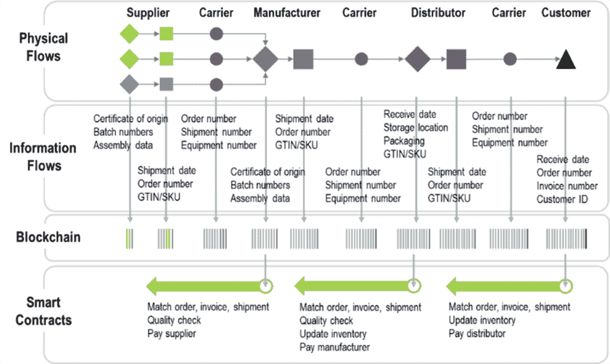
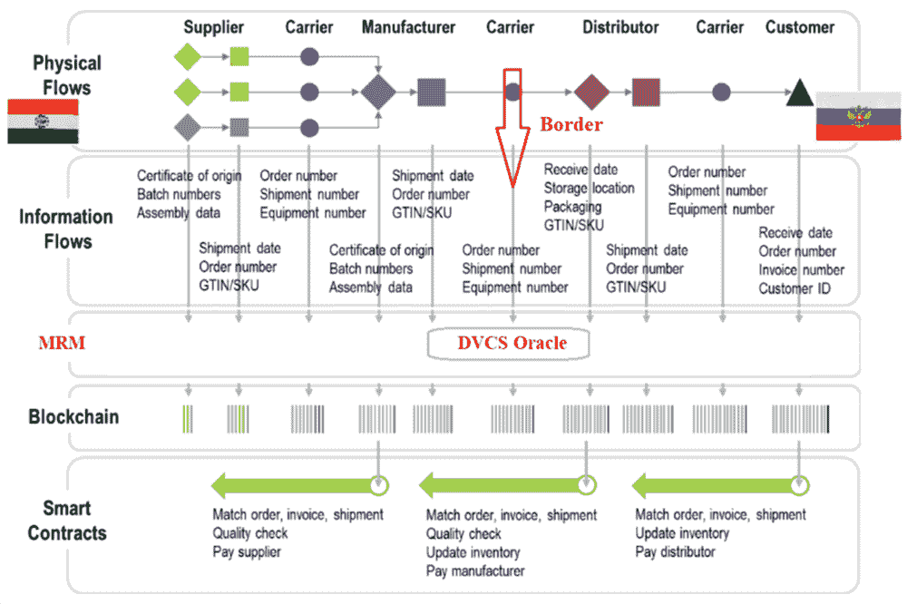
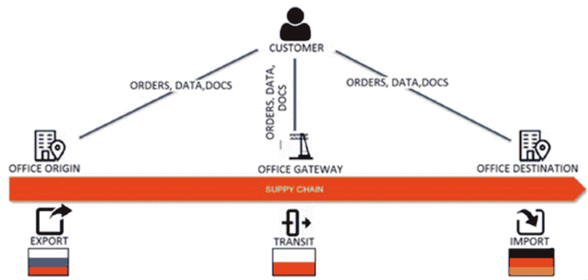
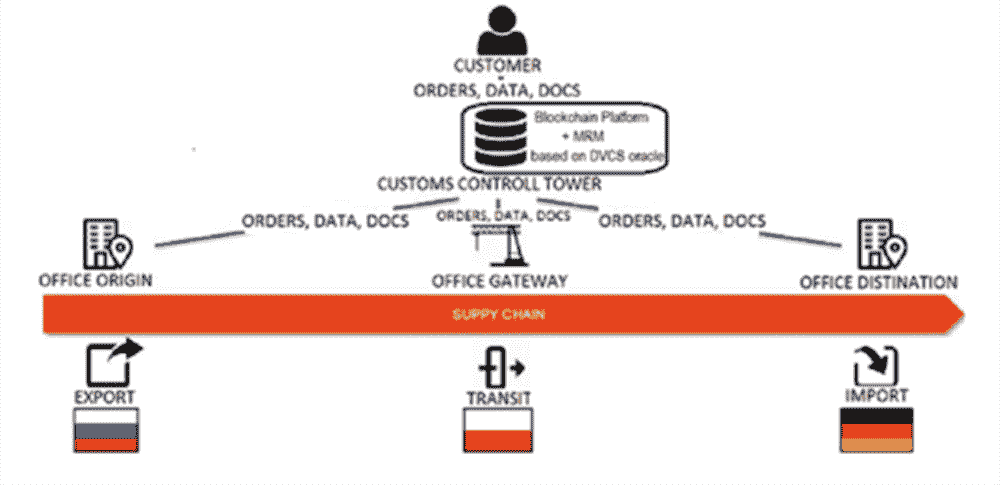
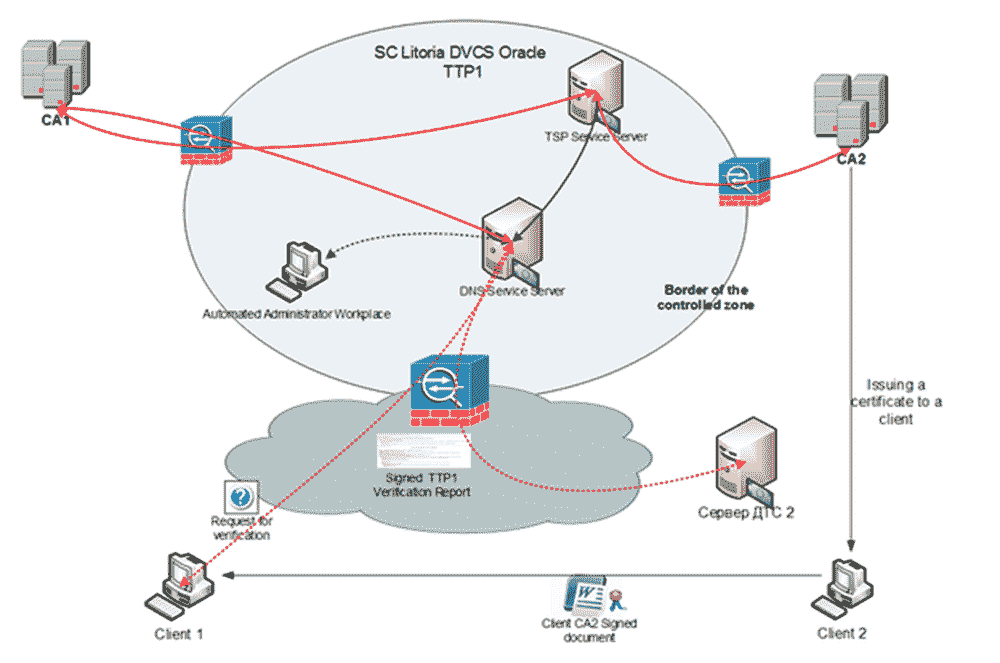

# 第五章

# 基于区块链平台的 DVCS Oracle 的相互认可机制：

全球供应链中的 DVCS Oracle

+   弗拉基米尔·尼古拉耶维奇·库斯托夫

    亚历山大一世皇家铁路交通圣彼得堡国立大学，俄罗斯

+   叶卡捷琳娜·谢尔盖耶夫娜·谢兰特娃

    俄罗斯新贸易空间有限责任公司

摘要

本章的主要目的是介绍在全球供应链中使用基于区块链平台上 DVCS Oracle 的电子签名的相互认可机制（MRM）的必要性。作者通过比较单一领域的传统供应链与多领域的全球供应链来开始他们的研究。在第二种情况下，证明了基于 DVCS Oracle 的 MRM 电子签名的必要性。讨论了构建 MRM 的各种选项。该章提供了电子签名验证协议的比较评估，并论证了使用 DVCS 协议实现区块链 Oracle 的合理性。因此，作者建议使用经过充分测试的 Litoria DVCS 软硬件复合体作为 DVCS Oracle，并用实际例子说明其使用。

“如果区块链技术成为提升人类进步的关键工具，那么未来它可能会成为宇宙规模的信息平台。”（Swan，2018）

引言

自第一个区块链平台和第一个比特币加密货币（Satoshi，2008）出现以来的十三年来，发生了许多不同的事件。有时它们是矛盾的，从无法控制的欢乐（Swan，2018）（Kustov＆Stankevich，2019）到完全的拒绝和怀疑。人们曾对区块链将摧毁中小企业表示严重担忧（Chris，2017）。还曾多次尝试调和怀疑者与乐观主义者（Kustov＆Stankevich，2018）。

然而，尽管存在所有这些矛盾，区块链技术正在动态发展，并且正在涵盖越来越多的新经济领域，有时甚至具有全球性质。供应链也不例外。与广泛引入区块链技术的积极结果同时，它独特的负面特征也日益显现，其中应当提及的有：

+   1\. 广泛使用的智能合约主要使用 Solidity 语言（Dannen，2018 年）开发，揭示了越来越多的智能合约漏洞（Shapiev，2019 年），这些漏洞导致了巨大的财务损失（报告，2019 年）。这些漏洞出现的主要原因有两个：

    +   a. 开发智能合约的技术不够安全，导致开发中出现错误；

    +   b. 外部环境传输到智能合约的源数据可靠性不足。

+   2\. 在闭环环境中运行的智能合约的可靠硬件和软件通信工具（即，oracle）在市场上供应有限，而周围世界的信息流则丰富多彩。

+   3\. 从部门间贸易流通到封闭于一个国家内的供应链，到处都具有全球性质（Kupriyanovsky 等，2016 年）。电子文档流程正变得跨国。在电子文档交换中广泛使用电子签名，导致在验证使用不同加密标准创建的电子签名时出现许多问题。有必要在将电子文档写入区块链平台之前开发一种安全的验证电子文档的机制。在他们的研究中，作者们提出了利用相互认可机制的想法，其核心是 DVCS oracle。

研究任务说明

因此，供应链中的数据并不总是突出、可访问或可信的。使用区块链技术有助于确保使用基于区块链的解决方案与供应链合作伙伴交换安全数据，并具有受限的访问权限。

目前，这个问题变得非常相关。消费者希望有保证的质量，因此他们对供应链的参与要求很高。供应商的选择变得非常谨慎，以确保最小的风险和高透明度的选择。

在本章中，作者提出了通过使用相互认可机制来减少供应链中断的方法研究，以增加数据可靠性，以评估未来区块链应用的可能性。

近年来，区块链在供应链中的广泛应用相比传统供应链提供了以下优势：

+   1\. 供应链网络的透明度可能仅限于离您最近的参与者。由于分布式账本技术提供了可信信息的唯一选项，基于区块链的解决方案为供应链的所有操作提供了参与者更清晰的图景。

+   2\. 区块链平台操作中的一个小错误可能会导致供应链的许多中断。基于区块链的供应链解决方案使用智能合约，在满足预定义的业务条件时自动启动。这确保了几乎实时操作的透明度，并能更早地对异常情况做出响应。

+   3\. 此外，对于买方和卖方来说，选择新供应商始终是一个严重且有时棘手的问题。供应链的区块链解决方案可以通过使用关于新供应商的不可变数据记录来加速此过程，业务网络参与者可以信任该记录。

除了使用基于区块链的供应链的优点之外，还应该注意到几个问题需要尽快解决：

+   1\. 安全区块链平台与外部信息源之间缺乏充分的通信，使用可信的通信渠道。进入区块链的信息流包括文档和数据的可靠性、完整性和真实性，这通过电子签名（ES）来确保。因此，迫切需要在将文档上传到区块链之前对 ES 进行可信验证。这个功能可以分配给一个特殊的 oracle 连接器，它确认物品实例并根据验证结果做出积极或消极的决定。如果 ES 验证的结果是积极的，电子文档和积极的收据将记录在区块链上。如果结果为否定，则将文档退回到源头，并附上否定收据。

+   2\. 供应链有两类：

    +   a. 单一领域（受限于一个国家边界）的供应链（图 1）。在这种供应链中，ES 的验证功能通常分配给区块链的内部机制。实践表明，在这种情况下，验证机制的可靠性和通用性不足。在这种情况下，我们需要一个单独的外部安全和经过验证的工具来验证 ES，以特定连接器 -  oracle 的形式。

    +   b. 多领域或全球供应链（图 2）提供跨境货物运输。在这种情况下，验证文档中的 ES 的功能变得更加复杂且必不可少。事实上，不同的国家使用不同的 ES 加密标准，总的来说，这些标准是不兼容的，因此使用 oracle 来验证 ES 变得必要。

+   3\. 有三种主要的验证协议。作者将进一步讨论它们。作者面临着选择其中最有效的任务。根据测试结果，DVCS 协议显示出最佳特性。作者建议使用 DVCS 作为区块链 Oracle。

| 图 1\. 单领域供应链 |
| --- |
|  |
| 图 2\. 多领域全球供应链 |
|  |

让我们更详细地描述单一领域供应链的功能。

在将组件发送给制造商之前，供应商以电子形式向其提供以下信息，记录在以下交易中的区块链中：原产地证书、批次号和组装数据。在将组件转移到运输组织之前，供应商记录并传输以下信息给它，这些信息也记录在区块链中的交易中：发货日期、订单号、全球贸易项目编号（GTIN）和库存保管单位（SKU）。运输组织在交付阶段向区块链添加额外的交易：订单号、发货号、设备号。制造商收到组件后，生产必要的产品，并将其交易额外输入到区块链中：原产地证书、批次号和组装数据。在组件供应和生产阶段记录在区块链中的所有信息的处理由以下智能合约进行：

+   1\. 匹配订单、发票和发货；

+   2\. 质量检查；

+   3\. 支付供应商。

在将成品发送之前，制造商将以下交易添加到区块链中：装运日期、订单号、GTIN/SKU。在运输阶段，运输组织向额外的经销商传输记录在区块链中的额外信息：订单号、装运号、设备号。

收到产品后，经销商创建交易：收货日期、存储位置、包装、GTIN/SKU。经销商在成品交付的阶段使用智能合约：

+   1\. 匹配订单、发票和装运；

+   2\. 质量检查；

+   3\. 更新库存；

+   4\. 支付制造商。

接下来，经销商准备将商品发运给客户，并在区块链中记录交易：装运日期、订单号、GTIN/SKU。在由运输组织将货物交付给客户的交付阶段，创建交易：订单号、装运号、设备号。客户收到货物后，进行交易并将其写入区块链：收货日期、订单号、发票号、客户 ID。在最后阶段，使用以下智能合约：

+   1\. 匹配订单、发票、装运；

+   2\. 更新库存；

+   3\. 支付经销商。

因此，单一领域供应链的循环完成了。对于多领域全球供应链，记录交易和执行相应智能合约的顺序是相同的。然而，引入基于 DVCS 预言机的额外级别的相互认可机制解决了跨境电子文件流中信息安全、保密传输的问题。

因此，作者认为本章的主要目的是介绍基于区块链平台上的 DVCS 预言机的 ES 相互认可机制（MRM）在全球供应链中的需求。

让我们谈谈预言机

预言机在任何基于区块链的生态系统中都起着至关重要的作用。预言机解决了分布式注册系统中最关键的任务之一——确保来自外部世界对区块链平台实现的智能合约的可信数据传输。因此，对预言机所基于的算法进行仔细开发现在变得必要。

什么是区块链预言机？

任何分布式注册系统都是确定性的——交易只按照时间顺序写入区块。智能合约在区块链中以封闭、受保护的环境中执行，无法接收来自外部世界的验证数据。预言机的设计是为了将信息转换为区块链中便于处理的形式。

换句话说，预言机提供了从外部世界到区块链的可信信息传输。预言机为智能合约提供了第三方可信方的重要角色，从而提供了可靠自动履行智能合约规定条件的可能性。在实践中，使用智能合约的用户和个体企业经常遇到困难，因为智能合约处于封闭、可信的空间中，需要具有高可靠性特征才能解锁。也就是说，智能合约的工作需要一个非常安全的区块链。与这样的区块链相关的技术和财务成本正在变得相对较高。

智能合约中实现的算法必须正确、准确地实现，并考虑到许多矛盾的模拟。开发智能合约变得非常耗时，这自然增加了关键错误的数量。启动后，不可能更改智能合约或停止其运行，直到满足所有规定条件为止。

然而，就外部世界而言，它不像区块链那样确定性。在区块链中，一方或双方可能会遇到数据传输错误，导致智能合约执行错误。区块链 Oracle 解决了智能合约与外部世界通信的问题，并通过提供来自外部环境的可信信息来确保其可靠执行。在这种情况下，Oracle 扮演着解释外部环境中个别关键事件的顾问角色。

Oracle 是如何工作的？

在开发区块链 Oracle 时，开发人员不得不解决一个根本性问题：如何能够可靠地将环境中发生的事件信息传递给智能合约？开发者可以利用三件事情来解决这个问题：

+   1\. 软件或硬件作为数据的主要来源。

+   2\. 数据传输请求。

+   3\. Oracle 本身或 Oracle 协议。

数据的主要来源旨在为 Oracle 提供必要的信息。我们周围的物联网中有许多数据的主要来源，它们将数据传输到或者给 Oracle。数据的主要来源非常多样化。例如，它们可以被用作：

+   1\. 地铁中用于操作管理乘客流量的旅行文件的转发器。

+   2\. 各种气象传感器传输数据，以预测由于恶化的天气条件而发生的紧急情况。

+   3\. 各种用于监测货物运输等的追踪器。

数据传输请求是发送给数据的主要来源的特别编码的消息。作为对所发出请求的响应，智能合约会收到可信赖的信息以便执行。

预言机或预言机协议是一个程序（单元）或一组程序（单元），在区块链连接中使用主要数据源，并将从直接数据源接收到的信息转换为区块链中方便处理的格式。

预言机的类型

根据它们的功能目的、设计和使用，预言机可以有以下类型：

+   1\. 预言机作为一个程序以软件格式执行，处理来自在线源的信息。这种类型的预言机可以向智能合约传输对足球比赛或拳击比赛结果的投注，来自交通摄像头的违反交通规则的信息，以便智能合约做出罚款支付的决定等。预言机可以有许多不同的主要数据源，包括社交网络上的许多网站，预言机将它们传输给智能合约。

+   2\. 预言机作为单元。这些预言机旨在从外部世界的物理设备（所谓的物联网）传输信息。这些包括用于监视车辆运动、温度传感器和其他天气参数的各种监视器。用于跟踪货物运动以管理供应链智能合约的现金标签。与此类预言机工作相关的问题确保了从中提取的信息数据流的高可靠性。

+   3\. 预言机作为智能合约的输入。这种预言机被编程为智能合约的输入，并在智能合约中直接包含其可执行代码。它旨在在执行智能合约时，当满足某些条件时，从外部环境传输信息。例如，要执行比特币的自动购买或其立即销售，智能合约必须不断监视比特币汇率何时达到最高或最低点的时间。作为输入的预言机始终准备在线向智能合约提供此类信息。

+   4\. 作为出口的 Oracle。Oracle 作为出口，以相反的顺序工作，并将数据传输到外部环境。因此，一些外部智能锁系统，在通过预言机作为出口向其传输了关于成功（失败）付款的信息后，可以连接（关闭）用户对资源的访问。Oracle 作为出口也可以是智能合约的组成部分。

+   5\. 预言机协议。许多事件预测系统使用预言机来预测与特定事件相关的情况的结果。在这种困难的情况下，仅使用一个预言机是不够的。因此，使用了许多预言机，即所谓的预言机协议，根据多数方案总结了它们的工作结果。

+   6\. DVCS 预言机。它在全球供应链中的必要性已经在引言中提到了，但它值得单独详细讨论，它的装置将在后面的独立章节中描述。

谁开发了区块链预言机？

参与区块链预言机开发和实施的公司中，作者可以指定以下公司：

+   • Oraclize —— 提供从网站页面提取的安全和“可证明诚实”的数据，使用该公司开发的 TLSNotary/pagesigner 工具。这个工具是一种 TLS 预言机，它创建了网站呈现的数据真实性的认证加密证据。

+   • Chainlink 是由 Smart Contract 公司创建的分散、安全的预言机网络。该预言机网络属于预言机协议类型，并解决了从外部环境向智能合约传输数据的问题。

+   • BNC（BraveNewCoin） — 是一家从事加密货币交易率研究和分析的公司。该公司已经为在以太坊环境中工作的智能合约提供了一个安全的 14 个 oracle 的网络，免费公开。Oracle 每天向智能合约传输关于十四种主要加密货币报价的更新信息。

+   • DVCS Oracle — oracle 基于电子签名验证的 DVCS 协议。在许多情况下，智能合约的输入数据是对电子签名或一组电子签名进行检查的结果。在这种情况下，需要分配一个可信赖的第三方，该第三方的不正确验证风险将得到解决，并且证书证实了遵循当前立法的正确性。Gazinformservice LLC 是俄罗斯领先的 DVCS oracle 开发商。

Oracle 安全问题

+   1\. 所有信息安全问题都可以根据 oracle 提供给区块链系统的数据泄露点进行划分：

    +   a. 从 oracle 到区块链的输入数据流受到损害

    +   b. ，并且区块链到 oracle 传输通道受到了损害。

    +   c. oracle 本身受到了损害：

        +   i. 攻击者有意识地学会了提供他所需的信息给 oracle 的信息。

        +   ii. 非故意的（软件错误）。

Oracle 基础设施正在积极发展，代表了周围数字环境的安全通信通道，用于将数据传递到区块链。这一事实使得能够解决将数据传输到区块链的问题，以便在去中心化的区块链网络中快速执行各种目的的智能合约。然而，人们应始终考虑到由于 oracle 受损而在区块链中使用虚假数据的高风险。

选择 Oracle 的验证协议

目前，实践中最常用的三种验证协议是 XML 密钥管理规范（XKMS）（XML，2005）、OASIS 数字签名服务（DSS）（OASIS，2007）和数据验证和认证服务器（DVCS）（互联网，2001）。

作者通过各种功能参数比较了验证协议 XKMS、OASIS DSS 和 DVCS，以确定最有效的三个协议之一用作 Oracle 的协议。

在比较协议的能力以实现 TTP 功能的背景下进行此评估具有实际意义，该功能在 2011 年 4 月 6 日联邦法律第 63-FZ“关于电子签名”的第 18.1 条中有所规定：

+   1\. 可信第三方提供服务：

    +   a. 确认在签署电子文档时使用的电子签名的有效性，包括确定相关证书在某一特定时间点有效，由认证中心创建和签发，并且这些证书的认证在签发日期上是正确的；

    +   b. 验证在签署电子文档时使用的所有合格证书是否符合本联邦法律和随后通过的其他法律法规的要求；

    +   c. 验证电子互动参与者的凭据；

    +   d. 创建并使用可信第三方的合格电子签名创建并签署带有检查电子文档中合格电子签名结果的收据，并提供关于其签署时刻的可信信息；

    +   e. 数据存储，包括由可信第三方执行的操作文档化。

+   2\. 可信第三方（TTP）在使用信息和电信技术处理、存储和传输信息时确保其机密性、完整性和可用性。

根据这些要求，作者分析了验证协议，并制定和评估了以下任务：

+   • 检查文档下的电子签名；

+   • 检查电子签名验证密钥证书（SVKC）的有效性；

+   • 将检查结果以收据的形式提交，以便将其用作在固定时间内对电子文档或 SVKC 执行特定操作的确认；

+   • 在信息处理和存储以及使用信息和通信技术进行传输期间，满足信息的可访问性、完整性和保密性要求。

另外，为了实际使用该协议，与服务进行互动的各种选项的多样性、支持标准传输协议的支持以及检查各种格式的电子文档的能力等参数至关重要。因此，作者将根据这些额外的参数进行比较，并进行如下所述：

+   1\. 对服务的请求类型。

+   2\. 传输协议的类型。

+   3\. 签名的类型。

在俄罗斯联邦内以及国际格式中，法人和个人与政府机构和部门间的互动主要由各个层级的法规进行调节。可以总结出对此类互动的要求如下：

+   • 文档呈现格式 - XML 和 PDF。

+   • 使用的电子签名类型 - CMS、XADES、PADES、XMLDSig。

+   • 在不接收电子文档（ED）本身的情况下验证电子签名的可能性（通过哈希）。

+   • 创建和验证时间戳的能力。

+   • 在一个 ED 中创建多个电子签名的可能性。

+   • 验证一个文档实例的速度。

+   • 开发难度。

+   • 检查结果具有法律约束力。

+   • 协议实现跨境信任的可能性。

让我们简要描述一下所考虑的验证协议的主要区别特征。

XKMS 协议

XKMS 协议描述了用于 XML 签名和加密标准中使用的注册、分发和 ES 验证密钥的方法。XKMS 还正式化了 XML 服务的规范：密钥注册（X-CROSS）和密钥信息（X-KISS）。XKMS 协议与任何公钥基础设施兼容，包括 X.509。

X-KISS 用户可以将 XML 签名处理任务 <ds: KeyInfo> 传递给 XKMS 服务。该协议的开发目的是降低在各种应用中使用 XML 签名的复杂性。成为 XKMS 服务的客户端的任何应用程序都将摆脱基本 PKI（如 PGP、SPKI 或 X.509/PKIX）的语法复杂性。

X-CRS 是一个公钥信息和注册管理服务。该服务的用户可以创建一个请求，将一些信息与其公钥关联起来。这些信息可能包含用户的 ID 或名称以及特定 PKI 实现所需的其他数据。

XKMS 允许用户在生成密钥对时对其进行身份验证并确认对 ES 密钥的拥有权。在开发密钥对时，服务确保 ES 密钥的传输给用户。

XKMS 提供了注册 DSA 和 RSA 密钥的工具，并定义了扩展协议能力以使用其他密码标准的要求，例如基于椭圆曲线和 Diffie-Hellman 标准。

XKMS 提供了使用不同规范化方法的机会，同时也使其在开发中变得复杂。

XKMS 提供了交换消息的能力。在这种情况下，消息会话由一系列请求-响应对组成。消息以各种交换协议支持的标准模板呈现。然而，为了确保更高的兼容性，XKMS 建议开发者使用 SOAP over HTTP，尽管不排除使用其他协议的可能性。

XKMS 标准化了三个查询模板：

+   • X-KISS - 确定或确认位置的请求；

+   • X-KRSS - 注册、吊销、恢复或更新请求；

+   • 连接请求 - 可以包含一个以上的 X-KRSS 或 X-KISS 请求。

XKMS 定义了两种类型的请求处理 - 同步和异步：

+   1\. 同步 - 响应请求并结束请求处理。

+   2\. 异步 - 响应不会立即发出，而是通知请求尚未完成，并且稍后将进行其他响应。

协议的缺点包括：

+   • 处理大型 ED 时需要高内存要求；

+   • 使用容器表示的数据时，需要额外的工作；

+   • 性能低；

+   • 无法创建和验证 PDF 格式的 ES。

OASIS DSS 协议

促进结构化信息标准发展的组织 (OASIS) 致力于制定结构化信息标准，促进行业共识的达成，并在信息安全、云技术、能源、物联网、紧急情况和其他发展技术领域制定全球标准。

由 OASIS 开发的数字签名服务 (DSS) 包含以下组件：

+   1\. 基础模块由 DSS 核心协议和 DSS 元素和绑定组成。

+   2\. OASIS DSS 配置文件：

    +   a. XML 时间戳配置文件；

    +   b. ES 网关配置文件

    +   c. 根据德国法制定的 ES 配置文件；

    +   d. 实体封印配置文件；

    +   e. 电子邮戳 (EPM) 配置文件；

    +   f. 抽象代码签名配置文件；

    +   g. J2ME 代码签名配置文件；

    +   h. 异步过程抽象配置文件；

    +   i. 高级 ES 配置文件。

基础模块提供了根据 DSS 配置文件支持特定场景的主要元素和协议。

签名和验证协议主要设计用于创建和验证 XML 或 CMS 签名以及二进制或 XML 时间戳。这些协议可以扩展到其他签名和时间戳，例如 PGP 签名。

签名协议的可选输入数据是签名类型，签名密钥所属人，签名所指人，签名的签署和非签署数据放在签名中。

验证协议的输入数据包括：特定时间点的签名有效性，签名验证所需的附加数据（证书、CRL），向服务器请求获取有关签名者的信息或签名创建时间。

协议的缺点：

+   1\. OASIS DSS 不允许您获得多签名 ED 的报告；

+   2\. 无法使用 PDF 签名工作。

DVCS 协议

DVCS 协议在 RFC 3029 “互联网 X.509 公钥基础设施数据验证和认证服务器协议”中描述，由互联网工程任务组（IETF）发布。

该文档描述了用于数据交换的 DVCS 协议。DVCS 是服务器，即所谓的 TTP，可用于构建可靠、受信任的验证服务。

RFC3029 使用四种认证和验证服务类别：

+   • 数据所有权证书（cpd）；

+   • 数据所有权声明证书而不提供数据的证书（ccpd）；

+   • 签名文件验证（vsd）；

+   • 公钥证书验证（vpkc）。

CPD 是确认服务，用于确认提交验证的数据在验证之前属于它们的所有者。

CCPD 是一种用于确认数据所有权声明的服务，与 CPD 相同，但前提是所有者未提供实际数据而是它们的哈希。

VSD 是用于确认 ES 文档有效性的 ES 验证服务。该服务通过检查其收集关于 ES 验证密钥及其状态的证书信息来验证所有 ES 的 ED。该服务通过检查附加到 ED 的所有 ES 的算法正确性来验证 ED 签署者的信任。它还通过验证从签署持有者到发布证书给 DVCS 服务器或层次结构中的高级根证书颁发机构的整个证书链来验证 ED 签署者的信任。证书的有效性验证可以根据证书吊销列表（CRL）或根据更实时的数据——根据在线证书状态协议（OCSP）实时进行（网络，2013），也可以通过访问受信任的 cervices 列表（TCL）或另一个受信任的 DVCS 服务。未能检查一个 ES 不一定会导致整体检查失败，反之亦然。如果所有 ES 均成功检查，则在 ED 中没有足够的 ES 时可能会发生全局错误。

CMS ES 可以用作普通 ES 和 PDF ES，因为它建立在 CMS ES 上。

VPKC 是用于验证 ES 验证密钥证书有效性的服务。它在 RFC 2459 中有描述，并用于在给定时间检查证书的有效性。在检查 ES 验证密钥证书时，DVCS 检查请求中指定的证书是否有效，并在指定的时间确定其吊销状态。DVCS 验证从证书颁发机构到根证书颁发机构的整个认证路径。在检查时还可以使用外部信息（CRL、OCSP 和 DVCS）。DVCS 使用默认的 ASN1 编码。

DVCS 协议的好处是它们可以在一条消息中封装用于验证证书有效性、ES 有效性和时间戳的服务。

缺点是用户无法使用文本编辑器打开验证结果查看和复制信息，并验证 XML 签名。

不利之处在于验证结果无法用文字处理器打开查看和备份信息，以及无法验证 XML ES。

作为一个成功实施的项目，值得一提的是，欧亚经济委员会的 TTP 服务是基于 DVCS Oracle 高效运行的。

验证协议的比较分析

表 1\. 给出了 DVCS、OASIS DSS 和 XKMS 验证协议的比较概览。为了可视化，每个位置都被分配了一个五点量表上的评级。 “1” 的重要性是一个不允许解决问题的价值，而 “5” 的重要性是一个将能够解决问题的价值。

表 1\. 验证协议比较概览

| Nº | 比较设置 | XKMS | OASIS DSS | DVCS |
| --- | --- | --- | --- | --- |

| 1 | 请求类型 |      — 验证 XML ES;      — 由密钥对持有者注册密钥对 |      — 创建 ES;      — 验证 ED 的有效 ES;

— 提供时间戳服务 |      — cpd;      — ccpd;

— vsd;

— vpkc |

| 评级 |      3 |       4 |       5 |
| --- | --- | --- | --- |

| 2 | 使用的传输协议 | 通过 HTTP 的 SOAP 协议 |     — SOAP 协议;     — HTTP POST 协议;

— 协议 TLS |     — 协议 HTTP POST     — 协议 TLS;

— 协议 S/MIME |

| 评级 | 2 |     5 | 5 |
| --- | --- | --- | --- |

| 3 | 可以检查的 ES 种类 | XML ES |     — XML ES;     — CMS ES

— 二进制时间戳 ES;

— XML 时间戳 ES;

— XADES 和 CADES;

— PGP ES |     — CMS ES;     — 基于 CMS ES 的 PDF ES |

| 评级 | 3 | 5 | 4 |
| --- | --- | --- | --- |
| 4 | 通过哈希验证 ED 的 ES 的能力 | 不存在 | 存在 | 存在 |
| 评级 | 1 | 5 | 5 |
| 5 | 检查和生成时间戳的能力 | 不存在 | 存在 | 存在 |
| 评级 | 1 | 5 | 5 |
| 6 | 在单个 ED 中处理多个 ES 的可能性 | 存在，并且对每个 ES 都有说明 | 存在，但未对每个 ES 进行说明 | 存在，并且对每个 ES 都有说明 |
| 评级 | 5 | 4 | 5 |
| 7 | 验证项目实例请求的处理速度 | — 小型，XML 格式可容纳大量多余数据；— 处理大文件困难 | 取决于 ES 的类型（XML 或 CMS） | 极高，您可以使用单独的 ES |
| 评级 | 3 | 4 | 5 |
| 8 | 实现的难度 | 中等 | 中等 | 最小 |
| 评级 | 4 | 4 | 5 |
| 9 | 检查结果的法律力量 | ES 可以签署检查结果。 | ES 可以签署检查结果。 | ES 可以签署检查结果。 |
| 评级 | 5 | 5 | 5 |
| 10 | 协议对确保跨境可信度的相关性 | 可能 | 可能 | 存在 |
| 评级 | 4 | 4 | 5 |

|  | 缺点 | — 解析大型 ED 需要大量存储空间；— 需要更多处理数据容器的方法；

— 低；

— 不接受 PDF ES | — 不可能对具有多个签名的 ED 中的每个签名进行报告；— 不接受 PDF ES | — 不能使用文字处理器打开以查看和备份信息 |

| 中等评级： | 3.1 | 4.5 | 4.9 |
| --- | --- | --- | --- |

因此，根据对验证协议进行的比较分析获得的结果，XKMS 协议被证明是最不方便用作预言者。该协议具有大量限制。最重要的限制是缺乏形成时间戳的可能性，也没有检查改进的 ES 的可能性。此外，XKMS 是性能最低的协议。

对于解决 ES 验证任务而言，OASIS 协议更为实用。然而，DVCS 协议被证明是实现 Oracle 原型的最佳解决方案。它具有最高的性能，更高的 ES 验证结果内容。基于该协议，某人可以轻松构建全球 TTP 链以供其跨境使用。俄罗斯联邦成功地在部门间和跨境电子互动中使用 DVCS 协议。一些基于 DVCS 协议的国际格式的跨境 B2B 流程试点项目已经开展。

因此，根据专家评估的结果，可以得出结论，DVCS 协议具有最佳特性，可解决创建 DVCS Oracle 所述任务的问题。

基于 DVCS Oracle 的 MRM 技术解决方案

跨境电子文档交换可以有各种技术选项（Kustov & Domrachev, 2011）。然而，根据 Buy-Ship-Pay 模型（White, 2017），建议使用通常在文档的法律功能履行期间所必需的数据，以提供与贸易相关的电子文档的互操作性（表 2）。

表 2\. 用于跨境无纸化贸易交换的可行电子文档属性

| Nº | 属性类型 | 描述/注释 |
| --- | --- | --- |

| 1 | 内容 | 至少包含以下一个属性的集合是内容，文档的信息本质，其应该与表达形式无关——无论是纸质还是电子的：   1) 文档类型，

2) 文档分类，

3) 文档标题。 |

| 2 | 文档签发者法律

状态 | 文档签发者法律状态的集合是以下属性的总合：   1) 商标，

2) 签发者名称，

3) 签发者参考数据（地址、联系方式等），

4) 印章印记。 |

| 3 | 签名者状态（权限）或签名者职位 | 对签名者权限及其持续时间的简要描述。 |
| --- | --- | --- |

| 4 | 签名 | 签名是以下属性的集合：  1) 签发者的签名，

2) 确认的签名印章，

3) 批准的签名印章，

4) 签证（清关/背书印章），

5) 复印认证印章，

6) 发行机构的封口。|

| 5 | 时间 | 附有签署时间点的声明，基于可信的时间来源（有效性方面）。 |
| --- | --- | --- |
| 6 | 地点 | 签署声明（签署者通过触发签署表示意愿签署的地点）是可选的。如果此类服务不可用，则地点属性可被视为内容属性之一。 |

数据模型应基于国际标准和建议进行构建，以确保与其他全球系统和应用的兼容性。

数据元素的标准化和应用在以下文件中得到观察：

+   • 联合国贸易数据元素目录（联合国，ISO 7372）（Trade，2005）；

+   • 核心组件是联合国/经济合作与发展组织图书馆（CCL）和联合国/经济合作与发展组织的技术规范（CCTS）（TBG17，2020）。

互相认可的本质

互相认可是关于在一对其他国家之间交换的有关贸易信息和 ED 的真实性的互相承认（联合国，2016）。

机制机构提供了电子通信主题与适当立法、组织和技术要求和/或指南和法规和/或程序的一致性，以确保电子互操作主体的合法权益的满足（Silanteva & Kustov，2020）。

根据 2016 年亚太地区跨境无纸贸易便利化框架协议（FA-CPT）第 8 条和《协助框架协议》的说明书，根据国家法律，一种广泛使用和合法认可的电子签名形式是基于公钥密码学的数字签名。该文件使用具有签署者特有所有权的秘密密钥签署 ES，并使用相关的公钥进行检查。经过必要的验证后，认证机构会颁发数字签名证书（DSC），并采取行动确认公钥作为信任的约束。在大多数国家，使用由许可的认证机构签发的 DSC 签署的文件是合法接受的。然而，在一个国家认可的认证机构可能不被另一个国家认可，这导致跨境无纸交易困难。因此，认证机构必须保证基本相同的安全程度。

基本相同安全程度的测试取自《联合国国际贸易法委员会关于电子签名的模型法》（UNCITRAL，2001）第 12 条第 3 款。它指出，当信息和文件确保与认可方的安全程度相同，尽管不相似时，将会被认可。各方应相互同意基本相同的保护程度。让我们定义评估安全程度时可以考虑的因素（Methodology，2017）：

+   可信服务提供商的财务和人力资源以及资金的可用性；

+   使用设备和程序系统的可靠性；

+   用于 ES 的算法和/或机制的安全性和漏洞；

+   处理 ES 证书、证书请求和存储相应记录的程序；

+   5. 订阅者和/或依赖方访问信息的能力；

+   6. 由自主机构进行的检查的规律性和范围；

+   7. 互相承认的需求、益处和挑战。

俄罗斯与欧盟之间的绿色通道项目

绿色通道项目基于可信第三方的使用（ITU-T，2002）。欧盟各国的海关当局希望确保从欧亚经济联盟出口的货物以与离开欧亚经济联盟领土时相同的形式进入欧盟。一个可行的选择是在出口申报上注明从欧亚经济联盟出口货物。

海关代表从客户处接收相应的出口申报，并通过信息整合器以电子形式（XML 格式）将其发送至海关办公室，在车辆到达货物进行海关清关的地点之前进行清关。

当检查进口申报时，海关检查员将进口申报中的信息与出口申报的数据进行比对。在它们一致的情况下，货物的清关和放行将以简化形式进行，时间最短。

为了实现该项目，使用了海关控制塔（CCT）（见图 3）。

| 图 3. 海关控制塔（CCT） |
| --- |
|  |

CCT 旨在整合不同国家的海关系统，监控海关操作并利用数据处理进口、出口和过境手续。这是一个高度自动化的系统，用于在区块链平台上在供应链的所有参与方之间交换数据和文件，包括政府和监管机构。DVCS oracle 机制验证进入区块链的所有数据。只有在 DVCS oracle 验证了电子签名后，才会将从外部经济活动参与方收到的数据与运输管理系统（TMS）和仓库综合体的数据集成。因此，可信的 CCT 数据允许您完全控制所有运输方式的供应链。该系统可以使用应用程序编程接口（API）、电子数据交换（EDI）和双向自动化和控制与其他平台进行连接。CCT 将在所有欧洲国家和全球范围内直接与当地海关软件进行交互。图 4 展示了现有的文件交换流程。

| 图 4\. 交互标准方案 |
| --- |
|  |

所提出的交互方案（图 5）支持一次性提供信息和文件。这种 MRM 提供了流畅和透明的跨境电子数据和电子文件交换。

| 图 5\. 基于 DVCS oracle 的提议 MRM 用于交互 |
| --- |
|  |

实现相互认可机制的方法如下：

+   1\. 由发件人或其俄罗斯联邦海关代表创建并提交运往俄罗斯联邦的过境/出口声明。

+   2\. 将 XML 格式的出口申报转发给信息集成器以验证数字签名的完整性，从而确认 DVCS Oracle。如有必要，转发其他格式化文件进行验证和确认 EDS。

+   3\. 通过信息集成器验证俄罗斯联邦海关机构的 ES 有效性。

+   4\. 将数据转发给欧盟海关机构（由 DVCS Oracle 发出“出口申报 XML + ES 检查结果的收据”）。

+   5\. 将 XML 格式的出口申报转发给海关控制塔，以便后续传输到欧盟的海关代表处。

+   6\. 如有必要，添加有关放置在车辆集装箱或货舱上的电子导航封条的信息交换数据。

+   7\. 在海关控制塔处理信息并将其转发给欧盟进口/过境申报单元。

+   8\. 收件人或其在欧盟的海关代表提交进口/过境申报。

+   9\. 欧盟海关机构比对出口申报和进口/过境申报中指定的信息。

+   10\. 欧盟海关机构决定释放/过境货物；海关控制塔和海关代表收到此信息。

+   11\. 如果拒绝释放/过境 – 应用标准的控制形式（请求额外文件、检查和取样）。

这项 MRM 可以最大程度地减少海关风险并简化通关手续。绿色通道项目基于一次性提供产品信息的原则，并为整个供应链提供透明度和货物可追溯性。

软件包 Litoria DVCS Oracle

软件包 Litoria DVCS Oracle（SP Litoria DVCS Oracle）（软件，2017 年）检查 ES 和 ES 验证密钥证书的有效性。 SP Litoria DVCS Oracle 使用户能够发出检查请求、解析此类请求并创建包含检查结果的答复。

SP Litoria DVCS Oracle 的主要任务是为跨机构和国际数据交换的参与者提供 ES 检查服务，以确保 ED 及其 ES 的完整性和可靠性。 （软件，2013 年）。

SP Litoria DVCS Oracle 实现了以下功能：

+   1\. 创建所有 DVCS 请求（遵循 RFC3029）执行此任务：

    +   a. 数据拥有权证书（cpd）;

    +   b. 在不提供数据给服务的情况下证明数据拥有权（ccpd）;

    +   c. 签名文档的验证（vsd）;

    +   d. 公钥证书的验证（vpkc）。

+   2\. 验证查询中包含的每一条信息。

+   3\. 创建:

    +   a. 时间戳,

    +   b. DVC 答复及其分析符合 RFC 3029。

+   4\. 存档并在内存中存储:

    +   a. 用户数据,

    +   b. 为 DVC 收据创建序列号，

    +   c. 在 SP Litoria DOCS Oracle 认证服务器上审计日志文件事件，包括事件的类型、时间和日期。

+   5\. 为设计者提供程序工具，以便轻松创建客户应用程序，例如:

    +   a. 客户服务 SDK DVCS 是一个程序组件，包括用于创建应用程序的库（C#和 C++），这些应用程序使用服务 DVCS 的功能;

    +   b. 客户服务 SDK TSP 是一个程序组件，包括用于创建应用程序的库（C#和 C++），这些应用程序遵循 RFC3161 的时间戳。

在 SP 的开发过程中，使用了以下法规文件：

+   1\. RFC3029 “Internet X.509 公钥基础设施数据验证和认证服务器协议（DVCS）”;

+   2\. RFC3161 “Internet X.509 公钥基础设施时间戳协议（TSP）”;

+   3\. RFC6960“Internet X.509 公钥基础设施在线证书状态协议 - OCSP”。

PC 包括以下组件：

+   4\. 认证服务（DVCS）；

+   5\. 时间戳服务（TSP）；

+   6\. DVCS 服务的 SDK 客户端；

+   7\. TSP 服务的 SDK 客户端；

+   8\. 管理员自动化工作站。

SP Litoria DVCS Oracle 组件的交互块图示在图 6 中说明。

| 图 6\. SP Litoria DVCS Oracle 组件的交互块图 |
| --- |
|  |

SP Litoria DVCS Oracle 的主要组件是 Web 认证服务，它在认证服务器平台上运行，并执行：

+   1\. 按照 RFC 3029 处理 DVCS 请求（VSD、VPKC、CPD、CPD）。

+   2\. 根据认证过程中获得的结果形成 DVCS 响应。

+   3\. 使用电子签名的 DVCS 响应构建 DVC 收据。

+   4\. 搜索并发出先前接收的 DVCS 请求生成的 DVC 收据。

+   5\. 形成并发送请求到时间戳服务器。

结论

章节始于对使用区块链技术构建传统供应链原则的回顾。这些供应链按照四级方案构建，包括以下级别：物流流程、信息流程、区块链平台和智能合约级别。作者论证了需要额外的 MRM 来确保合法相关 ED 的跨境安全互换。作者提出了一个基于 DVCS Oracle 设计 MRM 的理论模型。

基于作者提出的原则的相互认可将为电子形式的跨境信息和文件互换提供连续、透明和可信的环境。MRM 的引入将有助于缓解全球供应链中涉及 ED 互换的各方之间的互动并确保信心。

在考虑到不同国家的技术、立法和行政情况的前提下，相互承认之间存在着巨大的挑战，而通过建立信任，可以保证在国家之间以电子形式交换信息和纸质文件。由 DVCS Oracle 担任的 TTP 创建了这种信任。基于 DVCS Oracle 的 MRM 允许您在 PKI 使用各种冲突的加密标准时验证国家之间交换的电子数据。

相互承认的首要需要是开发一种在各国之间以不同技术方法和其他司法管辖区内跨境交换与贸易相关信息和电子文件的机会。由绿色走廊项目提出的 MRM 允许您克服所有障碍并提供不间断的数据交换。

REFERENCES

[谁会被区块链淘汰：4 个即将消失的小型企业领域](https://incrussia.ru/understand/kogo-ubet-blokchejn-4-sfery-malogo-biznesa-kotorye-skoro-ischeznut/)，克里斯，J. S. (2017)。

Dannen, K. (2018). 以太坊和 Solidity 简介。Samizdat。

亚太地区跨境无纸质贸易便利化框架协议（FA-CPT）。 (2016). 亚洲及太平洋经济社会委员会, E/ESCAP/RES/72/4。

509 公钥基础设施。数据验证和认证服务器协议。网络工作组要求意见：3029。互联网，X. (2001)。 https://www.ipa.go.jp/security/rfc/RFC3029EN.html

ITU-T. (2002). 推荐 X.842 信息技术安全技术指南，用于信任第三方服务的使用和管理。 https://www.itu.int/rec/T-REC-X.842

Kupriyanovsky, V., Namiot, D., & Sinyagov, S. (2016). 以网络物理系统为数字经济基础。《国际开放信息技术杂志》，4(2)，18-25。

Kustov, V. N., & Domrachev, A. A. (2011). 跨境信任空间作为国际电子商务软基础设施的组成部分。APEC PROJECT 供应链连通性：电子商务作为主要驱动力和整合工具, 85-96.

Kustov, V. N., & Silanteva, E. S. (2020). 法律上重要的跨境电子文档和数据的相互承认机制。物理学杂志：会议系列，1703(1)，012011\. doi:10.1088/1742-6596/1703/1/012011

Kustov, V. N., & Stankevich, T. L. (2018). 再谈区块链技术。交通智能技术杂志，(3)，38–46.

Kustov, V. N., & Stankevich, T. L. (2018). 区块链前景：一个怀疑论者和一个乐观主义者之间的对话。科学会议通报，1(37)，77-84.

Kustov, V. N., & Stankevich, T. L. (2019). 区块链技术：一个关于聪明简单或开明思维的故事。如何保护自己免受区块链的影响？信息保护杂志，2(86)，11-18.

跨境信任环境形成方法论及其创建、运行和发展的要求。 (2017). 第二十三届软计算与测量国际会议（SCM'2020）物理学杂志：会议系列。[`www.unescap.org/resources/methodology-formation-transboundary-trustenvironment-and-requirements-its-creation-0/`](https://www.unescap.org/resources/methodology-formation-transboundary-trustenvironment-and-requirements-its-creation-0/)

Network Working Group. (2013). 请求评论 6960 互联网 X.509 公钥基础设施在线证书状态协议 – OCSP. [`tools.ietf.org/html/rfc6960/`](https://tools.ietf.org/html/rfc6960/)

OASIS 数字签名服务扩展(DSS-X) TC. (2007). [`www.oasis-open.org/committees/tc_home.php?wg_abbrev=dss-x`](https://www.oasis-open.org/committees/tc_home.php?wg_abbrev=dss-x)

公司 Positive Technologies 的报告。 (2019). 首次代币发行。信息安全威胁。[`www.ptsecurity.com/upload/corporate/ru-ru/analytics/ICO-Threats-rus.pdf`](https://www.ptsecurity.com/upload/corporate/ru-ru/analytics/ICO-Threats-rus.pdf)

Satoshi, N. (2008). 比特币。一种点对点的电子现金系统。[`bitcoin.org/bitcoin.pdf`](https://bitcoin.org/bitcoin.pdf)

Shapiev, M. M. (2019). 智能合约的漏洞及其利用方式. 科学电子杂志“经络”, 10(28), 1-5.

Silanteva, E. S., & Kustov, V. N. (2020). 信任跨境无纸化交换的技术方面 . 物理学杂志：会议系列 , 1703(1), 012049. doi:10.1088/1742-6596/1703/1/012049

软件电子签名和基础设施（ESI）政策要求，用于签发公钥证书的认证机构. (2013). https://www.etsi.org/deliver/etsi_ts/102000_102099/102042/02.04.01_60/ts_102042v020401 p.pdf

Swan, M. (2018). 区块链：新经济方案. 奥林匹克商务出版社.

TBG17 CCL (核心组件库). (2020). 提交指南与程序. UN/CEFACT/TBG17/N004 草案版本 3.0.

软件包“受信任的第三方服务“Litoria DVCS.” (2017). 程序说明, 72410666.00044-01 13 01, 36 p.

Trade data element Directory (TDED) UNTDED. (2005). ISO 7372:2005, Vol. 1 数据元.

UN ESCAP. (2016). 亚太地区跨境无纸化贸易促进框架协议. https://treaties.un.org/doc/source/docs/ESCAP_RES_72_4-E.pdf

UNCITRAL. (2001). 电子签名模型法. https://uncitral.un.org/en/texts/ecommerce/modellaw/electronic_signatures/

White Paper on a Reference Data Model. (2017). 贸易便利化与电子商务中心, 第二十三届会议.

XML 密钥管理规范（XKMS 2.0). (2005). 2.0 版本 W3C 推荐. https://www.w3.org/TR/xkms2/
